# New investigations on the method of characteristics for the evaluation of line transients

T. Kauffmann, I. Kocar ∗, J. Mahseredjian

Polytechnique Montreal, University of Montreal, QC H3T 1J4, Canada

# a r t i c l e i n f o

Article history:

Received 13 December 2017

Received in revised form 28 February 2018

Accepted 5 March 2018

Keywords:

Method of characteristics

Transient analysis

Transmission lines

Frequency and time domain analysis

# a b s t r a c t

The method of characteristics (MoC) transforms line equations into ordinary differential equations, and the numerical transient solution is typically performed through discretization in time and space. There exits also a version of MoC proposed in the literature, in which the discretization in space is eliminated for uniform lines. This has the potential to render the MoC faster than the traveling wave-based models. This paper examines in detail the possibility of removing spatial discretization and extends the application for the evaluation of transients on cables in addition to transients on lines. It has been demonstrated that, although removing spatial discretization is possible by introducing certain change of variables and approximations, the resulting model has limited numerical precision and may show numerically unstable behavior. This is principally due to the approximation error introduced by the linearization of differential equations, necessary to obtain a relationship between line ends. The paper discusses other sources of numerical errors and shows that the line needs to be subdivided to improve precision.

© 2018 Elsevier B.V. All rights reserved.

# 1. Introduction

The most common transient solution method of lines is based on traveling wave equations and obtained by transforming the frequency domain equations into time domain. In the frequency domain, lines and cables are characterized with two frequency dependent coefficients: the propagation function H and the characteristic admittance Yc. The basic idea of the frequency dependent models in Electromagnetic Transient Type (EMT-type) programs is to use rational function approximations for these coefficients, obtained by using fitting techniques, to allow efficient computation of convolution integrals through recursive schemes. The Universal Line Model (ULM) is the prevailing approach [1]. The recent effort in this field is on the passivity enforcement of models [2], improvement of numerical stability [3,4], enforcement of symmetry [5] and real time implementation [6]. Alternative models include the frequency dependent line model [7], obtained with the assumption of constant transformation matrices, and the frequency dependent cable model proposed to deal with systems having large number of coaxial cables [8].

Another class of transient solution techniques is based on the application of method of characteristic (MoC). This technique trans-

forms the partial differential equations (PDEs) into sets of ordinary differential equations (ODEs) directly in time domain by using characteristic curves. It was successfully applied to study corona on transmission lines with constant parameters [9]. Further research efforts not only focus on the frequency dependence of parameters but also deal with non-linear [10], external field-excited [11] and non-uniform transmission lines [12]. The MoC requires spatial discretization in addition to discretization in time. Therefore, the solution is inefficient for uniform lines compared to traveling wave models such as ULM. On the other hand, an alternative solution procedure has been proposed for MoC to remove spatial discretization for uniform lines by using the relationship on the propagation speed of modal waves along characteristic curves [13,14]. This approach seems promising since the removal of spatial discretization has the potential to render the technique very efficient due to the following key advantages:

- As opposed to two convolutions for each end in traveling wave models only one convolution is required   
- Traveling wave models require the fitting of H and Y . In the MoC, however, the series impedance elements are needed to be fit, which are smoother.

This paper first presents a fitting procedure for series impedance elements and then contributes important clarifications on the application of MoC without spatial discretization, identifies the

sources of numerical errors, and discusses variations for improvement. It is shown that the fundamental source of numerical problems is the approximation error arising from the linearization of differential equations relating line terminal variables. A large integration step dictated by the modal delays is required when it is desired to eliminate spatial discretization. This paper concludes that the line should be subdivided to improve numerical precision and maintain stability. The subdivision of line however supresses the expected numerical advantages over traveling wave methods for uniform lines.

# 2. Frequency dependent model in time domain

This section shows the development of line equations in time domain while considering the frequency dependence. To emphasize the frequency dependence of electrical parameters, it is helpful first to write the distributed line equations in frequency domain. For a transmission line with n conductors:

$$
- \frac {d \mathbf {V} (x , s)}{d x} = \mathbf {Z} (s) \mathbf {I} (x, s), - \frac {d \mathbf {I} (x , s)}{d x} = \mathbf {Y} (s) \mathbf {V} (x, s) \tag {1}
$$

In (1) s is the Laplace operator, x is the spatial variable along which the waves propagate, V and I are voltage and current vectors, Z is the series impedance matrix and Y is the shunt admittance matrix, both per unit length. For a line of n conductors, the size of the matrices is n-by-n and the size of the vectors is n-by-1.

The transformation of (1) into time domain results in convolution integrals which need to be computed over discrete time steps when the model is hosted in an EMT-type program. The approximation of frequency dependent coefficients with partial fraction expansions lead to efficient computation of convolution integrals. The following rational form can be used for the fitting of Z

$$
\mathbf {Z} (s) \cong \mathbf {R} _ {D C} + s \left(\mathbf {D} + \sum_ {i = 1} ^ {N} \frac {\mathbf {K} _ {i}}{s - p _ {i}}\right) \tag {2}
$$

if s is realized as complex frequency, then $\mathbf { R } _ { D C }$ represents the DC resistance matrix, D corresponds to a constant matrix of inductance, $\mathbf { K } _ { i }$ is the matrix of residues associated with the pole pi, and N is the number of poles used for fitting. The rational function accounts for the frequency dependence of resistance and inductance.

A similar form for the shunt admittance matrix is used but only the equivalent of D is kept since the conductance and the frequency variation of parameters can usually be neglected:

$$
\mathbf {Y} (s) = s \mathbf {C} \tag {3}
$$

In (3), C is the shunt capacitance matrix and it is constant.

# 2.1. Fitting procedure

Since the fitting quality plays an important role in simulation precision, an efficient fitting procedure is contributed here. First, (2) is rearranged as follows:

$$
\frac {1}{s} \left(\mathbf {Z} (s) - \mathbf {R} _ {D C}\right) \cong \mathbf {D} + \sum_ {i = 1} ^ {N} \frac {\mathbf {K} _ {i}}{s - p _ {i}} \tag {4}
$$

The matrix $\mathbf { R } _ { D C }$ is obtained by using a very low frequency sample, then the diagonal elements of the left hand side of (4) are summed and the vector fitting (VF) method [15] is applied in order to identify the common poles for each entry in the matrix. Following the identification of poles, K and D are computed using an overdetermined linear system of equations. Note that a wideband frequency range (typically from a few millihertz to a few MHz) and several frequency samples (typically 100–200) are used to con-

struct the overdetermined system of equations for both stages of fitting.

One remark in the solution of (4) is related to D. It should correspond to a constant line inductance at high frequencies and letting it be an unknown variable has one sole purpose of relaxing the fitting process and minimizing the order of fitting. However, the fitting result should be checked carefully if the product DC produces realistic modal velocities, i.e. less than speed of light, otherwise it is advisable to fix D by using a high frequency sample and move it to the left hand side of (4).

# 2.2. Back to time domain

Once the series impedance and shunt admittance matrices are realized with (2) and (3), they are inserted into the line equations in (1). Then, the transformation of equations into time domain results in:

$$
\frac {\partial \mathbf {i} (x , t)}{\partial x} + \mathbf {C} \frac {\partial \mathbf {v} (x , t)}{\partial t} = \mathbf {0} \tag {5}
$$

$$
\frac {\partial \mathbf {v} (x , t)}{\partial x} + \mathbf {D} \frac {\partial \mathbf {i} (x , t)}{\partial t} + \mathbf {R} _ {D C} \mathbf {i} (x, t) + \frac {\partial}{\partial t} \int_ {0} ^ {t} \mathbf {h} (t - \tau) \mathbf {i} (x, \tau) d \tau = 0 \tag {6}
$$

where

$$
\mathbf {h} (t) = \sum_ {i = 1} ^ {N} e ^ {p _ {i} t} \mathbf {K} _ {i}. \tag {7}
$$

In (6), the derivative can be moved inside the integral yielding:

$$
\frac {\partial \mathbf {v} (x , t)}{\partial x} + \mathbf {D} \frac {\partial \mathbf {i} (x , t)}{\partial t} + \mathbf {R} _ {h} \mathbf {i} (x, t) + \boldsymbol {\Psi} (x, t) = \mathbf {0} \tag {8}
$$

with

$$
\mathbf {R} _ {h} = \mathbf {R} _ {D C} + \sum_ {i = 1} ^ {N} \mathbf {K} _ {i} \tag {9}
$$

$$
\boldsymbol {\Psi} (x, t) = \sum_ {i = 1} ^ {N} p _ {i} \mathbf {K} _ {i} \left[ e ^ {p _ {i} t} * \mathbf {i} (x, t) \right] \tag {10}
$$

where the symbol * denotes convolution.

The Eqs. (5) and (8) form a system of two PDEs governing voltage and current waves along the line, and they take into account the frequency dependence of series impedance.

# 3. Method of characteristics

This section describes the application of the method of characteristics which seeks to transform the PDEs into ODEs. The voltage and current variables in the system of PDEs above are in phase domain. They need to be first transformed such that each variable gets associated with a single modal velocity. To this end, the following transformation matrices are introduced:

$$
\mathbf {T} _ {V} ^ {- 1} \mathbf {D C T} _ {V} = \boldsymbol {\Lambda} \tag {11}
$$

$$
\mathbf {T} _ {I} ^ {- 1} \mathbf {C D T} _ {I} = \boldsymbol {\Lambda} \tag {12}
$$

where  is a diagonal matrix. Note that C and D are constant matrices so there is no need to introduce frequency dependent transformation matrices. Note that  is associated with modal velocities:

$$
\boldsymbol {\Gamma} = \sqrt {\boldsymbol {\Lambda} ^ {- 1}} = \operatorname {d i a g} \left(\gamma_ {1}, \dots , \gamma_ {n}\right) \tag {13}
$$

The modal velocities $( \gamma _ { i } )$ are always positive and are related to the derivative dx/dt. According to the direction of the wave, the

derivative dx/dt is positive (from sending end to receiving end) or negative (from receiving end to sending end). Therefore, the characteristic curves in the x, t plane are given by

$$
\boldsymbol {\Gamma} = \operatorname {d i a g} \left(\frac {d x _ {1}}{d t}, \dots , \frac {d x _ {n}}{d t}\right) \tag {14}
$$

$$
\boldsymbol {\Gamma} = - d i a g \left(\frac {d x _ {1}}{d t}, \dots , \frac {d x _ {n}}{d t}\right)
$$

The transformation matrices are then used to convert the voltages and currents in modal domain:

$$
\mathbf {v} (x, t) = \mathbf {T} _ {V} \mathbf {v} _ {m} (x, t) \tag {15}
$$

$$
\mathbf {i} (x, t) = \mathbf {T} _ {I} \mathbf {i} _ {m} (x, t)
$$

The system of equations in modal domain is given by:

$$
\frac {\partial \mathbf {i} _ {m} (x , t)}{\partial x} + \mathbf {C} _ {m} \frac {\partial \mathbf {v} _ {m} (x , t)}{\partial t} = \mathbf {0} \tag {16}
$$

$$
\frac {\partial \mathbf {v} _ {m} (x , t)}{\partial x} + \mathbf {D} _ {m} \frac {\partial \mathbf {i} _ {m} (x , t)}{\partial t} + \mathbf {R} _ {m} \mathbf {i} _ {m} (x, t) + \boldsymbol {\Psi} _ {m} (x, t) = \mathbf {0} \tag {17}
$$

with

$$
\mathbf {D} _ {m} = \mathbf {T} _ {V} ^ {- 1} \mathbf {D} \mathbf {T} _ {I} \quad \mathbf {C} _ {m} = \mathbf {T} _ {I} ^ {- 1} \mathbf {C} \mathbf {T} _ {V} \quad \mathbf {R} _ {m} = \mathbf {T} _ {V} ^ {- 1} \mathbf {R} _ {h} \mathbf {T} _ {I} \tag {18}
$$

$$
\boldsymbol {\Psi} _ {m} (x, t) = \mathbf {T} _ {V} ^ {- 1} \sum_ {i = 1} ^ {N} p _ {i} \mathbf {K} _ {i} [ e ^ {p _ {i} t} * \mathbf {T} _ {I} \mathbf {i} _ {m} (x, t) ] \tag {19}
$$

Note that $\mathbf { D } _ { m }$ and $\mathbf { c } _ { m }$ are diagonal. $\mathbf { R } _ { m }$ like $\mathbf { R } _ { h }$ is a full matrix whereas $\Psi _ { m }$ is the vector containing the convolution.

It is also possible to write  in terms of modal parameters.

$$
\boldsymbol {\Lambda} = \mathbf {C} _ {\mathrm {m}} \mathbf {D} _ {\mathrm {m}} = \mathbf {D} _ {\mathrm {m}} \mathbf {C} _ {\mathrm {m}} \tag {20}
$$

If the wave impedance matrix is defined as:

$$
\mathbf {Z} _ {w} = \sqrt {\mathbf {D} _ {m} \mathbf {C} _ {m} ^ {- 1}} \tag {21}
$$

the system of equations becomes:

$$
\boldsymbol {\Gamma} \frac {\partial \mathbf {v} _ {m}}{\partial x} + \mathbf {Z} _ {w} \frac {\partial \mathbf {i} _ {m}}{\partial t} + \boldsymbol {\Gamma} \mathbf {R} _ {m} \mathbf {i} _ {m} + \boldsymbol {\Gamma} \boldsymbol {\Psi} _ {m} = \mathbf {0} \tag {22}
$$

$$
\boldsymbol {\Gamma} \mathbf {Z} _ {w} \frac {\partial \mathbf {i} _ {m}}{\partial x} + \frac {\partial \mathbf {v} _ {m}}{\partial t} = \mathbf {0} \tag {23}
$$

The typical approach for the numerical solution of the system of equations given by (22) and (23) is the application of spatial discretization and central differences [11].

The discretization in time and space need to satisfy the Courant–Friedrichs–Lewi condition given by

$$
\Delta x = \max  \left(\gamma_ {1}, \dots , \gamma_ {n}\right) \Delta t \tag {24}
$$

where x corresponds to the length of the subdivided line sections following the spatial discretization and t is the maximum simulation time step for that choice. Given a time step, the condition can also be used to define the minimum length. In EMT-type simulations, it is of common practice to specify t as equal to or less than the one tenth of the minimum propagation delay.

The key point of the alternative MoC proposed in Ref. [14] is to transform the system of PDEs given by (22) and (23) into ODEs. This can be done by introducing the total derivative expression for voltage and current

$$
d \mathbf {v} _ {m} = \frac {\partial \mathbf {v} _ {m}}{\partial x} d x + \frac {\partial \mathbf {v} _ {m}}{\partial t} d t \tag {25}
$$

$$
d \mathbf {i} _ {m} = \frac {\partial \mathbf {i} _ {m}}{\partial x} d x + \frac {\partial \mathbf {i} _ {m}}{\partial t} d t
$$

and by replacing the dx/dt terms with .

The resulting equations are summed and subtracted to remove the partial differentiation, and the following set of ODEs is obtained:

$$
\frac {d \mathbf {v} _ {m}}{d t} + \mathbf {Z} _ {w} \frac {d \mathbf {i} _ {m}}{d t} + \boldsymbol {\Gamma} \mathbf {R} _ {m} \mathbf {i} _ {m} + \boldsymbol {\Gamma} \boldsymbol {\Psi} _ {m} = \mathbf {0} \tag {26}
$$

$$
\frac {d \mathbf {v} _ {m}}{d t} - \mathbf {Z} _ {w} \frac {d \mathbf {i} _ {m}}{d t} - \boldsymbol {\Gamma} \mathbf {R} _ {m} \mathbf {i} _ {m} - \boldsymbol {\Gamma} \boldsymbol {\Psi} _ {m} = \mathbf {0} \tag {27}
$$

The first one corresponds to the wave traveling from the sending end, and the second one from the receiving end. Note that the convolution term still contains the variable x. The line transients can be computed by numerically solving (26) and (27).

# 4. Resolution and implementation

It is necessary to define spatial boundaries in order to numerically solve the ODEs of (26) and (27). In Ref. [14] it is proposed to take the sending and receiving ends as the boundaries of the system and apply trapezoidal method to linearize the ODEs and eliminate spatial discretization. If the delay associated with the fastest mode is  the following equations are obtained by applying trapezoidal method to the ODEs (only one equation is shown since the other one can be obtained by changing signs)

$$
\begin{array}{l} \frac {\mathbf {v} _ {R , m} ^ {t} - \mathbf {v} _ {S , m} ^ {t - \tau}}{\tau} + \mathbf {Z} _ {w} \frac {\mathbf {i} _ {R , m} ^ {t} - \mathbf {i} _ {S , m} ^ {t - \tau}}{\tau} + \boldsymbol {\Gamma} \mathbf {R} _ {m} \left(\frac {\mathbf {i} _ {R , m} ^ {t} + \mathbf {i} _ {S , m} ^ {t - \tau}}{2}\right) \\ + \boldsymbol {\Gamma} \left(\frac {\boldsymbol {\Psi} _ {R , m} ^ {t} + \boldsymbol {\Psi} _ {S , m} ^ {t - \tau}}{2}\right) = \mathbf {0} \tag {28} \\ \end{array}
$$

by rearranging the terms

$$
\begin{array}{l} \mathbf {v} _ {R, m} ^ {t} - \mathbf {v} _ {S, m} ^ {t - \tau} + \mathbf {Z} _ {w} \left(\mathbf {i} _ {R, m} ^ {t} - \mathbf {i} _ {S, m} ^ {t - \tau}\right) + \frac {\mathbf {l}}{2} \mathbf {R} _ {m} \left(\mathbf {i} _ {R, m} ^ {t} + \mathbf {i} _ {S, m} ^ {t - \tau}\right) \\ + \frac {l}{2} \left(\boldsymbol {\Psi} _ {R, m} ^ {t} + \boldsymbol {\Psi} _ {S, m} ^ {t - \tau}\right) = \mathbf {0} \tag {29} \\ \end{array}
$$

where

$$
\boldsymbol {l} = \tau \boldsymbol {\Gamma} \tag {30}
$$

l is a diagonal matrix in which each element corresponds to the distance traveled by the modes during  time.

# 4.1. Discussion of numerical errors: trapezoidal approximation over a large time step

It should be noted that the trapezoidal approximation is performed over a large time step () in (29). This is the main source of numerical imprecision that increases with the line length, which is overlooked in Ref. [14]. A practical solution to reduce the error is to increase the resolution, i.e., to subdivide the line into short sections and take the receiving end of one section as the sending end of the next section. Although this will increase the number of arithmetic operations, it is necessary to set better precision as will be demonstrated through case studies.

Using trapezoidal approximation over short line segments becomes eventually comparable to the application of spatial discretization and central differences [11] in terms of numerical burden.

# 4.2. Spatial interpolation

Note that, as shown in Fig. 1, once the fastest modal wave reaches the other end of the line after  time, the others will be lagging although they will be very close to the end (a few percent in distance for most lines). In (28) all modal waves are considered to arrive in  time. To minimize the error due to this assumption,

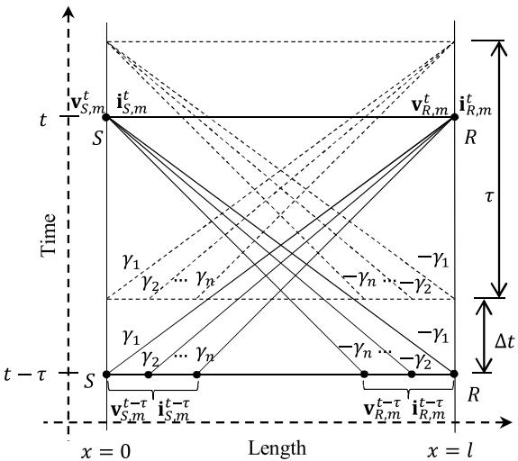  
Fig. 1. Modal voltages and currents.

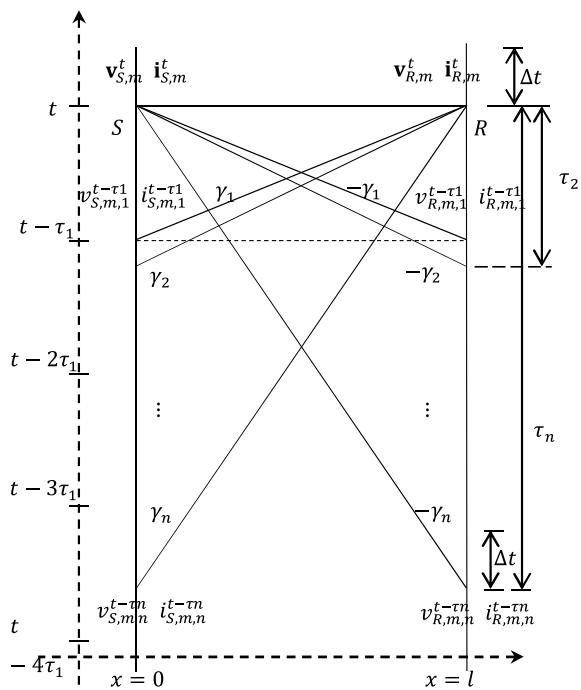  
Fig. 2. Modal voltages and currents without spatial interpolation.

spatial interpolation can be performed for slower modal waves. In this study, we also used a vector of time delays in (28) and totally avoided spatial interpolation:

$$
\begin{array}{l} \boldsymbol {\tau} ^ {- 1} \left(\mathbf {v} _ {R, m} ^ {t} - \mathbf {v} _ {S, m} ^ {t - \tau}\right) + \mathbf {Z} _ {w} \boldsymbol {\tau} ^ {- 1} \left(\mathbf {i} _ {R, m} ^ {t} - \mathbf {i} _ {S, m} ^ {t - \tau}\right) \\ + \boldsymbol {\Gamma} \mathbf {R} _ {m} \left(\frac {\mathbf {i} _ {R , m} ^ {t} + \mathbf {i} _ {S , m} ^ {t - \tau}}{2}\right) + \boldsymbol {\Gamma} \left(\frac {\boldsymbol {\Psi} _ {R , m} ^ {t} + \boldsymbol {\Psi} _ {S , m} ^ {t - \tau}}{2}\right) = 0 \tag {31} \\ \end{array}
$$

where - in bold character is a diagonal matrix containing all propagation delays. The terms at t − -, such as $\mathbf { v } _ { S , m } ^ { t - \tau }$ consist of different delays as illustrated in Fig. 2.

$$
\mathbf {v} _ {S, m} ^ {t - \tau} = \mathbf {v} _ {S, m, 1} ^ {t - \tau 1} \mathbf {v} _ {S, m, 2} ^ {t - \tau 2} \dots \mathbf {v} _ {S, m, n} ^ {t - \tau n} \tag {32}
$$

Based on the cases studied, spatial discretization has is not the main source of errors.

# 4.3. Interpolation in time

The implementation of the method in an EMT-type solver requires another approximation: interpolation in time for the evaluation of historical terms at t − . This is done since  is not necessarily an integer multiple of the time step of the simulation and the variables at t  are simply not available. In practical implementation, the time interpolation is done first to have voltages and currents at the ends of the transmission system, then the space interpolation is done for the slower modes.

# 4.4. Recursive convolution

The convolution product is hidden in the variable . This product is solved in a recursive way as explained next.

The procedure starts with the expression in frequency domain:

$$
\boldsymbol {\Psi} _ {m} (x, s) = \mathbf {T} _ {V} ^ {- 1} \sum_ {i = 1} ^ {N} \left(\frac {p _ {i} \mathbf {K} _ {i}}{s - p _ {i}}\right) \mathbf {T} _ {I} \mathbf {I} _ {m} (x, s) \tag {33}
$$

with the definition of

$$
\boldsymbol {\Psi} _ {m} (x, s) = \sum_ {i = 1} ^ {N} \boldsymbol {\psi} _ {i} (x, s) \tag {34}
$$

where

$$
\boldsymbol {\psi} _ {i} (x, s) = \frac {p _ {i}}{s - p _ {i}} \mathbf {T} _ {V} ^ {- 1} \mathbf {K} _ {i} \mathbf {T} _ {I} \mathbf {I} _ {m} (x, s) \tag {35}
$$

The equation is rearranged and then transformed into time domain:

$$
(s - p _ {i}) \boldsymbol {\psi} _ {i} (x, s) = p _ {i} \mathbf {T} _ {V} ^ {- 1} \mathbf {K} _ {i} \mathbf {T} _ {I} \mathbf {I} _ {m} (x, s) \tag {36}
$$

$$
\frac {d}{d t} \boldsymbol {\psi} _ {i} (x, t) - p _ {i} \boldsymbol {\psi} _ {i} (x, t) = p _ {i} \mathbf {T} _ {V} ^ {- 1} \mathbf {K} _ {i} \mathbf {T} _ {l} \mathbf {i} _ {m} (x, t) \tag {37}
$$

The differential equation can be numerically solved using the algorithms commonly employed in EMT-type programs such as Trapezoidal or Backward Euler. The Backward Euler solution is given below:

$$
\frac {\boldsymbol {\psi} _ {i} ^ {t} (x) - \boldsymbol {\psi} _ {i} ^ {t - \Delta t} (x)}{\Delta t} - p _ {i} \boldsymbol {\psi} _ {i} ^ {t} (x) = p _ {i} \mathbf {T} _ {V} ^ {- 1} \mathbf {K} _ {i} \mathbf {T} _ {l} \mathbf {i} _ {m} ^ {t} (x) \tag {38}
$$

with $\Delta t$ being the time step of EMTP.

Rearranging (38) gives

$$
\boldsymbol {\psi} _ {i} ^ {t} (x) = \frac {\boldsymbol {\psi} _ {i} ^ {t - \Delta t} (x)}{1 - \Delta t p _ {i}} + \frac {\Delta t p _ {i}}{1 - \Delta t p _ {i}} \mathbf {T} _ {V} ^ {- 1} \mathbf {K} _ {i} \mathbf {T} _ {I} \mathbf {i} _ {m} ^ {t} (x) \tag {39}
$$

Therefore

$$
\boldsymbol {\Psi} _ {m} (x, t) = \sum_ {i = 1} ^ {N} \frac {\boldsymbol {\psi} _ {i} ^ {t - \Delta t} (x)}{1 - \Delta t p _ {i}} + \mathbf {T} _ {V} ^ {- 1} \sum_ {i = 1} ^ {N} \left(\frac {\Delta t p _ {i} \mathbf {K} _ {i}}{1 - \Delta t p _ {i}}\right) \mathbf {T} _ {l} \mathbf {i} _ {m} ^ {t} (x) \tag {40}
$$

It is critical to notice that t contains variables of time t which are being updated. Consequently, t should be separated in two parts. To this end, the sum on the left part of (40) is abbreviated with $\varphi ^ { t }$ and the right one is included in $\mathbf { Z } _ { K }$ as defined in (44).

The Eq. (29) is rearranged in terms of time and location using the new variables:

$$
\mathbf {v} _ {R, m} ^ {t} - \mathbf {v} _ {S, m} ^ {t - \tau} + \mathbf {Z} _ {K} \mathbf {i} _ {R, m} ^ {t} - \mathbf {Z} _ {1} \mathbf {i} _ {S, m} ^ {t - \tau} + 0. 5 \boldsymbol {\ell} \left(\varphi_ {R, m} ^ {t} + \boldsymbol {\Psi} _ {S, m} ^ {t - \tau}\right) = \mathbf {0} \tag {41}
$$

The same steps are applied to (27) for waves moving from the receiving end to the sending end, the final equation is:

$$
\mathbf {v} _ {S, m} ^ {t} - \mathbf {v} _ {R, m} ^ {t - \tau} - \mathbf {Z} _ {K} \mathbf {i} _ {S, m} ^ {t} + \mathbf {Z} _ {1} \mathbf {i} _ {R, m} ^ {t - \tau} - 0. 5 \boldsymbol {\ell} \left(\varphi_ {S, m} ^ {t} + \boldsymbol {\Psi} _ {R, m} ^ {t - \tau}\right) = \mathbf {0} \tag {42}
$$

with

$$
\mathbf {Z} _ {1} = \mathbf {Z} _ {W} - 0. 5 \mathbf {I R} _ {m} \tag {43}
$$

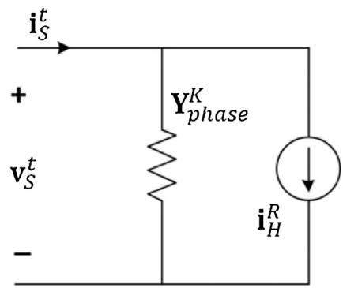

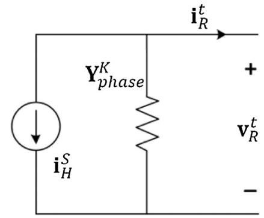  
Fig. 3. Norton model of a transmission line.

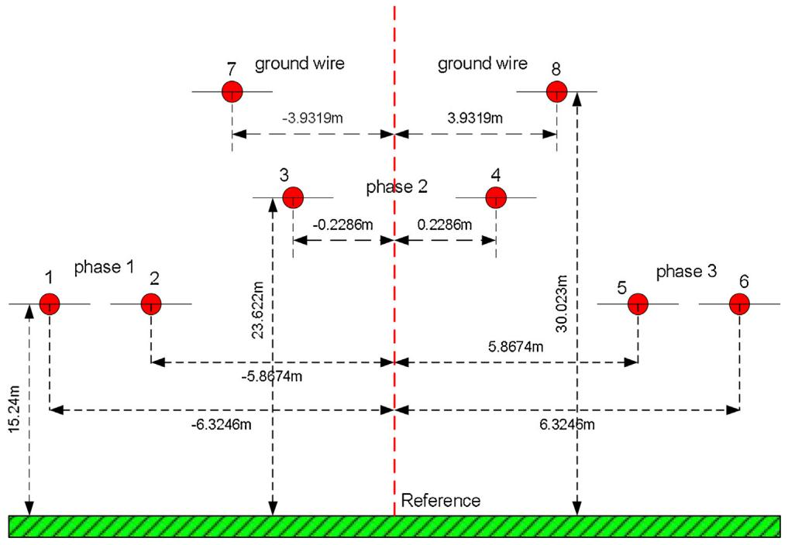  
Fig. 4. Transmission Line Case.

$$
\boldsymbol {Z} _ {K} = \boldsymbol {Z} _ {w} + 0. 5 \boldsymbol {l} \boldsymbol {R} _ {m} + 0. 5 \boldsymbol {l} \Delta t \boldsymbol {T} _ {V} ^ {- 1} \sum_ {i = 1} ^ {N} \left(\frac {p _ {i} \boldsymbol {K} _ {i}}{1 - \Delta t p _ {i}}\right) \boldsymbol {T} _ {I} \tag {44}
$$

$$
\boldsymbol {\varphi} _ {R, m} ^ {t} = \sum_ {i = 1} ^ {N} \left(\frac {\boldsymbol {\Psi} _ {R , i} ^ {t - \Delta t}}{1 - \Delta t p _ {i}}\right) \tag {45}
$$

$$
\boldsymbol {\varphi} _ {S, m} ^ {t} = \sum_ {i = 1} ^ {N} \left(\frac {\boldsymbol {\Psi} _ {S , i} ^ {t - \Delta t}}{1 - \Delta t p _ {i}}\right) \tag {46}
$$

It is now possible to isolate variables at time t and define historical terms as follows:

$$
\mathbf {v} _ {R, m} ^ {t} + \mathbf {Z} _ {K} \mathbf {i} _ {R, m} ^ {t} = \mathbf {v} _ {H, m} ^ {S} \tag {47}
$$

$$
\mathbf {v} _ {S, m} ^ {t} - \mathbf {Z} _ {K} \mathbf {i} _ {S, m} ^ {t} = \mathbf {v} _ {H, m} ^ {R} \tag {48}
$$

where

$$
\mathbf {v} _ {H, m} ^ {S} = \mathbf {v} _ {S, m} ^ {t - \tau} + \mathbf {Z} _ {1} \mathbf {i} _ {S, m} ^ {t - \tau} - 0. 5 l \left(\varphi_ {R, m} ^ {t} + \boldsymbol {\Psi} _ {S, m} ^ {t - \tau}\right) \tag {49}
$$

$$
\mathbf {v} _ {H, m} ^ {R} = \mathbf {v} _ {R, m} ^ {t - \tau} - \mathbf {Z} _ {1} \mathbf {i} _ {R, m} ^ {t - \tau} + 0. 5 l \left(\varphi_ {S, m} ^ {t} + \boldsymbol {\Psi} _ {R, m} ^ {t - \tau}\right) \tag {50}
$$

Finally, the system can be transformed back into phase domain:

$$
\mathbf {i} _ {S} ^ {t} = \mathbf {Y} _ {\text {p h a s e}} ^ {K} \mathbf {v} _ {S} ^ {t} + \mathbf {i} _ {H} ^ {R} \tag {51}
$$

$$
\mathbf {i} _ {R} ^ {t} = - \mathbf {Y} _ {\text {p h a s e}} ^ {K} \mathbf {v} _ {R} ^ {t} - \mathbf {i} _ {H} ^ {S} \tag {52}
$$

with

$$
\mathbf {i} _ {H} ^ {S} = - \mathbf {T} _ {I} \mathbf {Z} _ {K} ^ {- 1} \mathbf {v} _ {H, m} ^ {S} \tag {53}
$$

$$
\mathbf {i} _ {H} ^ {R} = - \mathbf {T} _ {I} \mathbf {Z} _ {K} ^ {- 1} \mathbf {v} _ {H, m} ^ {R} \tag {54}
$$

$$
\mathbf {Y} _ {\text {p h a s e}} ^ {K} = \mathbf {T} _ {I} \mathbf {Z} _ {K} ^ {- 1} \mathbf {T} _ {V} ^ {- 1} \tag {55}
$$

The Eqs. (51) and (52) provide the Norton equivalent of the line to be used in EMT-type solvers as shown in Fig. 3.

The convolution products and the historical terms need to be updated at each time step.

# 4.5. Application to cables

In the case of cables, the frequency dependence of shunt conductance is not negligible. Therefore, (3) needs to be replaced with a frequency dependent function:

$$
\mathbf {Y} (s) \cong \mathbf {G} _ {D C} + s \left(\mathbf {C} + \sum_ {i = 1} ^ {N _ {Y}} \frac {\mathbf {K} _ {Y , i}}{s - p _ {Y , i}}\right) \tag {56}
$$

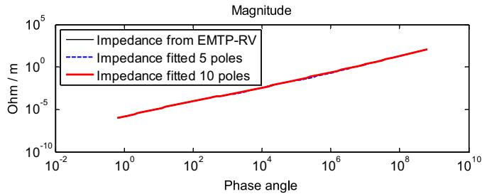  
Fig. 5. Fitting for element (2,1) of the series impedance.

with $N _ { Y }$ being the number of poles used for the fitting, $\mathbf { G } _ { D C }$ the DC conductance between the wires and the ground, C the constant capacitance matrix and ${ \bf K } _ { Y , i }$ the residue matrix associated to the pole $p _ { Y , i } .$ .

The Eq. (5) becomes:

$$
\frac {\partial \mathbf {i} (x , t)}{\partial x} + \mathbf {C} \frac {\partial \mathbf {v} (x , t)}{\partial t} + \mathbf {G} _ {h} \mathbf {v} (x, t) + \boldsymbol {\theta} (x, t) = \mathbf {0} \tag {57}
$$

with

$$
\mathbf {G} _ {h} = \mathbf {G} _ {D C} + \sum_ {i = 1} ^ {N _ {Y}} \mathbf {K} _ {Y, i} \tag {58}
$$

$$
\boldsymbol {\theta} (x, t) = \sum_ {i = 1} ^ {N _ {Y}} p _ {Y, i} \mathbf {K} _ {Y, i} [ e ^ {p _ {Y, i} t} * \mathbf {v} (x, t) ] \tag {59}
$$

The transformation in modal domain and the conversion of PDEs into ODEs are similar. Therefore, (26) and (27) become:

$$
\frac {d \mathbf {v} _ {m}}{d t} + \mathbf {Z} _ {w} \frac {d \mathbf {i} _ {m}}{d t} + \boldsymbol {\Gamma} \mathbf {R} _ {m} \mathbf {i} _ {m} + \boldsymbol {\Gamma} \boldsymbol {\Psi} _ {m} + \mathbf {Z} _ {w} \boldsymbol {\Gamma} \mathbf {G} _ {m} \mathbf {v} _ {m} + \mathbf {Z} _ {w} \boldsymbol {\Gamma} \boldsymbol {\theta} _ {m} = 0 \tag {60}
$$

$$
\frac {d \mathbf {v} _ {m}}{d t} - \mathbf {Z} _ {w} \frac {d \mathbf {i} _ {m}}{d t} - \boldsymbol {\Gamma} \mathbf {R} _ {m} \mathbf {i} _ {m} - \boldsymbol {\Gamma} \boldsymbol {\Psi} _ {m} + \mathbf {Z} _ {w} \boldsymbol {\Gamma} \mathbf {G} _ {m} \mathbf {v} _ {m} + \mathbf {Z} _ {w} \boldsymbol {\Gamma} \boldsymbol {\theta} _ {m} = 0 \tag {61}
$$

Due to the frequency dependence of shunt admittance, the advantage regarding the number of convolutions can no longer be claimed.

# 5. Simulation examples

# 5.1. Multiconductor case

Fig. 4 presents a transmission line case. The electrical parameters are obtained using the line constants routine in EMTP [17]. The results are compared with the WB model which is the implementation of ULM.

The length of the line is 300 km, and the ground return resistivity is 100 m. Each phase is a bundle of 2 wires having a diameter of 4.06908 cm and a DC resistance of 0.0324 /km (per wire). The sagging between towers is not considered.

The phases A, B and C are energized at 2, 6 and 12 ms respectively with a balanced AC source. A time step of 10 -s is used. The fitting of Z can be achieved with 10 poles as shown in Fig. 5.

Figs. 6–9 present the significant difference between waveforms obtained with EMTP-RV and with the MoC when the line is not divided. Eliminating the spatial discretization deteriorates the precision. If the line is divided into 20 lines of 15 km length each, the waveforms of MoC overlap with the waveforms of ULM as shown in the figures.

Many other line configurations have been tested and a similar pattern is observed, i.e. the results get more precise once the line is subdivided.

Note that the solution with MoC also depends heavily on the time step of simulation. The Fig. 9 shows the receiving end voltages

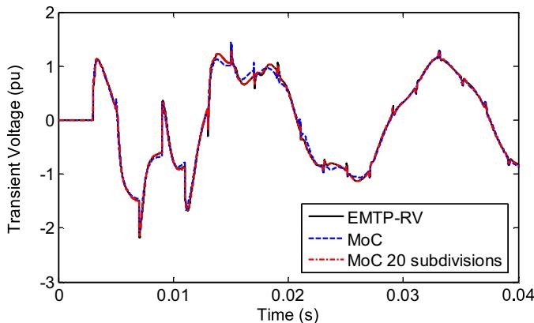

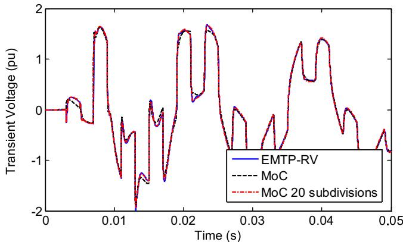  
Fig. 6. Voltage of receiving end phase A: comparison between MoC, MoC with 20 subdivisions and EMTP-RV.

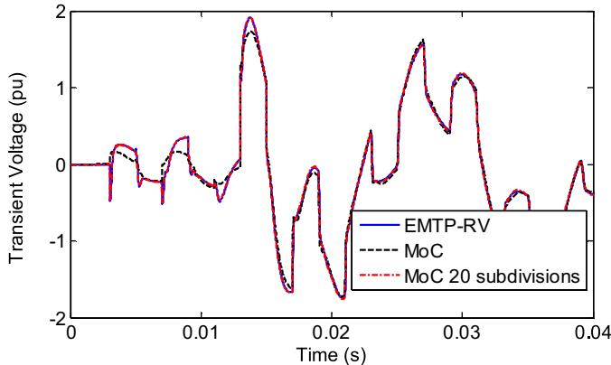  
Fig. 7. Voltage of receiving end phase B: comparison between MoC, MoC with 20 subdivisions and EMTP-RV.

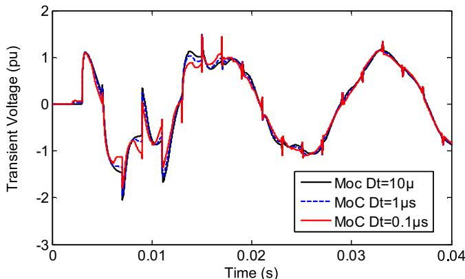  
Fig. 8. Voltage of receiving end phase C: comparison between MoC, MoC with 20 subdivision and EMTP-RV.   
Fig. 9. Voltage of receiving end phase A with the MoC with different time steps.

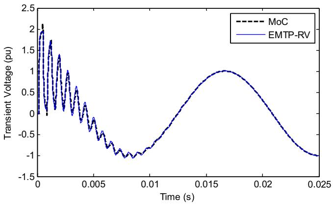  
Fig. 10. Transient voltage of receiving end phase: MoC versus EMTP-RV.

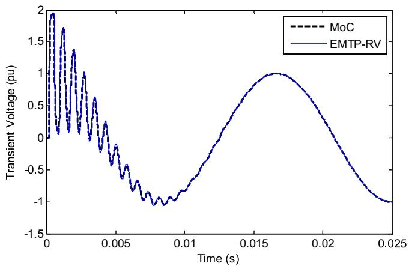  
Fig. 11. Transient voltage of receiving end phase: MoC with 10 subdivisions versus EMTP-RV.

obtained using three different time steps with MoC, 0.1, 1 and 10 -s. The solution closest to the ULM is obtained with 10 -s. Reducing the time step does not necessarily improve the results. However, if the line is subdivided, the results with different time steps start overlapping (not shown). Time step dependence is due to numerically unstable model. The ULM produces identical results for all the time steps above.

# 5.2. Single conductor case

A single-phase line is demonstrated next to simplify the numerical procedures by ruling out modal transformation. In this case, spatial interpolation is not needed either.

As in the previous case, the line conductor has a diameter of 4.06908 cm, a DC resistance of 0.0324 /km and a ground return resistivity of 100 m. The line is 50 km long and has one wire. The height of the line is 10 m from the ground, and the sagging between towers is not considered.

The wire is energized at time equal to zero with an AC source. The other terminal of the line is open-circuited. The simulation results of the voltages at the end of the line in Fig. 10 without subdivision and in Fig. 11 with 10 divisions reveal one more time that the precision depends on subdivision.

# 5.3. Cable case

Fig. 12 shows a three-phase cable system with 6 conductors. The cable data is given in Table 1.

The cable is energized with an AC source through phase A at time equal to zero and all the other phase ends are kept open. The sheath

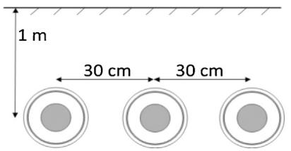  
Fig. 12. Three phase cable layout.

Table 1 Cable data for the system of Fig. 12.   

<table><tr><td>Inner radius of the core</td><td>0</td></tr><tr><td>Outer radius of the core</td><td>19.5 mm</td></tr><tr><td>Inner radius of the sheath</td><td>37.75 mm</td></tr><tr><td>Outer radius of the sheath</td><td>37.97 mm</td></tr><tr><td>Outer insulation radius</td><td>42.5 mm</td></tr><tr><td>Resistivity of the sheath</td><td>1.718e-8Ωm</td></tr><tr><td>Resistivity of the core</td><td>3.365e-8Ωm</td></tr><tr><td>Relative permeability</td><td>1</td></tr><tr><td>Insulator relative permeability</td><td>1</td></tr><tr><td>Core insulator relative permittivity</td><td>2.85</td></tr><tr><td>Shield insulator relative permittivity</td><td>2.51</td></tr><tr><td>Insulation loss factor</td><td>0.001</td></tr></table>

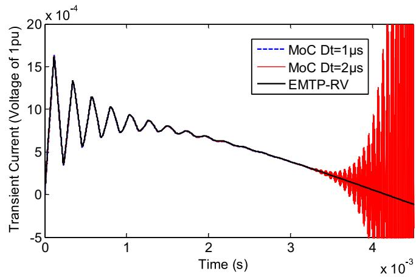  
Fig. 13. Current waveform of Phase A.

ends are all grounded. Here, only a single section of 10 km length is considered, which is sufficient to obtain sufficiently accurate results that match EMTP. The simulation results are very sensitive to the time step and can become easily unstable as shown in Fig. 13. If the time step is increased to 2 -s, the MoC becomes unstable. Due to the frequency dependence of shunt elements, the number of convolution operations doubles. This, in consequence, increases the numerical errors due to trapezoidal approximations.

# 6. Conclusion

The MoC typically requires spatial discretization in addition to discretization in time as opposed to traveling wave methods. The elimination of spatial discretization, however, is also proposed in the literature. In this paper, the possibility of eliminating spatial discretization is investigated, and the application both for the evaluation of line transients and cable transients is examined with theoretical clarifications and potential improvements. It is shown that, eliminating spatial discretization is very likely to generate numerically imprecise line and cable models. The fundamental source of numerical errors is identified as the approximation error arising from the linearization of differential equations over a large integration step in time. As clearly demonstrated in the paper with mathematical equations, the integration step should be taken as

equal to the modal delay corresponding to the fastest mode, which is an unusual practice in transient studies due to numerical accuracy concerns. As shown through case studies, the error can be minimized by subdividing the line as this decreases the modal delays hence the integration step. But subdividing a line increases the numerical burden. On the other hand, the resulting modeling approach can be useful for the visualisation of internal overvoltages or when the transmission line needs to be subdivided due to non-uniform structure or excitation.

# References

[1] A. Morched, B. Gustavsen, M. Tartibi, A universal model for accurate calculation of electromagnetic transients on overhead lines and underground cables, IEEE Trans. Power Deliv. 14 (July (3)) (1999) 1032–1038.   
[2] H.M.J. De Silva, A.M. Gole, J.E. Nordstrom, L.M. Wedepohl, Robust passivity enforcement scheme for time domain simulation of multi-conductor transmission lines and cables, IEEE Trans. Power Deliv. 25 (April (2)) (2010) 930–938.   
[3] I. Kocar, J. Mahseredjian, G. Olivier, Improvement of numerically stability for the computation of transients in lines and cables, IEEE Trans. Power Deliv. 25 (April (2)) (2010) 1104–1111.   
[4] B. Gustavsen, Avoiding numerical instabilities in the universal line model by a two-segment interpolation scheme, IEEE Trans. Power Deliv. 28 (July (3)) (2013) 1643–1651.   
[5] A. Semlyen, B. Gustavsen, Phase-domain transmission-line modeling with enforcement of symmetry via the propagated characteristic admittance matrix, IEEE Trans. Power Deliv. 27 (April (2)) (2012) 626–631.   
[6] O. Ramos-Leanos, J.L. Naredo, J. Mahseredjian, C. Dufour, J.A. Gutierrez-Robles, I. Kocar, A wideband line/cable model for real-time simulations of power system transients, IEEE Trans. Power Deliv. 27 (October (4)) (2012) 2211–2218.   
[7] J.R. Marti, Accurate modeling of frequency dependent transmission lines in electromagnetic transient simulations, IEEE Trans. Power Appar. Syst. PAS-101 (January (1)) (1982) 147–155.

[8] I. Kocar, J. Mahseredjian, Accurate frequency dependent cable model for electromagnetic transient studies, IEEE Trans. Power Deliv. 31 (June (3)) (2016) 1281–1288.   
[9] J.L. Naredo, P. Moreno, A.C. Soudack, J.R. Martí, Frequency independent representation of transmission lines for transient analysis through the method of characteristics, Athens, Greece, September 5–8, in: Proc. Athens Power Tech. Nat. Tech. Univ. Athens IEEE/Power Eng. Soc. Joint Int. Power Conf., vol. 1, 1993, pp. 28–32.   
[10] A. Ramirez, J.L. Naredo, L. Guardado, Electromagnetic transients in overhead lines considering frequency dependence and corona effect via the method of characteristics, Int. J. Electr. Power Energy Syst. 23 (August (3)) (2001) 179–188.   
[11] A. Ramírez, J.L. Naredo, P. Moreno, Full frequency-dependent line model for electromagnetic transient simulation including lumped and distributed sources, IEEE Trans. Power Deliv. 20 (January (1)) (2005) 292–299.   
[12] P. Moreno, A.R. Chavez, J.L. Naredo, A simplified model for nonuniform multiconductor transmissions lines using the method of characteristics, in: Proc. IEEE/PES General Meeting, Pittsburgh, 2008, pp. 1–5.   
[13] P. Moreno, A. Ambrosio, P. Gómez, The characteristics approach for modelling single phase transmission lines with frequency dependent electrical parameters, in: IEEE/PES T&D Conference and Exposition, Bogotá, Colombia, August, 2008, pp. 1–4.   
[14] C. Escamilla, P. Moreno, P. Gómez, New model for overhead lossy multiconductor transmission lines, IET Gener. Transm. Distrib. 7 (November (11)) (2013) 1185–1193.   
[15] B. Gustavsen, A. Semlyen, Rational approximation of frequency domain responses by vector fitting, IEEE Trans. Power Deliv. 15 (July (3)) (1999) 1052–1061.   
[17] J. Mahseredjian, S. Dennetière, L. Dubé, B. Khodabakhchian, L. Gérin-Lajoie, On a new approach for the simulation of transients in power systems, Electr. Power Syst. Res. 77 (September (11)) (2007) 1514–1520.