# Modelling of Single-Phase Nonuniform Transmission Lines in Electromagnetic Transient Simulations

H.V. Nguyen

H.W. Dommel

J.R. Marti

Student Member, IEEE

Fellow, IEEE

Member, IEEE

Department of Electrical Engineering The University of British Columbia Vancouver, Canada

# ABSTRACT

An exponential single-phase line model is introduced to represent nonuniform transmission lines. When the line parameters are assumed to vary exponentially, a set of two-port equations can be formed in the frequency domain, which contain frequency-dependent functions. These functions are then synthesized with rational functions of the minimum-phase-shift type. Utilizing a fast recursive convolution technique, the time-domain equations of the proposed model reduce to a form similar to those in Bergeron's method. Thus, the model is compatible with general electromagnetic transients programs such as the EMTP [1]. Time-domain simulations with the proposed model show good agreement with published experimental results, and with those produced by a cascade multi-section model, where the line is divided into many short sections of uniform transmission lines.

Key words: Exponential line, EMTP, time domain, frequency domain, synthesis, rational functions.

Notations: Uppercase represents frequency domain quantities, whereas lowercase indicates their time domain correspondents.

# 1. INTRODUCTION

Various methods for modelling nonuniform transmission lines have been proposed [2-6]. A major application of such models is the simulation of travelling waves up and down transmission line towers. The tapered line model of [4] for the representation of towers had shortcomings inasmuch as it was only a high frequency approximation. Another method in which nonuniform lines were modelled as cascaded exponential lines [5], produced accurate results, but the solution was obtained in the s domain. For general purpose time-domain programs such as the EMTP, it is

96 SM 459-8 PWRD. A paper recommended and approved by the IEEE Transmission and Distribution Committee of the IEEE Power Engineering Society for presentation at the 1996 IEEE/PES Summer Meeting, July 28 - August 1, 1996, Denver, Colorado. Manuscript submitted January 2, 1996; made available for printing April 23, 1996.

difficult to interface algorithms which work in the s domain. Therefore, a method based on finite-difference approximations of the wave propagation equations was recently proposed [6], which can be interfaced with the EMTP.

The line model described in this paper follows from the work started in [4], and uses the exponential variation assumption of [5]. With this model, the line functions are directly synthesized in the frequency domain. The nonuniformity of the line parameters can then be included in the time domain by means of recursive convolutions.

# 2. EXPONENTIAL TRANSMISSION LINE

# 2.1 Equations in the frequency domain

The basic equations of a nonuniform transmission line, expressed in the frequency domain, are

$$
- \frac {d V}{d x} = Z (x) I \tag {1a}
$$

$$
- \frac {d I}{d x} = Y (x) V \tag {1b}
$$

V and I are the voltage and current phasors, and $\mathbf{Z}(\mathbf{x})$ and $\mathrm{Y(x)}$ are the space-dependent per-unit-length series impedance and shunt admittance, respectively.

Following the procedure of [5], equation (1a) is differentiated again,

$$
- \frac {d ^ {2} V}{d x ^ {2}} = Z (x) \frac {d I}{d x} + \frac {d Z (x)}{d x} I \tag {2}
$$

Substituting (1a) and (1b) into (2) gives

$$
\frac {d ^ {2} V}{d x ^ {2}} = Z (x) Y (x) V + \left(\frac {d Z (x)}{d x} \frac {1}{Z (x)}\right) \frac {d V}{d x} \tag {3}
$$

For the exponential line shown in Figure 1, with losses ignored, $\mathbf{Z}(\mathbf{x})$ and $\mathbf{Y}(\mathbf{x})$ are

$$
Z (x) = j \omega L (x) = j \omega L _ {o} e ^ {q x} \tag {4a}
$$

$$
Y (x) = j \omega C (x) = j \omega C _ {o} e ^ {- q x} \tag {4b}
$$

where $\mathrm{L}(\mathbf{x})$ and $\mathrm{C(x)}$ are the per-unit-length inductance and capacitance, respectively; $\mathrm{L_o}$ and $\mathrm{C_o}$ are the values at $\mathbf{x} = 0$ . These parameters are related to the high-frequency approximation of the line characteristic impedance,

$$
Z _ {h i g h} (x) = \sqrt {\frac {Z (x)}{Y (x)}} = Z _ {o} e ^ {q x} \tag {5}
$$

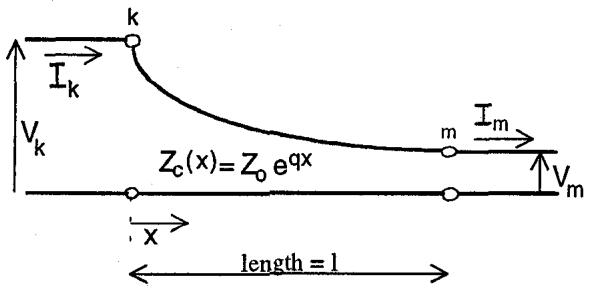  
Figure 1 - Single phase exponential line

where $Z_{o} = \sqrt{\frac{L_{o}}{C_{o}}}$

Substituting (4a) and (4b) into (3) gives

$$
\frac {d ^ {2} V}{d x ^ {2}} - q \frac {d V}{d x} - \frac {\omega^ {2}}{c ^ {2}} V = 0 \tag {6}
$$

where $c = \frac{1}{\sqrt{L_oC_o}}$ is the wave speed.

Equation (6) is a second-order differential equation with the roots

$$
\lambda_ {1} = \frac {q}{2} - \sqrt {\left(\frac {q}{2}\right) ^ {2} - \left(\frac {\omega}{c}\right) ^ {2}}; \quad \lambda_ {2} = \frac {q}{2} + \sqrt {\left(\frac {q}{2}\right) ^ {2} - \left(\frac {\omega}{c}\right) ^ {2}} \tag {7}
$$

Then,

$$
V (x) = C _ {1} e ^ {\lambda_ {1} x} + C _ {2} e ^ {\lambda_ {2} x} \tag {8}
$$

and from (1a),

$$
I (x) = - \frac {1}{Z (x)} \left[ \lambda_ {1} C _ {1} e ^ {\lambda_ {1} x} + \lambda_ {2} C _ {2} e ^ {\lambda_ {2} x} \right] \tag {9}
$$

The constants $\mathbf{C}_1$ and $\mathbf{C}_2$ depend on the boundary conditions. As shown in Appendix A, the voltages and currents at both ends can be related as

$$
\left[ V _ {k} + Z _ {c k} (\omega) I _ {k} \right] A = V _ {m} + Z _ {c m} (\omega) I _ {m} \tag {10}
$$

where $A = e^{\lambda_1 l}$ is the propagation function. $Z_{\mathrm{ck}}$ and $Z_{\mathrm{cm}}$ are the characteristic impedances at both ends of the line, which can be expressed as

$$
Z _ {c k} (\omega) = \frac {j \omega L _ {o}}{\lambda_ {2}} \quad a n d \quad Z _ {c m} (\omega) = \frac {j \omega L _ {o} e ^ {q l}}{\lambda_ {2}} \tag {11}
$$

By letting $\omega$ go to infinity in Eq. (7) and inserting the result $\lambda_{1} = \lambda_{2} = j\omega /c$ into Eq. (11), the characteristic impedances become the high-frequency approximation of Eq. (5). In [4], this high-frequency approximation was used.

# 2.2 Equations in the time domain

Reversing the current direction at node $\mathfrak{m}$ to make it flow into the line, $\mathbf{I}_{\mathfrak{m}\mathbf{k}} = -\mathbf{I}_{\mathfrak{m}}$ , equation (10) in the time domain becomes

$$
[ \nu_ {k} (t) + z _ {c k} (t) * i _ {k n} (t) ] * a (t) = \nu_ {m} (t) - z _ {c m} (t) * i _ {m k} (t) \tag {12}
$$

where the symbol $*$ denotes convolutions.

If the characteristic impedances $Z_{\mathrm{ck}}$ and $Z_{\mathrm{cm}}$ , together with the propagation function $A$ , are synthesized with rational

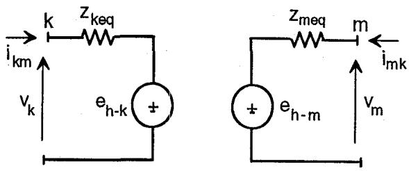  
Figure 2 - Equivalent circuit for the exponential line

functions, their corresponding expressions in the time domain will become simple sums of exponential functions. The function $\mathbf{a}(t)$ will also have a time delay, which approximately equals the time it takes for the fastest frequency component to travel along the line. Accordingly, the convolutions in equation (12) can be evaluated with a fast recursive algorithm [7]. Thus, the voltage at node $m$ can be expressed in a simpler form as

$$
v _ {m} (t) = z _ {m e q} i _ {m k} (t) + v _ {h R C _ {m}} (t) + v _ {h p r o _ {m}} (t) \tag {13}
$$

where $z_{meq}$ is a constant. The last two terms on the right-hand side are evaluated from the known values of previous time steps. The first term comes from the RC-network which approximates the characteristic impedance, and the second term comes from the propagation of conditions at the remote end $k$ . Combining these two terms into a single history voltage source $e_{h - m}(t)$ , equation (13) becomes

$$
v _ {m} (t) = z _ {m e q} i _ {m k} (t) + e _ {k - m} (t) \tag {14}
$$

The same procedure is used to evaluate the voltage at node $\mathbf{k}$ , but with the wave direction from node $\mathbf{m}$ to node $\mathbf{k}$ instead. Factor $\mathbf{q}$ has opposite sign now, and the roots in (7) must therefore be re-evaluated. The characteristic impedances and propagation function of the line are also recalculated, using these new roots. Carrying out the necessary steps, the voltage at node $\mathbf{k}$ can then be expressed in the same form as (14),

$$
v _ {k} (t) = z _ {k e q} i _ {k m} (t) + e _ {h - k} (t) \tag {15}
$$

Equations (14) and (15) are very similar to those in Bergeron's method [1]. They are compatible and can be easily interfaced with the EMTP, with the equivalent circuit of Figure 2.

# 3. SYNTHESIS OF EXPONENTIAL LINE FUNCTIONS

Recursive convolutions leading to equations (14) and (15) are possible only if the line characteristic impedances and propagation functions can be synthesized successfully. The synthesis results are discussed in this section. The line parameters are synthesized using rational functions of real negative poles and zeros. A $50\mathrm{m}$ long exponential line with high-frequcncy characteristic impedances $\mathbf{Z}_{\mathrm{highk}}$ and $\mathbf{Z}_{\mathrm{highm}}$ of 220 and $150\Omega$ at node k and node m, respectively, is used for demonstration purposes.

# 3.1 Travelling from node $k$ to node $m$

The factor $\mathbf{q}$ for the example is evaluated as

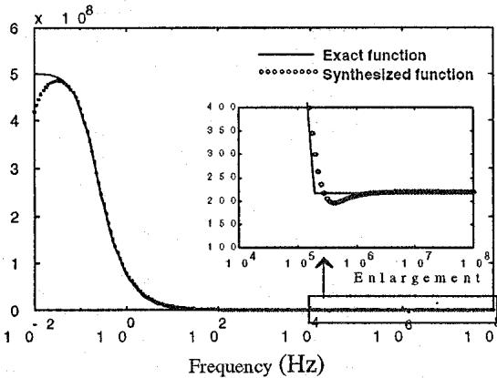  
Figure 3 - Magnitude of $Z_{\mathrm{ck}}$ in $\Omega$

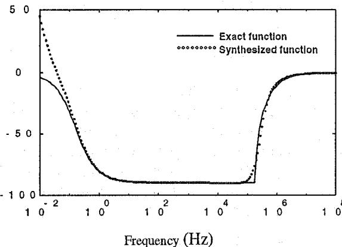

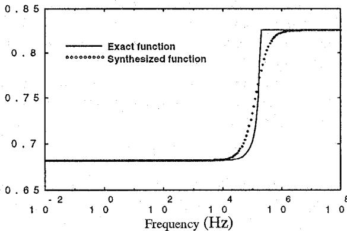  
Figure 4 - Phase of $Z_{ck}$ in degrees   
Figure 5 - Magnitude of A

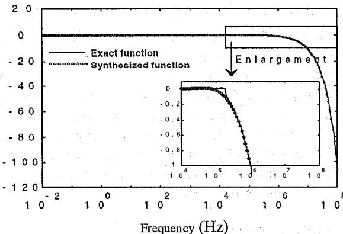  
Figure 6 - Phase of A in radians

$$
q = \frac {1}{l} \ln \frac {Z _ {\text {h i g h m}}}{Z _ {\text {h i g h k}}} = \frac {1}{5 0} \ln \frac {1 5 0}{2 2 0} = - 0. 0 0 7 6 6
$$

Figures 3 and 4 show the magnitude and phase angle of $Z_{\mathrm{ck}}(\omega)$ . Note that it is only necessary to calculate and synthesize $Z_{\mathrm{ck}}(\omega)$ because $Z_{\mathrm{cm}}(\omega)$ can be found by multiplying $Z_{\mathrm{ck}}(\omega)$ with $e^{ql}$ . Figures 5 and 6 show the magnitude and phase angle of the propagation function A. The fitting accuracy is quite reasonable in these figures, and the magnitude and phase of the synthesized functions trace those of the exact ones very closely. The fitting accuracy can be further checked by comparing the results directly in the time domain. Figure 7 shows the exact and synthesized propagation function a(t) obtained from taking the inverse Fourier transform of A(ω). The two curves are practically identical, which illustrates that the fitting a(t) is an excellent representation of the exact one.

The propagation function $\mathbf{a}(t)$ has a physical meaning [8]: If the line were to be energized with a voltage from node $k$ which has an amplitude of 1.0 at all frequencies, through an impedance matching the line characteristic surge impedance $Z_{\mathrm{ck}}(\omega)$ , and with node $m$ open, the voltage $V_m$ at the receiving end would be the propagation function $A(\omega)$ . This, in the time domain, is interpreted as applying an impulse voltage (infinite magnitude with an area of 1.0) at node $k$ through the characteristic impedance to the line, the voltage arriving at the open end of the line will then be the propagation function $a(t)$ .

# 3.2 Travelling from node $m$ to node $k$

As mentioned previously, when the wave travels in reverse direction, a different factor $\mathbf{q}$ must be used in the equations, which results in different characteristic impedances and propagation function. The prime symbol will be used to identify these functions, namely $Z_{cm}'$ , $Z_{ck}'$ and $A'$ . They are used in equation (15) to evaluate the voltage at node $\mathbf{k}$ . The factor $\mathbf{q}$ in this case is the negative value of what it was for the wave travelling from $\mathbf{k}$ to $\mathbf{m}$ , namely

$$
q = \frac {1}{l} \ln \frac {Z _ {h i g h k}}{Z _ {h i g h m}} = 0. 0 0 7 6 6
$$

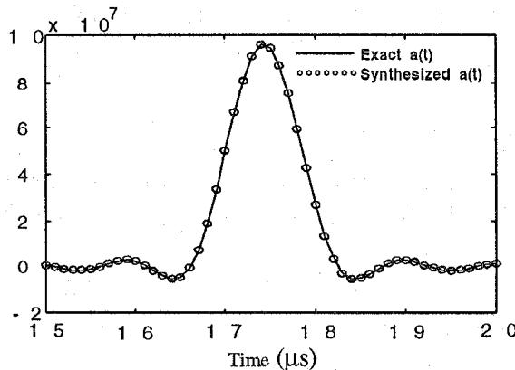  
Figure 7 - Propagation function a(t)

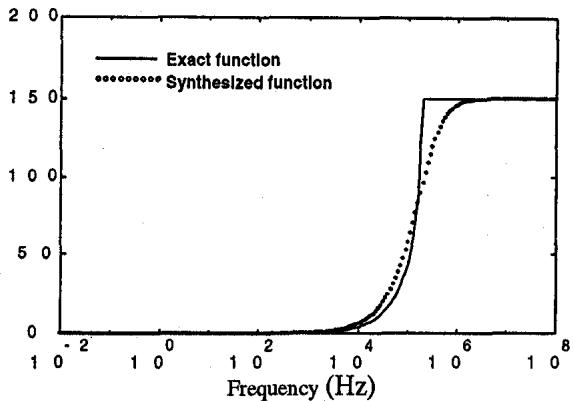

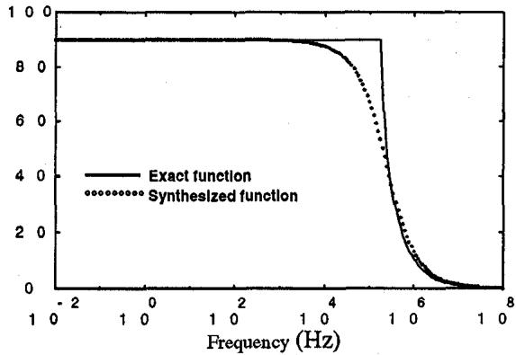  
Figure 8 - Magnitude (Ohms) of $\mathbf{Z}_{\mathrm{cm}}^{\prime}$   
Figure 9 - Phase (degrees) of $Z_{\mathrm{cm}}^{\prime}$

Figures 8 and 9 show the magnitude and phase angle of $Z_{cm}^{\prime}$ . The function $Z_{ck}^{\prime}$ is related to $Z_{cm}^{\prime}$ with a multiplication factor of $e^{ql}$ . On the other hand, $A^{\prime}$ can be evaluated directly from the propagation function found for the other direction,

$$
A ^ {\prime} = \frac {Z _ {h i g h k}}{Z _ {h i g h m}} A \tag {16}
$$

It can be seen that $A$ differs from $A$ only by a constant factor. Thus, once $A$ is synthesized, the approximate function for $A'$ is also known. The good agreement between the fitted and the exact $A$ functions applies to $A'$ as well.

# 4. REFLECTION FACTORS

To gain confidence in the proposed line model, it is useful to calculate its input reflection factor and compare it against previously published results. Equations (8) and (9) are the starting point for this comparison. The impedance looking into the line at any point $\mathbf{x}$ , $Z_{\mathrm{in}}(\mathbf{x})$ , can be computed by simply taking the voltage-to-current ratio from these two equations. Therefore, the impedance looking into node $\mathbf{k}$ is evaluated with $\mathbf{x} = 0$ as

$$
Z _ {i n} (0) = - Z _ {k} \left[ \frac {C _ {1} + C _ {2}}{\lambda_ {1} C _ {1} + \lambda_ {2} C _ {2}} \right]
$$

Letting the exponential line be terminated at node $m$ with a load impedance $Z_{L}$ , and using the appropriate constants from Appendix A, $Z_{in}(0)$ become

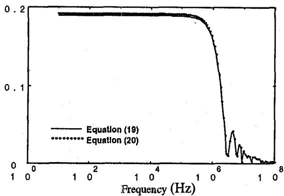  
Figure 10 - Magnitude of Reflection factor

$$
Z _ {i n} (0) = Z _ {k} \left[ \frac {D _ {1} e ^ {- \lambda_ {1} l} - D _ {2} e ^ {- \lambda_ {2} l}}{\lambda_ {2} D _ {2} e ^ {- \lambda_ {2} l} - \lambda_ {1} D _ {1} e ^ {- \lambda_ {1} l}} \right] \tag {17}
$$

where

$$
D _ {1} = \lambda_ {2} Z _ {L} + Z _ {m} \quad a n d \quad D _ {2} = \lambda_ {1} Z _ {L} + Z _ {m} \tag {18}
$$

Note that $Z_{\mathbf{k}}$ and $Z_{\mathbf{m}}$ are the per-unit-length series impedances evaluated at node $\mathbf{k}$ and node $\mathbf{m}$ , respectively.

When travelling waves enter node $\mathbf{k}$ , the reflection coefficient seen at this node is defined as

$$
\Gamma (\omega) = \frac {Z _ {i n} (0) - Z _ {o}}{Z _ {i n} (0) + Z _ {o}} \tag {19}
$$

with the assumption that a uniform line of characteristic impedance $Z_0$ is connected to the sending end at node $k$ .

In [9], the reflection coefficient is approximated as

$$
\Gamma^ {\prime} (\omega) = \frac {1}{2} \ln \left(\frac {Z _ {L}}{Z _ {o}}\right) \frac {\sin (\beta l)}{\beta l} e ^ {- j \beta l} \tag {20}
$$

where $\beta = \frac{\omega}{c}$

Equation (20) was derived from a first-order approximation for the reflection coefficient between two infinitesimally short sections. It is therefore approximate and not as accurate as equation (19). For the line considered in section 3, with load impedance $Z_{\mathrm{L}} = 150 \Omega$ , Figure 10 shows the magnitudes of the reflection coefficients from (19) and (20). Both methods produce close answers for the line under consideration. The differences become larger when the $Z_{\mathrm{high}} / Z_{\mathrm{highm}}$ ratio increases greater than 2.

# 5. EMTP SIMULATIONS AND FIELD TEST COMPARISON

# 5.1 Open/Short circuit tests

An exponential line can be approximated as a cascaded line model [9], where the line is divided into many sections of uniform transmission lines. Figures 11 and 12 show simulation results for open and short circuit tests. The exponential line, with parameters described in section 3, is energized with a 1 p.u. step voltage at node k. Three models are used for comparison purposes: 1) the new model, 2) a cascaded model consisting of 50 short uniform lines, and 3) an ideal uniform line having a uniform characteristic

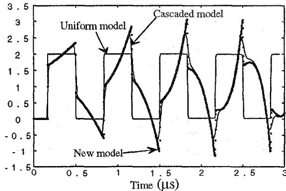

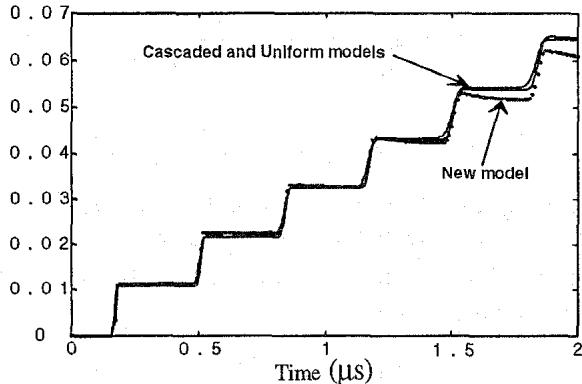  
Figure 11 - Receiving end open circuit voltage (p.u.)   
Figure 12 - Receiving end short circuit current (p.u.)

impedance equal to the average value (185 Ω). Note that the proposed new model agrees well with the cascaded model for the open circuit voltages. It clearly shows the tapered effect created by the continuous reflections along the line, in contrast to the square waves obtained from the uniform transmission line model. The voltage obtained from the new model has larger peaks compared to those produced by the cascaded model, because the latter model does not have enough short sections to represent these peaks. The short circuit currents agree more or less among the three models during the first 1.5 μs. The current from the new model then starts to deviate from the others because of the continuous reflections along the line.

# 5.2 Simulation of Ishii et al experiment

The proposed exponential line model is used to represent transmission towers in this section. Ishii et al performed low current measurements on $500\mathrm{kV}$ double-circuit towers [10]. The circuit parameters of the simulated case are similar to those described in [10], with the exception of the line model: the authors used the Semlyen frequency-dependent line model, while a constant-parameter line model is used here. The tower is modelled as 4 transmission line sections, three uniform and one exponential line, with the crossarms ignored. Capacitances of the insulator strings and stray capacitances from the phase conductors to the tower are also modelled. The simulated waveforms of the three crossarm insulator voltages (potential difference between crossarm and phase conductor) are shown in Figure 13. A time delay of approximately $1\mu s$ is seen in

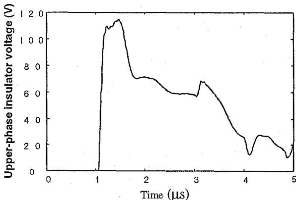

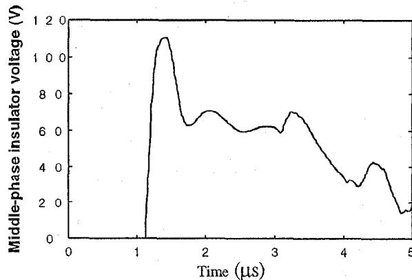

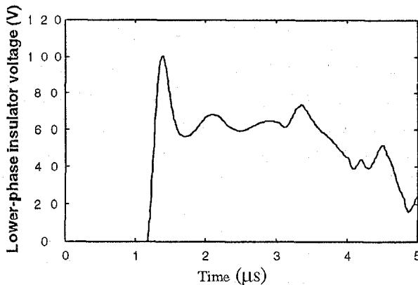  
Figure 13 - Simulation of Ishii et al experiment

these voltages because a $300\mathrm{m}$ cable was connected between the current source and the tower top in the simulations. The voltages are very close compared to the measurements shown in Figure 7 of [10].

# 6. CONCLUSIONS

An exponential tapered line model has been described. It is compatible and can be interfaced with time-domain programs such as the EMTP. Time-domain simulations with the proposed model show good agreement with those produced by a cascaded model, where the line is divided into many uniform transmission line sections. Comparisons with experimental results from the literature also show good agreement. The model is primarily intended for the representation of transmission line towers in lightning surge simulations. It can also be used to model general nonuniform lines with complicated space-dependent characteristic impedances, as described in [5].

# 7. ACKNOWLEDGEMENTS

The financial assistance of the Natural Sciences and Engineering Research Council of Canada through a grant to H.W. Dommel, and the assistance through fellowships awarded by the University of British Columbia to the first author are gratefully acknowledged.

# 8. REFERENCES

[1] H.W. Dommel, "Digital Computer Solution of Electromagnetic Transients in Single-and Multiphase Networks," IEEE Trans. on Power Apparatus and Systems, Vol. PAS-88, No. 4, pp. 388-399, 1969.   
[2] C. Menemenlis and Z.T. Chun, "Wave Propagation on Nonuniform Lines," IEEE Trans. on Power Apparatus and Systems, Vol. PAS-101, No. 4, pp. 833-839, 1982.   
[3] M.M. Saied, A.S. Alfuhaid, M.E. ElShandwily, "S-Domain Analysis of Electromagnetic Transients on Nonuniform Lines," IEEE Trans. on Power Delivery, Vol. 5, No. 4, pp. 2072-2083, November 1990.   
[4] H.V. Nguyen, H.W. Dommel, J.R. Marti, "Tower Models for Lightning Surge Simulations," IEEE Paper No. 045-5 PwRD, Winter Power Meeting, New York, New York, Feb. 1994.   
[5] E.A. Oufi, A.S. Alfuhaid, M.M. Saied, "Transient Analysis of Lossless Single-Phase Nonuniform Transmission Lines," IEEE Trans. on Power Delivery, Vol. 9, No. 3, pp. 1694-1701, July 1994.   
[6] M.T. Correia de Barros, M.E. Almeida, "Computation of Electromagnetic Transients on Nonuniform Transmission Lines," IEEE Paper No. 397-0 PWRD, Summer Power Meeting, Portland, Oregon, July 1995.   
[7] J.R. Marti, "Accurate Modelling of Frequency-Dependent Transmission Lines in Electromagnetic Transient Simulations," IEEE Trans. on Power Apparatus and Systems, Vol. PAS-101, pp. 147-157, 1982.   
[8] H.W. Dommel, EMTP THEORY BOOK, 2nd edn., Microtran Power System Analysis Corporation, Vancouver, B.C., Canada, pp. 4-94 to 4-96, 1992.   
[9] R.S. Elliott, An Introduction to Guided Waves and Microwave Circuits. Prentice-Hall, Inc., pp. 231-245, 1993.   
[10]M. Ishii et al., "Multistory Transmission Tower for Lightning Surge Analysis," IEEE Trans. on Power Delivery, Vol. 6, No. 3, pp. 1327-1335, 1991.

# Appendix A - Derivation of equation (10)

Evaluating equations (8) and (9) at node $\mathfrak{m}$ ,

$$
V _ {m} = C _ {1} e ^ {\lambda_ {1} l} + C _ {2} e ^ {\lambda_ {2} l} \tag {A1}
$$

$$
I _ {m} = - \frac {1}{Z _ {m}} \left[ \lambda_ {1} C _ {1} e ^ {\lambda_ {1} l} + \lambda_ {2} C _ {2} e ^ {\lambda_ {2} l} \right] \tag {A2}
$$

where $Z_{m} = j\omega L_{o}e^{qx}$

From (A1),

$$
C _ {1} = \left[ V _ {m} - C _ {2} e ^ {\lambda_ {2} l} \right] e ^ {- \lambda_ {1} l} \tag {A3}
$$

Substituting (A3) into (A2) and collecting terms,

$$
C _ {2} = \left[ \frac {\lambda_ {1} V _ {m} + Z _ {m} I _ {m}}{\lambda_ {1} - \lambda_ {2}} \right] e ^ {- \lambda_ {2} l} \tag {A4}
$$

Then $C_1$ is obtained from (A3),

$$
C _ {1} = \left\lceil \frac {\lambda_ {2} V _ {m} + Z _ {m} I _ {m}}{\lambda_ {2} - \lambda_ {1}} \right\rceil e ^ {- \lambda_ {1} l} \tag {A5}
$$

Evaluating currents and voltages from equations (8) and (9) at node $\mathbf{k}$ leads to

$$
V _ {k} = C _ {1} + C _ {2} \tag {A6}
$$

$$
I _ {k} = - \frac {1}{Z _ {k}} \left[ \lambda_ {1} C _ {1} + \lambda_ {2} C _ {2} \right] \tag {A7}
$$

where $Z_{k} = j\omega L_{o}$

Multiplying (A7) with $\frac{Z_k}{\lambda_2}$ and adding to (A6) produces

$$
V _ {k} + \frac {Z _ {k}}{\lambda_ {2}} I _ {k} = \left[ 1 - \frac {\lambda_ {1}}{\lambda_ {2}} I _ {m} \right] C _ {1} \tag {A8}
$$

Replacing $\mathbf{C}_1$ from (A5) in (A8) leads to

$$
V _ {k} + \frac {Z _ {k}}{\lambda_ {2}} I _ {k} = \left[ V _ {m} + \frac {Z _ {m}}{\lambda_ {2}} I _ {m} \right] e ^ {- \lambda_ {1} l}
$$

Or,

$$
\left[ V _ {k} + Z _ {c k} (\omega) I _ {k} \right] e ^ {\lambda_ {1} l} = V _ {m} + Z _ {c m} (\omega) I _ {m} \tag {A9}
$$

# Biographies

Huyen V. Nguyen (StdM'92) was born in Saigon, Vietnam in 1964. He received the B.S.E.E. and M.E.E.P.E. degrees from Gannon University, Erie PA, and Rensselaer Polytechnic Institute, Troy NY, in 1987 and 1988, respectively. From 1989 to 1992 he was with the American Electric Power Service Corporation, Columbus OH, where he performed power system transients analyses of actual field recording waveforms and EMTP simulations. He is currently a Ph.D. candidate at the Department of Electrical Engineering of the University of British Columbia, Vancouver, Canada.

Hermann W. Dommel (F 79) was born in Germany in 1933. He received the Dipl.-Ing and Dr.-Ing. degrees in electrical engineering from the Technical University, Munich, Germany in 1959 and 1962, respectively. From 1959 to 1966 he was with the Technical University Munich, and from 1966 to 1973 with Bonneville Power Administration, Portland, Oregon. Since July 1973 he has been with the University of British Columbia in Vancouver, Canada. Dr. Dommel is a Fellow of IEEE and a registered professional engineer in British Columbia, Canada.

Jose R. Martí. (M' 71) was born in Lérida, Spain in 1948. He received the degree of Electrical Engineer from Central University of Venezuela in 1971, the degree of M.E.E.P.E from Rensselaer Polytechnic Institute in 1974 and the Ph. D degree from the University of British Columbia in 1981. He was with Central University of Venezuela in 1974-77 and 1981-84. Since 1988 he has been with the University of British Columbia in Vancouver, Canada. Dr. Martí is a registered professional engineer in Venezuela and in British Columbia, Canada.