# Equivalent grid-following inverter-based generator model for ATP/ATPDraw simulations✩

M.B. Luchini a,∗, O.E. Batista a, F.V. Lopes b, R.L.A. Reis b, B.A. Souza

a Department of Electrical Engineering, Federal University of Espírito Santo, Vitória, ES, Brazil   
b Department of Electrical Engineering, Federal University of Paraiba, João Pessoa, PB, Brazil   
c Department of Electrical Engineering, Federal University of Campina Grande, Campina Grande, PB, Brazil

# A R T I C L E I N F O

Keywords:

ATP

EMTP

Electromagnetic transients

Grid faults

IBR

Time-domain modeling

# A B S T R A C T

This paper presents an equivalent time-domain grid-following inverter-based generator model, which can be used in Electromagnetic Transients Programs (EMTP). It is developed in the Alternative Transients Program (ATP) using the ATPDraw graphical interface. A complete benchmark photovoltaic model available in ATP/ATPDraw environment is taken as reference to evaluate the proposed model under steady-state and fault scenarios. The obtained results showed that the proposed model is simpler and less time-consuming than the complete model, being capable of easily consider the implementation of different components/controls of Inverter-Based Resources (IBR) in EMTP. The settings used in the implemented control schemes proved to be effective, resulting in an average error of about 2.33% during fault conditions. Also, a reduction of about 70 % in the execution time was achieved when compared to the analyzed benchmark one, attesting its usefulness for power system studies with high presence of grid-following IBRs.

# 1. Introduction

Electrical power networks have experienced several changes due to the insertion of new generation technologies, among which both concentrated and distributed renewable resources such as wind and photovoltaic power plants stand out [1]. Some of these generations have been widely referenced to as Inverter-Based Resources (IBRs), since their interface with the grid is based on inverters. As a result, the IBR dynamic during faults or even during some normal operation conditions does not follow the well-known behavior of synchronous generators, posing difficulties on system protection and control applications [2].

Historically, most power flow and short-circuit simulation tools have been developed for steady-state evaluations in phasor-domain. Although these models allow the representation of most important features of traditional synchronous power systems, limitations have been found to emulate the dynamic behavior of IBRs [3], especially when faults or any other disturbances take place. Hence, detailed full models have been proposed for time-domain simulations, leading EMTP to gain importance in the context of IBR studies. However, as reported in [4,5], although full time-domain IBR models are realistic, they emulate switching components and their respective control schemes,

resulting in complex and time/computational-consuming simulations. It has motivated developments in power system modeling area to obtain simplified, but representative IBR models.

The equivalent IBR models available in the literature are often phasor-based and consider only steady-state response [4,6,7]. This limits pre-operational and operational time-domain studies, since possible impacts of IBRs are not adequately emulated during transient events. Dynamic models can be found in the literature. However, they often disregard faulty conditions [8] or do not make comparisons in EMTP platforms for a better parameter adjustment, as reported in [9]. Moreover, the mentioned models are developed in computational programs which require paid licenses, and their implementation details are not fully provided, leading potential model users to face difficulties in reproducing the IBR models and their results. Also, the lack of information about the implementation and of explanations about ways to adapt the models to different scenarios is another limiting factor, especially when one desires to test different control strategies. In addition, most works do not even mention concerns about the computational burden of the simulations, which is becoming an important aspect as the penetration of IBRs in existing systems increase.

Considering the above-mentioned context, this paper proposes an equivalent grid-following IBR model for EMTP, which is developed in ATP/ATPDraw environment. The model is able to represent the dynamic of IBRs during steady-state and under balanced and unbalanced fault conditions, allowing the representation of different power injection dynamics. A straightforward implementation in ATP/ATPDraw (which can be expanded for other EMTP) with computational burden lower than those of full EMTP IBR models is achieved. The proposed model software implementation is detailed, providing to experienced and beginning ATP/ATPDraw users a reference guide to simulate equivalent IBR models. For validation purposes, a benchmark grid-following photovoltaic power plant model available in ATP/ATPDraw is taken as reference. The obtained results show that the proposed model properly represents the IBR operation, revealing that the implementation methodology facilitate the adoption of different control strategies or model components.

# 2. Review on IBR models

Full time-domain IBR models can be already found in EMTP. However, as mentioned earlier, they require complex and time-consuming simulations [5]. Hence, simplified IBR average models have been also reported, but most of them cannot emulate the IBR response under fault conditions [3]. Generally, full time-domain IBR models include the source (often photovoltaic or wind generators, with maximum power point tracking), power converters (PC) with their associated controls, and AC filters at the connection point to the grid. As this type of model simulates the system at the switching level [10], very small time steps are required in EMTP, resulting in high simulation times [11].

Several works have also proposed the simplification of IBR models by considering only its steady-state phasor response over the time. In [4], for instance, accurate IBR phasor-domain simulations are presented. A three-phase steady-state model of a three-wire currentcontrolled voltage-source converter-interfaced distributed generator is reported in [6]. In addition, [7] presents a simplified IBR model, aiming to evaluate the impact of transmission network faults on its steadystate response. In these papers, the Matlab/Simulink platform is used to analyze steady-state phasor responses over the time. However, in some of these papers, implementation details are not completely described or computational burden aspects are not addressed. Moreover, steady-state phasor-based models limit pre-operational and operational studies, since they are insufficient to completely emulate the impacts of IBRs into the grid, especially under fault conditions when fault ride-through and transient stability aspects must be represented.

Intermediate dynamic models can be found in the literature as well. In [9], a positive sequence converter model is developed. It allows the use of longer time steps, reducing the computational efforts required in large-scale simulations. The proposed model is compared with an average model developed in a point on wave simulation program, called PLECS, and with a boundary current representation converter model. Although a satisfactory result is observed, no significant reduction in the execution time were obtained and implementation details are not provided. Also, a comparison with EMTP simulations in order to obtain a better parameter adjustment is not carried out, being suggested for future works.

In [8], a simplified phasor-domain Matlab/Simulink model is developed, whose computational burden is lower than those of full models. To do so, the dc-side is represented by a Norton equivalent. The power balance is then used to obtain the behavior of the ac-side, such that the grid injected current synthesized is based on: power, power factor and grid voltage. However, in [8], the goal is to demonstrate the impacts of the high insertion of distributed generators in distribution networks. Furthermore, the scope of such a reference neither include faulty conditions nor the analysis of voltages, currents, grid injected power over the time, i.e., it does not meet the expectations for transient studies via EMTP. Also, as most references, detailed guidelines about the software IBR modeling are not provided, which is critical for EMTP users.

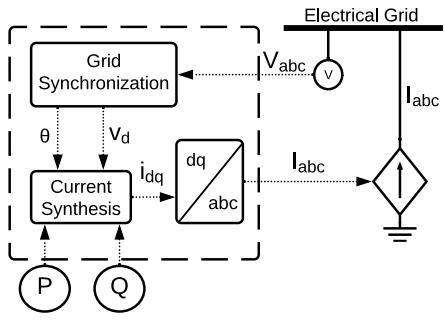  
Fig. 1. Block diagram of the proposed model.

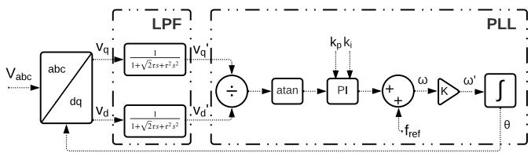  
Fig. 2. Block diagram of the LPF and PLL.

# 3. Fundamentals of IBR modeling

In this work, a time-domain equivalent IBR model (EIBR) is developed for EMTP. It is capable of representing grid-following technologies in a simplified way, overcoming computational issues usually verified in full IBR models. The ATP/ATPDraw platform is chosen to implement the proposed EIBR model, especially because it is a friendly and freelicense software, widely used worldwide. The main goal is to obtain an EIBR model that can represent different IBRs (like photovoltaic, wind power and storage resources), being easily adapted to emulate IBR control schemes, such as fault ride-through strategies and associated grid codes. The proposed EIBR model is implemented considering the grid-following power converters described in [12], being the model overview shown in Fig. 1.

As a typical grid-following technology, the proposed EIBR model takes the grid voltages $V _ { a b c }$ as reference to synthesize output currents $I _ { a b c }$ . It allows the model to deliver user-defined active power ?? and reactive power ?? levels (see Fig. 1). During normal operation, grid quantities are well-defined, so that $I _ { a b c }$ can be synthesized in a stable way. If power flow conditions change abruptly, the IBR generates outputs accordingly to its control schemes, such that dynamic behaviors must be considered. In a more critical scenario, during faults, for instance, grid voltages significantly change, so that the IBR fault ride-through strategies are activated. The transition period between pre-fault and fault steady-state may lead the IBR outputs to present control actions that can affect several system monitoring algorithms (for instance, protection elements). Therefore, emulating the IBR dynamic is of paramount importance to properly represent the behavior of IBR output power, voltages and currents.

As grid-following IBRs require grid synchronization, a Phase-Locked Loop (PLL) is used in the proposed EIBR model. Also, as the EIBR current synthesis utilizes the grid voltages as reference, to obtain $I _ { a b c }$ waveforms as clean as possible, it is necessary to attenuate harmonics in the measurements taken from the grid. The PLLs used in the model are implemented in the Grid Synchronization (GS) block shown in Fig. 1, being two different solutions used in this work. In the first one, a lowpass filter (LPF) and a conventional PLL is used (Fig. 2), as considered in the model taken as reference. As it can be seen, the required reference frame transforms are also represented in the GS block.

To demonstrate the EIBR model implementation with different components, the DSOGI-PLL approach proposed in [13] is also applied, which is described in Fig. 3. It provides simplicity and good response

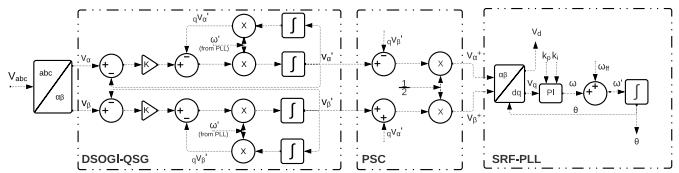  
Fig. 3. Block diagram of the DSOGI-PLL.

against distorted grid reference signals, resulting in a reliable frequency reference to the current synthesis process, as well as to the frequencyadaptive positive-sequence detector, which is explained later on in this section. The parameters of the PI controller in the SRF-PLL are defined according to [14], with minor adjustments, being $k _ { p } = 0 . 8$ and $k _ { i } =$ 61.69, where $k _ { p }$ and ???? are the gains of the proportional and integrator controllers, respectively.

The filtering task is, in this case, accomplished by extracting the positive sequence fundamental component from grid voltages $V _ { a b c }$ by using instantaneous symmetrical components, as reported in [15]. Considering that this work proposes the analysis of the grid behavior under fault conditions, frequency variations are expected to take place. Therefore, adaptations in the positive-sequence calculator (PSC) were required.

The main adaptation in PSC regards the need to make it frequencyadaptative. To do so, the DSOGI-based quadrature signals generator (DSOGI-QSG) proposed in [16] is applied, being combined with the SRF-PLL. The DSOGI-QSG is capable to provide a filtered version of voltages in the ???? reference frame, which are then used as inputs in the PSC function, which is in turn responsible to extract the positive sequence component from grid voltages. Implementation details of the solutions in ATP/ATPDraw are addressed in the next sections.

The last component of the model is the block responsible for synthesizing the EIBR output currents. From the instantaneous power theory, ?? (active power) and ?? (reactive power) can be obtained in ???? synchronous reference frame as [17]:

$$
P = \frac {3}{2} \left(v _ {d} i _ {d} + v _ {q} i _ {q}\right), \tag {1}
$$

$$
Q = \frac {3}{2} \left(v _ {q} i _ {d} - v _ {d} i _ {q}\right). \tag {2}
$$

Taking $v _ { q } = 0$ as reference and rearranging (1) and (2), one can obtain $i _ { d }$ and $i _ { q }$ currents on the ???? reference frame as functions of $P ,$ ?? and voltage $v _ { d }$ (in turn obtained from grid voltages), one obtains:

$$
i _ {d} = \frac {2 P}{3 v _ {d}}, \tag {3}
$$

$$
i _ {q} = - \frac {2 Q}{3 v _ {d}}. \tag {4}
$$

Performing a ???? to ?????? transform, $I _ { a b c }$ currents are synthesized. Since they are synchronized with the grid, they can be directly injected into the interconnected power network. Here, the inverter switching components are intentionally not represented, without loss of representativeness from the grid side. Thus, $I _ { a b c }$ can be directly controlled by means of different control schemes, since they usually act on DQ frame quantities (for instance $i _ { d }$ and $i _ { q } \ : \mathrm { o r } \ : v _ { d }$ and $v _ { q } ) _ { : }$ , which are explicit variables in the proposed EIBR model.

# 4. Implementation of the proposed EIBR model

ATPDraw is the graphical interface of ATP. It cannot run simulations itself. However, it is useful to create functional blocks from which an ATP card is build, which is compiled to run the system simulation. ATPDraw has a vast library of promptly available model templates, including programming modules via MODELS language and Transient Analysis of Control Systems (TACS) elements. Thus, aiming to facilitate the proposed EIBR model implementation, the ATPDraw environment

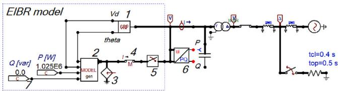  
Fig. 4. Proposed EIBR model.

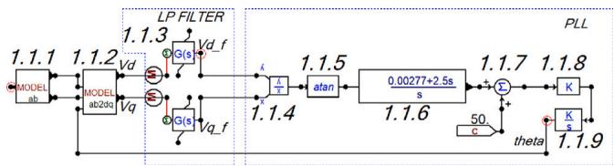  
Fig. 5. LPF-PLL implementation.

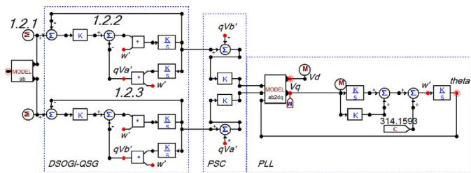  
Fig. 6. DSOGI-PLL implementation.

is used, such that this section explains the applied functional blocks. By doing so, we cover a relevant gap in the literature. Indeed, as stated in Sections 1 and 2, it is intended to guarantee the complete description of the proposed EIBR model, allowing readers to straightforwardly reproduce it, using this work as a reference guide for the ATPDraw EIBR implementation. Such a detailed description facilitates the proposed model simulation with different components and control strategies, which can be adapted, as desired by the model user, given that control variables are internally available.

A general view of the proposed EIBR model is shown in Fig. 4. Main functional blocks are numbered to facilitate the identification in the ATP/ATPDraw libraries. Details on the interconnected power grid will be presented later.

# 4.1. GroupDef block (No. 1)

The block identified with number 1 in Fig. 4 is a GroupDef, which consists in an ATPDraw tool capable of representing an entire subcircuit in a single block. In this work, two different grid synchronization solutions are implemented in this block, which are depicted in Figs. 2 and 3, being their respective ATPDraw implementations presented in Figs. 5 and $^ { 6 , }$ respectively. In the next subsection, fundamental blocks will be presented before the detailed explanation of the circuits shown in Figs. 5 and 6.

# 4.2. Fundamental blocks (No. 1.2.1, 1.2.2, 1.2.3, 1.1.4, 1.1.6, 1.1.7, 1.1.8, 4, 5, 6 and 7)

Some blocks are used in many parts of the model in order to perform basic functions, such as mathematical operations. Blocks 1.2.2, 1.1.8, 1.2.3, 1.1.7 and 1.1.4 in Figs. 5 and 6 are TACS elements and they implement, respectively, subtraction of two input signals, multiplication by a factor of ??, multiplication of two input signals, addition of two input signals and division of two input signals. They require no prior configuration, with the exception of block 1.1.8, in which

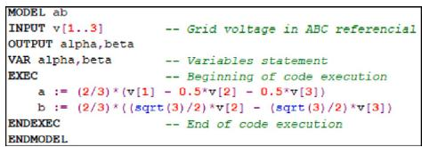  
Fig. 7. MODELS code of block 1.1.1.

the ?? factor must be set. These elements can be found in TACS » Fortran statements » Math tab. In addition, the block 1.2.1 is used to convert MODELS output variables to TACS class, allowing the interaction between MODELS and TACS blocks.

Block 7 is a TACS constant (TACS » Sources » Constant). It can be used as input in both TACS and MODELS elements. Block 4 is a measurement key available on the Switches » Measuring tab. It allows the ATP to recognize the current measurement point used in block 6. Thus, if power monitor block 6 is not used, block 4 becomes optional. It should be noticed that the positive relative current reference is taken in the direction from the IBR to the grid. Hence, block 6 calculates active (?? ) and reactive (??) power values with positive and negative polarities if the EIBR model is supplying or absorbing power, respectively.

Still regarding block 6, it is worth mentioning that it is a native MODELS block, which is available in the Power System Tools » PQ » PQ 3-phase tab. Since it is native block, its code is available in ATPDraw, such that it is not detailed here due to space limitations. Still, it is important to explain that this block requires the following settings: nominal frequency FREQ, sampling frequency SampleFreq, as well as voltage scale ScaleV, current scale ScaleI and phasor estimation method selection via algorithm flag (being, 0: FFT radix2- 8, 1: DFT recursive or 2: alpha-beta transformation). In this work, nominal frequency and sampling rate are set as 50 Hz and 400 Hz (eight samples per cycle). Also, both $\mathtt { S c a l e V } = \mathtt { S c a l e I } = 1$ and Algorithm = 0 are used. It should be mentioned that, for any other MODELS block, the type of considered inputs must be configured (here, one is voltage input and the another is current input).

Finally, at the source output, the use of a three-phase circuit breaker is suggested, as the one represented in block 5. Such element is optional, being suggested only to facilitate eventual disconnections from the grid during simulations. By using it, the need for circuit manual repositioning is avoided in cases of EIBR removal. This circuit breaker can be found in the Switches tab » Switch time 3-ph.

# 4.3. Transforms blocks (No. 1.1.1 and 1.1.2)

As demonstrated in Figs. 2 and 3, the EIBR model requires ?????? to ????, and ???? to ???? transforms to implement basic control scheme of the EIBR. To do so, MODELS functional blocks are created from a default MODELS block. This type of block is available on MODELS » Default model tab. Thereby, it just requires the configuration of the input types, which can be selected via double click in the block node (i.e, MODELS, TACS, voltage/current etc.). Block 1.1.1 implements ?????? to ???? (Clarke) transform of the grid voltage and the associated MODELS code is shown in Fig. 7. The inputs of this block are the three-phase voltages of the grid (considering phase A as reference), and its outputs are the ???? signals. In addition, the ???? to ???? transform is implemented by block 1.1.2. The inputs are ???? components and the grid voltage angle extracted by means of the PLL. The block 1.1.2 MODELS code is depicted in Fig. 8.

# 4.4. Grid synchronization alternative 1: LPF-PLL

Following the implementation presented in Fig. 5, blocks 1.1.1 and 1.1.2 are used to transform grid voltages into ???? components,

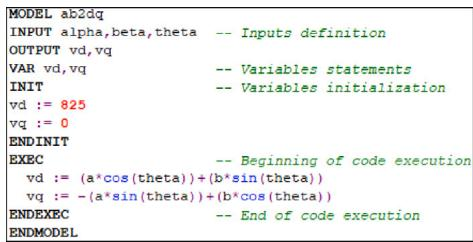  
Fig. 8. MODELS code of block 1.1.2.

which are filtered by block 1.1.3, available on TACS » Transfer functions » General tab. It is a TACS component that implements a generic transfer function, being in this case a second order formula set according to Fig. 2, with ?? = 0.004. The division of $v _ { q }$ by $v _ { d }$ is performed by block 1.1.4 and follows to block 1.1.5 (TACS » Fortran statements » Trigonom » atan), which is a TACS element that implements arctangent function. Block 1.1.6 is also a TACS block, which represents a first order transfer function (TACS » Transfer functions » Order 1). Here, $k _ { p } = 2 . 5$ and $k _ { i } = 0 . 0 0 2 7 7$ are used, forming a PI controller.

# 4.5. Grid synchronization alternative 2: DSOGI-PLL

The DSOGI-QSG is composed of two identical circuits, which are applied to the ?? and ?? components. The mathematical blocks are organized to follow the scheme shown in Fig. 3, being implemented by means of the already explained blocks 1.2.2, 1.1.8 and 1.2.3. The signal integration is performed by a block like the one numbered with 1.1.9, available in TACS » Transfer Functions » Integral tab, being configured with unitary gain. The other required setting is the factor ?? in the multiplication block. In this case, the gain $\sqrt { 2 }$ is adopted, guaranteeing a good stabilization time and overshot limitation. The next part of this solution is the PSC, which is composed of subtraction and addition operations applied to signals obtained from DSOGI-QSG. The results are then multiplied a factor ?? (using, in this case, ?? = 0.5). Then, the positive sequence components of grid voltages in ???? reference frame are obtained, being forwarded to $d q$ transform embedded into the MODELS block and then to the SRF-PLL arrangement. Finally, the SRF-PLL is composed of the PI controller implemented as the sum of two input signals: the integral of $v _ { q }$ signal (repetition of block 1.1.9, with proper ?? settings, which represents $k _ { i } = 6 1 . 6 9 )$ and $v _ { q }$ multiplied by a constant (repetition of block 1.1.8 with ?? representing $k _ { p } = 0 . 8 )$ .

# 4.6. Current synthesis and injection (No. 2 and 3)

Blocks 2 and 3 are responsible to perform the output current synthesis and injection into the grid. The current synthesis is carried out following Eqs. (3) and (4), using as inputs: the ?? component obtained from the grid voltage, which are converted into $v _ { d } ,$ voltage angle extracted by the PLL and the power references ?? and ??. It is known that, under unbalanced conditions, these equations will present some inaccuracies. However, from the errors presented later in the results section, one can see that the impacts of such condition is not significant in the proposed model. From $i _ { d }$ and $i _ { q }$ components, ???? to ?????? transform is performed to obtain the three-phase grid currents in ?????? reference frame. Current limitation during fault conditions is also implemented in this block, as it can be seen in the code presented in Fig. 9. The highlighted part (blue rectangle in Fig. 9) represents the code part which can be modified to consider any other control strategies acting on $i _ { d }$ and $i _ { q }$ during the current synthesis and limitation process. For example, it would allow to implement specific grid codes or inverter manufacturer specifications, evidencing the proposed EIBR model capability of being adapted to other control strategies or remodeled by using different implementation elements. Such a feature is facilitated due to

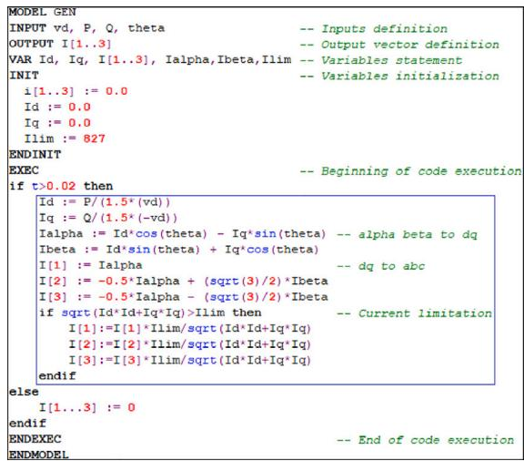  
Fig. 9. MODELS code of block 2.

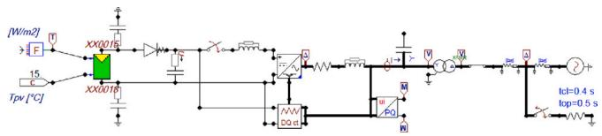  
Fig. 10. Original model available in ATPDraw.

the fact that many variables of interest are explicit, being available for manipulation in the MODELS code shown in Fig. 9.

Since MODELS outputs in block 2 are handled internally in ATP/ATPDraw as computational variables, it is necessary to convert them into electrical currents, which is carried out via TACS source found in ATPDraw Sources » TACS source tab. To ensure the correct operation of such a source, the MODELS output from block 2 is connected to the terminal of the TACS source (block 3), setting it to represent a current source. It should be also noticed that the connection point of block 3 is also the beginning of the circuit that interconnects the EIBR to the grid. Hence, the synthesized currents are injected into the power network via TACS source, emulating the operation of a grid-following IBR.

# 5. Results and discussion

In order to validate the proposed EIBR model, two different operational conditions are assessed, namely: steady-state and during the occurrence of symmetrical and asymmetrical grid faults. The proposed EIBR model is compared with an existing ATP/ATPDraw full timedomain IBR model, which is taken as reference. This model has been built by Francisco J. Penaloza, and it is available in the ATPDraw Users’ Manual [18]. Such full model simulates a photovoltaic (PV) source interfaced with IGBT PWM-controlled inverter [18], such as presented in Fig. 10.

The main characteristics of the grid in which the model is connected are: L-L voltage of 22 kV at the grid side and 1 kV at the generator side, rated frequency of 50 Hz, zero/positive sequence line resistance, inductance and capacitance of 2∕1 Ω∕m, 40∕20 mH/m and 0.1∕.02 μF/m, respectively. After the EIBR model validation, case studies considering different grid-synchronization (GS) methods and different reactive power injections will be also presented.

# 5.1. Steady-state evaluation

A scenario in which the EIBR is set to generate 1.025 MW with unitary power factor is considered in the first analysis. Also, the alternative 1 for GS implementation (LPF-PLL) is adopted, since this approach

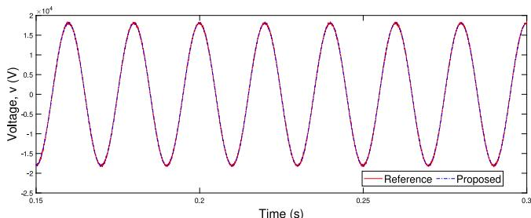  
Fig. 11. Voltages in steady-state.

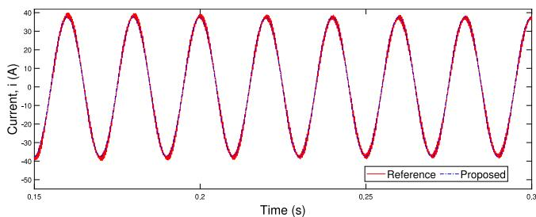  
Fig. 12. Currents in steady-state.

is the same as the reference model. Figs. 11 and 12 present phase A voltages and currents, respectively, obtained from both proposed and reference models at the point of connection to the grid. It is noticed that the waveforms are very similar, except by the additional oscillations verified in the reference model due to the switching process, which is not included in the proposed EIBR. In addition, the injected powers obtained from both models are compared, resulting in a root mean squared error (RMSE) in the apparent power of only 2.3184 kVA (about 0.23% of the expected value).

# 5.2. Fault condition

To verify the behavior of the proposed model in cases of faults on the interconnecting grid, three scenarios are analyzed, namely: threephase (3Ph), line-to-line (LL) and single-line-to-ground (SLG) shortcircuits. One at a time, these faults were applied to the system. In all cases, the fault duration was set to be 0.10 s (from ?? = 0.45 to ?? = 0.55 s), being the fault resistance set as $R _ { f a u l t } = 5 \Omega .$

To analyze the first scenario, voltages and currents obtained at the point of connection from both reference IBR and proposed EIBR model under 3Ph fault conditions are shown in Figs. 13 and 14, respectively. Since the current synthesis process adopted in this work guarantee that they are balanced, only one phase current is presented in Fig. 14. Again, the obtained results are very similar, except by some transients in the current waveform which are more evident in the reference model. It is worth mentioning that, as commented in Section 3, the analyzed IBR output currents are limited to values very close to those observed during the steady-state, even if faults take place on the interconnecting system. Here, such a limiting level is equal to 1.02 pu of the steady-state current, resulting in 843.5 A in the analyzed system.

Fig. 15 depicts the active and reactive powers injected into the grid during the analyzed fault. The presented comparison points out that both models are very close between each other, resulting in a value of RMSE in the active and reactive power equal to 30.878 kW and 23.233 kvar, respectively, and for the apparent power equal to 29.978 kVA (about 3.09% of the expected power).

In the second analyzed case, a SLG fault on phase A is simulated. Figs. 16 and 17 presents the comparison between voltages and phase A current injected into the grid, respectively, obtained via reference and proposed models. In addition, Fig. 18 compares the related active and

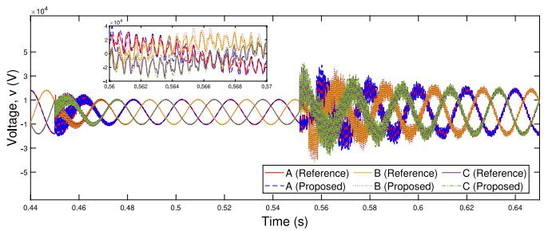  
Fig. 13. Voltages during a 3Ph grid fault.

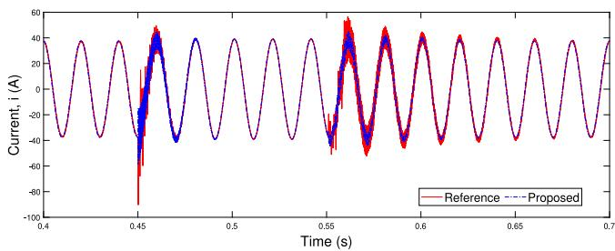  
Fig. 14. Current injected in phase A during a 3Ph grid fault.

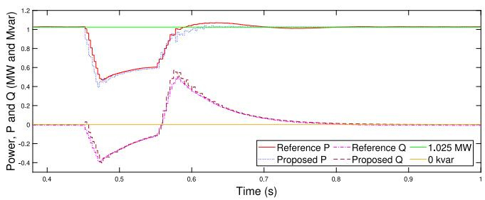  
Fig. 15. Power injected during a 3Ph fault.

reactive powers. Similarly to the first case, only slight differences are observed in the obtained results, which are majorly related to transients caused by the inverter operation, which are not represented in the proposed simplified EIBR model. Indeed, from the comparison carried out, the RMSE for P and Q is equal to 21.538 kW and 13.432 kvar, respectively. Concerning the apparent power error, the value is 21.358 kVA, i.e., about only 2.12% of the expected value.

The last fault case consists of an LL fault between phases B and C. The voltages are presented in Fig. 19 and currents injected in phase A and the active and reactive powers injected into the grid are shown in Figs. 20 and 21, respectively, comparing again the results obtained from both reference and proposed models.

Once more, the most relevant discrepancy between the obtained waveforms regards the transients caused by the inverters, which are fully represented in the reference model, but disregarded in the proposed EIBR, for the sake of simplification. These transients have some slight impact in the power delivered to the grid, but it does not compromise the IBR dynamic representation. Indeed, the behavior of the proposed model showed again to be accurate and reliable, resulting in a RMSE for P and Q equal to 17.856 kW and 12.722 kvar, respectively, which results in a RMSE of 17.246 kVA for the apparent power, representing 1.77% of the expected power.

The presented results demonstrate that the proposed EIBR is quite reliable and accurate to represent the IBR operation during both steadystate and fault conditions, especially for EMTP studies focused on the fundamental frequency component. Besides the accuracy, the associated computational burden is an important aspect, which must be

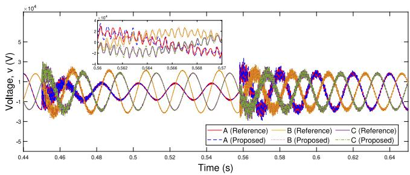  
Fig. 16. Voltages during a SLG grid fault.

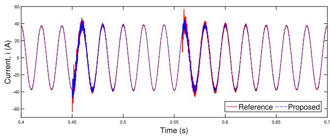  
Fig. 17. Current injected in phase A during a SLG grid fault.

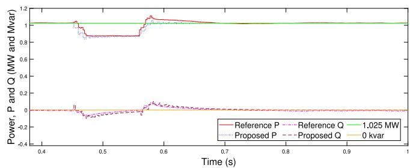  
Fig. 18. Injected power during a SLG fault.

assessed. Thus, the simulation times for both reference full IBR model and proposed simplified EIBR model were compared for a simulation of 1 s. The obtained results revealed that the proposed model demanded about 70% less time than the original one, since the reference model simulation took 60 s and the proposed model took 19 s, which demonstrates the suitability of the proposed model for EMTP IBR studies. A laptop with Intel Core i7 Processor (2.7 GHz) and 8 GB DDR4 RAM was used to run the simulations.

# 5.3. Evaluation of the EIBR model capabilities

The proposed EIBR model is designed to be adaptable in relation to the implementation of different control strategies or different IBR components. Thus, this section evaluates the performance of the model demonstrating the application of different design scenarios.

# 5.3.1. Alternative GS method

Initially, GS alternative 2, i.e., DSOGI-PLL is considered rather than the LPF-PLL. The 3Ph fault scenario is evaluated again, being the results in terms of power shown in Fig. 22. It can be seen that, from straightforward adaptations, the proposed model was properly prepared to utilize a different GS approach (including PLL, current synthesis, control strategies etc.). The results remained consistent, revealing that the second PLL alternative has a better performance (grid angle estimation) during system transients. When compared to Fig. 15, it results in less deviations in relation to the power reference values, mainly when considering the absorption/injection of reactive power

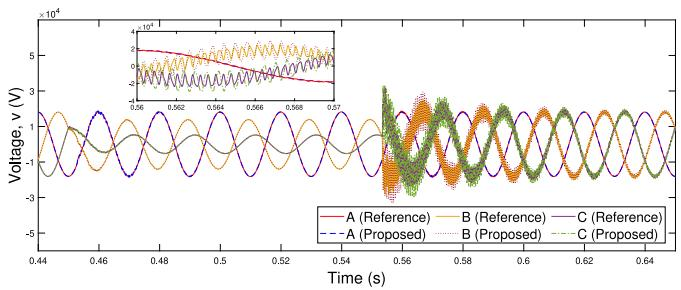  
Fig. 19. Voltages during a LL grid fault.

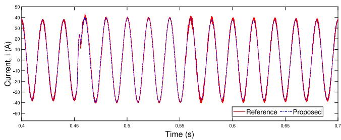  
Fig. 20. Current injected in phase A during an LL grid fault.

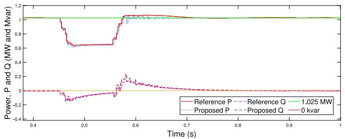  
Fig. 21. Injected power during a LL fault.

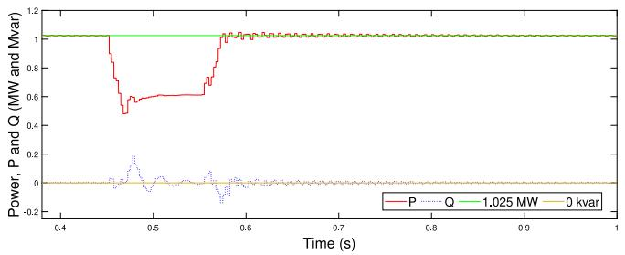  
Fig. 22. Injected power during a 3Ph fault using the DSOGI-PLL.

during the beginning/clearing of the fault, respectively. These two moments are the most critical for grid synchronization functions.

# 5.3.2. Reactive power injection

Since reactive power injection is a frequent requirement in grid codes worldwide, the capacity of the proposed EIBR model in performing this ancillary service is tested. To do so, simulations were carried out considering a varying reactive power reference setting, which varies from 0 to 200 kvar at ?? = 0.6 s and from 200 to 500 kvar at ?? = 0.8 s. The obtained results are presented in Fig. 23 and they demonstrate that the proposed EIBR model properly responds to such type of setting.

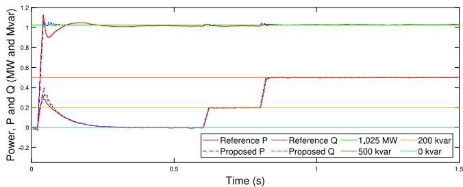  
Fig. 23. Reactive power injection capability.

# 6. Conclusions

This paper presented the development of a simplified equivalent grid-following IBR model (EIBR) in ATP/ATPDraw platform. The model showed to be reliable and accurate in the representation of the fundamental frequency component in both steady-state and fault scenarios. Deviations found in relation to a full IBR reference model resulted in an average error of 2.33% in the apparent power, providing also a very satisfactory representation of voltages and currents.

The proposed EIBR model also showed to be capable of considering the adoption of different control strategies, elements implementations (e.g., PLL) and different settings of injected active and reactive power, with the advantage of reducing by 70% the simulation time in comparison to the analyzed complete IBR reference model. These results demonstrate that the proposed model is quite useful for IBR integration studies focused on the fundamental frequency component, especially if high IBR penetration scenarios are of interest.

# CRediT authorship contribution statement

M.B. Luchini: Conceptualization, Methodology, Software, Writing – original draft. O.E. Batista: Supervision, Conceptualization, Methodology, Writing – review & editing. F.V. Lopes: Supervision, Conceptualization, Methodology, Software, Writing – review & editing. R.L.A. Reis: Conceptualization, Writing – review & editing. B.A. Souza: Conceptualization, Writing – review & editing.

# Declaration of competing interest

The authors declare that they have no known competing financial interests or personal relationships that could have appeared to influence the work reported in this paper.

# Data availability

Data will be made available on request.

# References

[1] R.C. Dugan, T.E. McDermott, G.J. Ball, Planning for distributed generation, IEEE Ind. Appl. Mag. 7 (2) (2001) 80–88, http://dx.doi.org/10.1109/2943.911193.   
[2] F.V. Lopes, M.J.B.B. Davi, M. Oleskovicz, G.B. Fabris, Importance of EMT-type simulations for protection studies in power systems with inverter-based resources, in: 2022 Workshop on Communication Networks and Power Systems (WCNPS), 2022, pp. 1–6, http://dx.doi.org/10.1109/WCNPS56355.2022.9969699.   
[3] N.A.E.R. Corporation, Distributed Energy Resources Connection Modeling and Reliability Considerations, Technical Report, 2017.   
[4] M. Mendes, M. Vargas, O.E. Batista, Y. Yang, F. Blaabjerg, Simplified singlephase PV generator model for distribution feeders with high penetration of power electronics-based systems, in: 15th IEEE Brazilian Power Electronics Conf. and 5th IEEE Southern Power Electronics Conf., 2019, pp. 1–7, http://dx.doi.org/10. 1109/COBEP/SPEC44138.2019.9065417.   
[5] R. Hassani, J. Mahseredjian, T. Tshibungu, U. Karaagac, Evaluation of timedomain and phasor-domain methods for power system transients, Electr. Power Syst. Res. 212 (2022) 108335.

[6] P.-I. Hwang, G. Jang, S.-I. Moon, S.-J. Ahn, Three-phase steady-state models for a distributed generator interfaced via a current-controlled voltage-source converter, IEEE Trans. Smart Grid 7 (3) (2016) 1694–1702, http://dx.doi.org/10.1109/TSG. 2015.2428273.   
[7] B. Polajžer, M. Pintari, M. Topler, B. Grar, Steady-state response of inverterinterfaced distributed generations during transmission network faults, in: IEEE Intern. Conf. on Environment and Electrical Engineering and IEEE Industrial and Commercial Power Systems Europe, 2021, pp. 1–6, http://dx.doi.org/10.1109/ EEEIC/ICPSEurope51590.2021.9584776.   
[8] L.G.O. Queiroz, M.A. Mendes, O.E. Batista, Simplified dynamic PV generator model for analysis of voltage and current variation in feeder with high DG integration, in: International Conf. on Electrical, Computer, Communications and Mechatronics Engineering, 2021, pp. 1–6, http://dx.doi.org/10.1109/ ICECCME52200.2021.9590840.   
[9] D. Ramasubramanian, Z. Yu, R. Ayyanar, V. Vittal, J. Undrill, Converter model for representing converter interfaced generation in large scale grid simulations, IEEE Trans. Power Syst. 32 (1) (2017) 765–773, http://dx.doi.org/10.1109/ TPWRS.2016.2551223.   
[10] M.E. Ropp, S. Gonzalez, Development of a MATLAB/Simulink model of a singlephase grid-connected photovoltaic system, IEEE Trans. Energy Convers. 24 (1) (2009) 195–202, http://dx.doi.org/10.1109/TEC.2008.2003206.   
[11] J. Seuss, M.J. Reno, R.J. Broderick, S. Grijalva, Determining the Impact of Steady-State PV Fault Current Injections on Distribution Protection, Tech. Rep., 2017, http://dx.doi.org/10.2172/1367427, URL https://www.osti.gov/biblio/1367427.

[12] J. Rocabert, A. Luna, F. Blaabjerg, P. Rodríguez, Control of power converters in AC microgrids, IEEE Trans. Power Electron. 27 (11) (2012) 4734–4749, http://dx.doi.org/10.1109/TPEL.2012.2199334.   
[13] V. Kaura, V. Blasko, Operation of a phase locked loop system under distorted utility conditions, IEEE Trans. Ind. Appl. 33 (1) (1997) 58–63, http://dx.doi.org/ 10.1109/28.567077.   
[14] C. Se-Kyo, A phase tracking system for three phase utility interface inverters, IEEE Trans. Power Electron. 15 (3) (2000) 431–438, http://dx.doi.org/10.1109/ 63.844502.   
[15] G. Arindam, J. Avinash, A new algorithm for the generation of reference voltages of a DVR using the method of instantaneous symmetrical components, IEEE Power Eng. Rev. 22 (1) (2002) 63–65, http://dx.doi.org/10.1109/MPER.2002. 4311666.   
[16] P. Rodríguez, R. Teodorescu, I. Candela, A.V. Timbus, M. Liserre, F. Blaabjerg, New positive-sequence voltage detector for grid synchronization of power converters under faulty grid conditions, in: 37th IEEE Power Electronics Specialists Conf., 2006, pp. 1–7, http://dx.doi.org/10.1109/pesc.2006.1712059.   
[17] T. Huang, X. Shi, Y. Sun, D. Wang, Three-phase photovoltaic grid-connected inverter based on feedforward decoupling control, in: 2013 International Conference on Materials for Renewable Energy and Environment, Vol. 2, 2013, pp. 476–480, http://dx.doi.org/10.1109/ICMREE.2013.6893714.   
[18] H.K. Hoidalen, L. Prikler, F. Penaloza, ATPDRAW version 7.3 for windows, User’s Manual (2021).