# Modeling a Mixed Residential-Commercial Load for Simulations involving Large Disturbances

Bahram Khodabakhchian

Gia-Tong Vuong (member)

Hydro-Québec, 855 Ste-Catherine st. East, 19th floor

Montréal, Québec, Canada H2L 4P5

# ABSTRACT

A detailed EMTP model of a mixed residential-commercial load valid for large voltage variations has been developed. Once validated against field recordings, the model has been used to study the static, dynamic and post-fault recovery characteristics of the real load.

From the simulation results, guidelines for modeling this type of load in dynamic studies such as first swing, transient and voltage stability were established. It is expected that the same methodology applied to other loads of reasonably known composition would guarantee more realistic results than those obtained with current practices.

Keywords: Load Modeling, LOADSYN,EMTP Simulation, Transient Stability.

# INTRODUCTION

It has been well established that the load characteristics have a major effect on machine-network interactions, which include first-swing transient stability, small-signal damping, dynamic overvoltages and voltage stability [1]. Moreover, special load modeling efforts were necessary to explain system dynamics during large disturbances such as the one reported in [2].

The development of the LOADSYN [3] computer package provided an easy process for utility engineers to prepare better load models for dynamic studies. However, its models are subject to some limitations, being designed for voltage variations of less than $15\%$ and for frequency fluctuations not greater than $5\%$ .

For the last few years, Hydro-Quebec has been using EMTP beyond the traditional tenths-of-a-second time frame to study dynamic phenomena of up to many seconds, whenever a high degree of accuracy is desired [4]. One of the issues being addressed is a more precise evaluation of the stresses (dynamic overvoltages) imposed on the transmission equipments during severe disturbances capable of causing dynamic instability and system islanding. For this kind of studies, EMTP is considered the most suitable tool because of its ability to simulate harmonics, unbalanced operations and nonlinear phenomena

96 SM 502-5 PWRS A paper recommended and approved by the IEEE Power System Engineering Committee of the IEEE Power Engineering Society for presentation at the 1996 IEEE/PES Summer Meeting, July 28 - August 1, 1996, in Denver, Colorado. Manuscript submitted December 22, 1995; made available for printing June 27, 1996.

such as corona, transformer saturation and zinc oxide discs conduction. While many sophisticated models which are valid over a wide range of operating conditions have been developed for major network components such as synchronous machines and their controls, little has been done to develop a load model suitable for large voltage and frequency excursions. Assuming that multi-motor models are essential for accurate simulations, and that such models is obviously not practical for large power systems, detailed EMTP simulations have been conducted to confirm the need for better load models and to investigate the prospect of reduced-yet-suitable ones, for EMTP as well as for other tools.

This paper describes the efforts to model a mixed residential-commercial load under severe disturbances, e.g. voltage variations of up to $50\%$ . Such a load is typical for more than two thirds of the total Hydro-Quebec base load. The LOADSYN component-based approach has been adopted, along with its data base.

Using EMTP simulations, the resulting composite model has been validated against field data which were recorded during a severe single-line-to-ground fault, then used to determine the static, dynamic and post-fault recovery characteristics of this type of load.

# FIELD MONITORING SET-UP

An acquisition and identification system for load modeling using natural network variations has been developed and adopted by Hydro-Quebec since 1979 [5]. With this approach, costly test campaigns are no longer required, resident monitoring units are instead installed on a semi-permanent basis where loads need to be modeled. The system has also the merit of providing data covering a much wider range of network conditions, including those which occur in natural events but impractical to reproduce by tests.

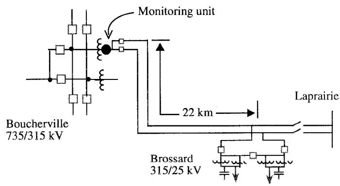  
Fig.1: Network configuration and location of the monitoring unit

In this case, the load to be modeled is that of the Brossard substation, situated at the remote end of a radial line from the Boucherville substation where a monitoring unit has been installed during two years (Fig. 1).

Many events have been recorded, most of them correspond to small variations but a few large disturbances have also been observed. The selected case corresponds to a single-line-to-ground fault which caused a $17.5\%$ drop of the positive sequence voltage. This voltage variation is reproduced in Fig. 2 along with the active and reactive powers.

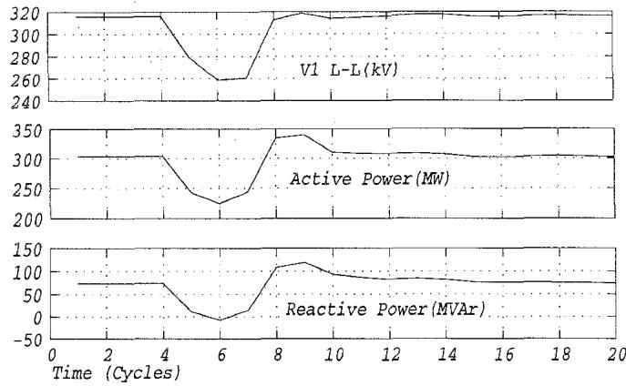  
Fig.2: Positive Sequence Voltage, Active and Reactive Powers (recorded)

From the recorded sequence voltages, the three phase voltages have been computed. They are reproduced in Fig. 3 where one may observe voltage drops of $8\%$ on healthy phases and of $36\%$ on the faulted one (phase c). Knowing that the recorded values were actually averaged over successive observation windows of one-cycle duration, a process which introduces some transient distortions near steep voltage variations, it was necessary to derive the real signals. In Fig. 3, these reconstructed signals are reproduced in heavy dotted lines from which one may establish that the actual fault duration was 2.5 cycles.

# COMPONENT LOAD MODELS

Since field recorded data correspond to a single-line-to-ground fault, single-phase static models are needed. Three static models have been considered:

- constant-impedance   
-nonlinear   
- voltage and/or frequency-dependent

as well as 2 dynamic ones:

single-phase motor   
-3-phase motor

This modeling work has been extensively based on the LOADSYN data base and model library [6].

# Static loads

Constant-impedance loads such as water heaters, electric ranges, series inductors and shunt capacitors are represented by linear RLC circuits.

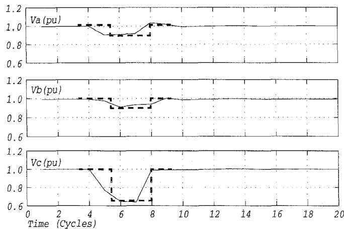  
Fig.3: Phase Voltages, Computed from recorded data (solid) and derived (dotted)

Nonlinear loads such as distribution transformer saturation are adequately represented by EMTP model 98.

Voltage and frequency-dependent loads such as televisions and fluorescent lighting are simulated by passive elements and a current source (Fig. 4) which is adjusted to satisfy the following formulas:

$$
\mathrm {P} = \mathrm {P _ {0}} \quad (\mathrm {V / V _ {0}}) ^ {\mathrm {N p}} \quad [ 1 + \mathrm {K _ {p}} \quad (\mathrm {f - f _ {0}}) / \mathrm {f _ {0}} ]
$$

$$
\mathrm {Q = Q _ {0} (V / V _ {0}) ^ {N q} [ 1 + K _ {q} (f - f _ {0}) / f _ {0} ]}
$$

NB: For this study, no significant frequency fluctuation was observed, therefore $\mathrm{f} = \mathrm{f}_0$ , rendering $\mathrm{K_p}$ and $\mathrm{K_q}$ irrelevant.

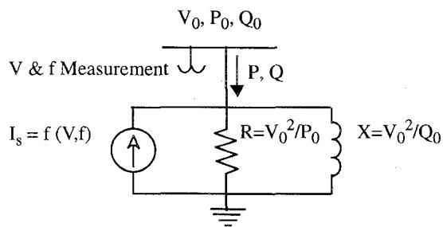  
Fig. 4: EMTP voltage and frequency-dependent static loads

# Dynamic loads

The EMTP universal machine models UM-7 (single-phase) and UM-40 (three-phase) have been carefully validated against field recordings, respectively in [7] and [8]. Therefore, they were used with confidence in this work.

In LOADSYN, each single-phase motor of domestic appliances is modeled as if it were part of a three-phase motor. Such approximation which may be valid for small and balanced disturbances is certainly not adequate for a single-phase fault causing a $36\%$ voltage drop. Therefore, a single-phase model was used, the parameters of which were chosen to reproduce the characteristics (power factor, nominal slip and speed-torque curve) of LOADSYN data near nominal slip.

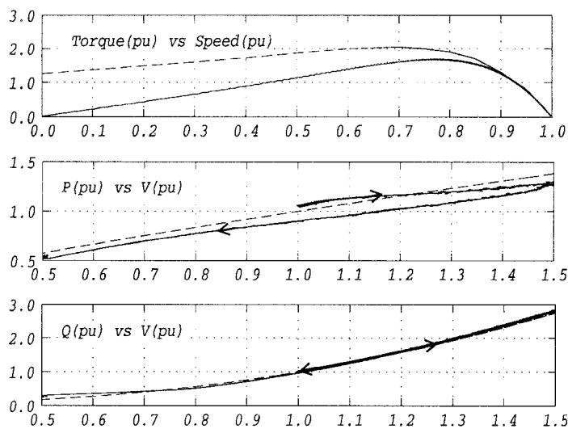  
Fig. 5 compares the characteristics of the EMTP refrigerator-freezer motor model to the one in LOADSYN (REFR). One may observe that the torque characteristics of the EMTP model is more realistic at large slips, displaying a zero starting torque which is typical for single-phase motors. The P and Q static characteristics were obtained by varying the voltage from $1.0\mathrm{pu}$ up to $1.5\mathrm{pu}$ (ascending branch) then down to .5 pu (descending branch), at the rate of .1 pu per second. The fit between the two models is quite good, even outside the LOADSYN model's valid range (.85 pu - 1.15 pu). This unexpected outcome is believed to be coincidental.   
Fig.5: Characteristics of the motor component in refrigerator-freezer model LOADSYN (dotted) vs. EMTP (solid)

Other EMTP single-phase motor models have been similarly developed: residential central air conditioner, room air conditioner, washer, dryer, dishwasher and furnace fan, respectively equivalent to LOADSYN's RCAR, RRAR, CWSH, DRYR, DwSH and FFAN.

Regarding the modeling of three-phase motors, the small industrial motor category has been chosen for illustration. Fig. 6 compares the EMTP model to LOADSYN's SMOT. Again, the LOADSYN model's torque characteristic was found inadequate for large slips, because of its single-cage formulation [9]. Other three-phase motor models developed include pumps-fans-and-other-motors (METC) and commercial central air conditioner (CCAR).

The static characteristics have also been determined but, unlike the previous case, the two sets of curves diverge rapidly outside the narrow voltage range of $0.8\mathrm{pu} - 1.2\mathrm{pu}$ .

# LOAD COMPOSITION

Compared to determining load component models, estimating the load composition is a much less straightforward task. An analytical approach based on sales statistics, climate conditions and the LOADSYN data base was adopted. Circumstantial data for the case under study are:

time: 4:00 pm Sunday August 8th 1993

temperature: Sunny, $27^{\circ}\mathrm{C}$

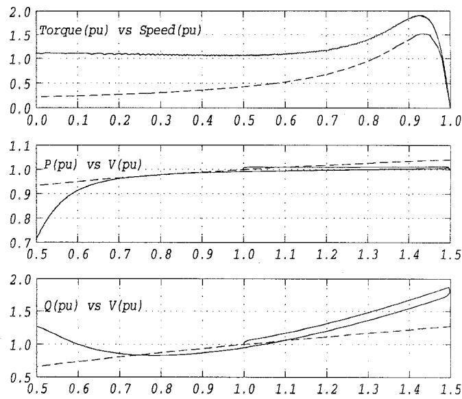  
Fig. 6: Characteristics of small industrial motors LOADSYN (dotted) vs. EMTP (solid)

The Brossard substation supplies two Montreal Southshore suburbs, Brossard and St-Hubert, serving 45000 households, some retail stores, a strip of shopping malls and some industries. Hydro-Quebec's sales statistics for the area during August 1993 indicate that the load was made up of $44\%$ residential, $30\%$ commercial and $24\%$ industrial, leaving $2\%$ for others, mostly street lighting.

Given it was sunday and all stores were still open, it is reasonable to assume that:

- industrial loads are 1/3 of their average value   
- commercial loads are about average   
- the balance of the loads is residential

the 290 MW (303 MW - $5\%$ losses) pre-fault load composition is therefore distributed as follows:

- 8% or 25 MW industrial   
- $30\%$ or 85 MW commercial   
- $62\%$ or 180 MW residential

# Residential loads

According to Hydro-Quebec statistics, the average refrigerator-freezer load per household is 234 Watts, or $10.6\mathrm{MW}$ total for the 45000 clients. Based on these figures and the LOADSYN residential load class composition data base [6], and by doubling all those related to electric appliances, water heating and entertainment, the following load distribution has been obtained:

<table><tr><td rowspan="2">Cooling</td><td>central</td><td>32.8 MW</td><td>single-φ motor</td></tr><tr><td>room</td><td>4.4 MW</td><td>- id -</td></tr><tr><td colspan="2">Water heating</td><td>53.0 MW</td><td>constant R</td></tr><tr><td rowspan="6">Appliances</td><td>range</td><td>21.2 MW</td><td>constant R</td></tr><tr><td>refr.-freezer</td><td>21.2 MW</td><td>R + single-φ motor</td></tr><tr><td>base-load</td><td>9.6 MW</td><td>- id -</td></tr><tr><td>dishwasher</td><td>3.3 MW</td><td>- id -</td></tr><tr><td>washer</td><td>2.9 MW</td><td>single-φ motor</td></tr><tr><td>dryer</td><td>9.7 MW</td><td>R + single-φ motor</td></tr></table>

Lighting (incandescent) 9.6 MW static single- $\phi$

TV 10.6 MW - id -

Furnace fan 2.0 MW single- $\phi$ motor

Total residential: 180.3 MW

Loads which were doubled are linked to family activities, which are more intensive on sunday.

# Commercial loads

The 85 MW commercial load is distributed according to LOADSYN, yielding:

Cooling central 17.0 MW three- $\phi$ motor

room

15.5 MW single- $\phi$ motor

Lighting (fluorescent) 35.0 MW static single-phase

Pump,Fan&other 16.0 MW three- $\phi$ motor

Water heating 1.2 MW constant R

Total commercial: 84.7 MW

# Industrial loads

It is assumed that industrial loads were $25\%$ fluorescent lighting and $75\%$ small industrial motors, or:

Fluorescent lighting 6.2 MW static single-phase

Small motors 18.8 MW three- $\phi$ motor

Total industrial: 25.0 MW

Globally, the total 290 MW load comprises 241 MVA of motor loads, 82.5 MVA three-phase and 158.5 single-phase. For Hydro Quebec, the high motor content may mean this load is one of the most demanding in terms of first-swing and voltage stability.

# SIMULATION RESULTS

# Validation against field recordings

Fig. 7 illustrates the exact system set-up as prepared for EMTP simulations, of which the network portion faithfully reflects the pre-fault conditions. The infinite three-phase source emulates the actual phase voltages wave forms, as deduced and presented in Fig. 3. This detailed load representation is similar to the one used in [10]. A total of 24 UM models were used. The closeness between the calculated and recorded load power factors, 0.968 vs. 0.972, is an indication of a fair load distribution and good component models.

Fig. 8 compares the main electrical variables, namely the $315\mathrm{kV}$ positive sequence voltage and current V1 & I1 as well as the active and reactive powers P & Q. The simulated signals closely match the recorded data, before, during and after the fault. Only minor mismatches were observed. These may be

explained by the afore-mentioned averaging process of the monitoring unit, which introduces some distortions to the recorded data.

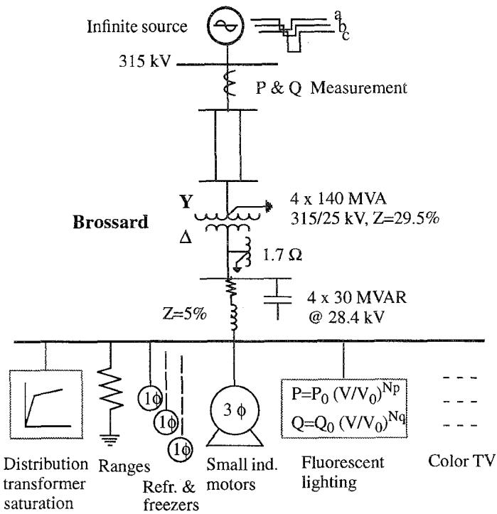  
Fig. 7: System set-up for EMTP simulation

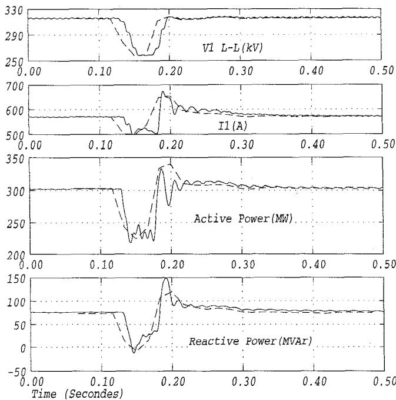  
Fig. 8: Simulation results (solid) vs. recorded data (dotted)

The excellent fit proves that a reasonable but not exact load composition is sufficient to yield accurate simulation results, provided that all circumstantial data were taken into account.

# Load characteristics

Once validated, the composite model has been used in various simulations to establish its static, dynamic and post-fault recovery characteristics.

The static load characteristics are presented in Fig. 9. For voltages above .8 pu, the active power P increases linearly while the reactive power Q stays flat until 1.0 pu then increases exponentially. The latter phenomenon is attributable to transformers saturation. On the contrary, below .8 pu, the P and Q curves display a stairway pattern which is due to gradual loss of loads: industrial motors are tripped at .80 pu, pumps, fans and other motors at .75 pu and fluorescent lighting goes off at .70 pu. Also, below .60 pu, commercial and room air conditioners decelerate rapidly (Fig. 10) causing a noticeable increase of the reactive load.

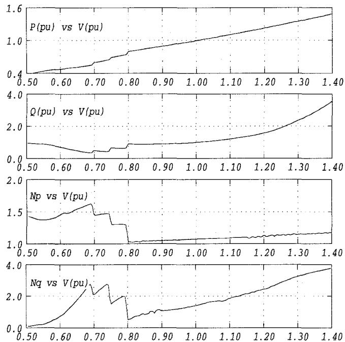  
Fig. 9: Static load characteristics and corresponding Np and Nq

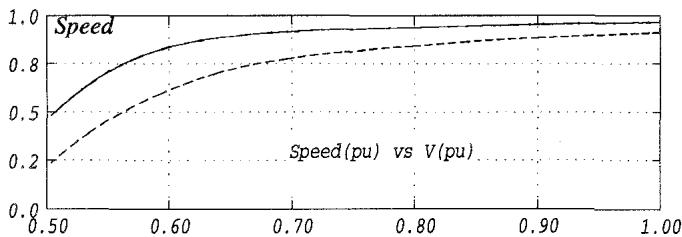  
Fig. 10: Static deceleration characteristic of air conditioner motors Commercial central AC (solid) and room AC (dotted)

Fig. 9 also presents the load coefficients Np and Nq which were deduced from P and Q. One may observe that for small voltage deviations around 1.0 pu such as in power flow studies, constant Np and Nq coefficients may be used. However, for voltage stability studies where large voltage variations are expected, it would be more appropriate to adopt variable coefficients, a convenient way to represent loss of loads and motor deceleration.

For the dynamic load characteristics, a $1\mathrm{Hz}$ sinusoidal voltage (.75 pu to 1.3 pu) was used to emulate typical swings of the Hydro-Quebec network.

The responses are shown in Fig. 11. One may observe that while the ellipsoidal active power curve is quite flat and could be conveniently approximated by its static characteristics, the reactive power counterpart exhibits larger phase leads, thus excluding this kind of approximation. Additional work would be necessary to develop suitable load models to study system dynamics (Transient Stability type) when large swings are expected. Such models would comprise one or two equivalent motors for which the parameters would be chosen so that the load behavior at specific swing frequencies could be duplicated.

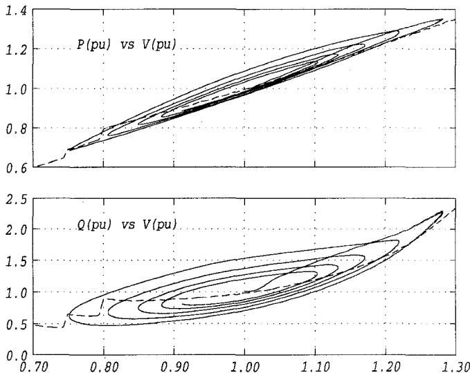  
Fig.11: Dynamic load characteristics (static characteristics in dotted)

In order to study the post-fault recovery characteristics, a three-phase fault causing a $50\%$ voltage drop was simulated. Fig. 12 shows that the dynamic mode of P, Q and the $25\mathrm{kV}$ voltage last about .35 seconds after fault removal, which may be critical for first swing. On the other hand, as substantiated by the slip curves of the two most vulnerable motors (commercial and room air conditioners), there was no motor stalling. Only fluorescent lighting extinction are expected.

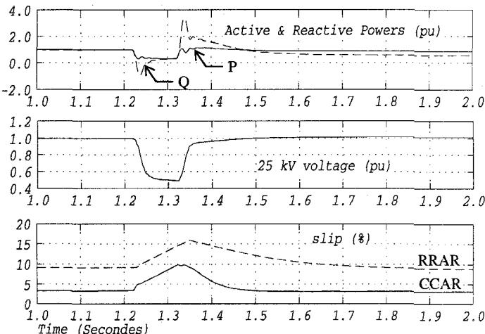  
Fig. 12: Post-fault recovery characteristics following a $3 - \phi$ fault which causes a $50\%$ voltage drop

# CONCLUSIONS

In order to simulate system dynamics following large disturbances, Hydro-Quebec has devoted special efforts to develop a detailed model for a mixed residential-commercial load. The following methodology was adopted:

- component-based approach   
- LOADSYN data base for load distribution and model parameters   
- single-phase model for single-phase motors   
- double-cage model for three-phase motors

This model has been validated by comparison with recorded data corresponding to a single-line-to-ground fault, then used in other simulations to obtain its static, dynamic and post-fault recovery characteristics.

From the simulation results, the traditional load coefficients (Np, Nq) were computed as functions of the voltage. The following conclusions have been reached:

- for power flow and steady-state contingency analysis studies, a constant Np-Nq load model can be conveniently used, with $\mathrm{Np} = 1.1$ and $\mathrm{Nq} = 1.4$ .   
- for slow developing phenomena such as voltage stability, a variable Np-Nq static model is more suitable. That would be a convenient way to take into account loss of load components and motor deceleration under extreme low-voltage conditions.   
- for faster dynamic modes such as first swing and transient stability, the conventional static model is clearly inadequate, because of the reactive power dynamics and its large phase lead. Therefore, a dynamic model including one or two equivalent motors needs to be developed.

This paper proved that EMTP can be similarly used for the better understanding of load behavior during large disturbances. A formal comparison between the proposed detailed models and Loadsyn-based ones will be reported in a future publication.

# ACKNOWLEDGEMENT

The authors wish to thank the following IREQ researchers: Dr. K. Srinivasan for providing field recordings and technical support, Mr. P. Lacasse and Dr. J. Mahseredjian for many improvements of the EMTP UM model, and Dr. V. Sood and Dr. H. Nakra for their valuable comments and suggestions.

# REFERENCES

[1] IEEE Task Force on Load Representation for Dynamic Performance, "Load Representation for Dynamic Performance Analysis", IEEE Trans. on Power System, vol. 8, no 2, May 1993, pp 472-482.   
[2] K. Walue, "Modélisation des composantes de réseaux soumis à de fortes perturbations", rapport CIGRE 38-18, Paris 1986.   
[3] W. W. Price et al., "Load Modeling for Power Flow and Transient Stability Computer Studies", IEEE Trans. on Power System, vol. 3, no. 1, Feb. 1988, pp 180-187.

[4] B. Khodabakhchian et al., "On the Comparison Between a Detailed Turbine-Generator EMTP Simulation and Corresponding Field Test Results", Proceedings of the International Conference on Power System Transients, Lisbon, September 1995.   
[5] C. T. Nguyen et al., "Load Characteristics and the Stability of the Hydro-Quebec System", IEEE PES Summer Meeting, Vancouver BC, 1979, paper A-79-438-3.   
[6] EPRI, "Load Modeling for Power Flow and Transient Stability", report EL-5003, project 849-7, vol. 1 and 2, 1987.   
[7] A. Domijian and Yuexin Yin, "Single Phase Induction Machine Simulation Using EMTP: Theory and Test Cases", IEEE Trans. on Energy Conversion, vol. 9, no. 3, Sept. 1994, pp 535-542.   
[8] G. J. Rogers and D. Shirmohammadi, "Induction Machine Modeling for EMTP", IEEE Trans. on Energy Conversion, vol EC-2, no. 4, December 1987, pp 622-628.   
[9] S. S. Waters and R. D. Willoughby, “Modeling Induction Motors for System Studies”, IEEE Trans. on Industry Applications, vol. IA-19, no.5, Sept./Oct 1983, pp 875-878.   
[10] H. K. Clark et al., "Voltage Control in a Large Industrialized Load Area supplied by Remote Generation", paper A-78-558-9, IEEE PES Summer Meeting, Los Angeles, Ca, July 1978.

# BIOGRAPHIES

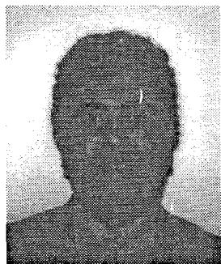

Bahrain Khodabakhchian received both his B.Sc.A and M.Sc.A in Electrical Engineering from Ecole Polytechnique de Montreal, in 1979 and 1981 respectively. He spent 11 years in Hydro-Quebec's Planning Dept. (System Studies Group) where he was involved in major AC and HVDC projects.

Since 1992, he has been with the

Power System Analysis group, where his main tasks concern detailed EMTP machine and load model developments. Mr. Khodabakhchian has co-authored many scientific papers, one of which won the 1986 Prize Paper Award of the IEEE Power Engineering Society.

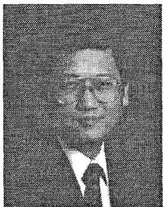

Gia-Tong Vuong received his BS and MS in 1966 and 1968 respectively (École Polytechnique de Montréal) and his Ph.D. in 1978 (INRS-Energie, Université du Québec). He joined Hydro-Québec in 1969 and is currently a senior engineer with the Planning Department. His current research interests encompass Applications of High Performance Computing and AI Technologies in Power System Analysis.