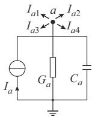
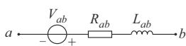
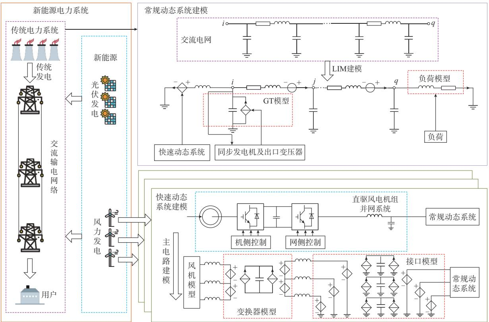
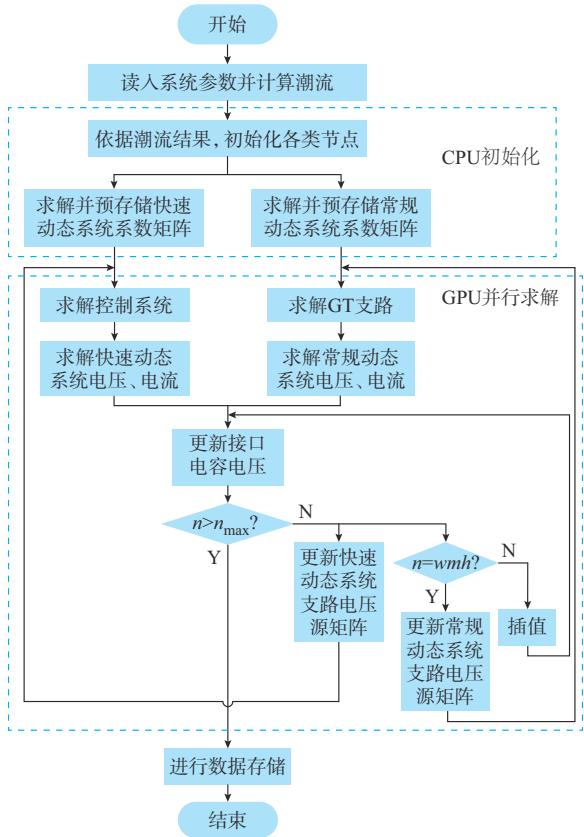
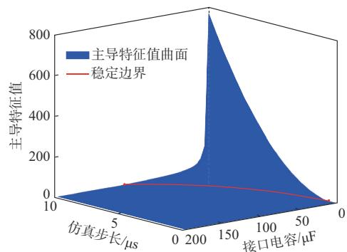
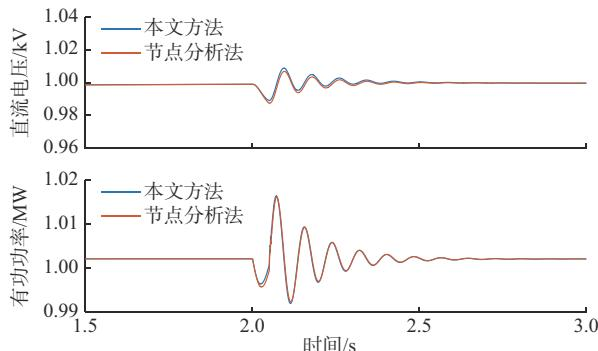
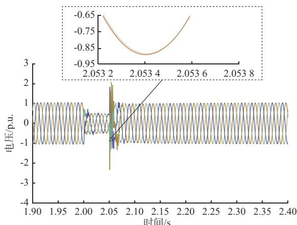
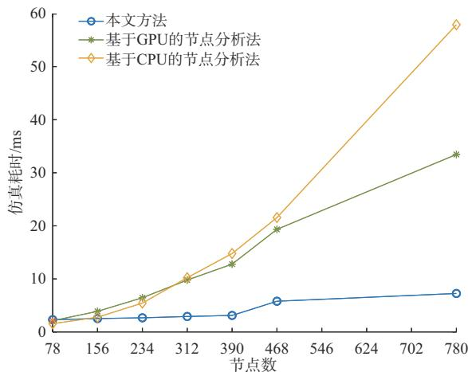

# 新能源电力系统细粒度并行与多速率电磁暂态仿真

王啟国 1 ，徐 晋 1 ，汪可友 1 ，周建其 2 ，樊 涛 3

（1. 电力传输与功率变换控制教育部重点实验室（上海交通大学），上海市 200240；

2. 国网浙江省电力有限公司嘉兴供电公司，浙江省嘉兴市 314000；3. 国家电网有限公司数字化工作部，北京市 100032）

摘要：随着可再生能源的快速发展，电力系统设备类型越来越多，系统振荡特征越来越复杂，对电磁暂态仿真的精度和效率提出了更高要求。基于大规模集成电路设计中所使用的延迟插入法（LIM），提出了新能源电力系统的细粒度建模方法，并结合图形处理器（GPU）的资源优势，实现了算法的并行求解。所提方法将传统交流电网与电力电子设备进行解耦，并基于混合数值稳定性判据和局部截断误差的方法确定了各子系统的步长。然后，通过插值实现了新能源电力系统的多速率仿真。最后，基于 硬件平台，以含新能源接入的改进 节点系统为例验证了所提方法的精度，并以不同规模的新能源接入、不同仿真步长的组合验证了所提方法在仿真效率方面的优势。

关键词：可再生能源；电力系统；电磁暂态仿真；并行计算；细粒度仿真；多速率仿真；延迟插入法；图形处理器

# 0 引 言

随着“碳达峰·碳中和”目标的提出，电力系统正在向以新能源为主体、大规模交直流互联的复杂网络转变［1-2］。电力电子设备占比的提高和多控制环节之间交互作用引起的多模态振荡问题也逐渐凸显［3-4］ 。这种全局多模态振荡不仅涉及中高频段，也涉及新能源场站内部的交互作用，设备级的简化模型［5-6］ 忽略了开关器件的高频切换过程，场站级的聚合模型［7-9］与详细模型的阻抗特性存在差异［10］。因此，有必要以满足精确模拟开关高频动作过程的小步长进行精细化建模和仿真。

系统详细建模会使得仿真规模急剧增长，为提升大规模系统的仿真效率，一系列并行加速算法被提出。从数学的角度看，目前广泛使用的节点分析法（nodal analysis method，NAM）主要受限于节点电压方程的求解效率。文献［11］提出了并行Crout分解算法，但未对大规模系统进行效率测试。文献［12］提出一种节点映射结构，将大规模系统转换为多个小型子系统进行求解，但其仿真效率与系统规模存在函数关系。文献［13］提出一种利用图形处理器（graphics processor unit，GPU）加速的 LU 分解方法实现了循环的并行化求解。针对该方法的数据依

赖性，文献［14］提出了改进的稀疏 LU 分解方法。上述方法极大地依赖于系统节点导纳矩阵的稀疏程度，其在电力电子设备高渗透下强耦合、强非线性电力系统中的适用性还有待进一步研究。

从物理的角度看，复杂电力系统可以划分为多个独立求解的子系统，由多个处理器进行并行计算。长传输线解耦［15］方法利用了长传输线的自然解耦特征实现并行仿真，但其分网要求较为严格。在此基础上，文献［16］利用全隐式积分和内插值实现了多速率仿真；文献［17-18］提出了一种多区域戴维 南 等 值（multi-area Thevenin equivalent，MATE）的分网方法，但需要利用集中参数元件来进行分网；文献［19］提出了分网多速率电磁暂态并行仿真方法，在分网的基础上支持2种及2种以上仿真步长；文献［20］提出了节点分裂法，提高了分网并行的灵活性；文献［21］进一步提出了基于节点分裂接口的多速率仿真方法，提高了系统仿真精度。上述分网并行求解方法，存在子系统规模均匀分配的问题，需要找到子系统数目和子系统规模之间的效率最优点，才能更好地发挥细粒度并行硬件的优势。

延 迟 插 入 法（latency insertion method，LIM）是大规模集成电路中提高设计效率的一种仿真方法［22］，其具有细粒度并行优势。目前，已在集成电路中的温度场分析［23］、强耦合传输线［24］、三相耦合传输线［25］以及电力电子系统［26］中得到应用研究。但受限于LIM的模型要求［22］ ，现有研究未对含多样

化设备的电力系统进行统一化建模和仿真。

本文在LIM基础上，针对新能源电力系统中无法直接表示为 LIM 拓扑形式的设备提出了支持受控源接入的细粒度建模方法。该方法采用的基本并行单元为三相节点、三相支路，从而可以充分发挥GPU的计算资源优势，使得新能源电力系统的仿真效率不会随着系统规模的增长而明显变化。

# 1 LIM 原理

LIM 是大规模集成电路设计中常用的一种快速瞬变仿真方法［22］ ，要求电路由支路拓扑结构和节点拓扑结构组成，并要求每条支路包含一个电感、每个节点包含一个电容，并在各自的拓扑中产生一个延迟［25］ 。两种拓扑结构如图 1 所示。图中： $C _ { a \mathrm { ~ } \mathrm { { \Omega } } } , G _ { a \mathrm { { \Omega } } } \mathrm { { . } } I _ { a }$ 分别为节点 a 的对地电容、电导和电流源值； $; I _ { a 1 } , I _ { a 2 }$ 、$I _ { a 3 } \setminus I _ { a 4 }$ 为流出节点 a 的相邻支路的电流； $L _ { a b } \setminus R _ { a b } \setminus V _ { a b }$ 分别为支路 $a b$ 上的电感、电阻和电压源值。

  
(a) 7%3

  
(b) C3   
图1 LIM的2种基本拓扑结构  
Fig. 1 Two basic topologies of LIM

采用蛙跳法［27］对电压、电流方程进行离散化，因为蛙跳法求解须错开半个仿真步长，所以得到的结果［25］ 分别如式（1）和式（2）所示。

$$
V _ {a, n + 1 / 2} = \frac {1}{h G _ {a} + C _ {a}} \left[ C _ {a} V _ {a, n - 1 / 2} - h \left(\sum_ {o = 1} ^ {M _ {a}} I _ {a o, n} - I _ {a, n}\right) \right] \tag {1}
$$

$$
\begin{array}{l} I _ {a b, n + 1} = \left(1 - \frac {h}{L _ {a b}} R _ {a b}\right) I _ {a b, n} + \frac {h}{L _ {a b}} \left(V _ {a, n + 1 / 2} - \right. \\ \left. V _ {b, n + 1 / 2} + V _ {a b, n + 1 / 2}\right) \tag {2} \\ \end{array}
$$

式中：n为电流求解的当前仿真步；n-1/2为电压求解的当前仿真步； $V _ { a , n - 1 / 2 }$ 和 $V _ { a , n + 1 / 2 }$ 分别为节点 a当前仿真步和下一仿真步的电压； $V _ { b , n + 1 / 2 }$ 为节点 b下一仿真步的电压；h为仿真步长； $; M _ { a }$ 为与节点a相邻的支路数量 $; o$ 为与节点a相邻支路的编号； $; I _ { a o , n }$ 为与节点 a 相邻支路 o 当前仿真步的电流； $I _ { a b , n }$ 和$V _ { a b , n + 1 / 2 }$ 分别为支路 $a b$ 当前仿真步的电流和下一仿真步的电压源值 $; I _ { a , n }$ 为节点a当前仿真步的电流源值。下文变量下标的仿真步长含义与此类似。

在含多个节点、多条支路的网络中，式（1）和式（2）可以整理为相应的矩阵形式。依据式（1）和式

（2）可知，节点电压的更新只与上一仿真步的本地节点电压以及相邻支路的电流有关。因此，各个节点电压的更新互相独立。另外，支路电流的更新也只与上一仿真时步的本地支路电流以及两端的节点电压有关，故各支路电流的更新也互相独立。综上，LIM具有良好的并行优势。

# 2 细粒度建模方法

通过将 LIM 基本拓扑结构［20］中的支路电压源和节点电流源拓展为受控电压源和受控电流源，以输电网络为上层LIM建模框架，将电力系统中无法直接表示为 LIM 形式的设备以受控源形式接入上层 LIM 框架中。新能源电力系统的细粒度建模框架如图2所示。图中：GT代表同步发电机及其出口变压器。

# 2. 1　接口建模

以新能源出口滤波电路中的电容作为解耦元件，可以将系统分为常规动态过程的传统交流电网部分和快速动态过程的电力电子部分。如图2中接口模型所示，通过获取网侧变换器交流侧的支路电流和变换器相连的网侧支路电流，对接口电容上的电压进行更新，然后将更新的接口电压反馈至两侧子系统。因此，接口模型涉及的是单个电容的电压更新，其差分化模型如式（3）所示。

$$
V _ {\mathrm {C f}, n + 1 / 2} = V _ {\mathrm {C f}, n - 1 / 2} + h C _ {\mathrm {i f}} ^ {- 1} \left(I _ {\mathrm {g s c}, n} + I _ {\mathrm {b}, n}\right) \tag {3}
$$

式中： $V _ { \mathrm { C f } , n - 1 / 2 }$ 为接口电容的电压向量； $C _ { \mathrm { i f } }$ 为接口电容值组成的对角矩阵； $; I _ { \mathrm { g s c , } }$ 为网侧变换器交流侧的支路电流向量； ${ \mathrm { : } } I _ { \mathrm { b } , n }$ 为与变换器相连的网侧支路电流组成的向量。

网络接口的引入使得快速动态系统与常规动态系统之间的求解相互独立，为 2类子系统的并行求解奠定了基础。

# 2. 2　常规动态系统建模

对常规动态系统来说，其主要组成元件包括同步发电机、变压器、输电网络和负荷，各主要元件建模如下。

1）对于输电网络来说，各条线路采用 π型电路模 型 ，并 建 模 为 图 1 所 示 的 2 种 基 本 拓 扑 组 合形 式［25］ 。  
2）对于负荷来说，采用恒阻抗模型可以等效为电阻-电感（ ）串联形式，对应图 中负荷模型所示的对地支路，其接地点不参与节点电压的计算，在求解过程中直接置零。  
3）对于输电网络中的变压器来说，忽略变压器的励磁回路，用变压器的漏抗串联一个无损耗的理想变压器来模拟变压器，进而基于LIM支路单元的

  
图2 新能源电力系统的细粒度建模框架  
Fig. 2 Fine-grained modeling framework of power system with renewable energy

形式进行求解。

）对于同步发电机来说，其建模过程如图 中GT模型所示，将同步发电机及其出口变压器等效为受控电流源形式，通过其数学模型接入上层LIM建模网络，列写同步发电机电压和磁链方程、电感电压方程，并进行差分化，推导得到的GT支路输出电流表达式如式（4）所示，具体推导过程见附录A。

$$
I _ {\mathrm {G T}, n + 1} = A _ {1} I _ {\mathrm {G T}, n} + A _ {2} V _ {\mathrm {G T}, n + 1 / 2} \tag {4}
$$

式中： $: I _ { \mathrm { G T } } ,$ 为由 GT支路的三相电流和同步发电机转子电流组成的向量； $V _ { \mathrm { G T } , n + 1 / 2 }$ 为由 GT 支路所在节点的三相电压和同步发电机励磁电压组成的向量；A 和A 为GT支路电流更新的2个系数矩阵。

# 2. 3　快速动态系统建模

以直驱风电机组并网系统为例，快速动态系统包括直驱永磁同步电机、机侧变换器和控制系统以及网侧变换器和控制系统。

1）直驱式永磁同步电机及其串联电感以GT支路的形式建模。  
2）变换器主电路的建模是通过直流侧电容将机侧变换器和网侧变换器进行划分，并根据开关元件的输入信号将其等效为受控源的形式接入上层LIM框架中，如图2中变换器模型所示。

其主电路求解过程与输电线路类似，但相间耦

合的存在使其求解略有差异。以网侧变换器为例进行推导，得到的表达式如式（5）所示，具体推导过程见附录B。机侧变换器模型的推导过程与网侧变换器类似。

$$
I _ {\mathrm {g s c}, n + 1} = I _ {\mathrm {g s c}, n} + h B _ {1} A _ {3} \left(B _ {2} V _ {\mathrm {C f}, n + 1 / 2} - V _ {\mathrm {g s c}, n + 1 / 2}\right) \tag {5}
$$

式中： $B _ { 1 }$ 和 $B _ { 2 }$ 为转换矩阵；A 为系数矩阵，具体定义见 附 录 B； $V _ { \mathrm { g s c } , n + 1 / 2 } { = } \lbrack V _ { \mathrm { a b l } , n + 1 / 2 } \quad V _ { \mathrm { b c l } , n + 1 / 2 } \rbrack ^ { \mathrm { T } }$ ，为 网侧变换器交流侧等效受控电压源值组成的向量，其中， $V _ { \mathrm { a b 1 } , n + 1 / 2 }$ 和 $V _ { \mathrm { b c 1 } , n + 1 / 2 }$ 分别为直流电压在网侧变换器交流侧的a、b两相和b、c两相之间形成的等效受控电压源值。

另外，以网侧变换器为例，列写其解耦两侧受控源的更新方程如式（6）所示，机侧变换器与其类似。

$$
\left\{ \begin{array}{l} V _ {\mathrm {g s c}, n + 1 / 2} = B _ {3} S B _ {4} V _ {\mathrm {d c}, n - 1 / 2} + B _ {5} S B _ {6} V _ {\mathrm {d c}, n + 1 / 2} \\ I _ {\mathrm {d c g s c}, n + 1} = S I _ {\mathrm {g s c}, n + 1} \end{array} \right. \tag {6}
$$

式中： $B _ { 3 } \ 、 B _ { 4 } \ 、 B _ { 5 } \ 、 B _ { 6 }$ 为转换矩阵，用来求解相间等效受 控 电 压 源 值 ，其 中 ， $B _ { 3 } { = } [ 1 0 ] ^ { \mathrm { T } } , B _ { 4 } { = }$ ${ \left[ \begin{array} { l l l l l l } { 1 } & { - 1 } & { 0 } \end{array} \right] } ^ { \mathrm { \scriptscriptstyle T } } , ~ B _ { 5 } = [ 0  & { 1 ] ^ { \mathrm { \scriptscriptstyle T } } , ~ B _ { 6 } = [ 0 } & { 1 } &  - 1 ] ^ { \mathrm { \scriptscriptstyle T } }$ ；$V _ { \mathrm { d c } , n - 1 / 2 }$ 为直流电压； $I _ { \mathrm { d c g s c , } n + 1 }$ 为网侧变换器交流侧在直流侧的等效受控电流源值；S为由网侧变换器开关控制信号组成的矩阵， $S = [ S _ { \mathrm { a } } \quad S _ { \mathrm { b } } \quad S _ { \mathrm { c } } ]$ ，其中，

$S _ { \mathrm { a } } , S _ { \mathrm { b } } , S _ { \mathrm { c } }$ 分别为 a相、b相、c相上桥臂开关控制信号，当a相上桥臂开关导通时，S 为1，下桥臂开关导通时，S 为0，S 、S 定义与此类似。

3）机侧变换器采用附录 C图 C1所示的外环功率控制、内环电流控制方案。  
4）网侧变换器采用附录 C图 C2所示的基于电网电压定向的矢量控制技术。

对于直接表示为 LIM 基本拓扑的设备均以系统拓扑中存在的电容为解耦元件，通过其底层数学模型接入上层LIM建模框架。从仿真求解角度看，各类变量求解相互独立，符合GPU细粒度并行求解的要求。为了满足解耦的有效性，需要选取合适的解耦元件参数和仿真步长。

# 3 多速率并行仿真算法设计

# 3. 1　网络接口数据交互方法

网络接口的引入使得不同子系统的求解相互独立，可以依据其时间尺度特征差异进行多速率求解。因此，采用插值的方法引入常规动态系统估计值，协助其进行求解。

为更好说明网络接口的数据交互方法，设接口的状态变量为 $X _ { \mathrm { f l } }$ ，仿真步长为h；快速动态系统的状态变量为 $X _ { \mathrm { f 2 } } ,$ ，仿真步长为h；常规动态系统的状态变量为 $X _ { s }$ ，仿真步长为mh，即2类系统的步长比为m，l为 $0 { \sim } m$ 之间的整数，通过插值过程可以得到在n+lh时步 $X _ { s }$ 的估计值 $\bar { X } _ { \mathrm { s } , n + l h }$ ，如式（7）所示。

$$
\bar {X} _ {\mathrm {s}, n + l h} = X _ {\mathrm {s}, n} + l \frac {X _ {\mathrm {s} , n} - X _ {\mathrm {s} , n - m h}}{m} \tag {7}
$$

具体来说，在非同步时刻，只需对快速动态系统进行求解，但需要考虑常规动态系统参数对其计算过程的影响。首先，利用 $X _ { s , n }$ 和 $X _ { \mathrm { f } 2 , n }$ 以及 $X _ { \mathrm { f 1 } , n - h / 2 }$ 来更新 $X _ { \mathrm { f l } , n + h / 2 } ;$ ；进而，利用 $X _ { \mathrm { f } 1 , n + h / 2 }$ 来更新 $X _ { \mathrm { f } 2 , n + h } ;$ ；然后，利用插值公式得到常规动态系统n+h时步的状态 变 量 估 计 值 ，与 $X _ { \mathrm { f } 2 , n + h }$ 和 $X _ { \mathrm { f } 1 , n + h / 2 }$ 共 同 求 解$X _ { \mathrm { f 1 } , n + 3 h / 2 \mathsf { c } }$ 。以此类推，直到 n+mh 的同步时刻，此时，在更新快速动态系统参数的同时也需要对常规动态系统参数进行更新，即利用 $X _ { \mathrm { f 1 , } n + m h - h / 2 }$ 更新 $X _ { s , n + m h }$ 和 $X _ { \mathrm { f } 2 , n + m h }$ ，后续又进入到非同步时刻，如前所述，进行下一个大仿真步长的更新计算。以此循环，直到仿真结束。

# 3. 2　细粒度并行与多速率仿真算法流程

基于所提的细粒度建模方法设计新能源电力系统的细粒度并行与多速率电磁暂态仿真算法，算法流程如图 3所示。图中： $n _ { \mathrm { m a x } }$ 为最大仿真步数，w为自然数。其中，中央处理器（central processing unit，CPU）主要完成模型初始化和系数矩阵预存储，

GPU主要完成快速/常规动态系统、网络接口的变量求解。

  
图3 细粒度并行与多速率电磁暂态仿真算法流程图  
Fig. 3 Flow chart of fine-grained parallel and multi-rate electromagnetic transient simulation algorithm

在GPU并行求解时，针对不同模型设计不同核函数与之对应，每个核函数求解所需线程块数量及各线程块所含线程的数量依据其求解的复杂程度决定。例如，对于普通线路的节点电压（或支路电流）的求解来说，由于节点（或支路）之间不存在耦合关系，依据所需求解子系统的节点数（或支路数）分配线程即可；对于控制器输出的更新来说，控制器之间求解相互独立，依据系统控制器的数量来分配线程的数量即可；对于GT支路电流的更新来说，由于各GT支路的求解相互独立，每条GT支路分配一个线程块进行计算即可，其中，每个线程块含有的线程数用来并行执行矩阵的乘法和加法运算。对于矩阵乘法来说，每个线程负责一对元素的乘积计算；对于矩阵加法来说，每个线程负责同位置元素的加法计算。

# 4 步长选择

# 4. 1　快速动态系统的步长选择

新能源电力系统的多速率仿真效率与快速动态系统的仿真步长密切相关。文献［28］利用李雅普诺夫函数给出了由电导-电感-电容（ ）所组成电

路的稳定性判据；文献［29］从波的角度利用电报方程给出了纯电阻-电感-电容（RLC）网络的数值稳定性判据，以上 2种方案均未考虑网络中存在受控源的情况。文献［30］给出了分区 LIM 的一般性稳定性判据，考虑了存在受控源接入的情况，但受控源并没有反映到具体设备的数学模型中。上述稳定性判据均只是针对简单电路进行研究，并没有考虑到复杂电力系统含大量无法被LIM基本拓扑表达的设备。

本文结合 LIM 基本拓扑的结构特征，首先，依据精确模拟开关动作的基本条件初步确定快速动态系统的仿真步长；然后，利用混合数值稳定性判据优化选择快速动态系统的步长。

满足精确模拟开关动作的仿真步长约为开关周期的1%，所以仿真步长初选条件如式（8）所示。

$$
h _ {\text {i n i t}} = \frac {1}{1 0 0 f _ {\mathrm {s}}} \tag {8}
$$

式中 $: f _ { \mathrm { s } }$ 为开关频率； $; h _ { \mathrm { i n i t } }$ 为初选仿真步长。

利用混合数值稳定性判据对快速动态系统的步长进行优化选择。首先，对含受控源接入的支路，基于局部离散状态空间模型进行数值稳定性判断。以风电机组变换器为例，根据前文中式（1）至式（3）、式（5）、式（6），联立其机侧、网侧、直流侧、接口及其并网点的电压和电流方程，可以得到其局部系统的方程如式（9）所示。

$$
\left\{ \begin{array}{l} I _ {\mathrm {b}, n + 1} = \left(\frac {L}{h}\right) ^ {- 1} \left(\frac {L}{h} - R\right) I _ {\mathrm {b}, n} + \left(\frac {L}{h}\right) ^ {- 1} V _ {\mathrm {n}, n + 1 / 2} - \\ \left(\frac {L}{h}\right) ^ {- 1} V _ {\mathrm {C f}, n + 1 / 2} \\ V _ {\mathrm {C f}, n + 1 / 2} = V _ {\mathrm {C f}, n - 1 / 2} + h C _ {\mathrm {i f}} ^ {- 1} \left(I _ {\mathrm {g s c}, n} + I _ {\mathrm {b}, n}\right) \\ I _ {\mathrm {g s c}, n + 1} = I _ {\mathrm {g s c}, n} + h B _ {1} A _ {3} \left(B _ {2} V _ {\mathrm {C f}, n + 1 / 2} - V _ {\mathrm {g s c}, n + 1 / 2}\right) \\ I _ {\mathrm {m s c}, n + 1} = I _ {\mathrm {m s c}, n} + h B _ {1} A _ {4} \left(B _ {2} V _ {\mathrm {p m s g}, n + 1 / 2} - V _ {\mathrm {m s c}, n + 1 / 2}\right) \\ V _ {\mathrm {d c}, n + 1 / 2} = V _ {\mathrm {d c}, n - 1 / 2} + \frac {h}{C _ {\mathrm {d c}}} \left(Q I _ {\mathrm {m s c}, n} + S I _ {\mathrm {g s c}, n}\right) \end{array} \right. \tag {9}
$$

式中： $V _ { \mathrm { n } , n + 1 / 2 }$ 为新能源并网处节点电压组成的向量；L和R分别为线路电感值、电阻值组成的电感矩阵和电阻矩阵； $C _ { \mathrm { d c } }$ 为直流电容值； $V _ { \mathrm { p m s g } , n + 1 / 2 }$ 为直驱式永磁同步电机出口电压向量； $\mathbf { ; } A _ { 4 }$ 为机侧变换器电流求解的系数矩阵； $I _ { \mathrm { m s c } , r }$ n 和 $V _ { \mathrm { m s c } , n + 1 / 2 }$ 分别为机侧变换器支路电流和机侧变换器交流侧等效受控电压源值组成的向量，其定义与网侧变换器类似； $Q$ 为机侧变换器开关控制信号，其定义与S类似。

对式（9）进行整理，可以得到如下的状态空间表达式：

$$
\boldsymbol {X} _ {\text {s y s}, n + 1} = J \boldsymbol {X} _ {\text {s y s}, n} + K \tag {10}
$$

$$
X _ {\text {s y s}, n + 1} =
$$

$$
\left[ \begin{array}{l l l l l} I _ {\mathrm {b}, n + 1} & V _ {\mathrm {C f}, n + 1 / 2} & I _ {\mathrm {g s c}, n + 1} & I _ {\mathrm {m s c}, n + 1} & V _ {\mathrm {d c}, n + 1 / 2} \end{array} \right] ^ {\mathrm {T}} \tag {11}
$$

式中： $X _ { \mathrm { s y s } , n }$ 为全系统状态变量；J为状态矩阵；K为输入矩阵。

推导过程以及状态矩阵J和输入矩阵K的定义如附录D所示。若要该局部离散时间系统稳定，则状态矩阵J的所有特征值须全部位于单位圆内，即

$$
\rho (J) <   1 \tag {12}
$$

式中 $: \rho ( J )$ 为状态矩阵 J 的谱半径。

对不含受控源的节点和支路，通过李雅普诺夫能量函数判断其数值稳定性条件，保障系统整体的互联稳定性，其步长选择与电容电感值相关［30］ ，有

$$
h <   \sqrt {2} \min  _ {i} \left(\sqrt {\frac {C _ {i}}{N _ {\mathrm {b} , i}}} \min  _ {p} \left(L _ {i, p}\right)\right) \tag {13}
$$

式中： $i { = } 1 , 2 , \cdots , N _ { \mathrm { n } }$ ，其中， $N _ { \mathrm { n } }$ 为系统节点数 ${ \bf ; } { \boldsymbol { \phi } } =$ 1，2，⋯， $N _ { \mathrm { b } , i } ,$ ，其中， $N _ { \mathrm { b } , i }$ 为与节点i相连的支路数； $C _ { i }$ 为节点i的对地电容值； $L _ { i , p }$ 为与节点i相连的支路 $\boldsymbol { \phi }$ 上的电感值。

式（12）和式（13）共同构成系统的混合数值稳定性判据。式（12）可依据快速动态系统的模型一致性并行求解多个受控源接入点的局部离散状态矩阵的特征值，式（13）可依据系统拓扑信息并行求解各节点电容及其相邻支路电感对步长的约束条件。

# 4. 2　最优步长比的选择

当常规动态系统的局部截断误差达到快速动态系统可接受的误差上限时，系统最优步长比就可以确定。采用梯形法进行离散化时，快速和常规动态系统的局部截断误差分别如式（14）和式（15）所示。

$$
\varepsilon_ {X _ {\mathrm {f} 2}} \approx - \frac {1}{1 2} \frac {\mathrm {d} ^ {3} X _ {\mathrm {f} 2} (t)}{\mathrm {d} t ^ {3}} h ^ {3} \tag {14}
$$

$$
\varepsilon_ {X _ {\mathrm {s}}} \approx - \frac {1}{1 2} \frac {\mathrm {d} ^ {3} X _ {\mathrm {s}} (t)}{\mathrm {d} t ^ {3}} (m h) ^ {3} \tag {15}
$$

在多速率仿真情况下，快速动态系统在 $n { + m h }$ 时步的误差为：

$$
\varepsilon_ {X _ {\mathrm {f} 2}} \approx - \frac {m}{1 2} \frac {\mathrm {d} ^ {3} X _ {\mathrm {f} 2} (t)}{\mathrm {d} t ^ {3}} h ^ {3} \tag {16}
$$

快速和常规动态系统的三阶导数可以依据各系统中 4个不同时步的参数变量进行计算，如式（17）所示。

$$
\left\{ \begin{array}{l} \frac {\mathrm {d} ^ {3} X _ {\mathrm {f} 2} (t)}{\mathrm {d} t ^ {3}} \approx \frac {X _ {\mathrm {f} 2 , n + 1} - 3 X _ {\mathrm {f} 2 , n} + 3 X _ {\mathrm {f} 2 , n - 1} - X _ {\mathrm {f} 2 , n - 2}}{6 h ^ {3}} \\ \frac {\mathrm {d} ^ {3} X _ {\mathrm {s}} (t)}{\mathrm {d} t ^ {3}} \approx \frac {X _ {\mathrm {s} , n + 1} - 3 X _ {\mathrm {s} , n} + 3 X _ {\mathrm {s} , n - 1} - X _ {\mathrm {s} , n - 2}}{6 h ^ {3}} \end{array} \right. \tag {17}
$$

步长比的选取应该使常规动态系统的误差与快速动态系统的误差具有相同的阶数［31］ ，由此可以得到最优步长比m的选择公式，如式（18）所示。

$$
m = \sqrt {\frac {\mathrm {d} ^ {3} X _ {\mathrm {s}} (t) / \mathrm {d} t ^ {3}}{\mathrm {d} ^ {3} X _ {\mathrm {f 2}} (t) / \mathrm {d} t ^ {3}}} \tag {18}
$$

从步长选择条件来看，LIM仿真步长的选取与拓扑所含电容、电感的值有关，其步长通常小于常规电磁暂态仿真步长，更适用于需要以小步长进行详细建模和仿真的大规模可再生能源电力系统。

# 5 算例分析

# 5. 1　精度验证

为了说明所提方法的准确性，以附录E中所示改进 39 节点系统为仿真算例，分别设计了基于节点分析法的测试程序以及基于所提方法的测试程序。其中，开关频率为5 kHz。硬件平台参数见附录F。

首先，依据混合数值稳定性判据确定快速动态系统的仿真步长，分析中发现，电容参数对系统数值稳定性的影响大，故以接口电容和仿真步长为未知变量求解状态矩阵J的特征值，得到主导特征值（变化最显著的特征值）的参数空间如图 4（a）所示，其中，稳定边界为谱半径为 1的平面与主导特征值参数空间的交点线。根据接口电容值可得到对应的仿真步长，此处 50 μF的接口电容选用 2 μs步长进行仿真。以该步长执行阶段化仿真，基于历史仿真步的变量值确定常规动态系统的仿真步长，依据 2类系统局部截断误差可以确定常规动态系统的仿真步长为8 μs，详细的局部截断误差比较见附录G。

考虑节点 2 在 2 s时发生三相接地短路故障，2.05 s时清除，所提多速率方法与节点分析法的仿真结果如图4（b）和图4（c）所示。可以发现，所提算法无论在稳态过程中还是在暂态过程中，都与节点分析法的仿真结果基本一致。

# 5. 2　效率验证

# 5. 2. 1　系统规模对效率的影响

为了验证所提仿真方法在效率上的优越性，考虑对不同规模的系统进行仿真效率测试。系统规模的变化主要体现在 2个方面，分别是接入电网的可再生能源数量、网侧系统的节点数和机组数。以含多台风电机组接入的改进39节点级联系统为例，测试系统的仿真效率，系统拓扑见附录 E。相关效率测试结果如图 所示。为保证模型的一致性，节点分析法也采用开关函数对电力电子设备进行建模，对新能源设备进行详细建模时所能接受的仿真步长在10 μs左右［32］ 。因此，节点分析法以10 μs步长进

  
(a) '-KJ+'/K

  
(b) ,"*(

图4　仿真结果  
Fig. 4 Simulation results   
  
a,*U"U a,*U7%"   
b,*U"U b,*U7%"   
c,*U"U c,*U7%"

(c) 4*

行仿真，所提方法以 2 μs步长进行单速率仿真，以10 μs为一个仿真时段，对比2种方法在不同平台上的计算效率。

可以发现，相比于节点分析法，所提方法有效解决了系统规模增长所带来的计算效率显著降低的问题，其仿真效率不会随着系统规模的增大而显著降低，但由于所提方法存在步长约束，其在大规模系统仿真中更具有优势。需要说明的是，仿真效率在系统节点个数为 468时会有明显的变化，因为此时仿真所需的最大线程数超出硬件可用的最大线程数，GPU会自动串行执行新增的计算任务。

  
图5 本文方法与不同平台下节点分析法的效率对比  
Fig. 5 Efficiency comparison among proposed method and nodal analysis method with different platforms

# 5. 2. 2　仿真步长对效率的影响

为了验证所提仿真方法采用多速率求解方式在效率上的优越性，考虑对含10个可再生能源接入的改进 39节点系统进行仿真效率测试。主要考虑对快速和常规动态系统采用不同的仿真步长进行仿真，系统在不同仿真步长组合下的效率测试结果如表 1所示。可以发现，多速率求解方式的引入可以进一步提升系统的仿真效率。

表1 不同仿真步长组合下单步求解时间  
Table 1 Single-step solution time with different combinations of simulation step sizes   

<table><tr><td rowspan="2">求解方式</td><td rowspan="2">类型</td><td colspan="2">仿真步长/μs</td><td rowspan="2">单步求解时间/μs</td></tr><tr><td>快速动态系统</td><td>常规动态系统</td></tr><tr><td rowspan="4">并行</td><td>单速率</td><td>2</td><td>2</td><td>416.14</td></tr><tr><td rowspan="3">多速率</td><td>2</td><td>4</td><td>354.75</td></tr><tr><td>2</td><td>6</td><td>330.13</td></tr><tr><td>2</td><td>8</td><td>315.88</td></tr></table>

# 6 结语

本文提出了一种针对新能源电力系统的细粒度并行与多速率电磁暂态仿真方法。一方面，通过对快速和常规动态系统进行细粒度建模，并结合GPU的并行计算网格，解决了系统的均衡划分问题，提升了系统求解的并行度，降低了求解复杂度，实现了各子系统的全局细粒度求解；另一方面，所提方法能将系统中不同时间尺度的设备进行解耦，解决了多速率求解方法存在的分网问题，并基于混合数值稳定性判据及局部截断误差的方法确定了各子系统的仿真步长。在此基础上，利用插值进行了多速率仿真，实现了系统仿真效率的进一步提升。但所提方法的仿真步长相对于常规电磁暂态仿真步长来说较小，

会导致仿真计算量增加。因此，在小规模、不关注开关级动态过程的电力系统仿真中是不必要的。它更适用于需要进行详细建模和小步长仿真的大规模新能源场站的振荡分析场合。未来如何提升其仿真效率是可以研究的重要方向。

本文研究得到国网浙江省电力有限公司嘉兴供电公司项目(5211JX230004)的资助，谨此致谢！

附录见本刊网络版（http：//www.aeps-info.com/aeps/ch/index.aspx），扫英文摘要后二维码可以阅读网络全文。

# 参 考 文 献

［1］董雪涛，冯长有，朱子民，等 .新型电力系统仿真工具研究初探［J］. 电力系统自动化，2022，46（10）：53-63.  
DONG Xuetao， FENG Changyou， ZHU Zimin， et al.Preliminary study on simulation tool for new power system［J］.Automation of Electric Power Systems，2022，46（10）：53-63.  
［2］熊家祚，张能，翟党国，等 .大规模电力电子设备接入的电力系统混合仿真接口技术综述［J］.电力系统保护与控制，2018，46（10）：152-161.  
XIONG Jiazuo， ZHANG Neng， ZHAI Dangguo， et al. Reviewof hybrid simulation interface technology for power system oflarge-scale power electronic equipment access［J］. Power SystemProtection and Control，2018，46（10）：152-161.  
［3］马宁宁，谢小荣，贺静波，等 .高比例新能源和电力电子设备电力系统的宽频振荡研究综述［J］.中国电机工程学报，2020，40（ ）： -  
MA Ningning， XIE Xiaorong， HE Jingbo， et al. Review of wide-band oscillation in renewable and power electronics highlyintegrated power systems［J］. Proceedings of the CSEE，2020，40（15）：4720-4732.  
［4］申丹枫，王冠中，吴浩，等 .基于全特征值轨迹多项式逼近的双馈风机并网宽频振荡分析［J］.电力系统自动化，2023，47（11）：39-49.  
SHEN Danfeng， WANG Guanzhong， WU Hao， et al. Grid-connected wide-band oscillation analysis of DFIG-based windturbine based on polynomial approximation of all eigenvaluetrajectories［J］. Automation of Electric Power Systems，2023，47（ ）： -  
［5］舒德兀，李琰，张春朋，等 .基于幅值分布函数的换流器平均化模型及其应用［J］.电力系统自动化，2016，40（15）：73-78.  
SHU Dewu， LI Yan， ZHANG Chunpeng， et al. Converteraveraged model based on amplitude distribution function and itsapplications［J］. Automation of Electric Power Systems，2016，（ ）： -  
［6］王钢，李志铿，李海锋，等 .交直流系统的换流器动态相量模型[J],中国电机工程学报，2010,30(1)：59-64.  
WANG Gang， LI Zhikeng， LI Haifeng， et al. Dynamic phasormodel of the converter of the AC/DC system［J］. Proceedings of， ， （ ）： -

［7］李龙源，付瑞清，吕晓琴，等 .接入弱电网的同型机直驱风电场单机等值建模［J］.电工技术学报，2023，38（3）：712-725.  
LI Longyuan， FU Ruiqing， LÜ Xiaoqin， et al. Single machineequivalent modeling of weak grid connected wind farm with sametype PMSGs［J］. Transactions of China Electrotechnical Society，2023，38（3）：712-725.  
［8］吴志鹏，裴建华，李银红.基于低电压穿越功率特性的双馈风电场多机等值方法［J］.电力系统自动化，2022，46（19）：95-103.  
WU Zhipeng， PEI Jianhua， LI Yinhong. Multi-machine equivalent method for DFIG-based wind farm based on power characteristic of low voltage ride-through［J］. Automation of Electric Power Systems，2022，46（19）：95-103.   
［9］GUPTA A P，MITRA A，MOHAPATRA A， et al. A multi-machine equivalent model of a wind farm considering LVRTcharacteristic and wake effect ［J］. IEEE Transactions onSustainable Energy，2022，13（3）：1396-1407.  
［10］郭春义 .风电场聚合等值模型在振荡研究中的保真度评价［EB/OL］［. 2023-04-20］.https：//mp.weixin.qq.com/s/DbFvf3-KOhbhRxotxXpvZg  
GUO Chunyi． Fidelity evaluation of aggregate equivalent model for wind farms oscillation research ［EB/OL］. ［2023-04- 20］. https：//mp.weixin.qq.com/s/DbFvf3-KOhbhRxotxXpvZg   
［ ］姚蜀军，韩民晓，张硕，等 基于 的电磁暂态并行仿真研究［J］. 电工电能新技术，2019，38（1）：10-16.  
YAO Shujun， HAN Minxiao， ZHANG Shuo， et al. Researchon electromagnetic transient parallel simulation based on GPU［J］. Advanced Technology of Electrical Engineering andEnergy，2019，38（1）：10-16.  
［12］ZHOU Z Y， DINAVAHI V. Parallel massive-threadelectromagnetic transient simulation on GPU ［J］. IEEETransactions on Power Delivery，2014，29（3）：1045-1053.  
［13］HE K， TAN S X D， WANG H， et al. GPU-acceleratedparallel sparse LU factorization method for fast circuit analysis［J］. IEEE Transactions on Very Large Scale Integration（VLSI） Systems，2016，24（3）：1140-1150.  
［14］GNANAVIGNESH R， SHENOY U J. GPU-acceleratedsparse LU factorization for power system simulation［C］// 2019IEEE PES Innovative Smart Grid Technologies Europe（ISGT-Europe）， September 29-October 2，2019， Bucharest，Romania：1-5.  
［ ］ 电力系统电磁暂态计算理论［ ］李永庄，译.北京：水利电力出版社，1991.  
DOMMEL H W． Electromagnetic transient calculation theoryof power system［M］. LI Yongzhuang， trans. Beijing： WaterResources and Electric Power Press，1991.  
［16］穆清，李亚楼，周孝信，等.基于传输线分网的并行多速率电磁暂态仿真算法［］电力系统自动化， ，（ ）： -  
MU Qing， LI Yalou， ZHOU Xiaoxin， et al. A parallel multi-rate electromagnetic transient simulation algorithm based onnetwork division through transmission line［J］. Automation ofElectric Power Systems，2014，38（7）：47-52.  
［17］MARTI J R，LINARES L R，CALVINO J， et al. OVNI： an object approach to real-time power system simulators［C］// International Conference on Power System Technology， August 18-21，1998， Beijing， China：977-981.

［18］TOMIM M A，MARTÍ J R，WANG L. Parallel solution oflarge power system networks using the multi-area Théveninequivalents （MATE） algorithm［J］. International Journal ofElectrical Power & Energy Systems，2009，31（9）：497-503.  
［19］韩佶，董毅峰，苗世洪，等.基于MATE的电力系统分网多速率电磁暂态并行仿真方法［J］.高电压技术，2019，45（6）：1857-1865.  
HAN Ji， DONG Yifeng， MIAO Shihong， et al. Multi-rateelectromagnetic transient parallel simulation of power systembased on MATE［J］. High Voltage Engineering，2019，45（6）：1857-1865.  
［20］岳程燕，周孝信，李若梅 .电力系统电磁暂态实时仿真中并行算法的研究［J］.中国电机工程学报，2004，24（12）：1-7.  
YUE Chengyan， ZHOU Xiaoxin， LI Ruomei. Study of parallelapproaches to power system electromagnetic transient real-timesimulation［J］. Proceedings of the CSEE，2004，24（12）：1-7.  
［21］MU Q， LIANG J， ZHOU X X， et al. A node splittinginterface algorithm for multi-rate parallel simulation of DC grids［J］. CSEE Journal of Power and Energy Systems，2018，4（3）：388-397.  
［22］周小娟 .一种基于延迟插入法和云计算系统的快速电路仿真的研究［J］. 电子设计工程，2014，22（19）：121-123.  
ZHOU Xiaojuan. Research of fast circuit simulation based on latency insertion method and cloud computing system ［J］. Electronic Design Engineering，2014，22（19）：121-123.   
［23］卞鹏，唐旻.基于延迟插入法的温度场仿真分析［J］.电子技术，2015，44（11）：1-4.  
BIAN Peng， TANG Min. Simulation of temperature based onlatency insertion method（LIM）［J］. Electronic Technology，2015，44（11）：1-4.  
［24］SEKINE T，ASAI H. Block-latency insertion method （block-LIM） for fast transient simulation of tightly coupledtransmission lines［J］. IEEE Transactions on ElectromagneticCompatibility，2011，53（1）：193-201.  
［25］陈蔚然，徐晋，汪可友，等.基于分块延迟插入法的三相输电网络细粒度并行化电磁暂态仿真［J］.中国电机工程学报，2022，42（7）：2577-2588.  
CHEN Weiran， XU Jin， WANG Keyou， et al. Fine-grainedparallel electromagnetic transient simulation of three-phasetransmission network based on block latency insertion method［J］. Proceedings of the CSEE，2022，42（7）：2577-2588.  
［26］MILTON M，BENIGNI A. Latency insertion method based real-time simulation of power electronic systems［J］. IEEE Transactions on Power Electronics，2018，33（8）：7166-7177.   
［27］张书豪.显式积分算法及三角形壳单元在OpenSees中的集成与应用［D］.北京：清华大学，2017.  
ZHANG Shuhao. Integration and application of explicit integration method and triangular shell element with OpenSees ［D］. Beijing： Tsinghua University，2017.   
［28］LALGUDI S N， SWAMINATHAN M. Analytical stabilitycondition of the latency insertion method for nonuniform GLCcircuits［J］. IEEE Transactions on Circuits and Systems II：Express Briefs，2008，55（9）：937-941.  
［29］SCHUTT-AINE J E. Latency insertion method （LIM） for the fast transient simulation of large networks ［J］. IEEE

Transactions on Circuits and Systems I： Fundamental Theoryand Applications，2001，48（1）：81-89.  
［30］GOH P， SCHUTT-AINE J E， KLOKOTOV D， et al.Partitioned latency insertion method with a generalized stabilitycriteria［J］. IEEE Transactions on Components， Packagingand Manufacturing Technology，2011，1（9）：1447-1455.  
［31］CHEN J，CROW M L，CHOWDHURY B H， et al. An error analysis of the multirate method for power system transient stability simulation ［C］// IEEE PES Power Systems Conference and Exposition， October 10-13， 2004， New York， USA：982-986.   
［32］熊卿，张路寅，张庆华，等.适应新型电力系统的高性能电磁暂态仿真技术及其应用［J］. 电力系统自动化，2022，46（10）：43-52.

XIONG Qing， ZHANG Luyin， ZHANG Qinghua， et al. High-

performance electromagnetic transient simulation technologyand application for new power system ［J］. Automation ofElectric Power Systems，2022，46（10）：43-52.  
王啟国 — ，男，博士研究生，主要研究方向：电磁暂态 仿 真 、电 力 系 统 并 行 仿 真 。 E-mail：wqg985918076@sjtu.edu.cn  
徐 晋(1991—)，男，通信作者，博士，助理教授，主要研究方向：电力系统稳定性分析、新能源接入、实时仿真与建模。E-mail：xujin20506@sjtu.edu.cn  
汪可友 — ，男，博士，教授，主要研究方向：电力系统 动 态 与 稳 定 计 算 方 法 、柔 性 输 电 。 E-mail：wangkeyou@sjtu.edu.cn

（编辑 顾晓荣）

# Fine-grained Parallel and Multi-rate Electromagnetic Transient Simulation for Power System with Renewable Energy

WANG Qiguo1 ， XU Jin1 ， WANG Keyou1 ， ZHOU Jianqi2 ， FAN Tao3

(1. Key Laboratory of Control of Power Transmission and Conversion, Ministry of Education (Shanghai Jiao Tong University), Shanghai 200240, China; 2. Jiaxing Power Supply Company of State Grid Zhejiang Electric Power Co., Ltd., Jiaxing 314000, China; 3. Digital Work Department of State Grid Corporation of China, Beijing 100032, China)

Abstract: With the rapid development of renewable energy, the types of power system equipment are increasing, and the oscillation characteristics are more complex, which puts forward higher requirements on accuracy and efficiency of the electromagnetic transient simulation. A fine-grained modeling method for the power system with renewable energy is proposed based on the latency insertion method (LIM) which is used in the design of large-scale integrated circuits. Combined with the resource advantages of the graphics processor unit (GPU), the parallel solution of the algorithm is realized. The proposed method can decouple the traditional power grid and the power electronic equipment. The step sizes of sub-systems can be obtained according to the mixed numerical stability criterion and the local truncation error. Then, the multi-rate simulation of the power system with renewable energy is realized by interpolation. Finally, based on the GPU hardware platform, an improved 39-node system with renewable energy integration is taken as a case to verify the accuracy of the proposed method, and its advantages of simulation efficiency are verified by the simulation of systems with different scales and different combinations of step sizes.

This work is supported by National Key R&D Program of China (No. 2022YFE0105200).

Key words: renewable energy; power system; electromagnetic transient simulation; parallel computing; fine-grained simulation; multi-rate simulation; latency insertion method; graphics processor unit