# 含分层接入特高压直流的交直流混联电网机电—电磁暂态混合仿真研究

熊华强1，杨程祥2，马 亮1，熊永新2，舒 展1，姚 伟2，陈 波1，程思萌1，陶 翔1

(1.国网江西省电力有限公司电力科学研究院，江西 南昌 330096；

2.强电磁工程与新技术国家重点实验室(华中科技大学)，湖北 武汉 430074)

摘要：特高压直流分层接入系统在提升受端电网电压支撑的同时也带来了不同层间系统耦合关系复杂等问题。为准确研究特高压分层接入后交直流混联系统运行特性，结合±800 kV 雅中—江西分层接入特高压直流输电工程，基于 ADPSS 搭建含特高压分层直流输电系统的交直流电网混合仿真模型。首先通过仿真对比验证了纯电磁暂态模型的正确性。然后对比分析关断角独立控制指令阶跃响应下混合仿真模型和纯电磁暂态模型的仿真结果，验证了混合仿真模型的准确性和优越性。最后与机电暂态模型进行故障仿真对比。仿真分析表明，混合仿真能够准确反映特高压直流分层接入后混联系统动态特性，提供很好的仿真模型基础。

关键词：分层接入；交直流混联电网；电磁暂态模型；机电暂态模型；ADPSS；混合仿真

# Electromechanical-electromagnetic transient hybrid simulation of an AC/DC hybrid power grid with UHVDC hierarchical connection mode

XIONG Huaqiang1 , YANG Chengxiang2 , MA Liang1 , XIONG Yongxin2 , SHU Zhan1 , YAO Wei 2 , CHEN Bo1 , CHENG Simeng1 , TAO Xiang1

(1. State Grid Jiangxi Electric Power Research Institute, Nanchang 330096, China; 2. State Key Laboratory of Advanced Electromagnetic Engineering and Technology, Huazhong University of Science and Technology, Wuhan 430074, China)

Abstract: UHVDC hierarchical connection to a system not only improves the voltage support of the receiving end grid but also brings problems such as the complex coupling relationship between different layers of the system. In order to study the operating characteristics of an AC/DC hybrid system with a UHVDC hierarchical connection, this paper examines the ±800 kV Yazhong-Jiangxi UHVDC transmission project. An AC/DC hybrid simulation model with UHVDC hierarchical connection mode is built based on ADPSS. First, the correctness of the electromagnetic transient model is verified. Then the accuracy and superiority of the hybrid simulation model are verified by comparing the simulation results under extinction angle step response of independent control command with the electromagnetic transient model. Finally, the fault simulation of the hybrid model is compared with the electromechanical transient model. Results show that hybrid simulation can accurately reflect the dynamic characteristics of a hybrid system and provide a simulation foundation model.

This work is supported by National Natural Science Foundation of China (No. 51577075).

Key words: hierarchical connection; AC/DC hybrid grid; electromagnetic transient model; electromechanical transient model; ADPSS; hybrid simulation

# 0 引言

近年来，特高压直流输电技术的成熟发展和不断应用[1-3]，促进了西北风电、光伏以及西南水电等

绿色能源的开发外送[4-6]；同时，区域电网之间的互联缓解了河南、上海等中东部地区电网的用电缺口。而多回特高压直流接入同一受端电网导致交流电网电压支撑能力受到严峻挑战[7-9]，因此文献[10]从电网结构改进出发，创造性地提出特高压直流高、低端逆变器以分层方式分别接入 500kV 和 1000kV

不同电压等级交流电网中[11-12]。

特高压分层接入结构应用的同时也存在不同层级系统耦合关系复杂、协调控制困难等问题[13]。为准确研究特高压分层接入后混联系统运行特性，如何建立高效而精确的含特高压分层接入直流的交直流混联电网模型变得至关重要。

目前有关分层特高压直流的仿真分析大多基于电 磁 暂 态 建 模 [14-15] 和 机 电 暂 态 建 模 [16-17] 。 文 献[18-19]指出以上两种建模方式分别存在等值化简误差和仿真模拟精度不够的问题，降低了仿真计算的准确性[20-21]。而采用混合仿真能够兼顾二者的优势[22-24]，且目前针对特高压分层直流系统混合仿真模型搭建鲜有研究和详细介绍。

因此，本文结合规划建设中±800kV 雅中-江西分层接入特高压直流；应用 ADPSS 软件平台，详细阐述了对含特高压分层直流输电系统的交直流混联电网混合仿真模型的搭建。首先在 ADPSS 中搭建分层特高压直流电磁暂态模型，并与 PSCAD模型进行对比分析，验证了电磁暂态模型的正确性。然后，结合关断角指令独立控制阶跃响应仿真，仿真对比说明混合仿真模型的有效性和优势。最后对比交流故障下混合仿真模型和机电暂态模型的仿真波形。结果表明，混合仿真模型能够提供很好的仿真模型基础和参考。

# 1 ADPSS 混合仿真流程

本节以雅中-江西分层接入特高压直流系统为例，对ADPSS混合仿真流程进行介绍。

# 1.1 雅中特高压直流分层接入系统

为弥补江西电网用电缺口，计划 2020 年建成±800kV 雅中-江西特高压直流输电工程[17]。特高压直流双极运行，高压阀组和低压阀组以分层方式分别接入 500kV 和 1000kV 不同层级交流系统。特高压直流分层接入方式下江西受端电网网架结构如图 1 所示。

雅中-江西分层特高压直流输电工程输送功率10000MW，额定直流电流6.25kA，额定直流电压±800 kV[25]。基于 2020 年丰平大潮流运行方式，江西电网总负荷约 2500 万 kW，通过 3 回 500kV交流联络线和南昌-武汉 1000kV 特高压双回交流线和湖北电网相连，通过南昌-长沙 1000kV 特高压双回交流线和湖南电网相连。

# 1.2 基于ADPSS的混合仿真流程

ADPSS 混合仿真通过等值原理和数据接口技术实现[19]。如图2所示，在进行混合仿真计算时将对方模型进行戴维南/诺顿等值处理[26-27]。

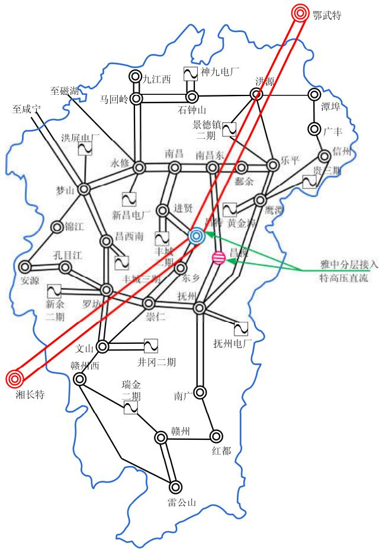  
图 1 2020 年规划江西电网网架结构

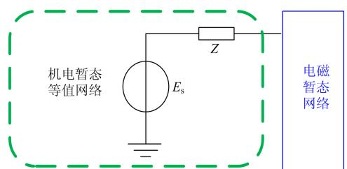  
Fig. 1 Planning of Jiangxi power grid architecture in 2020

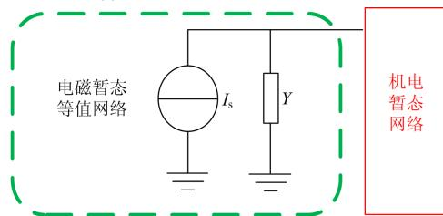  
(a)电磁暂态模型仿真计算   
(b)机电暂态模型仿真计算   
图 2 混合仿真接口等值示意图  
Fig. 2 Interface equivalent diagram of hybrid simulation

对特高压直流分层接入后交直流混联电网进行机电—电磁暂态混合仿真建模需要完成机电侧数据和电磁侧数据准备[22]。在 PSASP 中搭建机电模型

并进行网络分割，然后进行并行计算验证机电数据无误；在ETSDAC 中搭建电磁模型并与PSCAD模型对比分析验证电磁数据无误。最后，进行任务分配并提交数据，启动混合仿真计算[28]。混合仿真模型搭建流程如图3所示。

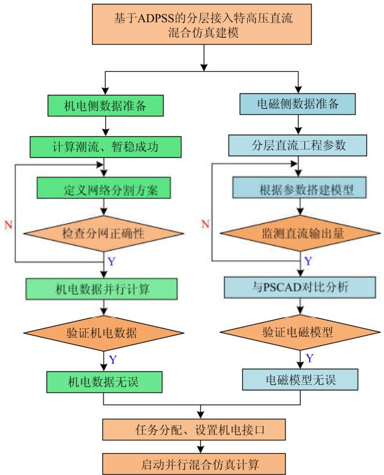  
图 3 混合仿真模型搭建流程  
Fig. 3 Building process of hybrid simulation model

# 2 特高压直流分层接入系统仿真建模

本节基于 ADPSS 平台建立雅中—江西分层接入特高压直流电磁暂态模型，并通过仿真对比验证

模型的正确性。

# 2.1 特高压分层接入一次系统建模

雅中—江西特高压直流输电工程一次系统模型拓扑如图4所示。该系统主要包括等值钳位电压源、整流侧换流站、逆变侧 500kV和1000kV换流站、直流输电线路。其中，受端 500kV 和 1000kV 交流系统短路比分别为 4.53和6.10，换流站主要包含有换流变压器、交直流滤波器、换流器和平波电抗器[29]等设备。换流器采用双桥 12 脉波换流阀搭建而成，高、低端换流器关断角稳态运行值均为 17°[29]。

各换流器通过Y/Y接线与Y/D接线的换流变压器和交流系统相连。各换流变压器的主要参数如表1所示。

表 1 换流变压器参数列表  
Table 1 List of converter transformer parameters   

<table><tr><td>参数</td><td>整流侧</td><td>逆变500kV</td><td>逆变1000kV</td></tr><tr><td>容量/MVA</td><td>1551</td><td>1470</td><td>1470</td></tr><tr><td>绕组电压/kV</td><td>512/175.3</td><td>532/161.8</td><td>1021/161.8</td></tr><tr><td>短路阻抗/%</td><td>23</td><td>19</td><td>20</td></tr></table>

# 2.2 分层接入直流输电控制系统建模

直流输电控制系统对交直流混联电网安稳运行具有重要影响[30]。由于特高压直流分层接入不同电压等级的交流电网，因此每极逆变阀组应进行独立控制[31]。以正极控制为例，整流侧和逆变侧高、低端换流站控制系统结构如图 5所示。

图5中，逆变侧高、低端换流器分别进行独立控制[14] ，下标 1 和 2 分别表示 500 kV 和 1 000 kV系统换流器控制量。整流侧配置有定电流控制；逆变侧配置有定关断角控制、电流偏差控制、定电流控制、换相失败预防控制(CFPREV)和低压限流

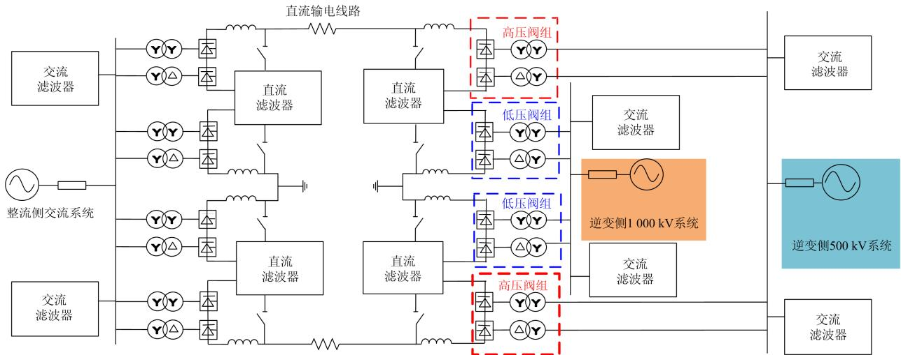  
图 4 雅中—江西特高压直流分层接入系统结构  
Fig. 4 Structure of Yazhong-Jiangxi UHVDC hierarchical connection to system

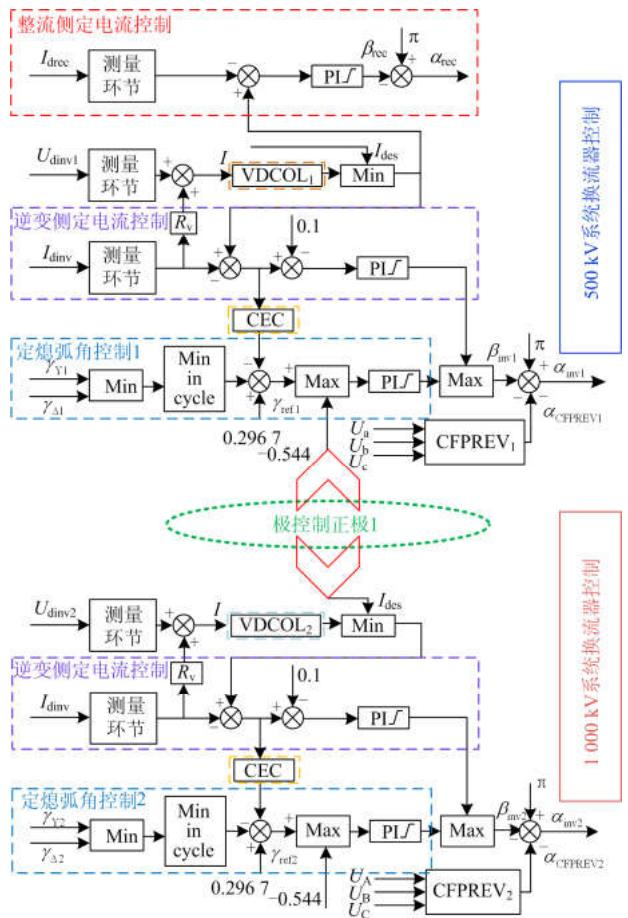  
图 5 直流控制系统结构  
Fig. 5 Structure of DC control system

(Voltage Dependent Current Order Limiter, VDCOL)控制[32] 。 $I _ { \mathrm { d r e c } }$ 表示整流侧直流电流测量值， $\scriptstyle { \alpha _ { \mathrm { r e c } } }$ 表示整流侧定电流控制器输出触发角指令； $I _ { \mathrm { d e s } }$ 为直流电流指令值， $I _ { \mathrm { d i n v } }$ 为逆变侧直流电流测量值， $U _ { \mathrm { d i n v } }$ 为逆变侧直流电压测量值；CEC 为电流偏差控制，γ为逆变侧熄弧角测量值， $U _ { \mathrm { a } } , \ U _ { \mathrm { b } } , \ U _ { \mathrm { c } }$ 为逆变侧换流母线三相电压瞬时值； $\beta _ { \mathrm { i n v } }$ 为逆变侧输出逆变角， $\alpha _ { \mathrm { i n v } }$ 为逆变侧输出触发角， $ { \alpha } _ { \mathrm { C F P R E V } }$ 为换相失败预防控制环节输出触发角指令减小值。直流输电控制系统模型可采用最新版 ADPSS 自带“特高压直流输电控制系统”封装模块进行搭建。同时，针对换相失败预防控制部分，采用用户自定义建模(UDM)搭建以完善直流系统控制功能，具体搭建过程可参考文献[33]。

# 2.3 特高压分层接入直流电磁暂态模型验证

按照 2.1 节和 2.2 节所述建模思路和方法在ADPSS 中搭建雅中—江西分层接入特高压直流电磁暂态模型。通过和 PSCAD/EMTDC 中的电磁模型进行仿真对比，验证本文所搭建特高压分层接入直流电磁暂态模型的正确性。

设置3s时逆变侧500kV换流母线处发生持续时间为0.1s的三相感性接地故障，故障电感值设为0.35H，仿真总时长为 5s。对比故障后 ADPSS 和PSCAD 的暂态响应曲线如图 6所示。

从图6仿真曲线可以看出，500kV换流母线处发生三相感性接地故障后，换相电压降低，高端逆变器关断角减小至0，直流功率下降，发生换相失败[11]。同时，直流电流迅速上升，使1000kV交流系统所连接逆变器运行关断角下降，也发生了换相失败。

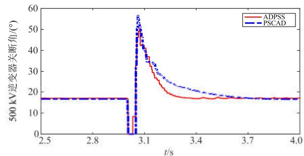  
(a)500kV逆变器关断角

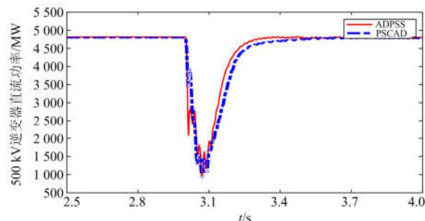  
(b）500kV逆变器直流功率

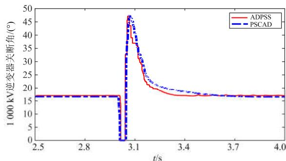  
(c)1000kV逆变器关断角

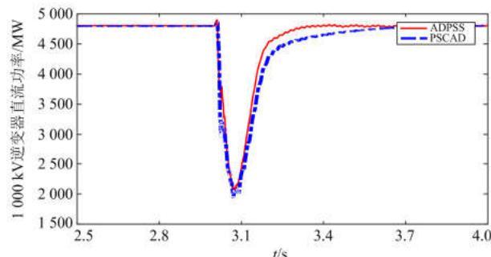  
(d)1000kV逆变器直流功率

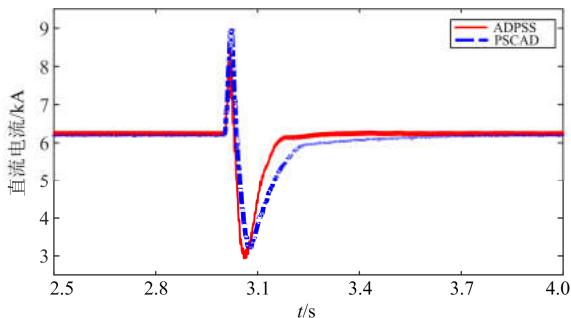  
(e)逆变侧直流电流

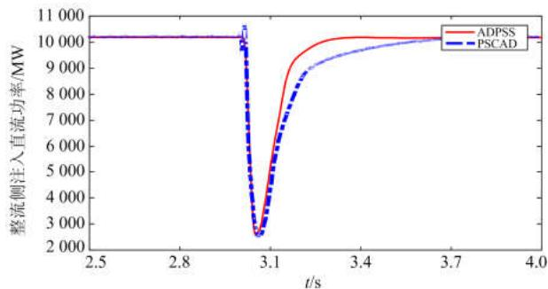  
(f整流侧直流功率   
图 6 分层接入特高压直流电磁暂态模型验证  
Fig. 6 Electromagnetic transient model validation with UHVDC hierarchical connection mode

由于暂态过程中ADPSS和PSCAD模型的动态响应趋势一致，仿真曲线拟合程度很好；因此验证了 ADPSS 中分层特高压直流电磁暂态模型的正确性，可以基于本文所搭建的电磁暂态模型进行机电—电磁暂态混合仿真研究。

# 3 特高压分层直流机电—电磁混合仿真

本节基于所搭建的雅中—江西分层特高压直流电磁模型，进行交直流混联电网机电—电磁暂态混合仿真建模研究。

# 3.1 机电暂态仿真数据准备

对PSASP 中工程全网的机电暂态数据按照 1.2节所述进行网络分割。本文以换流变压器连接的交流侧母线为分网边界[22]，分网示意图如图7所示。

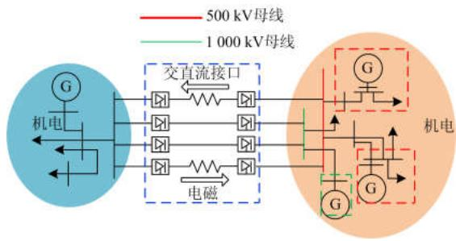  
图 7 混合仿真分网示意图  
Fig. 7 Schematic diagram of hybrid simulation network

其中，红线代表 500kV 交流电网母线，绿线代表1000 kV交流电网母线。

由图7可以看出，雅中—江西分层接入特高压直流部分划分为电磁暂态子网，其余交流电网部分划分为机电暂态子网。

# 3.2 机电—电磁暂态混合仿真

为验证混合仿真模型进行独立控制响应时的正确性和优势，本节通过设置关断角独立控制指令阶跃响应进行仿真对比，分析采用混合仿真模型的优势与不同。

设置4s时500kV逆变器关断角指令阶跃增加10°，7s 时恢复至稳态值；1000kV 逆变器关断角保持不变。仿真总时长为 10s，对比混合仿真模型阶跃响应与电磁暂态模型阶跃响应仿真结果如图 8所示。

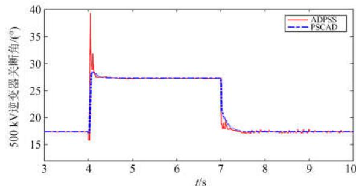  
(a)500kV逆变器关断角

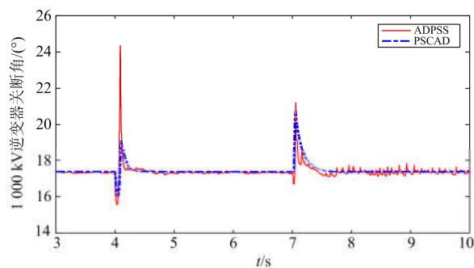  
(b)1000kV逆变器关断角

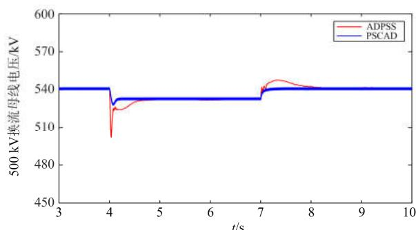  
(c)500kV逆变器换流母线电压

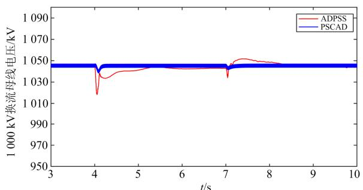  
(d)1000 kV逆变器换流母线电压   
图 8 阶跃响应波形对比  
Fig. 8 Comparison of step responses waveforms

由图8可以看出，关断角阶跃响应过程中，混合仿真模型中 500kV 逆变器能够快速跟踪关断角指令的变化，而1000kV逆变器关断角则保持不变，说明混合仿真模型能够对控制指令进行相对独立的控制和响应。同时，由于500 kV逆变器关断角指令的阶跃增加，导致逆变器吸收无功增多，500 kV换流母线电压下降。

对比阶跃响应仿真结果可知，ADPSS混合仿真模型与纯电磁暂态模型暂态响应一致，在关断角指令阶跃过程中能够很好地拟合，证明了混合仿真模型的正确性。而混合仿真模型能够体现交流网络机电暂态特性，因此其暂态响应波动幅度较大，恢复速度相对较慢。

同时，对阶跃响应过程中采用混合仿真模型和电磁暂态模型所需仿真计算时间进行统计；利用PSCAD 进行电磁暂态仿真耗时约 170s，而基于ADPSS 进行机电—电磁混合仿真耗时约 138s，其计算效率提升 23%左右。

此外，ADPSS混合仿真模型还能够观察交流系统各节点的响应情况。如图9所示，给出阶跃响应后江西省内部分节点母线电压情况。

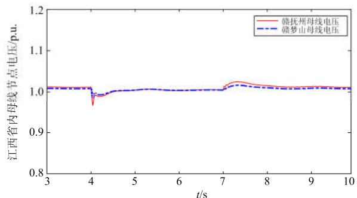  
图 9 混合仿真机电暂态网络母线电压  
Fig. 9 AC voltage in electromechanical transient network

如图9所示，关断角阶跃响应过程中，江西省内母线电压由于换流站无功消耗增多而略有下降；

且抚州站由于靠近换流母线，相比其他远离换流站的节点交流电压变化更大。

# 4 混合仿真与机电暂态仿真对比

本节对比交流故障后混合仿真模型与 PSASP中机电暂态模型的仿真结果，进而说明混合仿真模型相对机电暂态模型的优势。

设置 10s 时永修-梦山线路发生三相接地短路故障，持续时间为 0.1s，仿真总时长为 20s。对比混合仿真模型和 PSASP 机电暂态模型的暂态响应曲线如图10所示。

对比交流电网节点电压可知，暂态过程中混合仿真与机电暂态仿真所得波形暂态响应趋势基本一致，说明混合仿真模型能够反映实际交流大系统的动态特性。而由于机电暂态程序中基于基波相量方程分析直流动态过程，仿真准确性较差[34]。因此虽然直流系统关断角响应曲线总体趋势一致，但机电暂态仿真波动幅度较大；而混合仿真模型的直流波

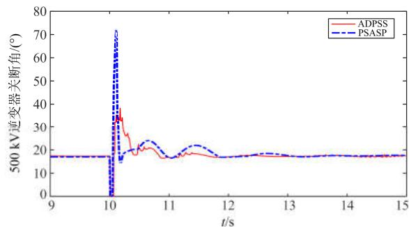  
（a）500kV逆变器关断角

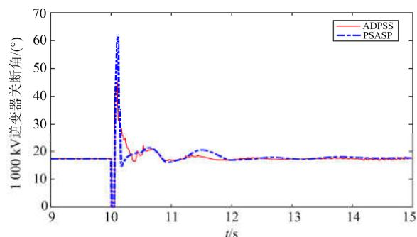  
(b)1000kV逆变器关断角

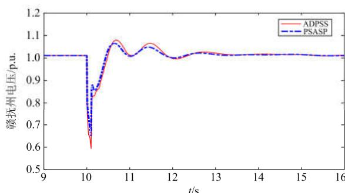  
(c)赣抚州节点电压

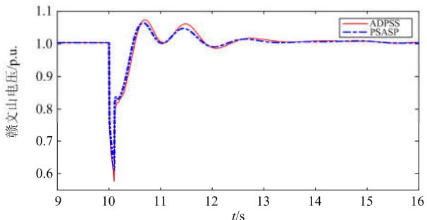  
(d)赣文山节点电压   
图 10 混合仿真与机电暂态仿真对比  
Fig. 10 Comparison of simulation results between hybrid simulation and electromechanical transient simulation

形变化展现更加精细，因此能够更好地反映实际的直流输电响应情况。

# 5 结论

特高压直流分层接入方式下交直流系统耦合关系复杂。本文基于 ADPSS 平台详细阐述了含分层特高压直流的交直流混联电网机电—电磁暂态混合仿真建模过程。通过仿真分析验证，得到了以下结论：

1) 通过与 PSCAD 电磁暂态模型进行仿真对比，验证了所搭建分层特高压直流电磁暂态模型的准确性。  
2) 结合分层接入特高压直流关断角独立控制指令阶跃响应进行仿真分析，结果表明混合仿真模型与电磁暂态模型吻合程度很高，而且能够给出交流系统中各节点的响应情况。  
3)相对于 PSASP 机电暂态模型，混合仿真模型中直流系统模型能够展现更细节的波形变化，仿真准确度更高。可为研究特高压直流分层接入方式下交直流混联大电网的特性提供很好的仿真模型和参考。

# 参考文献

[1] 肖繁, 王涛, 高扬, 等. 基于特高压交直流混联电网的调相机无功补偿及快速响应机制研究[J]. 电力系统保护与控制, 2019, 47(17): 93-100.  
XIAO Fan, WANG Tao, GAO Yang, et al. Research on reactive power compensation and fast response mechanism of synchronous condenser based on UHVAC/DC hybrid grid[J]. Power System Protection and Control, 2019, 47(17): 93-100.   
[2] 李锴, 邵德军, 徐友平, 等. 基于新一代调相机的多目标无功电压协调控制系统研究[J]. 电网技术, 2019,43(8): 2961-2967.  
LI Kai, SHAO Dejun, XU Youping, et al. Research on

coordinated multi-objective reactive voltage control system based on new type synchronous condenser[J]. Power System Technology, 2019, 43(8): 2961-2967.   
[3] WU Z, LI S. Reliability evaluation and sensitivity analysis to AC/UHVDC systems based on sequential Monte Carlo simulation[J]. IEEE Transactions on Power Systems, 2019, 34(4): 3156-3167.   
[4] LI Guodong, LI Gengyin, ZHOU Ming. Model and application of renewable energy accommodation capacity calculation considering utilization level of interprovincial tie-line[J]. Protection and Control of Modern Power Systems, 2019, 4(1): 1-12. DOI: 10.1186/s41601-019- 0115-7.   
[5] 徐少华, 李建林, 宋新甫, 等. 大规模储能系统提升西北地区可再生能源消纳能力分析[J]. 电力建设, 2018,39(4): 67-74.  
XU Shaohua, LI Jianlin, SONG Xinfu, et al. Large-scale energy storage system help to improve northwest area’s renewable energy absorption ability[J]. Electric Power Construction, 2018, 39(4): 67-74.   
[6] SU C, CHENG C, WANG P, et al. Optimization model for the short-term operation of hydropower plants transmitting power to multiple power grids via HVDC transmission lines[J]. IEEE Access, 2019, 7: 139236-139248.   
[7] WANG L, XIE X, DONG X, et al. Real-time optimisation of short-term frequency stability controls for a power system with renewables and multi-infeed HVDCs[J]. IET Renewable Power Generation, 2018, 12(13): 1462-1469.   
[8] 唐晓骏, 张正卫, 韩民晓, 等. 适应多直流馈入受端电网的柔性直流配置方法[J]. 电力系统保护与控制,2019, 47(10): 57-64.  
TANG Xiaojun, ZHANG Zhengwei, HAN Minxiao, et al. VSC-HVDC configuration method suitable for multi-DC feeding receiving power grid[J]. Power System Protection and Control, 2019, 47(10): 57-64.   
[9] 王玲, 文俊, 司瑞华, 等. UHVDC 分极分层接入方式及其运行特性[J]. 电工技术学报, 2018, 33(4): 730-738.  
WANG Ling, WEN Jun, SI Ruihua, et al. The connection mode and operation characteristics of UHVDC with hierarchical connection by pole[J]. Transactions of China Electrotechnical Society, 2018, 33(4): 730-738.   
[10] 刘振亚, 秦晓辉, 赵良, 等. 特高压直流分层接入方式在多馈入直流电网的应用研究[J]. 中国电机工程学报,2013, 33(10): 1-7, 25.  
LIU Zhenya, QIN Xiaohui, ZHAO Liang, et al. Study on the application of UHVDC hierarchical connection mode to multi-infeed HVDC system[J]. Proceedings of the CSEE, 2013, 33(10): 1-7, 25.

[11] 杨硕, 郭春义, 王庆, 等. 分层接入特高压直流输电系统协调控制策略研究[J]. 中国电机工程学报, 2019,39(15): 4356-4363.  
YANG Shuo, GUO Chunyi, WANG Qing, et al. Coordinated control approach for UHVDC system under hierarchical connection mode[J]. Proceedings of the CSEE, 2019, 39(15): 4356-4363.   
[12] 刘士利, 王洋, 张力丹, 等. ±800kV特高压直流受端分层接入方式下低端阀厅金具结构设计[J]. 电工技术学报, 2017, 32(14): 238-245.  
LIU Shili, WANG Yang, ZHANG Lidan, et al. Structure Design of ±800 kV UHVDC receiving end low voltage valve hall fittings for hierarchical connection[J]. Transactions of China Electrotechnical Society, 2017, 32(14): 238-245.   
[13] 王永平, 卢东斌, 王振曦, 等. 适用于分层接入的特高压直流输电控制策略[J]. 电力系统自动化, 2016,40(21): 59-65.  
WANG Yongping, LU Dongping, WANG Zhenxi, et al. Control strategies for UHVDC with hierarchical connection mode[J]. Automation of Electric Power Systems, 2016, 40(21): 59-65.   
[14] 熊永新, 沈郁, 姚伟, 等. ±1100 kV 特高压直流分层接入方式下改进附加功率协调控制策略[J]. 电网技术,2017, 41(11): 3448-3456.  
XIONG Yongxin, SHEN Yu, YAO Wei, et al. Improved additional power coordinated control of ±1100 kV UHVDC system with hierarchical connection mode[J]. Power System Technology, 2017, 41(11): 3448-3456.   
[15] REN Z, LI J, YU F, et al. Simulation and analysis of ±1100 kV UHVDC transmission system with hierarchical connection mode based on PSCAD/EMTDC[J]. The Journal of Engineering, 2019, 2019(16): 1687-1691.   
[16] CHEN Xiaolu, ZHAO Mingyu, LIU Weiming, et al. Simulation of system commissioning test for UHVDC converter station[C] // International Conference on Industrial Informatics-Computing Technology, Intelligent Technology, Industrial Information Integration (ICIICII), December 2-3, 2017, Wuhan, China: 359-362.   
[17] 舒展, 张伟晨, 王光, 等. 特高压直流接入江西电网后的故障影响分析及其应对措施[J]. 电力系统保护与控制, 2019, 47(20): 163-170.  
SHU Zhan, ZHANG Weichen, WANG Guang, et al. Fault analysis and its countermeasures of Jiangxi Provincial Grid after UHVDC line connection[J]. Power System Protection and Control, 2019, 47(20): 163-170.   
[18] 贺静波, 张星, 许涛, 等. 特高压交直流电网机电-电磁暂态混合仿真特性分析[J]. 电力系统及其自动化学

报, 2016, 28(10): 105-110.   
HE Jingbo, ZHANG Xing, XU Tao, et al. Electromechanical-electromagnetic transient hybrid simulation on characteristic analysis of UHVAC-UHVDC grid[J]. Proceedings of the CSU-EPSA, 2016, 28(10): 105-110.   
[19] 陈磊, 张侃君, 夏勇军, 等. 基于 ADPSS 的高压直流输电系统机电暂态-电磁暂态混合仿真研究[J]. 电力系统保护与控制, 2013, 41(12): 136-142.  
CHEN Lei, ZHANG Kanjun, XIA Yongjun, et al. Electromechanical-electromagnetic transient hybrid simulation on HVDC power transmission system based on ADPSS[J]. Power System Protection and Control, 2013, 41(12): 136-142.   
[20] CAI P, XIANG W, WEN J. Modelling and control of a back-to-back MMC–HVDC system using ADPSS[J]. The Journal of Engineering, 2019, 2019(16): 1252-1256.   
[21] 李威, 牛拴保, 吕亚洲, 等. 直流机电暂态仿真建模及与电磁暂态仿真的对比[J]. 高压电器, 2018, 54(8):155-160.  
LI Wei, NIU Shuanbao, LÜ Yazhou, et al. HVDC electromechanical transient model and comparison with HVDC electromagnetic transient model[J]. High Voltage Apparatus, 2018, 54(8): 155-160.   
[22] 蔡普成, 向往, 彭红英, 等. 基于 ADPSS 的含背靠背MMC-HVDC 系统的交直流电网机电-电磁混合仿真研究[J]. 电网技术, 2018, 42(12): 3888-3894.  
CAI Pucheng, XIANG Wang, PENG Hongying, et al. Hybrid electromechanical-electromagnetic simulation of AC/DC power grid with back-to-back MMC-HVDC system based on ADPSS[J]. Power System Technology, 2018, 42(12): 3888-3894.   
[23] 王亮, 荆澜涛, 姚晔, 等. 特高压交直流输电系统暂态混合仿真研究[J]. 高压电器, 2018, 54(9): 202-208.  
WANG Liang, JING Lantao, YAO Ye, et al. Transient hybrid simulation of uhv ac/dc power transmission system[J]. High Voltage Apparatus, 2018, 54(9): 202-208.   
[24] 王洁聪, 刘崇茹, 徐东旭, 等. 基于实时数字仿真器的模块化多电平换流器内部故障混合仿真模型[J]. 电工技术学报, 2019, 34(18): 3831-3842.  
WANG Jiecong, LIU Chongru, XU Dongxu, et al. Hybrid simulation model of modular multilevel converter internal fault based on real-time digital simulator[J]. Transactions of China Electrotechnical Society, 2019, 34(18): 3831-3842.   
[25] 黄娟娟, 李泰军, 田昕, 等. 雅中—江西±800 kV特高压直流工程受端换流站容性无功配置研究[J]. 广东电力, 2016, 29(11): 64-69.

HUANG Juanjuan, LI Taijun, TIAN Xin, et al. Capacitive reactive power compensation in receving-end converter station of Yazhong-Jiangxi ±800 kV ultra-high voltage direct current transmission project[J]. Guangdong Electric Power, 2016, 29(11): 64-69.   
[26] 刘洪波, 边娣, 孙黎, 等. 交直流混联系统机电—电磁暂态混合仿真研究[J]. 电力系统保护与控制, 2019,47(17): 39-47.  
LIU Hongbo, BIAN Di, SUN Li, et al. Electromechanical transient-electromagnetic transient hybrid simulation of AC/DC hybrid system[J]. Power System Protection and Control, 2019, 47(17): 39-47.   
[27] 童伟林, 王建全, 肖谭南, 等. 多馈入直流大规模电网机电-电磁混合仿真的程序实现与结果分析[J]. 能源工程, 2019(6): 30-36, 43.  
TONG Weilin, WANG Jianquan, XIAO Tannan, et al. Implementation and analysis of electromechanicalelectromagnetic hybrid simulation in multi-infeed DC large-scale power grid[J]. Energy Engineering, 2019(6): 30-36, 43.   
[28] 朱旭凯, 周孝信, 田芳, 等. 基于电力系统全数字实时仿真装置的大电网机电暂态—电磁暂态混合仿真[J].电网技术, 2011, 35(3): 26-31.  
ZHU Xukai, ZHOU Xiaoxin, TIAN Fang, et al. Hybrid electromechanical-electromagnetic simulation to transient process of large-scale power grid on the basis of ADPSS[J]. Power System Technology, 2011, 35(3): 26-31.   
[29] 王艺璇, 张鑫, 穆清, 等. 特高压直流分层接入系统换相失败预防控制参数优化[J]. 高电压技术, 2018, 44(1):329-336.  
WANG Yixuan, ZHANG Xin, MU Qing, et al. Parameter optimization of commutation failure prevention and control of UHVDC hierarchical connection to AC grid system[J]. High Voltage Engineering, 2018, 44(1): 329-336.   
[30] 陈凌云, 程改红, 邵冲, 等. LCC-MMC 型三端混合直流输电系统控制策略研究[J]. 高压电器, 2018, 54(7):146-152.

CHEN Lingyun, CHENG Gaihong, SHAO Chong, et al. Research on control strategy for a 3-terminal LCC-MMC HVDC transmission system[J]. High Voltage Apparatus, 2018, 54(7): 146-152.   
[31] 辛建波, 舒展, 谭阳琛, 等. 特高压直流分层接入下换相失败预防协调控制[J]. 电网技术, 2019, 43(10):3543-3551.  
XIN Jianbo, SHU Zhan, TAN Yangchen, et al. Coordinated control of commutation failure prevention for UHVDC hierarchical connection to AC grid[J]. Power System Technology, 2019, 43(10): 3543-3551.   
[32] MIRSAEIDI S, DONG X. An enhanced strategy to inhibit commutation failure in line-commutated converters[J]. IEEE Transactions on Industrial Electronics, 2020, 67(1): 340-349.   
[33] 刘畅. 特高压直流控制保护系统精细化建模与交直流相互影响分析[D]. 武汉: 华中科技大学,2018.  
LIU Chang. Refined model for the control and protection system of UHVDC and analysis of the mutual interaction between AC and DC systems[D]. Wuhan: Huazhong University of Science and Technology, 2018.   
[34] 程佩芬, 李崇涛, 傅闯, 等. 基于状态空间法的高压直流输电系统电磁暂态简化模型的解析算法[J]. 电工技术学报, 2019, 34(6): 1230-1239.  
CHENG Peifen, LI Chongtao, FU Chuang, et al. An analytic solution for simplified electromagnetic transient model of HVDC transmission system based on state space method[J]. Transactions of China Electrotechnical Society, 2019, 34(6): 1230-1239.

收稿日期：2020-02-19； 修回日期：2020-04-15

作者简介：

熊华强(1972—)，男，学士，教授级高级工程师，研究方向为电力系统运行与控制；E-mail: xhqzp@163.com

杨程祥(1996—)，男，通信作者，硕士研究生，研究方向 为 交 直 流 混 联 电 网 稳 定 性 分 析 与 控 制 。 E-mail:chengxiangyang1234@163.com

(编辑 周金梅)