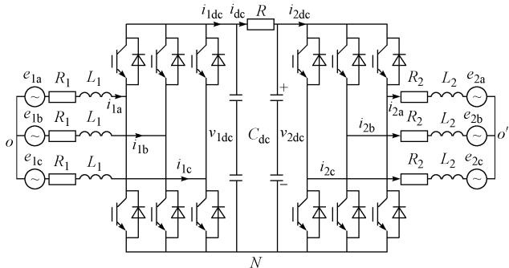

# VSC-HVDC系统的动态相量法建模仿真分析

孙栩1,2，孔力

(1. 中国科学院电工研究所，北京市 100080；2. 中国科学院研究生院，北京市 100080)

摘要：运用一种新的建模方法——基于时变傅里叶级数的动态相量法对基于电压源换流器的高压直流输电(VSC-HVDC)系统进行建模分析。在系统开关函数模型的基础上，该方法通过忽略系统动态方程中状态变量所对应的时变傅里叶级数中那些不重要的高次项而对原系统进行简化，从而得到系统的动态相量模型及其方程。结果表明，动态相量法模型仿真相当于详细时域模型仿真结果的包络线，而且可以极大地减少系统的仿真时间，可以作为电磁暂态和机电暂态模型的接口，应用于电力系统的混合仿真。

关键词：动态相量法；高压直流输电；电压源型换流器；建模；傅里叶变换

中图分类号：TM721.1

# 0 引言

近几十年以来，高压直流输电（HVDC）技术在世界许多国家得到了普遍使用，特别在中国，发展的势头更是迅猛，文献[1]指出，不但多条 $500\mathrm{kV}$ 直流系统已投入运行，而且 $800\mathrm{kV}$ 特高压直流输电也已开始规划，计划应用到西南水电的外送上。

HVDC技术所以能得到广泛应用，这与其优越性能是分不开的，它不但可以远距离大容量传输功率，实现大电网间的非同步联网，还可用于交流电网的快速稳定控制。但是，HVDC技术本身也存在着缺点，即它的换相方式是传统的电网换相。

文献[2]指出，在接入弱系统，即短路比（SCR）比较低时(一般认为小于2.5)，有可能发生换相失败问题，导致直流系统非正常运行。现在开展了许多研究以解决这个问题，最根本的解决方案是利用可关断电力电子器件作为直流输电的换流阀，用自换相方式替代电网换相方式，这种直流输电方式称为基于电压源换流器（VSC）的HVDC（VSC-HVDC）。文献[3]介绍了VSC-HVDC这种新型输电技术的基本原理及特点。VSC-HVDC系统由2个对称的VSC通过直流线路连接而成，对它进行准确而有效的建模具有很重要的意义。文献[4]建立了VSC-HVDC系统的开关函数模型。在这些模型的基础上，文献[5-6]分析了VSC-HVDC系统在 $dq^{0}$ 坐标下有功功率与无功功率独立调节的控制方法与策略。

在实际的仿真中，特别是电磁暂态与机电暂态

混合仿真中，如果VSC-HVDC系统只采用详细的时域仿真，那么在要求实时仿真的情况下，仿真时间将肯定达不到要求，在这种情况下，动态相量法是一种很好的选择。文献[7]表明，动态相量法是一种建模方法，其思想起源于传统的平均值法，由基于反映元件动态特性的状态变量对应的时变傅里叶系数推导得出。通过动态相量可以描绘出原始波形近似的包络线，从而反映原始波形的动态行为。文献[8-9]分析了动态相量法对电力电子装置建模的一般方法。

在借鉴了以上分析的基础上，本文将动态相量法应用于VSC-HVDC技术的建模上，在基于开关函数描述的换流器详细时域动态模型的基础上，建立了VSC-HVDC系统的动态相量法模型，并给出了与之对应的详细推导。结果表明，动态相量法模型仿真相当于详细时域模型仿真结果的包络线，而且可以大大提高计算效率，缩短仿真时间而又不失准确性，可以作为电磁暂态和机电暂态模型的接口，应用于电力系统的混合仿真。

# 1 动态相量法建模原理

对于时域中以 $T$ 为周期的函数 $X(\tau)$ ，在区间 $\tau \in (t - T,t)$ 上可以表示为傅里叶级数的形式：

$$
X (\tau) = \sum_ {k = - \infty} ^ {\infty} X _ {k} (t) e ^ {j k \omega_ {s} \tau} \tag {1}
$$

式中： $\omega_{s} = 2\pi / T; X_{k}(t)$ 是一系列时变的傅里叶复系数，称为动态相量，其第 $k$ 次系数称为 $k$ 相量，由平均运算得到：

$$
X _ {k} (t) = \frac {1}{T} \int_ {t - T} ^ {t} x (\tau) \mathrm {e} ^ {- \mathrm {j} k \omega_ {\mathrm {s}} \tau} \mathrm {d} \tau = \langle x \rangle_ {k} (t) \tag {2}
$$

$X_{k}(t)$ 是时间的函数。当所研究的窗（宽度为 $T$ ）在波形 $x(\tau)$ 上沿时间轴移动时，相量 $X_{k}(t)$ 就会改变。忽略级数中不重要的项，可以简化模型，从而抓住系统的主要特征。在建模过程中，一般保留一次项(基波)系数或者零次(直流分量)系数，并将这些相量作为状态变量，可以得到系统新的状态空间模型。

必须说明的是，以上相量都是复数表示，可以满足以下关系：

$$
\begin{array}{l} \langle \mathbf {x} \rangle_ {k} = \langle \mathbf {x} \rangle_ {k} ^ {\mathrm {R}} + j \langle \mathbf {x} \rangle_ {k} ^ {\mathrm {I}} = \langle \mathbf {x} \rangle_ {k} ^ {*} = \\ \left(\langle x \rangle_ {- k} ^ {\mathrm {R}} + \mathrm {j} \langle x \rangle_ {- k} ^ {\mathrm {I}}\right) ^ {*} \tag {3} \\ \end{array}
$$

式中：上标R和I分别表示实部和虚部；*表示复数共轭。

动态相量法具备以下2个重要特性：

# 1) 相量微分特性

对于第 $k$ 阶傅里叶系数，其微分形式满足：

$$
\frac {\mathrm {d} X _ {k} (t)}{\mathrm {d} t} = \left\langle \frac {\mathrm {d} x}{\mathrm {d} t} \right\rangle_ {k} (t) - \mathrm {j} k \omega_ {\mathrm {s}} X _ {k} (t) \tag {4}
$$

对于线性电路元件，诸如电阻、电感和电容，可以分别得到：

$$
\left\{ \begin{array}{l} \langle v _ {R} \rangle_ {k} = R \langle i _ {k} \\ \langle v _ {L} \rangle_ {k} = L \frac {\mathrm {d} \langle i _ {l} \rangle_ {k}}{\mathrm {d} t} + j k \omega_ {\mathrm {s}} L \langle i _ {L} \rangle_ {k} \\ \langle i _ {C} \rangle_ {k} = C \frac {\mathrm {d} \langle v _ {C} \rangle_ {k}}{\mathrm {d} t} + j k \omega_ {\mathrm {s}} G \langle v _ {C} \rangle_ {k} \end{array} \right. \tag {5}
$$

# 2) 相量乘积特性

对于2个波形 $x(t)$ 和 $q(t)$ ，有

$$
\langle x \dot {q} \rangle_ {k} = \sum_ {i} \langle x \rangle_ {k - 1} \langle q _ {i} \tag {6}
$$

即2个时域变量乘积的相量可以由每个变量对应的相量卷积而得。

通常将动态相量法应用到具有周期特性的电力电子电路中，假设其时域模型可以表示成：

$$
\frac {\mathrm {d} x (t)}{\mathrm {d} t} = f \{x (t), u (t) \} \tag {7}
$$

通常用 $x(t)$ 函数表示电压、电流信号， $u(t)$ 表示符号函数或其他一些信号的函数。

将上述时域模型转变为动态相量模型，要应用上面所提到的相量微分特性，可得到：

$$
\frac {\mathrm {d} \langle x \rangle_ {k}}{\mathrm {d} t} = - \mathrm {j} k \omega_ {\mathrm {s}} \langle x \rangle_ {k} + \langle f (x, u) \rangle_ {k} \tag {8}
$$

动态相量法基于频率分解的思想，希望以傅里叶级数中极少量的系数来近似原始波形。但是，考虑的谐波次数越多，模型越精确，其复杂程度也明显增加。

# 2 VSC-HVDC系统动态相量法建模

VSC-HVDC系统是由变压器和通过直流电容器及直流线路耦合在一起的2个VSC(VSC1和VSC2)组合而成的，2个VSC均通过变压器并联接入2个系统，其详细的三相拓扑电路如图1所示。

  
图1VSC-HVDC系统的三相电路  
Fig.1 Three-phase VSC-HVDC circuit diagram

对于一个脉宽调制(PWM)控制下的VSC，同一桥臂的2个开关器件交替导通，其开关函数S定义如下： $S = 1$ ，代表对应桥臂中的上管导通，下管关断； $S = 0$ ，代表对应桥臂中的下管导通，上管关断。

以VSC1为例，根据基尔霍夫电压、电流定律，并引入开关函数方法，可以得到VSC1的方程式：

$$
\left\{ \begin{array}{l} L _ {1} \frac {\mathrm {d} i _ {1 \mathrm {a}}}{\mathrm {d} t} = - R _ {1} i _ {1 \mathrm {a}} - v _ {1 \mathrm {d c}} S _ {1 \mathrm {a}} + \frac {v _ {1 \mathrm {d c}}}{3} \sum_ {j = \mathrm {a}, \mathrm {b}, \mathrm {c}} S _ {1 j} + e _ {1 \mathrm {a}} \\ L _ {1} \frac {\mathrm {d} i _ {1 \mathrm {b}}}{\mathrm {d} t} = - R _ {1} i _ {1 \mathrm {b}} - v _ {1 \mathrm {d c}} S _ {1 \mathrm {b}} + \frac {v _ {1 \mathrm {d c}}}{3} \sum_ {j = \mathrm {a}, \mathrm {b}, \mathrm {c}} S _ {1 j} + e _ {1 \mathrm {b}} \\ L _ {1} \frac {\mathrm {d} i _ {1 \mathrm {c}}}{\mathrm {d} t} = - R _ {1} i _ {1 \mathrm {c}} - v _ {1 \mathrm {d c}} S _ {1 \mathrm {c}} + \frac {v _ {1 \mathrm {d c}}}{3} \sum_ {j = \mathrm {a}, \mathrm {b}, \mathrm {c}} S _ {1 j} + e _ {1 \mathrm {c}} \end{array} \right. \tag {9}
$$

同理可得VSC2的方程式。

以VSC1的a相为例，由面积等效原理可知，在一个开关周期 $(1 / \omega_{\mathrm{s}})$ 内，可以求得此周期内的开关函数 $S_{1\mathrm{a}}$ 的平均值，进而可以求得 $S_{1\mathrm{a}}$ 在整个系统的基波周期 $(1 / \omega)$ 内的平均值，根据傅里叶分解的原则，可以得到 $S_{1\mathrm{a}}$ 的基波交流分量：

$$
d _ {1 a} = 0. 5 + \frac {m _ {1}}{2} \cos (\omega t - \delta_ {1}) \tag {10}
$$

同理可得 $\mathbf{b}$ 相、c相的开关函数基波交流分量：

$$
\begin{array}{l} d _ {1 b} = 0. 5 + \frac {m 1}{2} \cos \left(\omega t - \delta_ {1} - \frac {2 \pi}{3}\right) (11) \\ d _ {1 \mathrm {e}} = 0. 5 + \frac {m _ {1}}{2} \cos \left(\omega t - \delta_ {1} + \frac {2 \pi}{3}\right) (12) \\ \end{array}
$$

式中： $m_{1}$ 和 $\delta_{1}$ 分别为VSC1的调制比和触发角。

将式(10)～式(12)代入式(9)，可得VSC-HVDC系统交流部分的动态方程(以VSC1为例， $\mathrm{VSC^2}$ 同理)：

$$
\left\{ \begin{array}{r l} L _ {1} \frac {\mathrm {d} i _ {1 \mathrm {a}}}{\mathrm {d} t} & = - R _ {1} i _ {1 \mathrm {a}} - \frac {m _ {1}}{2} v _ {1 \mathrm {d c}} \cos \left(\omega t - \delta_ {1}\right) + e _ {1 \mathrm {a}} \\ L _ {1} \frac {\mathrm {d} i _ {1 \mathrm {b}}}{\mathrm {d} t} & = - R _ {1} i _ {1 \mathrm {b}} - \frac {m _ {1}}{2} v _ {1 \mathrm {d c}} \cdot \\ & \quad \cos \left(\omega t - \delta_ {1} - \frac {2}{3} \pi\right) + e _ {1 \mathrm {b}} \\ L _ {1} \frac {\mathrm {d} i _ {1 \mathrm {c}}}{\mathrm {d} t} & = - R _ {1} i _ {1 \mathrm {c}} - \frac {m _ {1}}{2} v _ {1 \mathrm {d c}} \cdot \\ & \quad \cos \left(\omega t - \delta_ {1} + \frac {2}{3} \pi\right) + e _ {1 \mathrm {c}} \end{array} \right. \tag {13}
$$

另外，可得到直流电容器动态方程为：

$$
\begin{array}{l} C _ {\mathrm {d c}} \frac {\mathrm {d} \left(v _ {1 \mathrm {d c}} + v _ {2 \mathrm {d c}}\right)}{\mathrm {d} t} = i _ {1 \mathrm {d c}} - i _ {2 \mathrm {d c}} = \\ \sum_ {j = \mathrm {a}, \mathrm {b}, \mathrm {c}} (i _ {1 j} d _ {1 j} - i _ {2 j} d _ {2 j}) \tag {14} \\ \end{array}
$$

综上所述，式(13)、式(14)就是VSC-HVDC系统的开关函数表示。

下面根据动态相量的计算公式推导其对应的动态相量方程。在推导过程中，交流侧电流只考虑基频分量，直流电压只考虑直流分量，对于开关函数则考虑直流分量和基频分量。

以VSC1的a相为例，其动态相量微分特性为：

$$
\left\{ \begin{array}{l} \langle \frac {\mathrm {d} i _ {1 \mathrm {a}}}{\mathrm {d} t} \rangle_ {1} = \mathrm {j} \omega \left(i _ {1 \mathrm {a}}\right) _ {1} + \frac {\mathrm {d} \left(i _ {1 \mathrm {a}}\right) _ {1}}{\mathrm {d} t} \\ \langle \frac {\mathrm {d} i _ {1 \mathrm {a}}}{\mathrm {d} t} \rangle_ {- 1} = - \mathrm {j} \omega \left(i _ {1 \mathrm {a}}\right) _ {- 1} + \frac {\mathrm {d} \left(i _ {1 \mathrm {a}}\right) _ {- 1}}{\mathrm {d} t} \end{array} \right. \tag {15}
$$

式中： $i_{1\mathrm{a}}(t)$ 为实数信号，所以 $\langle i_{1\mathrm{a}}\rangle -k = \langle i_{1\mathrm{a}}\rangle_{k}^{*}$ ，得

$$
\begin{array}{l} \frac {\mathrm {d} I _ {1 \mathrm {a} 1}}{\mathrm {d} t} = - \mathrm {j} \omega I _ {1 \mathrm {a} 1} - \frac {1}{L _ {1}} R _ {1} I _ {1 \mathrm {a} 1} - \\ \frac {1}{L _ {1}} \frac {m _ {1}}{4} \left\langle v _ {1 d c} \right\rangle_ {0} e ^ {- j \delta_ {1}} + \frac {1}{L _ {1}} E _ {1 a 1} \tag {16} \\ \end{array}
$$

同理， $\mathbf{b}$ 相、c相有：

$$
\begin{array}{l} \frac {\mathrm {d} I _ {1 \mathrm {b} 1}}{\mathrm {d} t} = - \mathrm {j} \omega I _ {1 \mathrm {b} 1} - \frac {1}{L _ {1}} R _ {1} I _ {1 \mathrm {b} 1} - \\ \frac {1}{L _ {1}} \frac {m _ {1}}{4} \left\langle v _ {1 d c} \right\rangle_ {0} e ^ {- \left(\delta_ {1} + \frac {2}{3} n\right)} + \frac {1}{L _ {1}} E _ {1 b 1} \tag {17} \\ \end{array}
$$

$$
\begin{array}{l} \frac {\mathrm {d} I _ {1 \mathrm {c l}}}{\mathrm {d} t} = - \mathrm {j} \omega I _ {1 \mathrm {c l}} - \frac {1}{L _ {1}} R _ {1} I _ {1 \mathrm {c l}} - \\ \frac {1}{L _ {1}} \frac {m _ {1}}{4} \left\langle v _ {1 d c} \right\rangle_ {0} e ^ {- j \left(\delta_ {1} + \frac {4}{3} \pi\right)} + \frac {1}{L _ {1}} E _ {1 c 1} \tag {18} \\ \end{array}
$$

直流部分的动态相量方程为：

$$
\begin{array}{l} \frac {\mathrm {d} \left. v _ {1 \mathrm {d c}} + v _ {2 \mathrm {d c}} \right\rangle_ {0}}{\mathrm {d} t} = \left\langle \frac {\mathrm {d} v _ {1 \mathrm {d c}}}{\mathrm {d} t} \right\rangle_ {0} + \left\langle \frac {\mathrm {d} v _ {2 \mathrm {d c}}}{\mathrm {d} t} \right\rangle_ {0} = \\ \frac {1}{C _ {\mathrm {d c}}} \langle \sum_ {j = \mathrm {a}, \mathrm {b}, \mathrm {c}} \left(i _ {1 j} d _ {1 j} - i _ {2 j} d _ {2 j}\right) \rangle_ {0} \tag {19} \\ \end{array}
$$

式中：

$$
\begin{array}{l} \langle i _ {1 a} d _ {1 a} - i _ {2 a} d _ {2 a} \rangle_ {0} = \langle i _ {1 a} d _ {1 a} \rangle_ {0} - \langle i _ {2 a} d _ {2 a} \rangle_ {0} = \\ I _ {1 \mathrm {a} 1} \langle d _ {1 \mathrm {a} 1} \rangle_ {- 1} + I _ {1 \mathrm {a} 1} ^ {*} \langle d _ {1 \mathrm {a} 1} \rangle_ {1} - \\ \end{array}
$$

$$
I _ {2 a 1} \left\langle d _ {2 a} \right\rangle_ {- 1} - I _ {2 a 1} ^ {*} \left\langle d _ {2 a} \right\rangle_ {1} \tag {20}
$$

同时，由傅里叶级数求解公式可以得到：

$$
\left\{ \begin{array}{l} \langle d _ {1 a} \rangle_ {0} = \frac {1}{2} \\ \langle d _ {2 a} \rangle_ {0} = \frac {1}{2} \\ \langle d _ {1 a} \rangle_ {1} = \frac {m 1}{4} e ^ {- j \delta_ {1}} \\ \langle d _ {2 a} \rangle_ {1} = \frac {m 2}{4} e ^ {- j \delta_ {2}} \\ \langle d _ {1 a} \rangle_ {- 1} = \frac {m 1}{4} e ^ {j \delta_ {1}} \\ \langle d _ {2 a} \rangle_ {- 1} = \frac {m 2}{4} e ^ {j \delta_ {2}} \end{array} \right. \tag {21}
$$

将式(21)代入式(19)，可以得到直流部分的动态相量方程：

$$
\begin{array}{l} \frac {\mathrm {d} \left(V _ {1 \mathrm {d c} ^ {0}} + V _ {2 \mathrm {d c} ^ {0}}\right)}{\mathrm {d} t} = \frac {I _ {1 \mathrm {a l}} ^ {\mathrm {r}}}{C _ {\mathrm {d c}}} \frac {3 m 1}{2} \cos \delta_ {1} - \frac {I _ {1 \mathrm {a l}} ^ {\mathrm {i}}}{C _ {\mathrm {d c}}} \frac {3 m 1}{2} \sin \delta_ {1} - \\ \frac {I _ {\mathrm {2 a} 1} ^ {\mathrm {r}}}{C _ {\mathrm {d c}}} \frac {3 m _ {2}}{2} \cos \delta_ {2} + \frac {I _ {\mathrm {2 a} 1} ^ {\mathrm {i}}}{C _ {\mathrm {d c}}} \frac {3 m _ {2}}{2} \sin \delta_ {2} \tag {22} \\ \end{array}
$$

将相量分开为实部和虚部表示（以a相为例），加上直流部分的方程，可得：

$$
\left\{ \begin{array}{r l} \frac {\mathrm {d} I _ {1 \mathrm {a} 1} ^ {\mathrm {r}}}{\mathrm {d} t} & = - \frac {R _ {1}}{L _ {1}} I _ {1 \mathrm {a} 1} ^ {\mathrm {r}} + \omega I _ {1 \mathrm {a} 1} ^ {\mathrm {i}} - \frac {m _ {1} V _ {1 \mathrm {d c} 0}}{4 L _ {1}} \cos \delta_ {1} + \frac {E _ {1 \mathrm {a} 1} ^ {\mathrm {r}}}{L _ {1}} \\ \frac {\mathrm {d} I _ {1 \mathrm {a} 1} ^ {\mathrm {i}}}{\mathrm {d} t} & = - \frac {R _ {1}}{L _ {1}} I _ {1 \mathrm {a} 1} ^ {\mathrm {i}} - \omega I _ {1 \mathrm {a} 1} ^ {\mathrm {r}} + \frac {m _ {1} V _ {1 \mathrm {d c} 0}}{4 L _ {1}} \sin \delta_ {1} + \frac {E _ {1 \mathrm {a} 1} ^ {\mathrm {i}}}{L _ {1}} \\ \frac {\mathrm {d} I _ {2 \mathrm {a} 1} ^ {\mathrm {r}}}{\mathrm {d} t} & = - \frac {R _ {2}}{L _ {2}} I _ {2 \mathrm {a} 1} ^ {\mathrm {r}} + \omega I _ {2 \mathrm {a} 1} ^ {\mathrm {i}} + \frac {m _ {2} V _ {2 \mathrm {d c} 0}}{4 L _ {2}} \cos \delta_ {2} - \frac {E _ {2 \mathrm {a} 1} ^ {\mathrm {r}}}{L _ {2}} \\ \frac {\mathrm {d} I _ {2 \mathrm {a} 1} ^ {\mathrm {i}}}{\mathrm {d} t} & = - \frac {R _ {2}}{L _ {2}} I _ {2 \mathrm {a} 1} ^ {\mathrm {i}} - \omega I _ {2 \mathrm {a} 1} ^ {\mathrm {r}} - \frac {m _ {2} V _ {2 \mathrm {d c} 0}}{4 L _ {2}} \sin \delta_ {2} - \frac {E _ {2 \mathrm {a} 1} ^ {\mathrm {i}}}{L _ {2}} \\ \frac {\mathrm {d} (V _ {1 \mathrm {d c} 0} + V _ {2 \mathrm {d c} 0})}{\mathrm {d} t} & = \frac {I _ {1 \mathrm {a} 1} ^ {\mathrm {r}}}{C _ {\mathrm {d c}}} \frac {3 m _ {1}}{2} \cos \delta_ {1} - \frac {I _ {1 \mathrm {a} 1} ^ {\mathrm {i}}}{C _ {\mathrm {d c}}} \frac {3 m _ {1}}{2}. \\ & \quad \sin \delta_ {1} - \frac {I _ {2 \mathrm {a} 1} ^ {\mathrm {r}}}{C _ {\mathrm {d c}}} \frac {3 m _ {2}}{2} \cos \delta_ {2} - \\ & \quad \frac {I _ {2 \mathrm {a} 1} ^ {\mathrm {i}}}{C _ {\mathrm {d c}}} \frac {3 m _ {2}}{2} \sin \delta_ {2} \end{array} . \right.
$$

(23)

式(23)即为VSC-HVDC系统最终的动态相量方程，矩阵表达形式为：

$$
\dot {\boldsymbol {X}} = \boldsymbol {A} \boldsymbol {X} + \boldsymbol {B} \boldsymbol {U} \tag {24}
$$

式中： $X = [I_{1\mathrm{a}}^{\mathrm{r}},I_{1\mathrm{a}1}^{\mathrm{i}},I_{2\mathrm{a}1}^{\mathrm{r}},I_{2\mathrm{a}1}^{\mathrm{i}},V_{1\mathrm{dc}0} + V_{2\mathrm{dc}0}];$ $\boldsymbol {U} =$ $[E_{1\mathrm{a}1}^{\mathrm{r}},E_{1\mathrm{a}1}^{\mathrm{i}},E_{2\mathrm{a}1}^{\mathrm{r}},E_{2\mathrm{a}1}^{\mathrm{i}}]$ 为VSC-HVDC系统两端的交流电压； $m_1,m_2,\delta_1,\delta_2$ 为控制参数。

# 3 仿真分析

由以上得出的动态相量模型，利用MATLAB

对VSC-HVDC系统进行了仿真分析。为验证动态相量法适用于VSC-HVDC系统的建模分析，本文利用这种方法进行了仿真，并将结果与详细时域下的电磁暂态模型仿真结果进行比较。

仿真电路如图1所示，两侧的VSC为对称结构，电气参数相等。各电气参数为：相电压 $600\mathrm{V}$ 电阻 $0.0001\Omega$ ，换流电感 $20\mathrm{mH}$ ，直流电容 $75\mu \mathrm{F}$ 。

在 $0.15 \mathrm{~s}$ 时，一侧的VSC的调制比发生变化，由原来的0.78变为0.65，在 $0.3 \mathrm{~s}$ 时恢复初始值。在此扰动下，有功功率、直流电压以及交流电流的仿真波形见附录A。

从仿真结果可以看出，根据动态相量模型仿真得出的结果与详细时域仿真得到的结果可以很好地吻合，也就是说，动态相量模型的结果就是详细时域仿真结果的包络线。另外，采用动态相量法模型仿真可以极大地减少仿真的时间，采用详细时域模型仿真和动态相量法模型仿真的时间分别为 $15.36\mathrm{s}$ 和 $0.74\mathrm{s}$ 。

附录见本刊网络版(http://www·aeps-info.com/aeps/ch/index.aspx)。

# 参考文献

[1] 舒印彪，刘泽洪，高理迎，等. $\pm 800\mathrm{kV}6400\mathrm{MW}$ 特高压直流输电工程设计.电网技术，2006，30(1)：1-8.  
SHU Yinbiao, LIU Zehong, GAO Liying, et al. A preliminary exploration for design of $\pm 800\mathrm{kV}$ UHVDC project with transmission capacity of $6400\mathrm{MW}$ . Power System Technology, 2006, 30(1): 1-8.   
[2] 徐政. 交直流电力系统动态行为分析. 北京：机械工业出版社，2004.  
[3] 李庚银, 吕鹏飞, 李广凯, 等. 轻型高压直流输电技术的发展与展望. 电力系统自动化, 2003, 27(4): 77-81.  
LI Gengyin, LU Pengfei, LI Guangkai, et al. Development and prospects for HVDC light. Automation of Electric Power

Systems, 2003, 27(4): 77-81.  
[4] 郑超, 周孝信, 李若梅. 新型高压直流输电的开关函数建模与分析. 电力系统自动化, 2005, 29(8): 32-35.  
ZHENG Chao, ZHOU Xiaoxin, LI Ruomei. Modeling and analysis for VSC-HVDC using the switching function. Automation of Electric Power Systems, 2005, 29(8): 32-35.   
[5] 陈谦，唐国庆，胡铭.采用 $dq^{0}$ 坐标的VSC-HVDC稳态模型与控制器设计.电力系统自动化，2004,28(16)：61-66.  
CHEN Qian, TANG Guoqing, HU Ming. Steady-state model and controller design of a VSC-HVDC converter based on $dq^{0-}$ axis. Automation of Electric Power Systems, 2004, 28(16): 61-66.   
[6] 赵成勇, 李金丰, 李广凯. 基于有功和无功独立调节的 VSC-HVDC 控制策略. 电力系统自动化, 2005, 29(9): 20-24.  
ZHAO Chengyong, LI Jinfeng, LI Guangkai. VSC-HVDC control strategy based on respective adjustment of active and reactive power. Automation of Electric Power Systems, 2005, 29(9): 20-24.   
[7] SANDERS S R, NOWOROLSKI J M, LIU X Z, et al. Generalized averaging method for power conversion circuit. IEEE Trans on Power Electronics, 1991, 6(2): 251-259.   
[8] STANKOVIC A M, MATTAVELLI P, CALISKAN V, et al. Modeling and analysis of FACTS devices with dynamic phasors// Proceedings of IEEE Power Engineering Society Winter Meeting: Vol 2, Jan 27-31, 2000, Singapore: 1440-1446.   
[9] 戚庆茹, 焦连伟, 陈寿孙, 等. 运用动态相量法对电力电子装置建模与仿真初探. 电力系统自动化, 2003, 27(9):6-10.  
QI Qingru, JIAO Lianwei, CHEN Shousun, et al. Application of the dynamic phasors in modeling and simulation of electronic converters. Automation of Electric Power Systems, 2003, 27(9): 6-10.

孙栩(1978一)，男，通信作者，博士研究生，主要研究方向：HVDC、风力发电及分布式发电系统。E-mail:sunxu $@$ mail·iee·ac·cn

孔力（1958一），男，博士，研究员，博士生导师，主要研究方向：电力系统分析、分布式发电以及微电网系统。

# Modeling and Simulation Analysis of VSC-HVDC System with Dynamic Phasors Method

SUN Xu, KONG Li

(Chinese Academy of Science, Beijing 100080, China)

Abstract: Based on the time-varying Fourier coefficient series, a newly developed method—dynamic phasors method is presented and applied to model and analyze VSC-HVDC (voltage source converter based HVDC). On the basis of the system switch function model, this approach makes the system simple by neglecting the unimportant higher order components and keeping only those significant components of the Fourier series corresponding to the state variables in the system dynamic equations, so the system dynamic phasors model and equation can be gained. The results show that the dynamic phasors method simulation corresponds to the envelop of the detailed time domain simulation and can reduce the system simulation time greatly. The dynamic phasors method can become the interface of the electromagnetic transient and electromechanical transient models and is applied to the hybrid simulation of power system.

Key words: dynamic phasors method; HVDC; voltage source converter; model; Fourier transform