# Modal Domain-Based Modeling of Parallel Transmission Lines With Emphasis on Accurate Representation of Mutual Coupling Effects

Bjørn Gustavsen, Senior Member, IEEE

Abstract—Transient and harmonic coupling effects between parallel overhead lines are normally modeled via frequency-dependent traveling-wave-type transmission-line models. Several electromagnetic transient programs rely on a line model based on a constant transformation matrix and modes (FD-line). These line models can, however, give substantial errors in the studies of coupled disturbance from one line to a neighbor line. In this paper, we show that the accuracy of the FD-line in these applications can be greatly improved by representing the line system by independent FD-lines in combination with rational models that take the mutual coupling between the lines into account. A mode-revealing transformation is used for further enhancing the accuracy of the coupling effect. The approach is demonstrated for the simulation of transient coupling between two parallel overhead lines caused by line energization and for assessing the disturbance of a railway signaling system from a neighboring overhead line caused by a transformer inrush current and fault transients.

Index Terms—Disturbance, electromagnetic compatibility (EMC), mutual coupling, railway, transients, transmission-line model.

# I. INTRODUCTION

E LECTROMAGNETIC transient simulation programs [1]include transmission-line models that can be embedded in include transmission-line models that can be embedded in general electrical circuits for detailed studies of transient voltages and currents in power system networks. The most commonly applied line model is the traveling-wave-type model due to its efficiency in handling the delay effects of the line. This category of line models has developed over the years, from modal domain models (FD-line) [2], [3] based on a constant transformation matrix and frequency-dependent modes to models based on frequency-dependent transformation matrix and frequency-dependent modes [4], [5] (FDQ-line). More recently, the more accurate and versatile phase domain models have been

Manuscript received December 08, 2011; revised April 20, 2012; accepted May 22, 2012. Date of publication July 13, 2012; date of current version September 19, 2012. This work was supported in part by the Norwegian Research Council (RENERGI Programme) and in part by DONG Energy, EdF, EirGrid, Hafslund Nett, National Grid, Nexans Norway, RTE, Siemens Wind Power, Statnett, Statkraft, and Vestas Wind Systems. Paper no. TPWRD-01040-2011.

The author is with SINTEF Energy Research, Trondheim N-7465, Norway (e-mail: bjorn.gustavsen@sintef.no).

Color versions of one or more of the figures in this paper are available online at http://ieeexplore.ieee.org.

Digital Object Identifier 10.1109/TPWRD.2012.2202923

introduced [6]–[13] where the computations are performed in the actual phase domain coordinates. In particular, the phase domain model, known as the universal line model (ULM) [9] with improvements [10]–[13], is known to produce highly accurate results for overhead line and cable systems. Nevertheless, several simulation platforms still rely on the FD-line model alone and so it is of interest to further increase its accuracy.

The FD-line [3] produces quite accurate results in the case of single circuit overhead lines. However, the accuracy deteriorates in application which involves several circuits (i.e. parallel overhead lines). In this paper, we focus on the ability to accurately simulate the disturbance effect between two or more lines in parallel when only the FD-line model is available. Here, quite large errors may result for the mutual coupling due to the assumption of a constant transformation matrix. As a remedy, we propose a simulation approach where the two lines are treated as independent (uncoupled) lines that are each modeled by an FD-line. The mutual coupling is represented by a wideband state-space model. In this modeling, special care is taken for ensuring high accuracy by: 1) separating the inductive and capacitive coupling at low frequencies and by 2) introducing mode-revealing transformations to prevent the interphase modes to be masked by the common-mode component. The new modeling approach is demonstrated for the simulation of disturbances between: 1) a 230-kV overhead line and a 115-kV overhead line, and 2) a 230-kV overhead line and a railway signaling system. The accuracy of the new approach is validated by alternative computations by the ULM line model and by the inverse Numerical Laplace Transform (NLT).

# II. MODELING

# A. Motivation

The starting point for any transmission-line model is the perunit-length parameters of the line system (i.e., the matrices for series impedance and shunt admittance ) which define the differential change in voltage and current over a short line section

$$
- \frac {d}{d x} \mathbf {v} = \mathbf {Z} \mathbf {i} \tag {1a}
$$

$$
- \frac {d}{d x} \mathbf {i} = \mathbf {Y} \mathbf {v} \tag {1b}
$$

with and $\mathbf { Y } = \mathbf { G } + s \mathbf { C }$ . and are column vectors of length where is the number of conductors. , , and are matrices of dimension .

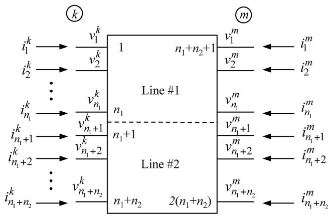  
Fig. 1. Two parallel lines with terminal numbering.

In the case of continuously transposed single-circuit lines, the $3 \times 3$ matrices and are balanced (i.e. their diagonal elements are equal and their offdiagonal elements are equal). The matrix product can now be diagonalized by a real transformation matrix which is real and constant with frequency. Therefore, the assumption on which the FD-line model is based is perfectly valid. When the line is untransposed, the matrices become weakly imbalanced but the FD-line approach can still produce good results. In situations of parallel overhead lines, the resulting and can become strongly imbalanced and so the assumption of a real and constant transformation matrix can give substantial errors in the simulation result. We remark that situations exist where diagonalization fails [29], but such situations are rare.

In this paper, we propose modeling systems of parallel overhead lines as follows. Each line is modeled by a separate FD-line model where the presence of the neighbor lines is ignored. This gives a modeling with almost balanced matrices and and, hence, an accurate model for each line. The mutual coupling is modeled separately via rational functions in the phase domain. That way, a line model is obtained which overcomes the errors produced by the unbalancing in and for the complete overhead line system.

# B. Mutual Coupling

We consider a system of two parallel lines of length with ends and as shown in Fig. 1. The lines have $n _ { 1 }$ and $n _ { 2 }$ conductors, respectively.

The terminal admittance matrix ${ \bf Y } _ { n }$ of the line system relates the $2 ( n _ { 1 } + n _ { 2 } )$ terminal currents to the terminal voltages

$$
\mathbf {i} = \mathbf {Y} _ {n} \mathbf {v}. \tag {2}
$$

${ \bf Y } _ { n }$ is obtained by (2) [14]

$$
\mathbf {Y} _ {n} = \left(\mathbf {I} - \mathbf {H} ^ {2}\right) ^ {- 1} \left[ \begin{array}{c c} \mathbf {H} ^ {2} + \mathbf {I} & - 2 \mathbf {H} \\ - 2 \mathbf {H} & \mathbf {H} ^ {2} + \mathbf {I} \end{array} \right] \mathbf {Y} _ {c} \tag {3}
$$

where

$$
\mathbf {Y} _ {c} = \mathbf {Z} ^ {- 1} \sqrt {\mathbf {Z Y}} = \sqrt {(\mathbf {Y Z}) ^ {- 1} \mathbf {Y}} \tag {4a}
$$

$$
\mathbf {H} = e ^ {- \sqrt {\mathbf {Y Z}} l}. \tag {4b}
$$

is the identity matrix while and $\mathbf { Y } _ { c }$ are the matrices of propagation and characteristic admittance, respectively. An approach for calculating $\mathbf { Y } _ { n }$ via diagonalization is shown in [15, App.].

Inverting $\mathbf { Y } _ { n }$ gives the corresponding terminal impedance matrix $\mathbf { Z } _ { n }$ . By partitioning $\mathbf { Z } _ { n }$ according to lines #1 and #2, we obtain

$$
\left[ \begin{array}{l} \mathbf {v} _ {1} \\ \mathbf {v} _ {2} \end{array} \right] = \left[ \begin{array}{l l} \mathbf {Z} _ {n, 1 1} & \mathbf {Z} _ {n, 1 2} \\ \mathbf {Z} _ {n, 2 1} & \mathbf {Z} _ {n, 2 2} \end{array} \right] \left[ \begin{array}{l} \dot {\mathbf {i}} _ {1} \\ \dot {\mathbf {i}} _ {2} \end{array} \right]. \tag {5}
$$

It follows from (5) that $\mathbf { v } _ { 1 , \mathrm { i n d } } = \mathbf { Z } _ { n , 1 2 } \mathbf { i } _ { 2 }$ represents the induced terminal voltages on line 1 from the terminal currents on line 2. Similarly, $\mathbf { v } _ { 2 , i n d } = \mathbf { Z } _ { n , 2 1 } \mathbf { i } _ { 1 }$ represents the induced terminal voltages on line 2 from the terminal currents on line 1.

# C. Separation of Capacitive and Inductive Coupling Effects

The elements of $\mathbf { Z } _ { n , 1 2 }$ and $\mathbf { Z } _ { n , 2 1 }$ are at low frequencies dominated by the capacitive coupling between the two lines while the contribution from the inductive coupling is very small. The reason is that the elements of (5) define voltage responses with current application on one terminal with all other terminals open. Therefore, a modeling of the coupling based on (5) cannot be expected to represent the inductive coupling with a high degree of accuracy. We therefore represent the mutual coupling so that $\mathbf { v } _ { \mathrm { 1 , i n d } }$ and $\mathbf { v } _ { \mathrm { 2 , i n d } }$ are calculated based on the terminal voltages $\mathbf { v } _ { k }$ at end and the terminal currents $\mathbf { i } _ { m }$ at end as defined by matrices $\mathbf { K } _ { 2 1 }$ and $\mathbf { K } _ { 1 2 }$ (6). The contribution from $\mathbf { i } _ { m }$ ensures high accuracy for the inductive coupling since the terminals on the other line end are now grounded. Conversely, the contribution from $\mathbf { v } _ { k }$ ensures high accuracy for the capacitive coupling since the terminals on the other line end are now open. A robust procedure for calculating $\mathbf { K } _ { 2 1 }$ and $\mathbf { K } _ { 1 2 }$ from ${ \bf Y } _ { n }$ is shown in the Appendix. It is noted that $\mathbf { K } _ { 2 1 } \neq \mathbf { K } _ { 1 2 } ^ { T }$

$$
\left[ \begin{array}{l} \mathbf {v} _ {1, \text {i n d}} ^ {k} \\ \mathbf {v} _ {1, \text {i n d}} ^ {m} \end{array} \right] = \mathbf {K} _ {1 2} \left[ \begin{array}{l} \mathbf {v} _ {2} ^ {k} \\ \mathbf {i} _ {2} ^ {m} \end{array} \right] \tag {6a}
$$

$$
\left[ \begin{array}{l} \mathbf {v} _ {2, \text {i n d}} ^ {k} \\ \mathbf {v} _ {2, \text {i n d}} ^ {m} \end{array} \right] = \mathbf {K} _ {2 1} \left[ \begin{array}{l} \mathbf {v} _ {1} ^ {k} \\ \mathbf {i} _ {1} ^ {m} \end{array} \right]. \tag {6b}
$$

# D. Mode Revealing Transformations

One is often concerned about whether the operation of one line can be disturbed by the other line. This implies that the operational mode component of the coupling must be accurately represented (i.e., the positive-sequence mode for a three-phase line and the differential mode for a dc line or a telephone line). However, the operational mode component in is often masked by a dominating zero-sequence component. This problem is overcome by introducing a transformation for each of the two lines to better reveal the operational mode in ${ \bf K } _ { i j }$ . It is essential to use real-valued matrices in order to preserve the causality of the elements of ${ \bf K } _ { i j }$ (i.e. their complex conjugate property). For instance, we use (7) and (8) when the considered line is a pair and a three-phase line, respectively

$$
\mathbf {T} = \left[ \begin{array}{c c} 1 & - 1 \\ 1 & 1 \end{array} \right] \frac {1}{\sqrt {2}} \tag {7}
$$

$$
\mathbf {T} = \left[ \begin{array}{c c c} 1 & \sqrt {2} & 0 \\ 1 & - \frac {1}{\sqrt {2}} & \frac {\sqrt {3}}{\sqrt {2}} \\ 1 & - \frac {1}{\sqrt {2}} & - \frac {\sqrt {3}}{\sqrt {2}} \end{array} \right] \frac {1}{\sqrt {3}}. \tag {8}
$$

Let the transformation matrix associated with lines #1 and #2 be denoted as ${ \bf T } _ { 1 }$ and $\mathbf { T } _ { 2 }$ , respectively. This gives the following relations between the physical variables and the transformed ones denoted by tilde $( ^ { \ast } \sim ^ { \ast } )$ :

$$
\mathbf {i} _ {j} ^ {k, m} = \mathbf {T} _ {j} \tilde {\mathbf {i}} _ {j} ^ {k, m}, j = 1, 2 \tag {9a}
$$

$$
\mathbf {v} _ {j} ^ {k, m} = \mathbf {T} _ {j} \tilde {\mathbf {v}} _ {j} ^ {k, m}, j = 1, 2 \tag {9b}
$$

$$
\mathbf {v} _ {j, i n d} ^ {k, m} = \mathbf {T} _ {j} \tilde {\mathbf {v}} _ {j, i n d} ^ {k, m}, j = 1, 2. \tag {9c}
$$

Combining (6) and (9) gives the transformed matrix

$$
\left[ \begin{array}{l} \tilde {\mathbf {v}} _ {i, \text {i n d}} ^ {k} \\ \tilde {\mathbf {v}} _ {i, \text {i n d}} ^ {m} \end{array} \right] = \tilde {\mathbf {K}} _ {i j} \left[ \begin{array}{l} \tilde {\mathbf {v}} _ {j} ^ {k} \\ \tilde {\mathbf {i}} _ {j} ^ {m} \end{array} \right] \tag {10}
$$

with

$$
\tilde {\mathbf {K}} _ {i j} = \bar {\mathbf {T}} _ {i} ^ {- 1} \mathbf {K} _ {i j} \bar {\mathbf {T}} _ {j} \tag {11a}
$$

$$
\bar {\mathbf {T}} _ {i} = \left[ \begin{array}{c c} \mathbf {T} _ {i} & 0 \\ 0 & \mathbf {T} _ {i} \end{array} \right], \bar {\mathbf {T}} _ {j} = \left[ \begin{array}{c c} \mathbf {T} _ {j} & 0 \\ 0 & \mathbf {T} _ {j} \end{array} \right]. \tag {11b}
$$

Note that the transformation does not imply a diagonal $\tilde { \mathbf { K } } _ { i j }$ . The transformation only achieves to make the individual modes more visible, thereby preventing loss of accuracy of the small modes during the rational modeling process. Since $\mathbf { T } _ { i }$ and $\mathbf { T } _ { j }$ are both real, the elements of $\tilde { \mathbf { K } } _ { i j }$ become a linear combination of elements of $\mathbf { K } _ { i j }$ with real coefficients. Therefore, the transformation preserves the causality of ${ \bf K } _ { i j }$ and so the elements of $\bar { \mathbf { K } } _ { i j }$ can be fitted by a rational function of poles and residues that are real or complex conjugate.

# E. Modeling via Rational Functions

The transformed coupling matrix $\tilde { \bf K }$ is modeled by state-space models (12)

$$
\tilde {\mathbf {K}} _ {i j} = \tilde {\mathbf {C}} (s \mathbf {I} - \mathbf {A}) ^ {- 1} \tilde {\mathbf {B}} + \tilde {\mathbf {D}}. \tag {12}
$$

The actual model extraction is performed using vector fitting (VF) [16] with relaxation [17] and fast implementation [18]. VF is applied columnwise to $\ddot { \mathbf { K } } _ { i j }$ , giving a model with a private pole set for each column (13). Inverse magnitude weighting is used in the least-squares process of VF in order to obtain relative error control

$$
\tilde {\mathbf {K}} _ {i j, \mathrm {c o l}} \cong \tilde {\mathbf {C}} _ {\mathrm {c o l}} (s \mathbf {I} - \mathbf {A} _ {\mathrm {c o l}}) \tilde {\mathbf {b}} _ {\mathrm {c o l}} + \tilde {\mathbf {d}} _ {\mathrm {c o l}}. \tag {13}
$$

Following the model extraction step, the model’s coefficients are transformed back into the actual phase domain:

$$
\mathbf {B} = \mathbf {B} \bar {\mathbf {T}} _ {j} ^ {- 1}, \mathbf {C} = \bar {\mathbf {T}} _ {i} \tilde {\mathbf {C}}, \mathbf {D} = \bar {\mathbf {T}} _ {i} \tilde {\mathbf {D}} \bar {\mathbf {T}} _ {j} ^ {- 1}. \tag {14}
$$

# F. Interface With Simulation Engine

The induced voltages , $\mathbf { v } _ { 1 , \mathrm { i n d } } ^ { k , m } , \mathbf { v } _ { 2 , \mathrm { i n d } } ^ { k , m }$ are in the transient simulation represented by controlled voltage sources in series with the line terminations, see Fig. 2. In that way, the line system is modeled via two independent line models with the mutual

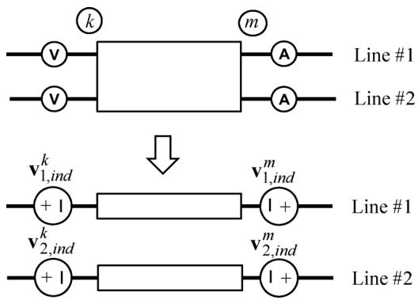  
Fig. 2. Representing the mutual coupling by controlled voltage sources.

coupling taken into account by the series voltage sources only. The voltage sources sV2,ind $\mathbf { v } _ { 2 , i n d } ^ { k , m }$ are calculated as the convolution between the measured quantities $\left[ \left( \mathbf { v } _ { 1 } ^ { k } \right) ^ { T } \left( \mathbf { i } _ { 1 } ^ { m } \right) ^ { T } \right] ^ { T }$ and the rational model for . Similarly, the voltage sources $\mathbf { K } _ { 2 1 }$ $\mathbf { v } _ { 1 , i n d } ^ { k , m }$ are calculated as the convolution between $\left[ \left( \mathbf { v } _ { 2 } ^ { k } \right) ^ { T } \left( \mathbf { i } _ { 2 } ^ { m } \right) ^ { T } \right] ^ { T }$ L and the rational model for $\mathbf { K } _ { 1 2 }$ .

We use recursive convolution [2] as implemented in the PSCAD software by a user-defined component (FDTF) [19]. It is noted that this modeling approach for the voltage transfer involves a time delay equal to the simulation time step length. In the examples, we shall see that quite accurate results can still be achieved.

# G. Simplifications to the Procedure

In many instances, the coupling between the lines is fairly weak in the sense that the induced transient in line #2 is much smaller than the source transient in line #1. In these cases, one can ignore the coupling from line #2 to line #1, thereby reducing the computational burden in the time domain by a factor of two. We will apply this simplification in all of the sample cases.

# III. EXAMPLE: TWO PARALLEL OVERHEAD LINES

# A. Case

Fig. 3 shows a system of two parallel overhead lines operating at 230 kV and 115 kV, respectively. We investigate the induced voltage on the 115-kV line that results from energizing one phase of the 230-kV line with a 1-kHz sinusoidal source at voltage maximum, see Fig. 4.

# B. Results With the Conventional Modeling Approach

The system is modeled in PSCAD using two alternative approaches: 1) Modal domain modeling (FD-line) with a real transformation matrix evaluated at 2 kHz, and 2) the ULM line. (FD and ULM exist as built-in models in PSCAD.) In addition, a solution is calculated based on the (fast) Numerical Laplace Transform (NLT) [20]–[22]. Here, the frequency-domain responses are obtained via $\mathbf { Y } _ { n }$ and nodal analysis with $\mathbf { Z } ( s )$ and $\mathbf { Y } ( s )$ calculated as shown in [23] and [24].

Fig. 5 shows the simulated waveform at terminals 10 and 11. It can be seen that appreciable deviations appear between the waveforms as calculated by the two approaches. In particular,

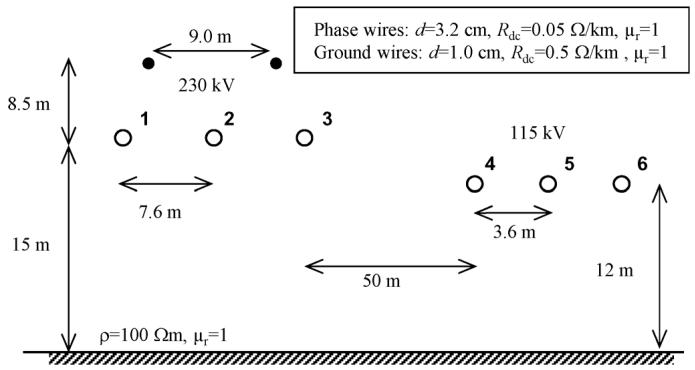  
Fig. 3. Two parallel three-phase overhead lines. Length: $l = 1 0$ km.

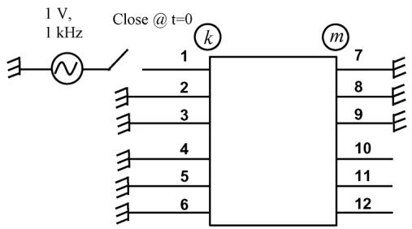  
Fig. 4. Energization of a 230-kV line.

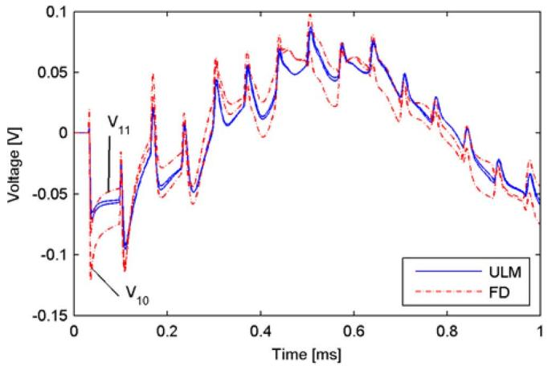  
Fig. 5. Induced voltage on the 115-kV line $V _ { 1 0 }$ and $V _ { 1 1 }$ .

the two voltages predicted by ULM are nearly equal while those by the FD-line are quite different.

This difference is highlighted in Fig. 6 where the differential voltage is shown separately. It can be seen that the differential voltage predicted by ULM agrees closely to that obtained by the theoretically accurate NLT while the result by the FD-line is much too large.

# C. Results With a New Approach

In order to rectify the problems with the FD-line, we apply the new approach where each of the two lines is modeled by a separate FD-line with the transformation matrix evaluated at 2 kHz. The mutual coupling between the lines is taken into account by a rational model as follows. The coupling matrix $\mathbf { K } _ { 2 1 }$ is calculated by the procedure described in the Appendix. Its four submatrices are subjected to transformation by Clarke’s matrix (8).

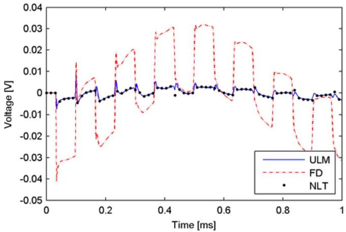  
Fig. 6. Differential voltage $V _ { 1 0 } - V _ { 1 1 }$ .

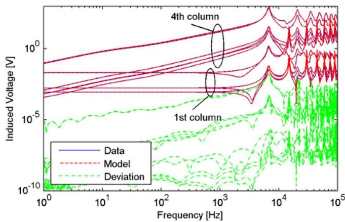  
Fig. 7. First and fourth column of $\tilde { \bf K } .$

The columns of the resulting $6 \times 6 \tilde { \mathbf { K } } _ { 2 1 }$ are subjected to rational modeling (13) by VF using 100 poles for each column with inverse magnitude weighting.

Fig. 7 shows the result for the first and fourth columns of $\tilde { \mathbf { K } } _ { 2 1 }$ . It can be seen that the elements of the first column are “flat” at low frequencies since they represent capacitive coupling. The elements of the fourth column increase almost proportionally with frequency since they represent inductive coupling.

Fig. 8 shows the elements of the first and fourth column of $\mathbf { K } _ { 2 1 }$ that result in transforming the model back into physical quantities by (14). It is seen that in each column, all elements are nearly equal at low frequencies since the matrix elements are dominated by a common-mode component. Clearly, the usage of the mode-revealing transformation (Fig. 7) has the advantage of separating out this common-mode component.

Fig. 9 shows the simulated voltage $V _ { 1 0 }$ and $V _ { 1 1 }$ as obtained by the new approach. We used a 1- s time step in the excitation and the voltage source was ramped up from 0 to 1 V in $1 0 \mu \mathrm { s }$ i n order to suppress the frequency information above the 100-kHz band limit used in the rational model. The result is seen to agree closely with that obtained by ULM, unlike the case when using a single FD line model in Fig. 5.

Fig. 10 shows the differential mode voltage $V _ { 1 0 } - V _ { 1 1 } . \mathrm { A }$ gain, one achieves very close agreement with the result by ULM. The

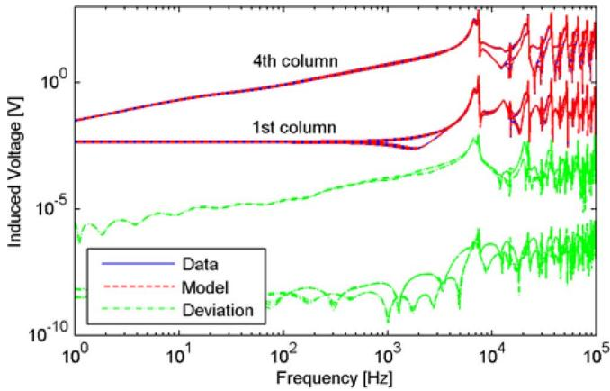  
Fig. 8. First and fourth column of .

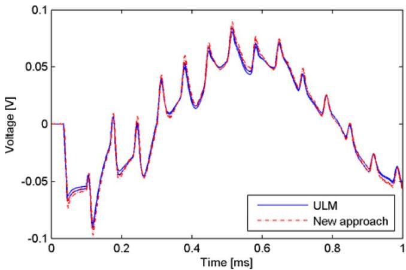  
Fig. 9. Induced voltage on the 115-kV line $V _ { 1 0 }$ and $V _ { 1 1 }$ .

improvement over the FD-line model is now quite evident in comparison with Fig. 6.

# IV. EXAMPLE: DISTURBANCE OF THE RAILWAYSIGNALING SYSTEM

# A. Case

In some railway systems, the presence and position of a train on the track is detected by a system based on subdividing the track into zones. In each zone, the rails are isolated and a voltage source is applied at one end while a relay is placed at the other end. The presence of a train will short-circuit the two rails and the relay is triggered. The source operates close to 100 Hz in order to prevent disturbance from 50-Hz currents and harmonics.

In this example, we simulate the disturbance of such a detection system from induction by a parallel overhead line, see Fig. 11. The two rails are represented by round conductors having a geometric mean radius equal to that of the actual rail. The nonlinearity of the steel is ignored. For more accurate modeling of rails, including the choice of relative permeability, we refer to [25]. We consider a zone length of 1.5 km.

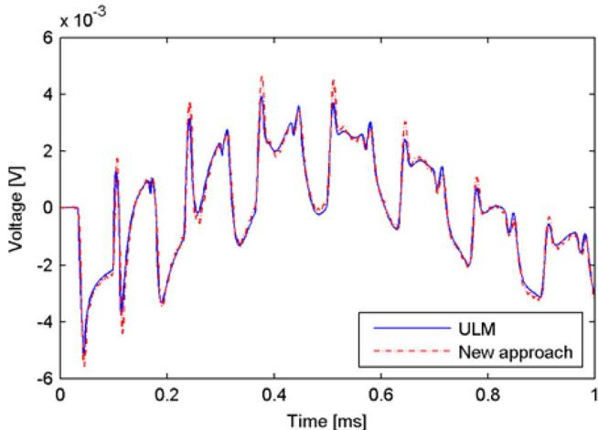  
Fig. 10. Differential voltage $V _ { 1 0 } - V _ { 1 1 }$ .

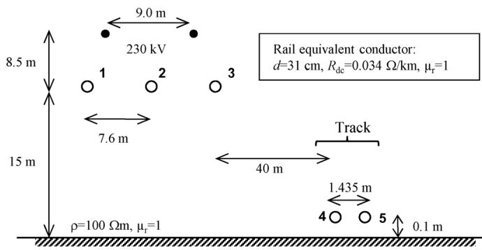  
Fig. 11. Railway in parallel with the overhead line.

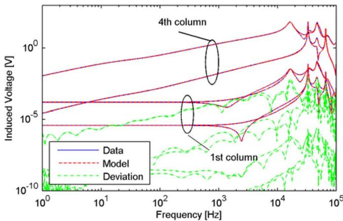  
Fig. 12. First and fourth column of $\tilde { \bf K }$

# B. Modeling

With the new approach, the system is modeled as two independent overhead lines with frequency-dependent per-unit-length parameters, similar to the previous example. We use Clarke’s matrix (8) for $\mathbf { T } _ { 1 }$ and (7) for $\mathbf { T } _ { 2 }$ to better reveal the modal information in the $4 \times 6 \mathbf { K } _ { 2 1 }$ during the rational fitting process. Each of the six columns is fitted using 40 poles with inverse magnitude weighting. The result is shown in Fig. 12 for the 1st and 4th column of $\tilde { \mathbf { K } } _ { 2 1 }$ .

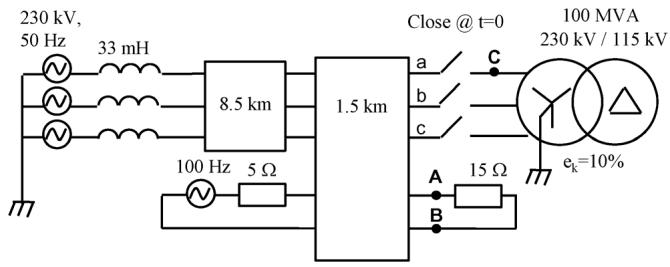  
Fig. 13. Energization of the transformer.

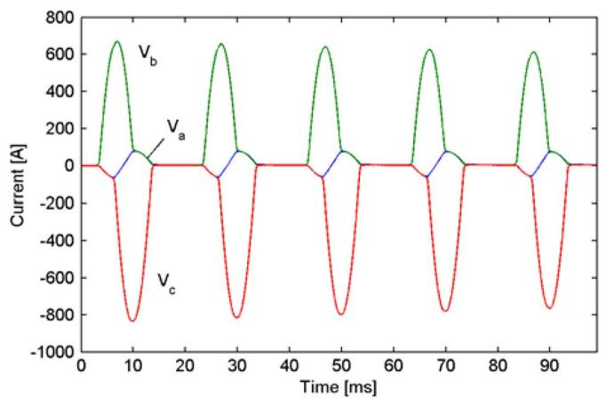  
Fig. 14. Transformer inrush current.

# C. Results

The total length of the overhead line is 10 km as shown in Fig. 13. A transformer is energized at the far end of the line by simultaneously closing the three breakers.

Fig. 14 shows the transformer inrush current resulting from the energization. The current reaches 800 A and it has a large 100-Hz component that could possibly disturb the signaling system which operates near 100 Hz.

Fig. 15 shows the track differential voltage ${ V _ { \mathrm { A } } } \mathrm { ~ - ~ } { V _ { \mathrm { B } } }$ as calculated in three different ways: 1) using ULM; 2) using modal domain line (FD); and 3) using the new approach. All simulations are performed in PSCAD using the built-in implementations of ULM and the FD-line. With the FD line modeling, the modal transformation matrix is calculated at 100 Hz. The 100-Hz voltage source in Fig. 13 is set equal to zero. It can be seen that all three approaches give a similar result for the induced voltage. The voltage is quite small, not reaching 1.5 V.

Fig. 16 shows the track differential voltage ${ V _ { \mathrm { A } } } \mathrm { ~ - ~ } { V _ { \mathrm { B } } }$ when a ground fault occurs at C in Fig. 12, 100 ms after transformer energization. The ground fault results in fast transients in the overhead line system which gives an induced voltage that reaches 20 V. The simulation by the new approach agrees very closely with that by the ULM while the FD model gives a noticeably higher deviation.

The error in the common-mode induced voltage as calculated by the FD-line is much higher than for the differential mode voltage. This is shown in Fig. 17 for the rail voltage on point A in Fig. 12, following the ground fault. It is seen that ULM and

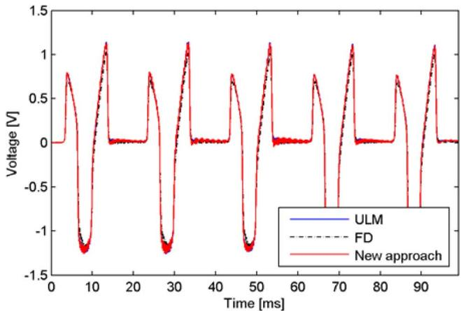  
Fig. 15. Rail differential voltage ${ V _ { \mathrm { A } } - V _ { \mathrm { B } } }$ following transformer energization.

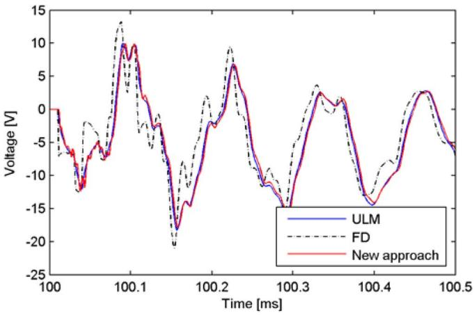  
Fig. 16. Rail differential voltage ${ V _ { \mathrm { A } } } - { V _ { \mathrm { B } } }$ following a ground fault at C.

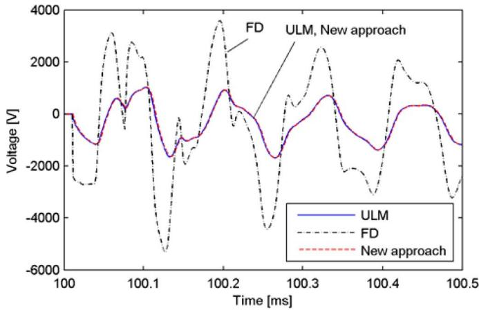  
Fig. 17. Rail voltage $V _ { \mathrm { A } }$ following a ground fault at C.

the new approach practically give an identical result while the FD-line gives a very high voltage.

One may wonder why the differential mode coupling is quite accurately represented by the FD-line in Fig. 16 while it is inaccurately represented in the case of two parallel overhead lines in Fig. 6. This can be explained by the difference in height above ground for line #2 (115-kV line versus tracks). It was found that increasing the height of the tracks (from 0.1 m) gave a quick

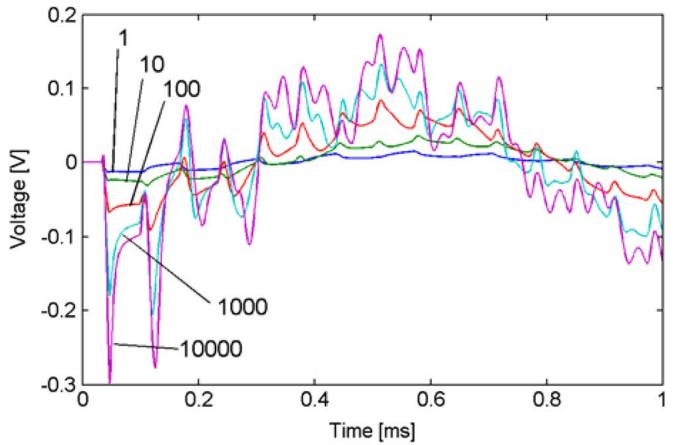  
Fig. 18. Induced voltage on the 115-kV line $V _ { 1 0 }$ with ground resistivity m as the parameter. Simulation using ULM.

deterioration in accuracy of the induced differential voltage as predicted by the FD-line.

# V. DISCUSSION

One advantage with the new approach is that it is not likely to produce instabilities due to passivity violations. This is, in particular, the case when one takes into account the coupling in one direction only (as in the examples) since there is no feedback from the disturbed circuit (line #2) to the disturbing circuit (line #1). Here, only the two FD-lines themselves are required to be passive. This is contrary to the modeling of the entire line systems with a state-space representation of the entire nodal admittance matrix [26] (or the related FLE approach [27]) where passivity violations are always an issue.

The computational cost of the new approach is modest in situations that combine a limited bandwidth and line length as in the examples in this paper. However, if one increases the upper bandwidth in Example #1 from 100 kHz to 1 MHz, one will with the given line length of 10 km require a very high model order since the required number of poles will increase by a factor of about ten. These cases can be handled by subdividing the line into segments $\{ m = 1 \ldots M \}$ and introducing coupling matrices ${ \bf K } _ { 1 2 } ^ { m } , { \bf K } _ { 2 1 } ^ { m }$ for each segment. On the other hand, most studies of coupling effects are not concerned with coupling at very high frequencies.

The procedure in this paper can be easily expanded to handle the coupling between more than two circuits. Each line becomes modeled by an independent FD-line, and between any two lines and , one introduces coupling matrices $\mathbf { K } _ { i j }$ and ${ \bf K } _ { j i }$ .

Although the new modeling procedure assists in producing more accurate results in the simulation of induced transient voltages, there are certainly other sources of errors. For instance, the ground conductivity is normally not well known and it often varies as a function of depth. Fig. 18 shows the induced voltage on terminal 10 in Fig. 4 with alternative values for the ground resistivity. Clearly, the induced voltage increases with increasing ground resistivity as the magnetic coupling between the two lines increases. (The current flowing out of the voltage source in Fig. 4 changed only very little when varying the soil resistivity.) Other reasons that may result in simulation errors include variations in the line sags.

# VI. CONCLUSION

This paper has introduced a new approach for wideband modeling of systems of parallel overhead lines. The new method represents each line by a traveling-wave-type model based on modes and a real transformation matrix (FD-line) where the presence of the neighboring lines is ignored. The mutual coupling between the lines is taken into account by state-space models that are controlling series voltage sources at the line terminals. The input to the coupling model is the current and voltage of the other line at opposite ends. The usage of current and voltage as input ensures that the inductive and capacitive coupling effects are captured. The accuracy is further enhanced by introducing mode-revealing transformations to prevent the interphase coupling to be masked by the (large) common-mode coupling component.

Calculated results shows that the new approach can greatly improve the accuracy in simulation or disturbance effects compared to the usage of an FD-line for representing the entire line system. This was demonstrated for the coupling between a 230-kV line and a 115-kV line, and for the disturbance of a railway signaling system from transients on a nearby 230-kV overhead line.

# APPENDIX A

The induced voltage between two lines can be inferred from terminal impedance matrix ${ \bf Z } _ { n } = { \bf Y } _ { n } ^ { - 1 }$ (15) as the terms $\mathbf { v } _ { 1 , i n d } = \mathbf { Z } _ { n , 1 2 } \mathbf { i } _ { 2 }$ and $\mathbf { v } _ { 2 , i n d } = \mathbf { Z } _ { n , 2 1 } \mathbf { i } _ { 1 }$

$$
\left[ \begin{array}{l} \mathbf {v} _ {1} \\ \mathbf {v} _ {2} \end{array} \right] = \left[ \begin{array}{l l} \mathbf {Z} _ {n, 1 1} & \mathbf {Z} _ {n, 1 2} \\ \mathbf {Z} _ {n, 2 1} & \mathbf {Z} _ {n, 2 2} \end{array} \right] \left[ \begin{array}{l} \mathrm {i} _ {1} \\ \mathrm {i} _ {2} \end{array} \right]. \tag {15}
$$

The objective is to reformulate (15) so that the induced voltage on one line is given by terminal voltage and current at the other line instead of current alone

$$
\left[ \begin{array}{l} \mathbf {v} _ {2, \text {i n d}} ^ {k} \\ \mathbf {v} _ {2, \text {i n d}} ^ {m} \end{array} \right] = \mathbf {K} \left[ \begin{array}{l} \mathbf {v} _ {1} ^ {k} \\ \mathbf {i} _ {1} ^ {m} \end{array} \right]. \tag {16}
$$

To obtain the formulation (16), we partition (15)

$$
\left[ \begin{array}{l} \mathbf {v} _ {1} ^ {k} \\ \mathbf {v} _ {2} ^ {k} \\ \mathbf {v} _ {1} ^ {m} \\ \mathbf {v} _ {2} ^ {m} \end{array} \right] = \left[ \begin{array}{c c c c} \mathbf {A} & \mathbf {C} ^ {T} & \mathbf {G} ^ {T} & \hat {\mathbf {I}} ^ {T} \\ \mathbf {C} & \mathbf {B} & \mathbf {J} ^ {T} & \hat {\mathbf {H}} ^ {T} \\ \mathbf {G} & \mathbf {J} & \mathbf {D} & \mathbf {F} ^ {T} \\ \hat {\mathbf {I}} & \hat {\mathbf {H}} & \mathbf {F} & \mathbf {E} \end{array} \right] \left[ \begin{array}{l} \mathbf {i} _ {1} ^ {k} \\ \mathbf {i} _ {2} ^ {k} \\ \mathbf {i} _ {1} ^ {m} \\ \mathbf {i} _ {2} ^ {m} \end{array} \right]. \tag {17}
$$

From (17) we find with the condition $\mathbf { i } _ { 2 } ^ { k } \ = \ \mathbf { i } _ { 2 } ^ { m } \ = \ 0$ and after algebraic manipulation, the following result for the induced voltage:

$$
\left[ \begin{array}{l} \mathbf {v} _ {2, i n d} ^ {k} \\ \mathbf {v} _ {2, i n d} ^ {m} \end{array} \right] = \left[ \begin{array}{c c} \mathbf {C A} ^ {- 1} & \left(\mathbf {J} ^ {T} - \mathbf {C A} ^ {- 1} \mathbf {G} ^ {T}\right) \\ \hat {\mathbf {I}} \mathbf {A} ^ {- 1} & \left(\mathbf {F} - \hat {\mathbf {I}} \mathbf {A} ^ {- 1} \mathbf {G} ^ {T}\right) \end{array} \right] \left[ \begin{array}{l} \mathbf {v} _ {1} ^ {k} \\ \mathbf {i} _ {1} ^ {m} \end{array} \right]. \tag {18}
$$

It was found that the right partition of (18) could not be evaluated accurately at very low frequencies. This problem is overcome by calculating the right partition starting from the nodal admittance matrix

$$
\left[ \begin{array}{l} \mathbf {i} _ {1} ^ {k} \\ \mathbf {i} _ {2} ^ {k} \\ \mathbf {i} _ {1} ^ {m} \\ \mathbf {i} _ {2} ^ {m} \end{array} \right] = \left[ \mathbf {Y} _ {n} \right] \left[ \begin{array}{l} \mathbf {v} _ {1} ^ {k} \\ \mathbf {v} _ {2} ^ {k} \\ \mathbf {v} _ {1} ^ {m} \\ \mathbf {v} _ {2} ^ {m} \end{array} \right]. \tag {19}
$$

Since the right partition of (18) is given with $\mathbf { v } _ { 1 } ^ { k } = 0$ and because has no interest, we delete the left column and top row of (19). Inverting the resulting admittance matrix gives

$$
\left[ \begin{array}{l} \mathbf {v} _ {2} ^ {k} \\ \mathbf {v} _ {1} ^ {m} \\ \mathbf {v} _ {2} ^ {m} \end{array} \right] = \left[ \begin{array}{c c c} \mathbf {L} & \mathbf {O} ^ {T} & \mathbf {Q} ^ {T} \\ \mathbf {O} & \mathbf {M} & \mathbf {P} ^ {T} \\ \mathbf {Q} & \mathbf {P} & \mathbf {N} \end{array} \right] \left[ \begin{array}{l} \mathbf {i} _ {2} ^ {k} \\ \mathbf {i} _ {1} ^ {m} \\ \mathbf {i} _ {2} ^ {m} \end{array} \right]. \tag {20}
$$

Again, we set $\mathbf { i } _ { 2 } ^ { k } = \mathbf { i } _ { 2 } ^ { m } = 0$ , which gives for the induced voltage

$$
\left[ \begin{array}{l} \mathbf {v} _ {2, \text {i n d}} ^ {k} \\ \mathbf {v} _ {2, \text {i n d}} ^ {m} \end{array} \right] = \left[ \begin{array}{l} \mathbf {O} ^ {T} \\ \mathbf {P} \end{array} \right] \mathbf {i} _ {1} ^ {m}. \tag {21}
$$

Thus, the transfer function $\mathbf { K } _ { 2 1 }$ is obtained as

$$
\mathbf {K} _ {2 1} = \left[ \begin{array}{l l} \mathbf {C A} ^ {- 1} & \mathbf {O} ^ {T} \\ \hat {\mathbf {I}} \mathbf {A} ^ {- 1} & \mathbf {P} \end{array} \right]. \tag {22}
$$

The procedure for calculating $\mathbf { K } _ { 1 2 }$ is analogous. Equation (18) b

$$
\left[ \begin{array}{l} \mathbf {v} _ {1, \text {i n d}} ^ {k} \\ \mathbf {v} _ {1, \text {i n d}} ^ {m} \end{array} \right] = \left[ \begin{array}{c c} \mathbf {C} ^ {T} \mathbf {B} ^ {- 1} & (\hat {\mathbf {I}} ^ {T} - \mathbf {C} ^ {T} \mathbf {B} ^ {- 1} \hat {\mathbf {H}} ^ {T}) \\ \mathbf {J B} ^ {- 1} & (\mathbf {F} ^ {T} - \mathbf {J B} ^ {- 1} \hat {\mathbf {H}} ^ {T}) \end{array} \right] \left[ \begin{array}{l} \mathbf {v} _ {2} ^ {k} \\ \mathbf {i} _ {2} ^ {m} \end{array} \right]. \tag {23}
$$

The right partition in (23) is replaced by steps similar to those leading to (22).

# APPENDIX B

The series impedance matrix ${ \bf Z } = { \bf R } + j { \bf X }$ and the modal transformation matrix $\mathbf { T } _ { \mathrm { I } }$ are listed as calculated at 2 kHz for the modeling of the six-conductor system in Fig. 3 by the FD-line model. The results were produced by PSCAD (v4.2.1).

<table><tr><td colspan="6">R[Ohm/km]</td></tr><tr><td>0.8802</td><td>0.6607</td><td>0.6763</td><td>0.7824</td><td>0.7770</td><td>0.7708</td></tr><tr><td>0.6607</td><td>0.8340</td><td>0.6607</td><td>0.7849</td><td>0.7811</td><td>0.7765</td></tr><tr><td rowspan="4">=</td><td>0.6763</td><td>0.6607</td><td>0.8802</td><td>0.8479</td><td>0.8457</td></tr><tr><td>0.7824</td><td>0.7849</td><td>0.8479</td><td>1.4833</td><td>1.3013</td></tr><tr><td>0.7770</td><td>0.7811</td><td>0.8457</td><td>1.3013</td><td>1.5063</td></tr><tr><td>0.7708</td><td>0.7765</td><td>0.8426</td><td>1.3109</td><td>1.3237</td></tr></table>

<table><tr><td colspan="6">X[Ohm/km]</td></tr><tr><td></td><td>20.821</td><td>5.0048</td><td>3.4924</td><td>1.3896</td><td>1.3219</td></tr><tr><td></td><td>5.0048</td><td>20.470</td><td>5.0048</td><td>1.5806</td><td>1.5009</td></tr><tr><td></td><td>3.4924</td><td>5.0048</td><td>20.821</td><td>1.9668</td><td>1.8638</td></tr><tr><td></td><td>1.3896</td><td>1.5806</td><td>1.9668</td><td>23.212</td><td>9.4449</td></tr><tr><td></td><td>1.3219</td><td>1.5009</td><td>1.8638</td><td>9.4449</td><td>23.254</td></tr><tr><td></td><td>1.2579</td><td>1.4259</td><td>1.7678</td><td>7.7231</td><td>9.4843</td></tr></table>

<table><tr><td colspan="6">C[nF/km]</td></tr><tr><td></td><td>7.879</td><td>-1.132</td><td>-0.404</td><td>-0.024</td><td>-0.018</td></tr><tr><td></td><td>-1.132</td><td>8.095</td><td>-1.132</td><td>-0.031</td><td>-0.022</td></tr><tr><td></td><td>=</td><td>-0.404</td><td>-1.132</td><td>7.880</td><td>-0.058</td></tr><tr><td></td><td></td><td>-0.024</td><td>-0.031</td><td>-0.058</td><td>8.265</td></tr><tr><td></td><td></td><td>-0.018</td><td>-0.022</td><td>-0.041</td><td>-1.917</td></tr><tr><td></td><td></td><td>-0.018</td><td>-0.021</td><td>-0.038</td><td>-0.966</td></tr></table>

<table><tr><td colspan="7">TI</td></tr><tr><td></td><td>0.007</td><td>-0.008</td><td>0.008</td><td>-0.416</td><td>0.814</td><td>-0.403</td></tr><tr><td></td><td>-0.389</td><td>0.815</td><td>-0.425</td><td>0.041</td><td>0.009</td><td>-0.027</td></tr><tr><td>=</td><td>-0.157</td><td>0.066</td><td>0.159</td><td>-0.696</td><td>-0.026</td><td>0.678</td></tr><tr><td></td><td>0.673</td><td>-0.029</td><td>-0.692</td><td>-0.154</td><td>0.033</td><td>0.200</td></tr><tr><td></td><td>0.291</td><td>0.278</td><td>0.345</td><td>0.510</td><td>0.448</td><td>0.506</td></tr><tr><td></td><td>-0.573</td><td>-0.480</td><td>-0.465</td><td>0.244</td><td>0.252</td><td>0.316</td></tr></table>

# REFERENCES

[1] H. W. Dommel, EMTP Theory Book. Portland, OR: Bonneville Power Administration, Aug. 1986.   
[2] A. Semlyen and A. Dabuleanu, “Fast and accurate switching transient calculations on transmission lines with ground return using recursive convolutions,” IEEE Trans. Power App. Syst., vol. PAS-94, no. 2, pp. 561–575, Mar./Apr. 1975.   
[3] J. R. Marti, “Accurate modelling of frequency-dependent transmission lines in electromagnetic transient simulations,” IEEE Trans. Power App. Syst., vol. PAS-101, no. 1, pp. 147–157, Jan. 1982.   
[4] L. Marti, “Simulation of transients in underground cables with frequency-dependent modal transformation matrices,” IEEE Trans. Power Del., vol. 3, no. 3, pp. 1099–1110, Jul. 1988.   
[5] B. Gustavsen and A. Semlyen, “Simulation of transmission line transients using vector fitting and modal decomposition,” IEEE Trans. Power Del., vol. 13, no. 2, pp. 605–614, Apr. 1998.   
[6] G. Angelidis and A. Semlyen, “Direct phase-domain calculation of transmission line transients using two-sided recursions,” IEEE Trans. Power Del., vol. 10, no. 2, pp. 941–949, Apr. 1995.   
[7] T. Noda, N. Nagaoka, and A. Ametani, “Phase domain modeling of frequency-dependent transmission lines by means of an ARMA model,” IEEE Trans. Power Del., vol. 11, no. 1, pp. 401–411, Jan. 1996.   
[8] B. Gustavsen and A. Semlyen, “Calculation of transmission line transients using polar decomposition,” IEEE Trans. Power Del., vol. 13, no. 3, pp. 855–862, Jul. 1998.   
[9] A. Morched, B. Gustavsen, and M. Tartibi, “A universal model for accurate calculation of electromagnetic transients on overhead lines and underground cables,” IEEE Trans. Power Del., vol. 14, no. 3, pp. 1032–1038, Jul. 1999.   
[10] B. Gustavsen, G. Irwin, R. Mangelrød, D. Brandt, and K. Kent, “Transmission line models for the simulation of interaction phenomena between parallel AC and DC overhead lines,” in Proc. Int. Conf. Power Syst. Transients (IPST), Budapest, Hungary, Jun. 20–24, 1999, pp. 61–67.   
[11] H. M. J. De Silva, A. M. Gole, and L. M. Wedepohl, “Accurate electromagnetic transient simulations of HVDC cables and overhead transmission lines,” presented at the Int. Conf. Power Syst. Transients (IPST), Lyon, France, Jun. 4–7, 2007.   
[12] B. Gustavsen and J. Nordstrom, “Pole identification for the universal line model based on trace fitting,” IEEE Trans. Power Del., vol. 23, no. 1, pp. 472–479, Jan. 2008.   
[13] I. Kocar, J. Mahseredjian, and G. Olivier, “Improvement of numerical stability for the computation of transients,” IEEE Trans. Power Del., vol. 25, no. 2, pp. 1104–1111, Apr. 2010.   
[14] A. Semlyen and B. Gustavsen, “Phase domain transmission line modeling with enforcement of symmetry via the propagated characteristic admittance matrix,” IEEE Trans. Power Del., vol. 27, no. 2, pp. 626–631, Apr. 2012.   
[15] B. Gustavsen, “Validation of frequency dependent transmission line models,” IEEE Trans. Power Del., vol. 20, no. 2, pt. 1, pp. 925–933, Apr. 2005.   
[16] B. Gustavsen and A. Semlyen, “Rational approximation of frequency domain responses by vector fitting,” IEEE Trans. Power Del., vol. 14, no. 3, pp. 1052–1061, Jul. 1999.   
[17] B. Gustavsen, “Improving the pole relocating properties of vector fitting,” IEEE Trans. Power Del., vol. 21, no. 3, pp. 1587–1592, Jul. 2006.   
[18] D. Deschrijver, M. Mrozowski, T. Dhaene, and D. De Zutter, “Macromodeling of multiport systems using a fast implementation of the vector fitting method,” IEEE Microw. Wireless Compon. Lett., vol. 18, no. 6, pp. 383–385, Jun. 2008.   
[19] B. Gustavsen and O. Mo, “Interfacing convolution based linear models to an electromagnetic transients program,” presented at the Int. Conf. Power Systems Transients, Lyon, France, Jun. 4–7, 2007.   
[20] D. J. Wilcox, “Numerical Laplace transformation and inversion,” Int. J. Elect. Eng. Educ., vol. 15, pp. 247–265, 1978.   
[21] L. M. Wedepohl, “Power system transients: Errors incurred in the numerical inversion of the Laplace transform,” in Proc. 26th Midwest Symp. Circuits Syst., Aug. 1983, pp. 174–178.   
[22] P. Moreno and A. Ramirez, “Implementation of the numerical Laplace transform: A review task force on frequency domain methods for EMT studies,” IEEE Trans. Power Del., vol. 23, no. 4, pp. 2599–2609, Oct. 2008.   
[23] L. M. Wedepohl and D. J. Wilcox, “Transient analysis of underground power transmission systems; system-model and wave propagation characteristics,” Proc. Inst. Elect. Eng., vol. 120, no. 2, pp. 252–259, Feb. 1973.

[24] A. Deri, G. Tevan, A. Semlyen, and A. Castanheira, “The complex ground return plane. A simplified model for homogenous and multilayer earth return,” IEEE Trans. Power App. Syst., vol. PAS-100, no. 8, pp. 3686–3693, Aug. 1981.   
[25] R. J. Hill and D. C. Carpenter, “Determination of rail internal impedance for electric railway traction system simulation,” Proc. Inst. Elect. Eng. B, vol. 138, no. 6, pp. 311–321, Nov. 1991.   
[26] B. Gustavsen, “Computer code for rational approximation of frequency dependent admittance matrices,” IEEE Trans. Power Del., vol. 17, no. 4, pp. 1093–1098, Oct. 2002.   
[27] B. Gustavsen and A. Semlyen, “Admittance-based modeling of transmission lines by a folded line equivalent,” IEEE Trans. Power Del., vol. 24, no. 1, pp. 231–239, Jan. 2009.   
[28] M. C. Tavares, J. Pissolato, and C. M. Portela, “Mode domain multiphase transmission line model-use in transient studies,” IEEE Trans. Power Del., vol. 14, no. 4, pp. 1533–1544, Oct. 1999.

[29] J. A. Brandao Faria and J. F. Borges da Silva, “Wave propagation in polyphase transmission lines. A general soution to include cases where ordinary modal theory fails,” IEEE Trans. Power Syst., vol. PWRS-1, no. 2, pp. 182–189, Apr. 1986.   
Bjørn Gustavsen (M’94–SM’03) was born in Norway in 1965. He received the M.Sc. and Dr.Ing. degrees in electrical engineering from the Norwegian Institute of Technology (NTH), Trondheim, Norway, in 1989 and 1993, respectively.   
Since 1994, he has been with SINTEF Energy Research, Trondheim, where he is a Chief Research Scientist. His interests include the simulation of electromagnetic transients and modeling of frequency-dependent effects. He spent 1996 as a Visiting Researcher at the University of Toronto, Toronto, ON, Canada, and 1998 at the Manitoba HVDC Research Centre, Winnipeg, MB, Canada.   
He was a Marie Curie Fellow at the University of Stuttgart, Stuttgart, Germany, from 2001 to 2002.