# Fast and efficient calculation of lightning-induced voltages in frequency-dependent transmission lines over lossy ground

Sina Mashayekhia,1, Behzad Kordib,∗

a Department of Electrical and Computer Engineering, University of British Columbia, Vancouver, BC, Canada V6T 1Z4   
b Department of Electrical and Computer Engineering, University of Manitoba, Winnipeg, MB, Canada R3T 5V6

# a r t i c l e i n f o

Article history:

Received 24 February 2012

Received in revised form 4 January 2013

Accepted 9 January 2013

Available online 13 February 2013

Keywords:

Multiconductor transmission line

Lightning

Macro-model

Overvoltage

Power system simulation

# a b s t r a c t

This paper presents a fast and efficient algorithm for the calculation of electromagnetic fields radiated from lightning return-stroke channel as well as lightning-induced voltages in frequency-dependent transmission lines. The algorithm developed in this paper employs a mixed time-frequency macro-model that is based on tracing the poles and residues of the transfer function of the lightning-transmission-line system. Accurate and fast calculation of electromagnetic field data along the excited transmission line is critical to obtain the source terms (or forcing functions) in field-to-transmission-line coupling equations. Using the proposed method, we are able to obtain a closed form solution for the lumped sources required for the analysis of a two-conductor transmission line exposed to nonuniform electromagnetic fields. The algorithm provides high accuracy as well as significant speed gain for multiconductor transmission lines (MTL) as well. To demonstrate the application of the proposed method, we will compare our results with those obtained using other methods or measurements.

© 2013 Elsevier B.V. All rights reserved.

# 1. Introduction

Lightning-induced voltages on overhead transmission lines have been the subject of many theoretical and experimental investigations. Incorporation of accurate and efficient calculation of over-voltages induced by indirect lightning strikes in power system networks is important in electromagnetic transient (EMT) type simulators. A fundamental difficulty arises in integrating transmission line simulation into an EMT-type simulator. The reason is that network nonlinearities and time-dependant components require a time-domain analysis whereas transmission line characteristics such as conductor loss and dispersion are best described in the frequency domain. The issue of mixed time-frequency domain modeling of lossy coupled multiconductor transmission lines has been studied in both power systems and electronics communities for many years.

There are several models available to analyze transmission lines which can be categorized into terminal-based models and distributed ones. Terminal-based models [1–7], have access only to the information of the transmission line’s terminals. These models are not inherently capable of calculating external-field coupling, such as those induced by indirect lightning strikes, whereas one of the

inherent features of distributed models, such as those based on the FDTD method [8–16], is the capability of determining the response of the line to external exciting fields. However, these models are time consuming and need massive memory space which decreases the efficiency of the calculations. A distributed-model procedure for the calculation of lightning-induced voltages on transmission lines has been implemented as a computer code known as LIOV (lightning induced over voltage) [17] where an extension of the Agrawal model [8] for the case of lossy ground has been employed. Improvements to this approach [18], incorporation within EMTtype simulators [19], and consideration of the distribution network topology and terminations [20] have been presented in the literature.

For a terminal-based model, the problem of incident plane-wave electromagnetic field coupling to MTL has already been addressed in the literature, for example, in [21–29]. However, there are few papers that consider the case of non-uniform electromagnetic fields such as [30], where a hybrid FDTD and similarity transformation technique are used to calculate the additional voltage sources due to excitation of lossless transmission line.

In this paper, a fast and efficient macro-model is presented for the calculation of induced voltages by external nonuniform electromagnetic fields in frequency-dependent transmission lines. Radiated electromagnetic fields from indirect lightning strikes that are significant sources of high power electromagnetic radiation in power systems analysis, are studied in this work as the source of nonuniform excitation of the transmission lines.

# 2. Problem statement

The Telegrapher’s equations for a transmission line in the presence of external electromagnetic radiation, such as those radiated by the lightning return-stroke channel (RSC) as shown in Fig. 1a, are written in the frequency-domain as [10]

$$
\begin{array}{l} \frac {d V (z)}{d z} + Z I (z) = V _ {E} (z) \\ \frac {d I (z)}{d z} + Y V (z) = I _ {E} (z) \\ \end{array}
$$

(1)

where in the general case of a lossy frequency-dependent transmission line, Z and Y are the per-unit-length impedance and admittance, respectively. In (1), VE and $I _ { E }$ are distributed sources that represent external excitation of the transmission line and are determined using a proper coupling model. There are a few alternatively equivalent, commonly used coupling models developed by Taylor et al. [31], Agrawal et al. [8], and Rachidi [32]. In this paper, without the loss of generality, we are using the extended version of the formulation developed by Taylor, Satterwhite, and Harrison. In this model, the distributed excitation sources are described in terms of the vertical and horizontal component of the incident electric field. For a two-conductor transmission line, shown in Fig. 1a, we have [10]

$$
V _ {E} (z) = \left[ E _ {z} ^ {\text {i n c}} (h, z) - E _ {z} ^ {\text {i n c}} (0, z) \right] - \frac {\partial}{\partial z} \int_ {0} ^ {h} E _ {x} ^ {\text {i n c}} (x, z) d x
$$

$$
I _ {E} (z) = - Y \int_ {0} ^ {h} E _ {x} ^ {\text {i n c}} (x, z) d x
$$

where h is the height of the line, and $E _ { z } ^ { \mathrm { i n c } } ( x , z )$ and $E _ { x } ^ { \mathrm { i n c } } ( x , z )$ are the horizontal and vertical components of the incident electric

field, respectively. The lightning external excitation of the transmission line is represented by distributed voltage and current sources in transmission line circuit model. The effect of these sources can be lumped at the terminals of the transmission line by using two lumped voltage and current sources, as shown in Fig. 1b. The advantage of using lumped sources at the terminal is that the transmission line can be treated as an unexcited transmission line (i.e., zero right-hand side in (1)), and employ any of several already-developed models that are available for the analysis of frequency-dependent transmission lines. With transmission lines as an integrated part of a large network, that includes other components and protection devices, fast and efficient calculation of the lumped sources becomes an important issue. Besides, by using the approach presented in this paper, we are able to incorporate frequency-domain techniques for the calculation of lightning electromagnetic (EM) fields in time-domain circuit/power system simulators. The lumped sources, which replace the distributed sources, are given by [10]

$$
\begin{array}{l} V _ {F T} (L) = \int_ {0} ^ {L} \varphi_ {1 1} (z) \left[ E _ {z} ^ {\text {i n c}} (h, z) - E _ {z} ^ {\text {i n c}} (0, z) \right] d z \\ + \int_ {0} ^ {h} E _ {x} ^ {\text {i n c}} (x, 0) d x - \varphi_ {1 1} (L) \int_ {0} ^ {h} E _ {x} ^ {\text {i n c}} (x, L) d x \tag {3} \\ \end{array}
$$

$$
\begin{array}{l} I _ {F T} (L) = - \int_ {0} ^ {L} \varphi_ {2 1} (z) \left[ E _ {z} ^ {\text {i n c}} (h, z) - E _ {z} ^ {\text {i n c}} (0, z) \right] d z \\ + \varphi_ {2 1} (L) \int_ {0} ^ {h} E _ {x} ^ {\text {i n c}} (x, L) d x \tag {4} \\ \end{array}
$$

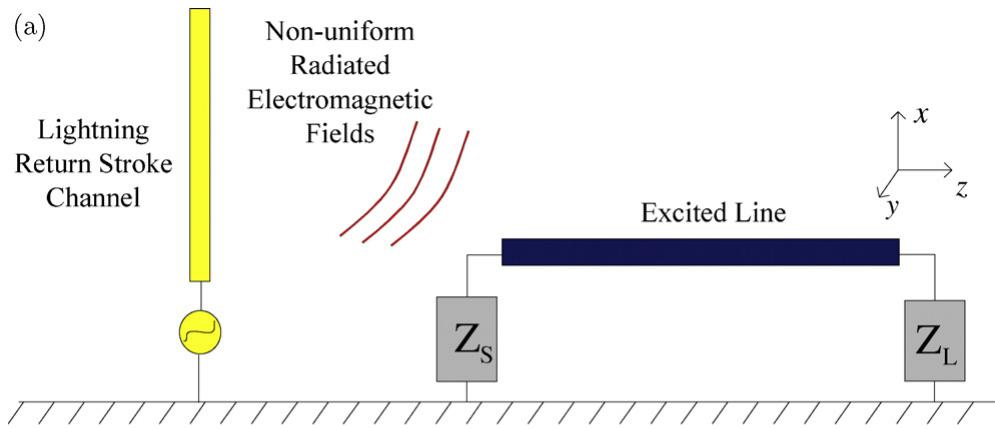

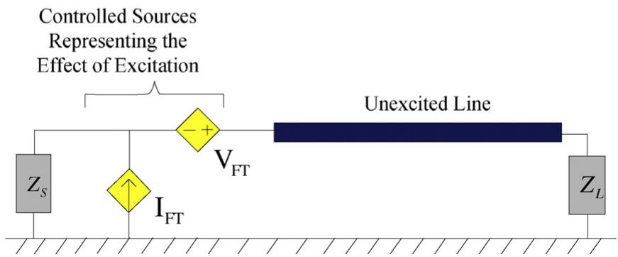  
(b)   
Fig. 1. (a) A two-conductor transmission line excited by lightning RSC EM fields and (b) equivalent circuit representation with controlled sources located at the terminal of unexcited line.

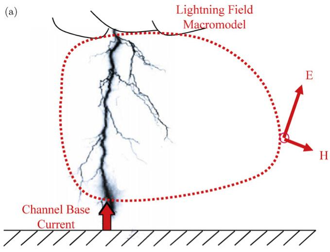

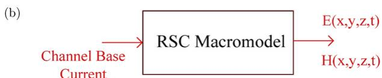  
Fig. 2. (a) The field macro-model of lightning RSC. Channel base current as input and radiated electromagnetic fields as its output and (b) equivalent block diagram representation of (a).

where L is the length of the line and $\varphi _ { 1 1 } ( L )$ and $\varphi _ { 2 1 } ( L )$ are the elements of chain parameter matrix given by [10],

$$
\varphi_ {1 1} (L) = \cosh (\gamma L)
$$

$$
\varphi_ {2 1} (L) = - \frac {1}{Z _ {C}} \sinh (\gamma L). \tag {5}
$$

In (5),  is the propagation constant and $Z _ { C }$ is characteristic impedance of the transmission line.

According to (3) and (4), for obtaining the lumped sources, a knowledge of the horizontal and vertical component of the electric field is required along the transmission line. Finding an efficient, fast, and accurate technique to calculate the electric field information in the vicinity of the RSC is the first step. In the next section, we introduce our proposed macro-model-based technique for the calculation of electromagnetic fields and that will later be used for the calculation of a closed form solution for the integrals of (3) and (4).

# 3. Lightning electromagnetic fields macro-model

In general, macro-modeling is reducing the complexity of a system with model order reduction techniques (MOR) in a way that the input–output behavior is preserved. In this paper, we will consider the lightning RSC and propagation medium as a black box. The

input and output of this box are the channel base current and radiated electromagnetic (EM) fields around the channel, respectively. Fig. 2a shows the EM field macro-model with its input and output, and Fig. 2b shows the equivalent block diagram representation of the macro-model.

The idea of the electromagnetic field macro-model is to obtain electromagnetic field at an arbitrary point in the space around the radiation source by using the already-known values of the electromagnetic field at other points in the space. Lets assume we are interested in determination of horizontal electric field and suppose we have the field data already calculated at N points at the height of h above a lossy ground with a conductivity of $\sigma _ { g } ,$ as shown in Fig. 3.

The required field information for those N points can be calculated using different methods. In this paper, we are using engineering models combined with Cooray–Rubinestein formulation [33,34], as well as the Numerical Electromagnetic Code (NEC) [35].

In Cooray–Rubinestein formula, the horizontal electric field over a ground with the conductivity of $\sigma _ { g }$ and at height x, $E _ { r } ,$ is represented by the horizontal electric field at the same height over a perfect ground, $E _ { r p }$ , and azimuthal magnetic field on a perfect ground $H _ { r p } ,$ , as

$$
E _ {r} (r, x, j \omega) = E _ {r p} (r, x, j \omega) - H _ {\varphi p} (r, 0, j \omega) \frac {c \mu_ {0}}{\sqrt {\varepsilon_ {r g} + \left(\sigma_ {g} / j \omega \varepsilon_ {0}\right)}} \tag {6}
$$

where $E _ { r p }$ and $H _ { \varphi p }$ in the time domain, can be obtained by [36]

$$
\begin{array}{l} E _ {r p} (r, x, t) = \frac {1}{4 \pi \varepsilon_ {0}} \left[ \int_ {- H} ^ {H} \frac {3 r \left(x - x ^ {\prime}\right)}{R ^ {5}} \int_ {0} ^ {t} i \left(x ^ {\prime}, \tau - \frac {R}{c}\right) d \tau d x ^ {\prime} \right. \\ + \int_ {- H} ^ {H} \frac {3 r \left(x - x ^ {\prime}\right)}{c R ^ {4}} i \left(x ^ {\prime}, t - \frac {R}{c}\right) d x ^ {\prime} \\ \left. - \int_ {- H} ^ {H} \frac {r \left(x - x ^ {\prime}\right)}{c ^ {2} R ^ {3}} \frac {\partial i \left(x ^ {\prime} , t - (R / c)\right)}{\partial t} d x ^ {\prime} \right] \tag {7} \\ \end{array}
$$

$$
\begin{array}{l} H _ {\varphi p} (r, 0, t) = \frac {1}{4 \pi} \left[ \int_ {- H} ^ {H} \frac {r}{R ^ {3}} i \left(x ^ {\prime}, t - \frac {R}{c}\right) d x ^ {\prime} \right. \\ \left. + \int_ {- H} ^ {H} \frac {r}{c R ^ {2}} \frac {\partial i \left(x ^ {\prime} , t - (R / c)\right)}{\partial t} d x ^ {\prime} \right]. \tag {8} \\ \end{array}
$$

Using the Engineering models, the current distribution along the RSC is assumed to be [37],

$$
i \left(x ^ {\prime}, t\right) = u \left(t - \frac {x ^ {\prime}}{v}\right) p \left(x ^ {\prime}\right) i \left(0, t - \frac {x ^ {\prime}}{v}\right), \tag {9}
$$

where $u ( \cdot )$ is the step function, p(·) is the height-dependent current attenuation factor, v is the current-wave propagation speed, and i(0, t) is the so-called channel base current. As we need to obtain the

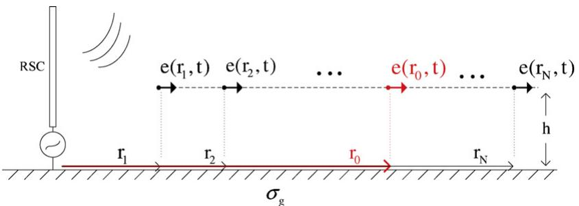  
Fig. 3. The geometry of the problem to be solved.

transfer function of the system, replacing the channel base current with Dirac delta function, ı(t), yields,

$$
\begin{array}{l} \xi_ {r p} (r, \phi , x, t) = \frac {1}{4 \pi \varepsilon_ {0}} \left[ \int_ {0} ^ {H} \frac {3 r \left(x - x ^ {\prime}\right)}{R ^ {5}} P \left(x ^ {\prime}\right) u \left(t - \frac {x ^ {\prime}}{v} - \frac {R}{c}\right) d x ^ {\prime} \right. \\ + \int_ {0} ^ {H} \frac {3 r \left(x - x ^ {\prime}\right)}{c R ^ {4}} P \left(x ^ {\prime}\right) \delta \left(t - \frac {x ^ {\prime}}{\nu} - \frac {R}{c}\right) d x ^ {\prime} \\ \left. - \int_ {0} ^ {H} \frac {r \left(x - x ^ {\prime}\right)}{c ^ {2} R ^ {3}} P \left(x ^ {\prime}\right) \delta^ {\prime} \left(t - \frac {x ^ {\prime}}{v} - \frac {R}{c}\right) d x ^ {\prime} \right] \tag {10} \\ \end{array}
$$

where  represents the impulse response. A similar equation can be obtained for $H _ { \varphi p } .$ . To discretize the calculations in the time domain, it is assumed that the input is represented as samples of the desired waveform $i ( 0 , t ) ,$ sampled every 
t seconds. The nonuniform discretization of the RSC, as described in Appendix A, allows us to apply the N-point Discrete Fourier Transform analytically as given by

$$
\begin{array}{l} \xi_ {r} (r, \phi , x, K) = \frac {1}{4 \pi \varepsilon_ {0}} \left[ \sum_ {i = 0} ^ {N _ {\mathrm {S e g}}} \frac {3 r _ {i} \left(x - x _ {i} ^ {\prime}\right)}{c R _ {i} ^ {4}} P \left(x _ {i} ^ {\prime}\right) \sum_ {n = m _ {i}} ^ {N - 1} e ^ {- j K \Omega_ {0} n} \frac {\Delta t \Delta x _ {i} ^ {\prime}}{N} \right. \\ + \sum_ {i = 0} ^ {N _ {\mathrm {S e g}}} \frac {3 r _ {i} \left(x - x _ {i} ^ {\prime}\right)}{c R _ {i} ^ {4}} P \left(x _ {i} ^ {\prime}\right) e ^ {- j K \Omega_ {0} m _ {i}} \frac {\Delta x _ {i} ^ {\prime}}{N} \\ - \sum_ {i = 0} ^ {N _ {\text {S e g}}} \frac {r _ {i} \left(x - x _ {i} ^ {\prime}\right)}{c ^ {2} R _ {i} ^ {3}} P \left(x _ {i} ^ {\prime}\right) e ^ {- j K \Omega_ {0} m _ {i}} \left(1 - e ^ {- j K \Omega_ {0}}\right) \frac {\Delta x _ {i} ^ {\prime}}{N \Delta t} \Bigg ] \tag {11} \\ \end{array}
$$

where $m _ { i }$ is the closest integer to $( R _ { i } / c + x _ { i } ^ { \prime } / \nu ) / \Delta t , \ N _ { \mathrm { S e g } }$ is the number of segments of the RSC, $\varOmega _ { 0 } = 2 \pi / N ,$ K is an integer, and $0 \le K \le N - 1$ . Evaluation of (11) provides the data needed for fitting the discrete time impulse response of the system into a form that is suitable for recursive convolution. A similar procedure can be done to obtain the impulse response of the azimuthal magnetic field. If we repeat the calculations for all the N points, we will have N data sets in frequency domain. Using the Vector Fitting algorithm, we are able to fit these data into the corresponding poles and residues as [38–40]

$$
\xi_ {r} (r, \phi , x, j \omega) = \sum_ {i = 1} ^ {M} \frac {R _ {i}}{j \omega - P _ {i}} \tag {12}
$$

where M is the number of fitting poles, $P _ { i }$ and $R _ { i }$ are the fitted poles and residues, respectively. This form of representation enables us to use recursive convolution in the time domain, speeds up the calculations, and saves the required memory space. Using Vector Fitting for all the N points of Fig. 3, we form poles matrix, P, and residues matrix, R, as

$$
\mathbf {P} = \left[ \begin{array}{c c c c c} p _ {1 1} & p _ {1 2} & p _ {1 3} & \dots & p _ {1 N} \\ p _ {2 1} & p _ {2 2} & p _ {2 3} & \dots & p _ {2 N} \\ \vdots & & & & \\ p _ {M 1} & p _ {M 2} & p _ {M 3} & \dots & p _ {M N} \end{array} \right] \tag {13}
$$

$$
\mathbf {R} = \left[ \begin{array}{c c c c c} \rho_ {1 1} & \rho_ {1 2} & \rho_ {1 3} & \dots & \rho_ {1 N} \\ \rho_ {2 1} & \rho_ {2 2} & \rho_ {2 3} & \dots & \rho_ {2 N} \\ \vdots & & & & \\ \rho_ {M 1} & \rho_ {M 2} & \rho_ {M 2} & \dots & \rho_ {M N} \end{array} \right] \tag {14}
$$

where the ij element is the ith pole/residue’s of distance $r _ { j }$ from the lightning channel base.

To find the electric field data for any arbitrary point in the space by using these known poles and residues, we map the trace of the same order poles/residues into analytic functions. For example, the jth row which represents the jth pole/residue for all N points, will be mapped into a function of r. Any function that best fits into the trace can be selected. Then for any arbitrary point, we can obtain the poles and residues by replacing the position of that point into the trace functions and calculate the electric field using,

$$
\xi (r = r _ {0}, j \omega) = \sum_ {j = 1} ^ {M} \frac {\rho_ {j} \left(r _ {0}\right)}{j \omega - p _ {j} \left(r _ {0}\right)} \tag {15}
$$

where $\rho _ { j }$ and $p _ { j }$ represent the tracing functions. Because of using impulse function to obtain poles and residues of distance $r _ { 0 } ,$ the electric field data in the time domain will be the convolution of the input of the macro-model, i.e. the channel-base current, and the Inverse Fourier Transform (IFT) of obtained transfer function as

$$
e \left(r _ {0}, t\right) = i _ {\text {b a s e}} (t) \times f ^ {- 1} \left\{\xi \left(r = r _ {0}, j \omega\right) \right\}. \tag {16}
$$

Using the pole-residue representation, we can do the convolution recursively using the analytic IFT.

It should be mentioned that the required transfer function data can be provided for Vector Fitting using different ways other than Engineering models. For example, by using simulation software NEC, we are able to calculate the transfer function data for those N points. NEC has already been used for the calculation of lightning EM fields [41,42].

In the next section, we are studying the coupling equations for two-conductor transmission lines using the proposed technique to express them in a closed form solution.

# 4. A macro-model for the two-conductor transmission line

The integrals of (3) are similar to those in (4). So, evaluation of (3) will suffice for this section. To determine the lumped forcing functions in (3), there are four integrals that have to be evaluated that are labeled as $V _ { 1 } , V _ { 2 } , V _ { 3 }$ , and $V _ { 4 } ,$ as given below

$$
V _ {1} = \int_ {0} ^ {L} \varphi_ {1 1} (z) E _ {z} ^ {\text {i n c}} (h, z) d z \tag {17a}
$$

$$
V _ {2} = \int_ {0} ^ {L} \varphi_ {1 1} (z) E _ {z} ^ {\text {i n c}} (0, z) d z \tag {17b}
$$

$$
V _ {3} = \int_ {0} ^ {h} E _ {x} ^ {\text {i n c}} (x, z = 0) d x \tag {17c}
$$

$$
V _ {4} = \varphi_ {1 1} (L) \int_ {0} ^ {h} E _ {x} ^ {\text {i n c}} (x, z = L) d x. \tag {17d}
$$

The first and second integrals correspond to the horizontal component of the electric field $E _ { z } ,$ , along the transmission line while the third and fourth integrals are related to the vertical component of the electric field $E _ { x } ,$ from ground level to the height of the line. Our calculation shows in the case of lightning frequencies, the variation of the vertical electric field from ground level to the height of the line is negligible. So, $V _ { 3 }$ and $V _ { 4 }$ can be obtained simply by,

$$
V _ {3} \approx E _ {x} (x = 0, z = 0) \times h, \tag {18}
$$

$$
V _ {4} \approx E _ {x} (x = 0, z = L) \times h.
$$

The integral in $V _ { 1 }$ is very similar to $V _ { 2 }$ , so finding a closed form solution for one of them, will give the answer for the other one. Here, we show the detailed calculation of $V _ { 1 }$ and use the proposed

macro-model for the calculation of the electromagnetic fields to simplify this integral.

We are free to choose any function that best fits into the trace of poles and residues, but, for simplifying the integrals and finding a closed form solution, the tracing functions for poles and residues are chosen to be 1st order and 2nd order polynomials, respectively. Under this approximation, the horizontal electric field at any $\omega = \omega _ { 0 }$ , will be written in the form of,

$$
E _ {z} \left(j \omega_ {0}, z\right) \cong \sum_ {k = 1} ^ {M} \frac {A _ {k} z ^ {2} + B _ {k} z + C _ {k}}{j \omega_ {0} - \left(F _ {k} z + G _ {k}\right)}. \tag {19}
$$

Substituting (19) into (17a) and changing the order of summation and integration we have,

$$
\begin{array}{l} V _ {1} = \sum_ {k = 1} ^ {M} \int_ {0} ^ {L} \cosh (\gamma_ {0} z) \left\{\frac {A _ {k}}{D _ {k}} z + \left(\frac {B _ {k}}{D _ {k}} - \frac {A _ {k} E _ {k}}{D _ {k} {} ^ {2}}\right) \right. \\ \left. + \frac {C _ {k} - \left(B _ {k} E _ {k} / D _ {k}\right) - \left(A _ {k} E _ {k} ^ {2} / D _ {k} ^ {2}\right)}{D _ {k} z + E _ {k}} \right\} d z. \tag {20} \\ \end{array}
$$

The first and second terms inside the integral can be simply obtained as

$$
\begin{array}{l} \int_ {0} ^ {L} \frac {A _ {k}}{D _ {k}} z \cosh (\gamma_ {0} z) d z = \frac {A _ {k}}{D _ {k}} \left(\frac {L}{\gamma_ {0}} \sinh (\gamma_ {0} L) + \frac {1 - \cosh (\gamma_ {0} L)}{\gamma_ {0} ^ {2}}\right) \int_ {0} ^ {L} \\ \left(\frac {B _ {k}}{D _ {k}} - \frac {A _ {k} E _ {k}}{D _ {k} ^ {2}}\right) \cosh (\gamma_ {0} z) d z = \left(\frac {B _ {k}}{D _ {k}} - \frac {A _ {k} E _ {k}}{D _ {k} ^ {2}}\right) \frac {\sinh (\gamma_ {0} L)}{\gamma_ {0}}. \tag {21} \\ \end{array}
$$

We label the last term in (20) as $V _ { k } ^ { \prime }$ and is given below

$$
V _ {k} ^ {\prime} = \int_ {0} ^ {L} \cosh \left(\gamma_ {0} z\right) \frac {A _ {k} ^ {\prime}}{D _ {k} z + E _ {k}} d z \tag {22}
$$

where

$$
A _ {k} ^ {\prime} = C _ {k} - \frac {B _ {k} E _ {k}}{D _ {k}} - \frac {A _ {k} E _ {k} {} ^ {2}}{D _ {k} {} ^ {2}}. \tag {23}
$$

There is a closed form solution for integral of (22) as

$$
\begin{array}{l} V _ {k} ^ {\prime} = \frac {A ^ {\prime} {} _ {k}}{D _ {k}} \left\{\cosh \left(\frac {\gamma_ {0} E _ {k}}{D _ {k}}\right) \left[ C h i \left(\frac {\gamma_ {0} E _ {k}}{D _ {k}} + \gamma_ {0} L\right) - C h i \left(\frac {\gamma_ {0} E _ {k}}{D _ {k}}\right) \right] \right. \\ \left. - \sinh \left(\frac {\gamma_ {0} E _ {k}}{D _ {k}}\right) \left[ S h i \left(\frac {\gamma_ {0} E _ {k}}{D _ {k}} + \gamma_ {0} L\right) - S h i \left(\frac {\gamma_ {0} E _ {k}}{D _ {k}}\right) \right] \right\} \tag {24} \\ \end{array}
$$

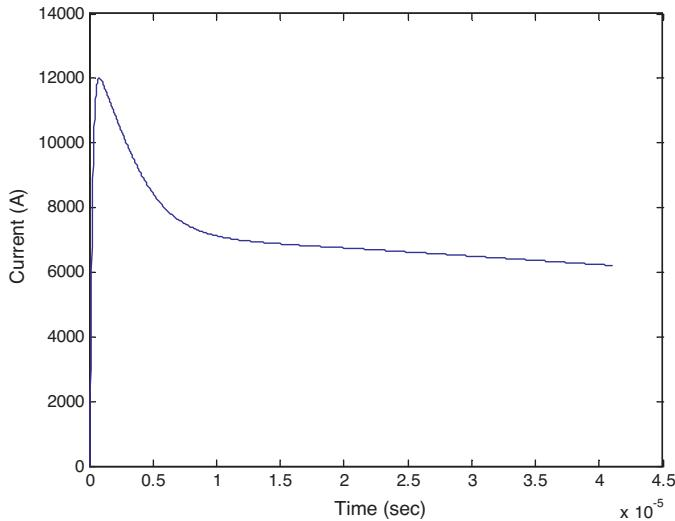  
Fig. 5. Channel base current for the field macro-model’s input.

where Chi(·) and Shi(·) functions are hyperbolic cosine integral and hyperbolic sine integral functions, respectively, and are defined as

$$
\begin{array}{l} C h i (z) = \zeta + \ln (z) + \int_ {0} ^ {z} \frac {\cosh (t) - 1}{t} d t \tag {25} \\ S h i (z) = \int_ {0} ^ {z} \frac {\sinh (t)}{t} d t \\ \end{array}
$$

where  = 0.57721 and is the Euler–Mascheroni constant. By using (18)–(24), we are able to calculate (3) and (4) in a closed form solution for a two-conductor line. The coefficients of the poles and residues trace’s functions given by the EM field macro-model, are the only information needed for this purpose. Although in multiconductor case there is no closed form solution for lumped sources, still we can calculate the electromagnetic fields required in coupling equations by using the proposed EM field macro-model to have fast and efficient calculations.

# 5. Simulation results

In this section, we are comparing the results of our proposed macro-model used to calculate the electromagnetic field and the force functions to obtain induced voltage on an excited transmission line and compare with those obtained by Nucci et al [43].

Consider a 6-km lightning flash that occurs at a distance of 50 m from a 500 m horizontal transmission line which is located at 10 m above ground. The geometry of this problem is shown in Fig. 4. In this example, we will study the horizontal electric field component first and then we will use the resulted electric fields to obtain the induced voltage. Fig. 5 shows the channel base current of the

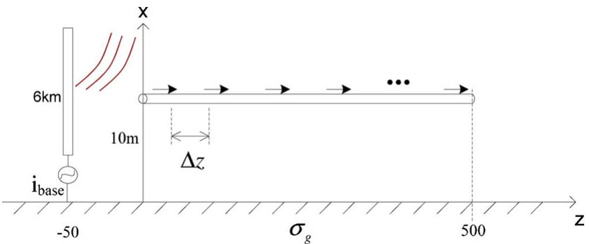  
Fig. 4. Geometry of the example.

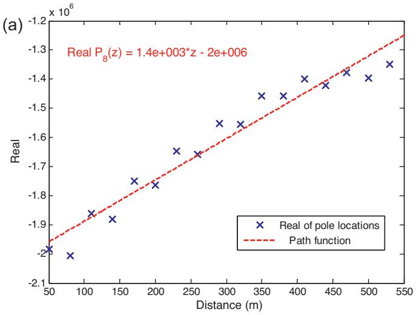

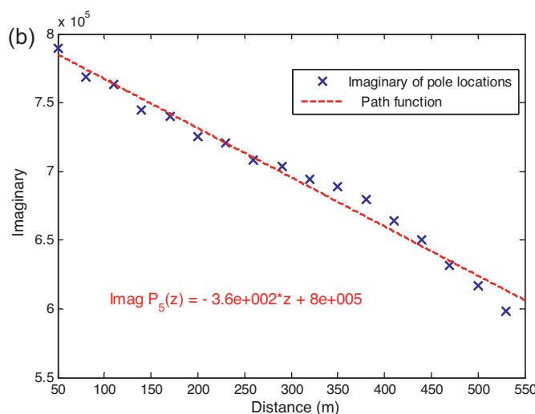  
Fig. 6. (a) 8th pole’s real part locations in different distances and (b) 5th pole’s imaginary part locations in different distances.

RSC that is used as the input of the macro-model, adopted from [44].

To obtain the horizontal electric field at any arbitrary point along the line, we need to have electric field data at certain points along the line. We chose 17 equally spaced points with a separation of 30 m. Typical values of 0.001 S/m and 10 are chosen for the ground conductivity and relative permittivity, respectively. For lightning RSC, we use MTLL model with propagation speed along the channel equal to $1 . 5 \times 1 0 ^ { 8 }$ m/s.

We used 10 poles in the Vector Fitting Algorithm with 1st and 2nd order polynomial approximations for tracing the poles and residues of the horizontal electric field along the transmission line, respectively. Figs. 6 and 7 shows the tracing functions for real and imaginary parts of a selected number of poles and residues.

In Fig. 8, we compare the output of the macro-model for the horizontal electric field at 4 arbitrary points along the line with direct time domain method results.

To see the effect of different parameters on the macro-model output, we have done several parametric studies such as ground conductivity, type of engineering models, number of poles used in the Vector Fitting, and number of space segments. The results are presented in Appendix B.

Using the obtained horizontal electric fields and using the closed form solution obtained in Section 4, the induced voltage at the left

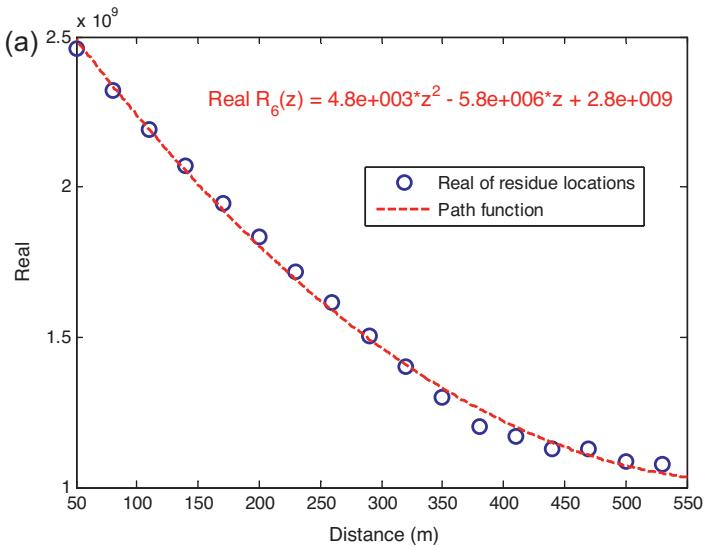

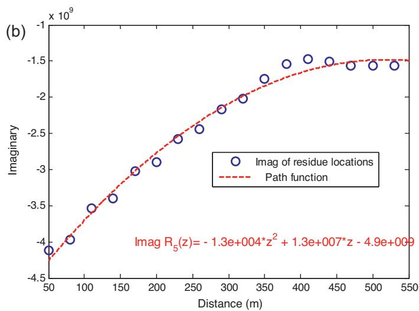  
Fig. 7. (a) 6th residue’s real part locations in different distances and (b) 5th residue’s imaginary part locations in different distances.

terminal of the transmission line is obtained by using the Modified Finite Difference Time Domain (MFDTD) method [15], and compared with results obtained in [43], in Fig. 9. In this figure, the required transfer function data for doing Vector Fitting is obtained using MTLL engineering model (as discussed in Section 3) and NEC software. The details of the considerations in using NEC are provided in Appendix C.

Although we have used 1st and 2nd order polynomial approximations for tracing the poles and residues, respectively, there is a good agreement between the results. Although the result of Agrawal–Taylor is more accurate, the proposed voltage macromodel results are more suitable in terms of required calculation time and efficiency. To see how fast the proposed method works, we obtained the horizontal electric field at 500 points along the mentioned transmission line with both proposed method and direct time domain method which is using the Cooray–Rubinstein formula directly. The calculation time at each point for horizontal electric field to be obtained independently was around 16.5 s. This time is mostly spent on obtaining poles and residues correspond to that point. The time spent to obtain the coefficient of tracing functions using fitted poles and residues and taking IFFT was negligible in our simulation. The total required time for these methods was 284 s for proposed method compared to 8370 s for direct time

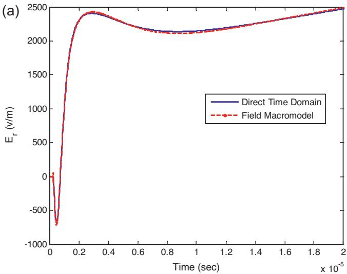

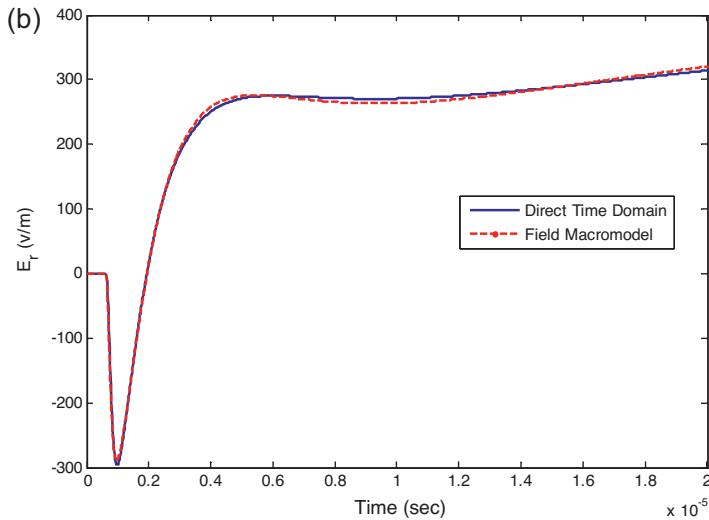

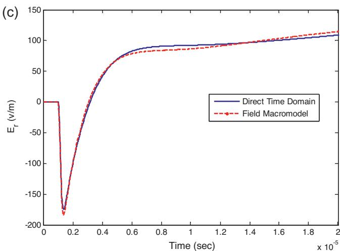

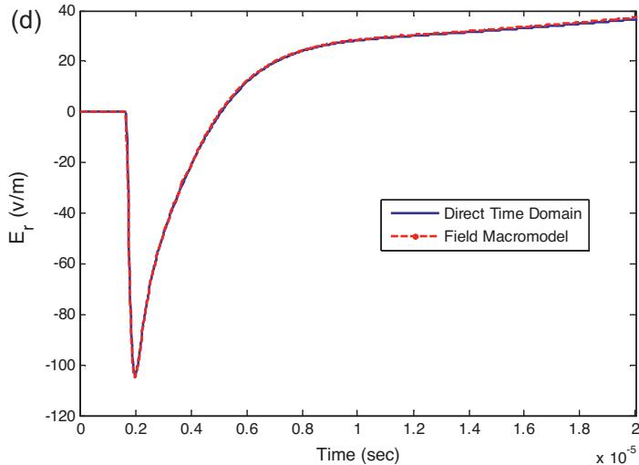  
Fig. 8. Horizontal electric field at z = (a) 70 m, (b) 190 m, (c) 310 m, (d) 495 m and h = 10 m above the ground with  = 0.001 S/m, using MTLL model.

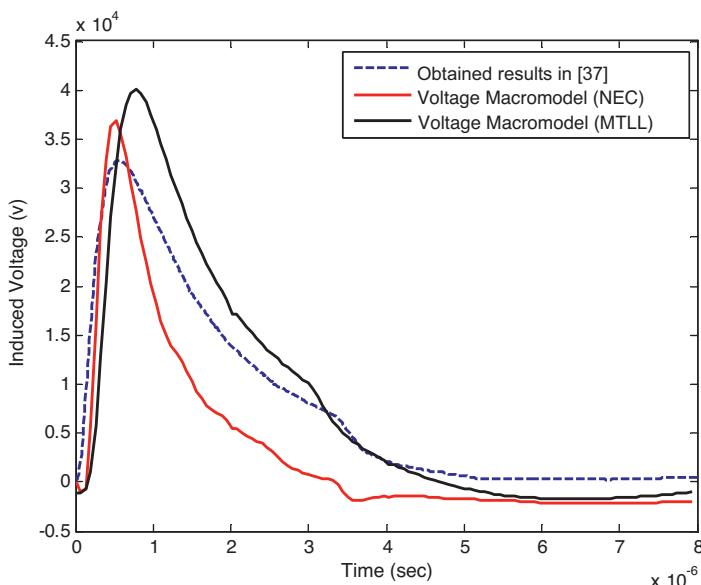  
Fig. 9. Induced voltage at the left terminal of the transmission line of Fig. 4.

domain method which shows a 30-time faster calculation.2 Using different return stroke models in our simulations and the one used in [37] can be a reason for the slight differences between the results observed in Fig. 9. However, the main reason is using low order tracing function and not using large number of poles and residues. Since there is a trade off between the accuracy and calculation time, the very reasonable numbers we found in our simulations for the number of poles was 10 and for the order of polynomial functions for poles and residues were 1st and 2nd order, respectively. Investigating the calculation efficiency of using higher order tracing functions may be addressed in future work.

# 6. Conclusion

In this paper, we introduced a fast and efficient macro-model to calculate nonuniform electromagnetic radiated fields at any arbitrary point in the space and to obtain a closed form solution for forcing functions in a two-conductor frequency dependant transmission line case above lossy ground. This macro-model works

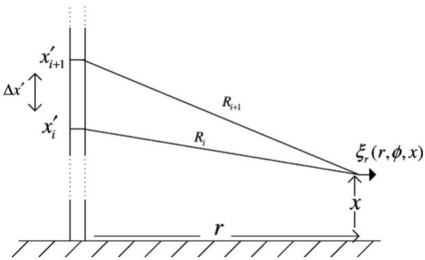  
Fig. 10. Schematic of the discretization of RSC.

based on the transfer function approach and uses the trace of poles and residues of the system’s transfer function. This method can be employed in multiconductor cases as well to calculate the terminal lumped sources efficiently. This approach enables us to integrate frequency-domain technique into the time domain simulators and take advantage of both time and frequency domain specifications.

# Acknowledgment

The authors would like to acknowledge support from Manitoba Hydro and Mitacs Accelerate Manitoba.

# Appendix A. Nonuniform discretization of the RSC

Our approach is to properly discretize the RSC so that in every time step, the wave travels by one segment 
x on the channel. This will remove any unreal oscillations which are created if the RSC is not discretized properly. Mathematically, we specify this condition (see Fig. 10) as

$$
\left(\frac {x _ {i + 1} ^ {\prime}}{\nu} + \frac {R _ {i + 1}}{c}\right) - \left(\frac {x _ {i} ^ {\prime}}{\nu} + \frac {R _ {i}}{c}\right) = \Delta t, \tag {A.1}
$$

where $x _ { i + 1 } ^ { \prime } = x _ { i } ^ { \prime } + \Delta x _ { i } ^ { \prime }$ and $R _ { i } = \sqrt { { x ^ { \prime } } _ { i } ^ { 2 } + r ^ { 2 } }$ . Solving (A.1) for $\Delta x _ { i } ^ { \prime }$ yields

$$
\begin{array}{l} \underbrace {\left(\frac {1}{v ^ {2}} - \frac {1}{c ^ {2}}\right)} _ {A} \Delta x _ {i} ^ {\prime 2} - 2 \Delta x _ {i} ^ {\prime} \underbrace {\left(\frac {\Delta t}{v} + \frac {x _ {i} ^ {\prime}}{c ^ {2}} + \frac {\sqrt {x _ {i} ^ {\prime 2} + r ^ {2}}}{v c}\right)} _ {B} \\ + \underbrace {\Delta t \left(\Delta t + 2 \frac {\sqrt {x _ {i} ^ {\prime 2} + r ^ {2}}}{c}\right)} _ {C} = 0 \tag {A.2} \\ \end{array}
$$

$$
\Delta x _ {i} ^ {\prime} = \frac {B - \sqrt {B ^ {2} - A C}}{A}. \tag {A.3}
$$

# Appendix B. Parametric study for EM field macro-model

In order to study the effect of the ground conductivity on the field macro-model result and see if the EM field macro-model is able to predict the accurate results for different values of ground conductivities, several values of ground conductivities are studied. We used MTLL model for RSC and obtained the horizontal electric field at $z = 3 1 0 \mathrm { m }$ for different ground conductivities such as, $\sigma = _ { \infty , 0 . 0 1 }$ S/m, 0.001 S/m, 0.0001 S/m, using 10 poles and residues. A comparison of macro-model outputs and those of direct time

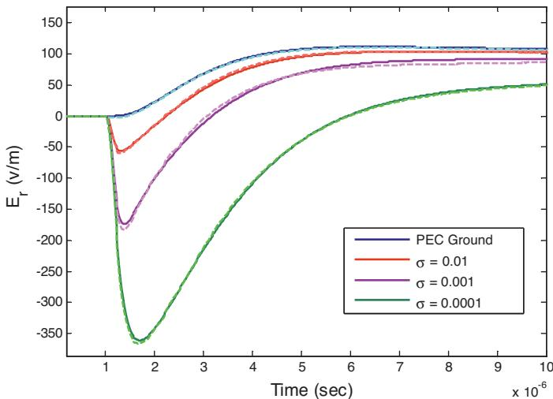  
Fig. 11. Comparison of the output of the field macro-model for different ground conductivities with their direct time domain solutions.

domain results is shown in Fig. 11. Obviously, the ground conductivity has an important effect on the horizontal electric field and in all the cases, field macro-model’s results are in good agreement with direct time domain results.

Effect of different RSC Models such as, MTLE, MTLL, and TL, for a ground conductivity of 0.001 S/m and fixed distance of $z = 3 1 0$ m is studied and the results obtained using these models are plotted in Fig. 12. In this figure, the solid lines are direct time domain results and the dashed lines are macro-model’s output calculated by using 10 poles and residues.

Choosing a proper number of poles and residues to be used in the Vector Fitting algorithm is critical issues in this study to have enough accuracy. Fig. 13 demonstrates the effect of the number of the poles on macro-model output. MTLL model is used for the RSC and the horizontal electric fields are calculated at $z = 3 1 0 \mathrm { m }$ . The results are obtained for 3, 5, 8, 10, 30, and 60 poles. As shown in Fig. 13, small number of poles and residues makes the results inaccurate. By increasing the number of poles, the accuracy increases. But, very large number of poles makes Vector Fitting algorithm unstable. The result for 60 poles is plotted separately in Fig. 14 in which there is a big difference between macro-model output and direct time domain method’s result.

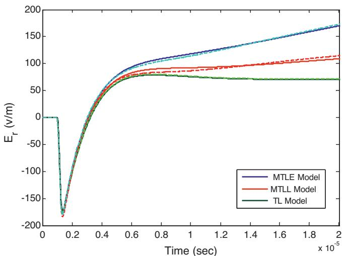  
Fig. 12. Comparison of the output of the field macro-model for three engineering models with their direct time domain solutions.

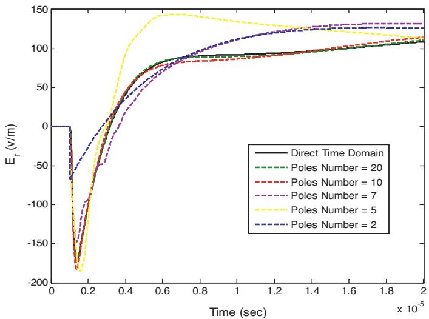  
Fig. 13. Comparison of the output of the field macro-model for different poles number with their direct time domain solutions.

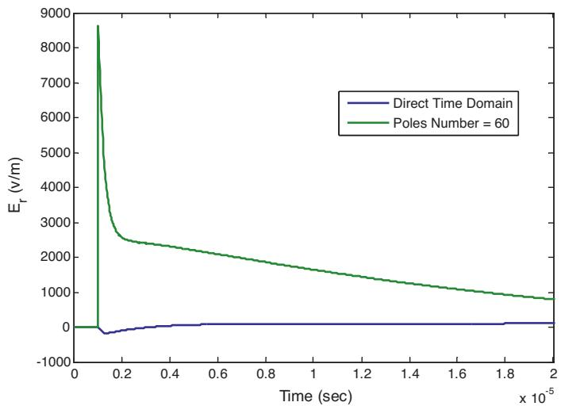  
Fig. 14. Comparison of the output of the field macro-model for a large number of poles for fitting with its direct time domain solution.

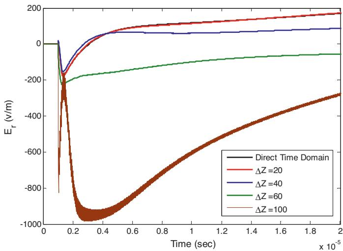  
Fig. 15. Comparison of the output of the field macro-model for different segmentation length with their direct time domain solution.

In order to study the effect of the segment’s length effect on the macro-model’s output, we chose N points in the space, linearly separated with $ { \Delta z } ( N - 1$ segments). In the first example case mentioned in Section 5, we had 17 points from 50 m up to 550 m distance from RSC location which is equivalent to $\Delta z { = } 3 0 \mathrm { m }$ . Fig. 15 shows the macro-model output for different numbers of segmentation. Expectedly, by increasing the segments length, the accuracy of the poles and residues tracing will decrease and the output will be inaccurate. It should be noted that having very small segment length means increasing the calculation time. For our cases, $\Delta z = 3 0 \mathrm { n }$ m was accurate enough.

# Appendix C. NEC simulation constrains

The required data for Vector Fitting algorithm can be obtained from any algorithm or software that calculates the electromagnetic frequency domain information. In this work, Numerical Electromagnetic Code (NEC) is used for this purpose besides the Engineering models.

There are several considerations in using NEC. The main electrical consideration is on the segment length 
x, relative to the wavelength , as [45,42]

$$
1 0 ^ {- 3} \lambda <   \Delta x <   0. 1 \lambda . \tag {C.1}
$$

NEC provides data in positive frequencies which is suitable for being used by Vector Fitting algorithm directly. The DC component of the electric field produced by NEC is assumed to be zero in this paper. Careful considerations should be taken in determining the time step 
t, and the duration of analysis T (or equivalently the highest frequency $f _ { h i g h } ,$ , and the lowest frequency $f _ { l o w } .$ , in the frequency domain analysis). The frequencies of the output must be coincident with the frequencies analyzed by NEC software. In our example, the time step 
t, is chosen 20 ns with respect to the channel base current shape and to have enough data points on the rise time of the current derivative and 2049 time steps is considered $( T = N _ { t } \times \Delta t = 4 0 . 9 8 \mu s )$ . The sampling frequency is, $f _ { s } = 1 / \Delta t = 5 0$ MHz. So the bandwidth is, $B w = f _ { s } / 2 = 2 5$ MHz. This is the upper frequency which should be considered in NEC. Because of using Discrete Fourier Transform, the number of frequency points should be half of the time points $( N _ { f } = 1 0 2 4 )$ . The lowest frequency then is obtainable by dividing the highest frequency over number of frequency points $( f _ { l o w e s t } = 2 5 \mathrm { M H z } / 1 0 2 4 = 2 4 . 4 \mathrm { k H z } )$ . Next, proper RSC channel segments length must be selected. Eq. (C.1) should be satisfied so that, $1 0 ^ { - 3 } \lambda _ { \operatorname* { m a x } } < \Delta x$ and $\Delta x { < } 0 . 1 \lambda _ { \mathrm { m i n } }$ $( \lambda _ { \operatorname* { m a x } } = c / f _ { \operatorname* { m i n } } = 1 2 . 3$ km and $\lambda _ { \operatorname* { m i n } } = c / f _ { \operatorname* { m a x } } = 1 2 \ : \mathrm { m } )$ . This means the ideal segment length should satisfy $1 2 . 3 \mathrm { m } < \Delta x < 1 . 2$ m which is impossible. In lightning case, most of the energy presents in the frequencies lower than 1 MHz. So lower frequency constrain is more important in segment length determination. We chose $\Delta x = 1 5$ m and the 6-km lightning flash is divided into 400 segments to be analyzed by NEC. In order to control the current propagation velocity along the antenna, we add electrical components in series along the antenna. To reach a velocity of half of the velocity of light, we used $R = 1 \Omega / \mathrm { m }$ and $L = 3 \mu \mathrm { H } / \mathrm { m }$ for RSC channel loading. The reason of the presence of the resistor is to decrease the oscillations due to inductor.

# References

[1] J.F.H. Branin, Transient analysis of lossless transmission lines, Proceedings of the IEEE 55 (11) (1967) 2012–2013.   
[2] A. Budner, Introduction of frequency-dependent line parameters into an electromagnetic transients program, IEEE Transactions on Power Apparatus and Systems PAS-89 (1) (1970) 88–97, http://dx.doi.org/ 10.1109/TPAS.1970.292674.   
[3] J. Snelson, Propagation of travelling waves on transmission lines – frequency dependent parameters, IEEE Transactions on Power Apparatus and Systems PAS-91 (1) (1972) 85–91, http://dx.doi.org/10.1109/TPAS.1972.293294.

[4] J.R. Marti, Accurate modeling of frequency-dependent transmission lines in electromagnetic transient simulations, IEEE Power Engineering Review PER-2 (1) (1982) 29–30, http://dx.doi.org/10.1109/MPER.1982.5519686.   
[5] T. Noda, N. Nagaoka, A. Ametani, Phase domain modeling of frequencydependent transmission lines by means of an ARMA model, IEEE Transactions on Power Delivery 11 (1) (1996) 401–411, http://dx.doi.org/ 10.1109/61.484040.   
[6] A. Morched, B. Gustavsen, M. Tartibi, A universal model for accurate calculation of electromagnetic transients on overhead lines and underground cables, IEEE Transactions on Power Delivery 14 (3) (1999) 1032–1038, http://dx.doi.org/10.1109/61.772350.   
[7] B. Gustavsen, G. Irwin, R. Mangelrod, D. Brandt, K. Kent, Transmission line models for the simulation of interaction phenomena between parallel ac and dc overhead lines, in: Int. Conf. on Power Systems Transients (IPST’99), Budapest, Hungary, 1999, pp. 61–67.   
[8] A. Agrawal, H. Price, S. Gurbaxani, Transient response of multiconductor transmission lines excited by a nonuniform electromagnetic field, IEEE Transactions on Electromagnetic Compatibility EMC-22 (2) (1980) 119–129, http://dx.doi.org/10.1109/TEMC.1980.303824.   
[9] A. Djordjevic, T. Sarkar, R. Harrington, Time-domain response of multiconductor transmission lines, Proceedings of the IEEE 75 (6) (1987) 743–764.   
[10] C. Paul, Analysis of Multiconductor Transmission Lines, 2nd edition, Wiley-IEEE Press, Hoboken, New Jersey, 2008.   
[11] A. Orlandi, C.R. Paul, FDTD analysis of lossy multiconductor transmission lines terminated in arbitrary loads, IEEE Transactions on Electromagnetic Compatibility 38 (3) (1996) 388–399, http://dx.doi.org/10.1109/15.536069.   
[12] G. Antonini, A. Orlandi, C. Paul, An improved method of modeling lossy transmission lines in finite-difference, time-domain analysis, IEEE International Symposium on Electromagnetic Compatibility 1 (1999) 435–439, http://dx.doi.org/10.1109/ISEMC.1999.812943.   
[13] D. Mardare, J. LoVetri, The finite-difference time-domain solution of lossy MTL networks with nonlinear junctions, IEEE Transactions on Electromagnetic Compatibility 37 (2) (1995) 252–259, http://dx.doi.org/10.1109/15.385890.   
[14] F. Rachidi, C. Nucci, M. Ianoz, Transient analysis of multiconductor lines above a lossy ground, IEEE Transactions on Power Delivery 14 (1) (1999) 294–302, http://dx.doi.org/10.1109/61.736741.   
[15] B. Kordi, J. LoVetri, G. Bridges, Finite-difference analysis of dispersive transmission lines within a circuit simulator, IEEE Transactions on Power Delivery 21 (1) (2006) 234–242, http://dx.doi.org/10.1109/TPWRD.2005.855431.   
[16] M. Paolone, F. Rachidi, A. Borghetti, C. Nucci, M. Rubinstein, V. Rakov, M. Uman, Lightning electromagnetic field coupling to overhead lines: theory numerical simulations and experimental validation, IEEE Transactions on Electromagnetic Compatibility 51 (3) (2009) 532–547, http://dx.doi.org/10.1109/TEMC.2009.2025958.   
[17] A.C. Nucci, F. Rachidi, Interaction of electromagnetic fields with electrical networks generated by lightning, in: The Lightning Flash: Physical and Engineering Aspects, IEE Power and Energy Series, 2003 (Chapter 8).   
[18] A. Borghetti, C.A. Nucci, M. Paolone, An improved procedure for the assessment of overhead line indirect lightning performance and its comparison with the IEEE std. 1410 method, IEEE Transactions on Power Delivery 22 (1) (2007) 684–692, http://dx.doi.org/10.1109/TPWRD.2006.881463.   
[19] A. Borghetti, J. Gutierrez, C. Nucci, M. Paolone, E. Petrache, F. Rachidi, Lightninginduced voltages on complex distribution systems: models advanced software tools and experimental validation, Journal of Electrostatics 60 (2) (2004) 163–174.   
[20] A. Borghetti, C. Nucci, M. Paolone, Indirect-lightning performance of overhead distribution networks with complex topology, IEEE Transactions on Power Delivery 24 (4) (2009) 2206–2213.   
[21] G. Shinh, N. Nakhla, R. Achar, M. Nakhla, A. Dounavis, I. Erdin, Efficient SPICE macromodel for EMI analysis of electronic packages and high-speed interconnects, IEEE 13th Topical Meeting on Electrical Performance of Electronic Packaging (2004) 277–280, http://dx.doi.org/10.1109/EPEP.2004.1407609.   
[22] G. Shinh, N. Nakhla, R. Achar, M. Nakhla, A. Dounavis, I. Erdin, Fast transient analysis of incident field coupling to multiconductor transmission lines, IEEE Transactions on Electromagnetic Compatibility 48 (1) (2006) 57–73, http://dx.doi.org/10.1109/TEMC.2006.870694.   
[23] G. Shinh, N. Nakhla, R. Achar, M. Nakhla, I. Erdin, Fast, EMC analysis high-speed interconnects with frequency-dependent parameters, IEEE International Symposium on Electromagnetic Compatibility 2 (2006) 556–559, http://dx.doi.org/10.1109/ISEMC.2006.1706367.   
[24] G. Shinh, R. Achar, N. Nakhla, M. Nakhla, I. Erdin, Simplified macromodel of MTLs with incident fields (SIMMIF), IEEE Transactions on Electromagnetic

Compatibility 50 (2) (2008) 375–389, http://dx.doi.org/10.1109/TEMC.2008. 922788.   
[25] R. Achar, M. Nakhla, Simulation of high-speed interconnects, Proceedings of the IEEE 89 (5) (2001) 693–728, http://dx.doi.org/10.1109/5.929650.   
[26] I. Erdin, A. Dounavis, R. Achar, M. Nakhla, Circuit simulation of incident field coupling to multiconductor transmission lines with frequency-dependent losses, IEEE International Symposium on Electromagnetic Compatibility 2 (2001) 1084–1087, http://dx.doi.org/10.1109/ISEMC.2001.950562.   
[27] I. Erdin, A. Dounavis, R. Achar, M. Nakhla, A SPICE model for incident field coupling to lossy multiconductor transmission lines, IEEE Transactions on Electromagnetic Compatibility 43 (4) (2001) 485–494, http://dx.doi.org/10.1109/15.974627.   
[28] N. Nakhla, A. Dounavis, R. Achar, M. Nakhla, DEPACT: delay extractionbased passive compact transmission-line macromodeling algorithm, IEEE Transactions on Advanced Packaging 28 (1) (2005) 13–23, http://dx.doi.org/10.1109/TADVP.2004.841677.   
[29] G. Antonini, A spectral formulation for the transient analysis of plane-wave coupling to multiconductor transmission lines, IEEE Transactions on Electromagnetic Compatibility 51 (3) (2009) 792–804, http://dx.doi.org/10.1109/TEMC.2009.2017935.   
[30] H. Xie, J. Wang, R. Fan, Y. Liu, A hybrid FDTD-SPICE method for transmission lines excited by a nonuniform incident wave, IEEE Transactions on Electromagnetic Compatibility 51 (3) (2009) 811–817, http://dx.doi.org/10.1109/TEMC.2009.2020913.   
[31] C. Taylor, R. Satterwhite, J.C. Harrison, The response of a terminated two-wire transmission line excited by a nonuniform electromagnetic field, IEEE Transactions on Antennas and Propagation 13 (6) (1965) 987–989.   
[32] F. Rachidi, Formulation of the field-to-transmission line coupling equations in terms of magnetic excitation field, IEEE Transactions on Electromagnetic Compatibility 35 (3) (1993) 404–407, http://dx.doi.org/10.1109/15.277316.   
[33] M. Rubinstein, An approximate formula for the calculation of the horizontal electric field from lightning at close intermediate and long range, IEEE Transactions on Electromagnetic Compatibility 38 (3) (1996) 531–535, http://dx.doi.org/10.1109/15.536087.   
[34] V. Cooray, V. Scuka, Lightning-induced overvoltages in power lines: validity of various approximations made in overvoltage calculations, IEEE Transactions on Electromagnetic Compatibility 40 (4) (1998) 355–363, http://dx.doi.org/10.1109/15.736222.   
[35] G. Burke, Numerical Electromagnetic Code – NEC-4, Method of Moments, January 1992.   
[36] B. Djebari, J. Hamelin, C.F.J. Leteinturier, Comparison between experimental measurements of the electromagnetic field emitted by lightning and different theoretical models. influence of the upward velocity of the return stroke, in: 4th Int. Symp. Tech. Exhib. Electromag. Compat, 1981.   
[37] V.A. Rakov, Lightning electromagnetic fields modeling and measurements, in: Proc. 12th Int. Zurich Symp. Electromagn. Compat, 1997, pp. 59–64.   
[38] B. Gustavsen, A. Semlyen, Rational approximation of frequency domain responses by vector fitting, IEEE Transactions on Power Delivery 14 (3) (1999) 1052–1061, http://dx.doi.org/10.1109/61.772353.   
[39] B. Gustavsen, Improving the pole relocating properties of vector fitting, IEEE Transactions on Power Delivery 21 (3) (2006) 1587–1592, http://dx.doi.org/10.1109/TPWRD.2005.860281.   
[40] D. Deschrijver, M. Mrozowski, T. Dhaene, D. De Zutter, Macromodeling of multiport systems using a fast implementation of the vector fitting method, IEEE Microwave and Wireless Components Letters 18 (6) (2008) 383–385, http://dx.doi.org/10.1109/LMWC.2008.922585.   
[41] R. Pokharel, M. Ishii, Y. Baba, Numerical electromagnetic analysis of lightning-induced voltage over ground of finite conductivity, IEEE Transactions on Electromagnetic Compatibility 45 (4) (2003) 651–656, http://dx.doi.org/10.1109/TEMC.2003.819065.   
[42] Y. Baba, M. Ishii, Numerical electromagnetic field analysis of lightning current in tall structures, IEEE Transactions on Power Delivery 16 (2) (2001) 324–328, http://dx.doi.org/10.1109/61.915502.   
[43] C. Nucci, F. Rachidi, M. Ianoz, C. Mazzetti, Comparison of two coupling models for lightning-induced overvoltage calculations, IEEE Transactions on Power Delivery 10 (1) (1995) 330–339, http://dx.doi.org/10.1109/61.368381.   
[44] C. Nucci, F. Rachidi, M. Ianoz, C. Mazzetti, Lightning-induced voltages on overhead lines, IEEE Transactions on Electromagnetic Compatibility 35 (1) (1993) 75–86, http://dx.doi.org/10.1109/15.249398.   
[45] M. Ishii, Y. Baba, Advanced computational methods in lightning performance the numerical electromagnetics code (NEC-2), IEEE Power Engineering Society 4 (2000) 2419–2424.