# 高频隔离型电力电子变压器电磁暂态加速仿真方法与展望

许建中，高晨祥，丁江萍，冯谟可，王晓婷，赵成勇*

(新能源电力系统国家重点实验室(华北电力大学), 北京市昌平区 102206)

# Electromagnetic Transient Acceleration Simulation Methods and Prospects of High-frequency Isolated Power Electronic Transformer

XU Jianzhong, GAO Chenxiang, DING Jiangping, FENG Moke, WANG Xiaoting, ZHAO Chengyong*

(State Key Laboratory of Alternate Electrical Power System with Renewable Energy Sources

(North China Electric Power University), Changping District, Beijing 102206, China)

ABSTRACT: Power electronic transformer (PET), which can realize transformation of multiple voltage levels and electrical energy forms, has become the core equipment of flexible distribution network. This paper introduced the key technology and prospects of the electromagnetic transient (EMT) equivalent modelling and fast simulation of various types of PET. First, the urgent challenges of the EMT simulation of PETs were summarized by comparing with the equivalent modelling algorithms of the HVDC modular multilevel converters (MMC). Then the equivalent modelling framework of the PET was given. Taking the dual active bridge (DAB) converter as an example, three equivalent models (EM) using port decoupling, preprocessing of node admittance matrix and conversion of multiple port parameter matrix were analyzed. Through simulation comparison, the advantages and disadvantages and applicable scenarios of the three models were pointed out. Finally, the research direction of PET equivalent modeling and real-time simulation was prospects.

KEY WORDS: power electronic transformer (PET); electromagnetic transient; equivalent modelling; fast simulation

摘要：电力电子变压器(power electronic transformer，PET)可以实现多电压等级和电能形态的变换，将在柔性配电网中发挥重要作用。文中对高频隔离型电力电子变压器加速仿真关键技术进行介绍和展望。首先，结合PET电磁暂态仿真的特点分析其面临的瓶颈与挑战，并与模块化多电平换流器进行直观对比。接着，提出适用于高频隔离型PET的电磁暂态等效建模框架，并以双有源桥变换器为例，对端口解耦、节点导纳矩阵预处理和多端口参数矩阵转换这3种现有的

提速思路进行分析，通过仿真对比，指出各自的优缺点和适用场景。最后，对PET等效建模与实时仿真的研究方向进行展望。

关键词：电力电子变压器；电磁暂态；等效建模；快速仿真  
0 引言

随着大量间歇性、随机性的分布式可再生能源发电并网，单端单源供电、电能单向流动的传统交流配电网，正在向多端多源供电、电能多向流动的柔性直流或交直流混合配网快速发展[1]。电力电子变压器(power electronic transformer，PET)，也称固态变压器，集成了控制保护、功率调节、宽禁带等诸多技术，具备谐波治理、无功补偿、电网互联等多种功能，可以让电能在不同电压等级和电能形态的端口间“按需分配”，是柔性交直流配网电能变换的关键设备[2]。

高频隔离型 PET 是指采用高频链(由高频变压器及其输入、输出侧相连的换流单元构成)实现电气隔离的一类 PET 拓扑。目前，国内外已投运的包含多个中低压等级的柔性配电网工程，如张北小二台柔性变电站[3]、珠海唐家湾三端直流配电工程[4]、江苏连岛交直流配网工程[5]，苏州同里 PET 工程[6]，均采用高频隔离型 PET 拓扑结构。此外，当前仍有数个工程正在建设当中，建成投运后将在电网中发挥更大作用[7]。

高频隔离型 PET 电磁暂态详细模型基于仿真平台中的分立元件，拓扑结构复杂多样，需要占用大量的仿真资源，通常作为仿真精度测试的基准模

型。为了满足用户的仿真需求，基于现场可编程门阵列.field programmable gate array，FPGA)和L/C开关技术，文献[8-9]分别基于RTDS和RT-LAB开发了级联H桥型PET和模块化多电平换流器(modular multilevel converters，MMC)型PET的详细模型，受硬件资源限制，二者都仅搭建了含少量功率模块的模型来近似模拟换流器的运行特性，无法满足实际工程和研究需求。因此，PET的等效或简化建模算法逐渐受到国内外学者关注[10-13]。

与其他模块化结构的换流器拓扑，如MMC等相比，高频隔离型PET高频链环节的等效建模更加复杂。目前针对高频隔离型PET的等效算法尚不成熟，按照能否反映高频链的内部电气特性，可分为平均值模型和精确等效模型。

在 PET 平均值模型方面，北卡罗来纳州立大学的赵铁夫教授团队建立了五级型 PET 的连续状态空间平均值模型[10]，萨格勒布大学的 Pavlovic 教授等人提出了非线性函数降阶大信号简化平均值模型[11]，此类简化模型适用于系统级动态仿真分析以及控制参数调控，但无法反映系统谐波以及模块内部暂态特性。

在 PET 精确等效模型方面，电子科技大学的胡鹏飞教授等人建立了 LLC 谐振型 PET 等效模型，依赖于对特定换流器拓扑全部运行模式和状态的分类积分解析，因此算法的通用性有待研究和提高[12]。清华大学袁立强教授团队针对区域电能路由器(一种 PET 拓扑)提出了级间电容解耦算法，可以减少待求解网络的节点数，但存在解耦误差[13]。

与之相比，MMC换流器的等效建模已较为成熟，经过较长时间的去芜存菁，Gole教授团队所提基于戴维南/诺顿等效原理的MMC电磁暂态等效建模方法得到广泛认可，并且已在主流商用离线仿真平台PSCAD/EMTDC以及实时仿真平台RTDS和RT-LAB中都得到应用[14-15]。该模型在保留与详细模型相同的控制保护指令接口前提下，能够实现对详细模型的高度拟合。

为更好地实现 PET 等效模型的商用化，文献[16-19]借鉴已有 MMC 等效模型的研究成果，提出了适用于 ISOP 型双有源桥(dual active bridge, DAB)变换器的等效仿真方法。在此基础上，本文进一步提炼已有模型的等效建模框架和提速思路，归纳高频隔离型 PET 电磁暂态仿真的特点与挑战，比较不同提速思路上等效模型的优缺点及应用场

景，并对PET实时仿真等效模型的研究进行展望。

# 1 PET电磁暂态仿真特点与挑战

本章总结了 PET 电磁暂态仿真的 4 个特点，在此基础上分析等效建模与仿真面临的挑战。

# 1.1 功率模块结构复杂

为了实现不同能量形态的电能变换和不同场景的特定需求，PET功率模块的拓扑类型复杂多样，具体而言，包含可以实现双向功率传输的DAB、单向功率传输的单有源桥(single active bridge，SAB)、具有AC端口的级联H桥(cascaded H-bridge，CHB)型DAB，以及由这些功率模块经多绕组变压器磁链耦合构成的多有源桥[20-23](multiple active bridge，MAB)，如图1所示。

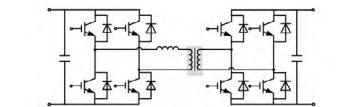

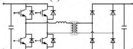  
(a) DAB   
(b) SAB

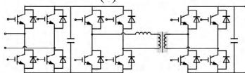  
(c) CHB-DAB

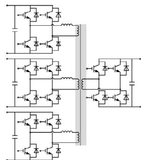  
(d) MAB   
图1 典型PET功率模块拓扑  
Fig. 1 Typical power module topologies of PETs

在此基础上，为进一步减小环流、降低损耗、实现器件的零电压开关(zero voltage switching，ZVS)和零电流开关(zero current switching，ZCS)，又出现了基于LC、LLC和CLLC等多种类型谐振腔的PET功率模块[24-26]。此类拓扑在控制方面与图1所示拓扑有较大区别，但基于戴维南/诺顿原理的PET等效模型并不受控制系统影响，二者区别仅表现为电感、电容支路个数的差异，因此面临的仿真瓶颈没有本质的区别，下文将着重分析由图1所示的4种功率模块构成的高频隔离型PET结构。

# 1.2 功率模块连接方式多样

PET承担电压变换与能量传输的功能，目前样机与工程的交流电压等级都在 $35\mathrm{kV}$ 以下[3,27-28]。为解决PET容量、电压等级与单个模块器件耐压、耐流要求之间的矛盾，常使用高压端口串联低压端口并联的连接方式。PET电压等级与功能的不同需求，使得功率模块连接方式多样。

PET 的典型拓扑连接方式如图 2 所示：输入串联输出并联型(input series output parallel, ISOP),

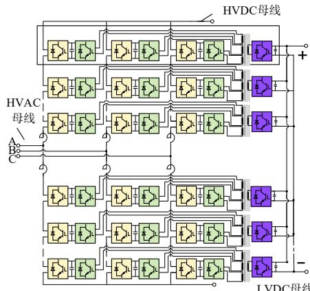  
(a) 输入串联输出并联(ISOP，相间耦合型)

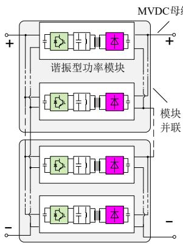  
(b) 输入并联输出串联(IPOS)

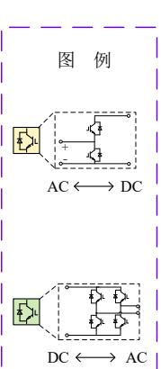

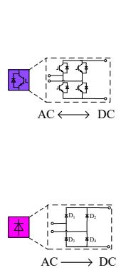

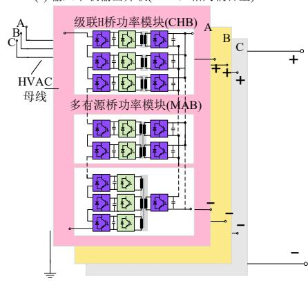  
(c) 输入串联输出并联(ISOP，相内耦合型)

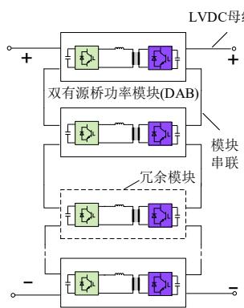  
(d)输入串联输出串联(ISOS)   
图2 PET拓扑连接示意图  
Fig. 2 Topology connection of power electronics transformer

输入并联输出串联(input parallel output series, IPOS), 输入串联输出串联(input series output series, ISOS), 输入并联输出并联[29](input parallel output parallel, IPOP)。其中, 图 2(a)为张北小二台柔性变电站拓扑, “三变一”四有源桥功率模块的输入端在不同桥臂; 图 2(b)包括输出端采用不控整流桥和两种连接方式(即 IPOS 和 IPOP)嵌套的“功率模块集”示意图; 图 2(c)为 CHB 功率模块与 MAB 功率模块示意图, 其输入侧半桥子模块位于同一相中, 中间级 MAB 变换器为“三变一”和“二变二”形式的四有源桥; 图 2(d)为各子图都面临的冗余模块配置示意图。

# 1.3 节点导纳矩阵阶数高

从图1可只，单个PET的功率模块包含大量电力电子开关与储能元件，内部节点数量较多。同时，如图2所示的PET系统包含大量功率模块，进一步增加了系统节点数量。虽然PET当前的电压等级与模块数尚未达到MMC相同水平，但是由于单个模块节点数多，PET具有与MMC接近的仿真规模。表1将包含输入侧全桥和中间级四有源桥变换器的PET与包含半桥子模块的MMC换流器进行了节点

表 1 MMC 与 PET 典型拓扑的节点数对比  
Table 1 Comparison of the number of nodes between the typical topology of PET and MMC   

<table><tr><td>节点数</td><td>变换器</td><td>单桥臂模块数</td><td>模块类型</td></tr><tr><td rowspan="2">960</td><td>PET</td><td>28</td><td>全桥+四有源桥</td></tr><tr><td>MMC</td><td>80</td><td>半桥子模块</td></tr></table>

数对比。

单个 PET 功率模块节点数为 22(含四绕组变压器的辅助电感), 而 MMC 半桥子模块节点数为 3。经计算, 包含 $56(2 \times 28)$ 个四有源桥功率模块的小二台柔性变电站, 其节点数(也即详细模型待求解节点导纳矩阵阶数)与包含 $480(6^{*}80)$ 个半桥子模块的 MMC 大致相同。

# 1.4 仿真步长小

为降低双绕组和多绕组变压器的体积和成本，PET功率模块的高频链，即高频隔离变压器及其输入、输出侧相连的全桥换流单元，动作频率通常在 $1\sim 20\mathrm{kHz}$ ，远高于MMC的 $150\sim 300\mathrm{Hz}$ 。同时，为了确保PET移相控制和功率调节的精度，需要将仿真步长从MMC所需的 $10\sim 20\mu s$ 降低到 $1\sim 10\mu s^{[30 - 31]}$

PET 详细模型的节点导纳矩阵在每个步长都

需要重新求逆[32], 且在离线仿真中开关器件需要进行步长回溯插值, 使得仿真速度受到步长的制约。

本文在 AMD A8-7100 Radeon R5, 8 Compute Cores 4C+4G @ 1.80GHz 测试机上对比了相同仿真用时下 MMC 与 PET 典型拓扑的系统规模，如表 2 所示。结果表明，含 20 个 DAB 模块的 ISOP 型 PET 与含 520 个半桥子模块的 MMC 单相双桥臂详细模型的仿真用时基本一致。

表 2 MMC 与 PET 典型拓扑的详细模型仿真用时对比  
Table 2 Comparison of the simulation time between PET and MMC typical topological detailed models   

<table><tr><td>项目</td><td>PET</td><td>MMC(单相)</td></tr><tr><td>仿真时间/s</td><td>5</td><td>5</td></tr><tr><td>子模块个数</td><td>20个DAB</td><td>520个半桥子模块</td></tr><tr><td>开关频率/kHz</td><td>20</td><td>0.2</td></tr><tr><td>仿真步长/μs</td><td>1</td><td>20</td></tr><tr><td>仿真用时</td><td colspan="2">80min</td></tr></table>

# 1.5 建模难点与挑战

综上，“节点导纳矩阵阶数高”与“仿真步长小”共同作用，导致PET详细模型的仿真效率极低，而“模块结构复杂”与“拓扑连接方式多样”则增加了等效模型构建的困难，主要表现为：

1）PET的功率模块结构较为复杂，对应的节点导纳矩阵稀疏度较高，存在大量的零元素，若直接对内部节点对应的分块矩阵求逆，等效算法的计算复杂度难以降低。  
2）PET实际上是一个多端口混联网络，由于连接方式的多样性，使得功率模块的端口相互耦合，无法针对单侧端口进行单独处理，增加了换流器等效模型求取难度。文献[33]指出，多端口子模块间的互联节点消去过程较为繁琐，带来的仿真运算量不容忽略。  
3）PET的工况多样，对于闭锁充电及SAB的不控整流，依赖插值回溯来实现对二极管开关状态的精确模拟，将大幅降低仿真效率。

# 2 PET等效建模框架

针对上述 PET 电磁暂态等效仿真过程面临的主要问题与挑战，本章给出了包含“伴随电路构建”、“内部节点消去”和“换流器等效电路形成”3个步骤的PET等效建模框架。

# 2.1 伴随电路构建

PET 的功率模块中包含大量电力电子开关器件、电容电感等储能元件与高频隔离变压器，对应

的器件级模型虽能更好地反映元件的瞬态特性，但是模型复杂度高，且需要极小的仿真步长(常为数十纳秒)[34-35]，并不适用于大规模集成的系统级仿真。因此，应当根据元件特性，进行不同程度的简化。文献[34-35]指出，当关注的重点是系统级输出波形而非器件级的波形时，可以采用忽略器件开通和关断的瞬态过程的开关理想模型，即二值电阻模型。这一模型由于其结构简单、实现方便，被广泛应用于电力电子系统的仿真分析中[32,36]。

对于电感、电容等储能元件，Dommel算法，也即EMTP方法，作为电力设备和系统设计的重要组成部分应用较为广泛。Dommel算法利用微分方程描述各元件特性并得到时域离散化模型，可以精确地模拟包含分布参数和集中参数的网络中的暂态过程[32,36]。

利用Dommel算法处理电感、电容所得离散化模型如图3所示(梯形积分法)。其中， $R_{\mathrm{L}}$ 和 $R_{\mathrm{C}}$ 为等值电阻，与仿真步长、电容/电感值以及积分方式有关， $i_{\mathrm{L\_History}}(t)$ 和 $i_{\mathrm{C\_History}}(t)$ 为等值历史电流源，在每个步长的EMT仿真计算之前得到。

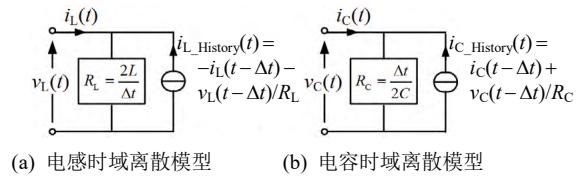  
图3 储能元件离散化模型  
Fig. 3 Discrete models of energy storage elements

高频变压器的宽频模型通常需要反映绕组和磁芯之间的电容效应、磁滞效应、频变效应等非线性特性，包含大量寄生电容，且变压器励磁电抗和漏抗随频率变化[37-38]，不适合进行大规模多模块的系统级仿真。文献[38]指出，在频率较低(约 $20\mathrm{kHz}$ 以下)时，可近似忽略寄生参数的影响，考虑到变压器设计时通常会预留足够的饱和余量，因此可认为磁芯工作在线性区，得到适用于系统级仿真的变压器低频T型等效电路。与储能元件类似，利用Dommel算法，变压器梯形积分离散化模型如图4

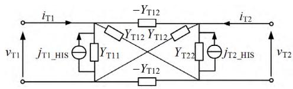  
图4 变压器梯形积分离散化模型  
Fig. 4 Discretized model of transformer using trapezoidal integration method

所示[36]。其中， $Y_{\mathrm{T11}}$ 和 $Y_{\mathrm{T22}}$ 为自导纳， $j_{\mathrm{T1\_HIS}}$ 和 $j_{\mathrm{T2\_HIS}}$ 为历史电流源， $Y_{\mathrm{T12}}$ 为变压器原副边互导纳，体现原副边的耦合作用。

# 2.2 内部节点消去

由1.3节分析可知，单个功率模块内部节点多，PET详细模型节点导纳矩阵阶数高，是导致仿真速度慢的根本原因，因此，PET功率模块面临迫切的降阶需求。在电力电子系统的仿真中，开关器件的触发信号并不会改变节点导纳矩阵的结构，仅是改变了其中器件相对应的矩阵元素值。因此，节点导纳矩阵的结构具有不变性。

对于同样具有“节点导纳矩阵阶数高”特征的MMC，文献[39-43]利用了节点导纳矩阵结构的不变性，通过嵌套快速求解法对式(1)所示节点导纳方向进行处理，将内部节点电压电流信息 $V_{\mathrm{IN}}$ 和 $I_{\mathrm{IN}}$ 转移到端口节点，得到外端子的等效节点导纳方程，如式(2)所示。

$$
\left[ \begin{array}{l} \mathbf {Y} _ {1 1} \\ \overline {{\mathbf {Y}}} _ {2 1} \end{array} - \left| \begin{array}{l} \mathbf {Y} _ {1 2} \\ \overline {{\mathbf {Y}}} _ {2 2} \end{array} \right] \right] \left[ \begin{array}{l} \mathbf {V} _ {\mathrm {E X}} \\ \overline {{\mathbf {V}}} _ {\mathrm {I N}} \end{array} \right] = \left[ \begin{array}{l} \mathbf {J} _ {\mathrm {E X}} \\ \mathbf {J} _ {\mathrm {I N}} \end{array} \right] + \left[ \begin{array}{l} \mathbf {I} _ {\mathrm {E X}} \\ 0 \end{array} \right] \tag {1}
$$

$$
\boldsymbol {Y} _ {\mathrm {E X}} \boldsymbol {V} _ {\mathrm {E X}} = \boldsymbol {J} _ {\mathrm {S}} + \boldsymbol {I} _ {\mathrm {E X}} \tag {2}
$$

式中： $Y_{\mathrm{EX}} = Y_{11} - Y_{12}Y_{22}^{-1}Y_{21}$ 为端口对外等效导纳阵； $J_{\mathrm{S}} = J_{\mathrm{EX}} - Y_{12}Y_{22}^{-1}J_{\mathrm{IN}}$ 为端口等效历史电流源。

这种方法并不会丢失内部节点信息，可以在仿真结束后进行内部信息的反解。仿真表明，内部节点消去带来的矩阵降阶具有很好的加速效果。因此，嵌套快速求解法是一种实现节点导纳矩阵降阶的有效方法。

# 2.3 换流器等效电路形成

在获得单个模块等效电路以后，需要根据不同的拓扑连接方式进行模块间的级联。但由于模块数较多，换流器内部仍需要再次进行降阶处理，求取更为简单的换流器等效电路。

这一过程中，换流器“拓扑连接方式多样”特性将会导致功率模块端口耦合，串并联侧端口不能单独进行级联，如图5所示。

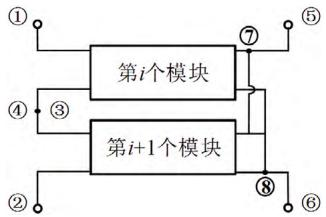  
图5 模块连接示意图  
Fig. 5 Diagram of module connection

此时，只能逐次合并相邻两模块，通过迭代得到换流器等效电路。在相邻模块等效电路形成过程中，首先先列写相邻两模块的节点导纳方程，然后对串并联侧分别用不同方法处理：对于串联侧，类似于单模块等效过程，利用嵌套快速求解法消去内部节点3和4；对于并联侧，此时节点5和7、6和8共用节点电压，对外等效电流为两模块并联端口电流之和，区别于串联端口，并不是简单的节点消去，因此，应当采用文献[44]所述的“短路收缩”方法，将节点导纳矩阵的对应行和列相加，得到外端子等效节点导纳方程。经过嵌套快速求解法和短路收缩处理，换流器等效电路仅保留4个端子节点(节点1、2、5、6)，经过EMT解算器解算，可得到端子电压电流信息。

# 3 PET 加速仿真方法

由于 PET 模块内部节点多且拓扑连接方式多样，直接采用 2 章所述的嵌套快速求解法和短路收缩方法进行矩阵降阶，将面临大量的矩阵相乘与求逆工作，效率较低。对此，本节以典型 ISOP 型 DAB 变换器为例，介绍文献[16-19]所提 3 种提速思路，并对基于这 3 种提速方法组合而搭建的 3 种等效模型进行了优缺点与适用场景对比。

# 3.1 端口解耦

# 1）变压器端口解耦。

PET模块节点数较多，直接采用2.1节嵌套快速求解法，节点导纳矩阵阶数仍较高(以DAB模块为例，为9阶)，矩阵求逆工作量大；同时，2.3节换流器等效电路形成过程中，需要重复交替使用嵌套快速求解法和短路收缩方法，效率仍较低。

对此，文献[16-17]从高频变压器等效电路出发，提出一种变压器端口解耦模型。该方法利用高频变压器的严格双端口特性，即流入和流出同一端口两个端子的电流大小相等[44]，对变压器进行原副边解耦。如式(3)所示，将变压器梯形积分离散表达式进行端口电压的相邻两个步长的近似约等。此时，在一个仿真步长内，变压器原边电流 $i_{\mathrm{T1}}(t)$ 仅与原边电压 $v_{\mathrm{T1}}(t)$ 有关，与副边电压 $v_{\mathrm{T2}}(t)$ 无关，实现了变压器的原副边解耦。

$$
\begin{array}{l} \left[ \begin{array}{l} i _ {\mathrm {T} 1} (t) \\ i _ {\mathrm {T} 2} (t) \end{array} \right] = \left[ \begin{array}{l l} Y _ {\mathrm {T} 1 1} & Y _ {\mathrm {T} 1 2} \\ Y _ {\mathrm {T} 2 1} & Y _ {\mathrm {T} 2 2} \end{array} \right] \left(\left[ \begin{array}{l} v _ {\mathrm {T} 1} (t) \\ v _ {\mathrm {T} 2} (t) \end{array} \right] + \left[ \begin{array}{l} v _ {\mathrm {T} 1} (t - \Delta t) \\ v _ {\mathrm {T} 2} (t - \Delta t) \end{array} \right]\right) + \\ \left[ \begin{array}{c} i _ {\mathrm {T} 1} (t - \Delta t) \\ i _ {\mathrm {T} 2} (t - \Delta t) \end{array} \right] \approx \left[ \begin{array}{c c} Y _ {\mathrm {T} 1 1} & 0 \\ 0 & Y _ {\mathrm {T} 2 2} \end{array} \right] \left[ \begin{array}{c} v _ {\mathrm {T} 1} (t) \\ v _ {\mathrm {T} 2} (t) \end{array} \right] + \left[ \begin{array}{c c} 0 & Y _ {\mathrm {T} 1 2} \\ Y _ {\mathrm {T} 2 1} & 0 \end{array} \right]. \\ \end{array}
$$

$$
\left[ \begin{array}{l} v _ {\mathrm {T} 1} (t - \Delta t) \\ v _ {\mathrm {T} 2} (t - \Delta t) \end{array} \right] + \left[ \begin{array}{l l} Y _ {\mathrm {T} 1 1} & Y _ {\mathrm {T} 1 2} \\ Y _ {\mathrm {T} 2 1} & Y _ {\mathrm {T} 2 2} \end{array} \right] \left[ \begin{array}{l} v _ {\mathrm {T} 1} (t - \Delta t) \\ v _ {\mathrm {T} 2} (t - \Delta t) \end{array} \right] + \left[ \begin{array}{l} i _ {\mathrm {T} 1} (t - \Delta t) \\ i _ {\mathrm {T} 2} (t - \Delta t) \end{array} \right] \tag {3}
$$

式中： $Y_{\mathrm{T11}}$ 、 $Y_{\mathrm{T22}}$ 为压器端口自导纳； $Y_{\mathrm{T12}}$ 、 $Y_{\mathrm{T21}}$ 为变压器端口转移导纳。

因此，建立变压器解耦积分离散化模型如图6所示。通过单步长近似约等，图4中变压器原副边端口转移导纳支路的耦合作用被整合到图6的历史电流源 $j_{\mathrm{T1\_HIS\_new}}$ 和 $j_{\mathrm{T2\_HIS\_new}}$ 中。

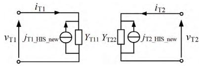  
图6 变压器解耦积分离散化模型  
Fig. 6 Discretized model of transformer using decoupling integration method

在单模块的等效电路求解过程中，变压器原副边电路相互独立，可以单独求解，进而使得PET的各功率模块输入和输出侧解耦。PET模块节点导纳矩阵可按输入侧和输出侧拆解，矩阵阶数降低，可以直接采用嵌套快速求解法消去模块内部节点。

在换流器等效电路求解过程中，由于端口解耦，PET功率模块等效电路为两个单端口戴维南/诺顿等效电路，可直接通过串并联获得换流器等效电路，如图7所示，其中S表达串联侧，P表示并联侧[44]。

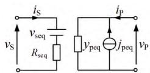  
图7 “端口解耦”方式换流器等效电路  
Fig. 7 Equivalent circuit using "port decoupling" method

这种解耦积分方式会带来很高的仿真提速，但是单步长的约等会引入一定的截断误差，同时导致稳定域的缩小。然后，经详细测算，考虑实际PET系统和高频变压器的参数，该解耦方法并不会对仿真过程产生实际限制和影响[18]。

# 2）功率模块端口解耦。

利用高频链端口电容电压不会突变的性质，还可以对内部节点消去后得到的端口方程进行单步长约等[19]：

$$
\begin{array}{l} \left[ \begin{array}{c c} y _ {1 1} & 0 \\ 0 & y _ {2 2} \end{array} \right] \left[ \begin{array}{l} v _ {1} (t) \\ v _ {2} (t) \end{array} \right] \approx \left[ \begin{array}{c} j _ {\mathrm {S} 1} (t) - y _ {1 2} \cdot v _ {2} (t - \Delta t) \\ j _ {\mathrm {S} 2} (t) - y _ {1 2} \cdot v _ {1} (t - \Delta t) \end{array} \right] + \\ \left[ \begin{array}{l} i _ {1} (t) \\ i _ {2} (t) \end{array} \right] = \left[ \begin{array}{l} j _ {\mathrm {e q 1}} (t) \\ j _ {\mathrm {e q 2}} (t) \end{array} \right] + \left[ \begin{array}{l} i _ {1} (t) \\ i _ {2} (t) \end{array} \right] \tag {4} \\ \end{array}
$$

式中 $j_{\mathrm{eq1}}$ 、 $j_{\mathrm{eq2}}$ 表示高频链端口解耦模型的输入输出端口等效历史电流源。

通过式(4)的约等过程，同样实现了单模块的输入和输出侧解耦。与变压器解耦积分等效模型类似，同样可以利用单端口戴维南等效电路串联或诺顿等效电路并联方式求取换流器等效电路。

# 3.2 导纳方程预处理

PET 功率模块内部节点较多，节点的度(即节点所连支路数)通常为 $2 \sim 3^{[44]}$ ，节点导纳矩阵具有很强的稀疏性，许多零元素的存在使得矩阵相乘和求逆工作冗余。同时，由于高频变压器的存在，由基尔霍夫电流定律，功率模块具有严格双端口特征[44]。

因此，文献[19]充分利用PET功率模块的节点矩阵稀疏性与严格端口特性，对直接节点消去的嵌套快速求解方法进行改进，提出了基于导纳方程预处理的内部节点消去方法。该方法通过理论推导，结合嵌套快速求解法，得到外端子等效导纳方程，并利用端口特性，使之进一步降阶，转化为端口方程，如式(5)所示。

$$
\left[ \begin{array}{l l} y _ {1 1} & y _ {1 2} \\ y _ {1 2} & y _ {2 2} \end{array} \right] \left[ \begin{array}{l} v _ {1} \\ v _ {2} \end{array} \right] = \left[ \begin{array}{l} j _ {\mathrm {S} 1} \\ j _ {\mathrm {S} 2} \end{array} \right] + \left[ \begin{array}{l} i _ {1} \\ i _ {2} \end{array} \right] \tag {5}
$$

式中：节点导纳矩阵参数 $y_{11}$ 、 $y_{12}$ 、 $y_{22}$ 与历史电流源参数 $j_{\mathrm{S}1}$ 、 $j_{\mathrm{S}2}$ 可由直接通过式(6)所示乘法和加法运算获得； $K_{1}-K_{5}$ 为符号函数，仅与控制信号有关。

$$
\left\{ \begin{array}{r l} y _ {1 1} & = G _ {\mathrm {C l}} + \left(q _ {1} + q _ {2}\right) \cdot 2 G _ {\mathrm {O N}} G _ {\mathrm {O F F}} + K _ {1} q _ {2} \left(G _ {\mathrm {O N}} - G _ {\mathrm {O F F}}\right) ^ {2} \\ y _ {1 2} & = - K _ {2} q _ {3} \left(G _ {\mathrm {O N}} - G _ {\mathrm {O F F}}\right) ^ {2} \\ y _ {2 2} & = G _ {\mathrm {C 2}} + \left(q _ {4} + q _ {5}\right) \cdot 2 G _ {\mathrm {O N}} G _ {\mathrm {O F F}} + K _ {3} q _ {5} \left(G _ {\mathrm {O N}} - G _ {\mathrm {O F F}}\right) ^ {2} \\ j _ {\mathrm {S} 1} & = j _ {\mathrm {C l} \_ \mathrm {H I S}} + K _ {4} \left(q _ {1} - q _ {2}\right) \left(G _ {\mathrm {O F F}} - G _ {\mathrm {O N}}\right) j _ {\mathrm {T 1} \_ \mathrm {H I S}} + \\ & K _ {4} q _ {3} \cdot 2 \left(G _ {\mathrm {O F F}} - G _ {\mathrm {O N}}\right) j _ {\mathrm {T 2} \_ \mathrm {H I S}} \\ j _ {\mathrm {S} 2} & = j _ {\mathrm {C 2} \_ \mathrm {H I S}} + K _ {5} \left(q _ {4} - q _ {5}\right) \left(G _ {\mathrm {O F F}} - G _ {\mathrm {O N}}\right) j _ {\mathrm {T 2} \_ \mathrm {H I S}} + \\ & K _ {5} q _ {3} \cdot 2 \left(G _ {\mathrm {O F F}} - G _ {\mathrm {O N}}\right) j _ {\mathrm {T 1} \_ \mathrm {H I S}} \end{array} \right. \tag {6}
$$

导纳方程预处理过程建立在内部节点消去基础上，使得待求解网络的节点导纳矩阵阶数大幅降低。同时，功率模块端口方程各参数的表达式被直观给出，可经过简单的加法与乘法获得，避免了大量的矩阵相乘和求逆计算，进一步提高了仿真速度。

# 3.3 多端口参数矩阵转换

在换流器等效电路求解这一步骤中，为避免端口解耦的约等过程可能带来的误差与不稳定，采用图5所示的变压器模型，则需要直接求解多端口混联等效电路。

本节提出一种基于多端口参数矩阵转换的加

速方法。对于不同的拓扑连接方式，往往希望找到一个端口电流、电压与另一个端口的电流、电压直接的直接关系，如在晶体管电路中获得广泛应用的H参数[44]。经分析，端口导纳方程适用于端口电压更方便获得的并联型拓扑，对于其他类型的拓扑连接方式，更为适用的参数矩阵如表3所示[45]。

表 3 不同拓扑连接适用的参数矩阵  
Table 3 Applicable parameter matrix for different topological connections   

<table><tr><td>拓扑连接方式</td><td>参数矩阵</td><td>换流器参数矩阵表达式</td></tr><tr><td>ISOS</td><td>开路阻抗参数Z</td><td>Z = ∑i=1nZi</td></tr><tr><td>ISOP</td><td>第一类混合参数H1</td><td>H1 = ∑i=1nH1i</td></tr><tr><td>IPOS</td><td>第二类混合参数H2</td><td>H2 = ∑i=1nH2i</td></tr><tr><td>IPOP</td><td>短路导纳参数Y</td><td>Y = ∑i=1nYi</td></tr></table>

以 ISOP 型拓扑连接方式为例，其第一类混合参数方程如式(7)、(8)所示。

$$
\left[ \begin{array}{l} v _ {1} \\ i _ {2} \end{array} \right] = \left[ \begin{array}{c c} \frac {1}{y _ {1 1}} & - \frac {y _ {1 2}}{y _ {1 1}} \\ \frac {y _ {2 1}}{y _ {1 1}} & \frac {y _ {1 1} y _ {2 2} - y _ {1 2} y _ {2 1}}{y _ {1 1}} \end{array} \right] \left[ \begin{array}{l} i _ {1} \\ v _ {2} \end{array} \right] + \left[ \begin{array}{c} \frac {1}{y _ {1 1}} j _ {\mathrm {S} 1} \\ \frac {y _ {2 1}}{y _ {1 1}} j _ {\mathrm {S} 1} - j _ {\mathrm {S} 2} \end{array} \right] \tag {7}
$$

记为

$$
\left[ \begin{array}{l} v _ {1} \\ i _ {2} \end{array} \right] = \left[ \begin{array}{l l} H _ {1 1} & H _ {1 2} \\ H _ {2 1} & H _ {2 2} \end{array} \right] \left[ \begin{array}{l} i _ {1} \\ v _ {2} \end{array} \right] + \left[ \begin{array}{l} v _ {\mathrm {l o c}} \\ i _ {2 \mathrm {s c}} \end{array} \right] \tag {8}
$$

式中： $i_1$ 、 $v_2$ 分别为串联侧端口电流和并联侧端口电压，对于每一个模块均相同； $v_{\mathrm{loc}}$ 、 $i_{2\mathrm{sc}}$ 分别为对应于串联侧端口电压 $v_1$ 和并联侧电流 $i_2$ 的等效独立源。因此，可直接对各模块第一类混合参数方程做加法运算，得到换流器对应端口参数矩阵，如式(9)、(10)所示。

$$
\left[ \begin{array}{l} v _ {1 \text {t o t a l}} \\ i _ {2 \text {t o t a l}} \end{array} \right] = \left[ \begin{array}{l} \sum_ {i = 1} ^ {n} v _ {1} ^ {i} \\ \sum_ {i = 1} ^ {n} i _ {2} ^ {i} \end{array} \right] = \sum_ {i = 1} ^ {n} \boldsymbol {H} _ {i} \cdot \left[ \begin{array}{l} i _ {1} \\ v _ {2} \end{array} \right] + \left[ \begin{array}{l} \sum_ {i = 1} ^ {n} v _ {\mathrm {l o c}} ^ {i} \\ \sum_ {i = 1} ^ {n} i _ {2 \mathrm {s c}} ^ {i} \end{array} \right] \tag {9}
$$

记为

$$
\left[ \begin{array}{l} v _ {1 \text {t o t a l}} \\ i _ {2 \text {t o t a l}} \end{array} \right] = \left[ \begin{array}{l l} H _ {\mathrm {t o t} - 1 1} & H _ {\mathrm {t o t} - 1 2} \\ H _ {\mathrm {t o t} - 2 1} & H _ {\mathrm {t o t} - 2 2} \end{array} \right] \left[ \begin{array}{l} i _ {1} \\ v _ {2} \end{array} \right] + \left[ \begin{array}{l} v _ {1 \mathrm {t o t} - \mathrm {o c}} \\ i _ {2 \mathrm {t o t} - \mathrm {s c}} \end{array} \right] \tag {10}
$$

式中： $\nu_{\mathrm{total}}$ 为串联侧直流母线电压； $i_{2\mathrm{total}}$ 为注入并联侧直流母线的等效电流。

对于其他类型的拓扑连接方式，同样可以使用

表3的多端口参数矩阵转换(即Y参数向Z、H1、H2的转换)。与2.3节的常规方法相比，该方法可直接实现多端口参数矩阵的叠加，大大简化了换流器等效电路形成过程。

# 3.4 等效模型对比分析

图8为PET等效模型的构建过程。文献[16-19]搭建的等效模型实质上是对三种提速思路的组合，本文归纳为3类等效模型，分别记作EM1、EM2、EM3。

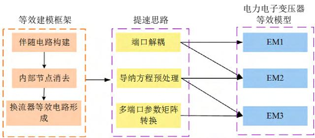  
图8 PET等效模型的构建过程  
Fig. 8 Research progress on equivalent modelling of PETs

EM1：文献[16-17]基于高频变压器处端口解耦的提速思路，各自建立了ISOP型DAB变换器和级联H桥型PET的等效模型，并提出了此类解耦积分方法稳定性分析方法。

EM2：文献[19]对伴随电路构建和内部节点消去两个步骤均进行了提速，为功率模块端口处解耦和导纳方程预处理方法的组合。

EM3：该模型对内部节点消去、换流器等效电路形成两个步骤进行了提速，为多端口参数矩阵转换和导纳方程预处理方法的组合。

本节对这3类模型进行加速效果、仿真精度与通用性3方面的对比。

# 3.4.1 加速效果

本节为对比3类等效模型相比详细模型的提速效果，在PSCAD/EMTDC中分别搭建模块数为3、5、10、20、50、100的ISOP型DAB变换器详细模型与3类等效模型，记3类等效模型加速比分别为Factor1、Factor2、Factor3，选取仿真步长为 $5\mu \mathrm{s}$ ，系统的仿真时间5s，系统参数如表4所示。

表 4 ISOP 型 DAB 变换器系统参数  
Table 4 Parameters of ISOP type DAB converter system   

<table><tr><td>参数</td><td>数值</td><td>参数</td><td>数值</td></tr><tr><td>串联侧直流母线电压 Vs/kV</td><td>5</td><td>DAB输出侧电容 C2/mF</td><td>1</td></tr><tr><td>并联侧直流母线电压 Vp/kV</td><td>1.5</td><td>DAB辅助电感 LT/μH</td><td>100</td></tr><tr><td>开关频率 HF/kHz</td><td>1</td><td>高频变压器变比 K</td><td>1:1</td></tr><tr><td>DAB输入侧电容C1/mF</td><td>2</td><td>等效负荷 Z/Ω</td><td>3</td></tr></table>

在AMD A8-7100 Radeon R5, 8 Compute Cores 4C+4G @ 1.80GHz 测试机上测试 EM1，EM2 和 EM3 的仿真用时和加速比，结果分别如图9和表5所示。

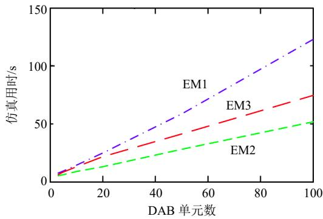  
图9 等效模型仿真用时  
Fig. 9 Equivalent model CPU time comparison

表 5 等效模型加速比  
Table 5 Speedup factor of equivalent models   

<table><tr><td>单元数</td><td>Factor1</td><td>Factor2</td><td>Factor3</td></tr><tr><td>3</td><td>7.53</td><td>10.68</td><td>8.84</td></tr><tr><td>5</td><td>9.42</td><td>13.80</td><td>10.50</td></tr><tr><td>10</td><td>17.59</td><td>28.26</td><td>19.77</td></tr><tr><td>20</td><td>36.92</td><td>70.31</td><td>42.56</td></tr><tr><td>50</td><td>115.62</td><td>241.26</td><td>163.63</td></tr><tr><td>100</td><td>187.99</td><td>444.28</td><td>309.76</td></tr></table>

由图9可知，相比于详细模型，随着模块数的增加，3种等效模型的提速效果也更加显著，当模块数大于50个时，均可实现2个数量级的提速。同时，由于EM2与EM3在单模块等效电路形成过程中采用了导纳方程的预处理，加速效果优于EM1。相比EM3，EM2在换流器等效电路形成过程中采用了端口解耦，进一步提高了仿真速度。

# 3.4.2 仿真精度

本节分别设置了启动过程、稳态运行、功率跃变和故障恢复4种不同工况，测试3种ISOP型DAB变换器等效模型仿真精度，取变压器频率 $1\mathrm{kHz}$ 仿真步长 $5\mu \mathrm{s}$ 。分别以低压直流电压与变压器原边电流为例，反映等效模型对系统外特性及内特性的拟合效果，仿真波形如图10、11所示。

由图10、11可知，3种等效模型均可实现对详细模型内外特性的高精度拟合。在整个仿真过程中，不同等效模型低压直流电压与变压器原边电流的最大相对误差和平均相对误差如表6所示。

由表6可知，EM3由于未进行单步长近似约等精度最高；EM2所取约等对象为高频链端口电容电

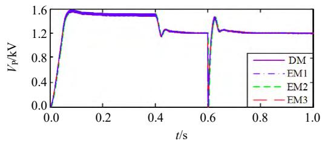  
(a)低压直流电压整体波形

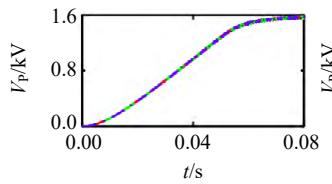  
(b) 启动过程

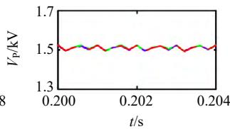  
(c) 稳态运行

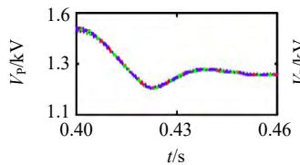  
(d) 功率跃变

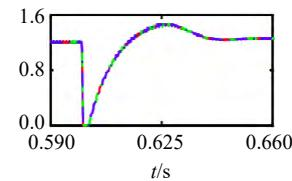  
(e) 故障恢复   
图10 不同模型外特性仿真精度对比

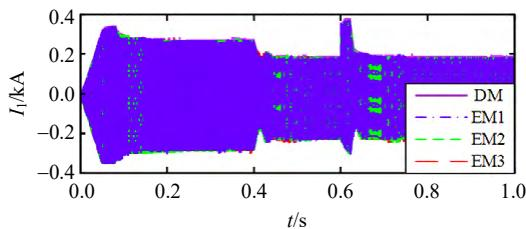  
Fig. 10 Comparison of simulation accuracy of external characteristics of different equivalent models   
(a) 变压器原边电流整体波形

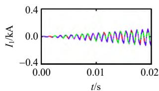  
(b) 启动过程

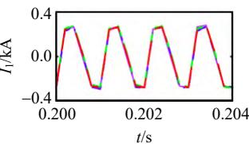  
(c) 稳态运行

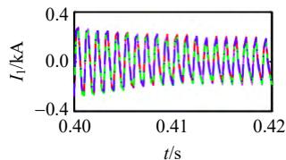  
(d) 功率跃变

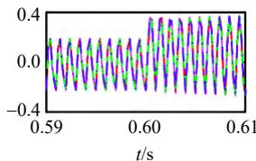  
(e) 故障恢复   
图11 不同模型内特性仿真精度对比  
Fig. 11 Comparison of simulation accuracy of internal characteristics of different equivalent models

压，EM1 约等对象为高频变压器原副边电压，由于电容电压的不突变性质，EM2 约等产生的误差小于 $\mathrm{EM1}^{[18]}$ 。

表 6 不同等效模型相对误差测试  
Table 6 Relative errors of different equivalent models %   

<table><tr><td rowspan="2">等效
模型</td><td colspan="2">低压直流电压</td><td colspan="2">变压器原边电流</td></tr><tr><td>最大相对误差</td><td>平均相对误差</td><td>最大相对误差</td><td>平均相对误差</td></tr><tr><td>EM1</td><td>6.71</td><td>0.09</td><td>13.55</td><td>0.64</td></tr><tr><td>EM2</td><td>5.13</td><td>0.08</td><td>11.60</td><td>0.58</td></tr><tr><td>EM3</td><td>1.40</td><td>0.07</td><td>7.84</td><td>0.33</td></tr></table>

# 3.4.3 通用性

与DAB相比，CHB增加了输入侧全桥或半桥模块，MAB中的高频变压器由双绕组变为多绕组，但其研究思路与DAB基本一致，三种等效模型同样可以适用。

需要注意的是，在对CHB(或MAB)变换器进行类似3.2节导纳方程预处理时，应当充分利用DAB单元的对称结构，采用分步预处理的思路，即在式(5)所示DAB预处理基础上，引入输入侧H桥，再次进行预处理，如图12所示。

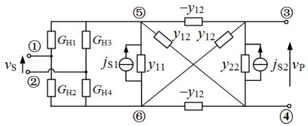  
(a) 第1步预处理

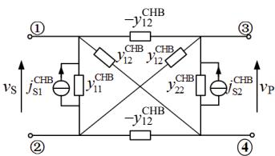  
(b) 第2步预处理  
图12 CHB分步预处理等效电路图  
Fig. 12 Equivalent circuit of CHB using stepwise preprocessing

对于SAB变换器，输出侧二极管的开关状态不可控，无法直接等效为二值电阻。对此，本课题组提出了基于电流过零点预计算的SAB等效建模方法，其方法核心如图13所示。通过对SAB工作模式的分析，得到流过不控整流桥电流的表达式，进而通过电流过零点预计算，生成二极管的虚拟触发信号，使得DAB的等效建模思路同样可以适用于SAB。该方法将二极管开关时刻强制限制在仿真步长的整数倍，避免了大量由于二极管引起的插值回溯求解问题，可以有效提高仿真速度，同时由于SAB仿真步长通常取 $1\sim 5\mu s$ ，其仿真误差可以忽略。

不同等效模型在模型形成过程中，需要经过不同复杂度的理论推导过程，因此通用性各不相同。

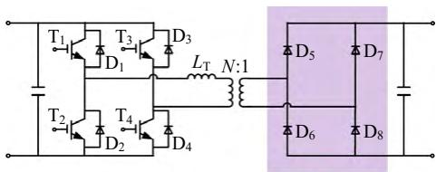

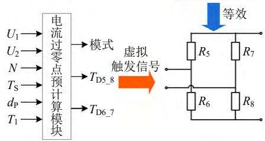  
图13 不控整流桥等效过程图  
Fig. 13 The equivalent process diagram of the uncontrolled rectifier bridge

在单模块端口等效电路形成过程中，EM1 模型直接对变压器进行端口解耦处理，等效过程不受限于模块的拓扑结构；EM2 与 EM3 模型均需要进行导纳方程预处理过程，公式较为复杂，且模块拓扑结构改变以后，端口等效方程的参数表达式需要重新推导，通用性较差。在换流器等效电路形成过程中，EM1 与 EM2 直接通过单端口戴维南等效电路串联和诺顿等效电路并联进行计算，而 EM3 模型需要进行其他参数与 Y 参数的互换，复杂度更高。

因此，EM1 模型的通用性最好，EM3 模型通用性最差。

综上，根据不同等效模型优缺点，总结其适用场景如下：

1）EM1 模型直接从变压器解耦模型出发，通用性最好，但由于采用单步约等，精度较差，适用于在精度要求不高情况下对 CHB、MAB 等复杂功率模型的仿真。  
2）EM2模型速度最快，但是其预处理过程的公式求解难度将随着模块复杂度的增加而提升，适用于对DAB、谐振变换器等较简单拓扑的仿真。  
3）EM3模型未采用任何约等处理，精度较高，参数转换过程将模块连接方式与端口方程形式结合，适用于对精度与稳定性要求较高的多端口级联PET的仿真。

# 3.5 所提PET等效模型的闭锁实现方法

当高频链中所有DAB变换器闭锁后，流过DAB开关组的电流会迅速降为0，使其与前级和后级分别解列。若忽略短暂的续流过程，闭锁状态下DAB部分的开关电阻可等效为无穷大常数。基于此，文献[17]提出一种与非闭锁模型共用状态变量

存储单元的集成方法。此处的状态变量指的是电容电压、电感上的电流及变压器一/二次侧的电流。

以图 1(c)所示的 CHB-DAB 结构为例，图 14 为集成了闭锁功能的 CHB-DAB 相单元等效模型，方框部分为非闭锁模型，开关电阻的取值由触发信号和 CHB 级/DAB 级的闭锁信号共同决定。Brk1—Brk4 为用于控制二极管支路投切的开关，在仿真中可与闭锁信号关联。当处于完全闭锁状态(CHB、DAB 均闭锁)时，Brk1、Brk4 断开，Brk2、Brk3 闭合；当处于部分闭锁(CHB 解锁，DAB 闭锁)或非闭锁状态时，Brk2、Brk3 断开，Brk1、Brk4 闭合。

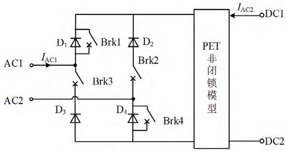  
图14 集成闭锁功能的CHB-DAB相单元等效模型  
Fig. 14 Equivalent model of CHB-DAB phase unit with integrated blocking function

# 4 等效建模与实时仿真研究展望

随着柔性交直流配电网的进一步发展，PET电压等级与容量的提高，拓扑形式和功能需求的复杂化，PET将面临更加迫切的电磁暂态等效建模与实时仿真需求。基于已有的研究进展及国内外研究现状，未来PET电磁暂态等效建模与实时仿真的研究重点包括以下3个方面。

# 4.1 基于计算机辅助的模块导纳方程预处理算法

由1.1分析，功率模块的复杂性使得PET电磁暂态等效算法很难实现较强的通用性。在2.1.2节模块内部节点消去，端口方程形成过程中，需要人为根据节点导纳方程的形式进行公式推导，得出端口参数的表达式[18]。在发生诸如谐振腔拓扑变化时，原有导纳方程的预处理过程所得端口参数表达式不适用，需要进行重新推导和更新，计算效率较低。

针对这一问题，文献[46]提出利用线性有源网络状态方程法，通过计算机辅助作用，自动获取系统状态方程的系数矩阵，并在文献[47]所提离散事件驱动仿真方法中得到较好应用。然而，系统状态方程与端口导纳方程仅是网络特征的不同表现形式，其系数矩阵与导纳方程各元素值存在紧密的内

在联系，有望在文献[46-47]基础上通过一定的转换算法，实现端口方程的自动生成，实现基于计算机辅助的模块导纳方程预处理过程。

# 4.2 基于时间尺度变换的多速率仿真

对于第1章所归纳的4个主要问题与挑战，由于现有研究工作是基于固定步长仿真平台，因此未对“仿真步长小”这一问题进行针对性突破。但是，电力电子系统是一个多时间尺度的混杂系统，其各电磁回路瞬态过程的时间常数不同[34]，且各子系统关注的特性也不同，已有文献针对这一特性开展研究[48-49]，但并未涉及包含PET系统的仿真分析。

PET 的功率模块中包含大量高频切换的电力电子开关与高频变压器，这些设备的时间尺度小，瞬态过程复杂，所需仿真步长很小，通常在 $1 \sim 10\mu \mathrm{s}$ ，重点关注元器件的损耗、过压过流、应力等暂态特性。而与其相连的交流系统时间尺度较大，仿真步长在 $1\mathrm{ms}$ 以上，关注于长期或中长期的运行特性和稳态特性。不同子系统构成的联合系统的单一尺度仿真，必然要满足最快速系统的计算需求，导致系统的仿真效率降低[30-31]。

文献[50]针对大型交直流混联电网全电磁暂态建模与仿真提出的“基于时间尺度变换的多速率仿真”方法是这一问题的理想解决方案之一。首先，根据子系统的特性与仿真需求，对联合系统进行网络分割；然后，选择不同精度的仿真算法，在不同的仿真步长下对各子网络进行不同速率的仿真；最后，基于时间尺度变换理论，建立快变信号与慢速信号的协调机制，实现全系统的多速率仿真。

# 4.3 基于并行计算的等效实时仿真

电力电子变压器模块拓扑结构复杂，节点导纳矩阵阶数高，使得实时仿真过程面临较大的网络求解计算量，同时，高开关频率限制了实时仿真可取的最小仿真步长。因此，PET实时仿真模型的实现，必须建立在等效模型基础上，且需要充分发掘模型的并行性，便于等效模型的进一步商用化。

从等效算法角度，文献[16-19]所提等效算法的具有高度并行性。首先，模块等效电路仅与自身内部信息有关，彼此相互独立，可并行求解；其次，换流器等效电路求解时，可进行模块的任意分组与并行叠加；最后，各模块电压电流信息的反解过程也相互独立。

从一次系统划分角度，文献[13]利用电容电压不突变，在电容处进行单步长约等，实现了 PET

的级间解耦；文献[51]利用线路的电容、电感元件特性，在波形松弛法基础上实现线路两侧解耦；文献[52]将MMC换流器的桥臂电流与子模块电压分离，利用受控源实现了等效模型的构建。这些文献将大系统拆分为若干独立子系统，降低了待求解矩阵阶，提高求解并行性。该思路对于提高PET等效模型的并行性与实时仿真模型的实现具有较强的参考价值。

# 5 结论

本文归纳了 PET 电磁暂态等效建模和仿真中面临的挑战，揭示了等效仿真建模机理。在此基础上，建立了电力电子变压器电磁暂态等效建模框架，梳理了已有的加速仿真建模方法。以 DAB 变换器为例，对不同等效模型进行了加速效果、仿真精度和通用性 3 方面的对比，指明了不同模型的适用场景。最后，通过对研究现状和进展的进一步分析，对 PET 等效建模与实时仿真的未来研究方向进行了展望。

本文工作可以为新型拓扑研究及工程样机研制提供建模理论与仿真平台支撑，有望进一步促进PET的发展与在柔性交直流配电网中的应用。

# 参考文献

[1] 李子欣，高范强，赵聪，等．电力电子变压器技术研究综述[J].中国电机工程学报，2018，38(5)：1274-1289. LI Zixin, GAO Fanqiang, ZHAO Cong, et al. Research review of power electronic transformer technologies[J]. Proceedings of the CSEE, 2018, 38(5): 1274-1289(in Chinese).  
[2] 廖国虎，邱国跃，袁旭峰. 电力电子变压器研究综述[J]. 电测与仪表，2014，51(16)：5-10，36. LIAO Guohu，QIU Guoyue，YUAN Xufeng. Summary of the power electronic transformer research[J]. Electrical Measurement & Instrumentation，2014，51(16)：5-10，36(in Chinese).  
[3] 张家口市人民政府．关于印发中国数坝·张家口市大数据产业发展规划(2019—2025年)的通知[EB/OL](2019-06-28)[2019-06-28]. http://www.zjk.gov.cn/content/2019/36785.html. Zhangjiakou Municipal People's Government. Notice regarding the issuance of China's Shuba-the big data industry development plan of Zhangjiakou (2019-06-28) [2019-06-28]. http://www.zjk.gov.cn/content/2019/36785.html(in Chinese).  
[4] 曾嵘，赵宇明，赵彪，等．直流配用电关键技术研究与

应用展望[J]. 中国电机工程学报，2018，38(23)：6791-6801.  
ZENG Rong, ZHAO Yuming, ZHAO Biao, et al. A prospective look on research and application of DC power distribution technology[J]. Proceedings of the CSEE, 2018, 38(23): 6791-6801(in Chinese).   
[5] 张涛. 基于电力电子变压器的交直流混合配电网互补优化[D]. 北京：华北电力大学(北京)，2019. ZHANG Tao. Complementary optimization of hybrid AC/DC distribution networks with power electronic transformer[D]. Beijing: North China Electric Power University (Beijing), 2019(in Chinese).   
[6] 张中锋，谢晔源，许烽，等．适用于直流配电网的直流变压器技术研究[J].电力电子技术，2019,53(5):13-15,20.ZHANG Zhongfeng，XIE Yeyuan，XU Feng，et al. Research on DC transformer technology applied to DC distribution network[J].Power Electronics，2019,53(5):13-15，20(in Chinese).  
[7] 赵彪，安峰，宋强，等．双有源桥式直流变压器发展与应用[J].中国电机工程学报，2021，41(1)：288-298，418.ZHAOBiao,ANFeng,SONGQiang,etal.DevelopmentandapplicationofDCtransformerbasedondual-active-bridge[J].2021，41(1)：288-298，418(inChinese).  
[8] 尹平平，王韦华. 基于FPGA的直流变压器实时仿真研究[J]. 电力系统保护与控制，2017，45(10)：140-145. YIN Pingping，WANG Weihua. FPGA based real time simulation and research of DCSST[J]. Power System Protection and Control，2017，45(10)：140-145(in Chinese).  
[9] 孙谦浩，宋强，王裕，等．基于RT-LAB的高频链直流变压器实时仿真研究[J].电力系统保护与控制，2017，45(5)：80-87. SUN Qianhao, SONG Qiang, WANG Yu, et al. Real-time simulation research of high frequency link DC solid state transform based on RT-LAB[J]. Power System Protection and Control, 2017, 45(5): 80-87(in Chinese).   
[10] ZHAO Tiefu, ZENG Jie, BHATTACHARYA S, et al. An average model of solid state transformer for dynamic system simulation[C]//2009 IEEE Power & Energy Society General Meeting. Calgary, Canada: IEEE, 2009.   
[11] PAVLOVIC T, BJAZIC T, BAN Z. Simplified averaged models of DC-DC power converters suitable for controller design and microgrid simulation[J]. IEEE Transactions on Power Electronics, 2013, 28(7): 3266-3275.   
[12] YIN Rui, SHI Min, HU Wenping, et al. An accelerated model of modular isolated DC/DC converter used in

offshore DC wind farm[J]. IEEE Transactions on Power Electronics, 2019, 34(4): 3150-3163.   
[13] 易姝娴，袁立强，李凯，等．面向区域电能路由器的高效仿真建模方法[J].清华大学学报：自然科学版，2019，59(10)：796-806.  
YI Shuxian, YUAN Liqiang, LI Kai, et al. High-efficiency modeling method for regional energy routers[J]. Journal of Tsinghua University: Science and Technology, 2019, 59(10): 796-806(in Chinese).   
[14] MMC Webinar Members. Modular multi-level converter (MMC)[EB/OL]. (2015-02-26). https://hvdc.ca/knowledge-base/read,article/234/modular-multi-level-converter-mmc/v:.   
[15] ZHANG Yi, DING Hui, KUFFEL R. Key techniques in real time digital simulation for closed-loop testing of HVDC systems[J]. CSEE Journal of Power and Energy Systems, 2017, 3(2): 125-130.   
[16] 高晨祥，丁江萍，许建中，等．输入串联输出并联型双有源桥变换器等效建模方法[J]. 中国电机工程学报，2020，40(15)：4955-4964.  
GAO Chenxiang, DING Jiangping, XU Jianzhong, et al. Equivalent modeling method of input series output parallel type dual active bridge converter[J]. Proceedings of the CSEE, 2020, 40(15): 4955-4964(in Chinese).   
[17] 丁江萍，高晨祥，许建中，等．级联H桥型电力电子变压器的电磁暂态等效建模方法[J].中国电机工程学报，2020，40(21)：7047-7055.  
DING Jiangping, GAO Chenxiang, XU Jianzhong, et al. Electromagnetic transient equivalent modeling method of cascaded H-bridge power electronic transformer[J]. Proceedings of the CSEE, 2020, 40(21): 7047-7055(in Chinese).   
[18] 高晨祥，丁江萍，赵桓锋，等．双有源桥型变换器电磁暂态等效算法稳定性及截断误差分析[J].中国电机工程学报，2021，41(1)：308-317.  
GAO Chenxiang, DING Jiangping, ZHAO Huanfeng, et al. Stability and truncation error analysis of electromagnetic transient equivalent algorithm for dual active bridge converter[J]. Proceedings of the CSEE, 2021, 41(1): 308-317(in Chinese).   
[19] 高晨祥，丁江萍，冯谟可，等．基于节点导纳方程预处理的ISOP型DAB变换器双端口解耦等效模型[J/OL].中国电机工程学报，2021，41(6)：2255-2266.  
GAO Chenxiang, DING Jiangping, FENG Moke, et al. Two-port decoupling equivalent model of ISOP type DAB converter by preprocessing the node admittance equation [J/OL]. Proceedings of the CSEE, 2021, 41(6): 2255-2266(in Chinese).

[20] GUO Hui, WANG Fei, LUO Jian, et al. Review of energy routers applied for the energy internet integrating renewable energy[C]//2016 IEEE 8th International Power Electronics and Motion Control Conference (IPEMC-ECCE Asia). Hefei, China: IEEE, 2016: 1997-2003.   
[21] ZHAO Shishuo, LI Qiang, LEEFC, et al. High-frequency transformer design for modular power conversion from medium-voltage AC to 400VDC[J]. IEEE Transactions on Power Electronics, 2018, 33(9): 7545-7557.   
[22] FALCONES S, AYYANAR R, MAO Xiaolin. A DC-DC multiport-converter-based solid-state transformer integrating distributed generation and storage[J]. IEEE Transactions on Power Electronics, 2013, 28(5): 2192-2203.   
[23] COSTAL F, HOFFMANN F, BUTICCHI G, et al. Comparative analysis of multiple active bridge converters configurations in modular smart transformer[J]. IEEE Transactions on Industrial Electronics, 2019, 66(1): 191-202.   
[24] 李海平. 双向全桥 LLC 谐振 DC-DC 变换器的研究[D]. 西安：西安理工大学，2019. LI Haiping. Research on dual active bridge LLC resonant DC-DC converter[D]. Xi'an: Xi'an University of Technology, 2019(in Chinese).  
[25] 张嘉翔. CLLC 谐振隔离型双向 DC/DC 变换器的设计与控制方法研究[D]. 西安：西安理工大学，2019. ZHANG Jiaxiang. Research on design and control method of CLLC resonant isolated bidirectional DC/DC converter[D]. Xi'an: Xi'an University of Technology, 2019(in Chinese).  
[26] 刘闯，姚航．混合型LLC与DAB直流变换器及其滞环控制策略[J].电力电子技术，2017，51(11)：9-12. LIUChuang，YAOHang.DC/DCconverter based on hybrid LLC resonant and DAB converters and hysteresis control scheme[J].Power Electronics，2017，51(11): 9-12(in Chinese).  
[27] 李子欣，王平，楚遵方，等．面向中高压智能配电网的电力电子变压器研究[J]. 电网技术，2013，37(9)：2592-2601.  
LI Zixin, WANG Ping, CHU Zunfang, et al. Research on medium-and high-voltage smart distribution grid oriented power electronic transformer[J]. Power System Technology, 2013, 37(9): 2592-2601(in Chinese).   
[28] ZHANG Xueyin, XU Yonghai, SIDDIQUE A, et al. A microprocessor resource-saving dual active bridge control for startup and restart of three-stage modular solid-state transformer[J]. IEEE Transactions on Power Delivery, 2020, 35(3): 1443-1454.   
[29] BOTTION A J B, BARBI I. Input-series and output-series

connected modular output capacitor full-bridge PWM DC-DC converter[J]. IEEE Transactions on Industrial Electronics, 2015, 62(10): 6213-6221.   
[30] XU Jianzhong, ZHAO Chengyong, XIONG Yan, et al. Optimal design of MMC levels for electromagnetic transient studies of MMC-HVDC[J]. IEEE Transactions on Power Delivery, 2016, 31(4): 1663-1672.   
[31] GOLE A M, KERIA, KWANKPAC, et al. Guidelines for modeling power electronics in electric power engineering applications[J]. IEEE Transactions on Power Delivery, 1997, 12(1): 505-514.   
[32] PSCAD X4 User's Guide[M]. Winnipeg, MB, Canada, Manitoba Research Center, 2009.   
[33] 徐义良. 双端口 MMC 电磁暂态高效建模与电容电压排序算法优化[D]. 北京：华北电力大学(北京)，2018. XU Yiliang. Two-port MMC electromagnetic transient efficient modeling and optimization of Capacitor voltage sorting algorithm[D]. Beijing: North China Electric Power University (Beijing), 2018.   
[34] 施博辰，赵争鸣，蒋烨，等．功率开关器件多时间尺度瞬态模型(I)：开关特性与瞬态建模[J].电工技术学报，2017，32(12)：16-24.  
SHI Bochen，ZHAO Zhengming，JIANG Ye，et al. Multi-time scale transient models for power semiconductor devices (Part I): Switching characteristics and transient modeling)[J]. Transactions of China Electrotechnical Society，2017，32(12)：16-24(in Chinese).  
[35] 蒋烨，赵争鸣，施博辰，等．功率开关器件多时间尺度瞬态模型(II)：应用分析与模型互联[J].电工技术学报，2017，32(12)：25-32.  
JIANG Ye，ZHAO Zhengming，SHI Bochen，et al. Multi-time scale transient models for power semiconductor devices (Part II): Applications analysis and model connection)[J]. Transactions of China Electrotechnical Society，2017，32(12)：25-32(in Chinese).  
[36] WATSON N, ARRILLAGA J. Power systems electromagnetic transients simulation[M]. London: Institution of Electrical Engineers, 2003, 188.   
[37] 刘晨. 高压高频变压器宽频建模方法及其应用研究[D]. 北京：华北电力大学(北京)，2017. LIU Chen. Wideband modeling method and its application of high-voltage high-frequency transformers[D]. Beijing: North China Electric Power University (Beijing), 2017(in Chinese).  
[38] 张科科，齐磊，崔翔，等．多绕组中频变压器宽频建模方法[J]. 电网技术，2019，43(2)：582-590. ZHANG Keke, QI Lei, CUI Xiang, et al. Wideband

modeling method of multi-winding medium frequency transformer[J]. Power System Technology, 2019, 43(2): 582-590(in Chinese).   
[39] GNANARATHNA UN, GOLE A M, JAYASINGHE R P. Efficient modeling of modular multilevel HVDC converters (MMC) on electromagnetic transient simulation programs[J]. IEEE Transactions on Power Delivery, 2011, 26(1): 316-324.   
[40] XU Jianzhong, ZHAO Yuchen, ZHAO Chengyong, et al. Unified high-speed EMT equivalent and implementation method of MMCs with single-port submodules[J]. IEEE Transactions on Power Delivery, 2019, 34(1): 42-52.   
[41] XU Jianzhong, FAN Shengtao, ZHAO Chengyong, et al. High-speed EMT modeling of MMCs with arbitrary multiport submodule structures using generalized Norton equivalents[J]. IEEE Transactions on Power Delivery, 2018, 33(3): 1299-1307.   
[42] 赵禹辰，徐义良，赵成勇，等．单端口子模块MMC电磁暂态通用等效建模方法[J].中国电机工程学报，2018，38(16)：4658-4667.  
ZHAO Yuchen，XU Yiliang，ZHAO Chengyong，etal.Generalized electromagnetic transient (EMT) equivalent modeling of MMCs with arbitrary single-port sub-module structures[J].Proceedings of the CSEE，2018，38(16):4658-4667(in Chinese).  
[43] 徐义良，赵成勇，赵禹辰，等．双端口子模块MMC电磁暂态通用等效建模方法[J].中国电机工程学报，2018，38(20)：6079-6090.  
XU Yiliang，ZHAO Chengyong，ZHAO Yuchen，etal.Generalized electromagnetic transient (EMT) equivalent modeling of MMCs with arbitrary two-port sub-module structures[J].Proceedings of the CSEE，2018，38(20):6079-6090(in Chinese).  
[44] 邱关源，罗先觉．电路[M]. 北京：高等教育出版社，2006：418-419.  
QIU Guanyuan，LUO Xianjue. Electric circuit[M]. Beijing：Higher Education Press，2006：418-419(in Chinese).  
[45] 周庭阳，张红岩．电网络理论[M]. 北京：机械工业出版社，2008.  
ZHOU Tingyang，ZHANG Hongyan. Electrical network theory[M]. Beijing: Machinery Industry Press, 2008(in Chinese).  
[46] CHUA L O. Computer-aided analysis of electronic circuits[M]. Englewood Cliffs: Prentice-Hall, 1975.   
[47] ZHU Yicheng, ZHAO Zhengming, SHI Bochen, et al. Discrete state event-driven framework with a flexible adaptive algorithm for simulation of power electronic systems[J]. IEEE Transactions on Power Electronics,

2019, 34(12): 11692-11705.   
[48] SHU Dewu, XIE Xiaorong, YAN Zheng, et al. A Multi-domain co-simulation method for comprehensive shifted-frequency phasor DC-Grid models and EMT AC-grid models[J]. IEEE Transactions on Power Electronics, 2019, 34(11): 10557-10574.   
[49] SHU Dewu, OUYANG Ziqiang, YAN Z. Multi-rate and mixed solver based co-simulation of combined transient stability, shifted-frequency phasor and electro-magnetic models: a practical LCC HVDC simulation study[J]. IEEE Transactions on Industrial Electronics, 2020.   
[50] 董新洲，汤涌，卜广全，等．大型交直流混联电网安全运行面临的问题与挑战[J]. 中国电机工程学报，2019，39(11)：3107-3118. DONG Xinzhou, TANG Yong, BU Guangquan, et al. Confronting Problem and challenge of large scale AC-DC hybrid power grid operation[J]. Proceedings of the CSEE, 2019, 39(11): 3107-3118(in Chinese).   
[51] SCHUTT-AINE J E. Latency insertion method (LIM) for the fast transient simulation of large networks[J]. IEEE Transactions on Circuits and Systems I: Fundamental Theory and Applications, 2001, 48(1): 81-89.   
[52] XU Jianzhong, ZHAO Chengyong, LIU Wenjing, et al. Accelerated model of modular multilevel converters in PSCAD/EMTDC[J]. IEEE Transactions on Power Delivery, 2013, 28(1): 129-136.

  
许建中

在线出版日期：2021-02-07。

收稿日期：2020-10-14。

作者简介：

许建中(1987)，男，副教授，博士生导师，研究方向为高压直流输电和直流电网等，xujianzhong@ncepu.edu.cn;

高晨祥(1997)，男，硕士研究生，研究方向为高压直流输电MMC电磁暂态建模，chenxianggao@ncepu.edu.cn;

丁江萍(1997)，女，硕士研究生，研究方向为高压直流输电MMC电磁暂态建模，jiangpingding@ncepu.edu.cn;

冯谟可(1996)，男，硕士研究生，研究方向为高压直流输电与柔性直流输电技术，fengmoke1996@163.com;

王晓婷(1998)，女，硕士研究生，研究方向为高压直流输电MMC电磁暂态建模，825409549@qq.com;

*通信作者：赵成勇(1964)，男，教授，博士生导师，研究方向为直流输电、电能质量分析与控制等，chengyongzhao@ncepu.edu.cn。

(责任编辑 吕鲜艳)

# Electromagnetic Transient Acceleration Simulation Methods and Prospects of High-frequency Isolated Power Electronic Transformer

XU Jianzhong, GAO Chenxiang, DING Jiangping, FENG Moke, WANG Xiaoting, YAO Shujun,

ZHAO Chengyong*

(North China Electric Power University)

KEY WORDS: power electronic transformer (PET); electromagnetic transient; equivalent modelling; fast simulation

Power electronic transformer (PET), which can realize transformation of multiple voltage levels and electrical energy forms, has become the core equipment of flexible distribution network. Due to the extremely low efficiency of the simulation using detailed models (DM) composed of discrete components, the electromagnetic transient (EMT) equivalent modelling and fast simulation of various types of PET topologies are very important in the scientific research and practical development of PET systems.

In this regard, the challenges of the EMT simulation of PETs are summarized by comparing with the equivalent modelling algorithms of the HVDC modular multilevel converters (MMC), which are complex module structure, various connection patterns, high order of node admittance matrix, and small simulation step. The combination of these factors reduces the simulation efficiency of the detailed model while increases the difficulty of development the equivalent model.

Then the equivalent modelling framework of the PET is given, which includes three steps. First, the discretized models of all the components, e.g., capacitors and transformer, are established by different degrees of simplification, and then integrated to obtain the companion circuit of the power module (PM). Second, the PM equivalent port admittance equation is obtained by eliminating the PM internal nodes. Third, the equivalent circuit of the converter is obtained by eliminating the nodes between PMs according to different connection patterns.

On the basis of previous researches, three EMT equivalent modelling methods are proposed, which are the port decoupling (including the port of transformer and the high frequency link (HFL)), the node admittance matrix preprocessing, and the multiple port parameter matrix conversion.

Taking the input series output parallel (ISOP) type dual active bridge (DAB) converter as an example, three different equivalent models (EM) are proposed based on the three accelerated modelling methods as shown in Fig. 1.

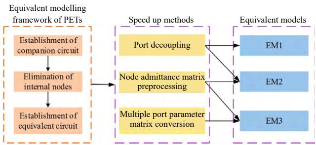  
Fig. 1 The construction of PET equivalent models

And then, these EMs are compared in the aspects of the speed up factor, simulation accuracy and applicability. Specially, the CPU time of different EMs are given in Fig. 2, as the speedup factor is the most important parameter of equivalent model.

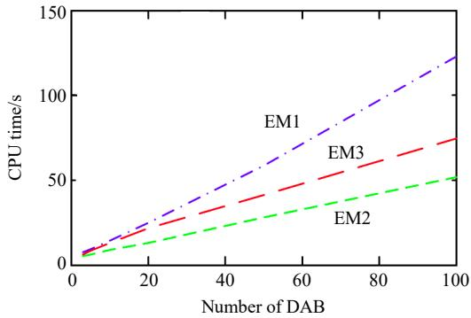  
Fig. 2 Equivalent model CPU time comparison

Finally, three main research directions of future PET equivalent modelling are provided, which are computer-assisted preprocessing algorithm of the PM admittance equation, multi-rate simulation based on time scale transformation, and the equivalent-real-time simulation based on parallel computing. These research directions may provide a useful reference for the research of PET equivalent modelling in the future.