# Advanced Hybrid Transient Stability and EMT Simulation for VSC-HVDC Systems

Arjen A. van der Meer, Madeleine Gibescu, Mart A. M. M. van der Meijden, Member, IEEE, Wil L. Kling, Senior Member, IEEE, and Jan A. Ferreira, Fellow, IEEE

Abstract—This paper deals with advanced hybrid transient stability and electromagnetic-transient (EMT) simulation of combined ac/dc power systems containing large amounts of renewable energy sources interfaced through voltage-source converter–high-voltage direct current (VSC-HVDC). The concerning transient stability studies require the dynamic phenomena of interest to be included with adequate detail and reasonable simulation speed. Hybrid simulation offers this functionality, and this contribution focuses on its application to (multiterminal) VSC-HVDC systems. Existing numerical interfacing methods have been evaluated and improved for averaged VSC modeling. These innovations include: 1) ac system equivalent impedance refactorization after faults; 2) amended interaction protocols for improved Thévenin equivalent source updating inside the EMT-type simulation; and 3) a special new interaction protocol for improved phasor determination during faults. The improvements introduced in this contribution lead to more accurate ac/VSC-HVDC transient stability assessment compared to conventional interfacing techniques.

Index Terms—Hybrid simulation, multiterminal, transient stability, voltage-source converter–high-voltage direct current (VSC-HVDC).

# NOMENCLATURE

EMT Electromagnetic transient.

ES,DS External system, detailed system.

QSS Quasistationary simulation.

ZOH Zero-order hold.

FOH First-order hold.

IP Interaction protocol.

W Rectangular window length.

M Number of EMT steps per stability time-step.

Manuscript received November 04, 2013; revised June 18, 2014; accepted December 10, 2014. Date of publication December 22, 2014; date of current version May 20, 2015. This research was financially supported by Agentschap NL, an agency of the Dutch Ministry of Economic Affairs, under the project North Sea Transnational Grid (NSTG). NSTG is a joint project of Delft University of Technology and the Energy Research Centre of the Netherlands. Paper no. TPWRD-01251-2013.

A. A. van der Meer, M. Gibescu, M. A. M. M. van der Meijden, and J. A. Ferreira are with the Department of Electrical Engineering, Mathematics, and Computer Science, Delft University of Technology, Delft 2628 CD, the Netherlands (e-mail: a.a.vanderMeer@tudelft.nl).

W. L. Kling is with the Department of Electrical Engineering, Eindhoven University of Technology, Eindhoven 5612 AZ, the Netherlands.

Color versions of one or more of the figures in this paper are available online at http://ieeexplore.ieee.org.

Digital Object Identifier 10.1109/TPWRD.2014.2384499

# I. INTRODUCTION

P RESENTLY, transmission system operators are chal-lenged to integrate increasing numbers of converter-interfaced transmission schemes, including voltage-sourced converter high-voltage dc (VSC-HVDC) [1], [2]. Their beneficial controllability enables interconnection of weak and/or asynchronous grids, eventually in multiterminal dc (MTDC) networks. In Western Europe, for instance, VSC-based MTDC (VSC-MTDC) transmission is under consideration to reinforce grids, interconnect countries, and integrate offshore wind powerplants [3].

Transient stability assessment is key in the corresponding grid integration analysis. The nonlinear and sometimes discontinuous behavior of high-capacity MTDC schemes may impair transient stability. This requires the physical phenomena that contributes to instability (e.g., dc-side EMTs) to be modeled correctly [4]. The time constants of these transients are small, and corresponding dc-side modeling does not fit into common stability-type simulations. In general, stability-type simulations cannot systematically handle combined ac/dc networks [5]. Presently, VSC-MTDC structures can be included in stability-type simulations only by decreasing the step size [6].

On the other hand, the current state of the art in computational power allows modeling of large networks in high detail by (quasi) real-time EMT-type and stability-type simulations. However, EMT-type simulation requires sophisticated line, cable, and equipment data that are necessary to produce a realistic EMT representation of the power system. These are often not available, neither are real-time simulation facilities. Grid studies will thus often be restricted to offline EMT or stability-type simulation on stand-alone computers.

Hybrid simulations offer an alternative as these allow interfacing EMT-type simulations with stability-type simulations. Being first developed in [7] by sequentially executing a stability-type and an EMT-type simulation during faults, hybrid methods were mainly used to study the integration of line-commutated converter (LCC) HVDCs. This simulation concept has been improved over the past decades [8]. In [9], the interface between both types of simulation was generalized to not only contain LCC-HVDC links, but also larger network segments. Later publications showed numerous accuracy improvements [10]–[13], and addressed computational aspects as well as the inclusion into existing tools [14]. However, generalized modeling of VSC-MTDC in stability-type simulations by hybrid methods has not yet been reported in the literature, while it is key for assessing future combined ac/dc transmission expansions.

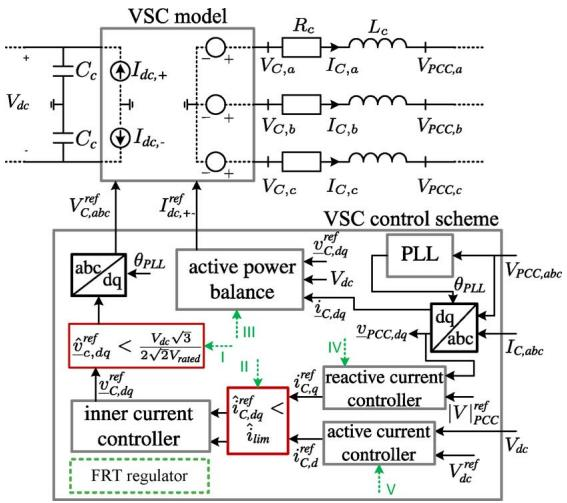  
Fig. 1. Grid interface of the VSC model and its vector control scheme.

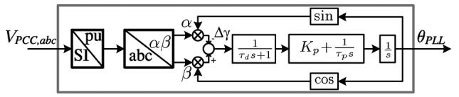  
Fig. 2. Block diagram of d-q–z phase-locked loop (PLL) model of the VSC.

This paper contributes knowledge on the modeling of VSC-MTDC systems into stability-type simulations by hybrid techniques, especially focusing on the implementation into the numerical solution scheme. Existing techniques are implemented and improved to enhance the accuracy and applicablity of the method. In this respect, particularly innovative are the Thévenin impedance and source updating method, the combination of existing interaction protocols, and the introduction of a new interaction protocol during disturbances in the ac system. Several variants of interfacing techniques are compared, analyzed, and improved to extract recommendations for the best parameter and protocol combination. The simulation results show that the proposed modeling improvements allow more accurate transient stability simulation of combined ac/VSC-MTdc transmission schemes compared to conventional alternatives for transient stability modeling.

The approach throughout this paper is as follows: first, VSC modeling is explained. Then, the applied simulation method and the newly developed interfacing techniques or VSC-MTDC will be described. This paper continues with testing the improved techniques first on a small network, then applies and compares several combinations of these techniques on a VSC-MTDC system with offshore wind.

# II. VSC MODELING

VSC-MTDC modeling for transient stability requires a correct representation of the relevant electromagnetic phenomena in the dc grid. A detailed topological representation of powerelectronic interfaces is not strictly necessary under the following assumptions: 1) the direct voltage is higher than the ac-side voltage under normal and disturbed conditions; 2) the harmonic distortion is negligible; 3) all VSCs modulate a balanced set of

three-phase voltages; and 4) dc faults remain outside the scope of the analysis. Hence, the interaction between ac and dc is fully dictated by the VSC control scheme, allowing VSCs to be represented by time-varying sinusoidal voltage sources.

# A. VSC Model

Fig. 1 gives an overview of the VSC grid interface and control scheme, which is based on [15]. The interaction between ac and dc is provided by the power balance, i.e.,

$$
I _ {\mathrm {d c}, +} = - I _ {\mathrm {d c}, -} = \frac {- P _ {\mathrm {a c}} + P _ {b r}}{V _ {\mathrm {d c}}} \tag {1}
$$

with $V _ { \mathrm { d c } }$ being the plus to minus pole direct voltage, $P _ { \mathrm { a c } }$ as the VSC terminal active power delivery, and $P _ { b r }$ as the power absorbed by the braking resistor in case it is triggered for faultride through (FRT) purposes. The dynamics at the ac side of the VSC are fully determined by the applied control method (vector control). It consists of a cascaded control scheme containing a phase-locked loop (PLL); an inner current controller (ICC); two outer controllers that regulate active and reactive current, respectively; and limiting schemes that ensure safe operation.

The VSC control scheme converts all network quantities to the VSC per-unit system and transforms these to the $d { - } q$ reference frame. Analogous to the Park transformation, the VSC uses the angle displacement $\theta _ { \mathrm { P L L } }$ , which is the transformation angle provided by the PLL scheme given in Fig. 2. The PLL regulates $\Delta \gamma$ ( ) to zero, enabling independent control of active $( \mathrm { i . e . , } P = v _ { \mathrm { P C C , } d } i _ { C , d } )$ and reactive power (i.e., $Q = - v _ { \mathrm { P C C } d } i _ { C , q } )$ . Hence, when locked, the VSC acts as a controlled current source by using $i _ { C , d }$ and $i _ { C , q }$ as control variables to regulate $\underline { { v } } _ { C , d q } ^ { r e f } = v _ { C , d } ^ { \mathrm { r e f } } + \mathrm { j } \overline { { v } } _ { C , q } ^ { \mathrm { r e f } }$ ur .

While the PLL and ICC are relatively fast, the current references $i _ { C , d } ^ { \mathrm { r e f } }$ and $i _ { C , q } ^ { \mathrm { r e f } }$ are set by two outer controllers with a lower bandwidth. In this paper, $i _ { C , d } ^ { \mathrm { r e f } }$ is used to regulate $P$ by using $v _ { \mathrm { d c } }$ as a controllable variable, while the point-of-common-coupling (PCC) voltage amplitude is controlled by $i _ { C , q } ^ { \mathrm { r e f } }$ . The set points of both proportional-integral controllers are dictated by the FRT regulator, which is described in the next section.

# B. Fault Ride Through Behavior

A vulnerable aspect of VSC-HVDC transmission is the nonlinear and sometimes discontinuous behavior in case any operating limits are violated. In such situations, usually during faults on either side of the VSC, both equipment-specific and general protection schemes aim to bring the VSCs back into the prefault operation state safely. Though the implementation of this protection depends on the power-electronic interface of the specific VSC and, thus, may differ per vendor, four commonly found protection mechanisms are assumed here:

• ac-side overcurrent limiting;   
• reactive current boosting during faults;   
• modulation index limiting;   
• fault ride through during ac faults.

These protection measures are implemented by the FRT regulator as a state machine, which acts on the submodels pointed to by dashed arrows in Fig. 1. It comprises three states: Normal,

TABLE I FRT REGULATOR STATE MACHINE IMPLEMENTATION   

<table><tr><td>State</td><td>Main Duty</td></tr><tr><td>Normal</td><td>normal operation</td></tr><tr><td>FRT</td><td>ride through fault, RCB</td></tr><tr><td>post-FRT</td><td>ramp-up active power to pre-fault value</td></tr></table>

TABLE II FRT REGULATOR STATE TRANSITIONS   

<table><tr><td>Transition</td><td>Trigger</td><td>Actions (− in Fig 1)</td></tr><tr><td>Normal to FRT</td><td>Vdc &gt; Vthres, + or |V|PCC &lt; Vthres</td><td>engage braking resistor (III) q-axis limiting priority (II) enable RCB (IV) freeze active current state (V)</td></tr><tr><td>FRT to post-FRT</td><td>Vdc &lt; Vthres, − and |V|PCC &gt; Vthres</td><td>q-axis limiting priority (II) disable RCB (IV) ramp Pac with d = dPac/dt (V)</td></tr><tr><td>post-FRT to normal</td><td>after 1/d s</td><td>disable braking resistor (III) d-axis limiting priority (II)</td></tr></table>

FRT, and post-FRT. The main features, transition conditions, and actions can be found in Tables I and II.

# III. INTERFACING TECHNIQUES FOR VSC–MTDC

# A. Classification of Hybrid Simulations

The aim of hybrid power system simulations is to study interactions between detailed and simplified network (or device) models with the device-level accuracy offered by EMT-type simulations, while retaining the reasonable execution times of stability-type simulations. Associated modeling, conversion steps, and computational implementation determine the performance of the entire simulation in terms of accuracy and execution speed.

An overview of the corresponding interfacing techniques applicable to VSC-MTDC as well as details on the applied sensitivities and proposed amendments are provided in the coming sections. The terminology introduced in [8] has been adopted as closely as possible and is depicted in Fig. 3.

# B. External System (ES) and Detailed System (DS)

The external system (ES) is the ac network contained in the stability-type simulation, and is, in case of transient stability assessment, commonly the largest part of the system under study. Traditionally, a fixed time step-size for numerical integration on the order of 1–20 ms is applied. The external system model covers a set of differential-algebraic equations

$$
\dot {\boldsymbol {x}} = \boldsymbol {f} (\boldsymbol {x}, \boldsymbol {y}) \tag {2}
$$

$$
\mathbf {0} = \boldsymbol {g} (\boldsymbol {x}, \boldsymbol {y}) \tag {3}
$$

where and are the set of state and algebraic variables, respectively. The network equations are included in (3) and can be either power flow based or current injection based.

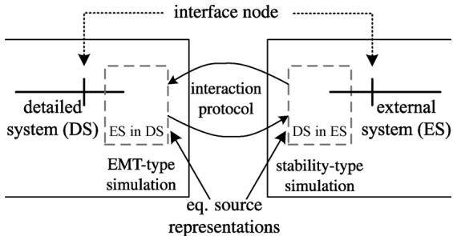  
Fig. 3. Overview of definitions used for interfacing techniques.

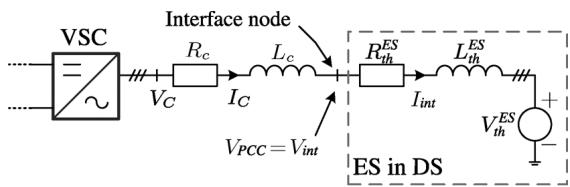

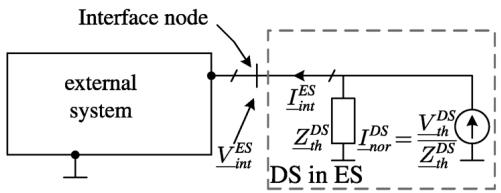  
  
Fig. 4. Equivalent source representation per interface location: (a) the detailed system and (b) the external system.

The detailed system (DS) comprises the parts of the network that require detailed modeling, traditionally aiming at device design, filter design, and choice of equipment rating. A typical fixed time step-size $( \Delta t _ { \mathrm { e m t } } )$ in the range is applied, eliminating the necessity to carry out an iterative solution scheme. Implementation can be achieved by EMT-type simulation or by embedding dedicated inner integration loops in the stabilitytype simulation.

The introduced VSC-MTdc modeling, notably its FRT behavior, puts emphasis on a correct representation of phenomena relevant to (transient) stability, which gives rise to inclusion of the VSC model into the detailed system simulations.

This contribution assumes a fixed time step size in the external and detailed system simulations.

# C. Equivalent System Representations

Since the network modeling of stability-type and EMT-type simulations differs significantly, network quantities and control variables must be transformed from one simulation paradigm to the other. Moreover, the dynamics of the external system should be reflected into the detailed system correctly and vice-versa. This paper assumes the interface location to be at the PCC of the VSCs in order to limit the network size of the detailed system. The corresponding equivalent source representations are shown in Fig. 4.

1) Representation of (ES) in (DS): In the detailed system, the external system network quantities are transformed to a three-phase time-varying Thévenin or Norton source, possibly

complemented with a (frequency dependent) network equivalent in case highly detailed modeling is required [16]. Relevant source values, that is, impedance, amplitude, frequency, and phase angle can be updated each time step or network iteration of the stability-type simulation.

This contribution uses a Thévenin equivalent that is inserted at the PCC of the VSCs, providing the ac side of the detailed system as shown in Fig. 4(a).

The Thévenin impedance $\begin{array} { r } { \underline { { Z } } _ { t h } ^ { \mathrm { E S } } ~ = ~ R _ { t h } ^ { \mathrm { E S } } + \mathrm { j } \omega _ { s } L _ { t h } ^ { \mathrm { E S } } } \end{array}$ Zth can either be calculated through open- and short-circuit tests in the external system, or obtained from the bus impedance matrix. Altering this impedance in the EMT-type simulation requires a (partial) re-factorization of the network model solution matrices, and reinitialization of corresponding network elements, which is not provided by every EMT-simulation program by default. Co-simulation especially requires the availability of this functionality by the respective application program interface [17]. Therefore, this paper compares the interface behavior with and without re-factorization.

Each time step , $\underline { { V } } _ { t h } ^ { \mathrm { E S } }$ is calculated from the stability-type simulation by

$$
\underline {{V}} _ {t h} ^ {\mathrm {E S}} = \underline {{V}} _ {i n t} ^ {\mathrm {E S}} - \underline {{I}} _ {i n t} ^ {\mathrm {E S}} \underline {{Z}} _ {t h} ^ {\mathrm {E S}} = | V | _ {t h} ^ {\mathrm {E S}} \mathrm {e} ^ {\mathrm {j} \theta_ {t h}} \tag {4}
$$

where $\underline { { V } } _ { t h } ^ { \mathrm { E S } }$ is the Thévenin voltage phasor in the external system, and voltage and $\underline { { V } } _ { i n t } ^ { \mathrm { E S } }$ and  curr $\underline { { I } } _ { i n t } ^ { \mathrm { E S } }$ are the external systnjection, respectively. nterfaceis then $\underline { { V } } _ { t h } ^ { \mathrm { E S } }$ used to update the three-phase Thévenin equivalent inside the detailed system by

$$
V _ {t h, a} ^ {\mathrm {E S}} [ m ] = \hat {V} _ {t h} ^ {\mathrm {E S}} \cos \left(\delta_ {s} [ m ] + \varphi_ {t h} [ m ]\right) \tag {5}
$$

$$
V _ {t h, b} ^ {\mathrm {E S}} [ m ] = \hat {V} _ {t h} ^ {\mathrm {E S}} \cos \left(\delta_ {s} [ m ] + \varphi_ {t h} [ m ] - \frac {2 \pi}{3}\right) \tag {6}
$$

$$
V _ {t h, c} ^ {\mathrm {E S}} [ m ] = \hat {V} _ {t h} ^ {\mathrm {E S}} \cos \left(\delta_ {s} [ m ] + \varphi_ {t h} [ m ] + \frac {2 \pi}{3}\right) \tag {7}
$$

where $\begin{array} { r } { \int _ { 0 } ^ { t _ { \mathrm { e m t } } [ m ] } \omega _ { s } [ n ] \mathrm { d } t _ { \mathrm { e m t } } } \end{array}$ $\hat { V } _ { t h }$ is the peak value of , and $\varphi _ { t h } [ m ]$ is the (filtered) angle of $\underline { { { V } } } _ { t h } ^ { \mathrm { E S } } , \quad \delta _ { s } [ m ]$ $\underline { { V } } _ { t h } ^ { \mathrm { E S } }$

The combination of values to be updated each time step and their respective filtering determine the interaction between the external and the detailed system. Several implementations for updating $\varphi _ { t h }$ are examined. The simplest approach is to update it through zero-order hold (ZOH) filtering by

$$
\varphi_ {t h} [ m ] = \theta_ {t h} [ k ] \tag {8}
$$

with the exact update instance defined by the interaction protocol discussed in the next section. The downside of this approach is that the stepwise changes in $\varphi _ { t h }$ at $t [ k ]$ influence the performance of the applied interfacing technique, and cause unrealistic VSC model responses.

To approximate the course of $\varphi _ { t h }$ during the EMT run between two updating instances, interpolation or extrapolation can be applied using a first-order hold (FOH)

$$
\varphi_ {\mathrm {t h}} [ m ] = \frac {\theta_ {\mathrm {t h}} [ k ] - \theta_ {\mathrm {t h}} [ k - 1 ]}{\Delta t} \Delta t _ {\mathrm {e m t}} (m - m _ {u}) + \varphi_ {\mathrm {t h}} [ n ] \tag {9}
$$

with $m _ { u }$ being the value of at the start of the EMT-type calculation loop each time (5)–(7) are updated from the stability-type simulation. Equation (9) is based either on extrapolation or interpolation, depending on the values available from the stability-type simulation at $t _ { \mathrm { e m t } } [ m _ { u } ]$ .

2) Representation of (DS) in (ES): The detailed system is modeled in the external system by a time-varying Norton equivalent, as described in Fig. 4(b). Network quantities in the detailed system are point on wave, and the equivalent source projection at the interface node in the external system involves transformations to fundamental-frequency positive-sequence voltage and current phasors, or derived quantities (e.g., active and reactive power). Well-established Fourier or curve-fitting methods can be applied to calculate these [18]. Their respective implementation (e.g., window length , applied filtering, discontinuity handling) determines the interaction between the detailed and the external system.

As soon as the quasistationary phasors of the individual interface currents and voltages are computed after $M = \Delta t / \Delta t _ { \mathrm { e m t } }$ calculation steps (at $t = t _ { \mathrm { e m t } } [ m + M ] )$ , their positive-sequence values can be calculated as

$$
\underline {{I}} _ {i n t} ^ {\mathrm {D S}} = \frac {1}{3} \left(\underline {{I}} _ {i n t, a} + \underline {{I}} _ {i n t, b} \mathrm {e} ^ {- \mathrm {j} 2 \pi / 3} + \underline {{I}} _ {i n t, c} \mathrm {e} ^ {\mathrm {j} 2 \pi / 3}\right) \tag {10}
$$

$$
\underline {{V}} _ {i n t} ^ {\mathrm {D S}} = \frac {1}{3} \left(\underline {{V}} _ {i n t, a} + \underline {{V}} _ {i n t, b} \mathrm {e} ^ {- \mathrm {j} 2 \pi / 3} + \underline {{V}} _ {i n t, c} \mathrm {e} ^ {\mathrm {j} 2 \pi / 3}\right). \tag {11}
$$

For each interface location, the Norton current injection in the external system is now defined as

$$
\underline {{I}} _ {\mathrm {N}} ^ {\mathrm {D S}} = \frac {\underline {{V}} _ {i n t} ^ {\mathrm {D S}} - \underline {{I}} _ {i n t} ^ {\mathrm {D S}} Z _ {T h} ^ {\mathrm {D S}}}{Z _ {T h} ^ {\mathrm {D S}}}. \tag {12}
$$

# D. Inclusion Into the Numerical Solution Scheme

The stability-type and EMT-type simulations can run either independently (i.e., co-simulation) or in a master-slave configuration (i.e., hybrid simulation) [5]. Hybrid simulations use inner integration loops within the stability-type simulation to embed the EMT-type simulation. Depending on the applied computational architecture, both solvers can run in parallel or sequentially. In either case, the equivalent sources shall be updated at predefined instances or interrupts. The order in which this is executed in time is defined by the interaction protocol (IP), and can have a significant influence in terms of simulation accuracy and speed, particularly immediately after events. This paper investigates the application of the introduced VSC model into regular IPs, and introduces two advanced IPs to be used in the case of discontinuities due to events.

1) Regular Interaction Protocols: Fig. 5 illustrates several implementations of the steps defined in the studied IPs. Fig. 5(a) and (b) shows the calculation sequence spanning $\Delta t .$ . The vertical bars indicate calculation steps. The upper and bottom lines display the stability-type and EMT-type simulations, respectively.

In Fig. 5(a), the equivalent sources inside the detailed system are updated using phasor quantities available at $t = t [ n ]$ (step ). Subsequently, the EMT-type simulation is executed until

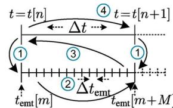  
(a)

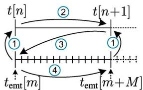  
(b)

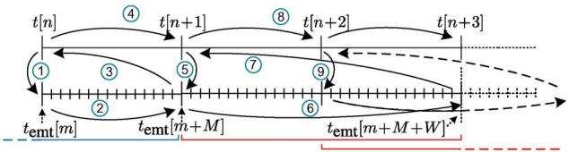

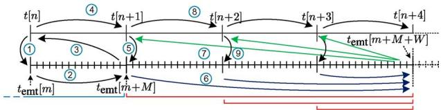  
（c）  
  
Fig. 5. Interaction protocols considered: (a) Precedence given to the EMT solver (IP1), (b) precedence given to the stability solver (IP2), (c) treatment of discontinuities in case $\quad W ^ { ^ { \prime } } > M$ (IP3), and (d) improved treatment of discontinuities in case $W > M \left( \mathrm { I P } 4 \right)$ .

$t _ { \mathrm { e m t } } = t _ { \mathrm { e m t } } [ m + M ]$ (step ), positive-sequence Norton equivalent source injections are determined (step ), and the stability-type simulation is executed (step ). The interface current injections are constant when solving (3). Using this calculation order uses $k \ = \ n$ for (8) or (9), and ensures undelayed inclusion of the detailed system response into the external system dynamics. In contrast, the IP shown in Fig. 5(b) executes the stability-type simulation before the Thévenin equivalents inside the detailed system are updated, and the detailed system is solved. The downside of this IP is that delayed information from the detailed system is used to determine the effects on transient stability. It will be shown that this issue can be resolved by switching to IP1 of Fig. 5(a) at events in the ES. A particular benefit of using IP2 of Fig. 5(b) is that the first-order hold function to update $\varphi [ m ]$ can now be implemented using interpolation in (9) (i.e., ), thereby eliminating step-wise angular changes.

2) New Interaction Protocol During Faults: During normal operating conditions or small-signal disturbances, the causality conditions for transforming waveforms to phasors in the detailed network are favorable due to relatively small changes in amplitude and angle. Therefore, the IPs in Fig. 5(a) or (b) will suffice, even in case $W > M$ . However, in case of disturbances, the sliding window needs to be reset and accurate voltage and current phasors cannot be obtained for $W > M$ . This requires either the moving window to be shortened or the calculation order to be changed, which is shown in Fig. 5(c). This newly developed IP employs the same steps $\textcircled{1} - \textcircled{4} )$ as in Fig. 5(a) until a disturbance inside the external system occurs at $t = t [ n + 1 ]$ . After solving (3) and updating all equivalent sources in the detailed system (step ), the EMT-type simulation is run until $t _ { \mathrm { e m t } } = t _ { \mathrm { e m t } } [ m + M + W ]$ (step ), after which the required

phasor calculations can be performed (step ) and used for the iterative procedure of the stability-type simulation (step ). Depending on , this jump-over procedure shall be repeated until the discontinuity instance is out of range of the moving window.

Another option for the phasor determination during faults is to change , as with the improved IP shown in Fig. 5(d). Here, the jumpover time and are variable and decrease from the initial value of to . This is shown for three stability simulation time steps. This IP offers clear simulation speed advantages compared to the IP shown in Fig. 5(c), whereas the main purpose of correct phasor determination after faults is still satisfied, that is, fast transients are smoothed while those applicable to transient stability are covered.

# IV. SIMULATION STUDIES

# A. Simulation Framework

The framework for the combined stability and EMT simulation was developed in-house and is hence very flexible in terms of applied interaction protocols, numerical solution schemes, and internal data structures. To achieve programming flexibility and efficiently test the modeling accuracy, Python scripting is used for the main simulation workflow and the NumPy extension is used for the numerical calculations. The stability-part employs the current injection based network solution using Newton-Raphson iterations [19], and applies the synchronous generator model of [20]. All stability models are included in the network iterative solution procedure. This procedure comprises the partitioned explicit method using a predictor-corrector solver with a forward-Euler predictor and a trapezoidal corrector. PSS®E was used for validation.

The EMT-part uses the nodal analysis method with numerical integrator substitution for the network solution [21], and applies the current source based machine model-to-network interface described in [22]. All EMT models are discretized according to the trapezoidal rule and solved separately from the network model. During faults, the solution and reinitialization procedure described in [23] was implemented. The EMT-part was validated with PSS NETOMAC.

# B. Simulation Setup

The accuracy and computational performance of several aspects of the proposed interfacing techniques are tested using the networks shown in Fig. 6. The parts within the dashed areas are simulated by EMT, while the remainder of the system is included in the stability-type simulation. Both networks will also be studied using an EMT reference simulation , and a quasistationary simulation model (QSS), which applies the VSC-MTDC model introduced for stability-type simulations in [24]. The latter requires $\Delta t$ to be reduced drastically to 500 . N2, N4, and N5 are interface nodes and, hence, included in both parts of the hybrid simulation. Closing SW2 in Fig. 6(a) yields the network shown in Fig. 6(b), wherein SW1 can be opened to exclude machine dynamics.

Besides visual inspection of the time-domain results, the accuracy of the interfacing techniques is also investigated by cal-

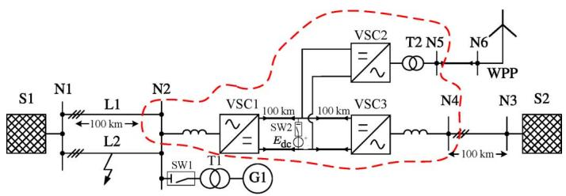

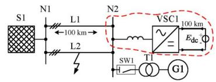  
  
(b)   
Fig. 6. Test systems for the proposed interfacing techniques: (a) Three-VSC system, (b) single VSC subsystem resulting from (a) after closing SW2.

TABLE IIIINVESTIGATED INTERFACING TECHNIQUES FOR VSC-HVDC  

<table><tr><td></td><td>Fig. 7</td><td>Fig. 8</td><td>Fig. 9</td><td>Fig. 10</td></tr><tr><td>SW1</td><td>open</td><td>closed</td><td>open</td><td>closed</td></tr><tr><td>SW2</td><td>closed</td><td>closed</td><td>closed</td><td>open</td></tr><tr><td>Contribution</td><td>Update ZESafter events</td><td>VESand influence of IP</td><td>advanced IP during faults</td><td>MTdc, comparison</td></tr></table>

culating their maximum and mean absolute error with respect to the reference simulations. The maximum error is determined by

$$
\hat {\epsilon} = \max  \left(\left\| x _ {i} - x _ {\text {r e f}, i} \right\|\right) \tag {13}
$$

where is the maximum error, and $x _ { i }$ is the $i ^ { t h }$ sample of the observed variable . The mean absolute error is calculated by

$$
\tilde {\epsilon} = \frac {1}{N _ {s}} \sum_ {i = 1} ^ {i = N _ {s}} \| x _ {i} - x _ {\text {r e f}, i} \| \tag {14}
$$

where is the mean absolute error of $x ,$ and $N _ { s }$ is the length of the compared time-domain variable. In case one, simulation has more samples than the other, and downsampling is applied. System-level quantities (e.g., $\delta _ { \mathrm { G 1 } }$ and $| V | _ { \mathrm { N 2 } } ^ { \mathrm { E S } } )$ are compared to the QSS reference model, whereas device-level variables (e.g., $V _ { \mathrm { d c } }$ and $\Delta \gamma \}$ ) are compared to the EMT reference. This distinction is considered plausible because: 1) the difference in network and generator modeling between EMT-type simulations and stability-type simulations makes the latter more attractive for system-level studies; 2) the hybrid simulation introduced in this paper is developed to include averaged VSC-MTdc modeling fast and accurately in stability-type simulations; and 3) on device-level, the accuracy with respect to the EMT reference simulation is already known to be significant.

Table III summarizes the applied variations per case. The first three cases show the effect of several improvements to the state of the art. The last case selects the best subset of these improvements and shows and compares their application to VSC-MTDC.

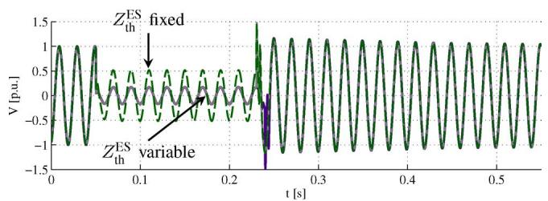

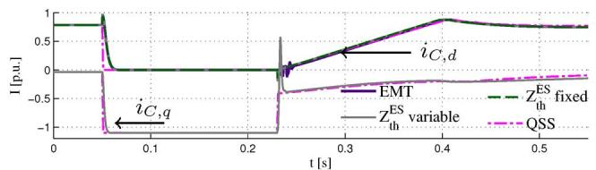  
(a)   
(b)   
Fig. 7. Effect of adjusting $Z _ { t h } ^ { \mathrm { E S } }$ after a fault in the external system. (a) N2 phase a voltage waveforms. (b) , and $i _ { C , q }$ of VSC1.

# C. Interfacing Techniques Applied to VSC–HVDC

The network shown in Fig. 6(b) comprises a 1000 MVA, 230 kV three-phase system equivalent using an R over X ratio of 0.1 (S1), two 100 km parallel overhead lines, a 128 MVA-rated local generator (G1) that can be included or excluded by switching SW1, and a 300 MVA-rated VSC terminal that is connected to a 300 kV dc-slack source by a 100 km bipolar submarine cable. In spite of the downside of showing unrealistic dynamic behavior at the dc side of the VSC, the application of a stiff dc source has the advantage that differences between interfacing techniques can be clearly distinguished. The same holds for using SW1, which excludes machine dynamics. Hence, differences in dynamics can be fully attributed to the variation in interfacing techniques.

1) EMT Re-Factorization After Faults: The first case shows the difference between updating $Z _ { t h } ^ { \mathrm { E S } }$ after each event within the stability-type simulation, and keeping it fixed throughout the simulation. The former requires re-factorisation of the solution matrices inside the EMT-type simulation. For both implementations, Fig. 7 shows the dynamic response after a 180 ms three-phase short-circuit halfway L2, which is cleared by disconnecting L2. This case uses IP1, with $\Delta t = 1 0$ ms and (8) (ZOH) to update $V _ { t h } ^ { \mathrm { E S } }$ . SW1 was kept open to exclude machine dynamics.

From Fig. 7(a) it can be concluded that updating $Z _ { t h } ^ { \mathrm { E S } }$ is effective at the expense of the necessary re-factorization in the EMT-type simulation. It can also be seen that the response of the case in which re-factorization in the EMT simulation is implemented, is barely distinguishable from the EMT reference simulation, except during fault clearing. Inside the EMT-type simulation the fault is cleared phase-by-phase while the stability-type simulation clears the three phases simultaneously due to the applied single-phase equivalent network representation. This introduces a slight but acceptable discrepancy between the hybrid and the EMT reference simulation. In the QSS model, the inner current controller of the VSC is neglected, making $i _ { C , d }$ and $i _ { C , q }$ algebraic variables that can change instantaneously according to (3).

2) EMT Thévenin Source Implementation: Next, the influence of the method to update $V _ { t h } ^ { \mathrm { E S } }$ and the effect of the interface protocol are investigated. The former is significant when $\theta _ { t h }$ and vIE $| V | _ { t h } ^ { \mathrm { E S } }$ vary due to machine dynamics. The latter is important when the influence of the equipment simulated in the detailed system is expected to be considerable. To illustrate this, SW1 is closed while the VSC operating point remains unaltered, and $\Delta t = 1 0$ ms is applied to enhancedly display differences between several interfacing techniques. The four implementations which have been compared are: 1) using IP1 of Fig. 5(a) while updating $\hat { V } _ { t h }$ and $\varphi _ { t h }$ by (8); 2) using IP1 while updating $\hat { V } _ { t h }$ and $\varphi _ { t h }$ by (9); 3) using IP2 of Fig. 5(b) while updating $\hat { V } _ { t h }$ and $\varphi _ { t h }$ by (9); and 4) using IP2 of Fig. 5(b) with a transition to IP1 of Fig. 5(a) at events in the ES. All implementations use the re-factorization improvement presented in Fig. 7.

Fig. 8 shows the simulation results after applying the same disturbance as previously. The differences between the EMT reference and the hybrid simulations are now clearly perceptible, to a great extent caused by the higher-order machine modeling for EMT-type simulations [e.g., rotor back-swing in the magnified part of Fig. 8(c)]. The discrete steps caused by the zero-order hold method to update $\hat { V } _ { t h }$ and $\varphi _ { t h }$ propagate through the PLL and the remainder of the VSC control system, which is inadmissible. This issue is resolved after applying a first-order hold instead. In case the external system gets precedence, that is, in the IP2 of Fig. 5(b), the FOH becomes causal and no discontinuous jumps are present. The effect of changing to the IP of Fig. 5(a) promptly at a disturbance is also manifest: when not applied, the FOH is inaccurate immediately after the disturbance and thereby introducing a delay in the dynamic response with respect to the other implementations.

Table IV shows the maximum and mean absolute errors of the rotor angle and PLL input angle. It can be seen that the application of FOH filtering reduces both system-level and device-level errors, and that switching from IP2 to IP1 at events combines the merits of causal FOH filtering and undelayed interaction between the DS and the ES at events.

For ZOH filtering, decreasing to 5 ms leads to a 41% and 10% reduction in the system-level and device-level errors respectively. For FOH filtering, the system-level errors show a 30% reduction with respect to $\Delta t = 1 0 \mathrm { m s }$ , while device-level errors do not change significantly. Reducing $\Delta t$ further to 1 ms does not lead to significant accuracy improvements.

3) Interaction Protocol During Faults: The next case addresses the behavior of the interface in case $\Delta t < W \cdot \Delta t _ { \mathrm { e m t } } ,$ making the curve fitting method inaccurate directly after the disturbance. All cases use $\Delta t \ = 1$ ms, and SW1 is open to exclude machine dynamics. The default window length is 10 ms. Fig. 9 shows the interface voltage waveforms and the calculated phasor magnitudes, respectively, whereas Table V shows a quantitative comparison between the applied methods in terms of their system-level errors. It shows three possible methods to deal with the phasor determination during events in the external system:

1) Decrease the window length to $W _ { f }$ for stability time steps for a predefined amount of time.   
2) Keep the same , but use IP3 of Fig. 5(c).   
3) Keep the same , but use IP4 of Fig. 5(d).

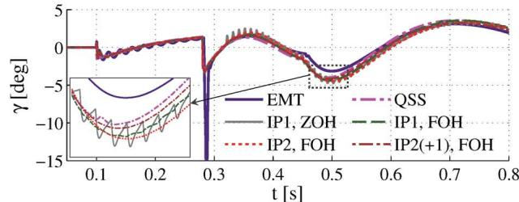

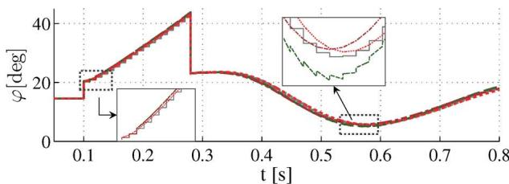  
  
(b)

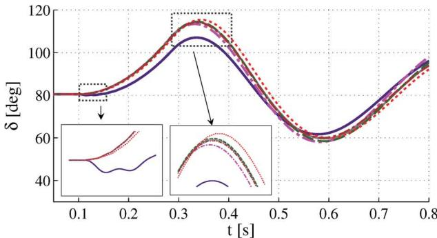  
（c）  
Fig. 8. Simulation results showing the effect of alternative equivalent source implementations in the detailed system. (a) PLL input angle $\Delta \gamma$ . (b) EMT Thévenin source angle . (c) Rotor angle of G1.

TABLE IV ACCURACY OF THEVENIN SOURCE UPDATE METHODS   

<table><tr><td></td><td>QSS</td><td colspan="2">EMT</td><td colspan="3">Hybrid</td></tr><tr><td>Fig. 8</td><td>-</td><td>-</td><td>-</td><td>-</td><td>-</td><td>-</td></tr><tr><td>IP(at event)</td><td>n/a</td><td>n/a</td><td>1</td><td>1</td><td>2</td><td>2(+1)</td></tr><tr><td>\( V_{th}^{ES} \)</td><td>n/a</td><td>n/a</td><td>ZOH</td><td>FOH</td><td>FOH</td><td>FOH</td></tr><tr><td>\( \hat{\epsilon } \left( {\delta }_{G1}\right) \)</td><td>0</td><td>0.085</td><td>0.0529</td><td>0.0469</td><td>0.1081</td><td>0.0476</td></tr><tr><td>\( \tilde{\epsilon }\left( {\delta }_{G1}\right) \)</td><td>0</td><td>0.0508</td><td>0.0191</td><td>0.0178</td><td>0.0400</td><td>0.0168</td></tr><tr><td>\( \hat{\epsilon }\left( {\Delta \gamma }\right) \)</td><td>0.0073</td><td>0</td><td>0.0081</td><td>0.0078</td><td>0.0088</td><td>0.0063</td></tr><tr><td>\( \tilde{\epsilon }\left( {\Delta \gamma }\right) \)</td><td>0.2639</td><td>0</td><td>0.2635</td><td>0.2605</td><td>0.2624</td><td>0.2599</td></tr></table>

For comparison, a case in which no special measures are taken $( \mathrm { i } . \mathbf { e } . , \Delta t = 1$ ms and $W = 1 0$ ms) is also shown. The post-event period in which the new IPs are applied is one cycle (i.e., 20 ms) here to visualize the differences, but should in theory have a minimum duration of $W \cdot \Delta t _ { \mathrm { e m t } }$ . From the visual and quantitative analysis, it can be concluded that method 1 and the case in which no special measures are taken show a large discrepancy with the QSS reference case. Though the peaks in voltage phasors follow from the waveforms, Fig. 9(a) also shows that this is the only moment at which the EMT and hybrid simulations differ. Yet it would be more realistic to apply a longer window length, which is done for methods 2 and 3. Both show acceptable performance, with a 91% and a 79% accuracy improvement respectively, based on . Method 3 is preferred due to the reduced amount of EMT calculation steps that

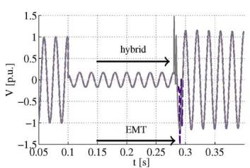

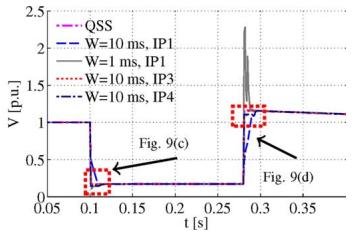  
(b)

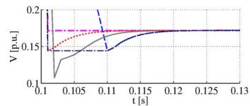

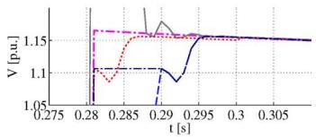  
(d)   
Fig. 9. Simulation results showing the effect of applying a different IP during faults in the external system. (a) N2 phase a voltage waveforms. (b) (voltage phasor magnitudes). $\mathrm { ( c ) } V _ { \mathrm { N 2 } }$ at fault ignition. $\bf \Pi ( d ) \  { V _ { N 2 } }$ at fault clerance.

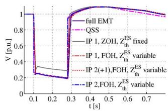  
(a)

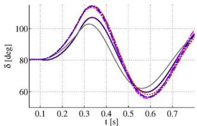  
(b)

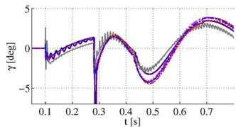

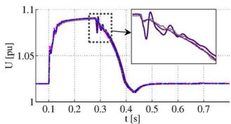  
  
Fig. 10. Three VSC-MTDC case studies showing the applicability of—and the differences between—the applied interfacing techniques. (a) N2 voltage magnitude. (b) Rotor angle G2. (c) PLL input angle of VSC1. (d) Direct voltage at VSC1 $( \dot { U } _ { \mathrm { d c } } )$ .

TABLE V ACCURACY OF THE INTERFACE MODEL AT EXTERNAL SYSTEM EVENTS   

<table><tr><td></td><td>QSS</td><td>W=10 ms</td><td>W=Δt=1 ms</td><td>IP3</td><td>IP4</td></tr><tr><td>ˆ(|V|N2)</td><td>0</td><td>0.6882</td><td>1.1171</td><td>0.0779</td><td>0.0727</td></tr><tr><td>ˆ(|V|N2)</td><td>0</td><td>0.0159</td><td>0.0124</td><td>0.0015</td><td>0.0034</td></tr></table>

TABLE VI INVESTIGATED INTERFACING TECHNIQUES FOR VSC-MTDC, SEE FIG. 10   

<table><tr><td>subcase (SC)</td><td>SC1 (—)</td><td>SC2 (—)</td><td>SC3 (…)</td><td>SC4 (…)</td></tr><tr><td>ZESth</td><td>fixed</td><td>variable</td><td>variable</td><td>variable</td></tr><tr><td>VESth</td><td>ZOH</td><td>FOH</td><td>FOH</td><td>FOH</td></tr><tr><td>IP(Fig. 5)</td><td>IP 1</td><td>IP 1</td><td>IP 2(+1)</td><td>IP 2(+4)</td></tr></table>

shall be done during the application of IP4 compared to IP3. In case of $\Delta t = 5$ ms, the maximum error between method 1 and method 2 and 3 reduces by 20% whereas the mean absolute error decreases by 36%. This is due to the reduced amount of simulation steps within IP 3 and 4.

# D. Application to VSC-MTDC

Various interfacing techniques investigated in the previous sections are now implemented for the system of Fig. 6(a) (SW1 closed and SW2 open). VSC2 connects an offshore wind power plant, which is represented by a transformer T2, a 33 kV ac collection network aggregatedly represented by a single submarine cable, and a 600 MW-rated, full-converter equivalent wind turbine. The generated power distributes equally among VSC1 and VSC3 by direct-voltage droop control [25]. The detailed system is contained in the dashed area, with interface models connected to N2, N4, and N5, all using the same interfacing technique.

Four interfacing technique variations are applied. These are subdivided into variations that need the EMT-type simulation integrated into the stability simulation, and variations that allow coupling through co-simulation. Table VI gives an overview of the selected interface model parameters.

Fig. 10 shows the time-domain simulation results for several network quantities. $V _ { \mathrm { d c } }$ rises rapidly during the onshore fault,

TABLE VII ACCURACY OF THE INTERFACE IMPLEMENTATIONS FOR THE VSC-MTDC SYSTEM (SEE ALSO TABLE VI)   

<table><tr><td></td><td>QSS</td><td>EMT</td><td>SC1</td><td>SC2</td><td>SC3</td><td>SC4</td></tr><tr><td>ˆ(δG1) ×10-2</td><td>0</td><td>12</td><td>20.95</td><td>5.93</td><td>11.29</td><td>5.64</td></tr><tr><td>ˆ(δG1) ×10-2</td><td>0</td><td>5.11</td><td>8.67</td><td>1.91</td><td>1.92</td><td>0.92</td></tr><tr><td>ˆ(Udc) ×10-4</td><td>10</td><td>0</td><td>10</td><td>5.78</td><td>5.93</td><td>6.82</td></tr></table>

and VSC1 and VSC3 switch to FRT mode by engaging their chopper-controlled resistors. These continue to operate after voltage recovery until VSC1 finishes active-power ramping.

In general, it can be concluded that all subcases show plausible interaction between the detailed and the external system, with the most prominent differences visible between SC 1 and 2–4, which is due to the updating method for $Z _ { t h } ^ { \mathrm { E S } }$ .

Table VII shows the system and device-level errors. The device-level error is relatively small (i.e., 1% for SC1), whereas the system-level accuracy is notably improved when using the advanced IP4 (i.e., SC4). Variation on showed a reduction of $\tilde { \epsilon } \left( \delta _ { \mathrm { G 1 } } \right)$ of 25% for $\Delta t = 5$ ms and 52% for $\Delta t = 1$ ms, whereas no significant accuracy improvements could be observed on device-level variables. For the used averaged VSC model, this implies that a higher does not lead to decreased accuracy inside the detailed system.

# E. Computational Performance

The simulation was implemented by Python scripting and the absolute calculation time per simulated second for the networks of Fig. 6 are shown in Table VIII. In order to illustrate to what extent hybrid simulations are faster than the EMT and QSS alternatives, Fig. 6(a) was extended by replacing the onshore part by two IEEE 9-bus systems. The resulting system has a relatively higher proportion of nodes in the external system, leading to 33% and 40% speed improvements compared to the EMT and stability-type simulations, respectively. Since the interface location is at the VSC terminals, this relative improvement is surmised to increase with increasing size of the external

TABLE VIII COMPUTATIONAL PERFORMANCE FOR SEVERAL AC/VSC-MTDC GRIDS   

<table><tr><td></td><td>Fig. 6(b)</td><td>Fig. 6(a)</td><td>Fig. 6(a) extended</td></tr><tr><td>nodes AC</td><td>4</td><td>10</td><td>23</td></tr><tr><td>EMT exc. time/s</td><td>50 s</td><td>202 s</td><td>452 s</td></tr><tr><td>QSS exc. time/s</td><td>68 s</td><td>314 s</td><td>500 s</td></tr><tr><td>hybrid exc. time/s</td><td>45 s</td><td>178 s</td><td>300 s</td></tr><tr><td>improvement</td><td>-10%</td><td>13%</td><td>33%</td></tr></table>

system. The focus of this research was on the improved interfacing techniques. To speed-up computation while employing the improved accuracy, a compiled language is recommended.

# V. CONCLUSIONS

This paper investigated the application of hybrid simulation techniques dedicated to VSC-HVDC transmission, and the inclusion of these techniques into stability-type simulations. Interfacing techniques developed earlier were taken as a starting point and implemented into a newly developed combined stability and EMT simulation tool. This contribution improves the transient stability assessment compared to common alternatives, such as reducing time step-size and applying existing hybrid techniques. It turned out that a large accuracy gain is achieved when the source impedance is updated after each network change in the external system. Step-wise changes in the source quantities were mitigated by applying a first-order hold filter. Depending on the interaction protocol, this filter is predictive or causal. The latter showed the smoothest VSC response, at the cost of a delayed interaction between the detailed and external systems. This issue was resolved by combining several interaction protocols at events in the ac system. Another special interaction protocol was developed for calculation steps immediately after an event in the external system. This is most relevant for the phasor determination methods, which require a minimum window length and need to restart after faults. Device-level accuracy showed to be insensitive to variations on the external system time step-size, allowing the largest possible within the numerical stability boundaries. Application of the developed interfacing techniques on a three-terminal VSC-HVDC network showed accurate dynamic behavior, featuring faster execution speeds than the EMT and stability-type reference simulations.

# REFERENCES

[1] Ten-Year Network Development Plan 2012. Brussels, Belgium, ENTSO-e, Jun. 2012. [Online]. Available: https://www.entsoe.eu/ major-projects/ten-year-network-development-plan/tyndp-2012/   
[2] T. Hammons, V. Lescale, K. Uecker, M. Haeusler, D. Retzmann, K. Staschus, and S. Lepy, “State of the art in ultrahigh-voltage transmission,” Proc. IEEE, vol. 100, no. 2, pp. 360–390, Feb. 2012.   
[3] Offshore Grid Development in the North Seas: ENTSO-E Views. Brussels, Belgium, ENTSO-E, Feb. 2011 [Online]. Available: https://www.entsoe.eu/publications/system-development-reports/north-seas-grid-development/Pages/default.aspx

[4] H. Saad, J. Peralta, S. Dennetiere, J. Mahseredjian, J. Jatskevich, J. Martinez, A. Davoudi, M. Saeedifard, V. Sood, X. Wang, J. Cano, and A. Mehrizi-Sani, “Dynamic averaged and simplified models for MMCbased HVDC transmission systems,” IEEE Trans. Power Del., vol. 28, no. 3, pp. 1723–1730, Jul. 2013.   
[5] J. Beerten, O. Gomis-Bellmunt, X. Guillaud, J. Rimez, A. A. van der Meer, and D. van Hertem, “Modelling and control of HVDC grids: A key challenge for the future power system,” presented at the 18th Power Syst. Comput. Conf., Wroclaw, Poland, Aug. 18–22, 2014.   
[6] N. Chaudhuri, R. Majumder, B. Chaudhuri, and J. Pan, “Stability analysis of VSC MTDC grids connected to multimachine AC systems,” IEEE Trans. Power Del., vol. 26, no. 4, pp. 2774–2784, Oct. 2011.   
[7] M. Heffernan, K. Turner, J. Arrillaga, and C. Arnold, “Computation of a.c.-d.c. system disturbances – Parts I, II, and III. interactive coordination of generator and convertor transient models,” IEEE Trans. Power App. Syst., vol. PAS-100, no. 11, pp. 4341–4363, Nov. 1981.   
[8] V. Jalili-Marandi, V. Dinavahi, K. Strunz, J. A. Martinez, and A. Ramirez, “Interfacing techniques for transient stability and electromagnetic transient programs,” IEEE Trans. Power Del., vol. 24, no. 4, pp. 2385–2395, Oct. 2009.   
[9] J. Reeve and R. Adapa, “A new approach to dynamic analysis of ac networks incorporating detailed modeling of dc systems – Parts I and II,” IEEE Trans. Power Del., vol. 3, no. 4, pp. 2005–2019, Oct. 1988.   
[10] G. Anderson, N. Watson, N. Arnold, and J. Arrillaga, “A new hybrid algorithm for analysis of HVDC and FACTS systems,” in Proc. Int. Conf. Energy Manage. Power Del., Nov. 1995, vol. 2, pp. 462–467.   
[11] H. Inabe, T. Futada, H. Horii, and K. Inomae, “Development of an instantaneous and phasor analysis combined type real-time digital power system simulator,” presented at the Int. Conf. Power Syst. Transients, New Orleans, LA, USA, 2003.   
[12] H. Su, K. W. Chan, L. A. Snider, and J. C. Soumagne, “Advancements on the integration of electromagnetic transients simulator and transient stability simulator,” presented at the Int. Conf. Power Syst. Transients, Montreal, QC, Canada, 2005.   
[13] H. Su, K. Chan, and L. Snider, “Evaluation study for the integration of electromagnetic transients simulator and transient stability simulator,” Elect. Power Syst. Res., vol. 75, no. 1, pp. 67–78, 2005.   
[14] P. Lehn, J. Rittiger, and B. Kulicke, “Comparison of the ATP version of the EMTP and the NETOMAC program for simulation of HVDC systems,” IEEE Trans. Power Del., vol. 10, no. 4, pp. 2048–2053, Oct. 1995.   
[15] V. Blasko and V. Kaura, “A new mathematical model and control of a three-phase AC-DC voltage source converter,” IEEE Trans. Power Electron., vol. 12, no. 1, pp. 116–123, Jan. 1997.   
[16] U. Annakkage, N. Nair, Y. Liang, A. Gole, V. Dinavahi, B. Gustavsen, T. Noda, H. Ghasemi, A. Monti, M. Matar, R. Iravani, and J. Martinez, “Dynamic system equivalents: A survey of available techniques,” IEEE Trans. Power Del., vol. 27, no. 1, pp. 411–420, Jan. 2012.   
[17] S. Filizadeh, M. Heidari, A. Mehrizi-Sani, J. Jatskevich, and J. Martinez, “Techniques for interfacing electromagnetic transient simulation programs with general mathematical tools,” IEEE Trans. Power Del., vol. 23, no. 4, pp. 2610–2622, Oct. 2008.   
[18] T. Lobos, “Nonrecursive methods for real-time determination of basic waveforms of voltages and currents,” Proc. Inst. Elect. Eng., Gen., Transm. Distrib., vol. 136, no. 6, pp. 347–352, Nov. 1989.   
[19] B. Stott, “Power system dynamic response calculations,” Proc. IEEE, vol. 67, no. 2, pp. 219–241, Feb. 1979.   
[20] H. Dommel and N. Sato, “Fast transient stability solutions,” IEEE Trans. Power App. Syst., vol. PAS-91, no. 4, pp. 1643–1650, Jul. 1972.   
[21] H. W. Dommel and W. S. Meyer, “Computation of electromagnetic transients,” Proc. IEEE, vol. 62, no. 7, pp. 983–993, Jul. 1974.   
[22] L. Wang, J. Jatskevich, V. Dinavahi, H. W. Dommel, J. A. Martinez, K. Strunz, M. Rioual, G. W. Chang, and R. Iravani, “Methods of interfacing rotating machine models in transient simulation programs,” IEEE Trans. Power Del., vol. 25, no. 2, pp. 891–903, Apr. 2010.   
[23] B. Kulicke, “Differenzleitwertverfahren bei kontinuierlichen und diskontinuierlichen Systemen,” Siemens Forschungs- und Entwicklungsberichte, vol. 10, pp. 299–302, 1981.   
[24] P. J. D. Chainho, A. A. van der Meer, R. L. Hendriks, M. Gibescu, and M. A. M. M. van der Meijden, “General modeling of multi-terminal VSC-HVDC systems for transient stability studies,” presented at the 6th IEEE Young Researchers Symp. Elect. Power Eng., Delft, the Netherlands, Apr. 16–17, 2012.   
[25] J. Beerten, S. Cole, and R. Belmans, “Generalized steady-state VSC MTDC model for sequential AC/DC power flow algorithms,” IEEE Trans. Power Syst., vol. 27, no. 2, pp. 821–829, May 2012.

Arjen A. van der Meer received the B.Sc. degree in electrical engineering from NHL University of Applied Sciences, Leeuwarden, the Netherlands, in 2006 and the M.Sc. degree (Hons.) in electrical engineering from Delft University of Technology, Delft, the Netherlands, in 2008, where he is currently pursuing the Ph.D. degree on the grid integration of offshore VSC-HVDC grids.

His main research topic is the interconnection of large-scale wind power to transnational offshore grids. His research interests include the modeling

and simulation of renewable energy sources, power-electronic devices, and protection systems.

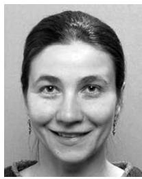

Madeleine Gibescu received the Dipl.Eng. degree in power engineering from the University Politechnica, Bucharest, Romania, in 1993, and the M.S.E.E. degree and the Ph.D. degree in dynamic security assessment from the University of Washington, Seattle, WA, USA, in 1995 and 2003, respectively.

She was a Research Engineer for ClearSight Systems, and a Power Systems Engineer for Alstom Grid, Bellevue, WA, USA. Since 2007, she has been an Assistant Professor with the Electrical Sustainable Energy Department, Delft University of Technology,

Delft, the Netherlands. Currently she is an Associate Professor with the Electrical Energy Systems Group, Faculty of Electrical Engineering, Eindhoven University of Technology, Eindhoven, the Netherlands. Her research interests are in the areas of smart and sustainable power systems.

Mart A. M. M. van der Meijden (M’10) received the M.Sc. degree (Hons.) in electrical engineering from the Eindhoven University of Technology, Eindhoven, the Netherlands, in 1981.

Currently, he is Part-Time Full Professor with the Department of Electrical Sustainable Energy of the Faculty of Electrical Engineering, Mathematics and Computers Science, Delft University of Technology, Delft, the Netherlands, since 2011. His chair and research focus is on large-scale sustainable power systems. He has more than 30 years of working experi-

ence in the field of process automation and the transmission and the distribution of gas, district heating, and electricity. He is leading research programs on intelligent electrical power grids as well as reliable and large-scale integration of renewable (wind, sun) energy sources in the European electrical power systems and advanced grid concepts. Since 2003, he has been with TenneT TSO, Europe's first cross-border grid operator for electricity. He is Manager of R&D/In-

novation and was responsible for the development of the TenneT long-term vision on the electrical transmission system.

Prof. van der Meijden is a member CIGRE and he has joined and chaired different national and international expert groups.

Wil L. Kling (M’95–SM’11) received the M.Sc. degree in electrical engineering from the Technical University of Eindhoven, Eindhoven, the Netherlands, in 1978.

Since 1993, he has been a Part-Time Professor in the Department of Electrical Engineering at Delft University of Technology, Delft, the Netherlands, in the field of power systems engineering. Since 2008, he has been a Full-Time Professor at Eindhoven University of Technology, where he is leading research programs on distributed generation, integration of

wind power, network concepts, and reliability.

Prof. Kling is involved in scientific organizations, such as CIGRE and the IEEE. As Netherlands representative, he is a member of CIGRE Study Committee C6 Distribution Systems and Dispersed Generation and the Administrative Council of CIGRE.

Jan A. Ferreira (F’05) received the B.Sc.Eng., M.Sc.Eng., and Ph.D. degrees in electrical engineering from the Rand Afrikaans University, Johannesburg, South Africa, in 1981, 1983, and 1987, respectively.

In 1981, he conducted research on battery vehicles at the Institute of Power Electronics and Electric Drives, Technical University of Aachen, Aachen, Germany, and worked in industry as a Systems Engineer at ESD (Pty) Ltd. from 1982 to 1985. From 1986 until 1997, he was with the Faculty of Engineering,

Rand Afrikaans University, where he held the Carl and Emily Fuchs Chair of Power Electronics in later years. In 1998, he became Professor of Power Electronics and Electrical Machines at the Delft University of Technology, Delft, the Netherlands.

Dr. Ferreira is a fellow of the IEEE. During 1993–1994, he was Chairman of the South African Section of the IEEE. He is the founding chairman of the IEEE Joint IAS/PELS Benelux chapter. He served in 1995–1996 as the Chairman of the IEEE IAS Power Electronic Devices and Components committee. He is an Associate Editor of the PELS Transactions and served as Treasurer and VP-Meetings. From 2014 to 2015, he was President of the IEEE PELS. He was Chairman of the CIGRE SC14 national committee of the Netherlands from 1999 to 2002 and is a member of the executive committee of the European Power Electronic Association EPE Society (1999–2003 and 2008–2011).