# Decoupled Detailed Equivalent Model for Parallel and Multi-Rate EMT-Type Simulation of Modular Multilevel Converter With Battery Energy Storage

Walid Hatahet , Graduate Student Member, IEEE, Hengyu Li , Member, IEEE, Liwei Wang , Senior Member, IEEE, and Wei Li , Member, IEEE

Abstract—Modular multilevel converters (MMCs) integrated with battery energy storage systems (BESS) enable efficient utilization of renewable energy resources such as wind and photovoltaic, while enhancing reliability and scalability of high-voltage direct current systems. This paper proposes a decoupled detailed equivalent model (D-DEM) for BESS-integrated MMC for electromagnetic transient (EMT) simulation. The proposed model can accurately represent the dynamics of the converter under deblocking and blocking modes. To efficiently utilize available hardware resources, a multi-rate simulation technique is adopted to simulate the MMC subsystems with different time steps. Additionally, switching interpolation technique is proposed to accurately compensate for the intra-time-step switching events of the MMC multi-valves. To further accelerate the EMT simulation of MMC, a hybrid parallel computing EMT solver is implemented, using both central and graphical processing units (CPU-GPU). The accuracy of the proposed D-DEM is validated against a detailed model (DM) using Simulink/Simscape Electrical toolbox with 1 µs time step. The simulation efficiency of the proposed D-DEM is faster than the conventional DEM model by a factor of 2.81 with CPU-only implementation for the MMC with 400 submodules per arm. Furthermore, the proposed hybrid CPU-GPU solver achieves 79-fold faster than the CPU-only sequential implementation.

Index Terms—Battery energy storage system, electromagnetic transient simulation, multi-rate simulation, parallel processing, switching interpolation.

# I. INTRODUCTION

H IGH voltage direct current (HVDC) transmission systemshave witnessed a significant growth stemming from the have witnessed a significant growth stemming from the widespread deployment in renewable energy systems [1]. The use of battery energy storage systems (BESS) is substantial to efficiently harness the surplus energy in the power grid [2], and accelerate the transition from high-emission power plants to clean renewable energy resources [3]. Embedding the

Received 15 June 2025; revised 13 November 2025; accepted 19 December 2025. Date of publication 26 December 2025; date of current version 26 March 2026. This work was supported by Natural Sciences and Engineering Research Council (NSERC) of Canada. Paper no. TPWRD-00787-2025. (Corresponding author: Liwei Wang.)

Walid Hatahet, Hengyu Li, and Liwei Wang are with the School of Engineering, University of British Columbia Okanagan, Kelowna, BC V1V 1V7, Canada (e-mail: liwei.wang@ubc.ca).

Wei Li is with the OPAL-RT Technologies, Montreal, QC H3K 1G6, Canada (e-mail: wei.li@opal-rt.com).

Digital Object Identifier 10.1109/TPWRD.2025.3648650

BESS into the modular structure of modular multilevel converter (MMC) is recognized as an important solution to manage excess power in HVDC systems [4]. Unlike conventional central battery schemes, the modular configuration provides high reliability, scalability and optimized efficiency [5]. However, the integration of modular BESS in MMC introduces complexity into HVDC networks design and operation [6]. Thus, electromagnetic transient (EMT) studies are essential to provide detailed representation of system components, performance evaluation in fault analysis and grid stability assessment [7].

Significant challenges exist in the simulation of MMC-based HVDC systems under normal and faulty conditions. For instance, a large number of switching nodes of the MMC results in a high-dimensional, time-varying conductance G matrix [8], leading to extensive computational complexities. In addition, the BESS-integrated MMC comprises converter subsystems with various switching frequencies, necessitating fine time step resolution and frequent conductance matrix re-factorization [9]. These challenges impose heavy computational burdens on conventional EMT modeling approaches and highlight the need for efficient equivalent circuit modeling strategies [10], [11].

Recent advancements in BESS-integrated MMC HVDC technologies have brought new imperatives for the accelerated EMT simulation of these systems. In [12], a detailed equivalent model (DEM), based on the Thevenin equivalent circuit of the MMC multi-valves, was developed to simulate converter dynamic response and high-frequency transients in AC three-phase faults. In [13], an average-value model was proposed for numerically efficient simulation of the BESS-integrated MMC. Numerically efficient equivalent models were proposed in [14], [15], [16] to model the MMC with embedded supercapacitor energy storage based on the Thevenin equivalent circuit. While these models offer valuable modeling insights, they are not able to represent the blocked state of the MMC in DC fault scenarios. Improved DEMs were developed in [17], [18] with provisions for representing the critical blocked state of the converter. However, the coupled submodule- and battery-side converters and timevarying conductance G matrix of the BESS-integrated MMC still complicate the EMT simulation.

Advanced modeling algorithms, including multi-rate simulation and switching interpolation, are also critical to achieve high accuracy and efficiency of the EMT simulation of MMC-based HVDC systems. In [19], an efficient DEM of MMC

was introduced, wherein multiple sample rates were employed to simulate the MMC on a hybrid CPU and Field Programmable Gate Array (FPGA) platform. A multi-rate mixed-solver technique was proposed for AC/DC systems using different time steps for the decomposed subsystems [20]. A fully FPGA-based multi-rate simulation of two-terminal HVDC system was introduced in [21], where the system was decoupled by the stub line and simulated in parallel. In [22], an interconnected AC and MMC-MTDC system is partitioned into AC and DC subsystems and represented by time-varying Thevenin and Norton equivalents using multi-rate co-simulation and spline interpolation technique. However, these modeling efforts focus on the conventional MMCs without integrated BESS.

Massive parallel processing capabilities of graphical processing units (GPUs) are leveraged to speed up the computationintensive simulation of MMC-based HVDC systems [23]. A device-level parallel-in-time algorithm was developed on GPUs to simulate the MMC for electric vehicle applications [24]. A high-fidelity EMT modeling of MMC with supercapacitor-based energy storage embedded in submodules (SMs) was developed in [25]. The transmission line model (TLM) technique was deployed to represent the reactive components of MMC and to decouple the SMs circuits from the converter in order to achieve parallel simulation on GPU [25]. In [23], [24], [25], the complexity of SM equivalent circuits increases when bipolar SMs, such as full-bridge (FB) or clamped-double SMs are used in an MMC. Moreover, switching interpolation technique is not adopted in [23], [24], [25] which limits the simulation time steps to be small values to ensure simulation accuracy.

More recently, a multi-rate simulation of inverter-based resources is proposed in [26] for power system simulation on a GPU platform. The work in [27] presents an interface between the EMT simulator and a Dynamic Phasor (DP) simulation program, which preserves selected harmonic contents on the DP side. Similar work in [28] proposes a base-frequency DP solver that alters its solution technique between DP and EMT. This co-simulator combines the benefits of multi-rate simulation of different subsystems. However, the works in [26], [27], [28] need extension beyond power grid applications to large power converter systems such as MMCs. A multi-time-scale simulation method for EMT modeling of battery integrated solid-state transformer is proposed in [29]. Although simulation efficiency is improved through trigger-based partitioning, this study does not explore switching interpolation techniques to enable larger simulation step-sizes or GPU acceleration. The work in [30] presents a multi-rate co-simulation framework for modeling MMC dynamics in large-scale power systems, integrating DP and EMT solvers. Similar work in [31] develops an averagevalue MMC model using DP in co-simulation with an EMT solver. An accelerated detailed equivalent model is proposed in [32], which introduced a strategy to eliminate admittance matrix re-inversions during the converter’s normal operation. However, the models in [30], [31], [32] use conventional MMC submodules without BESS. The work in [33] presents a detailed equivalent EMT model for MMCs with partially integrated BESS that collapses each arm to a controlled voltage source with a constant network G matrix during normal operation. The

valuable contributions of [33] can be extended from CPU-based EMT studies to CPU-GPU platform with multi-rate simulation and switching interpolation (SI) at SM and BESS sides.

This paper aims at enhancing numerical efficiency of EMTtype simulation of BESS-integrated MMC through improved converter modeling, advanced simulation techniques and accelerated computing platform. The novelty and overall contributions are summarized as follows:

1) A fully decoupled detailed equivalent model (D-DEM) is proposed for the BESS-integrated MMC. The proposed D-DEM achieves constant conductance G matrix and reduced number of nodes in its nodal equation. On the other hand, the conventional coupled detailed equivalent model (C-DEM) results in a variable G matrix due to the use of binary-value resistors to model semiconductor switches.   
2) A multi-rate simulation technique is proposed for the BESS-integrated MMC to accelerate its EMT simulation. A large time step size $( 2 0 ~ \mu \mathrm { s } )$ is assigned to subsystems with low switching frequencies, while a smaller step size $( 5 ~ \mu \mathrm { { s } ) }$ is used for SM capacitor and BESS converter subsystems.   
3) A switching interpolation technique is proposed for the D-DEM to capture and compensate for the intra-step switching events. This technique improves simulation accuracy and avoid the use of excessively small time steps for high frequency switching converters.   
4) The proposed D-DEM can represent the MMC under IGBT deblocking and blocking modes and can be used for MMCs with different types of SM topologies. This paper further develops a hybrid CPU-GPU D-DEM with parallel processing to obtain high speed-up, compared to its CPU-only implementation.

# II. MMC DETAILED EQUIVALENT MODELS

This section introduces both the conventional and proposed DEMs of the BESS-integrated MMC. The proposed DEM has the advantage of decoupled circuit structure with reduced number of nodes and constant conductance matrix, compared to the conventional DEM. In addition, multi-rate simulation and switching interpolation techniques are proposed to further increase the simulation accuracy and efficiency for the proposed DEM.

# A. Coupled Detailed Equivalent Model (C-DEM)

The circuit diagram of the three-phase MMC without integrated battery energy storage system is illustrated in Fig. 1. Each phase of the MMC consists of two converter arms (i.e., upper and lower arms). Each converter arm consists of $N _ { c e l l }$ series-connected submodules and an arm inductor $L _ { a r m }$ . Different submodules types, e.g., half- or full-bridge (HB or FB, respectively) submodules can be employed in an MMC. Fig. 2(a) illustrates the integration of BESS within each SM. A half-bridge DC-DC converter/chopper is used to interface SM capacitor with the BESS, as shown in Fig. 2(a).

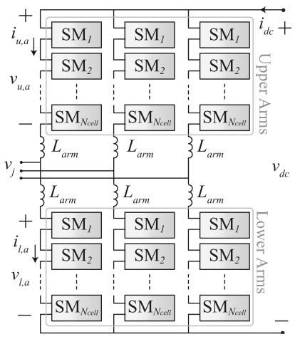

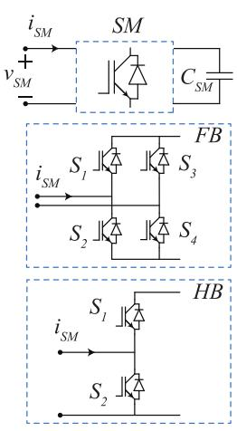

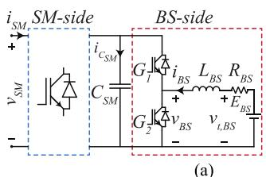  
Fig. 1. MMC circuit diagram.

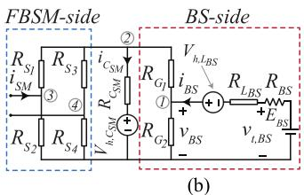

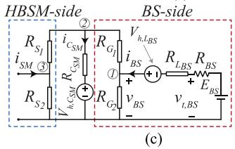

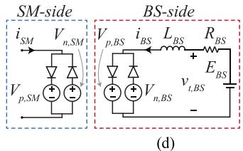  
Fig. 2. MMC SM circuit. (a) Detailed circuit. (b) Full-bridge C-DEM. (c) Half-bridge C-DEM. (d) Decoupled detailed equivalent SM model.

Conventionally, the BESS-integrated SMs are discretized using Trapezoidal Rule for EMT-type solution, as shown in Fig. 2(b) and (c). The historical voltage sources of the SM capacitor and BS-side inductor in discrete time domain are represented as $V _ { h , C _ { S M } }$ and $V _ { h , L _ { B S } }$ in Fig. 2(b) and (c), respectively. The IGBT switches are modeled by using two-value resistors of typically 1 mΩ for ON-state and 1 MΩ for OFF-state. Thevenin equivalent circuit, viewed from the SM-side can be calculated for each BESS-integrated SM. All of the SM-level Thevenin equivalent circuits in each arm are lumped into one Thevenin equivalent circuit for power network solution. It is observed in Fig. 2(b) and (c) that the SM- and BS-side equivalent circuit components are coupled via SM DC-link capacitor $C _ { S M }$ . Therefore, this detailed equivalent modeling is named as coupled detailed equivalent model (C-DEM).

The EMT-type solution of the MMC with integrated BESS requires nodal analysis of the SMs in Fig. 2(b) and (c) with their nodal equation expressed as

$$
\mathbf {G} _ {S M} \mathbf {V} _ {S M} = \mathbf {I} _ {S M} \tag {1}
$$

In (1), $\mathbf { V } _ { S M }$ is SM nodal voltage vector; $\mathbf { I } _ { S M }$ and $\mathbf { G } _ { S M }$ are the current vector and the nodal conductance matrix of the SM, respectively. When the semiconductor switches are represented by two-value (ON or OFF) resistors, $\mathbf { G } _ { S M }$ is time-variant. It is noted that the FBSM with integrated BESS in Fig. 2(b) requires a 4 × 4 linear system of (1) with 4 independent nodes (excluding ground node).

The Thevenin equivalent circuits of Fig. 2(b) and (c) viewed from the SM-side input ports are calculated. With $N _ { c e l l }$ series connected SMs in each arm, the arm equivalent circuit is formed by combining $N _ { c e l l }$ number of Thevenin equivalent circuits into one Thevenin equivalent circuit for MMC-network solution. After the MMC-network solution is completed, the arm current is used to solve (1) for the SM nodal voltage vector, $\mathbf { V } _ { S M }$ in each time step to update the SM’s component solutions. It is noted that the network and SM conductance G matrices are time-variant due to IGBT-switching operations of the SMs. Therefore, the refactorization (e.g., LU factorization method) of the network and SM conductance matrices reduces the numerical efficiency of the MMC model. As the number of SMs per arm increases, high computational power is required for the EMT-type solution of the MMC with integrated-BESS.

# B. Decoupled Detailed Equivalent Model (D-DEM)

In order to achieve constant conductance G matrices of the network and SMs of the MMC, a decoupled detailed equivalent model (D-DEM) of the MMC is proposed in the paper. Different from the conventional resistive switch model (RSM) of the semiconductors used in the C-DEM, a switching function-based model is proposed to represent the semiconductor switching status of an FB or HB converter in SM- or BS-side in the D-DEM. Without loss of generality, an FBSM with integrated BESS is used to derive the proposed D-DEM. The derivation of the D-DEM for the HBSM is very similar to the FBSM case and is not included for space consideration.

Based on the circuit diagram shown in Figs. 1 and 2(a), a switching function S that represents the insertion status of an FBSM in IGBT deblocking mode, is expressed as

$$
S = \left\{ \begin{array}{c c} 1, & \text {P o s i t i v e l y I n s e r t e d} \\ - 1, & \text {N e g a t i v e l y I n s e r t e d} \\ 0, & \text {B y p a s s e d} \end{array} \right. \tag {2}
$$

Similarly, at BS-side, a switching function G that represents the insertion status of the HB DC-DC converter interfacing the battery with the SM capacitor, is expressed as

$$
G = \left\{ \begin{array}{l} 1, I n s e r t e d \\ 0, B y p a s s e d \end{array} \right. \tag {3}
$$

The SM capacitor voltage differential equation is discretized using explicit integration rule, e.g., Forward Euler method as

$$
v _ {C S M} (t + \Delta t) = v _ {C S M} (t) + \frac {\Delta t}{C _ {S M}} i _ {C S M} (t) \tag {4}
$$

where $\Delta t$ is the discretization time step-size. The SM capacitor voltage $v _ { C _ { S M } }$ is used to decouple the BS-side from the SM-side

in the proposed D-DEM, as shown in Fig. 2(d). The equivalent output voltages of the SM-side FB converter for positive and negative SM current $i _ { S M }$ directions are denoted as $V _ { p , S M }$ and $V _ { n , S M }$ , respectively. Similarly, the equivalent output voltages of the BS-side HB DC-DC converter for positive and negative battery current $i _ { B S }$ directions are denoted as $V _ { p , B S }$ and $V _ { n , B S }$ respectively, as shown in Fig. 2(d).

When the FBSM is operated in IGBT deblocking mode, the equivalent output voltages at SM-side and BS-side can be expressed as

$$
v _ {S M} = V _ {p, S M} = V _ {n, S M} = S v _ {C _ {S M}} \tag {5}
$$

$$
v _ {B S} = V _ {p, B S} = V _ {n, B S} = G v _ {C S M} \tag {6}
$$

Once the SM- and BS-side equivalent output voltages are known in (5) and (6), the EMT network solutions are sought at the present time step $t + \Delta t$ . Therefore, the SM and BS currents at time step $t + \Delta t$ are obtained from the EMT network solutions. The SM capacitor current in the deblocking mode of operation is expressed as

$$
i _ {C _ {S M}} = \underbrace {S i _ {S M}} _ {S M - s i d e} + \underbrace {G i _ {B S}} _ {B S - s i d e} \tag {7}
$$

The capacitor current $i _ { C _ { S M } }$ is used to update the SM capacitor voltage in (4) for the EMT solution at the next time step.

When the FBSM is operated in IGBT blocking mode, all SMside switches are blocked whereas arm current flows through the diodes of the FBSM. Correspondingly, $V _ { p , S M }$ and $V _ { n , S M }$ are derived as

$$
\left\{ \begin{array}{l} V _ {p, S M} = v _ {C S M} \\ V _ {n, S M} = - v _ {C S M} \end{array} \right. \tag {8}
$$

The two diodes in the SM-side equivalent circuit of Fig. 2(d) are used to identify the positive or negative SM current iSM direction to connect the corresponding equivalent output voltages $V _ { p , S M }$ and $V _ { n , S M }$ to the arm of the MMC. Similarly, when the HB DC-DC converter at BS-side is operated in blocking mode, $V _ { p , B S }$ and $V _ { n , B S }$ are derived as

$$
\left\{ \begin{array}{c} V _ {p, B S} = v _ {C _ {S M}} \\ V _ {n, B S} = 0 \end{array} \right. \tag {9}
$$

The two diodes in the BS-side equivalent circuit of Fig. 2(d) will connect the corresponding equivalent output voltages $V _ { p , }$ BS or $V _ { n , B S }$ to the battery circuit, depending on the positive or negative BS current $i _ { B S }$ direction.

For an FBSM, the SM capacitor current in blocking mode is derived as

$$
i _ {C _ {S M}} = \left\{ \begin{array}{l l} \left| i _ {S M} \right| + i _ {B S}, & i _ {B S} > 0 \\ \left| i _ {S M} \right|, & i _ {B S} <   0 \end{array} \right. \tag {10}
$$

For an HBSM, the SM capacitor current in blocking mode can be derived similarly to the case of an FBSM in (10). It is observed in Fig. 2(d) that the proposed D-DEM decouples SMand BS-side circuits and reduces the SM’s 4 × 4 nodal equation

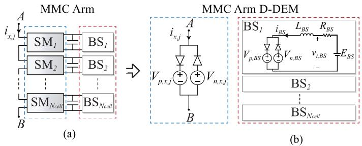  
Fig. 3. Schematic of single MMC arm. (a) DM. (b) D-DEM.

in (1) to two $1 \times 1$ voltage equations, which further improves simulation efficiency in addition to the constant conductance G matrices of the network and SMs of the MMC.

As the cascaded SMs are now decoupled, the D-DEM for an MMC arm is developed, as shown in Fig. 3. The equivalent arm voltages for positive and negative arm current $i _ { x , j }$ directions are expressed as

$$
v _ {x, j} = \left\{ \begin{array}{l l} V _ {p, x, j}, & i _ {x, j} > 0 \\ V _ {n, x, j}, & i _ {x, j} <   0 \end{array} \right. \tag {11}
$$

where x represents upper or lower arms $( { \mathrm { i . e . , } } x \in \{ u , l \} ) ; j$ represents phase number $j \in \{ a , b , c \}$ . The equivalent arm voltages are the summation of their corresponding SM output equivalent voltage as

$$
\left\{ \begin{array}{l} V _ {p, x, j} = \sum_ {i = 1} ^ {N _ {\text {c e l l}}} V _ {p, S M, x, j} ^ {i} \\ V _ {n, x, j} = \sum_ {i = 1} ^ {N _ {\text {c e l l}}} V _ {n, S M, x, j} ^ {i} \end{array} \right. \tag {12}
$$

where $v _ { S M , x , j } ^ { i }$ and $v _ { B S , x , j } ^ { i }$ are the output equivalent voltages at SM-side and BS-side of the $i ^ { t h }$ submodule of the MMC arm x in phase $j ,$ respectively.

In each time step of the EMT program, the arm equivalent circuit, shown in Fig. 3(b) is used to develop EMT solutions of the power network and BESS where the MMC arm current and BS current are calculated. The MMC SM capacitor currents and voltages are then updated in (7) and (4), respectively.

# C. Multi-Rate Simulation

The BESS-integrated MMC HVDC system consists of different converter subsystems that operate at various switching frequencies. For instance, the BS-side converter operates at a few kHz switching frequency, whereas the SM-side converter switches at much lower frequencies, typically at two or three times of line frequency (50 or 60 Hz). Different integration time steps can be used to simulate the different converter subsystems. A smaller time step enables the discrete time solver to capture the fine details of the fast switching subsystems while a larger time step is used for low switching frequency subsystems for better simulation efficiency.

Since an MMC contains hundreds to thousands of SMs, the serial processing units such as CPUs are not ideal platforms for numerically efficient simulation of BESS-integrated MMC. The GPU, with enormous parallel computational units with single instruction multiple data (SIMD) architecture, is ideal platform for the BESS-integrated MMC simulation. Therefore,

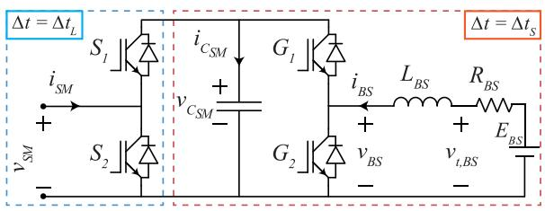  
Fig. 4. Multi-rate subsystems of MMC SM circuit.

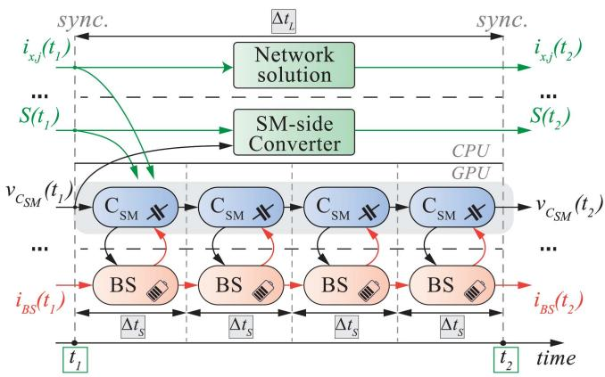  
Fig. 5. Data flow of MMC subsystems in Multi-rate simulation.

the SM capacitors and BS-side converters are solved on the GPU with a small time step $\Delta t _ { S }$ . The rest of the network and SM-side converters in MMC arms are solved on CPU with a relatively large time step $\Delta t _ { L }$ , as shown in Fig. 4. The arm currents and the switching functions of the SM-side converters are slow changing variables due to the presence of arm inductor and low switching frequency. Hence, their instantaneous values at a synchronization instant are sent from the large time step CPU subsystem to the small time step GPU subsystem and kept constant during one CPU time step $\Delta t _ { L }$ , as depicted in Fig. 5. In the small time step subsystem, the SM capacitor voltages and BS inductor current are updated n times within one large time step; where n is the ratio of $\Delta t _ { L }$ to $\Delta t _ { S }$ . Then, at a synchronization instant, the SM capacitor voltages and total arm voltages are updated to the large time step subsystem on the CPU, as shown in Fig. 5.

Solving the SM capacitor voltages in the small time step subsystem allows accurate capture of switching events that occur within a single large time step $\Delta t _ { L }$ interval. This multi-rate simulation yields more accurate capacitor voltages, compared to single large time step solution. At the next synchronization step, the SM capacitor voltage in (4) with small time step is mapped to (13) in the large time step subsystem. If the variation in the BS inductor current is negligible, then the SM capacitor voltage is the same as using Forward Euler method with $\Delta t _ { L }$ .

$$
\begin{array}{l} v _ {C S M} (t + \Delta t _ {L}) = v _ {C S M} (t + n \Delta t _ {S}) = v _ {C S M} (t) + \frac {\Delta t _ {S}}{C _ {S M}} \\ \cdot \left(S (t) i _ {S M} (t) + \frac {\sum_ {k = 0} ^ {n - 1} G (t + k \Delta t _ {S}) i _ {B S} (t + k \Delta t _ {S})}{n}\right) \tag {13} \\ \end{array}
$$

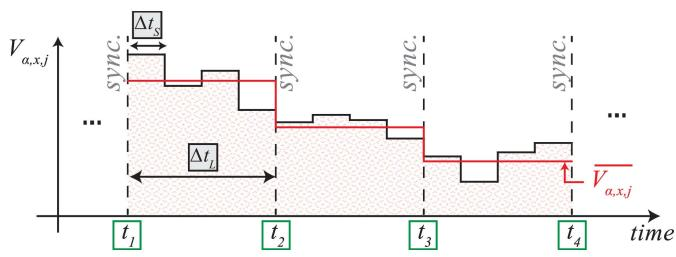  
Fig. 6. Instantaneous arm equivalent voltage updated in GPU at small time step size $\Delta t _ { S }$ and its average value over a large time step $\Delta t _ { L }$ sent to CPU.

When updating simulation results from small time step to large time step subsystems, using the instantaneous values at a single small time step instant will lead to simulation inaccuracy. For example, the fast changes of SM capacitor voltages and switching events in BS-side converter are not accounted for in the large time step subsystem. In order to ensure high simulation accuracy, instead of sending the instantaneous value of arm equivalent voltages, denoted as $V _ { \alpha , x , j }$ where $\alpha \in \{ p , n \}$ , the average value of arm equivalent voltage over the whole period of $\Delta t _ { L }$ is sent from the small time step to the large time step subsystems as

$$
\overline {{V _ {\alpha , x , j}}} (t + \Delta t _ {L}) = \frac {\sum_ {k = 1} ^ {n} V _ {\alpha , x , j} (t + k \Delta t _ {S})}{n} \tag {14}
$$

The averaged value of arm equivalent voltage ensures consistency between small and large time-step subsystems, where the time-averaged value and the instantaneous values produce the same integral despite different time step sizes. This is illustrated in Fig. 6, where the shaded area under the instantaneous curve is equal to the integral of the average value over a period of $\Delta t _ { L }$ .

# D. Switching Interpolation Technique

The EMT simulation of power electronic converters often employs fixed time-step solvers. Switching events may occur within two consecutive simulation time steps rather than on the time steps. This subsection proposes a switching interpolation technique for the MMC with integrated BESS. The proposed switching interpolation technique can provide accurate compensation of intra-step switching events to improve simulation accuracy and enable large simulation time steps.

The BESS-integrated HB-SM, shown in Fig. 4, is used as an illustrative example to derive the proposed switching interpolation method. Fig. 7(a)–(c) show the BS converter modulating and carrier signals as well as the switching functions, G and S of BS- and SM-side HB converters. The SM capacitor voltage and current can be derived using the BS- and SM-side switching functions and their AC-side currents, iBS and iSM . Without loss of generality, it is assuming that both switching functions S and G change from 0 to 1 at the time instants $t _ { z , S M }$ and $t _ { z , B S }$ respectively, between two successive simulation points, t and $t + \Delta t _ { S }$ . The analytical solution of SM capacitor voltage $v _ { C _ { S M } }$ is obtained from (15) and is shown as blue curve in Fig. 7(e).

$$
v _ {C _ {S M}} (t + \Delta t _ {S}) = v _ {C _ {S M}} (t) + \int_ {t} ^ {t + \Delta t _ {S}} \frac {i _ {C _ {S M}} (\tau)}{C _ {S M}} d \tau \tag {15}
$$

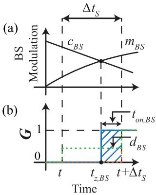

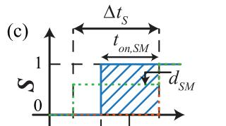

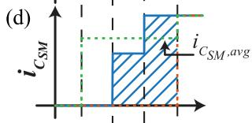

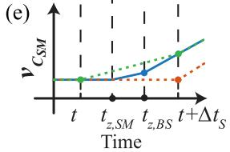  
Fig. 7. Switching interpolation technique. (a) BS-side modulation. (b) BS-side switching function. (c) SM-side switching function. (d) SM capacitor current. (e) SM capacitor voltage.

It is noted that the SM capacitor voltage can be represented using the average capacitor current in the interval [t, $t + \Delta t _ { S } ]$ as

$$
v _ {C S M} (t + \Delta t _ {\mathrm {S}}) = v _ {C S M} (t) + \frac {\Delta t _ {S}}{C _ {S M}} i _ {C S M, a v g} (t) \tag {16}
$$

The average capacitor current can be calculated using the shaded area in Fig. 7(d) and is expressed as

$$
i _ {C S M, a v g} (t) = d _ {B S} i _ {B S} (t) + d _ {S M} i _ {S M} (t) \tag {17}
$$

As shown in Fig. 7(b) and (c), the duty ratios of the BS- and SM-side HB converters, $d _ { B S }$ and $d _ { S M }$ are expressed as

$$
\left\{ \begin{array}{l} d _ {B S} = \frac {t _ {o n , B S}}{\Delta t _ {S}} \\ d _ {S M} = \frac {t _ {o n , S M}}{\Delta t _ {S}} \end{array} \right. \tag {18}
$$

where $t _ { o n , B S }$ and $t _ { o n , S M }$ are the switch ON-time within the small time-step $\Delta t _ { S }$ for BS- and SM-side converters, respectively. Given $t _ { o n , B S }$ and $t _ { o n , S M }$ , the average capacitor current $i _ { C _ { S M } , a v g }$ and the capacitor voltage $v _ { C _ { S M } } ( t + \Delta t _ { \mathrm { S } } )$ are calculated in (17) and (16) and are illustrated in Fig. 7(d) and (e) using green curves.

The conventional fixed-step solver can only represent the two switching events at the incoming integer time step, i.e., $t + \Delta t _ { S }$ . Consequently, the SM capacitor DC current and voltage are kept constant until $t + \Delta t _ { S }$ , as shown by the red curves in Fig. 7(d) and (e). Hence, the conventional numerical solver is not able to precisely represent the SM DC capacitor voltage change due to the intra-time-step switching events, which leads to accumulated numerical errors, as will be shown in Section V Simulation Studies.

In order to calculate $t _ { o n , B S }$ and $t _ { o n , S M }$ , the zero crossing/ switching time instants of $t _ { z , B S }$ and $t _ { z , S M }$ are required. Let’s take the calculation of $t _ { z , B S }$ as an example. The zero-crossing time of the switching signal $G \left( \mathrm { i } . \mathrm { e } . , t _ { z , B S } \right.$ , shown in Fig. 7) is

calculated using linear interpolation of the modulation signal mBS and carrier wave $c _ { B S }$ within the time interval [t, $t + \Delta t _ { S } ]$ as

$$
t _ {z, B S} = \frac {\Delta t _ {S}}{1 - r _ {B S}} + t \tag {19}
$$

where

$$
r _ {B S} = \frac {m _ {B S} (t + \Delta t _ {S}) - c _ {B S} (t + \Delta t _ {S})}{m _ {B S} (t) - c _ {B S} (t)} \tag {20}
$$

In (20), $m _ { B S } ( t )$ , $m _ { B S } ( t + \Delta t _ { S } ) , c _ { B S } ( t )$ and $c _ { B S } ( t + \Delta t _ { S } )$ are the BS-side converter modulation and carrier signal values at t and $t + \Delta t _ { S } .$ , respectively. The formula in (19) is a generalized solution for $t _ { z , B S }$ and holds true, irrespective of the relation between modulation signal and carrier wave. Hence, the switch ON-time $t _ { o n , B S }$ is expressed as

$$
t _ {o n, B S} = \left\{ \begin{array}{c} t + \Delta t _ {S} - t _ {z, B S}, m _ {B S} (t + \Delta t _ {s}) > c _ {B S} (t + \Delta t _ {s}) \\ t _ {z, B S} - t, m _ {B S} (t + \Delta t _ {s}) <   c _ {B S} (t + \Delta t _ {s}) \end{array} \right. \tag {21}
$$

Similar to (19)–(21), $t _ { o n , S M }$ can be derived for the SM-side converter.

It is noted that the proposed switching interpolation method can also be used for the BS-side inductor, $L _ { B S }$ . The effect of intra-step switching of the BS-side converter on the inductor $L _ { B S }$ is compensated using the fast average of AC output voltage vBS , during the time interval [t, $t + \Delta t _ { S } ]$ as

$$
v _ {B S, a v g} = d _ {B S} v _ {C S M} \tag {22}
$$

Therefore, the AC output voltage of the BS-side converter is represented by the switching function G and SM capacitor voltage $v _ { C _ { S M } }$ as

$$
v _ {B S} = \hat {G} v _ {C _ {S M}} \tag {23}
$$

where the extended switching function $\hat { G } = 0 , 1$ , or $d _ { B S } ,$ depends on the comparison result of the modulation signal, $m _ { B S } ( t )$ and the carrier signal, $c _ { B S } ( t )$ , and if switching event occurs at the present time step. Thus, the BS-side equivalent voltage sources in (6) are updated as

$$
v _ {B S} = V _ {p, B S} = V _ {n, B S} = \hat {G} v _ {C _ {S M}} \tag {24}
$$

The switching interpolation can also be applied to the cascaded SMs of the MMC arms. It is assuming a level-shifted PWM scheme is used for an MMC arm. The arm voltage insertion index is compensated using a duty ratio at each voltage level transition, as shown by the green dotted lines in Fig. 8. The switch ON-time, e.g., $t _ { 1 o n }$ and the zero-crossing instant, $t _ { 1 z }$ within the time interval $[ t _ { 1 } , t _ { 1 } + \Delta t _ { L } ]$ are calculated using linear interpolation of the modulation signal $m _ { a r m }$ and carrier wave $c _ { i , a r m }$ , similar to the BS-side switching interpolation. It is noted that the switching interpolation of the converter arms is carried out in large time step $\Delta t _ { L }$ .

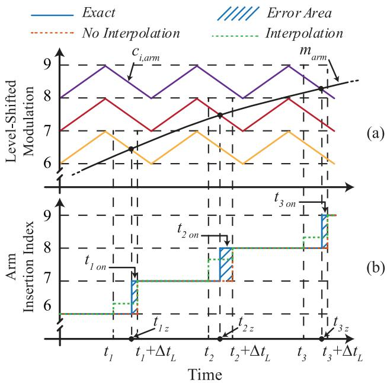  
Fig. 8. Switching interpolation technique for SM-side converter. (a) Levelshifted modulation. (b) Arm insertion index.

The individual switching function of each SM is obtained from the MMC’s voltage balancing control and sorting algorithm. The switching duty ratio is used to compute the SM’s AC output voltage after each time step of the voltage level transition. The formulation of average output voltage of a SM for the MMC arm is similar to that of BS-side in (22). Consequently, intra-step switching of the multilevel SMs at each voltage level is accurately compensated by the proposed switching interpolation technique.

# E. Battery Modeling

In the proposed BESS-integrated MMC modeling, the Shepherd’s battery model is used to represent the change of voltage according to the state-of-charge (SOC) [34]. The Shepherd’s battery model can simulate the non-linearities in the attenuation of voltage with the discharging level and the Ampere-hour available in the battery. The Shepherd’s model is expressed as:

$$
v _ {t, B S} = E _ {B S} - K \frac {Q _ {f u l l}}{Q _ {f u l l} - \int i _ {B S} (t) d t} + A e ^ {- B \int i _ {B S} (t) d t} \tag {25}
$$

$$
E _ {B S} = V _ {\text {f u l l}} + K + R _ {B S} i _ {\text {n o m}} - A \tag {26}
$$

where $v _ { t , B S }$ is the terminal voltage of the battery; $Q _ { f u l l }$ and $V _ { f u l l }$ are the maximum capacity and the corresponding voltage; A, B and K are constants to fit the battery chemistry. The nominal discharge current is denoted as $i _ { n o m }$ .

# III. CPU-GPU COMPUTING PLATFORM

The MMC test system may contain up to hundreds of SMs per arm, resulting in a vast number of possible states ranging from hundreds to thousands. In addition, incorporating high switching frequency converter energy storage systems into the

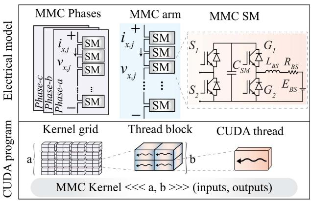  
Fig. 9. EMT program mapping of electrical model to CUDA C/C++ kernel elements.

MMC imposes significant challenges on simulation algorithm and computational resources. Therefore, a large computational power is substantial to enable parallel and multi-rate simulation in these systems. A heterogenous computing system that comprises a combined CPU-GPU architecture provides computational capacity required for the efficient simulation of the MMC with integrated BESS.

# A. Heterogeneous Computing System Architecture

Intel-i7 16 GB-RAM CPU is utilized alongside NVIDIA Turing GeForce RTX-2060 to form the hybrid CPU-GPU computing system. The GPU has 1920 CUDA cores, and 6 GB global memory (GDDR6) with 1750 MHz clock speed. All modern GPUs use single instruction multiple data (SIMD) stream architecture, which in turn enables an enormous parallel processing capability for the simulation of BESS- integrated MMC. Fig. 9 illustrates the mapping of different electrical components to CUDA program. The EMT program launches different kernel grids to process different MMC arms at the same time. Each MMC arm is simulated with one thread-block on a different streaming multiprocessor, where each block contains a maximum of 1024 threads. Finally, each thread carries out the computations for a single submodule on a single CUDA core.

# B. Hybrid CPU-GPU EMT Solver

Task management is one of the major steps in designing the EMT program. In each time step, the GPU global memory is synchronized with the CPU main memory. Although the communication between CPU and GPU is carried out through high bandwidth buses (PCIe), frequent data exchange results in time delay of the EMT program execution. The proper selection of tasks on each processing unit of the heterogenous computing system, helps reduce the idle time of multiprocessors in both the CPU and GPU. Moreover, the parallel tasks assigned to the GPU should be carefully chosen in order to achieve high occupancy factors, i.e., achieve a higher ratio of the active warps to the total maximum number of warps in the streaming multiprocessors of the GPU. At the beginning of the simulation, variables initializations and memory subroutines are carried

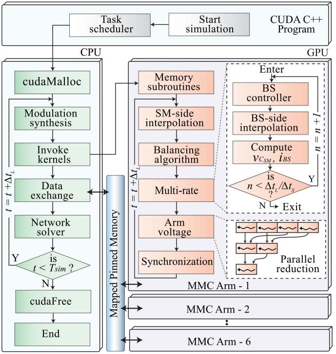  
Fig. 10. Flowchart of BESS-integrated MMC model in CUDA-based simulation program.

out for both CPU and GPU as illustrated in Fig. 10. Then, computations with sequential nature are executed on the CPU due to its efficient serial processing with minimal delay. Thus, the synthesis of modulation signal, nodal-based network solution and arm current calculations take place on the main thread of the host machine.

Therefore, all tasks with parallel nature are moved to the GPU to achieve high computing efficiency. Switching interpolation and multi-rate processing of SMs are mapped to hundreds or thousands of CUDA cores to calculate capacitor voltages and BESS inductor currents. In the EMT program, CUDA kernels are called on different CUDA streams to allow parallel processing of the MMC arms. To achieve high occupancy of the GPU, the EMT program calls 6 CUDA kernels for each MMC, i.e., one kernel per arm. Each kernel launches a grid of one thread block. Each thread block contains a number of threads that is equal to or higher than the number of SMs per arm. Although some threads might be idle during the execution of kernels, the optimal speed is achieved when number of threads per block (blockDim) is a multiple of 32 and is expressed as:

$$
b l o c k D i m = 3 2 * 2 ^ {m} \tag {27}
$$

where m is a non-negative integer. Therefore, the number of threads per block is chosen as 32, 64 or 512 threads per block.

# IV. SIMULATION STUDIES

The accuracy and efficiency of the proposed D-DEM is validated against a DM using Simulink/Simscape toolbox with 1 µs time step. In addition, the accuracy of the Simulink reference model is cross-validated by PSCAD/EMTDC. The comparison

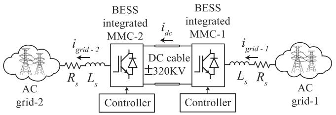  
Fig. 11. MMC-based HVDC network.

shows a perfect match between the Simulink reference model and its counterpart in PSCAD/EMTDC with a Relative Root Mean Square Error (RRMSE) of less than 0.01%. Fig. 11 shows the two-terminal MMC test system used in this study.

The MMCs are assumed to have 10 SMs per arm in Subsections (A)–(F) for numerical accuracy validation. In Section (G), large numbers of SMs per arm are used to demonstrate the numerical advantage of the proposed model. The EMT model of the test system is programmed using NVIDIA CUDA C language. The proposed switching interpolation and multi-rate simulation method are implemented in the proposed model. A large time step of 20 µs and a small time step of 5 µs are used for the network and the BESS subsystems, respectively. The reference solution is obtained using the Simulink DM with a time step of 1 µs.

# A. Normal Operation of the MMC HVDC System

The accuracy of the proposed BESS-integrated MMC D-DEM implemented on the CPU-GPU platform is evaluated under normal operating conditions as in Fig. 12. The results obtained from the proposed D-DEM is compared to the following different implementations of the same HVDC system: (i) a reference model implemented in Simulink/Specialized Power System toolbox with a time step of 1 µs (Reference 1 µs), (ii) the D-DEM without switching interpolation and with 20 µs time step for all subsystems (D-DEM 20 µs w/o SI), (iii) the D-DEM without switching interpolation and with 5 µs time step for all subsystems (D-DEM 5 µs w/o SI), (iv) the C-DEM without switching interpolation and with 5 µs time step for all subsystems (C-DEM 5 µs w/o SI), (v) the D-DEM with switching interpolation and with 20 µs time step for all subsystems (D-DEM 20 µs w SI), (vi) the proposed D-DEM with switching interpolation and with 20 µs time step for the network and 5 µs time step for SM capacitor and BESS converter subsystem (D-DEM 20&5 µs w SI).

Fig. 12(a) and (b) depict the arm voltage and grid current of all models, while Fig. 12(c) shows a sample battery current for a submodule in one of the phases at MMC-1. Fig. 12(d) illustrates the summation of capacitor voltages of all models for one of the phases at MMC-1. It is observed in Fig. 12 that the proposed D-DEM with multi-rate and switching interpolation techniques achieves superior numerical accuracy, compared to the other models.

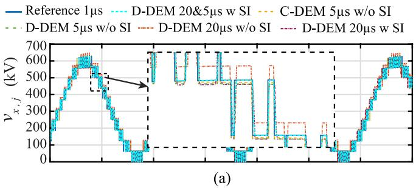

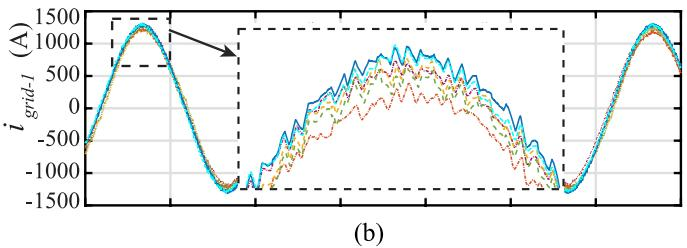

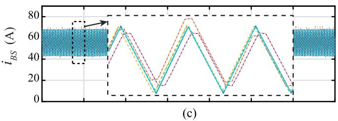

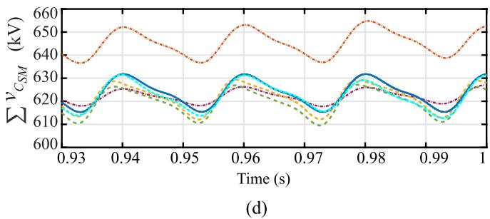  
Fig. 12. Comparison of different models at normal operation. (a) Arm voltages at MMC-1. (b) Source current at Phase-a at MMC-1. (c) Battery current of the 1st SM in Phase-a of MMC-1. (d) Summation of SMs capacitor voltages at Phase-a at MMC-1.

# B. Three-Phase AC-side Fault

In order to further evaluate the proposed model under extreme grid conditions, a three-phase-to-ground fault is presented in this case study. A three-phase-to-ground fault is applied at the AC terminal of the MMC-1 at t = 0.7 s. Upon the short-circuit fault detection, the active-power reference is reduced to limit AC fault current. Following the clearance of the three-phase fault at $t = 0 . 8 ~ \mathrm { s } .$ , the real power is restored to the nominal value. The proposed D-DEM 20&5 μs w SI is benchmarked against the 1 µs reference EMT model. Fig. 13 depicts the dynamic responses produced by both models. Voltage sags appear at the PCC and across the converter arms as shown in Fig. 13(a) and (b). The Phase-a upper arm current exhibits fast transients at fault inception, as shown in Fig. 13(c). The sum of SM capacitor voltages dips temporarily during the short-circuit fault, as depicted in Fig. 13(d). After the fault clearance, the exchanged

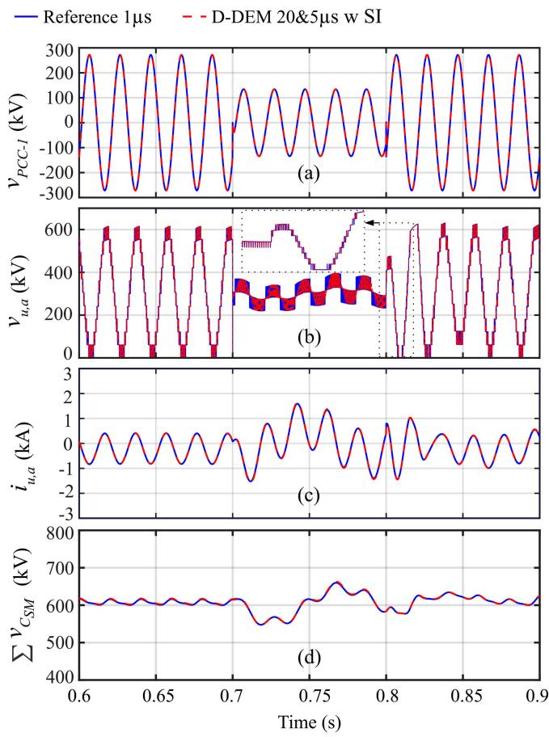  
Fig. 13. Simulation results of three-phase short-circuit fault in AC side at MMC-1. (a) PCC voltage at MMC-1. (b) Arm voltage of Phase-a upper arm at MMC-1. (c) Arm current of Phase-a upper arm at MMC-1. (d) Summation of SM capacitor voltages of Phase-a upper arm at MMC-1.

power recovers while the SM capacitor voltages gradually return to their rated values. It is observed in Fig. 13 that the proposed model matches closely the small time-step reference model.

# C. Single-Phase Line-to-Ground Fault

To extend the model validation beyond balanced grid conditions, an unbalanced single-phase-to-ground fault is presented in this case study. The single-phase fault is applied in Phase-a at the AC terminal of the MMC-1 at t = 0.7 s, while keeping the realpower reference constant. The proposed D-DEM 20&5 μs with SI is benchmarked against the 1 µs reference EMT model. Fig. 14 illustrates the transient responses by the models. AC voltage sags appear at the Point of Common Coupling (PCC) of MMC-1, as shown in Fig. 14(a). The DC-link voltage of the MMC-1 experiences transient oscillations, depicted in Fig. 14(b). The arm voltage and current transients are shown in Fig. 14(c) and (d). After the single-phase fault is cleared at $t = 0 . 8 ~ \mathrm { s } .$ , the MMC-1 gradually returns to its pre-fault operating condition. It is observed in Fig. 14, the proposed model closely matches the small time-step reference model, verifying its modeling accuracy for severe or unbalanced grid operation cases.

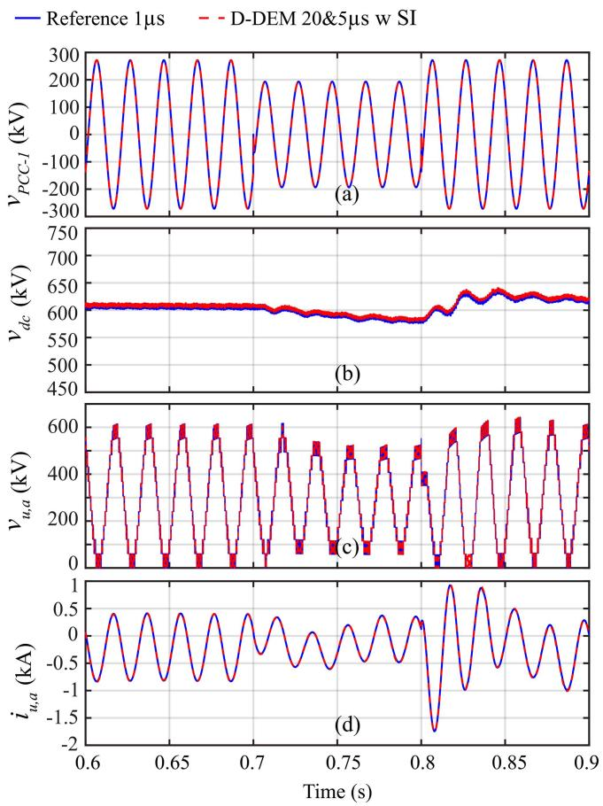  
Fig. 14. Simulation results of single-phase-to-ground fault in Phase-a at MMC-1. (a) PCC voltage at MMC-1. (b) DC voltage. (c) Arm voltage of Phase-a upper arm at MMC-1. (c) Arm current of Phase-a upper arm at MMC-1.

# D. DC-Side Fault Operation

This subsection demonstrates the proposed multi-rate D-DEM can represent the blocking mode operation of the BESSintegrated MMC. A short-circuit fault occurs at $t = 0 . 8 ~ \mathrm { s }$ in the HVDC system at the DC side connecting MMC-1 and MMC-2. The DC fault lasts until the end of simulation time. Fig. 15(a) shows the dynamic behavior of the upper and lower arm currents of the MMC-1. Fig. 15(b) shows capacitor voltage of one SM from each phase at MMC-1 during IGBT blocking operation. The SM capacitors maintain a constant voltage during the DC fault. Moreover, the IGBT switches of the BESS-side converter are blocked, and the battery current drops to zero as shown in Fig. 15(c) in order to prevent over charging or discharging of the batteries. Fig. 15(d) presents the dynamic behavior of arm voltages of the three phases at MMC-1.

# E. BESS Real Power Change

To further assess the proposed multi-rate D-DEM, a scenario is conducted in which a step change is applied to the BESS power reference at both MMC-1 and MMC-2. A step change, from 100 MW to 200 MW, is applied at $t = 0 . 9 \mathrm { ~ s ~ }$ to the real power reference of BESS at both terminals. Fig. 16(a) shows the battery currents of the 1st SMs of Phase-a of BESS installed at MMC-1 and MMC-2 at both terminals. As the real power

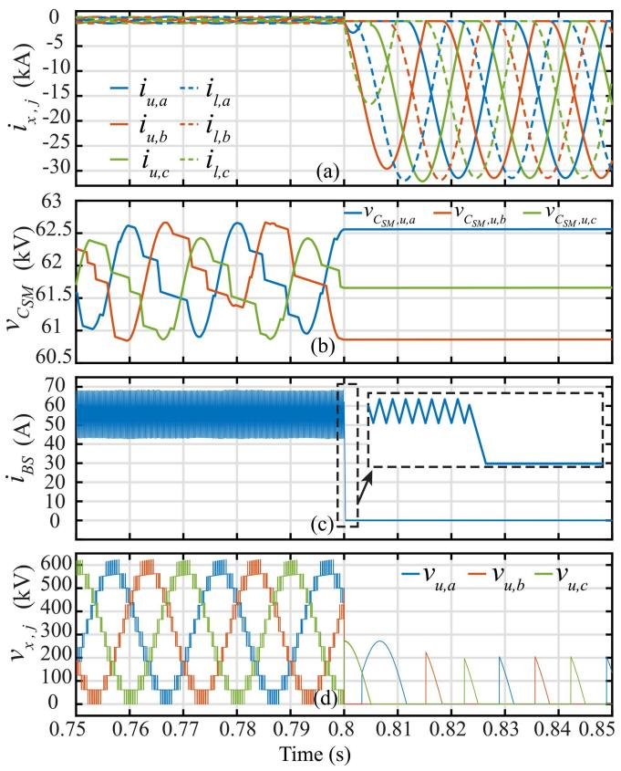

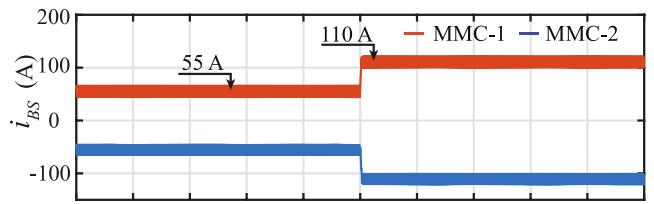  
Fig. 15. Simulation results of DC fault. (a) Arm current of MMC-1. (b) Capacitor voltage of one SM from each phase at MMC-1. (c) Battery current of the 1st SM of Phase-a at MMC-1. (d) Arm voltages at MMC-1.

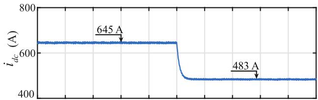  
(a)

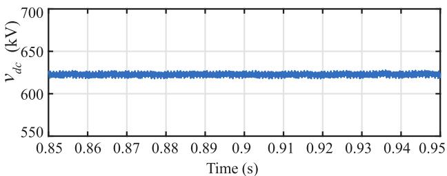  
(b)   
  
Fig. 16. Simulation results of step change of BESS real power reference. (a) Battery current of 1st SMs of Phase-a at MMC-1 and MMC-2. (b) Current of DC cable. (c) DC voltage across the DC cable.

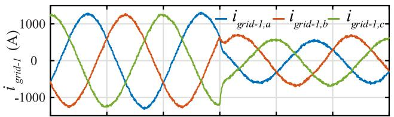  
(a)

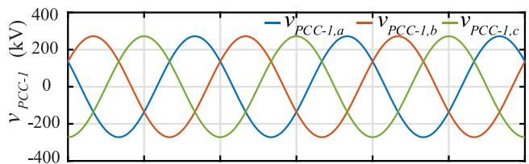  
(b)

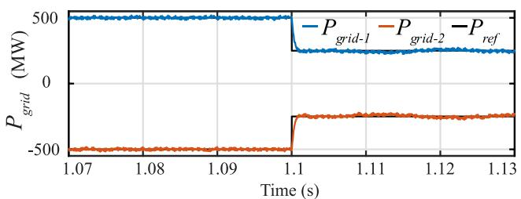  
（c）  
Fig. 17. Simulation results of step change of AC grid real power. (a) grid current at MMC-1. (b) MMC-1 PCC voltage. (c) Real power at MMC-1 and MMC-2.

reference of the BESS is stepped up, the real power transmitted from terminal-1 to terminal-2 decreases as demonstrated by the DC cable current shown in Fig. 16(b). Meanwhile, the DC cable voltage is maintained constant, as depicted in Fig. 16(c).

# F. AC Grid Real Power Change

The same setup in case A is used in this test except for a real power reference step-change in AC grids at both ends. At t = 1.1 s, the real power reference of the AC grid is stepped down from 500 MW to 250 MW. Fig. 17(a) depicts the dynamics of the source current at MMC-1 from 1225 A to 620 A. Fig. 17(b) and (c) depict the voltage at point of common coupling (PCC) at MMC-1 and real power at both ends.

# G. Numerical Efficiency of Proposed CPU-GPU D-DEM

To further assess the efficiency of the proposed CPU-GPU D-DEM with multi-rate simulation (D-DEM 20&5 µs) is evaluated in this subsection. The CPU-only D-DEMs, with single and multi-rate simulations are implemented for benchmark comparison purposes. The switching interpolation technique is implemented in all the D-DEMs. The conventional C-DEM with a time step of 5 µs is also implemented for comparison with the proposed D-DEMs. All models are implemented in C-language and compiled in Microsoft Visual Studio. The same Intel-i7 CPU and NVIDIA GPU (GeForce RTX-2060) are used as in Section IV-A.

TABLE I NUMERICAL EFFICIENCY OF VARIOUS MODELS   

<table><tr><td>Ncell</td><td>C-DEM5μs(CPU)</td><td>D-DEM5μs(CPU)</td><td>D-DEM20&amp;5μs(CPU)</td><td>D-DEM20&amp;5μs(CPU-GPU)</td><td>Speed-upD-DEM20&amp;5μsCPU/CPU-GPU</td></tr><tr><td>10</td><td>119.81</td><td>83.50</td><td>48.48</td><td>9.70</td><td>4.99</td></tr><tr><td>40</td><td>345.98</td><td>162.20</td><td>127.70</td><td>10.30</td><td>12.40</td></tr><tr><td>200</td><td>1634.87</td><td>628.06</td><td>583.88</td><td>12.64</td><td>44.27</td></tr><tr><td>400</td><td>3110.78</td><td>1121.70</td><td>1109.20</td><td>14.01</td><td>79.23</td></tr></table>

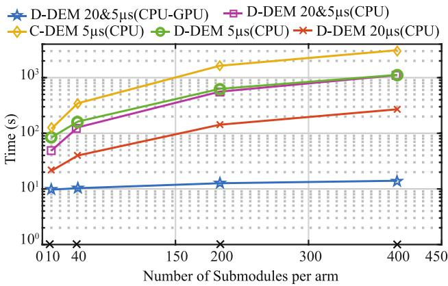  
Fig. 18. Performance analysis of different models.

The simulation time of the EMT program of the system shown in Fig. 11 is set to 1 s for all models. Different numbers of SMs per arm are used to test the efficiency of the models. The execution times of conventional C-DEM and the new D-DEMs are summarized in Table I. The speed-up ratios of the proposed hybrid CPU-GPU D-DEM 20&5 µs over its CPU version are also listed in Table I.

It is shown in Table I that all three D-DEMs achieve higher simulation efficiency, compared to the conventional C-DEM due to the constant G matrix and reduced number of SM nodes of the D-DEMs in the EMT simulation. The speed up ratios of the D-DEM over C-DEM with the same time step of 5 µs for different SM numbers per arm are ranging from 1.42 (for 10 SMs per arm) to 2.77 (for 400 SMs per arm). The D-DEM with multirate simulation (i.e., D-DEM 20&5 µs CPU) further improve the speed up ratios to 2.47 and 2.81, respectively. Compared to the D-DEM 20&5 µs on CPU, the proposed hybrid CPU-GPU D-DEM 20&5 µs significantly improves the simulation efficiency with the speed up ratio of 79.23 for the BESS-integrated MMC with 400 SMs per arm.

In order to further illustrate the simulation efficiency performance of various models, the execution time of each model vs. submodule number per arm is plotted in Fig. 18 on a semi-log scale. It is observed in Fig. 18 that the proposed hybrid CPU-GPU D-DEM achieves much accelerated simulation speed, compared to all the other models. It is also noted from Fig. 18 that the CPU implementations of the D-DEM 20&5 µs is faster than the D-DEM 5 µs for low numbers of SMs. When the SM numbers are increased (e.g., 400 SMs per arm), the simulation

TABLE IIRRMSE OF ARM CURRENTS WITH DIFFERENT EXTRAPOLATION METHODS INMULTI-RATE SIMULATION FOR REAL POWER CHANGE SCENARIO  

<table><tr><td>Time step-size</td><td>ZOH</td><td>Linear</td><td>Quadratic</td></tr><tr><td>10&amp;5μs</td><td>0.34 %</td><td>0.38 %</td><td>0.37 %</td></tr><tr><td>20&amp;5μs</td><td>0.45 %</td><td>0.55 %</td><td>0.53 %</td></tr><tr><td>40&amp;5μs</td><td>0.73 %</td><td>0.92 %</td><td>0.92 %</td></tr></table>

efficiency gains are minimal (1121.70 s vs.1109.20 s as shown in Table I). This is because most of the computational burdens are on SM capacitors and BS-converters for the two-terminal HVDC system. Thus, hybrid CPU-GPU platform plays more important role in improving simulation efficiency than the use of multi-rate simulation for the MMC with a large number of SMs.

As the number of SMs per arm increases $( N _ { c e l l } =$ 10, 40, 200 and 400 SMs/arm), the execution time of the CPUbased C-DEM and the D-DEM grow linearly, whereas the GPUaccelerated D-DEM exhibits a small, largely constant overhead (9.70 s, 10.30 s, 12.64 s, and 14.01 s), yielding speed-ups that rise from approximately 5-folds to 79-folds. The use of GPU simulation provides the most gain on simulation efficiency by improving occupancy and amortizing launch/transfer costs. These trends indicate near-linear speed-up growth with the number of SMs per arm $N _ { c e l l }$ , and suggest that the MMCs with large numbers of SMs predominantly benefit from the GPU simulation. Additionally, the GPU speed-up can be achieved in two different angles. The first speed-up mechanism arises from exposing more independent parallel computing work, e.g., SMs or converter arms, so that more GPU threads/blocks run concurrently. The second speed-up measure is to improve the per-task efficiency on fixed hardware and workload, via higher occupancy, memory coalescing and shared-memory tiling, kernel fusion, reduced synchronization, or concurrent CUDA streams to cut per-time-step latency.

# V. DISCUSSION

# A. Linear and Quadratic Extrapolation in Multi-Rate Simulation

This subsection discusses quantification of the arm current errors between the proposed multi-rate model and the small time-step reference model by calculating the RRMSE as

$$
\begin{array}{l} R R M S E = \\ \sqrt{\frac{\frac{1}{n}\sum_{t_{k = 1}}^{t_{k = n}}\left(X _{r e f}\left(t_{k}\right) - X _{m u l t i - r a t e}\left(t_{k}\right)\right)^{2}}{\frac{1}{n}\sum_{t_{k = 1}}^{t_{k = n}}\left(X _{r e f}\left(t_{k}\right)\right)^{2}}}\times 100\% \tag{28} \\ \end{array}
$$

The accuracy comparison of the dynamic extrapolation strategy (e.g., linear extrapolation of the arm current $i _ { x , j } )$ versus the constant/Zero-Order-Hold (ZOH) method is discussed in this subsection and summarized in Table II. In addition, the 2nd-order extrapolation of the arm current $i _ { x , j }$ is used to further evaluate the proposed multi-rate method.

TABLE IIIRRMSE OF ARM CURRENTS OF THE MMC D-DEM IN DIFFERENTSIMULATION SCENARIOS  

<table><tr><td>Arm Current</td><td>Normal operation</td><td>Real Power Change</td><td>DC Fault</td></tr><tr><td>iu,a</td><td>0.37 %</td><td>0.47 %</td><td>0.33 %</td></tr><tr><td>il,a</td><td>0.33 %</td><td>0.42 %</td><td>0.34 %</td></tr><tr><td>iu,b</td><td>0.33 %</td><td>0.43 %</td><td>0.30 %</td></tr><tr><td>il,b</td><td>0.35 %</td><td>0.45 %</td><td>0.27 %</td></tr><tr><td>iu,c</td><td>0.44 %</td><td>0.52 %</td><td>0.35 %</td></tr><tr><td>il,c</td><td>0.32 %</td><td>0.40 %</td><td>0.26 %</td></tr><tr><td>Average</td><td>0.35 %</td><td>0.45 %</td><td>0.31 %</td></tr></table>

Keeping the CPU-side interfacing variables constant over the large time-step $\Delta t _ { L }$ may introduce dynamic-coupling error during fast transients. Therefore, quantification of the RRMSE of the arm current $i _ { x , j }$ against a small-step reference is presented in this subsection for a real power change scenario. Three interfacing strategies are compared: constant/ZOH $i _ { x , j }$ , linear interpolation of $i _ { x , j } .$ , and quadratic extrapolation of $i _ { x , j }$ . It is shown in the extensive EMT simulation case studies that the constant/ZOH $i _ { x , j }$ produces slightly lower RRMSE for power change scenario in Table II. The reason is that the arm currents are non-smooth functions with slope changing instantaneously at switching time instants. Since polynomial extrapolation assumes smooth functions, extrapolation overshoots may occur immediately after switching operations, which over- or under-estimate the arm currents flowing into the SMs for the small time-step simulation. However, the difference of RRMSE among different extrapolation methods are small, as shown in the Table II for real power change scenario with different simulation time steps of $\Delta t _ { L } = 1 0 \mu \mathrm { s }$ , $\Delta t _ { L } = 2 0 \mu \mathrm { s } .$ , or $\Delta t _ { L } = 4 0 \mu \mathrm { s }$ for the large time step subsystem and $\Delta t _ { S } = 5 \mu \mathrm { s }$ for the small time step subsystem.

# B. Quantitative Evaluation of Model Accuracy

This subsection presents more quantitative comparison of accuracy metrics between models beyond visual waveform comparison. Table III reports the RRMSE of the upper and lower arm currents under normal operation, real-power step, and DC-fault scenarios. Across all MMC arms and all scenarios, the RRMSE remains below 0.52%, with averages of 0.35%, 0.45%, and 0.31% for normal, real power change, and DC-fault scenarios. The real-power change yields the largest deviation (peak 0.52% for $i _ { u . c } )$ , whereas the DC-fault case attains the lowest error (minimum 0.26%). As noted in Table III, the RRMSE variations are minimal. This indicates that the proposed model predicts both steady-state and transient arm currents with high accuracy.

# C. Switching Interpolation and 3rd Order Harmonics Injection

In order to verify the proposed linear interpolation method for non-linear modulation signals, more test cases with 3rd-order harmonic injection in the modulation signals are included, as shown in Fig. 19. The arm voltage modulating signals, $\mathrm { e . g . , } m _ { u , a }$ has larger nonlinear distortion near the top of the modulation waves. However, the zero-crossing timing error near the top of

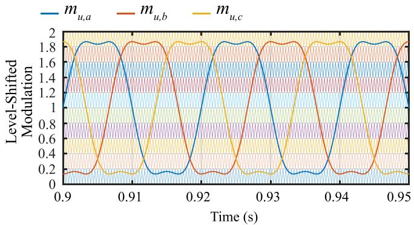

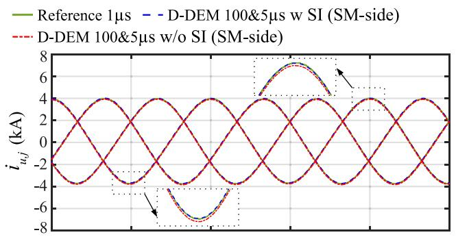  
Fig. 19. Level-shifted carriers and modulation with $3 ^ { \mathrm { r d } }$ order harmonic injection.

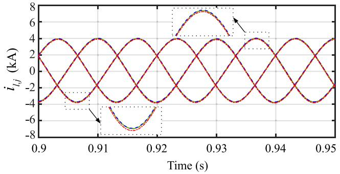  
(a)   
(b)   
Fig. 20. Simulation results of $3 ^ { \mathrm { r d } }$ order harmonic injection. (a) Upper arm currents of the three phases at MMC-1. (b) Lower arm currents of the three phases at MMC-1.

the modulation waves leads to insignificant modeling error since each voltage level change (i.e., vCSM of a few kV) is much smaller than the DC-side voltage (i.e., hundreds of kV) of the MMC.

The non-linear modulation with 3rd-order harmonic injection is used for this case study, in which the proposed D-DEMs with and without linear switching interpolation at the MMC SM-side are compared to the small time-step reference model. The switching interpolation is always implemented for the highfrequency DC-DC converters at the BESS side using small time step of $\Delta t _ { S } = 5$ μs for both D-DEM with or without switching interpolation at SM side. It is shown in Fig. 20(a) and (b) that the arm currents (both upper and lower arms) of the three phases match the small time-step reference solution very well for the

TABLE IV RRMSE OF ARM CURRENTS WITH 3RD ORDER HARMONIC INJECTION IN MMC WITH AND WITHOUT SI AT SM-SIDE CONVERTER   

<table><tr><td>Arm Current</td><td>with SI at SM-side</td><td>w/o SI at SM-side</td></tr><tr><td>iu,a</td><td>0.13 %</td><td>0.25 %</td></tr><tr><td>il,a</td><td>0.14 %</td><td>0.28 %</td></tr><tr><td>iu,b</td><td>0.15 %</td><td>0.25 %</td></tr><tr><td>il,b</td><td>0.14 %</td><td>0.26 %</td></tr><tr><td>iu,c</td><td>0.10 %</td><td>0.25 %</td></tr><tr><td>il,c</td><td>0.10 %</td><td>0.23 %</td></tr><tr><td>Average</td><td>0.12 %</td><td>0.25 %</td></tr></table>

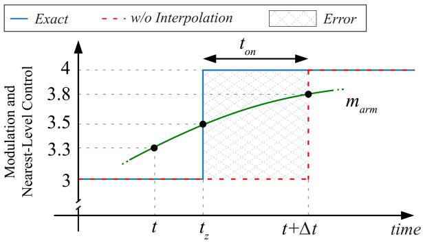  
Fig. 21. Nearest-level modulation with switching interpolation.

large time step subsystem $\Delta t _ { L } = 1 0 0 \mu \mathrm { s }$ at the SM-side. The RRMSE of the proposed D-DEM with multi-rate simulation is summarized in the Table IV. The RRMSE comparison shows that the switching interpolation can help achieve better accuracy than those models without SI at the SM-side. However, the simulation accuracy improvement due to switching interpolation at the SM side is not significant, since the SM-side converter has a low switching frequency. On the other hand, at the high frequency DC-DC converter and BESS side, the switching interpolation is critical to capture the dynamics of fast switching events and to improve simulation accuracy as shown in Fig. 12.

# D. Nearest-Level Modulation With Switching Interpolation

This subsection discusses the application of switching interpolation technique presented in Section II-D to nearest-level modulation (NLM) in the SM-side converter of the MMC. In the NLM, the converter arm voltage reference is quantized to the nearest staircase level. When NLM is used, a rounding function of the modulation signal determines the exact switching time. When a very small simulation time-step is used, the voltage level change occurs at the time instant $\cdot t _ { z }$ when the round-off boundary of 3.5 is met for example, as shown in Fig. 21. However, when a large simulation time-step is used, the voltage level transition may occur at the time step $t + \Delta t ,$ instead of the exact switching moment $t _ { z } .$ . In Fig. 21, assuming the arm modulating signal $m _ { a r m } ( t )$ is linear function within the time step [t, $t + \Delta t ] ,$ the zero-crossing time $t _ { z }$ can be calculated from the intersection between the modulation signal $m _ { a r m } ( t )$ and the round-off boundary of 3.5. Therefore, the intra-time-step switching event, shown in Fig. 21 can be compensated by the proposed switching

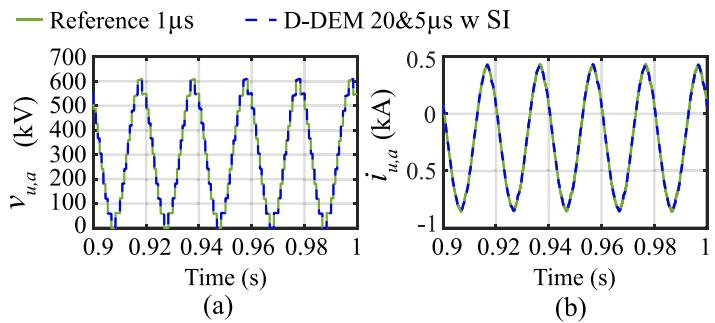  
Fig. 22. Simulation results with NLM. (a) Arm voltage of Phase-a upper arm at MMC-1. (b) Arm current of Phase-a upper arm at MMC-1.

interpolation method by calculating $t _ { o n }$ and the modulation duty ratio in (18), similar to Fig. 8. As depicted in Fig. 22, the arm voltage and arm current proposed by D-DEM 20&5 μs w SI match the reference model very well. This indicates that the linear interpolation can be used for the MMC with the NLM.

# E. GPU Global Memory Management for Prolonged Simulations

This subsection discusses the GPU global memory management in prolonged EMT-type simulations. It is important to prevent GPU memory from filling up by large matrices or vectors of historical terms of voltages and currents during long EMT simulations. Therefore, the GPU memory management strategies are critical to cope with limited global memory for large-scale EMT simulation of multilevel converters with large numbers of submodules and circuit components. Three caching replacement strategies can be used for GPU memory management [35]. Firstly, the Least Recently Used (LRU) strategy removes the item that has not been used for the longest time, depending on the assumption that recently used data is likely to be needed again soon. Secondly, the Least Frequently Used (LFU) strategy tracks how often the stored items are used and removes the ones used least frequently. This can work well when the system settles into steady state, but it may need extra sorting when many items share the same count. Thirdly, First-In First-Out (FIFO) strategy can be used as a simple baseline. As memory access patterns and hardware differ by case, the best strategy can be chosen pragmatically. Cache hit rate, i.e., the share of requests served from the cache, is often used as suitable metric to evaluate the suitable strategies when matrices or vectors are large and caches are relatively limited.

To further address long-duration simulations, the GPU implementation of the EMT models should avoid accumulating large-size historical vectors on the GPU device with limited global memory. The EMT solver should keep only the previous time-step history terms required by the single-step numerical integration solver. For kernel arguments and returns, page-locked (pinned) memories can be used to allow zero copy feature between the host and the device to enable faster read and write operations on both ends. The efficient use of the mapped pinned memory allows the co-simulation on the heterogenous

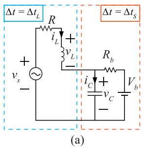

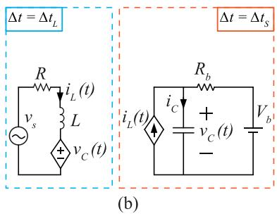  
Fig. 23. MMC arm circuits for numerical stability analysis. (a) MMC arm circuit. (b) Decoupled equivalent circuit in multi-rate simulation.

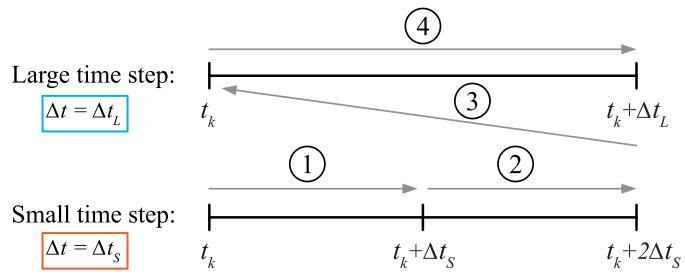  
Fig. 24. Sequential interfacing method of multi-rate simulation.

CPU-GPU platform with zero copy, minimal latency between the host and device, and can avoid main CPU thread blocking.

# F. Stability Analysis of Multi-Rate Simulation

This subsection discusses the system stability in multi-rate simulation. When interfacing the large and small time-step subsystems, the system numerical stability depends on the choice of the simulation time step sizes. It will be very instructive to derive the numerical stability criteria based on the system parameters $( R , L , C )$ and the chosen time step-sizes [36]. Without loss of generality, a single-phase BESS-integrated MMC with one SM per arm, is used in this subsection as an illustrative example for simplicity. The single-phase MMC can be further simplified into Fig. 23(a) by splitting upper and lower arm circuits, assuming the half DC-side voltages, i.e., $\frac { V _ { d c } } { 2 }$ are constant. In Fig. 23(a), the arm inductance and resistance are represented by L and R while the battery voltage and resistance are represented by $V _ { b }$ and $R _ { b }$ . In Fig. 23(a), the input voltage source $V _ { s } ( t )$ represents the MMC’s equivalent arm voltage. For the lower arm, $\begin{array} { r } { V _ { s } ( t ) = V _ { a } ( t ) + \frac { V _ { d c } } { 2 } } \end{array}$ ; For the upper arm, $\begin{array} { r } { V _ { s } ( t ) = \frac { V _ { d c } } { 2 } - V _ { a } ( t ) } \end{array}$ . Without loss of generality, it is assumed that the upper arm is used for the stability analysis of the multi-rate simulation. The SM is assumed to be inserted into the MMC upper arm with the battery connected to the SM capacitor, as shown in Fig. 23(a).

Now we discretize Fig. 23(a) using multi-rate simulation, as presented in Section II-C. The sequential interfacing method is used. For simplicity, we assume $\Delta t _ { L } = 2 \Delta t _ { S }$ in this illustrative example. The discretized circuit of Fig. 23(a) is shown in Fig. 23(b). The sequential interfacing method of the multi-rate simulation is shown in Fig. 24, where the 4 sequential solution steps in each synchronization window are illustrated.

It is noted that the two subsystems in Fig. 23(a) are decoupled via SM DC-link capacitor and arm inductor which have relatively large capacitance and inductance. The 4 solution steps are derived below. In the first step in Fig. 24, Forward Euler method is applied for the SM capacitor to decouple the two subsystems, and the capacitor voltage equation can be formulated as

$$
v _ {C} \left(t _ {k} + \Delta t _ {S}\right) = \left(1 - \frac {\Delta t _ {S}}{C R _ {b}}\right) v _ {C} \left(t _ {k}\right) + \frac {\Delta t _ {S}}{C} i _ {L} \left(t _ {k}\right) + \frac {\Delta t _ {S}}{C R _ {b}} V _ {b} \tag {29}
$$

In the second step in Fig. 24, the small time-step subsystem proceeds for one time-step simulation from $t _ { k } + \Delta t _ { S }$ to $t _ { k } +$ $2 \Delta t _ { S }$ . Assuming that arm current $i _ { L }$ is held constant for the small time-step subsystem (i.e., ZOH), the capacitor voltage can be derived as

$$
\begin{array}{l} v _ {C} \left(t _ {k} + 2 \Delta t _ {S}\right) = \left(1 - \frac {\Delta t _ {S}}{C R _ {b}}\right) ^ {2} v _ {C} \left(t _ {k}\right) + \left(2 - \frac {\Delta t _ {S}}{C R _ {b}}\right) \\ \frac {\Delta t _ {S}}{C} i _ {L} \left(t _ {k}\right) + \left(2 - \frac {\Delta t _ {S}}{C R _ {b}}\right) \frac {\Delta t _ {S}}{C R _ {b}} V _ {b} \tag {30} \\ \end{array}
$$

In the third step in Fig. 24, the average SM capacitor voltage for the interfacing with the large time-step subsystem is calculated and is derived as

$$
\begin{array}{l} \overline {{v _ {C}}} = \frac {1}{3} \left[ v _ {C} (t _ {k}) + v _ {C} (t _ {k} + \Delta t _ {S}) + v _ {C} (t _ {k} + 2 \Delta t _ {S}) \right] \\ = \left(1 - \frac {\Delta t _ {S}}{C R _ {b}} + \frac {\Delta t _ {S} {} ^ {2}}{3 C ^ {2} R _ {b} {} ^ {2}}\right) v _ {C} \left(t _ {k}\right) + \left(\frac {\Delta t _ {S}}{C} - \frac {\Delta t _ {S} {} ^ {2}}{3 C ^ {2} R _ {b}}\right) \\ \end{array}
$$

$$
i _ {L} \left(t _ {k}\right) + \left(\frac {\Delta t _ {S}}{C R _ {b}} - \frac {\Delta t _ {S} {} ^ {2}}{3 C ^ {2} R _ {b} {} ^ {2}}\right) V _ {b} \tag {31}
$$

In the fourth step in Fig. 24, the state equation of the large time step subsystem in continuous time domain is given as

$$
L \frac {d i _ {L}}{d t} = v _ {L} = V _ {S} - R i _ {L} - \overline {{v _ {C}}} \tag {32}
$$

where $\overline { { v _ { C } } }$ is calculated from the small time-step subsystem. The large time step subsystem in (32) is discretized using Trapezoidal Rule and the arm current is derived as

$$
\begin{array}{l} i _ {L} (t _ {k} + \Delta t _ {L}) = \frac {1}{1 + \frac {\Delta t _ {L} R}{2 L}} \left(1 - \frac {\Delta t _ {L} R}{2 L} - \frac {\Delta t _ {L}}{L} \right. \\ \times \left(\frac {\Delta t _ {S}}{C} - \frac {\Delta t _ {S} ^ {2}}{3 C ^ {2} R _ {b}}\right) i _ {L} (t _ {k}) \\ - \frac {1}{1 + \frac {\Delta t _ {L} R}{2 L}} \left(\frac {\Delta t _ {L}}{L} \left(1 - \frac {\Delta t _ {S}}{C R _ {b}} + \frac {\Delta t _ {S} ^ {2}}{3 C ^ {2} R _ {b} ^ {2}}\right)\right) v _ {C} (t _ {k}) \\ - \frac {\frac {\Delta t _ {L}}{L}}{1 + \frac {\Delta t _ {L} R}{2 L}} \left(\frac {\Delta t _ {S}}{C R _ {b}} - \frac {\Delta t _ {S} ^ {2}}{3 C ^ {2} R _ {b} ^ {2}}\right) V _ {b} \\ + \frac {\Delta t _ {L}}{2 L} \left(1 + \frac {\Delta t _ {L} R}{2 L}\right) ^ {- 1} \left[ V _ {S} \left(t _ {k}\right) + V _ {S} \left(t _ {k} + \Delta t _ {L}\right) \right] \tag {33} \\ \end{array}
$$

From (30) and (33), the system coefficient matrix A is obtained and further analyzed for the stability of the discrete statespace system. Assuming the $i ^ { t h }$ eigenvalue of the coefficient matrix A is $\lambda _ { i }$ , the discrete state-space system is stable if and only if $| \lambda _ { i } | < 1$ , as in [37]. Since A is very complicated, we first simplify A by ignoring $\Delta t _ { L } { } ^ { 2 }$ and $\Delta t _ { L } { } ^ { 3 }$ terms in the system coefficient matrix A as

$$
A \approx \left[ \begin{array}{c c} 1 - \frac {\Delta t _ {L} R}{2 L} & - \frac {\Delta t _ {L}}{L} \\ \frac {2 \Delta t _ {S}}{C} & 1 - \frac {2 \Delta t _ {S}}{C R _ {b}} \end{array} \right] = \left[ \begin{array}{c c} 1 - \frac {\Delta t _ {L} R}{2 L} & - \frac {\Delta t _ {L}}{L} \\ \frac {\Delta t _ {L}}{C} & 1 - \frac {\Delta t _ {L}}{C R _ {b}} \end{array} \right] \tag {34}
$$

Then, we can solve the eigenvalues of the coefficient matrix A, using

$$
\det \left| \lambda I - A \right| = 0 \tag {35}
$$

The numerical stability of the discrete state-space system is then expressed as

$$
\lambda_ {1, 2} = \left| 1 - \frac {\Delta t _ {L}}{4 \frac {L}{R}} - \frac {\Delta t _ {L}}{2 C R _ {b}} \right| <   1 \tag {36}
$$

It is observed from (36) that the choice of the time step $\Delta t _ { L }$ should be in such a way that the eigenvalues are less than 1 in absolute value. It is also observed that the larger the time constant of each decoupled circuit, $\mathrm { i } . \mathrm { e } . , L / R$ and $C R _ { b }$ , the larger the simulation time step $\Delta t _ { L }$ can be chosen. This also justifies the choice of interface location at the arm inductor L and the SM capacitor C to lead to larger simulation time steps.

# VI. CONCLUSION

This paper proposes a detailed equivalent model for efficient EMT simulation of BESS-integrated MMC. The proposed D-DEM achieves constant conductance G matrix and reduced number of nodes in its nodal equation. Multi-rate simulation and switching interpolation techniques are proposed to further increase the simulation accuracy and efficiency for converter subsystems with different switching frequencies. The proposed D-DEM can represent the MMC under IGBT deblocking and blocking modes and can be used for MMCs with different types of SM topologies. The proposed D-DEM is implemented on hybrid CPU-GPU platform, which further accelerates the EMT simulation of the BESS-integrated MMC. Case studies have demonstrated that the proposed switching interpolation technique improves simulation accuracy, compared with the models without switching interpolation. The multi-rate simulation techniques when implemented in the proposed D-DEM accelerate the EMT simulation by a factor of 2.81, compared to the conventional C-DEM model for the MMC with 400 SMs per arm. In addition, the proposed hybrid CPU-GPU D-DEM achieves 79-fold speed up than its CPU-only sequential implementation for the MMC with 400 SMs per arm. The proposed numerically efficient models make various EMT-type simulation studies, such as AC or DC short-circuit faults, converter blocking/deblocking operations, and BESS dispatch, feasible without sacrificing detailed converter dynamics. Accelerated converter EMT simulations also shorten protection-setting validation and

grid compliance assessment, reducing project risk and engineering cost, which further paves the way for more MMC HVDC systems to be adopted in power transmission systems.

# REFERENCES

[1] Z. Guo, W. Wei, L. Chen, Z. Y. Dong, and S. Mei, “Impact of energy storage on renewable energy utilization: A geometric description,” IEEE Trans. Sustain. Energy, vol. 12, no. 2, pp. 874–885, Apr. 2021.   
[2] B. Wang, S. Liu, and X. Wu, “Study on the control scheme of energy storage MMC,” in Proc. IEEE Sustain. Power Energy Conf., Beijing, China, 2019, pp. 1990–1996, doi: 10.1109/iSPEC48194.2019.8975282.   
[3] N. McIntire and A. Minodo, “Batteries can be a game changer for the power grid if we let them,” Nat. Res. Def. Council, 2023. [Online]. Available: https://www.nrdc.org/bio/natalie-mcintire/batteries-canbe-game-changer-power-grid-if-we-let-them   
[4] M. Vasiladiotis and A. Rufer, “Analysis and control of modular multilevel converters with integrated battery energy storage,” IEEE Trans. Power Electron., vol. 30, no. 1, pp. 163–175, Jan. 2015.   
[5] T. Soong and P. W. Lehn, “Assessment of fault tolerance in modular multilevel converters with integrated energy storage,” IEEE Trans. Power Electron., vol. 31, no. 6, pp. 4085–4095, Jun. 2016.   
[6] H. Bayat and A. Yazdani, “A hybrid MMC-based photovoltaic and battery energy storage system,” IEEE Power Energy Technol. Syst. J., vol. 6, no. 1, pp. 32–40, Mar. 2019.   
[7] M. Ashourloo, R. Mirzahosseini, and R. Iravani, “Enhanced model and real-time simulation architecture for modular multilevel converter,” IEEE Trans. Power Del., vol. 33, no. 1, pp. 466–476, Feb. 2018.   
[8] H. W. Dommel, “Digital computer solution of electromagnetic transients in single- and multiphase networks,” IEEE Trans. Power Appl. Syst., vol. PAS–88, no. 4, pp. 388–399, Apr. 1969.   
[9] O. Tremblay, D. Rimorov, R. Gagnon, and H. Fortin-Blanchette, “A multi-time-step transmission line interface for power hardware-in-the-loop simulators,” IEEE Trans. Energy Convers., vol. 35, no. 1, pp. 539–548, Mar. 2020.   
[10] U. N. Gnanarathna, A. M. Gole, and R. P. Jayasinghe, “Efficient modeling of modular multilevel HVDC converters (MMC) on electromagnetic transient simulation programs,” IEEE Trans. Power Del., vol. 26, no. 1, pp. 316–324, Jan. 2011.   
[11] J. Rupasinghe, S. Filizadeh, and L. Wang, “A dynamic phasor model of an MMC with extended frequency range for EMT simulations,” IEEE J. Emerg. Sel. Topics Power Electron., vol. 7, no. 1, pp. 30–40, Mar. 2019.   
[12] N. Herath, S. Filizadeh, and M. S. Toulabi, “Modeling of a modular multilevel converter with embedded energy storage for electromagnetic transient simulations,” IEEE Trans. Energy Convers., vol. 34, no. 4, pp. 2096–2105, Dec. 2019.   
[13] N. Herath and S. Filizadeh, “Average-value model for a modular multilevel converter with embedded storage,” IEEE Trans. Energy Convers., vol. 36,no. 2, pp. 789–799, Jun. 2020.   
[14] Y. Wang, M. Yu, X. Lei, X. Wang, S. Liu, and Q. Yang, “Efficient simulation method for modular multilevel converter with embedded super capacitor energy storage system,” in Proc. IEEE 7th Energy Internet Energy Syst. Integration Conf., 2023, pp. 1115–1121.   
[15] F. Guo and R. Sharma, “A modular multilevel converter with half-bridge submodules for hybrid energy storage systems integrating battery and ultracapacitor,” in Proc. IEEE Appl. Power Electron. Conf. Expo., 2015, pp. 3025–3030.   
[16] Y. Xu, Y. Xiong, Y. Zhou, L. Fu, and J. Xu, “Electromagnetic transient equivalent modeling method of MMC with supercapacitor-based energy storage system,” in Proc. IEEE PELS Students Young Professionals Symp., 2023, pp. 1–6.   
[17] N. Herath and S. Filizadeh, “Improved average-value and detailed equivalent models for modular multilevel converters with embedded storage,” IEEE Trans. Energy Convers., vol. 37, no. 3, pp. 1998–2008, Sep. 2022.   
[18] J. Wu et al., “Modeling and simulation of battery energy storage system based MMC-HVDC,” in Proc. IEEE Power Energy Soc. Innov. Smart Grid Technol. Conf., 2020, pp. 1–5.   
[19] W. Li and J. Belanger, “An equivalent circuit method for modelling and simulation of modular multilevel converters in real-time HIL test bench,” IEEE Trans. Power Del., vol. 31, no. 5, pp. 2401–2409, Oct. 2016.   
[20] T. Duan, Z. Shen, and V. Dinavahi, “Multi-rate mixed-solver for realtime nonlinear electromagnetic transient emulation of AC/DC networks on FPGA-MPSoC architecture,” in Proc. IEEE Power Energy Soc. Gen. Meeting, 2020, pp. 1–1.

[21] X. Zhai et al., “Multi-rate real-time simulation of modular multilevel converter for HVDC grids application,” in Proc. 43rd Annu. Conf. IEEE Ind. Electron. Soc., 2017, pp. 1325–1330.   
[22] D. Shu, X. Xie, Q. Jiang, G. Guo, and K. Wang, “A multirate EMT co-simulation of large AC and MMC-based MTDC systems,” IEEE Trans. Power Syst., vol. 33, no. 2, pp. 1252–1263, Mar. 2018.   
[23] J. Sun, S. Debnath, M. Saeedifard, and P. R. V. Marthi, “Real-time electromagnetic transient simulation of multi-terminal HVDC–AC grids based on GPU,” IEEE Trans. Ind. Electron., vol. 68, no. 8, pp. 7002–7011, Aug. 2021.   
[24] C. Lyu, N. Lin, and V. Dinavahi, “Device-level parallel-in-time simulation of MMC-based energy system for electric vehicles,” IEEE Trans. Veh. Technol., vol. 70, no. 6, pp. 5669–5678, Jun. 2021.   
[25] B. Shang, N. Lin, and V. Dinavahi, “Detailed nonlinear modeling and high-fidelity parallel simulation of MMC with embedded energy storage for wind farm grid integration,” IEEE Open Access J. Power Energy, vol. 11, pp. 196–206, 2024.   
[26] C. D. Aluthge, S. Filizadeh, I. Jeffrey, and D. Muthumuni, “A GPU-based multi-rate EMT simulator for simulation of large power systems,” in Proc. IEEE Kiel PowerTech, 2025, pp. 1–6.   
[27] K. Mudunkotuwa, S. Filizadeh, and U. Annakkage, “Development of a hybrid simulator by interfacing dynamic phasors with electromagnetic transient simulation,” IET Gener. Transmiss. Distrib., vol. 11, no. 12, pp. 2991–3001, 2017.   
[28] J. Rupasinghe, S. Filizadeh, A. Gole, and K. Strunz, “Multi-rate cosimulation of power system transients using dynamic phasor and EMT solvers,” J. Eng., vol. 2020, no. 10, pp. 854–862, 2020.   
[29] Z. Guo, L. Li, Z. Liu, K.-J. Li, K. Sun, and J. Feng, “Multi-time-scale electromagnetic modeling of a battery-integrated solid-state transformer,” IEEE Trans. Ind. Appl., vol. 61, no. 5, pp. 7903–7915, Sep./Oct. 2025.   
[30] J. Rupasinghe, S. Filizadeh, and D. Muthumuni, “A co-simulation platform for modeling and testing modular multilevel converters and their controls in large networks,” in Proc. IEEE 21st Workshop Control Model. Power Electron., 2020, pp. 1–8.   
[31] J. Rupasinghe, S. Filizadeh, and D. Muthumuni, “A method for modeling and testing modular multilevel converters and their controls in large power system simulation studies,” in Proc. CIGRE Canada Conf. Expo, 2020, pp. 1–9.   
[32] R. Parvari, S. Filizadeh, and D. Muthumuni, “An accelerated detailed equivalent model for modular multilevel converters,” Electric Power Syst. Res., vol. 223, pp. 109648–109655, Oct. 2023.   
[33] R. Parvari, S. Filizadeh, and I. Fernando, “Detailed equivalent modeling and simulation of modular multilevel converters with partially-integrated battery energy storage,” J. Modern Power Syst. Clean Energy, vol. 13, no. 4, pp. 1444–1457, Jul. 2025.   
[34] O. Tremblay, L.-A. Dessaint, and A.-I. Dekkiche, “A generic battery model for the dynamic simulation of hybrid electric vehicles,” in Proc. IEEE Veh. Power Propulsion Conf., 2007, pp. 284–289.   
[35] W. Wu, P. Li, X. Fu, Z. Wang, J. Wu, and C. Wang, “GPU-based power converter transient simulation with matrix exponential integration and memory management,” Int. J. Elect. Power Energy Syst., vol. 122, 2020, Art. no. 106186.   
[36] J. Rupasinghe, “Advanced methods, models, and algorithms for multirate co-simulation of power system transients,” Ph.D. dissertation, Univ. of Manitoba, Winnipeg, MB, Canada, 2021. [Online]. Available: https:// mspace.lib.umanitoba.ca/items/0a68a0fa-b8be-46cb-b9c4-cf0f6df4c3a9   
[37] W. L. Brogan, Modern Control Theory, 3rd ed. Upper Saddle River, NJ, USA: Prentice Hall, 1991, pp. 342–372.

Walid Hatahet (Graduate Student Member, IEEE) received the B.Eng. and M.Sc. degrees in electrical engineering from Ain Shams University, Cairo, Egypt, in 2016 and 2020, respectively. He is currently working toward the Ph.D. degree in electrical engineering with the University of British Columbia, Kelowna, BC, Canada. His research interests include modular multi-level converter, HVDC applications, high performance computing and numerically efficient model development.

Hengyu Li (Member, IEEE) received the B.Eng. degree in electrical engineering from Hunan University, Changsha, China, in 2018, the M.A.Sc. and Ph.D. degrees in electrical engineering from the University of British Columbia, Kelowna, BC, Canada, in 2020 and 2025, respectively. His research interests include efficient modeling and simulation of solid-state transformer, and modular multi-level converter HVDC systems.

Wei Li (Member, IEEE) received the B.Eng. degree from Zhejiang University, Hangzhou, China, the M.Eng. degree from the National University of Singapore, Singapore and the Ph.D. degree from McGill University, Montreal, QC, Canada. He is currently a Senior Power System Simulation Specialist with Opal-RT Technologies, Montréal. His research interests include power electronics, renewable energy, distributed generation, real-time simulation and controls of modular multilevel converter HVDC systems, and FACTS devices.

Liwei Wang (Senior Member, IEEE) received the Ph.D. degree in electrical and computer engineering from the University of British Columbia, Vancouver, BC, Canada, in 2010. In 2010, he joined the ABB Corporate Research Center, Västerås, Sweden, as a Scientist and a Senior Scientist. Since 2014, he has been with the School of Engineering, University of British Columbia, Kelowna, BC, Canada, where he is currently an Associate Professor. His research interests include power system modeling and simulation; electrical machines and drives; utility power electronics applications and distributed generation.