# High-Speed EMT Modeling of MMCs With Arbitrary Multiport Submodule Structures Using Generalized Norton Equivalents

Jianzhong Xu, Member, IEEE, Shengtao Fan , Member, IEEE, Chengyong Zhao, Senior Member, IEEE, and Aniruddha M. Gole, Fellow, IEEE

Abstract—In order to improve features, such as fault current blocking and capacitor voltage balancing, modular multilevel converter (MMC) topologies incorporating multiport submodules (SMs) are being considered as candidates for HVdc transmission applications. This paper presents high-speed and accurate electromagnetic transient (EMT) models for MMCs composed of such multiport SMs. The approach uses the Schur’s complement technique to recursively eliminate internal nodes of the converter structure to create a multiport Norton equivalent that connects to the external network. Thus, the final admittance matrix seen by the EMT solver has a dimension orders of magnitude smaller than that of the unreduced structure. As with previously developed approaches for MMCs with single-port SMs, all internal information, such as individual SM capacitor voltages, is preserved and can be output by the program if needed. This increases the bookkeeping effort, but the overall reduction in matrix size more than compensates for any resulting time penalty. Approximately two to three orders of magnitude speedup over a straightforward implementation in an EMT program is achieved.

Index Terms—Modular multilevel converter (MMC), Schur’s complement, electromagnetic transient (EMT), multi-port submodules (SMs), high speed modeling, generalized Norton equivalent.

# I. INTRODUCTION

T HE modular multilevel converter (MMC) has become ahighly desired topology for point-to-point high voltage di- highly desired topology for point-to-point high voltage direct current (HVdc) transmission as well as for construction of large scale dc grids [1], [2]. A traditional single-port MMC topology shown in Fig. 1 includes three phase legs each with

Manuscript received April 25, 2017; revised June 23, 2017; accepted August 12, 2017. Date of publication August 17, 2017; date of current version April 6, 2018. This work was supported by the National Key Research and Development Plan of China under Grant 2016YFB0900903. Paper no. TPWRD-00583-2017. (Corresponding author: Jianzhong Xu.)

J. Xu is with the State Key Laboratory of Alternate Electrical Power System with Renewable Energy Sources, North China Electric Power University, Beijing 102206, China, and also with the Department of Electrical and Computer Engineering, University of Manitoba, Winnipeg, MB R3T 2N2, Canada (e-mail: Jianzhong.xu@umanitoba.ca).

S. Fan and A. M. Gole are with the Department of Electrical and Computer Engineering, University of Manitoba, Winnipeg, MB R3T 2N2, Canada (e-mail: shengtaofan@gmail.com; aniruddha.gole@umanitoba.ca).

C. Zhao is with the State Key Laboratory of Alternate Electrical Power System with Renewable Energy Sources, North China Electric Power University, Beijing 102206, China (e-mail: chengyongzhao@ncepu.edu.cn).

Color versions of one or more of the figures in this paper are available online at http://ieeexplore.ieee.org.

Digital Object Identifier 10.1109/TPWRD.2017.2740857

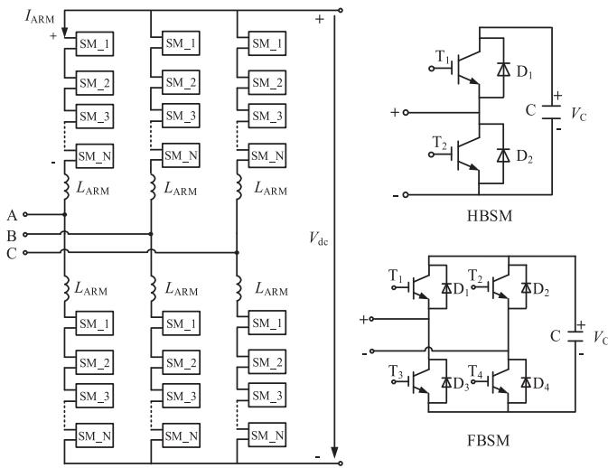  
Fig. 1. Schematic diagram of single-port three-phase MMC.

upper and lower arms. Within each arm, there are numerous (up to several hundred) series connected single-port sub-modules (SMs). These can be half-bridge SMs (HBSM), full-bridge SMs (FBSMs), or a combination of both types [3]. The fully detailed electromagnetic transient (EMT) simulation of MMCs on EMT programs is a challenge, due to their extremely large SM count in each arm and high number of nodes in the topology [4], [5].

Reference [6] proposed the Nested Fast and Simultaneous Solutions for the power electric networks, indicating that the network can be partitioned into nested subsystems; thus reducing the computational burden of the circuit without losing any information. The approach is similar to the diakoptics approach of Kron and others [7]–[9]. Reference [10] introduced the nested theory to EMT modeling of MMCs, where each of the six arms of the MMC is reduced to a single two-node Thevenin- ´ equivalent. This admittance matrix of this reduced system is overlaid on the admittance matrix of the remainder of the ac and dc side networks in the EMT solver. As none of the hundreds of internal nodes appear in the overlaid matrix, the admittance matrix in the EMT solver remains at a manageable size for further LU (or other) factorization when the semiconductor switches in the sub-module operate. This leads to a significant improvement in the simulation time.

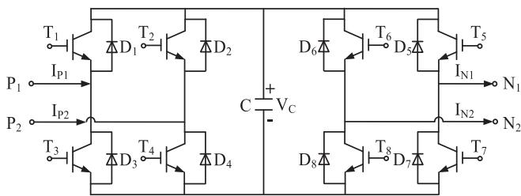

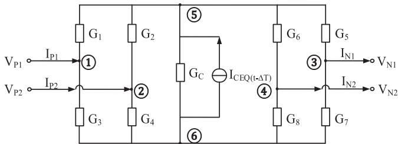  
  
  
Fig. 2. (a) Two-port SM and (b) its companion circuit.

It must be realized that in these more traditional full- or halfbridge topologies as in Fig. 1, each SM is a single-port with only two terminals. Hence all SMs in an arm carry the same current [10] and this makes the procedure for obtaining a single Thevenin equivalent for the arm very straightforward. ´

After its initial introduction, several researchers have extended the modeling approach in [10] to accurately represent blocking behavior [11], fast voltage balancing control [12], [13] and higher simulation speeds [14]. A similar algorithm is also used in the real-time digital simulations [15]–[17].

Recently, new MMC topologies are emerging [18]–[21] for HVdc applications that add enhanced functionality to the converter, such as the ability to ride through dc faults and simplified capacitor voltage balancing. These MMCs can be composed of multi-port SMs. A two-port SM example [18] is shown in Fig. 2, which has two ports $( \mathrm { P } _ { 1 } , \mathrm { N } _ { 1 } )$ and $( \mathrm { P _ { 2 } } , \mathrm { N _ { 2 } } )$ . Note that the term “port” is used loosely in this paper for convenience, as a strict definition would require the current entering and leaving any port to be the same, i.e., $\mathrm { { I } _ { P 1 } + \mathrm { { I } _ { N 1 } ~ = ~ 0 . } }$ , etc., which is not the case here. Instead, the following identity is satisfied by the terminal currents: $\mathrm { I _ { P 1 } + I _ { P 2 } = I _ { N 1 } + I _ { N 2 } }$ . It could have been referred to as a four terminal sub-module, but that create confusion when the MMC itself being used as part of a multi-terminal dc grid.

This paper develops an approach using generalized multi-port Norton Equivalents for modeling various emerging multi-port MMC topologies that is more than two orders of magnitude faster than a non-reduced model. The methodology is demonstrated with the modeling of an MMC with two-port modules of the form in Fig. 2.

# II. RECURSIVE APPROACH TO MODELLING OF THEMULTI-PORT MMC

Fig. 3 shows how the two-port module is used within an MMC structure. The advantage of the two-port topology over traditional approaches is not discussed here and can be found in [18] and [19]. The main difference between the two-port MMC

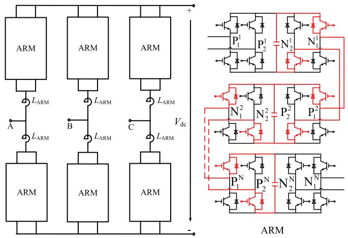  
Fig. 3. The two-port MMC structure.

and the conventional arises from its ability to simplify voltage balancing. At any given instance, the MMC uses a certain number of sub-modules in series to provide the ordered voltage at its output. The remaining sub-modules are bypassed. Because of the availability of its second port, these idle sub-modules can then be connected with neighboring active modules so that the capacitors are paralleled and automatically become equal in voltage. A detailed description of the operation of the topology is available in [18], [19].

For MMCs with the multi-port SM (such as the two-port example in Fig. 2), a generalized nested approach such as that in [6] can be used to reduce the computational burden of the host EMT program into which the model is introduced. As in earlier publications [10], this is achieved by representing each of the six arms of the MMC of Fig. 1 as a Thevenin or Norton ´ equivalent. However, for the one-port SMs in [10], the same current flows in all the sub-modules and allows one to simply add the Thevenin resistances and Th ´ evenin voltage sources of each ´ of the SMs into a single Thevenin equivalent. In contrast, the ´ newer generation of MMCs with multi-port SMs, do not enjoy this property. Modeling these multi-port MMCs (e.g., the twoport MMCs in this paper) using detailed EMT simulation models becomes time-expensive, and so there is a need to develop highspeed models without sacrificing accuracy for such devices.

The companion circuit of the two-port module is shown in Fig. 2(b). $\mathrm { G _ { 1 } , G _ { 2 } , . . . , G _ { 8 } }$ , are the conductance of the module’s eight switches which are either equal to the off-state switch conductance $\mathrm { G } _ { \mathrm { O F F } }$ or the on-state conductance $\operatorname { G } _ { \mathrm { O N } }$ . The internal capacitor is represented by a Norton circuit (i.e., the Norton current source $\operatorname { I _ { C E Q } }$ and Norton conductance $\mathrm { G } _ { \mathrm { C } } )$ , which is a function of the integration method, SM capacitance and simulation time step.

The companion circuit for a generalized multi-port SM is shown in Fig. 4. It has m ports $( ( \mathrm { P } _ { 1 } , \mathrm { N } _ { 1 } )$ , $( \mathrm { P _ { 2 } } , \mathrm { N _ { 2 } } ) , \mathrm { . ~ . . } , ( \mathrm { P _ { m } } , \mathrm { N _ { m } } ) )$ . It has n nodes, in which nodes 1 to 2m are at the m port terminals that interface to other submodules (or in case of the terminal SMs, to the dc bus or ac arm inductance). Nodes 2m + 1 to n are internal nodes and nodes n − 1 and n are the sub-module’s capacitor terminals.

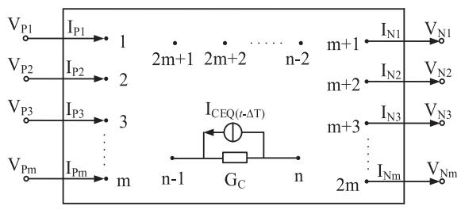  
Fig. 4. The companion circuit of the generalized multi-port SM.

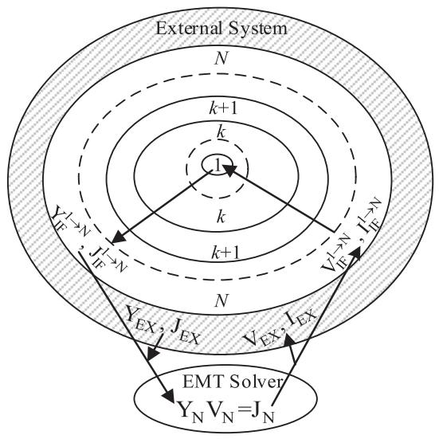  
Fig. 5. The recursive procedure of the proposed algorithm.

When constructing a MMC, the multi-port SMs are cascaded by connecting all the interface nodes, which is structurally similar to the typical three-phase MMC configuration, as in Fig. 1, except that now the connection is a multi-port connection instead of a single-port one.

The proposed Recursive Solution Algorithm in this paper includes several steps to obtain the equivalent circuit of the MMC arm with cascaded multi-port SMs, as in Fig. 5.

# A. Eliminating SM Circuits to Obtain a Single Arm Equivalent (Outward Flow)

First, the internal nodes within each SM k (k ∈ $\{ 1 , 2 , \ldots , \mathrm { N } \} )$ ; where N is the total number of sub-modules in an arm, are eliminated. Next, the first sub-module, SM1, contained within Block 1 at the center of Fig. 5 is combined with the next SM resulting in Block 2; and internal nodes are once again eliminated. Block 2 now contains the collapsed equivalents of two sub-modules. This block is then combined with the SM3, to give Block 3, and again, internal nodes are eliminated. The process is continued and culminates with Block N which now contains the equivalent companion circuit for one entire bridge arm, which is essentially the multi-port Norton Equivalent circuit for the arm. Note that in order to do the above steps, it is necessary to know the history terms, i.e., voltage and current in the SM capacitor from the previous time step. With N sub-modules with n nodes each, and discounting nodes inter-

facing to the other SMs which are m in number, this final block represents a circuit with $\mathrm { N } \times \left( \mathrm { n - m } \right)$ + m nodes. However, in the developed Norton equivalent, there are only 2m nodes per arm to be included in the external system’s EMT solver. Thus adding the MMC arm increases the size of the external system’s admittance matrix by 2m. This is what results in the simulation efficiency as the representation of the arm in the main EMT simulation (PSCAD/EMTDC in this case) has a very small number of nodes. For example, with the two-port SM in Fig. 2, and assuming 200 sub-modules per arm, this reduces the node count from 802 $\left( \mathrm { i . e . , 2 0 0 \times ( 6 - 2 ) + 2 ) } \right)$ to 4 for each arm.

# B. Solving the Full Network (Excluding Internal Nodes)

Note that the outward flow is essentially a method to obtain a Norton equivalent for the MMC arm for presentation to the EMT solver of the full network. No internal MMC voltages are calculated. With the reduced equivalent circuits all six arms added to the overall network’s admittance matrix, the EMT solver can readily solve for the network and obtain node voltages for all network nodes including the 2m terminal nodes of each arm.

# C. Calculating Internal SM Quantities to Generate New History Terms (Inward Flow)

Because the external EMT solver does not have access to the internal structure of the sub-modules, additional steps are necessary within the MMC module to calculate these. Such calculations are necessary to generate the history terms necessary in Section II-A described above. They are also needed to calculate quantities like the sub-module’s internal currents or capacitor voltages which are required for the voltage balancing algorithm. This is easily implemented.

Once the solution for the arm’s external nodes is obtained, the internal nodes of Block N can be solved for. Note that the admittance matrix required for this solution is the admittance matrix of the sub-module itself overlaid with the additional equivalent circuit admittances of Block N-1. The excitation sources for calculating the solution include the voltages calculated in Section II-B for the external nodes and the history sources from Block N-1. Once the solution for Block N is obtained, the terminal voltages for Block N-1 become available and can be used to solve for Block N-2. The process is continued until the solution for Block 1 is obtained. Note that in each inward step, only the voltages of the current block under consideration are calculated exactly once. The inward and outward steps therefore have no overlap and do not calculate the same voltage more than once.

The following section describes the mathematical details required for implementing the Recursive Solution Algorithm.

# III. NODE ELIMINATION FOR OBTAINING NORTON EQUIVALENT OF MMC ARM

# A. Node Elimination Within Each SM

Details of the sub-module node elimination process mentioned in Section II-A above are now presented. In Fig. 4,

assuming a remote ground, the nodal admittance equations for any one of the N multi-port SMs is given in (1).

$$
\mathrm {Y} _ {\mathrm {S M}} \mathrm {V} _ {\mathrm {S M}} = \mathrm {J} _ {\mathrm {S M}} + \mathrm {I} _ {\mathrm {S M}} \tag {1}
$$

$\mathrm { Y } _ { \mathrm { S M } }$ is the n × n sized admittance matrix of the SM. It has the form given in (2). In (2), the elements $\operatorname { G _ { i , j } } ( \mathrm { i , j } \in \{ 1 , 2 , \dots , n \} )$ ; are calculated from consideration of component conductance (G) values. For switching components, the conductance is either $\mathrm { \Delta G = G _ { O N } }$ , the on state conductance or $\mathrm { G } = \mathrm { G } _ { \mathrm { O F F } }$ the off state conductance of the IGBT switch. The state is determined from the firing pulses, and also from the voltages across or currents in the switch in the previous time step. For the capacitor component G is equal to $\mathrm { G _ { C } }$ , the companion circuit capacitor conductance. For off-diagonal entries, i.e., $\mathrm { i \neq j , G _ { i , j } = - G }$ and for diagonal elements, $\mathrm { G _ { i , i } = }$ the sum of all conductance values of components incident on node i [22].

$$
\mathrm {Y} _ {\mathrm {S M}} = \left[ \mathrm {G} _ {\mathrm {i}, \mathrm {j}} \right] _ {\mathrm {n} \cdot \mathrm {n}} = \left[ \begin{array}{c c} (\mathrm {Y} _ {1 1}) _ {2 \mathrm {m} \cdot 2 \mathrm {m}} & (\mathrm {Y} _ {1 2}) _ {2 \mathrm {m} \cdot (\mathrm {n} - 2 \mathrm {m})} \\ (\mathrm {Y} _ {2 1}) _ {(\mathrm {n} - 2 \mathrm {m}) \cdot 2 \mathrm {m}} & (\mathrm {Y} _ {2 2}) _ {(\mathrm {n} - 2 \mathrm {m}) \cdot (\mathrm {n} - 2 \mathrm {m})} \end{array} \right] _ {\mathrm {n} \cdot \mathrm {n}} \tag {2}
$$

As an example, for the two-port MMC module in Fig. $2 ( \mathrm { a } )$ , the corresponding $\mathrm { Y } _ { \mathrm { S M } }$ obtained from its companion circuit in Fig. 2(b) is as $( 3 )$ , shown at the bottom of this page.

In (1), $\mathrm { V } _ { \mathrm { S M } }$ is the $\mathrm { ~ n ~ } \times \mathrm { ~ 1 ~ }$ sized column vector of the node voltages, JSM is n × 1 sized column vector of the current injections and $\mathrm { I _ { S M } }$ is $\mathrm { ~ n ~ } \times \mathrm { ~ 1 ~ }$ sized column vector of injected currents from any externally connected circuit, these column vectors are respectively shown in (4), at the bottom of this page.

The structure for $\mathrm { J } _ { \mathrm { S M } }$ arises from the fact that only the capacitor contributes to the history current, and it is assumed that the sub-module only has a single capacitor as in Fig. 4. If more energy storage elements are present, there will be additional history terms. The structure for ISM is as shown because current injections from the circuit external to the SM only occur at the interface nodes. Equations (2) and (4) are partitioned where $\mathrm { V _ { I F } }$ is the voltage vector of interface nodes (the subscript “IF” stands for interface in this paper) and $\mathrm { V } _ { \mathrm { I N } }$ of internal nodes. With this, (1) can be written as (5).

$$
\left[ \begin{array}{l} \mathrm {Y} _ {1 1} \\ \mathrm {Y} _ {2 1} \end{array} \right] \left[ \begin{array}{l} \mathrm {V} _ {\mathrm {I F}} \\ \mathrm {V} _ {\mathrm {I N}} \end{array} \right] = \left[ \begin{array}{l} 0 \\ \mathrm {J} _ {\mathrm {I N}} \end{array} \right] + \left[ \begin{array}{l} \mathrm {I} _ {\mathrm {I F}} \\ 0 \end{array} \right] \tag {5}
$$

Eliminating $\mathrm { V _ { I N } }$ in (5) using Schur’s Complement gives (6):

$$
Y _ {I F} V _ {I F} = J _ {I F} + I _ {I F} \tag {6}
$$

in which,

$$
\mathrm {Y} _ {\mathrm {I F}} = \mathrm {Y} _ {1 1} - \mathrm {Y} _ {1 2} \mathrm {Y} _ {2 2} ^ {- 1} \mathrm {Y} _ {2 1} \tag {7}
$$

$$
J _ {I F} = - Y _ {1 2} Y _ {2 2} ^ {- 1} J _ {I N} \tag {8}
$$

The form (6) together with (7) and (8) is the multi-port Norton Equivalent [23] for each sub-module. This step is necessary in the ‘outward $\mathrm { { \ R o w } } '$ process for obtaining the reduced Norton Equivalent for the arm, as described in Section II-A.

The interface node voltages $\mathrm { V _ { I F } }$ can be calculated using the recursive method described in Section II-A and further discussed in Section III-C.

$$
Y _ {\mathrm {S M}} = \left[ \begin{array}{c c c c c c} G _ {1} + G _ {3} & 0 & 0 & 0 & - G _ {1} & - G _ {3} \\ 0 & G _ {2} + G _ {4} & 0 & 0 & - G _ {2} & - G _ {4} \\ 0 & 0 & G _ {5} + G _ {7} & 0 & - G _ {5} & - G _ {7} \\ 0 & 0 & 0 & G _ {6} + G _ {8} & - G _ {6} & - G _ {8} \end{array} \right] \tag {3}
$$

$$
V _ {\mathrm {S M}} = V _ {\mathrm {I F}} \left\{ \begin{array}{l} \left[ \begin{array}{c} V _ {\mathrm {P 1}} \\ \vdots \\ V _ {\mathrm {P m}} \\ V _ {\mathrm {N 1}} \\ \vdots \\ V _ {\mathrm {N m}} \\ \vdots \\ V _ {2 \mathrm {m} + 1} \\ \vdots \\ V _ {\mathrm {n} - 1} \\ V _ {\mathrm {n}} \end{array} \right], J _ {\mathrm {S M}} = \\ J _ {\mathrm {I N}} \left\{ \begin{array}{l} \left[ \begin{array}{c} 0 \\ \vdots \\ 0 \\ 0 \\ \vdots \\ 0 \\ \dots \dots \dots \dots \dots \dots \dots \dots \dots \dots \dots \dots \dots \dots \dots \dots \dots \dots \dots \dots \dots \dots \dots \dots \dots \dots \dots \dots \dots \dots \dots \dots \dots \dots \dots \dots \dots \dots \dots \dots \dots \dots \dots \dots \dots \dots \dots \dots \dots \dots \cdot I _ {\mathrm {I M}} \\ 0 \\ \vdots \\ 0 \\ 0 \\ 0 \end{array} \right], I _ {\mathrm {S M}} = \\ J _ {\mathrm {I N}} \left\{ \begin{array}{l} 0 \\ 0 \\ 0 \\ 0 \\ 0 \\ 0 \\ 0 \\ 0 \\ 0 \\ 0 \\ 0 \\ 0 \\ 0 \\ 0 \\ 0 \\ 0 \\ 0 \\ 0 \\ 0 \\ 0 \\ 0 \\ 0 \\ 0 \\ 0 \\ 0 \\ 0 \\ 0 \\ 0 \\ 0 \\ 0 \\ 0 \\ 0 \\ 0 \\ 0 \\ J _ {\mathrm {I N}} = I _ {\mathrm {I M}} + I _ {\mathrm {I M}} ^ {*} + I _ {\mathrm {I M}} ^ {*} + I _ {\mathrm {I M}} ^ {*} + I _ {\mathrm {I M}} ^ {*} + I _ {\mathrm {I M}} ^ {*} + I _ {\mathrm {I M}} ^ {*} + I _ {\mathrm {I M}} ^ {*} + I _ {\mathrm {I M}} ^ {*} + I _ {\mathrm {I M}} ^ {*} + I _ {\mathrm {I M}} ^ {*} & I _ {\mathrm {I F}} = I _ {\mathrm {I M}} + I _ {\mathrm {I M}} ^ {*} + I _ {\mathrm {I M}} ^ {*} + I _ {\mathrm {I M}} ^ {*} + I _ {\mathrm {I M}} ^ {*} + I _ {\mathrm {I M}} ^ {*} + I _ {\mathrm {I M}} ^ {*} + I _ {\mathrm {I M}} ^ {*} + I _ {\mathrm {I M}} ^ {*} +
$$

Once $\mathrm { V _ { I F } }$ is obtained, required in the ‘inward flow’ process for determining the internal voltages, $\mathrm { V _ { I N } }$ can be updated using (9), to give the capacitor voltage solutions, necessary for computing the history currents JIN in the next time step.

$$
\mathrm {V} _ {\mathrm {I N}} = \mathrm {Y} _ {2 2} ^ {- 1} \left[ \mathrm {J} _ {\mathrm {I N}} - \mathrm {Y} _ {2 1} \mathrm {V} _ {\mathrm {I F}} \right] \tag {9}
$$

# B. Node Elimination Between Interconnecting Adjacent SMs

This section describes how the node elimination procedure is recursively implemented between two adjacent multi-port SMs until a single equivalent for the whole arm consisting of only 2m interface nodes results. This arm equivalent circuit can then be interfaced to the main interface solver.

After elimination of the internal nodes the interface node equivalent (6), which is applicable for any individual multi-port SM, can be written as (10), by substituting (4) into (6).

$$
\begin{array}{l} \begin{array}{c}\mathrm {V} _ {\mathrm {L}}\\\mathrm {Y} _ {\mathrm {I F}} \cdot\\\mathrm {V} _ {\mathrm {R}}\end{array}\left\{ \right.\begin{array}{l}\left[\begin{array}{c}\mathrm {V} _ {\mathrm {P 1}}\\\vdots\\\mathrm {V} _ {\mathrm {P m}}\\\vdots\\\mathrm {V} _ {\mathrm {N 1}}\\\vdots\\\mathrm {V} _ {\mathrm {N m}}\end{array}\right] =\\\mathrm {J} _ {\mathrm {L}}\\\mathrm {J} _ {\mathrm {R}}\end{array}\left\{\begin{array}{l}\left[\begin{array}{c}\mathrm {J} _ {\mathrm {I F}, \mathrm {P 1}}\\\vdots\\\mathrm {J} _ {\mathrm {I F}, - \mathrm {P m}}\\\vdots\\\mathrm {J} _ {\mathrm {I F}, \mathrm {N 1}}\\\vdots\\\mathrm {J} _ {\mathrm {I F}, \mathrm {N m}}\end{array}\right]\end{array}\right. \\ + \quad \begin{array}{r l} & {\mathrm {I} _ {\mathrm {L}} \left\{\begin{array}{c} {\mathrm {I} _ {\mathrm {P} 1}} \\ {\vdots} \\ {\mathrm {I} _ {\mathrm {P m}}} \\ {\vdots} \\ {- \mathrm {I} _ {\mathrm {N} 1}} \\ {\vdots} \\ {- \mathrm {I} _ {\mathrm {N m}}} \end{array} \right.} \end{array} \tag {10} \\ \end{array}
$$

In (10) the vectors are re-arranged as those corresponding to the interface left-hand side nodes $( \mathrm { P _ { 1 } } , \mathrm { P _ { 2 } } , \ldots , \mathrm { P _ { m } } )$ in Fig. 4 and right-hand side nodes $( \mathrm { N _ { 1 } } , \mathrm { N _ { 2 } } , \mathrm { . . . , N _ { m } } )$ , re-labeled as subscripts ‘L’ and $\cdot _ { \mathrm { R } } \cdot$ . The right-hand side nodes connect to the left-hand side interface nodes of the next SM, and for this purpose, $\mathrm { Y } _ { \mathrm { I F } }$ is partitioned to indicate left and right side vectors as (11):

$$
Y _ {I F} = \left[ \begin{array}{l l} \left(Y _ {L L}\right) _ {\mathrm {m} \cdot \mathrm {m}} & \left(Y _ {L R}\right) _ {\mathrm {m} \cdot \mathrm {m}} \\ \left(Y _ {R L}\right) _ {\mathrm {m} \cdot \mathrm {m}} & \left(Y _ {R R}\right) _ {\mathrm {m} \cdot \mathrm {m})} \end{array} \right] _ {2 \mathrm {m} \cdot 2 \mathrm {m}} \tag {11}
$$

Substituting (11) into (10) and get (12)

$$
\left[ \begin{array}{l} \mathrm {Y} _ {\mathrm {L L}}; \mathrm {Y} _ {\mathrm {L R}} \\ \cdot \dots \dots \dots \dots \dots \dots \dots \dots \dots \dots \dots \dots \dots \dots \dots \dots \dots \dots \dots \dots \dots \dots \dots \dots \dots \dots \dots \dots \dots \dots \dots \dots \end{array} \right] \left[ \begin{array}{l} \mathrm {V} _ {\mathrm {L}} \\ \cdot \dots \dots \dots \dots \dots \dots \dots \dots \dots \dots \dots \dots \dots \dots \dots \dots \dots \dots \dots \dots \dots \dots \dots \dots \end{array} \right] = \left[ \begin{array}{l} \mathrm {J} _ {\mathrm {L}} \\ \cdot \dots \dots \dots \dots \dots \dots \dots \dots \dots \dots \dots \dots \dots \dots \dots \dots \dots \end{array} \right] + \left[ \begin{array}{l} I _ {\mathrm {L}} \\ - I _ {\mathrm {R}} \\ - I _ {\mathrm {R}} \\ - I _ {\mathrm {R}} \\ - I _ {\mathrm {R}} \\ - I _ {\mathrm {R}} \\ - I _ {\mathrm {R}} \\ - I _ {\mathrm {R}} \\ - I _ {\mathrm {R}} \\ - I _ {\mathrm {R}} \\ - I _ {\mathrm {R}} \\ - I _ {\mathrm {R}} \\ - I _ {\mathrm {R}}, I _ {\mathrm {R}} \\ - I _ {\mathrm {R}}, I _ {\mathrm {R}} \\ - I _ {\mathrm {R}}, I _ {\mathrm {R}} \\ - I _ {\mathrm {R}}, I _ {\mathrm {R}} \\ - I _ {\mathrm {R}}, I _ {\mathrm {R}} \\ - I _ {\mathrm {R}}, I _ {\mathrm {R}} \\ - I _ {\mathrm {R}}, I _ {\text {一}} \\ - I _ {\mathrm {R}}, I _ {\text {一}} \\ - I _ {\mathrm {R}}, I _ {\text {一}} \\ - I _ {\mathrm {R}}, I _ {\text {一}} \\ - I _ {\mathrm {R}}, I _ {\text {一}} \\ - I _ {\mathrm {R}}, I _ {\text {一}} \\ - I _ {\mathrm {R}}, I _ {\text {一}} \\ - 1, 2, 3, 4, 5, 6, 7, 8, 9, 10, 11, 12, 13, 14, 15, 16, 17, 18, 19, 20, 21, 22, 23, 24, 25, 26, 27, 28, 29, 30, 31, 32, 33, 34, 35, 36, 37, 38, 39, 40, 41, 42, 43, 44, 45, 46, 47, 48, 49, 50, 51, 52, 53, 54, 55, 56, 57, 58, 59, 60, 61, 62, 63, 64, 65, 66, 67, 68, 69, 70, 71, 72, 73, 74, 75, 76, 77, 78, 79, 80, 81, 82, 83, 84, 85, 86, 87, 88, 89, 90, 91, 92, 93, 94, 95, 96, 97, 98, 99.
$$

Moving current vectors IL and $\mathrm { I _ { R } }$ to the left-hand side of (12) and re-arranging into (13), in which ‘I’ indicates the Identity

Matrix.

$$
\begin{array}{l} \begin{array}{r} \mathrm {A} _ {\mathrm {L L}} \left\{ \begin{array}{l l} & \left[ \begin{array}{c c c c c} \mathrm {Y} _ {\mathrm {L L}} & - \mathrm {I} & 0 & \mathrm {Y} _ {\mathrm {L R}} & 0 & 0 \\ 0 & - \mathrm {I} & 0 & 0 & 0 & 0 \\ \dots & \dots & \dots & \dots & \dots & \dots \\ \mathrm {Y} _ {\mathrm {R L}} & 0 & 0 & \mathrm {Y} _ {\mathrm {R R}} & 0 & 0 \\ 0 & 0 & 0 & 0 & \mathrm {I} & 0 \end{array} \right] \end{array} \right\} \mathrm {A} _ {\mathrm {L R}} \\ \mathrm {A} _ {\mathrm {R L}} \left\{ \begin{array}{l l} & \left[ \begin{array}{c c c c c} \mathrm {Y} _ {\mathrm {L L}} & - \mathrm {I} & 0 & \mathrm {Y} _ {\mathrm {L R}} & 0 & 0 \\ 0 & - \mathrm {I} & 0 & 0 & 0 & 0 \\ \dots & \dots & 0 & 0 & 0 & 0 \\ \mathrm {Y} _ {\mathrm {R L}} & 0 & 0 & \mathrm {Y} _ {\mathrm {R R}} & 0 & 1 \\ 0 & 0 & 0 & 0 & 0 & 1 \end{array} \right] \end{array} \right\} \mathrm {A} _ {\mathrm {R R}} \end{array} \\ \cdot \begin{array}{l} \mathrm {X} _ {\mathrm {L}} \\ \mathrm {X} _ {\mathrm {R}} \end{array} \left\{ \begin{array}{l} \left[ \begin{array}{c} \mathrm {V} _ {\mathrm {L}} \\ \mathrm {I} _ {\mathrm {L}} \\ \mathrm {V} _ {\mathrm {R}} \\ \mathrm {I} _ {\mathrm {R}} \end{array} \right] = \left[ \begin{array}{c} \mathrm {J} _ {\mathrm {L}} \\ \mathrm {J} _ {\mathrm {R}} \end{array} \right] \end{array} \right. \tag {13} \\ \end{array}
$$

For convenience, the four submatrices are labeled $\mathbf { A } _ { \mathrm { { L L } } } , \mathbf { A } _ { \mathrm { { L R } } }$ , $\mathbf { A } _ { \mathrm { R L } }$ and $\mathbf { A } _ { \mathrm { R R } }$ , as marked in (13). Similarly, the vectors $\mathrm { X _ { L } }$ and $\mathrm { X _ { R } }$ are defined to represent the left and right-hand side voltage and current vectors. With these new definitions, (13) becomes (14):

$$
\left[ \begin{array}{l} \mathrm {A} _ {\mathrm {L L}} \\ \cdot \cdot \cdot \\ \mathrm {A} _ {\mathrm {R L}} \end{array} ; \mathrm {A} _ {\mathrm {L R}} \right] \left[ \begin{array}{l} \mathrm {X} _ {\mathrm {L}} \\ \cdot \cdot \cdot \\ \mathrm {X} _ {\mathrm {R}} \end{array} \right] = \left[ \begin{array}{l} \mathrm {J} _ {\mathrm {L}} \\ \cdot \cdot \cdot \\ \mathrm {J} _ {\mathrm {R}} \end{array} \right] \tag {14}
$$

Equation (14) is the generic form of an individual multi-port SM with all the internal nodes eliminated. The next step is to eliminate the interface nodes between two adjacent SMs. Let superscripts k and $\mathrm { k } + 1$ respectively indicate the adjacent SMs k and $\mathrm { k } + 1$ in (15) and (16).

$$
\left[ \begin{array}{l} \mathrm {A} _ {\mathrm {L L}} ^ {\mathrm {k}}; \mathrm {A} _ {\mathrm {L R}} ^ {\mathrm {k}} \\ \mathrm {A} _ {\mathrm {R L}} ^ {\mathrm {k}}; \mathrm {A} _ {\mathrm {R R}} ^ {\mathrm {k}} \end{array} \right] \left[ \begin{array}{l} \mathrm {X} _ {\mathrm {L}} ^ {\mathrm {k}} \\ \mathrm {X} _ {\mathrm {R}} ^ {\mathrm {k}} \end{array} \right] = \left[ \begin{array}{l} \mathrm {J} _ {\mathrm {L}} ^ {\mathrm {k}} \\ \mathrm {J} _ {\mathrm {R}} ^ {\mathrm {k}} \end{array} \right]. \tag {15}
$$

$$
\left[ \begin{array}{l} \mathrm {A} _ {\mathrm {L L}} ^ {\mathrm {k} + 1}; \mathrm {A} _ {\mathrm {L R}} ^ {\mathrm {k} + 1} \\ \mathrm {A} _ {\mathrm {R L}} ^ {\mathrm {k} + 1}; \mathrm {A} _ {\mathrm {R R}} ^ {\mathrm {k} + 1} \end{array} \right] \left[ \begin{array}{l} \mathrm {X} _ {\mathrm {L}} ^ {\mathrm {k} + 1} \\ \mathrm {X} _ {\mathrm {R}} ^ {\mathrm {k} + 1} \end{array} \right] = \left[ \begin{array}{l} \mathrm {J} _ {\mathrm {L}} ^ {\mathrm {k} + 1} \\ \mathrm {J} _ {\mathrm {R}} ^ {\mathrm {k} + 1} \end{array} \right] \tag {16}
$$

The right-hand side of SM k is connected to the left-hand side of $\mathrm { S M k } + 1$ , indicating that the node voltages are identical at this interface. Also because of the sign convention chosen in Fig. 4, where left hand side currents are positive entering the sub-module, whereas the right hand side currents are positive exiting the sub-module, the currents at the interface are also equal. Thus let:

$$
\mathrm {X} _ {\mathrm {R L}} = \mathrm {X} _ {\mathrm {R}} ^ {\mathrm {k}} = \mathrm {X} _ {\mathrm {L}} ^ {\mathrm {k} + 1} \tag {17}
$$

Substituting (17) into (15) and (16), and restructuring, gives (18) and (19).

$$
\begin{array}{l} \left\{\left[ \begin{array}{c c} A _ {\mathrm {L L}} ^ {\mathrm {k}} & 0 \\ 0 & A _ {\mathrm {R R}} ^ {\mathrm {k + 1}} \end{array} \right] - \left[ \begin{array}{c} A _ {\mathrm {L R}} ^ {\mathrm {k}} \\ A _ {\mathrm {R L}} ^ {\mathrm {k + 1}} \end{array} \right] \left[ \begin{array}{c} A _ {\mathrm {R R}} ^ {\mathrm {k}} \\ A _ {\mathrm {L L}} ^ {\mathrm {k + 1}} \end{array} \right] ^ {- 1} \left[ \begin{array}{c c} A _ {\mathrm {R L}} ^ {\mathrm {k}} & 0 \\ 0 & A _ {\mathrm {L R}} ^ {\mathrm {k + 1}} \end{array} \right] \right\} \\ \cdot \left[ \begin{array}{c} X _ {L} ^ {k} \\ X _ {R} ^ {k + 1} \end{array} \right] = \left[ \begin{array}{c} J _ {L} ^ {k} \\ J _ {R} ^ {k + 1} \end{array} \right] - \left[ \begin{array}{c} A _ {L R} ^ {k} \\ A _ {R L} ^ {k + 1} \end{array} \right] \left[ \begin{array}{c} A _ {R R} ^ {k} \\ A _ {L L} ^ {k + 1} \end{array} \right] ^ {- 1} \left[ \begin{array}{c} J _ {R} ^ {k} \\ J _ {L} ^ {k + 1} \end{array} \right] \\ \end{array}
$$

or

$$
\left[\begin{array}{l}\mathrm {A} _ {\mathrm {L L}} ^ {\mathrm {k} \rightarrow \mathrm {k} + 1}; \mathrm {A} _ {\mathrm {L R}} ^ {\mathrm {k} \rightarrow \mathrm {k} + 1}\\\mathrm {A} _ {\mathrm {R L}} ^ {\mathrm {k} \rightarrow \mathrm {k} + 1}; \mathrm {A} _ {\mathrm {R R}} ^ {\mathrm {k} \rightarrow \mathrm {k} + 1}\end{array}\right] \left[\begin{array}{l}\mathrm {X} _ {\mathrm {L}} ^ {\mathrm {k}}\\\mathrm {X} _ {\mathrm {R}} ^ {\mathrm {k} + 1}\end{array}\right] = \left[\begin{array}{l}\mathrm {J} _ {\mathrm {L}} ^ {\mathrm {k} \rightarrow \mathrm {k} + 1}\\\mathrm {J} _ {\mathrm {R}} ^ {\mathrm {k} \rightarrow \mathrm {k} + 1}\end{array}\right] \tag {18}
$$

$$
\mathrm {X} _ {\mathrm {R L}} = \left[ \begin{array}{l} \mathrm {A} _ {\mathrm {R R}} ^ {\mathrm {k}} \\ \mathrm {A} _ {\mathrm {L L}} ^ {\mathrm {k + 1}} \end{array} \right] ^ {- 1} \left[ \begin{array}{l} \mathrm {J} _ {\mathrm {R}} ^ {\mathrm {k}} \\ \mathrm {J} _ {\mathrm {L}} ^ {\mathrm {k + 1}} \end{array} \right] - \left[ \begin{array}{l} \mathrm {A} _ {\mathrm {R R}} ^ {\mathrm {k}} \\ \mathrm {A} _ {\mathrm {L L}} ^ {\mathrm {k + 1}} \end{array} \right] ^ {- 1} \left[ \begin{array}{c c} \mathrm {A} _ {\mathrm {R L}} ^ {\mathrm {k}} & 0 \\ 0 & \mathrm {A} _ {\mathrm {L R}} ^ {\mathrm {k + 1}} \end{array} \right] \left[ \begin{array}{l} \mathrm {X} _ {\mathrm {L}} ^ {\mathrm {k}} \\ \mathrm {X} _ {\mathrm {R}} ^ {\mathrm {k + 1}} \end{array} \right] \tag {19}
$$

The superscript $\mathrm { ^ { 6 6 } k } \longrightarrow \mathrm { k } + 1 \mathrm { ^ { 9 } }$ identifies that SMs k and k+1 are combined. Equation (18) has an identical form as that of the individual SM given by (14). Then this combined block is next combined with the next SM to give a block of similar form, and so on, until the outermost sub-module is reached. Note that at each stage we require the history terms and the firing pulses of each newly combined SM; and the interface node voltages, which are required to update the internal voltages and the history terms, as in Fig. 5. The resultant is a Norton equivalent for the entire arm to be used in the external EMT solver.

# C. Norton Equivalent of MMC Arm

Once all the internal nodes of the N cascaded multi-port SMs are eliminated, we obtain a form similar to (18), as:

$$
\left[\begin{array}{l}\mathrm {A} _ {\mathrm {L L}} ^ {1 \rightarrow \mathrm {N}}: \mathrm {A} _ {\mathrm {L R}} ^ {1 \rightarrow \mathrm {N}}\\\mathrm {A} _ {\mathrm {R L}} ^ {1 \rightarrow \mathrm {N}}: \mathrm {A} _ {\mathrm {R R}} ^ {1 \rightarrow \mathrm {N}}\end{array}\right] \left[\begin{array}{l}\mathrm {X} _ {\mathrm {L}} ^ {1}\\\mathrm {X} _ {\mathrm {R}} ^ {\mathrm {N}}\end{array}\right] = \left[\begin{array}{l}\mathrm {J} _ {\mathrm {L}} ^ {1 \rightarrow \mathrm {N}}\\\mathrm {J} _ {\mathrm {R}} ^ {1 \rightarrow \mathrm {N}}\end{array}\right] \tag {20}
$$

Realizing that $\mathrm { X _ { L } } = [ \mathrm { V _ { L } } , \mathrm { I _ { L } } ] ^ { T }$ , etc., as in (13), the matrix on the left hand side of (20) can be re-written as (21):

$$
\begin{array}{l} \begin{array}{r l} & {\mathrm {A} _ {\mathrm {L L}} ^ {1 \to \mathrm {N}} \{\left[ \begin{array}{l l l l l} \mathrm {a} _ {\mathrm {L L}} ^ {1 \to \mathrm {N}}: \alpha_ {\mathrm {L L}} ^ {1 \to \mathrm {N}}: \mathrm {a} _ {\mathrm {L R}} ^ {1 \to \mathrm {N}}: \alpha_ {\mathrm {L R}} ^ {1 \to \mathrm {N}} \\ \dots : \dots : \dots : \dots : \dots : \dots : \dots : \dots : \dots : \dots : \dots : \dots : \dots : \dots : \dots : \dots : \dots : \dots : \dots : \dots : \dots : \dots : \dots : \dots : \dots : \dots : \dots : \dots : \dots : \dots : \dots : \dots : \dots : \dots : 0. 5 5 2 7 4 9 p t ] \end{array} \right] \{\mathrm {A} _ {\mathrm {L R}} ^ {1 \to \mathrm {N}}} \\ & {\mathrm {A} _ {\mathrm {R L}} ^ {1 \to \mathrm {N}} \{\left[ \begin{array}{l l l l l} \mathrm {a} _ {\mathrm {R L}} ^ {1 \to \mathrm {N}}: \alpha_ {\mathrm {R L}} ^ {1 \to \mathrm {N}}: \mathrm {a} _ {\mathrm {R R}} ^ {1 \to \mathrm {N}}: \alpha_ {\mathrm {R R}} ^ {1 \to \mathrm {N}} \end{array} \right] \{\mathrm {A} _ {\mathrm {R R}} ^ {1 \to \mathrm {N}}} \end{array} \\ \cdot \left[\begin{array}{l}\mathrm {V} _ {\mathrm {L}} ^ {1}\\\mathrm {I} _ {\mathrm {L}} ^ {1}\\\mathrm {V} _ {\mathrm {R}} ^ {\mathrm {N}}\\\mathrm {I} _ {\mathrm {R}} ^ {\mathrm {N}}\end{array}\right] = \left[\begin{array}{l}\mathrm {J} _ {\mathrm {L}} ^ {1 \rightarrow \mathrm {N}}\\\mathrm {J} _ {\mathrm {R}} ^ {1 \rightarrow \mathrm {N}}\end{array}\right] \tag {21} \\ \end{array}
$$

Now (21) can be re-arranged to (22):

$$
\begin{array}{l} \left[\begin{array}{c c}- \alpha_ {\mathrm {L L}} ^ {1 \rightarrow \mathrm {N}}&\alpha_ {\mathrm {L R}} ^ {1 \rightarrow \mathrm {N}}\\- \alpha_ {\mathrm {R L}} ^ {1 \rightarrow \mathrm {N}}&\alpha_ {\mathrm {R R}} ^ {1 \rightarrow \mathrm {N}}\end{array}\right] ^ {- 1} \left[\begin{array}{c c}\mathbf {a} _ {\mathrm {L L}} ^ {1 \rightarrow \mathrm {N}}&\mathbf {a} _ {\mathrm {L R}} ^ {1 \rightarrow \mathrm {N}}\\\mathbf {a} _ {\mathrm {R L}} ^ {1 \rightarrow \mathrm {N}}&\mathbf {a} _ {\mathrm {R R}} ^ {1 \rightarrow \mathrm {N}}\end{array}\right] \left[\begin{array}{c}\mathbf {V} _ {\mathrm {L}} ^ {1}\\\mathbf {V} _ {\mathrm {R}} ^ {\mathrm {N}}\end{array}\right] \\ = \left[ \begin{array}{l l} - \alpha_ {\mathrm {L L}} ^ {1 \to \mathrm {N}} & \alpha_ {\mathrm {L R}} ^ {1 \to \mathrm {N}} \\ - \alpha_ {\mathrm {R L}} ^ {1 \to \mathrm {N}} & \alpha_ {\mathrm {R R}} ^ {1 \to \mathrm {N}} \end{array} \right] ^ {- 1} \left[ \begin{array}{l} \mathbf {J} _ {\mathrm {L}} ^ {1 \to \mathrm {N}} \\ \ddots \\ \mathbf {J} _ {\mathrm {R}} ^ {1 \to \mathrm {N}} \end{array} \right] + \left[ \begin{array}{l} \mathbf {I} _ {\mathrm {L}} ^ {1} \\ - \mathbf {I} _ {\mathrm {R}} ^ {\mathrm {N}} \end{array} \right] \\ \end{array}
$$

or

$$
Y _ {I F} ^ {1 \rightarrow N} V _ {I F} ^ {1 \rightarrow N} = J _ {I F} ^ {1 \rightarrow N} + I _ {I F} ^ {1 \rightarrow N} \tag {22}
$$

Equation (22) now permits the MMC model to be interfaced with the main EMT solver, which has a structure as in (23), with $\mathrm { Y _ { E X } , V _ { E X } }$ and $\operatorname { J } _ { \operatorname { E X } }$ being the admittance matrix, nodal voltage vector and internal current injection vectors of the external network. IEX represents the currents injected from the interface. Thus its elements are zero for non-interface nodes, and equal to the corresponding entries from $\mathrm { I } _ { \mathrm { I F } } ^ { 1  \mathrm { N } }$ (in (22)) for interface nodes.

$$
\mathrm {Y} _ {\mathrm {E X}} \mathrm {V} _ {\mathrm {E X}} = \mathrm {J} _ {\mathrm {E X}} + \mathrm {I} _ {\mathrm {E X}} \tag {23}
$$

Similarly, $\mathrm { V } _ { \mathrm { I F } } ^ { \mathrm { 1 \to N } }$ is a vector of nodal voltages only at the 2m interface nodes, which are also part of the external circuit. Hence, to obtain the final admittance matrix for the entire system, the elements of the reduced MMC admittance matrix ${ \mathrm { Y } } _ { \mathrm { I F } } ^ { \mathrm { 1 } \dot {  } \mathrm { N } }$ are added to the elements of $\mathrm { Y } _ { \mathrm { E X } }$ for the corresponding node pairs to give (24).

$$
\mathrm {Y} _ {\mathrm {N}} \mathrm {V} _ {\mathrm {N}} = \mathrm {J} _ {\mathrm {N}} \tag {24}
$$

The external EMT network solver then can solve for all node voltages in $\mathrm { V _ { N } }$ , which includes the external system voltages as well as the 2m interface node voltages, but not the internal node voltages inside the MMC. However, once the 2m interface node voltages are calculated, we can recursively calculate the node voltages of all internal nodes using the procedure described in Section II-A. These are required for finding the history terms of the internal blocks 1 to N for the next solution time step.

Note that the MMC does not increase the number of nodes in the external circuit because the 2m interface nodes also belong to the external circuit. If a direct solution were attempted, it would have added all the $\mathrm { N } \times \left( \mathrm { n - m } \right)$ + m internal nodes of the MMC to the external circuit, thereby significantly increasing its size and the corresponding solution effort. It must be realized however, that the price paid for the reduction in size is the added complexity of the recursive procedure.

# D. Special Considerations for Implementation of Blocking

The two-port MMC was originally proposed for its advantageous dc fault current blocking and capacitor voltage selfbalancing features. First, consider the traditional MMC in Fig. 1. In normal operation, either switch $\mathrm { T _ { 1 } / D _ { 1 } }$ or $\mathrm { { T _ { 2 } / D _ { 2 } } }$ is on. However, when the arm is blocked, firing pulses are removed from all IGBTs so that a diode network remains. The state of the diode now depends on the direction of current in it, and the diode must be turned off if the current in it is momentarily negative. In a real diode, the diode current can never be negative, and these momentary negative values can result in voltage spikes. Interpolation is a well-known technique to ensure that the diode is turned off at the right instant [24], and has been used for modelling the traditional MMC [11]. With reference to the diode, the technique can briefly be described as follows: if the diode current $\mathrm { i _ { D } ( t ) }$ was positive in the previous time step (say t), and is negative in the next time step $\left( \mathrm { t } + \Delta \mathrm { t } \right)$ , time is not updated to $\mathrm { t } + \Delta \mathrm { t }$ . Instead, using linear interpolation the time $\mathrm { t } + \delta \mathrm { t }$ (where $\delta \mathrm { t } \le \Delta \mathrm { t } )$ is determined, where a straight line joining iD (t) and $\mathrm { i _ { D } ( t + \Delta \Delta \Delta ) }$ on a plot of diode current versus time, intersects the time axis. This is deemed to be where the current actually crossed zero, and the entire solution of the network is linearly interpolated to this time. Additional interpolation steps are taken to avoid the phenomenon of chatter and to reposition the solution to the original time grid as described in [24].

The same procedure is used here for modelling blocking in the multi-port MMC. For instance, when simulating blocking, in the two-port MMC of Fig. 3, each arm can be represented by a two-port SM with eight diodes and one Norton equivalent circuit to update the capacitor voltage increments for all the sub-modules in each time step. Normally, the blocking mode is used in start-up process and during dc fault blocking.

# IV. MODEL VALIDATION AND SPEEDUP FACTOR

This section shows that the proposed approach has negligible accuracy loss. It also quantifies the speedup afforded by the proposed equivalent algorithm in comparison with a fully detailed model. In the detailed model case, the two-port MMC

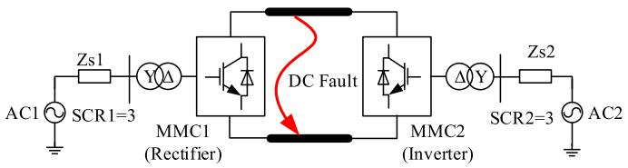  
Fig. 6. Diagram of the point-to-point HVdc system.

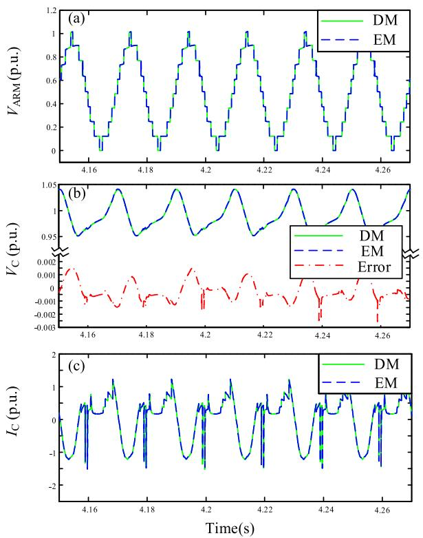  
Fig. 7. The waveforms during steady state: (a) The MMC arm voltage; (b) The sub-module capacitor voltage; (c) The capacitor current.

is modelled entirely within PSCAD, the main EMT solver. In the proposed equivalent model, the recursive model is handled outside the main EMT solution and interfaces to the EMT solver as a Norton Equivalent as described in Section III-C.

The computer used in this paper is an Intel(R) Core(TM) i7- 6700 3.40 GHz CPU with 16 GB RAM and 64-bit Windows 10 Operating System. All the models were implemented on PSCAD/EMTDC Professional V4.6.

# A. Accuracy

For checking its accuracy, as in Fig. 6, a point-to-point HVdc transmission system, modelled with the proposed equivalent circuit approach is compared with a fully detailed EMT model. The converter topology is as in Fig. 3 with 8 SMs per arm. The rectifier MMC controls the dc voltage and its ac bus voltage while the inverter MMC controls the real power and its ac bus voltage. The converter is rated at 300 MW, +/−200 kV. Each SM capacitance is 480 μF.

1) Steady-State Operation: Fig. 7 shows the steady state voltage waveform of an arm and the steady capacitor voltage and currents of the 3rd sub-module in upper arm of phase

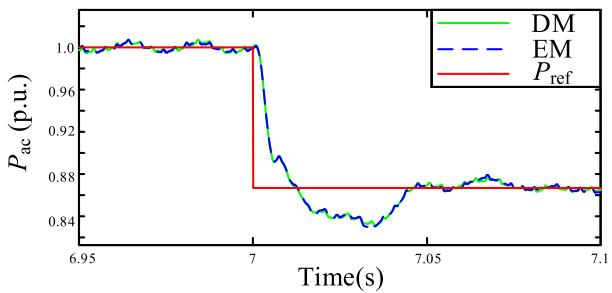  
Fig. 8. The real power during step change.

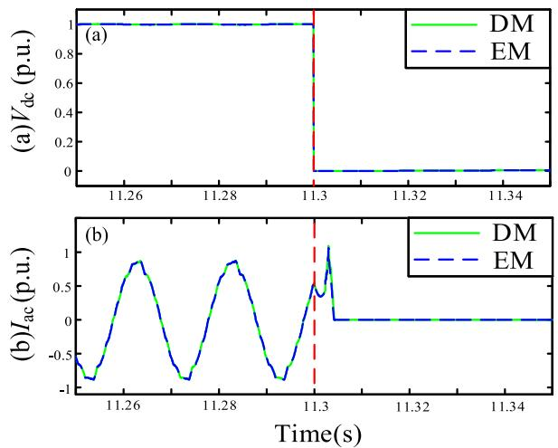  
Fig. 9. The waveforms during dc fault blocking: (a) The dc voltage; (b) The ac line current.

A in the rectifier MMC1. Results are shown for the proposed equivalent model (EM) as well as for the fully detailed model (DM) for comparison.

In Fig. 7 the two traces are essentially overlapping and indistinguishable. As an additional accuracy check, Fig. 7(b) also shows the error between the two waveforms from the two models. Again, the agreement is excellent, with the peak error typically less than 0.2%, indicating that the proposed approach has negligible accuracy loss.

2) Step Change in Power Order: $\mathrm { A t t } = 7 .$ .0s, the power reference is changed from $\mathrm { P _ { r e f } = 3 0 0 M W }$ to $\mathrm { P _ { r e f } = 2 6 0 M W }$ , and the resulting ac side power is plotted in Fig. 8. Again, the results are virtually indistinguishable.   
3) DC Fault Blocking: One of the desirable features of the two-port sub-module is that it is able to clear a dc side fault. This is evidenced by the simulation in Fig. 9. ${ \mathrm { A t ~ t ~ } } = 1 1 . 3 ~ { \mathrm { s } } ,$ a pole-to-pole short-circuit fault is applied at the dc-line of the MMC-HVdc system. After fault detection, which takes about 3 ms, the firing pulses to all IGBTs in the inverter and rectifier MMCs are blocked at t = 11.303s. The dc voltage and ac line current are shown in Fig. 9(a) and (b). On fault application the dc voltage collapses to zero. As is clearly evident, the simple act of blocking firing pulses results in the ac side current going to zero and this clears the dc side fault, which would not be the case for the traditional one-port half-bridge MMC. Again, the proposed model gives virtually the same result as the detailed model.

TABLE I CPU TIMES RESULTS   

<table><tr><td>SM count per arm (k)</td><td>CPU times (s) (DM)</td><td>CPU times (s) (EM)</td><td>Speedup factor</td></tr><tr><td>48</td><td>456.9</td><td>7.9</td><td>57.8</td></tr><tr><td>72</td><td>1125.1</td><td>10.6</td><td>106.1</td></tr><tr><td>144</td><td>5122.5</td><td>23.5</td><td>217.9</td></tr><tr><td>288</td><td>26722.8</td><td>45.2</td><td>591.2</td></tr><tr><td>576</td><td>110235.6</td><td>88.5</td><td>1245.6</td></tr></table>

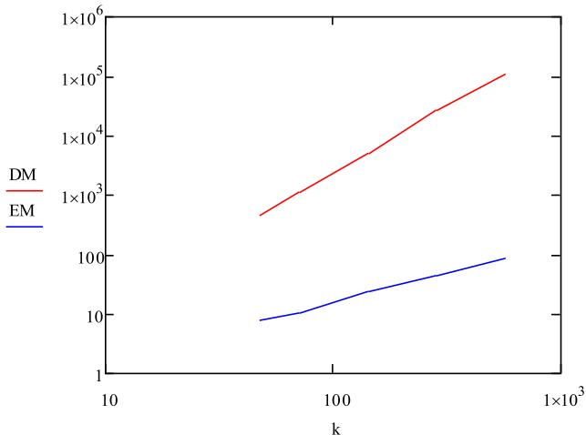  
Fig. 10. CPU times of the MMC models.

# B. Speedup Factor

In order to quantify the speedup, an MMC terminal together with the ac side network of short circuit ratio of 3 was simulated with two-port sub-module numbers of 48, 72, 144, 288 and 576 SMs per arm. The simulation time step was 20 μs and duration was 1s. The computational times as well as the speedup factor for the varying number of SMs are listed in Table I.

For a SM count 72, the speedup is over 2 orders of magnitude. With 576 SMs, which is a number in the upper side of the practical range of actual MMCs, the proposed model gives a speedup of 1245.6, which is over 3 orders of magnitude faster than the detailed model.

The CPU times in Table I are also graphically shown in Fig. 10. Both x- and y-axis scales are logarithmic. An interesting observation is that the computation time (CT) for the proposed EM is almost linear with the SM count k approximated by the linear equation $\mathrm { C T } = 0 . 1 5 \mathrm { k } + 1 . 8$ . On the other hand, for the DM, the CT rises more drastically and follows a polynomial relationship of order 2.3, with the SM count, approximately given by $\mathrm { C T = 0 . 0 5 3 k ^ { 2 . 3 } + 8 0 }$ .

# V. CONCLUSION

In this paper, a fast and accurate electromagnetic transient modeling approach of the MMC-HVDC converters composed of arbitrary multi-port SMs using generalized Norton Equivalents is developed. It sequentially combines SM blocks into larger blocks until a single equivalent is realized for the bridge arm with only 2m external interface nodes. The resulting small

(2m×2m-size) admittance matrix is overlaid onto the external systems admittance matrix, and the history current contributions from the MMC circuit are added to the history current contributions of the external network only at the interface nodes. This greatly reduces the computational burden on the main EMT solver and achieves significant speedup which can be over three orders of magnitude for large SM counts. Although internal nodes are eliminated in this approach, internal node voltages and branch currents are recovered by a recursive procedure that works inwards once the interface nodes are solved for by reversing the process by which the blocks were created.

The developed high-speed multi-port MMC models are validated by comparison with an EMT simulation of the detailed model with each SM modelled separately. Simulation results show that the proposed models are accurate and the simulation time scales linearly with the SM count, as opposed to an order 2.3 with the detailed model.

# ACKNOWLEDGMENT

The authors would like to show their thanks to Dr. Yi Zhang and Dr. Hui Ding from RTDS Technologies Inc. for providing many useful suggestions.

# REFERENCES

[1] S. Debnath, J. Qin, B. Bahrani, M. Saeedifard, and P. Barbosa, “Operation, control, and applications of the modular multilevel converter: A review,” IEEE Trans. Power Del., vol. 30, no. 1, pp. 37–53, Jan. 2015.   
[2] H. Wang, G. Tang, Z. He, and J. Yang, “Efficient grounding for modular multilevel HVDC converters (MMC) on the ac side,” IEEE Trans. Power Del., vol. 29, no. 3, pp. 1262–1272, Jun. 2014.   
[3] W. Lin, D. Jovcic, S. Nguefeu, and H. Saad, “Full-bridge MMC converter optimal design to HVDC operational requirements,” IEEE Trans. Power Del., vol. 31, no. 3, pp. 1342–1350, Jun. 2016.   
[4] J. Xu, C. Zhao, W. Liu, and C. Guo, “Accelerated model of modular multilevel converters in PSCAD/EMTDC,” IEEE Trans. Power Del., vol. 28, no. 1, pp. 129–136, Jan. 2013.   
[5] G. P. Adam and B. W. Williams, “Half- and full-bridge modular multilevel converter models for simulations of full-scale HVDC links and multiterminal dc grids,” IEEE Emerging Sel. Topics Power Electron., vol. 2, no. 4, pp. 1089–1108, Dec. 2014.   
[6] K. Strunz and E. Carlson, “Nested fast and simultaneous solution for timedomain simulation of integrative power-electric and electronic systems,” IEEE Trans. Power Del., vol. 22, no. 1, pp. 277–287, Jan. 2007.   
[7] G. Kron, Diakoptics. London, U.K.: Macdonald, 1963.   
[8] A. Brameller, M. N. John, and M. R. Scott, Practical Diakoptics for Electrical Networks. London, U.K.: Chapman & Hall, 1969.   
[9] Z. Xu, X. Dai, and L. Zhao, “The digital simulation of HVDC system by diakoptic interface variable equation approach,” in Proc. Int. Conf. Power Syst. Technol., vol. 1, Sep. 1991, pp. 440–443.   
[10] U. N. Gnanarathna, A. M. Gole, and R. P. Jayasinghe, “Efficient modeling of modular multilevel HVDC converters (MMC) on electromagnetic transient simulation programs,” IEEE Trans. Power Del., vol. 26, no. 1, pp. 316–324, Jan. 2011.   
[11] F. B. Ajaei and R. Iravani, “Enhanced equivalent model of the modular multilevel converter,” IEEE Trans. Power Del., vol. 30, no. 2, pp. 666–673, Apr. 2015.   
[12] J. Xu et al., “Enhanced high-speed electromagnetic transient simulation of MMC-MTdc grid,” Int. J. Electr. Power Energy Syst., vol. 83, no. 1, pp. 7–14, 2016.   
[13] F. Yu, W. Lin, X. Wang, and D. Xie, “Fast voltage-balancing control and fast numerical simulation model for the modular multilevel converter,” IEEE Trans. Power Del., vol. 30, no. 1, pp. 220–228, Feb. 2015.   
[14] A. Beddard, M. Barnes, and R. Preece, “Comparison of detailed modeling techniques for MMC employed on VSC-HVDC schemes,” IEEE Trans. Power Del., vol. 30, no. 2, pp. 579–589, Apr. 2015.

[15] M. Matar, D. Paradis, and R. Iravani., “Real-time simulation of modular multilevel converters for controller hardware-in-the-loop testing,” IEEE Trans. Power Del., vol. 9, no. 1, pp. 42–50, Feb. 2016.   
[16] H. Saad, T. Ould-Bachir, J. Mahseredjian, C. Dufour, S. Dennetiere, and S. ` Nguefeu, “Real-time simulation of MMCs using CPU and FPGA,” IEEE Trans. Power Del., vol. 30, no. 1, pp. 259–267, Jan. 2015.   
[17] T. Ould-Bachir, H. Saad, S. Dennetiere, and J. Mahseredjian, ` “CPU/FPGA-based real-time simulation of a two-terminal MMC-HVDC system,” IEEE Trans. Power Del., vol. 32, no. 2, pp. 647–655, Apr. 2017.   
[18] S. M. Goetz, A. V. Peterchev, and T. Weyh, “Modular multilevel converter with series and parallel module connectivity: topology and control,” IEEE Trans. Power Del., vol. 30, no. 1, pp. 203–215, Jan. 2015.   
[19] S. M. Goetz, Z. Li, X. Liang, C. Zhang, S. M. Lukic, and A. V. Peterchev, “Control of modular multilevel converter with parallel connectivity— Application to battery systems,” IEEE Trans. Power Electron., vol. 32, no. 11, pp. 8381–8392, Nov. 2017.   
[20] S. M. Goetz, Z. Li, A. V. Peterchev, X. Liang, C. Zhang, and S. M. Lukic, “Sensorless scheduling of the modular multilevel seriesparallel converter: Enabling a flexible, efficient, modular battery,” in Proc. IEEE Appl. Power Electron. Conf. Expo., Long Beach, CA, USA, Mar. 2016, pp. 2349–2354.   
[21] C. Gao, X. Liu, J. Liu, Y. Guo, and Z. Chen, “Multilevel converter with capacitor voltage actively balanced using reduced number of voltage sensors for high power applications,” IET Power Electron., vol. 9, no. 7, pp. 1462–1473, Jun. 2016.   
[22] H. W. Dommel, “Digital computation of electromagnetic transients in single and multi-phase networks,” IEEE Trans. Power App. Syst., vol. PAS-88, no. 4, pp. 388–399, Apr. 1969.   
[23] G. Corazza, C. Someda, and G. Longo, “Generalized Thevenin’s theorem for linear N-Port networks,” IEEE Trans. Circuit Theory, vol. 16, no. 4, pp. 564–566, Nov. 1969.   
[24] A. M. Gole et al., “Modeling of power electronic apparatus: Additional interpolation issues,” in Proc. Int. Conf. Power Syst. Transients, Seattle, WA, USA, Jun. 1997, pp. 23–28.

Shengtao Fan (M’11) was born in Shandong, China, in 1981. He received the B.Sc. degree in electronic information science and technology from Shandong University, Weihai, China, in 2002, and the Ph.D. degree in mechatronics engineering from Beihang University, Beijing, China, in 2009. From 2009 to 2012, he worked in the Power System Department, China Electric Power Research Institute with an emphasis on the development of TS-EMT hybrid simulation. From 2012 to 2014, he worked as a Postdoctoral Fellow with the University of Manitoba, Winnipeg, MB,

Canada, working on the computation of electromagnetic transients in power systems. Currently, he is working as a Research Assistant with the University of Manitoba.

Chengyong Zhao (M’05–SM’15) was born in Zhejiang, China. He received the B.S., M.S., and Ph.D. degrees in power system and its automation from North China Electric Power University (NCEPU), Beijing, China, in 1988, 1993, and 2001, respectively. He was a Visiting Professor with the University of Manitoba from Jan. 2013 to Apr. 2013 and Sep. 2016 to Oct. 2016. Currently, he is a Professor in the School of Electrical and Electronic Engineering, NCEPU. His research interests include HVdc system and dc grid.

Jianzhong Xu (M’14) was born in Shanxi, China. He received the B.S. and Ph.D. degrees from North China Electric Power University (NCEPU), Beijing, China, in 2009 and 2014, respectively. Currently, he is an Associate Professor in the State Key Laboratory of Alternate Electrical Power System with Renewable Energy Sources, NCEPU. From 2012 to 2013 and 2016 to 2017, he was, respectively, a joint Ph.D. student and a Postdoctoral Fellow with the University of Manitoba. He is currently working on the highspeed electromagnetic transient modeling and control

and protection of MMC-HVdc and dc grid.

Aniruddha M. Gole (S’77–M’82–SM’04–F’10) received the B.Tech. degree in electrical engineering from the Indian Institute of Technology, Bombay, India, in 1978, and the Ph.D. degree from the University of Manitoba, Winnipeg, MB, Canada, in 1982. He is a Distinguished Professor and an NSERC Industrial Research Chair in Power Systems Simulation, University of Manitoba. Prof. Gole is a Registered Professional Engineer in the Province of Manitoba. He received the IEEE Power Engineering Society Nari Hingorani FACTS Award in 2007.