# Initializing EMT models of grid forming VSCs in MTDC systems

Ahmad Allabadi a,* , Jean Mahseredjian a , Keijo Jacobs a , S´ebastien Denneti`ere b , Ilhan Kocar c , Tarek Ould-Bachir a

a Department of Electrical Engineering, Polytechnique Montr´eal, Canada   
b R´eseau de Transport d’Electricit´e, Paris, France   
c Department of Electrical Engineering, Hong Kong Polytechnic University, Hong Kong

# A R T I C L E I N F O

Keywords:

HVDC

EMT

Offline simulation

MTDC

Initialization

# A B S T R A C T

This paper highlights the importance of proper initialization techniques for simulation model stability and computational efficiency of multi-terminal direct current (MTDC) systems. A steady-state approach is presented for initializing grid-forming voltage source converters (GVSCs). Moreover, for black-box GVSC models, a generic initialization method, called decoupling interface (DI) is proposed. The method is tested on the CIGRE BM4 benchmark using EMTP. Compared to an existing load-flow initialization technique, both initialization methods reduce the complete system initialization time by 6.9 times.

# 1. Introduction

High Voltage Direct Current (HVDC) systems started a new era in efficient power transmission over long distances. Recent innovations in voltage-source converter (VSC) technology have contributed to the increased manageability, reliability, and flexibility of HVDC systems [1]. Multi-Terminal Direct Current (MTDC) networks are engineered to facilitate the collection and seamless integration of remote onshore and offshore renewable energy sources. Additionally, these networks are designed to interconnect different grids and systems, including weak networks or networks with different nominal frequencies [2].

Successful design, operation, and maintenance of MTDC systems hinge on the effective application of simulation techniques and models. Within this context, electromagnetic transient (EMT) simulation tools and models are fundamental for the comprehensive simulation of MTDC system [3]. Simulating large-scale systems with intricate models of MTDC converters and inverter-based resources (IBR) can lead to lengthy computation times. Various techniques can be employed to accelerate EMT simulations, such as parallelizing the simulations [4-7], optimizing grid component models with a heavy computational burden [8,9], and utilizing simulation initialization methodologies [10]. Nevertheless, there is a scarcity of literature addressing initialization methods for large-scale AC-DC systems [10,11].

Typically, transient studies for MTDC systems are conducted once a system attains steady-state (SS) in time-domain. However, for medium and large systems, the simulation time required for initialization can

become unacceptably lengthy.

The load-flow (LF) solution method [12-17] can be used to automatically initialize complex power systems with various grid components and controls, such as exciters and governors [17]. Challenges arise in the presence of power electronic converters with their complex control systems. While it is possible to initialize converter controls, the necessary calculations can be tedious and are dependent on the system’s topology.In [10], accurate SS analysis and initialization is proposed for the modular multilevel converter (MMC), including its detailed control system. It is a model-based initialization that cannot be used for generic MTDC systems. Another concern is that grid component models might be proprietary and in a black-box form, making their internal details inaccessible. For such models, using analytic initialization is not possible. The authors of [18] proposed a technique for initializing large ac-dc systems that include black-box models. However, it requires determining the Thevenin equivalents for all devices. For large MTDC grid models, such a procedure becomes time-consuming and complex to generalize.

In HVDC systems, the main control mode used for Grid forming VSC (GVSC) is V/f control. It is used for integrating the ac islands into the MTDC network, for collecting renewable power from offshore resources, and for feeding passive loads. In case of multiple GVSCs in the same island, V/f control can be combined with voltage droop [19,20],. On the other hand, in cases of connecting the GVSC with ac grids, a power synchronizing loop, a virtual oscillator, or others can be used [19,21],.

This paper presents two methods for the automatic initialization of

V/f-GVSC connected to an MTDC system and compares them with an existing LF initialization method. The first method, called Control Initialization in SS (CISS), is by performing SS analysis for the GVSC to initialize its outer control system. The second method, known as Decoupling Interface (DI), does not necessitate knowledge of model parameters or access to the internal GVSC control system, apart from an understanding of the outer control mode. Therefore, it can be applied to black-box models. Both proposed methods can achieve fast and stable initialization for interacting VSC and IBR components. The proposed methods are tested on large-scale MTDC grid benchmark model, CIGRE BM4 [2].

This paper is divided into five sections. Section II demonstrates an existing LF initialization method. Section III introduces the SS analysis required to initialize the GVSC control. Section IV introduces the second method (DI) for initializing the GVSC. Finally, Section V presents the EMT simulation of the CIGRE BM4 benchmark.

# 2. Overview of load-flow based initialization

The initialization process based on LF ensures precise computation of SS values across diverse grid components, ultimately resulting in an effective initialization of the system. It comprises three main steps described below.

Load-flow solution: The first step is to determine the system SS operating point by finding the LF solution. This is accomplished by accounting for the constraints of the controlled buses. As MTDC systems are ac-dc systems, ac-dc LF is required to determine the accurate SS operating point of the system, more details about this step can be found in [15] and [16].

Steady-state solution and initialization: Following the acquisition of LF results, the SS solution uses lumped models to calculate currents and voltages for all grid components. Each grid component is initialized by computing the initial values of its internal variables, which include power components and control systems. In EMTP® [17] this step allows to initialize automatically conventional systems, such as rotating machines with related controls, and all passive components (lines/cables, transformers, etc.).

Time-domain initialization: The last step focuses on more complex IBR subsystems which are called time-domain initialized subcircuits (TDISs). Initializing such subsystems through SS analysis is complex since all control variables and signals must be initialized in addition to converter circuit. Therefore, this portion of the initialization is done by direct timedomain simulation.

An existing approach in EMTP® is presented in Fig. 1 it is named LF and source initialization (LFSI). An auxiliary voltage source is temporarily (duration Ti) added at the terminals of each TDIS to fix the voltage at the SS phasor value found from the LF solution. Consequently, the control system ramps up until its SS operating point, after which the auxiliary source is disconnected from TDIS terminals. Some important parts in control functions, such as the PLL, are also initialized.

While the third step proves effective in certain scenarios, it may not

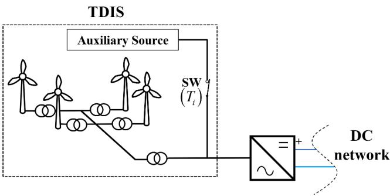  
Fig. 1. Time-domain initialization for wind park.

always work when the TDIS is a GVSC, or renewable resource model connected to a GVSC. For instance, consider the TDIS in Fig. 1 which contains a complete wind park model connected to a GVSC in V/f control mode. Both the GVSC and the wind park model are TDISs. Auxiliary voltage sources are included at the GVSC and the wind park (or photovoltaic) terminals. Therefore, once starting the time-domain simulation, the GVSC control (shown in Fig. 2) measures the voltage magnitude, $| V _ { a c } | ;$ , seen from the auxiliary source instead of the actual values. Consequently, since the auxiliary source has an amplitude of $| V _ { a c } |$ c|that matches the control setpoint, the error signal (e) will be zero. Therefore, $E _ { d } ^ { r e f }$ will be

$$
E _ {d} ^ {r e f} = K _ {i} h + \left| V _ {a c} ^ {s e t} \right|, \tag {1}
$$

where h is the initial condition of the integrator.

If this integrator is not initialized, i.e. $h = 0 , E _ { d } ^ { r e f } \mathrm { w i l l }$ be set to an incorrect value of $E _ { d } ^ { r e f } = \left| V _ { a c } ^ { s e t } \right|$ . The corresponding $E _ { a b c } ^ { r e f }$ will also become incorrect. Since the active and reactive powers delivered to the GVSC depend on $E _ { a b c } ^ { r e f }$ Eabc, , the GVSC will operate at an incorrect operating point. This constitutes a conflict between LFSI and the actual control. Once $T _ { i }$ elapses and the auxiliary sources are disconnected, the operating points of the wind park and VSC will differ, leading to a long transient that delays initialization.

Two methods are proposed below for improving the time-domain initialization step. The first method (CISS) involves initializing the main PI controllers of GVSC control by performing SS analysis. The second is a generic method called DI. In both methods, all non-initialized converter control variables are rapidly and automatically self-initialized through time-domain computations due to forcing from SS solution.

# 3. GVSC control initialization by SS analysis

This method (CISS) calculates the initial condition (h) of GVSC’s PI controller at the LFSI setup. This method does not replace the LFSI method, but it fixes the conflict demonstrated in section II. The prerequisites for this step are the LF results and GVSC model parameters.

Fig. 3 shows the ac side of a GVSC represented by an average value model (AVM) in pu quantities. In this figure $\overrightarrow { E } _ { a b c } ^ { r e f }$ is the internal voltage of the GVSC, $\overrightarrow { I } _ { a c }$ is the ac current phasor, $\overrightarrow { Z } _ { t r }$ and $j X _ { L a r m } / 2$ are the equivalent impedances of the GVSC transformer and arm inductance, respectively. More information about that model can be found in [1]. By applying KVL:

$$
\overrightarrow {V} _ {P C C} ^ {L F} - \overrightarrow {I} _ {a c} \left(\overrightarrow {Z} _ {t r} + j X _ {L a r m} / 2\right) = \overrightarrow {E} _ {a b c} ^ {r e f} \tag {2}
$$

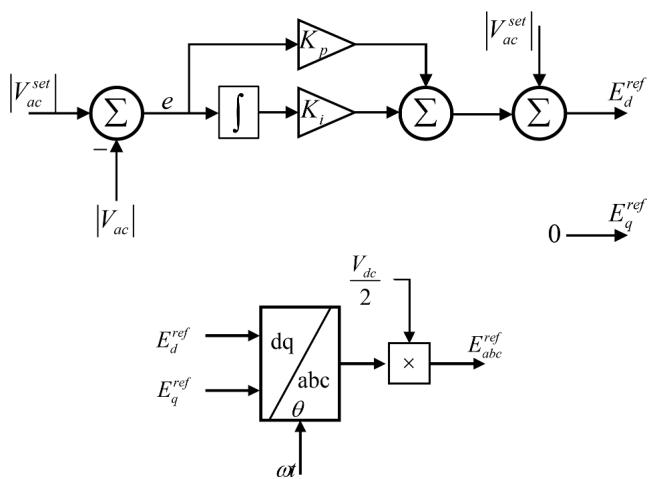  
Fig. 2. GVSC control schematic.

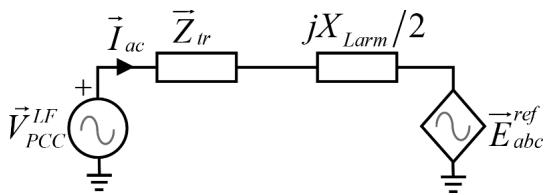  
Fig. 3. AC side representation in phasor domain of GVSC modelled by its AVM.

where from Fig. 2,

$$
\overrightarrow {E} _ {a b c} ^ {\text {r e f}} = \left(E _ {d} ^ {\text {r e f}} + j E _ {q} ^ {\text {r e f}}\right) \frac {V _ {d c}}{2} \tag {3}
$$

Since $E _ { q } ^ { r e f }$ is always zero, by utilizing (1) and (3), one can rewrite (2) as

$$
h = \frac {1}{K _ {i}} \left\{\frac {2}{V _ {d c}} \left[ \vec {V} _ {P C C} ^ {L F} - \vec {I} _ {a c} \left(\vec {Z} _ {t r} + \frac {j X _ {L a r m}}{2}\right) \right] - \left| V _ {a c} ^ {s e t} \right| \right\} \tag {4}
$$

Therefore, by utilizing (4), the initial condition h can be calculated using the voltage and current phasors which are taken from the LF. Ultimately, the integrator would be initialized correctly and start from the correct SS operating point.

# 4. Time-domain initialization using Decoupling interface

The proposed DI method replaces the auxiliary voltage source in the GVSC time-domain initialization. It is designed to prevent startup control conflicts and to suppress the interactions between islanded grid subsystem (IGS) components and their GVSC.

The high-level overview of the DI method is presented in Fig. 4. It isolates (i.e., decouples) the IGS from the GVSC by adding interfacing auxiliary sources (IASs). Then, the decoupled system is simulated in time-domain until SS operating point. Finally, the network is switched back to its coupled mode by removing the IASs and reconnecting the IGS to achieve smooth initialization. The interfacing sources can be included in the models, to eliminate software user intervention. In the following, these steps are described in detail.

# 4.1. System decoupling

All IGSs are disconnected from their corresponding GVSCs as shown in Fig. 5. Two IAS are inserted: the equivalent auxiliary source and the replicating auxiliary source. The equivalent auxiliary source is an independent source that represents the SS behaviour of the IGS, therefore, it should supply the converter with the same P and Q values found in the SS solution. Since the GVSC is controlling $V _ { a c \mathbf { a n d } \mathbf { f } } ,$ this source can be represented by an ac current source to achieve SS values for P and Q. The source phasor is found from the LF solution.

On the other side, the replicating auxiliary source represents the

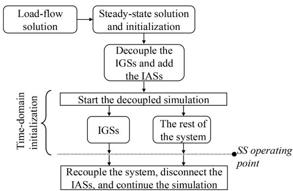  
Fig. 4. The DI initialization method.

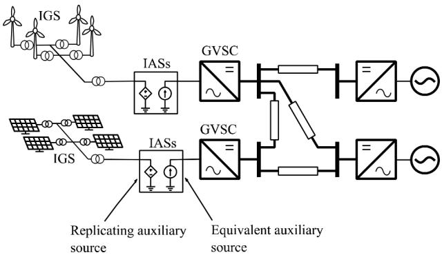  
Fig. 5. The DI initialization system.

replica of GVSC in time-domain. The role of the IAS is to ramp up the IGS independently from the GVSC. It is modelled by a dependent source that interfaces the ac voltage waveforms of GVSC’s at the PCC.

# 4.2. Decoupled simulation and recoupling

Following system decoupling, the time-domain simulation commences. All IGS and the decoupled GVSC are initialized separately. Once they reach their SS conditions within a predefined tolerance, the recoupling is initiated. All IASs are disconnected, and the original MTDC network is recreated.

# 5. Performance evaluation

The new DI method proposed in this paper, is implemented in EMTP® [17] and tested on the CIGRE BM4 benchmark [2] shown in Fig. 6. BM4 consists of three interconnected HVDC systems. The first one is a monopolar point-to-point (P2P) line (Cm-D1 and Cm-D2). The second system is a five-terminal Bipolar MTDC system (Cb-D3, Cb-D4, Cb-D6, Cb-D7, and Cb-D9). The last one is a four terminal monopolar system (Cm-D5, Cm-D10, Cm-D12, and Cm-D13).

The DI initialization method is compared with the CISS method and the basic LFSI method described in section II. The MTDC components are modeled as described in Table 1, where $T _ { i }$ represent the time for removing the auxiliary sources from the TDIS models as explained in section II. The shown $T _ { i }$ values are applicable for both the LFSI and CISS methods.

For the DI method, it is only implemented on the links between GVSCs and their islanded grids. The rest of the system including the other VSC types are remain initialized the default LFSI method. Since most of the IGSs are wind parks, the DI is set to recouple at 0.5 s. All simulations are conducted using a time-step of $1 0 \mu s .$ . The initialization is considered complete $( \mathrm { i . e . , }$ the MTDC system is in SS) when the power and voltage are within a ±1% of the LF results.

The time-domain results of the first system (the P2P line) are shown in Fig. 7. As depicted in Fig. 7.(a), the LFSI method starts to ramp the power and settles initially at the wrong SS operating point due to the auxiliary sources (the GVSC and wind park sources). Consequently, the $V _ { d c }$ controlled VSC (Cm-D2) in Fig. 7.(b) receives incorrect dc power and settles also on a wrong operating point. Once the wind park Ti elapses, the auxiliary sources are disconnected and the GVSC control starts to correct the operating point to reach the correct SS and Cm-D2 follows. LFSI finds SS within 1.45 s of simulation interval. Both the CISS and the DI initialization methods show comparable performance. They initialize quickly within 0.15 s and 0.3 s, respectively.

Fig. 8 shows the results for the bipolar MTDC powers. In this case, a longer time required for the LFSI method to reach SS. The $V _ { d c }$ controlled VSC (Cb-D6) requires 3.4 s to settle. The main reason here is the fact that the bipolar system is connected with the monopolar through Cd-D5 dcdc converter, therefore, a power oscillation can be seen through Cd-D5

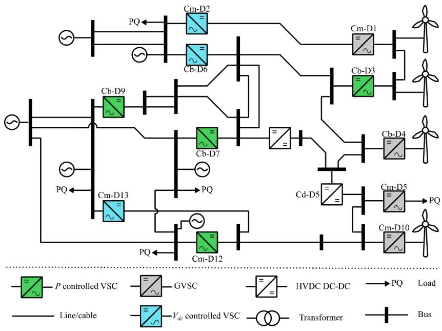  
Fig. 6. The CIGRE BM4 benchmark.

Table 1 Model types used in BM4.   

<table><tr><td>Device</td><td>Modelled by</td></tr><tr><td>MMC</td><td>Arm Equivalent Model (Model 3 in [3]), Ti=0.2s</td></tr><tr><td>dc-dc converters</td><td>Ideal dc transformers</td></tr><tr><td>Wind parks</td><td>Aggregated DFIG models with controls, Ti=0.5s</td></tr><tr><td>Electrical loads</td><td>Fixed impedances</td></tr><tr><td>Lines /cables</td><td>Wideband models</td></tr></table>

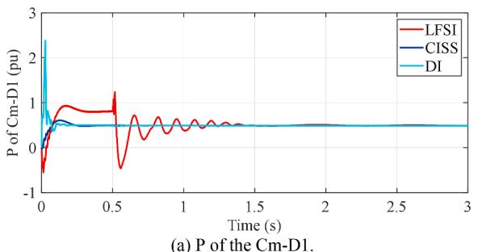

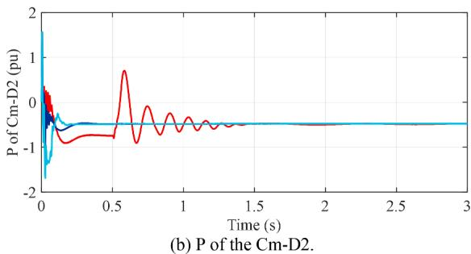  
Fig. 7. Initialization with LFSI, CISS and DI methods, P2P line powers in BM4.

in Fig. 8.(c). On the other hand, DI and CISS show comparable performance and allow Cd-D5 to settle within 0.4 s.

The monopolar system initialization is shown in Fig. 9. The GVSC (Cm-D5) is connected to an electrical load where there is no auxiliary source. However, the effect of its own auxiliary source appears in LFSI case until 0.2 s. Both DI and CISS show comparable performances by

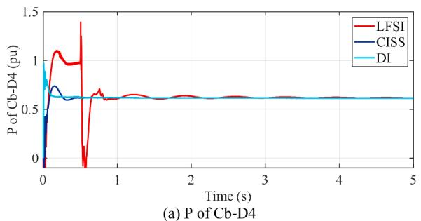

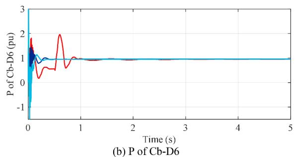

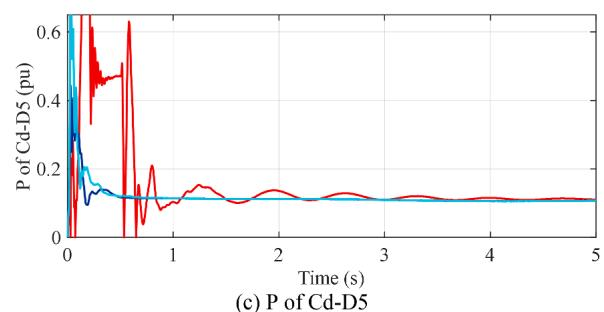  
Fig. 8. Initialization with LFSI, CISS and DI methods, Bipolar system in BM4 benchmark.

initializing the monopolar MTDC within 0.4 s. Ultimately, the entire BM4 benchmark reaches SS using LFSI before 3.4 s. Both CISS and DI accomplish SS solution before 0.5 s

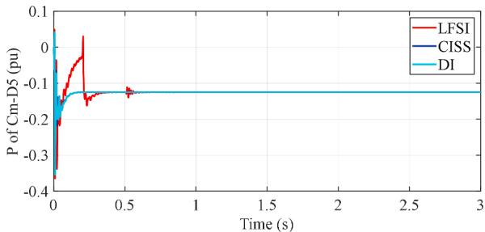  
(a)P of Cm-D5

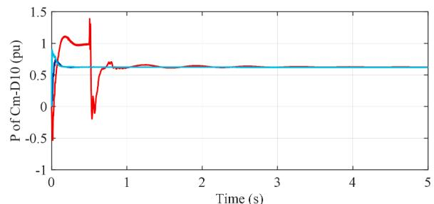  
(b)P of Cm-D10

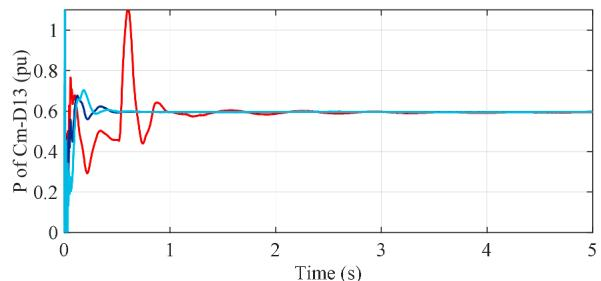  
(c) P of Cm-D13   
Fig. 9. Initialization with LFSI, CISS and DI methods, monopolar MTDC in BM4 benchmark.

# 5.1. Computational time gains

Table 2. compares initialization and CPU times for LFSI, CISS, and DI methods. The CPU time corresponds to the initialization interval. The computing time gain is used to quantify initialization performance. It represents the relative acceleration in CPU time for initialization when compared to LFSI method. Overall, both the DI and CISS methods demonstrate nearly identical initialization performance, achieving steady-state 6.9 times faster than LFSI. This highlights the advantages of both methods over existing LFSI. However, the DI method remains the most generic and efficiently applicable, as it does not require manual interventions like CISS, making it the preferred approach for the systems presented in this paper.

# 6. Conclusion

In this paper, two methods were proposed for the fast initialization of grid-forming voltage source converters. The methods align with loadflow solution results for traditional network generators, loads, as well as inverter-based resources connected to MTDC systems.

The first method named Control Initialization in SS (CISS) is set to initialize the PI controller of grid-forming voltage source converters. Its disadvantage is that it requires access to model parameters and internal control details.

The second method is named Decoupling Interface (DI). It can be applied to black-box grid-forming voltage source converters connected to wind or photovoltaic parks. It is more generic and more efficiently applied than CISS.

The presented initialization methods were tested on the CIGRE BM4

Table 2 Computational efficiency comparisons.   

<table><tr><td rowspan="2">Measure (s)</td><td colspan="3">Initialization method</td></tr><tr><td>LFSI</td><td>DI</td><td>CISS</td></tr><tr><td>Initialization interval</td><td>3.4</td><td>0.5</td><td>0.5</td></tr><tr><td>CPU time</td><td>1714.8</td><td>249.9</td><td>248.4</td></tr><tr><td>Computing time gain</td><td>1</td><td>6.9</td><td>6.9</td></tr></table>

benchmark using EMTP. The methods demonstrated fast initialization in a simulation interval below 0.5 s. The gains are significant when compared to an existing basic initialization technique. The presented methods are applicable to other converter control types and systems, and further demonstrations remain for future work.

# CRediT authorship contribution statement

Ahmad Allabadi: Conceptualization, Data curation, Methodology, Software, Writing – original draft, Writing – review & editing. Jean Mahseredjian: Conceptualization, Supervision, Validation, Software, Writing – review & editing. Keijo Jacobs: Writing – review & editing. Sebastien ´ Dennetiere: ` Supervision, Writing – review & editing. Ilhan Kocar: Supervision. Tarek Ould-Bachir: Supervision.

# Declaration of competing interest

The authors declare that they have no known competing financial interests or personal relationships that could have appeared to influence the work reported in this paper.

# Data availability

Data will be made available on request.

# References

[1] D. Jovcic, High Voltage Direct Current transmission: converters, Systems and DC Grids, John Wiley & Sons, 2019.   
[2] DC grid benchmark models for system studies, CIGRE Technical Brochure 804 (2020). June.   
[3] H. Saad, S. Denneti`ere, J. Mahseredjian, P. Delarue, X. Guillaud, J. Peralta, S. Nguefeu, Modular multilevel converter models for electromagnetic transients, IEEE Trans. Power Delivery 29 (3) (2014) 1481–1489, https://doi.org/10.1109/ TPWRD.2013.2285633.   
[4] M. Cai, J. Mahseredjian, U. Karaagac, A. El-Akoum, X. Fu, Functional mock-up interface based parallel multistep approach with signal correction for electromagnetic transients simulations, IEEE Trans. Power Syst. 34 (3) (2019) 2482–2484, https://doi.org/10.1109/TPWRS.2019.2902740.   
[5] C. Fu, T. Yang, Sparse LU factorization with partial pivoting on distributed memory machines, in: Proceedings of the 1996 ACM/IEEE Conference on Supercomputing, 1996, p. 31. -es.   
[6] A. Abusalah, O. Saad, J. Mahseredjian, U. Karaagac, I. Kocar, Accelerated sparse matrix-based computation of electromagnetic transients, IEEE Open Access J. Power Energy 7 (2020) 13–21, https://doi.org/10.1109/OAJPE.2019.2952776.   
[7] A. Stepanov, J. Mahseredjian, H. Saad, U. Karaagac, Parallelization of MMC detailed equivalent model, Electric Power Systems Res. 195 (2021) 107168, https://doi.org/10.1016/j.epsr.2021.107168.   
[8] A. Stepanov, J. Mahseredjian, U. Karaagac, H. Saad, Adaptive modular multilevel converter model for electromagnetic transient simulations, IEEE Trans. Power Delivery 36 (2) (2020) 803–813.   
[9] S. Yu, S. Zhang, Y. Wei, Y. Zhu, Y. Sun, Efficient and accurate hybrid model of modular multilevel converters for large MTDC systems, IET Generation, Transmission & Distribution 12 (7) (2018) 1565–1572.   
[10] A. Stepanov, H. Saad, U. Karaagac, J. Mahseredjian, Initialization of modular multilevel converter models for the simulation of electromagnetic transients, IEEE Trans. Power Delivery 34 (1) (2018) 290–300.   
[11] A. Leki´c, H. Ergun, J. Beerten, Initialisation of a hybrid AC/DC power system for harmonic stability analysis using a power flow formulation, High Voltage 5 (5) (2020) 534–542.   
[12] N. Rashidirad, J. Mahseredjian, I. Kocar, U. Karaagac, O. Saad, MANA-Based loadflow solution for islanded AC microgrids, IEEE Trans. Smart Grid (2022) 1, https:// doi.org/10.1109/TSG.2022.3199762. -1.

[13] H.M.A. Ahmed, A.B. Eltantawy, M.M.A. Salama, A generalized approach to the load flow analysis of AC–DC hybrid distribution systems, IEEE Trans. Power Syst. 33 (2) (2018) 2117–2127, https://doi.org/10.1109/TPWRS.2017.2720666.   
[14] J. Lei, T. An, Z. Du, Z. Yuan, A general unified AC/DC power flow algorithm with MTDC, IEEE Trans. Power Syst. 32 (4) (2017) 2837–2846, https://doi.org/ 10.1109/TPWRS.2016.2628083.   
[15] R. Benato, G. Gardan, A Novel AC/DC power Flow: HVDC-LCC/VSC inclusion Into the PFPD bus admittance matrix, IEEE Access 10 (2022) 38123–38136, https://doi. org/10.1109/ACCESS.2022.3165183.   
[16] N. Rashidirad, J. Mahseredjian, I. Kocar, U. Karaagac, Unified MANA-based loadflow for multi-frequency hybrid AC/DC multi-microgrids, Electric Power Syst. Res. 220 (2023) 109313.

[17] J. Mahseredjian, S. Denneti`ere, L. Dub´e, B. Khodabakhchian, L. G´erin-Lajoie, On a new approach for the simulation of transients in power systems, Electric Power Syst. Res. 77 (11) (2007) 1514–1520.   
[18] Y. Liu, Y. Song, L. Zhao, Y. Chen, C. Shen, A General Initialization Scheme for Electromagnetic Transient Simulation: towards Large-Scale Hybrid AC-DC Grids, in: 2020 IEEE Power & Energy Society General Meeting (PESGM), IEEE, 2020, pp. 1–5.   
[19] Guide for the Development of Models for, CIGRE Technical Brochure 604 (2014).   
[20] L. Zhang, Modeling and Control of VSC-HVDC Links Connected to Weak AC Systems, Royal Institute of Technology, Stockholm, Sweden, 2010. Ph.D. Thesis.   
[21] H. Zhang, W. Xiang, W. Lin, J. Wen, Grid forming converters in renewable energy sources dominated power grid: control strategy, stability, application, and challenges, J. Modern Power Syst. Clean Energy 9 (6) (2021) 1239–1256, https:// doi.org/10.35833/MPCE.2021.000257.