# ELECTROMAGNETIC TRANSIENT MODELING AND SIMULATION OF LARGE POWER SYSTEMS

EMT Simulators for the Future Grid

Shaahin Filizadeh , Jean Belanger, Flavio Fernandez , Paul Forsyth , Jean Mahseredjian , Jesus Morales , and Genevieve Lietz

# WHILE SIMPLIFIED PHASOR MODELING

has proved adequate for the assessment of the transient stability of large-scale conventional power systems (i.e., those dominated by large synchronous machines), extensive research and practical experience have shown that doing so for large grids heavily reliant on inverter-based resources (IBRs) is not adequate. This is in part because IBRs use power electronic converters with switching frequencies in the

Digital Object Identifier 10.1109/MPE.2024.3515921

Date of current version: 23 June 2025

kilohertz range, which calls for detailed models and advanced solution methods, and in part due to the diminishing system inertia that allows widespread impact from local dynamic events. Therefore, it has become necessary to conduct electromagnetic transient (EMT) simulations of more sophisticated and increasingly larger networks, reaching unprecedented numbers of nodes. There is a need for research, development, and innovation in terms of both solution algorithms and computational platforms to modernize EMT simulators so that they can meet the modeling demands of modern networks.

This article presents a number of such innovations that are being pursued by researchers, practicing engineers, and simulation software and hardware manufacturers. It also addresses future challenges and potential solutions as EMT simulators continue to evolve.

# Parallel and Fast Computation Methods in EMT Simulations

The basic principle of parallel computations in EMT-type solvers is based on the modeling of transmission lines (or cables). Instead of the classic pi-section model, it is possible to use the more accurate propagation delay-based model. Such a model creates a natural decoupling between the ends of the line and allows the formulation of a block-diagonal solution matrix. Each block (or subcircuit) can be solved on a separate processor and in parallel. Difficulties arise when the transmission line needed to split the network is short, thus forcing a small numerical integration time step smaller than the propagation delay. Another issue is the potential absence of delay-based transmission lines for network splitting. Other techniques, such as bordered blockdiagonal matrices, can be used in such cases. It has been recently demonstrated that the compensation method can be applied successfully, even in the presence of nonlinear models. Another approach is that of the combined nodal and state-space analysis methods, which enables the splitting of networks at arbitrary locations. Further research is required to fully automate such methods and optimize the blocks for efficient utilization of processors, thus achieving the fastest computations possible with sparse matrix solvers.

Another crucial aspect of accelerating computations is the automatic initialization of network models for starting the time-domain computations. The objective is to reach steady-state conditions as soon as possible to avoid unnecessary computational overhead. Lack of initialization may also lead to inappropriate operating modes or disconnection of renewable energy resources due to protection system trips caused by start-up transients. The initialization of networks with conventional generators

can be achieved perfectly from a power-flow solution. This also includes automatic initialization of synchronous generator controls. Difficulties arise in the presence of power electronic components or renewable energy resources (wind or photovoltaic power plants, for example). Special techniques must be used to accommodate converter circuits and force initial conditions found from power-flow solutions.

# Cosimulation of Power System Dynamics

Cosimulation is a modular simulation approach that has been widely used in many engineering fields. It consists of decomposing a complex problem into various subsystems that are solved individually. To compute the overall solution, the subsystems are then coupled via the exchange of simulation results at discrete time intervals. In general, the subsystems may have drastically different physical characteristics and may require various types of modeling methods or modeling in different domains.

The advantages of cosimulation arise from the individual solution of each subsystem and are primarily twofold. First, cosimulation allows for parallel computation of the subsystems and, therefore, could offer better overall computational performance in large-scale EMT simulation. Second, independent solvers with different degrees of modeling detail and different simulation step sizes can be used for each subsystem. The latter allows customization of modeling and solution methods for each subsystem to achieve an optimal balance between accuracy and computational intensity.

For instance, Figure 1 shows the combination of a detailed vendor-specific EMT model of a highvoltage direct current (HVdc) system, typically accounting for internal dynamics ranging from a few microseconds to a few milliseconds, coupled with a phasor-domain-type (PDT) model of the transmission networks, which accounts for the systemwide dynamics in the time range from a few milliseconds to several seconds. PDT-type models in the context of this article are those in which the dynamics of the network are ignored by using conventional phasor representation. Such models are

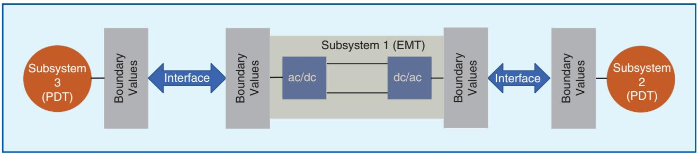  
Figure 1. Application case of hybrid cosimulation of a power system. PDT: phasor-domain type.

adequately accurate when the dynamic phenomena under investigation do not cause large deviations from the nominal frequency of the network, and as such, modeling the network using quasistatic phasors leads to negligible discrepancies.

Dynamic phasors (DPs) are mathematical artifacts that offer a highly flexible alternative to PDTtype models. DP models retain the dynamics of the network elements and thus provide accuracy over a much wider range of frequencies than PDT-type models. Their computational efficiency and hence their appeal for modeling very large systems stem from the fact that DPs represent the variations of the envelope of waveforms and allow for the use of much larger time steps than an EMT model. Compared to EMT models, DP models offer considerable computational gains when used for modeling

large portions of the grid where EMT-type modeling is not necessary, yet the frequency content of the transients is such that PDT models fall short.

The usage of DP models for large systems is not without its challenges. While DP models of conventional circuit elements may be readily obtained, the development of high-fidelity DP models for machines and transmission lines, including their nonlinear behavior (e.g., due to magnetic saturation) and the frequency dependence of parameters (in the case of transmission lines) is challenging and requires extensive work. Fortunately, research and model development work in this area is abundant, giving a positive outlook for the increased usage of DP-based models in large system studies.

Generic DP models are also available for several high-power converter topologies, including

line-commutated converters and modular multilevel converters for both normal and abnormal operating conditions. In general, DP representation of systems such as converters and frequency-dependent transmission lines is mathematically intensive and may require separate provisions for special modes of operation, e.g., when the converters are blocked.

Figure 2 shows another example of cosimulation wherein the system is split into several segments, each modeled with a specific solver. EMT1 and EMT2 include subsystems modeled in EMT with different time

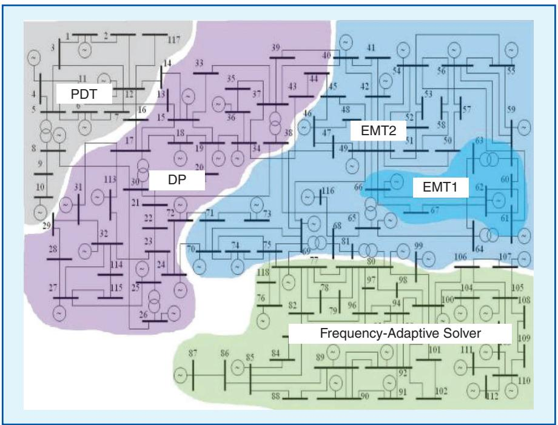  
Figure 2. Hybrid cosimulation of a large network with different solvers.

steps. These are subsystems where high-frequency dynamics/events are prevalent, e.g., in the vicinity of power electronic converters. DP and PDT are subsystems modeled using DP and PDT methods, respectively. The DP subsystem may act as a bridging zone between the EMT and PDT areas because of its frequency range. The subsystem labeled “frequencyadaptive solver” uses a specialized solver that switches between EMT and DP solutions, depending on the frequency contents of the waveforms. The decision to segment a large network into these subsystems is not unique and depends on several factors, including the location of high-frequency components, the locations where the study of interest is to be conducted, and the type(s) or disturbances to be studied. As the subsystems in Figures 1 and 2 use different modeling domains, they are referred to as hybrid cosimulation. Hybrid cosimulation can play an important role in cases where an EMT model of the full network is not available, EMT-level modeling is not necessary for the entire network, or as an interim solution toward pure large-scale EMT simulation. Hybrid cosimulations need to be considered carefully as currently they allow an enhanced allotment of computational resources to the subsystems of the network that require EMT-type modeling, while other parts of the network that do not require such detailed representation are modeled using less computationally expensive methods, e.g., DPs. It must, however, be noted that pockets within a large network may have to be represented using EMT models as DP models are either unavailable or limited in terms of accuracy. For example, DP models for power electronic converters are cumbersome to develop and are often restricted to certain operating conditions,

making their widespread use as replacements for EMT models limited. Currently, EMT–EMT cosimulation using the latency of long transmission lines to segment a network is a widely popular approach.

# Coupling Methods

Figure 3 depicts the cosimulation of two subsystems, illustratively of EMT and PDT types, with the simulation step size in the EMT subsystem being one fifth of that used in the PDT subsystem. The same applies in the case of two EMT subsystems being cosimulated simultaneously with different time steps to enhance simulation performance. To compute the global solution, the inputs and outputs of both systems are synchronized at the discrete times of the PDT-type simulation, as indicated by the gray arrows in the figure.

A necessary condition for the convergence of the solution is the nonexistence of algebraic loops between both subsystems, i.e., in the coupling equations. In this case, the accuracy of the cosimulation is equal to that obtained via the solution of the individual subsystems. This is the case if the system is split at boundaries with inherent time delays, such as long transmission lines. If the wave traveling time between the ends of the line belonging to different subsystems is longer than the cosimulation synchronization time, there is no algebraic coupling equation because of the dead time, and convergence of the solution is guaranteed. Another example of an inherent system split is that of digital controllers, where the synchronization time is smaller than the internal clock of the controller, typically in the range of a few

microseconds. While inherent system delays between the subsystems impose an upper bound on the synchronization time of the cosimulation and force the reduction of the simulation step size to a few microseconds, they allow for a highly parallelized cosimulation of the system without loss of accuracy.

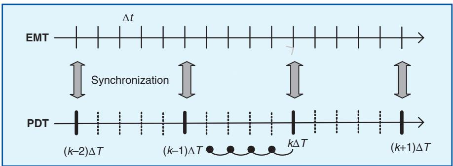  
Figure 3. Timeline for cosimulation of two subsystems: EMT simulations with a smaller time step are synchronized with PDT at larger intervals.

# EMT–EMT Cosimulation

EMT–EMT cosimulation can be used to accelerate computations. A parallel cosimulation can be created using methods such as the functional mockup interface (FMI) standard. It is noted that, according to this standard, it is possible to interface two or more simulation software packages from different domains in a cosimulation environment using a master–slave communication method. Any software that is FMI compliant can be set to interface with other FMI-compliant software. This means that a cosimulation setup can be created using different EMT software vendors.

The EMT–EMT cosimulation can also be performed in parallel. The network instances solved in parallel can be separated by transmission lines (or cables) with propagation delays. Different time steps might be used in subnetworks with sufficient accuracy due to the transmission line history interpolation process. A multiple time-step setup is presented in Figure 4 using the master–slave (subnetworks) concept of the FMI. Significant computational gains can be achieved using the parallel FMI cosimulation approach.

# Data Conversion

Hybrid cosimulation requires conversion of data exchanged between different subsystems. For example, in EMT–PDT cosimulation, phasors must

be extracted from EMT data. This is usually based on frequency analysis methods, such as the fast Fourier transform, although several other methods are available that produce similar, but not identical, results. Conversely, the data transferred from the PDT domain to the EMT domain must be time interpolated. To reduce the volume of transferred data and to make the exchange between different subsystems more efficient, data conversion is typically performed in the EMT domain.

# Model Exchange for Cosimulation

Cosimulation is not yet widely used in the electric power industry. This is partly due to a lack of standardization in the communication and simulation control protocols, causing cosimulation to require a nonnegligible effort to configure, as opposed to a “plug-and-play” solution. Lack of standardization is also a major challenge for the development and maintenance of large-scale simulation models as the models of cosimulated subsystems typically come from different sources (white- or black-box vendor models, real firmware code, different programming languages, etc.).

Consistent model exchange and simulation can be achieved either by a standard cosimulation protocol or by a common modeling language. An example of a dedicated, high-performance protocol is the C-interface specified in the FMI for co-

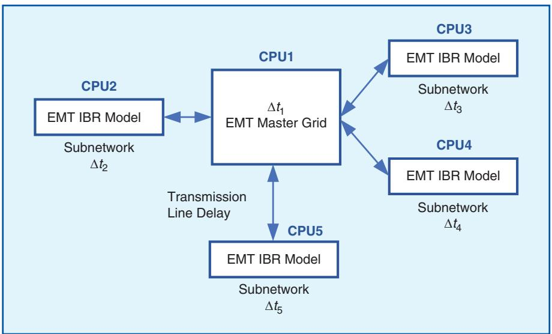  
Figure 4. Multiple time-step setup with cosimulation setup of EMT software instances.

simulation in Modelica. For the integration of “real code,” interfaces are under development to support the integration of digital controllers to existing dynamical models. Further standardization effort is expected to address the increasing demand for cross-platform cosimulation, not least to support cosimulation between interdisciplinary tools.

# Network Equivalents

An alternative to alleviate the CPU burden is the application

of network equivalents. Since EMT-type simulations are aimed at capturing time-domain responses with a broad frequency range, frequency-dependent network equivalent (FDNE) models are required. Normally, FDNE modeling is applied to a zone of the network that is interfaced with the main zone of interest (where the disturbances are studied). Splitting of the network is achieved arbitrarily, leading to a multiterminal connection between the zone of main interest (containing detailed models) and the FDNE model, as illustrated in Figure 5.

To calculate an FDNE model, a frequency scan of the network is required to obtain the frequencydependent parameters to be synthesized. These parameters can be impedance, admittance, scattered parameters, or transfer functions. Admittance parameters are used for convenience since they can be easily incorporated in the modified augmented nodal analysis solution. In a general case, a multiport frequency scan results in an N × N matrix signature of the network with discrete frequency samples. Each entry of the matrix is a complexvalued quantity with a magnitude and a phase angle, both of which vary with frequency.

Strictly speaking, the FDNE modeling technique is only valid for linear systems, although a frequency scan of a network with nonlinear components around a nearly linear operating point can provide a fair approximation. The key stage in FDNE modeling consists of finding the parameters (coefficients) of a synthetic mathematical representation that matches (within an error tolerance) the network frequency. The process of finding those parameters is also known as fitting. The vector fitting method is a popular fitting technique that can be successfully used in the context of FDNE. One of the challenges in the fitting stage is to find an appropriate model order. Note that increasing the model order leads to a refined match (and hence a lower error); however, a

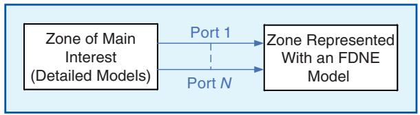  
Figure 5. Network splitting for FDNE modeling.

lower model order is preferred for computational efficiency. Therefore, an acceptable tradeoff between model order and fitting accuracy must be found.

Passivity is a crucial requirement of a rational model (i.e., it should only absorb energy). A rational model with passivity violations is very likely to be numerically unstable in transient simulations. The condition for a rational model to be passive is to be positive definite at all frequencies, or equivalently, all its eigenvalues must be positive at all frequencies. Passivity violations can be due to a lack of accuracy in the fitting or due to an overdetermined model order. In either case, an inaccurate frequency response that violates the passivity condition is involved. To avoid passivity violations, the model order and fitting tolerance can be tuned until a passive model is obtained. Unfortunately, this can be challenging at times, and for such cases, the application of a passivity enforcement technique can be helpful.

Alternative mathematical representations, such as a state-space model or RLC branches, also exist. The choice is usually made depending on the simulation software platform and available resources. The state-space model is efficient when based on sparse-matrix representation and remains a straightforward process. The FDNE approach also offers the possibility to model the active sources contained in the zone modeled by an FDNE. This is done by including a Norton-type equivalent current source connected at the terminals of the FDNE model. This current source is calculated to match the required simulation steady state (initial conditions).

# Real-Time Simulation of Large Power Systems

Real-time EMT simulations generally face a stringent limitation in that the simulator must complete all necessary calculations and service all input– output (I/O) functions required within a real-world time interval equal to the simulation time step. This poses significant hurdles to the simulation of power systems of even moderate size. Naturally, real-time simulation of large systems faces more significant challenges.

To provide a scalable solution, all commercial real-time simulators employ some form of parallel processing on one or multiple levels. A common technique used by real-time simulators to facilitate parallel processing is to break networks into subsystems whereby each subsystem is solved using separate computing elements (e.g., separate processor cores, separate processors entirely, separate fieldprogrammable gate arrays, etc.). Some real-time simulators are also able to use a second level of parallel processing by dividing the computational tasks required to solve a subsystem across multiple computing elements. Generally speaking, the advantage of allowing a second level of parallelization is the realization of larger subsystems (i.e., allowing larger networks or portions thereof to be modeled without decoupling).

Another challenge for real-time simulation is the modeling of switching components or events such as breakers and faults in the network. When a switch in the network is operated, the network’s admittance matrix changes, which must be reflected in the simulation. The simulator must either precalculate and store all possible matrices or be able to invert the network matrix on the fly. Precalculating and storing all possible matrices is limiting since 2n matrices, where n is the number of single-phase switches to be represented, must be stored, which clearly restricts the number of switches that can be included in the network/subsystem. Inverting the system matrix on the fly allows more switches to be included in the network and offers other advantages, such as the ability to embed components and nonlinearities in the network as variable admittance elements rather than as interfaced current injections.

When considering large-scale EMT simulation, expandability is also a challenge that must be addressed by real-time simulators. In theory, real-time simulations can be infinitely expanded; however, in practice there are hard limits based on the simulator design. As discussed previously, networks are typically broken into subsystems that are assigned to different hardware modules. The different hardware modules must be able to commu-

Increasing the model order leads to a refined match (and hence a lower error); however, a lower model order is preferred for computational efficiency.

nicate with each other and be synchronized with one another. The synchronization must be global (i.e., all hardware modules must be synchronized to the same time reference), and the communication between hardware modules should be fully interconnected (such that any hardware module can communicate directly with any other hardware module). It is possible to use a simulator structure where the modules are not fully interconnected, but it makes network modeling more difficult and restrictive. The usability and efficiency of the realtime simulator’s user interface is also important for large-scale EMT simulations. The user interface must be designed such that it remains responsive even when handling large-scale networks. This includes the user experience when navigating through the simulation model, modifying the circuit and/or circuit data, and also when compiling the network for the real-time simulator.

Fundamentally, hard real-time simulation was developed to allow testing of external equipment, which in turn requires real-time simulators to provide various I/O capabilities. Real-time simulators must offer the ability to connect to external devices using conventional analog and digital I/O as well as Ethernet-based protocols, such as IEC 61850, DNP3, etc. When large amounts of I/O are required, it is critical that the real-time simulator has sufficient communication bandwidth and channels to provide the required I/O without creating significant communication delays (i.e., servicing of the I/O must not cause the simulation time step and execution time to increase beyond acceptable limits).

For many years now, vendors have supplied black-box versions of their schemes and controls for inclusion in EMT simulations. Typically, the

black-box controls were provided using dynamic linked libraries (DLLs) or shared objects (.os) for Linux files. Unfortunately, the DLL-based models are not conducive to or compatible with real-time simulation since Windows is not a real-time operating system. Additionally, these are typically tailored for specific simulation tools and lack any standard for interoperability or unified interfaces. Recently, the CIGRE-IEEE standard team (the Joint IEEE Transient Analysis and Simulations Subcommittee Task Force and CIGRE B4.82 Working Group for “Use of real-code in EMT models for power system analysis”) has proposed a standardized DLL interface with initialization option that should be used by manufacturers. Realtime simulators can also be interfaced with manufacturer control replicas for conducting various tests and emulating controllers.

Real-time simulator vendors have also developed alternate options for manufacturers to provide black-box models suitable for real-time simulation, which is typically denoted as software in the loop (SIL). It is also possible to use SIL codes with offline simulators running on Linux, but the DLL remains the preferred straightforward method. It is expected that complexities will continue to persist, in particular for studies involving power electronic equipment supplied by several vendors who cannot share their respective controller details to protect their intellectual property.

Apart from conventional real-time simulations, utilities may decide to perform control and protection system parameter optimization and performance testing using only black-box controller and

protection system emulators or a mix of black-box emulators and validated generic models. Blackbox controllers are normally validated using replicas but with a small grid equivalent. In most cases, such tests are performed by the original equipment manufacturer (OEM) during factory acceptance tests using modest-sized network models. However, the need to perform EMT simulation of large-scale power systems, normally performed by transmission system operators, calls for fast and powerful computing capabilities to quickly assess the system stability as well as controller and protection system performance under different operating conditions and multiple contingencies.

Table 1 presents a summary for both real-time with hardware in the loop (HIL) and offline simulators. It is noted that offline simulation can in theory also be performed in real time or even faster than real time, but without HIL. It must be noted that many of the items listed under offline simulations can be done, in essence, using real-time platforms as well. Issues such as cost may affect the choice of offline or real-time simulation.

# Examples of EMT Simulations of Large Power Systems

# FDNE Case Study

The large grid benchmark shown in Figure 6 is used to demonstrate the application of an FDNE model. In this network, a fault is applied to the transmission line between buses HALKA and OSMAN. The boundaries that define the zone of interest and the network for calculating the FDNE are circled in red.

Table 1. An overview of simulation and study types.   

<table><tr><td>Type of Simulation</td><td>Offline Accelerated/Parallel EMT</td><td>Real Time With HIL</td></tr><tr><td>Model type</td><td>With generic controls
Manufacturer models (DLL or SIL), real code
Digital twin</td><td>Control replicas
Digital twin
Manufacturer models (SIL), real code</td></tr><tr><td>Type of study</td><td>OEM controller model validation
EMT planning studies
Performance evaluation
Control system performance testing, validation
Protection system studies
Large grid integration studies for IBRs</td><td>OEM controller validation with SIL and/or control replicas
CHIL and PHIL
Control system testing with control replicas
Protection system studies
Precommissioning tests</td></tr><tr><td colspan="3">CHIL: controller hardware in loop; PHIL: power hardware in loop.</td></tr></table>

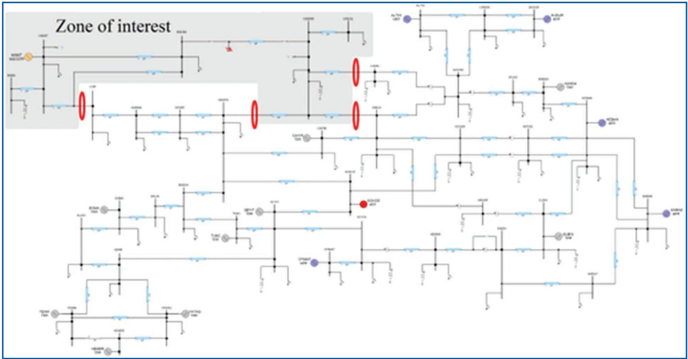  
Figure 6. Large grid benchmark model.

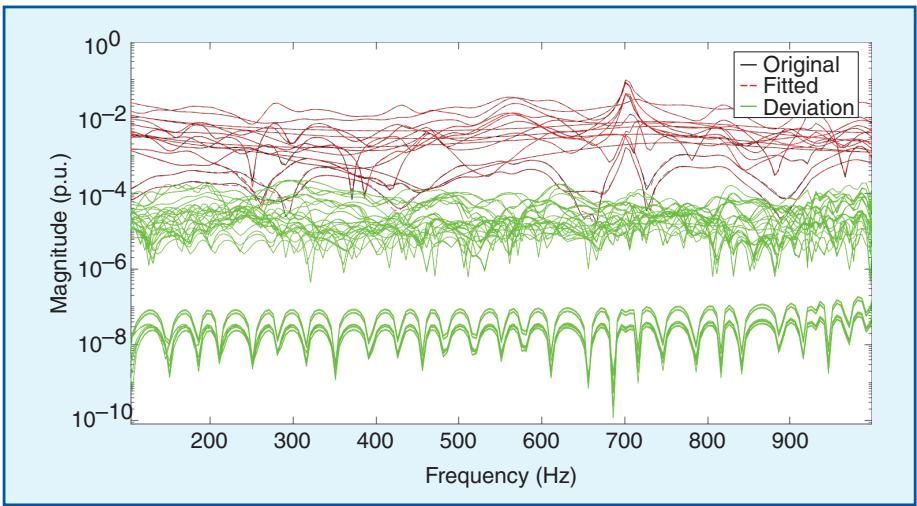  
Figure 7. Final admittance parameters fitting for the four-port FDNE.

A four-port FDNE is calculated for this case with a frequency band set from 1 Hz to 1 kHz. A plot of the fitting (admittance parameters) is shown in Figure 7. The resultant FDNE model has 77 poles. A time-domain simulation is performed with a time step of $5 0 \mu \mathrm { s }$ for a simulation time of 10 s. The CPU simulation times using the original network and the reduced model with the FDNE are 26 s and 12 s, respectively. An acceleration factor of 2.16 is obtained in this basic example. The reduced simulation results for the voltage measured at bus OS-

MAN are shown in Figure 8. The transient responses of the reduced network with an FDNE show a high accuracy compared to the original network. For the test case in Figure 6 (without the FDNE), it is possible to integrate 10 wind plants using detailed modeling. The overall network comprises 10 aggregated type III wind plants (generic models) with detailed converter models using detailed nonlinear insulated-gate bipolar transis-

tors (IGBTs), 58 three-phase lines using the constant-parameter model, 72 synchronous generators with controls, 202 three-phase transformers with magnetization branches, and 15,136 control diagram blocks. A fully iterative solver is used because of the presence of the nonlinear IGBT models. When using 12 CPUs, the computing time for 1 s drops to 54 s despite all of the complexities. This is a clear demonstration of performance with parallel computations. The gain is 14.4 when compared to single-CPU usage.

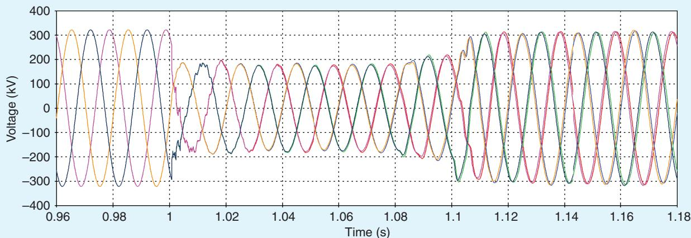  
(a)

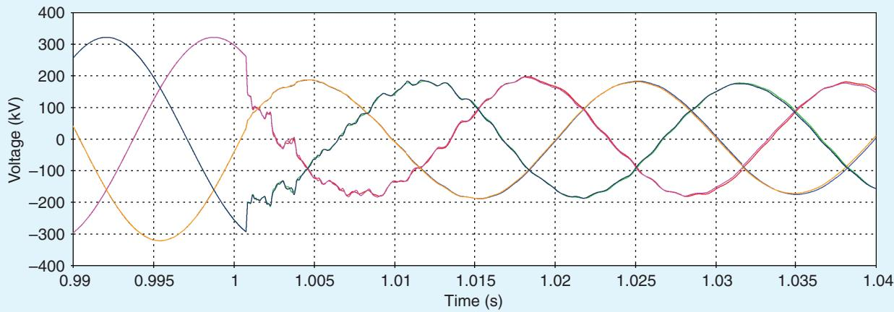

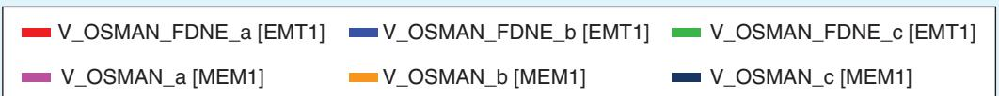  
(b)   
Figure 8. Transient response comparison for voltages: (a) Shows the waveforms from both solvers and (b) is a zoomed version of the transient portion of the waveforms in (a).

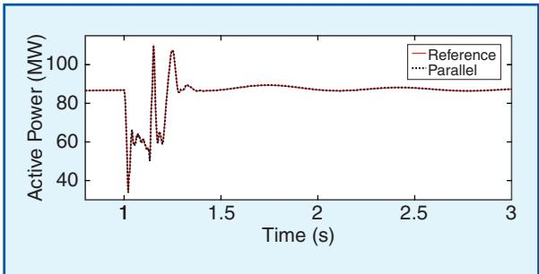  
Figure 9. The active power of a wind park for parallel computations and reference on one CPU.

# Parallel Simulation of Large Grids

Several test cases utilizing parallel simulation of large grids are available in the existing literature. These simulations are based on the EMT–EMT cosimulation approach. For example, it is shown that, for a large grid with 27 wind plants and 32

photovoltaic plants using average-value modeling and a numerical integration time step of 50 µs, it is possible to achieve 120 s of computing time on a single CPU. However, cosimulation allows the reduction of computing times by using several CPUs in parallel. With 60 CPUs, the computing time for 1 s drops to 13 s. Significant computational gains are achieved from the fast initialization of all IBRs. The sample results shown in Figure 9 demonstrate perfect initialization below 100 ms of simulation. A fault is applied at 1 s and initiates the transient response of the system.

If several synchronous generators in the system of Figure 6 are replaced by 10 aggregated type III wind power plants, a new benchmark is created with 72 synchronous generators (with governor and

exciter controls) and 202 three-phase transformers. Both the generators and transformers are modeled with magnetization curves. The wind plants include controllers, and the converters are modeled with detailed IGBT nonlinear models and generic controls. The total number of nonlinear models (functions) is 834. The total number of nodes is 3,611. There is a total of 15,136 control diagram blocks. Each wind turbine is simulated on separate CPUs in parallel. Parallelization is also achieved in the network equations through transmission line decoupling. A 10- µs time step must be used because of the nonlinear IGBT models. The computing time for 1 s is 20 s when using 24 cores. This timing includes a full nonlinear solver for accurate simultaneous solution with all nonlinear models. The average number of iterations per time point is six. These simulation results are based on the computer CPU AMD Ryzen Threadripper Pro 5995WX.

# Large-Scale EMT Simulation of IBRs With OEM Controllers

Figure 10 shows a typical IBR model architecture with OEM controller models in a real-time simulator. The model represents an inverterbased wind turbine generator and consists of

the electrical circuit and controllers. Local and point-of-common-coupling (PCC) measurements are sampled and sent to the controllers. The plant controller determines the power set points, and the converter controller implements primary control functions. The converter duty cycles, or gating pulses, are fed back to the electric circuit, depending on whether an average or detailed converter model is selected. A switching function converter model is recommended to be used since it presents a reasonable compromise between the real-time performance of an average model and the accuracy of using detailed switches.

# Interfacing Manufacturer Controller Code With the Real-Time Simulator

In rare cases, the OEM controllers are simple functions and can be replaced automatically directly by existing real-time simulator library components to improve the simulation speed and documentation. However, in most cases, the controller is precompiled black-box code. The controller code communicates with the electric system model simulated in real time at its own time step, and a cosimulation scheme orchestrates the data transmission and the execution of the controller and the model.

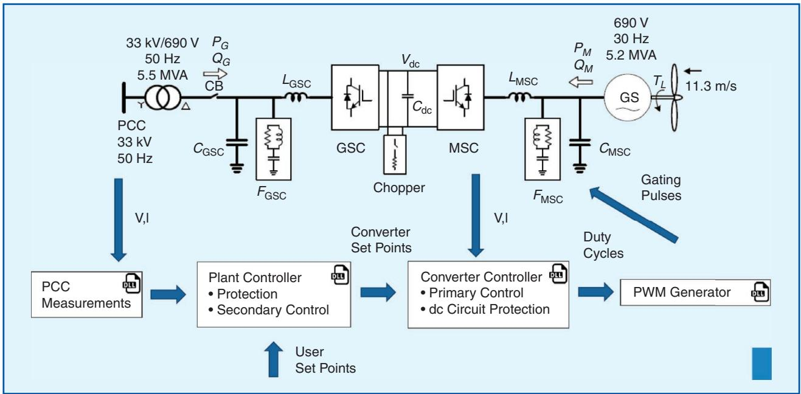  
Figure 10. Typical IBR model architecture with OEM controller models. PCC: point of common coupling; GSC: gridside converter; MSC: machine-side converter; PWM: pulsewidth modulation.

Because of the lack of a standardized interface, significant effort is required to adapt the controller code using a semiautomatic translation tool and execute it in real time or using an offline simulation tool. Two methods are proposed here to automatically import the controller code. Both methods allow the execution of as many as hundreds of controllers on a single standard simulator.

# Method 1: Automatic Import of OEM Controller

# Code From Offline EMT Simulator

In the case where the OEM controller code is precompiled for an offline EMT simulator as a DLL, an automatic import function is developed to add an interface wrapper around the DLL. The generated controller block for the model has the same I/ Os and parameters as in the offline EMT simulator. An automatic open-loop validation is performed using the recorded signals during the import process.

# Method 2: Automatic Import of OEM Controller

# Code – CIGRE Standards/Industry Guidelines

If the OEM controller code follows standards/industry guidelines (e.g., IEEE Joint IEEE Transient Analysis and Simulations Subcommittee Task Force

and CIGRE WG B4.82), a dedicated interface is provided to easily integrate the OEM controller codes. The controller codes can be executed in “close to real-time conditions” under the Windows operating system and distributed on parallel processors on the same or a separate simulator.

# Hardware Configuration

Once the OEM controller codes are imported, the complete simulation is performed by distributing the simulation process to parallel processors. Figure 11 presents a typical hardware setup of the proposed solution. The electrical circuit of each IBR plant is run on different cores of the grid simulator, while the OEM controllers are run in parallel on a cluster of high-performance simulators. Fast communication links are deployed among the simulators. Automatic task mapping optimizes the assignment of different processes to achieve the fastest simulation speed. Such a cosimulation architecture is highly scalable since processors can be added as needed to maintain the simulation speed “close to real time” as the number of IBR plants increases. The same architecture can be implemented on a high-performance computer

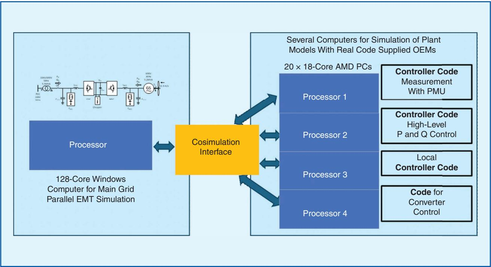  
Figure 11. System configuration for simulation of IBR system with OEM controllers. PMU: processor management unit.

or a cloud computer using Windows or Linux operating systems and the high-speed lowlatency communication fabric supplied by the cloud provider.

# Conclusions

It is clear that EMT simulation of large systems, whether using an offline or real-time simulator, is a growing trend within the power and energy industry. Large-scale EMT simulations need to provide a complete picture of network performance, including the dynamics of power electronic converters associated with renewables, HVdc, flexible alternating current transmission systems, and energy storage devices. While traditional offline EMT algorithms may suffer from long simulation times for large-scale network models, new methods that use improved techniques (e.g., improved network solution algorithms, cosimulation, automated methods for system segmentation and batch simulation, and multidomain simulation) and take advantage of modern parallel computing platforms (e.g., parallel processors, multicore computers, and specialized hardware) offer promising outlooks for significant gains that enable not only faster computations but also the simulation of much larger networks. Achieving success in this area is only possible through collaborative work among EMT simulation tool developers, vendors, and other stakeholders to come up with streamlined and standardized methods that allow rapid and seamless model interconnections and multiplatform operability.

# For Further Reading

J. Morales, J. Mahseredjian, K. Sheshyekani, A. Ramirez, E. Medina, and I. Kocar, “Pole-selective residue perturbation technique for passivity enforcement of FDNEs,” IEEE Trans. Power Del., vol. 33, no. 6, pp. 2746–2754, Dec. 2018, doi: 10.1109/TP-WRD.2018.2810706.

M. Ouafi, J. Mahseredjian, J. Peralta, H. Gras, S. Dennetiere, and B. Bruned, “Parallelization of EMT simulations for integration of inverter-based resources,”

Electr. Power Syst. Res., vol. 223, Oct. 2023, Art. no. 109641, doi: 10.1016/j.epsr.2023.109641.   
J. Matevosyan et al., “Electromagnetic transient modeling for connection studies: High-fidelity models are key,” IEEE Power Energy Mag., vol. 23, no. 4, pp. 54–66, Jul./Aug. 2025, doi: 10.1109/ MPE.2025.3525596.   
J. Rupasinghe, S. Filizadeh, and R. Parvari, “A multi-solver framework for co-simulation of transients in modern power systems,” Electr. Power Syst. Res., vol. 223, Oct. 2023, Art. no. 109659, doi: 10.1016/j.epsr.2023.109659.   
C. Zhou, C. Fang, M. Kandic, P. Wang, K. Kent, and D. Menzies, “Large-scale hybrid real time simulation modeling and benchmark for nelson river multi-infeed HVdc system,” Electr. Power Syst. Res., vol. 197, Aug. 2021, Art. no. 107294, doi: 10.1016/j.epsr.2021.107294.   
I. K. Park, J. Lee, J. Song, Y. Kim, and T. Kim, “Large-scale AC/DC EMT level system simulations by a real time digital simulator (RTDS) in KEPRI-KEPCO,” KEPCO J. Electr. Power Energy, vol. 3, no. 1, pp. 17–21, Jan. 2017.

# Acknowledgment

Shaahin Filizadeh is the corresponding author for the article. All other contributors are listed alphabetically.

# Biographies

Shaahin Filizadeh is with the University of Manitoba, Winnipeg, MB R3T 5V6, Canada.

Jean Belanger is with Opal-RT, Montreal, QC H3K1G6, Canada.

Flavio Fernandez is with DIgSILENT, 72810 Gomaringen, Germany.

Paul Forsyth is with RTDS Technologies, Winnipeg, MB R3T 2E1, Canada.

Jean Mahseredjian is with Polytechnique de Montreal, Montreal, QC H3C 3A7, Canada.

Jesus Morales is with PGSTech, Montreal, QC H2A2N2, Canada.

Genevieve Lietz is with the Australian Energy Market Operator, Melbourne 3000, Australia. p&e