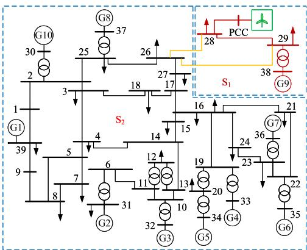
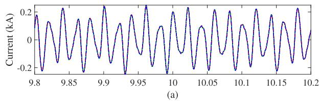
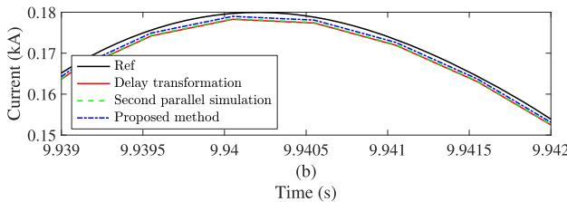
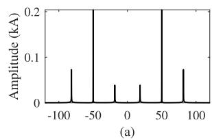
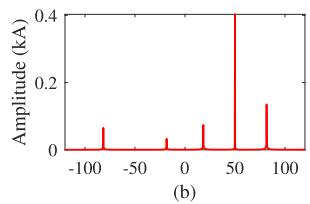
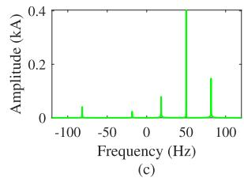
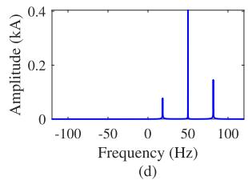

# Power Engineering Letters

# An Interface Method for Co-Simulation of EMT Model and Shifted Frequency EMT Model Based on Estimation of Signal Parameters via Rotational Invariance Techniques

Shilin Gao , Member, IEEE, Ying Chen , Senior Member, IEEE, Zhitong Yu, Tian Cao , Graduate Student Member, IEEE, Wensheng Chen , Yankan Song , Member, IEEE, and Yuhong Wang , Senior Member, IEEE

Abstract—The shifted frequency-based electromagnetic transient (SFEMT) simulation is much more efficient than traditional electromagnetic transient (EMT) simulation for AC grids. This letter proposes a novel interface for the co-simulation of the SFEMT model and the conventional EMT model. The fundamentals of SFEMT modeling are first derived. Then, an interface for the co-simulation of EMT and SFEMT models is proposed based on the estimation of signal parameters via rotational invariance techniques. Theoretical analyses and test results demonstrate the effectiveness of the proposed method.

Index Terms—Analytical signal, co-simulation, interface, electromagnetic transient simulation, shifted-frequency simulation.

# I. INTRODUCTION

T HE dynamics of a power system involve multi-scale tran-sients. As a result, it is meaningful to develop a multi-scale sients. As a result, it is meaningful to develop a multi-scale simulation method that adopts different modeling methods and time steps for different subsystems. An idea of multi-rate EMT simulation, which uses large step sizes for the AC grid and small step sizes for power electronics, was proposed two decades ago.

The shifted frequency-based EMT (SFEMT) simulation with large step size is proposed for the AC power grid in [1], [2]. Then, the co-simulation interface based on SFEMT simulation and traditional EMT simulation is proposed in [3], [4], in which some subsystems of the power system are calculated by SFEMT simulation and the others are calculated by traditional EMT simulation. However, the interfaces for these co-simulation methods have a certain degree of accuracy loss. In these interfaces, the

analytical signals for SFEMT simulation, which are generated from real signals in the EMT simulation, are not true analytical signals that are orthogonal to the original real signals, because these analytical signals still contain negative-frequency signal components. This will affect simulation accuracy.

To address the issues of the existing interfaces, this paper proposes a novel interface for the SFEMT and EMT models. First, the general form of SFEMT modeling is derived, giving a guideline for the design of co-simulation interface. Then, an interface based on the estimation of signal parameters via rotational invariance techniques (ESPRIT) is proposed. The ESPRIT can accurately calculate the frequency, amplitude and phase of each component in an instantaneous signal with a short data window. According to signal processing theory, once the frequency, amplitude, and phase of the original signal are known, the analytical signal required for SFEMT simulation can be constructed. The proposed interface offers better accuracy compared to existing interfaces.

The letter is organized as follows. Section II derives SFEMT modeling fundamentals. The interface of co-simulation is designed and studied in Sections III and IV. Section IV concludes.

# II. SFEMT MODELING FUNDAMENTALS

# A. General Form of SFEMT Modeling

In EMT simulation, the dynamic equation of an electrical component can be generally expressed as:

$$
\frac {\mathrm {d} x (t)}{\mathrm {d} t} = A x (t) + u (t) \tag {1}
$$

where x(t) is the state variable, A is the coefficient of x(t), and u(t) is the input. In (1), the nonlinear part of the component dynamic is combined into u(t), which is generally calculated by means of delay or prediction. For SFEMT modeling, a mathematical transformation $T [ \cdot ] \operatorname { ( e . g . }$ , Hilbert transform) with the differential property $\begin{array} { r } { ( T [ \frac { \mathrm { d } x ( \mathbf { \bar { t } } ) } { \mathrm { d } t } ] = \frac { \mathrm { d } T [ x ( t ) ] } { \mathrm { d } t } ) } \end{array}$ dT [x(t)]d ) and linear property $( T [ k x ( t ) ] = k T [ x ( t ) ] )$ is performed on both sides of (1)

Received 28 August 2024; revised 3 January 2025; accepted 21 March 2025. Date of publication 31 March 2025; date of current version 20 June 2025. This work was supported by the Natural Science Foundation of China under Grant 52307127. Paper no. PESL-00271-2024. (Corresponding author: Ying Chen.)   
Shilin Gao, Tian Cao, Wensheng Chen, and Yuhong Wang are with the College of Electrical Engineering, Sichuan University, Chengdu 610065, China (e-mail: gaoshilin@scu.edu.cn; caotiankd@stu.scu.edu.cn; chenwensheng@ stu.scu.edu.cn; yuhongwang@scu.edu.cn).   
Ying Chen, Zhitong Yu, and Yankan Song are with the Department of Electrical Engineering, Tsinghua University, Beijing 100084, China (e-mail: chen_ying @tsinghua.edu.cn; yuzhitong@cloudpss.net; songyankan@cloudpss.net).   
Color versions of one or more figures in this article are available at https://doi.org/10.1109/TPWRS.2025.3555374.   
Digital Object Identifier 10.1109/TPWRS.2025.3555374

simultaneously to construct the adjoint system of (1):

$$
\frac {\mathrm {d} T [ x (t) ]}{\mathrm {d} t} = A T [ x (t) ] + T [ u (t) ] \tag {2}
$$

Through $( 1 ) + \mathrm { j } ( 2 )$ , the system dynamic equation can be represented by analytical signal:

$$
\frac {\mathrm {d} \underline {{x}} (t)}{\mathrm {d} t} = A \underline {{x}} (t) + \underline {{u}} (t) \tag {3}
$$

where $\underline { { x } } ( t )$ and ${ \underline { { u } } } ( t )$ are the analytical signals corresponding to $x ( t )$ and $u ( t )$ , respectively. Then, by performing the frequencyshifting transformation on both sides of (3), (4) is derived.

$$
\frac {\mathrm {d} X (t)}{\mathrm {d} t} = A X (t) - \mathrm {j} \omega_ {\mathrm {s}} X (t) + U (t) \tag {4}
$$

where $X ( t )$ and $U ( t )$ are the analytical envelopes corresponding to x(t) and u(t), respectively. By discretizing (4), an SFEMT model for the component can be obtained.

# B. Implementation of Analytical Signal Construction

To obtain a true analytical signal, the analytical signal $\underline { { u } } ( t )$ should not contain frequency components on the negative half axis of the spectrum [2] for the use of a large time step-size. Otherwise, the signal component with negative frequency will become a signal component with a higher frequency after frequency shifting $( \mathrm { e . g . , - 6 5 \ : H z \ : t o - 1 1 5 \ : H z } )$ . Thus, to ensure that the signal $U ( t )$ is a low-frequency envelope signal, the $T [ \cdot ]$ that can be used to construct ${ \underline { { u } } } ( t )$ must also satisfy:

$$
\mathcal {F} (T (u (t))) = - \mathrm {j} \operatorname {s g n} (f) \mathcal {F} (u (t)) \tag {5}
$$

where $\operatorname { s g n } ( { \mathord { \cdot } } )$ is the sign function and $\mathcal { F } ( u ( t ) )$ is the spectrum of $u ( t )$ . Note that signal components with negative frequencies will exist in the analytical signals if (5) is not satisfied.

According to the above analyses, the guidelines of the analytical signal construction can be proposed. First, for a signal $u ( t )$ with a known analytical expression, the Hilbert transform can be used [1], [2]:

$$
T [ u (t) ] = \mathcal {H} [ u (t) ] = \int_ {- \infty} ^ {\infty} u (\tau) \frac {1}{\pi (t - \tau)} \mathrm {d} \tau \tag {6}
$$

which involves the convolution over the range $( - \infty , \infty )$ . This cannot be applied to signals with unknown analytical expressions. For signals with unknown analytical expressions, the spectrum analysis-based methods (e.g., ESPRIT) are considered, which satisfy (5) and the conditions in Section II-A.

# III. INTERFACE BETWEEN EMT MODEL AND SFEMT MODEL BASED ON ESPRIT

In the muti-area co-simulation, the distributed transmission line model is widely used for the interface, which is also applicable to the co-simulation of the EMT and SFEMT models. The difference is that an interface between the real signal and the analytical envelope signal is needed in the co-simulation of the EMT and SFEMT models. When the EMT simulation sends current and voltage signals to the SFEMT simulation, the

# Algorithm 1: ESPRIT Algorithm.

1: Construct the Hankel matrix X;   
2: Determine the number of signal components;   
3: Calculate the frequency of each signal component;   
4: Calculate amplitude and phase of the signal component;   
5: Construct the analytical and analytical envelope signals.

real signals must first be transformed into analytical envelope signals, and vice versa.

# A. Conversion Between Analytical Signal and Real Signal

The real signal that the EMT simulation needs can be obtained from the analytical envelope signal by using:

$$
x (t) = \operatorname {R e} \left(X (t) \mathrm {e} ^ {\mathrm {j} \omega_ {\mathrm {s}} t}\right) \tag {7}
$$

where $x ( t )$ is the real signal that the EMT model needs and $X ( t )$ is the analytical envelope signal in the SFEMT model.

The analytical envelope signal that the SFEMT model needs can be calculated by:

$$
X (t) = \underline {{x}} (t) \mathrm {e} ^ {- \mathrm {j} \omega_ {\mathrm {s}} t} = (x (t) + \mathrm {j} T [ x (t) ]) \mathrm {e} ^ {- \mathrm {j} \omega_ {\mathrm {s}} t} \tag {8}
$$

Due to the inability to obtain the analytical expression of the voltage and current in EMT simulation, this paper proposes an analytical signal construction method based on the ESPRIT, which can accurately extract the spectrum of the real signal.

# B. Analytical Signal Construction Based on ESPRIT

1) Overall Process: The analytical signal construction method based on ESPRIT can be divided into five steps, which are shown in Algorithm 1. Details of each step are as follows.   
2) Step 1–Formation of Hankel Matrix: Assuming the signal $x ( t )$ has a sampling step size of $\Delta t , x ( t )$ can be discretized to $x ( j \Delta t ) = x _ { j }$ . For a data window with $N = 2 n + 1$ samples. The Hankel matrix X, composed of signals within this data window, can be represented as [5]:

$$
\boldsymbol {X} = \left[ \begin{array}{c c c c} x _ {- n} & x _ {- n + 1} & \dots & x _ {0} \\ x _ {- n + 1} & x _ {- n + 2} & \dots & x _ {1} \\ \vdots & \vdots & \ddots & \vdots \\ x _ {0} & x _ {1} & \dots & x _ {n} \end{array} \right] \tag {9}
$$

3) Step 2–Determination of the Number of Signal Components: By performing singular value decomposition on the Hankel matrix, the singular value matrix Σ can be obtained:

$$
\boldsymbol {\Sigma} = \operatorname {d i a g} \left(\sigma_ {1}, \sigma_ {2}, \dots , \sigma_ {n}\right) \tag {10}
$$

where every two consecutive singular values correspond to a signal component and the singular value associated with signal component is much greater than that of noises. Based on this, the number of signal components m can be determined.

4) Step 3–Calculation of Signal Component Frequency: The Hankel matrix X can also be decomposed as [6]:

$$
\boldsymbol {X} = \boldsymbol {Z} _ {\mathrm {L}} \boldsymbol {P} \boldsymbol {Z} _ {\mathrm {R}}
$$

$$
\begin{array}{l} = \left[ \begin{array}{c c c c} 1 & 1 & \dots & 1 \\ z _ {1} & z _ {2} & \dots & z _ {2 m} \\ \vdots & \vdots & \ddots & \vdots \\ z _ {1} ^ {n} & z _ {2} ^ {n} & \dots & z _ {2 m} ^ {n} \end{array} \right] \left[ \begin{array}{c c c c} p _ {1} & 0 & \dots & 0 \\ 0 & p _ {2} & \dots & 0 \\ \vdots & \vdots & \ddots & \vdots \\ 0 & 0 & \dots & p _ {2 m} \end{array} \right] \\ \left[ \begin{array}{c c c c} z _ {1} ^ {- n} & z _ {1} ^ {- n + 1} & \dots & z _ {1} ^ {0} \\ z _ {2} ^ {- n} & z _ {2} ^ {- n + 1} & \dots & z _ {2} ^ {0} \\ \vdots & \vdots & \ddots & \vdots \\ z _ {2 m} ^ {- n} & z _ {2 m} ^ {- n + 1} & \dots & z _ {2 m} ^ {0} \end{array} \right] \tag {11} \\ \end{array}
$$

where the ith element in $Z _ { \mathrm { L } }$ and $Z _ { \mathrm { R } }$ is $z _ { i } = \mathrm { e } ^ { \mathrm { j } 2 \pi \frac { f _ { i } } { f _ { \mathrm { s p } } } } , z _ { i } ^ { n } =$ = ej2π f fs p , zn $\mathrm { e } ^ { \mathrm { j } 2 \pi n \frac { f _ { i } } { f _ { \mathrm { s p } } } } \cdot f _ { \mathrm { s p } }$ e is the sampling frequency, P is a matrix composed of the frequency spectrum of each signal component (referred to as phasor). zi can be solved based on the matrix pencil techniques [6]. Then, the frequency of each signal component is calculated:

$$
f _ {i} = \frac {\operatorname {I m} \left(\ln \left(z _ {i}\right)\right)}{2 \pi \Delta t} \tag {12}
$$

5) Step 4–Calculation of Amplitude and Phase of Each Signal Component: After obtaining fi, $Z _ { \mathrm { R } }$ and $Z _ { \mathrm { L } }$ in (11) can be calculated. By using the least squares method to solve (11), the phasor matrix P can also be obtained:

$$
\boldsymbol {P} = \operatorname {d i a g} \left(\left(\boldsymbol {Z} _ {\mathrm {L}} ^ {\mathrm {H}} \boldsymbol {Z} _ {\mathrm {L}}\right) ^ {- 1} \boldsymbol {Z} _ {\mathrm {L}} ^ {\mathrm {H}} \boldsymbol {X} \boldsymbol {Z} _ {\mathrm {R}} ^ {\mathrm {H}} \left(\boldsymbol {Z} _ {\mathrm {R}} \boldsymbol {Z} _ {\mathrm {R}} ^ {\mathrm {H}}\right) ^ {- 1}\right) \tag {13}
$$

where $Z _ { \mathrm { L } } ^ { \mathrm { H } }$ is the conjugate transposition of $Z _ { \mathrm { L } }$ . The amplitude $a _ { i }$ and phase $\phi _ { i }$ of each signal component can be obtained by:

$$
a _ {i} = 2 \left| p _ {i} \right|, \phi_ {i} = \angle p _ {i} \tag {14}
$$

6) Step 5–Analytical Signal Construction: When the frequency, amplitude, and phase of each signal component are obtained, the imaginary part signal $T ( x ( t ) )$ in $\underline { { x } } ( t )$ (denoted as ${ \hat { x } } ( t ) )$ can be accurately calculated:

$$
\hat {x} (t) = \sum_ {i = 1} ^ {m} a _ {i} (t) \sin \left(2 \pi f _ {i} t + \phi_ {i} (t)\right) \tag {15}
$$

Based on the original real signal and imaginary part signal, the analytical envelope signal $X ( t )$ is obtained:

$$
X (t) = \underline {{x}} (t) \mathrm {e} ^ {- \mathrm {j} \omega_ {\mathrm {s}} t} = (x (t) + \mathrm {j} \hat {x} (t)) \mathrm {e} ^ {- \mathrm {j} \omega_ {\mathrm {s}} t} \tag {16}
$$

7) Comments: First, it is worth noting that $\underline { { x } } ( t )$ obtained by the ESPRIT is a true analytical signal, containing only positivefrequency components. The frequencies of the analytical envelope signal $X ( t )$ obtained by frequency shifting transformation are much lower than those of $x ( t )$ . In contrast, the analytical signals obtained by methods of the delay transformation [3] and the second parallel simulation [4] are pseudo-analytical signals. When there are harmonic components, using the methods in [3] and [4] results in an analytical envelope signal $X ( t )$ at the interface that contains signal components with higher frequencies than those of the original signal. Second, the number of samples n in the Hankel matrix affects the performance of the interface. A small value of n may introduce errors, while a large value of n can reduce computational efficiency. Based on tests, the

  
Fig. 1. Schematic diagram of the modified IEEE 39-bus power system.

  
Fig. 2. Phase A current of the transmission line 26–25.

sampling frequency for the signal in the Hankel matrix is set to 1 kHz. For a 60 Hz power system, n is typically set to 25, while for a 50 Hz power system, n is generally set to 30. This configuration ensures both simulation accuracy and efficiency.

# IV. CASE STUDIES

The effectiveness of the proposed method is validated on a modified IEEE 39-node system with a wind farm, whose topology is shown in Fig. 1. The test system is divided into two subsystems $\mathrm { ( S _ { 1 } }$ and $\mathrm { S _ { 2 } ) }$ . The rated frequency of the AC grid is 50 Hz. The test system is calculated by the co-simulation with the proposed interface, the delay transformation-based interface [3] and second parallel simulation-based interface [4], respectively, where $\mathrm { S _ { 1 } }$ and $\mathrm { S _ { 2 } }$ are respectively calculated by EMT simulation and SFEMT simulation. The time step-sizes for the two subsystems are 20 μs and 500 μs, respectively.

Due to the integration of the wind farm, a subsynchronous oscillation occurs and there are interharmonic components in the current. The current of line 26–25 obtained by different methods is compared and illustrated in Fig. 2. The 2-norm cumulative relative errors of phase A current of the line 26–25 obtained by the method in [3], the method in [4] and the proposed method are 0.92%, 0.87% and 0.48%, respectively, which demonstrates the accuracy advantages of the proposed method when there

  
Fig. 3. Amplitude spectra of different analytical signals obtained by different interfaces. (a) Current of line 26–28 obtained with EMT simulation. (b) Delay transformation [3]. (c) Second parallel simulation [4]. (d) Proposed method.

are harmonic components. The reason is that the imaginary part of the analytical signal obtained by the methods in [3] and [4] does not satisfy the orthogonal relationship (i.e., (5)) with the original real signal. The analytical signals obtained by these two methods still contain negative-frequency components. After frequency shifting, the analytical envelope will contain signal components with higher frequencies. On the contrary, the analytical signal obtained by the proposed method only contains positive-frequency components. After frequency shifting, the frequency of the signal decreases, and the simulation accuracy will thus be improved. However, there are still remaining errors after frequency shifting. Since the current and voltage do not only include signal components of 50 Hz, the signal still contains some low-frequency signals after the frequency shifting and the errors can not be zero. To address this, one possible solution is to employ multi-frequency shifting, which would convert the signal components at each frequency into DC components. However, the use of multi-frequency shifting inevitably increases the complexity of SFEMT simulation.

Next, to further illustrate the accuracy advantages of the proposed method, the spectra of the analytical signals obtained from the three different interface methods are compared. For the current of line 26–28, the amplitude spectra of the analytical signals obtained by different methods are shown in Fig. 3. It can be observed that the spectra of the analytical signals obtained with the interfaces in [3] and [4] contain negative frequency components. In contrast, the spectrum of the analytical signal obtained by the proposed method includes only positive-frequency components. After frequency shifting, the analytical envelope signal will become a low-frequency signal, and a larger simulation step size can be used.

In terms of efficiency, the interface in [4] requires a second parallel simulation of the EMT model. The computational burden of the wind farm simulation is twice that of the original EMT simulation. In contrast, the other two methods only involve computation of signal conversion, which does not influence the computational efficiency. For the test system, the computational time of the methods in [4] and [3] and the proposed method is 26.54 s, 17.91 s and 17.78 s, respectively. The proposed analytical signal construction method results in a little more computational burden than the method in [3].

Overall, when the voltage and current signals at the interface of the co-simulation of SFEMT and EMT models contain harmonics, the accuracy of the ESPRIT-based interface is higher than that of the existing interfaces. It is worth noting that the simulation of high-frequency transient is not considered in this paper because the performance of SFEMT simulation is not good for high-frequency transient cases and it is primarily applied in AC grids rather than in power electronics systems.

# V. CONCLUSION

This letter proposes an interface for the co-simulation of EMT and the SFEMT models based on ESPRIT, which improves the accuracy of co-simulation. It is worth noting that ESPRIT is just one of the spectral analysis methods in the field of signal processing. Inspired by this letter, many other techniques in the signal process area may be introduced into the area of power system co-simulation. Besides, in the future work, the proposed method will be applied to real-life large-scale power system simulation.

# REFERENCES

[1] P. Zhang, J. R. Marti, and H. W. Dommel, “Synchronous machine modeling based on shifted frequency analysis,” IEEE Trans. Power Syst., vol. 22, no. 3, pp. 1139–1147, Aug. 2007.   
[2] K. Strunz, R. Shintaku, and F. Gao, “Frequency-adaptive network modeling for integrative simulation of natural and envelope waveforms in power systems and circuits,” IEEE Trans. Circuits Syst. I., Reg. Papers, vol. 53, no. 12, pp. 2788–2803, Dec. 2006.   
[3] D. Shu, X. Xie, Z. Yan, V. Dinavahi, and K. Strunz, “A multi-domain co-simulation method for comprehensive shifted-frequency phasor DC-grid models and EMT AC-grid models,” IEEE Trans. Power Electron., vol. 34, no. 11, pp. 10557–10574, Nov. 2019.   
[4] J. O. Tarazona, A. T. J. Marti, J. R. Marti, and F. A. Moreira, “Shifted frequency analysis-EMTP multirate simulation of power systems,” Elect. Power Syst. Res., vol. 197, Aug. 2021, Art. no. 107292.   
[5] S. K. Jain, P. Jain, and S. N. Singh, “A fast harmonic phasor measurement method for smart grid applications,” IEEE Trans. Smart Grid, vol. 8, no. 1, pp. 493–502, Jan. 2017.   
[6] K. Sheshyekani, G. Fallahi, M. Hamzeh, and M. Kheradmandi, “A general noise-resilient technique based on the matrix pencil method for the assessment of harmonics and interharmonics in power systems,” IEEE Trans. Power Del., vol. 32, no. 5, pp. 2179–2188, Oct. 2017.