# Shifted frequency analysis based, faster-than-real-time simulation of power systems on graphics processing unit✩

Junjie Zhang a,∗, Marcel Mittenbühler a, Andrea Benigni a,b,c

a IEK-10: Energy Systems Engineering, Forschungszentrum Jülich, Wilhelm-Johnen-Straße, Jülich, 52428, NRW, Germany   
b RWTH Aachen University, Templergraben 55, Aachen, 52062, NRW, Germany   
c JARA-Energy, Jülich, 52425, NRW, Germany

# A R T I C L E I N F O

Keywords:

Graphics processing unit (GPU)

Power system simulation

Parallel programming

Shifted frequency analysis

Dynamic phasor

# A B S T R A C T

In this paper we present a scalable approach based on the latency-based linear multistep compound method to use graphic processing unit (GPU) to accelerate the power system simulations with electromagnetic transients.

To balance between the computational load and accuracy, we modeled the power system using shifted frequency analysis. Then, to efficiently exploit the hardware, our computational approach is designed to utilize both data-parallel and task-parallel execution. In addition, a graph-based thread safety design is introduced to achieve high scalability in the paralleled component computations. Furthermore, our implementation introduces a translation layer for different heterogeneous computing frameworks during compile time, so that a wide range of GPU devices can be supported without losing performance. Finally, benchmark results show that our approach achieves faster-than-real-time capability for systems with hundreds to thousands of nodes.

# 1. Introduction

The 2050-carbon-neutral goal has sparked increasing installation of renewables, leading to a growing number of power electronic devices in electric power systems. As a result, the required simulation time step to get accurate results is decreased; at the same time, the problem size has also grown, posing high challenge to the traditional simulation techniques.

To balance between increasing computational load and requirements on accuracy, the shifted-frequency analysis (SFA), has been studied and becoming an accepted solution [1,2].

Besides new modeling techniques, in the past few decades, several parallel simulation methods have been proposed to overcome the computational challenge of simulating modern power systems. These methods can be roughly categorized into explicit and automatic parallelization methods [3]. The former includes transmission line modeling (TLM) [4], diakoptics [5], waveform relaxation (WR) [6], etc., and the latter including fine-grained methods like [7], and coarse-grained methods such as the combined state-space nodal method (SSNA) [8] and latency-based linear multistep compound (LB-LMC) [9]. A systematic comparison of different parallel methods can be found in [3, 10].

Since parallel hardware is needed to efficiently execute the parallel algorithms, GPU has gaining attention in the recent years due to its

capability for massively parallel execution and fast memory access [7, 11–14]. Among then, [7] uses fine-grained parallelization methods, which decomposes the equations of the power system into linear and nonlinear part and uses GPU to solve the decomposed linear system with direct method, and non-linear system with Newton–Raphson method, in a parallel way. This design can efficiently achieve dataparallelism within the linear and non-linear solver kernels. Similarly, in [13], a fine-grained method is applied to simulate power electronic systems where the integration of each state variable is computed in parallel. However, the algorithm, as many EMT and transient stability simulation approaches, requires updating the LU factorizations at each time step. This is avoided in the parallelization method [9] employed in this work so to improve scalability. The approaches shown in [11,14] design dedicated kernels for the different type of components considered, those approaches share a similar approach to the one presented in this paper. [11] is one of the earliest example of using GPU for transient stability simulation and had highlighted the potential of using GPU to accelerate dynamic simulations. [14] utilizes CUDA’s dynamic parallelism, thanks to that a kernel can launch new kernels during execution. With this feature, the whole power grid is implemented as a single kernel, during each simulation time step, it launches several component computation kernels as child kernels. Within the child kernels, there’re multiple kernels for components with detailed models,

e.g. kernels that simulates the identical circuit parts within the MMC model. Therefore, this approach can simulate systems containing very detailed component models efficiently. Overall the approach proposed in [14] is very efficient, however, managing the whole simulation on device makes applying vendor’s math library sometimes not possible as the device-side API is not always available [15]. Launching kernel from the device side is not free and only limited resources can be dedicated to the child kernels [16], therefore, it can generate significant overheads when the number of child kernels increases.

Related works regarding faster-than-real-time (FTRT) are mainly focused on using reconfigurable devices [17,18] as well as using highperformance computing (HPC) platforms [19]. Reconfigurable devices usually has very limited memory and computing resources that restricts the application to simulation of large scale grids. HPC platforms usually does not have these constraints but the communication between parallel processes as well as the memory bandwidth becomes bottleneck.

In this work, we focus on using GPU to accelerate coarse-grained automatic parallelization methods, and we choose LB-LMC due to its high scalability—as discussed in [9]. The main contributions of this work are:

• We propose an approach that exploits data- and task-parallelism in an automated way for component computations so to efficiently utilize the GPU and to increase the performance, as well as maintaining scalability when the type of component increases with the future developments. Moreover, as we schedule kernel launch from the host side, vendor-optimized math libraries can be used.

GPU-based approaches are intuitively data-parallel, but there were few studies regarding the application of task-parallel. In [12], task-parallelism was considered to create data-parallel kernel so that load balancing among GPU cores is improved. In the end, a single compute kernel is created via automatic code generation technique. This implementation is improved to realtime execution, but it also limits the customization and extension of the kernel code, for example using a numerical library for part of computations. A multi-stream approach is applied in [13] but is not completely task-parallel, because the concurrently executed two LU-solver kernels are the same with different input data, therefore, it is still possible to achieve similar performance via a pure data-parallel implementation. The task-parallelism exploited in this work is different to previous studies as it affects the execution order and concurrency of different compute kernels.

• We propose a graph-based approach to overcome race condition issues while maintaining high scalability. Paralleled component computations can easily cause race conditions since each bus can have connections to multiple components. Previous studies often use programming tools such as mutex, atomic operations to avoid this issue. However, these can potentially degrade the performance largely [20].   
• We demonstrate the use of a flexibility layer that could translate the compute kernel as well as the host program to the target heterogeneous computing framework during compile time. The implementations of almost all previous GPU-oriented approaches had only focused on using CUDA as the programming framework, which can efficiently utilize the performance of Nvidia GPU but does not allow the use of hardware from other vendors. The compatibility of our implementation is extended without compromising on the performance. Moreover, vendor-tuned numerical libraries can be used when executing on GPUs from different vendors, leading to efficient utilization of the GPU hardware.

This paper is organized as follows: in Section 2 we introduce the mathematical representation of power systems using dynamic phasors and the parallel simulation algorithm; in Section 3 we introduce the computational approach including the data- and task-parallel approach

and the graph-based thread safety design; in Section 4 we explain the implementation of the simulator; and in Section 5 and Section 6 we demonstrate and evaluate the approach using an IEEE test case, to better highlight the achievable performance, a synthesized test network with increasing size is used. Finally, in Section 7 we discuss the major advantages and limits of the proposed approach.

# 2. Mathematical representation

For simulation purposes, power systems can be represented by a differential-algebraic system of equations (DAE)

$$
\dot {x} = f (x, u) \tag {1}
$$

$$
0 = g (x, u)
$$

where the ordinary differential equations (ODEs) represent the dynamic components in the system: for example, in traditional transient stability analysis (TSA) programs, these differential equations come from the machine equations and the corresponding controllers; the algebraic equations (AEs) represent the topological constraints of the network. Such formulation can also be extended to model modern power systems with suitable modeling of distributed generation components e.g. photovoltaic fields, wind turbines, etc.

# 2.1. Shifted frequency analysis

The procedure of performing SFA can be briefly described as following [2]. First, the analytical signal of the original signal is produced with the help of Hilbert transform:

$$
x _ {a} (t) = x (t) + j \mathcal {H} [ x (t) ], \tag {2}
$$

where [⋅] denotes the Hilbert transform, defined formally as:

$$
\mathcal {H} [ x (t) ] = \frac {1}{\pi} \int_ {- \infty} ^ {+ \infty} \frac {x (\tau)}{t - \tau} d \tau . \tag {3}
$$

Suppose that a power system signal $x ( t ) = A ( t ) c o s ( \omega _ { s } t + \theta )$ is given, then the analytical signal is obtained by

$$
\mathcal {H} \left[ A (t) \cos \left(\omega_ {s} t + \theta\right) \right] = A (t) \sin \left(\omega_ {s} t + \theta\right),
$$

$$
\begin{array}{l} x _ {a} (t) = x (t) + j \mathcal {H} [ x (t) ] = A (t) \cos (\omega_ {s} t + \theta) + j \sin (\omega_ {s} t + \theta) \\ = A (t) e ^ {j \theta} e ^ {j \omega t}. \\ \end{array}
$$

Afterwards, the signal is shifted by the frequency −????, using its angular speed we get

$$
\begin{array}{l} x _ {a - s h i f t e d} (t) = (A (t) c o s (\omega_ {s} t + \theta) + j s i n (\omega_ {s} t + \theta)) \cdot e ^ {- j \omega_ {s} t}, \\ = A (t) e ^ {j \theta} e ^ {j \omega t} \cdot e ^ {- j \omega_ {s} t} \\ = A (t) e ^ {j \theta}. \\ \end{array}
$$

Therefore, the original power system signal is shifted to frequency equal to zero. The model of network components e.g. capacitors, inductors can be found in [1].

Moreover, if the original signal has a spread of different frequency components, the SFA can also be extended by using a set of Fourier coefficients as explained in [21]. The application as well as accuracy analysis regarding SFA and Hilbert transform based method are discussed in [1,2,21–23].

# 2.2. Parallelization method

The main idea of the LB-LMC method [9] employed in this work is to separate the component computation from the global network solution. Explicit integration is used typically for the non-linear components, and implicit integration is used for the linear network representation. Once components equations are discretized, components can be clustered in voltage or current type based on their characteristics at the terminal, i.e.

$$
I ^ {n} (k + 1) = \mathbf {f} (v (k), i (k), x (k), u (k), k), \tag {4}
$$

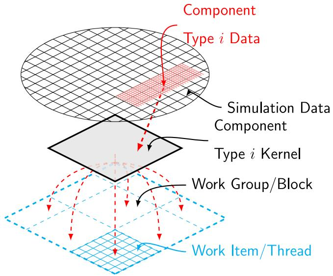  
Fig. 1. SIMT-based compute kernel design for different components.

$$
V ^ {n} (k + 1) = \mathbf {f} (v (k), i (k), x (k), u (k), k). \tag {5}
$$

Since the decoupled components are represented by controlled source in the original network, the new network solution is obtained by applying the modified nodal analysis (MNA) method. Combining Eqs. (4)–(5), we can represent this step as

$$
Y X (k + 1) = b (v (k), i (k), I ^ {n} (k), V ^ {n} (k), k), \tag {6}
$$

where ?? is the admittance matrix, ?? is the source vector, and $X ( k + 1 )$ 号 is the new network solution vector.

By using explicit integrator for nonlinear components we achieve high parallelizability of the solution while by implicitly integrate the linear components of the network we improve the stability of the overall numerical solution. The accuracy concern about using explicit methods has already been clarified via stability analyses in [9].

The whole solution flow can be roughly divided into two steps, namely component step, where Eqs. (4)–(5) are evaluated in parallel, and network step, where Eq. (6) is solved with the help of GPU-based basic linear algebra subprograms (BLAS) library. An additional step named reduction is introduced between these two steps to solve the race condition among threads and is discussed in Section 3.2.

# 3. Computational approach

In order to execute and coordinate the execution on GPU devices, we implemented the program using the OpenCL framework [24]. Like most of the other frameworks targeting heterogeneous platform, the programming model of the OpenCL framework abstracts the hardware into two types, namely the host and the device. The host is used to coordinate the execution of computing tasks as well as the data movement among different memory objects, whereas the device is responsible for the actual computation. The compute kernels are the code that will be executed in parallel on the device. In this section, we will introduce the design of our kernels so to achieve data- and task-parallelism.

# 3.1. Data parallelism

A compute kernel is by its nature data-parallel as the same code is executed by multiple threads, and each thread is usually programmed to take different data by its thread-ID. In order to utilize the GPU efficiently, many previous works have managed to maintain the computations fully on GPU so that the communication overhead between GPU and CPU can be avoided. This is also the case with this work.

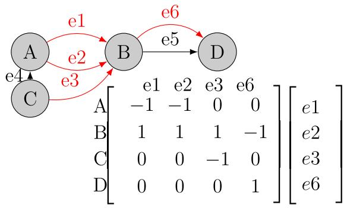  
Fig. 2. Simple connected directed graph and its incidence matrix. The dynamic edges are marked with red.

Finally, since we have a component step and network step during each simulation step, our GPU kernels are designed for the two steps, respectively. In this work, the component kernels are designed following the SIMT model, i.e. a compute kernel is designed for each type of component, and each instance of such component is computed by a thread, as shown in Fig. 1. Therefore, the complete routine of one type of component – including the numerical integration as well as auxiliary transformations e.g. park transform – is performed inside the corresponding component kernel. As a result, different threads for the same compute kernel follows an identical execution path. Therefore, thread homogeneity is maintained for each type of component.

The network step is formulated as a set of algebraic equations; therefore, it can be solved via standard BLAS libraries or linear solver libraries, which automatically generate compute kernels and exploits data-parallelism during execution. These libraries have been extensively studied and developed for different platforms, hardware vendors also provide their own implementations, e.g. cuBLAS, cuSOLVER by Nvidia, and rocBLAS, rocSOLVER by AMD, etc.

# 3.2. Graph-based thread safety design

When component computations are parallelized, collecting all component outputs in to the source vector ?? will likely cause race conditions. This is because most of the nodes are connected with multiple dynamic components, e.g. two generators, to the same bus or at any bus with more than a single line connected to it. Apart from modeling approaches such as aggregated component models, static network models, different programming techniques can be applied as well to solve this issue, e.g. mutex, atomic operations, etc. However, since these techniques basically serialize the concurrent operations, when the network structure becomes more complicated, or the number of multiterminal components is large, performance may degrade severely [20]. To maintain scalability when simulating complex networks, we propose a graph-based approach to overcome this issue. Let us assume the power network is represented using a directed graph $G = ( V , E ) ,$ , where all buses are mapped into vertices ?? and all components are mapped into edges ??. Selecting all edges mapped from dynamic components $E ^ { \prime } \subseteq E ,$ and associated vertices $V ^ { \prime } \subseteq V .$ Let ?? be the incidence matrix of $G ^ { \prime } = ( V ^ { \prime } , E ^ { \prime } ) ,$ , ?? be the vector of component outputs, then the new source vector ?? for MNA can be calculated using this incidence matrix ?? and the ?? vector as

$$
b = D e \left(V ^ {n} (k + 1), I ^ {n} (k + 1)\right). \tag {7}
$$

As a result, since each component has an unique entry in the vector ??, their output can be written concurrently. This step is referred to as reduction. An example can be found in Fig. 2 where the ?? matrix and ?? vector, of the associated graph are illustrated. Due to the fact that this step is a pure matrix–vector multiplication, it can be implemented using standard GPU-based BLAS libraries.

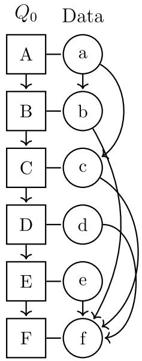  
(a)

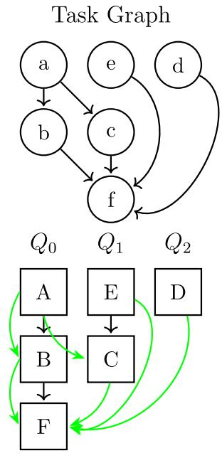  
(b)   
Fig. 3. An example execution task graph during one time step. ?? represents command queue or stream. Squares represent the task and round circles represent the associated data, (a) shows an in-order execution of tasks, data dependency is illustrated to the right but usually has no effect to the execution. (b) shows the task graph based on the data dependency, and the concurrent execution of the original tasks based on the task graph. Green edges indicates the synchronization among tasks.

# 3.3. Task parallelism

Operations like the launch of compute kernels or read-write actions to/from the device’s memory are normally referred to as tasks. In addition to the data parallelism within the compute kernels, a high level of parallelism is exploited via the task graph which enables concurrent kernel execution. The task graph is constructed by analyzing the data dependency in each kernel’s input data; kernels without data races can be labeled as independent tasks. For instance, when different kernels are taking the same data as input, no data race exists if there are only read-after-read operation.

The implementation of a task-parallel runtime mostly relies on the corresponding OpenCL implementation. In OpenCL, the execution order of enqueued tasks is determined by the implementation itself, even the tasks (or commands) in an in-order command queue can be reordered during execution [24]. In out-of-order command queues, a task graph can be dynamically constructed according to the explicitly indicated data dependencies, therefore, independent tasks can be executed concurrently. In contrast, CUDA requires the user to launch kernels on different streams or to manually construct a CUDA graph so that concurrent kernel execution can take place. To overcome this difference, we designed our kernel execution similar to the CUDA way. Since the tasks to be executed mostly remains the same during the simulation, we construct the task graph offline and launch independent tasks for different command queues or streams, and use events to synchronize between them. An example can be found in Fig. 3, which is constructed from the data dependency of the originally in-order executed kernels as shown in Fig. 3(a).

# 4. Implementation

# 4.1. Single-core implementation for CPU: Optimized sequential implementation

To evaluate the performance of the proposed approach we need the best possible sequential implementation of the same problem. Sequential simulation algorithms executed on the modern computer architecture might not actually be executed sequentially, especially for compiled languages such as C/C++. Automatic parallelization techniques of the compilers has been studied for many years [25] and are already available on most of the compilers, e.g. the automatic vectorization by GNU GCC [26]. With these techniques, instructions executing on a single CPU core can follow a SIMD style as shown in Fig. 5, where a vectorized $y \gets a x$ operation is executed. This instruction level parallelism can be applied on almost all of the modern CPUs since the SIMD instruction sets e.g. Streaming SIMD Extensions (SSE), Advanced Vector Extensions (AVX), are supported by almost all of the modern CPUs, provided that the code implementation fulfills certain requirements, e.g. memory alignment, etc. Since numerical simulations are often dominated by linear algebra operations, the compiler optimization like auto-vectorization has a significant impact to the overall performance. Therefore, these features should be enabled in most cases for C/C++ based programs to achieve the best performance on CPU. To ensure a fair comparison, we use the linear algebra library Eigen [27] to implement the matrix operations and enabled the highest compiler optimization. As result, the sequential implementation we will use as reference for performance evaluation already has a certain level of parallelization.

# 4.2. Fully parallel implementation

The fully parallel program adapts the LB-LMC method and the compute kernel design introduced in Section 2 and Section 3 to exploit data- and task-level parallelisms. The architecture of the fully parallel program is reported in Fig. 4. Using the OpenCL framework leads to high portability because of the wide range of OpenCL-conforment products [28]. Since the framework is only an open standard and a corresponding implementation needs to be provided, either a vendorsupplied OpenCL implementation or an open-source implementation [29] can be used. To increase the performance while keeping the portability, a translation layer is added so that the OpenCL application programming interfaces (APIs) are internally translated to use the vendor-specific programming framework’s API, and the compute kernels are translated into target framework’s kernel as well, as shown in the lower part of Fig. 4. This translation is implemented for Nvidia and AMD GPUs via our own extension of CLCudaAPI [30] for the host program, and for the compute kernels, a directive-based tool is implemented. These translations take place during the compilation, therefore, they will not produce extra overhead during the execution. For instance, when the program is executed on an Nvidia GPU and CUDA is selected as the back-end, the program can automatically translate the original OpenCL API calls to CUDA and Nvidia’s justin-time (JIT) compiler NVRTC to compile the compute kernels. For AMD GPU, the program uses its HIP framework and selects the ROCm framework as the computing back-end.

Another advantage for translating the OpenCL API to vendorspecific framework’s API is that the program is allowed to use vendoroptimized numerical libraries, e.g. cuBLAS on CUDA device and rocBLAS on ROCm device, providing more efficient utilization of the hardware.

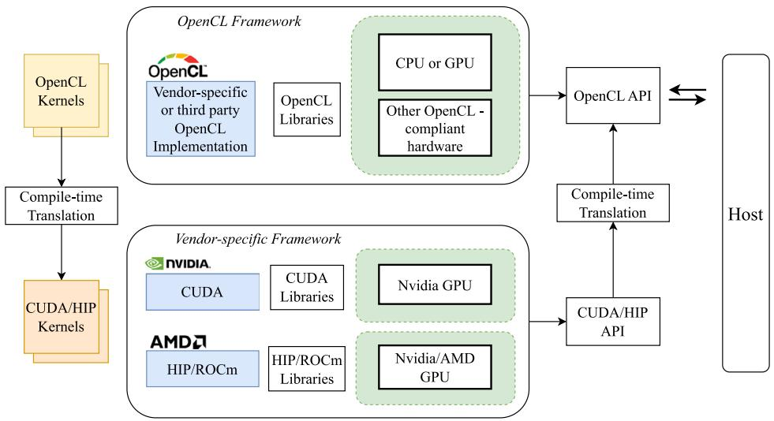  
Fig. 4. Implementation of the fully parallel program.

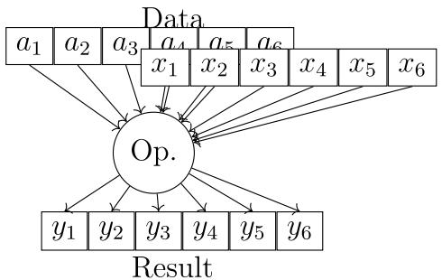  
Fig. 5. Illustration of SIMD execution on single CPU core.

# 5. Study cases

# 5.1. System response during disturbance

Before evaluating the computational performance of the proposed approach and its implementation for faster-than-RT execution, we first evaluate its accuracy using as reference the conventional EMT simulator DIgSILENT PowerFactory [31], which is widely used for electrical power system analysis.

For this purpose we used the IEEE14 network (Fig. 6). An example provided by DIgSILENT. The machines are modeled with the standard model in PowerFactory. At time ?? = 0.1 s, Line_0001_0005 is opened, creating a disturbance into to the system. To observe the system responses, the EMT simulation with PowerFactory is executed with 50 μs time step for 20 s. We then compared the result obtained from this simulation with our SFA-based approach with the same time step, as shown in Fig. 7. Even if slight mismatch can be observed from the results, it is clear the developed tool based on SFA provided equivalent results to the EMT one. We imagine that the slight mismatch can be attributed to the use of different numerical integration schemes, as well as to the event handling methods.

# 5.2. Accuracy analysis

To compare the SFA simulation result with the EMT simulation result as well as to compare SFA simulation with different time steps, we use the original signals reconstructed from the SFA signal. This is done by first interpolating the signals with a larger time step into the time step of the reference via linear interpolation. Afterwards,

Table 1 Mean and Median Relative absolute error during first cycle after event with different time step. If without specification, listed cases are compared with 50 μs time step simulation with SFA.   

<table><tr><td></td><td>100 μs</td><td>500 μs</td><td>1 ms</td><td>50 μs SFA - EMT (PowerFactory)</td></tr><tr><td>Mean</td><td>2.46e-03</td><td>9.06e-03</td><td>1.26e-02</td><td>1.38e-01</td></tr><tr><td>Median</td><td>1.04e-04</td><td>3.11e-04</td><td>3.75e-03</td><td>8.84e-02</td></tr></table>

Table 2 Mean and Median Relative absolute error after 10 cycles after event with different time step. If without specification, listed cases are compared with 50 μs time step simulation with SFA.   

<table><tr><td></td><td>100 μs</td><td>500 μs</td><td>1ms</td><td>50 μs SFA - EMT (PowerFactory)</td></tr><tr><td>Mean</td><td>1.72e-05</td><td>7.11e-05</td><td>1.50e-04</td><td>9.73e-04</td></tr><tr><td>Median</td><td>1.94e-05</td><td>7.87e-05</td><td>1.54e-04</td><td>1.08e-03</td></tr></table>

the original signal is reconstructed by shifting the SFA signal with its central angular speed ????

$$
\begin{array}{l} a (t) = \operatorname {R e} \left\{\langle a \rangle (t) e ^ {j \omega_ {\mathrm {c}} t} \right\} \tag {8} \\ = A (t) \cos \left(\omega_ {c} t + \theta (t)\right), \\ \end{array}
$$

where ??(??), and ??(??) is the amplitude and phase angle of the SFA signal, respectively. Finally, the absolute relative error over time ??(??) is calculated via

$$
e (t) = \left| \frac {a (t) - a (t) _ {r e f}}{a (t) _ {r e f}} \right| \tag {9}
$$

where the reference $a ( t ) _ { r e f }$ is chosen as the reconstructed signal from SFA simulation with 50 μs time step. To evaluate the capability of our SFA-based approach with larger time steps, the SFA simulation is executed with 100 μs, 500 μs and 1 ms time steps. Results are shown in Fig. 8, including the evolution of voltage magnitude as well as the absolute relative error. We also calculated the error of SFA with 50 μs compared to electromagnetic transient (EMT) result in PowerFactory.

Tables 1 and 2 lists the mean and median value of the absolute relative error ??(??) during the first cycle, i.e. ?? = [0.1, 0.116] s, as well as after 10 cycles, i.e. ?? = [0.26, 0.276] s. It can be noticed that the error is small throughout the period and grows slowly with increasing time steps.

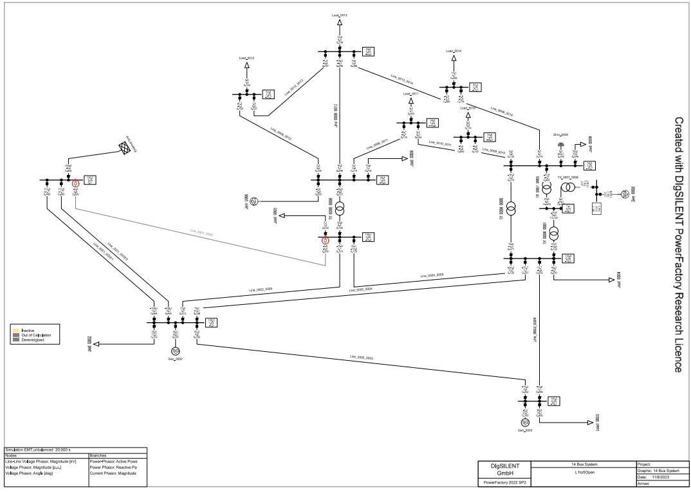  
Fig. 6. IEEE14 Network in DIgSILENT PowerFactory, with Line_0001_0005 open at ?? = 0.1 s.

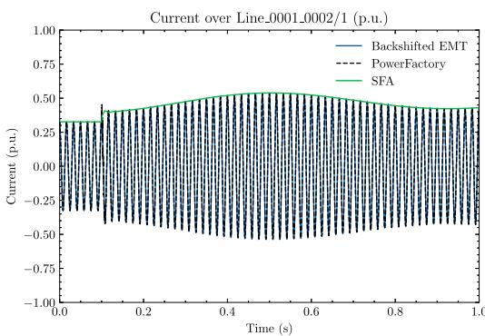  
(a)

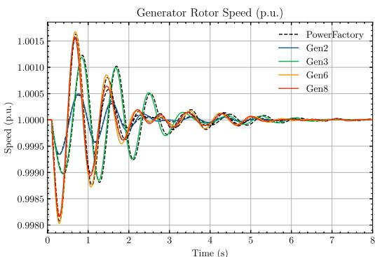  
(b)

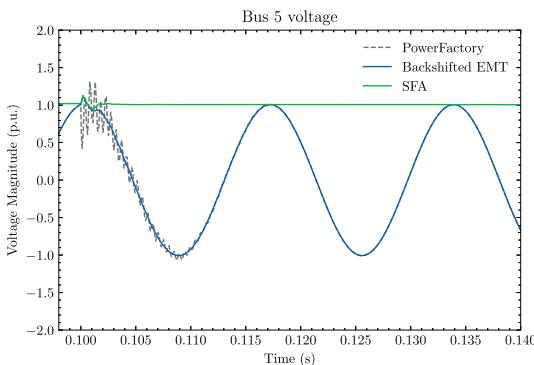  
（c）

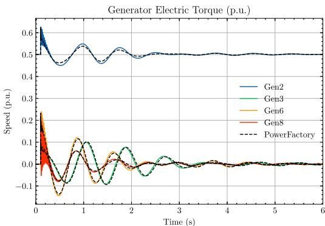  
(d）  
Fig. 7. System responses after opening Line_0001_0005, (a) Current over Line_0001_0002/1, (b) Generator rotor speed, (c) Voltage at Bus 5, (d) Generator electric torque.

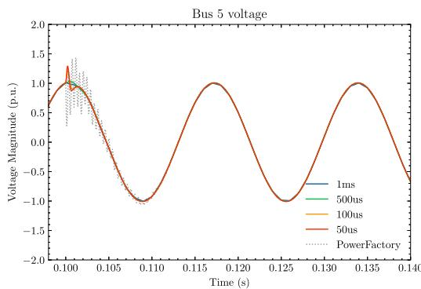  
(a)

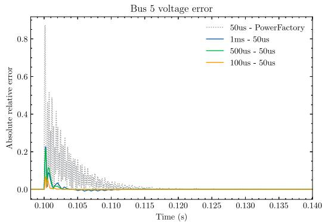  
(b)

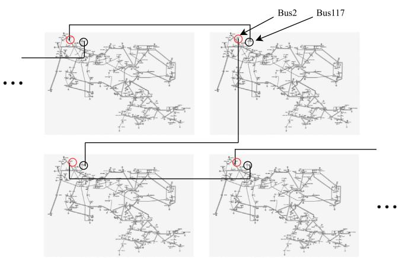  
Fig. 8. (a) Voltage magnitude of Bus 5 with different simulation time step, (b) Evolution of absolute relative error during simulation, compared with SFA at 50 μs time step.   
Fig. 9. Synthesized large-scale network using connected copies of the IEEE-118 test system.

# 6. Performance analysis

To evaluate the performance of our simulator with different sizes of networks and especially large networks, we create synthesized networks using copies of the IEEE-118 test system [32] connected via transmission lines, as shown in Fig. 9, where the Bus2 of the current copy and the Bus117 of the next copy are connected. The benchmark is executed for 2× up to 64× system copies. As a single IEEE-118 system contains 52 generators, the 64× system contains 3328 generators, and in total 43 456 dynamic components.

Simulations in this section are compiled and executed on a server with two AMD EPYC 7H12 CPUs (2.6 GHz base clock frequency, 64 cores each, hyper-threading disabled); 256 GB DDR4 3200 MHz main memory; one Nvidia A100-40 GB GPU, and one AMD MI100 GPU. The operating system installed is Ubuntu 20.04.5 LTS, kernel version 5.15.0-67-generic; CUDA Toolkit version V11.8.89; AMD HIP version 5.1.20532-f592a741, ROCm version 5.1.2.50102-55; programs with AMD ROCm enabled requires clang compiler and thus they are compiled using clang with version 10.0.0-4ubuntu1, the rest are compiled with GNU gcc version 9.4.0.

The host program was implemented in C++ using the C++17 standard. The optimized sequential program uses the Eigen library [27] with version 3.3.7-2 to implement linear algebraic operations on the host side, which is also configured to use OpenBLAS [33] as its back-end with maximum threading set to one.

Table 3 Speedup with task parallel execution.   

<table><tr><td rowspan="2">Computing framework</td><td colspan="2">Average execution time per step (ms)</td><td rowspan="2">Speedup</td></tr><tr><td>Sequential task execution</td><td>Parallel task execution</td></tr><tr><td>HIP(ROCm)</td><td>0.576</td><td>0.493</td><td>1.17</td></tr><tr><td>CUDA</td><td>0.203</td><td>0.169</td><td>1.2</td></tr></table>

# 6.1. Optimized sequential

The simulation algorithm that the sequential program uses is the same as the parallel one except that the reduction step is discarded, since it can directly write to the source vector ?? sequentially without data races. Therefore, the computational load for the sequential program is lighter than the parallel program. Results show that the optimized sequential implementation can already meet faster-than-RT for 2× to 8× IEEE-118 systems, assuming a time step of 1 ms, as illustrated later in Section 6.3 in Fig. 10(a).

# 6.2. Effect of task-parallel execution on data-parallel program

The performance increase with task-parallelism could vary greatly to different systems and scenarios. Using the 2× connected IEEE-118 system copies test case, the task-parallel execution has contributed around 20% speedup on top of pure data-parallel execution as shown in Table 3. We need to point out that our test case is nearly the worstcase scenario for the task-parallel execution. Because the tasks in our IEEE-118 system are associated with synchronous generators, inductors and capacitors, which share a large difference in their computational load.

# 6.3. Fully parallel

The performance of the fully parallel program on GPU is benchmarked with different number of IEEE-118 system copies as well as on different hardware with different implementations. Three groups of benchmarks were performed on AMD and Nvidia GPU listed as following:

• OpenCL back-end: compute kernels are compiled using OpenCL, the reduction and network steps are executed using dense BLAS library clblast,   
• CUDA/ROCm back-end: compute kernels are compiled using the vendor-specific framework, namely CUDA or ROCm, reduction and network step are also executed using the dense BLAS library of each framework, namely cuBLAS or rocBLAS,

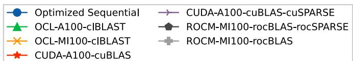

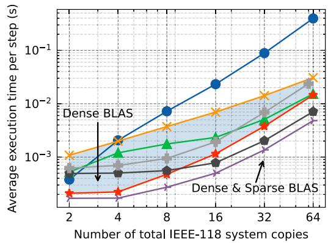  
(a)

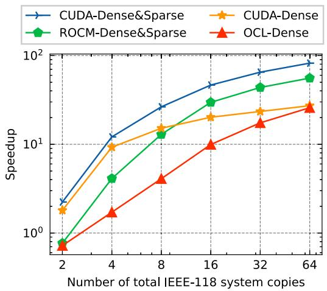  
(b)   
Fig. 10. (a) Average execution time per simulation step, (b) Speedup of parallel simulation on GPU over optimized sequential simulation on CPU.

Table 4 Minimum time step allowed for faster-than-real-time execution $d t _ { m i n } , k _ { f r t }$ at 1ms step, and overall speedup over sequential simulation with different systems sizes (as IEEE118 system copies)   

<table><tr><td>System size (×118)</td><td>2</td><td>4</td><td>8</td><td>16</td><td>32</td><td>64</td></tr><tr><td>dtmin</td><td>0.17 ms</td><td>0.17 ms</td><td>0.27 ms</td><td>0.50 ms</td><td>1.37 ms</td><td>4.82 ms</td></tr><tr><td>kFri at 1 ms step</td><td>5.91</td><td>5.86</td><td>3.66</td><td>2.00</td><td>0.73</td><td>0.21</td></tr><tr><td>Speedup over sequential</td><td>2.24</td><td>12.12</td><td>26.44</td><td>46.53</td><td>65.03</td><td>82.16</td></tr></table>

• CUDA/ROCm back-end with dense & sparse BLAS: based on the previous benchmark, the reduction step is executed using a sparse BLAS library of each framework, namely cuSPARSE or rocSPARSE, instead of a dense one.

The benchmark results are shown in Fig. 10(a). It can be noticed that the execution on GPU with vendor-optimized libraries has demonstrated best performance among all implementations. The MI100 GPU has shown slightly lower performance than the A100 GPU, which can be attributed to the lower memory bandwidth of the former GPU. Nevertheless, albeit lower performance than vendor-libraries, simulations using the OpenCL framework and clBlast library still demonstrated faster-than-RT capability up to around 32× IEEE-118 system. The speedup of different implementations over sequential execution is calculated by

$$
k _ {s p e e d u p} = \frac {t _ {\text {p a r a l l e l}}}{t _ {\text {s e q u e n t i a l}}}
$$

and illustrated in Fig. 10(b). The most performant implementation achieves over 82× speedup compared to the optimized sequential program. To see the faster-than-RT capability clearly, we define the fasterthan-RT factor $k _ { f t }$ as

$$
k _ {f t} = \frac {h}{\bar {t} _ {s t e p}},
$$

where ℎ is the simulation time step, and $\bar { t } _ { s t e p }$ is the average execution time per step taken from the benchmark. By assuming a simulation time step of 1 ms, we can calculate the factor $k _ { f t }$ for the CUDA case with dense and sparse BLAS, this is shown together with minimum time step allowed for FTRT execution, and speedup over sequential execution as shown in Table 4.

Table 5 Operational intensity analysis for basic numerical operations with FP64.   

<table><tr><td>Operation</td><td>W</td><td>Qr</td><td>Qw</td></tr><tr><td>Complex multiplication</td><td>6</td><td>4 · 8</td><td>2 · 8</td></tr><tr><td>Complex add/sub</td><td>2</td><td>4 · 8</td><td>2 · 8</td></tr><tr><td>Sine</td><td>≥10</td><td>8</td><td>8</td></tr><tr><td>Cosine</td><td>≥10</td><td>8</td><td>8</td></tr></table>

# 6.4. Computational performance

To evaluate the computational performance of the overall simulation, we apply the roofline model [34] that has been used widely in performance evaluation of parallel programs. The model uses theoretical peak performance to visualize the ‘‘ceiling’’ of the computing hardware, and therefore evaluate the performance of the program execution on them based on the operational intensity ?? and achieved performance ?? . The operational intensity is defined by

$$
I = \frac {W}{Q} \quad \left[ \begin{array}{c} \text {F L O P} \\ \text {b y t e} \end{array} \right],
$$

where $W ,$ or referred to as work, represents the number of total floating-point operations performed in the program, and ?? the total bytes of memory traffics incurred by executing the program. Table 5 calculates the ?? and ?? for basic numerical operations with FP64, i.e. double-precision floating-point. The operational intensity of the overall simulation is then analyzed and listed in Table $^ { 6 , }$ where $n _ { k }$ denotes the number of corresponding component, ?????? denotes the number of nonzeros in the incidence matrix, $n _ { c }$ the total number of dynamic branches, and finally $n _ { n }$ the number of total simulation nodes. For simulating the components, actual ?? and ?? will vary based on different numerical integration methods and implementations, as well as for the reduction step, actual ?? and ?? also varies for different sparse matrix formats. Therefore, they are both difficult to estimate, and here we give only rough estimates. In addition, in sequential simulation the reduction step is not needed since there will be no race conditions.

And the performance ?? can be calculated by

$$
P = \frac {W}{T} \quad \left[ \frac {\text {F L O P}}{\text {s e c o n d}} \right],
$$

where ?? is the execution time of the program. Finally, the roofline model is built based on the theoretical analysis of numerical intensity and execution benchmarks as shown in Fig. 11. It can be noticed that

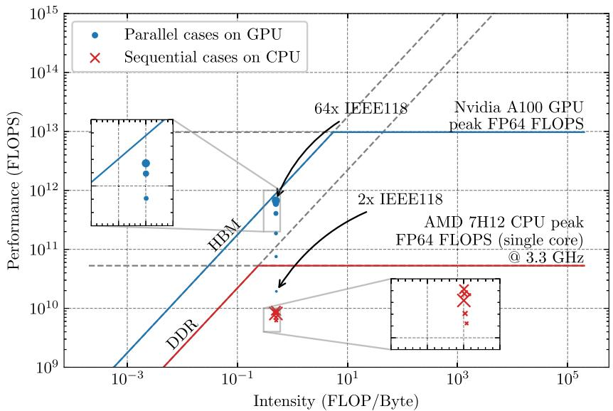  
Fig. 11. Roofline model of the parallel and sequential cases, larger marker represent larger network sizes.

Table 6 Operational intensity analysis for main simulation steps.   

<table><tr><td>Main simulation functions</td><td>Internal stages</td><td>W(n)</td><td>Qr(n)</td><td>Qw(n)</td></tr><tr><td>Capacitor/Inductor</td><td>-</td><td>≥16nk</td><td>≥8·6nk·2</td><td>≥8·6nk·2</td></tr><tr><td rowspan="4">Synchronous machine</td><td>rotatingFrameTransform</td><td>≥44nk</td><td>0</td><td>0</td></tr><tr><td>evaluateDirevative</td><td>≥518nk</td><td>0</td><td>0</td></tr><tr><td>calculateOutput</td><td>≥101nk</td><td>0</td><td>0</td></tr><tr><td>memoryRW</td><td>-</td><td>≥8·180nk</td><td>≥8·17nk</td></tr><tr><td>Reduction (sparseBLAS)</td><td>-</td><td>≈2·nnz·2</td><td>≈8·3·nnz+2·8·nc</td><td>≈2·8·nc</td></tr><tr><td>Network</td><td>-</td><td>8n2+8n</td><td>≥2·8·(n2+2n)</td><td>≥2·8·n</td></tr></table>

the FLOPS achieved via parallel simulation on GPU already exceeds the theoretical peak FLOPS of the CPU with 4x IEEE118 cases. Moreover, the performance observed with our approach on the A100 GPU is converging to its memory bandwidth bound when simulating larger networks and achieving nearly 1 TFLOPS. This has demonstrated the performance and efficiency of our parallel simulation approach.

# 7. Conclusion and outlook

In this work, we demonstrated our approach to accelerate power system simulation using GPU and achieves faster-than-RT capability for small and large networks. The original simulation problem is parallelized using the LB-LMC method and separated into two steps, namely the component step and the network step. The component step is mapped into massively parallel execution following the SIMT programming model, whereas the network step is executed using a high performance linear algebra library. Our concept exhibits two levels of parallelism, namely data-parallel and task-parallel, where the former is brought by the SIMT-based design of compute kernels for components, and the latter by the concurrent task execution based on a task graph. Moreover, we also demonstrated the importance of HPC implementations on real-time (RT) or faster-than-RT simulations: the optimized sequential simulation can also achieve faster-than-RT for small networks with the help of SIMD execution; the fully parallel program gains further performance increase by exploiting sparse matrix structure in implementing linear algebraic operations. In the end, our implementation shows faster-than-RT capability for electromagnetic transients with a dynamic phasor representation for networks with more than six thousand buses.

Limitations of our approach mainly exists in the fact that we achieve data-parallelism based on component types. When simulating a system where the components are highly divergent in types, the massively parallel thread capability will be limited and the overall performance

relies on the task-parallel execution, i.e. concurrent execution of different compute kernels. Future work could be conducted to study the performance and improvements under such scenario, which also needs the implementation of more complex components. Moreover, a more detailed study of HPC implementations for GPUs is also important to performance improvements, e.g. a detailed benchmark of different BLAS libraries on GPU as well as different numerical methods for linear systems. Furthermore, the possibility of multi-GPU execution should be studied in the future to enable fast simulation for even larger networks.

# CRediT authorship contribution statement

Junjie Zhang: Writing – review & editing, Writing – original draft, Visualization, Validation, Supervision, Software, Methodology, Investigation, Formal analysis, Data curation, Conceptualization. Marcel Mittenbühler: Writing – review & editing, Software. Andrea Benigni: Writing – review & editing, Supervision, Resources, Project administration, Methodology, Funding acquisition, Conceptualization.

# Declaration of competing interest

The authors declare that they have no known competing financial interests or personal relationships that could have appeared to influence the work reported in this paper.

# Data availability

Data will be made available on request.

# References

[1] Zhang P, Marti JR, Dommel HW. Shifted-frequency analysis for EMTP simulation of power-system dynamics. IEEE Trans Circuits Syst I Regul Pap 2010;57(9):2564–74. http://dx.doi.org/10.1109/TCSI.2010.2043992, URL http: //ieeexplore.ieee.org/document/5438913/.   
[2] Marti JR, Dommel HW, Bonatto BD, Barrete AFR. Shifted frequency analysis (SFA) concepts for EMTP modelling and simulation of power system dynamics. In: 2014 power systems computation conference. IEEE; 2014, p. 1–8. http://dx.doi.org/10.1109/PSCC.2014.7038487, URL http://ieeexplore.ieee.org/ document/7038487/.   
[3] Lundvall H, Stavåker K, Fritzson P, Kessler C. Automatic parallelization of simulation code for equation-based models with software pipelining and measurements on three platforms. ACM SIGARCH Comput Archit News 2009;36(5):46–55. http://dx.doi.org/10.1145/1556444.1556451.   
[4] Sjölund M, Braun R, Fritzson P, Krus P. Towards efficient distributed simulation in modelica using transmission line modeling. In: MODELS 2010. 2010.   
[5] Happ H. Diakoptics—the solution of system problems by tearing. Proc IEEE 1974;62(7):930–40. http://dx.doi.org/10.1109/PROC.1974.9545.   
[6] Lelarasmee E, Ruehli A, Sangiovanni-Vincentelli A. The waveform relaxation method for time-domain analysis of large scale integrated circuits. IEEE Trans Comput-Aided Des Integr Circuits Syst 1982;1(3):131–45. http://dx.doi.org/10. 1109/TCAD.1982.1270004.   
[7] Zhou Z, Dinavahi V. Fine-grained network decomposition for massively parallel electromagnetic transient simulation of large power systems. IEEE Power Energy Technol Syst J 2017;4(3):51–64. http://dx.doi.org/10.1109/JPETS.2017. 2732360.   
[8] Dufour C, Mahseredjian J, Bélanger J. A combined state-space nodal method for the simulation of power system transients. IEEE Trans Power Deliv 2011;26(2):928–35. http://dx.doi.org/10.1109/TPWRD.2010.2090364.   
[9] Benigni A, Monti A. A parallel approach to real-time simulation of power electronics systems. IEEE Trans Power Electron 2015;30(9):5192–206. http:// dx.doi.org/10.1109/TPEL.2014.2361868.   
[10] Gebremedhin M. Automatic and explicit parallelization approaches for equation based mathematical modeling and simulation. Linköping studies in science and technology. dissertations, vol. 1967, Linköping: Linköping University Electronic Press; 2019, http://dx.doi.org/10.3384/diss.diva-152789.   
[11] Jalili-Marandi V, Dinavahi V. SIMD-based large-scale transient stability simulation on the graphics processing unit. IEEE Trans Power Syst 2010;25(3):1589–99. http://dx.doi.org/10.1109/TPWRS.2010.2042084.   
[12] Song Y, Chen Y, Huang S, Xu Y, Yu Z, Xue W. Efficient GPU-based electromagnetic transient simulation for power systems with thread-oriented transformation and automatic code generation. IEEE Access 2018;6:25724–36. http://dx.doi.org/ 10.1109/ACCESS.2018.2833506.   
[13] Wu W, Li P, Fu X, Wang Z, Wu J, Wang C. GPU-based power converter transient simulation with matrix exponential integration and memory management. Int J Electr Power Energy Syst 2020;122:106186. http://dx.doi.org/10.1016/j.ijepes. 2020.106186.   
[14] Lin N, Dinavahi V. Exact nonlinear micromodeling for fine-grained parallel EMT simulation of MTDC grid interaction with wind farm. IEEE Trans Ind Electron 2019;66(8):6427–36. http://dx.doi.org/10.1109/TIE.2018.2860566.   
[15] NVIDIA CUDA toolkit release notes. https://docs.nvidia.com/cuda/archive/10.0/ cuda-toolkit-release-notes/index.html#deprecated-features.

[16] Tang X, Pattnaik A, Jiang H, Kayiran O, Jog A, Pai S, Ibrahim M, Kandemir MT, Das CR. Controlled kernel launch for dynamic parallelism in GPUs. In: 2017 IEEE international symposium on high performance computer architecture. HPCA, Austin, TX: IEEE; 2017, p. 649–60. http://dx.doi.org/10.1109/HPCA.2017.14.   
[17] Cao S, Lin N, Dinavahi V. Faster-than-real-time dynamic simulation of AC/DC Grids on reconfigurable hardware. IEEE Trans Power Syst 2020;35(2):1539–48. http://dx.doi.org/10.1109/TPWRS.2019.2944920.   
[18] Cao S, Lin N, Dinavahi V. Faster-than-real-time hardware emulation of extensive contingencies for dynamic security analysis of large-scale integrated AC/DC Grid. IEEE Trans Power Syst 2023;38(1):861–71. http://dx.doi.org/10.1109/TPWRS. 2022.3161561.   
[19] Huang R, Jin S, Chen Y, Diao R, Palmer B, Huang Q, Huang Z. Faster than real-time dynamic simulation for large-size power system with detailed dynamic models using high-performance computing platform. IEEE Power Energy Soc Gener Meet 2018;2018-Janua:1–5. http://dx.doi.org/10.1109/PESGM.2017. 8274505.   
[20] Kirk D, Hwu W-mW. Programming massively parallel processors: A hands-on approach. 2nd ed.. Amsterdam: Elsevier, Morgan Kaufmann; 2013.   
[21] Yang T, Bozhko S, Asher G. Multi-generator system modelling based on dynamic phasor concept. In: 2013 15th European conference on power electronics and applications. EPE, IEEE; 2013, p. 1–10. http://dx.doi.org/10.1109/EPE.2013. 6631919, URL http://ieeexplore.ieee.org/document/6631919/.   
[22] Derviskadic A, Frigo G, Paolone M. Beyond phasors: Modeling of power system signals using the Hilbert transform. IEEE Trans Power Syst 2020;35(4):2971–80. http://dx.doi.org/10.1109/TPWRS.2019.2958487.   
[23] Paolone M, Gaunt T, Guillaud X, Liserre M, Meliopoulos S, Monti A, Van Cutsem T, Vittal V, Vournas C. Fundamentals of power systems modelling in the presence of converter-interfaced generation. Electr Power Syst Res 2020;189. http://dx.doi.org/10.1016/j.epsr.2020.106811.   
[24] Khronos® OpenCL Working Group. The OpenCLTM specification. 2023, https: //registry.khronos.org/OpenCL/specs/3.0-unified/pdf/OpenCL_API.pdf.   
[25] Franke B, O’Boyle M. A complete compiler approach to auto-parallelizing C programs for multi-DSP systems. IEEE Trans Parallel Distrib Syst 2005;16(3):234–45. http://dx.doi.org/10.1109/TPDS.2005.26.   
[26] Auto-vectorization in GCC - GNU project. URL https://gcc.gnu.org/projects/treessa/vectorization.html.   
[27] Guennebaud G, Jacob B, et al. Eigen v3. 2010, http://eigen.tuxfamily.org.   
[28] The Khronos group. 2023, URL https://www.khronos.org/adopters/conformantproducts/opencl.   
[29] Jääskeläinen P, de La Lama CS, Schnetter E, Raiskila K, Takala J, Berg H. Pocl: a performance-portable opencl implementation. Int J Parallel Program 2015;43(5):752–85. http://dx.doi.org/10.1007/s10766-014-0320-y.   
[30] CNugteren/CLCudaAPI at 9.0. URL https://github.com/CNugteren/CLCudaAPI.   
[31] PowerFactory - DIgSILENT. URL https://www.digsilent.de/en/powerfactory.html.   
[32] Illinois Institute of Technology E, Computer Engineering Department. IEEE118bus. http://motor.ece.iit.edu/data/IEEE118bus_inf/.   
[33] Wang Q, Zhang X, Zhang Y, Yi Q. AUGEM: automatically generate high performance dense linear algebra kernels on X86 CPUs. In: SC ’13: proceedings of the international conference on high performance computing, networking, storage and analysis. 2013, p. 1–12. http://dx.doi.org/10.1145/2503210.2503219.   
[34] Williams S, Waterman A, Patterson D. Roofline: An insightful visual performance model for multicore architectures. Commun ACM 2009;52(4):65–76. http://dx. doi.org/10.1145/1498765.1498785.