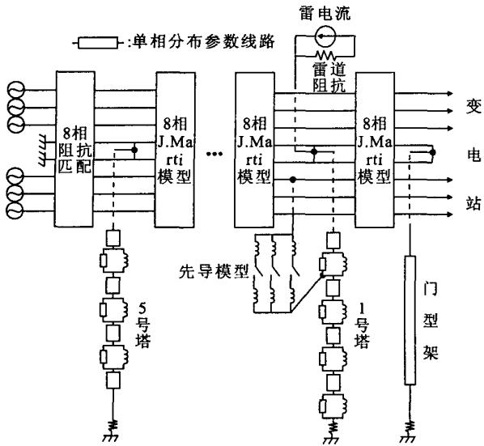
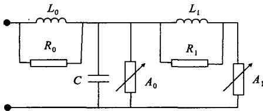
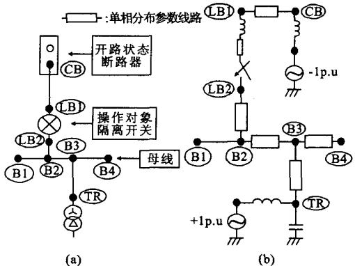
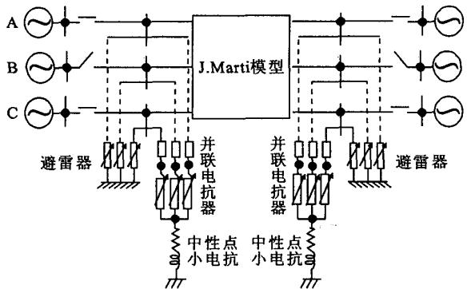
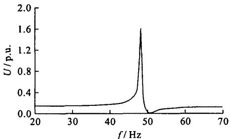

# EMTP在特高压交流输电研究中的应用

曹祥麟

（东电软件系统公司，东京1350034）

摘要：为了使EMTP能为正在开展的特高压输变电技术服务，在简单介绍EMTP元件模型的基础上，围绕特高压交流输电研究各主要课题论述了EMTP的使用方法，因特高压线路的高电压、大电容、小电阻带来了其它电压等级所未有的技术问题，诸如零点偏移、谐振过电压、潜供电流熄灭和短时间工频过电压升高等，故需对特高压系统的这些特有现象进行详细模拟。为了降低特高压输变电设备的造价，特高压的绝缘设计不能是单纯的既有电压等级的延伸，而是需对特高压系统的过电压进行详细计算，EMTP是解决上述2个问题的最好工具。

关键词：特高压输电；EMTP；雷过电压；操作过电压；短时间交流过电压；隔离开关分合过电压；暂态恢复电压；潜供电流；零点偏移；谐振过电压；元件模型

中图分类号：TM74

文献标识码：A

文章编号：1003-6520(2006)07-0064-05

# Application of EMTP in the Research of UHV AC Power Transmission

CAO Xianglin

(TEPCO Systems Corporation, Tokyo 1350034, Japan)

Abstract: EMTP (Electro-magnetic Transient Program) is the program to analyze the electro-magnetic transient phenomenon being used most extensively in the world. This paper introduces the EMTP modeling method first, and refers to the contributions of the author of this paper too, such as the development of phase-domain synchronous machine model and the improvement of control system and others. And then this paper introduces how to use EMTP in each research subject of UHV AC power transmission. The UHV AC power transmission is an economical and effective power transmission form, but it comes with various technological problems caused by high voltage, big charging capacity and small resistance of the ultra-high voltage transmission line, such as zero offset phenomena, resonance overvoltage, secondary arc extinction, rise of power frequency temporary overvoltage and others. Therefore, it is necessary to simulate the special phenomenon appeared in the ultra-high voltage system in detail. And in order to lower the cost of power transmission equipment of ultra-high voltage system, the insulation design of an ultra-high voltage system can not be done as just a mere extension with the current voltage level. It is also necessary to calculate the overvoltage of the ultra-high voltage system correctly. EMTP is the optimal tool for solving two above-mentioned problems. The contents mentioned in this paper will be helpful for the research of the ultra-high voltage transmission and the use of EMTP.

Key words: ultra-high voltage power transmission; EMTP; lightning overvoltage; switching overvoltage; power frequency temporary overvoltage; disconnector overvoltage; transient recovery voltage; secondary arc; zero offset phenomena; resonance overvoltage; modelling of the element

# 0 引言

特高压交流输电(UHV)所带来的零点偏移、谐振过电压、潜供电流熄灭和短时间交流过电压升高等技术难题需要进行详细模拟。此外，为了降低特高压输变电设备的造价，其绝缘设计不能是单纯的已有电压等级的延伸，而是需将系统过电压抑制到合理水平。这不仅需开发更高性能的避雷器，也需详细计算系统过电压。

本文介绍了在国际上广泛使用的电磁暂态计算程序EMTP，并围绕UHV研究的各主要课题介绍EMTP的应用。

# 1 EMTP的概要

EMTP现有3种版本，即BPA-EMTP、ATP-EMTP和DCG-EMTP。其基本构造和原理相同，仅局部功能不同。本文介绍以使用最广泛的ATP-EMTP为主[1-7]。

# 1.1 元件种类概述

① 单相电阻、电感和电容串联电路。这是EMTP已开发的最基本的元件，可构成发电机、变压器或电力系统其他元件，也可单独使用，如用作断路器的合闸电阻、接地电阻、并联电抗器的中性点小电抗、变压器的杂散电容等。② 架空线路和电缆。在EMTP中可用常规 $\pi$ 型电路、无损分布参数电

路、无畸变分布参数电路、具有集中电阻的分布参数电路或具有频率相关参数的分布参数电路来模拟架空线路和电缆。③变压器。在EMTP中可用单相饱和、三相饱和变压器模型或多相耦合 $R - L$ 电路来模拟各种变压器。④非线形元件。EMTP有各种非线形元件模型，用来模拟变压器和电抗器的非线形电感、避雷器的非线形电阻等。⑤简单电压源和电流源。将经常遇到的电源函数作为内部函数，其中包括阶跃函数（Type-11）、斜角函数（Type-12，13）、正弦函数（Type-14）、冲击函数（Type-15）等。为了模拟换流站和电力电子元件，EMTP还有TACS控制电源（Type-60）。⑥同步电机。在ATP-EMTP中有2种同步电机模型，即原有的、基于 $dq0$ 坐标(Park方程)的Type-59模型和笔者开发的、基于相坐标的Type-58模型。由于在EMTP中网络部分是用相坐标表示的，因此使用Type-59模型需要将 $dq0$ 坐标表示的同步电机等值电路转换成相坐标，这将增加预测值，有时候这些预测值会引起数值不稳定。Type-58模型避免了这个问题，但由于每个时步都需要更新G矩阵并重新三角形化，因此计算时间比Type-59长。⑦通用电机。该模型可模拟各种同步、异步和直流电机，功能十分广泛，但使用不太方便。此模型也是使用 $dq0$ 坐标，故在和网络部分结合时也需坐标转换。作者开发了基于相坐标的异步电机模型，并将安装在ATP-EMTP中。⑧开关。EMTP中有时控、间隙、TACS控制开关(二极管、可控硅、单纯的TACS控制开关)和测量开关。⑨TACS是EMTP控制系统模拟工具，它扩展了EMTP的功能和应用[1-6]。在EMTP中电气网络和TACS是分别求解的，网络的解可以在同一时步传递给TACS，但TACS的解要在下一时步传递给网络，即存在一个时步的时延(称作外部时延)。这个时延有时会引起数值振荡。在TACS中还存在着内部时延，这是由于TACS的计算次序不当或者是因为在反馈环中存在特殊装置或两个以上的限幅器引起的，内部时延有时会引起数值不稳定和解的不正确。对外部时延，可在电气网络和TACS的接口处插入低通滤波器，以抑制数值振荡。对内部时延，可引入了阶层系数，并在反馈环采取迭代计算，以避免所有的内部时延。在TACS中，除了时延的问题还存在着变量初始化的问题，目前的TACS虽然有初始化的功能，但这功能是极不完善的，也往往是不正确的，必需依靠用户输入TACS变量的初始值，而这对用户是困难的。为此导入基于瞬时值计算的TACS变量的初始化方法以有效地自动获得TACS变量的初始值[6]。根据

上述这些改良，本文作者改写了ATP-EMTP的TACS部分，并已提交给BPA（Bonneville Power Administration)，预期即将使用。

# 1.2 EMTP的应用

EMTP可用于所有电力系统或电子回路计算。可模拟电力系统各种暂态现象，也可用于大功率电子元件在电力系统中应用的研究，且只要不出现数值振荡，总会得到计算结果，但不加分析的使用计算结果很危险。应考虑几点：①所使用的模型是否合适（模型的前提条件和相关理论）。②所使用的参数是否正确。③计算结果是否符合定性（从物理意义判断）或近似计算预测结果。

# 2 在特高压交流输电研究中的应用

EMTP在UHV研究中主要用于计算系统中的各种过电压和模拟系统特有现象。

表1为CIGRE分类过电压的名称和频率范围。使用EMTP模拟电力系统暂态现象时，要注意其频率范围并选择相应的元件模型和参数。

特高压系统的特有现象主要有潜供电流的消弧时间延长、空载线路的短时工频过电压升高、谐振过电压和零点偏移等[8-10]。

表 1 过电压的频率范围  
Tab. 1 Frequency of overvoltage   

<table><tr><td>分类</td><td>短时</td><td>缓波头</td><td>陡波头</td><td>超陡波头</td></tr><tr><td>频率/Hz</td><td>0.1~3×10^3</td><td>50/60~2×10^4</td><td>10^4~3×10^6</td><td>10^5~5×10^7</td></tr><tr><td>过电压名称</td><td>短时间交流</td><td>操作</td><td>雷电</td><td>隔离开关分合</td></tr></table>

# 2.1 雷过电压计算

内绝缘水平由雷过电压和短时工频过电压决定。在计算变电站设备的雷过电压时考虑下列3种不利的接线方式：①单线路（对断路器和并联电抗器）②单线路加单母线（对母线）③单线路加单母线加单变压器（对变压器）。其中①是考虑多重雷击或其他原因在线路断路器打开的状态下雷电波入侵的情况，因特高压变电站线路断路器距套管较远，套管侧的避雷器往往不能有效地保护线路断路器，在线路断路器会出现较高的过电压。

雷电波入侵变电站是反击或绕击引起（见图1)，一般在进线段的1、2号塔上的雷击最严重。在计算特高压系统的雷过电压时，选择元件的模型： $①$ 线路用多相J.Marti模型表示（双回路为8相，单回路为5相）； $②$ 铁塔用分段铁塔模型表示[11]（双回路为4段，单回路为2段)； $③$ 铁塔接地电阻可用固定值或用大电流特性模型表示，一般用 $10\Omega$ 固定电阻，因在交流接地电阻较低(几 $\Omega$ 以下)时冲击阻抗呈感性， $>10\Omega$ 时显容性； $④$ 模拟间隙闪络的有短

路、电压开关、 $U-t$ 交叉法和先导模型（新藤[12]、长冈[13]、本山等[14]模型），其中短路模型最简单，先导模型最严密；⑤雷击用和雷道阻抗并联的斜角波电流源表示。⑥母线、GIS和引线用无损分布参数线路或J.Marti模型模拟；⑦变压器、电抗器、套管和CVT用电容模拟；⑧断路器在闭合状态处理和GIS相同，打开则用极间电容和对地电容模拟；⑨隔离开关在闭合状态作为GIS的一部分，打开状态因其极间电容比断路器小，作打开的开关；⑩计算雷过电压时要考虑避雷器的陡波响应特性，图2为考虑了陡波响应特性的IEEE模型[15]；⑪计算雷过电压时应考虑工频电压的存在，另外进线段以外的线路部分用多相耦合 $R-L$ 电路匹配，见图1；⑫线路的电晕有降低入侵雷过电压的作用，但目前还没有有效而方便的模拟线路电晕的方法，故一般忽略电晕影响，当作留有裕度。另外，计算雷过电压时还需注意所选时间步长 $\Delta t$ 必需小于最小的分布参数线路(模拟母线、GIS等)的传播时间。

  
图1 进线段线路模型

  
Fig.1 Transmission line modeling   
图2避雷器的IEEE模型  
Fig.2 Arrester model of IEEE

# 2.2 操作过电压计算

线路绝缘设计中操作过电压（分接地短路过电压、分合闸过电压3类)决定空气间隙长度，短时工频过电压决定绝缘子串长度。超高压系统通常用合闸电阻来降低合闸过电压，而在特高压系统除了合

闸电阻还要用分闸电阻来降低分闸过电压。

在计算操作过电压时，选择元件的模型：①线路用多相J.Marti模型来模拟（为了取得不同的故障点和观测点需要适当分段）；②变压器用带饱和特性的变压器模型模拟；③并联电抗器用Type-98非线形电感模拟；④发电机用次暂态电抗 $X_{\mathrm{d}}$ 后的定电压源(Type-14)模拟；⑤避雷器用Type-92非线形电阻模拟；⑥计算合闸过电压，用统计开关或规律化开关模拟断路器，并指定统计合闸次数。计算分闸过电压，用时控开关模拟断路器，带分闸电阻时主触头先打开，然后电阻触头打开，和合闸时正相反；⑦用固定电阻表示短路电阻；⑧计算操作过电压也可考虑变电站的杂散电容(用集中电容表示)和变压器绕组间的杂散电容。

# 2.3 短时工频过电压计算

短时工频过电压包括线路接地短路时健全相过电压、甩负荷时的过电压和2种情况的重迭。特高压系统的接地短路工频过电压倍数比超高压系统低，但因线路的充电容量大，甩负荷时工频过电压倍数将比超高压系统高。短时工频过电压幅值受避雷器的限制，但持续时间长，会引起避雷器热损坏，故在特高压系统如何降低短时工频过电压很重要。

计算短时工频过电压选择元件的模型：①线路用集中参数的 $\pi$ 型电路模拟；②变压器用带饱和特性的变压器模型模拟；③并联电抗器用Type-98非线形电感模拟；④考虑发电机的自励磁和转速上升的影响，发电机用Type-58或Type-59同步机模型模拟，考虑饱和特性，且模拟相应的控制装置(AVR、GOV、UEL等)；⑤避雷器用Type-92非线形电阻模拟；⑥断路器用时控开关模拟。

# 2.4 隔离开关分合过电压计算

隔离开关分合过电压是因隔离开关操作时触头间电弧重燃引起，因GIS尺寸小，隔离开关操作引起的过电压经多次反射、透射，形成比雷过电压频率更高的过电压(VFTO)。当使用高性能避雷器雷冲击波耐压(LIWV)被降低时，隔离开关分合过电压因其超陡波头不易受到避雷器保护，有时会成决定性因素。隔离开关分合过电压大小因GIS的接线方式和尺寸而异，需对每个变电站分别计算。

计算隔离开关分合过电压所用元件模型和雷过电压计算基本相同，但隔离开关用图3中的电弧重燃模型模拟。另外，为了降低隔离开关分合过电压可采用带电阻的隔离开关。图3为隔离开关分合过电压的一个算例。(a)接线图，(b)是计算用电路图。

# 2.5 断路器的暂态恢复电压计算

计算断路器暂态恢复电压(TRV)考虑4种状

态，即断路器端子接地故障时(BTF)的分闸、短线路接地故障时(SLF)的分闸、失步时(out-of-phase)的分闸和切断小电容性电流或小电感性电流分闸。

  
图3分合过电压计算用电路  
Fig. 3 A circuit for calculating disconnector overvoltage

在超高压系统计算断路器的TRV时，可把事故发生的状态作为初始状态，计算断路器分闸时出现在断口间的电压。但是特高压交流线路的电阻小，事故时发生的高次谐波衰减很慢，故需要从事故发生前开始模拟。另外，特高压系统为了抑制分闸过电压采用分闸电阻的方式，故在计算TRV时要考虑有无分闸电阻。计算TRV所用元件模型和计算分闸过电压基本相同，但要考虑变电站的杂散电容(用集中电容表示)和变压器绕组间的杂散电容，且有时考虑变压器的高频损耗。

# 2.6 潜供电流熄弧时间计算

因特高压线路电压高、电容大，接地故障切除后故障点潜供电流熄弧困难，为了确保重合闸成功，可采用高速自动接地装置(HSGS)或带中性点小电抗的并联电抗器。HSGS可保证在各种故障情况下有效地缩短潜供电流的熄弧时间，但需安装并联电抗器时，会额外增加投资。带中性点小电抗的并联电抗器可综合发挥降低短时工频过电压和缩短潜供电流的熄弧时间的作用，但其容量的选择要保证在各种故障条件下迅速熄弧较困难，尤其是在双回路时。

不管是用高速接地方式还是用带中性点小电抗的并联电抗器，都需要用EMTP来计算潜供电流和故障点恢复电压的大小，以确定潜供电流的熄弧时间。在使用HSGS时，还要计算其TRV和VFTO。

可用EMTP的稳态计算功能计算潜供电流和故障点恢复电压，但有并联电抗时，恢复电压呈现拍频状，故应使用暂态计算的结果。各元件模型的选择和短时工频过电压计算时基本相同，但发电机可以用暂态电抗 $X_{\mathrm{d}}$ 后的定电压源(Type-14)模拟。

# 2.7 零点偏移

特高压线路电阻小、电容大，故障电流的直流分万方数据

量衰减慢, 故障前通过断路器的电流为进相电流, 零点偏移现象 (短路电流过零点推迟的现象) 容易发生。此外, 发电机的电抗 $(X_{\mathrm{d}}^{\prime \prime} < X_{\mathrm{d}}^{\prime} < X_{\mathrm{d}})$ 随着时间的增大造成故障电流交流分量的衰减也是形成零点偏移现象的原因。零点偏移现象影响到断路器的规格和继电保护时间的整定, 是特高压研究中的一个重要技术课题。

用 $|I_{\mathrm{F}} - I_{\mathrm{S}}| / |I_{\mathrm{F}}|(I_{\mathrm{F}}:$ 故障电流， $I_{s}$ ：故障前电流）的值简易判断零点偏移现象是否发生。在简易判断时，可用EMTP的稳态计算功能计算故障电流和故障前的负荷电流。在详细模拟时，需要用EMTP的暂态计算功能。在使用EMTP时，各元件模型的选择和短时工频过电压计算时基本相同，仅发电机在简易判断时用 $X_{\mathrm{d}}$ ”后定电压源(Type-14)模拟。

# 2.8 谐振过电压计算

如线路安装了并联电抗器，当线路两侧部分相断路器打开时，因并联电抗器和线路电容间的谐振，会出现谐振过电压。谐振过电压属短时交流过电压，持续时间长，会引起避雷器热损坏。

计算谐振过电压可用EMTP频率扫描的功能确定谐振频率。计算用电路见图4。线路用多相J.Marti模型，并联电抗器用Type-98非线形电感，避雷器用Type-92非线形电阻，断路器用时控开关模拟。用单位定电压源(Type-14)表示非断开相上的电压。图5是频率扫描的结果，谐振频率约 $48\mathrm{Hz}$

  
图4 谐振过电压计算用电路

  
Fig. 4 A circuit for calculating resonance overvoltage   
图5 频率扫描的结果  
Fig. 5 Result of frequency scan

# 3 结 语

EMTP可应用于各种电压等级的交流、直流和交直流混合系统及其设备的模拟，作者希望通过本文引起读者对EMTP的关注。

# 参考文献

[1] Hermann, W. Dommel. EMTP theory book [M]. Portland, Oregon, USA: Bonneville Power Administration, 1986.   
[2] Canadian / American EMTP User Group. Alternative transients program (ATP) rule book[M]. Portland, Oregon, USA: [s.n], 1987.   
[3] Cao X, Mitsuma H, Kurita A, et al. Improvement of numerical stability of electro-magnetic transients simulation by use of phase-domain synchronous machine model[J].日本电气学会B分会论文志，1997，117-B(4)：375-380.   
[4] Cao X, Kurita A, Tada Y, et al. Improvement of phase-domain synchronous machine model[J]. 日本电气学会B分会论文志，2002,122-B(2): 576-578.  
[5] Cao X, Kurita A, Yamanaka T, et al. Suppression of numerical oscillation caused by the EMTP-TACS interface using filter interposition[J]. IEEE Trans on Power Delivery, 1996, 11(4):2049-2055.   
[6] Cao X, Kurita A, Tada Y. Improvement of control system simulation in EMTP[C]. The International Conference on Electrical Engineering, ICEE-F0186. Kunming, China, 2005.   
[7]雨谷昭弘.过渡现象解析PLOGLAMEMTPの最近の動向[J].日本电气学会杂志，1993，113(11)：1071-1072.  
[8]山田直平.特集：UHV交流送電[J].日本电气学会杂志，1982，102

(11): 101-104.   
[9] 电力系统的雷过电压解析体系化调查专门委员会. 電力ステムの過渡現象とEMTP解析[J]. 日本电气学会技术报告第872号, 2002(3): 3-168.  
[10] CIGRE WG 33-02. CIGRE brochure, Guidelines for representation of network elements when calculating transients [M]. parie: CIGRE, 1991.   
[11] Ishii M, Kawamura T, Kouno T, et al. Multistory transmission tower model for lightning surge analysis[J]. IEEE Trans on Power Delivery, 1991, PWRD-6, (3): 1327-1332.   
[12] 耐雷设计委员会发变电分科会. 发变电所上伊地中送电线の耐雷设计方法：电力中央研究所综合报告，1995T40. 电力中央研究所，1995.  
[13] 长冈.非线形元不格子を用たフローニーダル[J].日本电气学会论文志B,1991,111(5):529-534.  
[14] Motoyama H. Experimental study and analysis of breakdown characteristics of long air gaps with short tail lighting impulse[J]. IEEE Trans Power Delivery, 1996, 11, 972-976.   
[15] IEEE WG 3.4.11. Modelling of metal oxide surge arresters[J]. IEEE Trans Power Delivery, 1992,7(1):456-459.

  
曹祥麟

曹祥鹏 1943一，男，日本东电软件系统公司应用技术部副部长，从事电力系统仿真计算研究。电话：81-3-3521-2031；E-mail：Sour-shourin@tepsys.co.jp

收稿日期 2006-06-22

编辑郭守珠

# （上接第48页）

# 4 结 论

a)遗传算法能对解空间的多点同时遗传优化，在找到优化点后，再由BP网络按负梯度方向进行搜索，既能避免BP网络陷入局部最小点的问题，又无遗传算法以类似穷举的形式寻找最优解而导致搜索时间长、速度慢的缺点，收敛过程快速可靠。  
b)遗传BP网络可有效地用于汽轮发电机组振动故障诊断中，效果理想。

# 参考文献

[1] 徐文，王大忠，周泽存，等. 结合遗传算法的人工神经网络在电力变压器故障诊断中的应用[J]. 中国电机工程学报，1997,17(2):109-112.  
[2] 李化，孙才新，廖瑞金，等. 汽轮发电机组振动故障诊断中的改进BP算法[J]. 重庆大学学报，1999,22(5):47-52.  
[3] Ilona Jagielska, Chris Matthews, Tim Whitfort. An investigation into the application of neural networks, fuzzy logic, genetic algorithms, and rough sets to automated knowledge acquisition for classification problems[J]. Neurocomputing, 1999, 24:37-54.   
[4] Booker L B, Goldberg D E, Holland J H. Classifier Systems and Genetic Algorithm[J]. Artificial Intelligence, 1989, 40(1):235-282.   
[5] Marques de saj P. Pattern Recognition Concepts, Methods and Applications[M]. [s.l.] Springer, 2001.   
[6] 苑希民, 李鸿雁等. 神经网络和遗传算法在水科学领域的应用[M]. 北

京：中国水利出版社，2003.  
[7] 周杨平，赵炳全. 利用遗传算法的核电厂故障诊断方法[J]. 清华大学学报（自然科学版），1999，39(2)：47-50.  
[8] 史忠植. 知识发现[M]. 北京：清华大学出版社，2002.  
[9] 史植忠. 神经网络计算[M]. 北京：电子工业出版社，1993.  
[10] 何耀华, 韩守木, 程尚模, 等. 汽轮发电机组故障诊断从模糊自动诊断到 ANN 应用[J]. 汽轮机技术, 1996, (8): 210-213.  
[11] 玄光南. 遗传算法与工程设计(中文版)[M]. 北京: 科学出版社, 2000.  
[12] Yutaka Fukuoka, Hideo Matsuki, Hasruyuki Minamitani, et al. A modified back-propagation method to avoid false local minima [J]. Neural networks, 1998 (11): 1059-1072.   
[13] 陈岳东, 屈梁生. 神经网络在大型回转机械故障诊断中的应用[J]. 西安交通大学学报, 1992, 8(4): 53-60.  
[14]代劲松，宋素芳.基于BP网络模型的汽轮发电机组的振动故障诊断[J].中国电力，1996,29(6)：40-45.  
[15] 张彼德, 孙才新, 欧健, 等. 汽轮发电机振动故障诊断的一种新方法——概率因果模型与遗传算法相结合[J]. 高电压技术, 2005, 28(4): 9-11.  
[16] 施维新. 汽轮发电机组振动[M]. 北京：水利电力出版社，1990.

  
欧健

欧健 1969一，男，博士，副教授，研究方向为设备在线监测及故障诊断，系统动力学。电话：(023)68667452；E-mail: jian_ou@263.net孙才新 1944一，男，工程院院士，研究方向为高电压绝缘技术、电气设备在线监测与故障诊断。

收稿日期 2005-04-08

编辑 曹昭君