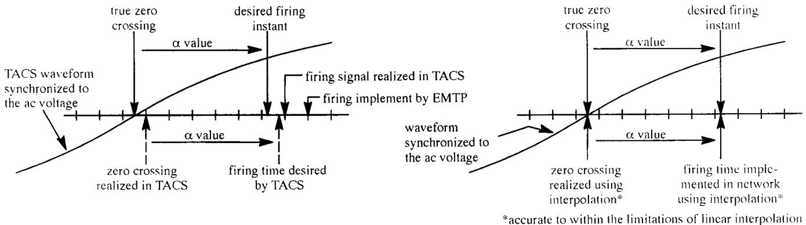
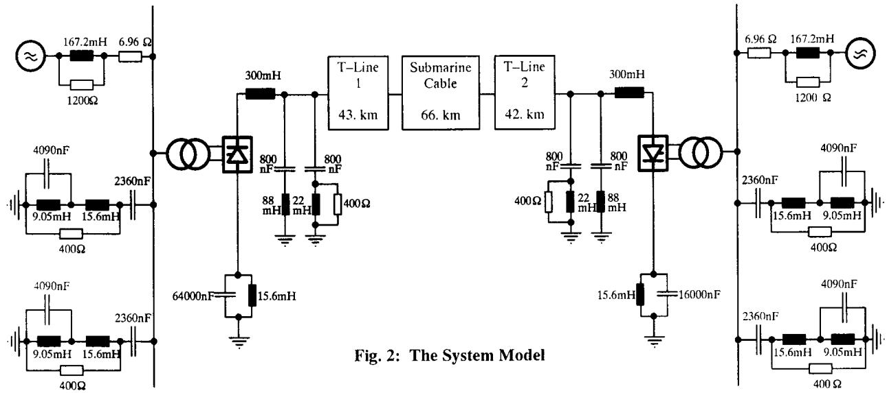
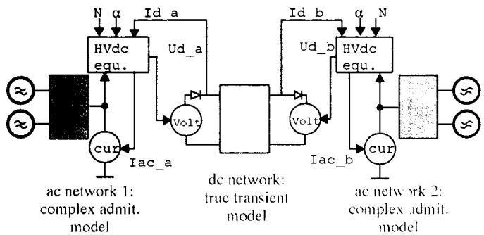
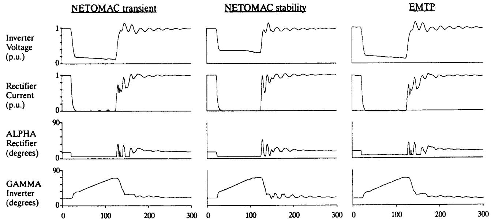
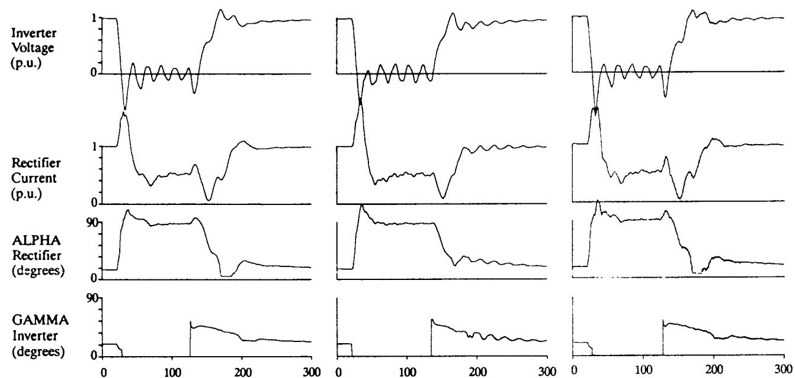
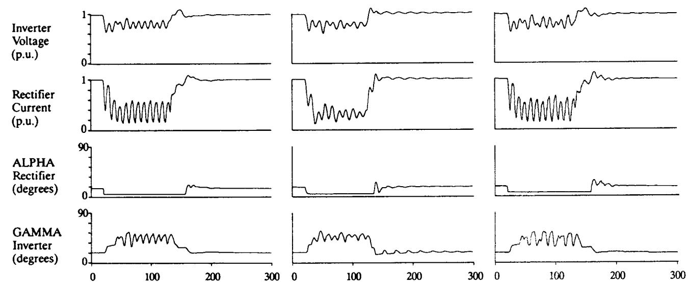
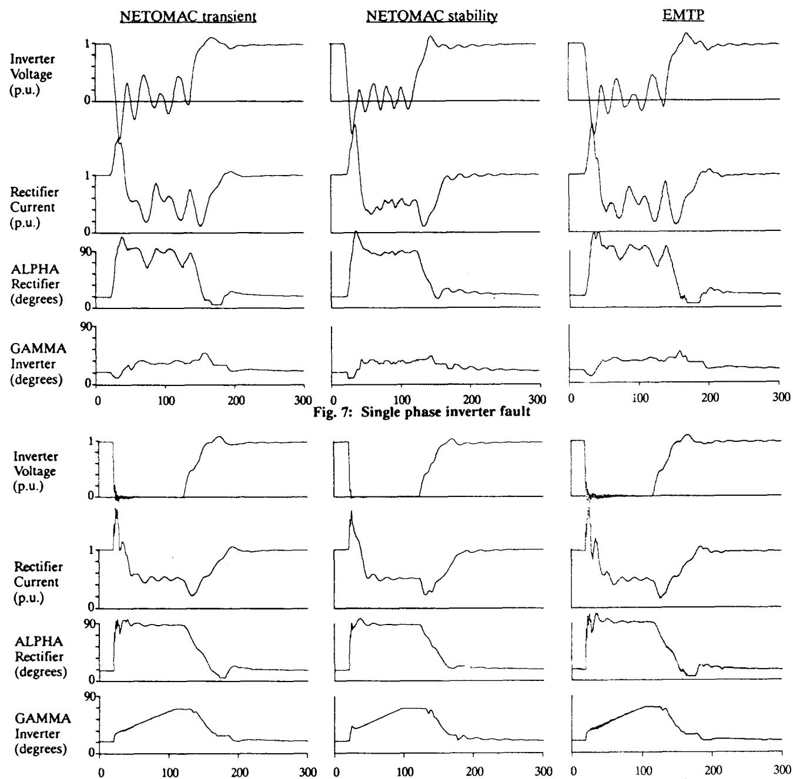

# COMPARISON OF THE ATP VERSION OF THE EMTP AND THE NETOMAC PROGRAM FOR SIMULATION OF HVDC SYSTEMS

P. Lehn J. Rittiger

Member

Siemens AG

Box 3220, 91052 Erlangen, Germany

B. Kulicke

Member

Technische Universität Berlin

Einsteinufer 11, 10587 Berlin, Germany

# ABSTRACT

This paper investigates the capabilities and limitations of the EMTP and the NETOMAC program as applied to HVdc system simulation. The fundamental differences between the two programs and their effect on simulation results are described. Consistency of the results obtained from these programs is examined through simulation of a test HVdc network. As expected, a very high degree of agreement between the two sets of simulation results proved to be achievable, but only when particular care was taken to overcome internal program differences. Finally, the new advanced stability feature of NETOMAC is briefly discussed and then tested against the complex transient models established in the EMTP and in the NETOMAC transients program section.

Keywords: HVdc simulation, ATP, EMTP, NETOMAC.

# INTRODUCTION

Particularly in the last 10 years, a wide variety of HVdc control strategies have been tested and optimized with the help of various digital simulation programs. In 1985 the great interest in HVdc system simulation led to the idea of establishing an HVdc benchmark model [1]. In the following years a comparison of one simulator and four digital models was carried out and then documented by a Cigre Working Group [2]. Computed results from the various simulation programs all agreed quite well with the reference simulator results (although completely calibrated NETOMAC results were first documented somewhat later [3]). Since virtually every computer model was established at a different location, generally only discrepancies between results from the simulator and a particular program model were addressed. Variations between the results obtained from different simulation programs therefore received little attention.

A comparative study between the EMTP and the NETOMAC program was therefore carried out by simulation of a common HVdc system with the two programs. Here, in contrast to the Cigre studies, particular attention was paid to minimizing all possible differences and locating any remaining sources of error which exist between the digital models. In addition, the study provided an ideal opportunity to demonstrate and test the abilities of the new advanced stability feature of NETOMAC, which was designed for the inclusion of complex HVdc networks in ac stability simulations.

For the purpose of this study the ATP version of the EMTP, supplied by the Leuven EMTP Center (LEC), was employed. The

95 WM 276-6 PWRD A paper recommended and approved by the IEEE Transmission and Distribution Committee of the IEEE Power Engineering Society for presentation at the 1995 IEEE/PES Winter Meeting, January 29, to February 2, 1995, New York, NY. Manuscript submitted December 22, 1993; made available for printing November 30, 1994.

discussion presented however, is generally applicable to the other available EMTP versions (such as the EPRI an BPA version numbers 2.x) as well.

# THE EMTP AND THE NETOMAC PROGRAM

Both the EMTP and the NETOMAC program have been around for over 2 decades. Although the programs were initially perhaps somewhat limited in their abilities, continual program development and the rapid advance of computational facilities has transformed them into very powerful and flexible simulation packages. Currently, both packages are capable of representing an enormous variety of linear and nonlinear network elements, as well as controls and the controlled switches (thyristors) which are required for HVdc and SVC system modelling. They are also both capable of load flow and transient calculations and they offer a wide variety of advanced features such as inclusion of macros, or "modules" in the EMTP, calculation of line constants, and transmission line representation with the Marti Model. Of course certain features are peculiar to the individual programs. The most significant of these features in the EMTP are SPY, for interactive execution, observation and control, as well as support programs for conversion of supplied nonlinear transformer and inductor data into EMTP input format. As for the NETOMAC program, it offers a variable time step size, interpolation, and a stability calculation feature which has recently been made even more powerful.

When looking more closely at the two programs, 3 rather significant disadvantages of the present EMTP version can be seen when simulation of HVdc and SVC devices is considered. First, the fixed time step of the EMTP causes errors in switching times and can also cause the initiation of numerical oscillations [4][5]. Secondly, undesirable time delays occur between the solution of the control equations (in TACS) and the network equations [5]. Finally, because TACS was originally designed for the representation of analog controls, limitations become evident when modern digital controls are to be modelled [6]. While the newer MODELS option of the ATP version of the EMTP overcomes the problems of modelling digital controls and even reduces some of the time delays between the controls and network solutions, a great many users still only employ TACS to ensure their data files remain compatible with other EMTP versions.

In the case of the NETOMAC program, delays between the network and controls solutions are eliminated for HVdc applications, and switching operations employ an interpolation technique [8, 9]. The delays in thyristor firing that occur with TACS and NETOMAC are shown graphically in fig. 1. (It should be noted that not necessarily all the EMTP versions function quite identically [7] and the figure only shows the typical delays that are to be expected.) As can be seen from the figure, the delay in the EMTP when TACS is employed is one time step plus errors in zero crossing detection plus errors resulting from the fact that the time $\alpha$ is not an exact multiple of the time step. The accuracy of the NETOMAC firing time is only limited by the precision of the linear interpolation routine used.

The modelling of controls is quite different in the two programs. Both NETOMAC and MODELS in ATP employ a much larger library of special functions than TACS and they also accepts true FORTRAN input offering if...then...else structures and the like.

  
Fig. 1: Thyristor firing in EMTP (left) and NETOMAC (right)

They are therefore better suited to the representation of digital controls than TACS. All three environments, TACS, MODELS, and NETOMAC are equally capable in their abilities to model analog controls.

# SYSTEM CONFIGURATION

Since both the EMTP and the NETOMAC program are capable of simulating virtually any conceivable electrical network, no constraints were imposed on the configuration of the network to be used in the comparison study. In order to rigorously test the capabilities of the new advanced stability model however, a system with a relatively complex dc circuit was chosen. The system model selected for the study is shown in fig. 2. Both ac systems operate at $50\mathrm{Hz}$ , and the networks are both strong with a SCR of 5.0. Each converter is compensated to about $80\%$ of its reactive power demand by two ac filters producing 240 Mvar. The HVdc monopole is rated at $600\mathrm{MW}$ and $400\mathrm{kV}$ . The dc line consists of 2 transmission line sections separated by $66\mathrm{km}$ of submarine cable. The two transmission line sections are modelled using T-sections that are about $20\mathrm{km}$ in length, while the cable requires 13 T-sections, each approximately $5\mathrm{km}$ long. Two rejection filters tuned to 50 and $100\mathrm{Hz}$ are included in the dc circuit to eliminate resonances of the combined dc network at these frequencies. The highly capacitive submarine cable section and the first and second harmonic resonances of the dc circuit make the system very demanding on the advanced stability model.

Since the controls were all to be modelled in TACS, an analog controller, based on the controller used by the FGH in their simulation of the HVdc benchmark model [10], was chosen. Certain modifications were, however, made necessary by the more complex dc circuit which included a highly capacitive submarine

cable section. These include changes in the controller gains, incorporation of a VDCL characteristic at both the rectifier and inverter and logic to ensure gradual recovery after engagement of the VDCL.

# THE EMTP AND NETOMAC MODELS

As long as the electrical network consists of only linear elements, creation of identical models in the two programs is possible. Minor discrepancies between the two models however, start to arise as soon as saturable transformers, time controlled switches and thyristors are introduced. The least problematic of these elements is the time controlled switch where, switching events must occur at the same point on the voltage waveform, which is not necessarily at exactly the same instant in real time. Although ideally the conditions are synonymous, in reality there can be a small phase shift between the two program outputs (in the order of several time steps). Also, since the EMTP does not interpolate to open switches precisely at zero current, the resulting chopped current can have a substantial effect on the system response. For the EMTP and NETOMAC models to respond similarly to a given switching action, the elimination of these errors through careful examination and correction of the switching time and adjustment of the EMTP switch current margin to control the chopped current is required.

In the case of the saturable transformer model, and similar nonlinear elements, care must obviously first be taken to ensure that the given data is correctly converted for input into each of the two programs. While this process is simplified by support programs in EMTP, it remains somewhat tedious in NETOMAC. It should be noted however, that even once data is correctly converted and entered, slight discrepancies will still be evident in the operation of the device. For example, in the case of a piecewise linear characteristic, the variable time step of NETOMAC al

lows interpolation to the point of discontinuity and ensures that the characteristic entered is strictly obeyed. Since this is not possible in the EMTP, a slight overshoot at the discontinuity occurs [5]. The resulting discrepancy decreases with a decreasing time step size in the EMTP.

Finally there is the difficulty associated with the implementation of controllable switches, i.e. thyristors. Simply put, it is impossible for a thyristor modelled in the EMTP and in I'ETOMAC to function identically. First, there are the inherent time delays which occur between the controls and network solutions in EMTP and are avoided in NETOMAC by interpolation to the exact switching time specified by the controls. This, however, assumes that the output of the controls themselves are identical, which is also not the case. Although the controls simulation in NETOMAC and TACS in EMTP perform the same function, they have very little else in common. It is therefore exceedingly difficult for even simple blocks such as a PI controller to be identically represented in the two programs. In fact, even the PI controller must be broken down into its component P and I parts, if the limit handling in the two programs is to be carried out identically. In many cases, due to the different control function libraries, a single block in one program has to be replaced by a set of interconnected blocks in the other just to mimic the same response.

# NETOMAC ADVANCED STABILITY MODEL

While the EMTP, previous NETOMAC versions, and other similar programs have been employed for calculation of transients in combined ac-HVdc systems, the small time step required when modelling the thyristor bridges have generally limited such simulations to perhaps a few seconds in length. System stability calculations have therefore been left to stability programs in which the dc system is extremely simplified and the entire dc network must be represented as a transfer function [2][11]. Such modelling however, becomes very difficult and restrictive in systems with complex dc circuits, especially in cases where the effects of dc line faults and switching events are to be investigated [3]. These considerations have led to a new and unique NETOMAC program development which allows simultaneous calculation of the ac network in the program's stability section and calculation of the dc network in the program's transient section. This hybrid model represents the ac network by a single line diagram employing complex admittances, as is standard for stability calculations, but simultaneously also solves the differential equations representing the dc circuit. Since the dc circuit is represented by a standard transient model, all options normally available in a transient simulation can be made use of in the ac circuit. These include, but are not limited to, representation of mutual coupling between the transmission lines of the two poles, representation of lines using a Marti Model, simulation of any types of faults and complete modelling of dc filters, stray capacitances, and so on. As for the ac system, the generators are of course modelled using differential equations in order to simulate their dynamic response. The interface between the ac and dc networks is the converter, which is modelled using the quasi-stationary converter equations as per [12], with additional logic for handling fault conditions.

Control of the converter employs the same controller input data set as used in the NETOMAC transient model. In fact, since the input format for the NETOMAC stability and transient sections is basically the same, the majority of the network input data for the stability model can also be directly copied from the equivalent transient model. Exceptions to this include single phase and phase to phase branches which must be eliminated, as well as the thyristor bridges and converter transformer which are already represented using the quasi-stationary equations.

Fig. 3 gives an overview of the solution technique used in the advanced stability model. This technique allows simulation of any variety of dc line faults or switching events as well as symmetrical ac phenomena. Due to the single line representation of the ac system, unsymmetrical faults can only be roughly approximated by the model. Harmonic studies and representation of internal converter faults are not possible with the simplified model.

  
Fig. 3: The NETOMAC Advanced Stability Model Solution Technique

While, as the name implies, the advanced stability model was primarily developed for the purposes of stability calculations, its remarkable performance may make it a topic of interest for transient simulation program users as well. Although there are limitations to the accuracy of the transient system response calculated with the hybrid model, an impressive improvement in computation time is achieved (Table 2). This is particularly true in cases where large ac systems are to be simulated. The fast calculation speed and the reasonable accuracy displayed by the advanced stability model in transient simulations makes it a useful tool for screening which HVdc fault cases are critical and should be more closely investigated using a detailed transient model. The stability model also proves useful in the basic control design for complex HVdc systems, such as multi-terminal links.

# SIMULATION RESULTS

The system of fig. 2 along with the modified FGH benchmark controls [10] was simulated with the EMTP and the NETOMAC program. Single phase and three phase faults to ground at both the rectifier and the inverter stations, as well as a dc line fault occurring between the cable and transmission line 2, were simulated. Figures 4, 5, 6, 7 and 8 show a comparison of the simulation results obtained from the different programs/methods for the above mentioned fault scenarios. The traces shown here give the dc rectifier current, the dc inverter voltage at the dc filters as well as the rectifier firing angle and the inverter extinction angle. A numerical comparison of the prefault steady state operating point calculated with the 3 models is given in Table 1.

Table 1: Comparison of the prefault steady state quantities   

<table><tr><td rowspan="2">Quantity</td><td rowspan="2">EMTP</td><td colspan="2">NETOMAC</td></tr><tr><td>transient</td><td>advanced stability</td></tr><tr><td>α rectifier</td><td>14.7</td><td>15.0</td><td>15.3</td></tr><tr><td>γ inverter</td><td>18.0</td><td>18.0</td><td>18.0</td></tr><tr><td>α inverter</td><td>145.2</td><td>145.2</td><td>145.2</td></tr><tr><td>Id rectifier</td><td>1.000</td><td>1.000</td><td>1.000</td></tr><tr><td>Ud inverter</td><td>.995</td><td>.994</td><td>.986</td></tr></table>

As can be seen from figs. 4 through 8, and also from Table 1, extremely good agreement between the two transient programs is achievable. It can also be seen that the advanced stability model closely approximates the transient simulation results for all symmetrical ac disturbances and dc fault cases tested. In contrast to conventional HVdc stability models [2], the advanced stability

  
Fig. 4: Three phase rectifier fault

  
Fig. 5: Three phase inverter fault

  
Fig. 6: Single phase rectifier fault

  
Fig. 8: DC line fault located at the junction of the cable and transmission line 2

model offers more accurate representation of the dc line current and voltage fluctuations during both the fault and the recovery. Due to the single line model of the ac system, unsymmetrical fault cases can only be roughly approximated with the advanced stability model.

Comparison of the stability model with the transient model results shows that the stability model overestimates the residual voltage of the dc line in the case of the three phase rectifier fault. This is a consequence of using the simplified representation of the converter without actual representation of any of the valves. Looking at the rectifier current in figs. 4 and 5 it can also be seen that the stability model recovers somewhat more rapidly than it should. The reason for the more rapid recovery is the fact that the ac system and the converters assume balanced three phase operation. Thus the instant the fault is switched off, a balanced three phase voltage appears on the terminals of the converter. In the transient simulations however, the three phases must return sequentially since the fault current flowing in each phase can only be interrupted at a zero crossing. Fig. 8 compares the stability and transient results for a dc line fault. As can be seen, the advanced stability model has no difficulties handling a fault in the dc network.

As for the two sets of transient results, the high degree of agreement is, unfortunately, not simply obtained by ensuring that the physical system is modelled as accurately as possible. Even once model differences are minimized and care is taken to match fault switching instants, results will agree only if the time step is appropriately selected. While selection of an unusually small time step (around $5\mu s$ ) might prevent time step size dependant discrepancies from arising between the EMTP and NETOMAC transient simulation results, the associated long computation time required would generally prove unacceptable as well as unnecessary for most studies. The time step used in both programs was therefore increased until the quality of the transient simulation results started to degrade. For the HVdc system under study this occurred when the EMTP time step size went beyond $20~\mu s$ . Due primarily to the interpolation technique used by NETOMAC however, its time step was raised to $100~\mu s$ without any particularly noticeable degradation in its transient system response.

In contrast to the transient models, the NETOMAC advanced stability model requires the input of two time step sizes: one for the ac network stability solution and another, possibly different one for the dc network transient solution. Here the optimal time step was found to be $500~\mu \mathrm{s}$ for both sections. Although a $500~\mu \mathrm{s}$

time step for a stability calculation is quite small, it is only required for the duration of the fault. Once the fault is over and the HVdc system starts to approach its normal operating point, the time step for the ac system can be substantially increased. Since the ac network model was small and only $300\mathrm{ms}$ of simulation were desired, the time step size was left unaltered for the purpose of this study.

Table 2 gives a comparison of the time step sizes used in the EMTP and the two NETOMAC models to achieve the simulation results of figs. 4, 5, 6 and 7. The associated computation time required to simulate $640~\mathrm{ms}$ of real time on an 80486, 33 MHz IBM compatible computer is also given. As can be seen, the EMTP is in fact not as much slower than the NETOMAC transient simulation as is suggested by the large time step difference since it is not slowed by the complicated interpolation routine. What is much more noticeable however is the large computation time advantage of the advanced stability model. In cases where the dynamic performance of the system over a longer time spans is of interest, the time step for the ac system in this model can be dramatically increased after the higher frequency transient phenomena resulting from the applied fault have passed. For large ac systems with many generators this can mean another factor of 10 increase in computation speed.

Table 2: Time step size and computation time comparison   

<table><tr><td>System model</td><td>Time step size</td><td>Computation time</td></tr><tr><td>EMTP (ATP20 Version 6)</td><td>20 μs</td><td>765 seconds</td></tr><tr><td>NETOMAC transient model</td><td>100 μs</td><td>193 seconds</td></tr><tr><td>NETOMAC advanced stability</td><td>500 μs</td><td>21 seconds</td></tr></table>

# CONCLUSIONS

In the past, calibration and testing of digital simulation programs has generally been carried out by comparing simulator and computer results. Such a study was performed on a large scale by the Cigre Working Group 14-02 and it demonstrated that various modern simulation programs could reproduce simulator results with good accuracy. While all test programs approximated the simulator responses, close scrutiny of the curves showed a whole host of small discrepancies between the results from the various programs.

Here an attempt was made to determine how large a degree of discrepancies must be simply accepted as a result of internal program differences and how other discrepancy can be eliminated. The resulting transient responses from the ATP version of the EMTP and from NETOMAC demonstrated that virtually identical results can in fact be obtained from the two programs, in spite of the many program differences. To overcome time delays and the lack of interpolation in the EMTP however, the best agreement of results was achieved only when the EMTP time step was selected to be about 5 times smaller than the one used in NETOMAC.

Once two sets of comparable results were obtained from the EMTP and the NETOMAC transients models, the capabilities of the new advanced stability feature in NETOMAC were tested. The advanced stability model proved to be able to closely approximate the transient simulation results for all symmetrical ac and all dc fault cases tested. The new model also offered a calculation speed which was 10 times faster than that of the transient models.

Future work should include rigorous testing of the new and improved EPRI version 3 EMTP against other digital and/or analog models.

# REFERENCES

[1] J. D. Ainsworth, "Proposed Benchmark Model for Study of HVdc Controls by Simulator or Digital Computer", presented at the CIGRE SC-14 Colloquium on HVDC with Weak AC Systems, United Kingdom, Sept. 1985.   
[2] M. Szechtman et. al., "First benchmark model for HVdc control studies", Electra, No. 135, April 1991, pp. 54-67.   
[3] J. Rittiger, "Digital Simulation of HVDC Transmission and its Correlation to Simulator Studies", IEE Conference Publication Number 345, pp. 414-416.   
[4] LEC, Alternative Transients Program Rule Book, 1987.   
[5] H. W. Dommel, Electromagnetic Transients Program Reference Manual (EMTP Theory Book), 1992.   
[6] L. X. Bui, S. Casoria, G. Morin, J. Reeve, "EMTP TACS-FORTRAN Interface development for Digital Controls Modeling", IEEE Trans. on Power Systems, Vol. 7, No. 1, Feb. 1992, pp. 314-319.   
[7] A. E. Araujo, H. W. Dommel, J. R. Marti, "Converter Simulations with the EMTP: Simultaneous Solution and Backtracking Technique", Paper APT 286-18-26, IEEE/NTUA Athens Power Tech Conference, Athens, Greece, Sept. 1993, pp.941-945.   
[8] B. Kulicke, "Simulationsprogramm NETOMAC: Differenzenleitwertverfahren bei kontinuierlichen und diskontuierlichen Systemen", Siemens Forsch. - u. Entwick. - Ber., Bd. 10, Nr. 5, 1981, pp. 299-302.   
[9] R. H. Lasseter, K. H. Kruger, "HVDC Simulation using NETOMAC", IEEE Montech '86 - Conference on HVDC Power Transmission, Sept. 1986.   
[10] T. Wess, H. Ring, "Simulator study of HVDC controls with a proposed Benchmark model", FGH report presented to CIGRE WG 14-02, Oct. 1988.   
[11] R. Proulx, A. Valette, J. P. Gingras, D. Soulier, "User-Oriented Simulation of HVdc Control in a Transient Stability Program", IEEE Trans., PAS-104, No. 7, July 1985, pp. 1609-1613.   
[12] D. Braunagel, L. Kraft, J. Whysong, "Inclusion of DC Converter and Transmission Equations directly in a Newton Power Flow", IEEE Trans., PAS-95, No. 1, Jan./Feb. 1976, pp.76-88.

# BIOGRAPHIES

P. Lehn - was born in Winnipeg, Canada on Nov. 27, 1968. He received both his B.Sc. and M.Sc. degrees in Electrical Engineering from the University of Manitoba in 1990 and 1992 respectively. In 1992 he joined the HVdc Systems Planning Group at Siemens AG in Erlangen, Germany. His current interests include HVdc system modelling and control. Mr. Lehn is a member of the IEEE.

J. Rittiger - received his Dipl.-Ing. degree in Electrical Engineering from the University of Erlangen in 1987. After finishing his studies he joined Siemens AG in Erlangen, Germany. Since 1988 he is working in a HVdc Systems Planning Group. His special fields are computer simulation of HVdc, control systems for HVdc and problems concerning interconnected dc and ac systems.

B. Kulicke - was born in Wernigerode, Germany on Nov. 13, 1944. He received the M.S. degree from the Technical University Berlin in 1970 and the PhD degree in Power Engineering from the University of Darmstadt in 1975. From 1970 to 1983 he was with Siemens AG, working in the High Voltage Power Engineering Department. He was responsible for the development of the NETOMAC program and was mainly involved in performing system studies including electromechanical and magnetic transients and stability problems. In 1984 he was appointed Professor and Director of the Department of High Voltage Power Engineering at the Technical University Berlin. Prof. Kulicke is a member of the IEEE Power Engineering Society.