# 适用于实时仿真的MMC子模块电容电压优化均衡方法

樊 强，王 乐，冯谟可，俞永杰，赵成勇，许建中

（华北电力大学 新能源电力系统国家重点实验室，北京 102206）

摘要：针对并行全比较算法存在的高空间复杂度问题，提出一种适用于模块化多电平换流器（MMC）实时仿真的电容电压均衡优化方法。在子模块电容电压的排序方面，采用分组排序的均压策略，组内子模块采用并行全比较算法以减少排序时间，组间子模块根据所定义的能量平衡因子计算结果来平衡其电容电压值。此外，提出一种子模块电容电压值重构方法处理含相同电容电压值的子模块排序问题。在触发脉冲产生方面，提出一种串、并行触发结合的混合触发模式，将触发脉冲产生环节消耗的时间与 各桥臂子模块总数解耦。在 ／ 仿真程序和低功率 物理样机平台的阀级控制器中验证了所提 子模块电容电压优化均衡方法的逻辑有效性和工程实用性，证明了所提方法在保证低时间复杂度的同时，其空间复杂度亦有所降低。

关键词： ；换流器；时空复杂度；并行全比较算法；能量平衡因子；物理样机

中图分类号：TM 46

文献标志码：

DOI：10.16081/j.epae.202010011

# 0 引言

模块化多电平换流器（ ）由于其具有开关频率低、谐波含量少、模块化程度高等优点，在柔性直流输电领域中被广泛应用［1-3］ 。 实时仿真技术作为柔性直流输电工程投运前各种物理控制器和控制保护装置测试的重要手段［4-5］ ，已被国内外学者高度关注。

多节点导纳矩阵迭代计算问题和子模块（ ）电容电压均衡问题是高电平 仿真实时化面临的两大主要挑战。多节点导纳矩阵迭代计算问题已通过MMC桥臂戴维南等效得到有效解决［6-7］ 。而子模块电容电压均衡问题作为 稳定运行的前提，一直是国内外的研究热点。冒泡排序、质因子分解排序、希尔排序以及在冒泡排序中引入保持因子串行排序算法［8-11］存在高时间复杂度问题，其应用于实时仿真时，并不能充分发挥可编程逻辑门阵列 （ ）的并行计算能力。文献［ - ］提出了一种最低时间复杂度的并行全比较算法，仅需 个时钟步长即可完成子模块电容电压的排序，但此算法以高空间复杂度为代价来换取排序的低时间复杂度性能。文献［ ］通过奇偶排序算法实现子模块电容电压的排序，虽然已经利用 的并行计算能力，但是其仍具有较高的时间复杂度。

为充分利用 的并行计算能力，国内外学者对分组排序算法进行深入研究。文献［ ］提出以

子模块电容电压值为基准进行并行分组的方法，但当分组数过少时，子模块电容电压分叉将非常明显，限制了该方法的应用。文献［ ］提出了一种以子模块序号为基准进行分组的方法，可明显减少排序过程中的计算量，但进行组间能量平衡时需要计算组内所有子模块电容电压值之和，计算量显著增大。文献［ ］提出无需桥臂电流的子模块电容电压均衡方法，但在子模块电容电压排序方面无进一步改进。文献［ ］提出一种能大幅降低排序时间复杂度的电容电压均衡方法，但其排序方法与文献［ ］所提的排序思想相似，且该方法在 上的可行性有待进一步验证。上述电容电压均衡优化算法均没有在触发脉冲产生环节方面进行优化。

基于此，本文提出了一种适用于实时仿真的电容电压优化均衡方法。采用分组排序的并行均压策略将整个排序过程分为组内排序和组间排序：组内排序采用并行全比较算法［12］ 以实现子模块电容电压的均衡控制，并针对含相同电压值子模块的排序问题提出新的解决思路；组间排序采用新型能量平衡因子计算方法，根据其计算结果对组间子模块的电容电压值进行排序。提出一种串、并行触发结合的混合触发模式，大幅减少了触发脉冲产生的时间。基于 ／ 仿真平台，验证了所提方法的逻辑有效性；并将优化后的子模块电容电压均衡方法应用于低功率 物理样机平台的阀级控制器中，证明了所提方法的工程实用性。仿真及实验结果表明，本文提出的 子模块电容电压优化均衡方法在保证排序算法低时间复杂度的同时，可有效降低其空间复杂度。

# 拓扑结构及其子模块电容电压优化均衡方法

# 1.1 MMC拓扑结构

拓扑结构见图 。 由 个桥臂组成，每个桥臂包含1个电抗器 $L _ { 0 }$ 和N个相同的级联子模块，目前工程上常用的拓扑结构为半桥子模块，每个半桥子模块由 个 $\mathrm { I G B T } ( \mathrm { T } _ { 1 } , \mathrm { T } _ { 2 } )$ 及相应的反并联二极管 $\left( \mathbf { D } _ { 1 } \mathbf { \Omega } _ { \mathbf { \Omega } } \mathbf { \Omega } \mathbf { D } _ { 2 } \right)$ 和1个电容C构成。通过控制桥臂子模块的投切使 与交直流系统进行能量交换，此过程中，桥臂子模块电容电压的均衡控制是实现正常运行的必要前提。

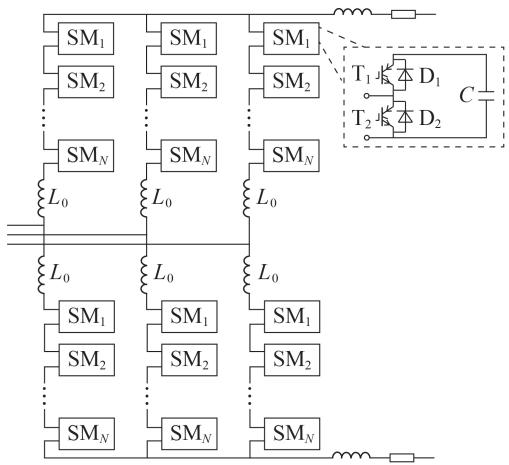  
图1 MMC拓扑结构  
Fig.1 Topology structure of MMC

# 已有最低时间复杂度并行排序方法

文献［ ］中提出一种最低时间复杂度的电容电压均衡方法（又称并行全比较算法［13］），可在芯片中 个时钟完成子模块电容电压的排序过程。其排序基本原理见附录图 $\mathrm { A } 1 _ { \circ }$ 。以 个子模块为例，具体排序过程如下：①将待排序列 $U _ { c _ { 0 } }$ 中的每个元素与其余元素进行比较，大于时比较结果为 ，小于时为 $0 ;$ ； 将每个元素与其余元素的比较结果相加，根据相加后的结果进行排序，得到此元素在有序序列中的位置，进而得到有序序列 $U _ { c _ { \mathrm { n } } \odot }$ 。

并行全比较算法中每次比较过程均相互独立，因此可最大限度地利用 芯片的并行计算能力。但上述算法存在如下 个问题： 引入大量比较器使该算法具有较高的空间复杂度； 无法处理待排序列 $U _ { c _ { 0 } }$ 中子模块电压值相等的情况。文献［13］提出引入2种类型比较器的方法以解决问题②，但带来不利于 芯片程序代码的编写、扩展和移植等新问题。本文提出的 子模块电容电压优化均衡方法，可有效解决上述 个问题。

# 子模块电容电压优化均衡方法

子模块电容电压优化均衡方法分别在排

序算法和触发脉冲产生这 个方面进行优化。分别对组内排序和组间排序2个过程进行排序算法的设计，可有效解决并行全比较算法中大量比较器的使用带来的高空间复杂度问题；通过桥臂子模块电容电压值的重构法，可有效解决待排序列 $U _ { c _ { 0 } }$ 中子模块电容电压值相等的问题。提出串、并行触发结合的混合触发模式，将触发脉冲产生环节所消耗的时间与MMC桥臂子模块总数解耦，可大幅降低触发脉冲产生的时间。

# 子模块电容电压排序算法

# 2.1.1 算法流程

设各桥臂中子模块的分组数为n，每组内子模块个数为 m，则 $N = n m$ 。以 n = 3 为例，MMC 子模块电容电压值的排序算法流程见附录图 ${ \mathrm { A } } 2 _ { \mathrm { { c } } }$ 。排序算法的步骤如下： 将各桥臂中子模块组成的待排序列 $U _ { c _ { 0 } }$ 按照子模块编号分为3组，即 $U _ { c _ { 0 } 1 } \setminus U _ { c _ { 0 } 2 } \setminus U _ { c _ { 0 } 3 } ; \textcircled { 2 }$ 采用并行全比较算法进行组内排序，得到每组的有序序列 $U _ { c \mathrm { n 1 } } \setminus U _ { c \mathrm { n 2 } } \setminus U _ { c \mathrm { n 3 } }$ 和对应的能量平衡因子 $f _ { 1 } , f _ { 2 }$ 、$f _ { 3 } { \mathrm { ; } }$ ； 采用并行全比较方法对各组的平衡因子进行排序，并根据排序结果调整 $U _ { c \mathrm { n 1 } } \setminus U _ { c \mathrm { n 2 } } \setminus U _ { C \mathrm { n 3 } }$ 的顺序，进而得到各桥臂中N个子模块的相对有序序列 $U _ { c \mathrm { n } }$ 。

上述过程中能量平衡因子 f 的作用为抑制组间子模块的电容电压波动。文献［ ］中将组内所有电压值之和作为各组的能量平衡因子，而本文提出了一种新型能量平衡因子计算方法，将各组子模块电容电压的最大值 $U _ { \mathrm { c m a x } }$ 、最小值 $U _ { c \mathrm { m i n } }$ 和中间值 $U _ { c \mathrm { m i d } }$ 之和作为各组的能量平衡因子，即 $f = U _ { \mathrm { { { c m a x } } } } + U _ { \mathrm { { { c m i n } } } } +$ $U _ { c \mathrm { m i d } }$ 。所提方法在有效平衡组间能量的同时，大幅降低了排序算法的计算量。

# 算法性能

定义时间复杂度和空间复杂度这 个评价指标，验证所提MMC子模块电容电压排序算法的有效性，其中时间复杂度为执行排序算法所消耗的时间，空间复杂度为执行排序算法所消耗的内存空间。具体的实现过程如下。

# （1）时间复杂度。

在 芯片中编写 程序实现子模块电容电压的排序过程，主要分为子模块电容电压分组、组内排序和组间排序这 个步骤。其中，子模块电容电压分组可根据子模块序号进行分组，无需占用芯片的时钟资源；组内排序和组间排序通过个时钟实现［13］ ；平衡因子的计算过程需要花费 个时钟；根据各组平衡因子的计算结果对子模块电容电压进行排序需要 个时钟。综上子模块电容电压的排序过程共需 个时钟。

# （）空间复杂度。

适用于 的并行全比较算法主要消耗该芯

片的逻辑计算资源和存储器资源。并行全比较算法引入大量的比较器，导致FPGA芯片的逻辑计算资源占用率显著增加。本文所提出的排序算法可降低比较器的使用数量，优化 FPGA 芯片的逻辑计算资源。

组内排序和组间排序总共需要的比较器个数 $N _ { \mathrm { c o m } }$ 为：

$$
N _ {\mathrm {c o m}} = n (n - 1) + \frac {N}{n} \left(\frac {N}{n} - 1\right) n \tag {1}
$$

由式（）可知， $N _ { \mathrm { c o m } }$ 与分组数n密切相关，对n进行求导可得：

$$
\mathrm {d} N _ {\text {c o m}} / \mathrm {d} n = (2 n ^ {3} - n ^ {2} - N ^ {2}) / n ^ {2} \tag {2}
$$

令 $\mathrm { d } N _ { \mathrm { c o m } } / \mathrm { d } n { = } 0$ ，可得极值点 $n _ { 0 }$ ：

$$
\left\{ \begin{array}{l} n _ {0} = \frac {1}{6} + \frac {1}{3 6 A} + A \\ A = \left\{\left[ \left(\frac {N ^ {2}}{4} + \frac {1}{2 1 6}\right) ^ {2} - \frac {1}{4 6 6 5 6} \right] ^ {1 / 2} + \frac {N ^ {2}}{4} + \frac {1}{2 1 6} \right\} ^ {1 / 3} \end{array} \right. \tag {3}
$$

当 $n$ 的取值范围为［ ，N］时，极值点为最小值点。设已知桥臂子模块个数为N，则所需的最少比较器个数 $N _ { \mathrm { c o m m i n } }$ 为：

$$
N _ {\text {c o m m i n}} = n _ {0} \left(n _ {0} - 1\right) + \frac {N}{n _ {0}} \left(\frac {N}{n _ {0}} - 1\right) n _ {0} \tag {4}
$$

附录图 为 $N _ { \mathrm { c o m } }$ 随 $n$ 和N变化的三维曲面图，图中红色曲线所示区域为 $N _ { \mathrm { c o m m i n } ^ { \circ } }$ 。由图A3可知，当$n = n _ { 0 }$ 时，所需要的比较器个数最少。由于n和m均为整数，上述过程所得的 $n _ { 0 }$ 仍需进一步处理。并行全比较算法是本文所提排序算法的特例（n值为 或N），此时所需的比较器个数最多。

# 子模块电容电压值的重构方法

实际工程中子模块电容电压通过 ／ 转换器输入 的阀级控制器中，大概率会出现子模块电容电压值相等的情况。并行全比较算法通过大量的比较器，使整个待排子模块电容电压有序排列。当待排子模块电容电压序列中存在相同的电压值时，整个排序过程失效，影响桥臂中各子模块的通断状态，进而影响整个程序运行的稳定性。文献［ ］在排序过程中引入 种类型的比较器 $( \mathbb { D } ^ { \ast } \middle > ^ { \mathfrak { n } } ( \ ^ { \ast } < ^ { \mathfrak { n } } )$ ）比较器和 “ ”（“ ”）比较器）可有效解决上述问题，但降低了 程序的可靠性和扩展性。基于此，本文提出 子模块电容电压值的重构方法，有效解决了子模块电容电压值相等的问题。具体的实现过程如图 所示。

通过调整子模块电容电压序列 $U _ { c _ { \mathrm { - } \mathrm { { o l d } } } }$ 中各元素的位置，可得重构后的桥臂子模块电容电压序列$U _ { c \_ \mathrm { n e w } } ($ 。该过程通过 程序的位拼接运算符实现。以具体的数列为例进行说明，假设对 个子模

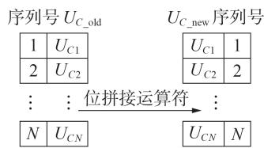  
图2 MMC子模块电容电压值的重构方法  
Fig.2 Reconstruction method of capacitor voltage value of sub-module in MMC

块电容电压值进行排序，其电压值分别为1.8、1.7、、 、 、 、 、 、 、 。根据图 所示方法，重构后的子模块电容电压值分别为 、、 、 、 、 、 、 、 、1.210 p.u.。通过并行全比较方法对重构后的子模块电容电压序列进行排序。

在子模块序号与电容电压值一一对应的前提下，MMC子模块电容电压排序算法根据其电容电压值的排序结果，确定各子模块的通断情况。所提重构方法对子模块电容电压的相同值进行区分设定，在保证排序正确性的同时，无需引入 种比较器，不会丢失任何有效信息且无需增加额外的FPGA芯片逻辑运算过程。

# 混合脉冲触发模式

目前大部分触发脉冲产生环节需要根据桥臂电流 $I _ { \mathrm { a r m } }$ 和桥臂导通子模块个数 $n _ { \mathrm { o n } }$ 依次决定各子模块的触发情况，其计算步长随桥臂子模块总数的增加而增加，导致其所消耗的时间与 $n _ { \mathrm { o n } } ( $ （最大值取N）成正相关；且未能充分利用 的并行计算能力。本文提出一种串、并行触发结合的混合脉冲触发模式：设分组排序后有序序列 $U _ { c \mathrm { n } i } ( i \mathrm { = } 1 , 2 , 3 )$ 对应的子模块编号序列分别为 $N _ { c \mathrm { n } i }$ ，根据“充小放大”的基本原则以串行触发模式确定组内子模块的触发脉冲；采用并行触发模式确定组间子模块的触发脉冲，其中， $N _ { c \mathrm { n } i } { = } 0$ 表示将该序列中子模块全部旁路， $N _ { c \mathrm { n } i } { = } 1$ 表示将该序列中子模块全部投入。

以子模块充电状态为例，采用混合脉冲触发模式后MMC的运行情况如表1所示。由表1可知，触发脉冲产生环节需要的时间由串行触发模式消耗的时间决定，串行触发模式下所需时间与m相关，则脉冲触发产生过程与桥臂子模块总数解耦，该方法适用于 芯片中定步长 实时仿真计算过程的程序设计。

表1 充电状态下采用混合脉冲触发模式MMC运行情况  
Table 1 MMC operation condition after adopting mixed pulse trigger mode under charging mode   

<table><tr><td>\( {n}_{\text{on }} \)</td><td>串行触发模式</td><td>并行触发模式</td></tr><tr><td>\( \left\lbrack  {0,m}\right) \)</td><td>序列 \( {N}_{\mathrm{{Cn}}1} \) 中子模块导通个数为 \( {n}_{\text{on }} \)</td><td>\( {N}_{\mathrm{{Cn}}2} = 0,{N}_{\mathrm{{Cn}}3} = 0 \)</td></tr><tr><td>\( \left\lbrack  {m,{2m}}\right) \)</td><td>序列 \( {N}_{\mathrm{{Cn}}2} \) 中子模块导通个数为 \( {n}_{\text{on }} - m \)</td><td>\( {N}_{\mathrm{{Cn}}1} = 1,{N}_{\mathrm{{Cn}}3} = 0 \)</td></tr><tr><td>\( \left\lbrack  {{2m},N}\right\rbrack \)</td><td>序列 \( {N}_{\mathrm{{Cn}}3} \) 中子模块导通个数为 \( {n}_{\text{on }} - {2m} \)</td><td>\( {N}_{\mathrm{{Cn}}1} = 1,{N}_{\mathrm{{Cn}}2} = 1 \)</td></tr></table>

# 3 仿真验证

基于 ／ 仿真平台进行 子模块电容电压优化均衡方法的仿真验证，所建立的仿真模型如图3所示。MMC的具体参数设置见附录表$\mathrm { A } 1 _ { \circ }$ 。设桥臂子模块总数N=100，代入式（3）可得 $n _ { 0 } =$ 17.268 1，取 n=10，则 $m = N / n = 1 0$ 。

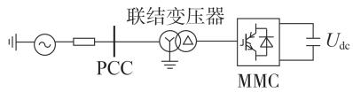  
图3 仿真模型  
Fig.3 Simulation model

控制策略为定有功功率和定无功功率控制，有功、无功功率额定值分别为 、。在第1 s时投入环流抑制器，稳态工况下的a相上桥臂子模块电容电压 $U _ { c \mathrm { a } }$ 的波形如图4所示。由图4可知，当采用本文所提 子模块电容电压排序方法时，投入环流抑制器前、后，子模块电容电压的均衡效果良好。验证了本文所提算法的有效性。

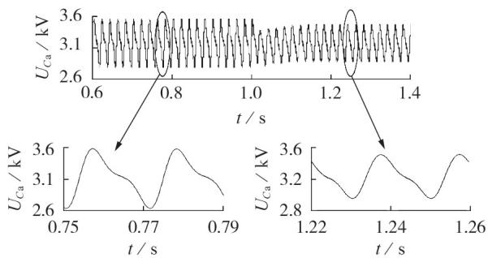  
图4 稳态工况下子模块电容电压波形  
Fig.4 Waveform of sub-module capacitor voltage under steady-state condition

为验证所提子模块电容电压排序算法的动态响应特性，设置有功功率阶跃工况，在第2 s时额定有功功率由 跃变至 ，额定有功功率P和 相上桥臂子模块电容电压 $U _ { c \mathrm { a } }$ 波形如图 所示。由图 可知，当有功功率发生跃变时，桥臂子模块电容电压的均衡效果依然良好，验证了本文所提算法的动态响应特性。

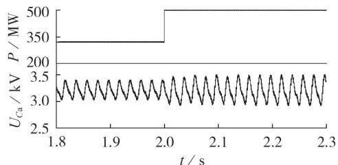  
图5 有功功率阶跃工况下子模块电容电压波形  
Fig.5 Waveform of sub-module capacitor voltage under active power step state

为了进一步验证本文所提算法的稳定性和有效

性，设仿真时间为 $5 0 ~ \mu \mathrm { s }$ ，将冒泡排序、并行全比较算法和本文算法进行比较，就排序算法的不同性能进行比较，对比结果见表 2。由表 2 可知，不同排序算法对子模块电容电压波动范围和子模块开关频率的影响不大，相对于冒泡排序，并行全比较算法和本文所提的优化算法的计算步长与桥臂子模块总数无关，在比较器使用个数方面与桥臂子模块总数有关。这非常适用于低仿真步长下的 实时仿真。在实际工程中，可通过在多个仿真步长时间段内进行一次排序的方法进一步降低开关频率。

表2 不同排序算法的性能对比  
Table 2 Performance comparison of different sorting algorithms   

<table><tr><td>算法类型</td><td>计算步长</td><td>Ncom</td><td>子模块电容电压波动范围/kV</td><td>子模块开关频率/Hz</td></tr><tr><td>冒泡排序</td><td>N(N-1)/2</td><td>1</td><td>[2.917,3.502]</td><td>1220</td></tr><tr><td>并行全比较</td><td>4</td><td>N(N-1)</td><td>[2.917,3.480]</td><td>1110</td></tr><tr><td>本文算法</td><td>10</td><td>式(1)</td><td>[2.917,3.490]</td><td>1140</td></tr></table>

# 4 实验验证

为了进一步验证本文所提新型电容电压均衡优化算法的工程实用性，在低功率 物理样机平台进行实验。通过 语言编写的 子模块电容电压优化均衡方法的算法程序，并且通过Quartus Ⅱ软件下载到单端换流器的阀级控制器中进行实物验证。

# 物理样机平台介绍

单端 物理样机平台的原理图只需将图所示的仿真模型中直流电压源 $U _ { \mathrm { d c } }$ 变成直流电阻$R _ { \mathrm { d c } } \circ$ 。具体的平台参数见附录表A2。

物理样机平台的实物图见附录图 。物理样机平台的数据传输分为上传和下发，数据下发通道为上位机通过数据信号处理（ ）向 芯片发送指令。数据上传指令方向与数据下发相反。其中 FPGA 芯片的型号为 Cyclone V-5CEFA9F23I7。主要完成 主控制器和阀级控制器的计算。排序过程所需的子模块电容电压值为子模块电容电压实际值经过 位 ／ 转换器转化为 位二进制数，再将转化后的数据输入 芯片，作为阀级控制器的输入量。

# 子模块电容电压优化均衡方法验证

物理样机平台各桥臂中共有 个全桥子模块（其中有2个子模块作为热备用子模块），根据式（）可得 $n _ { 0 } = 4 . 3 3 4$ ，为使每组组内子模块个数大于3个，取组数 $n = 3$ ，组内子模块个数m=4。

本文用 语言编写了并行全比较算法程序和本文提出的子模块电容电压优化算法程序，并分别下载到物理样机平台的阀级控制器的芯片中。通过泰克混合信号示波器录波（型号

为 ，带宽为 ， 可采 亿个数据）对2种不同算法下MMC的直流电压 $U _ { \mathrm { d c } }$ 、直流电流 $I _ { \mathrm { d c } }$ 和 相上桥臂子模块电容电压 $U _ { c \mathrm { a } }$ 进行录波。经过对比发现2种不同算法下 $U _ { \mathrm { d c } } \setminus I _ { \mathrm { d c } }$ 和 $U _ { c \mathrm { a } }$ 的波形几乎一致，如附录图 所示。由图可知， 物理样机平台可平稳运行。 $U _ { \mathrm { d c } }$ 基本稳定于 ， $. I _ { \mathrm { d c } }$ 为 ，$U _ { c \mathrm { a } }$ 波动范围为［12.2，12.75］ $\mathrm { ~ V ~ } _ { \circ }$ 。由于实际过程中，电力电子器件的通态压降无法忽略， $U _ { \mathrm { d c } }$ 略低于个子模块电容电压值之和。

令下发录波指令时刻为00:00。子模块电容电压优化均衡算法下的三相上桥臂子模块电容电压值通过A／D转换器将采样结果上传到上位机界面，如附录图A6所示。由图可知，三相上桥臂子模块电容电压均压效果良好，波动范围均为［12.2，12.75］V。

本文所用的FPGA芯片共有113560个自适应逻辑块（ALM）、454240个寄存器。采用并行全比较算法和优化排序算法后，芯片的资源使用情况对比结果如下：并行全比较算法和本文算法的ALM使用个数分别为 和 ，采用本文算法后减少了个 ，占总数的 ；并行全比较算法和本文算法的寄存器使用个数分别为29439和29524，采用本文算法后增加了 个寄存器，占总数的。相对于并行全比较算法，所提算法可明显减少 芯片中 的使用个数，而寄存器的使用个数有少许增加。综上所述，本文提出的MMC子模块电容电压优化均衡算法可大幅降低 的使用个数，避免了FPGA芯片中ALM的过度使用导致的其他资源利用不充分的情况。

# 5 结论

针对并行全比较算法存在的高空间复杂度问题和待排序列中子模块电压值相等问题，提出了一种适用于 实时仿真的电容电压优化均衡算法，并提出了一种混合脉冲触发模式。通过仿真和物理实验进行验证，得到如下结论：

（）通过对 桥臂子模块电容电压值序列进行组内排序和组间排序，显著降低了比较器的使用个数，避免了 芯片资源中 的过度使用，该方法具有一定的通用性，可对任意串、并行排序算法进行优化；  
（）根据理论分析结果得出最优分组数，并指出并行排序算法为优化后的排序算法的特例，此时所需要比较器个数最多；  
（）通过桥臂子模块电容电压值的重构方法，在不丢失任何有效信息也不增加 芯片资源使用的前提下，有效解决了含相同子模块电容电压值的排序问题；  
（）提出了一种混合脉冲触发模式，将脉冲触发

产生过程与桥臂子模块总数解耦，适用于 FPGA 芯片的定步长MMC实时仿真。

子模块电容电压均衡方法在保证低时间复杂度的同时，大幅降低排序过程中比较器的使用个数，避免了FPGA芯片中ALM的过度使用，具有良好的工程应用前景。接下来将对分组后各组子模块个数不同的排序方法进行分析，并进一步研究和寄存器使用数量的动态关系。

附录见本刊网络版（http：∥www.epae.cn）。

# 参考文献：

［ ］王少伟，刘天琪，李保宏 模块化多电平换流器的运行边界分析及提高运行稳定性的控制方法［］ 电力自动化设备， ，39（9）：151-157.  
WANG Shaowei，LIU Tianqi，LI Baohong. Analysis of opera⁃tion boundary of modular multilevel converter and controlmethod for improving operation stability［J］. Electric Power， ，（）： -  
［ ］彭茂兰，唐金昆 伪双极 - 系统联接变阀侧中性点电阻参数设计［J］. 电力自动化设备，2017，37（4）：218-223.  
PENG Maolan，TANG Jinkun. Design of valve-side neutral-pointresistor for connection transformer of MMC-HVDC transmis⁃sion system［J］. Electric Power Automation Equipment，2017，（）： -  
［3］杨立敏，朱艺颖，孙栩，等. 基于损耗分析的全桥型MMC参数优化设计[1].电力自动化设备，2020.40(3)：128-133.  
YANG Limin，ZHU Yiying，SUN Xu，et al. Optimization design of full bridge MMC parameters based on loss analysis［J］. Electric Power Automation Equipment，2020，40（3）：128-133.   
［4］ LI Guoqing，ZHANG Di，XIN Yechun，et al. Design of MMChardware-in-the-loop platform and controller test scheme[J].CPSS Transactions on Power Electronics and Applications，，（）： -  
[5]SHEN Z X,DINAVAHI V.Real-time device-level transient electro thermal model for modular multilevel converter on FPGA[J]．IEEE Transactions on Power Electronics,2016,31 （9）：6155-6168.   
[6］GNANARATHNA U N,GOLE A M,JAYASINGHE R P.Efficient modeling of Modular Multilevel HVDC Converters （MMC）on electromagnetic transient simulation programs[J]. IEEE Transactions on Power Delivery,2011,26(1):316-324.   
［ 7］ XU J Z，ZHAO C Y，LIU W J，et al. Accelerated model ofmodular multilevel converters in PSCAD/EMTDC[J].IEEETransactions on Power Delivery，2013，28（1）：129-136.  
［ ］郝亮亮，张静，黄银华，等 模块化多电平换流器的分频均压控制策略［］ 电力自动化设备， ，（）： - ，  
HAO Liangliang，ZHANG Jing，HUANG Yinhua，et al. Fre⁃quency dividing control of capacitor voltage balance for modu⁃lar multilevel converter［J］. Electric Power Automation Equip⁃， ，（）： - ，  
［ ］彭茂兰，赵成勇，刘兴华，等 采用质因子分解法的模块化多电平换流器电容电压平衡优化算法［］ 中国电机工程学报，，（ ）： -  
PENG Maolan，ZHAO Chengyong，LIU Xinghua，et al. An opti⁃ mized capacitor voltage balancing control algorithm for modu⁃ lar multilevel converter employing prime factorization method ［J］. Proceedings of the CSEE，2014，34（33）：5846-5853.   
［ ］何智鹏，许建中，苑宾，等 采用质因子分解法与希尔排序算法的MMC电容均压策略[1]．中国电机工程学报.2015.35（12)：

2980-2988.   
HE Zhipeng，XU Jianzhong，YUAN Bin，et al. A capacitor voltage balancing strategy adopting prime factorization method and shell sorting algorithm for modular multilevel converter ［J］. Proceedings of the CSEE，2015，35（12）：2980-2988.   
［ ］管敏渊，徐政 型 - 系统电容电压的优化平衡控制［］ 中国电机工程学报， ，（ ）：-  
GUAN Minyuan，XU Zheng. Optimized capacitor voltage balan-cing control for modular multilevel converter based VSC-HVDCsystem［J］. Proceedings of the CSEE，2011，31（12）：9-14.  
［12］ DEKKA A，WU B，ZARGARI N R，et al. Dynamic voltagebalancing algorithm for modular multilevel converter：auniquesolution［J］. IEEE Transactions on Power Electronics，2016，31（2）：952-963.  
［ ］师廷伟，金长江 基于 的并行全比较排序算法［］ 数字技术与应用， （ ）： -  
SHI Tingwei，JIN Changjiang. Parallel full comparison sorting algorithm based on FPGA［J］. Digital Technology and Appli⁃ ， （ ）： -   
[14]ASHOURLOO M,MIRZAHOSSEINI R,IRAVANI R.Enhancedmodel and real-time simulation architecture for modular multi-level converter［J］. IEEE Transactions on Power Delivery，2018，（）： -  
［ ］王宇，刘崇茹，李庚银，等 适用于 的模块化多电平换流器电容电压均衡控制方法［］ 电力系统自动化， ，（）：167-176.  
WANG Yu，LIU Chongru，LI Gengyin，et al. Capacitor voltagebalancing control method for modular multilevel converter ap⁃plicable for FPGA［J］. Automation of Electric Power Systems，，（）： -  
［ ］陆翌，王朝亮，彭茂兰，等 一种模块化多电平换流器的子模块优化均压方法［］ 电力系统自动化， ，（）： -  
LU Yi，WANG Chaoliang，PENG Maolan，et al. An optimized

method for balancing sub-module voltages in modular multi⁃level converters［J］. Automation of Electric Power Systems，2014，38（3）：52-58.  
［17］ HU P，TEODORESCU R，WANG S，et al. A currentless-sortingand selection-based capacitor-voltage-balancing method for mo-dular multilevel converters［J]．IEEE Transactions on Power， ，（）： -  
［18］ WANG Q，LIU K，WANG K，et al. Fast capacitor voltage balancing strategy based on system history operation information for MMC[J].IET Generation Transmission & Distribution,2019, 13（7）：1104-1109.   
［ ］许建中，赵成勇， 模块化多电平换流器戴维南等效整体建模方法［］ 中国电机工程学报， ， （）： -1929.  
XU Jianzhong，ZHAO Chengyong，GOLE M A. Research on the Treveon’s equivalent based integral modelling method of the modular multilevel converter[J]．Proceedings of the CSEE, ，（）： -

# 作者简介：

  
樊 强

樊 强（ —），男，山西怀仁人，博士研究生，主要研究方向为高压直流输电（E-mail： ）；

王 乐（ —），男，河北承德人，硕士研究生，主要研究方向为柔性直流输电（E-mail：wanglencepu@163.com）；

赵成勇（ —），男，教授，博士研究生导师，博士，主要研究方向为直流输电、电能质量分析与控制等（E-mail：chengyongzhao@ncepu.edu.cn）。

（编辑 王欣竹）

# Optimized capacitor voltage balancing method for real-time simulation of MMC sub-module

FAN Qiang，WANG Le，FENG Moke，YU Yongjie，ZHAO Chengyong，XU Jianzhong

（State Key Laboratory of Alternate Electrical Power System with Renewable Energy Sources，

North China Electric Power University，Beijing 102206，China）

Abstract：Aiming at the high space complexity of the parallel full comparison algorithm，an optimized capaci⁃ tor voltage balancing method for real-time simulation of MMC（Modular Multilevel Converter） sub-module is proposed. The balancing strategy of grouping sorting is implemented in the aspect of sorting strategy of sub-module capacitance voltage. Parallel full comparison algorithm is adopted to in-group sub-modules to reduce sorting time. According to the calculated result of the defined energy balance coefficient，the intergroup sub-modules are sorting to balance their capacitance voltage values. In addition，a reconstruction method of sub-module capacitor voltage value is proposed to deal with the sorting problem of sub-modules with the same capacitor voltage. A hybrid trigger mode combined by series and parallel triggering is proposed to decouple the time consumed by the trigger pulse generation and the number of bridge leg sub-modules of MMC in the aspect of trigger generation. The logic validity and engineering practicability of the opti⁃ mized capacitor voltage balancing method for real-time simulation of MMC sub-module are verified in PSCAD／EMTDC simulation program and valve-level controller of the low power MMC physical prototype platform. It is proved that the proposed method not only guarantees the low time complexity，but also reduces the space complexity.

Key words：MMC；electric converters；time and space complexity；parallel full comparison algorithm；energy balance coefficient；physical prototype

# 附录

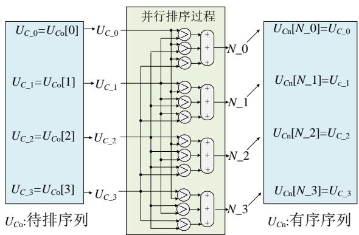  
图 A1 并行全比较算法示意图

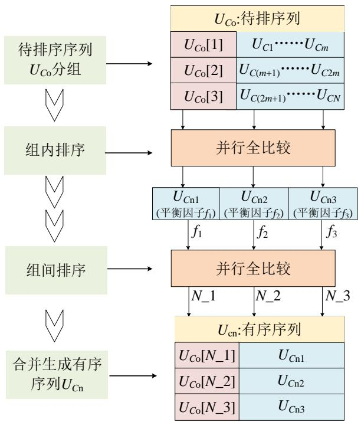  
Fig.A1 Schematic diagram of parallel full comparison algorithm   
图 A2 MMC子模块电容电压排序算法流程图

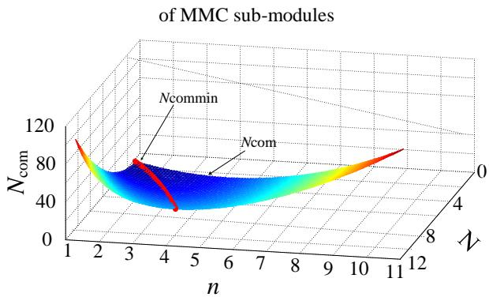  
Fig.A2 Flowchart of sorting algorithm of capacitance voltage   
图 A3 $N _ { \mathrm { c o m } }$ 三维曲面图  
Fig.A3 Three-dimensional surface diagram of $N _ { \mathrm { c o m } }$

# 表 A1 MMC 参数

Table A1 Parameters of MMC   
表 A2 单端 MMC 物理平台参数  

<table><tr><td>参数</td><td>数值</td><td>参数</td><td>数值</td></tr><tr><td>额定直流电压/kV</td><td>320</td><td>等效变压器漏抗/H</td><td>0.0135</td></tr><tr><td>额定有功功率/MW</td><td>500</td><td>子模块电容/mF</td><td>5</td></tr><tr><td>额定无功功率/Mvar</td><td>0</td><td>变压器两侧电压/kV</td><td>230/170</td></tr><tr><td>电平数</td><td>101</td><td>交流系统电压/kV</td><td>230</td></tr><tr><td>桥臂电感/H</td><td>0.06</td><td></td><td></td></tr></table>

Table A2 Physical platform parameters of single terminal MMC   

<table><tr><td>参数</td><td>数值</td><td>参数</td><td>数值</td></tr><tr><td>额定直流电压/V</td><td>120</td><td>桥臂电抗/mH</td><td>20</td></tr><tr><td>电平数</td><td>11</td><td>子模块电容/uF</td><td>6600</td></tr><tr><td>变压器两侧电压/V</td><td>380/115</td><td>直流电阻/Ω</td><td>100</td></tr><tr><td>交流系统电压/V</td><td>200</td><td></td><td></td></tr></table>

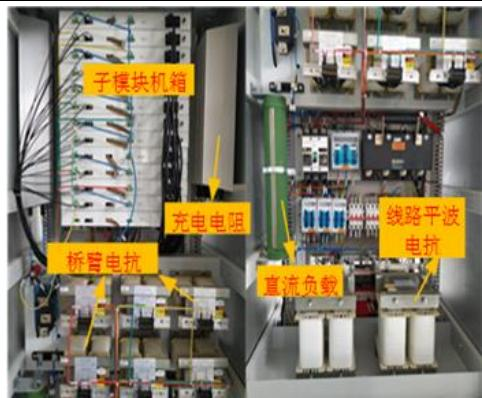  
图 A4 MMC物理平台图

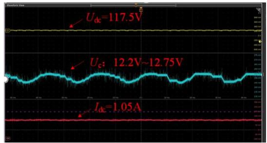  
Fig.A4 Physical platform diagram of MMC   
图 A5 示波器录波波形

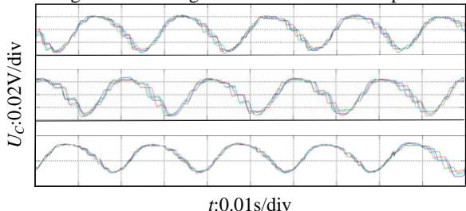  
Fig.A5 Recording waveform of oscilloscope   
图 A6 三相上桥臂子模块电容电压波形  
Fig.A6 Waveforms of three-phase capacitance voltage of upper arm bridges of sub-modules