# Shooting method based modular multilevel converter initialization for electromagnetic transient analysis

D. del Giudice a,∗, F. Bizzarri a,b, D. Linaro a, A. Brambilla

a Dipartimento di Elettronica, Informazione e Bioingegneria, Politecnico di Milano, p.za Leonardo da Vinci, 32, I20133, Milano, Italy   
b Advanced Research Center on Electronic Systems ‘‘E. De Castro’’ (ARCES), University of Bologna, Italy

# A R T I C L E I N F O

Keywords:

Modular multilevel converter

Initialization

Steady-state

Shooting method

Thévenin equivalent model

Average model

Electromagnetic transient simulation

# A B S T R A C T

This paper presents an accurate and efficient initialization strategy for modular multilevel converters (MMCs) based on the shooting method, a numerical technique aimed at deriving the periodic steady-state operating condition of any circuit. This technique is compatible with MMC models of different levels of detail and whose control scheme may include modulation strategies and capacitor voltage balancing algorithms. Electromagnetic transient simulations of the NORDIC32 power system modified by adding a high-voltage direct current link with 128-level MMCs prove that the proposed initialization strategy allows starting simulations close to steady-state, thereby significantly limiting initialization transients and their corresponding extra CPU time.

# 1. Introduction

The modular multilevel converter (MMC) has become a very popular technology for high-voltage direct current (HVDC) systems. The key feature of the MMC is its modularity, as each of its arms includes a large stack of identical submodules (SMs). On the one hand, this trait grants several advantages (including easy scalability to high voltage and power applications [1]), which contributed to the growing deployment of MMCs. On the other hand, the multitude of SMs in the MMC and its advanced control scheme hinder the execution of common power systems simulator tasks, such as initialization and electromagnetic transient (EMT) simulations [2].

After ad hoc techniques are used to compute the power flow solution of MMC-based systems [3], the initialization stage derives the internal state and algebraic variables of its components so that subsequent EMT simulations begin from steady-state [4]. Such simulations are fundamental in the MMC design stage to validate converter controls and components during normal operating conditions and disturbances.

Although initialization has become a standard practice for traditional power system elements (e.g., synchronous generators and their regulators), it is still anything but trivial for those interfaced with the grid through converters, including MMCs. A brute-force approach to avoid the need for a full-fledged initialization consists in skipping this task and start EMT simulations anyway. This ploy, however, has two drawbacks.

• The user should wait some time for the extinction of initialization transients (needed for all the variables of the system – MMCs included – to reach steady-state operation) before applying changes (e.g., disturbances or faults), otherwise unwanted transients and inaccurate results could be observed.   
• Wrong initialization (or lack thereof) may even prevent the correct start of MMC-based grid simulations. To address this issue, MMC start-up sequences [5] (or other expedients like those described in Section IV.A of [6] and 4.10 of [7]) can be used. However, this solution introduces waiting times, too. Indeed, before studying any event, the user must wait for the start-up sequence to end, and for the effects it has on grid voltage and frequency to decay. For simplicity, also these effects are hereafter associated to initialization transients.

Waiting times translate into additional CPU time needed to perform the time domain analysis that brings the entire power system to work at steady-state before the application of a disturbance or fault. This aspect is challenging when simulating MMCs, as they introduce a high computational burden (especially if detailed models are used) [8]. Thus, proper initialization techniques are essential to minimize waiting times and boost the efficiency of EMT simulations of MMC-based grids.

To the best of our knowledge, the literature on MMC initialization is limited. The works in [9–11] initialize MMCs but assume that control signals are known and given by only the fundamental (synchronous) frequency. However, closed-loop regulation schemes are used in actual MMC-based systems, which implies that control signals cannot

be known in advance. Moreover, as in the case of circulating current suppression strategies, control signals may include harmonics. A more sophisticated strategy is proposed in [12]. However, the second harmonic of the circulating current suppression control signals is still assumed to be known, and analyses are limited to basic case studies involving a single MMC. Lastly, the technique developed in [13] assumes that arm currents and voltages contain only the DC and the fundamental component.

All these techniques rely on a pen-and-paper approach, in the sense that initialization is achieved by manually deriving the equations of the MMC – controls included – and exploiting them to find a set of internal variables corresponding to steady-state operation. Other than needing oftentimes some simplifying assumptions, as mentioned above, this approach is inefficient, as it does not flexibly adapt to variations in the MMCs under study. Indeed, if changes occur, the above process must be repeated from scratch, which requires some effort.

To address this issue, we propose an alternative initialization strategy based on the time-domain shooting method (SHM) [14–16]. This algorithm finds values of the state variables of the system that lie on the stable limit cycle constituting the steady-state solution of an initialvalue problem. This problem is cast as a nonlinear boundary-value problem solved with the Newton iterative method. The SHM was also recently used in [17] to initialize an HVDC grid and perform trajectory sensitivity analyses, as well as in [18] to analyse the stability of a small circuit made up of two voltage-source converters. In these works, however, relatively simple converter models were employed. On the contrary, we adopt it for the first time to initialize two MMCs described by accurate models and used in a modified benchmark power system.

Contrary to the previously cited initialization strategies [9–13] and other generic heuristic-based methods [19], the approach proposed here is purely numerical and directly implemented at the simulator level. This implies that the SHM can flexibly determine the steadystate operating conditions of MMC-based grids without relying on burdensome pen-and-paper computations, regardless of the level of accuracy of the MMC model and its controls. Being purely numerical, the SHM also lends itself to the initialization of converters different from MMCs. Here, however, we focus on the initialization of MMCs described by accurate models through the SHM since it has never been addressed before and also because it is more challenging than with other converters due to their complex topology, control scheme, and high computational burden [13].

In this context, the application of the SHM to initialize grids with MMCs presents two main issues. The first issue concerns the implementation of the SHM itself in a simulator, which requires significant coding effort and access to the simulation software — often precluded to the final users in many simulators (e.g., DIGSILENT POWERFACTORY, EMTP-RV, SIMULINK). For this reason, we implemented the SHM in a proprietary simulator (to which we have full access). The second issue is related to the fact that, if detailed MMC models are used (i.e., involving for instance nearest level control modulation and capacitor voltage balancing algorithms), deriving the steady-state operating conditions through the SHM may be difficult or even impossible. This challenging aspect is overcome in this manuscript by resorting to a strategy that finds a set of state and algebraic variables close to steady-state for MMCs described by detailed models. To do so, we first rely on a simpler MMC representation, use it to perform the SHM and then restore the original MMC models, initialized by exploiting variables previously derived with the SHM.

The remainder of this paper is structured as follows. Section 2 describes the MMC control scheme and models adopted in this paper, while Sections 3 and 4 respectively present a SHM primer and how our proposed initialization algorithm can be applied to start simulations from steady-state (or close to it) with any MMC model. The proposed method is validated in Section 5 by using an MMC-based benchmark system. Lastly, Section 6 presents a brief discussion of the main results presented in this paper.

# 2. Modular multilevel converters in a nutshell

# 2.1. Topology and control

Fig. 1 depicts a version of an MMC. It includes three phase-legs, each of which consists of an upper and lower arm. In turn, every arm comprises a reactor $( R _ { S } , \ L _ { S } )$ and a cascading stack of ?? SMs, which can implement different topologies (e.g., the half-bridge one, shown in the dashed section of the figure). The main breaker, which is normally closed, can be opened to protect the MMC from abnormal operating conditions. The bypass breaker, which is normally open, can be exploited together with the $R _ { \mathrm { s t a r t - u p } }$ resistors to execute MMC startup sequences (more detail on this is given in Section 5). $R _ { T }$ and $L _ { T }$ correspond to the converter filter, while $R _ { G }$ and $L _ { G }$ are used to provide the ??-side of the transformer a reference to ground.

The MMCs we consider here are regulated with the control scheme in Fig. 2, which can manage unbalanced operating conditions [20]. Hereafter, the $p ,$ ?? superscripts refer to positive and negative sequence, while the $d , q$ subscripts denote the direct and quadrature axis components of an electrical variable.

The MMC control scheme consists of the following sections.

• Section ⃝1 converts the three-phase voltages and currents at the MMC point of common coupling (PCC) to direct and quadrature components in the positive and negative sequence with direct Park’s transforms [21].   
• MMCs can be controlled to fulfil different objectives. For instance, P/Q and DC-SLACK/Q MMCs are hereafter referred to as converters that control reactive power flow and respectively regulate the active power exchange and DC-side voltage to given setpoints. To do so, the outer power loop in section ⃝2 is employed, which converts itive sequence reference current (?????? ref, ?? rehomologous negative sequence components these setpoints into direct and quadrature components of the pos- $( \iota _ { d _ { \mathrm { R E F } } } ^ { p } , \ \iota _ { q _ { \mathrm { R E F } } } ^ { p } ) .$ ?? On the contrary, the $( \iota _ { d _ { \mathrm { R E F } } } ^ { n } , \iota _ { q _ { \mathrm { R E F } } } ^ { n } )$ ???? r are regulated to zero.   
• Through inverse Park’s transforms, the inner current loop in section ⃝3 allows deriving the reference voltages $u _ { a , b , c }$ needed at the PCC so that currents $\imath _ { d } ^ { p } , \ \imath _ { q } ^ { p } , \ \imath _ { d } ^ { n }$ , and $\boldsymbol { { \imath } } _ { q } ^ { n }$ in ⃝1 track the reference values computed in ⃝2 .   
• Contrary to other converters, MMCs also need a scheme to suppress circulating currents in their arms, which are caused by the inequality among the voltages at the SM strings [22]. This paper uses the suppression control scheme of [23] and replicated in Section ⃝4 . In unbalanced operating conditions, circulating currents mainly include positive, negative, and zero sequence components whose frequency is twice the nominal one. These components are limited by proportional-resonant (PR) filters that output an additional reference voltage $e _ { a , b , c } ,$ , which is combined with $u _ { a , b , c }$ and the DC-side voltage $v _ { \scriptscriptstyle \mathrm { D C } }$ to obtain the modulation indexes $m _ { u _ { a , b , c } }$ b，： and ??????,??,?? $m _ { l _ { a , b , c } }$ of the upper and lower MMC arms.   
• Based on the modulation technique adopted (Section ⃝5 ), these indexes correspond to a given number of inserted $N _ { i n }$ and bypassed $N _ { b v } = N - N _ { i n }$ SMs. Among the plethora of solutions developed over the years [24], we adopt the nearest level control modulation (NLCM) – a technique with low switching frequency and suitable for MMCs with a high number of SMs, such as those considered in this paper.   
• Lastly, in Section ⃝6 a capacitor voltage balancing algorithm (CBA) selects the actual SMs that need to be inserted or bypassed (thus determining their gate signals) by ensuring that their capacitors share similar voltages $v _ { c } ,$ . In this paper, we adopt the CBA described in Table 1 and hereafter referred to as swap-based [25]. Each time there is a level crossing of the NLCM, this strategy concurrently selects $N _ { s w a p }$ pairs of SMs in the inserted and bypassed states, as well as an additional SM (whose state depends on whether the NLCM requires inserting or bypassing a new SM). Swapping consists in replacing the gate signals of the $N _ { s w a p }$ inserted SMs with the lowest voltage to those

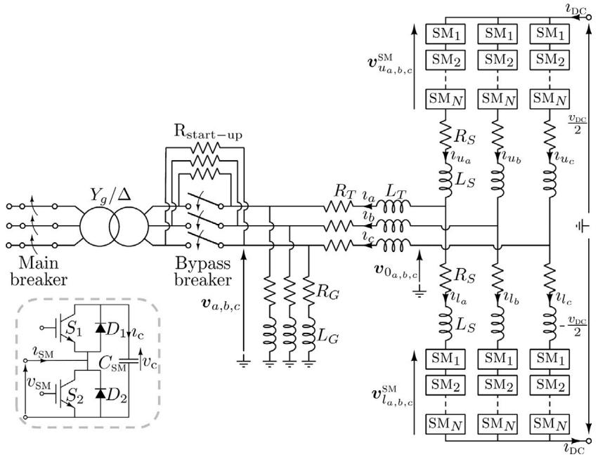  
Fig. 1. MMC and half-bridge SM topology (dashed box).

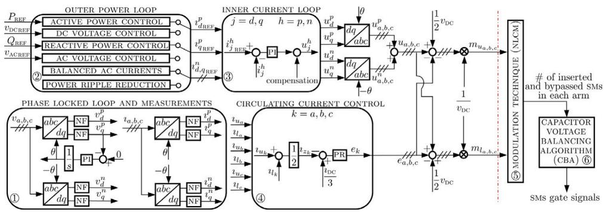  
Fig. 2. MMC control architecture. NF, PI, and PR respectively denote notch, proportional–integral, and proportional-resonant filters.

Table 1 Swap-based capacitor voltage balancing algorithm [25].   

<table><tr><td>Action</td><td>tarm &gt; 0</td><td>tarm &lt; 0</td></tr><tr><td>Insert a new SM</td><td>Insert the bypassed SM with lowest vc and run swapping</td><td>Insert the bypassed SM with highest vc and run swapping</td></tr><tr><td>Bypass a new SM</td><td>Bypass the inserted SM with highest vc and run swapping</td><td>Bypass the inserted SM with lowest vc and run swapping</td></tr></table>

of $N _ { s w a p }$ bypassed SMs with the highest voltage (in case of charging arm current, opposite otherwise). On the one hand, modifying the gate signals of just one SM at a time (i.e., no swapping is performed) may not guarantee that SM capacitor voltages are well balanced. On the other hand, potentially changing all SMs gate signals at each threshold crossing of the NLCM would lead to high switching losses. By acting on $N _ { s w a p } ,$ , the swap-based CBA implements a tradeoff between SM switching losses containment and voltage balancing: in this work, we adopted MMCs with 128 SMs per arm and set $N _ { s w a p }$ to 10. This value, which was chosen heuristically, yields a sufficiently good balancing performance.

# 2.2. Modular multilevel converter models

The computational burden required to accurately simulate MMCs is high. To address this issue, several models have been developed that implement different trade-offs between accuracy and the CPU time

needed to perform a transient stability analysis by simplifying the topology of the SM strings or exploiting novel simulation paradigms [24, 25]. Here we focus on two representations that are instrumental in understanding our proposed MMC initialization algorithm, which are hereafter referred to as the Thévenin equivalent model (TEM) and average value model (AVM).

The TEM [26] relies on the simplified half-bridge SM representation depicted in Fig. 3(a). The valves $S _ { 1 } – D _ { 1 }$ and $S _ { 2 } – D _ { 2 }$ of the half-bridge in Fig. 1 are replaced by two time-varying resistors $R _ { 1 }$ and $R _ { 2 } ,$ , whose resistance is either small (∼mΩ, switch closed) or high (∼MΩ, switch open), based on the SM gate signals. The $C _ { \mathrm { s m } }$ capacitor in each SM is replaced by a companion model [27] given by a Thévenin equivalent circuit comprising a resistor $R _ { c _ { \mathrm { e q } } }$ and a voltage source $v _ { c _ { \mathrm { e q } } } ,$ whose values depend on the time step and integration method adopted. For instance, if a fixed integration time step ???? and the trapezoidal integration method are used, $R _ { c _ { \mathrm { e q } } }$ and ???? $v _ { c _ { \mathrm { e q } } }$ can be computed as

$$
\begin{array}{r c l} R _ {\mathrm {c} _ {\mathrm {e q}}} & = & \frac {\Delta T}{2 C _ {\mathrm {s m}}} \\ v _ {\mathrm {c} _ {\mathrm {e q}}} (t) & = & v _ {\mathrm {c}} (t - \Delta T) + \frac {\Delta T}{2 C _ {\mathrm {s m}}} \iota_ {\mathrm {c}} (t - \Delta T). \end{array} \tag {1}
$$

The SM schematic can thus be simplified as shown in Fig. 3(b). In turn, by exploiting the fact that the ?? SMs in each string are connected in series, their topology can be reduced to that of Fig. 3(c). So doing, all SMs are merged in a single Thévenin equivalent. Besides boosting simulation speed while ensuring high accuracy, a key feature of the TEM is that, despite granting a compact arm representation, the individual behaviour of each SM capacitor is still retained as their

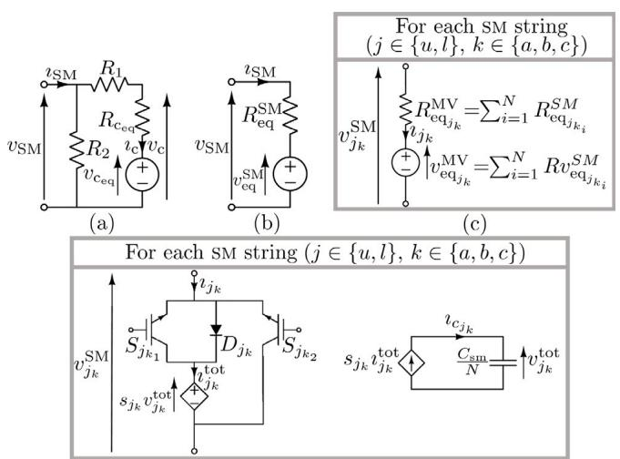  
  
Fig. 3. Gradual SM topology simplification according to the TEM (a–b) and equivalent SM string circuit when the TEM (c) and AVM (d) are adopted. In $\left( \mathrm { d } \right) , s _ { j _ { k } }$ amounts to $m _ { j _ { k } } N _ { \ell }$ , with ?? and $m _ { j _ { k } }$ respectively being the number of SMs in each arm and the arm modulation index.

voltages are recorded in time [26]. Thus, the TEM allows validating all controls in Fig. 2, including the CBA and NLCM.

As to the AVM, the literature offers different representations [6]. The one we consider is described in [28] and leads to the equivalent circuit of Fig. 3(d). This model simplifies the MMC arm topology by means of four steps: (i) replace the SM valves with ideal switches instead of bi-value resistors (as the TEM does), (ii) assume that SM capacitor voltages are perfectly balanced, (iii) adopt voltage and current sources controlled by the modulation indexes to allow simulating the behaviour of a SM string through a single capacitor, and (iv) include diode and IGBTs to allow simulating MMCs also in blocked conditions. Since the individual behaviour of each SM is lost in the AVM topology simplification process, this model can validate all the MMC controls except for the CBA and NLCM (i.e., the controls to the left of the red dashed line in Fig. 2) [5].

# 3. Shooting method (SHM): a primer

The shooting method (SHM) was first introduced in [14,15]. It is a numerical method that allows to efficiently obtain, in the timedomain, the periodic steady-state solution (i.e., a limit cycle $\gamma )$ of a dynamical smooth system described by a generic semi-explicit index-1 differential algebraic equation (DAE) [29]. This task is accomplished by iteratively solving a boundary value problem (BVP) through the solution of several initial value problems (IVPs). The initial condition $x _ { 0 } ^ { ( 1 ) }$ of the first one of these IVPs is a guess of a point in the state space of the system that is supposed to belong to ??. The evolution of the system trajectory is computed from the $t _ { 0 }$ initial time instant for a time interval whose diameter is equal to the $T _ { \gamma }$ period of the ?? limit cycle one. In case of periodically-driven non-autonomous dynamical systems $( \mathrm { i . e . , }$ , systems where the time variable explicitly appears in their governing DAE and the forcing signals are periodic), $T _ { \gamma }$ is assumed to be known and equal to the lowest common multiple of the period of the inputs. Things are more involved for autonomous systems like power systems, whose frequency and corresponding $T _ { \gamma }$ vary [16]. The $x ^ { ( n ) } ( t _ { 0 } { + } T _ { \gamma } )$ last point of the trajectory computed by numerically solving the ??-th IVP is compared to its initial condition to evaluate how close the former is to the latter. This distance, which progressively goes to zero if the iterative method converges, together with the $\dot { \phi ^ { ( n ) } } ( { \bar { T _ { \gamma } } } + t _ { 0 } , t _ { 0 } ) = \varPhi ( x ^ { ( n ) } ( t _ { 0 } + T _ { \gamma } ) , x _ { 0 } ^ { ( n ) } )$ sensitivity of the last point of the trajectory w.r.t. the first one, provides an update of the initial condition that is used as the starting point for the next (??+1)-th IVP.

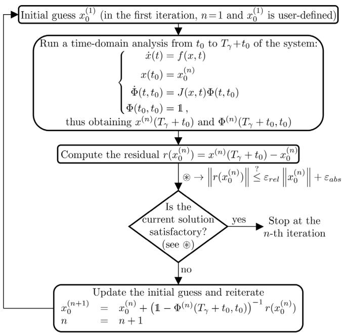  
Fig. 4. Flow diagram of the SHM in the smooth-ODE scenario.

The availability of $\Phi ( \cdot , \cdot )$ is a key ingredient of the SHM and is obtained by solving in parallel to each IVP the corresponding variational problem [16], viz. the linear time-varying ordinary differential equation (ODE) whose vector field is the Jacobian of the original non-linear DAE computed along the trajectory. Indeed, the fundamental matrix associated with this ODE corresponds to $\Phi ( \cdot , \cdot ) .$ . In case of non-smooth DAEs that model the dynamics of hybrid dynamical systems [30], such a Jacobian is not defined at some points of the trajectory (i.e., at those points where the latter is not differentiable). For example, in the case of MMCs, SM valve switching leads to non-smooth DAEs and thus to hybrid dynamical systems. In principle, this prevents the computation of $\Phi ( \cdot , \cdot )$ and thus the capability of the SHM to locate $\gamma .$ To address this issue, the SHM was extended in [31] to handle hybrid dynamical systems by resorting to the saltation matrix operator [30].

Fig. 4 provides a flow diagram of the SHM. For the sake of simplicity, the case of a smooth ODE is considered instead of an hybrid DAE. The interested reader can refer to [31] for the extension to the latter more generic scenario.

The SHM is popular among designers and scholars working with electronic oscillators. In the last years, it gained visibility also in the power system and power delivery realms [17,32–35]. One of its strong points is that the (non-smooth) DAE governing the dynamics of the circuits under study can be automatically derived in simulation programs by several well known techniques (including the modified nodal analysis) based only on the circuit netlist. This allows automatically looking for the periodic steady-state solution of complex circuits (as the one shown in Fig. 1 together with its controllers reported in Fig. 2) by resorting to an agnostic iterative method, as the SHM is, that does not require any specific information on the circuit beside the DAE itself. In addition, the availability of the fundamental matrix $\Phi ( \cdot , \cdot )$ as a byproduct of the SHM is also very useful for subsequent stability analyses, as it allows to derive the small-signal response of a system [18,36].

# 4. SHM-based MMC initialization algorithm

Fig. 5 depicts the flow diagram of our proposed MMC initialization algorithm based on the SHM. A key feature is that it discriminates between two types of MMC models: those – like the TEM – that include NLCM (or other modulation techniques) and CBA, and those – like the

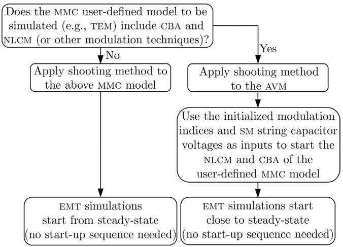  
Fig. 5. Flow diagram of the proposed MMC initialization strategy.

AVM – that do not. This difference has a crucial impact on the steady state of the system.

NLCM and CBA can be interpreted as logical/decisional processes interacting with the dynamical continuous evolution of the circuit state/algebraic variables, which make the overall circuit a hybrid system [30,37].1 Whenever the SMs change their gate signals because the NLCM updates the number of inserted and bypassed SMs, the DAEs ruling the circuit dynamics change, too. In this way, the set of DAEs modelling the circuit becomes a set of sets of DAEs, and each element of this set represents a functioning mode of the circuit. In principle, an extension to hybrid dynamical systems of the SHM [31] should be used to determine the periodic steady state of the system, but this could be neither easy nor feasible.

Indeed, the presence of NLCM and CBA affects the period of the steady-state dynamics of the system. The $T _ { \gamma }$ period of the limit cycle ?? could be very large since, the $\gamma ( t ) = \gamma ( t + T _ { \gamma } )$ equality is satisfied when (i) the state variables $( \boldsymbol { \mathrm { e . g . } } ,$ SM capacitor voltages) at ?? and $t + T _ { \gamma }$ assume the same value, and (ii) the configuration of the inserted and bypassed SMs is the same. The latter could take a long time to repeat since the NLCM and CBA have a complex switching behaviour and the number of SMs in an MMC is high. If $T _ { \gamma }$ increases, solving each IVP at every iteration of the SHM becomes more burdensome. Exploiting the SHM becomes impossible when $T _ { \gamma }$ is a very large multiple of the period of the system frequency (50/60 Hz) or even goes to infinity. This occurs whenever the steady state of the circuit is no longer periodic but becomes quasi-periodic or even chaotic. This should not sound odd since hybrid system dynamics are very rich, and become richer and richer as the involved logical/decisional processes are complex as in the case of NLCM and CBA.2

Due to the above-mentioned aspects, the proposed initialization procedure in Fig. 5 is such that the SHM can be applied directly to the user-defined MMC model only if it does not include modulation techniques and CBA (as in the case of the AVM). If so, subsequent EMT simulations would start directly from steady-state, without needing to rely on ploys $( \boldsymbol { \mathrm { e . g . } }$ , start-up sequence) mentioned in the Introduction.

Otherwise, if the model includes modulation techniques (e.g., NLCM) and a CBA, a two-step procedure is adopted.

• First, the whole system is initialized through the SHM by replacing any MMC model is used with the AVM. The AVM is chosen on purpose because it grants the highest level of detail among the MMC model compatible with all the controls except for the NLCM and CBA.   
• After running the SHM, the simulation paradigm switches back to the original system and the user-defined MMC model. The previously computed modulation indices $m _ { u _ { a b c } }$ and ??????,??,??, $m _ { l _ { a , b , c , } }$ are used as inputs for the NLCM and CBA to determine the number of inserted and bypassed SMs in each arm and their gate signals. When initializing the CBA, all SMs are assumed to be perfectly balanced: in particular, the capacitor voltage of each SM in one arm amounts to $v _ { j _ { k } } ^ { \mathrm { t o t } }$ ???? , that is, the equivalent SM string capacitor voltage previously determined through the SHM and the AVM (see Fig. 3(d)).3   
• Subsequent EMT simulations begin by assigning to all system and MMC variables not stated above their corresponding steady-state value computed with the SHM and AVM.

It is worth pointing out that the assumption of perfect voltage balancing does not hold in reality, as SM capacitor voltages inevitably show some discrepancies (mainly ripple). Nonetheless, it is sufficient to begin EMT simulations of the whole system – MMCs included – very close to steady-state by exploiting the AVM and SHM to quickly set up ripple. It is also important to highlight that this assumption is removed when performing subsequent transient simulations, as the TEM retains the behaviour of each SM and is equipped with a CBA.

# 5. Validation of the MMC initialization algorithm

In this section we consider as benchmark the modified version of the NORDIC32 power system in Fig. 6. Compared to its original version, it includes between BUS-4011 and BUS-4045 an HVDC system composed of a 200 km DC pole-to-pole line and one MMC at each bus, labelled S (sender) and R (receiver). Overall, this benchmark forms a hybrid power system: except for the HVDC system, which is formulated in the abc-frame, the rest of the grid is described in the dq0-frame. Moreover, since the benchmark includes both traditional power system components and an MMC-based HVDC grid, it is an adequate platform to validate the effectiveness of the proposed SHM-based strategy in reducing initialization transients and corresponding CPU time.

Information on the original NORDIC32 grid (e.g., loads, lines, generators, automatic voltage regulators, turbine governors, and on-load tap changers (OLTCs)) can be found in [38,39]. As to the HVDC system, it is a re-adaptation of the DCS1 benchmark taken from CIGRE TB 604. Data about the HVDC link, the MMCs, and their controls is fully available in [40]. For brevity, here we only recap its main features. Both MMCs have a rated power of 800 MW, include 128 SMs per arm, and their nominal AC side line-to-line voltage is 400 kV. ${ \bf { M M C } } _ { \mathrm { { S } } }$ and $\bf { M M C } _ { \mathrm { { R } } }$ operate in the P/Q and DC-SLACK/Q mode. Thus, they are respectively controlled to inject 400 MW in the HVDC link and keep the pole-to-pole voltage close to the rated value of 400 kV, both without exchanging reactive power. The original NORDIC32 power system suffers of long term transient instability due to the power restoration action of OLTCs after the disconnection of the line between BUS4032 and BUS4044. In this context, the addition of an HVDC system is beneficial, as it improves the power transfer capability of the grid and its stability margins [41].

The simulation results shown hereafter were obtained with PAN simulator [42–44] using an Intel® Xeon® Gold-6238R-CPU@2.20 GHz,

running Linux Mint 20.1.4 When using the AVM to describe MMCs, the benchmark system includes 1156 nodes and 1771 equations, 294 of which are state equations.

The analysis of the modified NORDIC32 power system from steadystate demands the adoption of initialization strategies or alternative but less efficient ploys that require waiting for initialization transients to extinguish. To validate our method, in the next subsections we compare the simulation results obtained in different cases with our initialization method to those achieved by bringing the benchmark system to steady-state through the following start-up sequence [25].

• The simulation starts with the SM capacitors pre-charged, their main and bypass breaker in Fig. 1 respectively closed and opened $( \mathrm { i . e . } _ { \cdot }$ , start-up resistors inserted). The active and reactive power set-points of $\mathbf { M M C } _ { \mathrm { S } }$ are zero, whereas $\mathbf { M M C } _ { \mathrm { R } }$ regulates its poleto-pole voltage to 400 kV and exchanges no reactive power.   
• $\mathrm { A t } ~ t = 0 . 0 6 \mathrm { s } ,$ , the bypass breaker of both $\bf { M M C s }$ is closed.   
• $\mathrm { A t } ~ t = 0 . 1 5 \mathrm { s } ,$ the active power set-point of $\mathbf { M M C } _ { \mathrm { S } }$ changes so that it injects 400 MW into the HVDC link.

# 5.1. Initialization with the average value model of MMCs

The black traces in the leftmost panels of Fig. 7 show some benchmark system variables obtained by simulating the previously mentioned start-up sequence and using the AVM of MMCs. If steadystate behaviour is of interest, one were to wait for at least 100 s of simulation before initialization transients are extinguished. This time corresponds to that required for instance by the angular speed deviation of generator G9 $( \varDelta \omega _ { \mathrm { G } _ { 9 } } ,$ bottom panel) to stabilize. This number would increase even more if one should wait for the frequency to be brought back exactly to the nominal value with automatic generation controls, which have very slow dynamics (the same applies when considering the slow voltage regulation of OLTCs). On the contrary, the other variables in the left panels quickly settle in less than 1 s.

To carry out 100 s of simulation, the corresponding CPU time is about 1073 s. Initialization transients (and, thus, also CPU time) can be minimized through our proposed approach. In this case, since the AVM of MMCs is adopted, one needs to resort to the left-side branch of the flow-diagram in Fig. 5. To validate the accuracy of the SHMbased approach, we run our initialization method at 0.15 s (i.e., when the power reference of $\mathbf { M M C } _ { \mathrm { S } }$ is set to 400 MW in the start-up sequence) and started at the same time EMT simulations of the benchmark system by using the set of steady-state system variables computed through the SHM. The red traces in the panels of the second column of Fig. 7 show the results obtained over a single period of simulation (i.e., from 0.15 s to $0 . 1 5 + 1 / 5 0 = 0 . 1 7 \mathrm { s } )$ .

The red traces in the second column panels indicate that the SHM significantly minimizes initialization transients, since all variables basically are at steady-state from the very beginning. For example, the inset of the third panel from the top (second column) includes negligible initialization transients, which have a limited duration of roughly 0.16 s, corresponding to a CPU time of 1.7 s. These transients are merely due to the fact that the SHM finds the limit cycle $( \mathrm { i . e . , }$ steady-state operation) based on absolute and relative tolerances: increasing such tolerances allows the SHM to run faster but may lead to a less accurate estimate of the limit cycle. The superiority of the proposed method with respect to start-up sequences in minimizing initialization transients is also highlighted in the panels of the third column, where the black and red traces are compared over four periods of simulation (i.e., from 0.15 s to 0.17 s — the same period spanned by the green shaded areas in the leftmost panels).

The rightmost panels depict the black and red traces near 100 s of simulation. They indicate that the system variables obtained with

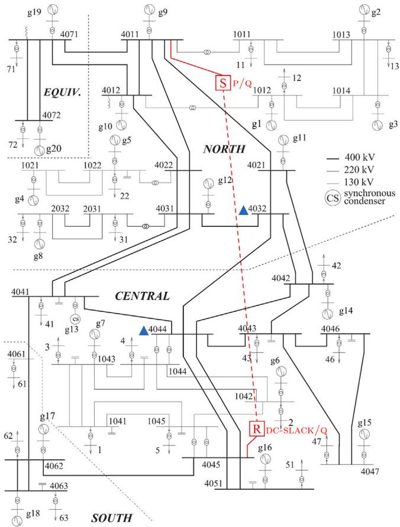  
Fig. 6. The one-line schematic of the NORDIC32 power system with the addition of an MMC-based HVDC link between BUS-4011 and BUS-4045 (dashed red line connecting the boxes labelled as R and S).

the start-up sequence eventually become comparable to those derived through the SHM — with the difference that in the latter case system variables are almost at steady-state from the very beginning. Consider for instance the second panel from the top (rightmost column), which depicts the pole-to-pole voltage $v _ { \mathrm { d c } }$ of $\mathbf { M M C } _ { \mathbf { S } } .$ . After the initialization transients due to the start-up sequence are mostly extinguished, the DC-side voltage has an oscillation of about 1 kV. This ripple originates because $v _ { \mathrm { d c } }$ is given by the capacitor voltage of the SMs in each arm, which inevitably oscillates as well (sixth panel) due to the oscillations of the arm current (fourth panel). The above oscillation is evident both with the start-up sequence and with the proposed SHM-based initialization, thus indicating that the latter does not lead to a loss in accuracy.

To further comment on the accuracy of our method, consider the results shown in the ‘‘with AVM’’ column of Table 2. The values in each row correspond to the relative percentage error between the ripple of a given variable in Fig. 7 obtained with the SHM-based method and the start-up sequence (divided by the latter), evaluated in the last 0.4 s of simulation (i.e., 20 periods).5 The low percentages confirm the accuracy of the proposed method.6

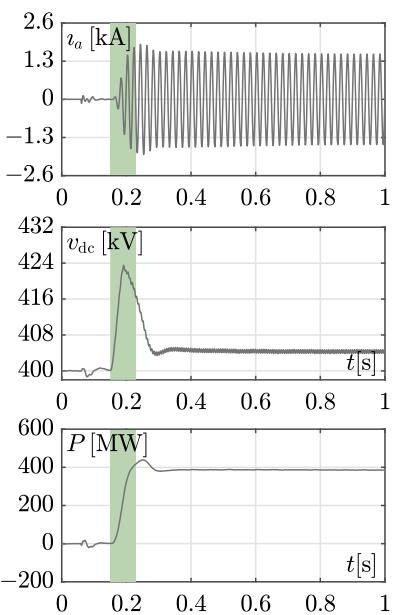  
SIMULATION STARTED WITH START-UP SEQUENCE

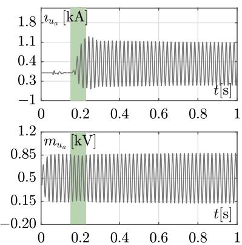

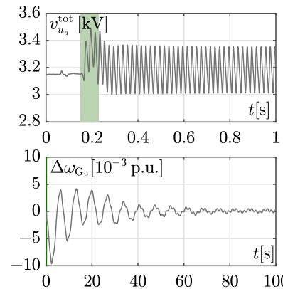

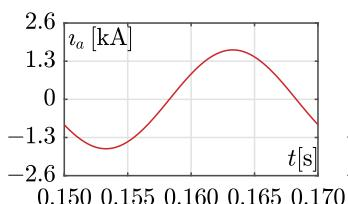  
SIMULATION STARTED WITHSHM-BASEDMETHOD

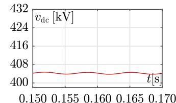

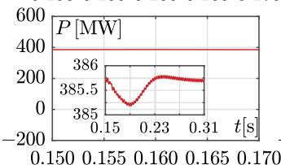

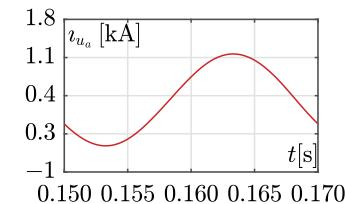

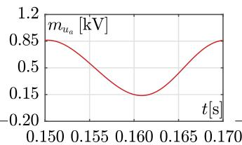

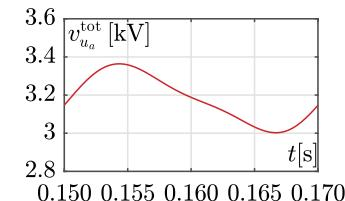

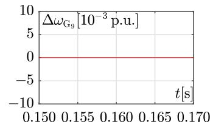

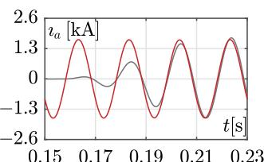  
COMPARISON BETWEEN START-UP SEQUENCE AND SHM-BASED METHOD NEAR 0.15s AND 100s

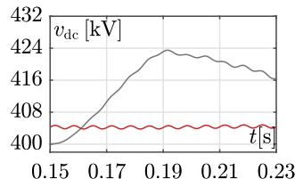

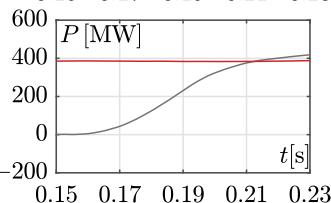

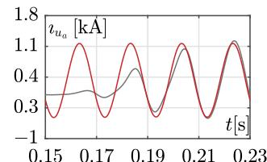

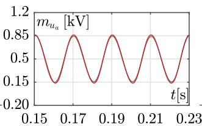

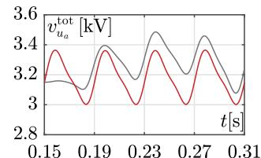

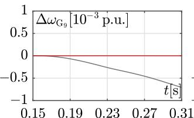

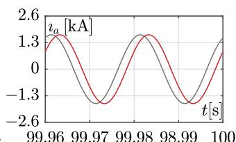

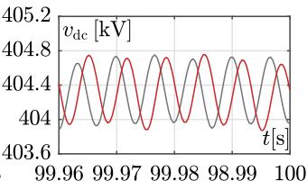

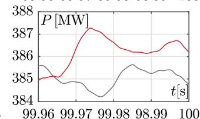

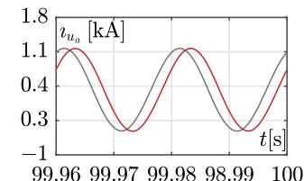

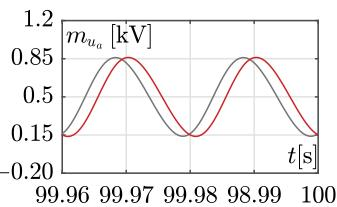

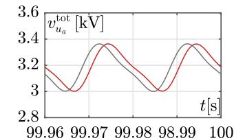

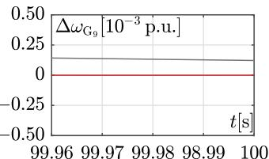  
Fig. 7. Simulation results of the modified NORDIC32 system obtained by using the AVM for the MMCs. The black traces denote the results obtained through the start-up sequence mentioned in the main text, while the red traces were generated by exploiting the SHM and starting the subsequent EMT simulation from 0.15 s. Panels are described from the top. First panel: AC-side current of $\bf { M M C } _ { \mathrm { { R } } }$ (phase ‘‘a’’). Second panel: pole-to-pole voltage of MMC . Third and fourth panel: active power exchange and upper arm current (phase ‘‘a’’) of MMC . Fifth and sixth panel: modulation index of the upper arm (phase ‘‘a’’) of MMC and its equivalent SM string capacitor voltage (see Fig. 3(d)). Last panel: per unit (p.u.) angular speed deviation of generator G9. The green shaded areas in the leftmost panels denote the period over which the black and red traces are compared in the panels of the third column.

Table 2 Accuracy of the proposed SHM-based initialization method when using the AVM and TEM models to describe MMCs.   

<table><tr><td rowspan="2">Variable</td><td colspan="2">Relative percentage error</td></tr><tr><td>With AVM</td><td>With TEM</td></tr><tr><td>la</td><td>0.17%</td><td>0.13%</td></tr><tr><td>vdc</td><td>-0.32%</td><td>-0.72%</td></tr><tr><td>P</td><td>0.16%</td><td>0.13%</td></tr><tr><td>lua</td><td>0.26%</td><td>-0.61%</td></tr><tr><td>mua</td><td>-0.85%</td><td>-0.77%</td></tr><tr><td>vtotuα (or vcapuα)</td><td>0.30%</td><td>-0.86%</td></tr></table>

Other than being accurate, the proposed initialization strategy is also very fast. Indeed, the CPU time needed to run the SHM is only 11.05 s, a time two orders of magnitude smaller than that required to simulate the benchmark system through the start-up sequence for 100 s (i.e., 1073 s).7 Moreover, it is also lower than that required to simulate the grid for just 1 s (i.e., 12.59 s) — a time when all variables in Fig. 7 except for $\varDelta \omega _ { \mathrm { G } _ { 9 } }$ seem to stabilize.8

These results prove that, although relatively simpler MMC models (e.g., AVM) are used, the SHM can be profitably applied to quickly and accurately initialize the grid, thereby avoiding long-lasting and CPU time consuming initialization transients. The SHM thrives especially in large hybrid grids characterized by the coexistence of fast and slow (e.g., electrical and mechanical) dynamics, such as the modified NORDIC32 network. As shown in the next subsection, the saving of CPU time increases substantially if more complex MMC models (e.g., TEM) are adopted.

# 5.2. Initialization with the Thévenin equivalent model of MMCs

The simulations of the previous subsection are here repeated by using the TEM instead of the AVM to represent $\mathbf { M M C } _ { \mathbf { R } }$ and $\mathrm { M M C } _ { \mathrm { S } } .$ As stated in Section 4, when the TEM (or other models of similar level of detail) is used, the MMC control scheme includes NLCM and CBA. If so, the SHM cannot be directly applied to initialize the grid, due to a possibly long periodicity (if any) of the CBA and NLCM. According to the right-side branch of the flow-diagram in Fig. 5, the proposed initialization algorithm initially represents MMCs with the AVM and executes the SHM: so doing, the same results of the previous subsection are effectively obtained. Then, the TEM of MMCs is reinstated, and the modulation indexes and the capacitor voltage of the equivalent SM strings in each arm, both derived with the SHM (e.g., see fifth and sixth panel of Fig. 7), are used as inputs for the NLCM and the CBA to determine the gate signals of all SMs and their capacitor voltages at the beginning of the subsequent transient simulations.

of our proposed method rather than the mere relative difference between the curves.

6 In the case of $\varDelta \omega _ { \mathrm { G } _ { 9 } } ,$ the error would converge to 0 if sufficiently long simulations are considered and frequency is brought back to its nominal value by automatic generation control (AGC) through secondary frequency control.   
7 Central processing unit (CPU) times can be viewed as ‘‘elapsed times’’. They include not only the times needed to run simulation themselves, but also those necessary for the simulator to ‘‘read’’ the description of the power system (netlist), build the simulator ‘‘internal’’ data-structures, and write the results. Note that a dedicated computer was used to perform all the simulations shown in this paper.   
8 On the contrary, the initialization of the original NORDIC32 benchmark (i.e., without the HVDC system) is very fast (cpu time: 0.03 s) and straightforward, as it comprises exclusively elements formulated in the dq0-frame. In this case, the periodic steady-state operation of the system translates into an equilibrium point in the dq0-frame. Thus, initializing the system basically entails solving just a typically time-invariant, non-linear problem (i.e., power flow), which does not require sophisticated initialization strategies.

Fig. 8 shows the simulation results obtained in this case by using both the start-up sequence and the SHM-based initialization. To simulate the start-up sequence described at the beginning of this section for just 1 s (which is insufficient, as already stated, to bring all system variables – including the angular speeds of the generators – to steadystate), the corresponding CPU time is about 1178.59 s (and it would amount to 167 min if the system is simulated for 100 s). This number is inevitably higher than the homologous one of the previous subsection because a more accurate MMC model, that is, the TEM, is used. On the contrary, the CPU time required to run the SHM with the AVM of MMCs and then deriving the SM gate signals and capacitor voltages of MMCs and MMCr (i.e., the steps of the right-side branch of Fig. 5) is significantly lower, as it amounts to 11.06 s. Also in this case, as indicated by the red traces in Fig. 8, transient simulations that start from the results of the SHM-based initialization are already close to steady-state from the very beginning. Indeed, as shown for instance by the inset in the third panel from the top of the second column, system variables present only minor initialization transients, which last roughly 0.6 s, corresponding to a CPU time of 70 s.

Contrary to Fig. 7, the panels in the sixth row of Fig. 8 depict the SM capacitor voltage of the upmost SM in the upper arm of phase $\mathbf { \vec { a } } _ { } ^ { , , }$ when the SHM and the start-up sequence are used. At the beginning of the simulation, this voltage is equal across the capacitor of each SM in the same arm due to the assumptions put forward with the proposed initialization method (see the second bullet point in Section 4). Then, all SM capacitor voltages inevitably vary over time due to the dynamics of the TEM but still remain bounded because the CBA limits their ripple, which in any case is analogous to that obtained with the start-up sequence.

This is shown in Fig. 9, which depicts the capacitor voltage of 10 different SMs in the upper arm of phase ‘‘a’’ obtained with the start-up sequence (top panels) and the SHM (bottom panels). The comparison among the panels highlights that the capacitor voltages obtained at steady state with the start-up sequence (i.e., top right panel) have an analogous ripple to that given by the SHM (i.e., bottom right panel). Except for minor deviations given by oscillation transients, these traces are also very similar to those obtained already at very the beginning of the simulations with the SHM (i.e., bottom left panel). It is worth pointing out that, if another CBA were to be used (or initial SM capacitor voltages in the TEM were set differently), the initialization transients shown in the bottom left panel may have another shape.9 Of course, the closer the new MMC model to the AVM in terms of steady-state behaviour, the shorter and smaller the initialization transients.

As to accuracy, the percentages in the ‘‘with TEM’’ column of Table 2 (which have the same meaning of those described in the AVM case) confirm that the system variables originating from the start-up sequence after waiting for a sufficiently long time well adhere to those obtained with the SHM.

# 5.3. Benefits of initialization transient minimization

By considering again the modified NORDIC32 power system, one might argue that, instead of using our proposed method, one may run the MMC start-up sequence and wait for 1 s before simulating any event to eliminate initialization transients. Besides, based on the black lines in the leftmost panels of Figs. 7 and 8, the variables related to the MMC

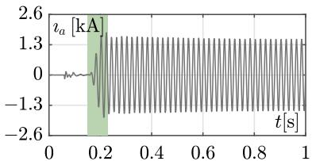  
SIMULATION STARTED WITH START-UP SEQUENCE

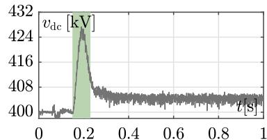

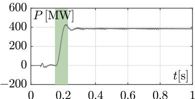

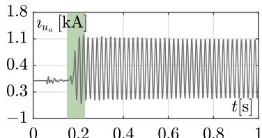

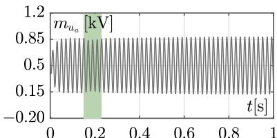

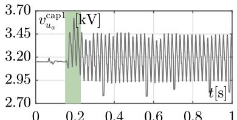

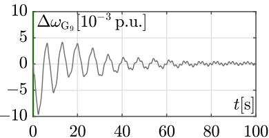

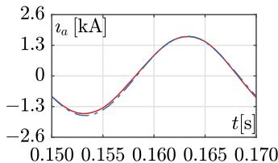  
SIMULATION STARTED WITHSHM-BASEDMETHOD

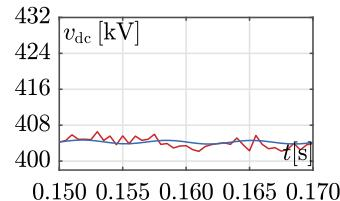

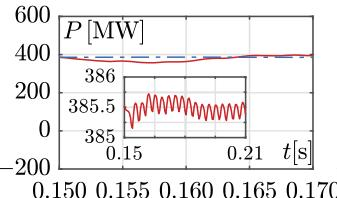

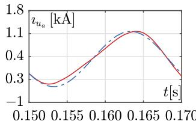

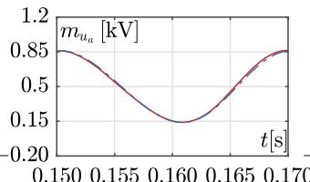

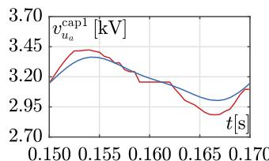

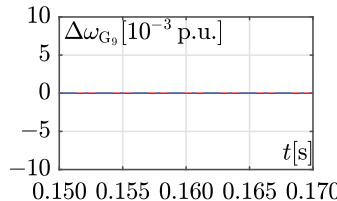

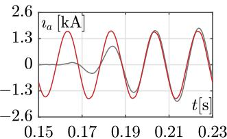  
COMPARISON BETWEEN START-UP SEQUENCE AND SHM-BASED METHOD NEAR 0.15s AND 100s

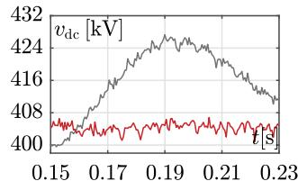

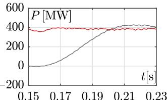

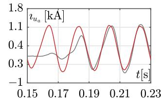

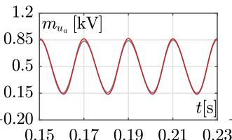

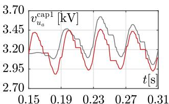

  
Fig. 8. Simulation results of the modified NORDIC32 system obtained by using the TEM for the MMCs. The black and red traces, as well as the green shaded areas, have an analogous meaning of those in Fig. 7. The same holds for the panels, except for the sixth one, which depicts the capacitor voltage of the upmost SM in the upper arm (phase ‘‘a’’) of MMCS. Notice the higher ripple in the pole-to-pole voltage compared to Fig. 7 due to the adoption of the TEM instead of the AVM. The blue traces in the panels of the second column are a replica of the red ones in Fig. 7 (i.e., obtained by running our proposed method on the modified benchmark and describing MMCs with the AVM). The comparison between the blue and red traces highlights the difference between the AVM and TEM in terms of dynamics due to the presence in the latter of the NLCM and CBA.

(i.e., all the panels but the last one) have mostly settled within 1 s. This solution, albeit simple, needs to be used with caution. Indeed, some benchmark variables are still undergoing a transient. For example, the black lines in the bottom panel of the leftmost column of Figs. 7

and 8 show that, if a start-up sequence is considered, frequency is still changing visibly at 1 s. The presence of initialization transients is such that, if contingencies were simulated, the results may be inaccurate and potentially lead to misguided conclusions about the stability of

Table 3 Summary comparison between start-up sequence and SHM-based initialization method in terms of simulation/CPU time and accuracy.   

<table><tr><td rowspan="3">MMC model</td><td colspan="6">Method chosen to bring MMCs to steady-state</td><td rowspan="3">Maximum relative percentage error among variables obtained with the two methods (see Table 2)</td></tr><tr><td colspan="2">Start up sequence</td><td colspan="4">SHM-based initialization</td></tr><tr><td>Simulation time needed for almost all variables (or all variables) to settle</td><td>Total CPU time</td><td>CPU time needed to run SHM</td><td>Simulation time needed for minor initialization transients to extinguish</td><td>CPU time related to initialization transients</td><td>Total CPU time</td></tr><tr><td>AVM</td><td>1 s (or ≥ 100 s)</td><td>12.59 s (or ≥ 1073 s)</td><td>11.05 s</td><td>0.16 s</td><td>1.7 s</td><td>11.35 s</td><td>0.85%</td></tr><tr><td>TEM</td><td>1 s (or ≥ 100 s)</td><td>1178.59 s (or ≥ 167 min)</td><td>11.06 s</td><td>0.06 s</td><td>70 s</td><td>81.05 s</td><td>0.86%</td></tr></table>

  
COMPARISON BETWEEN START-UP SEQUENCE AND SHM-BASED METHOD NEAR 0.15s AND 100s

  
Fig. 9. Capacitor voltages of 10 different SMs in the upper arm of phase ‘‘a’’ obtained by simulating the modified NORDIC32 system and using the TEM for the MMCs (each SM corresponds to a different colour). The top and bottom panels depict the results obtained with the start-up sequence and the SHM, respectively.

the system. On the contrary, the proposed method does not suffer from this issue thanks to its capability of minimizing initialization transients (see red traces in the second column panels of Figs. 7 and 8). As a result, if the SHM-based initialization is used, contingencies may be applied right at the beginning of subsequent transient simulations without taking the risk of observing inaccurate results.

To show this, we considered again the modified NORDIC32 grid and simulated the tripping of the line between buses 4032 and 4044 (whose location is highlighted by two blue triangles in Fig. 6). This contingency is reported to be critical for the original NORDIC32 grid, because it leads to long term instability due to the slow voltage restoration actions of OLTCs [39]. On the contrary, the presence of the HVDC link in the modified benchmark should prevent instability if the HVDC link exchanges enough power and initialization transients are mostly extinguished.

Fig. 10 shows the $\Delta \omega _ { \mathrm { G } _ { 9 } }$ angular speed deviation of generator G9 in different cases. In all of them, MMCs were described by the AVM and the reference power of MMC was decreased to 35 MW so that the benchmark has a low stability margin. The red trace refers to the case when the system was initialized through SHM and the line tripping occurred at 1 s. On the contrary, the black, blue, and green traces were generated by resorting to the MMC start-up sequence and tripping

  
Fig. 10. Angular speed deviation of generator G9 in different cases. The red trace refers to the case when the system was initialized through the SHM and the line tripping occurred at 1 s. On the contrary, the black, blue and green traces were generated through the MMC start-up sequence and by tripping the line at 1, 30 and 40 s, respectively (tripping times denoted by vertical dashed lines in the left inset). Insets highlight the behaviour of angular speed at the beginning and end of the simulations.

the line at 1, 30 and 40 s, respectively. The right inset shows that $\Delta \omega _ { \mathrm { G } _ { 9 } }$ is stable only when the SHM is used (red trace) or when the start-up sequence is used but the line is tripped at 40 s (green trace). In the other cases, it diverged because the line tripped when initialization transients have not mostly decayed yet. This example confirms that, contrary to the start-up sequence, our proposed method strongly minimizes initialization transients and, thus, also the corresponding waiting times (i.e., additional central processing unit (CPU) time) needed for their extinction.

# 6. Discussion

In this section we recap the results obtained in this work by applying the proposed SHM-based initialization method. To begin with, we would like to point out that we selected the modified NORDIC32 power system as benchmark for two main reasons:

• First, we wanted to highlight a key difference between our proposed method and others, such as [9–12]. Among others, these solutions rely on pen-and-paper computations to derive the steadystate operating conditions of an MMC typically described by models that are not as complex as the TEM. Therefore, as mentioned in Section 1, their usage has been so far limited to small grids, typically involving a single MMC $( \boldsymbol { \mathrm { i . e . } } ,$ , a standalone MMC). Due to the high effort involved in pen-and-paper computations, these solutions lend themselves neither to the initialization of a single MMC described by a detailed model (e.g., TEM), nor the initialization of large grids with multiple MMCs, such as the modified NORDIC32 system.

Since the SHM is a numerical, iterative, and agnostic technique (i.e., it does not require any specific information on the circuit besides the DAEs), the proposed method can be applied to any circuit, be it a standalone MMC or a larger grid with multiple MMCs.

Moreover, through the flowchart in Fig. 5, our solution allows initializing MMC models of different levels of detail (e.g., AVM or TEM).

• Second, by choosing the NORDIC32 network we wanted to showcase another key feature of the SHM, which is the fact that it thrives in stiff systems, characterized by the coexistence of fast and slow (e.g., electrical and mechanical) dynamics. Under these circumstances, the proposed method allows deriving the steadystate operating conditions of the system much faster than one would with some brute-force solutions, including MMC start-up sequences.

As to the specific features of the SHM-based initialization method, Figs. 7 and 8 show through a qualitative analysis that:

• Regardless of the MMC model used, the proposed method allows finding a set of state and algebraic variables very close to the steady-state operating conditions of the system. So doing, the corresponding initialization transients, highlighted in the second and third column panels of both figures, are very limited. As detailed in Section 5.3, initialization transient minimization is essential if subsequent transient stability analyses are aimed at analysing contingencies (e.g., line switching). Indeed, the presence of initialization transients during the simulation of a contingency may lead to inaccurate results and misguided conclusion about the true behaviour of the system under analysis.   
• The steady-state variables obtained through the proposed method are comparable to those given by the start-up sequence after waiting for a sufficiently long time. This is highlighted in the rightmost panels of both figures.

Table 2 collects quantitative results regarding the accuracy of the proposed method. It shows that, no matter if an MMC is described with the AVM or the TEM, the relative percentage error obtained with our method is lower than 0.86%.

Lastly, to further highlight the advantages of the SHM-based initialization strategy, Table 3 includes a comparison between the start-up sequence and our proposed method in terms of initialization time, CPU elapsed time and accuracy. The values shown, which have been collected from previous sections in this table for ease of reference, show that the more accurate (and, thus, computationally burdensome) the MMC model, the more convenient the reliance on a SHM-based initialization compared to a start-up sequence (or analogous ploys [6, 7]).

The above considerations also hold for more accurate MMC models than the TEM, which require a higher CPU time during EMT simulations. For instance, this is the case of the full detailed model [24], which does not merge SMs in the netlist and uses a more accurate model of the valves, thus leading to a computational burden that increases almost quadratically with the number of SMs per arm (rather than almost linearly as in the case of the TEM) [2]. In any case, if the MMC model chosen includes NLCM and CBA, the SHM-based initialization procedure remains the same, as it still retraces the right-side branch of the flow-diagram in Fig. 5.

As to the potential limitations of the proposed initialization method, the following holds. In principle, the proposed strategy allows deriving a set of state and algebraic variables close to steady state of power systems comprising MMC given by any representation. However, it is worth pointing out that, for MMC models more complex than the AVM such as the TEM (i.e., which requires resorting to the right side branch of the flowchart in Fig. 5), the magnitude and duration of the initialization transients during subsequent EMT simulations depend on the implementation of the NLCM and the CBA adopted. For instance, as stated in Section 2, different CBAs exist: if one were to use less efficient algorithms than the one adopted in this work (i.e., without any swapping), higher capacitor voltage ripples are expected, which would translate into longer initialization transients, as SM capacitor

voltages deviate more from the hypothesis of perfect voltage balancing. In any case, the time required for initialization transient extinction is lower than that the user must wait for the start up sequence to reach completion.

# 7. Conclusions

We have shown that the SHM can be profitably applied to accurately and quickly initialize power systems that include MMCs. The proposed strategy is compatible with different levels of detail in MMC models (e.g., AVM and TEM) and control schemes, making it a versatile and practical approach. This method minimizes initialization transients and the CPU time that would be otherwise incurred through other solutions such as MMC start-up sequences. The key feature of the SHMbased initialization strategy is that it is directly implemented at the simulator level. Thus, it can determine the steady-state operation of MMC-based grids numerically by relying exclusively on the netlist describing its components, without requiring cumbersome pen-and-paper computations.

# CRediT authorship contribution statement

D. del Giudice: Writing – review & editing, Writing – original draft, Software, Methodology, Conceptualization. F. Bizzarri: Writing – review & editing, Writing – original draft, Supervision, Methodology, Conceptualization. D. Linaro: Writing – review & editing, Writing – original draft, Conceptualization. A. Brambilla: Writing – review & editing, Writing – original draft, Supervision, Software, Methodology, Conceptualization.

# Declaration of competing interest

The authors have no affiliation with any organization with a direct or indirect financial interest in the subject matter discussed in the manuscript.

# Data availability

Data will be made available on request.

# References

[1] Franquelo LG, Rodriguez J, Leon JI, Kouro S, Portillo R, Prats MA. The age of multilevel converters arrives. IEEE Ind Electron Mag 2008;2(2):28–39. http: //dx.doi.org/10.1109/MIE.2008.923519.   
[2] del Giudice D, Bizzarri F, Linaro D, Brambilla AM. Modular multilevel converter modelling and simulation for HVDC systems: State of the art and a novel approach. Springer Nature; 2022.   
[3] Bizzarri F, del Giudice D, Linaro D, Brambilla A. Partitioning-based unified power flow algorithm for mixed MTDC/AC power systems. IEEE Trans Power Syst 2021;36(4):3406–15. http://dx.doi.org/10.1109/TPWRS.2021.3052917.   
[4] Martinez-Velasco JA. Transient analysis of power systems: A practical approach. John Wiley & Sons; 2020.   
[5] Saad H, Dennetière S, Mahseredjian J, Delarue P, Guillaud X, Peralta J, et al. Modular multilevel converter models for electromagnetic transients. IEEE Trans Power Deliv 2014;29(3):1481–9. http://dx.doi.org/10.1109/TPWRD.2013. 2285633.   
[6] Peralta J, Saad H, Dennetiere S, Mahseredjian J, Nguefeu S. Detailed and averaged models for a 401-level MMC–HVDC system. IEEE Trans Power Deliv 2012;27(3):1501–8.   
[7] Modular multilevel converter in EMTP-RV. EMTP-RV, https://www.emtp.com/ documents/EMTP%20Documentation/doc/HVDC/MMC_Documentation_v2.pdf. (Last accessed July 2023).   
[8] Song G, Wang T, Huang X, Zhang C. An improved averaged value model of MMC-HVDC for power system faults simulation. Int J Electr Power Energy Syst 2019;110:223–31. http://dx.doi.org/10.1016/j.ijepes.2019.03.016.   
[9] Li X, Song Q, Liu W, Xu S, Zhu Z, Li X. Performance analysis and optimization of circulating current control for modular multilevel converter. IEEE Trans Ind Electron 2016;63(2):716–27. http://dx.doi.org/10.1109/TIE.2015.2480748.   
[10] Wu D, Peng L. Analysis and suppressing method for the output voltage harmonics of modular multilevel converter. IEEE Trans Power Electron 2016;31(7):4755–65. http://dx.doi.org/10.1109/TPEL.2015.2482496.

[11] Shi X, Wang Z, Liu B, Li Y, Tolbert LM, Wang F. Steady-state modeling of modular multilevel converter under unbalanced grid conditions. IEEE Trans Power Electron 2017;32(9):7306–24. http://dx.doi.org/10.1109/TPEL.2016.2629472.   
[12] Wang J, Liang J, Gao F, Dong X, Wang C, Zhao B. A closed-loop time-domain analysis method for modular multilevel converter. IEEE Trans Power Electron 2017;32(10):7494–508. http://dx.doi.org/10.1109/TPEL.2016.2636211.   
[13] Stepanov A, Saad H, Karaagac U, Mahseredjian J. Initialization of modular multilevel converter models for the simulation of electromagnetic transients. IEEE Trans Power Deliv 2019;34(1):290–300. http://dx.doi.org/10.1109/TPWRD. 2018.2872883.   
[14] Aprille T, Trick T. Steady-state analysis of nonlinear circuits with periodic inputs. Proc IEEE 1972;60(1):108–14. http://dx.doi.org/10.1109/PROC.1972.8563.   
[15] Aprille T, Trick T. A computer algorithm to determine the steady-state response of nonlinear oscillators. IEEE Trans Circuit Theory 1972;19(4):354–60. http: //dx.doi.org/10.1109/TCT.1972.1083500.   
[16] Parker TS, Chua LO. Practical numerical algorithms for chaotic systems. New York: Springer-Verlag; 1989.   
[17] Moawwad A, El-Saadany EF, El Moursi MS, Albadi M. Critical loading characterization for MTDC converters using trajectory sensitivity analysis. IEEE Trans Power Deliv 2018;33(4):1962–72. http://dx.doi.org/10.1109/TPWRD. 2018.2809565.   
[18] Hernández-Ramírez J, Segundo J, Martínez-Cárdenas F, Gómez P. Linearization of periodic power electronic-based power systems for small-signal analysis. Int J Electr Power Energy Syst 2022;135:107503. http://dx.doi.org/10.1016/j.ijepes. 2021.107503.   
[19] Cirilo Leandro G, Noda T. A steady-state initialization procedure for generic voltage-source converters in electromagnetic transient simulations. Electr Power Syst Res 2023;221:109404. http://dx.doi.org/10.1016/j.epsr.2023.109404.   
[20] Yazdani A, Iravani R. A unified dynamic model and control for the voltagesourced converter under unbalanced grid conditions. IEEE Trans Power Deliv 2006;21(3):1620–9. http://dx.doi.org/10.1109/TPWRD.2006.874641.   
[21] Bizzarri F, Brambilla A, Milano F. Analytic and numerical study of TCSC devices: Unveiling the crucial role of phase-locked loops. IEEE Trans Circuits Syst I Regul Pap 2018;65(6):1840–9. http://dx.doi.org/10.1109/TCSI.2017.2768220.   
[22] Li B, Xu Z, Shi S, Xu D, Wang W. Comparative study of the active and passive circulating current suppression methods for modular multilevel converters. IEEE Trans Power Electron 2018;33(3):1878–83. http://dx.doi.org/10.1109/ TPEL.2017.2737541.   
[23] Moon J-W, Park J-W, Kang D-W, Kim J-M. A control method of HVDCmodular multilevel converter based on arm current under the unbalanced voltage condition. IEEE Trans Power Deliv 2015;30(2):529–36. http://dx.doi.org/10. 1109/TPWRD.2014.2342229.   
[24] Khan S, Tedeschi E. Modeling of MMC for fast and accurate simulation of electromagnetic transients: A review. Energies 2017;10(8):1161. http://dx.doi. org/10.3390/en10081161.   
[25] del Giudice D, Brambilla AM, Linaro D, Bizzarri F. Isomorphic circuit clustering for fast and accurate electromagnetic transient simulations of MMCs. IEEE Trans Energy Convers 2021;1. http://dx.doi.org/10.1109/TEC.2021.3113719.   
[26] Xu J, Ding H, Fan S, Gole AM, Zhao C, Xiong Y. Ultra-fast electromagnetic transient model of the modular multilevel converter for HVDC studies. In: 12th IET international conference on AC and DC power transmission. 2016, p. 1–9. http://dx.doi.org/10.1049/cp.2016.0441.   
[27] Vlach J, Singhal K. Computer methods for circuit analysis and design. Van Nostrand Reinhold Company; 1983.

[28] Guo D, Rahman MH, Ased GP, Xu L, Emhemed A, Burt G, Audichya Y. Detailed quantitative comparison of half-bridge modular multilevel converter modelling methods. J Eng 2019;2019(16):1292–8.   
[29] Ascher UM, Petzold LR. Computer methods for ordinary differential equations and differential-algebraic equations, vol. 61, Siam; 1998.   
[30] Di Bernardo M, Budd C, Champneys A, Kowalczyk P. Piecewise-smooth dynamical systems, theory and applications. London: Springer-Verlag; 2008.   
[31] Bizzarri F, Brambilla A, Storti Gajani G. Steady state computation and noise analysis of analog mixed signal circuits. IEEE Trans Circuits Syst I Regul Pap 2012;59(3):541–54. http://dx.doi.org/10.1109/TCSI.2011.2167273.   
[32] Bizzarri F, Brambilla A, Milano F. The probe-insertion technique for the detection of limit cycles in power systems. IEEE Trans Circuits Syst I Regul Pap 2016;63(2):312–21. http://dx.doi.org/10.1109/TCSI.2015.2512722.   
[33] Bizzarri F, del Giudice D, Linaro D, Brambilla A. Numerical approach to compute the power flow solution of hybrid generation, transmission and distribution systems. IEEE Trans Circuits Syst II 2020;67(5):936–40. http://dx.doi.org/10. 1109/TCSII.2020.2980988.   
[34] del Giudice D, Brambilla A, Linaro D, Bizzarri F. Modular multilevel converter impedance computation based on periodic small-signal analysis and vector fitting. IEEE Trans Circuits Syst I Regul Pap 2022;69(4):1832–42. http://dx.doi. org/10.1109/TCSI.2021.3138515.   
[35] Advances in power system modelling, control and stability analysis. 2nd ed. IET; 2022.   
[36] del Giudice D, Bizzarri F, Linaro D, Brambilla A. Determination of modular multilevel converters admittances and their impacts on HVDC power system stability. Int J Electr Power Energy Syst 2024;155:109561. http://dx.doi.org/ 10.1016/j.ijepes.2023.109561.   
[37] Peters K, Parlitz U. Hybrid systems forming strange billiards. Internat J Bifur Chaos 2003;13(09):2575–88.   
[38] Van Cutsem R, Papangelis L. Description, modeling and simulation results of a test system for voltage stability analysis. Belgium: University of Liègen; 2013.   
[39] Ospina LDP, Correa AF, Lammert G. Implementation and validation of the nordic test system in DIgSILENT PowerFactory. In: 2017 IEEE manchester powertech. 2017, p. 1–6. http://dx.doi.org/10.1109/PTC.2017.7980933.   
[40] Cigre WG B4-57. Guide for the development of models for HVDC converters in a HVDC grid. CIGRÉ (WG Brochure); 2014.   
[41] Renedo J, García-Cerrada A, Rouco L, Sigrist L. Coordinated control in VSC-HVDC multi-terminal systems to improve transient stability: The impact of communication latency. Energies 2019;12(3638):2–32.   
[42] Bizzarri F, Brambilla A, Gajani GS, Banerjee S. Simulation of real world circuits: Extending conventional analysis methods to circuits described by heterogeneous languages. IEEE Circuits Syst Mag 2014;14(4):51–70. http://dx.doi.org/10.1109/ MCAS.2014.2360803.   
[43] Bizzarri F, Brambilla A. PAN and MPanSuite: Simulation vehicles towards the analysis and design of heterogeneous mixed electrical systems. In: NGCAS. IEEE; 2017, p. 1–4.   
[44] Linaro D, del Giudice D, Bizzarri F, Brambilla A. PanSuite: A free simulation environment for the analysis of hybrid electrical power systems. Electr Power Syst Res 2022;212:108354.   
[45] Sauer P, Pai MA. Power system steady-state stability and the load-flow Jacobian, vol. 5, (no. 4):1990, p. 1374–83.