# Accelerated frequency-dependent method of characteristics for the simulation of multiconductor transmission lines in the time domain☆

Pablo Torrez Caballeroa , Sergio Kurokawaa , Behzad Kordib,⁎

a São Paulo State University – UNESP, Ilha Solteira, Brazil   
b University of Manitoba, Winnipeg, Manitoba, Canada R3T 5V6

# ARTICLEINFO

Keywords:

Transmission line modeling

Electromagnetic transient analysis

Multiconductor transmission lines

# A B S T R A C T

Simulation of transients in transmission lines can be time consuming and resource demanding when performed directly in the time domain using small time steps. This paper proposes an efficient implementation of the frequency-dependent method of characteristics. The proposed implementation exploits the circuit topology of the system to reduce the number of state equations. State-space matrices are then grouped and sparsity techniques are used to solve the system of the ordinary differential equations faster. We post-process the calculated state variables to reduce the memory usage and the number of memory accesses needed in each iteration and propose a technique to correct the error due to the time discretization of the travel time along the transmission line. To decouple the multiconductor transmission line equations, the real part of the modal transformation matrix at a fix frequency is considered. Presented results demonstrate that the proposed approach is accurate for overhead transmission lines, and significantly reduces the overall computation time and memory consumption of the model.

# 1. Introduction

One of the most important aspects in transmission line modeling for electromagnetic transient (EMT) studies is to take into account the frequency dependence and the distributed nature of the transmission line parameters. Many simulation models have been proposed and enhanced over decades to accurately describe the frequency-dependent characteristics of multiconductor transmission lines (MTL) in the time domain.

A number of EMT-simulator-compatible models have been developed based on the method of characteristics. The method of characteristics was first applied by Bergeron to solve hydraulic problems and later by Branin [1] to simulate transients in lossless transmission lines. Subsequently, Dommel implemented the lossy, lumped-element method of characteristics into the nodal admittance matrix method, which was incorporated in the MTL models of EMTP [2]. Many enhancements were proposed to increase the performance of this model, e.g. [3,4], and more recently in [5]. The method of characteristics has been modified to include the frequency-dependence of the line parameters of a single-phase transmission line [6] and a MTL [7] by incorporating losses as lumped elements into line segments and using

modal analysis.

A group of MTL models are based on the time-domain representation of the frequency-domain equations of the MTL by using convolutions [8–10]. Direct evaluation of the convolution integrals is computationally expensive. To resolve this problem, fitting techniques, e.g. Vector Fitting (VF) [11], have been employed. Fitting techniques produce rational functions that represent the frequency-domain data. These rational functions can be used to increase the performance of a model by reducing the number of operations required to evaluate the convolutions needed to solve the MTL equations directly in the timedomain [12,13,8,10]. Fitting techniques can also be used to directly represent the frequency dependence of the MTL parameters in the time domain [14]. The resulting rational functions from the fitting process can be linked to frequency independent equivalent circuits [4,15,16]. Some models take advantage of this by lumping the losses into many segments and present the resulting equations directly in the time-domain [17–19]. All models that use fitting techniques depend on the accuracy of the fitting method. Achieving higher accuracy requires a higher order of the rational function approximation which makes the simulation more complex. Therefore, high accuracy becomes expensive in terms of processing power and memory.

This paper introduces an accelerated method of characteristics that incorporates the frequency dependence of the MTL parameters and addresses the computational complexity of the cascaded method of characteristics with the fitted equivalent circuits. This is achieved by exploiting the circuit properties of the model to reduce the number of equations, assemble a global solution matrix for the system, and enhance accessing the historical current sources and correct the time discretization truncation effect. The proposed technique presented in this paper accelerates the modeling by reducing the time it needs to access the memory and by reducing the number of numerical operations it needs to perform. As a result, the overall performance in terms of speed and accuracy is increased.

# 2. Transmission line modeling using modal transformation

Let us consider an $( n + 1 )$ -conductor (i.e., n conductors plus ground) MTL that is described by the following equations in the frequency domain

$$
\frac {d V _ {\mathrm {p h}}}{\mathrm {d x}} = - Z I _ {\mathrm {p h}} \tag {1a}
$$

$$
\frac {d \boldsymbol {I} _ {\mathrm {p h}}}{\mathrm {d x}} = - \boldsymbol {Y} \boldsymbol {V} _ {\mathrm {p h}} \tag {1b}
$$

where Z and Y are $n \times n$ per-unit-length (PUL) impedance and admittance matrices, respectively. $\pmb { V } _ { \mathrm { p h } }$ and $I _ { \mathrm { p h } }$ are the $n \times 1$ voltage and current vectors in the phase domain.

Modal analysis has been used to decouple (1) that results in n decoupled single-conductor transmission line equations. Decoupling is achieved by the usage of transformation matrices $\pmb { T } _ { \mathbf { v } }$ and $T _ { \mathrm { i } }$ as

$$
Z _ {\mathrm {m}} = T _ {\mathrm {v}} ^ {- 1} Z T _ {\mathrm {i}}; \quad Y _ {\mathrm {m}} = T _ {\mathrm {i}} ^ {- 1} Y T _ {\mathrm {v}} \tag {2a}
$$

$$
\boldsymbol {V} _ {\mathrm {m}} = \boldsymbol {T} _ {\mathrm {v}} ^ {- 1} \boldsymbol {V} _ {\mathrm {p h}}; \quad \boldsymbol {I} _ {\mathrm {m}} = \boldsymbol {T} _ {\mathrm {i}} ^ {- 1} \boldsymbol {I} _ {\mathrm {p h}} \tag {2b}
$$

where the transformation matrices Tv and $T _ { \mathrm { i } }$ are related by [20]

$$
\boldsymbol {T} _ {\mathrm {v}} ^ {- 1} = \boldsymbol {T} _ {\mathrm {i}} ^ {T}. \tag {3}
$$

The major issue with modal analysis is that the transformation matrices are frequency-dependent that makes the implementation of modal analysis in the time domain difficult. In this paper, an approach based on using a frequency-dependent modal transformation for the PUL series impedance (2a) and a frequency-independent transformation matrix for the phase voltages and current (2b) has been presented. We will demonstrate that the proposed approach, although being an approximation, is very accurate and fast for overhead transmission lines.

The following subsection presents the details on the representation of the modal impedance $Z _ { \mathrm { m } }$ using an equivalent electric circuit. The modal admittance ${ \pmb Y } _ { \mathbf { m } }$ and the method of characteristics are incorporated to create a circuit model that represents a frequency-dependent transmission line. This paper also introduces a fast implementation of the resulting model using circuit simplification and numerical integration.

# 2.1. Representation of the frequency effects

It is well known that the transmission line PUL impedance is frequency dependent. For overhead transmission lines, Z can be calculated as the sum of the impedances coming from the magnetic field in air assuming lossless conductors $\scriptstyle z _ { o } ,$ from the magnetic field in the conductor $\mathbf { \delta } _ { Z _ { i } , }$ and from the magnetic field in the ground ΔZ [21].

$$
\boldsymbol {Z} (s) = \boldsymbol {Z} _ {o} (s) + \boldsymbol {Z} _ {i} (s) + \Delta \boldsymbol {Z} (s) \tag {4}
$$

where s is the complex frequency.

The PUL impedance matrix Z is decoupled into its modes using (2a). As a result, each mode can be modeled as an individual single-phase transmission line that has a frequency-dependent PUL longitudinal

impedance $Z _ { \mathrm { m } } .$

An approach to represent frequency-dependent elements directly in the time-domain is to fit an electrical circuit that has similar frequency behavior. An equivalent circuit can be accurately determined as follows:

1. First, the circuit topology that is going to be fitted must be chosen. Two circuit topologies that represent an impedance are shown in Fig. 1. For an impedance with an inductive reactance such as $Z _ { \mathrm { m } } ( s ) _ { \mathrm { : } }$ , circuit topology of Fig. 1a has most of its electrical components with a negative sign, whereas circuit topology of Fig. 1b has most of its electrical components with a positive sign. The function to be fitted F(s) depends on the circuit topology that was chosen as follows:

Circuit of Fig. 1Figure 1a: the function to be fitted, F(s), is equal to the impedance $Z _ { \mathrm { m } } ( s )$ as given by

$$
F (s) = Z _ {\mathrm {m}} (s) \tag {5}
$$

Circuit of Fig. 1Figure 1b: the function to be fitted, F(s), is derived from $Z _ { \mathrm { m } } ( s )$ as given by [15]

$$
F (s) = \frac {Z _ {\mathrm {m}} (s) - R _ {\mathrm {d c}}}{s} \tag {6}
$$

where $R _ { \mathrm { d c } } = \mathrm { R e } \{ Z _ { m } ( 0 ) \}$ .

2. Accuracy of the fitting depends on the order and on the algorithm used to obtain the best fit possible. Low order could sometimes lead to a poor fitting whereas high order could lead to overfitting and to numerical instability. In this paper, Vector Fitting (VF) [11] has been used as the fitting algorithm that fits F(s) as

$$
F (s) \simeq F _ {\text {f i t}} (s) = d + \operatorname {s e} + \sum_ {k = 1} ^ {N _ {R}} \frac {c _ {k}}{s - a _ {k}} + \sum_ {p = 1} ^ {N _ {C}} \left(\frac {c _ {p}}{s - a _ {p}} + \frac {c _ {p} ^ {*}}{s - a _ {p} ^ {*}}\right) \tag {7}
$$

where $N _ { R }$ and $N _ { C }$ are the number of real and pairs of complexconjugate poles respectively, d is the constant term, and e is the constant in the linear term. Circuit of Fig. 1a requires d and e to be fitted because they are associated to the series resistor and inductor, respectively. Circuit of Fig. 1b requires only d to be fitted because it is associated to the series inductor. The series resistor of the circuit of Fig. 1b is the DC resistance $R _ { d c }$ of $Z _ { m } ( s )$ .In general, the PUL impedance $Z _ { \mathrm { m } } ( s )$ is a smooth function and can be fitted using real poles only. Circuit topology of Fig. 1a fits impedances with negative reactances, whereas circuit topology of Fig. 1b represents impedances with positive reactances such as the longitudinal impedance of a transmission line.

3. The fitted function $F _ { f i t } ( s )$ is expressed as a fitted impedance using (5) or (6). Then, by comparison between the fitted impedance and the impedance of the circuit topologies shown in Fig. 1, the circuit elements are obtained as follows:

Circuit of Fig. 1Figure 1a: each circuit branch is calculated as in [16]

$$
R ^ {\prime} = d; \quad L ^ {\prime} = e \tag {8a}
$$

$$
R _ {\mathrm {r}} ^ {\prime} = - \frac {c _ {k}}{a _ {k}}; \quad C _ {\mathrm {r}} ^ {\prime} = \frac {1}{c _ {k}}; \quad k = 1, 2 \dots N _ {R} \tag {8b}
$$

$$
C _ {\mathrm {c}} ^ {\prime} = \frac {1}{c _ {p} + c _ {p} ^ {*}}; \quad G _ {\mathrm {c}} ^ {\prime} = - C _ {\mathrm {c}} ^ {\prime 2} \left(c _ {p} a _ {p} + c _ {p} ^ {*} a _ {p} ^ {*}\right) \tag {8c}
$$

$$
L _ {\mathrm {c}} ^ {\prime} = \frac {- \frac {1}{c _ {p} c _ {p} ^ {*} C _ {\mathrm {c}} ^ {- 3}}}{\left(a _ {p} - a _ {p} ^ {*}\right) ^ {2}}; \quad R _ {\mathrm {c}} ^ {\prime} = - \left(c _ {p} a _ {p} ^ {*} + c _ {p} ^ {*} a _ {p}\right) L _ {\mathrm {c}} ^ {\prime} C _ {\mathrm {c}} ^ {\prime}; \quad p = 1, 2 \dots N _ {C} \tag {8d}
$$

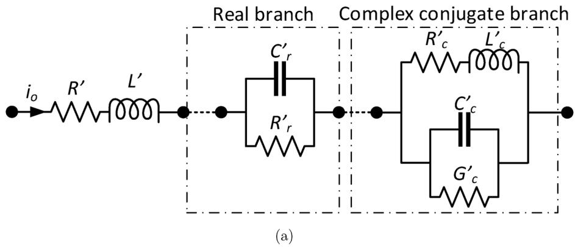

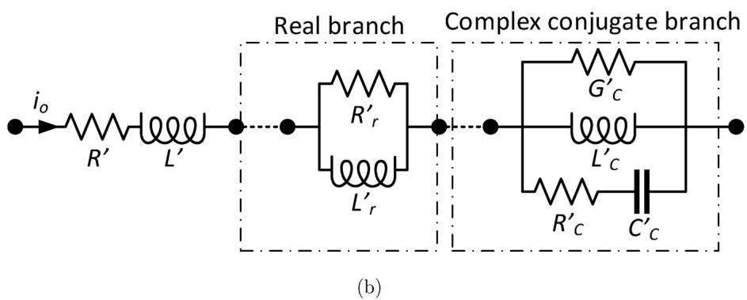  
Fig. 1. Circuit topologies used to represent frequency-dependent impedances: (a) direct [16] and (b) indirect.

Circuit of Fig. 1Figure 1b: each branch is calculated as

$$
R ^ {\prime} = R _ {\mathrm {d c}} = \operatorname {R e} \left\{Z _ {m} (0) \right\}; \quad L ^ {\prime} = d \tag {9a}
$$

$$
R _ {\mathrm {r}} ^ {\prime} = c _ {k}; \quad L _ {\mathrm {r}} ^ {\prime} = - \frac {c _ {k}}{a _ {k}}; \quad k = 1, 2 \dots N _ {R} \tag {9b}
$$

$$
L _ {\mathrm {c}} ^ {\prime} = \frac {c _ {p} a _ {p} ^ {*} + c _ {p} ^ {*} a _ {p}}{a _ {p} a _ {p} ^ {*}}; \quad G _ {\mathrm {c}} ^ {\prime} = - \frac {\frac {c _ {p} ^ {*} a _ {p}}{a _ {p} ^ {*}} + \frac {c _ {p} a _ {p} ^ {*}}{a _ {p}}}{L _ {\mathrm {c}} ^ {\prime} \left(c _ {p} a _ {p} ^ {*} + c _ {p} ^ {*} a _ {p}\right)} \tag {9c}
$$

$$
R _ {\mathrm {c}} ^ {\prime} = \frac {1}{\frac {1}{c _ {p} + c _ {p} ^ {*}} - G _ {\mathrm {c}} ^ {\prime}}; \quad C _ {\mathrm {c}} ^ {\prime} = - \frac {c _ {p} + c _ {p} ^ {*}}{R _ {\mathrm {c}} ^ {\prime} \left(c _ {p} a _ {p} ^ {*} + c _ {p} ^ {*} a _ {p}\right)}; \quad p = 1, 2 \dots N _ {C} \tag {9d}
$$

Each real pole $a _ { k }$ and its residue $c _ { k }$ in (7) can be represented by a ”real-pole branch” (as shown in ${ \mathrm { F i g . ~ } } 1 ) ,$ , whose elements are calculated using (8b) or (9b). Similarly, each pair of complex conjugate poles $a _ { p }$ and its residues $c _ { p }$ are associated to a “complex-conjugate poles branch”, whose elements are calculated using (8c) or (9c).

# 3. Accelerated frequency-dependent method of characteristics

# 3.1. Frequency-dependent method of characteristics

To incorporate the mode shunt admittance, $Y _ { m } ( s ) ,$ , in the circuit model, a T-network has been assembled as shown in Fig. 2. Here, we have made the assumption that for overhead transmission lines, the

PUL shunt capacitance, $C ^ { \prime } ,$ can be assumed constant and the PUL conductance can be neglected [9].

As an example, Fig. 2a shows the equivalent T-network using the circuit of Fig. 1b to represent the series mode impedance [6]. Applying the method of characteristics to the circuit shown in Fig. 2a results in the circuit shown in Fig. 2b. The circuit of Fig. 2b can then be cascaded in b segments to reduce the effect of modeling the losses as lumped resistors. The circuit elements in Fig. 2 are calculated based on their PUL values as follows

$$
R = R ^ {\prime} \frac {d _ {\mathrm {s}}}{2 b}; \quad L = L ^ {\prime} \frac {d _ {\mathrm {s}}}{b}; \quad R _ {\mathrm {r}} = R _ {\mathrm {r}} ^ {\prime} \frac {d _ {\mathrm {s}}}{2 b} \tag {10a}
$$

$$
L _ {\mathrm {r}} = L _ {\mathrm {r}} ^ {\prime} \frac {d _ {\mathrm {s}}}{2 b}; \quad R _ {\mathrm {c} 1} = R _ {\mathrm {c} 1} ^ {\prime} \frac {d _ {\mathrm {s}}}{2 b}; \quad L _ {\mathrm {c}} = L _ {\mathrm {c}} ^ {\prime} \frac {d _ {\mathrm {s}}}{2 b} \tag {10b}
$$

$$
R _ {\mathrm {c} 2} = R _ {\mathrm {c} 2} ^ {\prime} \frac {d _ {\mathrm {s}}}{2 b}; \quad C _ {\mathrm {c}} = C _ {\mathrm {c}} ^ {\prime} \frac {d _ {\mathrm {s}}}{2 b}; \quad C = C ^ {\prime} \frac {d _ {\mathrm {s}}}{b} \tag {10c}
$$

$$
\tau = \left\lfloor \frac {d _ {\mathrm {s}} \sqrt {L ^ {\prime} C ^ {\prime}}}{b \Delta t} \right\rfloor ; \quad Z _ {c} = \sqrt {\frac {L}{C}} \tag {10d}
$$

$$
I _ {k} (b - \tau) = - \frac {V _ {m} (b - \tau)}{Z _ {c}} + i _ {m} (b - \tau) \tag {10e}
$$

$$
I _ {m} (b - \tau) = \frac {V _ {k} (b - \tau)}{Z _ {c}} + i _ {k} (b - \tau) \tag {10f}
$$

where $d _ { \mathrm { s } }$ is the length of the line and Δt is the time step [7].

The current sources of each block in (10e)–(10f) are delayed τ time steps, where τ is the discrete propagation time expressed in time steps and b is the discrete time step.

The model described in Fig. 2b has some advantages when compared to other time-domain models:

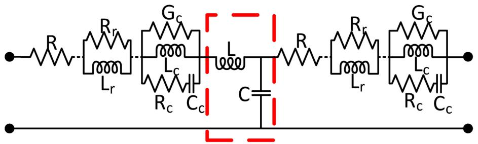  
(a)

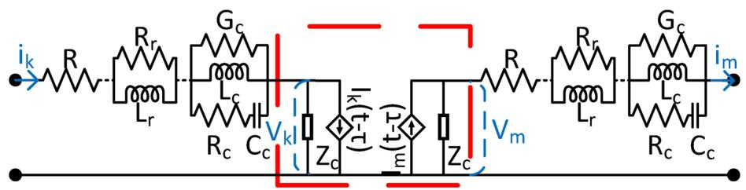  
(b)   
Fig. 2. Single-phase transmission line representation using (a) T-circuit and (b) method of characteristics.

• It is based on the method of characteristics, which is computationally very efficient [1].   
• A single-stage circuit (Fig. 2b) gives a good response for low frequency signals, e.g. switching operations [6].   
• Cascading the circuit of Fig. 2b increases the accuracy for highfrequency signals such as lightning strikes [7]. When simulating high frequency phenomena, oscillations appear. Increasing the number of cascaded circuits of Fig. 2b reduces the oscillation and thus, increases the accuracy of the model.   
• Its accuracy converges rapidly to less than 1% with a few number of cascaded circuits as shown in Fig. 10.

# 3.2. Fast implementation of the frequency-dependent method of characteristic

This section introduces the fast implementation of the proposed frequency-dependent method of characteristics. The improvements presented in this section accelerate the model, reduce memory usage, and increase the overall accuracy, as follows:

# 3.2.1. Simplification of the ODE

A cascade of b circuits of Fig. 2a (the so-called blocks) has 2b × m state variables where m is the number of poles used to fit $Z _ { \mathrm { m } } .$ The cascade has b + 1 meshes, and the first and last meshes are connected to the terminals. b − 1 meshes are located at intermediate nodes as shown in Fig. 3aa. To simplify the circuit of Fig. 3a, we have designed and found a circuit that has the same impedance of the one in the enclosed area in Fig. 3a but with less circuit elements i.e. with less state equations. The simplified circuit is shown in Fig. 3b. This simplification reduces the number of state variables from 2b × m to (b + 1) × m.

# 3.2.2. Global solution

The equations that describe each mesh of the simplified circuit of Fig. 3b can be written in a general form given by

$$
\frac {d}{\mathrm {d} t} \boldsymbol {x} = \boldsymbol {A x} + \boldsymbol {B u} \tag {11}
$$

where vector x contains the state variables associated with inductors and capacitors, and u contains the sources in each mesh.

Similarly, current i0 passing through each mesh (shown in Fig. 3b), that will be needed to compute history current sources, can also be written in a general form given by

$$
i _ {0} = \boldsymbol {C x} + \boldsymbol {D u} \tag {12}
$$

where A, B, C and D depend on the type of mesh (input, connection or output) and on the circuit topology used to represent $Z _ { m } .$ They are all defined in Appendix A.

Eq. (11) can be solved for each time step using any numerical integration method, e.g. trapezoidal rule, that will yield

$$
\boldsymbol {x} _ {n + 1} = \boldsymbol {A} _ {H} \boldsymbol {x} _ {n} + \boldsymbol {B} _ {H} (\boldsymbol {u} _ {n} + \boldsymbol {u} _ {n + 1}) \tag {13}
$$

where

$$
\boldsymbol {A} _ {H} = \left[ \boldsymbol {I} - \frac {\Delta t}{2} \boldsymbol {A} \right] ^ {- 1} \left[ \boldsymbol {I} + \frac {\Delta t}{2} \boldsymbol {A} \right] \tag {14}
$$

$$
\boldsymbol {B} _ {H} = \left[ \boldsymbol {I} - \frac {\Delta t}{2} \boldsymbol {A} \right] ^ {- 1} \frac {\Delta t}{2} \boldsymbol {B} \tag {15}
$$

For each time step, the state-space equations of all the meshes are

$$
\boldsymbol {x} _ {n + 1} ^ {1} = \boldsymbol {A} _ {H} ^ {\text {i n}} \boldsymbol {x} _ {n} ^ {1} + \boldsymbol {B} _ {H} ^ {\text {i n}} \left(\boldsymbol {u} _ {n} ^ {1} + \boldsymbol {u} _ {n + 1} ^ {1}\right)
$$

$$
\boldsymbol {x} _ {n + 1} ^ {2} = \boldsymbol {A} _ {H} ^ {\text {c o n n}} \boldsymbol {x} _ {n} ^ {2} + \boldsymbol {B} _ {H} ^ {\text {c o n n}} \left(\boldsymbol {u} _ {n} ^ {2} + \boldsymbol {u} _ {n + 1} ^ {2}\right)
$$

$$
\boldsymbol {x} _ {n + 1} ^ {b + 1} = \boldsymbol {A} _ {H} ^ {\text {o u t}} \boldsymbol {x} _ {n} ^ {b + 1} + \boldsymbol {B} _ {H} ^ {\text {o u t}} \left(\boldsymbol {u} _ {n} ^ {b + 1} + \boldsymbol {u} _ {n + 1} ^ {b + 1}\right) \tag {16}
$$

where, for u and x, the superscript represents their mesh index and the subscript their time step index.

One method to solve (16) is to solve each mesh individually for each time step. This method is referred as iterative method.

Another approach is to assemble a global matrix as given by

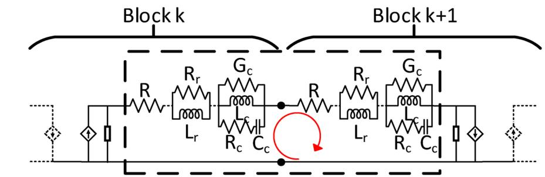

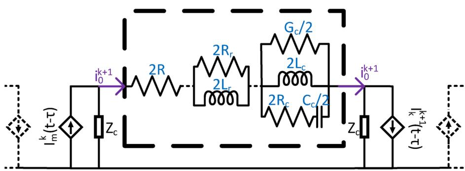  
(b)   
Fig. 3. Intermediate node: (a) complete and (b) simplified.

Table 1 A comparison of flops per iteration for different methods. b is the number of cascaded blocks and m is the number of poles used to fit $Z _ { \mathrm { m } } .$   

<table><tr><td></td><td>Flops per iteration</td><td>Flops difference compared to the iterative method</td><td>Number of memory accesses per iteration</td></tr><tr><td>Iterative</td><td>2m2b + 2m2 + 3mb + m + 2b + 1</td><td>n/a</td><td>3b + 9</td></tr><tr><td>Block</td><td>4mb2 + 2m2b2 + 4m2b + 2m2 + 5mb + m + 2b + 1</td><td>4mb2 + 2m2b2 + 2m2b + 2mb</td><td>5</td></tr><tr><td>Sparse</td><td>2m2b + 2m2 + 3mb + 3m + 2b + 1</td><td>2m</td><td>5</td></tr></table>

$$
\begin{array}{l} \left[ \begin{array}{c} \boldsymbol {x} ^ {1} \\ \boldsymbol {x} ^ {2} \\ \vdots \\ \boldsymbol {x} ^ {b + 1} _ {n + 1} \end{array} \right] = \left[ \begin{array}{c c c} \boldsymbol {A} _ {H} ^ {\text {i n}} & & \\ & \boldsymbol {A} _ {H} ^ {\text {c o n n}} & \\ & & \ddots \\ & & & \boldsymbol {A} _ {H} ^ {\text {o u t}} \end{array} \right] \left[ \begin{array}{c} \boldsymbol {x} ^ {1} \\ \boldsymbol {x} ^ {2} \\ \vdots \\ \boldsymbol {x} ^ {b + 1} \end{array} \right] _ {n} \\ + \left[ \begin{array}{c c c c} \boldsymbol {B} _ {H} ^ {\text {i n}} & & & \\ & \boldsymbol {B} _ {H} ^ {\text {c o n n}} & & \\ & & \ddots & \\ & & & \boldsymbol {B} _ {H} ^ {\text {o u t}} \end{array} \right] \left(\left[ \begin{array}{c} \boldsymbol {u} ^ {1} \\ \boldsymbol {u} ^ {2} \\ \vdots \\ \boldsymbol {u} ^ {b + 1} \end{array} \right] _ {n} + \left[ \begin{array}{c} \boldsymbol {x} ^ {1} \\ \boldsymbol {x} ^ {2} \\ \vdots \\ \boldsymbol {x} ^ {b + 1} \end{array} \right] _ {n + 1}\right) \tag {17} \\ \end{array}
$$

and solve all meshes at once. Directly solving (17) is referred as block method. Eq. (17) can also be computed considering square matrices as sparse matrices. This method is referred as sparse method.

Although floating-points operations or flop count can no longer predict accurately the processing performance of a method, it can be used to compare different methods [22]. For the three methods proposed, the number of flops per iteration (time step), the flop difference between each method and the fastest amongst them, and the number of times each method has to access the memory is presented in Table 1.

Table 1 shows that iterative method is the most efficient in terms of processing speed, followed by sparse method. However, for each iteration, iterative method has to access 3b + 9 times the memory to load the variables needed to perform the calculations whereas sparse method has to access the memory only 5 times per iteration. Depending on the hardware, accessing memory could be the most important bottleneck because retrieving data from the memory is one of the most time

consuming tasks. Considering both, processing speed and memory access, we conclude that sparse method is the most efficient algorithm for solving (17).

# 3.2.3. Variable storage

Eqs. (17) and (12) allows us to compute voltages and currents that can be used to calculate sources $I _ { k }$ and $I _ { m }$ using (10e) and (10f). Vector u contains the sources as given by

$$
\left[ \begin{array}{c} \boldsymbol {u} ^ {1} \\ \boldsymbol {u} ^ {2} \\ \vdots \\ \boldsymbol {u} ^ {b + 1} \end{array} \right] _ {n} = \left[ \begin{array}{c} V _ {\text {i n}} [ n ] \\ I _ {k} ^ {1} [ n - \tau ] \\ I _ {m} ^ {1} [ n - \tau ] \\ I _ {k} ^ {2} [ n - \tau ] \\ \vdots \\ I _ {m} ^ {b} [ n - \tau ] \\ V _ {\text {o u t}} [ n ] \end{array} \right] = \left[ \begin{array}{c} V _ {\text {i n}} [ n ] \\ - \frac {V _ {m} ^ {1} [ n - \tau ]}{Z _ {c}} + i _ {0} ^ {2} [ n - \tau ] \\ \frac {V _ {k} ^ {1} [ n - \tau ]}{Z _ {c}} + i _ {0} ^ {1} [ n - \tau ] \\ - \frac {V _ {m} ^ {2} [ n - \tau ]}{Z _ {c}} + i _ {0} ^ {3} [ n - \tau ] \\ \vdots \\ \frac {V _ {k} ^ {b} [ n - \tau ]}{Z _ {c}} + i _ {0} ^ {b} [ n - \tau ] \\ V _ {\text {o u t}} [ n ] \end{array} \right] \tag {18}
$$

Accessing memory is one of the most computationally expensive tasks. Therefore, computing u using (18) would be inefficient because voltages $V _ { k }$ and $V _ { m } ,$ and currents $i _ { 0 }$ would need to be computed and stored in memory.

Our proposal skips the calculation of $V _ { k }$ and $V _ { m }$ by using

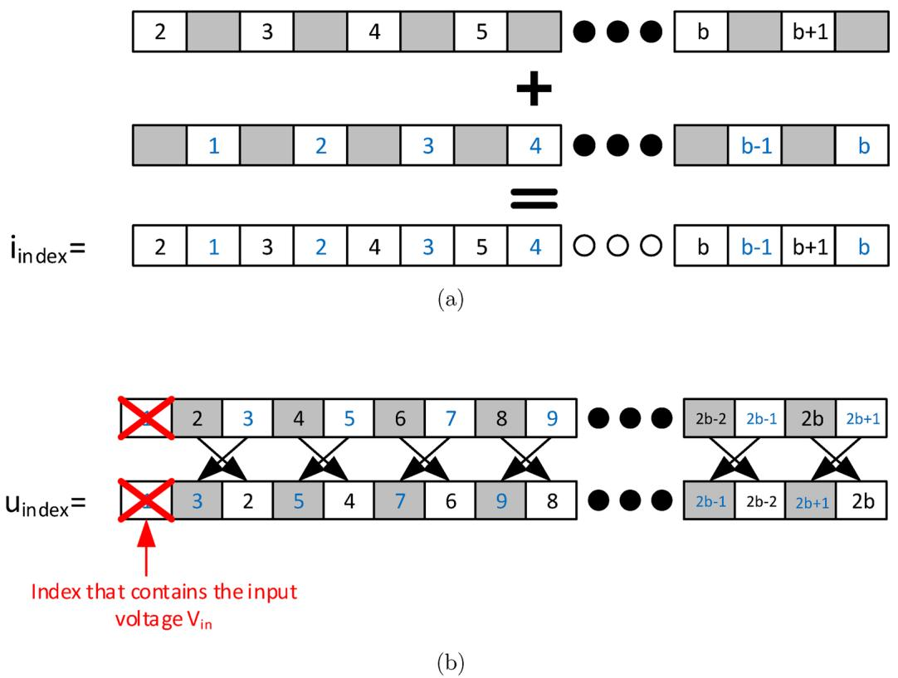  
Fig. 4. Guide to assemble (a) [iindex] and (b) [uindex].

$$
\frac {V _ {m} ^ {q} [ n ]}{Z _ {c}} = i _ {0} ^ {q + 1} [ n ] - I _ {m} ^ {q} [ n - \tau ] \tag {19a}
$$

$$
\frac {V _ {k} ^ {q} [ n ]}{Z _ {c}} = i _ {0} ^ {q} [ n ] - I _ {k} ^ {q} [ n - \tau ] \tag {19b}
$$

that can be obtained from the circuit shown in Fig. 2b.

Implementing (19) in (18) at time step $n + \tau$ and rearranging terms for convenience leads to

$$
\left[ \begin{array}{c} \boldsymbol {u} ^ {1} \\ \boldsymbol {u} ^ {2} \\ \vdots \\ \boldsymbol {u} ^ {b + 1} \end{array} \right] _ {n + \tau} = \left[ \begin{array}{c} V _ {\text {i n}} [ n + \tau ] \\ 2 i _ {0} ^ {2} [ n ] - I _ {m} ^ {1} [ n - \tau ] \\ 2 i _ {0} ^ {1} [ n ] - I _ {k} ^ {1} [ n - \tau ] \\ 2 i _ {0} ^ {3} [ n ] - I _ {m} ^ {2} [ n - \tau ] \\ \vdots \\ 2 i _ {0} ^ {b} [ n ] - I _ {k} ^ {b} [ n - \tau ] \\ V _ {\text {o u t}} [ n + \tau ] \end{array} \right] = \left[ \begin{array}{c} V _ {\text {i n}} [ n + \tau ] \\ \boldsymbol {H} \\ V _ {\text {o u t}} [ n + \tau ] \end{array} \right] \tag {20}
$$

$$
\begin{array}{l} \boldsymbol {H} = \left[ \begin{array}{c} 2 i _ {0} ^ {2} [ n ] - I _ {m} ^ {1} [ n - \tau ] \\ 2 i _ {0} ^ {1} [ n ] - I _ {k} ^ {1} [ n - \tau ] \\ 2 i _ {0} ^ {3} [ n ] - I _ {m} ^ {2} [ n - \tau ] \\ \vdots \\ 2 i _ {0} ^ {b} [ n ] - I _ {k} ^ {b} [ n - \tau ] \end{array} \right] = 2 \left[ \begin{array}{c} i _ {0} ^ {2} \\ i _ {0} ^ {1} \\ i _ {0} ^ {3} \\ \vdots \\ i _ {0} ^ {b} \end{array} \right] _ {n} - \left[ \begin{array}{c} I _ {m} ^ {1} \\ I _ {k} ^ {1} \\ I _ {m} ^ {2} \\ \vdots \\ I _ {k} ^ {b} \end{array} \right] _ {n - \tau} \\ = 2 \boldsymbol {i} _ {\text {m o d}} [ n ] - \boldsymbol {u} _ {\text {m o d}} [ n - \tau ] \tag {21} \\ \end{array}
$$

It can be noticed that $i _ { m o d }$ is $i _ { o }$ sorted in a specific way, and $u _ { m o d }$ is vector u at a previous time, $n - \tau ,$ and also sorted in a specific way. The indexes that sort i and [u] into $\scriptstyle { i _ { m o d } }$ and $\scriptstyle u _ { m o d }$ are i and $u _ { i n d e x } ,$ and can be constructed as follows

• $i _ { i n d e x }$ is constructed by alternating between 2 vectors: one that counts from 2 to $b + 1$ and one that counts from 1 to b.   
• $u _ { i n d e x }$ is constructed by switching places every 2 elements from a

vector that counts from 1 to $2 b + 1$ .

We show a graphical guide to assemble $i _ { i n d e x }$ and $u _ { i n d e x }$ in Fig. 4. Implementing Eqs. (20) and (21) results in the following algorithm:

i At current time n, vector u is ready for use. Vector u contains the current sources $I _ { k }$ and $I _ { m }$ at time $n - \tau .$   
ii Load vector x at time $n - 1$ , and load vector u at times n − 1 and n (current time).   
iii Compute x at current time n using (17) and the sparse method.   
iv Compute node currents $\mathbf { i } _ { o }$ at current time, n, using (12).   
v Sort i0 into imod.   
vi Sort u at current time, $n ,$ into $u _ { m o d } .$   
vii Compute H using (21).   
viii Preallocate u at time $n + \tau$ using (20). Write H to the preallocated u. This action leaves u at time $n + \tau$ ready for use.

# 3.2.4. Correction due to time discretization

The cascaded model divides the line in b segments. Thus, the line propagation time τ is also divided in b segments. For fixed-time numerical methods such as Heun's [23], a problem arises when $\tau / b$ is not proportional to the time step Δt.

For example: a transmission line with a propagation time of 39Δt represented by 9 cascaded blocks would have a propagation time of 4Δt for each block. The propagation time of the segmented line would be 36Δt, and not 39Δt. During the first iterations, there would be no difference but that gap of 3Δt would stack over time to produce lag between the line's “ideal response” and its simulation.

To avoid this, we propose to distribute the remainder $\Delta t \times \mathrm { M O D } ( \tau ,$ , b) between the first cascaded blocks. Applying that technique to our example increases the propagation time of the first 3 blocks by one time step Δt. We show the example discussed in Fig. 5.

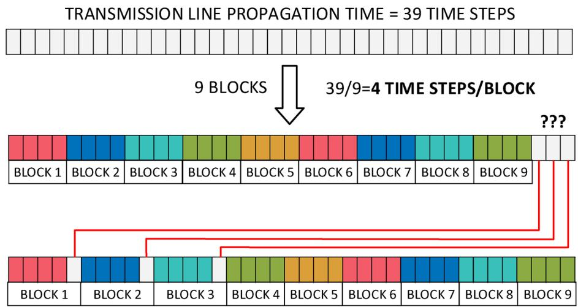  
Fig. 5. Error stacked due to time discretization and proposed solution.

# 4. Results

The accuracy of the time-domain model presented in this paper can be verified by comparing it to the frequency-domain solution of a transmission line transformed to the time-domain using the numerical Laplace transform (NLT) [24,25]. We simulate the transmission line geometry shown in Fig. 6 that is 2 km long and is excited by a delayed Gaussian voltage source with a Full Width at Half Maximum (FWHM) of 1 MHz. The line's terminals connections are shown in Fig. 7. Fig. 8 shows the results obtained using 10 and 25 cascaded blocks and their comparison with those obtained using the NLT. Here we have used a real frequency-independent transformation matrix calculated at 1 kHz. We simulated the transmission line studied in this paper using the exact method (NLT) with frequency-dependent transformation matrix and

compared the results with those from the same method but with a constant, real transformation matrix calculated at various frequencies.

Fig. 9, which shows the error between the results obtained using these approaches, demonstrates that using a constant transformation matrix results in negligible error [26]. The error has been obtained by comparing the results obtained from the exact method (NLT) with frequency-dependent transformation matrix with those from the same method but with a constant, real transformation matrix calculated at the frequencies shown in Fig. 9

Fig. 10 shows the percentage error (normalized root-mean-square error), between the exact NLT model and the proposed model as a function of the number of blocks. The accuracy of the proposed model converges rapidly with only a few cascaded blocks.

Even though it is difficult to compare models because of differences

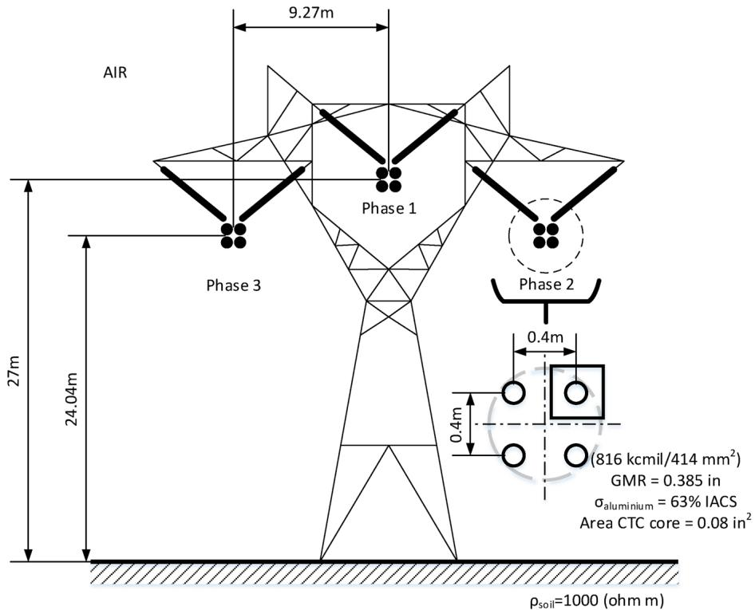  
Fig. 6. A three-phase transmission line.

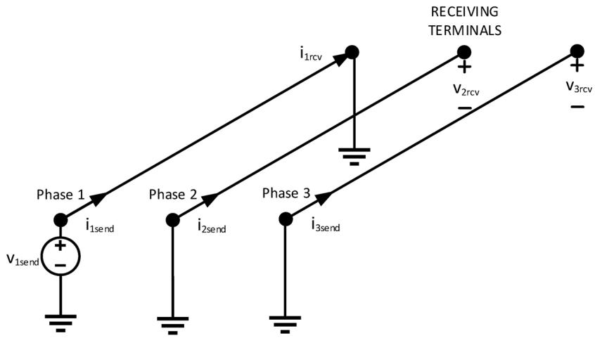  
Fig. 7. A transmission line layout.

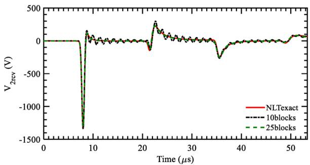

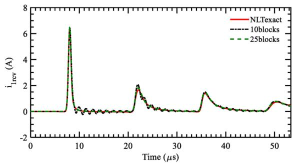

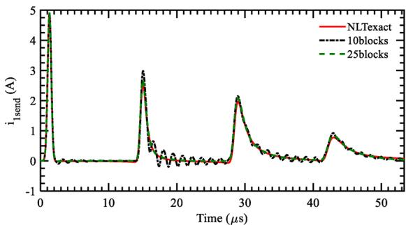  
  
Fig. 8. Simulation results. (a) Output Voltage $V _ { \mathrm { 2 r c v } }$ and $V _ { \mathrm { { 3 r c v } } } .$ (b) Output current $i _ { \mathrm { 1 r c v } } .$ (c) Input current $i _ { 1 s e n d } .$

in programming environments and algorithm implementations, we simulated the transmission line shown in Figs. 6-7 using other time-domain models, and measured the processing time needed to produce responses with the same quality of the one shown in Fig. 8. The

processing times are shown in Table 2. Table 2 shows that the proposed model is faster than the Universal Line Model [10] and the cascade of frequency-dependent π circuits [12].

To show the compatibility of the proposed, accelerated approach

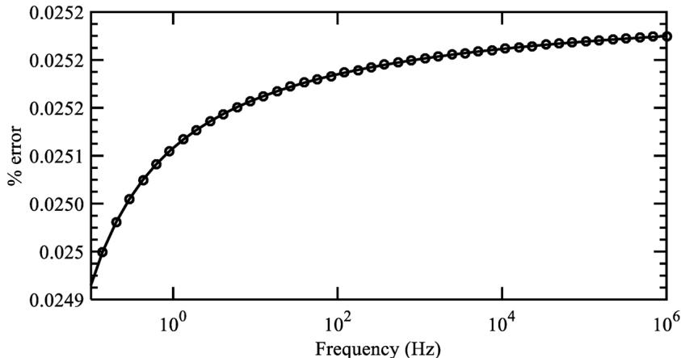  
Fig. 9. Percentage error vs. the frequency at which the transformation matrix has been calculated.

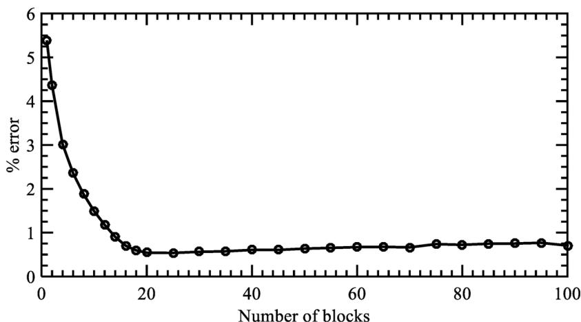  
Fig. 10. Percentage error as a function of the number of cascaded blocks.

Table 2 Processing times for various transmission line models.   

<table><tr><td></td><td>Processing time in seconds</td></tr><tr><td>Proposed model</td><td>7.53</td></tr><tr><td>Universal Line Model [4]</td><td>8.14</td></tr><tr><td>Cascade of frequency dependent π circuits</td><td>19.71</td></tr><tr><td>Numeric Laplace Transform (reference)</td><td>10.05</td></tr></table>

with EMT simulators, we simulate a 100 − km long transmission line with the geometry shown in Fig. 6 that transmits power from a 600 − V three-phase source to a non-linear load as shown in Fig. 11. The voltages and currents simulated are shown in Fig. 12. The accelerated model presented in this paper is considerably faster, computationally less expensive, and more accurate than the original formulation.

# 5. Conclusions

Transmission line simulation becomes computationally expensive in terms of memory usage and computation time for very small time steps and long simulation times. An efficient implementation of the frequency-dependent method of characteristics is presented in this paper.

The modal PUL series impedance $Z _ { \mathrm { m } }$ of a multiconductor overhead transmission line was decoupled using its frequency-dependent modal transformation matrices. The voltages and currents at the terminals were transformed to the mode domain using a real transformation matrix sampled at a low frequency $_ { e . g . }$ 1 kHz. The resulting modes were simulated using the proposed accelerated model. Using circuit simplification and numerical integration, the number of state equations is reduced from $2 b \times m$ to $( b + 1 ) \times m ,$ , where b is the number of cascaded blocks and m is the number of poles used to fit the PUL series modal impedance $Z _ { m } ,$ respectively. The resulting state equations were efficiently solved by grouping the systems, storing them using sparsity techniques, and solving all cascaded blocks for each time step at once. In consequence, the computational complexity is reduced from $O ( n ^ { 2 } )$ to O(n). By post-processing the state variables, the number of memory accesses is reduced from 3b + 9 to 5, which also skips the calculation of intermediate variables and improves the memory usage. And finally, a technique to correct the error due to time discretization in numerical integration methods was presented. The techniques proposed in this paper reduce the overall computation time and memory consumption while increasing the accuracy of the model. The simulation results proved the accuracy of the proposed model for overhead transmission lines.

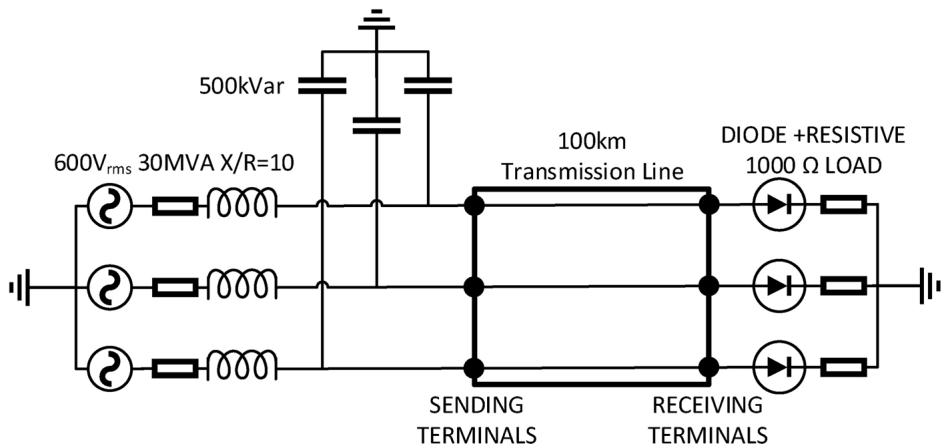  
Fig. 11. A three phase transmission line terminated by a nonlinear load.

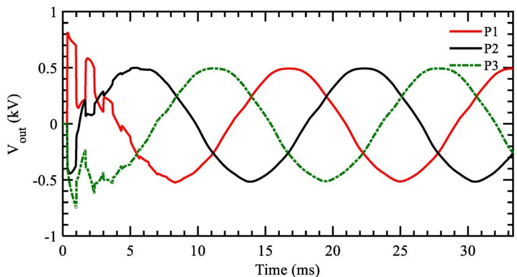

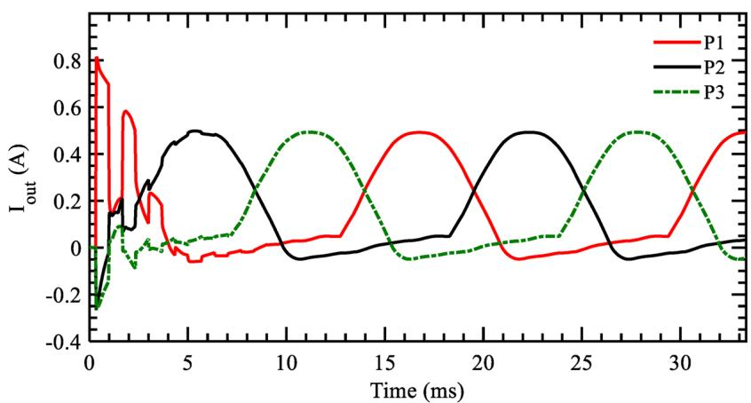  
  
Fig. 12. Simulation results. (a) Voltages at the receiving terminal and (b) currents at the receiving terminal.

# Appendix A. State-space representation

Matrices A and B used in Section 3.2.2 are calculated for each mesh as

$$
\boldsymbol {A} = \boldsymbol {E} + \boldsymbol {F C}; \quad \boldsymbol {B} = \boldsymbol {F D} \tag {A.1}
$$

where $G , E ,$ F depend on the type of mesh: input, output or connection given by

i. Input mesh

$$
\boldsymbol {E} = \boldsymbol {E} _ {1}; \quad \boldsymbol {C} = \frac {- 1}{R _ {0} + Z _ {c} + H _ {1}} \boldsymbol {G} _ {1} \tag {A.2}
$$

$$
\boldsymbol {F} = \boldsymbol {F} _ {1}; \quad \boldsymbol {D} = \frac {1}{R _ {0} + Z _ {c} + H _ {1}} [ 1 \quad \mathrm {Z c} ] \tag {A.3}
$$

ii. Output mesh

$$
\boldsymbol {E} = \boldsymbol {E} _ {1}; \quad \boldsymbol {C} = \frac {- 1}{R _ {0} + Z _ {c} + H _ {2}} \boldsymbol {G} _ {2} \tag {A.4}
$$

$$
\boldsymbol {F} = \boldsymbol {F} _ {1}; \quad \boldsymbol {D} = \frac {- Z _ {\mathrm {c}}}{2 R _ {0} + 2 Z _ {\mathrm {c}} + H _ {2}} [ 1 \quad 1 ] \tag {A.5}
$$

iii. Simplified Connection mesh

$$
\boldsymbol {E} = \boldsymbol {E} _ {2}; \quad \boldsymbol {C} = \frac {- 1}{2 R _ {0} + 2 Z _ {\mathrm {c}} + H _ {1}} \boldsymbol {G} _ {2} \tag {A.6}
$$

$$
\boldsymbol {F} = \boldsymbol {F} _ {2}; \quad \boldsymbol {D} = \frac {1}{R _ {0} + Z _ {c} + H _ {1}} [ Z _ {c} - 1 ] \tag {A.7}
$$

and C, D depend on the circuit topology used to fit $Z _ { \mathrm { m } } ( s )$ . For a fit using 2 real poles (subscripts r1 and r2) and 1 pair of complex conjugate poles, the matrices related to each circuit topology are given by

• Circuit ofFig. 1Figure 1a

$$
\boldsymbol {E} _ {1} = \left[ \begin{array}{c c c c} - \frac {1}{C _ {r 1} R _ {r 1}} & & & \\ & - \frac {1}{C _ {r 2} R _ {r 2}} & & \\ & & \frac {- G _ {c}}{C _ {c}} & \frac {- 1}{C _ {c}} \\ & & \frac {1}{L _ {c}} & \frac {- R _ {c}}{L _ {c}} \end{array} \right] \tag {A.8}
$$

$$
\boldsymbol {E} _ {2} = \left[ \begin{array}{c c c c} - \frac {1}{C _ {r 1} R _ {r 1}} & & & \\ & - \frac {1}{C _ {r 2} R _ {r 2}} & & \\ & & \frac {- G _ {c}}{C _ {c}} & \frac {- 2}{C _ {c}} \\ & & \frac {1}{2 L _ {c}} & \frac {- R _ {c}}{L _ {c}} \end{array} \right] \tag {A.9}
$$

$$
\boldsymbol {F} _ {1} ^ {T} = \left[ \begin{array}{l l l l} \frac {1}{C _ {r 1}} & \frac {1}{C _ {r 2}} & \frac {1}{C _ {c}} & 0 \end{array} \right] \tag {A.10}
$$

$$
\boldsymbol {F} _ {2} ^ {T} = \left[ \begin{array}{l l l l} \frac {2}{C _ {r 1}} & \frac {2}{C _ {r 2}} & \frac {2}{C _ {c}} & 0 \end{array} \right] \tag {A.11}
$$

$$
\boldsymbol {G} _ {1} = \boldsymbol {G} _ {2} = \left[ \begin{array}{l l l l} 1 & 1 & 1 & 0 \end{array} \right]; \quad H _ {1} = H _ {2} = 0 \tag {A.12}
$$

• Circuit ofFig. 1Figure 1b

$$
\boldsymbol {E} _ {1} = \left[ \begin{array}{c c c c} \frac {- R _ {r 1}}{L _ {r 1}} & & & \\ & \frac {- R _ {r 2}}{L _ {r 2}} & & \\ & & \frac {- G _ {C}}{R _ {c} G _ {c} + 1} \frac {- \frac {1}{C _ {c}}}{R _ {c} G _ {c} + 1} & \\ & & \frac {- \frac {1}{L _ {c}}}{R _ {c} G _ {c} + 1} \frac {- \frac {R _ {c}}{L _ {c}}}{R _ {c} G _ {c} + 1} \end{array} \right] \tag {A.13}
$$

$$
\boldsymbol {E} _ {2} = \left[ \begin{array}{c c c c} \frac {- R _ {r 1}}{L _ {r 1}} & & & \\ & \frac {- R _ {r 2}}{L _ {r 2}} & & \\ & & \frac {- \frac {G _ {c}}{C _ {c}}}{R _ {c} G _ {c} + 1} & \frac {- \frac {2}{C _ {c}}}{R _ {c} G _ {c} + 1} \\ & & \frac {- \frac {1}{2 L _ {c}}}{R _ {c} G _ {c} + 1} & \frac {- \frac {R _ {c}}{L _ {c}}}{R _ {c} G _ {c} + 1} \end{array} \right] \tag {A.14}
$$

$$
\boldsymbol {F} _ {1} ^ {T} = \left[ \begin{array}{l l l l} \frac {R _ {r 1}}{L _ {r 1}} & \frac {R _ {r 2}}{L _ {r 2}} & \frac {\frac {1}{C _ {c}}}{R _ {c} G _ {c} + 1} & \frac {\frac {R _ {c}}{L _ {c}}}{R _ {c} G _ {c} + 1} \end{array} \right] \tag {A.15}
$$

$$
\boldsymbol {F} _ {2} ^ {T} = \left[ \begin{array}{l l l l} \frac {R _ {r 1}}{L _ {r 1}} & \frac {R _ {r 2}}{L _ {r 2}} & \frac {\frac {2}{C _ {c}}}{R _ {c} G _ {c} + 1} & \frac {R _ {c}}{R _ {c} G _ {c} + 1} \end{array} \right] \tag {A.16}
$$

$$
\boldsymbol {G} _ {1} = \left[ - R _ {r 1} - R _ {r 2} \frac {1}{R _ {c} G _ {c} + 1} \frac {- R _ {c}}{R _ {c} G _ {c} + 1} \right] \tag {A.17}
$$

$$
\boldsymbol {G} _ {2} = \left[ - 2 R _ {r 1} - 2 R _ {r 2} \frac {1}{R _ {c} G _ {c} + 1} \frac {- 2 R _ {c}}{R _ {c} G _ {c} + 1} \right] \tag {A.18}
$$

$$
H _ {1} = R _ {r 1} + R _ {r 2} + \frac {R _ {c}}{R _ {c} G _ {c} + 1}; \quad H _ {2} = 2 H _ {1} \tag {A.19}
$$

# References

[1] F.H.J. Branin, Transient analysis of lossless transmission lines, Proc. IEEE 55 (11) (1967) 2012–2013.   
[2] H.W. Dommel, Electromagnetic Transients Program Theory Book, Bonneville Power Administration, Portland, OR, 1986.   
[3] J.K. Snelson, Propagation of travelling waves on transmission lines – frequency dependent parameters, IEEE Trans. Power Appar. Syst. PAS-91 (1) (1972) 85–91.   
[4] J.R. Marti, Accurate modeling of frequency-dependent transmission lines in electromagnetic transient simulations, IEEE Trans. Power Appar. Syst. PAS-101 (1) (1982) 147–157.   
[5] J.R. Marti, A. Tavigui, Frequency dependent multiconductor transmission line model with collocated voltage and current propagation, IEEE Trans. Power Deliv. PP (99) (2017) 1-1.   
[6] P. Torrez Caballero, E.C. Marques Costa, S. Kurokawa, Fitting the frequency-dependent parameters in the Bergeron line model, Electr. Power Syst. Res. 117 (2014) 14–20.   
[7] P. Torrez Caballero, E.C. Marques Costa, S. Kurokawa, Frequency-dependent line model in the time domain for simulation of fast and impulsive transients, Int. J. Electr. Power Energy Syst. 80 (September) (2016) 179–189.   
[8] K.S. Oh, Accurate transient simulation of transmission lines with the skin effect, IEEE Trans. Comput. Aided Des. Integr. Circuits Syst. 19 (March (3)) (2000) 389–396.   
[9] A. Ramirez, J.L. Naredo, P. Moreno, L. Guardado, Electromagnetic transients in overhead lines considering frequency dependence and corona effect via the method of characteristics, Int. J. Electr. Power Energy Syst. 23 (3) (2001) 179–188.   
[10] A. Morched, B. Gustavsen, M. Tartibi, A universal model for accurate calculation of electromagnetic transients on overhead lines and underground cables, IEEE Trans. Power Deliv. 14 (3) (1999) 1032–1037.   
[11] B. Gustavsen, A. Semlyen, Rational approximation of frequency domain responses by vector fitting, IEEE Trans. Power Deliv. 14 (3) (1999) 1052–1059.   
[12] S. Kurokawa, F.N.R. Yamanaka, A.J. do Prado, J. Pissolato, Inclusion of the frequency effect in the lumped parameters transmission line model: state space formulation, Electr. Power Syst. Res. 79 (7) (2009) 1155–1163.   
[13] J. Macias, A. Exposito, A. Soler, A comparison of techniques for state-space transient analysis of transmission lines, IEEE Trans. Power Deliv. 20 (2) (2005) 894–903.   
[14] B. Kordi, J. LoVetri, G.E. Bridges, Finite-difference analysis of dispersive

transmission lines within a circuit simulator, IEEE Trans. Power Deliv. 21 (January (1)) (2006) 234–242.   
[15] M. Sarto, A. Scarlatti, C. Holloway, On the use of fitting models for the time-domain analysis of problems with frequency-dependent parameters, 2001 IEEE International Symposium on Electromagnetic Compatibility (2001) 588–593.   
[16] G. Antonini, SPICE equivalent circuits of frequency-domain responses, IEEE Trans. Electromagn. Compat. 45 (3) (2003) 502–512.   
[17] O. Ramos-Leanos, J. Mahseredjian, J.L. Naredo, I. Kocar, J.A. Gutierrez-Robles, J.A. Martinez, Phase-domain line/cable model through second-order blocks, IEEE Trans. Power Deliv. 30 (December (6)) (2015) 2460–2467.   
[18] B. Li, J. Wang, X. Song, D. Su, Equivalent circuit model of frequency-domain responses with external field, 2015 IEEE International Symposium on Electromagnetic Compatibility (EMC), IEEE (August 2015) 761–766.   
[19] S. Kurokawa, F.N.R. Yamanaka, A.J. do Prado, J. Pissolato, Using state-space techniques to represent frequency dependent single-phase lines directly in time domain, 2008 IEEE/PES Transmission and Distribution Conference and Exposition: Latin America, Bogota, CO, 2008, pp. 1–5.   
[20] L.M. Wedepohl, H.V. Nguyen, Frequency-dependent transformation matrices for untransposed transmission lines using Newton–Raphson method, IEEE Trans. Power Syst. 11 (3) (1996) 1538–1546.   
[21] L. Hofmann, Series expansions for line series impedances considering different specific resistances, magnetic permeabilities, and dielectric permittivities of conductors, air, and ground, IEEE Trans. Power Deliv. 18 (2) (2003) 564–570.   
[22] S. Boyd, L. Vandenberghe, Convex Optimization vol. 25 (3, Cambridge University Press, 2010 (online). Available: https://web.stanford.edu/boyd/cvxbook/bv_ cvxbook.pdf.   
[23] M.F. Fathoni, A.I. Wuryandari, Comparison between Euler, Heun, Runge–Kutta and Adams–Bashforth–Moulton integration methods in the particle dynamic simulation, 2015 4th International Conference on Interactive Digital Media (ICIDM) (December 2015) 1–7.   
[24] B. Gustavsen, Validation of frequency-dependent transmission line models, IEEE Trans. Power Deliv. 20 (2) (2005) 925–933.   
[25] P. Moreno, A. Ramirez, Implementation of the numerical Laplace transform: a review, IEEE Trans. Power Deliv. 23 (4) (2008) 2599–2609.   
[26] N. Garcia, E. Acha, Transmission line model with frequency dependency and propagation effects: a model order reduction and state-space approach, 2008 IEEE Power and Energy Society General Meeting – Conversion and Delivery of Electrical Energy in the 21st Century, IEEE (July 2008) 1–7.