# RESEARCH ARTICLE

# Advancing Grid-Forming Inverter Technology: Comprehensive PQ Capability and Performance Analysis

MD NURUNNABI, SHUHUI LI , (Senior Member, IEEE), AND HIMADRY SHEKHAR DAS , (Student Member, IEEE)

Department of Electrical and Computer Engineering, The University of Alabama, Tuscaloosa, AL 35487, USA

Corresponding author: Shuhui Li (sli@eng.ua.edu)

This work was supported in part by the U.S. National Science Foundation under Grant 2141067 and Grant 2402634.

ABSTRACT This paper presents a performance analysis of grid-forming (GFM) inverter technology, which is essential to ensure stable and reliable operation of power systems with high penetration of inverter-based resources (IBRs). Recognizing that IBR operational constraints are distinct from those of synchronous generators, this study develops advanced PQ capability models and algorithmic frameworks that accurately characterize GFM inverter operational constraints across various coupling filter configurations (L, LC, and LCL). Electromagnetic transient (EMT) simulations show that the Enhanced Voltage Regulation (EVR) and Controlled Proportional-Integral Droop (CPID) strategies proposed in this paper improve voltage and frequency stability under dynamic loading and fault conditions, outperforming conventional droop methods. Real-time hardware validation confirms the robustness of the proposed approaches and their effectiveness in suppressing harmonics and recovering from faults. Key contributions include the derivation of practical PQ capability boundaries under realistic constraints, identification of superior control strategies for robust power quality (PQ), and successful GFM and grid-following (GFL) integration in parallel operations. These findings provide actionable insights for optimizing GFM inverter design and ensuring IEEE 1547 compliance in low-inertia grids.   
INDEX TERMS Droop control systems, grid-forming inverters, inverter coupling filters, inverter operational constraints, power quality enhancement, PWM saturation effects.

# I. INTRODUCTION

The increase in renewable energy utilization in power systems requires robust and dependable inverter technology. Gridforming inverters, like traditional synchronous generators, play a crucial role in this transition by providing the grid with necessary voltage and frequency support [1], [2], [3], [4], [5], [6]. This feature is extremely critical for ensuring grid stability and dependability, particularly in microgrids and distributed energy resource (DER) contexts when conventional generation is restricted or absent [7]. GFM inverters

The associate editor coordinating the review of this manuscript and approving it for publication was Alexander Micallef .

can function independently of the grid, providing a reliable power supply in isolated networks or supporting the main grid during fluctuations [8], [9], [10].

PQ Capability charts are traditionally used for synchronous generators to establish reliable operational boundaries and to inform their control mechanisms [11], [12]. This concept is similarly critical in the realm of inverters, where PQ capability is a fundamental specification outlined in international standards [13], [14]. Numerous PQ capability charts have been formulated for inverter-based resources (IBR) [15], [16], [17]. For instance, the Electric Reliability Council of Texas (ERCOT) has introduced a rectangular PQ capability chart that is required at the point of interconnection (POI)

[15] as shown in Fig. 1(a). Concurrently, the North America Electric Reliability Corporation (NERC) has introduced a semi-circular PQ capability chart for nominal voltage, maintaining a fixed reactive power approximately 0.95 p.u. of the active power output [16], depicted in Fig. 1(b).

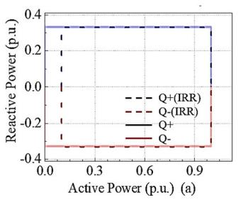

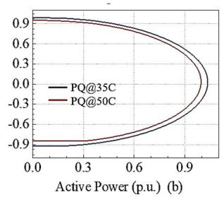  
FIGURE 1. Inverter-Based Resource PQ Capability Diagrams: (a) According to ERCOT specifications [15], and (b) NERC guidelines [16].

However, GFM inverters possess sophisticated control systems distinct from those of synchronous generators. Their operation is constrained by several factors, including PWM (pulse-width modulation) saturation and rated current, which play critical roles in determining the PQ–capability area and ensuring the reliable operation of GFM inverters. Existing inverter PQ capability charts often fail to adequately consider the specific characteristics and constraints of GFM inverters, making the impact on their control and operation unclear [5], [18], [19], [20]. A coupling filter is mandatory for connecting a GFM inverter to a microgrid, which affects both the harmonics and PQ capability of the inverter. While L filters are most used in grid-following (GFL) inverters connected to strong grids due to sufficient harmonic suppression and the grid’s inherent voltage stiffness, LC or LCL filters may be used in weak grid or microgrid environments to provide improved harmonic attenuation [11]. Rathnayake et al. [5] provided a comprehensive overview of GFM inverter modeling but did not extensively cover the impact of different filter topologies on PQ capabilities.

Vega et al. [20] discussed control requirements for maintaining frequency stability in low-inertia systems, but their work lacked detailed operational dynamics for GFM inverters under various filtering conditions. Li et al. [21] and Zeng et al. [22] highlighted the significance of filter design in mitigating harmonics and improving inverter performance. However, these studies did not integrate the specific constraints of GFM inverters into their PQ capability analyses, which is critical for understanding the full operational potential of these devices.

Different load types in an electrical power system (EPS), including R, RL, RC loads, and stochastic load, present varying characteristics when supplied by a GFM inverter, depending on the coupling filter used. Previous studies have often focused on R loads, but comprehensive studies evaluating the performance of GFM inverters under diverse loading conditions and filtering setups are lacking [8], [9]. This study

aims to fill this gap and provide valuable insights into the design and operation of GFM inverters.

Despite the importance of GFM inverters in providing frequency and voltage support, GFL inverters are also widely used in renewable energy resources [23], [24], [25]. Therefore, it is crucial to study the impacts of integrating GFM and GFL inverters in an EPS. Several international standards define performance, safety, and grid compatibility requirements for grid-connected inverters. IEEE 1547 specifies requirements for interconnection, Including allowable voltage and frequency deviations, total harmonic distortion (THD) limits, and ride-through capabilities. UL 1741 addresses safety aspects and certification procedures, while IEC 62116 outlines test procedures for anti-islanding protection. This study assesses inverter performance against IEEE 1547 criteria, particularly focusing on THD limits for voltage and current, as well as voltage and frequency stability during disturbances.

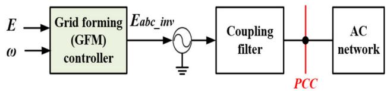  
FIGURE 2. Grid-connected GFM inverter schematic.

The studies are conducted via electromagnetic transient (EMT) simulation and hardware experiments. To our knowledge, this study introduces comprehensive insights not yet fully explored in existing literature, thereby advancing the development of grid-forming (GFM) inverter systems significantly.

The contributions of this paper include: 1) Development of inverter PQ models considering specific inverter characteristics and coupling filters. 2) Development of algorithms to determine PQ capability charts considering constraints unique to GFM inverters. 3) Performance and harmonic studies of GFM inverters under diverse loading conditions and filtering setups. 4) Evaluation of GFM inverter control and operation from a novel dynamic PQ capability perspective. 5) A study of integrated GFM and GFL inverters under diverse power sharing conditions.

The paper is organized as follows:

Section II presents the control and power modeling of GFM and GFL inverters, including active and reactive power equations under various coupling filters (L, LC, and LCL).   
• Section III describes the algorithm for generating PQ capability charts based on current and PWM saturation constraints, along with a comprehensive analysis of inverter PQ capabilities.   
• Section IV provides detailed electromagnetic transient (EMT) simulation results under different load conditions, including stochastic and mixed load profiles.

• Section V presents experimental validation using a real-time hardware setup, including performance under load switching and fault conditions.   
• Section VI concludes the paper with key findings and future research directions

# II. CONFIGURATION OF GFM INVERTERS WITH DIFFERENT FILTERS

# A. DESCRIPTION OF GFM INVERTERS TOPOLOGY

A GFM inverter employs a control scheme capable of generating grid voltage and frequency independently, eliminating the need for large-scale electric generators. As depicted in Fig. 2, a GFM inverter operates as a voltage source positioned behind a coupling filter, adept at managing both the magnitude and frequency of the voltage at the Point of Common Coupling (PCC) with an extensive AC network. The voltage that the inverter delivers to the AC system, denoted as $E _ { a b c \_ i n \nu }$ , corresponds to the controller’s output voltage $E _ { a b c \_ i n \nu } ^ { * }$ as per the established relationship. [26],

$$
E _ {a b c \_ i n v} = k _ {P} \cdot E _ {a b c \_ i n v} ^ {*} \tag {1}
$$

where $k _ { P }$ represents the pulse-width modulation (PWM), induces the ratio between the terminal voltage of the inverter and the controller’s output voltage [26]. The coupling filter plays a crucial role in mitigating harmonics introduced by the inverter’s switching actions and shaping the inverter’s power delivery capabilities at the PCC. However, it is important to note that harmonic performance also depends on other factors, such as the control algorithm, switching frequency, and the type of PWM strategy employed [27]. In this study, these variables are held constant to isolate the impact of filter topology, but future research may extend this work to examine their combined effects.

# B. OUTPUT POWER EQUATION OF A GRID-CONNECTED CONVERTER

The amount of generated power at the PCC is determined by the AC system’s inverter output voltage, the PCC voltage, and the grid filter’s type and characteristics. Fig. 3 depicts a GFM inverter with an LCL-filter, where $L _ { i n \nu }$ and $R _ { i n \nu }$ represent the inverter-side inductance and resistance, $C _ { f }$ represents the filter capacitor, and $L _ { g }$ and $R _ { g }$ represent the PCC-side inductance and resistance. The LC and L filters are specific cases of the LCL filter.

Utilizing the generator’s sign convention and under stable conditions, the voltage balance equation for the inverter-side inductor is outlined as follows:

$$
\vec {E} _ {i n v} = R _ {i n v} \vec {I} _ {i n v} + j \omega_ {s} L _ {i n v} \cdot \vec {I} _ {i n v} + \vec {V} _ {c} = Z _ {i n v} \vec {I} _ {i n v} + \vec {V} _ {c} (2)
$$

The voltage equilibrium equation for the inductor on the PCC point is

$$
\vec {V} _ {c} = R _ {g} \vec {I} _ {P C C} + j \omega_ {s} L _ {g} \cdot \vec {I} _ {P C C} + \vec {V} _ {P C C} = Z _ {g} \vec {I} _ {P C C} + \vec {V} _ {P C C} \tag {3}
$$

The current calculation for the LCL capacitor is defined as follows:

$$
\vec {I} _ {i n v} = \vec {I} _ {P C C} + j \omega_ {s} C \cdot \vec {V} _ {c} = \vec {I} _ {P C C} + j \frac {\vec {V} _ {c}}{X _ {c}} \tag {4}
$$

where $\vec { E } _ { i n \nu } , \vec { I } _ { i n \nu } , \vec { V } _ { c } , \vec { I } _ { P C C }$ and $\vec { V } _ { P C C }$ represent the steady-state phasors for the output voltage of the inverter, inductor current at the inverter side, filter capacitor voltage, inductor current at PCC, and voltage at PCC, respectively.

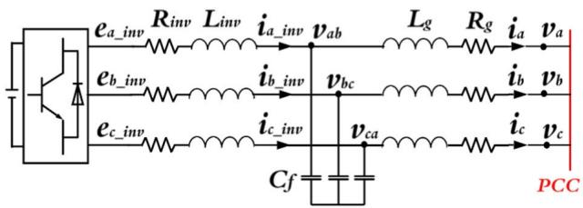  
FIGURE 3. Schematic of a grid-connected converter (LCL filter) [26], [27].

The impedances of the inverter-side inductor are given by $Z _ { i n \nu } = R _ { i n \nu } + j \omega _ { s } L _ { i n \nu }$ , the impedance of the PCC-side inductor by $Z _ { g } = R _ { g } + j \omega _ { s } L _ { g } ,$ , and the reactance of the filter capacitor by $X _ { c } = 1 / ( \omega _ { s } C )$ . Neglecting the internal resistance of the filter, the stable current flow into the AC network can be determined from equations (5) to (6) as follows:

$$
\vec {I} _ {P C C} = \frac {\vec {E} _ {i n v} - \vec {V} _ {P C C} \left(1 - \frac {X _ {i n v}}{X _ {c}}\right)}{j \left(X _ {i n v} + X _ {g} - \frac {X _ {i n v} X _ {g}}{X _ {c}}\right)} = \frac {\vec {E} _ {i n v} - \vec {V} _ {P C C \_ F}}{j X _ {F}} \tag {5}
$$

$\begin{array} { r c l } { X _ { F } } & { = } & { X _ { i n \nu } + X _ { g } - \frac { X _ { i n \nu } X _ { g } } { X _ { c } } } \end{array}$ , and referen $\begin{array} { r l } { \vec { V } _ { P C C \_ F } } & { { } = } \end{array}$ $\begin{array} { r } { \vec { V } _ { P C C } \left( 1 - \frac { X _ { i n \nu } } { X _ { c } } \right) } \end{array}$ $\vec { V } _ { P C C }$ $\vec { E } _ { i n \nu } = \dot { E } _ { i n \nu } \angle \delta _ { i n \nu }$ , Then, the current at PCC can be expressed as follows:

$$
\vec {I} _ {P C C} = \frac {E _ {\text {i n v}} \sin \delta_ {\text {i n v}}}{X _ {F}} - j \frac {E _ {\text {i n v}} \cos \delta_ {\text {i n v}} - V _ {P C C \_ F}}{X _ {F}} \tag {6}
$$

Consequently, the complex power formula enables the calculation of the power transferred from the GFM inverter to the AC network at the PCC. $P _ { P C C } + j Q _ { P C C } = \vec { V } _ { P C C } \vec { I } _ { P C C } ^ { * } =$ $V _ { P C C } \vec { I } _ { P C C } ^ { * }$ , as follows

$$
\begin{array}{l} P _ {P C C} = V _ {P C C} \frac {E _ {i n v} \sin \delta_ {i n v}}{X _ {F}} \approx \frac {V _ {P C C} E _ {i n v}}{X _ {F}} \delta_ {i n v} (7a) \\ Q _ {P C C} = V _ {P C C} \frac {E _ {i n v} \cos \delta_ {i n v} - V _ {P C C \_ F}}{X _ {F}} \\ \approx V _ {P C C} \frac {E _ {\text {i n v}} - V _ {P C C \_ F}}{X _ {F}} (7b) \\ \end{array}
$$

Similarly, using the characteristic equations for LC-filter GFM inverter’s $X _ { F } = X _ { i n \nu }$ and $\begin{array} { r } { \vec { V } _ { P C C _ { - } F } = \vec { V } _ { P C C } \left( 1 - \frac { X _ { i n v } } { X _ { c } } \right) } \end{array}$ and the L-filter GFM inverter’s $X _ { F } = X _ { i n \nu }$ and $\vec { V } _ { P C C \_ F } =$ $\vec { V } _ { P C C }$ , one can establish analogous active and reactive power equations. Control over the active power delivered by the inverter to the AC network can be managed by adjusting the phase angle or frequency of the output voltage, as described

in (7a). For GFM inverters utilizing L-filter, LC-filter, and LCL-filters, adjustments to the reactive power delivered to the AC network are achievable by regulating the voltage output by the inverter, as described in (7b).

# III. METHODOLOGY FOR DETERMINING THE PQ CAPABILITY CHART

The permissible power range of an inverter, constrained by its physical limitations (such as the rated power/current and PWM saturation), is defined by the inverter’s PQ capability area. Effective control of a GFM inverter is crucial to ensure it operates within this PQ capability range. Consequently, the power commands issued to the inverter controller must not exceed this designated area to maintain the inverter’s safe and dependable functionality.

# A. ASSESSING PQ CAPABILITY BASED ON RATED POWER/CURRENT RESTRICTIONS

Take that the GFM inverter’s perceived power is $S _ { r a t e d }$ . Under the nominal PCC voltage conditions, the power commands provided to the inverter controller have to satisfy the following equation:

$$
\sqrt {\left(P _ {P C C} ^ {*}\right) ^ {2} + \left(Q _ {P C C} ^ {*}\right) ^ {2}} \leq S _ {r a t e d} \tag {8a}
$$

By using (8a), the permissible active $P _ { P C C } ^ { * }$ and reactive $Q _ { P C C } ^ { * }$ power commands can be calculated as follows:

$$
P _ {P C C} ^ {*} = \frac {S _ {\text {r a t e d}}}{\sqrt {1 + \left(\frac {Q _ {P C C}}{P _ {P C C}}\right) ^ {2}}} \tag {8b}
$$

$$
Q _ {P C C} ^ {*} = \sqrt {\left(S _ {\text {r a t e d}}\right) ^ {2} - \left(P _ {P C C}\right) ^ {2}} \tag {8c}
$$

However, if the voltage at the PCC changes from the nominal voltage, equation (8) will not be sufficient to calculate the PQ capacity. For instance, during a low-voltage ride-through scenario, the actual voltage at the PCC can be substantially lower than the nominal voltage. As a result, the PQ capability that is calculated by (8) will result in a significantly higher current than the inverter’s rated current. To minimize overcurrent issues, the PQ capacity of an inverter should be calculated based on the current rating instead of the power rating.

$$
\left| \vec {I} _ {P C C} \right| \leq I _ {\text {r a t e d}} \tag {9a}
$$

If the actual PCC voltage varies from the nominal, adjust the PQ capability by (9a) instead of power ratings to avoid overcurrent conditions. For adjusting voltage conditions according to (9a), the active power $( P _ { a c t u a l } )$ and reactive power $( Q _ { a c t u a l } )$ can be adjusted PQ capability.

$$
P _ {\text {a c t u a l}} = P _ {P C C} ^ {*} \left(\frac {V _ {\text {a c t u a l}}}{V _ {\text {n o m i n a l}}}\right) \tag {9b}
$$

$$
Q _ {\text {a c t u a l}} = Q _ {P C C} ^ {*} \left(\frac {V _ {\text {a c t u a l}}}{V _ {\text {n o m i n a l}}}\right) \tag {9c}
$$

# B. ANALYZING THE PQ CAPABILITY UNDER PWM SATURATION LIMITS

In addition to the rated current limitation, a GFM inverter’s power output at the PCC is constrained by the PWM saturation limit. Commonly, two PWM strategies are employed: Sinusoidal PWM and Space Vector PWM [26]. The output terminal voltage of the inverter must conform to the following equation to comply with these constraints:

$$
\left| \vec {E} _ {\text {i n v}} \right| \leq E _ {\text {m a x}} \tag {10}
$$

where $E _ { m a x }$ is 3V dc√ for SPWM and $\frac { \sqrt { 3 } V _ { d c } } { 2 \sqrt { 2 } }$ $\frac { V _ { d c } } { \sqrt { 2 } }$ for SVPWM. There-2 2 2 fore, the allowable PQ capability region at any given PCC voltage, considering the PWM saturation restriction, can be determined.

To accurately determine the inverter’s PQ capability region, these constraints must be thoroughly analyzed and combined.

First, the rated current constraint establishes a circular boundary within which the inverter can safely operate without exceeding its maximum current rating. This constraint is directly related to the inverter’s rated current $( I _ { r a t e d } )$ and the voltage at the point of common coupling (PCC).

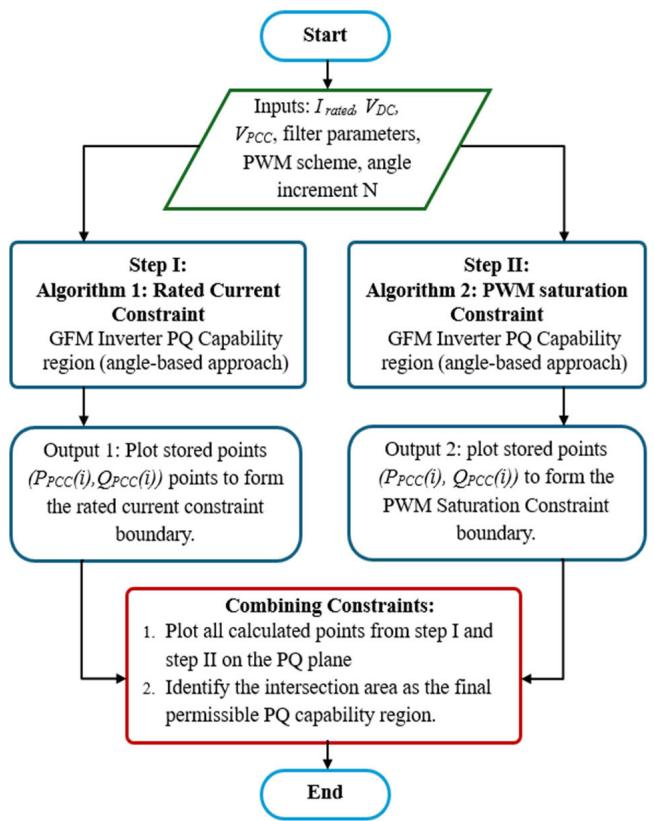  
FIGURE 4. Flowchart for assessing PQ capability of GFM inverters.

Second, the PWM saturation constraint is shaped by inverter output voltages, DC-link voltage, selected PWM scheme (SPWM or SVPWM), and coupling filter parameters. This constraint generates a boundary reflecting the

inverter’s voltage limitations. The intersection of these two boundaries, the rated current constraint and the PWM saturation–constraint defines the permissible PQ capability region for reliable operation. A detailed step-by-step algorithm for computing the PQ capability region is provided explicitly in Appendix A.

# C. ANALYZING THE PQ CAPABILITY UNDER NOMINAL CONDITIONS

The nominal values for the parameters are as follows. 1) The GFM inverter has a 100 kVA rated power. 2) The voltage of the dc-link is 1500V. 3) The rms voltage of the PCC line is 690V at 60Hz. 4) The inductance and resistance of the inductor for the L filter are 4mH and 0.012, respectively [26]. 5) The capacitance for the LC filter is 25µF, while the inductor stays the same. 6) The LCL filter has the same capacitance, 2 mH of inductance, and 0.006  of resistance for both the grid-side and inverter-side inductors. The maximum amount of power that can be delivered during a faulty state is reflected in the short-circuit MVA $( S _ { s c } )$ at the inverter output point. It is computed using the inverter circuit’s impedance and maximum current capacity. The short-circuit current, $I _ { s c }$ can be approximated by [26] and [27]:

$$
I _ {s c} = \left(\frac {V _ {L L \_ r m s}}{Z}\right) \tag {11a}
$$

where $\mathrm { V _ { L L , r m s } }$ is the line-line rms voltage of the PCC line.

The short-circuit MVA, $S _ { s c }$ is then calculated by the following equation:

$$
S _ {s c} = \sqrt {3} \times V _ {r m s} \times I _ {s c} \tag {11b}
$$

Consequently, the short-circuit MVA (SSC ) at the Inverter output terminal is calculated to be 316 kVA. The analysis of PQ capability is expressed in per unit (p.u.) terms, based on the nominal PCC voltage and the inverter’s rated power as the reference values.

For SPWM, the maximum inverter output voltage, $E _ { m a x }$ is 1.33 p.u., while for SVPWM, it increases to 1.53 p.u. Following this, the PQ capability diagrams are outlined as shown in Fig. 5. These diagrams feature a central circle, designated as the Rated Current Circle (RIC) and other additional circles marked as PWMLCL, PWMLC, and PWML that represent the PWM saturation limits for the inverter when utilizing L-filter, LC-filter, and LCL-filters respectively. Notably, in Fig. 5, the circles for PWM constraints overlap across all filter types, which is primarily due to the capacitors in the LCL and LC filters, which are tasked mainly with harmonic filtering. The defined PQ capability region is the intersection of these circles, detailing the operational envelope limited by PWM saturation. Fig. 5 shows the following observations:

1) At nominal conditions, the PQ capability area differs significantly from industry-standard inverter PQ capability charts and synchronous generators.   
2) The GFM inverter with SVPWM has a bigger PQ capability area than the SPWM inverter, demonstrating that

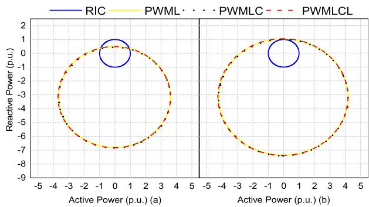  
FIGURE 5. PQ capability region at nominal conditions for (a) SPWM (b) SVPWM.

SVPWM enhances PQ capacity even without increasing the cost or size of the inverter system.

# D. PQ CAPABILITY WITH VARYING PCC AND DC-LINK VOLTAGES

Under real-world conditions, variations in PCC voltage and changes in DC-link voltage led to dynamic shifts in PQ capability. Fig. 6 illustrates a PQ capability analysis considering fluctuations in both PCC and DC-link voltages. Due to minimal differences among LCL, LC, and L filters,

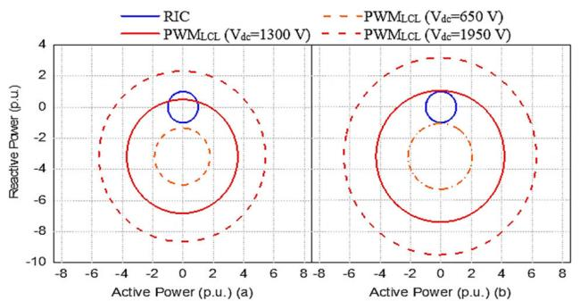

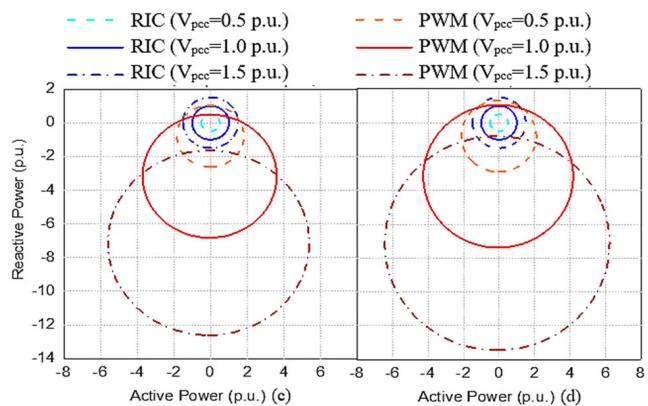  
FIGURE 6. With the DC-link voltage held constant, the Rated Current Circle (RIC) expands in the PQ plane as the PCC for diverse DC-link and PCC voltage, P-Q capability regions utilizing SPWM (a & c) and SVPWM (b & d).

This section focuses solely on results using the GFM inverter with an LCL filter. Key observations from Fig. 6 include:

1) voltage rises and contracts as the PCC voltage falls, as shown in Fig. 6(c) and 6(d).   
2) Maintaining a constant DC-link voltage, the PWM saturation constraint circle expands in the PQ plane as the PCC voltage increases, and it contracts when the PCC voltage decreases, as depicted in Fig. 6(c) and 6(d).   
3) The greater the DC-link voltage, the larger the permissible PQ capability region, as depicted in Fig. 6(a) and 6(b). Consequently, a lower DC-link voltage might limit the inverter’s active and reactive power capabilities. However, higher DC-link voltages can lead to increased inverter costs.

The ultimate PQ capability region, which defines the allowable operating boundaries for the inverter, is determined by the intersection of the results from the rated current and PWM saturation constraints.

# IV. CONTROL AND OPERATION OF A GFM INVERTER

# A. FUNDAMENTAL DROOP REGULATION (FDR) STRATEGY

Two standard control topologies for a grid-forming (GFM) inverter, including configurations with and without a current control loop are widely used. Research suggests that for islanding applications of grid-forming inverters, the topology without a current control loop offers greater reliability [9], [10]. This methodology is utilized in this study to assess the performance of the GFM inverter. The employed control strategy was developed under the Consortium for Electric Reliability Technology Solutions (CERTS) Microgrid program [29] and adheres to the principles outlined in (7). Over the past 15 years, this strategy has undergone rigorous testing at the CERTS, substantiating its effectiveness [29], [30], [31], [32]. The control scheme incorporates two droop control strategies: P–f droop and Q–V droop, which are defined by the subsequent mathematical formulations:

$$
f _ {i} ^ {k} = f _ {s e t} + m _ {p i} \left(P _ {s e t \_ i} ^ {k} - P _ {i} ^ {k}\right) \tag {12a}
$$

$$
V _ {i} ^ {k} = V _ {\text {s e t}} + m _ {q i} \left(Q _ {\text {s e t} _ {- i}} ^ {k} - Q _ {i} ^ {k}\right) \tag {12b}
$$

Here, $f _ { i } ^ { k }$ represents the reference frequency for the $i ^ { t h }$ inverter’s output voltage during the $k ^ { t h }$ time interval, with $f _ { s e t }$ as the nominal frequency. The coefficient $m _ { p i }$ represents the frequency droop factor. The terms Pkset_i, Pki refer to the $P _ { s e t \_ i } ^ { k } , P _ { i } ^ { k }$ target and actual measured active power of the $i ^ { t h }$ inverter for the $k ^ { t h }$ interval, respectively. Based on (12b), $V _ { i } ^ { k }$ indicates the target PCC voltage for the $i ^ { t h }$ inverter in the $\dot { k } ^ { t h }$ interval, $V _ { s e t }$ is the nominal PCC voltage, and $m _ { q i }$ is the voltage droop coefficient. $\boldsymbol { Q } _ { s e t i } ^ { k } , \boldsymbol { Q } _ { i } ^ { k }$ Q set _i, Q are the target and actual measured reactive power of the $i ^ { t h }$ inverter, respectively.

$$
m _ {p i} = \left(\frac {\Delta f _ {i} ^ {k}}{P _ {\text {m a x} _ {i}} ^ {k}}\right) \tag {12c}
$$

$$
m _ {q i} = \left(\frac {\Delta V _ {i} ^ {k}}{Q _ {\text {m a x} - i} ^ {k}}\right) \tag {12d}
$$

where, $P _ { m a x \_ i } ^ { k }$ and $Q _ { m a x \_ i } ^ { k } ,$ and $\Delta f _ { i } ^ { k }$ and $\Delta V _ { i } ^ { k }$ represent the maximum permissible frequency and voltage deviations for the $i ^ { t h }$ inverter’s output voltage within the $k ^ { \hat { t } h }$ interval.

Fig. 7 illustrates a conventional droop control strategy in which increases in frequency (f ) and voltage (V ) correspond to decreases in active and reactive power, respectively. This relationship is depicted through linear droop characteristics, as demonstrated in Fig. 7. Specifically, Fig. 7(a) highlights a positive relationship between real power and frequency, while Fig. 7(b) reveals both positive and negative relationships among voltage magnitude and reactive power.

The droop control for frequency-power $( P \mathrm { - } f )$ is set at 1%, which defines the operational frequency range from $f _ { m a x \_ i }$ (at no active power output) to $f _ { m i n \_ i }$ (at maximum active power output) that is shown in Fig. 7(a). Similarly, the voltage-reactive power (q-V ) droop is set at 3%, which dictates that the voltage at the PCC bus in the microgrid can vary between $V _ { m a x }$ (when the inverter is delivering full inductive power) and $V _ { m i n }$ (when it is supplying full capacitive power) that is depicted in Fig. 7(b).

Although this work uses conventional P–f and Q–V droop control for GFM inverter operation, alternative approaches such as non-linear and adaptive droop methods have been proposed in the literature to enhance power-sharing performance [33]. While this study focuses on traditional droop-based control and enhanced voltage regulation strategies, future research will explore the integration of virtual inertia control, as proposed in [34] and [35], to further improve frequency response in low-inertia grid conditions.

# B. ENHANCED VOLTAGE REGULATION (EVR) STRATEGY

The overall control configuration of the grid-forming (GFM) inverter with enhanced voltage regulation topology is shown in Fig. 8. The controller modulates the AC system voltage in response to changes in frequency and voltage amplitude, adhering to the $P { \ - } f$ and $Q – V$ droop control strategies. Stability of the PCC voltage amplitude is achieved through an inner Proportional-Integral (PI) controller. This PI controller incorporates a saturation mechanism to prevent the integral term from exceeding the GFM inverter’s maximum allowable output voltage.

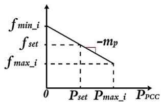  
(a)

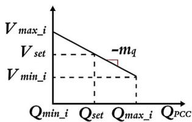  
(b)   
FIGURE 7. (a) P-f droop (b) q-V droop for GFM inverter.

Key parameters for the $P { \ - } f$ droop include the droop coefficient $( m _ { p } )$ , the active power set point $( P _ { s e t } )$ , the rated frequency $( f _ { s e t } )$ , and the angle δ, derived from the angular

frequency ω. The Q–V droop is designed to minimize reactive power circulation among grid-forming inverters by maintaining a predefined voltage magnitude using droop characteristics. The grid-side voltage $( V _ { m } )$ , regulated through an integral controller characterized by the droop coefficient $( m _ { q } )$ , voltage set point $( V _ { s e t } )$ , and PI controller. Despite load variations, $V _ { m }$ remains stable, facilitated by the reactance of the LCL filter, which curtails the circulation of reactive power.

In the control system illustrated in Fig. 8, the computation for active and reactive power $( p$ and $q )$ , and voltage magnitude $V _ { m a g }$ in the $\alpha \beta$ stationary reference frame are determined using measurements of the PCC voltage $( \nu _ { p c c } ^ { a b c } )$ and the current at PCC $( i _ { p c c } ^ { a b c } )$ [10]. The transformation from abc to $\alpha \beta$ is achieved using the following Clarke transformation:

$$
\left[ \begin{array}{l} v _ {\alpha} \\ v _ {\beta} \end{array} \right] = \frac {2}{3} \left[ \begin{array}{c c c} 1 & - \frac {1}{2} & - \frac {1}{2} \\ 0 & \frac {\sqrt {3}}{2} & - \frac {\sqrt {3}}{2} \end{array} \right] \left[ \begin{array}{l} v _ {p c c} ^ {a} \\ v _ {p c c} ^ {b} \\ v _ {p c c} ^ {c} \end{array} \right] \tag {13a}
$$

$$
\left[ \begin{array}{l} i _ {\alpha} \\ i _ {\beta} \end{array} \right] = \frac {2}{3} \left[ \begin{array}{c c c} 1 & - \frac {1}{2} & - \frac {1}{2} \\ & \sqrt {3} & - \frac {\sqrt {3}}{2} \end{array} \right] \left[ \begin{array}{l} i _ {p c c} ^ {a} \\ i _ {p c c} ^ {b} \\ i _ {p c c} ^ {c} \end{array} \right] \tag {13b}
$$

Here, $\nu _ { p c c } ^ { a } , \nu _ { p c c } ^ { b } , \nu _ { p c c } ^ { c } , i _ { p c c } ^ { a } , i _ { p c c } ^ { b } ,$ and $i _ { p c c } ^ { c }$ are the original phase voltage and current at PCC. Using the $\alpha \beta$ components, the instantaneous $p$ and q can be calculated as:

$$
p = \left[ \begin{array}{l l} v _ {\alpha} & v _ {\beta} \end{array} \right] \left[ \begin{array}{l} i _ {\alpha} \\ i _ {\beta} \end{array} \right] \tag {14a}
$$

$$
q = \left[ \begin{array}{l l} v _ {\alpha} & v _ {\beta} \end{array} \right] \left[ \begin{array}{c} i _ {\beta} \\ - i _ {\alpha} \end{array} \right] \tag {14b}
$$

$$
V _ {m a g} = \sqrt {\left(v _ {\alpha}\right) ^ {2} + \left(v _ {\beta}\right) ^ {2}} \tag {15}
$$

These measured values, $p , q ,$ and $V _ { m a g }$ undergo through low-pass filter to derive the fundamental components P, Q, and $V _ { m } ^ { * }$ . To generate the PWM signals for inverter control, the sinusoidal reference voltages for each phase are calculated using the amplitude $V _ { m }$ and phase angle δ of the controller output. The equations for each phase voltage are formalized as follows:

$$
V _ {r e f} ^ {a} = V _ {m} \cos (\delta) \tag {16a}
$$

$$
V _ {r e f} ^ {b} = V _ {m} \cos \left(\delta + \frac {4 \pi}{3}\right) \tag {16b}
$$

$$
V _ {r e f} ^ {c} = V _ {m} \cos \left(\delta + \frac {2 \pi}{3}\right) \tag {16c}
$$

These equations yield the reference voltages $V _ { r e f } ^ { a b c }$ Vref for the three-phase system, which are used to drive the PWM signals for the inverter. Single-loop droop control oversees both the load-side voltage and current, adjusting the internal voltage $V / \delta$ as a controllable source. It modulates the frequency $( f )$ and voltage (V ) based on the $P { \cdot } f$ and $q  – V$ droop controls, respectively. High-frequency switching introduces

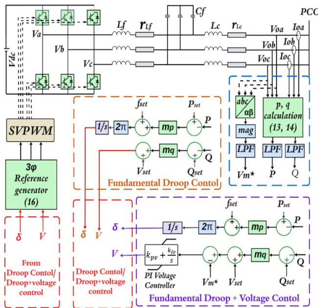  
FIGURE 8. Overall control configuration of a GFM inverter.

harmonics in the inverter voltage, which are mitigated by the LCL filter.

The required active and reactive powers (P and Q) are typically generated by the AGC (automatic generation control) system of a larger AC network and issued to different distributed generation (DG) units, including the GFM inverters. However, under the droop control shown in Fig. 7, the actual inverter output power at the PCC could be different from the desired active and reactive power settings and the actual PQ capability of the GFM inverter at the PCC could also be affected by the system conditions, both of which would cause abnormal operation of a GFM inverter.

# V. EMT SIMULATION RESULTS

# A. SIMULATION SETUP

A detailed simulation evaluation is done using MATLAB Simulink for analyzing the performance of GFM with distinct load, diverse filtering mechanisms, and in parallel with GFL. The parameters used for this analysis are tabulated in Table 1.

# B. SIMULATION RESULTS

This study assesses inverter performance against IEEE 1547 criteria, particularly focusing on THD limits for voltage and current, as well as voltage and frequency stability during disturbances. As shown in simulation and hardware results $( \mathrm { e . g . }$ , Table 2, Fig. 9–16), the system consistently operates within these prescribed limits, supporting compliance with industry standards.

# 1) GFM INVERTER OPERATION WITHIN MAXIMUM PQCAPABILITY LIMITS

This subsection conducts an in-depth examination of Grid-Forming (GFM) inverter performance, specifically evaluating

TABLE 1. Parameters for GFM analysis.   

<table><tr><td>Parameters</td><td>Simulation</td><td>Experiment</td></tr><tr><td>RMS reference voltage, VLL-rms</td><td>690 V</td><td>120 V</td></tr><tr><td>DC link Voltage, VDC</td><td>1500 V</td><td>240 V</td></tr><tr><td>Nominal Frequency, f</td><td>60 Hz</td><td>60 Hz</td></tr><tr><td>Switching frequency</td><td>9 kHz</td><td>7 kHz</td></tr><tr><td>Rated apparent power</td><td>100 kVA</td><td>0.5 kVA</td></tr><tr><td>LCL Filter Inductance (Lf)</td><td>2.0 mH</td><td>2.0 mH</td></tr><tr><td>LCL Filter Inductance (Lc)</td><td>2.0 mH</td><td>2.0 mH</td></tr><tr><td>LCL Filter Capacitance (Cf)</td><td>25 μF</td><td>5 μF</td></tr><tr><td>Line inductance, Lline</td><td>0.7mH</td><td>0.7mH</td></tr><tr><td>Line resistance, Rline</td><td>0.3 Ω</td><td>0.3 Ω</td></tr><tr><td colspan="3">GFM and GFL Parameters</td></tr><tr><td>Frequency droop coefficient (mp)</td><td>6 x 10-6</td><td>6 x 10-6</td></tr><tr><td>Voltage droop coefficient (mq)</td><td>2.07 x 10-4</td><td>2.07 x 10-4</td></tr><tr><td>Voltage controlled PI gain, kpv, kiv</td><td>0.1, 50</td><td>0.1, 20</td></tr><tr><td>GFL Outer power loop, kpo, kio</td><td>0.0031, 0.034</td><td>0.0031, 0.034</td></tr><tr><td>GFL Inner current loop, kpi, kii</td><td>3.5, 1000</td><td>1, 1000</td></tr></table>

its control strategies under diverse operational scenarios while maintaining operations within maximum permissible PQ capability limits. The analysis focuses on two prominent control strategies: Fundamental Droop Regulation (FDR) and Enhanced Voltage Regulation (EVR), utilizing controlled and uncontrolled Proportional-Integral (PI) droop methodologies. The simulations are systematically structured to include comprehensive scenarios, spanning various load types and dynamic load variations.

Case 1 (Resistive Load Changes): The initial analysis involves assessing GFM inverter performance under incremental resistive load adjustments, designed to evaluate voltage stability, frequency control, and dynamic responsiveness. Loads were systematically increased every 0.5 seconds, increasing from 25 kW up to a maximum of 100 kW in steps of 25 kW. Results, as illustrated in Figs. 9(a)-(d) indicate that the EVR strategy significantly outperforms the FDR strategy, providing superior voltage and frequency regulation. Voltage deviations remained consistently within ±5% of nominal–values across all loading conditions, demonstrating robust voltage stabilization. Although minor transient voltage dips were observed during load transitions from lower to higher values, the EVR controller promptly restored voltage levels within a few milliseconds, thus verifying its effectiveness in managing sudden load variations and maintaining high-quality power delivery.

Case 2 (Inductive Load Variations): This analysis investigates the capability of the GFM inverter to manage reactive power by evaluating its performance under inductive load scenarios with varying power factors. Specifically, the study applies inductive load conditions sequentially: first, a 0.6 lagging power factor load (P=60 kW, Q=80 kVAR), followed by a unity power factor load (P=100 kW), and finally a 0.9 lagging power factor load (P=80 kW, Q=43.59 kVAR). The primary goal of this scenario is to identify the optimal reactive power droop coefficient by assessing the system’s tolerance to reactive power variations.

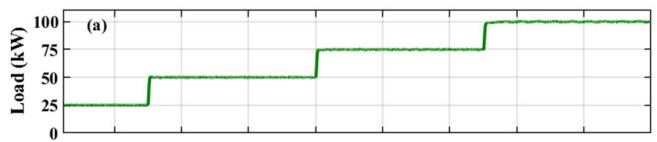

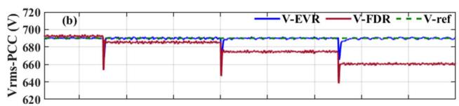

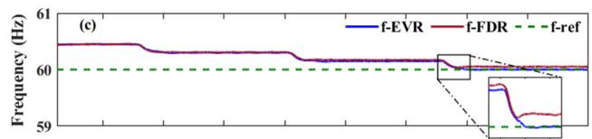

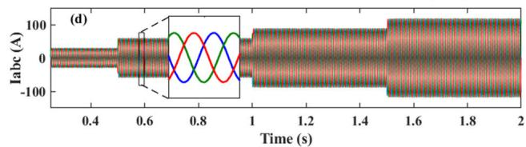  
FIGURE 9. System response to resistive load change: a) load change, b) voltage variation for resistive load change, c) frequency deviation, d) GFM current response.

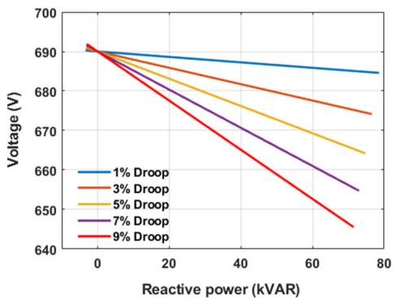  
FIGURE 10. Q-V curve characteristics for reactive load handling.

As depicted in Fig. 10, the Q-V characteristic curve provides a detailed perspective, facilitating the selection of an effective droop coefficient. Simulation results presented in Figs. 11(a)-(b) reveal that a higher reactive droop coefficient allows quicker stabilization following disturbances, but at the expense of greater steady-state voltage deviation. Conversely, a lower reactive droop coefficient results in reduced overshoot, better voltage regulation, and improved steady-state stability. Among the evaluated droop coefficients, a 3% q-V droop demonstrates optimal performance, maintaining voltage within the ±5% tolerance limit, efficiently handling reactive power fluctuations, and ensuring rapid recovery after transient disturbances. Notably, transient voltage dips occurring during transitions from unity power factor loads to 0.9 lagging power factor loads (Fig. 11(a)) are quickly resolved, highlighting the robust reactive power control capability of the GFM inverter.

Frequency regulation remains consistently stable across all evaluated droop coefficients, as shown in Fig. 11(b), affirming reliable frequency stability irrespective of reactive droop variations.

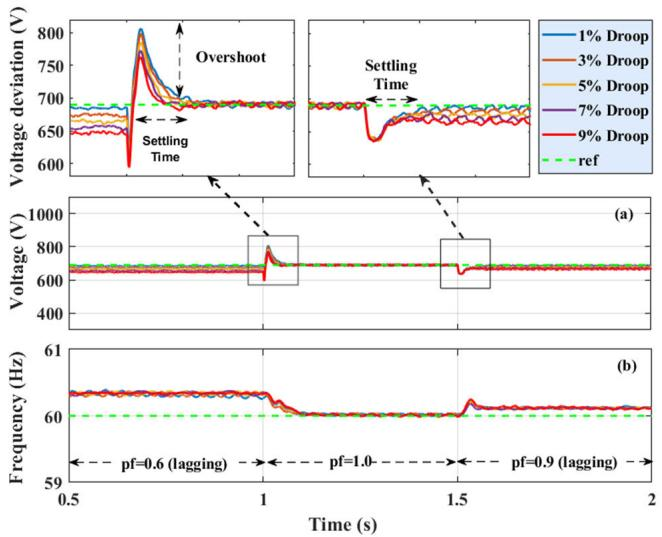  
FIGURE 11. System Response to Inductive Load Variations under EVR Strategy for different q-V droop coefficients that shows voltage deviation for inductive load change.

Case 3 (Capacitive Load Adjustments): The third scenario examines system performance under varying capacitive loads to assess voltage stability and power quality. The simulation considered sequential transitions between loads at power factors of 0.6 leading, unity leading, and 0.9 leading, as illustrated in Fig. 12(a). Results indicate minor voltage deviations, approximately 3%, when supplying capacitive loads with lower power factors, as shown in Fig. 12(b).

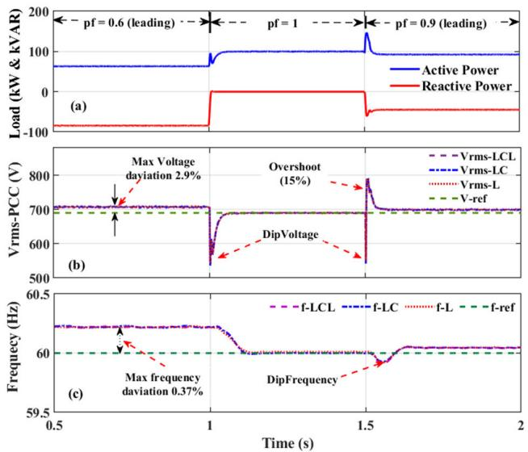  
FIGURE 12. Voltage Stability during Capacitive Load Fluctuations under EVR Strategy for three distinct filter L, LC, LCL.

A notable transient voltage dip occurred when transitioning from capacitive to purely resistive loads at rated

power. Across filter configurations (L, LC, and LCL), the LC filter exhibited slightly higher voltage fluctuations. A sudden capacitive load reconnection caused a transient overshoot of approximately 15%, still within IEEE recommended thresholds. The EVR strategy exhibited superior voltage regulation and rapid recovery, effectively mitigating transient over-voltage scenarios. Maximum voltage deviations were limited to approximately 2.9%, and frequency deviations were restricted to 0.37%, underscoring the robustness of the EVR strategy in maintaining voltage and frequency stability despite capacitive load disturbances.

Case 4 (Stochastic Load Changes): This scenario evaluated the performance of the GFM inverter under stochastic load variations, characterized by 10% random variability every 0.125 seconds, generated using a Gaussian random number generator. This test emulated real-world unpredictable load dynamics to assess the inverter’s adaptive capabilities. Fig. 13(a) illustrates active power responses to random load fluctuations. The EVR strategy demonstrated excellent performance, maintaining stable voltage and frequency regulation well within IEEE standards. Fig. 13(b) presents the corresponding voltage and frequency stability responses, highlighting the strategy’s capability to swiftly counteract rapid, random load variations. Furthermore, Fig. 13(c) displays minimal Total Harmonic Distortion (THD) in the load current, verifying high-quality power output and effective harmonic suppression. Overall, the EVR strategy showed superior control effectiveness, exhibiting minimal variability in power output, thereby confirming its suitability for highly dynamic load environments.

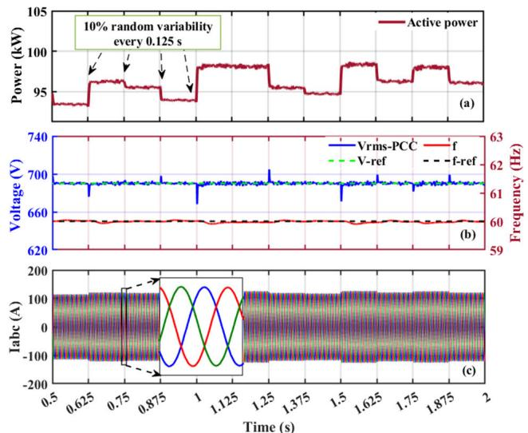  
FIGURE 13. Comparative power response to stochastic load variability.

# 2) ANALYSIS OF A GRID FORMING INVERTER WITH FILTER CHARACTERISTICS

This analysis evaluates the performance characteristics of a Grid-Forming (GFM) inverter under various load conditions (resistive, inductive, capacitive, and stochastic), using both

LC and LCL filters. While this study primarily focuses on overall voltage and current behavior under different filter and load conditions, the role of filter capacitors (in LC and LCL configurations) in shaping dynamic performance is critical. Although capacitor bank responses—such as voltage ripple and transient charging/discharging effects—were not analyzed in isolation, their effects are inherently reflected in the observed inverter voltage stability and harmonic filtering. A dedicated analysis of capacitor behavior under diverse operating scenarios will be considered in future work. Droop control parameters are fixed at 1% for frequency (P–f) and 3% for voltage (Q–V), relative to the inverter’s rated base. Comparative results are shown in Table 2.

The Total Harmonic Distortion (THD) of voltage and current varies significantly depending on the load type and level. At lighter load conditions, THD tends to be higher due to reduced current magnitude, which weakens the damping effect of the filter and diminishes harmonic attenuation. This phenomenon is well-documented in both Grid-Forming (GFM) and Grid-Following (GFL) inverters.

For instance, under capacitive low loading, the current THD was measured at 5.17% with an LC filter, primarily due to resonant interactions that amplify lower-order harmonics, particularly the 3rd, 5th, and 7th harmonics.

At higher load levels, harmonic suppression improves as the inverter operates closer to its rated power. In this regime, the feedback control action strengthens, and the internal voltage saturation mechanisms help mitigate excessive switching-related harmonics. As a result, THD remains consistently low, typically under 1% for both LC and LCL filters.

TABLE 2. Voltage and current THDs at the PCC for a GFM inverter fundamental filters.   

<table><tr><td colspan="2">Load Scenario</td><td colspan="2">Current THD (%)</td><td colspan="2">Voltage THD (%)</td><td>IEEE-1547 limits THD (%)</td></tr><tr><td colspan="2">Filter type</td><td>LC</td><td>LCL</td><td>LC</td><td>LCL</td><td></td></tr><tr><td colspan="2">Low Resistive Load (25% of rated power)</td><td>4.97</td><td>4.51</td><td>4.97</td><td>4.51</td><td>&lt; 5%</td></tr><tr><td colspan="2">High Resistive load (Rated power)</td><td>0.38</td><td>0.49</td><td>0.38</td><td>0.49</td><td>&lt; 5%</td></tr><tr><td colspan="2">Low Inductive Load (pf=0.6 lagging)</td><td>4.71</td><td>4.33</td><td>4.64</td><td>4.21</td><td>&lt; 5%</td></tr><tr><td colspan="2">High Inductive Load (pf=0.9 lagging)</td><td>0.61</td><td>0.69</td><td>0.60</td><td>0.81</td><td>&lt; 5%</td></tr><tr><td colspan="2">Low Capacitive Load (pf=0.6 leading)</td><td>5.17</td><td>4.40</td><td>4.06</td><td>3.95</td><td>&lt; 5%</td></tr><tr><td colspan="2">High capacitive Load (pf=0.9 leading)</td><td>0.56</td><td>0.56</td><td>0.41</td><td>0.38</td><td>&lt; 5%</td></tr><tr><td colspan="2">Stochastic Load (rated) (10% Random Variability)</td><td>&lt; 1%</td><td>&lt; 1%</td><td>&lt; 1%</td><td>&lt; 1%</td><td>&lt; 5%</td></tr><tr><td rowspan="3">GFM with GFL (GFM Dominates)</td><td>GFM</td><td>2.04</td><td>1.44</td><td>0.99</td><td>1.07</td><td>&lt; 5%</td></tr><tr><td>GFL</td><td>7.93</td><td>3.78</td><td>0.99</td><td>1.07</td><td>&lt; 5%</td></tr><tr><td>Load</td><td>0.99</td><td>1.73</td><td>0.99</td><td>1.07</td><td>&lt; 5%</td></tr><tr><td rowspan="3">GFM with GFL (GFL Dominates)</td><td>GFM</td><td>5.34</td><td>4.13</td><td>3.80</td><td>3.24</td><td>&lt; 5%</td></tr><tr><td>GFL</td><td>4.71</td><td>4.02</td><td>3.80</td><td>3.24</td><td>&lt; 5%</td></tr><tr><td>Load</td><td>3.80</td><td>3.67</td><td>3.80</td><td>3.24</td><td>&lt; 5%</td></tr></table>

When operating in parallel with a GFL inverter, harmonic interactions become more complex. For LC filters, the GFL

inverter’s current THD reached 8% when the GFM inverter dominated the load, largely due to the insufficient filtering of switching harmonics and the lack of dynamic harmonic sharing. Conversely, when the GFL inverter dominated, the GFM inverter’s current THD increased to 5.34%, primarily due to mismatched control strategies and weak harmonic suppression at light loads.

In contrast, LCL filters demonstrate superior harmonic suppression across all load conditions and operating modes. The harmonic spectrum consistently meets IEEE-1547 limits, with dominant harmonics significantly attenuated regardless of load profile or inverter dominance. This highlights the effectiveness of LCL filters in microgrids with mixed inverter types. The accompanying Figs. in Appendix B (Figs. 22–24) illustrate the impact of load level on current THD, clearly demonstrating the differences between low and high loading conditions.

# 3) FAULT ANALYSIS AND SYSTEM RECOVERY

This section analyzes the performance of the Grid-Forming (GFM) inverter under conditions where it operates beyond its rated PQ capability region, evaluating its fault response and recovery capabilities. Three distinct scenarios—single-phase to ground asymmetrical fault (L-G), symmetrical three-phase fault (L-L-L-G), and prolonged overload conditions—were thoroughly examined using two inverter control strategies: Controlled PI Droop (CPID) and Uncontrolled PI Droop (UPID).

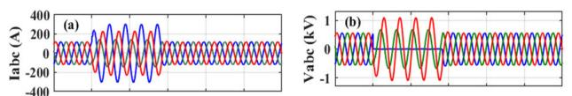

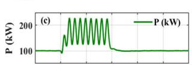

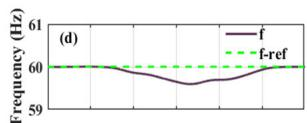

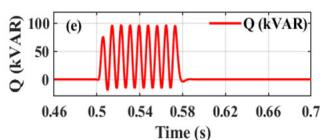

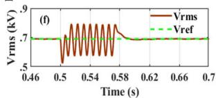  
FIGURE 14. L-G fault (asymmetrical) impact and recovery comparisons.

Case 1 (L-G Fault (Asymmetrical Fault): An asymmetrical single-phase-to-ground fault was simulated at 0.5 seconds, lasting for a duration of 0.0667 seconds (equivalent to 4 cycles). Figs. 14(a)-(b) depict the fault conditions clearly. During the fault period, the GFM inverter responded by injecting reactive power (as shown in Fig. 14(e)) to mitigate the voltage disturbance. Significant transient voltage fluctuations and frequency deviations occurred during the fault event. However, post-fault clearance, the Enhanced Voltage Regulation (EVR) strategy demonstrated remarkable performance by rapidly restoring both voltage and frequency back to nominal conditions within milliseconds (as indicated in Figs. 14(d) and 14(f)). This highlights the robust

fault-handling and quick recovery capabilities of the GFM inverter under asymmetrical fault conditions.

Case 2 [L-L-L-G (Symmetrical) Fault]: A symmetrical three-phase-to-ground (L-L-L-G) fault was introduced at 0.5 seconds, as illustrated in Figs. 15(a)-(b). The inverter system’s response was analyzed using both CPID and UPID control strategies. Following fault clearance, both strategies attempted to restore voltage and frequency to nominal levels. Observations from Fig. 15(c) indicate a significant injection of reactive power post-fault to stabilize voltage and frequency. The CPID strategy effectively limited frequency deviations to within an acceptable threshold (59.9 Hz), enabling faster stabilization and continuous power supply. Conversely, UPID experienced a more pronounced frequency drop to approximately 59.5 Hz (as shown in Fig. 15(d)).

Post-clearance, charged filter components released substantial current into the network, leading to transient voltage spikes. Notably, UPID exhibited excessive voltage spikes nearly twice the nominal voltage. CPID effectively controlled these transients, maintaining safe voltage levels and immediately supplying stable power post-clearance, thus illustrating superior fault-handling performance.

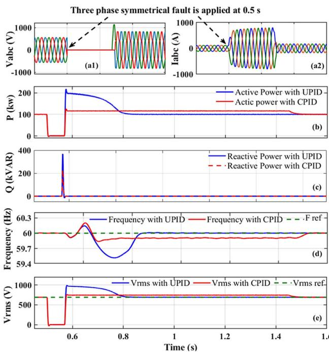  
FIGURE 15. LLL-G (symmetrical) fault impact and recovery comparison.

Case 3 [Overload Conditions (Beyond PQ Capability)]: This scenario investigates the GFM inverter’s response under prolonged overload conditions exceeding its nominal PQ capability. An overload of approximately 60% above rated power was introduced at 0.5 seconds and sustained for 0.25 seconds. Fig. 16 details the system’s response during this condition. Without PI droop control (UPID), the inverter experienced excessive current surges (Fig. 16(d)), potentially triggering protective mechanisms. In contrast, the CPID

strategy effectively maintained operation along the PWM saturation boundary, delivering power to the load while limiting voltage deviations to within acceptable Q–V droop control bounds (Fig. 16(b)). When the load reverted to within the PQ capability region at 0.75 seconds, both strategies allowed gradual restoration to nominal operation. This demonstrates that the CPID control strategy significantly enhances the inverter’s resilience and operational stability even under sustained overload conditions.

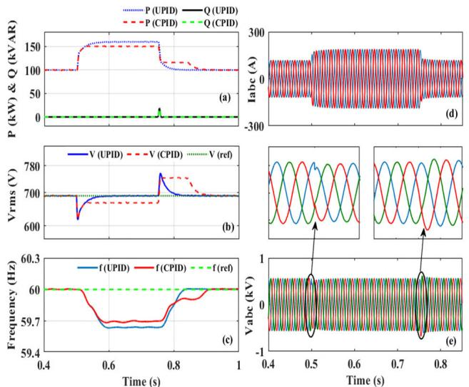  
FIGURE 16. GFM inverter operation beyond the PQ capability region: a) Active and reactive power, b) frequency, c) line voltage, and d) RMS current at the PCC.

# 4) PARALLEL OPERATION OF AN ISLANDED GFM AND GFL INVERTER

This section investigates the combined performance of Grid-Forming (GFM) and Grid-Following (GFL) inverters operating in parallel within an islanded microgrid scenario. Fig. 17 shows a single line diagram of GFM and GFL inverters operating in parallel. Both inverter types utilize LCL filters, although the study notes adaptability to LC filter configurations. The two inverters share identical ratings in terms of capacity and line voltage. The GFM inverter’s primary objective is to ensure stable voltage regulation at the Point of Common Coupling (PCC) while maintaining minimal total harmonic distortion (THD). In contrast, the GFL inverter focuses on precise current regulation at the PCC, similarly targeting minimal current THD. Integrating the GFL inverter introduces additional complexity due to its influence on both fundamental and harmonic currents, potentially affecting the voltage quality and stability managed by the GFM inverter.

Operational dynamics are detailed in Figs. 18(a)-(f), where both inverters supply power to a purely resistive load via LCL filters. Initially, from 0 to 1 second, the GFM inverter exclusively powers the load, achieving stable PCC voltage and current with excellent power quality. At 1 second, the GFL inverter is introduced without initially contributing

power, resulting in minor circulating currents that introduce slight distortions in the PCC voltage and current waveforms. At 1.5 seconds, as the GFL inverter begins contributing active power (with the GFM inverter still dominant), distortions in voltage and current waveforms increase, especially notable when alternative filters (L or LC) are utilized. At 2.0 seconds, with the GFL inverter dominating load supply, distortions further increase, exceeding 4% for both voltage and current. Despite these challenges, the Controlled PI Droop (CPID) method successfully maintains voltage and frequency regulation within acceptable standards.

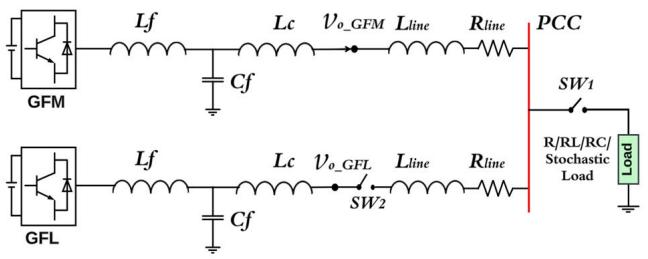  
FIGURE 17. Sigle line diagram of GFM and GFL inverters operating in parallel.

Fig. 19 presents a detailed transient response analysis upon the introduction of the GFL inverter. Initial voltage overshoot from the GFL inverter is quickly stabilized, matching the GFM inverter’s reference voltage level, and readying it to supply the load. Frequency fluctuations were briefly observed upon GFL integration, stabilizing within approximately 0.2 seconds as the inverter synchronized with the GFM inverter’s operational frequency. These results, alongside data from Figs. 18 and 19, and summarized in Table 2, underscore the critical importance of proper filter selection and advanced control strategies to mitigate harmonic and stability issues inherent in hybrid GFM-GFL inverter configurations.

# VI. HARDWARE EXPERIMENT EVALUATION

# A. EXPERIMENT SETUP

To validate the theoretical models discussed in Section IV, a practical experimental setup was constructed, as depicted in Fig. 20, replicating the GFM and GFL system configuration shown in Fig. 17. This setup comprises several critical components configured to facilitate dual inverter operations:

1) DC Power Supplies: Two units provide the necessary power input for the inverters.   
2) LabVolt 3-phase IGBT Converters: Employed in both GFM and GFL systems to convert DC power into AC power.   
3) LCL Filters: Each system utilizes two LabVolt 3-phase LC filters combined to form LCL configurations, crucial for minimizing voltage and current harmonics.   
4) dSPACE DS1103 Controllers: These real-time controllers are solely responsible for managing the operation of the inverters, ensuring precise control over

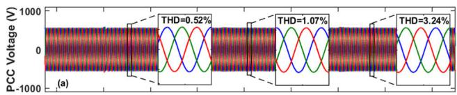

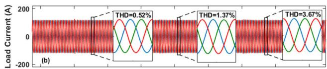

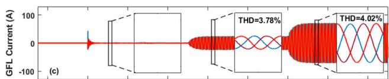

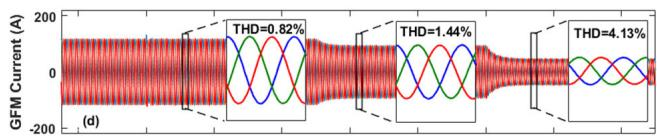

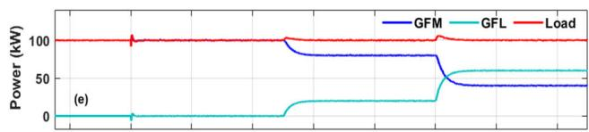

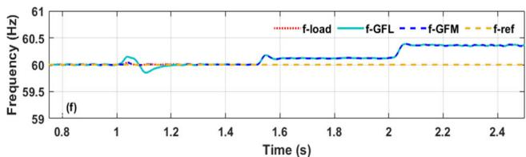  
FIGURE 18. Distribution of RL Load Supply Between GFM and GFL Inverters. The output waveforms display (a) load distribution, (b) PCC voltage (c) load current. GFM inverter current, (c) total load current, and (d) GFL inverter current.

power conversion processes. They compute and execute control algorithms based on real-time data inputs.

5) OPAL-RT OP8660 Data Acquisition System: Employed exclusively for high-speed, high-resolution data acquisition. It captures the real-time voltage and current signals at the Point of Common Coupling (PCC) and provides these critical inputs to the DS1103 controllers. This setup allows the controllers to access accurate and up-to-date information, enhancing the control accuracy and system response to dynamic changes.

The experimental setup is designed to simulate a microgrid system with a resistive (R) load. The line voltage at the Point of Common Coupling (PCC) is maintained at 120V rms, while the DC supply voltage is set at 240V. This hands-on approach provides a direct assessment of the inverter systems’ performance under controlled laboratory conditions.

# B. EXPERIMENT EVALUATION

This subsection presents experimental validation of the parallel operation of Grid-Forming (GFM) and Grid-Following (GFL) inverters, as illustrated in Figs. 14(a)-(f). The

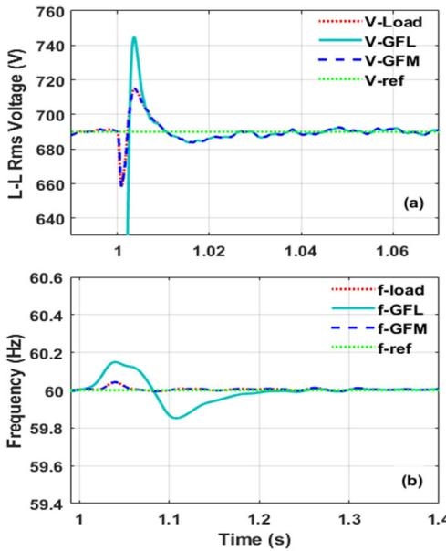  
FIGURE 19. Transient response of the voltage and frequency when GFL is connected to GFM to supply the load.

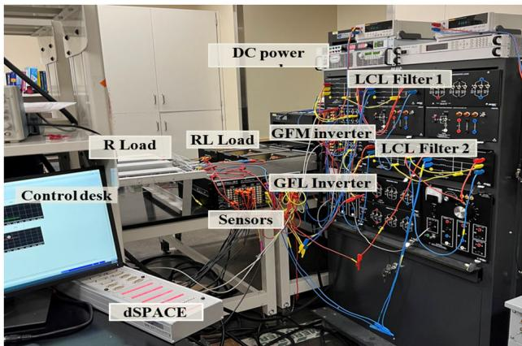  
FIGURE 20. Experiment setup of a GFM and GFL system supplying an R load.

experimental setup involved both inverter systems managing active and reactive power flow to a purely resistive load of 50 ohms. Initially, the GFM inverter exclusively powered the load, ensuring stable and distortion-free voltage and load current up to 7.5 seconds. At 7.5 seconds, the GFL inverter was integrated into the system without initially contributing any power, resulting in minor disturbances and circulating currents between the two inverters, as shown in Fig. 14(c).

To examine the system’s dynamic performance, the GFL inverter’s load contribution was incrementally increased— first to approximately 20% of rated power at 13.2 seconds, and subsequently to around 57% at 22.5 seconds. Results indicated that the system maintained excellent power quality while the GFM inverter dominated the load supply. However, as the GFL inverter’s contribution increased and began to dominate the load, noticeable voltage and current distortions emerged. Additionally, a minor frequency rise was observed during active power contribution from the GFL inverter;

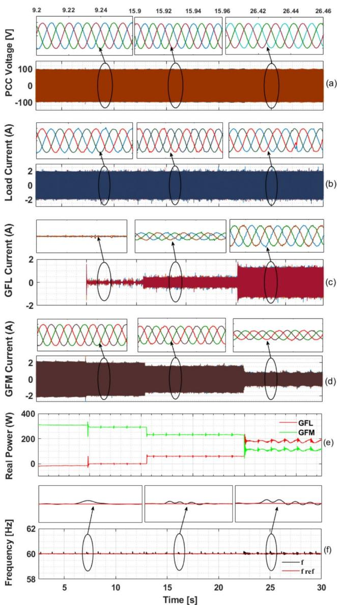  
FIGURE 21. Experimental results demonstrate the performance of GFM and GFL systems powering an R load. (a) Voltage at the PCC, (b) Load current, (c) GFL inverter current, (d) GFM inverter current, (e) Output of active and reactive power, (f) Frequency responses observed.

nevertheless, the droop control mechanism rapidly restored frequency stability, as illustrated in Fig. 14(f).

Overall, these experimental outcomes confirm that while integrating GFM and GFL inverters equipped with LCL filters effectively maintains stable voltage and frequency within rated current and PWM saturation constraints, higher contributions from GFL inverters can compromise power quality. This highlights the necessity for balanced inverter roles and careful tuning of control parameters to ensure system integrity and optimal performance in practical microgrid applications.

# VII. CONCLUSION

This paper presents a detailed exploration of grid-forming (GFM) inverter technology, with a particular focus on PQ capability modeling, algorithmic development, and

performance evaluation of GFM inverters under a wide range of operational conditions. A key insight of this work is the significant deviation of GFM inverter PQ capability regions from conventional industry standards due to inherent constraints such as PWM saturation and rated current limits. The proposed Enhanced Voltage Regulation (EVR) and Controlled Proportional-Integral Droop (CPID) strategies outperformed traditional droop control methods by offering markedly improved voltage and frequency stability under dynamic loading and fault scenarios.

Moreover, the study demonstrated that LCL filters deliver superior harmonic suppression, especially in hybrid systems where GFM inverters operate alongside grid-following (GFL) inverters. The robustness and effectiveness of the proposed approaches were validated through EMT simulation and real-time hardware experiments, confirming their practical viability.

Future research will explore adaptive and non-linear droop control strategies to further improve power-sharing accuracy and system stability. Integration of virtual inertia mechanisms will also be investigated to enhance frequency response in low-inertia grids. These efforts will support the resilient and scalable deployment of GFM inverters in future inverter-dominated power systems.

# APPENDIX A

Detailed Algorithm for Determining PQ Capability Region of GFM Inverters: The algorithm for determining the PQ capability region of a GFM inverter, explicitly incorporating rated current and PWM saturation constraints, is detailed step-by-step below.

# Inputs:

• Rated inverter current: $I _ { r a t e d }$   
• DC-link voltage: $V _ { D C }$   
• PCC voltage: $V _ { P C C }$ (complex phasor representation)   
• Coupling filter parameters: $L _ { i n \nu } , R _ { i n \nu } , L g , R _ { g } , C _ { f }$   
• PWM type: SPWM or SVPWM   
• Number of sampling points: $\mathrm { ~ N ~ } ( \mathrm { e . g . , N { = } 1 0 0 } )$

# I. Rated Current Constraint

1. Initialize angle increment:

$$
\Delta \delta_ {i n v} = \frac {3 6 0 ^ {\circ}}{N}, \quad \text {i n i t i l i z e} \delta_ {i n v} = 0 ^ {\circ}
$$

2. For each angle increment $i = 1 , 2 \dots , N ;$

a. Calculate the inverter current components:

$$
I _ {P C C \_ r e a l} (i) = I _ {r a t e d} \times \cos (\delta_ {i n v})
$$

$$
I _ {P C C \_ i m a g} (i) = I _ {r a t e d} \times \sin \left(\delta_ {i n v}\right)
$$

b. Determine the complex inverter current at PCC:

$$
I _ {P C C} (i) = I _ {P C C \_ r e a l} (i) + j \times I _ {P C C \_ i m a g} (i)
$$

c. Compute complex power at PCC explicitly:

$$
\begin{array}{l} S _ {P C C} (i) = P _ {P C C} (i) + j \times Q _ {P C C} (i) \\ = V _ {P C C} \times I _ {P C C} ^ {*} \\ \end{array}
$$

d. Thus explicitly:

$$
P _ {P C C} (i) = \operatorname {R e} \left(S _ {P C C} (i)\right)
$$

$$
Q _ {P C C} (i) = \operatorname {I m} \left(S _ {P C C} (i)\right)
$$

e. Store calculated power points (PPCC (i) , QPCC (i))   
f. Increment angle explicitly:

$$
\delta_ {i n v} = \delta_ {i n v} + \Delta \delta_ {i n v}
$$

3. After covering $\delta _ { i n \nu }$ from $0 ^ { \circ }$ to $3 6 0 ^ { \circ }$ , plot all stored $( P r c c \left( i \right) , Q _ { P C C } \left( i \right) )$ points to form the Rated Current Constraint boundary.

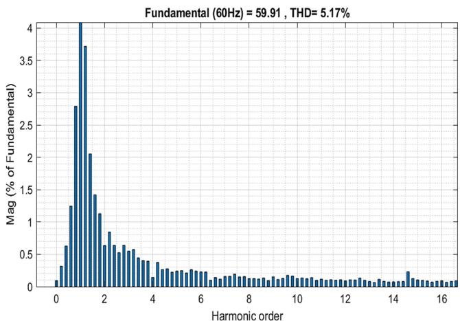

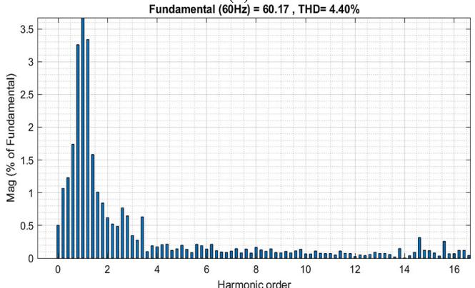  
（a）  
  
FIGURE 22. Harmonic spectrum of GFM inverter current under low capacitive load a) LC filter) b) LCL filter.

# II. PWM Saturation Constraint

1. Set maximum inverter output voltage $E _ { m a x } \mathrm { : }$

$$
E _ {m a x} = \left\{ \begin{array}{l l} \frac {\sqrt {3} V _ {d c}}{2 \sqrt {2}}, & \text {f o r S P W M} \\ \frac {V _ {d c}}{\sqrt {2}}, & \text {f o r S V P W M} \end{array} \right.
$$

2. Compute filter node voltage $V _ { P C C \_ F }$ based on Section II-B:

$$
V _ {P C C \_ F} = V _ {P C C} \left(1 - \frac {X _ {i n v}}{X _ {c}}\right)
$$

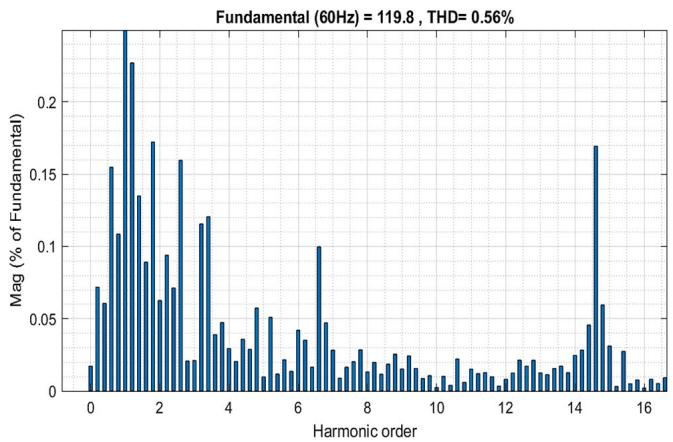

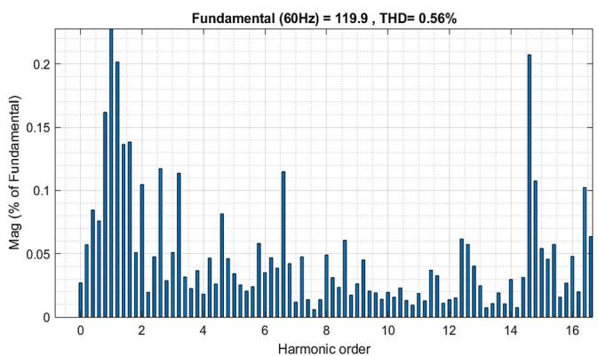  
(a)   
(b)   
FIGURE 23. Harmonic spectrum of GFM inverter current under high capacitive load a) LC filter) b) LCL filter.

3. Set inverter angle increment:

$$
\Delta \delta_ {i n v} = \frac {3 6 0 ^ {\circ}}{N}, \quad \text {i n i t i l i z e} \delta_ {i n v} = 0 ^ {\circ}
$$

4. For $i = 1 , 2 \dots , N ;$ :

a. Compute inverter output voltage components:

$$
E _ {i n v \_ r e a l} (i) = E _ {m a x} \times \cos (\delta_ {i n v})
$$

$$
E _ {i n v \_ i m a g} (i) = E _ {m a x} \times \sin (\delta_ {i n v})
$$

b. Determine complex inverter output voltage:

$$
E _ {i n v} (i) = E _ {i n v \_ r e a l} (i) + j \times E _ {i n v \_ i m a g} (i)
$$

d. Compute inverter current at PCC based (5):

$$
I _ {P C C} (i) = \frac {E _ {\text {i n v}} (i) - V _ {P C C \_ F}}{Z _ {\text {t o t a l}}}
$$

e. Calculate active and reactive power at PCC:

$$
\begin{array}{l} S _ {P C C} (i) = P _ {P C C} (i) + j \times Q _ {P C C} (i) \\ = V _ {P C C} \times I _ {P C C} ^ {*} \\ \end{array}
$$

f. Thus explicitly:

$$
P _ {P C C} (i) = \operatorname {R e} \left(S _ {P C C} (i)\right)
$$

$$
Q _ {P C C} (i) = \operatorname {I m} \left(S _ {P C C} (i)\right)
$$

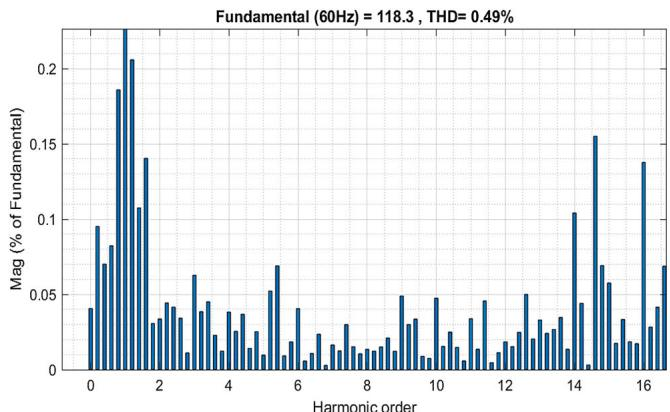

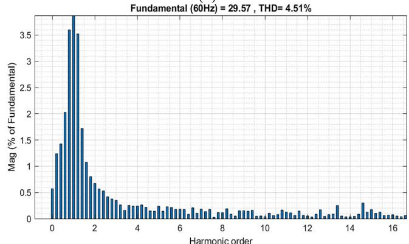  
  
  
FIGURE 24. Harmonic spectrum of GFM inverter current under resistive load: a) rated load, b) 25% of the rated load.

g. Store $( P r c c \left( i \right) , Q _ { P C C } \left( i \right) )$ points for plotting.

h. Increment $\delta _ { i n \nu }$ angle:

$$
\delta_ {i n v} = \delta_ {i n v} + \Delta \delta_ {i n v}
$$

5. After looping through $0 ^ { \circ }$ to 360◦, plot stored points to form the PWM Saturation Constraint boundary.

# APPENDIX B

Harmonic Spectrum and FFT Analysis: This appendix presents the FFT analysis of current waveforms under different loading conditions and filter configurations to support the THD results discussed in the main text. The harmonic spectrum highlights the dominant harmonic orders and demonstrates the filtering effectiveness of LC and LCL filters.

# ACKNOWLEDGMENT

This paper was originally drafted by all the authors of the paper, encompassing all sections and content. For enhancements in language quality, grammatical accuracy, and overall presentation, the manuscript was subsequently revised and rewritten using the AI tool, ChatGPT by OpenAI. All AI-assisted revisions were meticulously reviewed, modified, and validated by the author to ensure adherence to scholarly standards and the submission guidelines of IEEE Access. This acknowledgment aligns with IEEE guidelines regarding the disclosure of AI tool usage in manuscript preparation.

# REFERENCES

[1] J. Matevosyan, B. Badrzadeh, T. Prevost, E. Quitmann, D. Ramasubramanian, H. Urdal, S. Achilles, J. MacDowell, S. H. Huang, V. Vital, J. O’Sullivan, and R. Quint, ‘‘Grid-forming inverters: Are they the key for high renewable penetration?’’ IEEE Power Energy Mag., vol. 17, no. 6, pp. 89–98, Nov. 2019, doi: 10.1109/MPE.2019.2933072.   
[2] H. Zhang, W. Xiang, W. Lin, and J. Wen, ‘‘Grid forming converters in renewable energy sources dominated power grid: Control strategy, stability, application, and challenges,’’ J. Modern Power Syst. Clean Energy, vol. 9, no. 6, pp. 1239–1256, Nov. 2021, doi: 10.35833/MPCE.2021.000257.   
[3] J. D. Watson, Y. Ojo, K. Laib, and I. Lestas, ‘‘A scalable control design for grid-forming inverters in microgrids,’’ IEEE Trans. Smart Grid, vol. 12, no. 6, pp. 4726–4739, Nov. 2021, doi: 10.1109/TSG.2021.3105730.   
[4] P. Kundur, N. J. Balu, and M. G. Lauby, Power System Stability and Control. New York, NY, USA: McGraw-Hill, 1994.   
[5] D. B. Rathnayake, M. Akrami, C. Phurailatpam, S. P. Me, S. Hadavi, G. Jayasinghe, S. Zabihi, and B. Bahrani, ‘‘Grid forming inverter modeling, control, and applications,’’ IEEE Access, vol. 9, pp. 114781–114807, 2021, doi: 10.1109/ACCESS.2021.3104617.   
[6] R. H. Lasseter, Z. Chen, and D. Pattabiraman, ‘‘Grid-forming inverters: A critical asset for the power grid,’’ IEEE J. Emerg. Sel. Topics Power Electron., vol. 8, no. 2, pp. 925–935, Jun. 2020, doi: 10.1109/JESTPE.2019.2959271.   
[7] N. Mohan, Advanced Electric Drives: Analysis, Control, and Modeling Using MATLAB/Simulink, 1st ed., Hoboken, NJ, USA: Wiley, Aug. 2014, pp. 1–208.   
[8] M. E. Elkhatib, W. Du, and R. H. Lasseter, ‘‘Evaluation of inverterbased grid frequency support using frequency-watt and grid-forming PV inverters,’’ in Proc. IEEE Power Energy Soc. Gen. Meeting (PESGM), Aug. 2018, pp. 1–5, doi: 10.1109/PESGM.2018.8585958.   
[9] P. J. Hart, J. Goldman, R. H. Lasseter, and T. M. Jahns, ‘‘Impact of harmonics and unbalance on the dynamics of grid-forming, frequencydroop-controlled inverters,’’ IEEE J. Emerg. Sel. Topics Power Electron., vol. 8, no. 2, pp. 976–990, Jun. 2020, doi: 10.1109/JESTPE.2019. 2949303.   
[10] W. Du, Z. Chen, K. P. Schneider, R. H. Lasseter, S. P. Nandanoori, F. K. Tuffner, and S. Kundu, ‘‘A comparative study of two widely used grid-forming droop controls on microgrid small-signal stability,’’ IEEE J. Emerg. Sel. Topics Power Electron., vol. 8, no. 2, pp. 963–975, Jun. 2020, doi: 10.1109/JESTPE.2019.2942491.   
[11] B. Lu, S. Li, H. S. Das, Y. Gao, J. Wang, and M. Baggu, ‘‘Dynamic P-Q capability and abnormal operation analysis of a wind turbine with doubly fed induction generator,’’ IEEE J. Emerg. Sel. Topics Power Electron., vol. 10, no. 4, pp. 4854–4864, Aug. 2022, doi: 10.1109/JESTPE.2021.3133527.   
[12] N. E. Nilsson and J. Mercurio, ‘‘Synchronous generator capability curve testing and evaluation,’’ IEEE Trans. Power Del., vol. 9, no. 1, pp. 414–424, Jan. 1994, doi: 10.1109/61.277713.   
[13] Nat. Renew. Energy Lab. (2017). Smart Inverters: Applications in Power Systems (NREL/TP-5D00-68612). [Online]. Available: https://www.nrel.gov/grid/ieee-standard-1547/assets/pdfs/smart-invertersapplications-in-power-systems.pdf   
[14] Sandia Nat. Laboratories. (2012). Reactive Power Requirements for PV and Wind Generators [SAND2012-1098]. [Online]. Available: https://energy.sandia.gov/wp-content/gallery/uploads/Reactive-Power-Requirements-for-PV-and-Wind-SAND2012-1098.pdf   
[15] ERCOT. (2019). Inverter-Based Resource (IBR) Workshop. [Online]. Available: http://ercot.com/content/wcm/key_documents_lists/176763/ ERCOT_IBR_Workshop_April_25_2019.pdf   
[16] NERC. (2018). Reliability Guideline BPS-Connected Inverter-Based Resource Performance. [Online]. Available: https://www.nerc.com/ comm/OC_Reliability_Guidelines_DL/Inverter_Based_Resource_ Performance_Guideline.pdf   
[17] M. Ivas, A. Marušić, J. G. Havelka, and I. Kuzle, ‘‘P-Q capability chart analysis of multi-inverter photovoltaic power plant connected to medium voltage grid,’’ Int. J. Elect. Power Energy Syst., vol. 116, Mar. 2020, Art. no. 105521, doi: 10.1016/j.ijepes.2019.105521.   
[18] California Public Utilities Commission. (2016). Smart Inverter Working Group (SIWG) Working Document. [Online]. Available: https://www.cpuc.ca.gov/-/media/cpuc-website/divisions/energy-division/ documents/rule21/smart-inverter-working-group/siwgworking docinrecord.pdf

[19] National Renewable Energy Laboratory. (2022). Technical Analysis of Ground Fault Detection Techniques for Inverter-Based Distributed Energy Resources. [Online]. Available: https://www.nrel. gov/docs/fy22osti/81104.pdf   
[20] B. Vega, C. Rahmann, R. Álvarez, and V. Vittal, ‘‘Determination of control requirements to impose on CIG for ensuring frequency stability of low inertia power systems,’’ IEEE Access, vol. 10, pp. 44891–44908, 2022, doi: 10.1109/ACCESS.2022.3169489.   
[21] Z. Li, C. Zang, P. Zeng, H. Yu, S. Li, and J. Bian, ‘‘Control of a gridforming inverter based on sliding-mode and mixed H2/H∞ control,’’ IEEE Trans. Ind. Electron., vol. 64, no. 5, pp. 3862–3872, May 2017, doi: 10.1109/TIE.2016.2636798.   
[22] L. Thurner, A. Scheidler, F. Schafer, J.-H. Menke, J. Dollichon, F. Meier, S. Meinecke, and M. Braun, ‘‘Pandapower—An open-source Python tool for convenient modeling, analysis, and optimization of electric power systems,’’ IEEE Trans. Power Syst., vol. 33, no. 6, pp. 6510–6521, Nov. 2018, doi: 10.1109/TPWRS.2018.2829021.   
[23] S. M. Mohiuddin and J. Qi, ‘‘A unified droop-free distributed secondary control for grid-following and grid-forming inverters in AC microgrids,’’ in Proc. IEEE Power Energy Soc. Gen. Meeting (PESGM), Montreal, QC, Canada, Aug. 2020, pp. 1–5, doi: 10.1109/PESGM41954.2020. 9282042.   
[24] C. Kammer, S. D’Arco, A. G. Endegnanew, and A. Karimi, ‘‘Convex optimization-based control design for parallel grid-connected inverters,’’ IEEE Trans. Power Electron., vol. 34, no. 7, pp. 6048–6061, Jul. 2019.   
[25] W. Zhou, N. Mohammed, and B. Bahrani, ‘‘Comprehensive modeling, analysis, and comparison of state-space and admittance models of PLLbased grid-following inverters considering different outer control modes,’’ IEEE Access, vol. 10, pp. 30109–30146, 2022.   
[26] M. Nurunnabi, S. Li, H. Mondal, Y.-K. Hong, M. Choi, and H. Won, ‘‘Performance evolution of combined grid-forming and grid-following inverters with different filtering mechanisms,’’ in Proc. 11th Int. Conf. Power Electron. ECCE Asia (ICPE - ECCE Asia), May 2023, pp. 1012–1017.   
[27] Z. Afshar, M. M. Zadeh, and S. M. T. Bathaee, ‘‘Sliding mode control of grid-connected inverters using inverter output current,’’ in Proc. IEEE Int. Conf. Environ. Electr. Eng. IEEE Ind. Commercial Power Syst. Eur. (EEEIC/I&CPS Eur.), Jun. 2019, pp. 1–5.   
[28] H. S. Das, S. Li, B. Lu, J. Wang, S. Rahman, and X. Fu, ‘‘Exploring dynamic P-Q capability and abnormal operations of inverter-based resources,’’ IEEE J. Emerg. Sel. Topics Power Electron., vol. 12, no. 2, pp. 1608–1618, Apr. 2024.   
[29] J. H. Eto, R. Lasseter, D. Klapp, A. Khalsa, B. Schenkman, M. Illindala, and S. Baktiono, ‘‘The CERTS microgrid concept, as demonstrated at the CERTS/AEP microgrid test bed,’’ Lawrence Berkeley Nat. Lab., Tech. Rep. LBNL-2001119, Sep. 2018.   
[30] E. Alegria, T. Brown, E. Minear, and R. H. Lasseter, ‘‘CERTS microgrid demonstration with large-scale energy storage and renewable generation,’’ IEEE Trans. Smart Grid, vol. 5, no. 2, pp. 937–943, Mar. 2014, doi: 10.1109/TSG.2013.2286575.   
[31] R. Panora, J. E. Gehret, M. M. Furse, and R. H. Lasseter, ‘‘Realworld performance of a CERTS microgrid in Manhattan,’’ IEEE Trans. Sustain. Energy, vol. 5, no. 4, pp. 1356–1360, Oct. 2014, doi: 10.1109/TSTE.2014.2301953.   
[32] W. Du, Q. Jiang, M. J. Erickson, and R. H. Lasseter, ‘‘Voltagesource control of PV inverter in a CERTS microgrid,’’ IEEE Trans. Power Del., vol. 29, no. 4, pp. 1726–1734, Aug. 2014, doi: 10.1109/TPWRD.2014.2302313.   
[33] Z. Afshar, M. Mollayousefi, S. M. T. Bathaee, M. T. Bina, and G. B. Gharehpetian, ‘‘A novel accurate power sharing method versus droop control in autonomous microgrids with critical loads,’’ IEEE Access, vol. 7, pp. 89466–89474, 2019, doi: 10.1109/ACCESS.2019. 2927265.   
[34] Z. Afshar, M. M. Zadeh, S. M. T. Bathaee, and G. B. Gharehpetian, ‘‘Primary and secondary frequency control of low-inertia microgrids with battery energy storage and intermittent renewable energy resources,’’ in Proc. 11th Power Electron., Drive Syst., Technol. Conf. (PEDSTC), Tehran, Iran, Feb. 2020, pp. 1–6, doi: 10.1109/PEDSTC49159.2020. 9088470.   
[35] M. M. Zadeh, Z. Afshar, M. J. Harandi, and S. M. T. Bathaee, ‘‘Frequency control of low inertia microgids in presence of wind and solar units using fuzzy-neural controllers,’’ in Proc. 26th Int. Electr. Power Distribution Conf. (EPDC), Tehran, Iran, May 2022, pp. 54–59, doi: 10.1109/EPDC56235.2022.9817192.

MD NURUNNABI received the B.Sc. degree from the Department of Electrical and Electronic Engineering, Rajshahi University of Engineering and Technology, and the M.S. degree from the Department of Electrical and Electronic Engineering, Khulna University of Engineering and Technology. He is currently pursuing the Ph.D. degree with the Department of Electrical and Computer Engineering, The University of Alabama, Tuscaloosa, AL, USA. During his career, he com-

pleted an internship at Phase Technology, Rapid City, SD, USA, where he worked on industry-level inverter projects using TI microcontrollers. He has published several journal and conference papers throughout his journey and volunteers as a reviewer for several prestigious journals. His research interests include grid-forming inverters, renewable energy technology, and the integration of inverter-based resources into the grid.

HIMADRY SHEKHAR DAS (Student Member, IEEE) received the B.Sc. degree from the Department of Electrical and Electronic Engineering, Ahsanullah University of Science and Technology (AUST), Dhaka, Bangladesh, in 2010, and the M.Phil. degree from the School of Electrical Engineering, Universiti Teknologi Malaysia, Johor Bahru, Malaysia, in 2018. He is currently pursuing the Ph.D. degree with the Department of Electrical and Computer Engineering, The University of

Alabama, Tuscaloosa, AL, USA. He has published over 20 journal and conference papers and volunteers as a reviewer for several prestigious journals. His research focuses on power electronics, renewable energy, electric vehicles, and the grid integration of inverter-based resources.

SHUHUI LI (Senior Member, IEEE) received the B.S. and M.S. degrees in electrical engineering from Southwest Jiaotong University, Chengdu, China, in 1983 and 1988, respectively, and the Ph.D. degree in electrical engineering from Texas Tech University, Lubbock, TX, USA, in 1999. From 1988 to 1995, he was at the School of Electrical Engineering, Southwest Jiaotong University, where he conducted research on electrified trains, power electronics, power systems, and power sys-

tem harmonics. Between 1995 and 1999, he conducted research on wind power, artificial neural networks, and huge parallel processing applications. In 1999, he began as an Assistant Professor at Texas A&M University, Kingsville, TX, USA, and was promoted to an Associate Professor in 2003. In 2006, he joined The University of Alabama, Tuscaloosa, AL, USA, as an Associate Professor, and was later promoted to a Professor. His current research interests include renewable energy systems, power electronics, power systems, electric machines and drives, and the use of artificial neural networks in energy systems.