# 级联 H 桥型电力电子变压器的闭锁状态等效建模方法

丁江萍，高晨祥，许建中，赵成勇

(新能源电力系统国家重点实验室(华北电力大学), 北京市昌平区 102206)

# Research on Equivalent Modeling Method of Cascaded H-bridge Based PET Under Blocking State

DING Jiangping, GAO Chenxiang, XU Jianzhong, ZHAO Chengyong*

(State Key Laboratory of Alternate Electrical Power System With Renewable Energy Sources (North China Electric Power University), Changping District, Beijing 102206, China)

ABSTRACT: Power Electronic Transformer (PET) is the key equipment of future AC/DC hybrid power distribution network. One of the key difficulties for efficient simulation of PET's multiple working conditions is equivalent modelling under blocking state. This paper put forward an equivalent modeling method suitable for the blocking state of cascaded H-bridge based PET (CHB-PET). First, a practical example was used to explain the circuit characteristics of the blocking state. After the simplification, the Thévenin-Norton equivalent parameters in the partially blocking and totally blocking states were derived. Then, three implementation methods of the blocking equivalent model were analyzed, and an integrated method of sharing the state variable storage unit with the non-blocked model is proposed. A typical $10\mathrm{kV} / 3\mathrm{kV}$ three-phase CHB-PET system was built in PSCAD / EMTDC, and the blocking conditions during startup process, AC voltage sag, and DC fault were simulated. The results show that compared with the detailed model, the blocking methods proposed in this paper have sufficient simulation accuracy. The work in this paper can also provide a reference for the blocking modeling of other modular converters containing multi-stage power transformation.

KEY WORDS: cascaded H-bridge based power electronic transformer(CHB-PET); Thévenin/Norton equivalent modeling; blocking; electromagnetic transient; start-up; DC fault

摘要：电力电子变压器(power electronic transformer，PET)

是未来交直流混合配电网的关键设备，对其进行多工况高效仿真的一个关键难点为闭锁等效建模。该文提出一种适用于级联H桥型PET(cascaded H-bridge based PET，CHB-PET)闭锁状态的等效建模方法。首先，以一个实际算例说明闭锁状态的电路特征；其次，经过合理简化后，推导部分闭锁和完全闭锁状态下的戴维南-诺顿等效参数；然后，分析闭锁等效模型的3种实施方式，提出一种与非闭锁模型共用状态变量存储单元的集成方法；最后，在PSCAD/EMTDC软件中搭建典型的 $10\mathrm{kV} / 3\mathrm{kV}$ 三相CHB-PET系统，并进行启动、电压暂降及直流故障闭锁工况仿真。结果表明，与详细模型相比，所提闭锁等效模型具有足够的仿真精度。

关键词：级联H桥型电力电子变压器；戴维南/诺顿等效建模；闭锁；电磁暂态；启动；直流故障

# 0 引言

随着大量分散性、间歇性、随机性的分布式可再生能源发电并网，单端单源供电、电能单向流动的传统交流配网，正在向多端多源供电、电能多向流动的交直流混合配电网快速发展[1-2]。电力电子变压器(power electronic transformer，PET)，也称为固态变压器(solid state transformer，SST)，在完成传统工频变压器电压变换功能的同时，可以实现对系统中电压、电流的连续调节，综合控制以及智能管理等功能，是交直流混合配网实现电能互联共济的关键设备[3-5]。

PET的闭锁状态是一种非正常工作状态，用于启动预充电，或在严重的交直流故障下保护电力电子器件、子模块电容和高频变压器等[6-8]。PET的部分或全部的绝缘栅双极型晶体管(insulated gate

bipolar transistor, GBT)闭锁后立即关断, 而与 IGBT 反并联的续流二极管将构成不控的二极管网络。在闭锁阶段, PET 中的电容、电感和变压器等元件的储能状态会随着二极管的自然开断而发生变化, 对于储能元件充放电特性的正确模拟, 是 PET 闭锁状态电磁暂态精确仿真的关键。

PET的设计通常考虑是否为模块化结构和电能变换环节个数[9]。级联H桥型PET(cascadedH-bridge based PET，CHB-PET)以输入串联、输出并联(input-series-output-parallel，ISOP)的连接方式进行模块组合，子模块通常包含两级变换环节[10]。经归纳发现，级联H桥型PET具备“高频”、“隔离型”和“多模块”3个典型特征，其中，“高频”和“多模块”使其电磁暂态详细模型的仿真效率较低。基于节点拆分法或戴维南-诺顿定理的等效仿真模型可显著提升仿真效率[11-12]，但已有文献建立的PET等效模型均未考虑闭锁状态的开关支路等效方法，使其无法仿真闭锁阶段的暂态过程或从闭锁状态获得解闭锁后网络状态变量的初值。

为解决诸如二极管等自然开断器件等效为二值电阻时，可能引起的数值振荡问题，常用电磁暂态离线PSCAD/EMTDC仿真平台，采用步长回溯插值的方法以精确计算开关动作时刻[13]，现有的实时仿真器大多采用并联电阻电容(RC)阻尼电路的方法进行抑制[14-15]，可以较好地解决PET详细模型的闭锁仿真问题。然而，插值功能或阻尼电路难以直接与等效模型集成。文献0研究了模块化多电平换流器(modular multilevel converter，MMC)的闭锁处理方法，通过整合MMC子模块内的二极管以应用离线仿真平台的插值功能方法，与之相类似的还有文献[17]提出的级联型静止同步补偿器提速模型，但均只包含一级电能变换环节，未考虑通常为多级变换的PET结构。

本文在已建立非闭锁戴维南-诺顿等效模型的基础上，提出一种级联H桥型PET的闭锁状态等效建模及集成方法，在提升仿真效率的同时可计及多种闭锁工况。第1节简要介绍非闭锁状态的戴维南-诺顿等效电路获取方法；第2节提出了闭锁等效建模及与非闭锁电路的集成方法；第3节在PSCAD/EMTDC仿真平台中搭建 $10\mathrm{kV} / 3\mathrm{kV}$ 级联H桥型电力电子变压器测试系统，通过多个闭锁保护案例，对所提模型和详细模型进行仿真结果对比，以验证所提模型的精确性；第4节分析该等效模型

的适用性。

# 1 CHB-PET的戴维南-诺顿等效模型

# 1.1 拓扑结构

图1为三相Y接CHB-PET拓扑结果示意图，包含三级电能变换环节，即级联H桥(cascaded H-bridge，CHB)级、双有源桥变换器(dual active bridge，DAB)级和DC-AC级。CHB-PET的交流端口通过联接变压器与中压交流电网相连，CHB级和DAB级共同构成CHB-DAB相单元，各相的直流输出端口并联连接在直流母线上。通过直流母线汇集的电能通过DC-AC变换器连接低压交流电网，或供应直流负载。本文的建模对象为具有模块化结构的CHB-DAB相单元，不包含DC-AC级。由于三相具有完全相同的结构及参数，因此，本文将以A相为例进行分析。

CHB级采用多个H桥级联的连接形式，可实现交流侧多电平输出。DAB级包含2个全控H桥、1个高频变压器及附加电感 $L_{1}$ ，可实现功率的双向流动。单个CHB-DAB子模块中， $\mathrm{S}_1 - \mathrm{S}_{12}$ 为IGBT及续流二极管组成的开关模块，两级之间通过电容 $C_1$ 连接，DAB出口并联电容 $C_2$ 。

# 1.2 CHB-PET的戴维南等效建模方法

基于隔离变压器的解耦伴随电路，建立CHB-PET在非闭锁状态下的戴维南等效模型，可以很大程度地提高电磁暂态仿真的效率[18]。其建模过程如下：

1）获得变压器解耦伴随电路。由互耦电路方程可得变压器的端口电压-电流方程：

$$
\left[ \begin{array}{l} U _ {1} \\ U _ {2} \end{array} \right] = \left[ \begin{array}{l l} L _ {1 1} & L _ {1 2} \\ L _ {1 2} & L _ {2 2} \end{array} \right] \cdot \frac {\mathrm {d}}{\mathrm {d} t} \left[ \begin{array}{l} I _ {1} \\ I _ {2} \end{array} \right] \tag {1}
$$

将电流 $I_{1}$ ， $I_{2}$ 进行梯形离散化积分[18]，则端口特性方程可表示为

$$
\begin{array}{l} \boldsymbol {I} (t) = \boldsymbol {Y} _ {\mathrm {M A T}} \cdot \boldsymbol {U} (t) + \boldsymbol {Y} _ {\mathrm {M A T}} \cdot \boldsymbol {U} (t - \Delta T) + \\ \boldsymbol {I} (t - \Delta T) \triangleq \boldsymbol {Y} _ {\mathrm {M A T}} \cdot \boldsymbol {U} (t) + \boldsymbol {J} _ {\mathrm {T E Q}} (t - \Delta T) \tag {2} \\ \end{array}
$$

式中： $\mathbf{U} = [U_1U_2]^{\mathrm{T}}$ ； $\mathbf{I} = [I_1I_2]^{\mathrm{T}}$ ； $\mathbf{Y}_{\mathrm{MAT}}$ 为梯形离散化积分得到的等效导纳阵； $\Delta T$ 为仿真步长。

变压器的解耦伴随电路如图2所示，对应的端口方程如式(3)所示。该解耦积分算法在梯形积分法的基础上，采用 $U(t - \Delta T)$ 对 $U(t)$ 进行部分代替，使得 $J_{\mathrm{TEQ}}^{\mathrm{D}}(t - \Delta T)$ 仅与上一时刻的状态量有关，且 $I(1,1)$ 仅与 $U(1,1)$ 有关，与 $U(2,1)$ 无关，实现变压器原副边的解耦。

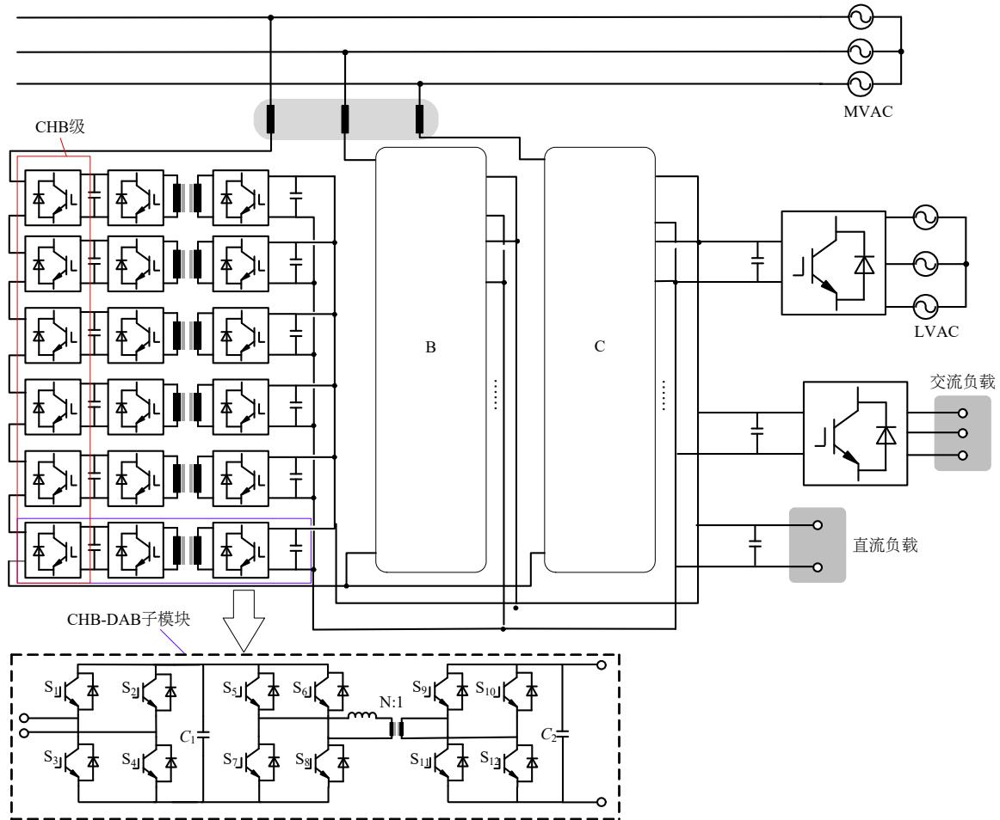  
图1 三相Y接CHB-PET拓扑结构

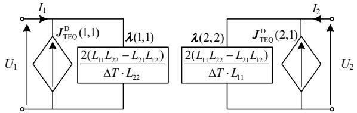  
Fig. 1 Three-phase Y-connected CHB-PET topology   
图2 变压器的解耦伴随电路  
Fig. 2 Decoupling companion circuit of transformer

$$
\begin{array}{l} \boldsymbol {I} (t) = \boldsymbol {\lambda} \cdot \boldsymbol {U} (t) + (\mathbf {Y} _ {\mathrm {M A T}} - \boldsymbol {\lambda}) \cdot \boldsymbol {U} (t) + \boldsymbol {I} _ {\mathrm {T E O}} (t - \Delta T) \approx \\ \boldsymbol {\lambda} \cdot \boldsymbol {U} (t) + \left(\boldsymbol {Y} _ {\mathrm {M A T}} - \boldsymbol {\lambda}\right) \cdot \boldsymbol {U} (t - \Delta T) + \\ \boldsymbol {I} _ {\mathrm {T E Q}} (t - \Delta T) \triangleq \boldsymbol {\lambda} \cdot \boldsymbol {U} (t) + \boldsymbol {J} _ {\mathrm {T E Q}} ^ {\mathrm {D}} (t - \Delta T) \tag {3} \\ \end{array}
$$

式中 $\lambda$ 为 $Y_{\mathrm{MAT}}$ 生成的对角矩阵。

2）消去内部节点。建立 CHB-DAB 子模块的伴随电路并采用 Ward 等值法获取外部等值电路，仅保留外部 4 个端子。  
3）消去模块间的连接节点。如图 3 所示，将子

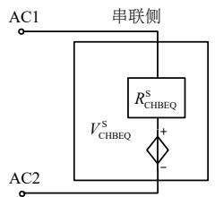

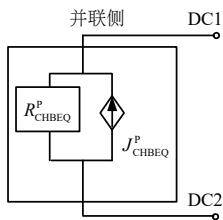  
图3 CHB-PET的戴维南-诺顿等效电路  
Fig. 3 Thévenin-Norton equivalent circuit for CHB-PET

模块的串联侧戴维南等效电路和并联侧诺顿等效电路进行代数叠加后, 即可得到整个CHB相单元的戴维南- 诺顿等效电路, 仅包含对外的4个端子。

# 2 CHB-PET的闭锁集成建模方法

# 2.1 基本原理

在DC-DC变换环节，所有DAB变换器闭锁后，流过开关模块 $\mathrm{S}_5 - \mathrm{S}_{12}$ 的电流会迅速降为0，使其与前级(CHB)和后级(DC-AC变换器)分别解列，因此，在CHB-DAB模块等效建模时，可进行相应的简化。以DAB出口短路故障引起闭锁保护动作为例进行分析，即图1中电容 $\mathbf{C}_2$ 两端的电压降为0，可以得到如图4所示的故障态波形(假设DAB输入侧电压恒定)。

图4中，变压器(含附加电感)的端口电压电流波形可分为4段：1） $0\sim t_{1}$ ，DAB处于基于单移相控制，且输入、输出额定电压相同的正常工作状态[19]；2） $t_1\sim t_{2 - }$ ，出口电压跌落，但DAB仍处于解锁状态 $(t_{2}$ 为换路时刻， $t_{2 - }$ 为换路前一瞬间)；3） $t_2\sim t_3$ ，DAB闭锁，二极管 $\mathrm{D}_5$ 和 $\mathrm{D}_8$ 续流；4） $t_3$ 时刻及之后，续流结束， $\mathrm{D}_5\mathrm{-D}_{12}$ 关断，DAB退出运行。

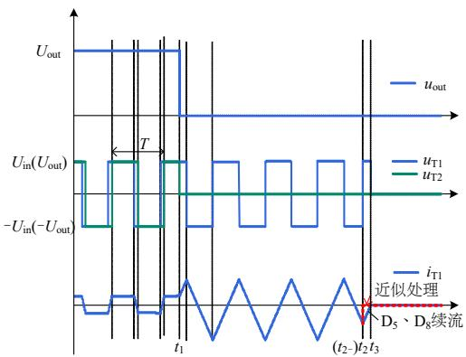  
图4 故障态的DAB输出电压、高频变压器端口电压和一次侧电流  
Fig. 4 DAB output voltage, high-frequency transformer port voltage, and primary current in the fault state

图5(a)一(d)分别为对应4个阶段中拐点的故障电流回路附加电感两端电压近似为 $u_{\mathrm{T1}} - k \cdot u_{\mathrm{T2}} (k$ 为变比)，由图5(b)、(c)可以看出，进入第3阶段后，附加电感两端电压翻转为 $u_{\mathrm{in}}$ ，因此，在 $t_2$ 时刻后，电感电流逐渐上升到0，同时变压器副边电流过零，随后二极管关断，电感和变压器储存的能量耗散完毕。

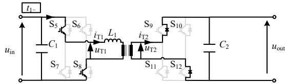

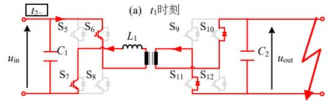

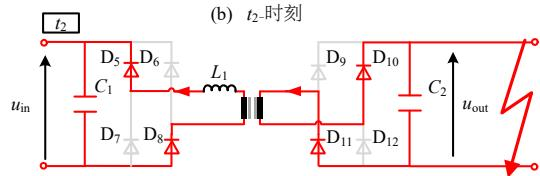

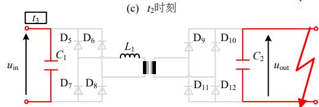  
(d) $t_3$ 时刻   
图5 DAB模块的故障电流回路  
Fig. 5 Fault current circuit of DAB module

上述过程的分析针对特定的故障和特定闭锁时刻，其他开关模块的导通模式下闭锁，也可按相同方法分析，不再赘述。经测算，续流的时间不超过DAB开关周期的1/4，即：

$$
\left(t _ {3} - t _ {2}\right) _ {\max } = \frac {\left| 0 - i _ {\mathrm {L m a x}} \right| * L _ {1}}{U _ {\text {i n}}} \leq \frac {T}{4} \tag {4}
$$

式中： $T$ 为开关周期； $i_{\mathrm{Lmax}}$ 为故障态1个开关周期内

的附加电感电流峰值； $U_{\mathrm{in}}$ 为DAB输入侧额定电压。

可以看出，无论闭锁前开关模块的导通状态如何，电感及变压器储存的能量都会通过续流二极管转移到DAB两端的电容上。CHB连接的交流系统的频率(一般为工频)通常远低于DAB的开关频率，对闭锁等效建模而言，若忽略这一短暂的续流过程（图4中 $t_2$ 时刻之后的虚线部分，等效模型中电感电流赋0)，随后交流系统将继续对电容 $C_1$ 充电，电容电压的稳态分量在简化后的等效模型中仍然可以精确获得，对后续电磁暂态仿真的影响几乎可以忽略，本文第4节将进行仿真验证。

# 2.2 2种闭锁模式下的CHB-PET等效电路

考虑 CHB-PET 的 2 种闭锁模式: 1) CHB 级和 DAB 级同时处于闭锁状态, 以下简称为 “完全闭锁”; 2) CHB 级解锁, DAB 级闭锁, 以下简称为 “部分闭锁”。以两侧有源时启动充电过程为例, 在 DAB 投入前, 需要将电容 $C_{1}$ 和电容 $C_{2}$ 通过 CHB 级和 DC/AC 变换器充电至额定值。电容 $C_{1}$ 的充电过程包含不控充电(完全闭锁)和可控充电(部分闭锁)2 个阶段, 可用本节介绍的等效建模方法模拟。

由2.1节分析可知，CHB-PET子模块的闭锁简化电路，如图6所示。由图6(a)可见，每个子模块的AC2与下一个子模块的AC1相连，即串联连接，因此，当流过相单元的电流大于0时，所有子模块的电容正向接入，小于0时则反向接入。每个子模块的DC1、DC2分别相连，因此，相单元的右侧相当于多个电容并联连接。如图6(b)所示，串联侧为结构更为简单的全控单端口电路，可用通用的单端口戴维南等效方法建模[20]，并联侧与图6(a)所示完全一致。

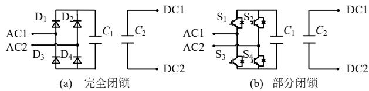  
图6 CHB-PET子模块的闭锁简化电路  
Fig. 6 Simplified blocking circuit of the CHB-PET submodule

图7为ISOP型CHB-PET相单元的闭锁戴维南-诺顿等效电路。在完全闭锁模式下，如图7(a)所示， $\mathrm{D_{1\_EQ} - D_{4\_EQ}}$ 为实际二极管，用于精确仿真电流的过零点，其等效电阻为单个二极管电阻的 $N$ 倍，如式(5)所示。式(6)为基于梯形积分方法得到的 $N$ 个串联电容的戴维南等效参数 $R_{\mathrm{SEQ}}^{\mathrm{Blk}}(t)$ 、 $U_{\mathrm{SEQ}}^{\mathrm{Blk}}(t)$ ，以及 $N$ 个并联电容的诺顿参数 $G_{\mathrm{SEQ}}^{\mathrm{Blk}}(t)$ 、 $J_{\mathrm{SEQ}}^{\mathrm{Blk}}(t)$ 。

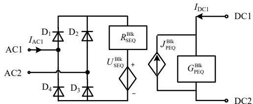  
(a) 完全闭锁

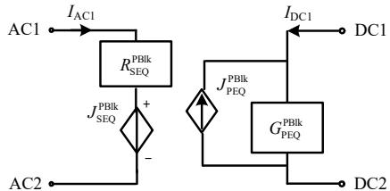  
(b) 部分闭锁  
图7 CHB-DAB相单元的闭锁戴维南-诺顿等效电路  
Fig. 7 Thévenin-Norton equivalent circuit of the CHB-DAB phase unit in blocking state

在部分闭锁模式下，可得图7(b)所示的等效电路，其中，左侧进行了单端口戴维南等效及代数叠加，右侧进行了端口诺顿等效。假设开关的关断电阻无穷大，串联侧的戴维南等效参数通过式(7)计算可得，并联侧与完全闭锁模式下的计算方法一致。

$$
\left\{ \begin{array}{l} R _ {\mathrm {O N} _ {-} \mathrm {D} _ {-} \mathrm {E Q}} = N R _ {\mathrm {O N} _ {-} \mathrm {D}} \\ R _ {\mathrm {O F F} _ {-} \mathrm {D} _ {-} \mathrm {E Q}} = N R _ {\mathrm {O F F} _ {-} \mathrm {D}} \end{array} \right. \tag {5}
$$

$$
\left\{ \begin{array}{l} R _ {\mathrm {S E Q}} ^ {\mathrm {B l k}} (t) = \sum_ {1} ^ {N} 1 / G _ {\mathrm {C} 1} ^ {i} \\ U _ {\mathrm {S E Q}} ^ {\mathrm {B l k}} (t) = \sum_ {1} ^ {N} U _ {\mathrm {C E Q} 1} ^ {i} (t - \Delta T) \\ G _ {\mathrm {P E Q}} ^ {\mathrm {B l k}} (t) = \sum_ {1} ^ {N} G _ {\mathrm {C} 2} ^ {i} \\ J _ {\mathrm {P E Q}} ^ {\mathrm {B l k}} (t) = \sum_ {1} ^ {N} \left(U _ {\mathrm {C E Q} 2} ^ {i} (t - \Delta T) \cdot G _ {\mathrm {C} 2} ^ {i}\right) \end{array} \right. \tag {6}
$$

式中： $U_{\mathrm{CEQ1}}^{i}(t - \Delta T) = U_{\mathrm{C1}}^{i}(t - \Delta T) + I_{\mathrm{C1}}^{i}(t - \Delta T) / G_{\mathrm{C1}}^{i}$ ； $G_{\mathrm{C1}}^{i} = 2C_{1}^{i} / \Delta T$ ； $N$ 为CHB-DAB子模块个数；上标“Blk”为该参数对应完全闭锁状态模式。

$$
\left\{ \begin{array}{l} R _ {\mathrm {S E Q}} ^ {\mathrm {P B l k}} (t) = 2 \cdot R _ {\mathrm {O N}} N + \sum_ {1} ^ {N} \left| \operatorname {F l a g} _ {i} \right| / G _ {\mathrm {C} 1} ^ {i} \\ U _ {\mathrm {S E Q}} ^ {\mathrm {P B l k}} (t) = \sum_ {i = 1} ^ {N} \operatorname {F l a g} _ {i} \cdot U _ {\mathrm {C E Q} 1} ^ {i} (t - \Delta T) \end{array} \right. \tag {7}
$$

式中： $\mathsf{Flag}_i$ 为第 $i$ 个CHB子模块的投入情况，正投入为1，负投入为-1，旁路为0；上标“PBlk”为该参数对应部分闭锁模式。

除进行上述外部等效外，在进入完全闭锁或部分闭锁状态后，其他内部状态变量(变压器及附加电感上的历史电流值)归零。

# 2.3 实施方式

本节对比3种闭锁简化电路的实施方式，最终确定“与闭锁电路集成”为最佳方案。

1）图6(a)、(b)中左侧具有与全桥MMC子模块相同的结构，因此，交流端口在闭锁期间串入PSCAD仿真平台开发的全桥MMC封装模块，是一个可选方案[21]。根据文献[21]，该封装模块能够精确仿真全桥MMC的闭锁和非闭锁状态，分别对应级联H桥型PET左侧简化电路的完全闭锁和部分闭锁状态。然而，闭锁状态和非闭锁状态通常在一次仿真过程中同时存在，而闭锁和非闭锁电路的切换需要进行2个步骤：电容电压等状态量的传递及判断状态量传递的时刻。全桥MMC的封装模块通常不开放电容电压在非零时刻的初值传递接口，且状态量传递时刻通过检测闭锁信号上升沿来获得，需要增加额外的控制，因此，该方式并非最优方案。  
2）“低仿高”方式，即用一个容值为 $C / N$ 的等效电容替代左侧串联连接的子模块电容，并用1个容值为 $N \times C$ 的等效电容替代右侧串联连接的电容，将单个CHB-DAB模块与非闭锁电路并联，通过开关切换2种状态的对应等效电路。除同样面临状态传递所需的额外控制问题，在解锁重启后该方式仅能传递电容电压的平均值，而无法获得各子模块电容上的实际电压，因此，降低了仿真精度，不适合闭锁简化电路的实施。  
3）与非闭锁电路集成。由图7可知，戴维南-诺顿等效后，完全闭锁模式下CHB-PET相单元仅包含1个二极管桥，其他部分及部分闭锁等效电路则与1.2节介绍的非闭锁状态等效电路，具有相同的形式，可通过选择结构进行集成。图8为集成了闭锁功能的CHB-DAB相单元等效模型，方框部分的戴维南/诺顿参数包含3种选择，由CHB级/DAB级的闭锁状态决定。Brk1—Brk4为用于控制二极管支路投切的开关，在仿真中可与闭锁信号关联。当处于完全闭锁状态时，Brk1、Brk4断开，Brk2、Brk3闭合；当处于部分闭锁或非闭锁状态时，Brk2、Brk3断开，Brk1、Brk4闭合。  
此外，该集成方式使得非闭锁和闭锁电路可共用同一个状态变量存储单元，既保证了子模块电容电压的仿真精度，且在闭锁与非闭锁电路的切换时，无需进行状态传递。此处的状态变量包括电容 $C_1$ ， $C_2$ 上的电压、电感 $L_{1}$ 上的电流及变压器一/二次侧的电流。该集成方法的不足是相比详细模型而

  
图8 集成闭锁功能的CHB-DAB相单元等效模型  
Fig. 8 Equivalent model of CHB-DAB phase unit with integrated blocking function

言，由于各子模块通过共用二极管来判断电流过零点，因此，各子模块的交流端口电压无法获得，但在闭锁期间监控子模块电容电压，单个模块的交流出口电压通常不作考虑，因此，该方式足够满足实际仿真的需求。

综上所述，“与闭锁电路集成”为目前的最佳方案，第3节的仿真模型也将基于此方式。

该闭锁集成方法同样适用于其他CHB-DAB非闭锁等效模型，如文献[11]所示的级间解耦等效电路或CHB-PET的双端口等效电路等。

# 3 仿真验证

# 3.1 三相Y接CHB-PET仿真测试模型

在 PSCAD/EMTDC 中分别搭建 $10\mathrm{kV} / 3\mathrm{kV}$ CHB-PET 的详细模型(detailed model, DM)和本文所提闭锁等效模型（equivalent model, EM), 用以评估测试模型的精度, 仿真步长为 $2\mu \mathrm{s}$ 。

三相Y接CHB-PET的系统示意图如图[9]所示，CHB级有功类控制采用定电容电压平均值控制，无功类控制采用定电流 $q$ 轴分量控制，电流参考值为0，DAB级采用定输出电压控制。输出侧的 $3\mathrm{kV}$ 直流电源仅在启动阶段给电容 $C_2$ 充电，DAB解锁后即退出。测试系统的详细参数如附表A1所示。

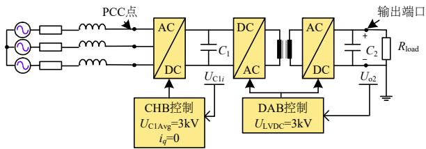  
图9 CHB-PET系统示意图  
Fig. 9 Schematic of CHB-PET system

# 3.2 启动闭锁

本例中系统采用两侧同时充电的分段启动策略，共包含4个阶段：1）0~0.115s，CHB侧不控充电，限流电阻为 $10\Omega$ ，同时输出侧的3kV直流电压源给电容 $C_2$ 充电；2）0.115~0.165s，CHB级的

所有 H 桥解锁, 继续给电容 $C_{1}$ 充电; 3) $0.165 \sim 1.1 \mathrm{~s}$ , 输出侧的电压源退出运行, DAB 解锁并建立磁链; 4) 系统达到稳态。

基于DM和EM对上述启动过程如图10所示，进行仿真得到的波形，分别为电容 $C_1$ 上的电压，在逐级充电启动方式下的变压器一次侧电流，两侧同时充电启动方式下的变压器一次侧电流。通过比较发现，2种模型得到的波形基本重合，说明所提闭锁等效方法的精确性。

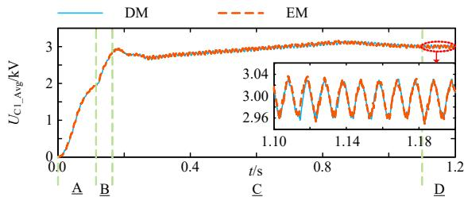

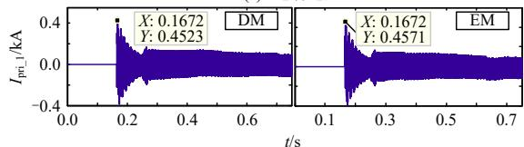  
(a）电容电压

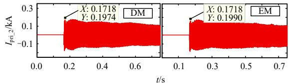  
(b) 逐级启动方式下的变压器一次电流  
(c) 两侧同时启动方式下的变压器一次电流  
图10 系统启动阶段波形

# Fig. 10 System waveform during startup progress

由图 10 可知，波形比较了两侧同时充电和逐级充电 2 种方式。逐级充电指的是先解锁 CHB 级，对电容 $C_{1}$ 充电，再解锁 DAB 级，由高压交流侧对 $C_{2}$ 充电。逐级充电方式下 DAB 输入和输出端电压相差较大，使得 DAB 解锁后高频变压器出现较大的励磁涌流，不利于变压器的正常运行。图 10(b)、(c) 中分别标记在 2 种充电方式下，DM 和 EM 的电流峰值，可以看出，EM 能够较为精确地仿真一次侧电流的峰值特性，若先对电容 $C_{2}$ 充电至一定的电压值，则可以明显降低励磁涌流的峰值。

# 3.3 欠电压闭锁

在本算例中，假设当 $t = 1.2 \mathrm{~s}$ 时，交流侧发生三相电压暂降，在仿真中设置了2种情况：1）交流电压源幅值跌落至额定值的 $50\%$ ，持续时间为 $0.01 \mathrm{~s}$ ；2）交流电压源幅值跌落至额定值的 $75\%$ ，持续时间为 $0.05 \mathrm{~s}$ 。

在 PET 的保护配置中, 为了避免输入侧的过调制, 电容 $C_{1}$ 上的电压通常不能低于某一个限值。

当电容低于该限值时，欠电压保护动作并闭锁所有IGBT[6]。本节配置各相电容电压平均值的欠电压保护，在达到稳态后投入。动作阈值设定为 $90\%$ 的额定电压，即 $2.7\mathrm{kV}$ ，且当电压超过 $2.75\mathrm{kV}$ 时，CHB级自动解锁，DAB级需手动解锁。

基于DM和EM的三相交流电压暂降阶段的波形如图11所示，分别为PCC点的A相相电压PCC点的A相相电流、PET输出直流电压、电容 $C_1$ 上的电压平均值和PCC点的无功功率(参考方向为电网流向PET)。

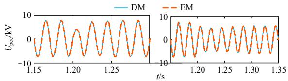

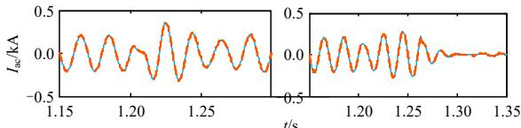  
(a) 电压  
(b) 电流

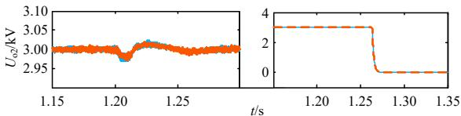

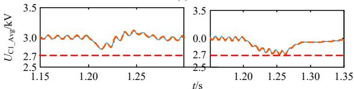  
(c）电压

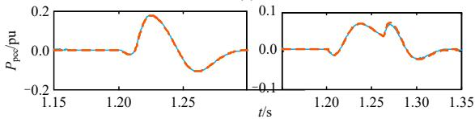  
(d) 电压   
(e) 功率  
图11 三相交流电压暂降阶段波形  
Fig. 11 Systemic waveform of three-phase AC voltage sag

由图11中左侧波形可以看出，该电压暂降未引起欠电压闭锁保护动作，EM能够精确仿真电容电压的动态变化；观察右侧波形可知，虽然电压暂降深度低于左侧，但持续时间较长，引起电容 $C_1$ 上的欠电压保护动作，即完全闭锁，输出侧电压降为0，随后 $C_1$ 上的电压上升，CHB级解锁，可向交流侧注入无功功率。整个过程中DM和EM的波形基本相同，说明闭锁等效方法的准确性。

# 3.4 直流故障闭锁

在本算例中，假设当 $t = 1.2\mathrm{s}$ 时，PET输出端口发生直流短路故障，过渡电阻为 $0.005\Omega$ 。经5ms的延时，PET完全闭锁。

基于DM和EM的PET直流故障波形如图12所示，分别为输出侧直流电压、PCC点的交流电流和A相3个子模块中的电容 $C_1$ 上的电压。

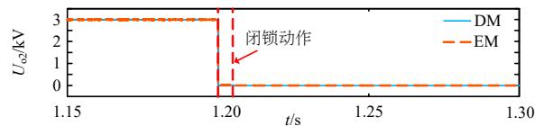  
(a) 电压

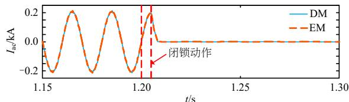

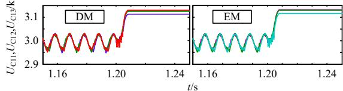  
(b) 电流  
(c）电压   
图12 输出直流侧短路故障波形  
Fig. 12 Output DC-side short-circuit fault waveform

在2.1节中，以直流故障为例分析了闭锁后的电路响应，不再赘述。EM的仿真结果与DM基本吻合，经测算最大相对误差小于 $1\%$ 。

# 4 算法适用性分析

第3节的仿真实例充分说明级联H桥型PET的等效模型在仿真3种常见闭锁工况的精确性。需要指出的是，该模型通过多模块共用二极管判断电流过零点，可处理CHB-DAB完全闭锁和CHB解锁、DAB闭锁2种模式，但并不适用于研究DAB的1个H桥闭锁且另1个H桥解锁(简称DAB局部闭锁)时的闭锁过程，以下简要分析不适用的原因和解决思路。

DAB局部闭锁时，1个全控H桥可工作在逆变状态，另1个不控的二极管桥则工作在整流工作状态，不符合2.1节所提到的DAB解列情况。通过控制不同DAB模块之间流过变压器(含附加电感)的电流，通常存在相位差，难以共用二极管判断这些电流的过零点。局部闭锁时的等效电路与用于功率单向流动场合的单有源桥(single active bridge, SAB)一致，可借鉴文献[22]中工作模态解析的方法。

# 5 结论

本文提出了一种级联 H 桥型 PET 的闭锁状态等效建模及集成方法，可精确仿真多种闭锁工况。通过简化 DAB 闭锁后的续流过程，可得到 CHB-DAB 子模块完全闭锁和部分闭锁模式下的简

化等效电路。在 DAB 整体闭锁时，简化电路可与原电路等效，但简化电路难以表达 DAB 部分闭锁或开关死区时，H 桥上下桥臂关断的闭锁过程。基于该简化电路，推导 ISOP 型 CHB-DAB 相单元的戴维南/诺顿等效参数。

该闭锁等效方法可与 PET 的非闭锁等效电路集成，通过共用状态变量的存储单元可避免切换时的数值传递过程，可实现 PET 多工况的快速电磁暂态仿真。启动、电压暂降和直流故障 3 个闭锁仿真实例的仿真结果表明，等效模型具有较高的仿真精度。本文工作对其他包含多级变换环节的模块化换流设备闭锁建模也有一定的借鉴意义。

# 参考文献

[1] 马钊，安婷，尚宇炜. 国内外配电前沿技术动态及发展[J]. 中国电机工程学报，2016，36(6)：1552-1567.  
MA Zhao, AN Ting, SHANG Yuwei. State of the art and development trends of power distribution technologies[J]. Proceedings of the CSEE, 2016, 36(6): 1552-1567(in Chinese).   
[2] 齐琛，汪可友，李国杰，等．交直流混合主动配电网的分层分布式优化调度[J]. 中国电机工程学报，2017，37(7): 1909-1918.  
QI Chen, WANG Keyou, LI Guojie, et al. Hierarchical and distributed optimal scheduling of AC/DC hybrid active distribution network[J]. Proceedings of the CSEE, 2017, 37(7): 1909-1918(in Chinese).   
[3] 周剑桥, 王晗, 张建文, 等. 基于波动功率传递的MMC型固态变压器子模块电容优化方法[J]. 中国电机工程学报, 2020, 40(12): 3990-4004.  
ZHOU Jianqiao, WANG Han, ZHANG Jianwen, et al. MMC-based Solid State Transformer's Submodule Capacitance Optimization Method Based on Fluctuation Power Delivery[J]. Proceedings of the CSEE, 2020, 40(12): 3990-4004(in Chinese).   
[4] GAO Xiang, SOSSAN F, CHRISTAKOU K, et al. Concurrent voltage control and dispatch of active distribution networks by means of smart transformer and storage[J]. IEEE Transactions on Industrial Electronics, 2018, 65(8): 6657-6666.   
[5] 杨汾艳，李海波，盛超，等．多端口级联式电力电子变压器可靠性评估模型及其应用[J].电力系统保护与控制，2019，47(20)：41-49.  
YANG Fenyan, LI Haibo, SHENG Chao, et al. Reliability evaluation model of cascaded multiport power electronic transformer and its application[J]. Power System Protection and Control, 2019, 47(20): 41-49(in Chinese).   
[6] HUANG A Q, CROW M L, HEYDT G T, et al. The future

renewable electric energy delivery and management (FREEDM) system: the energy internet[J]. Proceedings of the IEEE, 2011, 99(1): 133-148.   
[7] BRIZ F, LOPEZ M, RODRIGUEZ A, et al. Modular power electronic transformers: modular multilevel converter versus cascaded H-Bridge solutions[J]. IEEE Industrial Electronics Magazine, 2016, 10(4): 6-19.   
[8] ZHANG Xueyin, XU Yonghai, SIDDIQUE A, et al. A microprocessor resource-saving dual active bridge control for startup and restart of three-stage modular solid-state transformer[J]. IEEE Transactions on Power Delivery, 2020, 35(3): 1443-1454.   
[9] SAEED M, CUARTAS J M, RODRIGUEZ A, et al. Energization and start-up of CHB-based modular three-stage solid-state transformers[J]. IEEE Transactions on Industry Applications, 2018, 54(5): 5483-5492.   
[10] BOTTON A J, BARBI I. Input-series and output-series connected modular output capacitor full-bridge PWM DC-DC converter[J]. IEEE Transactions on Industrial Electronics, 2015, 62(10): 6213-6221.   
[11] 易姝娴，袁立强，李凯，等．面向区域电能路由器的高效仿真建模方法[J].清华大学学报：自然科学版，2019，59(10)：796-806.  
YI Shuxian, YUAN Liqiang, LI Kai, et al. High-efficiency modeling method for regional energy routers[J]. Journal of Tsinghua University: Science and Technology, 2019, 59(10): 796-806(in Chinese).   
[12] 孙谦浩，宋强，王裕，等．基于RT-LAB的高频链直流变压器实时仿真研究[J].电力系统保护与控制，2017，45(5)：80-87.  
SUN Qianhao, SONG Qiang, WANG Yu, et al. Real-time simulation research of high frequency link DC solid state transform based on RT-LAB[J]. Power System Protection and Control, 2017, 45(5): 80-87(in Chinese).   
[13] PSCAD X4 user's guide[M]. Winnipeg, MB, Canada: Manitoba Research Center, 2009.   
[14] ZHANG Yi, DING Hui, KUFFEL R. Key techniques in real time digital simulation for closed-loop testing of HVDC systems[J]. CSEE Journal of Power and Energy Systems, 2017, 3(2): 125-130.   
[15] 王洁聪，刘崇茹，徐东旭，等．基于RTDS的模块化多电平换流器闭锁状态仿真建模方法[J].电工技术学报，2018，33(16)：3686-3696.  
WANG Jiecong, LIU Chongru, XU Dongxu, et al. Simulation method of modular multilevel converter blocking state based on RTDS[J]. Transactions of China Electrotechnical Society, 2018, 33(16): 3686-3696(in Chinese).   
[16] XU Jianzhong, ZHAO Yuchen, ZHAO Chengyong, et al. Unified high-speed EMT equivalent and implementation method of MMCs with single-port submodules[J]. IEEE

Transactions on Power Delivery, 2019, 34(1): 42-52.   
[17] XIAO Zilong, WANG Dan, XIONG Qing, et al. Efficient modeling of cascaded-multilevel static synchronous compensator on electronic magnetic transient simulation program[C]//2015 5th International Conference on Electric Utility Deregulation and Restructuring and Power Technologies (DRPT). Changsha: IEEE, 2015: 2207-2214.   
[18] 丁江萍，高晨祥，许建中，等．级联H桥型电力电子变压器的电磁暂态等效建模方法[J].中国电机工程学报，2020，40(21)：7047-7056.  
DING Jiangping, GAO Chenxiang, XU Jianzhong, et al. Electromagnetic Transient Equivalent Modeling Method of Cascaded H-bridge Power Electronic Transformer[J]. Proceedings of the CSEE, 2020, 40(21): 7047-7056(in Chinese).  
[19] 赵彪，安峰，宋强，等．双有源桥式直流变压器发展与应用[J].中国电机工程学报，2021，41(1)：288-298. ZHAO Biao, AN Feng, SONG Qiang. Development and Application of DC Transformer based on Dual-active-bridge[J]. Proceedings of the CSEE, 2021, 41(01): 288-298(in Chinese).   
[20] 赵禹辰，徐义良，赵成勇，等．单端口子模块MMC电磁暂态通用等效建模方法[J].中国电机工程学报，2018，38(16)：4658-4667，4971. ZHAO Yuchen，XU Yiliang，ZHAO Chengyong，et al. Generalized electromagnetic transient (EMT) equivalent modeling of MMCs with arbitrary single-port sub-module structures[J]. Proceedings of the CSEE，2018，38(16):4658-4667，4971(in Chinese).   
[21] MMC Webinar Members. Modular multi-level converter (MMC) examples[EB/OL]. Winnipeg, Manitoba: Manitoba Hydro International Ltd, 2015[2020-03-07]. https://www.pscad.com/knowledge-base/article/234.   
[22] YIN Rui, SHI Min, HU Wenping, et al. An accelerated model of modular isolated DC/DC converter used in offshore DC Wind farm[J]. IEEE Transactions on Power Electronics, 2019, 34(4): 3150-3163.

附录A

表 A1 CHB-PET 测试系统参数  
Table A1 Parameters of CHB-PET Testing SYSTEM   

<table><tr><td>参数</td><td>取值</td></tr><tr><td>系统基频fsys/Hz</td><td>50</td></tr><tr><td>CHB级载波开关频率fsw1/Hz</td><td>200</td></tr><tr><td>储能电容C1容值Cout_AC-DC/μF</td><td>4700</td></tr><tr><td>PET输入侧滤波电感LAC/H</td><td>0.06</td></tr><tr><td>交流系统线电压有效值UL-Lrated/kV</td><td>10</td></tr><tr><td>电容C1上的额定电压Uo1Rated/kV</td><td>3</td></tr><tr><td>PET输出侧额定有功功率PoRated/MW</td><td>2.25</td></tr><tr><td>PET级联子模块个数NCHB-DAB</td><td>3</td></tr><tr><td>DAB级开关频率(同变压器频率)fsw2/Hz</td><td>1000</td></tr><tr><td>高频变压器额定容量Str/MVA</td><td>0.25</td></tr><tr><td>变压器一次侧额定电压Utr1/kV</td><td>3</td></tr><tr><td>变压器二次侧额定电压Utr2/kV</td><td>3</td></tr><tr><td>变压器漏抗（含附加电感）标幺值XtrPU/pu</td><td>0.376</td></tr><tr><td>PET输出额定电压Uo2Rated/kV</td><td>3</td></tr><tr><td>储能电容C2容值Cout_DAB/μF</td><td>50</td></tr><tr><td>额定直流负载Rload/Ω</td><td>4</td></tr></table>

  
丁江萍

在线出版日期：2020-07-02

收稿日期：2020-03-07。

作者简介：

丁江萍(1997)，女，硕士研究生，研究方向为柔性直流输电及电力电子变压器建模与仿真，1459085313@qq.com;

高晨祥(1997)，男，硕士研究生，主要研究方向为高压直流输电MMC电磁暂态建模，1179968057@qq.com;

许建中(1987)，男，副教授，主要研究方向为直流输电，xujianzhong@ncepu.edu.cn;

*通信作者：赵成勇(1964)，男，博士，教授，博士生导师，研究方向为直流输电、电能质量分析与控制等，chengyongzhao@ncepu.edu.cn。

(实习编辑 刘雪莹)

# Research on Equivalent Modeling Method of Cascaded H-bridge PET Under Blocking State

DING Jiangping, GAO Chenxiang, XU Jianzhong, ZHAO Chengyong

(North China Electric Power University)

KEY WORDS: cascaded H-bridge based power electronic transformer(CHB-PET); Thévenin/Norton equivalent modeling; blocking; electromagnetic transient; start-up; DC fault

Power Electronic Transformer (PET) is the key equipment of future AC/DC hybrid power distribution network. Aiming at the problem of efficient simulation of PET's multiple working conditions especially under blocked mode, this paper proposes an equivalent modeling method suitable for the blocking state of cascaded H-bridge based PET (CHB-PET).

After all DAB converters in the DC-DC conversion link are blocked, the current flowing through the power switches in DABs will quickly drop to 0, making them separate from the front-end converter (CHB) and the rear-end converter (DC-AC converter). The Thévenin-Norton equivalent parameters in partially blocking and totally blocking states were derived as (1) and (2). $N$ is the number of CHB-DAB submodules. The superscript "Blk" indicates that this parameter corresponds to the totally blocked state mode and the superscript "PBlk" indicates that this parameter corresponds to the partial blocked state mode.

$$
\left\{ \begin{array}{l} R _ {\mathrm {S E Q}} ^ {\mathrm {B l k}} (t) = \sum_ {1} ^ {N} 1 / G _ {\mathrm {C} 1} ^ {i} \\ U _ {\mathrm {S E Q}} ^ {\mathrm {B l k}} (t) = \sum_ {1} ^ {N} U _ {\mathrm {C E Q} 1} ^ {i} (t - \Delta T) \\ G _ {\mathrm {P E Q}} ^ {\mathrm {B l k}} (t) = \sum_ {1} ^ {N} G _ {\mathrm {C} 2} ^ {i} \\ J _ {\mathrm {P E Q}} ^ {\mathrm {B l k}} (t) = \sum_ {1} ^ {N} \left(U _ {\mathrm {C E Q} 2} ^ {i} (t - \Delta T) \cdot G _ {\mathrm {C} 2} ^ {i}\right) \end{array} \right. \tag {1}
$$

$$
\text {w h e r e} U _ {\mathrm {C E Q 1}} ^ {i} (t - \Delta T) = U _ {\mathrm {C 1}} ^ {i} (t - \Delta T) + I _ {\mathrm {C 1}} ^ {i} (t - \Delta T) / G _ {\mathrm {C 1}} ^ {i},
$$

$$
G _ {C 1} ^ {i} = 2 C _ {1} ^ {i} / \Delta T.
$$

$$
\left\{ \begin{array}{l} R _ {\mathrm {S E Q}} ^ {\mathrm {P B l k}} (t) = 2 \cdot R _ {\mathrm {O N}} \cdot N + \sum_ {1} ^ {N} \left| \operatorname {F l a g} _ {i} \right| / G _ {\mathrm {C} 1} ^ {i} \\ U _ {\mathrm {S E Q}} ^ {\mathrm {P B l k}} (t) = \sum_ {i = 1} ^ {N} \operatorname {F l a g} _ {i} \cdot U _ {\mathrm {C E Q} 1} ^ {i} (t - \Delta T) \end{array} \right. \tag {2}
$$

where $\mathrm{Flag}_i$ indicates the insert state of CHBs which is equal to 1 when CHBs are positively inserted, or equal to -1 when CHBs are negatively inserted and equal to 0 when CHBs are bypassed.

Fig 1 shows the equivalent EMT model of the CHB-DAB phase unit integrated with blocking function.

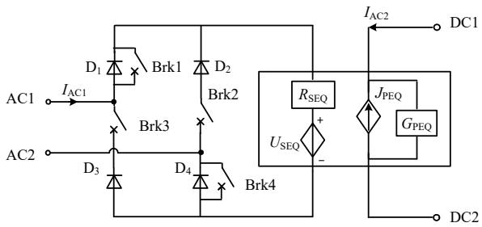  
Fig.1 Equivalent model of

CHB-DAB phase unit with integrated blocking function

When in a fully locked state, Brk1 and Brk4 are open, and Brk2 and Brk3 are closed; when in a partially locked or non-locked state, Brk2 and Brk3 are open, and Brk1 and Brk4 are closed. The integrated method allows non-blocking and blocking circuits to share the same state variable storage unit.

Next, a typical $10\mathrm{kV} / 3\mathrm{kV}$ three-phase CHB-PET system was built in PSCAD/EMTDC. Fig 2 shows the waveforms of PET system in start-up process based on detailed model (DM) and equivalent model (EM). The results showed that the blocking methods proposed in this paper has sufficient simulation accuracy.

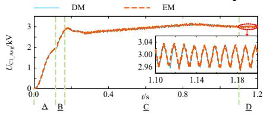

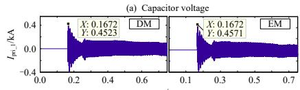

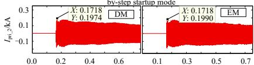  
(b) Primary current of transformer in step   
(c) Primary current of the transformer under the simultaneous start mode on both sides   
Fig. 2 Systemic waveform during startup progress

It should be pointed out that the model can handle the two kinds of CHB-DAB blocking modes, but it is not suitable for modelling such blocking mode in which one H-bridge of DAB is blocked and the other H-bridge of DAB is non-blocked.