# 耦合双回线路电弧故障测距的新相模变换方法

束洪春1‚刘振松2‚彭仕欣3

昆明理工大学电力工程学院 昆明 云南电力研究院 昆明

3．云南电网公司昆明供电局‚昆明650051）

摘 要 输电线路故障测距一直是经久不衰的研究课题 根据三相系统和同塔双回线系统的阻抗矩阵关系 从能用单一模量反映所有普通三相系统故障的新相模变换矩阵出发 推导出适用于双回线的相模变换矩阵 提出了一种基于新模量变换的双回线故障定位时域算法‚该算法利用某一故障模量电弧电压、电流的转移特性来构造测距算法 它具有如下特点 算法在时域中进行 所需的时间窗短 不需要滤波等环节 用最小二乘法来提高测距精度且测距的精度不受过渡电阻 故障类型及对端系统阻抗变化的影响 大量的电磁暂态仿真结果表明 该算法具有很高的精度。

关键词 六相系统 耦合双回线 电弧故障 最小二乘法 电磁暂态 故障测距 相模变换

中图分类号

文献标志码：A

文章编号：1003-6520(2009)03-0480-07

# Locati ng Arc Faults on Coupli ng Two Parallel Trans missi on Li nes Usi ng the Novel Phase-model Transfor mati on

S HU Hong-chun1‚LI U Zhen-song2‚PENG Shi-xi n3

（1．School of Electrical Engineering ‚Kun ming Universit y of Science and Technology ‚Kun ming 650051‚China ；

2．Yunnan Electric Po wer Research I nstit uti on ‚Kun mi ng 650051‚Chi na ；

3．Kun mi ng Po wer Suppl y Bureau of Yunnan Po wer Grid ‚Kun mi ng 650051‚Chi na）

Abstract ： Accor di ng t o t he relationshi p bet ween t he i mpedance matri x of t hree-phase syst e m and parallel trans missi on li ne syst e m ‚a novel phase-mode t ransf or m mat ri x of parallel t rans missi on li ne syst e m was deduced f r o m t he phase-mode transf or m matri x of t hree-phase syst e m which coul d reflect all t ypes of f ault s by si ngle mode ‚and a novel al gorit h m was put f or war d which was based on phase-mode t ransf or m f or l ocati ng f ault s on coupli ng parallel trans mission li nes ．The al gorit h m is obt ai ned by t he transf er charact eristics relationshi p of t he arc volt age and current at one mode ．The pr oposed al gorit h m has f oll o wi ng charact eristics ：it is a ti me-do mai n met hod ‚and uses t he met hod of least squares t o i mpr ove t he accuracy ；it is i ndependent of source i mpedance ．Electr o magnetic transient si mulation i ndicat es t hat t he present ed al gorit h m mai nt ai ns hi gh accuracy f or t wo parallel trans mission li nes

Key words ：si x-phase syst e m ；coupli ng t wo parallel trans mission li nes ；arci ng f ault ；least err or square met hod ；electr o magnetic transient ；f ault l ocation ；phase-mode transf or mation

# 0 引言

同塔双回线路共用杆塔 所需出线走廊窄 具有建设速度快 输送能力强 节省投资等优势 能够较好地满足现代电力系统对供电可靠性和大容量输电的要求 在国内外电力系统中的应用日益广泛 同杆双回线同用一杆塔 不仅相间存在互感 回线间也存在互感 故障分析时需要对双回线进行解耦计算解耦计算就是将相互耦合的线路相量分解成彼此独

基金资助项目 国家自然科学基金云南省科技攻关项目 云南省自然科学基金项目（2005F0005Z；2004E0020M；2002E0025M） 。

Pr oject Support ed by Nati onal Nat ural Science Foundati on ofChi na （90610024‚50467002‚50347026‚50847043） ‚Scientific andTechnological Project in Yunnan Province(2OO3GG lO)，Nat ural Sci -ence Fundation of Yunnan Province（ 2OO5F OOO5Z，2O04E O02OM，

2002E0025M）

立的模量 也就是相模变换 比较经典的相模变换有 对称分量变换 变换 变换等［ 1‚2］ ‚其中‚对称分量变换中含有复数因子‚适用于工频稳态下的相序变换‚Clarke 变换和 Karen-变换等变换矩阵中元素全为实数 适用于频域分析同时也适用于时域分析 研究［ 3］ 发现和Karenbauer 变换在故障分析时必须使用双模量或与选相配合‚使计算量大大增加。文献［3］ 在分析现有相模变换矩阵不足的基础上 构造出一种新的相模变换矩阵 该方法用单一模量就能反映三相系统中所有的故障类型

本文根据三相系统和同塔双回线系统之间的关系 推导出能用单一模量反映所有双回线故障的相模变换矩阵 并用此相模变换矩阵将双回线解耦为个独立的模量 在某一模量下利用电弧电压 电流的转移特性构造测距算法来实现测距。大量的电磁

暂态仿真表明‚该算法具有很高的测距精度。

# 1 六相系统相模变换矩阵的推导

对于如图1所示的三相线路［ 4‚5］ ‚Z 为线路各相的自阻抗 $Z _ { \mathrm { m } }$ 为线路各相之间的互阻抗‚根据图1可以写出矩阵

$$
\left[ \begin{array}{l} U _ {\mathrm {m n A}} \\ U _ {\mathrm {m n B}} \\ U _ {\mathrm {m n C}} \end{array} \right] = \left[ \begin{array}{l l l} Z _ {\mathrm {s}} & Z _ {\mathrm {m}} & Z _ {\mathrm {m}} \\ Z _ {\mathrm {m}} & Z _ {\mathrm {s}} & Z _ {\mathrm {m}} \\ Z _ {\mathrm {m}} & Z _ {\mathrm {m}} & Z _ {\mathrm {s}} \end{array} \right] \left[ \begin{array}{l} I _ {\mathrm {m n A}} \\ I _ {\mathrm {m n B}} \\ I _ {\mathrm {m n C}} \end{array} \right] 。 \tag {1}
$$

即 ${ \pmb U } _ { \mathrm { m n } } = { \pmb U } _ { \mathrm { m n } }$ 。从 Z 中可以看出‚三相输电线路之间存在耦合关系 要进行线路故障分析首先要对线路进行解耦计算［ 6］ 解耦计算的实质就是对阻抗矩阵进行对角化。

由特征值方程det（Z－λI） ＝0‚可以解得

$$
\left\{ \begin{array}{l} \lambda_ {1} = Z _ {\mathrm {s}} + 2 Z _ {\mathrm {m}}; \\ \lambda_ {2} = \lambda_ {3} = Z _ {\mathrm {s}} - Z _ {\mathrm {m}} 。 \end{array} \right. \tag {2}
$$

式中 λi 为模变换矩阵P 的第i（i ‚‚） 个特征值。设Xi 为对应于λi 的特征向量‚由矩阵特征值和特征向量的性质可得［ 7‚8］

$$
\mathbf {Z} \mathbf {X} _ {i} = \lambda_ {i} \mathbf {X} _ {i} 。 \tag {3}
$$

由式（2） 和（3） 可以得到

$$
\left\{ \begin{array}{l} X _ {1 1} = X _ {2 1} = X _ {3 1}; \\ X _ {1 2} + X _ {2 2} + X _ {3 2} = 0; \\ X _ {1 3} + X _ {2 3} + X _ {3 3} = 0. \end{array} \right. \tag {4}
$$

满足式（ ） 的矩阵都可作为三相系统的相模变换矩阵 M 如对称分量法 变换矩阵变换矩阵等都是通过上述步骤推导出来的［ 9］ 但研究发现［ 3］ 上述这些模量变换矩阵在进行故障测距时 用单一模量不能反映所有的故障类型 要使模量反映所有的故障类型 必须使用双模量或与选相配合 使计算量大大增加 本文推导能用单一模量反映所有双回线故障类型的相模变换矩阵。

三相系统的新相模变换矩阵 M为

$$
\boldsymbol {M} = \frac {1}{1 5} \left[ \begin{array}{r r r} 5 & 5 & 5 \\ 5 & - 1 & - 4 \\ 5 & - 4 & - 1 \end{array} \right] 。 \tag {5}
$$

其反变换矩阵为

$$
\boldsymbol {M} ^ {- 1} = \left[ \begin{array}{r r r} 1 & 1 & 1 \\ 1 & 2 & - 3 \\ 1 & - 3 & 2 \end{array} \right] 。 \tag {6}
$$

经过验证 用新模量变换矩阵 M 分析故障时用单模量能反映三相系统中的所有故障类型‚记矩阵 M的第 列元素为X ‚第 列元素为 $X _ { 2 }$ ‚第 列元素为 X ‚易证明 X 与 X 线性无关‚所以将${ \pmb X } ^ { 2 } _ { ( \mathbb { C } ) 1 }$ 合并成3×2阶矩阵 $S 2 \ : ,$ 重写模变换矩阵.M

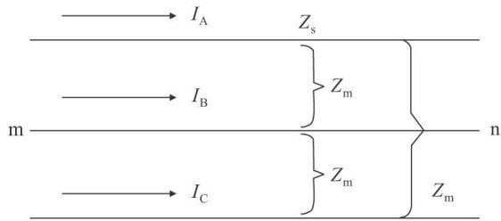  
图1 三相输电线路示意图

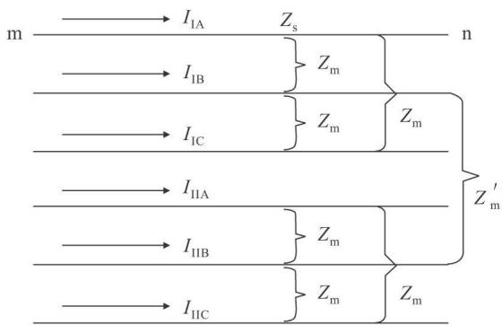  
Fig ．1 Sche matic of trans mission li ne   
图2 同塔双回线示意图  
Fig ．2 Sche matic of double-circuit trans mission li ne

为

$$
\boldsymbol {M} = \boldsymbol {S} _ {0} \boldsymbol {S} _ {1} 。 \tag {7}
$$

式中 $, S _ { 0 }$ 为λ对应的特征列向量‚为3×1阶矩阵‚其列向量各元素相等；S 为λ、λ对应的两个特征列向量‚为 $3 \times 2$ 阶矩阵‚其列向量各元素之和为零［ 10］ 。显然‚矩阵 M满足

$$
\boldsymbol {M} ^ {- 1} \boldsymbol {Z} \boldsymbol {M} = \left[ \begin{array}{l l l} \lambda_ {1} & 0 & 0 \\ 0 & \lambda_ {2} & 0 \\ 0 & 0 & \lambda_ {3} \end{array} \right] 。 \tag {8}
$$

通过矩阵的求逆变换‚与式（8） 类似 $M ^ { - 1 }$ 可以表示为

$$
\boldsymbol {M} ^ {- 1} = \left[ \begin{array}{c} \boldsymbol {Y} _ {0} ^ {\mathrm {T}} \\ \vdots \\ \boldsymbol {Y} _ {1} ^ {\mathrm {T}} \end{array} \right] 。 \tag {9}
$$

${ \pmb Y } _ { 0 } ^ { \mathrm { ~ T ~ } } \pmb Y _ { 1 } ^ { \mathrm { ~ T ~ } }$ 为 $1 \times 3 . 2 \times 3$ 矩阵 由矩阵运算易得

$$
\left\{ \begin{array}{l} \boldsymbol {Y} _ {0} ^ {\mathrm {T}} \boldsymbol {Z} \boldsymbol {S} _ {0} = \lambda_ {1}; \\ \boldsymbol {Y} _ {1} ^ {\mathrm {T}} \boldsymbol {Z} \boldsymbol {S} _ {1} = \left[ \begin{array}{c c} \lambda_ {2} & 0 \\ 0 & \lambda_ {3} \end{array} \right]; \\ \boldsymbol {Y} _ {0} ^ {\mathrm {T}} \boldsymbol {Z} \boldsymbol {S} _ {1} = 0; \\ \boldsymbol {Y} _ {1} ^ {\mathrm {T}} \boldsymbol {Z} \boldsymbol {S} _ {0} = 0 _ {\circ} \end{array} \right. \tag {10}
$$

对于同塔双回线 其系统线路图如图 所示图中 $Z _ { \mathrm { s } }$ 为每回线的自阻抗 $Z _ { \mathrm { m } }$ 为每回线各相之间的互阻抗 $Z _ { \mathrm { m } } ^ { ' }$ 为两回线之间各相间的互阻抗

其电压 电流关系为

$$
\boldsymbol {U} _ {\text {m n I , I I}} = \boldsymbol {Z} ^ {\prime} \boldsymbol {I} _ {\text {m n I , I I 。}} \tag {11}
$$

式（11） 中

$$
\mathbf {Z} ^ {\prime} = \left[ \begin{array}{l l l l l l} Z _ {\mathrm {s}} & Z _ {\mathrm {m}} & Z _ {\mathrm {m}} & Z _ {\mathrm {m}} ^ {\prime} & Z _ {\mathrm {m}} ^ {\prime} & Z _ {\mathrm {m}} ^ {\prime} \\ Z _ {\mathrm {m}} & Z _ {\mathrm {s}} & Z _ {\mathrm {m}} & Z _ {\mathrm {m}} ^ {\prime} & Z _ {\mathrm {m}} ^ {\prime} & Z _ {\mathrm {m}} ^ {\prime} \\ Z _ {\mathrm {m}} & Z _ {\mathrm {m}} & Z _ {\mathrm {s}} & Z _ {\mathrm {m}} ^ {\prime} & Z _ {\mathrm {m}} ^ {\prime} & Z _ {\mathrm {m}} ^ {\prime} \\ Z _ {\mathrm {m}} ^ {\prime} & Z _ {\mathrm {m}} ^ {\prime} & Z _ {\mathrm {m}} ^ {\prime} & Z _ {\mathrm {s}} & Z _ {\mathrm {m}} & Z _ {\mathrm {m}} \\ Z _ {\mathrm {m}} ^ {\prime} & Z _ {\mathrm {m}} ^ {\prime} & Z _ {\mathrm {m}} ^ {\prime} & Z _ {\mathrm {m}} & Z _ {\mathrm {s}} & Z _ {\mathrm {m}} \\ Z _ {\mathrm {m}} ^ {\prime} & Z _ {\mathrm {m}} ^ {\prime} & Z _ {\mathrm {m}} ^ {\prime} & Z _ {\mathrm {m}} & Z _ {\mathrm {m}} & Z _ {\mathrm {s}} \end{array} \right] 。 \tag {12}
$$

令式（12） 中：

$$
\mathbf {Z} = \left[ \begin{array}{l l l} Z _ {\mathrm {s}} & Z _ {\mathrm {m}} & Z _ {\mathrm {m}} \\ Z _ {\mathrm {m}} & Z _ {\mathrm {s}} & Z _ {\mathrm {m}} \\ Z _ {\mathrm {m}} & Z _ {\mathrm {m}} & Z _ {\mathrm {s}} \end{array} \right]; \mathbf {Z} _ {\mathrm {m}} = \left[ \begin{array}{l l l} Z _ {\mathrm {m}} ^ {\prime} & Z _ {\mathrm {m}} ^ {\prime} & Z _ {\mathrm {m}} ^ {\prime} \\ Z _ {\mathrm {m}} ^ {\prime} & Z _ {\mathrm {m}} ^ {\prime} & Z _ {\mathrm {m}} ^ {\prime} \\ Z _ {\mathrm {m}} ^ {\prime} & Z _ {\mathrm {m}} ^ {\prime} & Z _ {\mathrm {m}} ^ {\prime} \end{array} \right];
$$

则有

$$
\mathbf {Z} ^ {\prime} = \left[ \begin{array}{l l} \mathbf {Z} & \mathbf {Z} _ {\mathrm {m}} \\ \mathbf {Z} _ {\mathrm {m}} & \mathbf {Z} \end{array} \right] 。 \tag {13}
$$

分析式（13） ‚令：

$$
\boldsymbol {A} _ {0} = \left[ \begin{array}{l l} \boldsymbol {S} _ {0} & 0 \\ 0 & \boldsymbol {S} _ {0} \end{array} \right]; \boldsymbol {A} _ {1} = \left[ \begin{array}{l l} \boldsymbol {S} _ {1} & 0 \\ 0 & \boldsymbol {S} _ {1} \end{array} \right]; \tag {14}
$$

$$
\boldsymbol {B} _ {0} = \left[ \begin{array}{c c} \boldsymbol {Y} _ {0} ^ {\mathrm {T}} & 0 \\ 0 & \boldsymbol {Y} _ {0} ^ {\mathrm {T}} \end{array} \right]; \boldsymbol {B} _ {1} = \left[ \begin{array}{c c} \boldsymbol {Y} _ {1} ^ {\mathrm {T}} & 0 \\ 0 & \boldsymbol {Y} _ {1} ^ {\mathrm {T}} \end{array} \right] 。 \tag {15}
$$

模仿式（7） 和（9） 可得：

$$
\boldsymbol {A} = \left[ \begin{array}{l l} \mathrm {A} _ {0} & \mathrm {A} _ {1} \end{array} \right]; \tag {16}
$$

$$
\boldsymbol {A} ^ {- 1} = \left[ \begin{array}{c} \boldsymbol {B} _ {0} \\ \vdots \\ \boldsymbol {B} _ {1} \end{array} \right] 。 \tag {17}
$$

由式（10） 可得 $B { \sf C A } _ { 1 } { \sf = } B _ { 1 } { \sf Z } A _ { 0 } { \sf = } 0$ ‚由式（14） ～（17）可得

$$
\mathbf {A} ^ {- 1} \mathbf {Z} ^ {\prime} \mathbf {A} = \left[ \begin{array}{l l} \mathbf {B} _ {0} \mathbf {Z} ^ {\prime} \mathbf {A} & \mathbf {B} _ {0} \mathbf {Z} ^ {\prime} \mathbf {A} _ {1} \\ \mathbf {B} _ {1} \mathbf {Z} ^ {\prime} \mathbf {A} _ {0} & \mathbf {B} _ {1} \mathbf {Z} ^ {\prime} \mathbf {A} _ {1} \end{array} \right] = \left[ \begin{array}{l l} \mathbf {Z} _ {\mathrm {G}} & 0 \\ 0 & \mathbf {Z} _ {\mathrm {H}} \end{array} \right] 。 \tag {18}
$$

式（18） 中：

$$
\mathbf {Z} _ {\mathrm {G}} = \mathbf {B} _ {0} \mathbf {Z} ^ {\prime} \mathbf {A} _ {0} = \left[ \begin{array}{c c} \lambda_ {\mathrm {l}} & 3 Z _ {\mathrm {m}} ^ {\prime} \\ 3 Z _ {\mathrm {m}} ^ {\prime} & \lambda_ {\mathrm {l}} \end{array} \right]; \tag {19}
$$

$$
\begin{array}{l} \mathbf {Z} _ {\mathrm {H}} = \mathbf {B} _ {1} \mathbf {Z} ^ {\prime} \mathbf {A} _ {1} = \left[ \begin{array}{c c} \mathbf {Y} _ {1} ^ {\mathrm {T}} & 0 \\ 0 & \mathbf {Y} _ {1} ^ {\mathrm {T}} \end{array} \right] \mathbf {Z} ^ {\prime} \left[ \begin{array}{l l} \mathbf {S} _ {1} & 0 \\ 0 & \mathbf {S} _ {1} \end{array} \right] = \\ \left[ \begin{array}{c c c c} \lambda_ {2} & 0 & 0 & 0 \\ 0 & \lambda_ {3} & 0 & 0 \\ 0 & 0 & \lambda_ {2} & 0 \\ 0 & 0 & 0 & \lambda_ {3} \end{array} \right] 。 \tag {20} \\ \end{array}
$$

从式 可以看出 $\mathbf { Z } _ { \mathrm { H } }$ 已经实现了对角化 对于 $\mathbf { Z } _ { \mathrm { G } }$ ‚可以很容易的把它变成对角阵［ 11］ ‚其模变换矩阵P 为

$$
\boldsymbol {P} = \left[ \begin{array}{c c} 1 & 1 \\ 1 & - 1 \end{array} \right], \boldsymbol {P} ^ {- 1} = \frac {1}{2} \left[ \begin{array}{c c} 1 & 1 \\ 1 & - 1 \end{array} \right] 。 \tag {21}
$$

由上面的推导过程可以看出 已知 $\mathbf { Z } _ { \mathrm { G } }$ 和 $\mathbf { Z } _ { \mathrm { H } }$ 的模变换矩阵即可推导出 $\mathbf { Z ^ { ' } }$ 的模变换矩阵S 为：

$$
\boldsymbol {S} = \boldsymbol {A} \left[ \begin{array}{c c} \boldsymbol {P} & 0 \\ 0 & \boldsymbol {E} \end{array} \right];
$$

则有

$$
\boldsymbol {S} ^ {- 1} = \left[ \begin{array}{c c} \boldsymbol {P} ^ {- 1} & 0 \\ 0 & \boldsymbol {E} \end{array} \right] \boldsymbol {A} ^ {- 1} 。 \tag {22}
$$

由式 可以得到同杆双回线的模变换矩阵为

$$
\boldsymbol {S} = \frac {1}{1 5} \left[ \begin{array}{c c c c c c} 5 & 5 & 5 & 5 & 0 & 0 \\ 5 & 5 & - 1 - 4 & 0 & 0 \\ 5 & 5 & - 4 - 4 & 0 & 0 \\ 5 - 5 & 0 & 0 & 5 & 5 \\ 5 - 5 & 0 & 0 & - 1 - 4 \\ 5 - 5 & 0 & 0 & - 4 - 1 \end{array} \right]; \tag {23}
$$

$$
\boldsymbol {S} ^ {- 1} = \frac {1}{2} \left[ \begin{array}{c c c c c c} 1 & 1 & 1 & 1 & 1 & 1 \\ 1 & 1 & 1 & - 1 & - 1 & - 1 \\ 1 & 2 & - 3 & 0 & 0 & 0 \\ 1 & - 3 & 2 & 0 & 0 & 0 \\ 0 & 0 & 0 & 1 & 2 & - 3 \\ 0 & 0 & 0 & 1 & - 3 & 2 \end{array} \right] \tag {24}
$$

从式（23） 、（24） 可以看出‚模量变换 S 将双回线耦合的双回线转换成 个独立的模量 而且和三相系统一样 利用某单一模量就能反映所有的故障类型 包括跨线故障 而且模量变换S 还具有所有的运算因子为实数、运算相对简单等特点‚可以适用于暂态和稳态分析

# 2 同杆双回线电弧故障测距原理

# 2．1 电弧等效模型的建立

高压输电线路的故障多为电弧故障‚但是目前的大多数测距算法中都把故障电阻看成是恒定阻抗 实际中电弧是很复杂的 它受到空气热导率 电弧长度、形状、辐射情况、对流情况和交流外回路参数的影响 对电弧等离子体的研究和电力系统试验都表明 在频率较低的交流感性回路中 尽管电弧电流接近正弦‚但是电弧电压畸变比较严重‚因此电弧的等值模型应该是时变的非线性阻抗

目前 描述电弧特性的模型主要有 模型 模型和 控制论 模型 从模型的推导过程来看‚Cassie 模型适用低电弧电阻的情况；而 Mayr模型适用于高电弧电阻的情况 对于电弧性接地故障 电弧电阻的变化范围要跨过低阻区和高阻区 本文将根据实测的电弧电压电流波形来建立电弧转移特性 并在此基础上建立电弧的等效模型 实测的电弧电压电流波形如图 所示 电弧转移特性及等效模型如图 所示［ 12‚13］ 。

图4（b） 中：

$$
\begin{array}{l} u _ {\mathrm {a r c}} (t) = \left\{ \begin{array}{l l} U _ {\mathrm {a r c}}, & i _ {\mathrm {a r c}} \geqslant I _ {\mathrm {T H}}; \\ 0, & - I _ {\mathrm {T H}} <   i _ {\mathrm {a r c}} <   I _ {\mathrm {T H}}; \\ - U _ {\mathrm {a r c}}, & i _ {\mathrm {a r c}} \leqslant I _ {\mathrm {T H}}; \end{array} \right. (25) \\ R _ {\text {a r c}} = \left\{ \begin{array}{l l} R _ {1}, & | i _ {\text {a r c}} | \geqslant I _ {\mathrm {T H}}; \\ R _ {2}, & | i _ {\text {a r c}} | <   I _ {\mathrm {T H}}. \end{array} \right. (26) \\ \end{array}
$$

式中 $R 1$ 为 AB 和 CD 线段的斜率；R2 为BC 线段的斜率。

# 2．2 测距算法

以 回线 相故障为例来说明测距算法 图所示的耦合双回线经过式（23） 、（24） 可以解耦成6个相互独立的模量 对于任一模量j 模传播系数λj$\begin{array} { r l } { = } & { { } \sqrt { Z _ { \mathrm { m } j } Y _ { \mathrm { \ m } j } } } \end{array}$ ‚模特征阻抗 $Z _ { j } = \mathrm { ~ } \sqrt { Z _ { \mathrm { m } j } \mathrm { ~ } / Y _ { \mathrm { ~ m } j } }$ 。图6为某一模的故障线路示意图‚线路的两端分别标记为 M和 线路全长为l 假定在距离 端x 处的 点发生故障 此时输电线分成了 至 至 两部分。u j ‚u j 为线路 M、N 端j 模电压 $\mathrm { ; } u _ { \mathrm { F } j }$ 为故障点j 模电压；i j ‚i j 为 M、N 端注入故障点的j 模电流 $\ddot { \mathfrak { x } } _ { \mathrm { ~ F } j }$ 为流过电弧的j 模电流

故障点 的j 模电压可以用始端 端 的电流、电压表示为

$$
u _ {F j} (x, t) = \frac {1}{2} \left(\frac {Z _ {j} + r _ {j} x / 4}{Z _ {j}}\right) ^ {2} \left(u _ {M j} (t + x / v _ {j}) + \right.
$$

$$
\begin{array}{l} i _ {M j} \left(t + x / v _ {j}\right) \left(Z _ {j} + r x / 4\right) + \\ \frac {1}{2} \left(\frac {Z _ {j} - r x / 4}{Z _ {j}}\right) ^ {2} \left(u _ {\mathrm {M j}} \left(t - x / v _ {j}\right) + \right. \\ \end{array}
$$

$$
\begin{array}{l} i _ {M j} \left(t - x / v _ {j}\right) \left(Z _ {j} - r x / 4\right) - \left(\frac {r x / 4}{Z _ {j}}\right) ^ {2} u _ {M j} (t) - \\ \frac {r x}{4} \frac {Z _ {j} + r x / 4}{Z _ {j}} \frac {Z _ {j} - r x / 4}{Z _ {j}} i _ {\mathrm {M j}} (t) 。 \tag {27} \\ \end{array}
$$

由于受故障点注入电流的影响 由本侧电流 电压计算得到的在本端至故障点之间的各模电流 电压分布是真实的 在故障点后的电流 电压分布是虚假的 故从 端注入故障点 的j 模电流可以分别用 端的电流 电压表示为［ 14］

$$
\begin{array}{l} i _ {\mathrm {M F} j} (x, t) = \frac {1}{2 Z _ {j}} \left(\frac {Z _ {j} + r _ {j} x / 4}{z _ {j}}\right) ^ {2} \left(u _ {\mathrm {M j}} (t + x / v _ {j}) - \right. \\ i _ {\mathrm {M j}} \left(t + x / v _ {j}\right) \left(Z _ {j} + r _ {j} x / 4\right) - \\ \frac {1}{2 Z _ {j}} \frac {Z _ {j} - r _ {j} x / 4}{Z _ {j}} \left(u _ {\mathrm {M j}} \left(t - x / v _ {j}\right) + \right. \\ i _ {\mathrm {M j}} (t - x / v _ {j}) \left(Z _ {j} - r _ {j} x / 4\right) - \\ \frac {1}{2 Z _ {j}} \frac {r _ {j} x}{2 Z _ {j}} \left(u _ {\mathrm {M} j} (t) - i _ {\mathrm {M} j} (t) \frac {r _ {j} x}{4}\right) 。 \tag {28} \\ \end{array}
$$

同理从 端注入故障点 的j 模电流可以分别用 端的电流 电压表示为

$$
\begin{array}{l} i _ {\mathrm {N F} j} \left(\left(l - x\right), t\right) = \\ \frac {1}{2 Z _ {j}} \left(\frac {Z _ {j} + r _ {j} (l - x) / 4}{z _ {j}}\right) ^ {2} \left(u _ {\mathrm {N j}} \left(t + (l - x) / v _ {j}\right) - \right. \\ \end{array}
$$

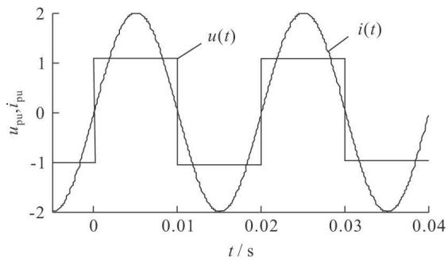  
图3 方波形的电弧电压

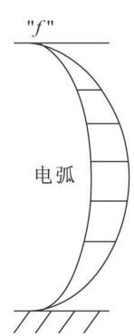  
Fig ．3 Arc voltage   
(a)电弧故障

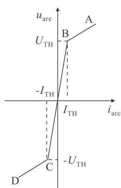  
(b)电弧转移特性

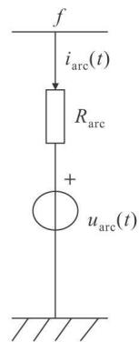  
(c)电弧电路等效模型  
图4 电弧转移特性及等效模型

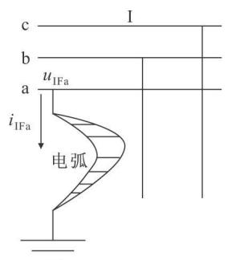  
Fig ．4 Transfer characteristic and equivalent model of arc

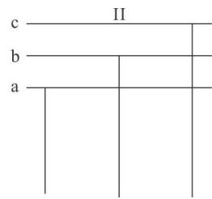

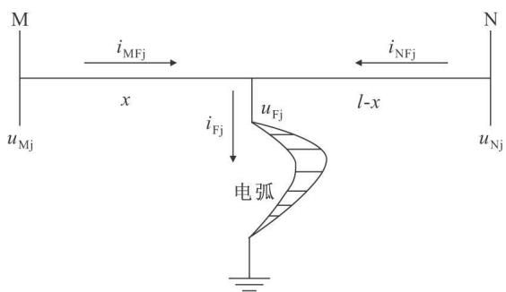  
图5 Ⅰ回线单相故障示意图  
Fig ．5 Diagra m of si ngle phase fault of li ne Ⅰ   
图6 输电线路电弧故障示意图  
Fig ．6 Arc fault diagra m of the trans mission li ne

$$
i _ {N j} \left(t + \left(l _ {A 1 1} - x\right) / v _ {j}\right) \left(Z _ {i} + r _ {j} \left(l _ {A 1 1} - x\right) / 4\right) -
$$

$$
\begin{array}{l} \frac {1}{2 Z _ {j}} \frac {Z _ {i} - r _ {j} (l - x) / 4}{Z _ {j}} \left(u _ {\mathrm {N j}} \left(t - (l - x) / v _ {j}\right) + \right. \\ i _ {N j} \left(t - (l - x) / v _ {j}\right) \left(Z _ {j} - r _ {j} (l - x) / 4)\right) - \\ \frac {1}{2 Z _ {j}} \frac {r _ {j} (l - x)}{2 Z _ {j}} \left(u _ {\mathrm {N j}} (t) - i _ {\mathrm {N j}} (t) \frac {r _ {j} (l - x)}{4}\right)) 。 \tag {29} \\ \end{array}
$$

由式（28） 、（29） 可以得到故障点的j 模电流

$$
i _ {\mathrm {F} j} (t) = i _ {\mathrm {M F} j} (t) = i _ {\mathrm {N F} j} (t) 。 \tag {30}
$$

求出故障点各模的电压、电流后‚以IA 故障为例 由相模反变换式 可以得到故障相在故障点的电压、电流分别为 $u _ { \mathrm { I A F } } ( t )$ 和 $i _ { \mathrm { I A F } } ( t )$ ‚并将其离散化为 $u _ { \mathrm { I A F } } ( ~ n )$ 和i $\operatorname { I A F } ^ { } ( n )$ 。

由图 可知 当处于电弧转移特性的 段或CD 段时［ 15］ ‚与之对应的时段内 $u _ { \mathrm { a r c } } ( t )$ 及R 可保持不变‚则过渡电阻R 及 $\boldsymbol { \mathbf { } } \boldsymbol { u } _ { \mathrm { a r c } } ( t )$ 可用电压、电流采样值表示为：

$$
R = \frac {u _ {\mathrm {I F a}} (n) - u _ {\mathrm {I F a}} (n - 1)}{i _ {\mathrm {I F a}} (n) - i _ {\mathrm {I F a}} (n - 1)}; \tag {31}
$$

$$
u _ {\text {a r c}} (n) = u _ {\mathrm {I A F}} (n) - R _ {\mathrm {I A F}} (n) 。 \tag {32}
$$

考虑到偶然误差对测量精度的影响 本文利用最小二乘法来减少误差 求取多个 R 并以各个 R的均方差 $E _ { \mathrm { r } }$ 的平方最小为目标时求得的x 为最终的故障距离 即

$$
E _ {r} = \sum_ {j = 1} ^ {N} \left(R _ {j} - \bar {R}\right) ^ {2} 。 \tag {33}
$$

式中‚N 为求取 $R _ { j }$ 的个数； $\overline { { R } } = \frac { 1 } { N } ( \sum _ { j } ^ { N } R _ { j } )$ 。

本文只给出了单回线的单相接地故障的测距算法推导过程 其他的双回线故障类型也可推导出类似式 所示的简单关系 进而实现故障测距

# 3 仿真验证

本文以 双电源系统对线路发生各种单回线故障和跨线故障用 进行仿真 仿真简化模型图如图 所示 线路两端等效电源相角差为 $2 5 ^ { \circ }$ 电源幅值为标么值和 倍标么值 其端的系统等效正序阻抗 $Z _ { \mathrm { m } 1 }$ 60.00Ω;零序阻抗 $Z _ { \mathrm { m } { ^ 0 } } \mathrm { = 4 6 . 8 0 } \Omega _ { \mathrm { c } }$ 端的系统等效正序阻抗 $Z _ { \mathrm { n } } 1$ 零序阻抗 $Z _ { \mathrm { n } 0 } \mp 2 2 . 0 1 \Omega$ 线路参数单回线正序阻抗 $Z _ { 1 } = 0 . 0 6 4 6 8 + \mathrm { \bf j } \ 0 . 5 2 2 3 \ \Omega / \mathrm { k m }$ 单回线零序阻抗 $Z _ { 0 } = 0 . 2 2 3 1 \not = \not { p } \ : 2 . 3 7 1 \ : \Omega / \exp \left( \not { p } \right)$ 双回线零序互阻抗 $Z _ { ^ { 0 } \mathrm { M } } = 0 . 1 3 8 5 + \mathrm { j } \ 0 . 9 2 5 \ \Omega / \mathrm { k m }$ 单回线正序电容 $C _ { 1 } { = } 0 . 0 1 0 9 5 ~ { \mu } _ { \mathrm { { F } } } / \mathrm { k m }$ 单回线零序电容 $C _ { 0 } { = } 0 . 0 0 6 7 3 ~ { \mu } _ { \mathrm { ~ F ~ } } ( \mathbf { k } \mathbf { m }$ 双回线零序互容 $C _ { { \mathrm { 0 M } } } { = } 0 . 0 4 6 ~ \mu _ { \mathrm { F } }$ ／km。

采样频率 $f = 1 0 \mathbf { k } \ : \mathrm { H z }$ 计算数据窗为故障发生后的一个周期内的数据 利用故障生成的数据和线路参数 在 中编制程序来实现测距 为了使

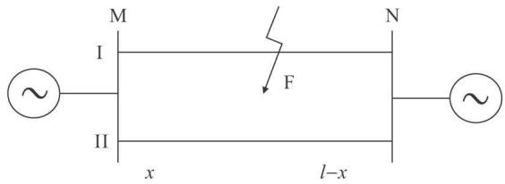  
图7 简化双回线系统仿真模型图

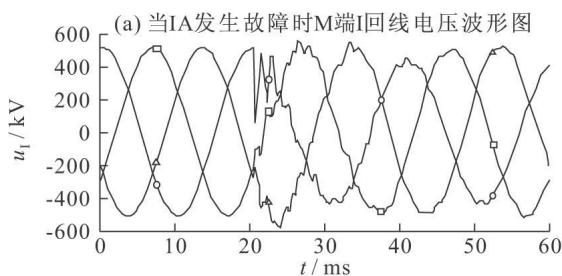  
Fig ．7 Si mplified parallel li ne model for si mulation

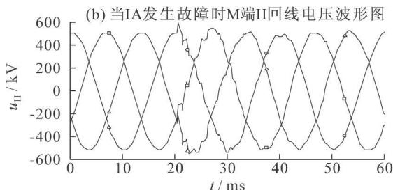

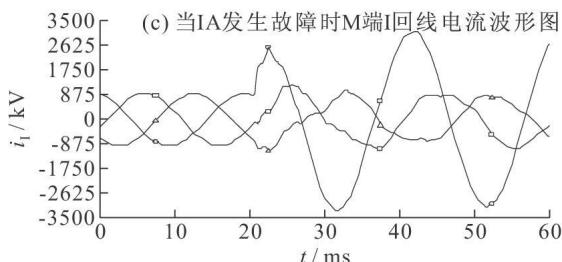

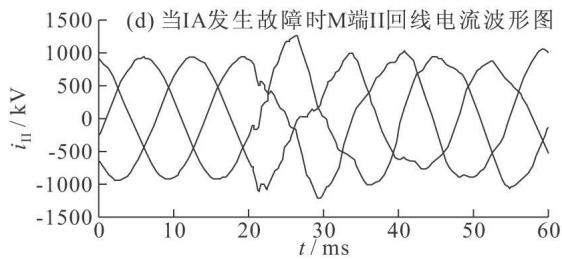  
图8 M端电压电流波形图  
Fig ．8 Voltage and current wavefor m at ter mi nal M

所用到的采样值对应于电弧转移特性 图 的或 段 设置一门槛电流i 具体数值为故障相电流幅值的

下面列出了故障测距的部分结果 表 为不同故障类型的仿真结果 表 为不同过渡电阻的仿真结果 为了考察对端系统阻抗对该算法的影响 特意改变了对端的系统阻抗 表 列出了不同系统阻抗时的测距结果 图 给出了 发生金属性故障时的故障波形图

从表1和表2可以看出‚对于不同故障类型‚该

表1 发生金属性故障时不同故障类型仿真结果  
Tab ．1 Si mulation results under different fault types   

<table><tr><td>故障类型</td><td>实际故障距离 /km</td><td>计算故障距离 /km</td><td>测距误差/%</td></tr><tr><td rowspan="3">IA</td><td>100</td><td>99.2358</td><td>0.7642</td></tr><tr><td>150</td><td>150.6954</td><td>0.6954</td></tr><tr><td>250</td><td>249.7686</td><td>0.2314</td></tr><tr><td rowspan="3">IBC</td><td>100</td><td>98.6532</td><td>0.3468</td></tr><tr><td>150</td><td>149.6254</td><td>0.3746</td></tr><tr><td>250</td><td>250.2538</td><td>0.2538</td></tr><tr><td rowspan="3">I ABC</td><td>100</td><td>99.6235</td><td>0.3765</td></tr><tr><td>150</td><td>151.2587</td><td>0.2587</td></tr><tr><td>250</td><td>250.8762</td><td>0.8762</td></tr><tr><td rowspan="3">I AII BCG</td><td>100</td><td>99.7549</td><td>0.2451</td></tr><tr><td>150</td><td>150.4877</td><td>0.4877</td></tr><tr><td>250</td><td>250.6524</td><td>0.6524</td></tr><tr><td rowspan="3">I ABCII A</td><td>100</td><td>99.7564</td><td>0.2436</td></tr><tr><td>150</td><td>148.9789</td><td>1.0211</td></tr><tr><td>250</td><td>250.4845</td><td>0.4845</td></tr><tr><td rowspan="3">I ABI IBC</td><td>100</td><td>99.8790</td><td>0.1210</td></tr><tr><td>150</td><td>150.8940</td><td>0.8940</td></tr><tr><td>250</td><td>250.7862</td><td>0.7862</td></tr><tr><td rowspan="3">I ABCII BC</td><td>100</td><td>99.8795</td><td>0.1205</td></tr><tr><td>150</td><td>150.2157</td><td>0.2157</td></tr><tr><td>250</td><td>250.2369</td><td>0.2369</td></tr><tr><td rowspan="3">IBIIC</td><td>100</td><td>99.7892</td><td>0.2108</td></tr><tr><td>150</td><td>150.7891</td><td>0.7891</td></tr><tr><td>250</td><td>250.3489</td><td>0.3489</td></tr></table>

注 分别表示第 回线 分别表示各相序 表示接地

算法的测距最大绝对误差为 对于故障时不同的接地电阻 该算法的测距最大绝对误差为 能满足超高压线路对测距精度的要求 从表 中可以看出 对端系统阻抗的变化对本算法的测距精度没有影响 从上面的测距结果可以看出该测距法对于双回线测距是有效的

# 4 结论

分析表明 用对称分量法变换矩阵对三相系统解耦时 单一模量不能反映所有的故障类型 本文根据能反映所有故障类型的三相系统的新相模变换矩阵和三相系统与双回线系统阻抗矩阵的关系 推导出用单一模量就能反映双回线所有故障类型的模变换矩阵  
b） 应用六相系统新的相模变换对双回线参数

表2 I AIIBCG 故障时不同接地电阻的仿真结果  
Tab ．2 Si mulation results under different ground resistance of I AII BCGfaultk   

<table><tr><td>过渡电阻/Ω (R,R,R,Rg)</td><td>实际故障距离 /km</td><td>计算故障距离 /km</td><td>测距误差/%</td></tr><tr><td>(0,0,0,0)</td><td>100</td><td>99.7549</td><td>0.2451</td></tr><tr><td>(10,10,10,100)</td><td>100</td><td>99.1467</td><td>0.8533</td></tr><tr><td>(100,50,30,100)</td><td>100</td><td>99.4532</td><td>0.5468</td></tr><tr><td>(20,100,20,100)</td><td>100</td><td>100.6387</td><td>0.6387</td></tr><tr><td>(100,50,20,30)</td><td>100</td><td>100.2010</td><td>0.2010</td></tr><tr><td>(50,100,50,100)</td><td>100</td><td>100.6832</td><td>0.6832</td></tr><tr><td>(50,100,50,100)</td><td>100</td><td>100.0242</td><td>0.0242</td></tr></table>

注 R 为各相过渡电阻 $R _ { \mathfrak { g } }$ 为接地电阻

表3 对端系统阻抗变化IA 故障时的仿真结果  
Tab ．3 Si mulation results when syste m i mpedance changes   

<table><tr><td>对端系统阻抗 /Ω</td><td>实际故障距离 /km</td><td>计算故障距离 /km</td><td>测距误差/%</td></tr><tr><td>18.005∠78.94°</td><td>150</td><td>150.65</td><td>0.65</td></tr><tr><td>33.01∠83.94°</td><td>150</td><td>149.35</td><td>0.65</td></tr><tr><td>42.015∠88.94°</td><td>150</td><td>150.34</td><td>0.34</td></tr></table>

完全解耦后 在某一故障模量下 利用电弧电压 电流的转移特性来实现测距。本算法从原理上消除了过渡电阻的影响 直接利用采样值进行测距 不需要滤波环节 需要的数据窗短 只需半个周期 为了减少偶然误差对测距精度的影响 使用最小二乘法来求取故障距离‚提高了测距的精度。

# 参 考 文 献

施 围 电力系统过电压计算 西安 西安交通大学出版社，1998.  
葛耀中 新型继电保护与故障测距原理与技术 西安 西安交通大学出版社  
宋国兵 李 森 康小宁 等 一种新相模变换矩阵 电力系统自动化，2007，34（14)：57-60.  
S ONG Guo-bi ng ‚LI San ‚KANG Xiao-ni ng ‚et al ．A novel phase mode transf or mation matrix[J]·Auto mation of Electric Po wer Syste ms，2007，34(14)：57-60.   
[4Prado AJ,Filho JP，Kuroka wa S,et al ·Egenvalue analyses of t wo par all el li nes usi ng a si ngl e r eal t r ansf or mati on mat ri x［ C］ ∥I EEE Po wer Engi neeri ng Societ y General Meeti ng ．San Francisco ‚CA ‚US A ：I EEE Po wer Engi neeri ng Societ y ‚2005   
杨 博 同杆双回线时变动态相量模型双端故障测距研究南京 河海大学  
和敬涵 张 飚 范 瑜 等 解耦变换在电力系统暂态保护中的应用研穷I]：北京交通大学学报，2006，30（5)．101-104.  
HE Ji ng-han ‚Z HA NG Biao ‚F A N Yu ‚et al ．St udy on t he ap-

plicati on of t he decoupli ng t r ansf or mati on i n po wer syst e m t r an si ent pr ot ecti on ［ J ］ ．Jour nal of Beiji ng Ji aot ong Uni versit y 2006，30(5)：101-104.   
束洪春 高 峰 李卫东 利用单端工频量的高压输电线路故障测距实用方法研究 电工技术学报S HU Hong-chun ‚GAO Feng ‚LI Wei-dong ．A practical f aultl ocati on al gorit h m f or H V t r ans missi on li ne usi ng one end dat a［ J］ ．Transacti ons of Chi na Elect r ot echnical Societ y ‚1998‚13(5：10-15.  
束洪春 司大军 葛耀中 等 高压输电线路电弧故障单端定位时域法新解［J］ ．中国电机工程学报‚2000‚11（3） ：24-29S H U Hong-chun ‚SI Da-j un ‚GE Yao-zhong ‚et al ．A ne w leasterror square method for detectinq and location arc fault in EHVtrans mission li ne［ J］ ．Pr oceedi ngs of t he CSEE ‚2000‚11（3） ：24-29.  
［ 9］ LI A O Y ‚El angovan S ．Di git al dist ance r el ayi ng al gorit h m f or first-zone pr ot ecti on f or par all el t r ans missi on li nes ［ J ］ ．I EEE Pr oceedi ngs －Generati on ‚ Trans missi on and Dist ri buti on 2005，145(5)：531-536.   
束洪春 司大军 葛耀中 等 利用双端不同步数据的高压输电线路故障测距实用算法及其实现 电网技术45-49.S HU Hong-chun ‚SI Da-j un ‚GE Yao-zhong ‚et al ．A ne wleast error square met hod for detecting and Location arc fault inE HV t rans missi on li ne ［ J］ ．Po wer Syst e m Technol ogy ‚200024(2：45-49.  
［ 11］ Prado A J ‚Fil ho J P ‚Kur oka wa S ‚et al ．Non-t ransposed t hree-phase of t wo parall el li nes usi ng a si ngl e real t ransf or mati on mat ri x ［ C］ ∥ I EEE Po wer Engi neeri ng Soci et y Gener al Meeti ng ．SanFrancisco ‚CA ‚US A ：I EEE Po wer Societ y 2005.   
［12］ 束洪春‚司大军‚葛耀中‚等．高压输电线路电弧故障检测与定位最小二乘法新解 电工技术学报S HU Hong-chun ‚SI Da-j un ‚GE Yao-zhong ．A ne w least er-

ror square met hod for detectinq and location arc fault in EHVt rans missi on li ne ［ J ］ ．Transacti ons of Chi na Elect r ot echnicalSociety，2000，15(5)：14-19.

宋国兵 索南加乐 许庆强 等 基于双回线环流的时域法故障 定位 中国电机工程学报 S ONG Guo-bi ng ‚S UONAN Jia-le ‚XU Qi ng-qiang ‚et al ．A novel ti me-do mai n al gorit h m f or l ocati ng f ault s o n par all el t rans missi on li nes by circul ati ng current ［ J］ ．Pr oceedi ngs of t he CSEE，2004，24（3)：24-29.

［ 14］ Nobre D M ‚Boacent ura W C ‚Neves W L A ．Phase-do mai n net wor k equi val ent s f or el ect r o magnetic t r ansient st udies［ C］ ∥ I EEE Po wer Engi neeri ng Societ y General Meeti ng ．San Francisco ‚CA ‚US A ：I EEE Po wer Engi neeri ng Societ y ‚2005

［15］ 李红巍．一种实用的双回线测距方法［J］ ．电力系统自动化1995,19(9 30-33.LI Hong-wei ．An usef ul al gorit h m f or f ault l ocati on of par all elt rans missi on li nes［ J］ ．Aut o mati on of El ect ric Po wer Syst e ms1995，19(9.30-33.

  
S HU Hong-chun Post-doct orat e Professor

# 束洪春

1961－‚男‚博士后‚教授‚博导

主要研究方向为新型继电保护和故障测距 数字信号处理及 应用 电力系统技术等

E-mail ：k mshc ＠si na ．co m

# 刘振松

1982－‚男‚硕士

主要从事电力系统故障测距方面的研究

# 彭仕欣

1980－‚女‚硕士

主要从事新型继电保护与自动化方面的研究

收稿日期 修回日期 编辑 任 明