# Modeling of overhead transmission lines for trapped charge discharge rate studies

J. Morales a,* , J. Mahseredjian b , I. Kocar b , H. Xue b , A. Daneshpooy c

a PGSTech, Montr´eal (Qu´ebec) H2K 1C3, Canada   
b Polytechnique Montreal, Montr´eal (Qu´ebec) H3C3A7, Canada   
c Quanta Technology, Oakland (California) 92673, United States of America

# A R T I C L E I N F O

# Keywords:

Transmission line

Trapped charge

Discharge rate

Wideband model

Numerical Laplace Transform

# A B S T R A C T

This paper presents guidelines for appropriate modeling of overhead transmission lines for trapped charge discharge simulations. At first instance, the traditional Frequency-Dependent model is compared to the more recently developed Wideband model, showing that the former may lead to inconsistent results when simulating a transmission line with trapped charge due to limitations of the inherent fitting approach. Secondly, a sensitivity analysis is presented over the parameters that can affect the trapped charge discharge rate of the transmission line. Once the model is demonstrated to have consistent results, simulations obtained with the resulting model are compared with the Numerical Laplace Transform method, resulting in a good match and validating the model.

# 1. Introduction

A reliable assessment of the trapped charge dynamics on transmission lines following its disconnection from the network is crucial for utilities during operation and maintenance of power systems, not only to avoid service interruptions or damage to equipment, but also and most importantly to establish safe distance practices. For these reasons, power utilities rely on performing electromagnetic transient (EMT) simulations to estimate the decay time of trapped charge in transmission lines as result of switching events. Also, different switching techniques have been developed for the mitigation of transient overvoltages by playing with the trapped charges, examples of such techniques can be found in [1,2] and references therein.

There is a consensus in the literature that accurate representation of transmission lines for EMT-type simulations requires accounting for their distributed-parameters and their frequency-dependent nature. Among the models that account for these two characteristics are the Frequency-Dependent (FD) model [3] and the Wideband (WB) model [4-6]. These two models are available in EMTP software [7] and are widely used by power systems utilities and researchers.

Although the literature on transmission line modeling is rich, the

study of overhead transmission line transient models with particular emphasis on trapped charge studies is poor.

Frequency-dependent line models such as the FD and WB models, are normally granted as adequate for most type of studies since they can cover a large range of frequencies, starting from a low-frequency region (near 0 Hz), including fundamental frequency points (50 or 60 Hz), and up to very high frequencies such as those required for switching transients, surge analysis, or lightning studies (around 100 kHz and higher). However, as demonstrated in this paper, some modeling aspects require special attention to evaluate the decay rate of trapped charges.

In the literature, the study of the decay rate of trapped charges has been mainly performed for underground cables while using simplified models for nearby transmission lines. For instance, in [8] the trapped charge is studied for an underground cable and a combined overhead line/underground cable transmission system, in both cases, the transmission line is modeled as a lumped-parameters circuit. In [9], the transmission line trapped charge decay rate is evaluated for lines connected to voltage transformers, but evidently, the inclusion of voltage transformers modifies the purely transmission line circuit dynamics, furthermore, a simplified lumped-parameters model is used to represent the line. In [10,11], the decay rate of trapped charges for underground

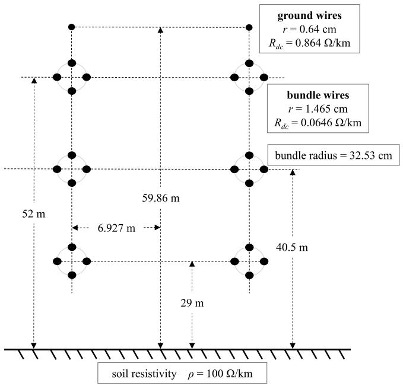  
Fig. 1. Geometry of the double-circuit 550kV transmission line of study.

cables is analyzed and compared with field measurements, however, the buried conditions and the line-to-ground path given by the cable insulator do not apply to overhead transmission lines.

This paper presents a case study in which the transmission line transient model requires special treatment for the simulation of its trapped charge. The goal of the simulation is to assess the discharge rate of the trapped charge following the disconnection of the line. The parameters that affect the discharge rate in simulations are analyzed. The geometry of the transmission line studied in this paper is depicted in Fig. 1 and it has been provided by Quanta Technology [12]. After a few simulation tests, inconsistent results were observed for this case, which motivated the authors of this paper for a deeper analysis of the trapped charge phenomenon.

The rest of the paper is constituted as follows: a brief review of transmission line transient models is presented in section II; in section $\operatorname { I I I } ,$ the FD and WB transient models are compared and analyzed for energization and trapped charge simulations; in section IV, a sensitivity analysis is performed over the parameters that influence the trapped charge discharge rate of the transmission line; in section $\mathrm { v , }$ a transient model is validated with the Numerical Laplace Transform simulation technique.

# 2. Transmission Line Transient Models

The frequency-domain equations for a transmission line k and m

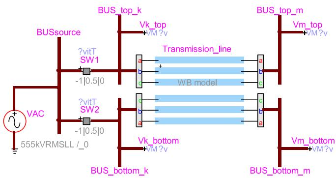  
Fig. 2. Test circuit for the simulations of the transmission line of Fig. 1.

terminal voltages and currents are given by

$$
\mathbf {V} _ {k} (s) - \mathbf {Z} _ {c} (s) \mathbf {I} _ {k} (s) = \mathbf {H} (s) \left[ \mathbf {Z} _ {c} (s) \mathbf {I} _ {m} (s) + \mathbf {V} _ {m} (s) \right], \tag {1}
$$

where $\mathbf { V } _ { k , m } ( s )$ and $\mathbf { I } _ { k , m } ( s )$ denote voltages and currents, respectively; and $\mathbf { Z } _ { c } ( s )$ and $\mathbf { H } ( s )$ denote the characteristic impedance matrix and the propagation function, respectively, defined as

$$
\mathbf {Z} _ {c} (s) = \sqrt {\mathbf {Z} ^ {\prime} (s) / \mathbf {Y} ^ {\prime} (s)} \tag {2}
$$

$$
\mathbf {H} (s) = e ^ {- \gamma \ell} = e ^ {- \sqrt {\mathbf {Z} ^ {\prime} (s) \mathbf {Y} ^ {\prime} (s)} \ell} \tag {3}
$$

where $\boldsymbol { s } = j \omega , \mathbf { Z } ^ { ' } = \mathbf { R } ^ { ' } ( s ) + s \mathbf { L } ^ { ' } ( s )$ and $\mathbf { Y } ^ { \prime } = \mathbf { G } ^ { \prime } + s \mathbf { C } ^ { \prime } ,$ , being $ { \mathbf { R } } ^ { ' }$ and $\mathbf { L } ^ { ' }$ the per-unit-length (p.u.l.) series resistance and inductance matrices, respectively; and $\mathbf { G } ^ { ' }$ and $\mathbf { C } ^ { ' }$ being the p.u.l. shunt conductance and capacitance matrices, respectively. We refer to [14] for details.

According to the traditional Line Constants formulas [14], R′ and L′ are frequency dependent matrices, whereas $\mathbf { G } ^ { ' }$ and $\mathbf { C } ^ { ' }$ are constant matrices given that only the spatial admittance component is considered.

Note that in general, $\mathbf { G } ^ { ' }$ and $\mathbf { C } ^ { ' }$ are also frequency dependent if the earth return admittance path is considered as reported in [13]. However, as it is discussed in [13], the earth return admittance path only has a significant impact in the high frequency region (above several MHz), thus it is a common practice to neglect it.

Alternatively, the insulators chain leakage current can be considered in the form of an additional shunt conductance component. However, this leakage current is difficult to assess since it depends on several factors, such as the voltage level, the insulator material, the number of insulators in the string, and pollution and humidity conditions [15,16].

In addition to the abovementioned Line Constants formulas, the transmission line p.u.l. parameters can be obtained using Finite Element-based methods [17,18] or via the MoM-SO technique [19]. In this paper the Line Constants routine from EMTP is used. Note that this routine, uses a predefined diagonal $\mathbf { G } ^ { ' }$ matrix to ensure numerical stability of simulations. The influence of this parameter is crucial in trapped charge simulations as demonstrated later in this paper.

Electromagnetic transient simulations require solving (1) for the voltages and currents at the k and m ends of the line at every time-point. To do so, $\mathbf { Z } _ { c } ( s )$ and H(s), are synthetized via a curve-fitting approach to obtain rational function models of the type

$$
\mathbf {Z} _ {c} (s) = \sum_ {i = 1} ^ {N} \frac {\mathbf {R} _ {i}}{s - a _ {i}} + \mathbf {D} \tag {4}
$$

$$
\mathbf {H} (s) = \left(\sum_ {i = 1} ^ {M} \frac {\mathbf {K} _ {i}}{s - p _ {i}} + \mathbf {Q}\right) e ^ {- s \tau} \tag {5}
$$

where $\mathbf { R } _ { i }$ and $\mathbf { K } _ { i }$ denote the residues matrices; $a _ { i }$ and $p _ { i }$ denote the poles; matrices D and Q are constant, real matrices that dictate the asymptotic response to the rational functions; and $N ,$ M denote the order of the corresponding approximations.

Note that unlike $\mathbf { Z } _ { c } ( s ) .$ , the fitting of H(s) requires the travelling wave time-delay (τ) identification, we refer to [20] for details. Rational models in (4) and (5) can be readily discretized via numerical integration techniques for time-domain simulations.

In this paper, the Frequency-Dependent (FD) [3] and Wideband (WB) models $[ 5 , 6 ]$ are compared. These two models represent the frequency dependent and distributed parameters of transmission lines. The main difference between them is that the former identifies the $\mathbf { Z } _ { c } ( s )$ and H(s) in the modal domain using constant and purely real transformation matrices as an approximation, whereas the WB model identifies the line functions directly in phase domain (without any approximations). Also, note that the WB model fits the characteristic admittance $\mathbf { Y } _ { c } ( s )$ instead of the characteristic impedance. Another important difference is that the

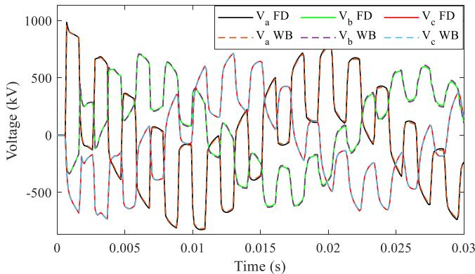  
Fig. 3. Transient voltages measured at bus BUS_top_m resulting from the energization of the line.

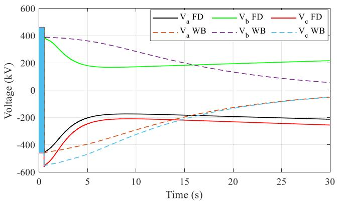  
Fig. 4. Voltages measured at bus BUS_top_m after opening of switches SW1 and SW2 for FD vs WB models.

FD model uses a Bode-based fitting approach and employs a constant and arbitrarily imposed value of $\mathbf { G } ^ { ' }$ for improving the convergence of the fitting [21] whereas the WB model uses the Vector Fitting method [22] and there is no specific restriction on the choice of $\mathbf { G } ^ { ' }$ .

# 3. FD and WB Model Comparison

The analysis of the transmission line in Fig. 1 is started with the comparison of the FD and WB models in EMTP with default settings. These settings include a frequency range from 0.1 Hz to 10 MHz, with logarithmic sampling and using 10 samples per decade. The default value for the shunt conductance parameter $\bar { \mathbf { G } ^ { ' } } \mathrm { i } s 2 \times 1 0 ^ { - 1 0 }$ S/km. In most cases, these settings are well suited for switching transients. The circuit used for all tests in this paper is shown in Fig. 2.

As initial test, the energization of the transmission line is evaluated. The closing time of switches are 0.1ms, 0.1255ms and 0.1614ms for phases $a , \ b ,$ and $c ,$ respectively (generated randomly). The resulting voltages measured at BUS_top_m are shown in Fig. 3 for both the FD and WB models. This figure shows a close match between the two models, confirming that the default model settings are adequate for energization switching events.

As a complementary test for these models, the trapped charge in the transmission line is evaluated. For this new test, the circuit of Fig. 2 is initialized in steady-state with switches SW1 and SW2 closed. At time 0.5s, SW1 and SW2 are opened, leaving a trapped charge on the line. Note that the switches are set to open at the closest zero-crossing of the switch current from its opening time. The resulting voltages are shown in Fig. 4. Unlike previous test, Fig. 4 shows a large discrepancy between FD and WB models. Also, an unrealistic raise in the voltages for the FD model is observed, whereas the WB model shows a normal decay of the trapped charge.

Table 1 Test models with differen $f _ { m i n }$ values   

<table><tr><td>Model</td><td>fmin(Hz)</td><td>Number of decades</td></tr><tr><td>fmin1</td><td>0.1</td><td>8</td></tr><tr><td>fmin2</td><td>1 × 10-3</td><td>10</td></tr><tr><td>fmin3</td><td>1 × 10-5</td><td>12</td></tr><tr><td>fmin4</td><td>1 × 10-7</td><td>14</td></tr></table>

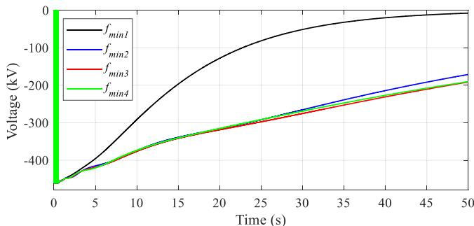

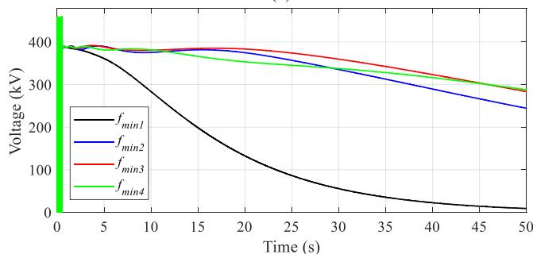

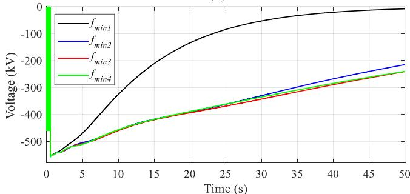  
(b)   
（c）  
Fig. 5. Voltages measured at bus BUS_top_m for models in TABLE I, (a) phase a, (b) phase b and (c) phase c.

Note that the only possible manner that the voltages of an open circuited line could increase is due to the induced voltages from other phases, however, in Fig. 4 all phases show a raise in its voltage which is abnormal. The reason for this incorrect response comes from the fact that the FD model fits the frequency response of the line in the modal domain with a constant transformation matrix which is an approximation and leads to an error in the phase domain responses. Furthermore, the shunt conductance parameter is imposed with an intrinsic value for improving the stability of the fitting which is another source of error. Note that a more detailed analysis of the FD model is beyond the scope of this paper.

Since the FD model was found with an unrealistic behavior for this example, the analyses in next sections are mainly focused to exploring the WB model. Also, note that the poor performance of the FD model could be improved by modifying some fitting parameters as explained later.

TABLE II Test Models with Different Shunt Conduc tance (G′ )   

<table><tr><td>Model</td><td>G&#x27; (S/km)</td></tr><tr><td>G&#x27;1</td><td>1 × 10-12</td></tr><tr><td>G&#x27;2</td><td>1 × 10-10</td></tr><tr><td>G&#x27;3</td><td>1 × 10-9</td></tr><tr><td>G&#x27;4</td><td>1 × 10-8</td></tr></table>

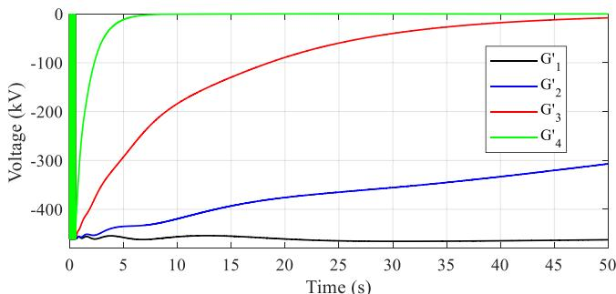

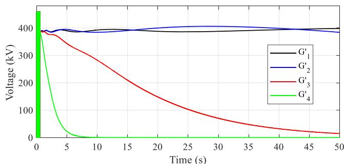  
(b)

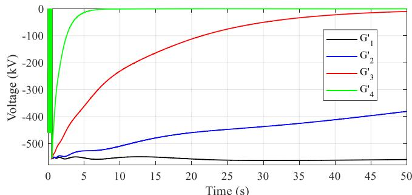  
  
Fig. 6. Voltages measured at bus BUS_top_m for models in TABLE II, (a) phase a, (b) phase b and (c) phase c.

# 4. Sensitivity Analysis on The Transmission Line Modelling Settings

This section demonstrates how the decay rate of the trapped charge of the transmission line of Fig. 1, can be significantly affected by modifying two parameters of the transient model, namely $f _ { m i n }$ and $\mathbf { G } ^ { ' }$ . The former refers to the lower bound of the frequency band of fitting, and the latter refers to the p.u.l. shunt conductance matrix of the transmission line, as described in section II.

# 4.1. Variation of the frequency range of fitting

WB models with different $f _ { m i n }$ values as given in TABLE I are compared. Note that the number of decades is adjusted to maintain the

upper frequency bound to 10 MHz for all models. The resulting trapped charge voltages for the models of TABLE I are shown in Fig. 5 (a), (b), and (c). From these figures, it can be observed that the model fmin1, shows a faster discharge rate compared to the rest of the models. Fig. 5 also reveals that as $f _ { m i n }$ is reduced, the trapped charges curves converge as can be observed for models $f _ { m i n 3 }$ and $f _ { m i n 4 . }$ , which are the closest among them. From this test, it can be concluded that for trapped charge discharge simulations, it is crucial to appropriately set the low frequency bound of the transient model for obtaining reliable results. For this case, $f _ { m i n } { = } 1 \times 1 0 ^ { - 5 }$ Hz or lower should be selected.

As for the FD model, modifying the fitting frequency range may also affect the trapped charge discharge rate (not shown due to the limited space) resulting in a more realistic behavior than in previous section.

Alternative techniques for enforcing the line fitting at low frequencies are available in [6,23]. However, these methods are not explored in this paper since it is demonstrated that an appropriate selection of $f _ { m i n }$ is enough to obtain reliable results for the case study presented.

# 4.2. Variation of the shunt conductance parameter

From previous section, models $f _ { m i n 3 }$ and $f _ { m i n 4 }$ were observed to show a consistent behavior. Then, mode $f _ { m i n 4 }$ is adopted here for the study of the impact of $\mathbf { G } ^ { ' }$ . The values tested for $\mathbf { G } ^ { ' }$ are given in TABLE II. The

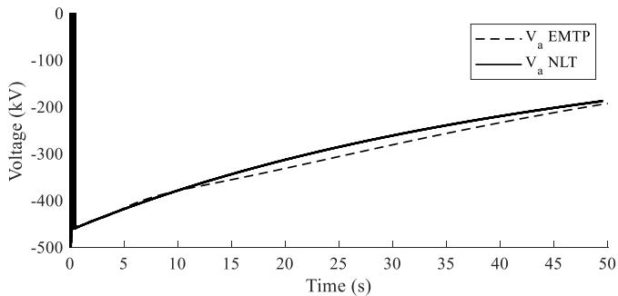

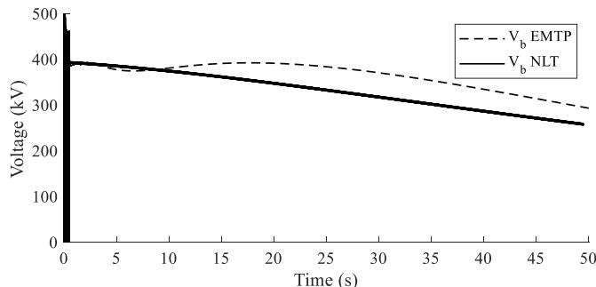  
(b)

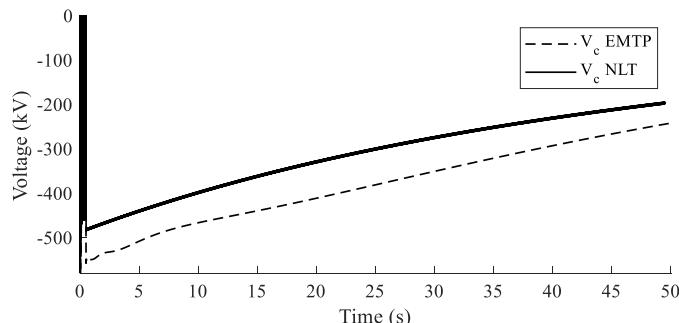  
（c）  
Fig. 7. Voltages measured at bus BUS_top_m using EMTP and the NLT method, (a) phase a, (b) phase b and (c) phase c.

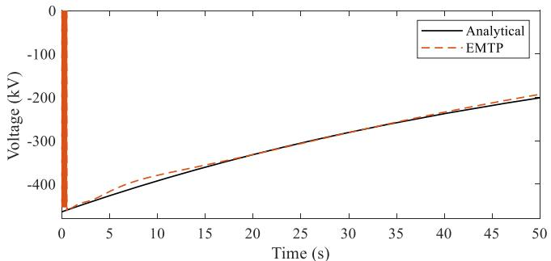  
Fig. 8. Voltage measured at bus BUS_top_m phase a using EMTP and the analytical RC circuit discharge curve.

transient voltages measured at BUS_top_m using these models are shown in Fig. 6 (a), (b), and (c). These figures show how the decay rate of the trapped charge depends on $\mathbf { G } ^ { ' }$ and as it decreases, the trapped charge discharge rate also decreases as expected.

As discussed in section $\mathrm { I I } ,$ the G′ parameter represents the transmission line leakage current through the insulators string, which is difficult to assess. We refer to [11,15] for a more detailed study on the subject and for some values of $\mathbf { G } ^ { ' }$ obtained from field measurements. Note that arbitrarily setting $\mathbf { G } ^ { ' }$ is not recommended [15]. However, this paper explores this alternative for demonstration purposes.

# 5. Model Validations with the Numerical Laplace Transform Method

At this stage, the parameters that affect the trapped charge discharge rate in transient simulations $( f _ { m i n }$ and $\mathbf { G } ^ { \prime } )$ have been analyzed. The only potential source of error remaining is from the curve-fitting procedure applied to the transmission line characteristic impedance and propagation function, $\mathbf { Z } _ { c } ( s )$ defined in (2) and $\mathbf { H } ( s )$ defined in $^ { ( 3 ) , }$ as discussed in section II.

For the verification of any potential errors in the fitting of these functions, the Numerical Laplace Transform (NLT) simulation technique as reported in [24] is used. By using the NLT, the simulation of the transmission line is directly performed in the frequency domain, i.e., without the need of identifying equivalent rational models. Details about the NLT implementation used in this paper are given in the Appendix.

The mode $f _ { m i n 4 }$ from section IV.A is adopted for verification with the NLT simulation. The shunt conductance parameter $\mathbf { G } ^ { ' }$ is set to $2 \times 1 0 ^ { - 1 0 }$ S/km, as suggested by default in EMTP. With these settings, the WB transient model is once more calculated. The trapped charge voltages measured at BUS_top_m simulating the transmission line with EMTP and with the NLT are shown in ${ \mathrm { F i g . } } 7 \left( { \mathrm { a } } \right) , \left( { \mathrm { b } } \right)$ , and (c).

From Fig. 7 (a), a close match is observed between both simulation methods. From Fig. 7 (b) and (c), some differences are observed in the trapped charge (as given by the voltage magnitude), these differences occur because the opening of switches in NLT and EMTP simulations do not occur at exactly the same time sample since the zero-crossing of switches currents are slightly shifted. Despite these differences, the decay rate of the trapped charge presented in Fig. 7 (a), (b) and (c) between EMTP and NLT is similar and a good agreement can be declared. This test discards any significant errors in the fitting of the transmission line frequency response and validates the results obtained in this and in previous sections.

As a complementary verification of the trapped charge decay rate obtained by simulations as shown in Fig. 7, the decay rate is verified with the time constant of the RC circuit formed by the shunt admittance

branch of the transmission line as suggested in [8]. For this analysis, the single-phase trapped charge voltage is considered to behave as

$$
V (t) = V _ {\max } e ^ {- t / R C} = V _ {\max } e ^ {- t / \tau} \tag {6}
$$

The phase-a to ground capacitance for the model evaluated in this section is $1 1 9 . 7 \mu \mathrm { F }$ and the resistance (calculated as $1 / \mathbf { G } ^ { ' } )$ is $5 \times { 1 0 } ^ { 9 } { \Omega } _ { \mathrm { { } } }$ . Giving a time constant of

$$
\tau = R C = 5 9. 8 4 \mathrm {s} \tag {7}
$$

The exponential decaying curve with the time constant obtained in (7) is shown in Fig. 8 and compared with EMTP simulation results. A good match with the decay rate obtained via simulation is observed. Note that this procedure is an approximation since the mutual capacitances (phase-to-phase) are neglected.

# 6. Conclusions

This paper presents an analysis of the parameters that affect the discharge rate of the trapped charge in transmission line transient models. From the tests presented, the following conclusions are obtained:

1 When comparing the FD and WB line models in EMTP, the FD model resulted in unrealistic behavior for the trapped charge discharge rate. Therefore, the WB model is recommended for such studies.   
2 An inappropriate selection of the lower bound for the frequency band of fitting $( f _ { m i n }$ in this paper) may lead to inaccurate results of the trapped charge discharge rate. The reason is that the decay rate of the trapped charge is a very low frequency phenomenon, and the fitting should ensure that these parameters are correctly represented in the model at near DC frequencies. Therefore, to minimize the inaccuracies due to out of band errors, a sufficiently low frequency point needs to be selected for fitting. It is recommended to perform a sensitivity analysis by decreasing $f _ { m i n }$ until observing convergence in the simulation results.   
3 The decay rate of trapped charge is directly related to the magnitude of the shunt admittance parameter. When the appropriate model and frequency band settings are selected, the p.u.l. shunt conductance $\mathbf { G } ^ { ' }$ parameter will impose the trapped charge decay rate as expected.

Simulation results for the WB model have been verified with the Numerical Laplace Transform technique, resulting in good agreement. Also, the decay rate was verified with a simple but efficient procedure using circuit analysis for the shunt admittance branch of the transmission line.

# CRediT authorship contribution statement

J. Morales: Conceptualization, Methodology. J. Mahseredjian: Supervision. I. Kocar: . H. Xue: . A. Daneshpooy: .

# Declaration of Competing Interest

The authors declare that they have no known competing financial interests or personal relationships that could have appeared to influence the work reported in this paper.

# Acknowledgment

The authors gratefully acknowledge Ali Daneshpooy, and Vinit Marathe from Quanta Technology for their initiative in studying the transmission line case presented in this paper.

# Appendix

The methodology adopted in this paper for the application of the Numerical Laplace Transform (NLT) technique is taken from [24]. The Laplace complex variable s is sampled from its DC component (0 Hz) up to the maximum frequency $( f _ { m a x } )$ appended to its complex conjugated part flipped, as follows

$$
s = \left[ \begin{array}{l l l l l l l} s _ {0} & s _ {f _ {1}} & \dots & s _ {f _ {\max }} & s _ {f _ {\max }} ^ {*} & \dots & s _ {f _ {1}} ^ {*} \end{array} \right] \tag {8}
$$

or, equivalently,

$$
s = \left[ \begin{array}{l l l l} \sigma & \sigma + j \Delta \omega & \sigma + j 2 \Delta \omega & \dots \quad \sigma + j N \Delta \omega \\ \sigma - j N \Delta \omega & \dots & \sigma - j 2 \Delta \omega & \sigma - j \Delta \omega \end{array} \right] \tag {9}
$$

where σ is the Laplace damping coefficient, Δω is the frequency step, obtained by dividing the frequency range of observation by the number of samples, and N is the sample corresponding to fmax.

A Hanning window, as illustrated in Fig. 9, is used to reduce the Gibbs oscillations when calculating the inverse numerical Laplace Transform.

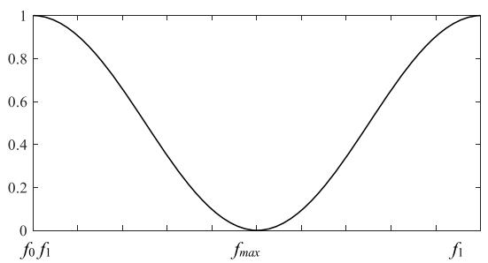  
Fig. 9. Hanning window used in the Numerical Laplace Transform method.

# References

[1] D. Barros, W. Neves, K. Dantas, Controlled switching of series compensated transmission lines: challenges and solutions, IEEE Trans. Power Del. 35 (1) (Feb. 2020) 47–57, https://doi.org/10.1109/TPWRD.2019.2916807.   
[2] M.A. Atefi, M. Sanaye-Pasand, Improving Controlled Closing to Reduce Transients in HV Transmission Lines and Circuit Breakers, IEEE Trans. Power Del. 28 (2) (April 2013) 733–741.   
[3] J.R. Marti, Accurate modelling of frequency-dependent transmission lines in electromagnetic transient simulations. IEEE Transactions on Power Apparatus and systems, Jan. 1982, pp. 147–157. PAS-101.   
[4] A. Morched, B. Gustavsen, M. Tartibi, A universal model for accurate calculation of electromagnetic transients on overhead lines and underground cables, IEEE Trans. Power Del. 14 (3) (July 1999) 1032–1038.   
[5] I. Kocar, J. Mahseredjian, Accurate frequency dependent cable model for electromagnetic transients, IEEE Trans. Power Del. 31 (3) (June 2016) 1281–1288.   
[6] M. Cervantes, I. Kocar, J. Mahseredjian, A. Ramirez, Partitioned fitting and DC correction for the simulation of electromagnetic transients in transmission lines, IEEE Power Del. Lett. 33 (6) (Dec. 2018) 3246–3248.   
[7] J. Mahseredjian, S. Dennetiere, L. Dube, B. Khodabakhchian, L. Gerin-Lajoie, On a new approach for the simulation of transients in power systems, Electric Power Syst. Res. 77 (Sep. 2007) 1514–1520.   
[8] I.R. Pordanjani, Y. Wang, R. Cui, E. Amiri, Discharge characteristics of trapped charge in power lines with underground cable and overhead line segments, in: 2016 IEEE/IAS 52nd Industrial and Commercial Power Systems Technical Conference (I&CPS), Detroit, MI, 2016, pp. 1–6, https://doi.org/10.1109/ ICPS.2016.7490229.   
[9] K. Kano, Y. Kawabuchi, K. Uchida, T. Yashiro and T. Shibata, "Line trapped charge discharging characteristic of gas insulated magnetic voltage transformer," in IEEE Transactions on Power Delivery, vol. 7, no. 1, pp. 370-375, Jan. 1992, doi: 10.1109/61.108880.

[10] I. Lafaia et al., "Experimental and theoretical analysis of cable discharge," in IEEE Transactions on Power Delivery, vol. 32, no. 4, pp. 2022-2030, Aug. 2017, doi: 10.1109/TPWRD.2016.2602361.   
[11] S. Robson, A. Haddad, S. Dennis, F. Ghassemi, Non-contact measurement and analysis of trapped charge decay rates for cable line switching transients, Energies 13 (5) (2020) 1142.   
[12] https://quanta-technology.com/.   
[13] A. Ametani, Y. Miyamoto, Y. Baba and N. Nagaoka, "Wave propagation on an overhead Multiconductor in a high-frequency region," in IEEE Transactions on Electromagnetic Compatibility, vol. 56, no. 6, pp. 1638-1648, Dec. 2014, doi: 10.1109/TEMC.2014.2314720.   
[14] J.A. Martinez-Velasco, A.I. Ramirez, M. Davila, Power System Transients, Chapter 2: Overhead Lines, CRC Press Taylor & Francis Group, 2010, pp. 17–135.   
[15] A. B. Fernandes, W. L. A. Neves, E. G. Costa and M. N. Cavalcanti, "Transmission line shunt conductance from measurements," in IEEE Transactions on Power Delivery, vol. 19, no. 2, pp. 722-728, April 2004, doi: 10.1109/ TPWRD.2003.822526.   
[16] N.A. Othman, M.A.M. Piah, Z. Adzis, Leakage current and trapped charge characteristics for glass insulator string under contaminated conditions, in: 2015 IEEE Conference on Energy Conversion (CENCON), Johor Bahru, 2015, pp. 259–262, https://doi.org/10.1109/CENCON.2015.7409550.   
[17] J. Weiss and Z. J. Csendes, "A one-step finite element method for multiconductor skin effect problems," in IEEE Transactions on Power Apparatus and Systems, vol. PAS-101, no. 10, pp. 3796-3803, Oct. 1982, doi: 10.1109/TPAS.1982.317065.   
[18] B. Gustavsen, A. Bruaset, J. J. Bremnes and A. Hassel, "A finite-element approach for calculating electrical parameters of umbilical cables," in IEEE Transactions on Power Delivery, vol. 24, no. 4, pp. 2375-2384, Oct. 2009, doi: 10.1109/ TPWRD.2009.2028481.   
[19] U. R. Patel and P. Triverio, "MoM-SO: a complete method for computing the impedance of cable systems including skin, proximity, and ground return effects," in IEEE Transactions on Power Delivery, vol. 30, no. 5, pp. 2110-2118, Oct. 2015, doi: 10.1109/TPWRD.2014.2378594.   
[20] I. Kocar and J. Mahseredjian, "New procedure for computation of time delays in propagation function fitting for transient modeling of cables," in IEEE Transactions on Power Delivery, vol. 31, no. 2, pp. 613-621, April 2016, doi: 10.1109/ TPWRD.2015.2444880.   
[21] H.W. Bode, Network Analysis and Feedback Amplifier Design, Van Nostrand, New York, 1945.   
[22] B. Gustavsen, A. Semlyen, Rational approximation of frequency domain responses by vector fitting, IEEE Trans. Power Del. 14 (3) (July 1999) 1052–1061, https:// doi.org/10.1109/61.772353.   
[23] H. M. J. De Silva, A. M. Gole and L.M. Wedepohl, “Accurate electromagnetic transient simulations of HVDC cables and overhead transmission lines,” IPST 2007.   
[24] P. Moreno, A. Ramirez, Implementation of the numerical laplace transform: a review task force on frequency domain methods for EMT studies, working group on modeling and analysis of system transients using digital simulation, general systems subcommittee, IEEE power engineering society, IEEE Trans. Power Del. 23 (4) (Oct. 2008) 2599–2609, https://doi.org/10.1109/TPWRD.2008.923404.