# 一种级联 H 桥型电力电子变压器电磁暂态解耦与仿真模型

许明旺1, 马嘉昊1, 李蕴红2, 王潇2, 姚蜀军1, 汪燕1, 韩民晓1

（1.华北电力大学电气与电子工程学院，北京市昌平区102206；  
2. 华北电力科学研究院有限责任公司，北京市 西城区 100045)

# Electromagnetic Transient Decoupling and Simulation Model of Cascaded H-bridge Power Electronic Transformer

XU Mingwang $^{1}$ , MA Jiahao $^{1}$ , LI Yunhong $^{2}$ , WANG Xiao $^{2}$ , YAO Shujun $^{1}$ , WANG Yan $^{1}$ , HAN Minxiao $^{1}$

(1. School of Electrical and Electronic Engineering, North China Electric Power University,

Changping District, Beijing 102206, China;

2. North China Electric Power Research Institute Co., Ltd., Xicheng District, Beijing 100045, China)

ABSTRACT: The detailed electromagnetic transient model of the power electronic transformer (PET) has the problems of high matrix dimension, small simulation step and slow speed. Based on the semi-implicit delay decoupling electromagnetic transient simulation, this paper applies it to the electromagnetic transient fast simulation research of the cascaded H-bridge power electronic transformer (CHB-PET), and proposes a decoupling and fast simulation with simple decoupling circuit, constant admittance matrix, and easy parallel and high simulation efficiency. In this paper, first, based on the state equation, a semi-implicit delay decoupling model of dual active bridge (DAB) was established by using the matrix splitting and the delay technique. Then, the equivalent decoupling value path was given when the outer port and the cascaded H-bridge adopted different series and parallel combinations. The fine-grained decoupling of each transformation stage and between different modules were realized. The calculation flow was given, and the characteristics of the method were analyzed. Finally, an example is given to verify the accuracy and effectiveness of the proposed method.

KEY WORDS: electromagnetic transient simulation; semi-implicit delay decoupling; cascaded H-bridge power electronic transformer; fine-grained decoupling; parallel computing

摘要：电力电子变压器电磁暂态详细模型存在矩阵维数高、

仿真步长小、速度慢的问题。基于半隐式延迟解耦电磁暂态仿真方法，该文将其应用于级联H桥型电力电子变压器的电磁暂态快速仿真研究中，提出一种解耦电路简单、导纳矩阵恒定、易于并行、仿真效率高的解耦和快速仿真方法。该文首先从状态方程出发，利用矩阵分裂和延迟技术，建立双有源桥的半隐式延迟解耦模型；然后给出外端口及级联H桥采用不同串、并联组合时的等值解耦电路，实现了各变换级以及不同模块间的细粒度解耦，给出了计算流程，并分析了方法的特点。最后，通过算例验证了该文方法的准确性和有效性。

关键词：电磁暂态仿真；半隐式延迟解耦；级联H桥型电力电子变压器；细粒度解耦；并行计算

DOI: 10.13335/j.1000-3673.pst.2022.0448

# 0 引言

随着电力系统的日益电力电子化，电力电子变压器(power electronic transformer，PET)成为新能源并网和直流电网中实现电压等级变换及功率路由的一种重要设备[1-3]。高功率、大容量场景中，通常采用隔离型PET，其以双有源桥(dual active bridge，DAB)为中间级，可实现功率大小和方向的灵活调控[4]。DAB单元外接级联H桥(cascaded H-bridge，CHB)后，外部端口通过串并联组合可构成多模块级联的级联H桥型PET (cascaded H-bridge PET, CHB-PET)[5-6]。一般来说，高功率PET的模块众多、拓扑复杂、开关频率高，电磁暂态仿真面临着规模大、矩阵维数高、仿真速度慢等诸多挑战。

文献[7-9]主要针对CHB-PET的PET控制策略进行研究，其仿真采用传统的详细模型，由于高频

变压器的影响，只能选取较小的仿真步长，仿真速度缓慢。

文献[10]基于平均值模型对DAB单元进行暂态情况下的仿真研究。文献[11]针对双有源桥谐振变换器提出一种平均值模型，即通过RL组合支路对变压器进行等效，再将直流电流一个周期内的值用平均电流等效。文献[12]应用平均值模型对单台PET的稳态情况进行仿真验证，并且和开关模型进行了对比。总体来说，平均值模型只关注变换器的外特性而忽略内部动作，仿真精度不高，无法计及设备的内部特性。

文献[13-14]针对PET提出一种提速模型。通过将高频链变压器的原、副边进行一步约等，实现高、低压侧解耦，进而通过嵌套快速求解法消去内部节点，最终得到高、低压解耦的双端口等值电路。文献[15]提出一种基于节点导纳方程预处理的输入串联输出并联(input series output parallel, ISOP)型DAB变换器双端口解耦等效模型，原理与上述方法相同。一方面，一步约等即为进一步延时的前向欧拉，限制了仿真精度和步长的提高；另一方面，PET外部电气量反解其内部电路更新历史电流源的过程，会由于内部电路拓扑复杂而极大影响计算效率。此外，将该方法拓展到多有源桥(multi active bridge，MAB)或者具有类似文献[16]复杂拓扑的中间级场景时，解耦方法需要重新设计，通用性不佳。

文献[17]针对PET细模型仿真效率低下的问题，提出利用级间电容解耦的方法，将复杂的拓扑划分为多个子网络，再采取戴维南等效方法实现多模块拓扑的节点降维。该方法中的电容元件电压和电流间的一步延时解耦，实质上是显式前向欧拉法，其精度和稳定性均有限。此外，由于电容电流是非状态变量，当开关动作时，存在着非状态量突变。为了消除由此可能引起的数值振荡，需要在开关动作时将显式前向欧拉法切换为隐式的后退欧拉法，从而失去解耦特性，进而无法提高仿真速度。

文献[18]中提出一种具有普适性的半隐式延迟解耦方法用于电磁暂态仿真。本文将该方法应用于PET电磁暂态快速仿真的研究。基于该方法，一方面，可实现PET各级电路和子模块间的细粒度解耦与并行仿真。另一方面，解耦后的系统导纳矩阵恒定，可消除因开关高频动作引起的导纳矩阵频繁下、上(lower and upper，LU)三角矩阵重分解而带来的巨大计算量。此外，由于是状态变量之间的解

耦(电容电压和电感电流)，因此当开关动作时，不存在为消除非状态变量突变引起的数值振荡而切换解耦变量积分算法的问题(中心积分切换为后退欧拉)，因而能够始终保持解耦形式的一致性和计算的可并行性。

本文根据半隐式延迟解耦方法的原理，首先，从DAB的状态方程出发，利用矩阵分裂和延迟技术，建立PET的半隐式解耦模型；然后，给出外端口及级联H桥采用不同串、并联组合方式时的等值解耦电路，实现各变换级以及不同模块间的细粒度解耦，给出了计算流程，并分析了方法的特点。最后，通过算例验证了本文方法的准确性和有效性。

# 1 级联H桥型PET拓扑

根据电压等级与功能的不同，PET的功率模块连接方式多样，图1为常用的一种级联H桥型PET三相拓扑，由DAB模块和端口电路构成，图中 $U_{\mathrm{a}}$ 、 $U_{\mathrm{b}}$ 、 $U_{\mathrm{c}}$ 分别为三相电源电压， $L_{11}$ 为桥臂电感。

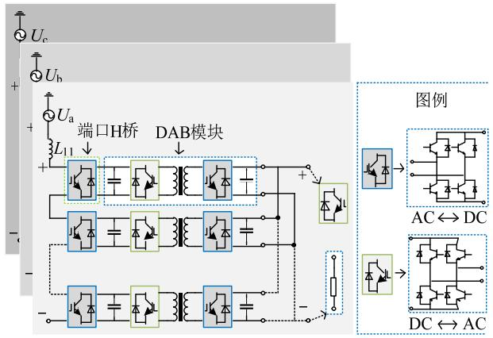  
图1ISOP型PET连接图  
Fig. 1 Connection diagram of ISOP type PET

# 2 级联H桥型PET解耦

半隐式延迟解耦方法从系统的状态方程出发，通过矩阵分裂，利用中心积分与梯形积分的近似等效性，实现基于状态变量之间的半步延时解耦，既有隐式积分方法的高精度和数值稳定性，又有显式积分的并行性。半隐式延迟解耦方法的原理和特点分析详见文献[18]，本文不做详细介绍。下面将该方法应用于CHB-PET的解耦。

# 2.1 DAB 模块的解耦

DAB是常见的中间级模块，如图2(a)所示，图中 $i_{1}$ 、 $i_{2}$ 分别为端口注入电流， $u_{C1}$ 、 $u_{C2}$ 分别为端口电容电压， $i_{\mathrm{T1}}$ 、 $i_{\mathrm{T2}}$ 分别为变压器绕组电流， $u_{\mathrm{T1}}$ 、 $u_{\mathrm{T2}}$ 分别为变压器绕组电压， $\mathrm{T}_{ij}$ 、 $\mathrm{D}_{ij}(i = 1,2,j = 1,2,3,4)$

分别为开关管及其反并联二极管。将每个绝缘栅双极型晶体管(insulated gate bipolar transistor，IGBT)及与其反并联的二极管看成一个开关组，每个开关组采用二值电阻模型 $(R_{\mathrm{on}} / R_{\mathrm{off}})$ ，可得图2(b)，图中 $R_{ij}(i = 1,2,j = 1,2,3,4)$ 分别等效电阻。正常工作时，根据H桥的控制方式[19]，桥臂上、下开关组按互补方式导通和关断，桥臂电阻有如下关系，即：

$$
\left\{ \begin{array}{c} R _ {1 1} + R _ {1 2} = R _ {1 3} + R _ {1 4} = R _ {2 1} + R _ {2 2} = \\ R _ {2 3} + R _ {2 4} = R _ {\text {o n}} + R _ {\text {o f f}} \\ R _ {1 1} R _ {1 2} = R _ {1 3} R _ {1 4} = R _ {2 1} R _ {2 2} = R _ {2 3} R _ {2 4} = R _ {\text {o n}} R _ {\text {o f f}} \end{array} \right. \tag {1}
$$

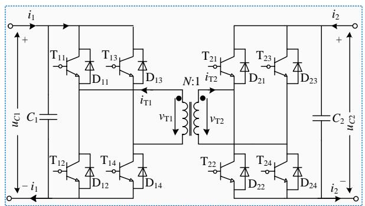

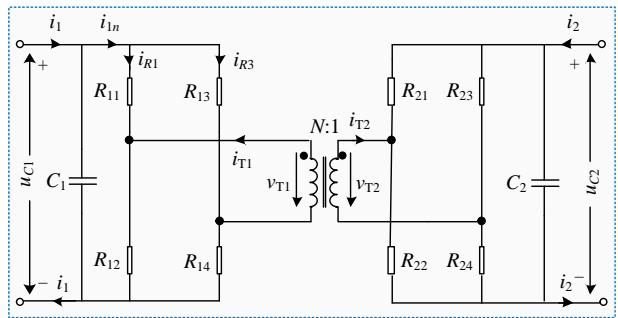  
(a) DAB模块拓扑   
(b) DAB模块二值电阻电路  
图2 DAB电路拓扑  
Fig. 2 Topology of DAB circuit

图2中忽略了变压器损耗，定义 $L_{1}$ 、 $L_{2}$ 分别为高频变压器高、低压侧绕组的电感， $L_{\mathrm{m}}$ 为励磁电感， $N$ 为变压器原边线圈匝数。按图中所示同名端，根据基尔霍夫电压定律(Kirchhoff voltage laws，KVL)可得：

$$
\left\{ \begin{array}{r l} v _ {\mathrm {T} 1} & = - L _ {1} \frac {\mathrm {d} i _ {\mathrm {T} 1}}{\mathrm {d} t} - L _ {\mathrm {m}} \frac {\mathrm {d}}{\mathrm {d} t} \left(i _ {\mathrm {T} 1} + \frac {i _ {\mathrm {T} 2}}{N}\right) = \\ & \quad \left(\frac {R _ {1 3}}{R _ {1 3} + R _ {1 4}} - \frac {R _ {1 1}}{R _ {1 1} + R _ {1 2}}\right) u _ {C 1} + \\ & \quad \left(\frac {R _ {1 3} R _ {1 4}}{R _ {1 3} + R _ {1 4}} + \frac {R _ {1 1} R _ {1 2}}{R _ {1 1} + R _ {1 2}}\right) i _ {\mathrm {T} 1} \\ v _ {\mathrm {T} 2} & = - \frac {L _ {\mathrm {m}}}{N} \frac {\mathrm {d}}{\mathrm {d} t} \left(i _ {\mathrm {T} 1} + \frac {i _ {\mathrm {T} 2}}{N}\right) - L _ {2} \frac {\mathrm {d} i _ {\mathrm {T} 2}}{\mathrm {d} t} = \\ & \quad \left(\frac {R _ {2 1}}{R _ {2 1} + R _ {2 2}} - \frac {R _ {2 3}}{R _ {2 3} + R _ {2 4}}\right) u _ {C 2} + \\ & \quad \left(\frac {R _ {2 1} R _ {2 2}}{R _ {2 1} + R _ {2 2}} + \frac {R _ {2 3} R _ {2 4}}{R _ {2 3} + R _ {2 4}}\right) i _ {\mathrm {T} 2} \end{array} \right. \tag {2}
$$

对电容 $C_1$ 、 $C_2$ ，根据基尔霍夫电流定律(Kirchhoff current laws，KCL)可得：

$$
\left\{ \begin{array}{l} C _ {1} \frac {\mathrm {d} u _ {C 1}}{\mathrm {d} t} = \frac {- 2}{R _ {1 1} + R _ {1 2}} u _ {C 1} - \frac {R _ {1 4} - R _ {1 2}}{R _ {1 1} + R _ {1 2}} i _ {\mathrm {T} 1} + i _ {1} \\ C _ {2} \frac {\mathrm {d} u _ {C 2}}{\mathrm {d} t} = \frac {- 2}{R _ {1 1} + R _ {1 2}} u _ {C 2} - \frac {R _ {2 4} - R _ {2 2}}{R _ {1 1} + R _ {1 2}} i _ {\mathrm {T} 2} + i _ {2} \end{array} \right. \tag {3}
$$

由式(2)和(3)得到DAB模块整体状态方程，即：

$$
\begin{array}{l} \left[ \begin{array}{c c c c} C _ {1} & & & \\ & C _ {2} & & \\ \hline & & L _ {1 1} & L _ {1 2} \\ & & L _ {2 1} & L _ {2 2} \end{array} \right] \left[ \begin{array}{l} \mathrm {d} u _ {C 1} / \mathrm {d} t \\ \mathrm {d} u _ {C 2} / \mathrm {d} t \\ \mathrm {d} i _ {\mathrm {T} 1} / \mathrm {d} t \\ \mathrm {d} i _ {\mathrm {T} 2} / \mathrm {d} t \end{array} \right] = \\ \left[ \begin{array}{c c c c} - G _ {\mathrm {e q} 1} & 0 & k _ {\mathrm {i} 1} & 0 \\ 0 & - G _ {\mathrm {e q} 2} & 0 & k _ {\mathrm {i} 2} \\ k _ {\mathrm {u} 1} & 0 & - R _ {\mathrm {e q} 1} & 0 \\ 0 & k _ {\mathrm {u} 2} & 0 & - R _ {\mathrm {e q} 2} \end{array} \right] \left[ \begin{array}{l} u _ {C 1} \\ u _ {C 2} \\ i _ {\mathrm {T} 1} \\ i _ {\mathrm {T} 2} \end{array} \right] + \left[ \begin{array}{l} i _ {1} \\ i _ {2} \\ 0 \\ 0 \end{array} \right] \tag {4} \\ \end{array}
$$

式中： $k_{\mathrm{uj}}(j = 1,2)$ 为受控电压源的系数； $k_{\mathrm{ij}}(j = 1,2)$ 为受控电流源的系数； $G_{\mathrm{eqi}}(i = 1,2)$ 为等效电导； $R_{\mathrm{eqi}}(i = 1,2)$ 为等效电阻。

$$
\left\{ \begin{array}{l} L _ {\mathrm {T}} = \left[ \begin{array}{c c} L _ {1 1} & L _ {1 2} \\ L _ {2 1} & L _ {2 2} \end{array} \right] = \left[ \begin{array}{c c} L _ {1} + L _ {\mathrm {m}} & L _ {\mathrm {m}} / N \\ L _ {\mathrm {m}} / N & L _ {2} + L _ {\mathrm {m}} / N ^ {2} \end{array} \right] \\ k _ {\mathrm {i} 1} = \frac {R _ {1 2} - R _ {1 4}}{R _ {1 1} + R _ {1 2}}, k _ {\mathrm {i} 2} = \frac {R _ {2 2} - R _ {2 4}}{R _ {1 1} + R _ {1 2}}, \\ k _ {\mathrm {u} 1} = \frac {R _ {1 1} - R _ {1 3}}{R _ {1 1} + R _ {1 2}}, k _ {\mathrm {u} 2} = \frac {R _ {2 1} - R _ {2 3}}{R _ {1 1} + R _ {1 2}}, \\ G _ {\mathrm {e q} 1} = G _ {\mathrm {e q} 2} = \frac {2}{R _ {1 1} + R _ {1 2}}, R _ {\mathrm {e q} 1} = R _ {\mathrm {e q} 2} = \frac {2 R _ {1 1} R _ {1 2}}{R _ {1 1} + R _ {1 2}} \end{array} \right.
$$

根据半隐式延迟解耦法，将式(4)进行矩阵分裂可得：

$$
\begin{array}{l} \left[ \begin{array}{c c c c} C _ {1} & & & \\ & C _ {2} & & \\ \hline & & L _ {1 1} & L _ {1 2} \\ & & L _ {2 1} & L _ {2 2} \end{array} \right] \left[ \begin{array}{l} \mathrm {d} u _ {C 1} / \mathrm {d} t \\ \mathrm {d} u _ {C 2} / \mathrm {d} t \\ \mathrm {d} i _ {\mathrm {T} 1} / \mathrm {d} t \\ \mathrm {d} i _ {\mathrm {T} 2} / \mathrm {d} t \end{array} \right] = \\ \left[ \begin{array}{c c c c} - G _ {\mathrm {e q 1}} & & & \\ & - G _ {\mathrm {e q 2}} & & \\ & & - R _ {\mathrm {e q 1}} & \\ & & & - R _ {\mathrm {e q 2}} \end{array} \right] \left[ \begin{array}{l} u _ {C 1} \\ u _ {C 2} \\ i _ {\mathrm {T} 1} \\ i _ {\mathrm {T} 2} \end{array} \right] + \\ \left[ \begin{array}{c c c} & & k _ {\mathrm {i} 1} \\ & & k _ {\mathrm {i} 2} \\ \hline k _ {\mathrm {u} 1} & & \\ & k _ {\mathrm {u} 2} \end{array} \right] \left[ \begin{array}{l} u _ {C 1} \\ u _ {C 2} \\ i _ {\mathrm {T} 1} \\ i _ {\mathrm {T} 2} \end{array} \right] + \left[ \begin{array}{l} i _ {1} \\ i _ {2} \\ 0 \\ 0 \end{array} \right] \tag {5} \\ \end{array}
$$

为进一步简化模型，将关断电阻 $R_{\mathrm{off}}$ 看作无穷大，则 $G_{\mathrm{eq1}} = G_{\mathrm{eq2}} \approx 0$ ， $R_{\mathrm{eq1}} = R_{\mathrm{eq2}} \approx 2R_{\mathrm{on}}$ 。此时，式(5)半步时延的半隐式差分方程为

$$
\begin{array}{l} \left[ \begin{array}{c} C _ {1} \left(u _ {C 1} ^ {n + 1 / 2} - u _ {C 1} ^ {n - 1 / 2}\right) \\ C _ {2} \left(u _ {C 2} ^ {n + 1 / 2} - u _ {C 2} ^ {n - 1 / 2}\right) \\ L _ {1 1} \left(i _ {\mathrm {T} 1} ^ {n + 1} - i _ {\mathrm {T} 1} ^ {n}\right) + L _ {1 2} \left(i _ {\mathrm {T} 2} ^ {n + 1} - i _ {\mathrm {T} 2} ^ {n}\right) \\ L _ {2 1} \left(i _ {\mathrm {T} 1} ^ {n + 1} - i _ {\mathrm {T} 1} ^ {n}\right) + L _ {2 2} \left(i _ {\mathrm {T} 2} ^ {n + 1} - i _ {\mathrm {T} 2} ^ {n}\right) \end{array} \right] = \\ \left[ \begin{array}{c c c c} 0 & & & \\ & 0 & & \\ & & - R _ {\mathrm {e q} 1} & \\ & & & - R _ {\mathrm {e q} 2} \end{array} \right] \left[ \begin{array}{c} u _ {C 1} ^ {n + 1 / 2} + u _ {C 1} ^ {n - 1 / 2} \\ u _ {C 2} ^ {n + 1 / 2} + u _ {C 2} ^ {n - 1 / 2} \\ i _ {\mathrm {T} 1} ^ {n + 1} + i _ {\mathrm {T} 1} ^ {n} \\ i _ {\mathrm {T} 2} ^ {n + 1} + i _ {\mathrm {T} 2} ^ {n} \end{array} \right] \frac {\Delta t}{2} + \\ \left[ \begin{array}{c c c} & & k _ {\mathrm {i} 1} \\ & & \\ \dots & & \\ k _ {\mathrm {u} 1} & & \\ & k _ {\mathrm {u} 2} \end{array} \right] \left[ \begin{array}{l} u _ {C 1} ^ {n + 1 / 2} \\ u _ {C 2} ^ {n + 1 / 2} \\ i _ {\mathrm {T} 1} ^ {n} \\ i _ {\mathrm {T} 2} ^ {n} \end{array} \right] \Delta t + \left[ \begin{array}{l} i _ {1} ^ {n} \\ i _ {2} ^ {n} \\ 0 \\ 0 \end{array} \right] \Delta t \tag {6} \\ \end{array}
$$

根据式(6)可得DAB模块相关电气量的迭代格式(见附录C)，解耦电路如图3所示。下图中各个受控源的表达式分别为 $U_{\mathrm{Teq1}} = k_{\mathrm{u1}} u_{C1}$ ， $U_{\mathrm{Teq2}} = k_{\mathrm{u2}} u_{C2}$ ， $J_{\mathrm{Teq1}} = k_{\mathrm{i1}} i_{\mathrm{T1}}$ ， $J_{\mathrm{Teq2}} = k_{\mathrm{i2}} i_{\mathrm{T2}}$ 。

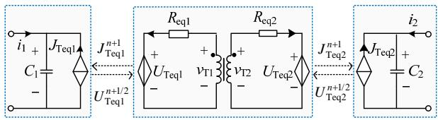  
图3 DAB模块解耦子电路  
Fig. 3 Decoupling sub circuit of DAB module

# 2.2 端口H桥的解耦

单个DAB经H桥串联后可提高输入侧电压等级，构成级联型PET，如图1所示。为避免冲击，一般会在输入侧端口与外部系统之间串联电感以限制端口电流，如图4所示，图中 $u_{\mathrm{SM}}$ 为交流端口电压、 $i_{\mathrm{SM}}$ 交流端口注入电流、 $i_{Rj}(j = 1,2,3,4)$ 为流过电阻的电流、 $i_{1}$ 为直流端口注入电流、 $u_{C}$ 为直流侧电容电压。

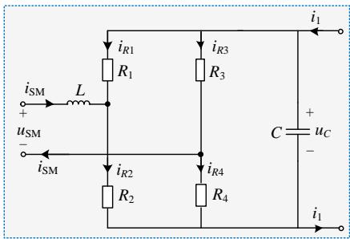  
图4级联 $\mathbf{H}$ 桥拓扑  
Fig. 4 Topology of cascaded H-bridge

根据图4所示拓扑，采用KCL、KVL可得：

$$
\left\{ \begin{array}{l} L \frac {\mathrm {d} i _ {\mathrm {S M}}}{\mathrm {d} t} = - \frac {2 R _ {1} R _ {2}}{R _ {1} + R _ {2}} i _ {\mathrm {S M}} - \frac {R _ {1} - R _ {3}}{R _ {1} + R _ {2}} u _ {C} + u _ {\mathrm {S M}} \\ C \frac {\mathrm {d} u _ {C}}{\mathrm {d} t} = - \frac {2}{R _ {1} + R _ {2}} u _ {C} - \frac {R _ {4} - R _ {2}}{R _ {1} + R _ {2}} i _ {\mathrm {S M}} + i _ {1} \end{array} \right. \tag {7}
$$

将式(7)写成状态矩阵形式，即：

$$
\left[ \begin{array}{l l} L & \\ & C \end{array} \right] \left[ \begin{array}{l} \frac {\mathrm {d} i _ {\mathrm {S M}}}{\mathrm {d} t} \\ \frac {\mathrm {d} u _ {C}}{\mathrm {d} t} \end{array} \right] = \left[ \begin{array}{c c} - R _ {\mathrm {e q}} & - k _ {\mathrm {u}} \\ k _ {\mathrm {i}} & - G _ {\mathrm {e q}} \end{array} \right] \left[ \begin{array}{l} i _ {\mathrm {S M}} \\ u _ {C} \end{array} \right] + \left[ \begin{array}{l} u _ {\mathrm {S M}} \\ i _ {1} \end{array} \right] \tag {8}
$$

根据式(1)和式(7)，状态矩阵中各元素为

$$
R _ {\mathrm {e q}} = \frac {2 R _ {1} R _ {2}}{R _ {1} + R _ {2}}, k _ {\mathrm {i}} = \frac {R _ {2} - R _ {4}}{R _ {1} + R _ {2}} = \frac {R _ {2} - R _ {1}}{R _ {1} + R _ {2}},
$$

$$
G _ {\mathrm {e q}} = \frac {2}{R _ {1} + R _ {2}}, k _ {\mathrm {u}} = \frac {R _ {1} - R _ {3}}{R _ {1} + R _ {2}} = \frac {R _ {1} - R _ {2}}{R _ {1} + R _ {2}}
$$

类似的，根据半隐式延迟解耦方法，将式(8)进行矩阵分裂，具体形式见式(9)，其中 $R_{\mathrm{off}}$ 看作无穷大时， $G_{\mathrm{eq}} \approx 0$ 。

$$
\begin{array}{l} \left[ \begin{array}{l l} L & \\ & C \end{array} \right] \left[ \begin{array}{l} \frac {\mathrm {d} i _ {\mathrm {S M}}}{\mathrm {d} t} \\ \frac {\mathrm {d} u _ {C}}{\mathrm {d} t} \end{array} \right] = \left[ \begin{array}{l l} - R _ {\mathrm {e q}} & 0 \\ 0 & 0 \end{array} \right] \left[ \begin{array}{l} i _ {\mathrm {S M}} \\ u _ {C} \end{array} \right] + \\ \left[ \begin{array}{c c} 0 & - k _ {\mathrm {u}} \\ k _ {\mathrm {i}} & 0 \end{array} \right] \left[ \begin{array}{l} i _ {\mathrm {S M}} \\ u _ {C} \end{array} \right] + \left[ \begin{array}{l} u _ {\mathrm {S M}} \\ i _ {1} \end{array} \right] \tag {9} \\ \end{array}
$$

式(9)半步时延的半隐式差分方程为

$$
\begin{array}{l} \left[ \begin{array}{c} C (u _ {C} ^ {n + 1 / 2} - u _ {C} ^ {n - 1 / 2}) \\ L (i _ {\mathrm {S M}} ^ {n + 1} - i _ {\mathrm {S M}} ^ {n}) \end{array} \right] = \left[ \begin{array}{c c} 0 & \\ & - R _ {\mathrm {e q}} \end{array} \right]. \\ \left[ \begin{array}{c} u _ {C} ^ {n + 1 / 2} + u _ {C} ^ {n - 1 / 2} \\ i _ {\mathrm {S M}} ^ {n + 1} + i _ {\mathrm {S M}} ^ {n} \end{array} \right] \frac {\Delta t}{2} + \\ \left[ \begin{array}{l l} & k _ {\mathrm {i}} \\ - k _ {\mathrm {u}} & \end{array} \right] \left[ \begin{array}{l} u _ {C} ^ {n + 1 / 2} \\ i _ {\mathrm {S M}} ^ {n} \end{array} \right] \Delta t + \left[ \begin{array}{l} i _ {1} ^ {n} \\ u _ {\mathrm {S M}} ^ {n + 1 / 2} \end{array} \right] \Delta t \tag {10} \\ \end{array}
$$

根据式(10)可得级联H桥解耦电路如图5所示。图中： $U_{\mathrm{eq}} = k_{\mathrm{u}} u_{C}$ ， $J_{\mathrm{eq}} = k_{\mathrm{i}} i_{\mathrm{SM}}$ 。

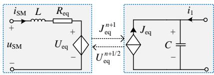  
图5 级联H桥解耦电路  
Fig. 5 Decoupling sub circuit of cascaded H-bridge

# 2.3 不同拓扑的端口解耦等值电路

不同应用场景下，多个PET单元之间可通过串联、并联的形式提高输入电压或输出电流。根据上述单个DAB和级联H桥的解耦等值电路，可以得到多个模块按串联或并联时的端口解耦等值电路。

# 2.3.1 DAB单元串联

图6为采用DAB串联时的端口拓扑及其解耦等值电路。

图6中 $U_{\mathrm{eq}}$ 、 $J_{\mathrm{eq}Li}$ 、 $J_{\mathrm{eq}Ti}$ 的表达式为

$$
\left\{ \begin{array}{l} U _ {\mathrm {e q}} = u _ {C i} \\ J _ {\mathrm {e q} L i} = i _ {\mathrm {a r m}} \\ J _ {\mathrm {e q} \mathrm {T} i} = \frac {R _ {2} - R _ {1}}{R _ {1} + R _ {2}} i _ {\mathrm {T} i} \end{array} , \quad i = 1, \dots , m \right. \tag {11}
$$

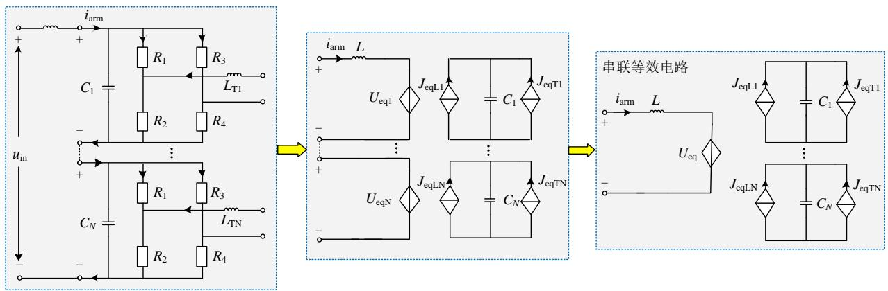  
图6 模块串联等效解耦电路  
Fig. 6 Equivalent decoupling circuit of series-modules

# 2.3.2 DAB单元并联

图7为采用DAB并联时的端口拓扑及其解耦等值电路。

图中 $U_{\mathrm{eqi}}$ 、 $R_{\mathrm{eqi}}$ 、 $J_{\mathrm{eq}}$ 、 $C_\mathrm{eq}$ 的表达式为

$$
\left\{ \begin{array}{l} U _ {\mathrm {e q i}} = \frac {R _ {1} - R _ {2}}{R _ {1} + R _ {2}} u _ {\mathrm {C i}} \\ R _ {\mathrm {e q i}} = \frac {2 R _ {1} R _ {2}}{R _ {1} + R _ {2}} \\ J _ {\mathrm {e q}} = m \frac {R _ {2} - R _ {1}}{R _ {1} + R _ {2}} i _ {\mathrm {T i}} \\ C _ {\mathrm {e q}} = \sum_ {i = 1} ^ {m} C _ {i} \end{array} , i = 1, \dots , m \right. \tag {12}
$$

# 2.3.3 高压侧H桥级联

图8为PET采用高压侧H桥级联时的端口拓扑及其解耦等值电路，图中 $U_{\mathrm{in}}$ 为交流端口电压、 $i_{\mathrm{arm}}$ 为交流端口注入电流。

附录B给出了不同连接方式下对应的端口等值参数。

# 2.4 ISOP型CHB-PET解耦等值电路

实际应用中，级联H桥型PET输入侧通常采用串联方式以提高输入电压，输出侧通常采用并联方式以提高输出电流，构成ISOP型端口拓扑，整体解耦等值电路，如图9所示。

# 3 计算时序及流程

图9中，按状态变量可将解耦后的子系统分为电压 $(U_{1}, U_{2})$ 和电流 $(I_{1}, I_{2})$ 两组。根据半隐式延迟解耦原理，两组间可交替求解并相差半个时步，而同一组的子系统间可并行求解，计算时序如图10所示。计算流程图如图11所示。

# 4 解耦模型特点分析

综合前文所述，本文提出的解耦模型与方法具有如下特点。

1）本文模型既可计及各变换环节的内部动态特性，又可计及开关器件的导通损耗，具有与详细模型近似的精细度。  
2）解耦模型的等效电阻 $R_{\mathrm{eq}}$ 为定值，等效电导 $G_{\mathrm{eq}} \approx 0$ ，电路拓扑的变化仅反映在受控源的系数 $k_{\mathrm{i}}$ 、 $k_{\mathrm{u}}$ 中，因而开关动作时无需对系统导纳矩阵进行修改和 LU 分解，可极大提高仿真效率。  
3）由图9可见，解耦后的子系统数目与原系统的变换级数相同，各变换环节及子模块间可细粒度解耦，易于并行。此外，不同于文献[13-15]中嵌套快速求解法复杂的反解过程，本文解耦模型的子电路拓扑简单，计算简便，反解效率高。

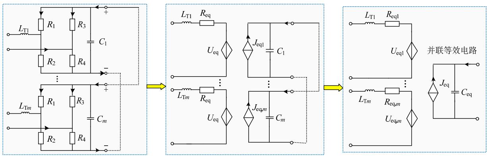  
图7 模块并联等效解耦电路  
Fig. 7 Equivalent decoupling circuit of parallel-modules

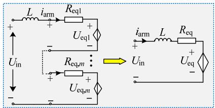  
图8 端口串联型等效解耦图  
Fig. 8 Equivalent decoupling diagram of series-type port

4）本文解耦模型将变压器整体作为一个子系统，因而当应用到MAB或具有复杂拓扑中间级场

景时，解耦方法无需大的改动即可适用，通用性好。

# 5 算例验证

采用 C++ 编程实现本文等效解耦模型(equivalent decoupling model, EDM), 并与 PSCAD/EMTDC 中的单相三模块 CHB-PET 详细模型(detailed model, DM)的仿真结果进行对比。系统拓扑为 ISOP 型结构, 如图 12 所示。测试所采用的 CPU 为 Intel(Core) 8 核 i7-9700K, 仿真步长为 $1 \mu \mathrm{s}$ , 系统参数见表 1。

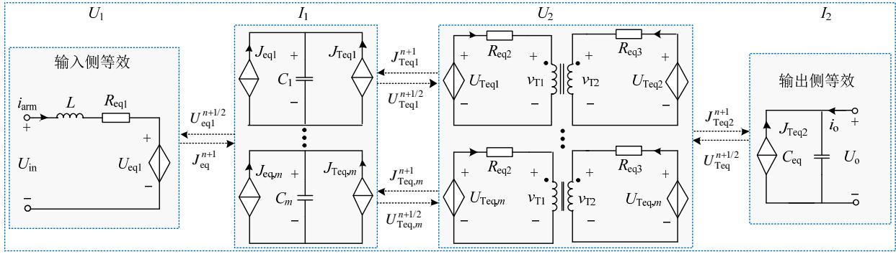  
图9ISOP型CHB-PET解耦等值电路

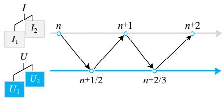  
Fig. 9 Decoupling equivalent circuit of ISOP CHB-PET   
图10 计算过程时间轴

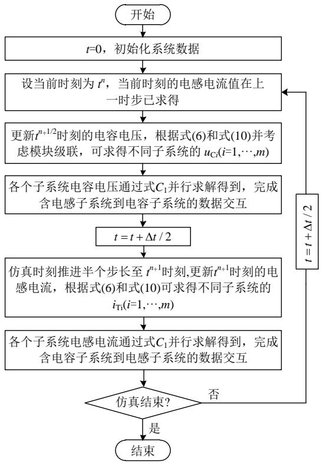  
Fig. 10 Calculation flow chart   
图11 计算流程图  
Fig. 11 Calculation flow

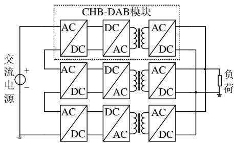  
图12 系统拓扑  
Fig. 12 Topology of test circuit

表 1 测试系统参数  
Table 1 Parameters of test system   

<table><tr><td>参数</td><td>数值</td></tr><tr><td>交流电压源有效值/kV</td><td>10</td></tr><tr><td>输出侧负荷/Ω</td><td>30</td></tr><tr><td>DAB开关频率/kHz</td><td>10</td></tr><tr><td>级联H桥开关频率/kHz</td><td>1</td></tr><tr><td>高压侧电容/F</td><td>0.01</td></tr><tr><td>低压侧电容/μF</td><td>30</td></tr><tr><td>各单元辅助电感/μH</td><td>100</td></tr><tr><td>高频变压器变比N</td><td>1:1</td></tr><tr><td>输入侧电抗/mH</td><td>18</td></tr></table>

# 5.1 稳态仿真对比

图13(a)和13(b)分别是级联H桥输入侧电流和输出侧电压的对比图，图13(a)的最大相对误差为 $1\%$ ，图13(b)的最大相对误差为 $0.6\%$ 。图13(c)和13(d)分别是高频变压器两侧交流电压的对比图，图13(c)的最大相对误差为 $0.3\%$ ，图13(d)的最大相对误差为 $0.2\%$ 。图13(e)和13(f)分别是低压侧直流母线电压和负荷电流的对比图，图13(e)的最大相对误

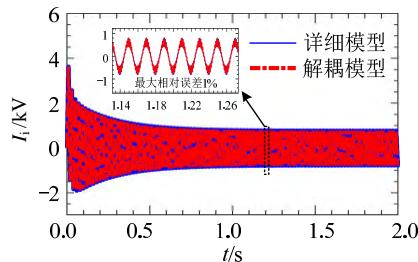  
(a) 级联H桥输入侧电流对比

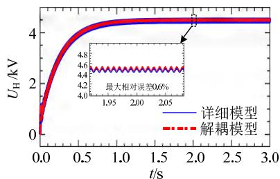  
(b) 级联H桥输出侧电压对比

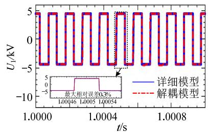  
(c) 高压侧电压对比

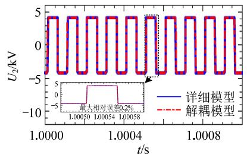  
(d)低压侧电压对比

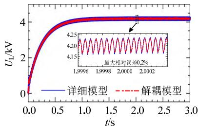  
(e)低压侧母线电压对比

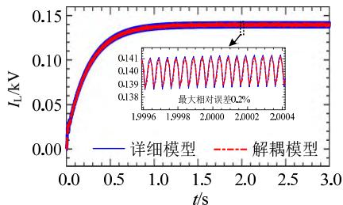  
(f) 负荷电流对比  
图13 稳态下的仿真精度对比  
Fig. 13 Comparison of simulation accuracy in steady state

差为 $0.2\%$ ，图 13(f)的最大相对误差为 $0.2\%$ 。仿真对比结果表明，稳态时本文解耦模型具有很高的仿真精度。

# 5.2 暂态仿真对比

# 5.2.1 负荷波动情形下仿真对比

图14(a)和14(b)分别是负荷波动下负荷电压 $U_{\mathrm{L}}$ 波形对比图和全部仿真时段的相对误差，仿真总共持续6s。0~2s时，直流侧负荷初始值为 $30\Omega$ ；2s时负荷减小为 $10\Omega$ ；4s时负荷增大为 $20\Omega$ 至仿真结束。负荷波动过程中，各阶段最大仿真相对误差均不超过 $1\%$ ，表明仿真精度很高。

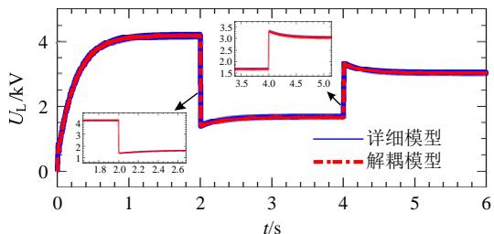

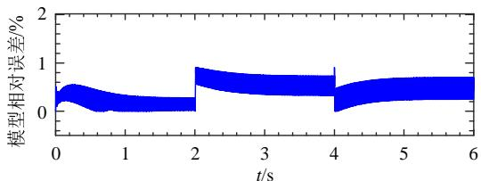  
(a) 波形对比  
(b) 模型相对误差  
图14 不同负荷下模型仿真精度验证  
Fig. 14 Model simulation accuracy verification under different loads

# 5.2.2 输入侧交流电压波动下仿真对比

图15(a)和15(b)分别是输入侧交流电压波动下 $U_{\mathrm{L}}$ 波形对比图和全部仿真时段的相对误差，仿真持续6s。在0~2s时，交流电压初始值有效值为 $10\mathrm{kV}$

系统启动运行后进入稳态；2s时交流电压增大为 $30\mathrm{kV}$ ，仿真过程持续至4s；4s时交流电压减小到 $5\mathrm{kV}$ ，系统运行至仿真结束。仿真过程中，各阶段最大相对误差均不超过 $0.5\%$ ，说明本文模型能够满足精度要求。

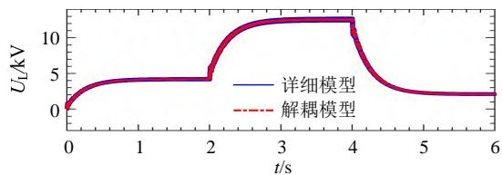

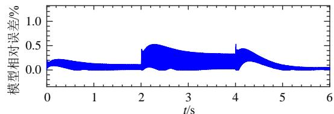  
(a) 波形对比  
(b) 模型相对误差  
图15 交流侧电压波动时仿真精度验证  
Fig. 15 Model simulation accuracy verification with the voltage refluxation of AC side voltage

# 5.2.3 故障情况下仿真对比

图16(a)和16(b)分别是直流线路发生故障下 $U_{\mathrm{L}}$ 波形对比图和全部仿真时段的相对误差，仿真时间为6s。在0~2s时，直流侧负荷初始值为 $30\Omega$ ，系统启动运行后进入稳态；2s时低压侧直流母线发生双极短路故障，过渡电阻为 $2\Omega$ ，故障恢复时间为2ms，故障恢复后仿真运行至4s；4s时模块三输出侧直流线路发生断线故障，故障恢复时间为2ms，故障恢复后系统运行至仿真结束。

仿真过程中，在不同故障下的最大相对误差均不超过 $1\%$ ，说明本文模型可以满足故障情况下的精度要求。

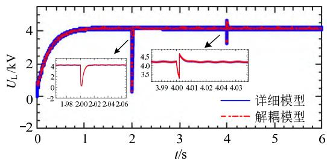

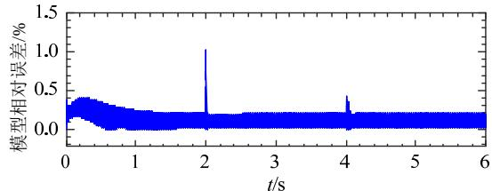  
(a) 波形对比  
(b)模型相对误差   
图16 故障情况下模型仿真精度验证   
Fig. 16 Verification of model simulation accuracy under fault condition

# 5.3 仿真效率验证

在PSCAD/EMTDC中分别搭建模块数为3、10、20、50、100的CHB-PET详细模型，并与解耦模型在串行以及并行求解方式下进行仿真时间对比，以测试本文模型在串行和并行求解方式下的仿真效率。未做说明的情况下，选取仿真步长 $\Delta t$ 为 $1\mu \mathrm{s}$ ，仿真时间 $t$ 为0.5s，DAB开关频率 $f$ 为 $10\mathrm{kHz}$ 。

表2和3分别为不同开关频率下两种模型的CPU用时和加速比。表4和5分别为不同仿真步长下2种模型的CPU用时和加速比。各表中，SSR缨le speedup ratio)为详细模型耗时与解耦模型串行方式时的CPU耗时之比，PSR(parallel speedup ratio)为详细模型耗时与解耦模型并行方式时的CPU耗时之比。

从表2-5中可以看出，细粒度解耦和导纳矩阵恒定，使得本文解耦模型的加速效果明显。此外，由于测试所用CPU为8核心，子模块数增加时，处理器核心数小于解耦后的子系统数，因此限制了解耦模型并行方式时的加速比。若使用核心数更高的CPU或GPU计算，将求解任务分配至更多核心，理论上可以获得更高的加速比。

表 2 不同开关频率下 2 种模型 CPU 耗时对比  
Table 2 CPU time comparison of two models under different switching frequencies   

<table><tr><td rowspan="2">模块数</td><td colspan="2">DM</td><td colspan="2">EDM 串行求解</td><td colspan="2">EDM 并行求解</td></tr><tr><td>f=5kHz</td><td>f=20kHz</td><td>f=5kHz</td><td>f=20kHz</td><td>f=5kHz</td><td>f=20kHz</td></tr><tr><td>3</td><td>16238</td><td>19446</td><td>2766</td><td>2496</td><td>2922</td><td>3132</td></tr><tr><td>10</td><td>70941</td><td>98564</td><td>3875</td><td>3968</td><td>3484</td><td>3661</td></tr><tr><td>20</td><td>221608</td><td>286857</td><td>5844</td><td>5562</td><td>3978</td><td>3927</td></tr><tr><td>40</td><td>859254</td><td>1309669</td><td>11188</td><td>11969</td><td>4865</td><td>4995</td></tr><tr><td>80</td><td>3223254</td><td>4587633</td><td>28612</td><td>28484</td><td>7769</td><td>7847</td></tr><tr><td>100</td><td>5807242</td><td>9218492</td><td>39563</td><td>38850</td><td>9593</td><td>9471</td></tr></table>

表 3 不同开关频率下 2 种模型仿真加速比  
Table 3 Simulation speedup ratio of two models under different switching frequencies   
表 4 不同步长下 2 种模型 CPU 耗时对比  

<table><tr><td rowspan="2">模块数</td><td colspan="2">串行加速比(SSR)</td><td colspan="2">并行加速比(PSR)</td></tr><tr><td>SSR1</td><td>SSR2</td><td>PSR1</td><td>PSR2</td></tr><tr><td>3</td><td>5.87</td><td>7.79</td><td>5.56</td><td>6.21</td></tr><tr><td>10</td><td>18.31</td><td>24.84</td><td>20.36</td><td>26.92</td></tr><tr><td>20</td><td>37.92</td><td>51.57</td><td>55.71</td><td>73.05</td></tr><tr><td>40</td><td>76.80</td><td>109.42</td><td>176.62</td><td>262.20</td></tr><tr><td>80</td><td>112.65</td><td>161.06</td><td>414.89</td><td>584.64</td></tr><tr><td>100</td><td>146.78</td><td>237.28</td><td>605.36</td><td>973.34</td></tr></table>

Table 4 CPU time comparison of two models under different step size   
表 5 不同步长下 2 种模型仿真加速比  

<table><tr><td rowspan="2">模块数</td><td colspan="2">DM</td><td colspan="2">EDM 串行求解</td><td colspan="2">EDM 并行求解</td></tr><tr><td>Δt=0.5μs</td><td>Δt=1μs</td><td>Δt=0.5μs</td><td>Δt=1μs</td><td>Δt=0.5μs</td><td>Δt=1μs</td></tr><tr><td>3</td><td>17172</td><td>9307</td><td>2625</td><td>1486</td><td>3227</td><td>2047</td></tr><tr><td>10</td><td>79303</td><td>45369</td><td>3906</td><td>2258</td><td>3651</td><td>2376</td></tr><tr><td>20</td><td>260253</td><td>140522</td><td>5625</td><td>2922</td><td>3938</td><td>2499</td></tr><tr><td>40</td><td>1024845</td><td>530990</td><td>11062</td><td>5671</td><td>4848</td><td>2945</td></tr><tr><td>80</td><td>3657771</td><td>1865011</td><td>29015</td><td>14422</td><td>7836</td><td>4404</td></tr><tr><td>100</td><td>6205391</td><td>3089683</td><td>39047</td><td>19547</td><td>9566</td><td>5250</td></tr></table>

Table 5 Simulation speedup ratio of two models under different step size   

<table><tr><td rowspan="2">模块数</td><td colspan="2">串行加速比(SSR)</td><td colspan="2">并行加速比(PSR)</td></tr><tr><td>SSR1</td><td>SSR2</td><td>PSR1</td><td>PSR2</td></tr><tr><td>3</td><td>6.54</td><td>6.26</td><td>5.32</td><td>4.55</td></tr><tr><td>10</td><td>20.30</td><td>20.09</td><td>21.72</td><td>19.09</td></tr><tr><td>20</td><td>46.27</td><td>48.09</td><td>66.09</td><td>56.23</td></tr><tr><td>40</td><td>92.65</td><td>93.63</td><td>211.40</td><td>180.30</td></tr><tr><td>80</td><td>131.20</td><td>135.90</td><td>466.79</td><td>423.48</td></tr><tr><td>100</td><td>158.92</td><td>158.06</td><td>648.69</td><td>588.51</td></tr></table>

# 6 结论

本文根据半隐式延迟解耦方法，从系统状态方程出发，首先推导出PET中间级DAB的解耦电路，然后给出不同串、并联组合方式及级联H桥时PET的外部端口等效解耦电路，最终得到了CHB-PET整体等效解耦电路并给出了计算流程。

由于是状态变量之间的解耦，在开关动作时，解耦变量间不存在非状态量突变引起的数值振荡问题，因而解耦系统间无需进行算法切换，可始终保持解耦形式的一致性，进而保持仿真的细粒度和并行的一致性。仿真时电路拓扑的变化仅反映在受控源的系数 $k_{\mathrm{i}}$ 、 $k_{\mathrm{u}}$ 中，无需修改或者计算导纳矩阵，规避了导纳阵求逆计算过程，可提高仿真速度。

通过详细模型与解耦模型在稳态、暂态下的仿真波形对比，表明本文提出的模型具有很高的仿真精度。仿真效率对比结果表明，本文所提模型在不同的开关频率以及仿真步长下，随着级联模块数的增多，仿真加速比将明显上升，说明在模块数越多

的情形下仿真效率越高。

对于现有CHB-PET型PET详细模型仿真规模大、矩阵维数高、仿真速度慢的问题提供了一种可行的解决方案。

附录见本刊网络版(http://www.dwjs.com.cn/CN/1000-3673/current.shtml)。

# 参考文献

[1] 李子欣，高范强，赵聪，等．电力电子变压器技术研究综述[J]. 中国电机工程学报，2018，38(5)：1274-1289. LI Zixin，GAO Fanqiang，ZHAO Cong，et al. Research review of power electronic transformer technologies[J]. Proceedings of the CSEE，2018，38(5)：1274-1289(in Chinese).  
[2] KANG M, ENJETI P N, PITEL I J. Analysis and design of electronic transformers for electric power distribution system[J]. IEEE Transactions on Power Electronics, 1999, 14(6): 1133-1141.   
[3] COSTAL F, HOFFMANN F, BUTICCHI G, et al. Comparative analysis of multiple active bridge converters configurations in modular smart transformer[J]. IEEE Transactions on Industrial Electronics, 2019, 66(1): 191-202.   
[4] 王哲，李耀华，李子欣，等．基于阻抗特性的级联H桥型PET并网稳定性分析[J].电网技术，2020，44(3)：1070-1078.WANG Zhe，LI Yaohua，LI Zixin，et al. Stability analysis of grid-connected cascaded H-bridge PET based on impedance characteristic[J].Power System Technology，2020，44(3)：1070-1078(in Chinese).  
[5] 张涛，穆云飞，贾宏杰，等．含电力电子变压器的交直流配电网随机运行优化[J].电网技术，2022，46(3)：860-869. ZHANG Tao, MU Yunfei, JIA Hongjie, et al. Stochastic operation optimization for ac/dc distribution network with power electronic transformer[J]. Power System Technology, 2022, 46(3): 860-869(in Chinese).   
[6] 支月媚．混合级联型电力电子变压器降阶建模与控制策略研究 [D]. 吉林：东北电力大学，2017.  
[7] SHI Haixu, SUN Kai, WU Hongfei, et al. Unified state-space modeling method for dual-active-bridge converters considering bidirectional phase shift[C]/2018 IEEE Energy Conversion Congress and Exposition (ECCE). Portland: IEEE, 2018: 643-649.   
[8] 李建国，赵彪，宋强，等．适用于直流微电网的开关电容接入式双主动移相变换器[J].中国电机工程学报，2017，37(17)：4922-4930. LI Jianguo，ZHAO Biao，SONG Qiang，et al．Dual active bridge converter based on switched capacitor access in micro-grid DC distribution system[J].Proceedings of the CSEE，2017，37(17):4922-4930(in Chinese).   
[9] SHI Haixu, XIAO Xi, WU Hongfei, et al. Modeling and decoupled control of a Buck-Boost and stacked dual half-bridge integrated bidirectional DC-DC converter[J]. IEEE Transactions on Power Electronics, 2018, 33(4), 3534-3551.   
[10] ZHAO Wenzhi, ZHENG Jinghong, ZHENG Zeming, et al. Equivalent modeling of power electronic transformer in AC-DC hybrid system[C]/2019 IEEE Innovative Smart Grid Technologies. Chengdu: IEEE, 2019: 2644-2649.   
[11] LI Zixin, QU Ping, WANG Ping, et al. DC terminal dynamic model of dual active bridge series resonant converters[C]/2014 IEEE Conference and Expo Transportation Electrification Asia-Pacific (ITEC Asia-Pacific). Beijing: IEEE, 2014: 1-5.   
[12] SHAH D, BADDIPADIGA B, CROW M, et al. A solid state

transformer model for proper integration to distribution network[C]//2019 North American Power Symposium. Wichita: IEEE, 2019: 1-6.   
[13] 高晨祥，丁江萍，许建中，等．输入串联输出并联型双有源桥变换器等效建模方法[J].中国电机工程学报，2020，40(15)：4955-4964.  
GAO Chenxiang, DING Jiangping, XU Jianzhong, et al. Equivalent modeling method of input series output parallel type dual active bridge converter[J]. Proceedings of the CSEE, 2020, 40(15): 4955-4964(in Chinese).   
[14] 蔡伟谦，沈瑜，李凯，等．共高频交流母线的电能路由器直流端口控制策略[J].电网技术，2020，44(12)：4600-4607.  
CAI Weiqian, SHEN Yu, LI Kai, et al. DC port control strategy for electric energy router with high frequency AC link[J]. Power System Technology, 2020, 44(12): 4600-4607(in Chinese).   
[15] 丁江萍，高晨祥，许建中，等. 级联H桥型电力电子变压器的电磁暂态等效建模方法[J]. 中国电机工程学报，2020,40(21):7047-7055. DING Jiangping，GAO Chenxiang，XU Jianzhong，et al. Electromagnetic transient equivalent modeling method of cascaded H-bridge power electronic transformer[J]. Proceedings of the CSEE, 2020,40(21):7047-7055(in Chinese).  
[16] 高晨祥，丁江萍，冯谟可，等．基于节点导纳方程预处理的ISOP型DAB变换器双端口解耦等效模型[J].中国电机工程学报，2021，41(6)：2255-2266.  
GAO Chenxiang, DING Jiangping, FENG Moke, et al. Two-port decoupling equivalent model of ISOP type DAB converter by preprocessing the node admittance equation[J]. Proceedings of the CSEE, 2021, 41(6): 2255-2266(in Chinese).   
[17] 易姝娴，袁立强，李凯，等．面向区域电能路由器的高效仿真建模方法[J]. 清华大学学报(自然科学版)，2019，59(10)：796-806. YI Shuxia, YUAN Liqiang, LI Kai, et al. High-efficiency modeling method for regional energy routers[J]. Journal of Tsinghua University (Science and Technology), 2019, 59(10): 796-806(in Chinese).   
[18] 刘刚，张春强，马嘉昊，等．一种用于电磁暂态仿真的两电平电压源型换流器解耦模型[J]. 电网技术，2022，46(11)：4267-4276. LIU Gang, ZHANG Chunqiang, MA Jiahao, et al. Two-level voltage source converter decoupling model for electromagnetic transient simulation[J]. Power System Technology, 2022, 46(11): 4267-4276(in Chinese).  
[19] 赵彪，于庆广，孙伟欣．双重移相控制的双向全桥DC-DC变换器及其功率回流特性分析[J].中国电机工程学报，2012，32(12)：43-50. ZHAO Biao，YU Qingguang，SUN Weixin. Bi-directional full-bridge DC-DC converters with dual-phase-shifting control and its backflow power characteristic analysis[J]. Proceedings of the CSEE，2012，32(12): 43-50(in Chinese).

  
许明旺

在线出版日期：2022-07-05。

收稿日期：2022-03-18。

作者简介：

许明旺(1996)，男，硕士研究生，研究方向为电磁暂态建模与仿真，E-mail：xmwncepu@163.com;

姚蜀军(1973)，男，副教授，通信作者，研究方向为电力系统运行与控制、直流输电、电磁暂态仿真和建模等，E-mail：yaoshujun@ncepu.edu.cn;

韩民晓(1963)，男，教授，研究方向为电力系统运行与控制、直流输电、电力电子技术在电力系统中应用等，E-mail：hanminxiao@ncepu.edu.cn。

(编辑 李健一)

# 附录A

文献[18]提出半隐式延迟解耦法(semi-implicit delay decoupling program, SILDP)。该方法应用矩阵分裂技术，通过对不同变量间采用不同积分格式实现变量组之间的时间解耦。

# 1）矩阵分裂

考虑线性系统，用状态空间方程表示为

$$
\left\{ \begin{array}{l} \dot {\boldsymbol {x}} (t) = \boldsymbol {A} \boldsymbol {x} (t) + \boldsymbol {B} \boldsymbol {u} (t) \\ \boldsymbol {x} (0) = \boldsymbol {x} _ {0}, t \geq 0 \end{array} \right. \tag {A1}
$$

将系数矩阵 $\mathbf{A}$ 进行分裂构造子系统。由于输入 $\mathbf{u}$ 是已知量，系数矩阵 $\mathbf{B}$ 不需要进行分裂。

设 $A = A_{\beta} - A_{\alpha}$ , 系统(A1)变为

$$
\left\{ \begin{array}{l} \dot {\boldsymbol {x}} (t) + \boldsymbol {A} _ {\alpha} \boldsymbol {x} (t) = \boldsymbol {A} _ {\beta} \boldsymbol {x} (t) + \boldsymbol {B} \boldsymbol {u} (t) \\ \boldsymbol {x} (0) = \boldsymbol {x} _ {0}, t \geq 0 \end{array} \right. \tag {A2}
$$

取分裂形式: $A_{\alpha} = D, A_{\beta} = L + U$ 。系统分裂为 $m$ 个子系统。其中, $D = \operatorname{diag}\left[D_{1}, D_{2}, \cdots D_{m}\right]$ 由原系数矩阵 $A$ 的分块对角矩阵构成, $D_{1}, D_{2}, \cdots D_{m}$ 为方阵, 与分裂后的各子系统相对应。类似的, $L$ 和 $U$ 分别是严格的分块下三角和上三角矩阵。

将 $A_{\alpha} = D$ ， $A_{\beta} = L + U$ 代入式(A2)，得到：

$$
\left\{ \begin{array}{l} \dot {\boldsymbol {x}} (t) + \boldsymbol {D} \boldsymbol {x} (t) = (\boldsymbol {L} + \boldsymbol {U}) \boldsymbol {x} (t) + \boldsymbol {B} \boldsymbol {u} (t) \\ \boldsymbol {x} (0) = \boldsymbol {x} _ {0}, t \geq 0 \end{array} \right. \tag {A3}
$$

将式(A3)按子系统展开，可得到：

$$
\left\{ \begin{array}{l} \dot {\boldsymbol {x}} _ {i} (t) + \boldsymbol {D} _ {i} \boldsymbol {x} _ {i} (t) = \sum_ {j = 1, j \neq i} ^ {m} \boldsymbol {A} _ {\beta , i j} \boldsymbol {x} _ {j} (t) + \boldsymbol {u} _ {i} (t) \\ \boldsymbol {x} _ {i} (0) = \boldsymbol {x} _ {i, 0} \\ \boldsymbol {A} _ {\beta , i i} = 0 \\ t \geq 0, i, j \in 1, 2, \dots , m \end{array} \right. \tag {A4}
$$

对系统(A4)进行分裂并两边积分：

$$
\int \dot {\boldsymbol {x}} _ {i} (t) + \int \boldsymbol {D} _ {i} \boldsymbol {x} _ {i} (t) = \int \sum_ {j = 1, j \neq i} ^ {m} \boldsymbol {A} _ {\beta , i j} \boldsymbol {x} _ {j} (t) + \int \boldsymbol {u} _ {i} (t) \tag {A5}
$$

# 2）中心积分

在电磁暂态仿真的仿真步长范围内，中心积分形式的精度近似于梯形积分，图A1是其示意图。图中梯形的面积可以近似看作是以 $u^{n + 1 / 2}$ 为长， $\Delta t$ 为宽的矩形的面积，即：

$$
\frac {\boldsymbol {u} ^ {n} + \boldsymbol {u} ^ {n + 1}}{2} \Delta t \approx \boldsymbol {u} ^ {n + 1 / 2} \Delta t \tag {A6}
$$

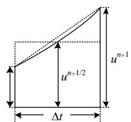  
图A1 中心积分示意图  
Fig. A1 Schematic diagram of central integration

# 3）半隐式差分方程

对式(A5)等式两端按隐式梯形法离散化，并对等式右端用中心积分近似梯形积分：

$$
\begin{array}{l} \boldsymbol {x} _ {i} ^ {n + 1} - \boldsymbol {x} _ {i} ^ {n} + \boldsymbol {D} _ {i} \frac {\boldsymbol {x} _ {i} ^ {n + 1} + \boldsymbol {x} _ {i} ^ {n}}{2} \Delta t = \\ \sum_ {j = 1, j \neq i} ^ {m} A _ {\beta , i j} \frac {\boldsymbol {x} _ {j} ^ {n + 1} + \boldsymbol {x} _ {j} ^ {n}}{2} \Delta t + \frac {\boldsymbol {u} _ {i} ^ {n} + \boldsymbol {u} _ {i} ^ {n + 1}}{2} \Delta t \approx \\ \sum_ {j = 1, j \neq i} ^ {m} \boldsymbol {A} _ {\beta , i j} \boldsymbol {x} _ {j} ^ {n + 1 / 2} \Delta t + \boldsymbol {u} _ {i} ^ {n + 1 / 2} \Delta t = \\ f _ {i} \left(\boldsymbol {x} _ {j} ^ {n + 1 / 2}, \boldsymbol {u} _ {i} ^ {n + 1 / 2}\right) \tag {A7} \\ \end{array}
$$

# 4）半隐式延迟解耦并行计算原理

将分裂成的子系统分为两组 $x_{1}$ 和 $x_{2}$ 。其中： $x_{1}$ 包含 $p$ 个子系统， $x_{2}$ 包含 $q$ 个子系统，根据式(A7)可得：

$$
\left[ \begin{array}{c} \boldsymbol {x} _ {1} ^ {n + 1} \\ \boldsymbol {x} _ {2} ^ {n + 1 / 2} \end{array} \right] = \left[ \begin{array}{c} \boldsymbol {\alpha} _ {1} \boldsymbol {x} _ {1} ^ {n} \\ \boldsymbol {\alpha} _ {2} \boldsymbol {x} _ {2} ^ {n - 1 / 2} \end{array} \right] + \left[ \begin{array}{c} \boldsymbol {\beta} _ {1} f _ {1} \left(\boldsymbol {x} _ {2} ^ {n + 1 / 2}, u _ {1} ^ {n + 1 / 2}\right) \\ \boldsymbol {\beta} _ {2} f _ {2} \left(\boldsymbol {x} _ {1} ^ {n}, u _ {2} ^ {n}\right) \end{array} \right] \tag {A8}
$$

$x_{1}$ 和 $x_{2}$ 之间的求解按图A2的方式交替进行并且互差半个时步，而 $x_{1}$ 和 $x_{2}$ 分组内的各子系统则可根据式(A7)的时延特性解耦后并行求解。

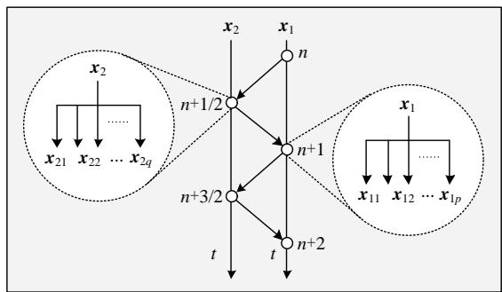  
图A2 并行计算原理示意图  
Fig. A2 Schematic diagram of parallel computing

# 附录B

一般来说，DAB单元的输入、输出侧可采用串联或并联拓扑，级联H桥型的PET一般采用ISOP拓扑。对于每种拓扑，根据解耦等值电路，可以得到相应的端口等值参数，如表B1所示。

表 B1 不同端口拓扑的等值参数  
Table B1 Port equations for different types of connections   

<table><tr><td rowspan="2">拓扑连接方式</td><td colspan="2">输入侧</td><td colspan="2">输出侧</td></tr><tr><td>等值电阻/导纳</td><td>等值电压源/电流源</td><td>等值电阻/导纳</td><td>等值电压源/电流源</td></tr><tr><td>DAB-ISOP</td><td>无</td><td>Ueq</td><td>0</td><td>Jeq</td></tr><tr><td>DAB-IPOP</td><td>0</td><td>Jeq</td><td>0</td><td>Jeq</td></tr><tr><td>DAB-ISOS</td><td>无</td><td>Ueq</td><td>无</td><td>Ueq</td></tr><tr><td>DAB-IPOS</td><td>0</td><td>Jeq</td><td>无</td><td>Ueq</td></tr><tr><td>CHB-ISOP</td><td>Req</td><td>Ueq</td><td>0</td><td>Jeq</td></tr></table>

# 附录C

正文中式(6)的迭代格式如下式所示

$$
\left\{ \begin{array}{l} u _ {\mathrm {C} 1} ^ {n + 1 / 2} = u _ {\mathrm {C} 1} ^ {n - 1 / 2} + \frac {k _ {\mathrm {i} 1} \Delta t}{C _ {1}} i _ {\mathrm {T} 1} ^ {n} + \frac {\Delta t}{C _ {1}} i _ {1} ^ {n} \\ u _ {\mathrm {C} 2} ^ {n + 1 / 2} = u _ {\mathrm {C} 2} ^ {n - 1 / 2} + \frac {k _ {\mathrm {i} 2} \Delta t}{C _ {2}} i _ {\mathrm {T} 2} ^ {n} + \frac {\Delta t}{C _ {2}} i _ {2} ^ {n} \\ i _ {\mathrm {T} 1} ^ {n + 1} = \frac {A _ {1} i _ {\mathrm {T} 1} ^ {n} + B _ {1} i _ {\mathrm {T} 2} ^ {n} + C _ {1 1} u _ {\mathrm {C} 1} ^ {n + 1 / 2} + D _ {1} u _ {\mathrm {C} 2} ^ {n + 1 / 2}}{E _ {1}} \\ i _ {\mathrm {T} 2} ^ {n + 1} = \frac {A _ {2} i _ {\mathrm {T} 1} ^ {n} + B _ {2} i _ {\mathrm {T} 2} ^ {n} + C _ {2 2} u _ {\mathrm {C} 1} ^ {n + 1 / 2} + D _ {2} u _ {\mathrm {C} 2} ^ {n + 1 / 2}}{E _ {2}} \end{array} \right. \tag {C1}
$$

其中，

$$
\left\{ \begin{array}{l} A _ {1} = \left(L _ {1 1} - R _ {\mathrm {e q} 1} \frac {\Delta t}{2}\right) \left(L _ {2 2} + R _ {\mathrm {e q} 2} \frac {\Delta t}{2}\right) - L _ {2 1} L _ {1 2} \\ B _ {1} = L _ {1 2} R _ {\mathrm {e q} 2} \Delta t \\ C _ {1 1} = \left(L _ {2 2} + R _ {\mathrm {e q} 2} \frac {\Delta t}{2}\right) k _ {\mathrm {u} 1} \Delta t \\ D _ {1} = - L _ {1 2} k _ {\mathrm {u} 2} \Delta t \\ E _ {1} = \left(L _ {1 1} + R _ {\mathrm {e q} 1} \frac {\Delta t}{2}\right) \left(L _ {2 2} + R _ {\mathrm {e q} 2} \frac {\Delta t}{2}\right) - L _ {2 1} L _ {1 2} \\ A _ {2} = - L _ {2 1} R _ {\mathrm {e q} 1} \Delta t \\ B _ {2} = L _ {2 1} L _ {1 2} - \left(L _ {1 1} + R _ {\mathrm {e q} 1} \frac {\Delta t}{2}\right) \left(L _ {2 2} - R _ {\mathrm {e q} 2} \frac {\Delta t}{2}\right) \\ C _ {2 2} = L _ {2 1} k _ {\mathrm {u} 1} \Delta t \\ D _ {2} = - \left(L _ {1 1} + R _ {\mathrm {e q} 1} \frac {\Delta t}{2}\right) k _ {\mathrm {u} 2} \Delta t \\ E _ {2} = L _ {2 1} L _ {1 2} - \left(L _ {1 1} + R _ {\mathrm {e q} 1} \frac {\Delta t}{2}\right) \left(L _ {2 2} + R _ {\mathrm {e q} 2} \frac {\Delta t}{2}\right) \end{array} \right. \tag {C2}
$$

# An Electromagnetic Transient Decoupling and Simulation Model of Cascaded H-bridge Power Electronic Transformer

XU Mingwang $^{1}$ , MA Jiahao $^{1}$ , LI Yunhong $^{2}$ , WANG Xiao $^{2}$ , YAO Shujun $^{1*}$ , WANG Yan $^{1}$ , HAN Minxiao $^{1}$

(1. North China Electric Power University, Changping District, Beijing 102206, China

2. North China Electric Power Research Institute Co., Ltd., Xicheng District, Beijing 100045, China)

KEY WORDS: electromagnetic transient simulation; semi implicit delay decoupling; cascaded H-bridge power electronic transformer; fine-grained decoupling; parallel computing

With the increasing power electronization of power system, power electronic transformer (PET) has become an important device to realize voltage level conversion and power routing in new energy grid and DC power grid. Generally, high power PET has many modules, complex topology and high switching frequency. Electromagnetic transient simulation is faced with many challenges, such as large scale, high matrix dimension and slow simulation speed.

In this paper, the semi-implicit latency decoupling and paralleling technology(SILDP) is applied to the research of cascaded H-bridge power electronic transformer(CHB-PET), and proposed a decoupling and fast simulation method with simple decoupling circuit, constant admittance matrix, easy parallel and high simulation efficiency.

In this paper, a semi implicit delay decoupling model of double active bridge(DAB) and cascaded H-bridge are established by using matrix splitting and delay technique. The decoupling sub circuit of DAB module and cascaded H-bridge are shown in Fig.1 and Fig.2. Equation (1) is the semi implicit difference equations of DAB. Further, the equivalent decoupling value circuit of different series and parallel combinations for the out-port and cascaded H-bridge are given.

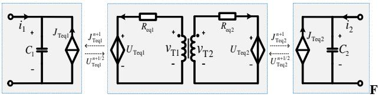

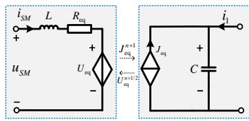  
ig.1 Decoupling sub circuit of DAB module   
Fig. 2 Decoupling sub circuit of Cascaded H-bridge

$$
\begin{array}{l} \left[ \begin{array}{c} C _ {1} \left(u _ {\mathrm {C} 1} ^ {n + 1 / 2} - u _ {\mathrm {C} 1} ^ {n - 1 / 2}\right) \\ C _ {2} \left(u _ {\mathrm {C} 2} ^ {n + 1 / 2} - u _ {\mathrm {C} 2} ^ {n - 1 / 2}\right) \\ L _ {1 1} \left(i _ {\mathrm {T} 1} ^ {n + 1} - i _ {\mathrm {T} 1} ^ {n}\right) + L _ {1 2} \left(i _ {\mathrm {T} 2} ^ {n + 1} - i _ {\mathrm {T} 2} ^ {n}\right) \\ L _ {2 1} \left(i _ {\mathrm {T} 1} ^ {n + 1} - i _ {\mathrm {T} 1} ^ {n}\right) + L _ {2 2} \left(i _ {\mathrm {T} 2} ^ {n + 1} - i _ {\mathrm {T} 2} ^ {n}\right) \end{array} \right] = \left[ \begin{array}{c c c c} 0 & & & \\ & 0 & & \\ & & - R _ {\text {e q l}} & \\ & & & - R _ {\text {e q 2}} \end{array} \right] \left[ \begin{array}{c} u _ {\mathrm {C} 1} ^ {n + 1 / 2} + u _ {\mathrm {C} 1} ^ {n - 1 / 2} \\ u _ {\mathrm {C} 2} ^ {n + 1 / 2} + u _ {\mathrm {C} 2} ^ {n - 1 / 2} \\ i _ {\mathrm {T} 1} ^ {n + 1} + i _ {\mathrm {T} 1} ^ {n} \\ i _ {\mathrm {T} 2} ^ {n + 1} + i _ {\mathrm {T} 2} ^ {n} \end{array} \right] \frac {\Delta t}{2} + \tag {1} \\ \left[ \begin{array}{c c c} & & k _ {1 1} \\ \hline k _ {\mathrm {u} 1} & & k _ {1 2} \\ & k _ {\mathrm {u} 2} & \end{array} \right] \left[ \begin{array}{c} u _ {\mathrm {C} 1} ^ {n + 1 / 2} \\ u _ {\mathrm {C} 2} ^ {n + 1 / 2} \\ i _ {\mathrm {T} 1} ^ {n} \\ i _ {\mathrm {T} 2} ^ {n} \end{array} \right] \Delta t + \left[ \begin{array}{c} i _ {1} ^ {n} \\ i _ {2} ^ {n} \\ 0 \\ 0 \end{array} \right] \Delta t \\ \end{array}
$$

Finally, the decoupling model (EDM) is implemented by $\mathrm{C + + }$ programming and compared with the simulation results of single phase three module CHB-PET detailed model (DM) in PSCAD/EMTDC. The CPU used in the test is Intel (core) 8core i7-9700k, and the simulation step is $1\mu s.$ The simulation results show that the model proposed in this paper has high simulation accuracy.

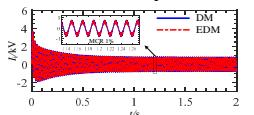  
(a) Comparison of input current of cascaded H-bridge

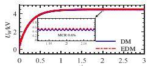  
(b) Comparison of output voltage of cascaded H-bridge

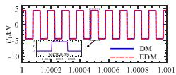  
(c) Comparison of high voltage side voltage

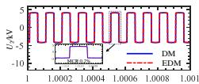  
(d) Comparison of low voltage side voltage

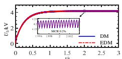  
(e) Comparison of bus voltage at low voltage side

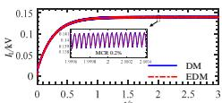  
(f) Load current comparison   
Fig.3 Simulation result waveform comparison

Tab.1 CPU time comparison of two models under different switching frequencies   

<table><tr><td>model</td><td colspan="2">DM/ms</td><td colspan="2">EDM
serial computing/ms</td><td colspan="2">EDM
parallel computin
g/ms</td></tr><tr><td>frequency
Number
of modules</td><td>5kHz</td><td>20kHz</td><td>5kHz</td><td>20kHz</td><td>5kHz</td><td>20kHz</td></tr><tr><td>3</td><td>16238</td><td>19446</td><td>2766</td><td>2496</td><td>2922</td><td>3132</td></tr><tr><td>10</td><td>70941</td><td>98564</td><td>3875</td><td>3968</td><td>3484</td><td>3661</td></tr><tr><td>20</td><td>221608</td><td>286857</td><td>5844</td><td>5562</td><td>3978</td><td>3927</td></tr><tr><td>40</td><td>859254</td><td>1309669</td><td>11188</td><td>11969</td><td>4865</td><td>4995</td></tr><tr><td>80</td><td>3223254</td><td>4587633</td><td>28612</td><td>28484</td><td>7769</td><td>7847</td></tr><tr><td>100</td><td>5807242</td><td>9218492</td><td>39563</td><td>38850</td><td>9593</td><td>9471</td></tr></table>