# Digital twins of multiple energy networks based on real-time simulation using holomorphic embedding method, Part I: Mechanism-driven modeling✩

Xiaoli Huang a, Hang Tian a,∗, Haoran Zhao a, Haoran Li a, Mengxue Wang a, Xu Huang b

a School of Electrical Engineering, Shandong University, Jinan, 250061, China   
b State Grid Tianjin Electric Power Company, Tianjin, 300010, China

# A R T I C L E I N F O

Keywords:

Digital twins

Holomorphic embedding

Multiple energy networks

Mechanism-driven model

Real-time simulation

# A B S T R A C T

Digital twins can provide system operators with a new way to design, operate, and maintain highlyinterconnected multiple energy networks (MEN) by integrating interdisciplinary models using the co-simulation technique and implementing faster-than-real-time simulation enabled by powerful modern computing facilities. This series of papers presents digital twins of MEN capable of real-time simulation facilitated by the holomorphic embedding method. As Part I of this series of papers, mechanism-driven modeling is concentrated to guarantee that high-resolution solutions are computationally accessible. A holomorphic embedding-based model (HEM) for MEN is proposed, which uses time-dependent holomorphic functions to depict the timevarying dynamics of gas and heat flows. A convergence radius model (CRM) is proposed to obtain the essential convergence information of HEM, thereby improving its computational performance to match the real-time requirement. Finally, the effectiveness of the proposed method is validated in a medium-sized study case. The results show that the proposed method offers a significant computational benefit with competent precision when compared to standard differential methods, laying the groundwork for the realization of MEN’s digital twins.

# 1. Introduction

Multiple energy networks (MEN), where different energy flows are interconnected and coordinated to release potential flexibility, have received increasing attention in recent years due to their potential for more efficient energy utilization and lower carbon emission [1]. However, the synergistic coordination among multiple energy and the complex dynamic processes involved make the design, optimization, and operation of MEN challenging [2]. Digital twins were first presented by Dr. Michael Grieves in 2002 [3]. Digital twins refer to a virtual representation of a physical object that can be utilized to conduct simulations, investigate performance concerns, and produce potential modifications, all with the purpose of creating insightful information that can later be applied to the initial physical object [4]. In recent years, Digital twins have been implemented on different energy infrastructures, such as microgrids [5], polymer electrolyte membrane electrolyzer [6], smart cities [7], etc. It can offer valuable experimental verification and optimized solutions for MEN development and operation, thereby improving its economic efficiency and reliability.

In the digital twins of MEN, the synchronization between the digital replica and the physical counterpart should be guaranteed [8]. To

achieve such synchronization, the digital model needs to be solved at least in real-time with adequate accuracy, which can be accomplished via real-time simulation. Furthermore, if the output can be provided at a much smaller time ahead of real-time, the digital twins are considered useful for deriving control or scheduling decisions [9]. Faster-than-real-time performance is continually pursued in the power system for activities involving transient stability analysis [10], decision support system-aided simulation [11], electromagnetic transient simulation [12], and so on. Despite its widespread use in power systems, faster-than-real-time simulation is presently not practical in MEN owing to the high computational cost of solving partial differential equations involving various energies with desired precision. The research objective of this series of papers is to utilize mechanism-driven and data-driven approaches to develop digital twins of MEN capable of performing the real-time simulation. In Part I of this series of papers, the real-time simulation capability of digital twins will be mathematically implemented by mechanism-driven modeling.

Accuracy and computing speed are two major concerns in realizing real-time simulation of MEN. Dynamic behaviors of MEN are

generally described by partial differential equations (PDEs) [13–15]. Currently, the classic numerical methods for solving PDEs include the finite difference method, the finite volume method, and the finite element method [16–19], all of which provide discrete PDEs’ solutions via spatio-temporal discretization. Unfortunately, discretization in both spatial and temporal dimensions yields a large number of mesh points, which results in a high computing cost and limits its application in real-time simulation. Aiming to find efficient solutions to PDEs of MEN, more advanced methods are developed, which can be categorized as frequency-domain transformation methods and holomorphic embedding methods.

Combined with the circuit theory, the frequency-domain transformation method converts differential equations into algebraic equations in the frequency-domain or complex frequency-domain to realize the fast calculation of linear differential equations [20–26]. In [20,21], generalized phasor models are presented to transform the linearized timedomain models into frequency-domain models. However, the selection of frequency components may introduce truncation errors. In [22,23], the heat transfer dynamic characteristics based on the entropy index are obtained using thermo-electric analogy and Laplace transformation. In [24,25], the frequency-domain models of gas and heating networks are obtained via Laplace transformation. To avoid the difficulty in calculating its inverse transformation, the largest time constant is utilized to approximate the pipeline’s lumped parameter model, which may lead to a significant computation error. To summarize, even though the fast calculation of linear differential equations can be realized by the above methods, the linearization may introduce errors, which limits its accuracy in some circumstances.

The holomorphic embedding-based model (HEM), which can effectively deal with non-linearity, has been widely employed in both steady-state and dynamic simulation of power systems to perform efficient calculations with improved convergence and competent accuracy [27–30]. In [27], HEM for induction motor is proposed and applied for voltage stability analysis. In [28], the dynamic simulation of a power system under fault was realized based on HEM. Furthermore, in the scope of MEN, a dynamic energy flow study of integrated gas and electrical systems is completed utilizing HEM [31]. Nevertheless, the convergence radius of HEM has a considerable influence on its performance in accuracy and efficiency [32,33], determining whether it is capable of performing the real-time simulation. In [31], the convergence radius is obtained by judging the mismatch between HEM and the ordinary differential equations (ODEs) model at predefined time steps. However, since the avoidance of numerical divergence cannot be guaranteed by the judging approach, inaccuracies may occur at some random steps and be carried through the entire operation. In [28], the convergence radius of HEM is explored through the dichotomy method. Although this method can preserve the accuracy of HEM, periodically validating whether the solution is in the convergence radius reduces computational performance.

Given that advanced model fidelity and execution speed are required for digital twins of MEN to fully exploit its potential to deal with demanding applications, this series of works is devoted to developing digital twins of MEN based on real-time simulation using the holomorphic embedding method. In this paper (Part I), the HEM of MEN and the convergence radius model (CRM) are proposed to enable the real-time simulation computationally. The following are the three main contributions of this paper:

(1) A HEM of MEN that accommodates electricity, gas, and heat is proposed. It specifically meets the demand for a tractable dynamic model that suits the heating network, considering mainstream regulation modes, including the quality regulation mode (constant flow and variable temperature) and the quantity regulation mode (variable flow and constant temperature).

(2) A CRM is proposed to obtain the critical convergence information of HEM. On this basis, a simplified CRM is proposed, which can efficiently determine the radius of convergence and thereby strengthen the HEM’s computational performance to meet the real-time standard.   
(3) A co-simulation framework is proposed to enable efficient collaboration across different energy networks’ HEMs and CRMs.

The remainder of this article is structured as follows. Section 2 introduces the architecture of the digital twins of MEN. Section 3 presents a mechanism-driven model based on holomorphic embedding. In Section 4, a model for calculating the radius of convergence for HEM is introduced, and a co-simulation framework is given. Simulation results are illustrated and analyzed in Section 5. Finally, conclusions are drawn in Section 6.

# 2. Architecture of the digital twins of MEN

It is the top priority to identify the meaning of a twin and which version is being used in this paper at present. A digital twin is generally a representation of a process or system that has been supplemented by (real-time) data. The representation itself may range from a simple sketch of the system to a dynamic differential simulation model, depending on how much model fidelity and execution speed are required by the aimed application. In this paper, the expected application of the proposed digital twins is to describe the dynamic behaviors of MEN, exposing abnormal behavior such as fault, therefore providing preventive or corrective control to maintain the system’s security before or after any security incidents are met. Therefore, models with high fidelity are required since phenomena of heat and gas dynamics are needed to be covered in the description of MEN. Besides, the twins are expected to provide their output within a time that is equal to or smaller than the intended operational time step so that they can be used to derive control decisions or enable hardware-in-the-loop (HIL) tests. Due to these requirements, the digital twins of MEN must be capable of performing real-time simulations based on dynamic MEN models described by differential equations. The architecture of the desired digital twins is illustrated in Fig. 1.

The proposed digital twin architecture consists of a Digital twins block, a Physical system block and an Application block. While the Physical system block represents the actual physical networks and their associated equipment, both the Application block and the Digital twins block obtain measurement data perceived from the Physical system block. Besides, the real-time simulation results generated by the Digital twins block will be delivered to the Application block for further analysis, generating control decisions to be applied upon the Physical system block.

In the measurement database, multiple storage forms, including real-time database (RTDB), structured query language (SQL) database, and non-SQL database, are employed to meet different storage needs. The RTDB enables quick access to real-time measurements during the simulation but has a limited capacity, whereas SQL and non-SQL databases provide great capacity and long-term storage of historical data, training data, and lumped parameters but have a slower access rate.

This series of papers mainly focus on the designing of the four core functional modules in the Digital twins block. In Part I of the series of papers, two mechanism-driven modules, i.e., the Holomorphic embedding-based model (HEM) and the Convergence radius model (CRM) are proposed, serving as the fundamental mathematical model which determines the model depth and timing of the entire digital twins. The other two data-driven modules and relative connections, which are currently inactivated in Fig. 1, will be later introduced in Part II. More detailed derivations of HEM and CRM will be given in Sections 3 and 4, respectively.

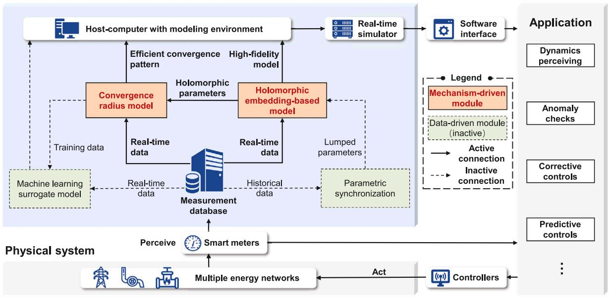  
Digital twins   
Fig. 1. Architecture of the digital twins of MEN.

# 3. Holomorphic embedding-based model of MEN

The idea of constructing the HEM of MEN is to transform the PDEs into ODEs and then reconstruct the ODEs by holomorphic function. The following are the HEMs of the heating network, gas network, and electrical network.

# 3.1. Heating network

# 3.1.1. Mechanism model

In the heating network, the one-dimensional flow process of water in pipes is described by the material-balance equation (1) and momentum equation (2). The thermodynamic process is described by the energy conservation equation (3).

$$
\frac {\partial \rho_ {\mathrm {h}}}{\partial t} + \frac {\partial \rho_ {\mathrm {h}} v _ {\mathrm {h}}}{\partial x} = 0 \tag {1}
$$

$$
\frac {\partial \rho_ {\mathrm {h}} v _ {\mathrm {h}}}{\partial t} + \frac {\partial \rho_ {\mathrm {h}} v _ {\mathrm {h}} ^ {2}}{\partial x} + \frac {\partial p _ {\mathrm {h}}}{\partial x} + \frac {\lambda_ {\mathrm {h}} \rho_ {\mathrm {h}} v _ {\mathrm {h}} ^ {2}}{2 D _ {\mathrm {h}}} + \rho_ {\mathrm {h}} g \sin \theta = 0 \tag {2}
$$

$$
c _ {\mathrm {p}} \rho_ {\mathrm {h}} A _ {\mathrm {h}} \frac {\partial T _ {\mathrm {h}}}{\partial t} + c _ {\mathrm {p}} \rho_ {\mathrm {h}} v _ {\mathrm {h}} A _ {\mathrm {h}} \frac {\partial T _ {\mathrm {h}}}{\partial x} + \mu_ {\mathrm {h}} \left(T _ {\mathrm {h}} - T _ {\mathrm {e}}\right) = 0 \tag {3}
$$

where $\rho _ { \mathrm { h } } , v _ { \mathrm { h } } , p _ { \mathrm { h } }$ and $c _ { \mathfrak { p } }$ are the density, velocity, pressure and specific heat capacity of water, respectively; $\lambda _ { \mathrm { h } } , D _ { \mathrm { h } } , \theta _ { \mathrm { h } }$ and $\mu _ { \mathrm { h } }$ are the friction coefficient, inner diameter, dip angle and heat dissipation coefficient of pipe in the heating network, respectively; $T _ { \mathrm { h } }$ is the temperature of the water; $T _ { \mathrm { e } }$ is the temperature of the environment; $g$ is the acceleration of gravity; ?? and ?? represent time and space. The following derivation of this paper neglects the influence of the dip angle.

As an incompressible fluid, the density of water can be considered to be a constant. The relationship between mass flow rate $M _ { \mathrm { h } }$ and velocity of water in the pipe is $M _ { \mathrm { h } } = \rho _ { \mathrm { h } } v _ { \mathrm { h } } A _ { \mathrm { h } }$ . Therefore, (1), (2) and (3) can be rewritten as:

$$
\frac {\partial M _ {\mathrm {h}}}{\partial x} = 0 \tag {4}
$$

$$
\frac {\partial M _ {\mathrm {h}}}{\partial t} + \frac {2}{\rho_ {\mathrm {h}} A _ {\mathrm {h}}} M _ {\mathrm {h}} \frac {\partial M _ {\mathrm {h}}}{\partial x} + A _ {\mathrm {h}} \frac {\partial p _ {\mathrm {h}}}{\partial x} + \frac {\lambda_ {\mathrm {h}} M _ {\mathrm {h}} ^ {2}}{2 \rho_ {\mathrm {h}} A _ {\mathrm {h}} D _ {\mathrm {h}}} = 0 \tag {5}
$$

$$
c _ {\mathrm {p}} \rho_ {\mathrm {h}} A _ {\mathrm {h}} \frac {\partial T _ {\mathrm {h}}}{\partial t} + c _ {\mathrm {p}} M _ {\mathrm {h}} \frac {\partial T _ {\mathrm {h}}}{\partial x} + \mu_ {\mathrm {h}} \left(T _ {\mathrm {h}} - T _ {\mathrm {e}}\right) = 0 \tag {6}
$$

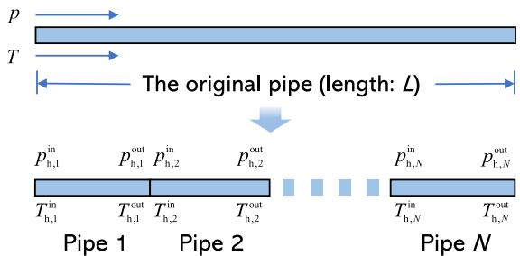  
Fig. 2. Spatial discrete diagram of heating network.

As shown in Fig. 2, the pipe of length ?? can be divided into ?? segments using the spatial discretization method. Then, the partial differential terms $p _ { \mathrm { h } }$ and $T _ { \mathrm { h } }$ with respect to distance ?? can be integrated using the trapezoidal rule. Therefore, the original PDEs (4) to (6) can be transformed into ODEs with only respect to time ??.

$$
M _ {\mathrm {h}, a} ^ {\text {o u t}} = M _ {\mathrm {h}, a} ^ {\text {i n}} = M _ {\mathrm {h}, a} \tag {7}
$$

$$
\frac {\mathrm {d} M _ {\mathrm {h} , a}}{\mathrm {d} t} = \alpha_ {\mathrm {h}, a} \left(p _ {\mathrm {h}, a} ^ {\text {i n}} - p _ {\mathrm {h}, a} ^ {\text {o u t}}\right) - \beta_ {\mathrm {h}, a} M _ {\mathrm {h}, a} ^ {2} \tag {8}
$$

$$
\begin{array}{l} \frac {\mathrm {d} T _ {\mathrm {h} , a} ^ {\text {i n}}}{\mathrm {d} t} + \frac {\mathrm {d} T _ {\mathrm {h} , a} ^ {\text {o u t}}}{\mathrm {d} t} = 2 \gamma_ {\mathrm {h}, a} M _ {\mathrm {h}, a} \left(T _ {\mathrm {h}, a} ^ {\text {i n}} - T _ {\mathrm {h}, a} ^ {\text {o u t}}\right) \tag {9} \\ - \delta_ {\mathrm {h}, a} \left(T _ {\mathrm {h}, a} ^ {\text {i n}} + T _ {\mathrm {h}, a} ^ {\text {o u t}}\right) + 2 \delta_ {\mathrm {h}, a} T _ {\mathrm {e}} \\ \end{array}
$$

where $\alpha _ { \mathrm { h } , a } ~ = ~ A _ { \mathrm { h } , a } / l _ { \mathrm { h } , a } ; ~ \beta _ { \mathrm { h } , a } ~ = ~ \lambda _ { \mathrm { h } , a } / 2 \rho _ { \mathrm { h } , a } A _ { \mathrm { h } , a } D _ { \mathrm { h } , a } ; ~ \gamma _ { \mathrm { h } , a } ~ = ~ 1 / \rho _ { \mathrm { h } , a } A _ { \mathrm { h } , a } l _ { \mathrm { h } , a } ;$ $\delta _ { \mathrm { h } , a } ~ = ~ \mu _ { \mathrm { h } , a } / c _ { \mathrm { p } } \rho _ { \mathrm { h } , a } A _ { \mathrm { h } , a } ;$ ?? is pipe number; $l _ { \mathrm { h } , a }$ is the length of each segment.

In the heating network, each node follows the material-balance equation, maintaining the flow balance of inlet and outlet pipes, which can be expressed as:

$$
\sum A _ {i, a} ^ {\text {i n}} M _ {\mathrm {h}, a} ^ {\text {i n}} + \sum A _ {i, a} ^ {\text {o u t}} M _ {\mathrm {h}, a} ^ {\text {o u t}} = 0, \quad \forall i \in I ^ {\mathrm {H N}}, \forall a \in \mathcal {P} ^ {\mathrm {H N}} \tag {10}
$$

where $I ^ { \mathrm { H N } }$ and $P ^ { \mathrm { H N } }$ are the index sets of nodes and pipes in the heating network, respectively; $A _ { i , a } ^ { \mathrm { i n } }$ and $A _ { i , a } ^ { \mathrm { o u t } }$ are nodal incidence matrix’s elements of the inlet and outlet pipes, respectively.

Energy flows concerning each node follow the energy conservation equation (11).

$$
\sum A _ {i, a} ^ {\text {i n}} M _ {\mathrm {h}, a} ^ {\text {i n}} T _ {\mathrm {h}, a} ^ {\text {i n}} + \sum A _ {i, a} ^ {\text {o u t}} M _ {\mathrm {h}, a, t} ^ {\text {o u t}} T _ {\mathrm {h}, a} ^ {\text {o u t}} = Q _ {i} / c _ {\mathrm {p}} \tag {11}
$$

where $Q _ { i }$ is the load at node ??.

When a pipe is divided into N segments, it can be treated as N virtual pipes and N-1 virtual nodes. Eqs. (10) and (11) can represent both the pipe connection relationships at all real and virtual nodes. Therefore, based on (10) and (11), the promotion of the pipe segment to the pipe and then to the heating network can be achieved.

To summarize, by converting the mechanism model from PDEs to ODEs, (7) to (11) are obtained as models of the heating network.

# 3.1.2. Holomorphic embedding-based model

The model of the heating network can be described as a set of ODEs, and the state variables $M _ { \mathrm { h } } , p _ { \mathrm { h } }$ and $T _ { \mathrm { h } }$ are only with respect to ??.

Therefore, based on holomorphic embedding, the time-varying variables ??h,??, ??in , $M _ { \mathrm { h } , a } , \ p _ { \mathrm { h } , a } ^ { \mathrm { i n } } , \ p _ { \mathrm { h } , a } ^ { \mathrm { o u t } } , \ T _ { \mathrm { h } , a } ^ { \mathrm { i n } }$ ??outh,?? , and $T _ { \mathrm { h } , a } ^ { \mathrm { o u t } }$ can be replaced by holomorphic functions of ??.

$$
\begin{array}{l} M _ {\mathrm {h}, a} (t) = \sum_ {n = 0} ^ {\infty} M _ {\mathrm {h}, a} [ n ] t ^ {n}, \\ p _ {\mathrm {h}, a} ^ {\mathrm {i n}} (t) = \sum_ {n = 0} ^ {\infty} p _ {\mathrm {h}, a} ^ {\mathrm {i n}} [ n ] t ^ {n}, \\ p _ {\mathrm {h}, a} ^ {\text {o u t}} (t) = \sum_ {n = 0} ^ {\infty} p _ {\mathrm {h}, a} ^ {\text {o u t}} [ n ] t ^ {n}, \tag {12} \\ T _ {\mathrm {h}, a} ^ {\mathrm {i n}} (t) = \sum_ {n = 0} ^ {\infty} T _ {\mathrm {h}, a} ^ {\mathrm {i n}} [ n ] t ^ {n}, \\ T _ {\mathrm {h}, a} ^ {\mathrm {o u t}} (t) = \sum_ {n = 0} ^ {\infty} T _ {\mathrm {h}, a} ^ {\mathrm {o u t}} [ n ] t ^ {n}. \\ \end{array}
$$

where $M _ { \mathrm { h } , a } [ n ] , p _ { \mathrm { h } , a } ^ { \mathrm { i n } } [ n ] , p _ { \mathrm { h } , a } ^ { \mathrm { o u t } } [ n ] , T _ { \mathrm { h } , a } ^ { \mathrm { i n } } [ n ]$ and $T _ { b } ^ { \mathrm { o u t } } [ n ]$ are the coefficient of the ???? term in the holomorphic functions.

The derivative of $M _ { \mathrm { h } , a } ( t ) , \ p _ { \mathrm { h } , a } ^ { \mathrm { i n } } ( t ) , \ p _ { \mathrm { h } , a } ^ { \mathrm { o u t } } ( t ) , \ T _ { \mathrm { h } , a } ^ { \mathrm { i n } } ( t )$ ou and $T _ { \mathrm { h } , a } ^ { \mathrm { o u t } } ( t )$ with respect to ?? can be expressed as:

$$
\begin{array}{l} \frac {\mathrm {d} M _ {\mathrm {h} , a}}{\mathrm {d} t} = \sum_ {n = 1} ^ {\infty} \left(n \cdot M _ {\mathrm {h}, a} [ n ] t ^ {n - 1}\right), \\ \frac {\mathrm {d} p _ {\mathrm {h} , a} ^ {\text {i n}}}{\mathrm {d} t} = \sum_ {n = 1} ^ {\infty} \left(n \cdot p _ {\mathrm {h}, a} ^ {\text {i n}} [ n ] t ^ {n - 1}\right), \\ \frac {\mathrm {d} p _ {\mathrm {h} , a} ^ {\text {o u t}}}{\mathrm {d} t} = \sum_ {n = 1} ^ {\infty} \left(n \cdot p _ {\mathrm {h}, a} ^ {\text {o u t}} [ n ] t ^ {n - 1}\right), \tag {13} \\ \frac {\mathrm {d} T _ {\mathrm {h} , a} ^ {\text {i n}}}{\mathrm {d} t} = \sum_ {n = 1} ^ {\infty} \left(n \cdot T _ {\mathrm {h}, a} ^ {\text {i n}} [ n ] t ^ {n - 1}\right), \\ \frac {\mathrm {d} T _ {\mathrm {h} , a} ^ {\text {o u t}}}{\mathrm {d} t} = \sum_ {n = 1} ^ {\infty} \left(n \cdot T _ {\mathrm {h}, a} ^ {\text {o u t}} [ n ] t ^ {n - 1}\right). \\ \end{array}
$$

By embedding (12) and (13) of the state variables into the ODEs, the material-balance equation (7), momentum equation (8) and energy conservation equation (9) can be reconstructed as:

$$
\sum_ {n = 0} ^ {\infty} M _ {\mathrm {h}, a} ^ {\text {i n}} [ n ] t ^ {n} = \sum_ {n = 0} ^ {\infty} M _ {\mathrm {h}, a} ^ {\text {o u t}} [ n ] t ^ {n} = \sum_ {n = 0} ^ {\infty} M _ {\mathrm {h}, a} [ n ] t ^ {n} \tag {14}
$$

$$
\begin{array}{l} \alpha_ {\mathrm {h}, a} \left(\sum_ {n = 0} ^ {\infty} p _ {\mathrm {h}, a} ^ {\text {i n}} [ n ] t ^ {n} - \sum_ {n = 0} ^ {\infty} p _ {\mathrm {h}, a} ^ {\text {o u t}} [ n ] t ^ {n}\right) \tag {15} \\ = \sum_ {n = 1} ^ {\infty} (n + 1) M _ {\mathrm {h}, a} [ n ] t ^ {n + 1} + \beta_ {\mathrm {h}, a} \left(\sum_ {n = 0} ^ {\infty} M _ {\mathrm {h}, a} [ n ] t ^ {n}\right) ^ {2} \\ \end{array}
$$

$$
\begin{array}{l} \sum_ {n = 1} ^ {\infty} n T _ {\mathrm {h}, a} ^ {\mathrm {i n}} [ n ] t ^ {n - 1} + \sum_ {n = 1} ^ {\infty} n T _ {\mathrm {h}, a} ^ {\mathrm {o u t}} [ n ] t ^ {n - 1} \\ = 2 \gamma_ {\mathrm {h}, a} \sum_ {n = 0} ^ {\infty} M _ {\mathrm {h}, a} [ n ] t ^ {n} \sum_ {n = 0} ^ {\infty} \left(T _ {\mathrm {h}, a} ^ {\text {i n}} [ n ] t ^ {n} - T _ {\mathrm {h}, a} ^ {\text {o u t}} [ n ] t ^ {n}\right) \tag {16} \\ - \delta_ {\mathrm {h}, a} \sum_ {n = 0} ^ {\infty} \left(T _ {\mathrm {h}, a} ^ {\mathrm {i n}} [ n ] t ^ {n} + T _ {\mathrm {h}, a} ^ {\mathrm {o u t}} [ n ] t ^ {n}\right) + 2 \delta_ {\mathrm {h}, a} T _ {\mathrm {e}} \\ \end{array}
$$

Node material-balance equation (10) and node energy constraint equation (11) can be reconstructed as:

$$
\begin{array}{l} \sum A _ {i, a} ^ {\text {i n}} \sum_ {n = 0} ^ {\infty} M _ {\mathrm {h}, a} [ n ] t ^ {n} + \sum A _ {i, a} ^ {\text {o u t}} \sum_ {n = 0} ^ {\infty} M _ {\mathrm {h}, a} [ n ] t ^ {n} = 0 (17) \\ \sum_ {\infty} A _ {t, a} ^ {\text {i n}} \sum_ {n = 0} ^ {\infty} M _ {\mathrm {h}, a} [ n ] t ^ {n} \sum_ {n = 0} ^ {\infty} T _ {\mathrm {h}, a} ^ {\text {i n}} [ n ] t ^ {n} (18) \\ + \sum A _ {i, a} ^ {\text {o u t}} \sum_ {n = 0} ^ {\infty} M _ {\mathrm {h}, a} [ n ] t ^ {n} \sum_ {n = 0} ^ {\infty} T _ {\mathrm {h}, a} ^ {\text {o u t}} [ n ] t ^ {n} = Q _ {i} / c _ {\mathrm {p}} \\ \end{array}
$$

# 3.1.3. Solving HEM of heating network

Eqs. (14) to (18) are the HEMs of the heating network. Both sides of these equations are $t ^ { 0 } \sim t ^ { n }$ terms. To calculate the unknown coefficients in the holomorphic functions, a recursive procedure is adopted. Comparing the coefficients of terms $t ^ { 0 } , t ^ { 1 } , . . . , t ^ { n }$ on both sides, respectively, a set of linear equations can be obtained:

$$
M _ {\mathrm {h}, a} ^ {\text {o u t}} [ n ] = M _ {\mathrm {h}, a} ^ {\text {i n}} [ n ] = M _ {\mathrm {h}, a} [ n ] \tag {19}
$$

$$
\begin{array}{l} p _ {\mathrm {h}, a} ^ {\mathrm {i n}} [ n ] - p _ {\mathrm {h}, a} ^ {\mathrm {o u t}} [ n ] \\ = \frac {n + 1}{\alpha_ {\mathrm {h} , a}} M _ {\mathrm {h}, a} [ n + 1 ] + \beta_ {\mathrm {h}, a} \sum_ {x = 0} ^ {n} M _ {\mathrm {h}, a} [ x ] M _ {\mathrm {h}, a} [ n - x ] \tag {20} \\ \end{array}
$$

$$
\begin{array}{l} T _ {\mathrm {h}, a} ^ {\text {i n}} [ n ] + T _ {\mathrm {h}, a} ^ {\text {o u t}} [ n ] \\ = \frac {2 \gamma_ {\mathrm {h} , a}}{n} \sum_ {x = 0} ^ {n - 1} \left(T _ {\mathrm {h}, a} ^ {\text {i n}} [ x ] - T _ {\mathrm {h}, a} ^ {\text {o u t}} [ x ]\right) M _ {\mathrm {h}, a} [ n - 1 - x ] \tag {21} \\ - \frac {\delta_ {\mathrm {h} , a}}{n} \left(T _ {\mathrm {h}, a} ^ {\mathrm {i n}} [ n - 1 ] + T _ {\mathrm {h}, a} ^ {\mathrm {o u t}} [ n - 1 ]\right) + \zeta_ {(n, 1)} 2 \delta_ {\mathrm {h}, a} T _ {\mathrm {e}} \\ \end{array}
$$

$$
\sum A _ {i, a} ^ {\text {i n}} M _ {\mathrm {h}, a} [ n ] + \sum A _ {i, a} ^ {\text {o u t}} M _ {\mathrm {h}, a} [ n ] = 0 \tag {22}
$$

$$
\begin{array}{l} \sum A _ {i, a} ^ {\text {i n}} \left(M _ {\mathrm {h}, a} [ 0 ] T _ {\mathrm {h}, a} ^ {\text {i n}} [ n ] + M _ {\mathrm {h}, a} [ n ] T _ {\mathrm {h}, a} ^ {\text {i n}} [ 0 ]\right) \\ + \sum A _ {i, a} ^ {\text {o u t}} \left(M _ {\mathrm {h}, a} [ 0 ] T _ {\mathrm {h}, a} ^ {\text {o u t}} [ n ] + M _ {\mathrm {h}, a} [ n ] T _ {\mathrm {h}, a} ^ {\text {o u t}} [ 0 ]\right) \\ = Q _ {t, i} [ n ] / c _ {\mathrm {p}} - \sum A _ {i, a} ^ {\text {i n}} \sum_ {x = 1} ^ {n - 1} M _ {\mathrm {h}, a} [ x ] T _ {\mathrm {h}, a} ^ {\text {i n}} [ n - x ] \tag {23} \\ + \sum A _ {i, a} ^ {\text {o u t}} \sum_ {x = 1} ^ {n - 1} M _ {\mathrm {h}, a} ^ {\text {o u t}} [ x ] T _ {\mathrm {h}, a} ^ {\text {o u t}} [ n - x ] \\ \end{array}
$$

where $\zeta _ { ( n , 1 ) }$ is a binary parameter, $\zeta _ { ( n , 1 ) } = 1$ only ${ \dot { 1 } } \mathbf { f } \ n = 1$ .

By observing the linear equations (19) to (23), it can be found that if the heating network adopts quality regulation mode, the flow and pressure of each pipeline remain unchanged once the flow distribution is calculated, i.e., $M _ { \mathrm { h } , a }  { [ n ] } = 0 , p _ { \mathrm { h } , a }  { [ n ] } = 0 , n \geq 1$ , which can simplify the solving process. When the heating network adopts the quantity regulation mode, the dynamic process of the mass flow rate and temperature can be obtained by solving (19) and (21). Then the pressure change in the heating network can be obtained by solving (20).

Therefore, the linear equations (19) to (23) can be arranged as an equation with unknown coefficients on the left and known coefficients on the right. If we know the initial values $M _ { \mathrm { h } , a } [ 0 ] , p _ { \mathrm { h } , a } ^ { \mathrm { i n } } [ 0 ] , p _ { \mathrm { h } , a } ^ { \mathrm { o u t } } [ 0 ] , T _ { \mathrm { h } , a } ^ { \mathrm { i n } } [ 0 ] ,$ , $T _ { \mathrm { h } , a } ^ { \mathrm { o u t } } [ 0 ]$ , the state variable can be obtained.

# 3.2. Gas network

# 3.2.1. Mechanism model

Similar to the heating network, the one-dimensional flow process of natural gas in the pipeline can be described by the material-balance equation (24) and the momentum equation (25).

$$
\frac {\partial \rho_ {\mathrm {g}}}{\partial t} + \frac {\partial \rho_ {\mathrm {g}} v _ {\mathrm {g}}}{\partial x} = 0 \tag {24}
$$

$$
\frac {\partial \rho_ {\mathrm {g}} v _ {\mathrm {g}}}{\partial t} + \frac {\partial \rho_ {\mathrm {g}} v _ {\mathrm {g}} ^ {2}}{\partial x} + \frac {\partial p _ {\mathrm {g}}}{\partial x} + \frac {\lambda_ {\mathrm {g}} \rho_ {\mathrm {g}} v _ {\mathrm {g}} ^ {2}}{2 D _ {\mathrm {g}}} + \rho_ {\mathrm {g}} g \sin \theta_ {\mathrm {g}} = 0 \tag {25}
$$

where $\rho _ { \mathrm { g } } , v _ { \mathrm { g } }$ and $p _ { \mathrm { g } }$ are the density, velocity and pressure of natural gas, respectively; $\lambda _ { \mathrm { g } } , D _ { \mathrm { g } }$ and $\theta _ { \mathrm { g } }$ are the friction coefficient, inner diameter and dip angle of the natural gas pipeline, respectively.

Unlike hot water, natural gas cannot be considered as an incompressible fluid. In the ideal state, the physical variable of natural gas satisfies the equation of state $p _ { \mathrm { g } } = R T _ { \mathrm { g } } \rho _ { \mathrm { g } } = c ^ { 2 } \rho _ { \mathrm { g } }$ , where ?? and $T _ { \mathrm { { g } } }$ are gas constant and temperature of natural gas, and ?? is the sound velocity in natural gas.

The relationship between mass flow rate and velocity in the pipeline $( M _ { \mathrm { g } } = \rho _ { \mathrm { g } } v _ { \mathrm { g } } A _ { \mathrm { g } } )$ is also applied here, where $M _ { \mathrm { g } }$ is the mass flow rate of natural gas and $A _ { \mathrm { g } }$ is the cross-sectional area of the pipeline.

A set of PDEs can be obtained between the mass flow rate and pressure of natural gas in the pipeline by reformulating (24) and (25):

$$
A _ {\mathrm {g}} \frac {\partial p _ {\mathrm {g}}}{\partial t} + c ^ {2} \frac {\partial M _ {\mathrm {g}}}{\partial x} = 0 \tag {26}
$$

$$
\frac {\partial M _ {\mathrm {g}}}{\partial t} = - \frac {2 c ^ {2} M _ {\mathrm {g}}}{A _ {\mathrm {g}} p _ {\mathrm {g}}} \frac {\partial M _ {\mathrm {g}}}{\partial x} - A _ {\mathrm {g}} \frac {\partial p _ {\mathrm {g}}}{\partial x} - \frac {\lambda_ {\mathrm {g}} c ^ {2}}{2 A _ {\mathrm {g}} D _ {\mathrm {g}}} \frac {M _ {\mathrm {g}} ^ {2}}{p _ {\mathrm {g}}} \tag {27}
$$

The method shown in Fig. 2 is used to discretize the natural gas pipeline in space. The trapezoidal rule is also used to integrate the partial differential terms $p _ { \mathrm { g } }$ and $M _ { \mathrm { g } }$ with respect to the distance ??. Then (26) and (27) can be transformed into ODEs with only respect to time ??.

$$
\frac {\mathrm {d} p _ {\mathrm {g} , b} ^ {\text {i n}}}{\mathrm {d} t} + \frac {\mathrm {d} p _ {\mathrm {g} , b} ^ {\text {o u t}}}{\mathrm {d} t} = \alpha_ {\mathrm {g}, b} \left(M _ {\mathrm {g}, b} ^ {\text {i n}} - M _ {\mathrm {g}, b} ^ {\text {o u t}}\right) \tag {28}
$$

$$
\begin{array}{l} \frac {\mathrm {d} M _ {\mathrm {g} , b} ^ {\text {i n}}}{\mathrm {d} t} + \frac {\mathrm {d} M _ {\mathrm {g} , b} ^ {\text {o u t}}}{\mathrm {d} t} \\ = \beta_ {\mathrm {g}, b} \left(p _ {\mathrm {g}, b} ^ {\text {i n}} - p _ {\mathrm {g}, b} ^ {\text {o u t}}\right) + \left(2 \alpha_ {\mathrm {g}, b} - \gamma_ {\mathrm {g}, b}\right) M _ {\mathrm {g}, b} ^ {\text {o u t} 2} W _ {\mathrm {g}, b} \tag {29} \\ - \left(2 \alpha_ {\mathrm {g}, b} + \gamma_ {\mathrm {g}, b}\right) M _ {\mathrm {g}, b} ^ {\text {i n}} ^ {2} W _ {\mathrm {g}, b} - 2 \gamma_ {\mathrm {g}, b} M _ {\mathrm {g}, b} ^ {\text {i n}} M _ {\mathrm {g}, b} ^ {\text {o u t}} W _ {\mathrm {g}, b} \\ \end{array}
$$

where $\begin{array} { r } { \alpha _ { \mathrm { g } , b } ^ { } ~ = ~ 2 c ^ { 2 } / A _ { \mathrm { g } , b } l _ { \mathrm { g } , b } ; ~ \beta _ { \mathrm { g } , b } ^ { } ~ = ~ 2 A _ { \mathrm { g } , b } / l _ { \mathrm { g } , b } ; ~ \gamma _ { \mathrm { g } , b } ^ { } ~ = ~ \lambda _ { \mathrm { g } , b } c ^ { 2 } / 2 A _ { \mathrm { g } , b } D _ { \mathrm { g } , b } ; } \end{array}$ $W _ { \mathrm { g } , b } = 1 / \left( p _ { \mathrm { g } , b } ^ { \mathrm { i n } } + p _ { \mathrm { g } , b } ^ { \mathrm { o u t } } \right) ;$ ??ing,?? + ; ?? is pipeline number; $l _ { \mathrm { g } , b }$ is the length of each segment.

Each node in the gas network follows the material-balance equation:

$$
\sum A _ {j, b} ^ {\text {i n}} M _ {\mathfrak {g}, b} ^ {\text {i n}} + \sum A _ {j, b} ^ {\text {o u t}} M _ {\mathfrak {g}, b} ^ {\text {o u t}} = M _ {j} ^ {\mathrm {S}} - M _ {j} ^ {\mathrm {D}}, \quad \forall j \in I ^ {\mathrm {G N}}, \forall b \in \mathcal {P} ^ {\mathrm {G N}}. \tag {30}
$$

where $M _ { i } ^ { \mathrm { S } }$ and $M _ { i } ^ { \mathrm { D } }$ are the mass flow rates supplied and demanded at node $j ; A _ { j , b } ^ { \mathrm { i n } }$ and $\bar { A } _ { j , b } ^ { \mathrm { o u t } }$ are the nodal incidence matrix’s elements of inlet and outlet pipelines, respectively; $I ^ { \mathrm { G N } }$ and $\mathcal { P } ^ { \mathrm { G N } }$ are the index sets of nodes and pipelines in the gas network, respectively.

Similar to the heating network, When a pipeline is divided into N segments, it can be treated as N virtual pipelines and N-1 virtual nodes. Based on (30), the promotion of the pipeline segment to the pipeline and then to the gas network can be achieved.

To summarize, by converting the mechanism model from PDEs to ODEs, (28) to (30) are obtained as models of the gas network.

# 3.2.2. Holomorphic embedding-based model

The inlet and outlet flow of each pipeline in the gas network can be expressed by holomorphic functions:

$$
M _ {\mathrm {g}, b} ^ {\text {i n}} (t) = \sum_ {n = 0} ^ {\infty} M _ {\mathrm {g}, b} ^ {\text {i n}} [ n ] t ^ {n}, \quad M _ {\mathrm {g}, b} ^ {\text {o u t}} (t) = \sum_ {n = 0} ^ {\infty} M _ {\mathrm {g}, b} ^ {\text {o u t}} [ n ] t ^ {n}. \tag {31}
$$

The pressure at the inlet and outlet of the pipeline can also be represented by holomorphic functions.

$$
p _ {\mathrm {g}, b} ^ {\text {i n}} (t) = \sum_ {n = 0} ^ {\infty} p _ {\mathrm {g}, b} ^ {\text {i n}} [ n ] t ^ {n}, \quad p _ {\mathrm {g}, b} ^ {\text {o u t}} (t) = \sum_ {n = 0} ^ {\infty} p _ {\mathrm {g}, b} ^ {\text {o u t}} [ n ] t ^ {n}. \tag {32}
$$

Therefore, the material-balance equation (28) and momentum equation (29) of the gas network can be reconstructed as:

$$
\begin{array}{l} \sum_ {n = 1} ^ {\infty} n p _ {\mathrm {g}, b} ^ {\text {i n}} [ n ] t ^ {n - 1} + \sum_ {n = 1} ^ {\infty} n p _ {\mathrm {g}, b} ^ {\text {o u t}} [ n ] t ^ {n - 1} \tag {33} \\ = \alpha_ {\mathrm {g}, b} \sum_ {n = 0} ^ {\infty} M _ {\mathrm {g}, b} ^ {\mathrm {i n}} [ n ] t ^ {n} - \alpha_ {\mathrm {g}, b} \sum_ {n = 0} ^ {\infty} M _ {\mathrm {g}, b} ^ {\mathrm {o u t}} [ n ] t ^ {n} \\ \end{array}
$$

$$
\begin{array}{l} \sum_ {n = 1} ^ {\infty} n M _ {\mathrm {g}, b} ^ {\text {i n}} [ n ] t ^ {n - 1} + \sum_ {n = 1} ^ {\infty} n M _ {\mathrm {g}, b} ^ {\text {o u t}} [ n ] t ^ {n - 1} \\ = \beta_ {\mathrm {g}, b} \sum_ {n = 0} ^ {\infty} p _ {\mathrm {g}, b} ^ {\mathrm {i n}} [ n ] t ^ {n} - \beta_ {\mathrm {g}, b} \sum_ {n = 0} ^ {\infty} p _ {\mathrm {g}, b} ^ {\mathrm {o u t}} [ n ] t ^ {n} \\ + \left(2 \alpha_ {\mathrm {g}, b} - \gamma_ {\mathrm {g}, b}\right) \left(\sum_ {n = 0} ^ {\infty} M _ {\mathrm {g}, b} ^ {\text {o u t}} [ n ] t ^ {n}\right) ^ {2} \sum_ {n = 0} ^ {\infty} W _ {\mathrm {g}, b} [ n ] t ^ {n} \tag {34} \\ - \left(2 \alpha_ {\mathrm {g}, b} + \gamma_ {\mathrm {g}, b}\right) \left(\sum_ {n = 0} ^ {\infty} M _ {\mathrm {g}, b} ^ {\text {i n}} [ n ] t ^ {n}\right) ^ {2} \sum_ {n = 0} ^ {\infty} W _ {\mathrm {g}, b} [ n ] t ^ {n} \\ - 2 \gamma_ {\mathrm {g}, b} \sum_ {n = 0} ^ {\infty} M _ {\mathrm {g}, b} ^ {\text {i n}} [ n ] t ^ {n} \sum_ {n = 0} ^ {\infty} M _ {\mathrm {g}, b} ^ {\text {o u t}} [ n ] t ^ {n} \sum_ {n = 0} ^ {\infty} W _ {\mathrm {g}, b} [ n ] t ^ {n} \\ \end{array}
$$

Among them, $\textstyle \sum _ { n = 0 } ^ { \infty } W _ { \mathrm { g } , b } [ n ] t ^ { n }$ can be obtained by

$$
\sum_ {n = 0} ^ {\infty} W _ {\mathrm {g}, b} [ n ] t ^ {n} = \frac {1}{\sum_ {n = 0} ^ {\infty} p _ {\mathrm {g} , b} ^ {\text {i n}} [ n ] t ^ {n} + \sum_ {n = 0} ^ {\infty} p _ {\mathrm {g} , b} ^ {\text {o u t}} [ n ] t ^ {n}} \tag {35}
$$

Eq. (30) can be reconstructed as:

$$
\sum A _ {j, b} ^ {\text {i n}} \sum_ {n = 0} ^ {\infty} M _ {\mathrm {g}, b} ^ {\text {i n}} [ n ] t ^ {n} + \sum A _ {j, b} ^ {\text {o u t}} \sum_ {n = 0} ^ {\infty} M _ {\mathrm {g}, b} ^ {\text {o u t}} [ n ] t ^ {n} = M _ {\mathrm {g}} ^ {\mathrm {S}} - M _ {\mathrm {g}} ^ {\mathrm {D}} \tag {36}
$$

# 3.2.3. Solving HEM of gas network

Eqs. (35) to (36) are the HEMs of the gas network. Similar to the heating network, both sides of the equation combine $t ^ { 0 } \sim t ^ { n }$ terms. Comparing the coefficients of $t ^ { 0 } , ~ t ^ { 1 } , ~ . . . , ~ t ^ { n } , ~ ( n ~ \geq ~ 1 )$ on both sides of each equation, respectively, a set of linear equations can be obtained.

$$
W _ {\mathrm {g}, b} [ n ] = \frac {\sum_ {x = 0} ^ {n - 1} W _ {\mathrm {g} , b} [ x ] \left(p _ {\mathrm {g} , b} ^ {\text {i n}} [ n - x ] + p _ {\mathrm {g} , b} ^ {\text {o u t}} [ n - x ]\right)}{p _ {\mathrm {g} , b} ^ {\text {i n}} [ 0 ] + p _ {\mathrm {g} , b} ^ {\text {o u t}} [ 0 ]} \tag {37}
$$

$$
p _ {\mathrm {g}, b} ^ {\text {i n}} [ n ] + p _ {\mathrm {g}, b} ^ {\text {o u t}} [ n ] = \frac {\alpha_ {\mathrm {g} , b}}{n} \left(M _ {\mathrm {g}, b} ^ {\text {i n}} [ n - 1 ] - M _ {\mathrm {g}, b} ^ {\text {o u t}} [ n - 1 ]\right) \tag {38}
$$

$$
\begin{array}{l} M _ {\mathrm {g}, b} ^ {\text {i n}} [ n ] + M _ {\mathrm {g}, b} ^ {\text {o u t}} [ n ] = \frac {\beta_ {\mathrm {g} , b}}{n} \left(p _ {\mathrm {g}, b} ^ {\text {i n}} [ n - 1 ] - p _ {\mathrm {g}, b} ^ {\text {o u t}} [ n - 1 ]\right) \\ + \frac {2 \alpha_ {\mathrm {g} , b} - \gamma_ {\mathrm {g} , b}}{n} \sum_ {x = 0} ^ {n - 1} \left\{M _ {\mathrm {g}, b} ^ {\text {o u t}} [ x ] \sum_ {y = 0} ^ {n - x - 1} M _ {\mathrm {g}, b} ^ {\text {o u t}} [ y ] W _ {\mathrm {g}, b} [ m ] \right\} \\ - \frac {2 \alpha_ {\mathrm {g} , b} + \gamma_ {\mathrm {g} , b}}{n} \sum_ {x = 0} ^ {n - 1} \left\{M _ {\mathrm {g}, b} ^ {\text {i n}} [ x ] \sum_ {y = 0} ^ {n - x - 1} M _ {\mathrm {g}, b} ^ {\text {i n}} [ y ] W _ {\mathrm {g}, b} [ m ] \right\} \tag {39} \\ - \frac {2 \gamma_ {\mathrm {g} , b}}{n} \sum_ {x = 0} ^ {n - 1} \left\{M _ {\mathrm {g}, b} ^ {\text {i n}} [ x ] \sum_ {y = 0} ^ {n - x - 1} M _ {\mathrm {g}, b} ^ {\text {o u t}} [ y ] W _ {\mathrm {g}, b} [ m ] \right\} \\ \end{array}
$$

$$
\sum A _ {j, b} ^ {\text {i n}} M _ {\mathrm {g}, b} ^ {\text {i n}} [ n ] + \sum A _ {j, b} ^ {\text {o u t}} M _ {\mathrm {g}, b} ^ {\text {o u t}} [ n ] = M _ {\mathrm {g}, t} ^ {\mathrm {S}} [ n ] - M _ {\mathrm {g}, t} ^ {\mathrm {D}} [ n ] \tag {40}
$$

where, $m = n - x - y - 1 ; W _ { \mathrm { g } , b } [ 0 ] = 1 / p _ { \mathrm { g } , b } ^ { \mathrm { i n } } [ 0 ] + p _ { \mathrm { g } , b } ^ { \mathrm { o u t } } [ 0 ] .$

Same to the heating network, the linear equations (37) to (40) of the gas network can be arranged as an equation with unknown coefficients on the left and known coefficients on the right. If the initial value of $M _ { \mathrm { g } , b } ^ { \mathrm { i n } } [ 0 ] , M _ { \mathrm { g } , b } ^ { \mathrm { o u t } } [ 0 ] , p _ { \mathrm { g } , b } ^ { \mathrm { i n } } [ 0 ]$ g,?? g,?? ??g,??[ and $p _ { \mathrm { g } , b } ^ { \mathrm { o u t } } [ 0 ]$ are known, the state variables can

# 3.3. Electrical network

The electrical network can be modeled with electromagnetic transients (EMT), which is the most detailed description of the physical properties of the electrical network. Such models are computationally very expensive and scale badly. Furthermore, the transient process of the electrical network is much shorter than the dynamic process of gas and heating networks. Therefore, the electrical network steady-state model is adopted to simplify the analysis.

$$
V _ {i} ^ {*} (t ^ {*}) \sum_ {k = 1} ^ {N} Y _ {i k} V _ {k} (t) = S _ {i} ^ {*} (t), \quad i \in \mathcal {N} _ {P Q} \tag {41}
$$

$$
\operatorname {R e} \left(V _ {i} ^ {*} (t) \sum_ {k = 1} ^ {N} Y _ {i k} V _ {k} (t)\right) = P _ {i} (t), \quad i \in \mathcal {N} _ {P V} \tag {42}
$$

$$
V _ {i} (t) V _ {i} ^ {*} \left(t ^ {*}\right) = \left| V _ {i} (t) \right| ^ {2}, \quad i \in \mathcal {N} _ {S L} \& N _ {P V} \tag {43}
$$

where $Y _ { i k }$ is the admittance between bus ?? and ??; $S _ { i }$ and $P _ { i } ( t )$ are the complex power and real power injection to bus $i ; V _ { i }$ is the voltage at bus $i ; \mathcal { N } _ { P Q } , \mathcal { N } _ { P V }$ and $\mathcal { N } _ { S L }$ are metrics for the PQ, PV and slack buses; ∗ represents the conjugate of a variable.

In the electrical network, the voltage vector is also represented by the holomorphic function $\begin{array} { r } { V _ { i } ( t ) = \sum _ { k = 0 } ^ { N } v _ { i } [ k ] t ^ { k } } \end{array}$ . After reconstructing the equation, a set of linear equations can be obtained by comparing the coefficients of the terms of the same order [34].

# 3.4. Coupling device

The combined heat and power (CHP) unit is used as the coupling device in the MEN. In this paper, the energy conversion relationship of the CHP is determined by the operation mode of thermoelectric power generation. Therefore, the energy $Q _ { j }$ supplied by the node ?? of the gas network to the node ?? of the heating network and the power $P _ { k }$ of the bus ?? of the electrical network can be calculated by (44):

$$
M _ {\mathrm {g}, b} = \frac {\left(1 + n _ {\mathrm {h e}}\right) Q _ {j}}{\eta_ {\mathrm {c h p}} K _ {\mathrm {g}}} \tag {44}
$$

$$
P _ {k} = n _ {\mathrm {h e}} Q _ {j}
$$

where $n _ { \mathrm { h e } }$ is the thermoelectric ratio; $\eta _ { \mathrm { c h p } }$ is the energy conversion efficiency of CHP; $M _ { \mathrm { g } , b }$ is the mass flow rate of the node ?? connected to the CHP in the gas network; $K _ { g }$ is the calorific value of natural gas.

Therefore, the holomorphic function of the energy conversion in CHP is:

$$
M _ {\mathrm {g}, b} [ n ] = \frac {\left(1 + n _ {\mathrm {h e}}\right)}{\eta_ {\mathrm {c h p}} K _ {g}} Q _ {j} [ n ] \tag {45}
$$

$$
P _ {k} [ n ] = n _ {\mathrm {h e}} Q _ {j} [ n ]
$$

In summary, given the initial values of each state variable, energy supply and load demand of MEN at each time step, the fast calculation of MEN’s dynamics can be realized by solving the HEMs.

# 4. Real-time implementation of HEM

In the real-time simulation, the solution of HEM has a finite radius of convergence under the given boundary condition, which means the ODEs are satisfied only in a certain interval in the time domain. Therefore, it is necessary to analyze the convergence pattern of HEM.

# 4.1. Radius of convergence model of HEM

In HEM, since the highest order of the holomorphic function takes a limited range of values, the approximate solutions $\mathbf { z } ( t ) = \sum _ { n = 0 } ^ { N }$ ??[??]???? (?? represents state variables, such as mass flow rate, pressure, and temperature) of each variable is a truncated power series. Therefore, there is an imbalance on both sides of the ODEs. The imbalance can be calculated by substituting the HEMs’ results of all state variables into both sides of the ODEs ((7) to (9), (28) and (29)). The imbalance can be expressed as a unified form of power series:

$$
\varphi (t) = \sum_ {k = N} ^ {M} \mathbf {y} [ k ] t ^ {k} \tag {46}
$$

where ??(??) is the imbalance function of the ODE; ??[??] is the k-term power series coefficient of the imbalance function; ?? and ?? are the lowest and highest order of (46), respectively. The values of ?? and ?? are determined by the highest order of the holomorphic functions and ODEs.

It can be found that there is no imbalance in (14), which is the HEM of the material-balance equation in the heating network. The imbalance function $\varphi ( t ) _ { \mathrm { H } 1 , a }$ of momentum equation (15) is a function of $t ^ { N + 1 } \ \sim \ t ^ { 2 N }$ terms; The imbalance function $\varphi ( t ) _ { \mathrm { H } 2 , a }$ of the energy conservation equation (16) is a function of $t ^ { N } \sim t ^ { 2 N }$ terms.

$$
\varphi (t) _ {\mathrm {H} 1, a} = \beta_ {\mathrm {h}, a} \sum_ {x = N + 1} ^ {2 N} \sum_ {y = x - N} ^ {N} M _ {\mathrm {h}, a} [ y ] M _ {\mathrm {h}, a} [ x - y ] t ^ {x} \tag {47}
$$

$$
\begin{array}{l} \varphi (t) _ {\mathrm {H} 2, a} = - \delta_ {\mathrm {h}, a} \left(T _ {\mathrm {h}, a} ^ {\mathrm {i n}} [ N ] t ^ {N} + T _ {\mathrm {h}, a} ^ {\mathrm {o u t}} [ N ] t ^ {N}\right) \\ + 2 \gamma_ {\mathrm {h}, a} \sum_ {x = N} ^ {2 N} \sum_ {y = x - N} ^ {N} M _ {\mathrm {h}, a} [ y ] \left(T _ {\mathrm {h}, a} ^ {\text {i n}} [ x - y ] - T _ {\mathrm {h}, a} ^ {\text {o u t}} [ x - y ]\right) t ^ {x} \tag {48} \\ \end{array}
$$

It can be found that the material-balance equation (33) is a firstorder linear equation. Hence, the imbalance function $\varphi ( t ) _ { \mathrm { G } 1 , b }$ only has $t ^ { N }$ term, which is expressed as:

$$
\varphi (t) _ {\mathrm {G} 1, b} = \alpha_ {\mathrm {g}, b} \left(M _ {\mathrm {g}, b} ^ {\text {i n}} [ N ] - M _ {\mathrm {g}, b} ^ {\text {o u t}} [ N ]\right) t ^ {N} \tag {49}
$$

The momentum equation (34) of the gas network is a third-order nonlinear equation, and the imbalance function $\varphi ( t ) _ { \mathrm { G } 2 , b }$ (50) obtained includes $t ^ { N } \sim t ^ { 3 N }$ terms.

Since the steady-state equation is adopted in the electrical network, the issue regarding the radius of convergence does not exist here.

When the size of the imbalance function is less than the tolerance, the holomorphic function is considered to be convergent. Therefore, the CRM of HEM can be obtained by solving the imbalance functions (47) to (50).

$$
\varphi (t) _ {\mathrm {H l}, a} - \xi_ {\mathrm {h}} = 0,
$$

$$
\varphi (t) _ {\mathrm {H} 2, a} - \xi_ {\mathrm {h}} = 0, \tag {51}
$$

$$
\varphi (t) _ {\mathrm {G} 1, b} - \xi_ {\mathrm {g}} = 0,
$$

$$
\varphi (t) _ {\mathrm {G} 2, b} - \xi_ {\mathrm {g}} = 0.
$$

where $\xi _ { \mathrm { h } }$ and $\xi _ { \mathrm { g } }$ are the tolerances of ODE imbalance in the heating and gas networks, respectively.

Further, the radius of convergence $R _ { \mathrm { h } 1 , a } , R _ { \mathrm { h } 2 , a } , R _ { \mathrm { g } 1 , b }$ and $R _ { \mathrm { g } 2 , b }$ are the solutions ?? corresponding to the four equations in the (51), respectively. Among them, $R _ { \mathrm { h l } , a }$ and $R _ { \mathrm { h 2 } , a }$ are the convergence radius of the material-balance equation and momentum equation of each pipe in the heating network, respectively; $R _ { \mathrm { g l } , b }$ and $R _ { \mathrm { g } 2 , b }$ are the convergence radius of the material-balance equation and momentum equation of each pipeline in the gas network, respectively.

# 4.2. Simplification of CRM

It can be found that the imbalance functions of MEN are polynomial power series, which is difficult to solve efficiently. Therefore, this paper

$$
\begin{array}{l} \varphi (t) _ {\mathrm {G} 2, b} = \beta_ {\mathrm {g}, b} \left(p _ {\mathrm {g}, b} ^ {\text {i n}} [ N ] - p _ {\mathrm {g}, b} ^ {\text {o u t}} [ N ]\right) t ^ {N} \\ + \left(2 \alpha_ {\mathrm {g}, b} - \gamma_ {\mathrm {g}, b}\right) \sum_ {x = N} ^ {2 N} \sum_ {y = 0} ^ {N} \left\{W _ {\mathrm {g}, b} [ y ] \sum_ {k = x - N} ^ {N - y} M _ {\mathrm {g}, b} ^ {\text {o u t}} [ k ] M _ {\mathrm {g}, b} ^ {\text {o u t}} [ x - y - k ] \right\} t ^ {x} \\ + \left(2 \alpha_ {\mathrm {g}, b} - \gamma_ {\mathrm {g}, b}\right) \sum_ {x = 2 N + 1} ^ {3 N} \sum_ {y = x - 2 N} ^ {N} \left\{W _ {\mathrm {g}, b} [ y ] \sum_ {k = x - N - y} ^ {N} M _ {\mathrm {g}, b} ^ {\text {o u t}} [ k ] M _ {\mathrm {g}, b} ^ {\text {o u t}} [ x - y - k ] \right\} t ^ {x} \\ - \left(2 \alpha_ {\mathrm {g}, b} + \gamma_ {\mathrm {g}, b}\right) \sum_ {x = N} ^ {2 N} \sum_ {y = 0} ^ {N} \left\{W _ {\mathrm {g}, b} [ y ] \sum_ {k = x - N} ^ {N - y} M _ {\mathrm {g}, b} ^ {\text {i n}} [ k ] M _ {\mathrm {g}, b} ^ {\text {i n}} [ x - y - k ] \right\} t ^ {x} \tag {50} \\ - \left(2 \alpha_ {\mathrm {g}, b} + \gamma_ {\mathrm {g}, b}\right) \sum_ {x = 2 N + 1} ^ {3 N} \sum_ {y = x - 2 N} ^ {N} \left\{W _ {\mathrm {g}, b} [ y ] \sum_ {k = x - N - y} ^ {N} M _ {\mathrm {g}, b} ^ {\mathrm {i n}} [ k ] M _ {\mathrm {g}, b} ^ {\mathrm {i n}} [ x - y - k ] \right\} t ^ {x} \\ - 2 \gamma_ {\mathrm {g}, b} \sum_ {x = N} ^ {2 N} \sum_ {y = 0} ^ {N} \left\{W _ {\mathrm {g}, b} [ y ] \sum_ {k = x - N} ^ {N - y} M _ {\mathrm {g}, b} ^ {\text {i n}} [ k ] M _ {\mathrm {g}, b} ^ {\text {o u t}} [ x - y - k ] \right\} t ^ {x} \\ - 2 \gamma_ {\mathrm {g}, b} \sum_ {x = 2 N + 1} ^ {3 N} \sum_ {y = x - 2 N} ^ {N} \left\{W _ {\mathrm {g}, b} [ y ] \sum_ {k = x - N - y} ^ {N} M _ {\mathrm {g}, b} ^ {\text {i n}} [ k ] M _ {\mathrm {g}, b} ^ {\text {o u t}} [ x - y - k ] \right\} t ^ {x} \\ \end{array}
$$

# Box I.

simplifies the calculation of the radius of convergence by combining holomorphic embedding characteristics.

In the HEM, as the number of series term ?? increases, the corresponding coefficient ??[??] becomes smaller, even much smaller than 1. In the imbalance functions (47) to (50), the coefficients of the $t ^ { n } \left( n \geq N { + } 1 \right)$ terms are obtained by multiplying the higher-order coefficients of the holomorphic functions. It causes the coefficients of $t ^ { n } \ ( n \ \geq \ N + 1 )$ ) terms to be less than that of $t ^ { N }$ term in imbalance functions. Thus, the influence of $t ^ { n } \left( n \geq N + 1 \right)$ terms is smaller than the $t ^ { N }$ terms within a certain range of ??. To simplify the calculation of convergence radius, the $t ^ { n } \left( n \geq N + 1 \right)$ terms in the imbalance function can be neglected.

In the gas network, it can be found that the imbalance function (49) is a first-order linear equation with only $t ^ { N }$ term. Therefore, there is no need to simplify. The imbalance function (50) includes $t ^ { N } \sim t ^ { 3 N }$ terms, which is difficult to be solved efficiently. Therefore, based on the above analysis, $t ^ { N + 1 } \sim t ^ { 3 N }$ terms in the imbalance function (50) can be neglected to simplify the calculation.

$$
\begin{array}{l} \varphi (t) _ {\mathrm {G} 2, b} ^ {\prime} = t ^ {N} \times \vartheta_ {\mathrm {g}, b} \\ \vartheta_ {\mathrm {g}, b} = \beta_ {\mathrm {g}, b} \left(p _ {\mathrm {g}, b} ^ {\text {i n}} [ N ] - p _ {\mathrm {g}, b} ^ {\text {o u t}} [ N ]\right) \\ + \left(2 \alpha_ {\mathrm {g}, b} - \gamma_ {\mathrm {g}, b}\right) \sum_ {y = 0} ^ {N} \left\{W _ {b} [ y ] \sum_ {k = 0} ^ {N - y} M _ {\mathrm {g}, b} ^ {\text {o u t}} [ k ] M _ {\mathrm {g}, b} ^ {\text {o u t}} [ N - y - k ] \right\} \tag {52} \\ - \left(2 \alpha_ {\mathrm {g}, b} + \gamma_ {\mathrm {g}, b}\right) \sum_ {y = 0} ^ {N} \left\{W _ {b} [ y ] \sum_ {k = 0} ^ {N - y} M _ {\mathrm {g}, b} ^ {\text {i n}} [ k ] M _ {\mathrm {g}, b} ^ {\text {i n}} [ N - y - k ] \right\} \\ - 2 \gamma_ {\mathrm {g}, b} \sum_ {y = 0} ^ {N} \left\{W _ {b} [ y ] \sum_ {k = 0} ^ {N - y} M _ {\mathrm {g}, b} ^ {\text {i n}} [ k ] M _ {\mathrm {g}, b} ^ {\text {o u t}} [ N - y - k ] \right\} \\ \end{array}
$$

Then, the radius of convergence of the gas network can be calculated by (53)∼(55):

$$
R _ {\mathrm {g} 1, b} = \frac {\xi_ {\mathrm {g}}}{\alpha_ {\mathrm {g} , b} \left(M _ {\mathrm {g} , b} ^ {\text {i n}} [ N ] - M _ {\mathrm {g} , b} ^ {\text {o u t}} [ N ]\right)} ^ {\frac {1}{N}} \tag {53}
$$

$$
R _ {\mathrm {g} 2, b} ^ {\prime} = \frac {\xi_ {\mathrm {g}}}{\vartheta_ {\mathrm {g} , b}} ^ {\frac {1}{N}} \tag {54}
$$

$$
R _ {\mathrm {g}} = \min  \left(R _ {\mathrm {g} 1, 1}, \dots , R _ {\mathrm {g} 1, \mathrm {N} _ {\mathrm {g}}}, R _ {\mathrm {g} 2, 1} ^ {\prime}, \dots , R _ {\mathrm {g} 2, \mathrm {N} _ {\mathrm {g}}} ^ {\prime}\right) \tag {55}
$$

where $R _ { \mathrm { g } }$ is the convergence radius of the gas network; $N _ { \mathrm { g } }$ is total number of pipeline segments in the gas network; ?? is the highest power of the holomorphic function.

Similar to the gas network, the imbalance functions of the heating network can be simplified as:

$$
\begin{array}{l} \varphi (t) _ {\mathrm {H}} = t ^ {N} \times \vartheta_ {\mathrm {h}, a} \\ \vartheta_ {\mathrm {h}, a} = - \delta_ {\mathrm {h}, a} \left(T _ {\mathrm {h}, a} ^ {\text {i n}} [ N ] + T _ {\mathrm {h}, a} ^ {\text {o u t}} [ N ]\right) \tag {56} \\ + 2 \gamma_ {\mathrm {h}, a} \sum_ {y = 0} ^ {N} M _ {\mathrm {h}, a} [ y ] \left(T _ {\mathrm {h}, a} ^ {\text {i n}} [ N - y ] - T _ {\mathrm {h}, a} ^ {\text {o u t}} [ N - y ]\right) \\ \end{array}
$$

The radius of convergence of the heating network can be calculated by (57) and (58):

$$
R _ {\mathrm {h}, a} = \frac {\xi_ {\mathrm {h}}}{\vartheta_ {\mathrm {h} , a}} ^ {\frac {1}{N}} \tag {57}
$$

$$
R _ {\mathrm {h}} = \min  \left(R _ {\mathrm {h}, 1}, R _ {\mathrm {h}, 2}, \dots , R _ {\mathrm {h}, \mathrm {N} _ {\mathrm {h}}}\right) \tag {58}
$$

where $R _ { \mathrm { h } }$ is the convergence radius of the heating network; $\Nu _ { \mathrm { h } }$ is the total number of pipe segments in the heating network.

In the simulation process of MEN, the whole networks are solved by holomorphic embedding. The convergence radius of the whole network is determined by the minimum radius of the gas and the heating networks. Therefore, the radius of convergence of the MEN is:

$$
R = \min  \left(R _ {\mathrm {h}}, R _ {\mathrm {g}}\right) \tag {59}
$$

# 4.3. Co-simulation framework

Before the co-simulation, network configuration and simulation parameter settings need to be completed. MEN simulation is to obtain the running state of the whole network according to the network parameters and the current boundary conditions. At the same time, the heating network has two basic regulation modes: quality regulation and quantity regulation. The control variables of the simulation should be adjusted according to different regulation modes [35]. In addition, the initial highest order ?? of HEM, tolerances of ODE imbalance $\xi _ { \mathrm { h } }$ and $\xi _ { \mathrm { g } } ,$ and the time step of simulation ???? need to be set.

The second step of the co-simulation is first to solve the HEM based on the initial values until convergence, adopting the solution method introduced in Section 3. The convergence of the solution can be determined by the coefficients of the series terms of the holomorphic functions. If the coefficient increases with the order or oscillates in value, the solution is not convergent. Then the boundary conditions

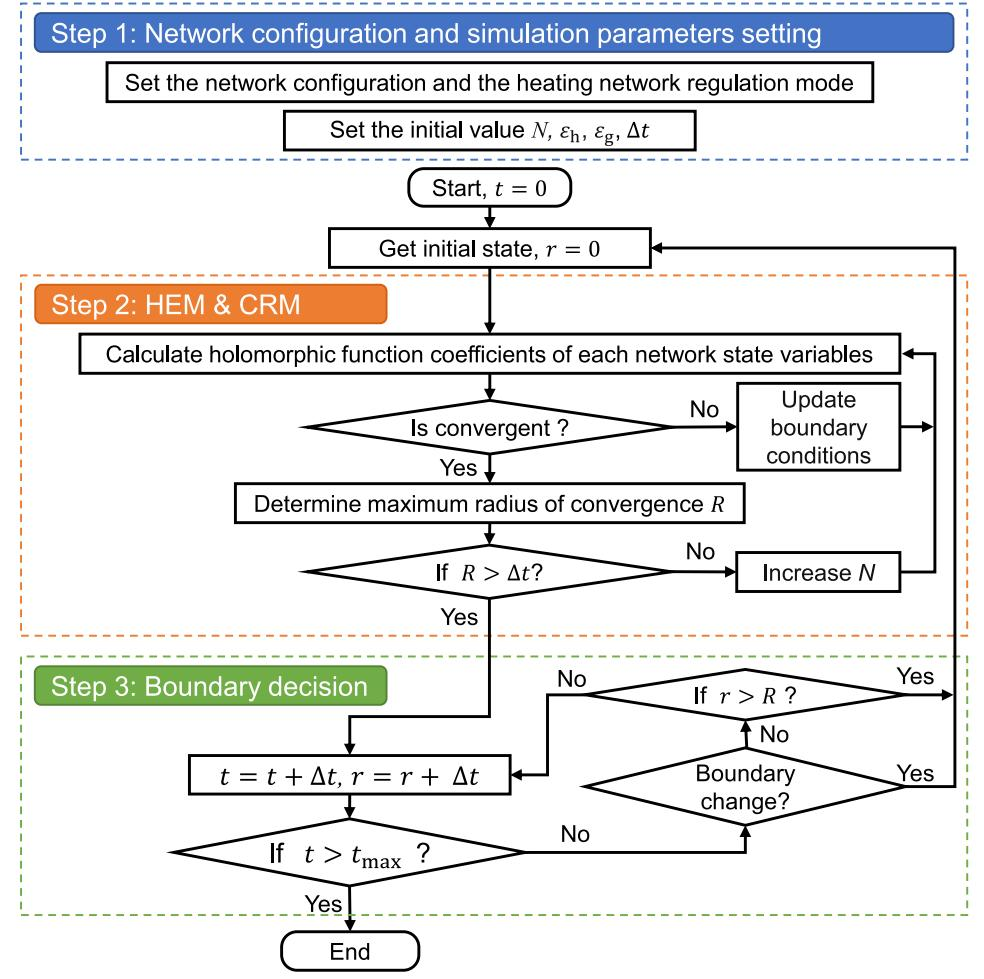  
Fig. 3. Co-simulation framework of MEN.

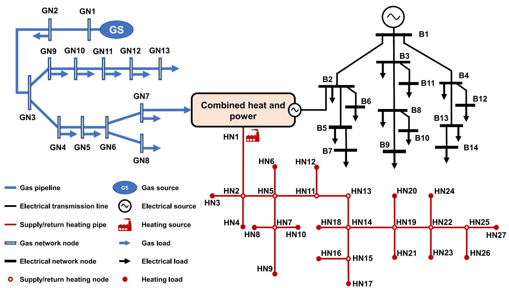  
Fig. 4. Diagrams of the electrical, heating and gas networks.

of the networks need to be updated. If the coefficient decreases with the increase of the order, The solution is convergent. The convergence radius can be obtained by adopting the solution method introduced in Section 4. If the convergence radius is less than the time step, the convergence radius can be expanded by increasing the number of higher-order terms of the holomorphic function. Therefore, the final highest order of the HEM is jointly determined by the initial values of $N , \xi _ { \mathrm { h } } , \xi _ { \mathrm { g } }$ and ????.

The third step of the co-simulation is the boundary decision. When the boundary conditions of the networks change, the network’s state obviously deviates from the original state, and the holomorphic function needs to be recalculated. Based on the analysis of CRM, it can be seen that HEM has a certain radius of convergence in the simulation. There is no need to recalculate the holomorphic function within this convergence radius. When the convergence radius exceeds the intended time step ??, the current holomorphic function is no longer applicable. Therefore, combined with CRM and HEM, a multi-stage calculation scheme is adopted to ensure the accuracy of the HEM in all time-domain.

The detailed process of the co-simulation of MEN is shown in Fig. 3.

# 5. Case study

# 5.1. Simulation setup

(1) Description of MEN: To verify the simulation performance of the proposed HEM, tests are carried out on the MEN composed of a 13-node gas network, a 27-node heating network, and a 14-bus electrical network. The network topology is shown in Fig. 4. Bus 2 of the electrical network, node 7 of the gas network and node 1 of the heating network are connected through CHP. Detailed data for the MEN can be found in Ref. [36].   
(2) Scenario setting: Two regulation modes for the heating network, i.e., quality regulation mode (Scenario 1) and quantity regulation mode (Scenario 2), are considered in this test.   
(3) Trigger event: The models proposed are applicable to common disturbance events. The performance of HEM and CRM is illustrated here for small disturbance events: the heating load at node 12 increases linearly from 100% of its preset values (?? = 100 s) to 200% of its preset values (?? = 300 s).   
(4) Simulation parameters setting: the tolerance of ODE imbalance of the heating and gas networks are set as $1 \times 1 0 ^ { - 4 } ;$ ; the highest order of holomorphic functions are set as 10; the time step of the simulation is set as 1 s.   
(5) Simulation environment: All the tests are implemented by MAT-LAB R2017b on a personal computer with Intel(R) Core(TM) i5-8500 CPU @ 3.00 GHz and 16.0 GB RAM.

# 5.2. Performance of accuracy

The simulation results of the finite difference model (FDM) with a high degree of discretization are highly approximated to those of PEDs. Therefore, to present the accuracy of the proposed models, the simulation results of FDM with the ???? = 0.01 s time step are taken as the benchmark. In the FDM, the Lax–Wendroff differential scheme is applied. The HEM’s simulation results are compared with those of FDM in quality and quantity regulation modes, respectively, as shown in Figs. 5 and 6. In the figures, FDM’s simulation results are marked as blue solid lines, and HEM’s simulation results are marked as red dotted lines.

Several findings can be concluded according to the simulation results illustrated in Figs. 5 and 6.

• All concerned variables in these figures have dynamic responses since the load of the heating network changes from 100 s to 300 s. MEN reaches the new steady state when the time approaches nearly 1000 s, indicating a slow dynamic characteristic of the gas and heating networks.

Table 1 Calculation time of two models in simulation.   

<table><tr><td>Model</td><td>Δt</td><td>Scenario 1</td><td>Scenario 2</td></tr><tr><td rowspan="3">FDM</td><td>1 s</td><td>22.59 s</td><td>141.71 s</td></tr><tr><td>0.1 s</td><td>222.23 s</td><td>1395.62 s</td></tr><tr><td>0.01 s</td><td>2334.18 s</td><td>15563.52 s</td></tr><tr><td>HEM</td><td>1 s</td><td>6.33 s</td><td>17.62 s</td></tr></table>

• Comparing Figs. 5(b) and 6(a), it can be found that with the increase of the heat load at node 12 in the heating network, the temperature at the return heating node 1 decreases under the quality regulation mode. In contrast, the temperature at the return heating node 1 is raised by boosting the mass flow rate of supply heating pipe 1–2 under quantity regulation mode.   
• In the heating network, compared with the quality regulation mode, the transmission delay decreases due to the mass flow rate increase with the quantity regulation mode, which verifies the shorter transmission time delay of quantity regulation mode, as mentioned in Ref. [35].   
• The red dotted lines almost overlap the blue solid lines, which indicates HEM’s high accuracy.

# 5.3. Performance of efficiency

To further present the accuracy and efficiency of the proposed models, HEM and the FDM with different time steps are compared in the two scenarios. This paper takes the solution of FDM with the ???? = 0.01 s time step as the benchmark. Figs. 7 and 8 show the maximum errors of all variables in the MEN under FDM with time steps of 1 s, 0.1 s and 0.01 s, and HEM with the time step of 1 s. The calculation time of the time-domain simulation of 1500 s using these models in the two scenarios is given in Table 1.

It can be found in Figs. 7 and 8 that the simulation results of HEM with the time step of 1 s are close to those of FDM with the time step of 0.01 s. It indicates that the result obtained by HEM is very close to the benchmark. Table 1 shows that scenario 1 requires only 6.33 s to complete the time-domain simulation of 1500 s, while scenario 2 requires only 17.62 s. The calculation speed of scenario 1 is faster than that of scenario 2, mainly because the heating network in scenario 1 adopts the quality regulation mode, which has more stable hydraulic conditions and lower model complexity. In addition, Table 1 shows that no matter what time step FDM is selected, the calculation time of the proposed model in this paper is less than that of the FDM, indicating that the proposed model has significant advantages in efficiency and accuracy.

Furthermore, the calculation efficiencies of the HEM in scenario 1 and scenario 2 are nearly 400 times and 900 times that of FDM with the time step of 0.01 s, respectively. It lays a key foundation for realizing real-time simulation of a larger scale MEN.

# 5.4. Performance of simplified CRM

To test the computational efficiency of simplified CRM (s-CRM), the comparison of the calculation time between CRM and s-CRM with an intended time step (1 s) is shown in Fig. 9. Real-time simulation cannot be realized if the calculation time exceeds the intended time step. MATLAB ‘fsolve’ function is used to solve CRM.

As can be seen from Fig. 9, due to the high order of the CRM, it is inefficient to solve the radius of convergence with such an iterative algorithm, which makes the sum of HEM and CRM calculation time larger than 1 s, exceeding the real-time threshold. In contrast, the sum of calculation time is reduced by 70% using HEM and s-CRM, which significantly improves the simulation efficiency. Moreover, the sum of calculation time using HEM and s-CRM is much less than the real-time threshold (1 s), providing more chances for digital twins of MEN to perform time-demanding applications.

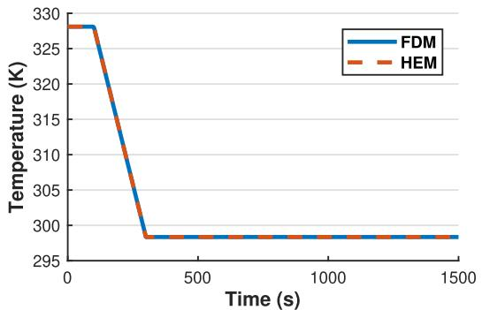  
(a) Temperature at return heating node 12 in the heating network

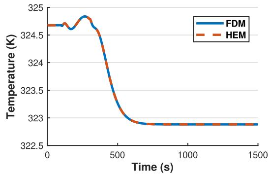  
(b)Temperature at return heating node 1 in the heating network

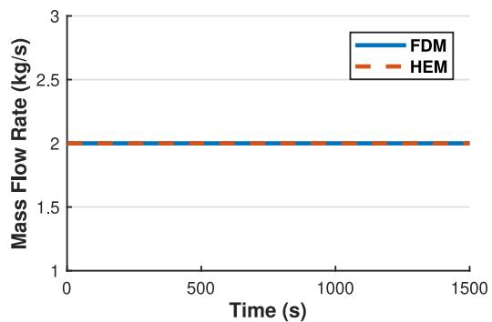  
(c) Mass flow rate at pipe 11-12 in the heating network

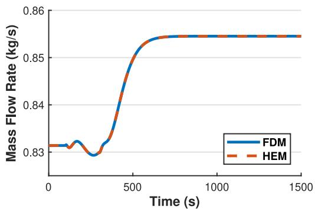  
(d) Outlet mass flow rate at pipeline 6-7 in the gas network

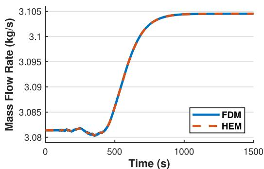  
(e) Inlet mass flow rate at pipeline 1-2 in the gas network

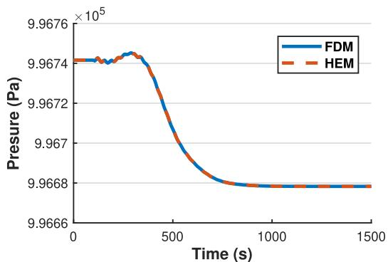  
(f) Outlet pressure at pipeline 6-7 in the gas network

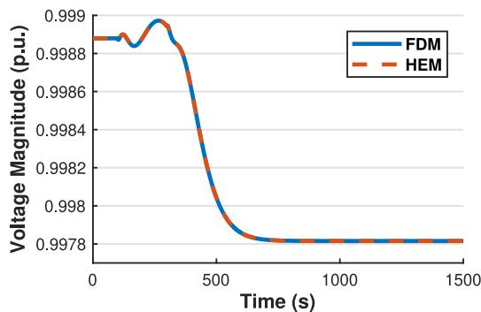  
(g）Voltage magnitude at bus 6 in the electrical network

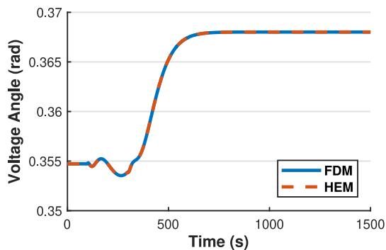  
(h) Voltage angle at bus 6 in the electrical network   
Fig. 5. Simulation results of scenario 1.

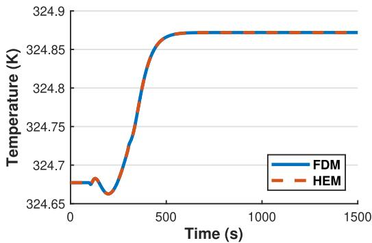  
(a) Temperature at return heating node 1 in the heating network

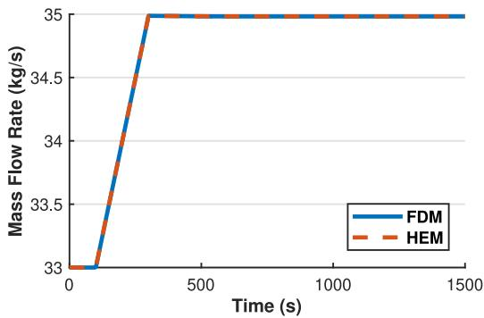  
(b) Mass flow rate at pipe 1-2 in the heating network

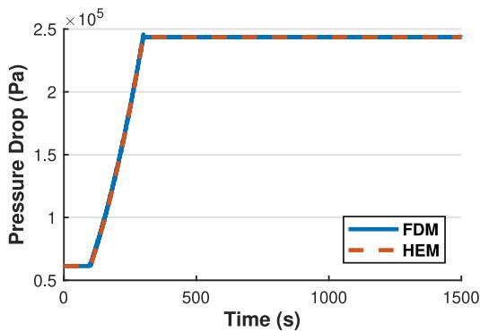  
(c) Pressure drop at pipe 11-12 in the heating network

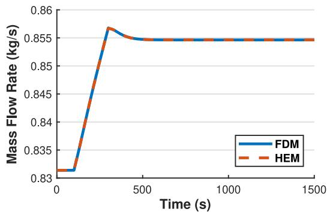  
(d) Outlet mass flow rate at pipeline 6-7 in the gas network

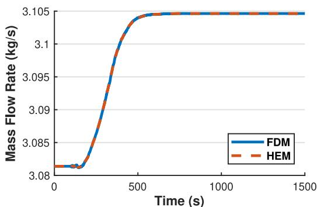  
(e) Inlet mass flow rate at pipeline 1-2 in the gas network

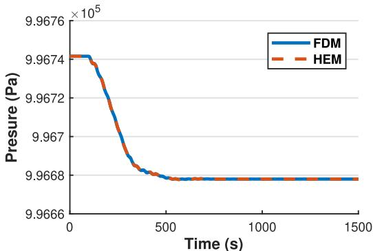  
(f) Outlet pressure at pipeline 6-7 in the gas network

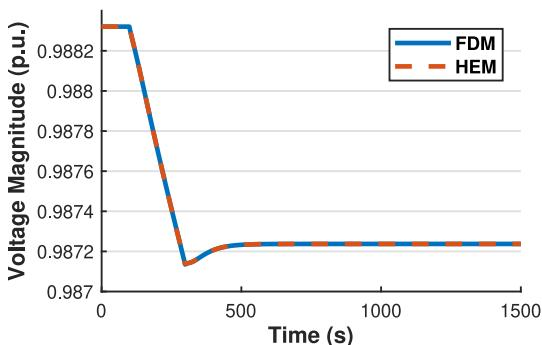  
(g） Voltage magnitude at bus 6 in the electrical network

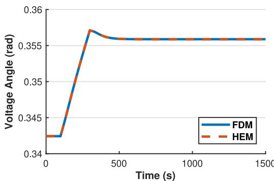  
(h)Voltage angle at bus 6in the electrical network   
Fig. 6. Simulation results of scenario 2.

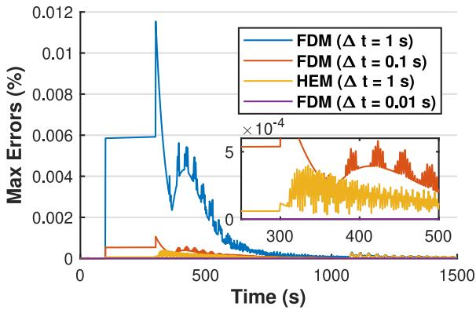  
Fig. 7. Global maximum error of all variables in scenario 1.

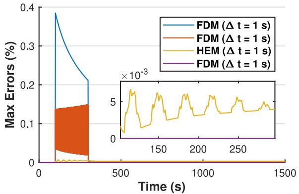  
Fig. 8. Global maximum error of all variables in scenario 2.

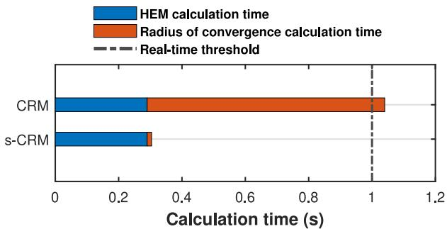  
Fig. 9. Comparison of the calculation time between CRM and s-CRM with an intended time step (1 s).

# 6. Conclusion

As Part I of the series of papers, this work proposes HEM and CRM based on the holomorphic embedding method, serving as the mechanism-driven modeling part in the digital twins of MEN. In comparison to other state-of-the-art models, the proposed model needs no temporal discretization and requires only algebraic equations to be solved in the entire process, thereby generating high-quality solutions while keeping the computational burden affordable.

The simulation results of the proposed model are almost identical to those of the benchmark. Furthermore, while the proposed model can finish the calculation faster than a real-world clock, FDM takes very small time steps $( \varDelta t \leq 0 . 0 1 s )$ to achieve the same accuracy level as the proposed model, which cannot satisfy the real-time simulation requirements. In conclusion, compared to typical differential approaches, this study offers a real-time simulation model with

significant computational benefit and competent precision, laying a fundamental mathematical model for MEN’s digital twins.

While Part I concentrates on mechanism-driven modeling, the whole architecture of the digital twins of MEN will be further completed in Part II by maintaining the twin matched with physical counterparts from a data-driven perspective. Besides, the real-time simulation of the digital twins will be carried out on an experimental platform.

# CRediT authorship contribution statement

Xiaoli Huang: Investigation, Methodology, Software, Writing – original draft, Writing – review & editing. Hang Tian: Conceptualization, Supervision, Writing – original draft, Writing – review & editing. Haoran Zhao: Conceptualization, Project administration, Funding acquisition, Supervision. Haoran Li: Software, Writing – original draft, Writing – review & editing. Mengxue Wang: Software, Visualization. Xu Huang: Writing – review & editing.

# Declaration of competing interest

The authors declare that they have no known competing financial interests or personal relationships that could have appeared to influence the work reported in this paper.

# Data availability

The authors do not have permission to share data.

# References

[1] Liu X, Mancarella P. Modelling, assessment and Sankey diagrams of integrated electricity-heat-gas networks in multi-vector district energy systems. Appl Energy 2016;167:336–52.   
[2] Wu X, Liao B, Su Y, Li S. Multi-objective and multi-algorithm operation optimization of integrated energy system considering ground source energy and solar energy. Int J Electr Power Energy Syst 2023;144:108529.   
[3] Grieves M, Vickers J. Digital twin: Mitigating unpredictable, undesirable emergent behavior in complex systems. In: Transdisciplinary perspectives on complex systems: new findings and approaches. Springer; 2017, p. 85–113.   
[4] Zuhaib M, Rihan M, Saeed MT. A novel method for locating the source of sustained oscillation in power system using synchrophasors data. Prot Control Mod Power Syst 2020;5(1):1–12.   
[5] Bazmohammadi N, Madary A, Vasquez JC, Mohammadi HB, Khan B, Wu Y, Guerrero JM. Microgrid digital twins: Concepts, applications, and future trends. IEEE Access 2022;10:2284–302.   
[6] Folgado FJ, González I, Calderón AJ. Simulation platform for the assessment of PEM electrolyzer models oriented to implement digital replicas. Energy Convers Manag 2022;267:115917.   
[7] Jafari M, Kavousi-Fard A, Chen T, Karimi M. A review on digital twin technology in smart grid, transportation system and smart city: Challenges and future. IEEE Access 2023.   
[8] Sepasgozar S. Differentiating digital twin from digital shadow: Elucidating a paradigm shift to expedite a smart, sustainable built environment. Buildings 2021;11:151.   
[9] Palensky P, Cvetkovic M, Gusain D, Joseph A. Digital twins and their use in future power systems. Digit Twin 2022;1(4):4.   
[10] Cao S, Dinavahi V, Lin N. Machine learning based transient stability emulation and dynamic system equivalencing of large-scale AC-DC grids for faster-than-real-time digital twin. IEEE Access 2022;10:112975–88.   
[11] Ruban NY, Suvorov AA, Andreev MV, Ufa RA, Askarov AB, Gusev AS, Bhalja BR. Software and hardware decision support system for operators of electrical power systems. IEEE Trans Power Syst 2021;36(5):3840–8.   
[12] Cheng T, Duan T, Dinavahi V. ECS-grid: Data-oriented real-time simulation platform for cyber-physical power systems. IEEE Trans Ind Inf 2023.   
[13] Osiadacz AJ, Chaczykowski M. Modeling and simulation of gas distribution networks in a multienergy system environment. Proc IEEE 2020;108(9):1580–95.   
[14] Ferziger JH, Perić M, Street RL. Computational methods for fluid dynamics, Vol. 3. Springer; 2002.   
[15] Larsen HV, Pálsson H, Bøhm B, Ravn HF. Equivalent models for district heating systems. In: Proc. 7th Int. symp. district heating cooling. 1999, p. 1–16.   
[16] Fang J, Zeng Q, Ai X, Chen Z, Wen J. Dynamic optimal energy flow in the integrated natural gas and electrical power systems. IEEE Trans Sustain Energy 2018;9(1):188–98.

[17] Qi F, Shahidehpour M, Wen F, Li Z, He Y, Yan M. Decentralized privacy-preserving operation of multi-area integrated electricity and natural gas systems with renewable energy resources. IEEE Trans Sustain Energy 2020;11(3):1785–96.   
[18] Chaczykowski M, Sund F, Zarodkiewicz P, Hope SM. Gas composition tracking in transient pipeline flow. Int J Electr Power Energy Syst 2018;55:321–30.   
[19] Yao S, Gu W, Lu S, Zhou S, Wu Z, Pan G, He D. Dynamic optimal energy flow in the heat and electricity integrated energy system. IEEE Trans Sustain Energy 2021;12(1):179–90.   
[20] Chen Y, Guo Q, Sun H, Pan Z. Integrated heat and electricity dispatch for district heating networks with constant mass flow: A generalized phasor method. IEEE Trans Power Syst 2021;36(1):426–37.   
[21] Chen Y, Guo Q, Sun H, Pan Z, Chen B. Generalized phasor modeling of dynamic gas flow for integrated electricity-gas dispatch. Appl Energy 2021;283.   
[22] Chen C, Wang J, Zhao H, Yu Z, Han J, Chen J, Liu C. Entropy flow analysis of thermal transmission process in integrated energy system part I: Theoretical approach study. Processes 2022;10(9).   
[23] Chen C, Wang J, Zhao H, Yu Z, Han J, Chen J, Liu C. Entropy flow analysis of thermal transmission process in integrated energy system part II: Comparative case study. Processes 2022;10(9).   
[24] Yang J, Zhang N, Botterud A, Kang C. Situation awareness of electricity-gas coupled systems with a multi-port equivalent gas network model. Appl Energy 2020;258.   
[25] Yang J, Zhang N, Botterud A, Kang C. On an equivalent representation of the dynamics in district heating networks for combined electricity-heat operation. IEEE Trans Power Syst 2020;35(1):560–70.   
[26] Lan T, Strunz K. Modeling of the enthalpy transfer using electric circuit equivalents: Theory and application to transients of multi-carrier energy systems. IEEE Trans Energy Convers 2019;34(4):1720–30.   
[27] Yao R, Sun K, Shi D, Zhang X. Voltage stability analysis of power systems with induction motors based on holomorphic embedding. IEEE Trans Power Syst 2019;34(2):1278–88.

[28] Yao R, Liu Y, Sun K, Qiu F, Wang J. Efficient and robust dynamic simulation of power systems with holomorphic embedding. IEEE Trans Power Syst 2020;35(2):938–49.   
[29] Rao S, Feng Y, Tylavsky DJ, Subramanian MK. The holomorphic embedding method applied to the power-flow problem. IEEE Trans Power Syst 2016;31(5):3816–28.   
[30] Morgan MY, Shaaban MF, Sindi HF, Zeineldin HH. A holomorphic embedding power flow algorithm for islanded hybrid AC/DC microgrids. IEEE Trans Smart Grid 2022;13(3):1813–25.   
[31] Zhang T, Li Z, Wu Q, Pan S, Wu Q. Dynamic energy flow analysis of integrated gas and electricity systems using the holomorphic embedding method. Appl Energy 2022;309.   
[32] Li S, Tylavsky D, Shi D, Wang Z. Implications of Stahl’s theorems to holomorphic embedding part I: Theoretical convergence. CSEE J Power Energy Syst 2021;7(4):761–72.   
[33] Dronamraju A, Li S, Li Q, Li Y, Tylavsky D, Shi D, Wang Z. Implications of Stahl’s theorems to holomorphic embedding part II: Numerical convergence. CSEE J Power Energy Syst 2021;7(4):773–84.   
[34] Chiang H-D, Wang T, Sheng H. A novel fast and flexible holomorphic embedding power flow method. IEEE Trans Power Syst 2018;33(3):2551–62.   
[35] Wang D, qiang Zhi Y, jie Jia H, Hou K, xi Zhang S, Du W, dong Wang X, hua Fan M. Optimal scheduling strategy of district integrated heat and power system with wind power and multiple energy stations considering thermal inertia of buildings under different heating regulation modes. Appl Energy 2019;240:341–58.   
[36] Huang X. Test data for an IES consisted of a 14-buses electrical network, a 13-nodes gas network, and a 27-nodes heating network. 2023, Available from: https://github.com/991227/case_data.