# Impact of solenoid effects on series impedance of three-core armoured cables✰

A.I. Chrysochos a,* , D. Chatzipetros a , C.K. Traianos a , K. Bitsi a , J. Morales b , H. Xue c , J. Mahseredjian c

a Hellenic Cables, Athens, Greece   
b PGSTech, Montreal, Canada   
c Polytechnique Montreal, Montreal, Canada

# A R T I C L E I N F O

Keywords:

Armour

Impedance

Modelling

Submarine cables

Solenoid

Transients

# A B S T R A C T

Cables used in offshore windfarms are usually three-core (3C) with metallic armour. The series impedance at power frequency is necessary to estimate cable steady-state and fault condition performances, e.g., by calculating sequence impedances. The impedance at higher frequencies is also needed for transient analysis. Threedimensional (3D) effects, being inevitably present in 3C cables, such as twisting effects, may be treated in a two-and-a-half-dimensional (2.5D) fashion. Although fast, this approach cannot account for the full 3D effects since it ignores solenoid effects. Thus, the calculated impedance may be inaccurate, potentially compromising the cable performance. 3D models based on finite element method are developed in this paper to consider the full 3D effects. The impedance is derived at power and higher frequencies. The proposed 3D method is evaluated against 2.5D methods. Solenoid effects appear to have a remarkable influence on impedance. Design aspects, such as the magnetic permeability and the pitch angle of the armour, are also examined. Finally, the effect on modal propagation characteristics is highlighted and the transient response is simulated.

# 1. Introduction

OFFSHORE wind farms have grown rapidly in recent years and the penetration of offshore generation is expected to increase even more. Three-core (3C) submarine cables, being necessary to transmit the power generated offshore to the mainland, are essential for such projects: the cost of these export cables is crucial for the economic viability of wind farms, while optimising their design is the only way to reduce their cost.

The calculation of the series impedance in frequency-domain is required for the proper cable design. Considering power frequency studies, the impedance allows for the determination of sequence components, which are necessary in power flow and system protection studies. Calculating the induced losses at power frequency under normal operation results in a better estimation of the cable current rating. The corresponding induced voltages at power frequency under fault conditions allow also to optimise the design of cable jackets. Moreover, the calculation of the series impedance at high frequencies is important to

evaluate the cable performance in transient phenomena and is necessary for insulation coordination studies.

In contrast to underground cables, the calculation of series impedance matrix in submarine cables is challenging due to the complexity in their geometry [1]. Three power cores are twisted forming a helix. The armour wires, covering the power cores, are twisted forming a different helix, typically of larger lay length than power cores for mechanical reasons. Thus, a complex electromagnetic problem, being three-dimensional (3D) in nature, is to be solved. The twisting direction of armour wires may or may not differ from that of power cores, with the cable being of contralay or unilay design, respectively. Export cables are typically contralay to enhance their mechanical performance: keeping the two helices in different direction makes the cable torsionally balanced. In cases where submarine cables are installed in shallow water depths and the mechanical performance is not so crucial, export cables may also be unilay. Although the armour wires are helically laid in close proximity, they do not touch each other. Furthermore, the bitumen typically applied for corrosion protection on and in-between them offers

an extra insulating layer. The lay length of power cores cannot ever be identical with that of armour wires, even in the unilay design. Hence, the electromotive force locally induced in wires is cancelled out over a complete periodicity, resulting in zero net circulating current along each wire [2].

Calculating the series impedance based on electromagnetic transient (EMT)-like software is a common practice for submarine cables. Traditionally, in the majority of cable constants routines, the analytical ex pressions used rely mainly on the work done by [3] and assume pipe-type cables. They employ Bessel functions to capture skin effect in all metallic components and account for the effect of magnetic pipe, while also consider the contribution of lossy earth by appropriate earth-return terms [4]. However, parallel, straight conductors are only assumed and proximity effects, which are important when cable cores come in close physical proximity, are neglected. In addition, the armour is represented as a magnetic tube, which stands far from the helical shape of wires in submarine cables.

Proximity effects are numerically treated in [5] in a two-dimensional (2D) manner. In this case, net currents are allowed to circulate along each armour wire and the wires are considered bonded. The fact that no net current flows per wire holds true provided that they are insulated: this is implemented by the Finite Element Method (FEM) model of [2], where the wires are in series connected in a two-and-a-half-dimensional fashion (2.5D). This 2.5D approach could be combined with $J _ { S }$ method [5] to derive the impedance in submarine cables.

Proximity effects are also considered in Method of Moments - Surface Operator (MoM-SO) method as suggested in [6,7], while the more realistic insulated wires condition is incorporated in [8], providing the series impedance in a faster way compared to FEM. This technique, combined with state-of-the-art formulations [9], are already available in the EMTP® software [10]. However, both FEM and MoM-SO cannot consider the longitudinal magnetic flux driven along the armour wires, i. $\mathrm { e } _ { \cdot , }$ the solenoid effects, since they are 2D in nature. This effect is discussed in [11], proposing approximate formulae only for single-core cables, while it could be accurately incorporated only if adopting a pure 3D analysis. Other numerical methods, such as Multiconductor Cell Analysis (MCA) [12] and Partial Element Equivalent Circuit (PEEC) [13], would not be appropriate for submarine cables due to difficulties to accurately account for magnetic permeability values other than vacuum. Mild, ferromagnetic steel is often used for cable armouring and has relative permeability significantly higher than unity.

CIGRE technical brochure (TB) 531 [14] suggests a simplified analytical method to calculate sequence impedances for submarine cables. The work of [15] proposes certain update points to [14], but both approaches rely on the impedance components as per the IEC 60,287 standard [16]. The latter approximates skin and proximity effects accurately enough only at power frequency. The armour representation as per the IEC standard has been also broadly investigated and many relevant works are published, suggesting positive-sequence impedance calculations which partly account for the 3D solenoid effects, such as [17] and [18]. Although methods such as [17] provide quite accurate calculations at power frequency, as shown in [19], it is also expected to lose accuracy at higher frequencies, since they rely on the IEC standard for proximity effects. In addition, these methods do not deal with the zero-sequence component at all.

3D analysis is necessary to include solenoid effects on the calculation of series impedance. Thanks to the increased computational power provided by modern computers, FEM models are developed to calculate losses in submarine cables. The conventional, non-periodic models [19] may still lose accuracy because of large cable lengths to be simulated and the emergence of erroneous end effects. State-of-the-art FEM models, capable of reducing the total simulation length down to few meters and eventually centimetres, are proposed in [20] and [21], respectively, which are verified against measurements [19,22]. An alternative to 3D FEM is suggested in [23], where Maxwell’s equations are solved in their integral form. However, similar to FEM

computational performance and accuracy are reported.

This paper investigates the impact of solenoid effects on the calculation of the series impedance in 3C armoured export cables. An efficient 3D FEM model representing the inductive mechanism is employed, taking fully into account the longitudinal field component. Special techniques, which ensure the continuity of magnetic field at the ends and exploit the rotated periodicity of the cable, are also employed to avoid any erroneous end effects. The so-called $J _ { S }$ method [5] is combined with 3D FEM to derive the full series impedance matrix. By simple manipulations, the effect of the lossy stratified earth is included, which is first calculated based on 2D models. Export cables with magnetic and non-magnetic armour are considered, while the effect of lay length is also examined. The results by 3D FEM are compared to those calculated by other modern methods, such as 2.5D FEM and MoM-SO. Positive- and zero-sequence impedances are derived to compare the proposed method against standard techniques, such as the approaches of [15] and [17]. By incorporating the admittance matrix, comparisons are also made in terms of propagation characteristics and transient scenarios where the overall impact on the derived overvoltages is evaluated.

# 2. Models for cable impedance calculation

FEM and MoM-SO models are employed for the calculation of cable impedance, as they are considered amongst the most sophisticated and well-established techniques.

# 2.1. Proposed method - 3D Fem

The early 3D FEM cable models, i.e., [24–26], suffered from poor mesh quality and end effects, due to the large model length to be considered and the imposed non-periodic boundary conditions, respectively. Although fairly accurate in certain cases [19], these non-periodic models are impossible to simulate all likely cable geometries, because of the extremely long models often occurred in practice. A significant improvement is provided in [20], where the so-called ‘crossing-pitch (CP) model’ is introduced. Thanks to the observation that the pattern of any scalar or field quantity repeats itself as soon as one specific armour wire returns to its initial relative position with respect to a certain phase, the CP model leads to considerable reduction of the cable length to be modelled.

Besides the CP model, an even more efficient modelling approach is proposed in [21], which is adopted in the present paper. The so-called ‘short-twisted (ST) periodic model’, shown in Fig. 1 and implemented in the COMSOL Multiphysics® software [27], is regarded as the state-of-the-art 3D FEM in terms of accuracy and computational burden [21]. Its validity is proven in comparisons with experimental measurements for sequence impedances, induced sheath currents and magnetic field at both power frequency and harmonics [19,22].

The inductive coupling is solved in frequency-domain under steadystate conditions by computing the magnetic field and the induced current density in and around conducting layers [28]. The first modelling

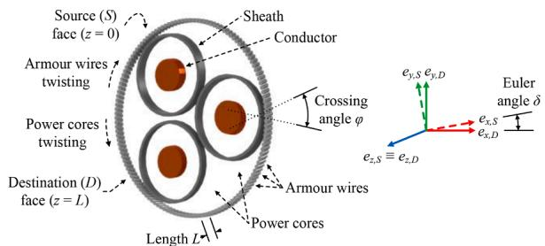  
Fig. 1. ST 3D FEM of a 3C armoured cable with contralay design. Only the metallic layers are shown for illustration purposes. Special boundary conditions implement the rotated periodicity to avoid end effects.

challenge relates to the proper length to be considered: the model is based on the observation that the electromagnetic field pattern repeats itself as soon as any armour wire reaches the initial relative position with respect to a certain core, regardless of the orientation of the overall cross-section [21,23]. Thus, the model length L given in (1) is significantly reduced, while the Euler angle δ for the imposition of the rotated boundary conditions at source (S) and destination (D) faces is determined in (2).

$$
L = \left| \frac {1}{\left(\frac {1}{L _ {C}} \pm \frac {1}{L _ {A}}\right) N _ {A}} \right| \tag {1}
$$

$$
\delta = \pm 2 \pi \frac {L}{L _ {C}} \tag {2}
$$

where $L _ { C }$ and $L _ { A }$ the lay length of cores and armour wires, respectively, while $N _ { \mathrm { A } }$ the number of armour wires. Signs ± are taken for contralay and unilay design, respectively.

The second modelling challenge relates to the boundary conditions on the outer, cylindrical surface: the magnetic field should be considered unbounded on this boundary. To limit the extent of the model to a manageable region of interest with reasonable execution time, a coordinate scaling is adopted to layers of virtual domains surrounding the physical region of interest [28]. These virtual layers, as shown in Fig. 2a, can be mathematically stretched out towards infinity, where the magnetic insulation condition ${ \overrightarrow { n } } \times { \overrightarrow { A } } = 0$ is imposed with $\xrightarrow [ n ] { }$ the normal unit vector and $\stackrel { \longrightarrow } { A }$ the magnetic vector potential to be solved for. As a result, the model becomes computationally efficient, while the solution inside the region of interest is not affected by the artificial geometric boundaries.

The $J _ { S }$ method is employed to calculate the series impedance matrix Z from the magnetic field solution [5]. A sinusoidal current excitation of arbitrary magnitude Ij is applied sequentially to each conducting layer j, while the remaining layers $i \neq j , ( i , j = 1 , 2 , . . . , N )$ , are forced to carry zero currents, i.e., to be open-circuited. The mutual element $Z _ { i j }$ of Z between conducting layers i and j is given by

$$
Z _ {i j} = \frac {V _ {i}}{I _ {j}} = \frac {J _ {S _ {i}}}{\sigma_ {i} I _ {j}} \tag {3}
$$

where $V _ { i }$ the per-unit-length voltage drop, $J _ { S _ { i } }$ the source current density derived by the solution of the inductive coupling and $\sigma _ { i }$ the conductivity of layer i. To find all elements of Z in a multi-conductor system, the corresponding problem needs to be solved N times, calculating each time the j-th column of Z via (3). However, the execution time can be reduced by exploiting the symmetry Z presents in 3C cables.

The resulting impedance matrix can be written as

$$
Z = Z _ {i n t} + Z _ {e x t} \tag {4}
$$

where $Z _ { i n t }$ and $Z _ { e x t }$ the cable internal and external impedance, respec-

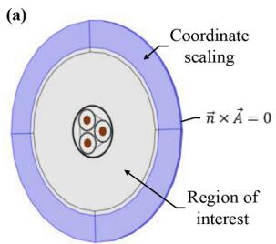

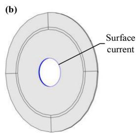  
Fig. 2. (a) Virtual layers for cylindrical coordinate scaling and imposition of magnetic insulation boundary condition. (b) Extraction of $Z _ { e x t }$ by applying a surface current at cable surface.

tively, with the cable surface being the limit between the two loops [3]. In the current implementation of 3D FEM, the latter term corresponds to the simple, uniform medium surrounding the cable and extending radially to infinity. This cylindrical layer facilitates the imposition of the rotated periodicity for field $\stackrel {  } { A }$ at faces S and D in an efficient and elegant way. To simulate a cable submerged in seawater or buried in the seabed, it is preferred to mathematically replace the above term $Z _ { e x t }$ by an appropriate earth-return impedance [4], rather than explicitly model in 3D the air, seawater and seabed layers. To this aim, the direct calculation of $Z _ { i n t }$ by imposing the magnetic insulation condition at the cable surface may lead to inaccurate results due to the field compression caused by the proximity of the lossless return path close to the cable. Instead, it is proposed to calculate $Z _ { e x t }$ and indirectly derive $Z _ { i n t }$ via (4). In 3D FEM, this is performed by removing the cable and applying a surface current of arbitrary magnitude at the cable surface, as shown in Fig. 2b. By employing the $J _ { S }$ method once again, the external impedance can be determined.

The resulting Z accurately includes the frequency-dependant skin, proximity, and possible hysteresis effect of all metallic layers, as well as the influence of the lossy earth. In addition, the 3D nature of the model encapsulates solenoid effects of both cores and armour wires, accounting fully for the longitudinal component of magnetic field and the current distribution along the helical path of the insulated armour wires. Thus, the ST 3D FEM can be considered as the reference model in the remainder of this paper.

# 2.2. 2.5D FEM

A faster yet less accurate model is the so-called 2.5D FEM, as shown in Fig. 3, developed in the COMSOL Multiphysics® software [27]. This is a 2D model using an additional constraint in the armour wires to mimic that they are insulated and twisted. This is succeeded by connecting the wires in series, thus imposing the same current on them [2].

The $J _ { S }$ method is employed again for the calculation of $z ,$ taking directly into account any homogenous or stratified earth. However, due to the additional constraint on the wires, a slight modification is required at the elements of Z related to the armour. Specifically, the corresponding self and mutual elements derived from (3) must be divided by $N _ { A } ^ { 2 }$ and $N _ { \mathrm { A } } ,$ , respectively. The calculation of internal and external impedance is performed via (4), following the procedure as

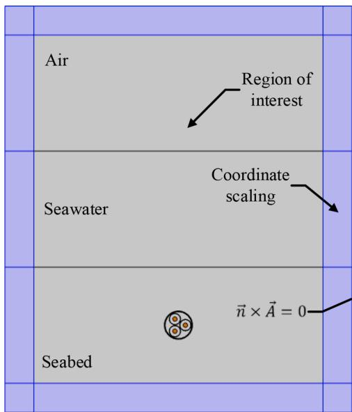  
Fig. 3. 2.5D FEM representation of a submarine cable buried in the seabed. Virtual layers are used for cartesian coordinate scaling and magnetic insulation boundary condition is imposed.

described above but in a 2D fashion.

The 2.5D FEM is considered more accurate than the analytical formulation of [3], since the latter ignores any proximity effects and represents the armour as a tubular pipe. However, even with the additional constraint on the armour wires, the model still ignores the longitudinal component of the magnetic field, which can be pronounced in cases of ferromagnetic wires and increasing crossing angle φ.

# 2.3. 2.5D MOM-SO

In this method the conducting layers are represented through an equivalent current placed at their surface [6]. Using a surface admittance operator and the Green’s function of the surrounding medium, this representation allows for the computation of the cable impedance [7].

By treating the armour wires as separate conductors, the impedance matrix is first calculated in its primitive form ̃Z in the EMTP® software [10]. To model the insulated twisted wires, the connection matrix P of (5) is used [8] with order of $7 \times ( 6 + N _ { \mathrm { A } } )$ . Its special form dictates that the current divides equally amongst all insulated wires and that the voltage drop is taken as the average of all voltages. The final impedance matrix calculated via (6) is reduced by $N _ { \mathrm { A } }$ − 1 rows and columns. The separation of Z to cable internal and external impedance is again performed as previously described.

$$
P = \left[ \begin{array}{c c c c c c c} 1 & 0 & \dots & 0 & 0 & \dots & 0 \\ 0 & 1 & \dots & 0 & 0 & \dots & 0 \\ \vdots & \vdots & \ddots & \vdots & 0 & \dots & 0 \\ 0 & 0 & \dots & 1 & 0 & \dots & 0 \\ 0 & 0 & 0 & 0 & 1 / N _ {\mathrm {A}} & \dots & 1 / N _ {\mathrm {A}} \end{array} \right] \tag {5}
$$

$$
Z = P \tilde {Z} P ^ {T} \tag {6}
$$

The presented approach, dubbed as 2.5D MoM-SO due to the inclusion of twisting effect, can be considered as an alternative to 2.5D FEM with comparable accuracy.

# 3. Analysis and results

# 3.1. Cable under study

A 220 kV 3C armoured export cable is considered [29]. It consists of 3 × 1000 mm2 copper conductors, XLPE insulation, lead sheath, polyethylene jacket, mild steel wire armour, polypropylene fillers, bedding and serving. The cable is buried 2 m in the seabed of Fig. 3, assuming a two-layer stratified earth. All related properties are given in Table I.

Table I Cable and Earth Data.   

<table><tr><td>Item</td><td>Properties</td></tr><tr><td>Conductor</td><td>do=38.6 mm, σ=3.76•10^7 S/m</td></tr><tr><td>Inner semiconducting layer</td><td>t=1.7 mm</td></tr><tr><td>Insulation</td><td>t=23 mm, εr=2.5</td></tr><tr><td>Outer semiconducting layer</td><td>t=2.1 mm</td></tr><tr><td>Sheath</td><td>t=3.6 mm, σ=3.82•10^6 S/m</td></tr><tr><td>Jacket</td><td>t=2.1 mm, εr=2.5</td></tr><tr><td>Fillers and bedding</td><td>εr=2.2</td></tr><tr><td>Armour</td><td>di=227 mm, t=5 mm, σ=5.84•10^6 S/m, μr=600, NA=133</td></tr><tr><td>Serving</td><td>t=4 mm, εr=2.2</td></tr><tr><td>Cabling</td><td>LC=2.75 m, LA=2.9 m, contralay</td></tr><tr><td>Air</td><td>σ=0 S/m, εr=1, μr=1</td></tr><tr><td>Seawater</td><td>t=100 m, σ=5 S/m, εr=1, μr=1</td></tr><tr><td>Seabed</td><td>σ=0.05 S/m, εr=1, μr=1</td></tr></table>

# 3.2. Earth-Return impedance

Fig. 4 shows the earth-return impedance of the two-layer stratified earth of Fig. 3. $Z _ { e x t }$ is calculated by both 2.5D FEM and MoM-SO by replacing the cable with the arbitrary surface current of Fig. 2b. As expected, $R _ { e x t }$ increases and $L _ { e x t }$ decreases with increasing frequency. Results present excellent agreement in all frequencies, validating both models, while demonstrating the proposed method to calculate $Z _ { e x t }$ and indirectly derive $Z _ { i n t }$ via (4).

# 3.3. Cable impedance matrix

Fig. 5 shows the impedance matrix of the cable under study. Due to the symmetry of Z, only certain self and mutual elements are illustrated. In 3D FEM, the external impedance is initially extracted as previously described in (4) and then replaced by the earth-return term of Fig. 4, thus implying that the same external impedance is considered in all methods. Results by 2.5D FEM and MoM-SO coincide, concluding that these methods are equivalent in terms of accuracy. 3D FEM presents significant differences, especially in self and mutual elements of inductance at low and mid frequencies. At high frequencies, the deviations tend to diminish as the magnetic interaction between the conducting layers weakens, thus resulting in a near-2D field distribution.

The differences are due to the internal impedance and attributed to the solenoid effects which are ignored in 2.5D FEM and MoM-SO, since both are essentially 2D in nature. The longitudinal magnetic flux, which can be significant in export cables with magnetic armour, leads to increased eddy currents in the armour. In addition, the denser magnetic field in the cable interior results in higher induced losses for the sheaths and conductors. As a result, the inclusion of the longitudinal field component via the 3D FEM leads, in general, to different proximity effects and, thus, to different cable impedance compared to 2.5D calculation methods.

# 3.4. Sequence impedances

Assuming solid bonding configuration, the sequence impedances $Z _ { 0 }$ and $Z _ { 1 }$ result from Z via Kron’s reduction and Fortescue’s transformation in (7) and (8), respectively.

$$
Z _ {K r} = Z _ {c c} - Z _ {c g} Z _ {g g} ^ {- 1} Z _ {g c} \tag {7}
$$

$$
Z _ {S e q} = H ^ {- 1} Z _ {K r} H \tag {8}
$$

where subscripts c and g represent the conductor and ground groups, respectively, and H the appropriate similarity transformation matrix. The percentage difference by (9) in terms of sequence impedances between 2.5D MoM-SO and 3D FEM is highlighted in Fig. $^ { 6 , }$ where Q is

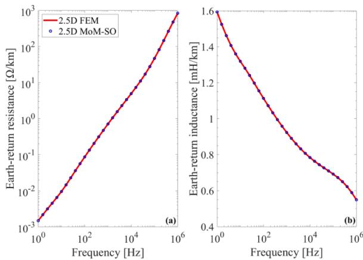  
Fig. 4. Earth-return (a) resistance and (b) inductance.

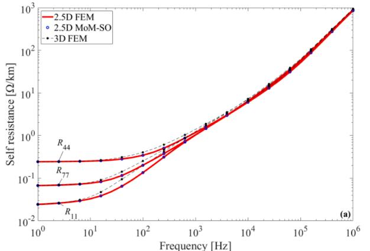

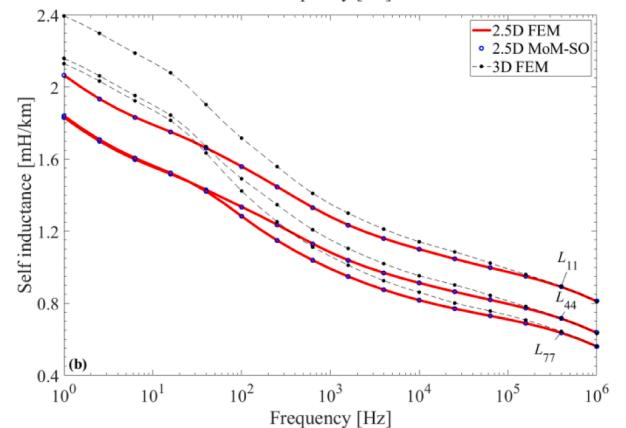

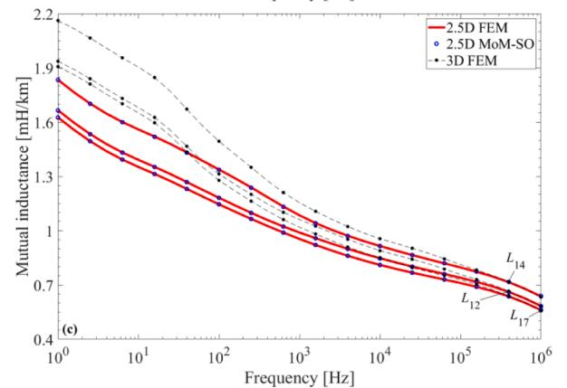  
Fig. 5. Elements of cable (a) self resistance, (b) self inductance, and (c) mutual inductance.

either $R _ { 0 , 1 }$ or $L _ { 0 , 1 }$

$$
\text {Difference} = \frac {Q _ {2.5 D M o M - S O} - Q _ {3 D F E M}}{Q _ {3 D F E M}} 100 \% \tag{9}
$$

When switching from the 3D FEM to 2.5D MoM-SO, the difference in $L _ { 1 }$ is seen to change from negative to positive as frequency increases. At higher frequencies, the difference minimises due to the weak magnetic interaction between conducting layers. Deviation in $R _ { 1 }$ is insignificant at low frequencies, which is justified by the near-static excitation leading to negligible skin and proximity effects; then it changes to negative and subsequently to positive as frequency increases. This is due to pronounced eddy effects at mid and high frequencies, which are affected by the helical path of the conducting layers and the longitudinal field along the armour.

Similar trend in deviation, but shifted to lower frequencies, is observed in $L _ { 0 }$ and $R _ { 0 } ,$ , respectively. This is attributed to the screening effect caused by the return current in sheaths and armour wires, resulting from the zero-sequence excitation of the cable. $L _ { 0 }$ presents a

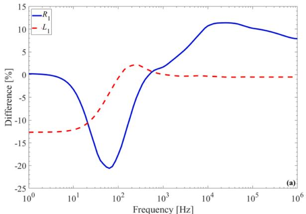

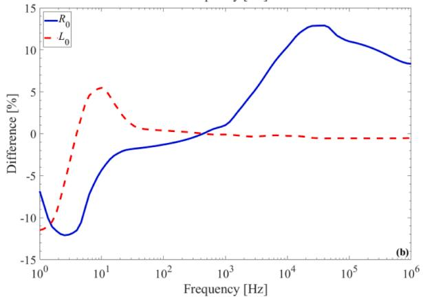  
Fig. 6. Relative difference in (a) positive- and (b) zero-sequence impedance.

trend similar to $L _ { 1 } ,$ , which is justified by the inductive effects maximising at mid and, particularly, low frequencies. Deviation in $R _ { 0 }$ is larger at low frequencies since the zero-sequence excitation leads to an increased return current passing through the helical armour. As a result, an axial magnetic field is formed, which leads to increased magnetic field distribution in the cable interior, thus increasing the eddy effects and the resistive component. By further decreasing frequency, the eddy effects are eliminated and so does the difference between 3D FEM and 2.5D MoM-SO.

Positive-sequence impedance derived by the proposed 3D FEM is further evaluated against the analytical methods of [15] and [17]. All methods provide similar results at power frequency for stainless steel armour, as shown in Table II. This is expected since the longitudinal field is insignificant for non-magnetic armour. The results derived from 2.5D MoM-SO deviate by lower than 2% against 3D FEM at all frequencies, thus validating the latter. The methods discussed in [15] and [17] appear to deviate up to 21% at higher frequencies. This is expected since both rely on [16] to represent eddy effects, which are applicable only to power frequency. Although not shown in Table II, the zero-sequence impedance derived by 2.5D MoM-SO and [15] are fairly close to 3D FEM at higher frequencies, while differing up to 13% at power frequency. This is due to the different inductance the helical return path has compared to the straight wires.

Table II Cable with Stainless Steel Armour Wires.   

<table><tr><td rowspan="2">Freq. [Hz]</td><td colspan="4">Positive-sequence impedance [Ω/km]</td></tr><tr><td>3D FEM</td><td>2.5D MoM-SO</td><td>Method of [15]</td><td>Method of [17]</td></tr><tr><td>50</td><td>0.039+j0.117</td><td>0.038+j0.116</td><td>0.040+j0.119</td><td>0.039+j0.116</td></tr><tr><td>200</td><td>0.136+j0.362</td><td>0.134+j0.362</td><td>0.164+j0.381</td><td>0.144+j0.376</td></tr><tr><td>1000</td><td>0.291+j1.283</td><td>0.292+j1.280</td><td>0.330+j1.284</td><td>0.301+j1.429</td></tr><tr><td>5000</td><td>0.469+j5.860</td><td>0.466+j5.843</td><td>0.436+j5.945</td><td>0.433+j7.042</td></tr></table>

The situation is different for mild steel armour, as shown in Table III. The results derived from [17], which accounts for armour solenoid ef fects, are in good agreement with 3D FEM at power frequency. At the same, both 2.5D MoM-SO and [15] appear to deviate significantly from 3D FEM: positive-sequence resistance stands up to 20% lower for the former, since this method is incapable of capturing the solenoid effects which become significant due to the magnetic armour; the latter stands by 23% higher, which is due to the overestimation of armour loss by [16]. 2.5D MoM-SO matches comparatively better 3D FEM at higher frequencies, which is due to the fact that [15] does not capture the actual physics of 3C armoured cables and this intensifies for high magnetic permeability. The method by [15] gives results differing than 3D FEM, up to 23%, also for zero-sequence impedance, due to the imperfect armour representation [16]. Again, 2.5D MoM-SO matches relatively better 3D FEM at the entire frequency range (lower than 8%) thanks to the inclusion of twisting effects.

# 3.5. Influence of crossing angle

The crossing angle φ shown in Fig. 1 is defined by

$$
\varphi = \beta_ {C} \pm \beta_ {A} = \tan^ {- 1} \frac {\pi D _ {C}}{L _ {C}} \pm \tan^ {- 1} \frac {\pi D _ {A}}{L _ {A}} \tag {10}
$$

where $\beta _ { C }$ and $\beta _ { A }$ the pitch angle of cores and armour, $D _ { C }$ the lay diameter of cores, $D _ { A }$ the mean diameter of armour, and signs ± for contralay and unilay design, respectively.

Fig. 7 shows the influence of crossing angle on the sequence impedances at 50 Hz. Results are derived by varying $L _ { A }$ and thus $\beta _ { A }$ in (9), while $\beta _ { C }$ remains constant. Due to the 2D nature of the 2.5D MoM-SO, the results are practically unaffected by the crossing angle. In 3D FEM, the evolution presents an extremum, which is observed at different crossing angles for each sequence impedance, but always approaches the corresponding value of 2.5D MoM-SO. In $Z _ { 1 }$ , the minimum is observed at $\varphi \cong - 7 . 0 ^ { \circ }$ , i.e., for $L _ { C } = L _ { A }$ . This is anticipated, since at this crossing angle the 3D magnetic field caused by the positive-sequence excitation in conductors becomes almost identical to the 2D. Τhe extremum in $Z _ { 0 }$ is observed at $\varphi \cong 7 . 9 ^ { \circ }$ , i.e., for $\beta _ { A } = 0 .$ , where the transition between unilay and contralay designs happens. Due to the zero-sequence excitation, the return current in the armour influences the 3D field induced both inside and outside the armour, approaching the 2D field for straight wires.

# 3.6. Modal propagation characteristics

In Fig. 8, the wave propagation velocity characteristics of the seven natural modes are depicted versus frequency. The cable impedance is calculated by 2.5D MoM-SO and 3D FEM, while the cable admittance as per [9]. As expected, the ground mode remains unaffected by the inclusion of solenoid effects. The three coaxial modes are affected only at lower frequencies due to the sheath screening effect. The remaining modes are impacted mostly at high frequencies. The two inter-sheath modes and the inter-sheath-armour mode, calculated by 3D FEM, exhibit higher and lower velocity, respectively.

Table III Cable with Mild Ferromagnetic Steel Armour Wires.   

<table><tr><td rowspan="2">Freq. [Hz]</td><td colspan="4">Positive-sequence impedance [Ω/km]</td></tr><tr><td>3D FEM</td><td>2.5D MoM-SO</td><td>Method of [15]</td><td>Method of [17]</td></tr><tr><td>50</td><td>0.050+j0.126</td><td>0.040+j0.119</td><td>0.062+j0.142</td><td>0.050+j0.125</td></tr><tr><td>200</td><td>0.153+j0.353</td><td>0.140+j0.361</td><td>0.225+j0.459</td><td>0.166+j0.367</td></tr><tr><td>1000</td><td>0.287+j1.277</td><td>0.292+j1.278</td><td>0.431+j1.555</td><td>0.306+j1.424</td></tr><tr><td>5000</td><td>0.432+j5.864</td><td>0.466+j5.843</td><td>0.541+j7.240</td><td>0.434+j7.042</td></tr></table>

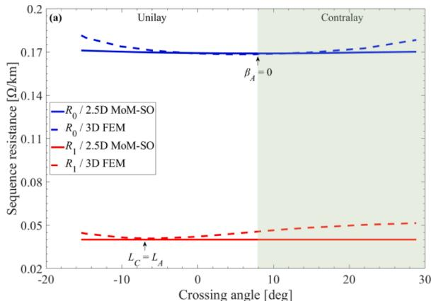

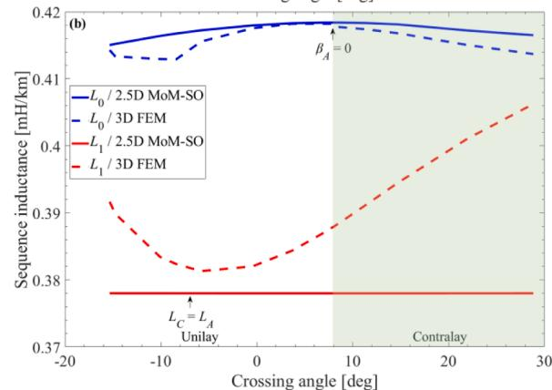  
Fig. 7. Evolution of the sequence (a) resistance and (b) inductance with the crossing angle.

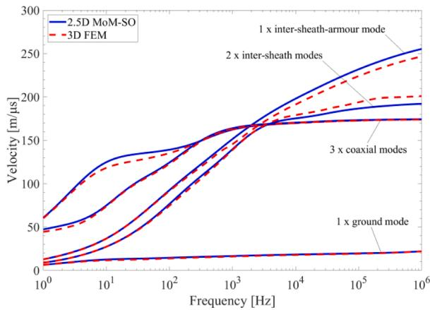  
Fig. 8. Modal propagation velocities.

# 3.7. Transient overvoltages

To demonstrate the impact of solenoid effects on transient phenomena, a cable case of 20 km with solid bonding configuration is considered. The cable is energised by a three-phase 50 Hz voltage source of 1 per-unit at the sending end, while the receiving end is assumed open-circuited. The per-unit-length parameters are imported in the wideband model of [30] and then utilised in a time-domain simulation in the EMTP® software [10].

Fig. 9a shows the conductor voltage of phase A on the cable midpoint. This transient is dominated by the coaxial modes, and thus solenoid effects are anticipated to have minor impact on the waveform. Fig. 9b shows the voltage induced in the sheath at the same point. It is evident that solenoid effects substantially influence the overvoltage

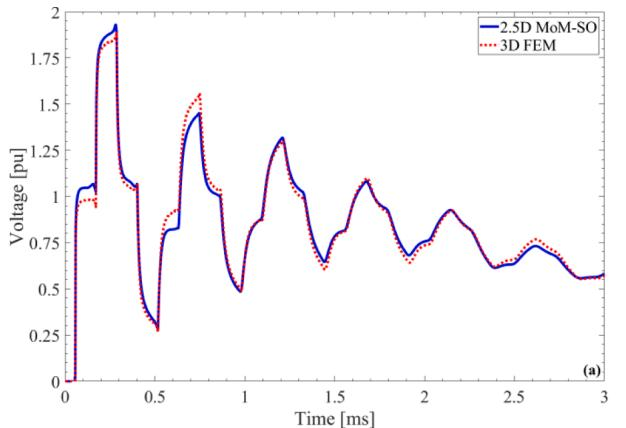

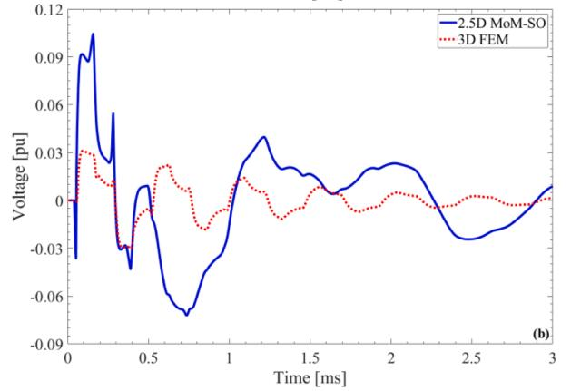  
Fig. 9. (a) Conductor and (b) sheath voltage of phase A on mid-point.

waveshape, which is the outcome of the deviations in inter-sheath and inter-sheath-armour modes at high frequencies.

# 4. Computational considerations

All simulations are performed in a workstation with two processors Intel® Xeon® Platinum 8276 and 512 GB of RAM memory.

Table IV summarises the execution time required for the calculation of Z at one frequency point with all examined models. Results show that, although 2.5D MoM-SO and 2.5D FEM present comparable accuracy, the former is more time-efficient. This is justified by the fact that 2.5D MoM-SO only requires the discretisation of each metallic component’s boundary instead of meshing the interior of the whole cable domain. 3D FEM exhibits the highest execution time, which is anticipated due to the increased model complexity. This is, however, the inevitable compromise in order to account for the longitudinal field component and the solenoid effects.

# 5. Conclusions

The present work studies the calculation of series impedance in submarine 3C armoured cables. Various modelling approaches are considered. Although the existing methods, such as 2.5D MoM-SO, are fast and capture skin, proximity and twisting effects, they still cannot account for the longitudinal component of magnetic field driven along the armour wires and ignore solenoid effects. The present paper adopts state-of-the-art FEM models, which also encapsulate all 3D effects, and combine them with the $J _ { S }$ method to derive the full series impedance matrix. The impact of the lossy earth is also included by replacing the external impedance of the 3D FEM model by an appropriate earth-return term reflecting the actual burial conditions. Based on the above, it can be concluded that the impedance of a 3C armoured cable is calculated with the highest possible accuracy for the first time in the literature.

Table IV Execution Time per Frequency Point.   

<table><tr><td>Method</td><td>2.5D MoM-SO</td><td>2.5D FEM</td><td>3D FEM</td></tr><tr><td>Execution time</td><td>2.1 s</td><td>8 min 53 s</td><td>32 min 18 s</td></tr></table>

As demonstrated, 2.5D FEM and MoM-SO lack in accuracy, thus providing potentially incorrect sequence impedances. The relative difference between the proposed 3D FEM and the existing 2.5D methods decreases by increasing frequency, which is expected due to the reduced interaction between conducting components. The existing standard methods, used for sequence impedance calculation at power frequency, become inaccurate when magnetic armour or higher frequencies are considered. Design aspects such as the armour magnetic permeability and the crossing angle are also examined by the proposed 3D FEM. It is shown that these aspects may have significant influence on results, particularly for cables armoured with magnetic steel. Finally, the impact on modal propagation characteristics and transient phenomena is also studied, concluding that the effect on induced overvoltages can be significant. Although not the most time-efficient, the proposed 3D FEM with $J _ { S }$ method appears to be the only one capable of simulating submarine cables so close to reality. By computing the series impedance, it allows for design optimisation and cost reduction, thus contributing to the economic viability of offshore wind farm projects.

# CRediT authorship contribution statement

A.I. Chrysochos: Conceptualization, Methodology, Writing – original draft, Writing – review & editing, Supervision. D. Chatzipetros: Writing – original draft, Writing – review & editing, Supervision. C.K. Traianos: Software, Validation. K. Bitsi: Software, Validation. J. Morales: Software. H. Xue: Software. J. Mahseredjian: Software, Supervision.

# Declaration of Competing Interest

The authors declare that they have no known competing financial interests or personal relationships that could have appeared to influence the work reported in this paper.

# Data availability

No data was used for the research described in the article.

# References

[1] T. Worzyk, Submarine Power cables: design, installation, repair, Environmental Aspects, Springer, 2009.   
[2] J.J. Bremnes, G. Evenset, R. Stølan, Power loss and inductance of steel armoured multi-core cables: comparison of IEC values with “2.5D” FEA results and measurements, in: Proc. Cigr´e Session, 2010.   
[3] A. Ametani, A general formulation of impedance and admittance of cables, IEEE Trans. Power App. Syst. PAS-99 (3) (1980) 902–910.   
[4] Τ.А. P.apadopoulos, A.I. Chrysochos, G.K. Papagiannis, Analytical study of the frequency dependent earth conduction effects on underground power cables, IET Gener., Transm., Distrib 7 (3) (2013) 161–171.   
[5] Y. Yin, H.W. Dommel, Calculation of frequency-dependent impedances of underground power cables with finite element method, IEEE Trans. Magn. 25 (4) (1989) 3025–3027.   
[6] U.R. Patel, B. Gustavsen, P. Triverio, Proximity-aware calculation of cable series impedance for systems of solid and hollow conductors, IEEE Trans. Power Del. 29 (5) (2014) 2101–2109.   
[7] U.R. Patel, P. Triverio, "MoM-SO: a complete method for computing the impedance of cable systems including skin, proximity, and ground return effects," IEEE Trans. Power Del., vol. 30, no. 5, pp. 2110–2118, 2015.   
[8] B. Gustavsen, M. Høyer-Hansen, P. Triverio, U.R. Patel, Inclusion of wire twisting effects in cable impedance calculations, IEEE Trans. Power Del. 31 (6) (2016) 2520–2529.

[9] H. Xue, A. Ametani, J. Mahseredjian, I. Kocar, Generalized formulation of earthreturn impedance/admittance and surge analysis on underground cables, IEEE Trans. Power Del. 33 (6) (2018) 2654–2663.   
[10] J. Mahseredjian, S. Denneti`ere, L. Dub´e, B. Khodabakhchian, L. G´erin-Lajoie, On a new approach for the simulation of transients in power systems, Electr. Power Syst. Res. 77 (11) (2007) 1514–1520.   
[11] B. Gustavsen, J. Sletbak, T. Henriksen, Simulation of transient sheath overvoltages in the presence of proximity effects, IEEE Trans. Power Del. 10 (2) (1995) 1066–1075.   
[12] R. Benato, S.D. Sessa, A new multiconductor cell three-dimension matrix-based analysis applied to a three-core armoured cable, IEEE Trans. Power Del. 33 (4) (2018) 1636–1646.   
[13] L. Giussani, L. Di Rienzo, M. Bechis, P. Cambareri, C. de Falco, Efficient PEEC computation of losses and currents in shields of round wires in submarine tripolar cables, IEEE Trans. Magn. 58 (9) (2022).   
[14] Cable systems electrical characteristics, CIGRE 531 WG B1.30, 2013.   
[15] T. Kvarts, A.C. Garolera, Z. Huang, O. Thyrvin, Sequence impedance of submarine cables, in: Proc. Cigr´e Session, 2022.   
[16] Electric cables – Calculation of the current rating – Part 1-1: current rating equations (100% load factor) and calculation of losses – General, IEC 60287-1-1, 2014.   
[17] M. Hatlo, E. Olsen, R. Stølan, Accurate analytic formula for calculation of losses in three-core submarine cables, in: Proc. Jicable, 2015.   
[18] K.F. Goddard, J.A. Pilgrim, R. Chippendale, P.L. Lewin, Induced losses in threecore SL-type high-voltage cables, IEEE Trans. Power Del. 30 (3) (2015) 1505–1513.   
[19] A.I. Chrysochos, D. Chatzipetros, I. Ztoupis, J. Pilgrim, V.L. Kanas, K. Pavlou, K. Tastavridis, G. Georgallis, Validation of an efficient 3D finite element model for the calculation of losses in three-core armoured power cables, in: Proc. Cigr´e Session, 2022.

[20] J.C. del Pino-Lopez, ´ M. Hatlo, P. Cruz-Romero, On simplified 3D finite element simulations of three-core armored power cables, Energies 11 (11) (2018) 1–14.   
[21] J.C. del Pino-Lopez, ´ P. Cruz-Romero, Use of 3D-FEM tools to improve loss allocation in three-core armored cables, Energies 14 (9) (2021) 1–23.   
[22] J.C. del Pino-Lopez, ´ P. Cruz-Romero, "Experimental validation of ultra-shortened 3D finite element models for frequency-domain analyses of three-core armored cables," IEEE Trans. Power Del., early access.   
[23] L. Giussani, L. Di Rienzo, M. Bechis, C. de Falco, Fully coupled computation of losses in metallic sheaths and armor of AC submarine cables, IEEE Trans. Power Del. 37 (5) (2022) 3803–3812.   
[24] R. Benato, Core laying pitch-long 3D finite element model of an AC three-core armoured submarine cable with a length of 3 metres, Elec. Power Syst. Res. 150 (2017) 137–143.   
[25] D. Willen, C. Thidemann, O. Thyrvin, D. Winkel, V.M.R. Zermeno, Fast modelling of armour losses in 3D validated by measurements, in: Proc. Jicable, 2019.   
[26] S. Sturm, A. Küchler, J. Paulus, R. Stolan, F. Berger, 3D-FEM modelling of losses in armoured submarine power cables and comparison with measurements, in: Proc. Cigr´e Session, 2020.   
[27] COMSOL Multiphysics® v.6.1. www.comsol.com. COMSOL AB, Stockholm, Sweden.   
[28] A.I. Chrysochos, K. Alexandrou, D. Chatzipetros, D. Kossyvakis, G.J. Anders, K. Pavlou, K. Tastavridis, G. Georgallis, Capacitive and inductive coupling in cable systems – Comparative study between calculation methods, in: Proc. Jicable, 2019.   
[29] Power cable rating examples for calculation tool verification, CIGRE 880 WG B1.56, 2022.   
[30] A. Morched, B. Gustavsen, M. Tartibi, A universal model for accurate calculation of electromagnetic transients on overhead lines and underground cables, IEEE Trans. Power Del. 14 (3) (1999) 1032–1038.