# Comprehensive ???? impedance modeling of AC power-electronics-based power systems with frequency-dependent transmission lines

Julio Hernández-Ramírez a, Juan Segundo-Ramírez a,∗, Marta Molinas b

a Autonomous University of San Luis Potosí, Engineering Department, Dr. Manuel Nava No. 8, Zona Universitaria Poniente, San Luis Potosí, 78290, San Luis Potosí, Mexico   
b Norwegian Institute of Science and Technology, Department of Engineering Cybernetics, Elektro D/B2, D244, Gløshaugen, O. S. Bragstads plass 2, Trondheim, 7034, Trondheim, Norway

# A R T I C L E I N F O

Keywords:

Converters

Harmonic balance method

Impedance modeling

Nyquist stability criterion

Transmission line

# A B S T R A C T

This paper introduces a time–frequency analytic method for the exact identification of wideband DQ impedance models oriented to harmonic stability of converter-driven systems with transmission line models with distributed and frequency-dependent parameters. Wideband models are of great importance in the analysis of harmonic stability over a broad range of frequencies. The transmission line is a crucial component in this regard, but it is not straightforward to incorporate it into the impedance model of AC power-electronicsbased power systems. This has led to the use of lumped parameter models or models based on rational approximations. This article proposes a method to include this important element to the impedance model directly from its frequency domain model. Salient features of the proposed modeling approach include the frequency telegrapher’s equations with distributed and frequency-dependent parameters, exact delay models of PWM, control implementations of power electronics, and an exact steady-state computation using a balance method based on a hybrid time–frequency approach. The proposal avoids time-domain simulations, rational approximations, or the fast Fourier transform. A converter-driven system with transmission lines is used to validate the proposal and the results of the frequency scanning method conducted in OPAL-RT (ARTEMiS/EMTP-RV) and PSCAD/EMTDC support the effectiveness, speed, and accuracy.

# 1. Introduction

The increment of power electronic devices (PEDs) in the electric networks has brought new challenges in their operation, analysis and control [1,2]. Despite the notable performance that PEDs have due to the usage of feedback control and fast response, this can also cause stability-related problems [3,4]. In fact, along with the traditional stability definitions, new ones have been added [5], such as the socalled converter driven-stability that focuses on the slow and fast interactions that converter-based systems could present; hence, there could be scenarios where both electromechanical and electromagnetic dynamics must be studied to assess the stability. This contrasts with the traditional conception of power systems dominated by synchronous machines, where phasor-based tools were enough to study low-frequency oscillations [6].

In this scenario, electromagnetic transient (EMT) simulations are more appropriate for the comprehensive study of fast oscillations [7]. This phenomenon is known as harmonic stability, and is related to the interactions of the PEDs and the passive elements of the network over a

wide frequency range [8,9]. Nonetheless, incorporating the wideband models of transmission lines along with controlled PEDs is complex because the whole system would be of infinite dimension, nonlinear, and modeled in different frameworks. These problems make it difficult to accurately calculate the steady state solution of the system, which is necessary to obtain the accurate small-signal models used in stability studies.

There are no previous works dealing with the impedance modeling considering the full frequency-dependent transmission line with distributed parameters (TL), along to exact delay models of the PWM, control implementations associated with the PEDs, and the exact steadystate computation of nonlinear systems with frequency-dependent and distributed parameters elements, such as the TL. This paper presents a novel hybrid alternative to determine the impedance models in the ???? framework of systems with TLs and PEDs. The TLs are represented exactly using their hyperbolic solution in the frequency domain, whereas the PEDs are modeled in the time domain, maintaining their nonlinear features. This approach first finds the steady-state solution

accurately, following the harmonic balance method [10,11]. Then, using the analytic ABC frequency-domain solution of the TL and the Park transform, the impedance model in ???? is obtained based on evaluating the system response with a three-phase voltage at different frequencies. Nonetheless, repetitive time-domain simulations, EMT-type programs, and vector fitting techniques are not needed. A power-electronic-based power system, with two PEDs and tie-lines modeled using frequencydependent and distributed parameters, is used as the test case to prove the effectiveness of our work. The results are compared against those obtained from the frequency scanning method implemented in the real-time simulator OPAL-RT (ARTEMiS/EMTP-RV), and the offline simulator PSCAD/EMTDC. The outcomes validate the proposal showing that it can retain the high-frequency dynamics of TLs, and that the steady state is correctly obtained. This paper is ordered in the following way: Section 2 presents a review on the previous works oriented towards modeling of TLs for electromagnetic transient stability or harmonic stability, Section 3 details the method used to accurately calculate the steady state of converter-driven nonlinear systems with TLs. Section 4 details the proposed TL impedance modeling method in ???? domain. Section 5 presents a test case, comparisons with time-domain simulations using two different commercial EMT-type programs and stability analyses. Finally, the conclusions of our contribution are given.

# 2. Previous work

The power systems small-signal analysis based on state space models and selective modal analysis [12,13], has been widely used, but it is based on a finite-dimensional model that neglects the complete dynamics own of the PEDs delay and frequency-dependent TL models. The impedance-based method is an alternative approach to the small-signal analysis [14] that has gained acceptance because it can derive smallsignal models even when the model and parameters of the system are not explicitly known, but can be identified by measuring voltages and currents in terminals of the device under study, rather than obtaining analytical expressions [15–17]. In addition, since this method is in the frequency domain, it is more suitable for naturally incorporating the delays and TLs models. In the case of the delay, this can easily be considered in any framework (????, ????, harmonic, sequence, or ABC) and whose small-signal model is well-known [18,19].

The telegrapher’s equations in the phase domain mathematically describe the currents and voltages over time along the TL. In the time domain are a set of two partial differential equations (PDEs) with convolutions for each conductor of a multiconductor TL. In the frequency domain, these equations can be analytically solved and their solution includes transcendental functions [20]. It is worth mentioning that these elements are rarely modeled in ????, where it might be more useful for stability analysis because this framework is commonly used to describe PEDs because the framework is time invariant, simplifies control design, and allows to easily compute the steady state solution and get the respective linearized system.

Popular approaches for impedance modeling represent TLs using PI circuits in cascade [21] or PI frequency-dependent models [22] through lumped-circuit approximations. These representations permit a formulation of state space models (that can also be used to compute the impedance), applicable in ABC or ???? frameworks. The steady state could be computed either by solving the nonlinear equations using a Newton–Raphson method or applying a shooting method [23]. A disadvantage of these approaches is that the dynamics of the TLs are not entirely captured if low-order approximations are used, so a high-order model could be needed. The previous works [24,25] have proposed impedance models of TLs in the ???? framework; however, the approach also uses lumped-parameter models, truncating the high-order dynamics.

Another common alternative relies on the usage of EMT-type programs and the frequency scanning method (FSM) to compute sparse points of the response of the subsystems; afterward, a fitting technique

is used to determine the impedance models in ???? [26–28]. This approach could request extensive simulation time, especially on large scale, weakly damped, and stiff models. Moreover, more points should be obtained if a finer fitting is sought (this is extremely important to keep resonance peaks), increasing the time and computational effort. This approach, based on EMT-type programs, approximates the TL model with rational functions within a defined wideband; the delays in the propagation matrix can be better identified by idempotent decomposition [29,30].

The complete frequency-dependent model of DC cables or TLs in AC has been used to assess the stability in the ABC framework as reported in [8,31,32]. However, these works do not explain how the steady-state is computed; moreover, the PEDs are modeled with several simplifications in their controls. The DC cable of a VSC-HVDC is modeled considering a distributed parameter model in [33]. In [34], the equivalent circuit of the TL ends is a PI circuit with admittances given in terms of hyperbolic functions but with constant parameters. A long transmission cable in the AC side of an inverter is considered in ABC framework in [35], but this work does not explain how the steady state is obtained. Hence, some very relevant gaps in the previous works regarding impedance modeling of systems including frequency-dependent TLs and PEDs are listed below:

• A proper framework should be defined where impedance models can easily be computed for all the elements under study.   
• A method to compute the steady state of a system with infinitedimensional models is needed.   
• The TLs should be represented avoiding rational approximations.   
• Repetitive time-domain simulations should be avoided to save time and reduce the computational burden and simulation errors.

The incipient idea of our work was initially presented in [11], focusing on the impedance modeling of one TL subsystem with one nonlinear subsystem. However, this paper is a generalization considering several nonlinear subsystems interacting simultaneously with several frequency-dependent elements and closed-loop controlled PEDs. Additional in-depth validations in ARTEMiS/EMTP-RV (real-time simulations) and PSCAD (offline simulations) are included here, and the stability properties of our impedance method are also confirmed by the Nyquist criterion and time domain simulations.

# 3. Operating point computation

The proposed approach to equilibrium point computation is the harmonic balance method (HBM) [10] since its iterative formulation allows for hybrid modeling, with components modeled in the time and frequency domains. In our proposal, we only use the fundamental frequency in the iterative process, since we are not considering harmonic components.

Consider a system as Fig. 1-(a) shows, where there is a linear network interconnecting ?? nonlinear subsystems (possibly including systems with control). The coupling between them is caused by the currents $i _ { k } ( t )$ and the voltages $v _ { k } ( t )$ for $k = 1 , 2 , \ldots , n$ in the point of interconnection (POI) of each nonlinear subsystem. Electrically, using dependent sources, the same effect can be represented as Fig. 1-(b) depicts. This artificial split makes it possible to analyze and model each subsystem in the most appropriate domain (time or frequency) according to its characteristics. The HBM works in an iteratively manner as follows: initially, the steady-state condition is unknown in all subsystems, so a first estimate for $v _ { k } ( t )$ that we call $v _ { k } ^ { ( i ) }$ is proposed (?? = 0). It is assumed that each nonlinear subsystem in Fig. 1 has a dynamical model that is better written in the time domain as:

$$
\frac {d \boldsymbol {x} _ {k} ^ {(i + 1)}}{d t} = f _ {k} \left(\boldsymbol {x} _ {k} ^ {(i + 1)}, v _ {k} ^ {(i)}\right) \tag {1}
$$

Where ??(?? $\pmb { x } _ { k } ^ { ( i + 1 ) }$ is the state vector of the ??th nonlinear subsystem that contains the curren t ??(??+1). The equilibrium condition of each nonlinear $i _ { k } ^ { ( i + 1 ) }$

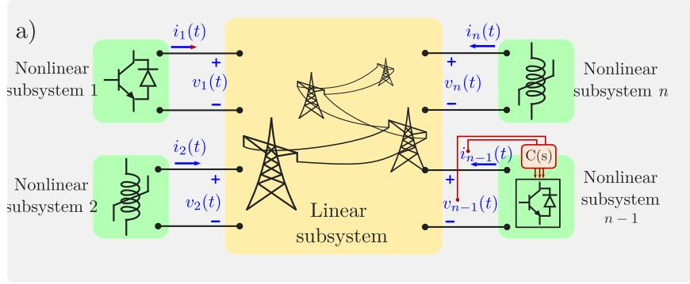

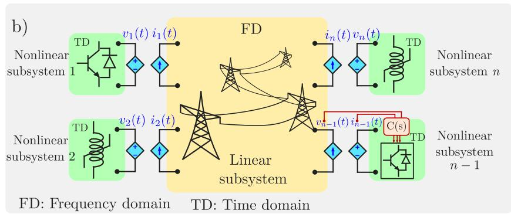  
Fig. 1. Electric network with nonlinear and linear subsystems: (a) original system, (b) equivalent using dependent sources.

subsystem is computed from $f _ { k } ( \boldsymbol { x } _ { k } ^ { ( i + 1 ) } , \boldsymbol { v } _ { k } ^ { ( i ) } ) ~ = ~ 0 ,$ ?? obtaining the first iteration result, $\pmb { x } _ { k } ^ { ( i + 1 ) }$ ?? by means of a root-finding method, such as the Newton–Raphson method. This method is used to compute the steadystate solution of the nonlinear subsystems, taking advantage of the fact that they are in ????. For the initial guess of the Newton–Raphson method, the nonlinear subsystems are numerically integrated for 6 full cycles to allow the initial fast transients to damp out, but at the interface nodes between the nonlinear part and the linear part, ideal voltage sources of 1 p.u. were used instead of the linear subsystem. We can omit this numerical integration if we have a good initial guess. Note that the steady state of the nonlinear subsystems can be conducted through several approaches, including numerical integration. Now, each one of the currents $i _ { k } ^ { ( i + 1 ) }$ ?? is used to determine the bus voltages of the linear part of the system. The frequency domain is more suitable for writing its model, so one can derive the equations of this linear network using nodal or mesh equations. In the former case, the following model is gotten:

$$
\left[ \begin{array}{c} I _ {1} ^ {(i + 1)} (s) \\ I _ {2} ^ {(i + 1)} (s) \\ \vdots \\ I _ {n} ^ {(i + 1)} (s) \\ I ^ {(i + 1)} (s) \end{array} \right] = \boldsymbol {Y} (s) \left[ \begin{array}{c} V _ {1} ^ {(i + 1)} (s) \\ V _ {2} ^ {(i + 1)} (s) \\ \vdots \\ V _ {n} ^ {(i + 1)} (s) \\ E ^ {(i + 1)} (s) \end{array} \right] \tag {2}
$$

The nodal admittance matrix is $\mathbf { \boldsymbol { Y } } ( s ) ,$ the inner currents of the network is $\pmb { I } ^ { ( i + 1 ) } ( s ) _ { i }$ , and $\left[ V _ { 1 } ^ { ( i + 1 ) } ( s ) \quad V _ { 2 } ^ { ( i + 1 ) } ( s ) \quad \ldots \quad V _ { n } ^ { ( i + 1 ) } ( s ) \quad E ^ { ( i + 1 ) } ( s ) \right] ^ { I }$ (??+1) is the nodal voltage vector. It is noted that the frequency representation of $i _ { k } ^ { ( i + 1 ) } , \ I _ { k } ^ { ( i + 1 ) } ( s )$ , is also included. The periodic steady-state is got by phasors with $s = j \omega _ { 0 }$ and solving (2), the first iteration of the linear subsystem is obtained. Then, each phasor $V _ { k } ^ { ( i + 1 ) } ( j \omega _ { 0 } )$ is transformed to the time-domain form $v _ { k } ^ { ( i + 1 ) }$ ?? 0. At this point, the HBM has made one

iteration of the steady state, getting the first result (with $i = 0 )$ :

$$
\mathcal {X} ^ {(1)} = \left[ \begin{array}{c} \boldsymbol {x} _ {1} ^ {(1)} \\ \boldsymbol {x} _ {2} ^ {(1)} \\ \vdots \\ \boldsymbol {x} _ {n} ^ {(1)} \\ V _ {1} ^ {(1)} (j \omega_ {0}) \\ V _ {2} ^ {(1)} (j \omega_ {0}) \\ \vdots \\ V _ {n} ^ {(1)} (j \omega_ {0}) \\ E ^ {(1)} (j \omega_ {0}) \end{array} \right] \tag {3}
$$

??iteration to obtain the values of Taking $v _ { k } ^ { ( i + 1 ) }$ ?? as a second estimation of $\mathbf { x } _ { k } ^ { ( i + 2 ) } , \ i _ { k } ^ { ( i + 2 ) } \ , \ V _ { k } ^ { ( i + 2 ) } ( j \omega _ { 0 } )$ $v _ { k } ,$ it is conducted a new in the second iteration. The convergence error is:

$$
\left\| \mathcal {X} ^ {(i + 1)} - \mathcal {X} ^ {(i)} \right\| <   \epsilon \tag {4}
$$

The tolerance error, $\epsilon ,$ is a real number that determines the precision of the found steady-state. A small value permits the HBM to compute a more exact solution than the EMT-type programs since there are not additional errors such as those associated to the numerical integration method, the integration step, the rational fitting of the phase domain TL models, the interpolation owing the traveling time, among others. The EMT-type programs model all components in detail, including nonlinearities, switching process, distributed parameters, frequencydependent parameters, delays, etc.; however, our proposal is oriented towards the impedance modeling of wideband systems for linear stability analysis known as harmonic stability or electromagnetic transient stability [3,8]. We use $\epsilon = 1 0 ^ { - 1 0 }$ , but lower or higher tolerance can be used depending on the application. It should be noted that the

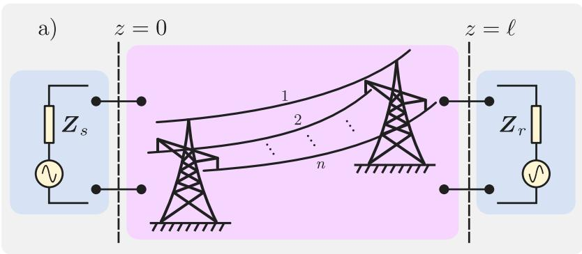

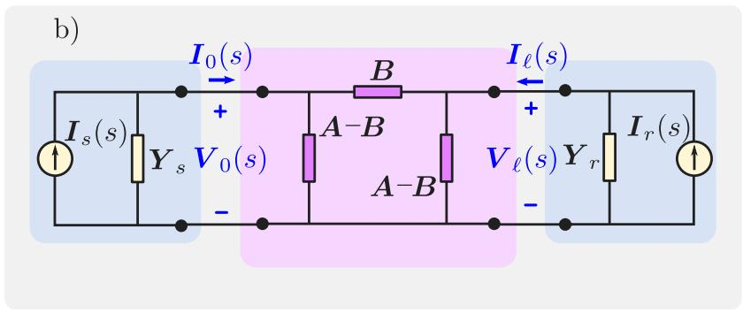  
Fig. 2. Two-port model of a TL: (a) Thévenin equivalent, (b) Admittance network.

proposal does not impose the modeling framework for each subsystem; therefore, one can choose the one that fits better to the involved elements in each subsystem. Hence, for this paper, it will be assumed that the nonlinear models are written in ????, whereas the linear ones are described in ABC. This permits the models of frequency-dependent TLs to be incorporated without the necessity of using lumped circuits or rational approximations.

# 4. Transmission line modeling in the frequency domain

The study and analysis of TLs can be performed using the wellknown telegrapher’s equations given as follows [20]:

$$
\begin{array}{l} \frac {d V (z , s)}{d z} = - Z (s) I (z, s) \\ \frac {d I (z , s)}{d z} = - Y (s) V (z, s) \end{array} \tag {5}
$$

These equations are in the Laplace domain, where $\pmb { Y } ( s ) = \pmb { G } ( s ) + s \pmb { C } ( s )$ is the per unit length admittance and $Z ( s ) = R ( s ) + s L ( s )$ is the per unit length impedance. These equations can represent a uniform TL of total length ?? (m) as Fig. 2-a indicates, whose sending end side $( z = 0 )$ and receiving end side $( z = \ell )$ are connected to respective systems modeled by Thévenin equivalents.

The Eqs. (5) in the time domain imply convolutions, which are difficult to perform; moreover, it would be complicated to incorporate them together with power electronics models.

Applying boundary conditions in the telegrapher’s equations in the Laplace domain, results in the following admittance model:

$$
\left[ \begin{array}{l} \boldsymbol {I} _ {s} (s) \\ \boldsymbol {I} _ {r} (s) \end{array} \right] = \left[ \begin{array}{c c} \boldsymbol {A} + \boldsymbol {Y} _ {s} & - \boldsymbol {B} \\ - \boldsymbol {B} & \boldsymbol {A} + \boldsymbol {Y} _ {r} \end{array} \right] \left[ \begin{array}{l} \boldsymbol {V} _ {0} (s) \\ \boldsymbol {V} _ {\ell} (s) \end{array} \right] \tag {6}
$$

The admittance matrices $\pmb { Y } _ { s }$ and $\boldsymbol { Y } _ { r }$ are used instead of the impedance matrices. The TL is represented through a two-port system seen from both ends, as it is depicted in Fig. 2-(b). Where $\begin{array} { r l } { \pmb { A } } & { { } = } \end{array}$ $Y _ { _ { c } } \coth ( \varPsi \ell ) , B = Y _ { _ { c } } \operatorname { c s c h } ( \varPsi \ell ) , \varPsi = \sqrt { Z Y }$ is the propagation constant,

and $\begin{array} { r c l } { { { \cal Y } _ { c } } } & { { = } } & { { { \cal Z } ^ { - 1 } { \pmb \psi } } } \end{array}$ is the characteristic admittance. The frequencydependent square matrices of order $n , ~ Z$ and ?? , are obtained from the geometrical arrangement of the conductors in the TL. The line has as many delays in its model as it has conductors, but these are not represented in lumped parameter models; however, they are very well approximated by some EMT-type programs, such as PSCAD and EMTP-RV.

# 4.1. DQ impedance model of the transmission line

Real-world installations have DC lines, AC cables, double-circuit overhead lines, among other configurations, whose unbalance is not negligible and, therefore, the zero component must be included in the time-invariant TL ????0 model. However, this work only focuses on ideally transposed three-phase overhead TLs, but represents a step forward by including frequency-dependent TLs with distributed parameters in the ???? impedance modeling, as follows. From Fig. 2-(b), it is seen that the equivalent impedance can be determined on each end side. Suppose we want to calculate the equivalent impedance at $z = 0 ,$ This is accomplished by turning off the current source $I _ { r } ( s ) ,$ , then using (6) it results:

$$
\boldsymbol {I} _ {0} (s) = \boldsymbol {Y} _ {t l} (s) \boldsymbol {V} _ {0} (s) \tag {7}
$$

$$
\boldsymbol {Y} _ {t l} (s) = \boldsymbol {A} - \boldsymbol {B} (\boldsymbol {A} + \boldsymbol {Y} _ {r}) ^ {- 1} \boldsymbol {B}
$$

$\boldsymbol { Y } _ { t l } ( s )$ is a square matrix of dimension 3 in the phase framework. The Park transform can be applied to obtain a representation in ????:

$$
\left[ \begin{array}{l} x _ {D} \\ x _ {Q} \end{array} \right] = \frac {2}{3} \left[ \begin{array}{l} x _ {a} \cos (\theta) + x _ {b} \cos \left(\theta - \frac {2 \pi}{3}\right) + x _ {c} \cos \left(\theta + \frac {2 \pi}{3}\right) \\ - x _ {a} \sin (\theta) - x _ {b} \sin \left(\theta - \frac {2 \pi}{3}\right) - x _ {c} \sin \left(\theta + \frac {2 \pi}{3}\right) \end{array} \right] \tag {8}
$$

With $\theta = \omega _ { 0 } t , x$ is either a current or voltage. The zero sequence component is not considered. Since the transform argument is $\omega _ { 0 } t ,$ the ABC and ???? components are linearly related. Hence, the following is

obtained by applying the Laplace transform in (8):

$$
\begin{array}{l} \left[ \begin{array}{c} X _ {D} (s) \\ X _ {Q} (s) \end{array} \right] = \frac {1}{3} \left[ \begin{array}{c c c} 1 & e ^ {- j 2 \pi / 3} & e ^ {j 2 \pi / 3} \\ j & j e ^ {- j 2 \pi / 3} & j e ^ {j 2 \pi / 3} \end{array} \right] \left[ \begin{array}{c} X _ {a} (s - j \omega_ {0}) \\ X _ {b} (s - j \omega_ {0}) \\ X _ {c} (s - j \omega_ {0}) \end{array} \right] \\ + \frac {1}{3} \left[ \begin{array}{c c c} 1 & e ^ {j 2 \pi / 3} & e ^ {- j 2 \pi / 3} \\ - j & - j e ^ {j 2 \pi / 3} & - j e ^ {- j 2 \pi / 3} \end{array} \right] \left[ \begin{array}{l} X _ {a} (s + j \omega_ {0}) \\ X _ {b} (s + j \omega_ {0}) \\ X _ {c} (s + j \omega_ {0}) \end{array} \right] \tag {9} \\ \end{array}
$$

$$
\boldsymbol {X} ^ {D Q} (s) = \boldsymbol {K} _ {1} \boldsymbol {X} _ {a b c} (s - j \omega_ {0}) + \boldsymbol {K} _ {2} \boldsymbol {X} _ {a b c} (s + j \omega_ {0})
$$

The expression (9) states that values in ???? are computed using the response in ABC with frequency shifting $\pm j \omega _ { 0 }$ in the complex variable ??. Now, using (9) in (7), the vector $I _ { 0 } ^ { D \breve { Q } } ( s )$ is:

$$
\begin{array}{l} \boldsymbol {I} _ {0} ^ {D Q} (s) = \boldsymbol {K} _ {1} \boldsymbol {Y} _ {t l} (s - j \omega_ {0}) \boldsymbol {V} _ {0} (s - j \omega_ {0}) \tag {10} \\ + \pmb {K} _ {2} \pmb {Y} _ {t l} (s + j \omega_ {0}) \pmb {V} _ {0} (s + j \omega_ {0}) \\ \end{array}
$$

(10) relates the ABC voltage with ???? current. The ???? admittance model of (7) is:

$$
\begin{array}{l} \left[ \begin{array}{l} I _ {0} ^ {D} (s) \\ I _ {0} ^ {Q} (s) \end{array} \right] = \left[ \begin{array}{l l} Y _ {t l} ^ {D D} (s) & Y _ {t l} ^ {D Q} (s) \\ Y _ {t l} ^ {Q D} (s) & Y _ {t l} ^ {Q Q} (s) \end{array} \right] \left[ \begin{array}{l} V _ {0} ^ {D} (s) \\ V _ {0} ^ {Q} (s) \end{array} \right] \tag {11} \\ \boldsymbol {I} _ {0} ^ {D Q} (s) = \boldsymbol {Y} _ {t l} ^ {D Q} (s) \boldsymbol {V} _ {0} ^ {D Q} (s) \\ \end{array}
$$

(11) indicates a coupling in the frequency domain of the ?? and ?? components by the existence of the off-diagonal elements. Indeed, this equation also indicates the frequency coupling between the voltage in ABC and the current in ???? as shown in (10), since according to (9), $V _ { \scriptscriptstyle 0 } ^ { \cal D Q } ( s ) = { \cal K } _ { 1 } V _ { a b c } ( s - j \omega _ { 0 } ) + { \cal K } _ { 2 } V _ { a b c } ( s + j \omega _ { 0 } )$ . The admittance matrix is numerically identified, assessing the response of the system to a threephase voltage of variable frequency. For a particular frequency $\omega _ { n } ,$ the admittance relates $V _ { 0 } ^ { D Q } ( j \omega _ { n } )$ with $\dot { I } _ { 0 } ^ { D Q } ( j \omega _ { n } )$ ). According to (9), both can 0  0 be determined by knowing the responses in ABC for $s = j ( \omega _ { n } - \omega _ { 0 } )$ ) and $s ~ = ~ j ( \omega _ { n } + \omega _ { 0 } )$ , which can be easily attained by (7). However, it is seen that at least $V _ { 0 } ( s )$ should be known to obtain $I _ { 0 } ( s )$ . Due to (7)–(11) are completely linear, their validity is not restricted to a particular operating condition or the size of the excitation. Therefore, a balanced three-phase positive-sequence voltage of arbitrary amplitude can be arbitrarily chosen to excite (7) and assess $s = j ( \omega _ { n } \pm \omega _ { 0 } )$ . At this point, the vectors $V _ { 0 } ^ { D Q } ( j \omega _ { n } )$ and $I _ { 0 } ^ { D Q } ( j \omega _ { n } )$ 0 can be computed, holding the following relationship:

$$
\left[ \begin{array}{l} I _ {0} ^ {D} (j \omega_ {n}) \\ I _ {0} ^ {Q} (j \omega_ {n}) \end{array} \right] = \left[ \begin{array}{l l} Y _ {t l} ^ {D D} (j \omega_ {n}) & Y _ {t l} ^ {D Q} (j \omega_ {n}) \\ Y _ {t l} ^ {Q D} (j \omega_ {n}) & Y _ {t l} ^ {Q Q} (j \omega_ {n}) \end{array} \right] \left[ \begin{array}{l} V _ {0} ^ {D} (j \omega_ {n}) \\ V _ {0} ^ {Q} (j \omega_ {n}) \end{array} \right] \tag {12}
$$

To generate another linearly independent set equations, a balanced three-phase negative-sequence voltage (with the same amplitude as the previous one) is used to compute other vectors $I _ { 0 } ^ { D Q _ { - } } ( j \omega _ { n } ) , V _ { 0 } ^ { D Q _ { - } } ( j \omega _ { n } )$ . Finally, the matrix at the frequency $s = j \omega _ { n }$ is (the argument $j \omega _ { n }$ is dropped out for brevity):

$$
\left[ \begin{array}{l l} Y _ {g} ^ {D D} & Y _ {g} ^ {D Q} \\ Y _ {g} ^ {Q D} & Y _ {g} ^ {Q Q} \end{array} \right] = \left[ \begin{array}{l l} I _ {0} ^ {D} & I _ {0} ^ {D -} \\ I _ {0} ^ {Q} & I _ {0} ^ {Q -} \end{array} \right] \left[ \begin{array}{l l} V _ {0} ^ {D} & V _ {0} ^ {D -} \\ V _ {0} ^ {Q} & V _ {0} ^ {Q -} \end{array} \right] ^ {- 1} \tag {13}
$$

The process is repeated again if another frequency is needed. In addition, this process also is valid for computing the admittance from the receiving side. This procedure computes the admittance response at specified frequencies [36] with the following relevant advantages:

• Time-domain simulations are not needed which implies that the required time is dramatically reduced.   
• As the analytic solution of the TLs is employed, this provides a response without approximation errors, so this can be seen as the maximum exactness in the model.   
• The frequency components of voltage and currents are determined by assessing $s = j \omega _ { n }$ in (9) either for voltage or current, so the FFT is avoided.   
• Impedance response evaluation can be performed using as small frequency steps as necessary. This avoids having scattered points that need rational fitting algorithms to get rational transfer functions.

• The error in this proposal comes solely from the evaluation of the expressions (7), (10), (13).

# 5. Validation of the proposal

This section will present the comparison of the outcomes following the proposal and using the conventional (FSM) in EMT-type simulators. Once the impedance models are validated, they can be used to investigate the stability properties of the system under parametric changes. A test case consists of a power-electronics-based AC power system with two voltage source converters (VSCs) interconnected to a grid equivalent utilizing tie-lines considering their distributed and frequency-dependent parameters.

# 5.1. Test case: Power-electronics-based AC power system

This case considers the incorporation of two closed-loop-controlled power electronic inverters and two transmission lines. The study case is depicted in Fig. 3-(a). There are two nonlinear subsystems that are interconnected to a linear network. The VSCs have controls shown in Fig. 4, which are the typical inner-current control, but in the case of VSC-1 the DC voltage control and reactive power control are also added. In addition, each VSC has a phase lock loop (PLL) to synchronize each PEDs to its respective point of common coupling (PCC).

Each VSC is interconnected by a transformer (T1, T2) modeled solely by the leakage branch, i.e., inductance and resistance. The TLs seen in Fig. 3-(a) have a vertical configuration, with one conductor per phase, and the sag of the conductors is neglected. The low-voltage side has a nominal voltage of 34.5 kV, and the high-voltage side is 230 kV; the parameters of the system are provided in Table 1. The interactions of the system will be studied in the PCC of the VSC-1 (bus $v _ { p c c _ { 1 } } ) ;$ hence, the source and load impedance are indicated in Fig. 3- (a). The procedure for calculating the impedance models involves first determining the steady-state operating condition, and as a second step, the linearization in that steady state.

To apply the HBM, the subsystems are splitted according to Fig. 3- (b); each one of the nonlinear subsystems is modeled in a general framework ???? in the time domain, whereas the linear subsystem is described by models in the frequency domain in ABC; so the whole system is seen as a hybrid one, where the interconnections among the subsystems are done by means of dependent sources, interchanging voltages or currents as Fig. 3-(b) shows. Changing a variable from a nonlinear subsystem to the linear network implies computing the variable in ABC and then changing it to a phasor form. The inverse process is done to pass a variable in ABC to ????.

The transformers are considered part of the nonlinear systems to have fewer nodes in the formulation of the linear network. Hence, the linear subsystem has four three-phase nodes: the sending and receiving voltages of TL1 (written in the frequency domain as $\boldsymbol { V } _ { s _ { 1 } } , \boldsymbol { V } _ { r _ { 1 } } )$ , and the sending and receiving voltages of TL2 $( V _ { s _ { 2 } } , ~ V _ { r _ { 2 } } )$ . The current sources that excite the system are the frequency-domain representation in ABC of $i _ { f _ { 1 } }$ and $\pmb { i } _ { c _ { 2 } }$ because the connection type of T1 and T2. The grid equivalent is modeled by its Norton equivalent in the frequency:

$$
\begin{array}{l} \boldsymbol {I} _ {t h} = \frac {\mathcal {L} \left\{\boldsymbol {v} _ {t h} \right\}}{s L _ {t h} + R _ {t h}} \tag {14} \\ \boldsymbol {Y} _ {t h} = \frac {1}{s L _ {t h} + R _ {t h}} \boldsymbol {\mathit {l}} \\ \end{array}
$$

Where  is an identity matrix of dimension $3 \times 3 .$ . Each TL is described using the model exposed in Section 4.

The following admittance is interconnecting TL2 with the equivalent grid as Fig. 3-(b) shows:

$$
Y _ {g _ {2}} = \frac {1}{s L _ {g _ {2}} + R _ {g _ {2}}} I \tag {15}
$$

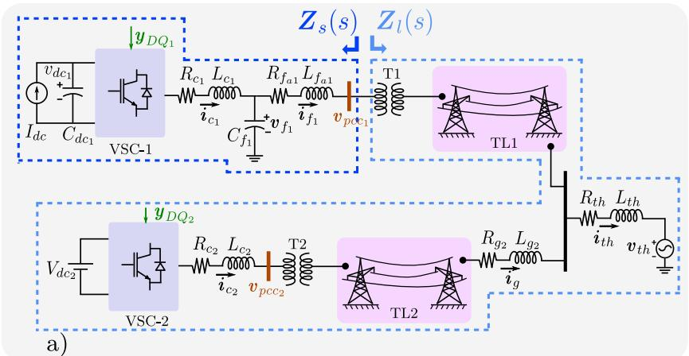  
(a) Diagram of the converter-driven system

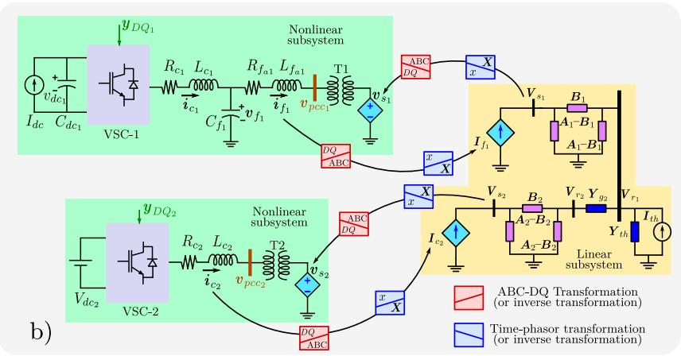  
(b) Representation of the hybrid system using dependent sources

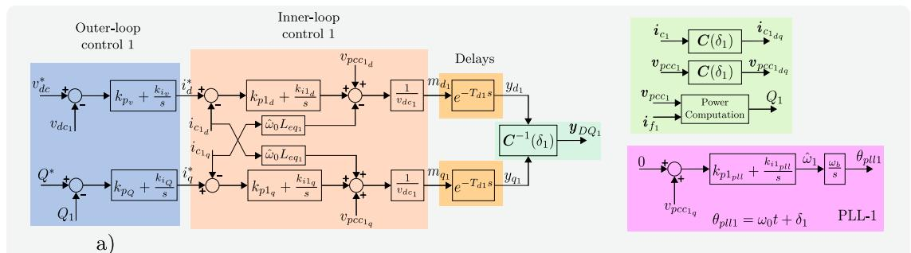  
Fig. 3. Test case: A converter-driven electric network.

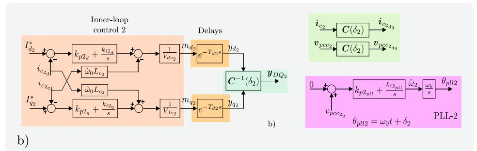  
Fig. 4. Controls of the PEDs: (a) Control of VSC-1, (b) Control of VSC-2.

Table 1 Parameters of the test case.   

<table><tr><td colspan="4">VSC-1 (Base Values: 34.5 kV, 100 MVA, 60 Hz)</td></tr><tr><td>Parameter</td><td>Value</td><td>Parameter</td><td>Value</td></tr><tr><td>Rc1</td><td>0.008 p.u.</td><td>Lc1</td><td>0.18 p.u.</td></tr><tr><td>Cf1</td><td>0.15 p.u.</td><td>Rf1</td><td>0.006 p.u.</td></tr><tr><td>Lfal</td><td>0.11 p.u.</td><td>Cdc1</td><td>8 p.u.</td></tr><tr><td>kp1pl</td><td>3 p.u.</td><td>ki1pl</td><td>120 p.u./s</td></tr><tr><td>kp1d</td><td>0.9615 p.u.</td><td>k1d</td><td>17.5 p.u./s</td></tr><tr><td>kp1q</td><td>0.9615 p.u.</td><td>ki1q</td><td>17.5 p.u./s</td></tr><tr><td>kpq</td><td>-2.182 p.u.</td><td>kiq</td><td>-28.37 p.u./s</td></tr><tr><td>kpQ</td><td>-0.1 p.u.</td><td>kiQ</td><td>-2.5 p.u./s</td></tr><tr><td>Idc</td><td>0.8 p.u.</td><td>vdc</td><td>1.3 p.u.</td></tr><tr><td>Q*</td><td>0.1 p.u.</td><td>Td1</td><td>181.159 μs</td></tr><tr><td colspan="4">VSC-2 (Base Values: 34.5 kV, 100 MVA, 60 Hz)</td></tr><tr><td>Parameter</td><td>Value</td><td>Parameter</td><td>Value</td></tr><tr><td>Rc2</td><td>0.005 p.u.</td><td>Lc2</td><td>0.12 p.u.</td></tr><tr><td>kp2pl</td><td>4 p.u.</td><td>ki2pl</td><td>90 p.u./s</td></tr><tr><td>kp2d</td><td>0.79577 p.u.</td><td>k12q</td><td>12.5 p.u./s</td></tr><tr><td>kp2q</td><td>0.79577 p.u.</td><td>ki2q</td><td>12.5 p.u./s</td></tr><tr><td>Vdc2</td><td>1.1 p.u.</td><td>Id2</td><td>0.65 p.u.</td></tr><tr><td>Iq2</td><td>0.102 p.u.</td><td>Td2</td><td>198.412 μs</td></tr><tr><td colspan="4">Transformers T1, T2 (Connection Y-Y)</td></tr><tr><td>Parameter</td><td>Value</td><td>Parameter</td><td>Value</td></tr><tr><td>Sn</td><td>120 MVA</td><td>VH/VX</td><td>230 kV/34.5 kV</td></tr><tr><td>X/R</td><td>40</td><td>Z</td><td>10%</td></tr><tr><td colspan="4">TL1 and TL2 (Vertical arrangement)</td></tr><tr><td>Height of lower conductor</td><td>28 m</td><td>Height between conductors</td><td>7 m</td></tr><tr><td>rc</td><td>1.40716 cm</td><td>ρ</td><td>0.07284 Ω/km</td></tr><tr><td>ℓ1</td><td>95 km</td><td>ℓ2</td><td>75 km</td></tr><tr><td>Parameter</td><td>Value</td><td>Parameter</td><td>Value</td></tr><tr><td>Rg2</td><td>0.529 Ω</td><td>Lg2</td><td>70.1608 mH</td></tr><tr><td>Rth</td><td>1.761 Ω</td><td>Lth</td><td>93.431 mH</td></tr><tr><td>vthA</td><td>Vp cos(ω0t) kV</td><td>Vp</td><td>230√2/3</td></tr></table>

Then, the linear model of nodal equations is given as:

$$
\left[ \begin{array}{l} \boldsymbol {I} _ {f _ {1}} \\ \boldsymbol {I} _ {t h} \\ \boldsymbol {I} _ {c _ {2}} \\ \boldsymbol {0} \end{array} \right] = \left[ \begin{array}{c c c c} \boldsymbol {A} _ {1} & - \boldsymbol {B} _ {1} & \boldsymbol {O} & \boldsymbol {O} \\ - \boldsymbol {B} _ {1} & \boldsymbol {Y} _ {2 2} & \boldsymbol {O} & - \boldsymbol {Y} _ {g _ {2}} \\ \boldsymbol {O} & \boldsymbol {O} & \boldsymbol {A} _ {2} & - \boldsymbol {B} _ {2} \\ \boldsymbol {O} & - \boldsymbol {Y} _ {g _ {2}} & - \boldsymbol {B} _ {2} & \boldsymbol {A} _ {2} + \boldsymbol {Y} _ {g _ {2}} \end{array} \right] \left[ \begin{array}{l} \boldsymbol {V} _ {s _ {1}} \\ \boldsymbol {V} _ {r _ {1}} \\ \boldsymbol {V} _ {s _ {2}} \\ \boldsymbol {V} _ {r _ {2}} \end{array} \right] \tag {16}
$$

Where ${ \cal Y } _ { 2 2 } = { \cal A } _ { 1 } + { \cal Y } _ { t h } + { \cal Y } _ { g _ { 2 } } ,$ , ?? is a $3 \times 1$ vector of zeros, and ?? is a $3 \times 3$ matrix of zeros. For brevity, the argument ?? is avoided; however, as the steady state is sought, the model should be solved using $s = j \omega _ { 0 }$

On the other hand, the nonlinear models of the VSCs are presented in [37], so they are not detailed here. Once the models of the subsystems are set, the HBM is applied. The HBM took 15 iterations to converge to the tolerance of $\epsilon = 1 0 ^ { - 1 0 }$ , and Fig. 5 shows its quasi-linear convergence for the test case.

Once the steady state has been found, the impedance models can be determined. In the case of nonlinear systems, these can be computed using analytic or numerical approaches. Here, we used the proposal of [37] to compute numerically the impedance models. Fig. 6 depicts the small-signal model of the system, where the source currents are turned off, and the models of the transformers are included as the admittance matrices $Y _ { T 1 } , Y _ { T 2 }$ . The linear network is simplified to find an impedance between the nodes $V _ { p c c _ { 1 } }$ and $V _ { p c c _ { 2 } }$ (shown as $Z _ { e q }$ in Fig. 6). Once this impedance is determined, it is computed in the ???? framework using the procedure explained in Section 3.

The system is simulated in the OP4510 platform and PSCAD/EMTDC with the phase domain model of the transmission line. The implementation of the test system in the OP4510 is shown in Fig. 7; the system is modeled using library elements of Simulink, and the TL model is taken from EMTP-RV using the frequency-dependent (FD) model.

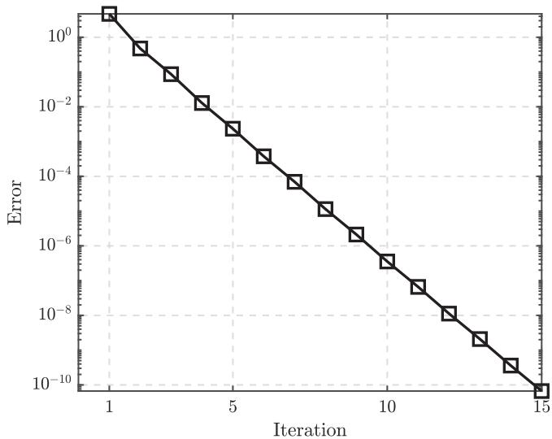  
Fig. 5. Convergence ratio of the HBM.

Once the system is built, it is implemented in the RT-LAB environment from OPAL-RT. The impedance models are identified in both simulators to validate our proposal. The outcomes are shown in Fig. 8 for $Z _ { l } ,$ , which depends on the two TLs and VSC-2 with its respective closed-loop control system.

The FSM is highly sensitive to the value of the integration step time; in order to get better results, the step time should be low; nonetheless, this impacts the time taken to conduct the simulations. On the other

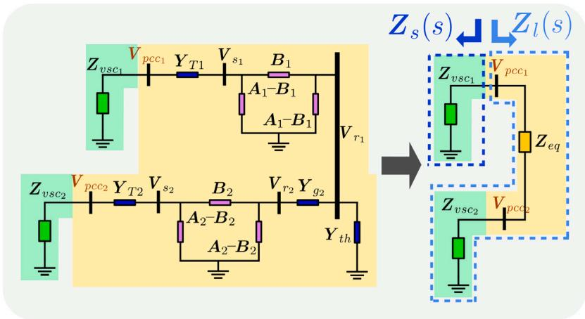  
Fig. 6. Impedance model of the test system.

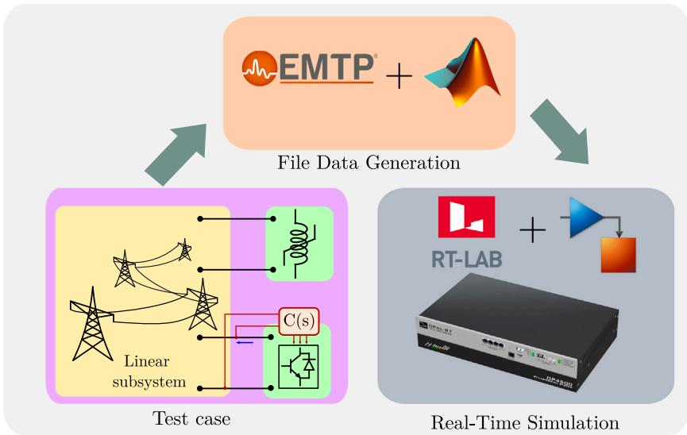  
Fig. 7. Real-time implementation of the test system in OPAL-RT/EMTP-RV/Matlab.

hand, real-time simulators also have some constraints related to the minimum time step size allowed due to it can occur overruns during the simulation. In Fig. 8, the results of the OP4510 are seen as scatter points in high frequency, which is related to larger time steps. To get better results, the step size should be diminished, but this led to overruns. In the case of offline simulators, such as PSCAD, the step size can have a small value, which gives better results than OP4510. These test results show that our proposal can effectively give the characteristics of the TLs, even better than the FSM based on EMT-type programs; moreover, the comparison of the load subsystem impedance using three different approaches to model the TL is shown in Fig. 9, where the lumped parameter models (short equivalent, and PI circuit) are compared to the wideband TL model.

The outcomes show that the short model of the TL is quite similar to the wideband model in low frequency, but it cannot capture dynamics in the order of thousands of Hz. Regarding the PI equivalent, it is seen that both models, PI and wideband, are similar. Still, the lumped parameter model cannot precisely represent the resonance peaks of the transmission line. On the other hand, our proposal can

detail the high-order dynamics related to the effects of distributed and frequency-dependent parameters. The simulations were performed with an integration step of 1 μs for PSCAD and 25 μs for OP4510. The longer computation times required by the EMT-type professional programs are not attributable to them, but to the multiple simulation required by the FSM we use.

# 5.2. Stability assessment

Once the impedance models have been validated, our proposal can be used to study different operating conditions in the system to evaluate the sensitivity of the system to parametric changes. In this way, the linear representation should provide insights into the nonlinear model. To show that the stability properties are well preserved, here, changes in the bandwidth tuning of the inner-current control will be evaluated in the axis ?? of VSC-1. To develop this activity, the eigenvalue traces of the open-loop gain $L ( j \omega ) ~ = ~ Z _ { l } ( j \omega ) Z _ { v s c 1 } ^ { - 1 } ( j \omega )$ are computed, and the encirclements around the critical point (−1,0) are determined. The traces of $\lambda _ { 1 } ( j \omega ) , ~ \lambda _ { 2 } ( j \omega )$ are shown for several bandwidths (BWs) in

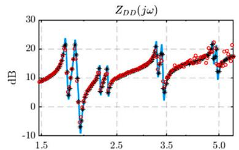

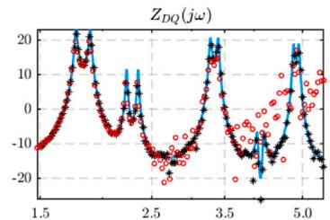

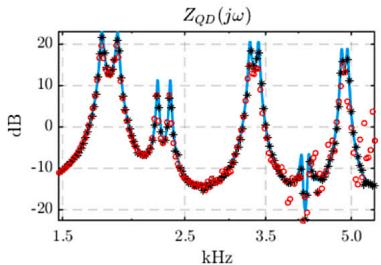

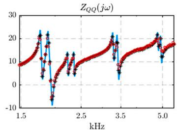  
(a) Magnitude $Z _ { l } ( j \omega )$

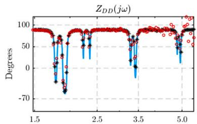

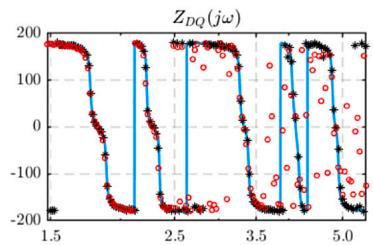

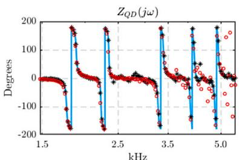

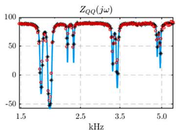  
(b) Phase $Z _ { l } ( j \omega )$

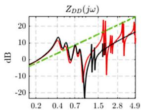  
Fig. 8. Impedance model of load subsystem at PCC1: proposal (–), PSCAD/EMTDC (∗), OP4510 (o).

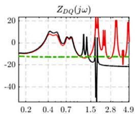

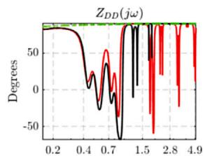

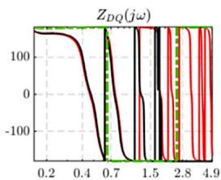

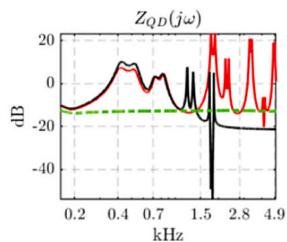

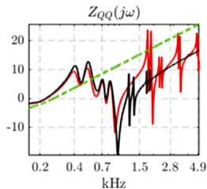

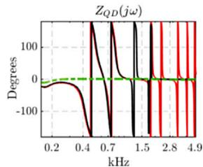

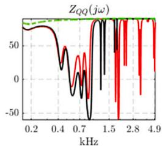  
(a) Magnitude $Z _ { l } ( j \omega )$   
(b） Phase $Z _ { l } ( j \omega )$   
Fig. 9. Comparison of impedance models of load subsystem at PCC1 using different models of TLs: short equivalent model (- -), PI equivalent model (—), distributed and frequency-dependent model (—).

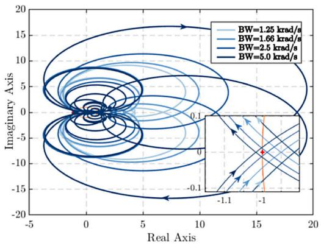  
(a) $\lambda _ { 1 } ( j \omega )$

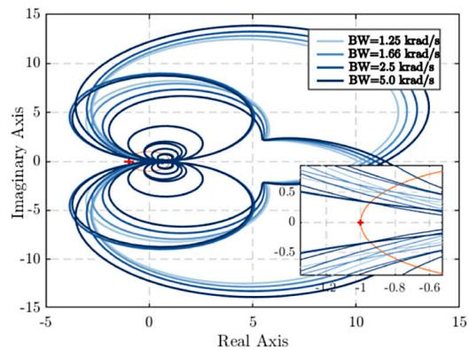  
(b) $\lambda _ { 2 } ( j \omega )$   
Fig. 10. Effects of the current control bandwidth (BW) in VSC-1 on the stability seen from PCC1: 1.25 krad/s (–), 1.66 krad/s (–), 2.5 krad/s $( - ) ,$ 5.0 krad/s (–).

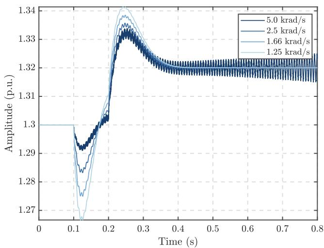  
Fig. 11. Time-domain simulations of $v _ { d c }$ using several bandwidths.

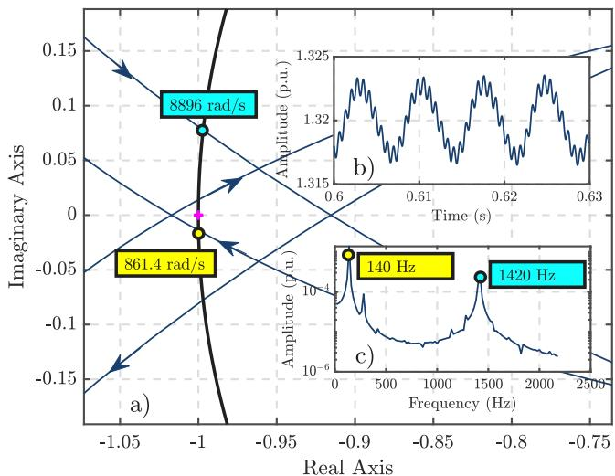  
Fig. 12. Determination of the frequency of the unstable oscillations with the impedance models at PCC1: (a) Nyquist trace of $\lambda _ { 1 } ,$ (b) Time-domain response of $v _ { d c } ,$ (c) Frequency components in $v _ { d c } .$ .

Fig. 10. The system is initially tuned with BW = 1250 rad/s and is stable since the traces do not go around the critical point. Later, as this value is increased, the traces of $\lambda _ { 1 }$ get closer and closer to (−1,0). Finally, with BW = 5000 rad/s, the system loses stability.

Time-domain simulations are carried out to verify these outcomes. The system is simulated until it reaches its steady-state condition, then the gains of the current control are re-tuned, and a small reference change in $v _ { d c } ^ { \ast }$ is applied: from 1.3 p.u. to 1.32 p.u. The response of $v _ { d c } \ \mathrm { \bf ~ c a n }$ be seen in Fig. 11: the system operates in steady state, in $t \ = \ 0 . 1 \ s ,$ the control is switched, changing its bandwidth, and in $\textit { t } = \ 0 . 2 \textit { s }$ the reference change is applied. It is observed that the nonlinear model perfectly matches the outcomes from the impedance models, so this confirms that our proposal can also effectively preserve the stability properties of the system. By judging the trace of $\lambda _ { 1 } ( j \omega ) ,$ , the frequency of the unstable oscillations can be determined; this is done in Fig. 12-(a) by finding the nearest points where $\lambda _ { 1 } ( j \omega )$ cuts the unitary circle around the critical point (−1,0). In this case, it was seen that the unstable oscillations could have frequencies of 137.09 Hz and 1415.84 Hz. Taking a window time in the response of $v _ { d c }$ shown in Fig. 12-(b), components of 140 Hz and 1420 Hz were found as depicted

Fig. 12-(c), confirming that the proposal retains the dynamical features of the nonlinear model.

Regarding to the stability assessment using lumped parameter models, these could provide inaccurate results; Fig. 13 shows the Nyquist traces of $\lambda _ { 1 }$ when the bandwidth in the current control of the D axis is 5 krad/s for the impedance matrices at PCC1. In the case of the short equivalent model, the system is predicted to be stable because the critical point is not encircled, and the Nyquist trace for the PI equivalent shows an encirclement clockwise, so the system is unstable. However, the detected frequencies are different from the ones found using the wideband TL model. These frequencies are 136.07 Hz and 918 Hz.

The stability can also be checked in the PCC2; however, for the case when the bandwidth of the ??-axis current control is 5 krad/s, the Nyquist traces do not encircle the critical point, as Fig. 14 shows. This result does not match the previous one when the stability is evaluated in PCC1, but this happens because the impedance models change according to the interface point. This can also lead to pole-zero cancellations in the transfer functions, which cannot be assessed from the

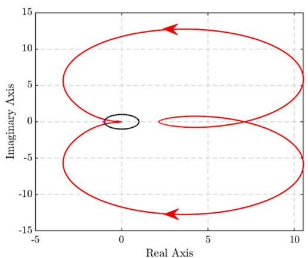  
(a) Short equivalent model

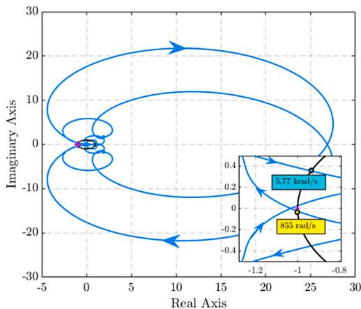  
(b）PI equivalent model   
Fig. 13. Assessment of the stability with lumped parameter models of the transmission line for the impedance models at PCC1.

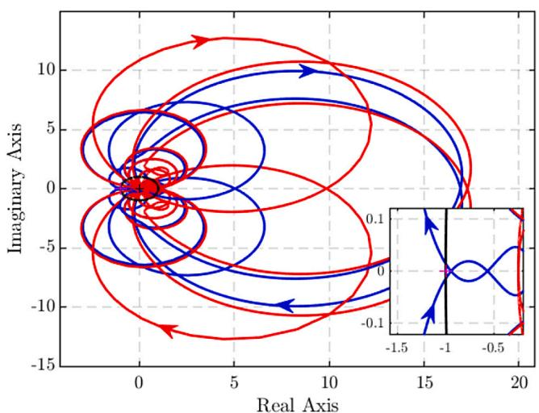  
Fig. 14. Nyquist diagrams when the impedances are computed in PCC2, with a bandwidth of ??-axis current control of 5 krad/s.

Nyquist traces alone. To confirm that our proposal correctly calculates the impedance in PCC2, the time domain response is obtained using the inverse numerical Laplace transform [38]. This tool utilizes the impedance of both subsystems to determine the time response, avoiding the need to draw Nyquist plots, count critical point encirclement, and calculate the open-loop poles of the loop gain. The results are shown in Fig. 15. The waveform is the D-axis current in the terminals of VSC-2 as the DC voltage reference of VSC-1 changes from 1.3 p.u. to 1.302 p.u. during 10 μs, then returns to 1.3 p.u. It can be seen that the impedance models retain stability because the waveform is unstable. In addition, the oscillations agree very well with those found in the Nyquist plots computed in PCC1.

# 6. Conclusions

This document has proposed a hybrid method to accurately incorporate the frequency-dependent and distributed parameter effects of ideally transposed TLs into electrical networks with penetration of PEDs to compute impedance models of TLs in the ???? framework. The proposal overcomes two critical issues presented in these systems,

the determination of the steady state and the preservation of the non-rationality/frequency dependency of the TLs models, using the HBM and the analytical solution in the frequency domain of the TL model with the Park transform in the frequency domain, respectively. It was seen that the proposal avoids the necessity of time-domain simulations in EMT-type programs, rational fitting techniques and FFT, giving a more accurate outcome that is computationally much less intensive. A test case was used to compare the proposal with the FSM implemented in the real-time simulator OP4510 using ARTEMiS/EMTP-RV, and in the offline simulator PSCAD/EMTDC; in both cases, the outcomes showed a good match with the proposal. In addition, timedomain simulations highlighted that the stability properties are also well preserved, validating our method. Modeling of unbalanced TLs, cables, DC lines, double-circuit overhead lines, and other configurations can be addressed in future works.

# CRediT authorship contribution statement

Julio Hernández-Ramírez: Conceptualization, Formal analysis, Investigation, Validation, Writing – original draft, Writing – review & editing. Juan Segundo-Ramírez: Conceptualization, Formal analysis, Investigation, Methodology, Supervision, Writing – review & editing. Marta Molinas: Methodology, Supervision, Validation, Writing – review & editing.

# Declaration of competing interest

The authors declare the following financial interests/personal relationships which may be considered as potential competing interests: This work was supported by Consejo Nacional de Humanidades, Ciencia y Tecnología (CONAHCYT) under Project CF 2019/1311344 and under the PhD scholarship 746757. If there are other authors, they declare that they have no known competing financial interests or personal relationships that could have appeared to influence the work reported in this paper.

# Data availability

No data was used for the research described in the article.

# Acknowledgment

We would like to thank the Consejo Nacional de Humanidades, Ciencia y Tecnología (CONAHCYT) under Project CF 2019 1311344 and under the PhD scholarship 746757 for funding this research work.

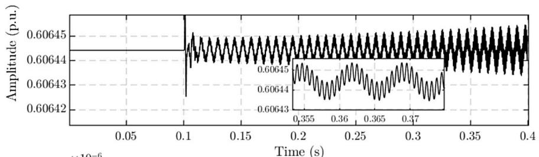

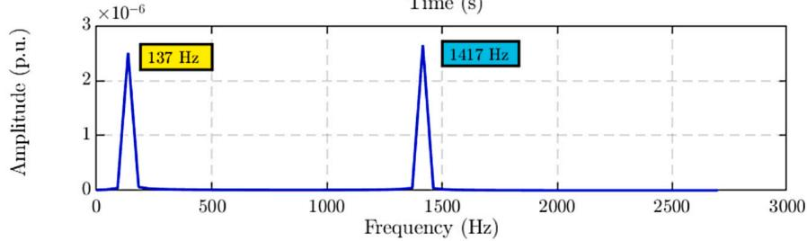  
Fig. 15. Time-domain response using the impedance models and the inverse numerical Laplace transform, bandwidth of ??-axis current control in VSC1 of 5 krad/s.

# References

[1] Q. Peng, Q. Jiang, Y. Yang, T. Liu, H. Wang, F. Blaabjerg, On the stability of power electronics-dominated systems: Challenges and potential solutions, IEEE Trans. Ind. Appl. 55 (6) (2019) 7657–7670, http://dx.doi.org/10.1109/TIA.2019. 2936788.   
[2] W. Dong, H. Xin, D. Wu, L. Huang, Small signal stability analysis of multiinfeed power electronic systems based on grid strength assessment, IEEE Trans. Power Syst. 34 (2) (2019) 1393–1403, http://dx.doi.org/10.1109/TPWRS.2018. 2875305.   
[3] X. Wang, F. Blaabjerg, Harmonic stability in power electronic-based power systems: Concept, modeling, and analysis, IEEE Trans. Smart Grid 10 (3) (2019) 2858–2870, http://dx.doi.org/10.1109/TSG.2018.2812712.   
[4] W. Dong, H. Xin, D. Wu, L. Huang, Small signal stability analysis of multiinfeed power electronic systems based on grid strength assessment, IEEE Trans. Power Syst. 34 (2) (2019) 1393–1403, http://dx.doi.org/10.1109/TPWRS.2018. 2875305.   
[5] N. Hatziargyriou, J. Milanovic, C. Rahmann, V. Ajjarapu, C. Canizares, I. Erlich, D. Hill, I. Hiskens, I. Kamwa, B. Pal, P. Pourbeik, J. Sanchez-Gasca, A. Stankovic, T. Van Cutsem, V. Vittal, C. Vournas, Definition and classification of power system stability – Revisited & extended, IEEE Trans. Power Syst. 36 (4) (2021) 3271-3281,http://dx.doi.0rg/10.1109/TPWRS.2020.3041774   
[6] P. Kundur, N. Balu, Power system stability and control, EPRI Power System Engineering Series, McGraw-Hill, ISBN: 9780780334632, 1994, URL https:// books.google.com.mx/books?id=0fPGngEACAAJ.   
[7] Y. Liao, X. Wang, Small-signal modeling of AC power electronic systems: Critical review and unified modeling, IEEE Open J. Power Electron. 2 (2021) 424–439, http://dx.doi.org/10.1109/OJPEL.2021.3104522.   
[8] J. Segundo-Ramirez, A. Bayo-Salas, M. Esparza, J. Beerten, P. Gómez, Frequency domain methods for accuracy assessment of wideband models in electromagnetic transient stability studies, IEEE Trans. Power Deliv. 35 (1) (2020) 71–83, http: //dx.doi.org/10.1109/TPWRD.2019.2927171.   
[9] T. Roose, A. Lekić, M.M. Alam, J. Beerten, Stability analysis of high-frequency interactions between a converter and HVDC grid resonances, IEEE Trans. Power Deliv. 36 (6) (2021) 3414–3425, http://dx.doi.org/10.1109/TPWRD.2020. 3041176.   
[10] M. Nakhla, J. Vlach, A piecewise harmonic balance technique for determination of periodic response of nonlinear systems, IEEE Trans. Circuits Syst. 23 (2) (1976) 85–91, http://dx.doi.org/10.1109/TCS.1976.1084181.   
[11] J. Hernández-Ramírez, J. Segundo-Ramírez, Small-signal models of transmission lines oriented to the impedance-based method, in: 2022 IEEE International Autumn Meeting on Power, Electronics and Computing, Vol. 6, ROPEC, 2022, pp. 1–6, http://dx.doi.org/10.1109/ROPEC55836.2022.10018722.   
[12] X. Lu, W. Xiang, W. Lin, J. Wen, Analysis of wideband oscillation of hybrid MMC interfacing weak ac power system, IEEE J. Emerg. Sel. Top. Power Electron. 9 (6) (2021) 7408–7421, http://dx.doi.org/10.1109/JESTPE.2020.3024740.   
[13] I.J. Perez-arriaga, G.C. Verghese, F.C. Schweppe, Selective modal analysis with applications to electric power systems, PART I: Heuristic introduction, IEEE Trans. Power Appar. Syst. PAS-101 (9) (1982) 3117–3125, http://dx.doi.org/ 10.1109/TPAS.1982.317524.   
[14] J. Sun, Impedance-based stability criterion for grid-connected inverters, IEEE Trans. Power Electron. 26 (11) (2011) 3075–3078, http://dx.doi.org/10.1109/ TPEL.2011.2136439.

[15] W. Liu, J. Shair, S. Wu, X. Xie, Oscillatory stability region analysis of blackbox cigs, IEEE Transactions on Power Electronics 37 (8) (2022) 8780–8784, http://dx.doi.org/10.1109/TPEL.2022.3155782.   
[16] H. Gong, X. Wang, D. Yang, DQ-frame impedance measurement of threephase converters using time-domain MIMO parametric identification, IEEE Trans. Power Electron. 36 (2) (2021) 2131–2142, http://dx.doi.org/10.1109/TPEL. 2020.3007852.   
[17] M. Amin, M. Molinas, J. Lyu, X. Cai, Impact of power flow direction on the stability of VSC-HVDC seen from the impedance nyquist plot, IEEE Trans. Power Electron. 32 (10) (2017) 8204–8217, http://dx.doi.org/10.1109/TPEL. 2016.2608278.   
[18] Y. Tu, J. Liu, Z. Liu, D. Xue, L. Cheng, Impedance-based analysis of digital control delay in grid-tied voltage source inverters, IEEE Trans. Power Electron. 35 (11) (2020) 11666–11681, http://dx.doi.org/10.1109/TPEL.2020.2987198.   
[19] P. De Rua, J. Beerten, Generalization of harmonic state-space framework to delayed periodic systems for stability analysis of the modular multilevel converter, IEEE Trans. Power Deliv. 37 (4) (2022) 2661–2672, http://dx.doi.org/10.1109/ TPWRD.2021.3113702.   
[20] J. Martinez-Velasco, A. Ramirez, M. Davila, Overhead Lines in Power System Transients: Parameter Determination, CRC Press, Boca Raton FL, 2009.   
[21] Y. Song, E. Ebrahimzadeh, F. Blaabjerg, Analysis of high-frequency resonance in DFIG-based offshore wind farm via long transmission cable, IEEE Trans. Energy Convers. 33 (3) (2018) 1036–1046, http://dx.doi.org/10.1109/TEC.2018. 2794367.   
[22] S. D’Arco, J.A. Suul, J. Beerten, Configuration and model order selection of frequency-dependent PI models for representing DC cables in small-signal eigenvalue analysis of HVDC transmission systems, IEEE J. Emerg. Sel. Top. Power Electron. 9 (2) (2021) 2410–2426, http://dx.doi.org/10.1109/JESTPE. 2020.2976046.   
[23] G.D. Agundis-Tinajero, J. Segundo-Ramírez, N. Visairo-Cruz, R. Peña-Gallardo, Stability and resonance analysis of AC power electronics-based systems, in: 2018 IEEE International Autumn Meeting on Power, Electronics and Computing, ROPEC, 2018, pp. 1–5, http://dx.doi.org/10.1109/ROPEC.2018.8661461.   
[24] J. Belikov, Y. Levron, Integration of long transmission lines in large-scale dq0 dynamic models, Electr. Eng. 100 (2018) 1219–1228, http://dx.doi.org/10.1007/ s00202-017-0582-7.   
[25] J. Belikov, Y. Levron, A sparse minimal-order dynamic model of power networks based on dq0 signals, IEEE Trans. Power Syst. 33 (1) (2018) 1059–1067, http: //dx.doi.org/10.1109/TPWRS.2017.2702746.   
[26] W. Zhou, R.E. Torres-Olguin, M.K. Zadeh, B. Bahrani, Y. Wang, Z. Chen, Electromagnetic oscillation origin location in multiple-inverter-based power systems using components impedance frequency responses, IEEE Open J. Ind. Electron. Soc. 2 (2021) 1–20, http://dx.doi.org/10.1109/OJIES.2020.3045620.   
[27] W. Zhou, R.E. Torres-Olguin, F. Göthner, J. Beerten, M.K. Zadeh, Y. Wang, Z. Chen, A robust circuit and controller parameters’ identification method of grid-connected voltage-source converters using vector fitting algorithm, IEEE J. Emerg. Sel. Top. Power Electron. 10 (3) (2022) 2748–2763, http://dx.doi.org/ 10.1109/JESTPE.2021.3059568.   
[28] W. Zhou, R. E. Torres-Olguin, Y. Wang, Z. Chen, DQ impedance-decoupled network model-based stability analysis of offshore wind power plant under weak grid conditions, IET Power Electron. (ISSN: 1755-4535) 13 (13) (2020) 2715–2729, http://dx.doi.org/10.1049/iet-pel.2019.1575.   
[29] F. Castellanos, J. Marti, Full frequency-dependent phase-domain transmission line model, IEEE Trans. Power Syst. 12 (3) (1997) 1331–1339, http://dx.doi.org/10. 1109/59.630478.

[30] F. Marcano, J. Marti, Idempotent line model: Case studies, in: Int. Conf. Power Syst. Transients, Seattle, WA, 1997.   
[31] A. Bayo-Salas, J. Beerten, D. Van Hertem, Analytical methodology to develop frequency-dependent equivalents in networks with multiple converters, in: 2017 IEEE Manchester PowerTech, 2017, pp. 1–6, http://dx.doi.org/10.1109/PTC. 2017.7980938.   
[32] T. Roose, A. Lekić, M.M. Alam, J. Beerten, Stability analysis of high-frequency interactions between a converter and HVDC grid resonances, IEEE Trans. Power Deliv. 36 (6) (2021) 3414–3425, http://dx.doi.org/10.1109/TPWRD.2020. 3041176.   
[33] Y. Song, C. Breitholtz, Nyquist stability analysis of an AC-grid connected VSC-HVDC system using a distributed parameter DC cable model, IEEE Trans. Power Deliv. 31 (2) (2016) 898–907, http://dx.doi.org/10.1109/TPWRD.2015.2501459.   
[34] X. Peng, H. Yang, Stability analysis of multi-paralleled grid-connected inverters including distribution parameter characteristics of transmission lines, CSEE J. Power Energy Syst. 7 (1) (2021) 93–104, http://dx.doi.org/10.17775/CSEEJPES. 2019.01530.

[35] W. Zhou, Y. Wang, Z. Chen, Impedance-based modelling method for lengthscalable long transmission cable for stability analysis of grid-connected inverter, in: 2018 IEEE 4th Southern Power Electronics Conference, SPEC, 2018, pp. 1–8, http://dx.doi.org/10.1109/SPEC.2018.8635872.   
[36] G. Francis, R. Burgos, D. Boroyevich, F. Wang, K. Karimi, An algorithm and implementation system for measuring impedance in the D-Q domain, in: 2011 IEEE Energy Conversion Congress and Exposition, 2011, pp. 3221–3228, http: //dx.doi.org/10.1109/ECCE.2011.6064203.   
[37] J. Segundo-Ramírez, J. Hernández-Ramírez, N. Visairo-Cruz, C.A.N.n. Guitiérrez, Finite-difference-impedance method for time-delay systems, IEEE Access 10 (2022) 105758–105769, http://dx.doi.org/10.1109/ACCESS.2022.3211951.   
[38] P. Moreno, A. Ramirez, Implementation of the numerical Laplace transform: A review task force on frequency domain methods for EMT studies, working group on modeling and analysis of system transients using digital simulation, general systems subcommittee, IEEE power engineering society, IEEE Trans. Power Deliv. 23 (4) (2008) 2599–2609, http://dx.doi.org/10.1109/TPWRD.2008.923404.