# 考虑中间变压器饱和特性的电容式电压互感器宽频非线性模型

司马文霞 1 ，王惠 1 ，杨鸣 1*，周原 2 ，彭代晓 3 ，舒想 2

(1．输配电装备及系统安全与新技术国家重点实验室(重庆大学)，重庆市 沙坪坝区 400044；

2．广东电网有限责任公司电力科学研究院，广东省 广州市 510080；

3．三峡机电工程技术有限公司，四川省 成都市 610041)

# Wideband and Nonlinear Model of Capacitive Voltage Transformer Considering the Saturation of Intermediate Transformer

SIMA Wenxia1 , WANG Hui1 , YANG Ming1*, ZHOU Yuan2 , PENG Daixiao3 , SHU Xiang2

(1. State Key Laboratory of Power Transmission Equipment & System Security and New Technology (Chongqing University),

Shapingba District, Chongqing 400044, China;

2. Electric Power Research Institute of Guangdong Power Grid Co., Ltd., Guangzhou 510080, Guangdong Province, China;

3. China Three Gorges Mechanical and Electrical Engineering Co., Ltd., Chengdu 610041, Sichuan Province, China)

ABSTRACT: Capacitive voltage transformer (CVT) provides reliable voltage signals for power system metering, protection and control devices. However, the transient response error of CVTs is so large that may cause problems such as distance protection overtaking and malfunction. It is necessary to establish an accurate CVT model as a fundamental model of analysis and protection research. The conventional CVT models with frequency characterization capabilities are mostly linear models, making it hard to consider nonlinearity influence of intermediate transformer iron-core-built components on voltage transmission. And there are other problems such as passive correction and order reduction when modeling, resulting in a sharp increase in the response error of the model in a specific frequency band or when the core of intermediate transformer is saturated. Therefore, power system protection strategies based on it may fail. This paper proposed a method to discretize CVT port scattering parameters in the state equation and established a CVT wideband admittance sub-model through Norton equivalent to characterize the frequency characteristics of CVT. Based on the principle of electromagnetic duality, a power-frequency nonlinear sub-model of CVT was established to characterize the

nonlinearity of the excitation characteristics of the intermediate transformer. Then the two sub-model were coupled in parallel after admittance mutual difference, and a CVT wideband nonlinear coupling model considering the saturation of intermediate transformer was obtained. After parameters identification, the coupling model of a typical 35kV CVT was established. Low-frequency inrush current, voltage transfer characteristic and lightning impulse voltage tests were designed to validate the nonlinearity and frequency characteristics of the coupling CVT model. Results indicate that when the core of intermediate transformer is saturated, the first peak amplitude of inrush current simulation error of the CVT model proposed in this paper was 1.71%, far lower than the conventional CVT model (77.79%). The simulation normalized mean square error (NMSE) of voltage transfer characteristic in 5Hz~1MHz is 0.91% and simulation error of the first peak amplitude of lightning impulse voltage is 3.11%, which demonstrates its accuracy for frequency characteristics and nonlinearity. This model can provide a fundamental model for electromagnetic transient simulation research involving CVT.

KEY WORDS: capacitive voltage transformer; nonlinearity; frequency characteristics; discrete state equation; admittance mutual difference

摘要：电容式电压互感器(capacitive voltage transformer，CVT)为电力系统计量、保护和控制装置提供可靠的电压信号。然而其暂态响应误差大，可能引发距离保护超越和误动作等问

题，需建立精确的 CVT 模型为电力系统分析与保护研究提供基础模型。然而现有具备宽频表征能力的 CVT 模型多为线性模型，难以兼顾中间变压器铁芯组件对其电压传输特性的影响，且建模过程存在无源修正和降阶等问题，导致模型在特定频段或中间变压器铁芯饱和时的响应误差激增，基于此的电力系统保护策略可能失效。该文提出将 CVT 端口散射参数在状态方程中进行离散化表征的方法，进而通过诺顿等价建立CVT 宽频导纳子模型，表征整体CVT的宽频电压传输特性；基于电磁对偶原理建立 CVT 工频非线性子模型，表征中间变压器铁芯励磁特性的饱和差异性；对 2 个子模型进行导纳互差后再进行并联耦合，建立考虑中间变压器铁芯饱和特性的 CVT 宽频非线性模型。对典型 35kV CVT进行参数辨识和模型构建，针对其非线性和频率特性表征能力，分别设计低频涌流、电压传递特性测试和雷电冲击电压试验。结果表明，与传统 CVT 模型相比，该文提出的 CVT模型在中间变压器铁芯饱和时的低频涌流首峰幅值仿真误差从 77.79%降低至 1.71%，在 5Hz~1MHz 范围内电压传递特性仿真归一化均方误差为 0.91%，雷电冲击电压首峰值仿真误差为 3.11%。试验证明所提出的 CVT 模型能够表征CVT的频率特性和非线性特性，可为涉及CVT的电磁暂态仿真研究提供基础模型。

关键词：电容式电压互感器；非线性；频率特性；离散状态 方程；导纳互差

# 0 引言

电容式电压互感器(capacitive voltage transformer，CVT)为 35kV及以上电力系统的测量、保护和控制装置提供可靠的电压信号[1]。然而，由于 CVT 内部储能元件和非线性元件的存在[2]，CVT 的传输特性极为复杂[3]，一旦系统发生暂态过程，如开关操作和雷电冲击[2]等因素引起的高幅值、高频暂态激励CVT，其传输误差激增；ABB 研究表明其传输误差会随着幅值和频率的变化而呈现出复杂的变化[4]，难以满足电网高幅值、宽频域[5]暂态电压的测量需求。因此，需建立准确的 CVT 模型以模拟 CVT在复杂暂态下的响应信号，为电力系统电能计量和继电保护等相关研究提供可靠数据源。

由于 CVT 具有复杂的结构和响应特性，其电磁暂态建模的难题是频率特性和非线性的精准表征。工频情况下，CVT 依赖补偿电抗器与电容分压器谐振提高精度和带载能力[6]，低压侧输出与高压侧输入满足线性关系，一旦频率改变，CVT 的谐振条件打破，表现出明显的频率特性[1]。文献[7]对影响 CVT 高频传输特性的因素进行研究，从 CVT结构出发，建立了考虑杂散参数的 CVT 等效电路；研究发现，杂散电容是导致 CVT 传输特性随着频

率发生变化的重要因素[8]。然而，考虑杂散电容精细分布的 CVT 模型拓扑复杂，参数辨识困难[9]，杂散电容的微小变化都会对仿真结果造成影响。

为了分析高频范围内 CVT 响应特性对系统测量保护等仿真的影响[10]，大部分学者通过将 CVT等效为二端口网络，采用具有端口等价性的黑盒模型[11]构建具有频率特性的CVT宽频模型，模型包含电容分压器和电磁单元及其杂散参数的影响，且无需计算内部参数。常见黑盒模型辨识方法有脉冲法[12]和扫频法[12]，两者均具有较好的高频暂态模拟性能，然而，传统脉冲法测量精度受设备容量、采样频率等多种因素影响，往往难以同时满足低频段和高频段的测量要求，需开展多次测试，计算复杂；而散射参数测量方法简单，参数获取容易，易于转化为其他参数，对于 CVT 宽频建模具有通用性。因此，本文基于散射参数和矢量匹配[13-14]构建 CVT宽频模型。但是由于CVT内部结构复杂，建模过程中容易出现拟合阶数高、无源修正困难等问题[15]，导致电路综合[15]后电路元件众多，结构复杂，甚至精度降低。更重要的是，用于测量散射参数的网络分析仪输出为低压信号，仅当 CVT 工作在线性区时具有等价性，在测量 CVT 内部铁芯组件等非线性参数时存在较大误差，难以准确仿真涉及 CVT铁芯非线性的电磁暂态[16]。

CVT 铁芯非线性[17-18]的精准表征是 CVT 电磁暂态建模的难题之一。由于 CVT 中可表现出非线性的元件有补偿电抗器、中间变压器和阻尼器[8]。通常，补偿电抗器在 4倍额定电压下可被当作线性电抗处理[8]；阻尼器为谐振型，由线性元件构成[8]；对于中间变压器，次同步振荡引入的 20Hz 及以下低频信号和铁磁谐振[19]均可能导致中间变压器铁芯饱和，打破 CVT 正常运行状态下高压侧与低压侧的线性关系[20]，导致低压侧输出电压波形畸变，将错误的信息传递给保护继电器，影响继电保护的正确动作；严重时，谐振产生的过电压或过电流可能引起 CVT 爆炸[21]。可见，中间变压器铁芯饱和是 CVT 非线性的主要表现形式，通过对中间变压器铁芯的饱和特性进行准确表征，可提高 CVT 模型的非线性仿真精度[22]。

目前，考虑中间变压器铁芯饱和特性的CVT模型大部分采用 2 个漏感和 1 个励磁支路的 T 模型[1]对铁芯的非线性磁化特性进行简化表征。但是，T模型参数与中间变压器结构不具备严格的一一对应

关系[23]，一旦中间变压器进入深度饱和状态，漏感会限制流入励磁支路的电流[23]，与实际情况不符，仿真精度受限。而且深度饱和后，中间变压器铁芯的不同位置具有不同的励磁特性，而具备2条励磁支路的电磁对偶模型[24]不仅可以保证励磁参数与设备的拓扑结构直接对应，物理意义明确，而且可以实现中间变压器双励磁支路饱和差异性的准确表征。然而，目前CVT深度饱和特性的测量及分配仅依赖一个深度饱和数据点进行表征[1,25]，描述过于简单，忽略了铁芯饱和过程中增量电感[26]逐渐减小的渐变过程，难以精确表征铁芯不同位置的饱和差异性。

此外，部分复杂情况下，电磁暂态可能同时涉及频率特性和非线性，如：当系统短路时，通过断路器切除故障产生的瞬态恢复过电压[16]。在进行此类仿真时，基于散射参数的宽频模型无法表征 CVT的非线性特性，即难以通过单一的模型获得准确的结果。因此，为提高模型的精度，扩展模型的适用范围，亟需建立一个可同时准确表征频率特性和非线性的 CVT宽频非线性模型。

文献[27]提出将传统工频模型和黑盒模型进行并联扩展的方法。但是，该方法仅针对电磁单元建立黑盒模型，需进行无源性判断及修正，且未考虑铁芯组件的非线性建模。针对该问题，本文提出一种基于导纳互差法的CVT宽频与非线性并联耦合模型。其中，工频支路基于电磁对偶原理，建立具有双励磁支路并联结构的 CVT 工频非线性子模型，通过描述中间变压器铁芯饱和后心柱和旁柱饱和程度的差异[26]，实现考虑中间变压器铁芯饱和的 CVT非线性暂态的精准仿真。宽频支路采用基于散射参数的状态方程法[28]，包含电容分压器和电磁单元及其杂散参数的影响，可准确表征整体 CVT 在中间变压器线性区的频率特性。为降低耦合误差，对端口测量得到的宽频测量导纳参数与工频非线性子模型计算导纳参数进行作差运算后，再通过并联 2个子模型，建立可以精准表征非线性、低频暂态和高频暂态的 CVT 宽频非线性模型。最后，对典型35kV的 CVT 进行参数辨识和模型构建，设计试验验证本文模型的频率特性和非线性表征能力。

# 1 CVT宽频非线性模型构建原理

# 1.1 CVT 宽频非线性模型结构

典型 CVT 电气原理图如图 1 所示。其中高压电容 $C _ { 1 }$ 和中压电容 $C _ { 2 }$ 组成了 CVT 的电容分压单

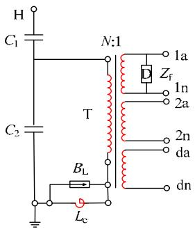  
图1 CVT 电气原理图  
Fig. 1 Electrical schema of CVT

元，补偿电抗器和中间变压器组成了 CVT 的电磁单元， $B _ { \mathrm { L } }$ 为限压器， $Z _ { \mathrm { f } }$ 为阻尼器。其中，高压端电压经电容分压器降至中压，后经过中间变压器进一步降低为继电器输入等级信号[29]。中间变压器通常为四绕组式，主二次绕组用于提供计量、保护信号，辅助二次绕组使用时采用开口三角形接法，构成系统零序电压保护[17]。额定条件下，补偿电抗器与电容分压器满足谐振的关系[6]，补偿因电容分压引起的相位差。

由于电容、非线性电抗等动态储能元件及杂散参数的存在，CVT 具有明显的频率特性和非线性，导致瞬态响应复杂，现有模型仿真结果受限。因此，本文采用导纳互差法实现 CVT 的宽频非线性耦合建模，模型结构如图 2 所示。图 2 中， $\mathrm { P } _ { 1 1 } , \ \mathrm { P } _ { 1 2 } ,$ 、$\mathrm { P } _ { 2 1 }$ 、 $\mathrm { P } _ { 2 2 }$ 分别为端子名称，通过连接工频非线性子模型和宽频导纳子模型对应端子，可实现宽频非线性模型构建。其中，工频支路采用基于电磁对偶原理的工频非线性子模型，能够表征中间变压器铁芯的饱和差异性；宽频支路采用基于宽频支路导纳参数 Y 的黑盒模型，为降低耦合误差，需从宽频测量导纳参数 $\pmb { Y _ { \mathrm { w } } }$ 中剥离工频计算导纳参数 $Y _ { 5 0 }$ 的影响，也即导纳互差法。宽频支路采用离散状态方程迭代计算。

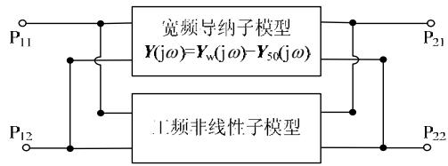  
图 2 CVT 的宽频非线性模型结构  
Fig. 2 Structure of wideband and nonlinear model of CVT1.2 基于电磁对偶原理的 CVT 工频非线性子模型

中间变压器铁芯饱和是 CVT 非线性的主要表现形式。因此，本文基于电路和磁路的对偶变换关系[24]，提出基于正确中间变压器拓扑的 CVT 工频非线性子模型，如图 3 所示。其中， $R _ { \mathrm { s l } } ^ { \prime }$ 和 $R _ { \mathrm { s } 2 }$ 是归

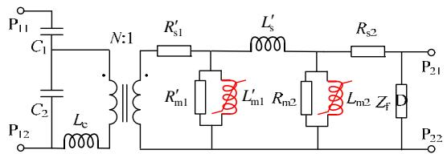  
图3 基于电磁对偶原理的CVT 工频非线性子模型  
Fig. 3 Power-frequency and nonlinear sub-model of CVT based on principle of electromagnetic duality

算到低压侧的高压侧和低压侧绕组电阻； $L _ { \mathrm { s } } ^ { \prime }$ 表示归算后绕组之间的漏感；非线性电抗 $L _ { \mathrm { m 1 } } ^ { \prime }$ 和 $L _ { \mathrm { m } 2 }$ 以及并联电阻 $R _ { \mathrm { m 1 } } ^ { \prime }$ 和 $R _ { \mathrm { m } 2 }$ 分别代表折算后高压侧和低压侧的励磁电抗和铁损电阻。

其中，绕组电阻和漏感可由短路试验测得，铁损电阻及非饱和部分励磁曲线可由开路试验数据均分获取[26]。深度饱和试验采用带直流偏置的交流小信号[30]，通过改变直流偏置的大小，获取不同饱和程度下的电压和电流数据，利用文献[26]方法计算电磁对偶模型各励磁支路对应的-i 曲线，并以增量电抗[26]为斜率，对-i 曲线进行延伸，实现对铁芯深度饱和过程及其差异性的精准测量。

# 1.3 基于离散状态方程的 CVT 宽频导纳子模型

为解决黑盒模型拟合阶数高，无源修正困难，电路元件众多，结构复杂且与工频支路耦合困难等问题，本文通过导纳互差法，建立剥离工频模型影响的宽频导纳子模型。

# 1.3.1 CVT宽频支路导纳参数提取

首先，通过端口测试获取包含电容分压器和电磁单元及其杂散参数影响的 CVT 散射参数：

$$
\boldsymbol {S} = \left[ \begin{array}{l l} S _ {1 1} & S _ {1 2} \\ S _ {2 1} & S _ {2 2} \end{array} \right] \tag {1}
$$

计算 CVT 宽频测量导纳参数矩阵[28]：

$$
\boldsymbol {Y} _ {\mathrm {w}} (\omega) = \left[ \begin{array}{l l} Y _ {1 1 \mathrm {w}} (\omega) & Y _ {1 2 \mathrm {w}} (\omega) \\ Y _ {2 1 \mathrm {w}} (\omega) & Y _ {2 2 \mathrm {w}} (\omega) \end{array} \right] \tag {2}
$$

其中：

$$
\left\{ \begin{array}{l} Y _ {1 1 \mathrm {w}} = \frac {\left(1 - S _ {1 1}\right) \left(1 + S _ {2 2}\right) + S _ {1 2} S _ {2 1}}{Z _ {0} \left[ \left(1 + S _ {1 1}\right) \left(1 + S _ {2 2}\right) - S _ {1 2} S _ {2 1} \right]} \\ Y _ {1 2 \mathrm {w}} = \frac {- 2 S _ {1 2}}{Z _ {0} \left[ \left(1 + S _ {1 1}\right) \left(1 + S _ {2 2}\right) - S _ {1 2} S _ {2 1} \right]} \\ Y _ {2 1 \mathrm {w}} = \frac {- 2 S _ {2 1}}{Z _ {0} \left[ \left(1 + S _ {1 1}\right) \left(1 + S _ {2 2}\right) - S _ {1 2} S _ {2 1} \right]} \\ Y _ {2 2 \mathrm {w}} = \frac {\left(1 + S _ {1 1}\right) \left(1 - S _ {2 2}\right) + S _ {1 2} S _ {2 1}}{Z _ {0} \left[ \left(1 + S _ {1 1}\right) \left(1 + S _ {2 2}\right) - S _ {1 2} S _ {2 1} \right]} \end{array} \right. \tag {3}
$$

式中匹配阻抗 $Z _ { 0 }$ 为 50。

其次，将 CVT 工频非线性子模型中的非线性单元用额定工况下的参数进行线性化处理，计算CVT 工频支路线性模型的导纳参数：

$$
\mathbf {Y} _ {5 0} (\omega) = \left[ \begin{array}{l l} Y _ {1 1, 5 0} (\omega) & Y _ {1 2, 5 0} (\omega) \\ Y _ {2 1, 5 0} (\omega) & Y _ {2 2, 5 0} (\omega) \end{array} \right] \tag {4}
$$

其中：

$$
Y _ {1 1, 5 0} = \left. \frac {I _ {1} ^ {\prime}}{k ^ {2} U _ {1} ^ {\prime}} \right| _ {U _ {2} = 0} \quad Y _ {1 2, 5 0} = - \left. \frac {I _ {1} ^ {\prime}}{k U _ {2}} \right| _ {U _ {1} ^ {\prime} = 0} \tag {5}
$$

$$
Y _ {2 1, 5 0} = - \frac {I _ {2}}{k U _ {1} ^ {\prime}} \Big | _ {U _ {2} = 0} \quad Y _ {2 2, 5 0} = \frac {I _ {2}}{U _ {2}} \Big | _ {U _ {1} ^ {\prime} = 0}
$$

式中：k 为中间变压器变比； $U _ { 1 } ^ { \prime }$ 、 $I _ { 1 } ^ { \prime }$ 为折算到低压侧的 CVT 高压侧电压和电流； $U _ { 2 } , I _ { 2 }$ 为其低压侧电压和电流。具体推导过程和结果参考附录 A。

通过导纳互差求得并联宽频支路导纳参数：

$$
\boldsymbol {Y} (\omega) = \left[ \begin{array}{l l} Y _ {1 1} (\omega) & Y _ {1 2} (\omega) \\ Y _ {2 1} (\omega) & Y _ {2 2} (\omega) \end{array} \right] = \boldsymbol {Y} _ {\mathrm {w}} (\omega) - \boldsymbol {Y} _ {5 0} (\omega) \tag {6}
$$

将宽频支路导纳参数转化为型等效电路，如图 4 所示，其宽频支路导纳参数对应关系为

$$
Y _ {\mathrm {A}} = Y _ {1 1} + Y _ {1 2}
$$

$$
Y _ {\mathrm {B}} = Y _ {2 2} + Y _ {1 2} \tag {7}
$$

$$
Y _ {\mathrm {C}} = - \left(Y _ {1 2} + Y _ {2 1}\right) / 2
$$

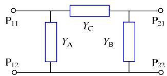  
图4 CVT 型宽频导纳子模型电路结构  
Fig. 4 Structure of wideband admittance sub-model of CVT model in 

# 1.3.2 CVT宽频导纳子模型的离散化表征

采用矢量匹配法对宽频支路导纳频响参数进行有理函数[13-14]拟合，并以部分分式和的形式表示：

$$
Y (s) \approx \sum_ {n = 1} ^ {N} \frac {c _ {n}}{s - a _ {n}} + d + s e \tag {8}
$$

式中： $s { = } { \mathrm { j } } \omega ; \ c _ { n }$ 和 $a _ { n }$ 分别为留数和极点，既可以是实数，也可以是共轭复数对；参数 d、e 为实常数；N 为拟合阶数。

将宽频支路导纳参数代入式(8)，移项：

$$
i = \left(\sum_ {n = 1} ^ {N} \frac {c _ {n}}{s - a _ {n}} + d + s e\right) u \tag {9}
$$

令：

$$
x _ {n} = \frac {1}{s - a _ {n}} u \tag {10}
$$

则式(9)可化简为

$$
\left\{ \begin{array}{l} (s - a _ {n}) x _ {n} = u \\ i = \sum_ {n = 1} ^ {N} c _ {n} x _ {n} + d u + s e u \end{array} \right. \tag {11}
$$

对式(11)进行反向拉式变换，将频域表达式转化为时域的连续状态空间方程：

$$
\left\{ \begin{array}{l} \boldsymbol {x} _ {k} ^ {\prime} = \boldsymbol {A} \boldsymbol {x} _ {k} + \boldsymbol {B} u _ {k} \\ i _ {k} = \boldsymbol {C} \boldsymbol {x} _ {k} + D u _ {k} + E u _ {k} ^ {\prime} \end{array} \right. \tag {12}
$$

式中：A 为以极点为对角元素的 NN阶矩阵；B 为N1 阶的单位矩阵；C 为 1N 阶的留数矩阵；D、E 为常数；k 为第 k 个时间步长。

通过式(12)可以实现宽频支路导纳参数的迭代计算。在电磁暂态仿真计算中，电路中所有的变量均为具有固定仿真步长 h 的离散数据点，因此采用中心差分法对式(12)的连续状态空间方程进行离散化：

$$
\left\{ \begin{array}{l} \frac {\boldsymbol {x} _ {k + 1} - \boldsymbol {x} _ {k}}{h} = \boldsymbol {A} \frac {\boldsymbol {x} _ {k + 1} + \boldsymbol {x} _ {k}}{2} + \boldsymbol {B} \frac {\boldsymbol {u} _ {k + 1} + \boldsymbol {u} _ {k}}{2} \\ i _ {k + 1} = \boldsymbol {C} \boldsymbol {x} _ {k + 1} + I _ {k + 1} \end{array} \right. \tag {13}
$$

其中：

$$
I _ {k + 1} = D u _ {k + 1} + E u _ {k + 1} ^ {\prime} \tag {14}
$$

对式(13)进一步化简得到：

$$
\left\{ \begin{array}{l} \boldsymbol {x} _ {k + 1} = \boldsymbol {\alpha} \boldsymbol {x} _ {k} + \boldsymbol {\mu} (\boldsymbol {B} u _ {k + 1} + \boldsymbol {B} u _ {k}) \\ i _ {k + 1} = \boldsymbol {C} \boldsymbol {x} _ {k + 1} + I _ {k + 1} \end{array} \right. \tag {15}
$$

式(15)为离散状态方程。其中：

$$
\boldsymbol {\alpha} = (2 \boldsymbol {I} - \boldsymbol {A} h) ^ {- 1} (2 \boldsymbol {I} + \boldsymbol {A} h) \tag {16}
$$

$$
\boldsymbol {\mu} = (2 \boldsymbol {I} - \boldsymbol {A} h) ^ {- 1} h \tag {17}
$$

式中 I 为单位矩阵。由于在计算第 k1 时刻的状态变量 $\pmb { x } _ { k + 1 }$ 时需要用到当前时刻的电压 $u _ { k + 1 } ,$ ，不符合迭代规则。令：

$$
\tilde {\boldsymbol {x}} _ {k + 1} = \boldsymbol {x} _ {k + 1} - \boldsymbol {\mu} \boldsymbol {B} u _ {k + 1} \tag {18}
$$

则：

$$
\left\{ \begin{array}{l} \tilde {\boldsymbol {x}} _ {k + 1} = \boldsymbol {\alpha} \tilde {\boldsymbol {x}} _ {k} + \tilde {\boldsymbol {B}} \boldsymbol {u} _ {k} \\ i _ {k + 1} = \boldsymbol {C} \tilde {\boldsymbol {x}} _ {k + 1} + \tilde {\boldsymbol {I}} _ {k + 1} \end{array} \right. \tag {19}
$$

其中：

$$
\tilde {\boldsymbol {B}} = (\boldsymbol {\alpha} + \boldsymbol {I}) \boldsymbol {\mu} \boldsymbol {B} \tag {20}
$$

$$
\tilde {I} _ {k + 1} = \left(C \boldsymbol {\mu} \boldsymbol {B} + D\right) u _ {k + 1} + E u _ {k + 1} ^ {\prime} \tag {21}
$$

同理，对式(21)进行化简：

$$
\frac {\tilde {I} _ {k + 1} + \tilde {I} _ {k}}{2} = (C \boldsymbol {\mu} \boldsymbol {B} + D) \cdot \frac {u _ {k + 1} + u _ {k}}{2} + \frac {E \left(u _ {k + 1} - u _ {k}\right)}{h} \tag {22}
$$

移项、化简得到：

$$
\left\{ \begin{array}{l} \boldsymbol {m} _ {k + 1} = - \boldsymbol {m} _ {k} + (\boldsymbol {C} \boldsymbol {\mu} \boldsymbol {B} + D + \frac {2 E}{h}) \cdot \boldsymbol {u} _ {k + 1} + \\ \quad (\boldsymbol {C} \boldsymbol {\mu} \boldsymbol {B} + D - \frac {2 E}{h}) \cdot \boldsymbol {u} _ {k} \\ \tilde {\boldsymbol {I}} _ {k + 1} = \boldsymbol {m} _ {k + 1} \end{array} \right. \tag {23}
$$

令：

$$
\tilde {\boldsymbol {m}} _ {k + 1} = \boldsymbol {m} _ {k + 1} - \left(C \boldsymbol {\mu} \boldsymbol {B} + D + \frac {2 E}{h}\right) \cdot \boldsymbol {u} _ {k + 1} \tag {24}
$$

得到：

$$
\left\{ \begin{array}{l} \tilde {\boldsymbol {m}} _ {k + 1} = - \tilde {\boldsymbol {m}} _ {k} - \frac {4 E}{h} u _ {k} \\ \tilde {I} _ {k + 1} = \tilde {\boldsymbol {m}} _ {k + 1} + (\boldsymbol {C} \boldsymbol {\mu} \boldsymbol {B} + D + \frac {2 E}{h}) \cdot u _ {k + 1} \end{array} \right. \tag {25}
$$

将式(25)代入式(19)中，整理得：

$$
\left\{ \begin{array}{l} \tilde {\boldsymbol {x}} _ {k + 1} = \tilde {\boldsymbol {A}} \tilde {\boldsymbol {x}} _ {k} + \tilde {\boldsymbol {B}} u _ {k} \\ i _ {k + 1} = \tilde {\boldsymbol {C}} \tilde {\boldsymbol {x}} _ {k + 1} + \tilde {\boldsymbol {D}} u _ {k + 1} \end{array} \right. \tag {26}
$$

其中：

$$
\tilde {\boldsymbol {A}} = \left[ \begin{array}{c c} \boldsymbol {\alpha} & 0 \\ 0 & - \boldsymbol {I} \end{array} \right] \quad \tilde {\boldsymbol {B}} = \left[ \begin{array}{c} (\boldsymbol {\alpha} + 1) \boldsymbol {\mu} \boldsymbol {B} \\ - \frac {4 E}{h} \end{array} \right] \tag {27}
$$

$$
\tilde {C} = \left[ \begin{array}{l l} C & I \end{array} \right] \quad \tilde {D} = C \mu B + D + \frac {2 E}{h}
$$

令：

$$
i _ {s} = \tilde {\boldsymbol {C}} \tilde {\boldsymbol {x}} _ {k + 1} \tag {28}
$$

$$
G _ {\text {N o r t o n}} = \tilde {D} \tag {29}
$$

则式(26)可化简为

$$
\left\{ \begin{array}{l} i _ {\mathrm {s}, k + 1} = \tilde {A} i _ {\mathrm {s}, k} + \tilde {C} \tilde {B} u _ {k} \\ i _ {k + 1} = i _ {\mathrm {s}, k + 1} + G _ {\text {N o r t o n}} u _ {k + 1} \end{array} \right. \tag {30}
$$

将式(30)等价为一个带诺顿等效的电流源结构，搭建宽频导纳等效电路模型，如图 5 所示。

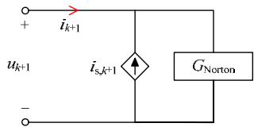  
图5 宽频导纳等效电路  
Fig. 5 Equivalent circuit of wideband admittance

最后，根据图 4 所示结构，组建 CVT 宽频导纳子模型。

# 2 CVT宽频非线性模型参数辨识与模型搭建

为了验证上述建模方法的有效性，本文对一台型号为 $\mathrm { T Y D } 3 5 / \sqrt { 3 } . 0 . 0 1 \mathrm { H F }$ 的CVT进行建模，其额定参数如表 1 所示。

表 1 CVT 额定参数  
Table. 1 Nominal parameters of the CVT   

<table><tr><td>准确级</td><td>额定输出容量SN/VA</td><td>额定电压UN/kV</td><td>额定变比kCVT</td><td>中间变压器变比k</td></tr><tr><td>0.2/0.5/3P</td><td>10/10/10</td><td>35/√3</td><td>350</td><td>100×√3</td></tr></table>

# 2.1 CVT 工频非线性子模型参数辨识与模型搭建

首先，通过开路、短路实验测得 CVT 工频非线性子模型关键参数如表 2 所示，其中，中间变压器相关参数均归算至低压侧。

表 2 CVT 工频非线性子模型参数  
Table. 2 Parameters of the power-frequency and nonlinear sub-model of CVT   

<table><tr><td>C1/pF</td><td>C2/pF</td><td>Lc/H</td><td>L′s/mH</td><td>R′1/Ω</td><td>R2/Ω</td></tr><tr><td>19930</td><td>19940</td><td>243</td><td>1.17</td><td>0.038</td><td>0.035</td></tr></table>

通过开路试验和饱和试验测得电磁对偶模型不同励磁支路深度饱和励磁曲线如图 6 所示。

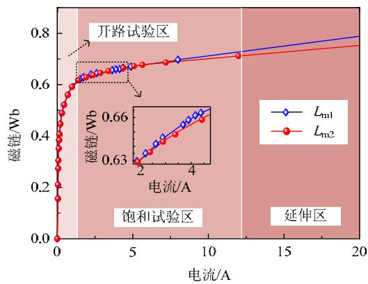  
图6 电磁对偶模型2 条励磁支路的励磁曲线  
Fig. 6 Magnetizing curves in the two magnetizing branches of the electromagnetic dual model

# 2.2 CVT 宽频导纳子模型参数辨识与模型搭建

采用矢量网络分析仪 E5061B 在 5Hz~1MHz 范围内，获取服从对数分布的 6404 个频率点及其对应的散射参数，组成 CVT端口散射参数(S参数)矩阵；通过式(3)将 S 参数转换为宽频测量导纳参数$Y _ { \mathrm { w } } .$ ，与工频模型对应的导纳参数 $Y _ { 5 0 } ( $ (计算方法详见附录 A)作差获得宽频支路导纳参数 Y。

采用矢量匹配法对宽频支路导纳参数的频率响应特性进行拟合，拟合阶数 N 由整体拟合优度指标确定。拟合优度指标为

$$
R _ {\mathrm {N L}} = 1 - \sqrt {\frac {\sum_ {i} ^ {N _ {1}} \left(Y _ {i} - Y _ {i} ^ {\prime}\right) ^ {2}}{\sum_ {i} ^ {N _ {1}} Y _ {i} ^ {2}}} \tag {31}
$$

式中： $Y _ { i }$ 为第 i 个待拟合导纳参数点； $Y _ { i } ^ { \prime }$ 为拟合结果； $N _ { 1 }$ 为数据点数。在矢量匹配程序中，设置拟合阶数 N 为循环变量，计算阶数对应的整体拟合优度指标并绘制关系图，如图 7 所示。

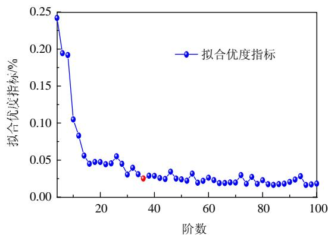  
图7 拟合阶数与拟合优度指标关系曲线  
Fig. 7 Relation curve between the order of fit and the goodness of fit index

综合考虑拟合优度和计算速度，拟合阶数选为36 阶。其中， $Y _ { \mathrm { B } }$ 的拟合结果如图 8所示。

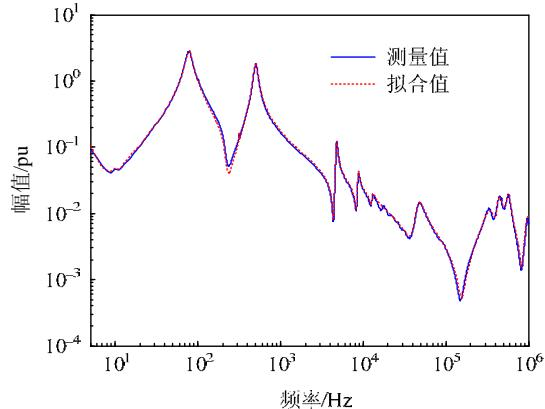

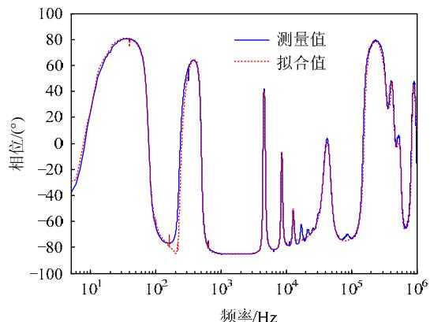  
(a)YB幅频拟合结果   
(b) $Y _ { \mathrm { B ^ { \prime } } }$ 相频拟合结果   
图 8 $Y _ { \mathbf { B } }$ 拟合结果  
Fig. 8 Fitting results of $Y _ { \mathbf { B } }$

采用第 1.3.2 节中的方法，将数学拟合结果转换为电路模型，并根据图4所示型结构，组建CVT宽频导纳子模型。

最后，将 CVT 工频非线性子模型与宽频导纳子模型并联耦合，建立 CVT 宽频非线性模型。

# 3 CVT 宽频非线性模型试验验证

为了验证 CVT 宽频非线性模型(以下简称耦合模型)在表征铁芯饱和时的非线性和宽频范围内的准确性，本文采用信号发生器 Tektronix AFG 3011，功率放大器 AE TECHRON 7548 作信号源，示波器Tektronix TSD2024C 记录波形，搭建如图 9 所示的试验平台。其中， $\mathrm { P } _ { 1 1 } , \ \mathrm { P } _ { 1 2 }$ 为 CVT 高压端子， $\mathrm { P } _ { 2 1 }$ 、$\mathrm { P } _ { 2 2 }$ 为 CVT 低压端子。通过改变输入端子及波形，模拟并记录 CVT 在不同运行工况下的暂态响应，通过试验与仿真结果对比，验证耦合模型的准确性。其中，低频涌流试验(见 3.1 节)在低压侧 $( \mathrm { P } _ { 2 1 }$ ，${ \bf P } _ { 2 2 } )$ 加压，高压侧开路；雷电冲击电压试验(见 3.3 节)在高压侧 $( \mathrm { P _ { 1 1 } }$ ， ${ \bf P } _ { 1 2 } )$ 加压，低压侧开路。

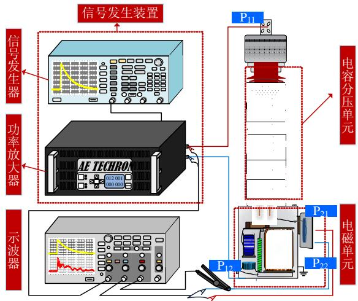  
图 9 CVT 雷电冲击电压试验示意图  
Fig. 9 Schematic diagram of CVT lightning impulse voltage test

# 3.1 耦合模型的非线性表征能力验证

由于铁芯的磁通与频率成反比，低频时中间变压器铁芯更易饱和，开展低频涌流试验不仅便于实现 CVT 非线性特性精准验证，且试验方法简单，对电源容量要求低。在 CVT 低压侧 $( \mathrm { P } _ { 2 1 }$ ， ${ \bf P } _ { 2 2 } )$ 施加5Hz、0.2pu的正弦波，电压起始相位为 $0 ^ { \circ }$ ，使中间变压器铁芯饱和，记录饱和电流变化。每次试验前均对中间变压器进行退磁处理。此时，铁芯进入深度饱和状态，低压侧实测电流首峰幅值达到51.911A。将电压输入到本文模型中，首峰幅值仿真结果为 51.023A，误差为 1.71%，而传统以 T 模

型为核心的 CVT 模型，仿真误差可达 77.79%，如图 10 所示。其中，传统 T 模型的励磁支路大多采用 1.5 倍额定电压下的励磁数据[29]。

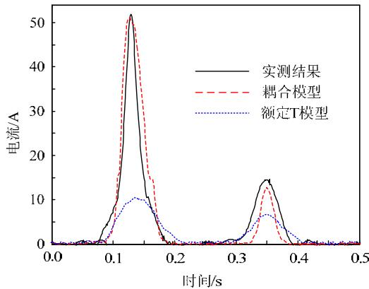  
图 10 CVT 实测电流波形与仿真结果对比  
Fig. 10 Comparison of CVT measured current waveform and simulation results

# 3.2 耦合模型的频率特性表征能力验证

为了在 5Hz~1MHz 范围内对本文耦合模型的整体频率特性表征能力进行完整验证，通过对 CVT宽频非线性模型进行频率扫描获取其电压传递特性 $( U _ { 2 } / U _ { 1 } )$ 的频率响应，与实际测量散射参数计算结果[31]进行对比，如图 11所示。

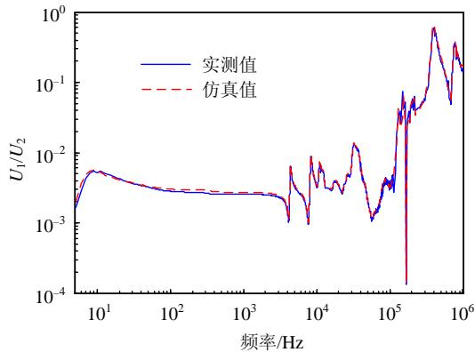  
图11 CVT 电压传递特性频率响应实测值与仿真值对比  
Fig. 11 Comparison of frequency response of CVT voltage transfer characteristic between test and simulation

通过归一化均方误差(normalized mean squareerror，NMSE)检验 CVT 电压传递特性仿真值对真实值的还原程度，如式(32)所示。

$$
N M S E = \frac {1}{N _ {1}} \sum_ {i = 1} ^ {N _ {1}} \frac {\left(U _ {\mathrm {r}} (i) - U _ {\mathrm {s}} (i)\right) ^ {2}}{U _ {\mathrm {r}} (i) ^ {2}} \tag {32}
$$

式中： $U _ { \mathrm { r } }$ 为实测值； $U _ { \mathrm { s } }$ 为仿真值。

计算得到，在 5Hz~1MHz 内，本文耦合模型电压传递特性仿真 NMSE 为 0.91%，具有较高的频率特性模拟精度。

此外，雷电冲击电压峰值高，频率范围广，且最高频率可达 MHz 级，是典型的高频验证试验。

因此，在 CVT 高压侧 $( \mathrm { P _ { 1 1 } }$ ， ${ \bf P } _ { 1 2 } )$ 施加 1.2/50s 的标准雷电冲击电压，CVT 低压侧输出的电压波形如图 12 中实线所示。同时，记录高压侧实测雷电电压波形，作为模型输入信号，施加到本文建立的耦合模型中，仿真结果如图 12 中点线所示。其中，实测雷电冲击电压的首峰值为 1.381pu，本文耦合模型仿真结果的首峰值为 1.338pu，首峰值仿真误差为 3.11%，表明 CVT 耦合模型能准确表示 CVT的高频电压传输特性。图 12 中所有电压幅值均以输入电压为基准进行归一化处理。

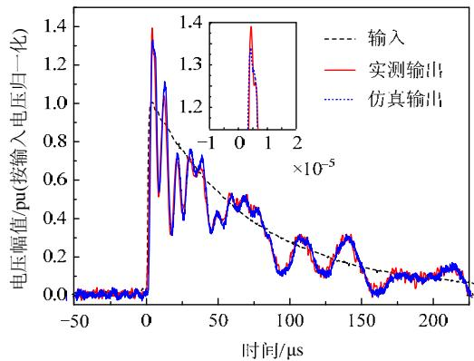  
图 12 CVT 实测雷电冲击电压波形与仿真结果对比  
Fig. 12 Comparison of measured lightning impulse voltage waveform and simulation results of CVT

# 4 结论

针对现有 CVT 模型无法同时表征频率特性和非线性等暂态问题，本文提出将 CVT 宽频导纳子模型和工频非线性子模型进行导纳互差再并联耦合的方法，建立 CVT 宽频非线性模型，其中：

1）通过改进中间变压器模型，基于电磁对偶原理构建具备双励磁支路结构的 CVT 工频非线性子模型，对中间变压器铁芯不同位置处励磁特性深度饱和段的差异性进行精确表征。  
2）将 CVT等价为二端口网络，通过散射参数建立的宽频导纳子模型已包含电容分压器和电磁单元及其杂散参数的影响。基于离散状态方程构建宽频导纳子模型，不仅提高了高频暂态建模的通用性，且避免拟合过程中的无源修正和降阶问题。  
3）以典型 35kV CVT 为研究对象，开展低频涌流、传递特性和雷电冲击电压试验进行模型验证。结果表明，本文模型与传统 CVT 模型相比，低频涌流首峰幅值仿真误差从 77.79%降至 1.71%；在5Hz~1MHz内电压传递特性仿真NMSE为0.91%；雷电冲击电压首峰值仿真误差为 3.11%，对 CVT的非线性和宽频特性具有较高的模拟精度。

然而，系统运行环境复杂，过电压和雷电冲击电压无法表示所有应用场景，仍需开展非线性和宽频同时存在场景下的 CVT 真型试验和仿真研究，进一步扩展本文所提 CVT 宽频非线性模型的适用范围。

# 参考文献

[1] DE ANDRADE REIS R L，NEVES W L A，LOPES F V， et al．Coupling capacitor voltage transformers models and impacts on electric power systems：a review[J]．IEEE Transactions on Power Delivery，2019，34(5)：1874-1884   
[2] BAKAR A H A，RAHIM N A，ZAMBRI M K MAnalysis of lightning-caused ferroresonance in CapacitorVoltage Transformer(CVT)[J]．International Journal ofElectrical Power & Energy Systems ， 2011， 33(9) ：1536-1541  
[3] 刘毅，潘曦宇，林福昌，等．基于时间序列模型的 CVT传 递 特 性 获 取 方 法 [J/OL] ． 高 电 压 技 术 ：1-9[2021-04-06] ． https://doi.org/10.13336/j.1003-6520.hve.20200507020．LIU Yi，PAN Xiyu，LIN Fuchang，et al．Method foracquiring CVT transfer characteristics based on timeseries model[J/OL] ． High Voltage Engineering ：1-9[2021-04-06]．https://doi.org/10.13336/j.1003-6520.hve.20200507020(in Chinese)  
[4] ABB．Instrument transformers application guide[R] 2015：76-78   
[5] 马宁宁，谢小荣，贺静波，等．高比例新能源和电力电子设备电力系统的宽频振荡研究综述[J]．中国电机工程学报，2020，40(15)：4720-4732MA Ningning，XIE Xiaorong，HE Jingbo，et al．Reviewof wide-band oscillation in renewable and powerelectronics highly integrated power systems[J]Proceedings of the CSEE，2020，40(15)：4720-4732(inChinese)  
[6] DAVARPANAH M，SANAYE-PASAND M，AJAEI F B．Compensation of CVT increased error and its impacts on distance relays[J] ． IEEE Transactions on Power Delivery，2012，27(3)：1670-1677   
[7] VERMEULEN H J，DANN L R，VAN ROOIJEN J Equivalent circuit modelling of a capacitive voltage transformer for power system harmonic frequencies[J] IEEE Transactions on Power Delivery，1995，10(4)： 1743-1749   
[8] 冯宇，王晓琪，陈晓明，等．电容式电压互感器电路参数对电网谐波电压测量的影响[J]．中国电机工程学报，2014，34(28)：4968-4975FENG Yu，WANG Xiaoqi，CHEN Xiaoming，et alInfluences of circuit parameters of Capacitor VoltageTransformer on grid harmonic voltage measurements[J]

Proceedings of the CSEE，2014，34(28)：4968-4975(inChinese)  
[9] MACHADO E P，FERNANDES D，NEVES W L A Tuning CCVT frequency response data for improvement of numerical distance protection[J]．IEEE Transactions on Power Delivery，2018，33(3)：1062-1070   
[10] KEZUNOVIC M，KOJOVIC L，SKENDZIC V，et al Digital models of coupling capacitor voltage transformers for protective relay transient studies[J]．IEEE Transactions on Power Delivery，1992，7(4)：1927-1935   
[11] 马其燕，崔翔，任春阳，等．特高压电容式电压互感器阻抗测量及参数灵敏度分析[J]．高电压技术，2014，40(6)：1828-1838  
MA Qiyan，CUI Xiang，REN Chunyang，et al．Impedancemeasurement and parameter sensitivity analysis for UltraHigh voltage capacitor voltage transformer[J] ． HighVoltage Engineering ， 2014 ， 40(6) ： 1828-1838(inChinese)  
[12] 陈少伟，崔翔，由建，等．互感器宽频传递特性的散射参数测量法[J]．电气应用，2006，25(2)：22-24  
CHEN Shaowei，CUI Xiang，YOU Jian，et al．Thescattering parameter method for measuring the wide-bandtransfer characteristics of the PT[J] ． ElectrotechnicalApplication，2006，25(2)：22-24(in Chinese)  
[13] GUSTAVSEN B，SEMLYEN A．Rational approximation of frequency domain responses by vector fitting[J]．IEEE Transactions on Power Delivery，1999，14(3)：1052-1061   
[14] GUSTAVSEN B．Improving the pole relocating properties of vector fitting[J] ． IEEE Transactions on Power Delivery，2006，21(3)：1587-1592   
[15] 张重远，赵京生，葛鑫，等．变压器类设备无源高频宏模型建模方法[J]．电力科学与工程，2012，28(8)：36-42ZHANG Zhongyuan，ZHAO Jingsheng，GE Xin，et alPassive high-frequency macro modeling methods fortransformer devices[J] ． Electric Power Science andEngineering，2012，28(8)：36-42(in Chinese)  
[16] GUSTAVSEN B ． A filtering approach for merging transformer high-frequency models with 50/60-Hz low-frequency models[J]．IEEE Transactions on Power Delivery，2015，30(3)：1420-1428   
[17] 穆淑云．电容式电压互感器暂态性能的仿真计算[J]．电力电容器，2001(1)：8-13  
MU Shuyun ． The numerical simulation of transientproperty of CVT[J]．Power Capacitors，2001(1)：8-13(inChinese)  
[18] 穆淑云．电容式电压互感器暂态性能的仿真计算(续)[J]．电力电容器，2001，1(2)：1-8  
MU Shuyun．Numerical simulation of transient propertyof CVT[J] ． Power Capacitors ， 2001 ， 1(2) ： 1-8(inChinese)

[19] 李良书，韩彦华，李晋，等．电容式电压互感器典型故障案例分析[J]．变压器，2020，57(9)：72-76LI Liangshu，HAN Yanhua，LI Jin，et al．Typical faultcase analysis of capacitor voltage transformer[J]Transformer，2020，57(9)：72-76(in Chinese)  
[20] BAKAR A H A，KHAN S A，KWANG T C，et al．A review of ferroresonance in capacitive voltage transformer [J] ． IEEJ Transactions on Electrical and Electronic Engineering，2015，10(1)：28-35   
[21] 李璿，吴士普，王平，等．串联阻尼元件的特高压小电容量电容式电压互感器的设计及性能验证[J]．高电压技术，2018，44(6)：1844-1852  
LI Xuan，WU Shipu，WANG Ping，et al．Design and performance verification of small capacitance UHV CVT series with damping elements[J] ． High Voltage Engineering，2018，44(6)：1844-1852(in Chinese)   
[22] AJAEI F B，SANAYE-PASAND M，REZAEI-ZARE A，et al．Analysis and suppression of the coupling capacitorvoltage transformer ferroresonance phenomenon[J]．IEEETransactions on Power Delivery，2009，24(4)：1968-1977  
[23] DE LEON F，FARAZMAND A，JOSEPH P．Comparingthe T and  equivalent circuits for the calculation oftransformer inrush currents[J] ． IEEE Transactions onPower Delivery，2012，27(4)：2390-2398  
[24] CHERRY E C．The duality between interlinked electric and magnetic circuits and the formation of transformer equivalent circuits[J] ． Proceedings of the Physical Society．Section B，1949，62(2)：101-111   
[25] YANG Ming，KAZEMI R，JAZEBI S，et al．Retrofitting the BCTRAN transformer model with nonlinear magnetizing branches for the accurate study of lowfrequency deep saturating transients[J]．IEEE Transactions on Power Delivery，2018，33(5)：2344-2353   
[26] 司马文霞，刘永来，杨鸣，等．考虑铁心深度饱和的单相双绕组变压器改进模型[J]．中国电机工程学报，2018，38(24)：7131-7140  
SIMA Wenxia，LIU Yonglai，YANG Ming，et al．An improved  model for single-phase two winding transformers considering deep saturation of the iron core[J]． Proceedings of the CSEE，2018 ，38(24)： 7131-7140(in Chinese)   
[27] 梁贵书，杜欣宇，谢宇廷，等．电容式电压互感器的宽频无源电路模型[J]．高电压技术，2016，42(1)：179-185LIANG Guishu，DU Xinyu，XIE Yuting，et al．Broadbandpassive circuit model of capacitor voltage transformer[J]High Voltage Engineering，2016，42(1)：179-185(inChinese)  
[28] GUSTAVSEN B，DE SILVA H M J．Inclusion of rationalmodels in an electromagnetic transients program ：y-parameters ， z-parameters ， s-parameters ， transfer

functions[J]．IEEE Transactions on Power Delivery，2013，28(2)：1164-1174

[29] 中华人民共和国国家质量监督检验检疫总局，中国国家标准化管理委员会．GB/T 20840.5—2013 互感器 第5 部分：电容式电压互感器的补充技术要求[S]．北京：中国标准出版社，2013

General Administration of Quality Supervision，Inspection and Quarantine of the People’s Republic of China， Standardization Administration of China．GB/T 20840

5—2013 Instrument transformers–Part 5 ： additionalrequirements for capacitor voltage transformer[S]Beijing：Standard Press of China，2013(in Chinese)

[30] STUMBERGER G，POLAJZER B，STUMBERGER B， et al．Evaluation of experimental methods for determining the magnetically nonlinear characteristics of electromagnetic devices[J] ． IEEE Transactions on Magnetics，2005，41(10)：4030-4032

[31] 梁贵书，张喜乐，王晓晖，等．特快速暂态过电压下变压器绕组高频电路模型的研究[J]．中国电机工程学报，2006，26(4)：144-148

LIANG Guishu，ZHANG Xile，WANG Xiaohui，et alResearch on high-frequency circuit model of transformerwindings in VFTO[J]．Proceedings of the CSEE，2006，26(4)：144-148(in Chinese)

# 附录 A CVT 工频线性模型的导纳参数计算

工频非线性子模型的导纳参数为

$$
\left\{\begin{array}{l}Y _ {1 1, 5 0} = \frac {1}{k ^ {2}} \frac {1}{Z _ {1} + \left\{ \right.Z _ {2} \left\|\left[ Z _ {3} + Z _ {4} \right.\right.\left. \right\|\left(Z _ {5} + Z _ {6} \right.\left. \right\| Z _ {7}) ] \left. \right\}}\\Y _ {1 2, 5 0} = - \frac {1}{k} \cdot \frac {\left[ \right. Z _ {4} \left. \right\|\left( \right.Z _ {5} + Z _ {6} \left. \right\| Z _ {7}) \left. \right] \cdot \left( \right.Z _ {6} \left. \right\| Z _ {7})}{\left[ \right. Z _ {3} + Z _ {4} \left. \right\|\left( \right.Z _ {5} + Z _ {6} \left. \right\| Z _ {7}) \left. \right] \cdot \left( \right.Z _ {5} + Z _ {6} \left. \right\| Z _ {7}) \cdot Z _ {7}}.\\\frac {Y _ {1 1 , 5 0}}{Y _ {1 1 , 5 0} - Z _ {1}}\\Y _ {2 1, 5 0} = - \frac {1}{k} \cdot \frac {\left[ \right. Z _ {4} \left. \right\|\left(Z _ {3} + Z _ {2} \right.\left. \right\| Z _ {1}) \cdot \left( \right.Z _ {2} \left. \right\| Z _ {1})}{\left[ Z _ {5} + Z _ {4} \right.\left. \right. \| \left(Z _ {3} + Z _ {2} \right. \| Z _ {1}) ] \cdot \left(Z _ {3} + Z _ {2} \right. \| Z _ {1}) \cdot Z _ {1}}.\\\frac {Y _ {2 2 , 5 0}}{Y _ {2 2 , 5 0} - Z _ {7}}\\Y _ {2 2, 5 0} = \frac {1}{Z _ {7} + \left\{Z _ {6} \| [ Z _ {5} + Z _ {4} \| (Z _ {3} + Z _ {2} \| Z _ {1}) ] \right\}}\end{array}\right. \tag {A1}
$$

式中Z 为折算到低压侧的高压电容阻抗：

$$
Z _ {1} = \frac {1}{\mathrm {j} \omega C _ {1} ^ {\prime}} \tag {A2}
$$

Z 为折算到低压侧的低压电容的阻抗：

$$
Z _ {2} = \frac {1}{\mathrm {j} \omega C _ {2} ^ {\prime}} \tag {A3}
$$

Z 为折算到低压侧的补偿电抗器和中间变压器高压侧电阻之和：

$$
Z _ {3} = \mathrm {j} \omega L _ {\mathrm {c}} ^ {\prime} + R _ {1} ^ {\prime} \tag {A4}
$$

Z4为折算到低压侧的高压侧励磁阻抗：

$$
Z _ {4} = \frac {\mathrm {j} \omega L _ {\mathrm {m} 1} ^ {\prime} \cdot R _ {\mathrm {m} 1} ^ {\prime}}{\mathrm {j} \omega L _ {\mathrm {m} 1} ^ {\prime} + R _ {\mathrm {m} 1} ^ {\prime}} \tag {A5}
$$

Z5为漏感阻抗：

$$
Z _ {5} = \mathrm {j} \omega L _ {\mathrm {s}} \tag {A6}
$$

$Z _ { 6 }$ 为低压侧励磁阻抗：

$$
Z _ {6} = \frac {\mathrm {j} \omega L _ {\mathrm {m} 2} \cdot R _ {\mathrm {m} 2}}{\mathrm {j} \omega L _ {\mathrm {m} 2} + R _ {\mathrm {m} 2}} \tag {A7}
$$

Z7为低压侧电阻：

$$
Z _ {7} = R _ {2} \tag {A8}
$$

对式(A1)进行化简得到：

$$
\left\{ \begin{array}{l} Y _ {1 1, 5 0} = \frac {Z _ {\mathrm {Y} 1 1}}{k ^ {2} Z _ {\mathrm {Y}}} \\ Y _ {1 2, 5 0} = Y _ {2 1, 5 0} = \frac {Z _ {2} Z _ {4} ^ {2}}{k Z _ {\mathrm {Y}}} \\ Y _ {2 2, 5 0} = \frac {Z _ {\mathrm {Y} 2 2}}{Z _ {\mathrm {Y}}} \end{array} \right. \tag {A9}
$$

其中：

$$
\begin{array}{l} Z _ {\mathrm {Y}} = \left[ Z _ {4} \left(Z _ {4} + Z _ {5} + 2 Z _ {7}\right) \right] \left(Z _ {1} Z _ {2} + Z _ {1} Z _ {3} + Z _ {2} Z _ {3}\right) + \\ \left[ Z _ {4} \left(Z _ {5} + Z _ {7}\right) + Z _ {5} Z _ {7} \right] \left(Z _ {1} + Z _ {2}\right) Z _ {4} \tag {A10} \\ \end{array}
$$

$$
\begin{array}{l} Z _ {Y 1 1} = Z _ {4} ^ {2} \left(Z _ {2} + Z _ {3} + Z _ {5} + Z _ {7}\right) + \left[ Z _ {4} \left(2 Z _ {7} + Z _ {5}\right) + Z _ {5} Z _ {7} \right] \\ \left(Z _ {2} + Z _ {3}\right) + Z _ {4} Z _ {5} Z _ {7} \tag {A11} \\ \end{array}
$$

$$
Z _ {\mathrm {Y} 2 2} = \left(2 Z _ {4} + Z _ {5}\right) \left(Z _ {1} Z _ {2} + Z _ {1} Z _ {3} + Z _ {2} Z _ {3}\right) +
$$

$$
(Z _ {4} + Z _ {5}) \left(Z _ {1} Z _ {4} + Z _ {2} Z _ {4}\right) \tag {A12}
$$

  
司马文霞

在线出版日期：2020-12-24。

收稿日期：2020-08-24。

作者简介：

司马文霞(1965)，女，博士，教授，博士生导师，教育部“长江学者”特聘教授，主要从事电力系统的防雷与过电压防护、特殊环境中外绝缘放电特性及机理的研究工作，cqsmwx@cqu.edu.cn；

王惠(1995)，女，硕士研究生，主要从事电力系统过电压暂态分析与仿真研究工作，wanghui_cqu@cqu.edu.cn；

* 通信作者：杨鸣(1987)，男，博士，副教授，博士生导师，主要从事高电压输变电技术及电力系统过电压研究工作，cqucee@cqu.edu.cn。

(编辑 朱腾翌)