# Modal propagation characteristics and transient analysis of multiconductor cable systems buried in lossy dispersive soils

T.A. Papadopoulos a , Z.G. Datsios b,c , A.I. Chrysochos d , P.N. Mikropoulos b , G.K. Papagiannis b,*

a Power Systems Laboratory, Department of Electrical and Computer Engineering, Democritus University of Thrace, Xanthi 67100, Greece   
b School of Electrical and Computer Engineering, Aristotle University of Thessaloniki, Thessaloniki 54124, Greece   
c Department of Electrical and Computer Engineering, University of Western Macedonia, Kozani 50131, Greece   
d R&D Department of Hellenic Cables, Maroussi, 15125 Athens, Greece

# A R T I C L E I N F O

# Keywords:

Earth conduction effects

Electromagnetic transients

Frequency-dependent soil properties

Modal analysis

Power cables

Wave propagation

# A B S T R A C T

In surge analysis, an important issue is the influence of the imperfect earth on the propagation characteristics of the conductors. In this paper, the wave propagation characteristics and the transient performance of underground multiconductor cable systems in flat, vertical and trefoil arrangement are investigated. The Longmire and Smith frequency-dependent (FD) soil model as well as a generalized earth formulation are considered, taking into account in the analysis the impact of earth conduction effects on both the series impedance and shunt admittance of the cable conductors and sheaths. Comparisons are carried out with approximate earth formulations, neglecting the influence of imperfect earth on shunt admittances. Finally, resonance frequency analysis and transient simulations are performed for the different cable arrangements to evaluate the importance of FD soil modeling and earth formulation per cable arrangement.

# 1. Introduction

The propagation characteristics and the transient performance of multiconductor cable systems can be analyzed in terms of natural modes of propagation; these are calculated on the basis of the per-unit length impedance and admittance matrices of the cable systems by applying proper modal transformations [1, 2]. The modal propagation characteristics of different cable configurations and their sensitivities to the electromagnetic (EM) and geometrical properties of the system under study have been systematically investigated in [2–5]. It is important to indicate that in these works the analysis is based on two specific assumptions regarding earth conduction effects on propagation characteristics:

• The influence of the imperfect earth is considered only on the cable impedance; thus, cable admittance earth conduction effects are neglected. This implies that the earth is assumed to act as an electrostatic shield and the accuracy of such approaches is limited to lowfrequency applications [6], e.g., up to a few kHz. Many efforts to develop expressions for the series impedances have been reported in

literature, with the most known proposed by Pollaczek [7], being implemented in EMT-type simulation tools, and by Sunde [8], that extends [7] by including the influence of earth permittivity.

• The electrical properties of the soil, i.e., conductivity and permittivity are assumed constant; however, in reality they are frequencydependent (FD) [6, 9–23].

In order to develop more accurate earth models, approaches involving earth correction terms for both the impedance and admittance of underground cables have been proposed in [24–26], raising the first of the above assumptions.

Additionally, several models have been proposed for the prediction of the FD soil electrical properties [9–21, 23], as summarized in [22] and [23]. However, only a few recent studies have used FD soil models to investigate the propagation characteristics and the transient performance of underground cable systems [6, 27, 28], revealing a significant influence especially for short cable lengths [6]. In particular, in [6] guidelines for the accurate evaluation of earth conduction effects on the transient performance of underground multiconductor cable systems have been introduced. However, the analysis has been presented only

for cables in flat formation.

This paper extends previous work [6] by investigating the propagation characteristics and the transient responses of different multicon ductor, underground cable systems, i.e., flat, vertical and trefoil arrangements. The propagation characteristics of the cable system are calculated by using the FD soil model of [12], considering both the generalized earth formulation of [24] and the approximate earth formulation of Sunde [8]. Results are compared and discussed also on the basis of EM transient responses, demonstrating the applicability of the guidelines introduced in [6] for the investigation and accurate evaluation of earth conduction effects on the transient performance of underground cable systems.

# 2. Guidelines for accurate transient analysis

Based on the results and analysis presented in [6], guidelines have been developed for the accurate assessment of earth conduction effects on the propagation characteristics and the transient response of underground multiconductor cable systems. Three critical frequencies $( f _ { c 1 } , f _ { c 2 } ,$ , and $f _ { c 3 } )$ have been introduced to evaluate earth conduction effects: $f _ { c 1 }$ 1 refers to soil modeling, $f _ { c 2 }$ to earth formulation, and $f _ { c 3 }$ to cable transient response. These frequencies can be employed as criteria so as to determine whether to use FD soil modeling and the generalized earth formulation in transient analysis of underground cable systems. The procedure for determining and applying the critical frequency criteria, as well as the proposed modeling approach are concisely summarized here; a more detailed analysis can be found in [6].

# 2.1. Soil modeling criterion

The $f _ { c 1 }$ frequency criterion is determined based on the comparison between the FD soil conductivity, $\sigma _ { F D } ,$ predicted by the adopted FD soil model, and the low-frequency soil conductivity, $\sigma _ { 1 , L F } ,$ typically used in modeling approaches with constant (frequency-independent) soil electrical properties. In fact, $f _ { c 1 }$ can be considered as the frequency where $\sigma _ { F D } / \sigma _ { 1 , L 1 }$ F becomes equal to 1.1 [6]. For $f { > } f _ { c 1 }$ , FD soil electrical properties should be used in transient analysis of underground cable systems, as their effect on cable propagation characteristics is significant; this is mainly due to the dispersion of soil conductivity especially in poorly conductive soils.

The FD soil electrical properties can be predicted by the Longmire and Smith [12] soil model; the latter was selected based on the discussion on FD soil modeling presented in [6], as well as on the results on cable propagation characteristics of [6]. The Longmire and Smith [12] FD soil model has been derived from laboratory measurements and verified using circuit analysis; it is valid in the frequency range of 100 - $2 { \cdot } 1 0 ^ { 8 }$ Hz. The relative permittivity, $\varepsilon _ { r 1 } ,$ , and effective conductivity, σ1 (S/m), are given as

$$
\varepsilon_ {r 1} (f) = \varepsilon_ {r 1, \infty} + \sum_ {n = 1} ^ {1 3} \frac {a _ {n}}{1 + \left(f / f _ {n}\right) ^ {2}}, \tag {1}
$$

$$
\sigma_ {1} (f) = \sigma_ {1, D C} + 2 \pi f \varepsilon_ {0} \sum_ {n = 1} ^ {1 3} \frac {a _ {n} f / f _ {n}}{1 + \left(f / f _ {n}\right) ^ {2}} \tag {2}
$$

where $\varepsilon _ { r 1 , \infty }$ is the high frequency relative permittivity of soil, $( \varepsilon _ { r 1 , \infty } = 5$ [12]), $\sigma _ { 1 , D C } \ : ( \mathrm { { S / m } ) }$ is the DC soil conductivity, ε is the permittivity of free space (8.854⋅10− 12 F/m), $a _ { n }$ (pu) are empirical coefficients (Table I), f is the frequency in Hz, and $f _ { n }$ (Hz) are scaling coefficients

calculated as [22]

$$
f _ {n} = 1 0 ^ {n - 1} \left(1 2 5 \sigma_ {1, D C}\right) ^ {0. 8 3 1 2}. \tag {3}
$$

Note that the Longmire and Smith model can also be considered as appropriate for EMT simulations with $f < 1 0 0 ~ \mathrm { H z } .$ . This is because the predicted decrease of soil conductivity with decreasing frequency is in line with experimental results on actual soils, such as those of [19].

# 2.2. Earth formulation criterion

The $f _ { c 2 }$ frequency criterion associated with earth formulation is determined empirically based on the analysis of [6]. For poorly conductive soils $( \sim 0 . 0 0 1 \ s / \mathrm { m } )$ , the order of magnitude of $f _ { c 2 }$ is some hundreds of Hz, whereas for conductive soils (~0.01 S/m) some tens of kHz. For $f { > } f _ { c 2 } ,$ , the generalized earth formulation [24] should be used considering both earth series impedance and shunt admittance of the cable conductors and sheaths instead of the approximate earth formulation of Sunde [8].

According to the generalized earth formulation of [24] and by considering two single-core cables buried in a homogeneous earth (Fig. 1), the influence of earth conduction effects on the per-unit-length cable parameters is described by the self and mutual earth impedance, $Z _ { e } ^ { ' }$ and admittance, $Y _ { e } ^ { ' }$ , terms. The general form of these terms is [24]

$$
Z _ {e} ^ {\prime} = \frac {j \omega \mu_ {1}}{2 \pi} \int_ {0} ^ {+ \infty} F _ {e} (\lambda) \cos \left(y _ {i j} \lambda\right) d \lambda , \tag {4}
$$

$$
F _ {e} (\lambda) = \frac {e ^ {- \alpha_ {1} ^ {\prime} \left| h _ {i} - h _ {j} \right|} - e ^ {- \alpha_ {1} ^ {\prime} \left(h _ {i} + h _ {j}\right)}}{\alpha_ {1} ^ {\prime}} + \frac {2 \mu_ {0} e ^ {- \alpha_ {1} ^ {\prime} \left(h _ {i} + h _ {j}\right)}}{a _ {1} ^ {\prime} \mu_ {0} + a _ {0} ^ {\prime} \mu_ {1}}, \tag {5}
$$

$$
Y _ {e} ^ {\prime} = j \omega P _ {e} ^ {- 1}, \tag {6}
$$

$$
P _ {e} = \frac {j \omega}{2 \pi \left(\sigma_ {1} + j \omega \varepsilon_ {1}\right)} \int_ {0} ^ {+ \infty} \left[ F _ {e} (\lambda) + G _ {e} (\lambda) \right] \cdot \cos \left(y _ {i j} \lambda\right) d \lambda , \tag {7}
$$

$$
G _ {e} (\lambda) = \frac {2 \mu_ {0} \mu_ {1} \alpha^ {\prime} \left(\gamma_ {1} ^ {2} - \gamma_ {0} ^ {2}\right) e ^ {- a ^ {\prime} {} _ {1} \left(h _ {i} + h _ {j}\right)}}{\left(a ^ {\prime} {} _ {1} \mu_ {0} + a ^ {\prime} {} _ {0} \mu_ {1}\right) \left(a ^ {\prime} {} _ {1} \gamma_ {0} ^ {2} \mu_ {1} + a ^ {\prime} {} _ {0} \gamma_ {1} ^ {2} \mu_ {0}\right)} \tag {8}
$$

where $a _ { k } ^ { ' } = \sqrt { \lambda ^ { 2 } + \gamma _ { k } ^ { 2 } + k _ { x } ^ { ' 2 } }$ and $k _ { x } ^ { ' } = \omega \sqrt { \mu _ { 1 } \varepsilon _ { 1 } } ; \varepsilon _ { 0 } , \mu _ { 0 } , \sigma _ { 0 }$ are respectively the permittivity, permeability and conductivity of air with $\sigma _ { 0 } = 0 .$ . The corresponding earth properties are $\varepsilon _ { 1 } = \varepsilon _ { r 1 } \varepsilon _ { 0 } , \mu _ { 1 } = \mu _ { r 1 } \mu _ { 0 }$ and $\sigma _ { 1 } ,$

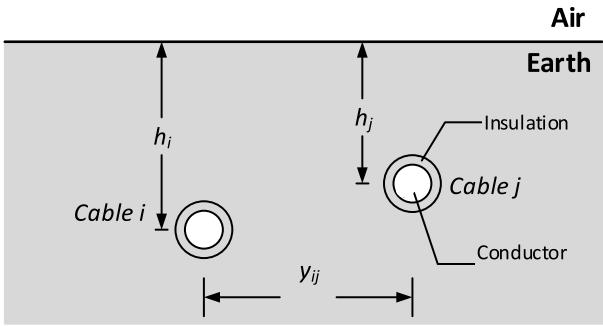  
Fig. 1. Layout of two insulated underground cables.

Table I Empirical coefficient values for the LS [12] soil model.   

<table><tr><td>n</td><td>1</td><td>2</td><td>3</td><td>4</td><td>5</td><td>6</td><td>7</td><td>8</td><td>9</td><td>10</td><td>11</td><td>12</td><td>13</td></tr><tr><td>an (pu)</td><td>3.40</td><td>2.74</td><td>2.58</td><td>3.38</td><td>5.26</td><td>1.33</td><td>2.72</td><td>1.25</td><td>4.80</td><td>2.17</td><td>9.80</td><td>3.92</td><td>1.73</td></tr><tr><td></td><td>x10^6</td><td>x10^5</td><td>x10^4</td><td>x10^3</td><td>x10^3</td><td>x10^2</td><td>x10^1</td><td>x10^1</td><td>x10^0</td><td>x10^0</td><td>x10^-1</td><td>x10^-1</td><td>x10^-1</td></tr></table>

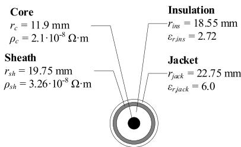  
Fig. 2. Single cable configuration.

where the subscript r denotes relative quantities. The propagation constants for air (m = 0) and earth (m = 1) are given as

$$
\gamma_ {m} = \sqrt {j \omega \mu_ {m} \left(\sigma_ {m} + j \omega \varepsilon_ {m}\right)}. \tag {9}
$$

Cable self-parameters are derived by considering $h _ { j } = h _ { i }$ and y equal to the cable outer radius.

# 2.3. Response criterion

The $f _ { c 3 }$ frequency criterion is associated with the length of the underground cable system, as a lower cable length enhances earth conduction effects. $f _ { c 3 }$ is defined as the $1 ^ { \mathrm { s t } }$ order cable resonance frequency

(RF) of the ground mode [6]; this is the lowest RF of all propagation modes. This frequency criterion can be considered as an upper-frequency boundary.

# 2.4. Application of the frequency criteria

Based on the frequency criteria $f _ { c 1 } , f _ { c 2 } ,$ and $f _ { c 3 } ,$ FD soil modeling, that $\mathbf { i } s ,$ the Longmire and Smith [12] soil model, and the generalized earth formulation of [24], (4)–(9) should be considered when $f _ { c 3 } > f _ { c 1 }$ and f >f , respectively; in these cases their influence on the transient response is considerable.

# 3. Propagation characteristics

The propagation characteristics of three identical single-core cables are calculated by using the methodology of [6]. The frequency-dependence of the soil electrical properties is predicted by applying the Longmire and Smith [12] soil model, assuming $\sigma _ { 1 , L F }$ equal to 0.01 S/m and 0.001 S/m to cover soil cases ranging from highly to poorly conductive. The cross-section, EM and geometrical characteristics of the single cable are depicted in Fig. 2. The cables are considered in trefoil, flat and vertical formation as shown in Fig. 3.

The propagation characteristics of the cable systems are decomposed

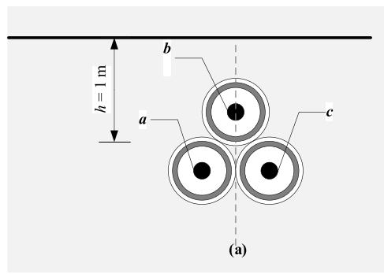

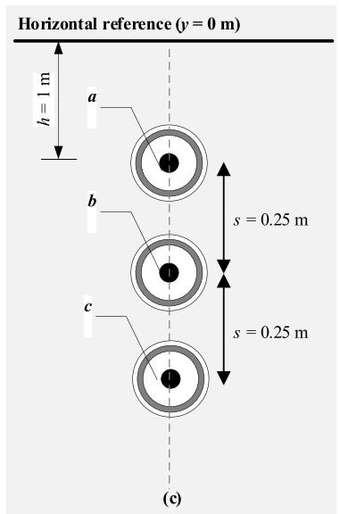

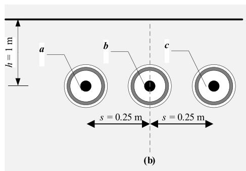  
Fig. 3. Cable systems of a) trefoil, b) flat and c) vertical arrangement.

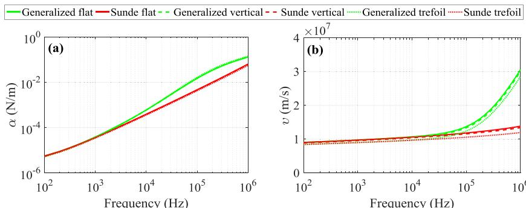  
Fig. 4. Ground mode (a) attenuation constant, (b) velocity for $\sigma _ { 1 , L F } = 0 . 0 1 ~ \mathrm { { S / m } }$ .

Generalized flatSunde flat-Generalized vertical--Sunde verticalGeneralized trefoilSunde trefoil

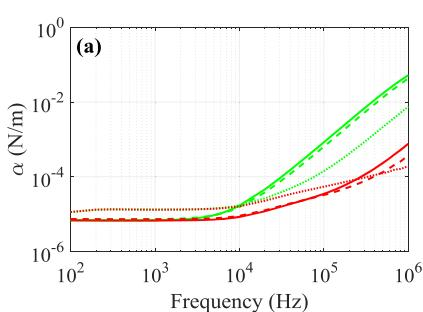

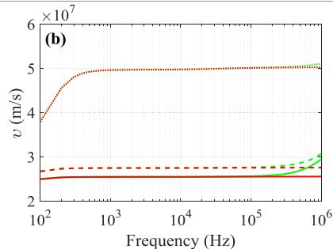  
Fig. 5. Inter-sheath mode #1 (a) attenuation constant and (b) velocity, for $\sigma _ { 1 , L F } = 0 . 0 1 \mathrm { ~ S / m }$ .

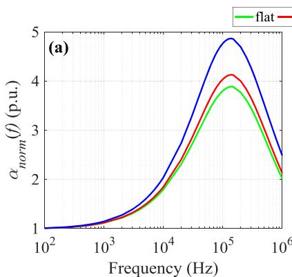

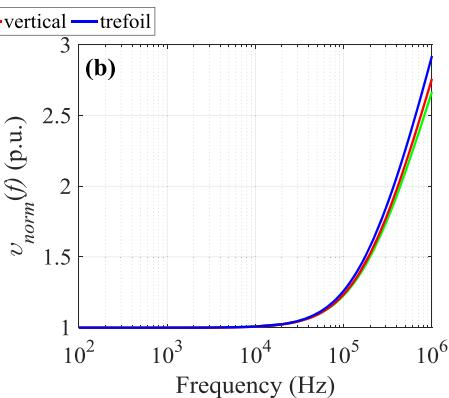  
Fig. 6. Normalized ground mode (a) attenuation constant, (b) velocity, for $\sigma _ { 1 , L F } = 0 . 0 1 \mathrm { { s / m } }$

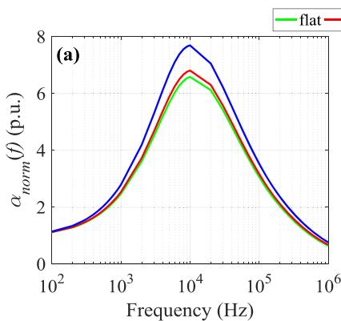

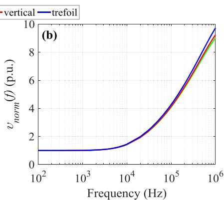  
Fig. 7. Normalized ground mode (a) attenuation constant, (b) velocity, for $\sigma _ { 1 , L F } = 0 . 0 0 1 \mathrm { ~ S / m }$

to six cable modes, i.e., the ground mode, two inter-sheath modes and three modes of coaxial nature. In particular, the ground mode is a zerosequence sheath mode of propagation, inter-sheath mode #1 involves wave propagation in all three sheaths, while #2 in the sheaths of cables of phase a and c [2]. This implies that the propagation characteristics of the ground and the two inter-sheath modes are mostly influenced by the soil properties compared to the coaxial modes [6]; thus, these are mainly considered in this analysis. The earth conduction effects are examined, assuming the generalized [24] and the approximate earth formulation of Sunde [8]. Note that, Sunde’s earth approach can be derived assuming $k _ { x } ^ { \prime } \prime = 0$ in (4)-(8) and, most importantly, considering earth as an electrostatic shield between the cables thus neglecting the earth admittance (6).

The calculated ground and inter-sheath mode #1 attenuation constant and velocity for the two earth approaches are compared in Figs. 4 and 5, respectively; results are for the different cable arrangements and for $\sigma _ { 1 , L F } = 0 . 0 1 \mathrm { { s / m } }$ . Note that, the propagation characteristics for the two inter-sheath modes are almost similar, thus those of inter-sheath #1

are only presented. It can be seen that the propagation characteristics of the inter-sheath mode for both earth formulation approaches are sensitive to the cable arrangement; this is more pronounced for the mode velocity. Moreover, the velocity of the inter-sheath mode decreases with the cable separation (Fig. 5); this is in consistency with the results of [2] and applies also at low frequencies for the inter-sheath mode attenuation constant. Concerning the latter, at higher frequencies (above ~10 kHz for the results obtained by the generalized approach and above ~300 kHz for the approach of Sunde) a different behavior is observed. For the ground mode, the cable arrangement has a slight influence on the mode velocity. On the other hand, the ground mode attenuation constant is similar for all cable arrangements. In general, the modal propagation characteristics of the flat and the vertical cable arrangements present comparable behavior; considerable differences are observed with the trefoil case.

Comparing the results of the two earth approaches, it can be seen that the modal properties calculated by the generalized approach are frequency-dependent; as expected, this is mostly evident for the

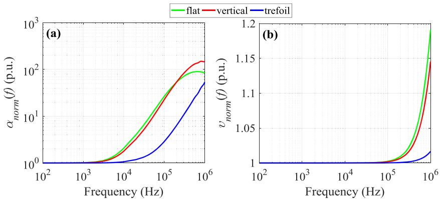  
Fig. 8. Normalized inter-sheath #1 mode (a) attenuation constant, (b) velocity, for $\sigma _ { 1 , L F } = 0 . 0 1 \mathrm { { \ s / m } }$ .

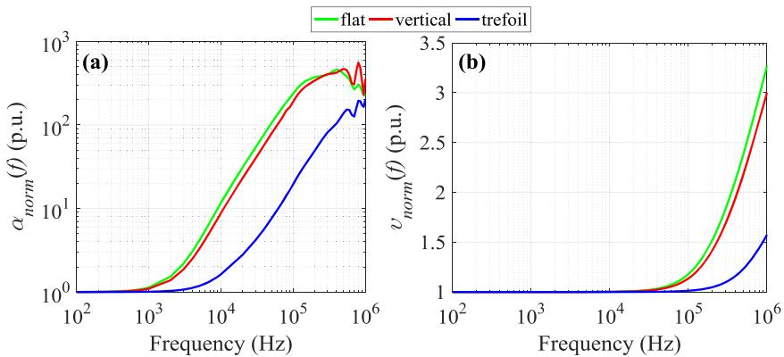  
Fig. 9. Normalized inter-sheath #1 mode (a) attenuation constant, (b) velocity, for $\sigma _ { 1 , L F } = 0 . 0 0 1 \mathrm { ~ S / m }$ .

attenuation constant [29]. Following Sunde’s approach that considers earth as a perfect conductor for the calculation of the cable admittance, the inter-sheath mode #1 velocity is exclusively determined by the EM characteristics of the cable outer sheaths, thus remains constant for frequencies higher than 200 kHz (Fig. 5b). Moreover, combining the results of Figs. 4 and 5, it can be realized that the ground and the inter-sheath propagation constants obtained by the generalized model tend to converge at 1 MHz; this is more pronounced for the flat and the vertical arrangement. Those obtained by Sunde’s approach show a significant divergence [29].

To evaluate further the results between the two earth approaches the generalized propagation characteristics were normalized with respect to those obtained using Sunde’s approach

$$
a _ {\text {n o r m}} (f), v _ {\text {n o r m}} (f) = \frac {\left| \text {p r o p a g a t i o n c h a r a c t e r i s t i c s} _ {\text {g e n e r a l i z e d}} (f) \right|}{\left| \text {p r o p a g a t i o n c h a r a c t e r i s t i c s} _ {\text {S u n d e}} (f) \right|} \tag {10}
$$

where $a _ { n o r m } ( f )$ and $\upsilon _ { n o r m } ( f )$ is the normalized mode attenuation constant and velocity, respectively. In Figs. 6 and 7 the ratios of the ground mode are plotted for $\sigma _ { 1 , L F }$ equal to 0.01 S/m and 0.001 S/m, respectively. The corresponding plots for the inter-sheath mode #1 are depicted in Figs. 8 and 9.

As expected, according to the $f _ { c 2 }$ criterion the ground mode attenuation constant between the two approaches presents significant differences, starting at ~10 kHz for $\sigma _ { 1 , L F } = 0 . 0 1 \mathrm { { s / m } }$ and 0.2 kHz for soil case $\sigma _ { 1 , L F } = 0 . 0 0 1$ S/m for all cable arrangements. The differences at low frequencies, where earth behaves mainly as a conductor, are attributed to the influence of the earth conduction current on the cable sheath conductance. As frequency increases, differences are also due to the increasing influence of earth displacement current on the corresponding cable sheath capacitances [6]. The differences in the ground mode characteristics are more evident for the trefoil arrangement.

A significant feature is that the inter-sheath mode attenuation

constant between the two approaches presents high differences, thus resulting into $a _ { n o r m } ( f )$ exceeding 10, for frequencies starting at ~50 kHz (flat) - 300 kHz (trefoil) for $\sigma _ { 1 , L F } = 0 . 0 1$ S/m and 10 kHz (flat) - 60 kHz (trefoil) for $\sigma _ { 1 , L F } = 0 . 0 0 1 \mathrm { ~ } \mathrm { { \cal S / m } }$ . This is attributed to the fact that $Y _ { i j } { = } G _ { i j } { + } j { \omega } C _ { i j } { = } 0 .$ , since no electrostatic coupling between the cables is considered by following Sunde’s approach. For the ground mode differences are significantly lower, since $Y _ { i i } { = } j \mathrm { { \omega } } C _ { i i } { \neq } 0$ due to the cable jacket capacitance. In general, it can be deduced that for the inter-sheath mode the differences between the two earth approaches are mostly evident for the flat and the vertical cable arrangements, due to the increased conducting earth path between the adjacent sheaths compared to the trefoil case.

# 4. Transient responses

The different earth modeling approaches are also assessed by investigating their impact on the cable transient responses. An ideal 1.2/ 50 μs double-exponential voltage source is applied to the cable a core sending end. The corresponding receiving end as well as both ends of the remaining cable cores are assumed open-ended. In addition, single-point bonding is applied to cable sheaths with ground resistance of 1 Ω at the sending end. The transient responses are obtained for different cable lengths using the simulation model of [30]. The associated RFs are also calculated based on the methodology of [31].

# 4.1. Results for $\sigma _ { 1 , L F } = 0 . 0 1 \ s / m$

In Fig. 10, the transient voltages at the receiving end of cable a sheath are shown for all cable configurations, assuming both earth approaches with $\sigma _ { 1 , L F } = 0 . 0 1 \ : \mathrm { s }$ /m and cable lengths equal to 100 m, 1000 m and 4000 m. The comparison between the results with respect to each cable length and configuration reveals the effect of the adopted earth formulation on the transient responses. Specifically, deviations are

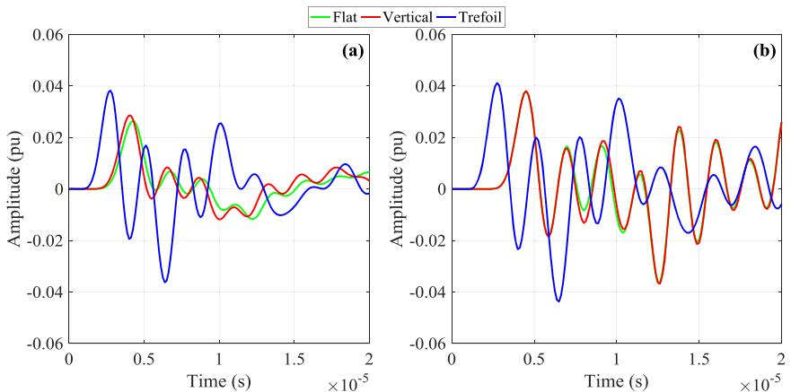

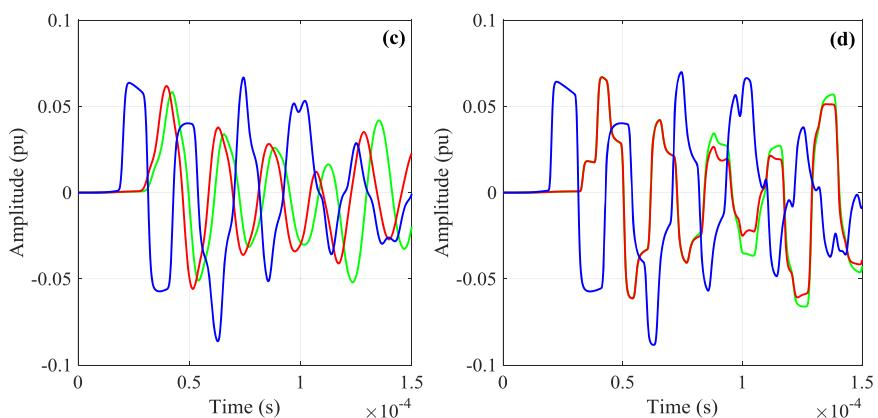

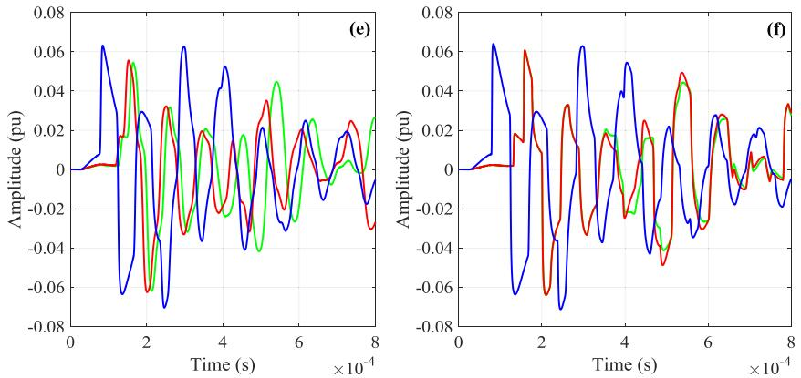  
Fig. 10. Transient responses at end R of cable #1 sheath for $\sigma _ { 1 , L F } = 0 . 0 1$ S/m, ℓ = 100 m and (a) Generalized approach, (b) Sunde approach, for $\ell = 1 0 0 0$ m and (c) Generalized approach, (d) Sunde approach, for $\ell = 4 0 0 0$ m and (e) Generalized approach, (f) Sunde approach.

observed during the total transient response in terms of attenuation rate and travel time. This is attributed to the fact that the generalized approach takes into account the earth admittance in the calculation of the per-unit-length cable parameters, leading to transient responses with faster attenuation rate and travel time. The differences against Sunde’s approach are more marked with decreasing cable length, since the frequency context of the transient response shifts gradually to higher frequencies, where the impact of the earth admittance is more significant (see $f _ { c 3 }$ criterion). This is also verified by the corresponding transient response spectrum analysis in Figs. 11, 12 and 13 for the flat, vertical and trefoil configurations, respectively; the spectra of the transient responses refer to the generalized approach. Note that, differences on the cable core voltages are negligible, since the cable sheath isolates electrostatically the inner cable part from earth.

Regarding the effect of cable configuration with respect to cable length and earth model, the transient responses are generally similar in the cases of flat and vertical configurations, especially at the beginning

of the transient. However, differences are observed with time, which stems mainly from the deviations in the inter-sheath mode velocity. Moreover, the transient responses of the trefoil arrangement differ significantly from those of the flat and the vertical configurations. This can be explained through a comparison of their propagation characteristics (see Figs. 4 and 5).

The differences in the waveforms between the examined cable configurations are also directly reflected to the calculated RFs of the transient responses, which are a characteristic of the cable configuration seen as a linear time-invariant system. Results are summarized in Tables II, III, IV for the flat, vertical and trefoil cable arrangement, respectively, assuming an open-ended cable and thus focusing on the odd multiples of the quarter-wavelength frequency, i.e., from $n = 1$ to n $= 7 .$ . Note that, $f _ { c 3 }$ is the ground mode RF for $n = 1$ . As the cable length decreases, the frequency context of the transient responses shift gradually to higher frequencies, where differences in propagation characteristics between the earth approaches and cable configurations are

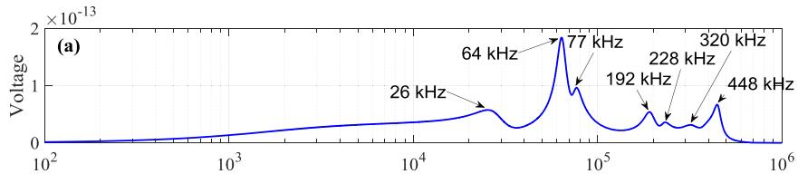

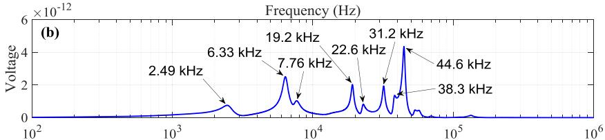

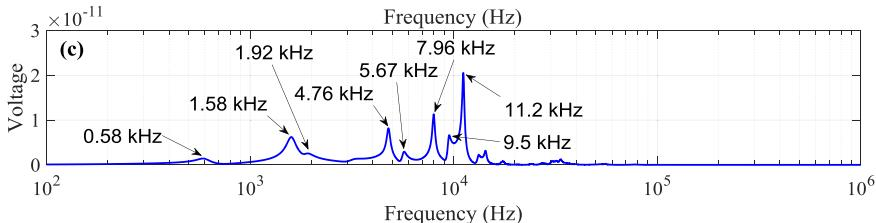  
Fig. 11. Spectrum of the flat configuration sheath transient response for cable length: (a) 100 m, (b) 1000 m and (c) 4000 m, using the generalized approach.

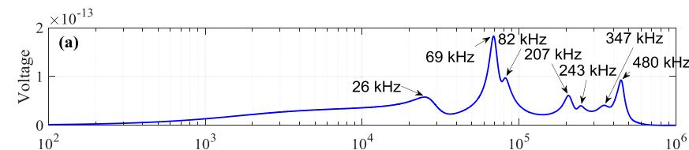

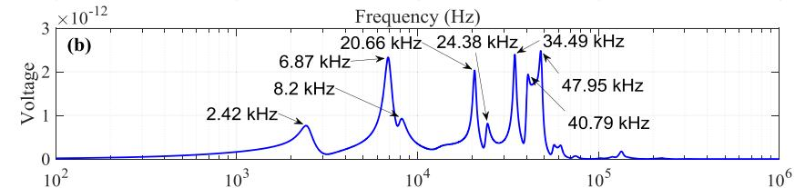

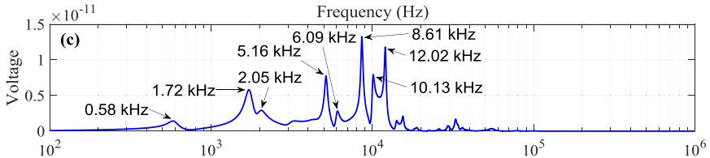  
Frequency (Hz)   
Fig. 12. Spectrum of the vertical configuration sheath transient response for cable length: (a) 100 m, (b) 1000 m and (c) 4000 m, using the generalized approach.

enhanced. This behavior is also evident to the ${ \mathrm { R F s } } ,$ which increase as the cable length decreases. For example, for the trefoil arrangement $f _ { c 3 }$ is 25.78 kHz, 2.32 kHz and 0.55 kHz for ℓ equal to 100 m, 1000 m and 4000 m, respectively. In addition, it is noticed that the RFs of flat and vertical configurations yield similar values compared to the corresponding of the trefoil arrangement. This behavior justifies the differences observed in the corresponding transient responses of Fig. 10 between the three cable configurations.

# 4.2. Results for σ = 0.001 S/m

In Fig. 14, the corresponding transient voltages are summarized for all cable configurations assuming both earth approaches with $\sigma _ { 1 , L F } =$ 0.001 S/m and the same cable lengths as in Fig. 10. Transient responses present a similar behavior as for $\sigma _ { 1 , L F } = 0 . 0 1 \mathrm { ~ S / m }$ . However, lower voltage amplitudes are generally observed due to the higher attenuation caused by the lower soil conductivity, as well as higher differences with

Sunde’s approach (given that for $\sigma _ { 1 , L F } = 0 . 0 0 1 \mathrm { S } / \mathrm { m } f _ { c 2 }$ is lower than for $\sigma _ { 1 , L F } = 0 . 0 1 \mathrm { { s / m } ) }$ . In addition, the poorly conductive soil leads to higher deviations between the results of flat and vertical cable configurations. It should be noted that these findings are also justified by the associated RFs, presented indicatively for the flat arrangement in Table V.

# 5. Conclusions

The wave propagation characteristics and the transient performance of underground multiconductor cable systems in flat, vertical and trefoil arrangement have been investigated. Computations were performed considering the frequency-dependent (FD) soil electrical properties by adopting the Longmire and Smith soil model, as well as a generalized earth formulation taking into account the impact of earth conduction effects on both series impedance and shunt admittance of the cable conductors and sheaths. Comparisons have been carried out with the approximate earth formulation of Sunde, which neglects the influence of

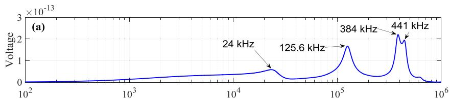

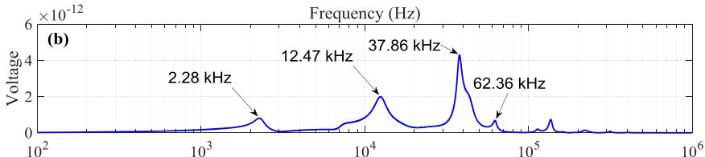

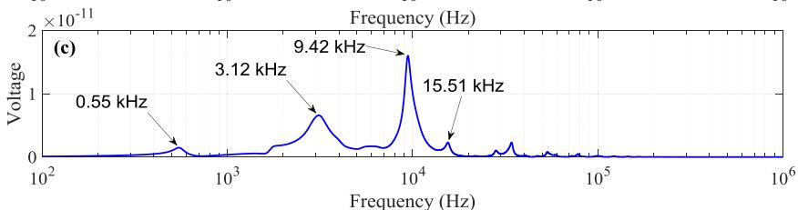  
Fig. 13. Spectrum of the trefoil configuration sheath transient response for cable length: (a) 100 m, (b) 1000 m and (c) 4000 m, using the generalized approach.

Table II Flat arrangement RFs (kHz).   

<table><tr><td rowspan="2">Cable length (m)</td><td colspan="4">Cable modes</td></tr><tr><td>RF order</td><td>Ground</td><td>Inter-sheath #1</td><td>Inter-sheath #2</td></tr><tr><td rowspan="4">100</td><td>n = 1</td><td>28.70</td><td>64.05</td><td>75.86</td></tr><tr><td>n = 3</td><td>86.10</td><td>192.14</td><td>227.59</td></tr><tr><td>n = 5</td><td>143.51</td><td>320.23</td><td>379.32</td></tr><tr><td>n = 7</td><td>200.91</td><td>448.32</td><td>531.04</td></tr><tr><td rowspan="4">1000</td><td>n = 1</td><td>2.52</td><td>6.38</td><td>7.55</td></tr><tr><td>n = 3</td><td>7.95</td><td>19.16</td><td>22.69</td></tr><tr><td>n = 5</td><td>13.62</td><td>31.96</td><td>37.86</td></tr><tr><td>n = 7</td><td>17.67</td><td>44.67</td><td>52.88</td></tr><tr><td rowspan="4">4000</td><td>n = 1</td><td>0.60</td><td>1.60</td><td>1.89</td></tr><tr><td>n = 3</td><td>1.87</td><td>4.79</td><td>5.67</td></tr><tr><td>n = 5</td><td>3.18</td><td>7.98</td><td>9.44</td></tr><tr><td>n = 7</td><td>4.19</td><td>11.17</td><td>13.21</td></tr></table>

Table III Vertical arrangement RFs (kHz).   

<table><tr><td rowspan="2">Cable length (m)</td><td colspan="4">Cable modes</td></tr><tr><td>RF order</td><td>Ground</td><td>Inter-sheath #1</td><td>Inter-sheath #2</td></tr><tr><td rowspan="4">100</td><td>n = 1</td><td>28.07</td><td>69.09</td><td>80.79</td></tr><tr><td>n = 3</td><td>84.20</td><td>207.28</td><td>242.36</td></tr><tr><td>n = 5</td><td>140.33</td><td>345.60</td><td>403.94</td></tr><tr><td>n = 7</td><td>196.50</td><td>483.64</td><td>565.52</td></tr><tr><td rowspan="4">1000</td><td>n = 1</td><td>2.48</td><td>6.86</td><td>8.04</td></tr><tr><td>n = 3</td><td>7.45</td><td>20.66</td><td>24.13</td></tr><tr><td>n = 5</td><td>12.42</td><td>34.43</td><td>40.22</td></tr><tr><td>n = 7</td><td>17.38</td><td>48.20</td><td>56.31</td></tr><tr><td rowspan="4">4000</td><td>n = 1</td><td>0.59</td><td>1.72</td><td>2.01</td></tr><tr><td>n = 3</td><td>1.77</td><td>5.16</td><td>6.03</td></tr><tr><td>n = 5</td><td>2.96</td><td>8.61</td><td>10.05</td></tr><tr><td>n = 7</td><td>4.14</td><td>12.05</td><td>14.07</td></tr></table>

imperfect earth on shunt admittances, thus being applicable to lowfrequency range (roughly up to some kHz). Differences are discussed on the basis of previously introduced guidelines for the accurate transient analysis of underground cable systems. These guidelines consider three critical frequency criteria to determine the most accurate modeling approach associated with earth conduction effects in transient analysis of underground cable systems.

Significant differences are found for the ground and inter-sheath modes between the generalized and approximate earth formulations

Table IV Trefoil arrangement RFs (kHz).   

<table><tr><td rowspan="2">Cable length (m)</td><td colspan="4">Cable Modes</td></tr><tr><td>RF order</td><td>Ground</td><td>Inter-sheath #1</td><td>Inter-sheath #2</td></tr><tr><td rowspan="4">100</td><td>n = 1</td><td>25.78</td><td>125.62</td><td>125.56</td></tr><tr><td>n = 3</td><td>77.34</td><td>376.87</td><td>376.69</td></tr><tr><td>n = 5</td><td>128.91</td><td>628.12</td><td>627.81</td></tr><tr><td>n = 7</td><td>180.47</td><td>879.36</td><td>878.93</td></tr><tr><td rowspan="4">1000</td><td>n = 1</td><td>2.32</td><td>12.46</td><td>12.47</td></tr><tr><td>n = 3</td><td>6.95</td><td>37.38</td><td>37.40</td></tr><tr><td>n = 5</td><td>11.58</td><td>62.30</td><td>62.33</td></tr><tr><td>n = 7</td><td>16.21</td><td>87.22</td><td>87.26</td></tr><tr><td rowspan="4">4000</td><td>n = 1</td><td>0.55</td><td>3.11</td><td>3.11</td></tr><tr><td>n = 3</td><td>1.66</td><td>9.33</td><td>9.34</td></tr><tr><td>n = 5</td><td>2.77</td><td>15.56</td><td>15.56</td></tr><tr><td>n = 7</td><td>3.88</td><td>21.78</td><td>21.78</td></tr></table>

becoming generally more pronounced with increasing frequency and decreasing soil conductivity. For the ground mode the differences are more evident for the trefoil arrangement, whereas for the inter-sheath mode for the flat and the vertical arrangements. The latter is due to the increased conducting earth path between the adjacent sheaths compared to the trefoil case.

The transient responses of flat and vertical cable configurations present similar behavior in general, as a result of their comparable propagation characteristics. Considerable differences are observed for the trefoil arrangement as its propagation characteristics differ significantly. This is reflected to the calculated resonant frequencies (RFs) of the transient responses, a characteristic of the cable configuration. The RF values for the flat and vertical configuration are similar, whereas those corresponding to the trefoil arrangement differ.

# CRediT authorship contribution statement

T.A. Papadopoulos: Conceptualization, Methodology, Formal analysis, Writing – original draft. Z.G. Datsios: Methodology, Formal analysis, Writing – original draft. A.I. Chrysochos: Methodology, Formal analysis, Writing – original draft. P.N. Mikropoulos: Methodology, Supervision. G.K. Papagiannis: Methodology, Supervision.

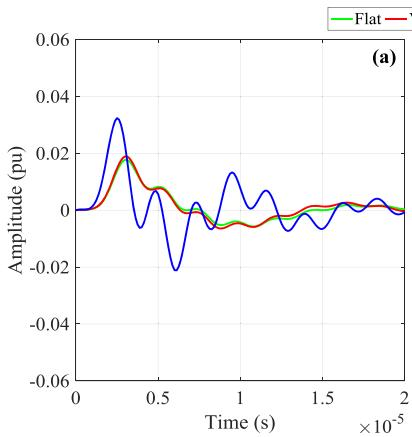

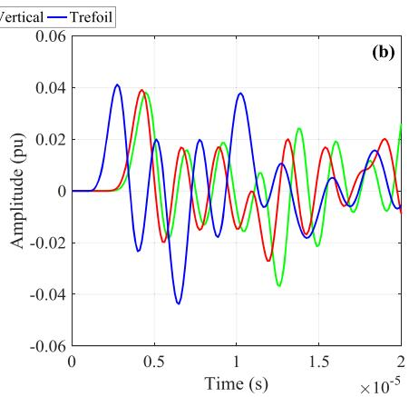

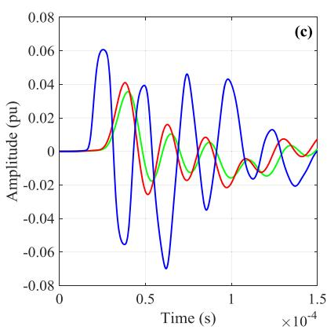

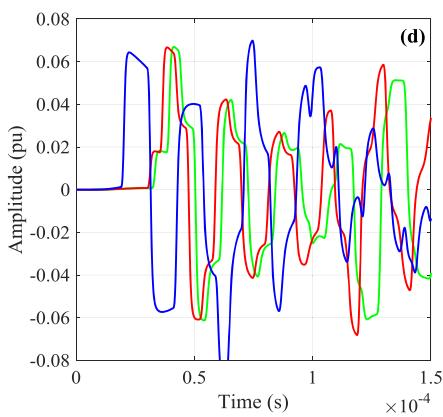

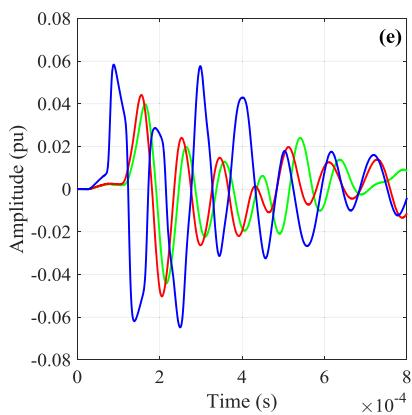

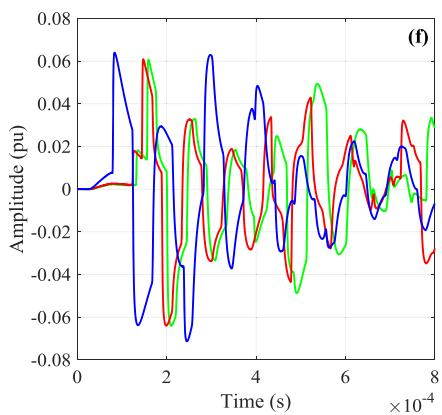  
Fig. 14. Transient responses at end R of cable #1 sheath for $\sigma _ { 1 , \mathrm { L F } } = 0 . 0 0 1 \mathrm { S } / \mathrm { m } , \ell = 1 0 0$ m and (a) Generalized approach, (b) Sunde approach, for $\ell = 1 0 0 0$ m and (c) Generalized approach, (d) Sunde approach, for $\ell = 4 0 0 0$ m and (e) Generalized approach, (f) Sunde approach.

Table V Flat arrangement RFs (kHz).   

<table><tr><td rowspan="2">Cable length (m)</td><td colspan="4">Cable modes</td></tr><tr><td>RF order</td><td>Ground</td><td>Inter-sheath #1</td><td>Inter-sheath #2</td></tr><tr><td rowspan="4">100</td><td>n = 1</td><td>69.59</td><td>69.67</td><td>80.64</td></tr><tr><td>n = 3</td><td>209.00</td><td>208.77</td><td>241.91</td></tr><tr><td>n = 5</td><td>348.34</td><td>347.95</td><td>403.19</td></tr><tr><td>n = 7</td><td>487.67</td><td>487.12</td><td>564.46</td></tr><tr><td rowspan="4">1000</td><td>n = 1</td><td>2.41</td><td>6.40</td><td>7.57</td></tr><tr><td>n = 3</td><td>9.01</td><td>19.39</td><td>22.59</td></tr><tr><td>n = 5</td><td>19.82</td><td>32.81</td><td>38.60</td></tr><tr><td>n = 7</td><td>36.40</td><td>46.87</td><td>54.88</td></tr><tr><td rowspan="4">4000</td><td>n = 1</td><td>0.56</td><td>1.60</td><td>1.89</td></tr><tr><td>n = 3</td><td>1.77</td><td>4.79</td><td>5.67</td></tr><tr><td>n = 5</td><td>3.09</td><td>8.00</td><td>9.47</td></tr><tr><td>n = 7</td><td>4.54</td><td>11.23</td><td>13.28</td></tr></table>

# Declaration of Competing Interest

The authors declare that they have no known competing financial interests or personal relationships that could have appeared to influence the work reported in this paper.

# References

[1] L.M. Wedepohl, Application of matrix methods to the solution of travelling-wave phenomena in polyphase systems, Proc. IEE 110 (12) (1963) 2200–2212. Dec.   
[2] L.M. Wedepohl, D.J. Wilcox, Transient analysis of underground powertransmission systems. System-model and wave-propagation characteristics, Proc. IEE 120 (2) (1973) 253–260. Feb.   
[3] C.S. Indulkar, P. Kumar, D.P. Kothari, Sensitivity analysis of modal quantities for underground cables, IEE Proc. C – Gener. Transm. Distrib. 128 (4) (1981) 229–234. Jul.   
[4] C.S. Indulkar, P. Kumar, D.P. Kothari, Modal propagation and sensitivity of modal quantities in crossbonded cables, IEE Proc. C – Gener. Transm. Distrib. 130 (6) (1983) 278–284. Nov.

[5] A. Ametani, Wave propagation characteristics of cables, IEEE Trans. Power App. Syst. PAS-99 (2) (1980) 499–505. Mar.   
[6] T. A. Papadopoulos, Z. G. Datsios, A. I. Chrysochos, P. N. Mikropoulos, G. K. Papagiannis, Wave propagation characteristics and electromagnetic transient analysis of underground cable systems considering frequency-dependent soil properties, IEEE Trans. Electromagn. Compat., DOI: 10.1109/TEMC.2020.2986821 , early access, 2020.   
[7] F. Pollaczek, Über das Feld einer unendlich langen wechselstromdurchflossenen Einfachleitung, Elektr. Nachr. Technik 3 (4) (1926) 339–359.   
[8] E.D. Sunde, Earth Conduction Effects in Transmission Systems, 2nd ed., Dover Publications, 1968, pp. 99–139.   
[9] J.H. Scott, R.D. Carroll, D.R. Cunningham, Dielectric constant and electrical conductivity of moist rock from laboratory measurements. Sensor and Simulation Note 116, Technical Letter, Special Projects-12, Geological Survey, U.S. Department of the Interior, Federal Center, Denver, CO, 1964. Aug.   
[10] J.H. Scott, Electrical and magnetic properties of rock and soil. Theoretical Notes, Note 18, Special Projects-16, Geological Survey, U.S. Department of the Interior, Federal Center, Denver, CO, 1966. May.   
[11] J.H. Scott, R.D. Carroll, D.R. Cunningham, Dielectric constant and electrical conductivity measurements of moist rock: a new laboratory method, J. Geophys. Res. 72 (20) (1967) 5101–5115. Oct.   
[12] C.L. Longmire, K.S. Smith, A universal impedance for soils. DNA 3788T, Mission Research Corp., Santa Barbara, CA, 1975. Oct.   
[13] M.A. Messier, The propagation of an electromagnetic impulse through soil: Influence of frequency dependent parameters. Technical Report MRC-N-415, Mission Research Corp., Santa Barbara, CA, 1980. Feb.   
[14] M. A. Messier, "Another soil conductivity model," Internal Report, JAYCOR, San Diego, CA, Jun. 1985.   
[15] S. Visacro, C.M. Portela, Soil permittivity and conductivity behavior on frequency range of transient phenomena in electric power systems, in: Proceedings of the ISH, Braunsweig, Germany, 1987.   
[16] C. Portela, Measurement and modeling of soil electromagnetic behavior, in: Proceedings of the International Symposium on EMC, Seattle, WA, 1999, pp. 1004–1009. Aug.vol. 2.   
[17] S. Visacro, R. Alipio, Frequency dependence of soil parameters: Experimental results, predicting formula and influence on the lightning response of grounding electrodes, IEEE Trans. Power Del. 27 (4) (2012) 927–935. Apr.   
[18] R. Alipio, S. Visacro, Modeling the frequency dependence of electrical parameters of soil, IEEE Trans. Electromagn. Compat 56 (5) (2014) 1163–1171. Oct.

[19] Z.G. Datsios, P.N. Mikropoulos, Characterization of the frequency dependence of the electrical properties of sandy soil with variable grain size and water content, IEEE Trans. Dielectr. Electr. Insul. 26 (3) (2019) 904–912. Jun.   
[20] F. M. Tesche, "On the modeling and representation of a lossy earth for transient electromagnetic field calculations," Theor. Notes, Note 367, EMConsultant, Saluda, NC, Jul. 2002.   
[21] L. Grcev, "High-frequency grounding," in V. Cooray (Ed.), Lightning Protection, IET Power and Energy Series 48, London, UK, 2010.   
[22] D. Cavka, N. Mora, F. Rachidi, A comparison of frequency-dependent soil models: application to the analysis of grounding systems, IEEE Trans. Electromagn. Compat. 56 (1) (2014) 177–187. Feb.   
[23] CIGRE WG C4.33, Impact of soil-parameter frequency dependence on the response of grounding electrodes and on the lightning performance of electrical systems, Techn. Brochure 781 (2019). Oct.   
[24] T.A. Papadopoulos, D.A. Tsiamitros, G.K. Papagiannis, Impedances and admittances of underground cables for the homogeneous earth case, IEEE Trans. Power Del. 25 (2) (2010) 961–969. Apr.   
[25] A.P.C. Magalh˜aes, M.T.C. de Barros, A.C.S. Lima, Earth return admittance effect on underground cable system modeling, IEEE Trans. Power Del. 33 (2) (2018) 662–670. Apr.   
[26] H. Xue, A. Ametani, J. Mahseredjian, I. Kocar, Generalized formulation of earthreturn impedance/admittance and surge analysis on underground cables, IEEE Trans. Power Del. 33 (6) (2018) 2654–2663. Dec.   
[27] T. A. Papadopoulos, Z. G. Datsios, A. I. Chrysochos, P. N. Mikropoulos, G. K. Papagiannis, Impact of the frequency-dependent soil electrical properties on the electromagnetic field propagation in underground cables, Proceedings of the International Conference on Power System Transients (IPST), Perpignan, France, Jun. 2019.   
[28] H. Xue, A. Ametani, Y. Liu, J. De Silva, Effect of frequency-dependent soil parameters on wave propagation and transient behaviors of underground cables, Int. J. Electr. Power Energy Syst. 122 (2020), 106163.   
[29] T.A. Papadopoulos, D.A. Tsiamitros, G.K. Papagiannis, Modal propagation characteristics of underground power cable systems, in: Proceedings of the 44th International Universities Power Engineering Conference (UPEC), Glasgow, Scotland, UK, 2009, pp. 1–5.   
[30] A.I. Chrysochos, T.A. Papadopoulos, G.K. Papagiannis, Enhancing the frequencydomain calculation of transients in multiconductor power transmission lines, Elect. Power Syst. Res. 122 (2015) 56–64. May.   
[31] A.I. Chrysochos, T.A. Papadopoulos, G.K. Papagiannis, Rigorous calculation method for resonance frequencies in transmission line responses, IET Gener. Transm. Distrib. 9 (8) (2015) 767–778. May.