# Switch-Averaged Frequency Domain Simulation of Photovoltaic Systems

Santiago Agudelo, Student Member, IEEE, Fausto Diaz, Member, IEEE, Abner Ramirez , Senior Member, IEEE, and Jesus Morales , Member, IEEE

Abstract—This paper pushes forward frequency domain (FD) modeling of switched networks aimed at transient simulation, with particular interest in photovoltaic (PV) systems. The PV system simulation is performed via the numerical Laplace transform (NLT) in a sequential (partitioned-time) fashion by using a set of time-windows. The proposed technique enhances existing FD PV models by a) averaging switching functions and b) using sample overlapping to alleviate numerical oscillations due to rise-time phenomenon at time-window interfaces. The proposed enhancements provide a more efficient dynamic simulation compared to both classical single-window full-sample NLT implementation and nonaveraged FD PV models. Verification is performed via prevalent electromagnetic transient (EMT) software tools.

Index Terms—Frequency domain analysis, laplace transforms, and photovoltaic systems.

# I. INTRODUCTION

T RANSIENT simulation of switched networks involvingrenewable energy sources has received great attention over the last few decades. Interaction with the conventional electrical network, increasing penetration levels, stability issues, and protection design are among the reasons for which power engineers and researchers dedicate a great deal of time and effort to the simulation of such networks.

There are several techniques for the analysis of networks involving power electronic devices, in this paper referred to as switched networks, intended for either transient analysis or steady state calculations. Depending on the type of study and network characteristics, some techniques are better suited than others. As for transient analysis, constant-parameters switched networks can be readily simulated in time-domain (TD) [1], [2], [3], [4] while switched networks involving frequency-dependent components can naturally be studied via FD methods [5], [6], [7], [8], [9], [10], [11]. This paper focuses on transient analysis in FD via the NLT.

Manuscript received 30 January 2022; revised 16 May 2022; accepted 15 August 2022. Date of publication 18 August 2022; date of current version 24 March 2023. This work was supported by CONACYT-Mexico scholarships, under Grants 937566 and 754353. Paper no. TPWRD-00131-2022. (Corresponding author: Abner Ramirez.)

Santiago Agudelo, Fausto Diaz, and Abner Ramirez are with the CIN-VESTAV Campus Guadalajara, Zapopan, JAL 45017, Mexico (e-mail: santiago.agudelo@cinvestav.mx; fausto.diaz@cinvestav.mx; abner.ramirez@ cinvestav.mx).

Jesus Morales is with the PGSTech - EMTP, Montreal, QC H2K 1C3, Canada (e-mail: jesus.morales@emtp.com).

Color versions of one or more figures in this article are available at https://doi.org/10.1109/TPWRD.2022.3200011.

Digital Object Identifier 10.1109/TPWRD.2022.3200011

Computational resources is a major issue for both TD and FD techniques when switching dynamics are under interest. In [2], the EMTP-RV software tool is employed to simulate wind and PV resources integrated to the utility grid. As EMTP-RV is a TD-based method, a small time-step has to be utilized to accurately reproduce switching dynamics [4]. In a step forward, the parallel architecture of the graphics processing unit (GPU) is combined with CPU capabilities to achieve efficient transient simulations for large PV systems [3]. On the other hand, in classical implementation of the NLT transient calculations assume a single (usually large) time-window; this involves a prohibitive number of samples. A partitioned-time simulation is proposed in [8] where the total simulation time is divided into time-windows, each with possibly different number of samples. However, this type of approach brings a new challenge since rise-time oscillations appear at time-window interfaces. A solution to the rise-time oscillations phenomenon is proposed in [8] for networks involving frequency-dependent lines/cables; however, such phenomenon is further accentuated in switched networks, which is not addressed in [8]. In [10], interpolators are applied to the samples at the interface of two subsequent time-windows to smooth rise-time oscillations.

In [11], the FD Norton-type models for both single- and threephase PV systems are presented. Partitioned-time simulation is utilized in [11] accompanied by selection of high-energy frequencies to speed up simulations. The rise-time effect, attributed to half-value convergence of the inverse NLT and manifesting as rise-time numerical oscillations, is mentioned in [11] but not fully addressed.

The TD-based averaged-value modeling (AVM) technique, also known as dynamic phasors, overcomes the computational burden issue by averaging instantaneous variables within a sliding time-window; however, at the expenses of omitting high-frequency ripple [12], [13], [14], [15], [16]. DC/DC simple converters, such as boost and series resonant converters, are modeled via AVM in [12] and [13], where only DC and fundamental switching frequencies are accounted for. The effective averaging of switching dynamics is demonstrated in [12] and [13]. In [16], a parametric PV-cell model, based on the averaging concept, is proposed for long-term analyses. A comprehensive overview of AVM for representing static switching converters is provided in [14]. Despite not reproducing high-frequency dynamics, AVM provides reasonable results with expected system dynamics’ behavior when the AC part of the network is sufficiently stiff [15]. The damping or filtering effect provided

by the frequency-dependent network surrounding the switched device, or the presence of reactors, also justifies the use of AVM. This makes the AVM concept attractive for FD modeling of switched networks.

Based on the above overview, this paper presents an alternative FD modeling of PV systems, via the NLT, for transient analysis. It represents a follow-up paper enhancing the approach proposed in [11]. The backbone of the proposed modeling relies on FD partitioned-time simulation by using time-windows with appropriate initial conditions represented as voltage/current sources for dynamic elements, i.e., transmission lines and inductor/capacitor elements, as in [11]. Unlike existing FD PV models, this paper proposes to average high-frequency switching dynamics in FD; this permits to save computational resources. As second feature, numerical oscillations due to rise-time phenomenon at time-window interfaces are substantially alleviated via straightforward overlapping of a few samples around such interfaces. It is demonstrated that the alternative proposed modeling, hereafter referred to as FD-AVM, is more efficient than both classical implementation of NLT and non-averaged FD PV models, providing very good results within the AVM context. It is also shown that the FD-AVM approach provides better agreement with TD switching models than the classical TD AVM technique. Thus, the proposed FD-AVM approach, besides averaging switching functions to speedup simulations, it fully addresses the issue of rise-time oscillations, which is not resolved in [11], and proposes a simpler, yet effective, solution compared to [10].

Section II of the paper presents the partitioned-time solution scheme in FD. The basic ideas of averaging switching dynamics in FD and alleviating rise-time phenomenon via overlapping of samples are outlined in Section III. Two case studies are described in detail in Section IV. Section V includes the discussion of some points regarding the proposed approach. Finally, the paper is concluded in Section VI.

# II. SEQUENTIAL TIME-WINDOW SIMULATION SCHEME AND RISE-TIME PHENOMENON

For completeness of the paper, this Section briefly outlines the partitioned-time solution scheme using the NLT for transient analysis. Also, the rise-time oscillations phenomenon is reviewed.

# A. Partitioned-Time Simulation

Fig. 1 depicts an arbitrary transient waveform obtained via NLT simulation for which a total observation time T is assumed. The sequential solution scheme adopted in this paper considers that T is divided into a set of partial time-windows $T _ { k }$ , with $k =$ $1 , 2 , \ldots$ The NLT is utilized with reduced number of samples to obtain the transient waveforms for each $T _ { k } .$ Moreover, the timewindows can be of different length and with distinct number of samples according to the fast/slow dynamics involved [8], [17]. This permits to achieve further computational savings.

As indicated by the Laplace domain theory, each timewindow must be simulated with appropriate initial conditions

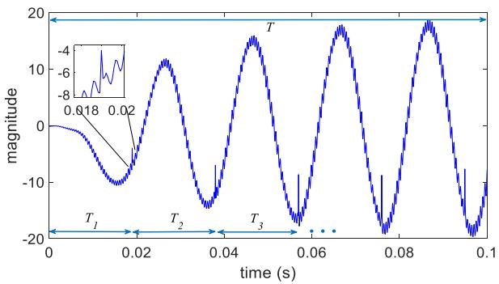  
Fig. 1. Illustration of partitioned-time solution and rise-time oscillations.

for dynamic elements (L and C), represented as constant voltage/current sources [18]. Also, if frequency-dependent components are present in the network under analysis, e.g., transmission lines, appropriate frequency-dependent current sources must be calculated and included; details are provided in [8], [17].

# B. Rise-Time Phenomenon

Also, as dictated by the NLT theory, at the interface of two consecutive time-windows, the inverse Laplace transform converges to the half-value of the initial condition; this followed by a few numerical damped oscillations. The rise-time phenomenon is clearly visible in the inset of Fig. 1. Alleviation of this phenomenon is more challenging when the network involves power electronic devices. This is due to numerical oscillations that can interfere or be confused with switching frequency oscillations from switching devices.

A similar phenomenon, due to amplification of the rise-time of driving sources when reaching the opposite side of a transmission line, is studied in [8]. Such amplification is resolved in [8] by applying a piecewise approximation of the Laplace transform to the driving sources.

# III. SWITCH AVERAGING AND TIME-WINDOW OVERLAPPING IN THE FD-AVM APPROACH

# A. Averaging Switching Functions

In this paper, the issue of a large number of samples in classical single time-window implementation of the NLT is overcome in two ways. The first one relies on using partitioned-time simulation [8], [17], as described in Section II. The second one consists in averaging the FD switching functions involved in the PV system and usually generated by PWM schemes. These two solutions (either alone or together) permit to use a reduced number of samples, thus achieving computational savings, as demonstrated in Section IV. The basics of averaging modeling in TD, i.e., TD-AVM, and the main idea of FD averaging, i.e., FD-AVM, are discussed next.

The TD-AVM method (or dynamic phasors) expresses a TD variable x( ) via a series Fourier expansion on the interval (t – P, t), as [12], [13], [14]

$$
x (t - P + r) = \sum_ {k = 0} ^ {N} \left\langle x \right\rangle_ {k} (t) e ^ {j k \omega_ {s} (t - P + r)} \tag {1a}
$$

where $\omega _ { s } = 2 \pi / P$ and $r \in ( 0 , P )$ . The slowly time-varying kth coefficient in (1a) is calculated as

$$
\langle x \rangle_ {k} (t) = \frac {1}{P} \int_ {0} ^ {P} x (t - P + r) e ^ {- j k \omega_ {s} (t - P + r)} d r. \tag {1b}
$$

In case of products between variables, the convolution operation in (1c) is defined.

$$
\langle x y \rangle_ {k} = \sum_ {i} \left\langle x \right\rangle_ {k - i} \left\langle y \right\rangle_ {i}, \text {f o r a l l i n t e g e r s} i. \tag {1c}
$$

TD-AVM traditionally accounts for DC and fundamental components (i.e., k = 0, 1), thus neglecting higher frequencies. This suffices for a fair averaging of the x-variable dynamics, thus becoming computationally more efficient than classical TDbased models, as a large time-step can be used in AVM. Note that TD-AVM has been conceived for system-level transient studies and corresponding small-signal analysis [14]. Fundamentally, the system of differential equations (2) is transformed, via (1), to the new differential equations, as in (3), where all dynamic variables obey (1a) and (1b). In case of convolution between a switching function and a voltage/current variable, (1c) applies.

$$
\frac {d}{d t} x = f (x (t), u (t)). \tag {2}
$$

$$
\frac {d}{d t} \langle x \rangle_ {k} = - j k \omega_ {s} \langle x \rangle_ {k} + \langle f (x, u) \rangle_ {k}. \tag {3}
$$

Note that, to obtain a consistent set based on (3), the same Fourier coefficients are retained for all dynamic variables, including the excitation function [12], [13], [14]. To the best authors’ knowledge, no applications of TD-AVM to networks involving frequency-dependent components have been reported so far.

FD-based methods, e.g., NLT, follow a different solution philosophy compared to TD-based techniques, such as TD-AVM. In NLT, a package of samples constitutes a FD solution variable, i.e.,

$$
x = \left[ \begin{array}{l l l l l} x _ {D C} & x _ {\Delta \omega} & x _ {2 \Delta \omega} & x _ {3 \Delta \omega} & \dots \end{array} \right] ^ {T r} \tag {4a}
$$

where Tr denotes transpose and $\Delta \omega$ is the frequency spacing [8]. The FD vector in (4a) can represent, for example, a switching function with its corresponding frequency content obtained by applying the fast Fourier transform (FFT) algorithm to the PWM firing output variable.

FD-AVM averages a switching function vector, as in (4b), by setting to zero all its elements but the DC and fundamental switching frequency components, as in (4b), leading to a concordance with AVM methods formulated in TD [12], [13], [14]. The obvious advantage of FD-AVM over TD-AVM is that frequency-dependent elements of the network can be included and accurately resolved in the former.

$$
x = \left[ \begin{array}{l l l l l} x _ {D C} & x _ {\Delta \omega} & 0 & 0 & \dots \end{array} \right] ^ {T r}. \tag {4b}
$$

Considering that (4b) represents a switching function, its FD convolution with a voltage/current variable is performed efficiently as only DC and fundamental switching frequency (including its conjugate) elements are different from zero, as

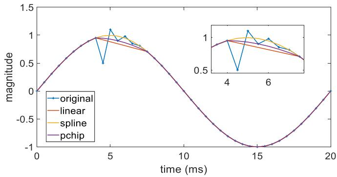  
Fig. 2. Interpolators applied to an arbitrary damped oscillatory waveform.

illustrated in (4c), where ∗ denotes convolution operation.

$$
x * y = \left[ \begin{array}{c c c c c} x _ {D C} & x _ {- \Delta \omega} & 0 & \dots & 0 \\ x _ {\Delta \omega} & x _ {D C} & x _ {- \Delta \omega} & \dots & \\ 0 & x _ {\Delta \omega} & x _ {D C} & \ddots & \\ \vdots & 0 & x _ {\Delta \omega} & \ddots & \\ 0 & \vdots & & \ddots & \end{array} \right] \left[ \begin{array}{c} y _ {D C} \\ y _ {\Delta \omega} \\ y _ {2 \Delta \omega} \\ y _ {3 \Delta \omega} \\ \vdots \end{array} \right]. \tag {4c}
$$

Note that, in the proposed FD-AVM approach, only switching function variables are averaged, leaving untouched the rest of FD solution variables. In other words, these solution variables can retain their frequency content as defined by the FD/TD discretization relations [8]. This translates in more accurate results (in the sense of averaging dynamics) compared to TD-AVM, in which all variables (including sources) are averaged. This is shown in Section IV-A via a case study.

# B. Alleviating Rise-Time Oscillations

A former solution to the rise-time oscillatory phenomenon is proposed in [10]. It consists of applying interpolators to the samples around two subsequent time-windows interface, thus smoothing the oscillatory phenomenon. However, different interpolators are used since voltage/current variables of a network exhibit distinct dynamics and thus they have to be chosen manually.

For the sake of illustration, an artificially created waveform, exhibiting a damped oscillatory behavior, is presented in Fig. 2. Three different interpolators, i.e., linear, cubic spline, and shapepreserving piecewise cubic, are applied to 10 samples within the oscillatory region. The Matlab in-built functions interp1, spline, and pchip, respectively, are used in this paper. As observed in Fig. 2, the cubic spline interpolator provides the best solution. Further experiments (not shown here) revealed that this is not a general result since dynamics of solution variables span from smooth to highly oscillatory behaviors.

A more effective, simpler, and computationally more efficient solution, proposed in this paper, is to overlap small portions around the interfaces of two subsequent time-windows. This is achieved by following the next five steps.

Step 1: Simulate time-window $T _ { k }$ using N samples and take as initial condition for next time-window $T _ { k + 1 }$ the sample

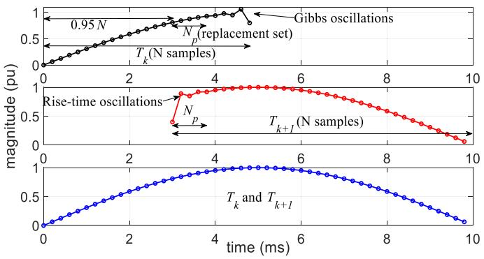  
Fig. 3. Illustration of overlapping two consecutive time-windows, $T _ { k }$ and $T _ { k + 1 } .$ with $N _ { p } = 5$ samples.

corresponding to 95% of N. This permits to discard Gibbs’ oscillations at the wave tail of $T _ { k }$ .

Step 2: Select the replacement sample set as samples 0.95N to $0 . 9 5 N + N _ { p }$ , with $N _ { p }$ being the number of samples in the set.   
Step 3: Simulate the next time-window, $T _ { k + 1 }$ , using another N samples and with initial condition given in Step 1, i.e., sample 0.95N.   
Step 4: Replace the first $N _ { p }$ samples (which show rise-time oscillations) of $T _ { k + 1 }$ with the replacement set given in Step 2. Join waveforms from $T _ { k }$ and $T _ { k + 1 }$ .   
Step 5: Repeat process for time-windows $T _ { k + 2 } , T _ { k + 3 } , . . . ,$ , until reaching the value of T.

Note that, to eliminate Gibbs oscillations at waveform’s tail, keeping between 90% to 95% samples has been widely used in existing research works, e.g., [8], with effective results. The influence of the damping factor c in the complex frequency, $s = c + j \omega ,$ is further analyzed in [19], where it is shown that, for some specific damping factors, up to 98% of samples can be kept.

Fig. 3 illustrates the overlapping approach with $N _ { p } ~ = ~ 5$ samples for the sake of illustration. The number of samples in the replacement set, $N _ { p } .$ , can be chosen by using (5), adopted from [10], to avoid overlapping with switching frequency oscillations from power electronic devices.

$$
N _ {p} = \left(\frac {1}{2 f _ {s w}}\right) \left(\frac {1}{\Delta t}\right). \tag {5}
$$

In $( 5 ) , f _ { s w }$ and $\Delta t$ correspond to switching frequency and time sampling, respectively. For example, assuming $f _ { s w } = 3$ kHz and $\Delta t = 2 0 \mu \mathrm { s } ;$ then (5) results in $N _ { p }$ equal to 8 samples.

In the authors’ experience, overlapping with $N _ { p }$ between 4 and 10 samples results in excellent results for all solution variables and with negligible computational resources. As mentioned in [10], (3) applies for oscillatory signals and it avoids that the number of overlapping samples exceeds the number of samples in a switching period. Also, supported by previous publications [8], [15], the rise-time oscillations involve a fast decay, as will be shown later via a case study, let us say within the first 10 samples at two consecutive time-window interfaces. To further support the suggested number of samples, 4 to 10, a numerical experiment has been performed by varying switching frequency

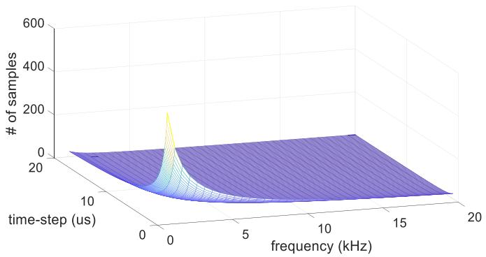  
Fig. 4. Time-step versus switching frequency to support the number of suggested samples for overlapping.

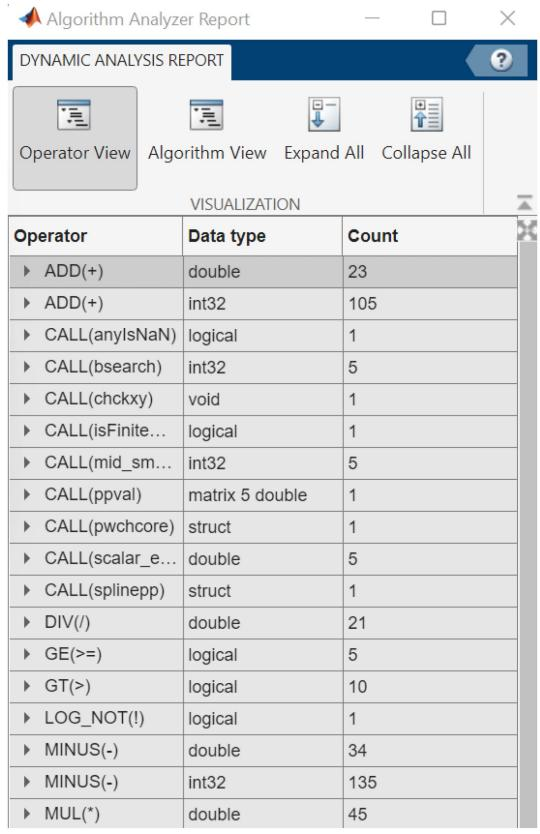  
Fig. 5. Number of operations for a single application of cubic interpolation.

from 1 kHz to 20 kHz and time-step from 0.1 μs to 20 $\mu \mathbf { S } .$ Evaluation of (5) results in the values of the vertical axis of Fig. 4 where a large area yields a number ranging from 4 to 10 samples.

It has been found, via numerical experiments, that the cputime by the overlapping operation is negligible compared to applying cubic spline interpolator. For example, for the cubic interpolation of a single variable, the counting of the number of mathematical operations is performed by using the Matlab in-built function socFunctionAnalyzer. Fig. 5 presents the corresponding report where, only for double precision floatingpoint values, 23 additions, 34 subtractions, 21 divisions, and 45 multiplications, are performed. On the contrary, for the overlapping procedure, just substitution of an array of 8 samples

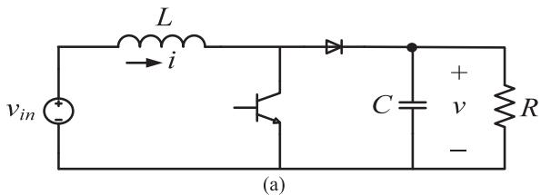

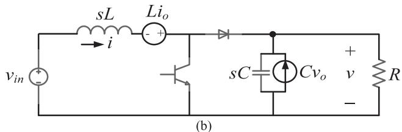  
Fig. 6. Boost converter circuit, adopted from [13]. (a) TD representation and (b) FD representation including initial conditions.

TABLE I PARAMETERS OF BOOST CONVERTER   

<table><tr><td colspan="3">Boost converter</td></tr><tr><td>L</td><td>100 μH</td><td>Inductance</td></tr><tr><td>C</td><td>4.4 μF</td><td>Capacitance</td></tr><tr><td>R</td><td>8 Ω</td><td>Resistance</td></tr><tr><td>D</td><td>0.5</td><td>Duty cycle</td></tr><tr><td>fs</td><td>10 kHz</td><td>Switching frequency</td></tr></table>

is carried out. Furthermore, since in the procedure described above the user has control of both time-window length and Gibbs oscillations, this makes the overlapping approach a simple yet effective solution to alleviate the rise-time oscillatory phenomenon.

# IV. CASE STUDIES AND NUMERICAL RESULTS

# A. Boost Converter

As introductory example, the DC/DC boost converter circuit in Fig. 6(a), adopted from [13], is used to illustrate the effect of FD averaging; open-loop operation is considered. The corresponding parameters are listed in Table I.

The TD relations of the boost converter circuit, see Fig. 6(a), are given in (6), where $q ( t )$ represents the switching function. With obvious notation, their FD counterparts are presented in (7) where $s _ { w }$ denotes a switching Toeplitz-type matrix either with full frequency content or considering only DC and fundamental frequency. In (7), $i _ { o }$ and $\nu _ { o }$ represent initial conditions for the dynamic elements L and C, respectively, see Fig. 6(b).

$$
d i / d t = \left[ v _ {i n} - (1 - q) v \right] / L \tag {6a}
$$

$$
d v / d t = [ (1 - q) i - v / R ] / C \tag {6b}
$$

$$
\left[ \begin{array}{c c} s _ {w} & s L \\ s C + 1 / R - s _ {w} \end{array} \right] \left[ \begin{array}{l} v \\ i \end{array} \right] = \left[ \begin{array}{l} v _ {i n} \\ 0 \end{array} \right] + \left[ \begin{array}{l} L i _ {o} \\ C v _ {o} \end{array} \right]. \tag {7}
$$

The system (7) is resolved via NLT with a single timewindow due to a very fast settlement to steady state. As for the

switching function $s _ { w } ,$ only DC and fundamental components are accounted for, as in (4c). This provides a switch-averaged FD-AVM.

The TD-AVM relations, corresponding to the circuit in Fig. 6(a) and found in [13], are repeated here as (8) using the same notation. The first two relations in (8) represent the DC dynamics and the other four relations model the fundamental (positive and negative) switching frequency. In (8), superscripts Re and Im denote real and imaginary parts, respectively. Also, for a constant duty ratio D the following relations apply to the switching function: $\langle q \rangle _ { 0 } = D , \langle q \rangle _ { 1 } ^ { \mathrm { R e } } = ( 1 / 2 \pi ) \sin ( 2 \pi D )$ , and $\langle q \rangle _ { 1 } ^ { \mathrm { I m } } = ( 1 / 2 \pi ) [ \cos ( 2 \pi D ) - 1 ]$ .

$$
\frac {d}{d t} \langle i \rangle_ {0} = \frac {1}{L} \left(V _ {i n} - \langle q \rangle_ {0} ^ {\prime} \langle v \rangle_ {0} + 2 \langle q \rangle_ {1} ^ {\mathrm {R e}} \langle v \rangle_ {1} ^ {\mathrm {R e}} + 2 \langle q \rangle_ {1} ^ {\mathrm {I m}} \langle v \rangle_ {1} ^ {\mathrm {I m}}\right) \tag {8a}
$$

$$
\frac {d}{d t} \langle v \rangle_ {0} = \frac {1}{C} \left(\langle q \rangle_ {0} ^ {\prime} \langle i \rangle_ {0} - 2 \langle q \rangle_ {1} ^ {\text {R e}} \langle i \rangle_ {1} ^ {\text {R e}} - 2 \langle q \rangle_ {1} ^ {\text {I m}} \langle i \rangle_ {1} ^ {\text {I m}} - \frac {\langle v \rangle_ {0}}{R}\right) \tag {8b}
$$

where $\begin{array} { r } { \langle q \rangle _ { 0 } ^ { \prime } = 1 - \langle q \rangle _ { 0 } . } \end{array}$ .

$$
\frac {d}{d t} \langle i \rangle_ {1} ^ {\mathrm {R e}} = \omega_ {s} \langle i \rangle_ {1} ^ {\mathrm {I m}} + \frac {1}{L} \left(- \langle q \rangle_ {0} ^ {\prime} \langle v \rangle_ {1} ^ {\mathrm {R e}} + \langle v \rangle_ {0} \langle q \rangle_ {1} ^ {\mathrm {R e}}\right) \tag {8c}
$$

$$
\frac {d}{d t} \langle i \rangle_ {1} ^ {\mathrm {I m}} = - \omega_ {s} \langle i \rangle_ {1} ^ {\mathrm {R e}} + \frac {1}{L} \left(- \langle q \rangle_ {0} ^ {\prime} \langle v \rangle_ {1} ^ {\mathrm {I m}} + \langle v \rangle_ {0} \langle q \rangle_ {1} ^ {\mathrm {I m}}\right) \tag {8d}
$$

$$
\frac {d}{d t} \langle v \rangle_ {1} ^ {\mathrm {R e}} = \omega_ {s} \langle v \rangle_ {1} ^ {\mathrm {I m}} + \frac {1}{C} \left(\langle q \rangle_ {0} ^ {\prime} \langle i \rangle_ {1} ^ {\mathrm {R e}} - \langle i \rangle_ {0} \langle q \rangle_ {1} ^ {\mathrm {R e}} - \frac {\langle v \rangle_ {1} ^ {\mathrm {R e}}}{R}\right) \tag {8e}
$$

$$
\frac {d}{d t} \langle v \rangle_ {1} ^ {\mathrm {I m}} = - \omega_ {s} \left\langle v \right\rangle_ {1} ^ {\mathrm {R e}} + \frac {1}{C} \left(\left\langle q \right\rangle_ {0} ^ {\prime} \left\langle i \right\rangle_ {1} ^ {\mathrm {I m}} - \left\langle i \right\rangle_ {0} \left\langle q \right\rangle_ {1} ^ {\mathrm {I m}} - \frac {\left\langle v \right\rangle_ {1} ^ {\mathrm {I m}}}{R}\right). \tag {8f}
$$

A predictor/corrector method, based on Euler/trapezoidal integration rules, is utilized to solve (6). On the other hand, trapezoidal rule is used to solve (8). As in [13], the initial conditions $i _ { o } = 0 . 5 \mathrm { A }$ and $\nu _ { o } = 5 \mathrm { \ : V }$ are assumed.

Fig. 7 presents the voltage and current waveforms given by the TD switching model (6) (labeled as TD, black trace), the FD-AVM model (7) (labeled as FD-AVM, blue trace), and classical TD-AVM model (8) (labeled as TD-AVM, red trace). The waveform shapes by both classical TD-AVM and FD-AVM models agree with the TD switching model recalling that only DC and fundamental switching frequency are utilized in both TD-AVM and FD-AVM; note that TD-AVM waveforms coincide with those in Fig. 3 of [13]. Also, note that, if one intends to accurately reproduce the TD switching model waveforms, in theory an infinite number of Fourier coefficients in TD-AVM, alternatively an infinite number of frequencies in FD-AVM, must be included.

The number of samples used for the three techniques is of 512. The cpu-times by TD, TD-AVM, and FD-AVM are of 0.0023 s, 0.0011 s, and 0.0008 s, respectively. The three methods are programmed under Matlab environment in a computer with Intel Core i7-8565U GHz, 16.0 GB, HD 500 GB.

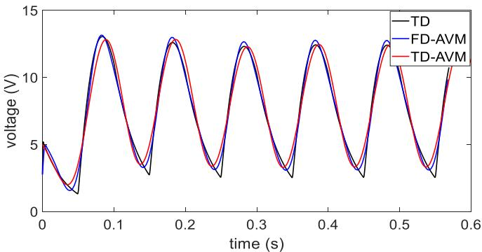

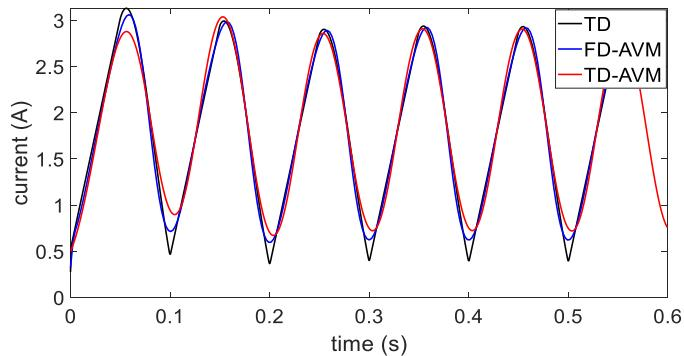  
(a)   
(b)   
Fig. 7. Transient waveforms for boost converter circuit (a) voltage and (b) current.

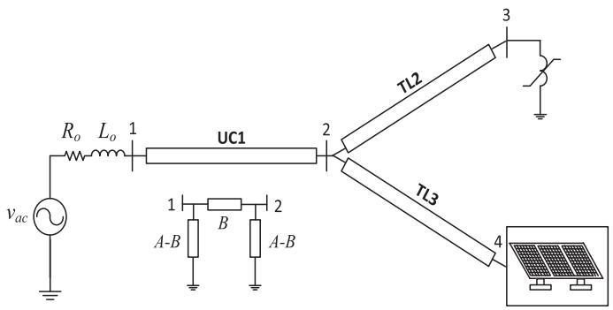  
Fig. 8. Network including nonlinear load and three-phase PV generator, taken from [11].

Fig. 7 shows that the proposed switching-averaged FD-AVM model provides in general a better agreement with the TD switching model than classical TD-AVM in terms of phase and magnitude. The rms errors, having as basis the TD switching model, are of 0.049 and 0.097 for FD-AVM and TD-AVM, respectively. This difference is attributed to the fact that the latter averages all variables (including switching function) while FD-AVM averages only the switching function, leaving the rest of variables untouched. It should be mentioned that, while such difference is not relevant for the present case study, it obviously becomes important for networks involving frequency-dependent components.

TABLE II DATA OF PV NETWORK   

<table><tr><td colspan="3">PV array at standard test conditions</td></tr><tr><td>Voc</td><td>365 V</td><td>Open-circuit voltage</td></tr><tr><td>Isc</td><td>15.2 A</td><td>Short-circuit current</td></tr><tr><td>Vmpp</td><td>290.8 V</td><td>Voltage at maximum power point</td></tr><tr><td>Impp</td><td>14.2 A</td><td>Current at maximum power point</td></tr><tr><td>Pmax</td><td>4129.4 W</td><td>Maximum power</td></tr><tr><td>Ns</td><td>468</td><td>Number of series connected cells</td></tr><tr><td>ki</td><td>0.00502 A/°C</td><td>Temperature correction factor, current</td></tr><tr><td>kv</td><td>-0.08 V/°C</td><td>Temperature correction factor, voltage</td></tr><tr><td>a</td><td>1.3</td><td>Ideality factor of diode</td></tr><tr><td colspan="3">Boost converter</td></tr><tr><td>L</td><td>9 mH</td><td>Inductance</td></tr><tr><td>C</td><td>2200 μF</td><td>Capacitance</td></tr><tr><td>Fs</td><td>10 kHz</td><td>Switching frequency</td></tr><tr><td>d</td><td>0.6</td><td>Duty cycle</td></tr><tr><td colspan="3">Voltage-sourced inverter</td></tr><tr><td>Fs</td><td>5 kHz</td><td>Switching frequency</td></tr><tr><td>ma</td><td>0.9</td><td>Modulating amplitude</td></tr><tr><td colspan="3">Filter</td></tr><tr><td>Rfc</td><td>1 mΩ</td><td>Resistance</td></tr><tr><td>Lfct</td><td>0.3 mH</td><td>Inductance</td></tr><tr><td>Rfg</td><td>1 mΩ</td><td>Resistance</td></tr><tr><td>Lfgt</td><td>0.15 mH</td><td>Inductance</td></tr><tr><td>Cf</td><td>2.2 μF</td><td>Capacitance</td></tr><tr><td colspan="3">Source voltage</td></tr><tr><td>Lo</td><td>0 mH</td><td>Inductance</td></tr><tr><td>Ro</td><td>0.1 Ω</td><td>Resistance</td></tr><tr><td>f</td><td>50 Hz</td><td>Frequency</td></tr><tr><td colspan="3">Nonlinear reactor</td></tr><tr><td>α</td><td>1</td><td>Constant</td></tr><tr><td>β</td><td>20</td><td>Constant</td></tr><tr><td>p</td><td>3</td><td>Order of polynomial</td></tr></table>

# B. Photovoltaic System

The network depicted in Fig. 8, taken from [11], is utilized to evaluate the proposed FD-AVM. It is composed by a three-phase source, two frequency-dependent lines (10 km long each) and one underground cable (10 km long), a nonlinear reactor, and the PV generator depicted in Fig. 9.

The corresponding data for this case study are listed in Table II. Both the linear part of the network (from nodes 3 and 4 to the left in Fig. 8) and the PV generator are represented by FD Norton equivalents. The Norton equivalent for the linear part can be readily obtained and it is not discussed in this paper. The Norton equivalent for the PV generator of Fig. 9 is given by (9) with details presented in [11].

$$
i _ {p c c} = Y _ {N p v} v _ {p c c} + i _ {N p v} \tag {9}
$$

where $\nu _ { p c c }$ and $i _ { p c c }$ correspond to FD voltage and current vectors at the point of common coupling, i.e., node 4; the FD admittance

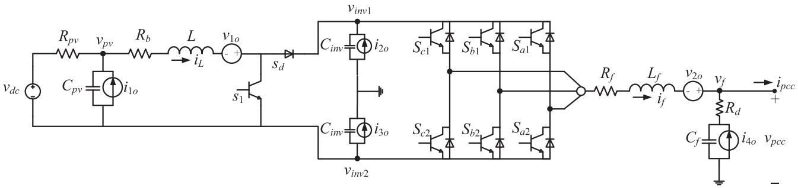  
Fig. 9. Equivalent circuit of three-phase PV generator with initial conditions, taken from [11].

matrix $Y _ { N p v }$ contains PV circuit parameters and switching matrices [11].

The FD vector $i _ { N p v }$ in (9) involves voltage/current sources from the PV generator’s circuital representation, as seen in Fig. 9, representing initial conditions for dynamic L and C elements, as our objective is to perform FD partitioned-time simulations. As for the lines/cable network, frequency-dependent current sources, indicating initial conditions, are calculated as in [8], [17].

The nonlinear reactor in the network under study is modeled by the p-order polynomial (10) which relates current $i _ { n l }$ and flux ϕ. For the dynamic voltage/flux relation (10b), initial condition $\varphi _ { o }$ is included in the sequential solution scheme.

$$
i _ {n l} = \alpha \varphi + \beta \varphi^ {p} \tag {10a}
$$

$$
v _ {n l} = s \varphi - \varphi_ {o}. \tag {10b}
$$

Because of the nonlinear reactor, a Newton-Raphson solution scheme is applied to the network of Fig. 8, considering only two fixed operating points for the PV generator. The start-up of the network of Fig. 8 is simulated via NLT with 20 time-windows (considering an irradiance of 1000 $\mathrm { W } / \mathrm { m } ^ { 2 }$ for the first half and 800 $\mathrm { W } / \mathrm { m } ^ { 2 }$ for the second half). The base solution, with $N = 5 1 2$ samples $( \Delta t = 3 9 \mu \mathrm { s } )$ for each time-window, neither averages switching functions nor alleviates numerical oscillations.

Fig. 10 presents the transient waveforms of voltage $\nu _ { p v }$ and voltage at the nonlinear load terminals, v3, and filter current $i _ { f }$ (see Fig. 9), for phase a only. The black traces correspond to the base solution (cpu-time of 79 s for the total simulation time); the magenta traces are given by application of both averaging and overlapping, using 256 samples $( \Delta t = 7 8 \mu \mathrm { s } )$ per time-window (cpu-time of 12 s for the total simulation time). Convergence to the half-value is very clear in the black trace of Fig. 10(a) for each simulated time-window. The results in Fig. 10 show the effectiveness of the proposed FD-AVM model in both averaging and alleviating numerical oscillations. Note that the results without average presented in Fig. 10 coincide with those by the approach proposed in [10], or in [11]. The main difference is that in [10] interpolations are applied to alleviate the rise-time oscillations.

The FD-AVM simulation of the network in Fig. 8 has further been verified with EMTP-RV [1] and XTAP [20], providing a very close agreement. Fig. 11 shows the comparison with EMTP-RV only. Note that, modeling the network of Fig. 8 via

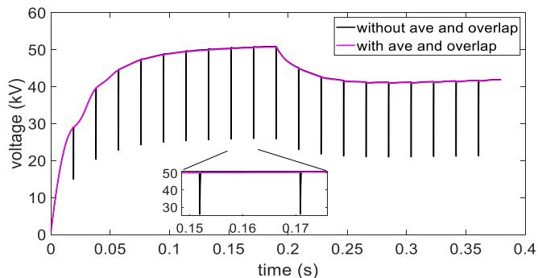

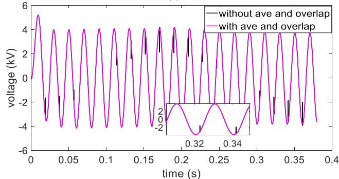

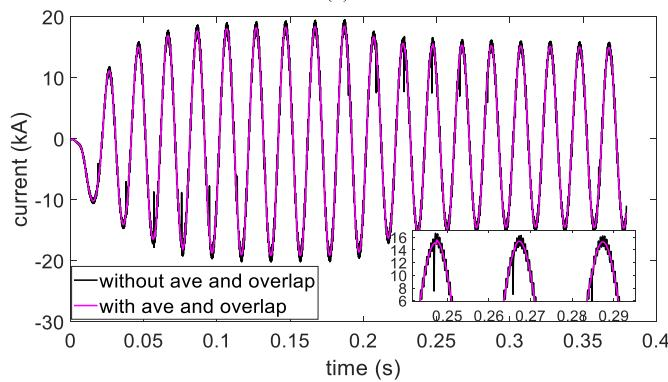  
  
Fig. 10. Transient waveforms with and without averaging and overlapping. (a) voltage $\nu _ { p v } ,$ (b) voltage at nonlinear load, v3, and (c) filter current $i _ { f } .$

TD-AVM becomes a challenge due to presence of frequency dependent (line/cable) components. Besides, to the best authors’ knowledge, AVM for nonlinear reactors has not been considered in the open literature. Therefore, TD-AVM is not considered for the comparison in this case study.

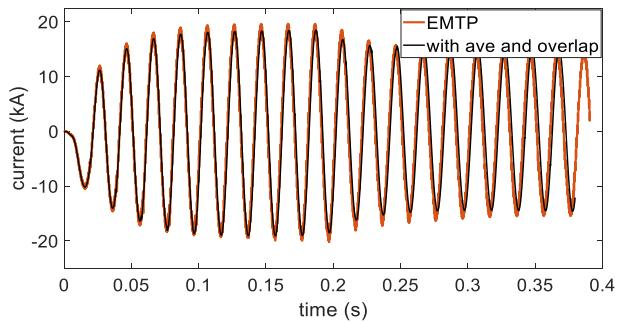  
Fig. 11. Transient waveforms with FD averaging and overlapping for filter current if and comparison with EMTP-RV.

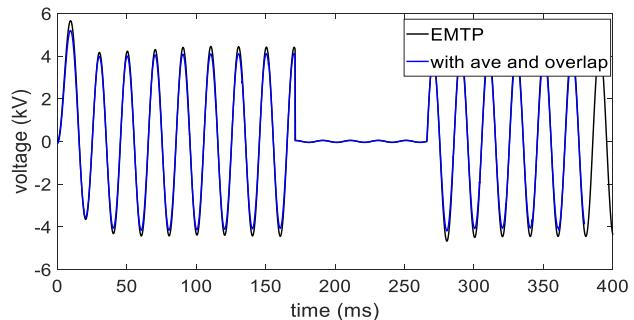  
(a)

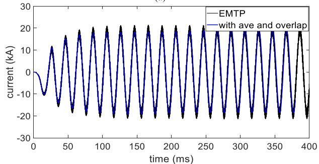  
  
Fig. 12. Transient waveforms by FD-AVM compared with those given by EMTP-RV. (a) voltage at nonlinear load, $\nu _ { 3 } ,$ and (b) filter current if.

# C. Simulation of Single-Phase Fault to Ground

The FD-AVM approach is further validated via a third case study. The transient scenario consists of a single-phase fault at the nonlinear load, node of the network in Fig. 8, leaving now the irradiance at a constant value of 1000 $\mathrm { W } / \mathrm { m } ^ { 2 }$ . The fault starts at $t = 0 . 1 7 \mathrm { s }$ and it is cleared at $t = 0 . 2 6 ~ \mathrm { s }$ . The FD-AVM, which applies both averaging and overlapping, uses 20 time-windows with 256 samples $( \Delta t = 7 8 ~ \mu \mathrm { s } )$ per time-window (cpu-time of 12.5 s for the total simulation time). Fig. 12 presents the transient waveforms for phase a of the voltage at the nonlinear load terminals, $\nu _ { 3 } ,$ , and the current through the PV filter $i _ { f } .$ The waveforms in Fig. 12, given by FD-AVM, are compared with those given by EMTP-RV; for the latter, a 1 μs time-step is utilized. Noting that FD-AVM provides averaged dynamics, some differences between the waveforms by FD-AVM and EMTP-RV in Fig. 12 can be attributed to distinct time-step, interpolation due to traveling times in EMTP-RV, assumption of ideal switches in FD-AVM, among others.

# V. DISCUSSION

This paper is aimed at advancing FD models for transient analysis, particularly PV generators connected to AC networks. Although FD techniques are not conceived to compete with TD methods, this paper demonstrates the flexibility of the former to simulate power electronic devices and nonlinear loads, both tied to traditional AC networks. Note that the size of the AC network, as in Fig. 8, is not a restriction in the proposed FD-AVM approach since the concept of frequency domain network equivalents (FDNE) is readily applicable, thus permitting to handle larger networks.

The fact that averaging in FD is a simple operation, yet providing effective results, gives the opportunity to incorporate controls, as will be shown in a future publication.

A weakness of the proposed approach is that frequencydependent sources are calculated for lines/cables. Note, however, that even with this computational burden, cpu time is around seven times smaller than previously proposed nonaveraged FD models, as demonstrated in the case study of Section IV-B.

# VI. CONCLUSION

This paper has presented a switch-averaged FD model of a PV system. The action of averaging switching functions permits to use fewer samples than classical NLT implementation. Also, this paper proposes a simple yet efficient solution to the issue of rise-time oscillations by overlapping a few samples (around 8) at time-windows interfaces. It has been observed that the application of these improvements results in lower computational efforts, with excellent results in the AVM context. It has been shown that the proposed FD AVM approach provides results closer to switching models than classical TD AVM technique. The assumption of a change in operating points for the PV case study can serve as basis for future control actions implementation.

# REFERENCES

[1] J. Mahseredjian, S. Dennetiere, L. Dube, B. Khodabakhchian, and L. Gerin-Lajoie, “On a new approach for the simulation of transients in power systems,” Electric Power Syst. Res., vol. 77, pp. 1514–1520, Sep. 2007.   
[2] S. M. Ghania and A. M. Hashmi, “Transient overvoltages simulation due to the integration process of large wind and photovoltaic farms with utility grids,” IEEE Access, vol. 9, pp. 43262–43270, Mar. 2021.   
[3] N. Lin, S. Cao, and V. Dinavahi, “Comprehensive modeling of large photovoltaic systems for heterogeneous parallel transient simulation of integrated AC/DC grid,” IEEE Trans. Energy Convers., vol. 35, no. 2, pp. 917–927, Jun. 2020.   
[4] C. Shah et al., “Review of dynamic and transient modeling of power electronic converters for converter dominated power systems,” IEEE Access, vol. 9, pp. 82094–82117, Jun. 2021.   
[5] D. J. Wilcox, “Numerical Laplace transformation and inversion,” Int. J. Elect. Eng. Educ., vol. 15, pp. 247–265, 1978.   
[6] L. M. Wedepohl, “Power system transients: Errors incurred in the numerical inversion of the Laplace transform,” in Proc. 26th Midwest Symp. Circuits Syst., 1983, Aug. pp. 174–178.   
[7] N. Nagaoka and A. Ametani, “A development of a generalized frequencydomain transient program–FTP,” IEEE Trans. Power Del., vol. 3, no. 4, pp. 1996–2004, Oct. 1988.   
[8] A. Ramirez and P. Moreno, “Partitioned-time transient simulation via a hybrid time-frequency domain methodology,” IEEE Trans. Power Del., vol. 26, no. 2, pp. 764–771, Apr. 2011.

[9] J. Hernandez-Ramirez, J. Segundo, P. Gomez, M. Borghei, and M. Ghassemi, “Statistical switching overvoltage studies of optimized unconventional high surge impedance loading lines via numerical Laplace transform,” IEEE Trans. Power Del., vol. 36, no. 4, pp. 2145–2153, Aug. 2021.   
[10] F. Diaz and A. Ramirez, “Sequential simulation of three-phase photovoltaic systems in frequency domain,” in Proc. 53rd North Amer. Power Symp., 2021, pp. 1–6.   
[11] A. Ramirez, “Frequency domain modeling of photovoltaic systems for transient analysis,” IEEE Trans. Power Del., early access, Dec. 21, 2021, doi: 10.1109/TPWRD.2021.3137273.   
[12] S. R. Sanders, J. M. Noworolski, X. Z. Liu, and G. C. Verghese, “Generalized averaging method for power conversion circuits,” IEEE Trans. Power Electron., vol. 6, no. 2, pp. 251–259, Apr. 1991.   
[13] V. A. Caliskan, G. C. Verghese, and A. M. Stankovic, “Multifrequency averaging of DC/DC converters,” IEEE Trans. Power Electron., vol. 14, no. 1, pp. 124–133, Jan. 1999.   
[14] S. Chiniforoosh et al., “Definitions and applications of dynamic average models for analysis of power systems,” IEEE Trans. Power Del., vol. 25, no. 4, pp. 2655–2669, Oct. 2010.

[15] A. Yazdani and R. Iravani, “Dynamic model and control of the NPC-based back-to-back HVDC system,” IEEE Trans. Power Del., vol. 21, no. 1, pp. 414–424, Jan. 2006.   
[16] W. Xiao, F. F. Edwin, G. Spagnuolo, and J. Jatskevich, “Efficient approaches for modeling and simulating photovoltaic power systems,” IEEE J. Photovolt., vol. 3, no. 1, pp. 500–508, Jan. 2013.   
[17] A. Ramirez and R. Iravani, “Frequency-domain simulation of electromagnetic transients using variable sampling time-step,” IEEE Trans. Power Del., vol. 30, no. 6, pp. 2602–2604, Dec. 2015.   
[18] J. C. Das, Transients in Electrical Systems: Analysis, Recognition, and Mitigation. New York, NY, USA: McGraw Hill, 2010.   
[19] A. Ramirez and G. Combariza, “Reduced-sample numerical Laplace transform for transient and steady-state simulations,” Int. J. Elect. Power Energy Syst., vol. 109, pp. 480–494, 2019.   
[20] eXpandable Transient Analysis Program (XTAP), CRIEPI-Japan. [Online]. Available: https://www.xtap.org/