# Efficient electromagnetic transient simulation for DFIG-based wind farms using fine-grained network partitioning✩

Jiale Yu, Haoran Zhao ∗, Yibao Jiang ∗, Bing Li, Linghan Meng, Futao Yang

School of Electrical Engineering, Shandong University, Jinan, 250061, China

# A R T I C L E I N F O

Keywords:

Large-scale wind farm

Doubly fed induction generator based wind

turbine

Electromagnetic transient

Parallel computing

Fine-grained network partitioning

# A B S T R A C T

Electromagnetic transient (EMT) simulation plays a critical role in understanding the dynamic behavior and fast transients involved in wind farms (WFs). However, as WFs continue to develop on a large scale, the increasing number of wind turbines and network nodes poses significant challenges for efficient EMT simulation of WFs. To address this issue, we propose a fine-grained network decoupling method for doubly-fed induction generator (DFIG) based WFs. This paper first establishes the decoupling algorithm for core electrical equipment of DFIG-based WFs. By employing device-level fine-grained decoupling, the dimensionality of the admittance matrix for WF is effectively reduced, significantly decreasing the computational load. Additionally, this paper establishes a scalable computational framework by integrating multi-threaded parallel computation into the simulation process, which enhances efficiency further. The proposed method is compared with detailed models in Matlab/Simulink to verify efficiency and accuracy. Simulation results demonstrate that this method significantly improves simulation efficiency, achieving a two-order-of-magnitude speedup with 50 wind turbines, and it maintains high simulation accuracy, with a maximum relative error of 1.68%.

# 1. Introduction

With the increasing global energy demand and worsening environmental issues, the large-scale grid integration of wind power has become inevitable [1]. Doubly fed induction generator (DFIG) based wind turbines, with advantages such as low cost and high regulation flexibility [2], have been widely used in onshore and offshore wind farms (WFs). In order to accurately reveal the high-frequency dynamic characteristics of DFIG-based WFs, electromagnetic transient (EMT) simulation is necessary [3]. Establishing highly efficient EMT simulation methods is crucial for renewable energy integration and stable system operation [4].

However, WFs continue to develop on a large scale, resulting in increasingly complex topologies and a rising number of nodes [5]. EMT simulation of WFs based on detailed model encounters challenges such as high computational complexity, high matrix dimensionality, and small simulation time step [6]. These challenges make it difficult to meet the efficiency requirements for scientific research and practical engineering applications. Currently, research on efficient EMT simulation methods for large-scale WFs can be categorized into three main types: dynamic equivalence methods [7], node elimination methods [8], and network parallelization methods [9].

For the dynamic equivalence methods of WFs, existing research mainly includes two categories [10,11]: model order reduction methods and equivalence methods. Model order reduction methods utilize techniques such as singular value decomposition [12] and Krylov subspace methods [13] to obtain simplified models for WFs. Equivalence methods, on the other hand, represent the WFs as one or several equivalent wind turbines [14]. These dynamic equivalence methods significantly improve the simulation efficiency [15]. However, they cannot cover all operating conditions of WFs or reflect the internal states of the wind turbines, which limits the simulation accuracy and applicability of these models [16].

Considering that dynamic equivalence methods cannot reflect internal states, some studies have proposed the node elimination methods. These methods achieve lossless internal node elimination of wind turbines based on nested fast and simultaneous solution method (NFSS) or Thévenin/Norton equivalent principles [17], and can obtain internal information through inversion techniques [18], thereby improving simulation efficiency while maintaining high accuracy [19]. However, the derivation processes for these methods are relatively complex. When the topology changes, re-derivation is necessitated, which is time-consuming and reduces the flexibility of the approach [20].

Distinct from the node elimination method, the network parallelization methods emphasize dividing the detailed model of WFs into multiple independently solvable subsystems. Subsequently, the states of each subsystem can be obtained in parallel [21]. In light of the rapid advancements in parallel computing devices and the current constraints on serial computation efficiency, these methods are gradually emerging as a current academic focus [22]. Ref. [23] introduces the decoupling method based on the Bergeron transmission line model (TLM). However, TLM necessitates the presence of long transmission lines with propagation delays exceeding the simulation time step, thereby limiting its flexibility. Additionally, Ref. [24–26] respectively propose the state space nodal method, multi-area Thévenin equivalent method, and compensation method. However, these methods exhibit the ??(??3) relationship between the number of subsystems and the computation complexity of interconnection variables, which restricts their application to coarse-grained partitioning. Consequently, each subsystem still contains an excessive number of nodes, which poses difficulties in further simulation acceleration. Ref. [27] developed a fine-grained decoupling method for permanent magnet synchronous generator (PMSG) based WFs using the semi-implicit decoupling method. Nevertheless, the modeling and solving processes for the generator and converter are complex, leaving room for further optimization. Furthermore, the introduction of the half-step delay complicates the timing design. Ref. [22] proposed a decoupling method for PMSG-based WFs using the latency insertion method. However, the introduction of small inductors and capacitors alters the system’s dynamic characteristics, requiring simulation time steps at the nanosecond or sub-microsecond level, which significantly limits simulation efficiency.

To address the aforementioned issues, and considering the lack of research on fine-grained network partitioning for DFIG-based WFs, this paper proposes a novel fine-grained network partitioning method. Compared to previous methods, the main contributions of this paper are as follows:

(1) Fully EMT high-efficiency simulation models for the core equipment are established. They overcome the limitations of dynamic equivalence models that cannot reflect the internal states of wind turbines. Additionally, they avoid the frequent matrix inversions in DFIG and converter, significantly enhancing the computational efficiency of the core equipment.   
(2) A device-level fine-grained network partitioning method for DFIG-based WFs is proposed. This method addresses the problem of excessive nodes in subsystems, and it overcomes the limitations of existing fine-grained network partitioning methods that require submicrosecond or nanosecond simulation time steps, significantly reducing the computational load.   
(3) A scalable parallel simulation framework based on the OpenMP programming model is proposed. This framework features a simple computational process and strong scalability, which ensures high simulation efficiency as the scale of the wind farm increases.

The remainder of this article is structured as follows: Section 2 introduces the fundamental modeling and simulation theory of WFs. Section 3 details the device-level fine-grained decoupling method for core electrical equipment. Section 4 describes the device-level finegrained decoupling method for DFIG-based WFs. Section 5 presents the parallel implementation scheme for large-scale WFs based on finegrained decoupling. Section 6 verifies the accuracy and efficiency of the proposed model. Finally, Section 7 draws conclusions.

# 2. Fundamental modeling and simulation theory of WF

The electrical system of a WF consists of two parts: wind turbines and the collection system. Wind turbines convert wind energy into kinetic energy in the rotor, which is subsequently transformed into alternating current (AC) power and fed into the collection system. The collection system aggregates the generated electrical energy and

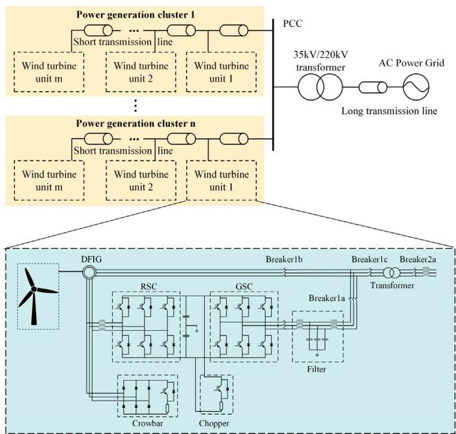  
Fig. 1. Topology of large-scale DFIG-based wind farm.

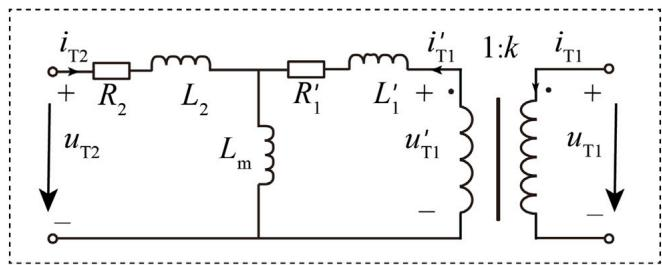  
Fig. 2. T-type equivalent circuit of single-phase transformer.

transmits it to the grid via step-up transformers and long-distance transmission lines. The topology of a large-scale WF is shown in Fig. 1.

In this section, the basic modeling methods for core electrical equipment of WFs and the fundamental EMT simulation methods of WFs will be introduced.

# 2.1. Basic modeling methods for core electrical equipment of WFs

A wind farm contains numerous complex electrical equipment, including DFIGs, transformers, back-to-back converters, filters, and transmission lines. This section introduces the basic mathematical models used for each equipment before decoupling, as detailed below.

The mathematical model of the DFIG includes the voltage balance equation, flux linkage equation, electromagnetic torque equation, and rotor motion equation [28]. When in an arbitrary rotating dq0 coordinate system, the mathematical model of the DFIG is detailed in Appendix A.1.

Transformers are typically modeled utilizing a T-type equivalent circuit. For example, the topology of a single-phase transformer is illustrated in Fig. 2, which includes an ideal transformer with a turns ratio of ?? ∶ 1. In this model, $u _ { \mathrm { T 1 } }$ and $i _ { \mathrm { T 1 } }$ represent the primary side voltage and current, ??T2 and ??T2 represent the secondary side voltage and current. The winding resistance and leakage reactance are all referred to the secondary side.

Converters in WFs typically utilize two-level voltage source converters (VSCs). This paper employs a switch function method for VSC modeling, which is detailed in Appendix A.2. This model can accurately capture the external characteristics of two-level VSCs and reflect their

internal switching states. Additionally, unlike $R _ { \mathrm { o n } } / R _ { \mathrm { o f f } }$ models, the switch function model maintains a constant nodal admittance matrix regardless of the converters’ switching states. This reduces the computation load of WFs.

Additionally, filters are modeled using a T-type LCL equivalent circuit, while transmission lines are modeled using a lumped parameter line model. Considering these models are widely utilized, further details will not be elaborated here.

# 2.2. Fundamental EMT simulation methods of WF

The basic EMT simulation methods in power systems can be categorized into nodal analysis method and state space analysis method [29]. Compared to the state space analysis method, the nodal analysis method offers a more straightforward solution process. Therefore, this paper employs the nodal analysis method as the foundation for EMT simulations. The simulation steps are divided into the following two stages:

# 2.2.1. Discretization of the dynamic equations of basic circuit elements

As noted in Section 2.1, basic circuit elements(L, $\mathrm { C } ,$ R) and power sources can be used to model the transformers, converters, and other equipment in WF. Subsequently, by connecting the equipment models based on WF topology, the circuit models of WF can be established. However, the $\mathrm { L } , \mathrm { C } ,$ RL, and RC branches in this model cannot be directly used for EMT simulation. Before conducting the EMT simulation of WF, it is necessary to discretize the dynamic equations of these branches using numerical integration methods at each time step, thus making them equivalent to a historical current source in parallel with an equivalent conductance [30,31].

Taking the inductance branch as an example, the process of discretization is introduced below. The dynamic equation of the inductance branch is shown in (1). After applying the weighted numerical integration method, its discretized equation is obtained, as shown in (2). By transposing and simplifying, Eq. (3) is derived.

$$
u _ {k m} (t) = u _ {k} (t) - u _ {m} (t) = L \frac {\mathrm {d} i _ {k m} (t)}{\mathrm {d} t} \tag {1}
$$

$$
i _ {k m} (t) - i _ {k m} (t - \Delta t) = \alpha \frac {\Delta t}{L} u _ {k m} (t) + (1 - \alpha) \frac {\Delta t}{L} u _ {k m} (t - \Delta t) \tag {2}
$$

$$
\left\{ \begin{array}{l} i _ {k m} (t) = G _ {\mathrm {e q}} u _ {k m} (t) + I _ {\mathrm {h}} (t - \Delta t) \\ I _ {\mathrm {h}} (t - \Delta t) = A _ {1} i _ {k m} (t - \Delta t) + A _ {2} G _ {\mathrm {e q}} u _ {k m} (t - \Delta t) \end{array} \right. \tag {3}
$$

In the equation, ?? is the weighting factor. When $\theta ~ = ~ 1 / 2 ,$ , the integration method corresponds to the implicit trapezoidal method, while ?? = 1 corresponds to the backward Euler method; $A _ { 1 }$ and $A _ { 2 }$ are the coefficients of the historical current terms, where $A _ { 1 } = 1$ and $A _ { 2 } = ( 1 - \alpha ) / \alpha ; G _ { \mathrm { e q } }$ is the equivalent conductance of each branch, where $G _ { \mathrm { e q } } ~ = ~ \alpha { \varDelta { t } } / { \cal L } ;$ and $I _ { \mathrm { h } } ( t - \Delta t )$ represents the historical current source value.

From (3), it can be inferred that the transient model of the inductance branch can be represented as a Norton equivalent circuit, which consists of a conductance $G _ { \mathrm { e q } }$ in parallel with a historical current source, as shown in Fig. 3. Similarly, the transient models for other branches can be derived. The equivalent conductance $G _ { \mathrm { e q } } ,$ , along with the coefficients $A _ { 1 }$ and $A _ { 2 }$ for various branch types are given in Table 1.

# 2.2.2. Modified nodal analysis method solution

After the discretization process, the electrical system model of the WFs contains only resistors and power sources. Therefore, the modified nodal analysis method (MNA) [32] can be used to solve for the instantaneous values of node voltages and branch currents. Then, return to the previous step. These two steps are repeated continuously until the simulation is complete.

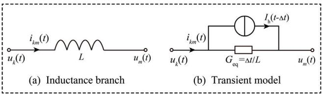  
Fig. 3. Inductance branch and its transient model.

Table 1 Coefficients for various branch types.   

<table><tr><td>Type</td><td>\( {G}_{\text{eq }} \)</td><td>\( {A}_{1} \)</td><td>\( {A}_{2} \)</td></tr><tr><td>\( R \)</td><td>\( \frac{1}{R} \)</td><td>0</td><td>0</td></tr><tr><td>\( L \)</td><td>\( \frac{\alpha \Delta t}{L} \)</td><td>1</td><td>\( \frac{1 - \alpha }{\alpha } \)</td></tr><tr><td>\( C \)</td><td>\( \frac{C}{\alpha \Delta t} \)</td><td>\( \frac{1 - \alpha }{\alpha } \)</td><td>-1</td></tr><tr><td>\( {RL} \)</td><td>\( \frac{\alpha \Delta t}{L + \alpha R\Delta t} \)</td><td>\( \frac{\left( {1 - \alpha }\right) R\Delta t + L}{L + \alpha R\Delta t} \)</td><td>\( \frac{1 - \alpha }{\alpha } \)</td></tr><tr><td>\( {RC} \)</td><td>\( \frac{C}{{CR} + \alpha \Delta t} \)</td><td>\( \frac{\left( {1 - \alpha }\right) \Delta t + {CR}}{CR + \alpha \Delta t} \)</td><td>-1</td></tr></table>

# 3. Device-level fine-grained decoupling method for core electrical equipment

Section 2 introduced the fundamental methods for modeling and simulation of WFs. However, if these basic methods are directly applied to the EMT simulation of WFs, the modified nodal voltage equations can reach dimensions of nearly a thousand for a WF with just ten wind turbines, making efficient simulation challenging. To address the above issues, this section establishes the decoupling methods and equivalent circuits for core electrical equipment based on the characteristics of different equipment.

# 3.1. Decoupling method and equivalent circuit for DFIG

# 3.1.1. Decoupling method for T-type LLL branch

Considering that the T-type LLL branch is the main component of the circuits for the DFIG and transformer, the decoupling method for the T-type LLL branch is introduced first. The circuit diagram for this branch is illustrated in Fig. 4(a), and its state space equations are provided in (4), (5) and (6).

$$
L _ {\mathrm {A}} \frac {\mathrm {d} i _ {\mathrm {A}}}{\mathrm {d} t} + i _ {\mathrm {A}} R _ {\mathrm {A}} = u _ {\mathrm {A}} - u _ {\mathrm {m}} \tag {4}
$$

$$
L _ {\mathrm {B}} \frac {\mathrm {d} i _ {\mathrm {B}}}{\mathrm {d} t} + i _ {\mathrm {B}} R _ {\mathrm {B}} = u _ {\mathrm {B}} - u _ {\mathrm {m}} \tag {5}
$$

$$
L _ {\mathrm {m}} \frac {\mathrm {d} i _ {\mathrm {m}}}{\mathrm {d} t} = u _ {\mathrm {m}} \tag {6}
$$

By applying the trapezoidal integration method and the explicit Euler method to discretize (4) and (5) at time steps $( n , n + 1 ) ,$ , with a discrete time step of $\varDelta t ,$ and considering $i _ { \mathrm { { m } } } = i _ { \mathrm { { A } } } + i _ { \mathrm { { B } } }$ , (4) and (5) can be combined to eliminate the $i _ { \mathrm { m } }$ terms in Eq. (6). After this process, we obtain Eqs. (7), (8) and (9).

$$
i _ {\mathrm {A}} ^ {n + 1} = \left(\left(\frac {L _ {\mathrm {A}}}{\Delta t} - \frac {R _ {\mathrm {A}}}{2}\right) i _ {\mathrm {A}} ^ {n} + u _ {\mathrm {A}} ^ {n} - u _ {\mathrm {m}} ^ {n}\right) / \left(\frac {L _ {\mathrm {A}}}{\Delta t} + \frac {R _ {\mathrm {A}}}{2}\right) \tag {7}
$$

$$
i _ {\mathrm {B}} ^ {n + 1} = \left(\left(\frac {L _ {\mathrm {B}}}{\Delta t} - \frac {R _ {\mathrm {B}}}{2}\right) i _ {\mathrm {B}} ^ {n} + u _ {\mathrm {B}} ^ {n} - u _ {\mathrm {m}} ^ {n}\right) / \left(\frac {L _ {\mathrm {B}}}{\Delta t} + \frac {R _ {\mathrm {B}}}{2}\right) \tag {8}
$$

$$
u _ {\mathrm {m}} ^ {n} = \frac {\left(\frac {L _ {\mathrm {m}}}{L _ {\mathrm {A}}} u _ {\mathrm {A}} ^ {n} + \frac {L _ {\mathrm {m}}}{L _ {\mathrm {B}}} u _ {B} ^ {n} - \frac {L _ {\mathrm {m}}}{L _ {\mathrm {A}}} i _ {\mathrm {A}} ^ {n} R _ {\mathrm {A}} - \frac {L _ {\mathrm {m}}}{L _ {\mathrm {B}}} i _ {B} ^ {n} R _ {\mathrm {B}}\right)}{\left(\frac {L _ {\mathrm {m}}}{L _ {\mathrm {A}}} + \frac {L _ {\mathrm {m}}}{L _ {\mathrm {B}}} + 1\right)} \tag {9}
$$

Based on these equations, a decoupling simulation process using the LLL branch can be established, dividing the overall system into three

subsystems: subsystem A, subsystem B, and the LLL branch. The specific steps are as follows:

First, given the port voltages $u _ { \mathsf { A } } ^ { n }$ and $u _ { \mathrm { B } } ^ { n } ,$ , and the branch currents $i _ { \mathrm { A } } ^ { n }$ and $i _ { \mathrm { B } } ^ { n } ,$ Eq. (9) can be utilized to solve for the voltage $u _ { \mathrm { { m } } } ^ { n }$ at time ??????.

Next, the obtained voltage $u _ { \mathrm { { m } } } ^ { n }$ is substituted into $( 7 )$ and (8) to estimate the branch currents $i _ { \mathrm { A } } ^ { n + 1 }$ and $i _ { \mathrm { B } } ^ { n + 1 }$ . Once the branch currents at time $( n + 1 ) \Delta t$ are obtained, they can be injected as controlled current sources into subsystems A and B, making subsystems A and B independent of each other at time (?? + 1)????. Therefore, this process effectively decouples the subsystems on both sides of the LLL branch, as illustrated in Fig. 4(b).

Finally, the state variables of each subsystem at time (??+1)???? can be solved in parallel using the MNA method, allowing for the simultaneous acquisition of the port voltages $u _ { \mathrm { A } } ^ { n + 1 }$ and $u _ { \mathrm { B } } ^ { n + 1 }$ at time (?? + 1)????, which then initiates the next round of simulation operations.

These steps are repeated until the simulation ends.

# 3.1.2. Decoupling method for DFIG using T-type LLL branch

As indicated in Appendix, the equivalent model of the DFIG consists of T-type circuits, each with three inductive branches. Taking the ??-axis voltage balance equation as an example, its equivalent circuit is shown in Fig. 5. By applying the decoupling method for the T-type LLL branch to its mathematical model, the DFIG can be effectively decoupled from the external electrical system on both sides.

Additionally, as demonstrated in Appendix A.1, the voltage balance equations of the DFIG, when decomposed into the dq-axis, exhibit flux linkage coupling between the dq-axes. Typically, solving these equations requires simultaneous solution of the voltage balance equations and flux linkage equations, necessitating matrix inversion at each time step, which affects simulation efficiency. To address this issue, this paper employs an approximate single time step method, where the term $\psi ^ { n + 1 }$ in the DFIG equations is approximated to $\psi ^ { n } .$ . This approximation eliminates the coupling between the voltage and flux linkage equations at time (?? + 1)????, thereby avoiding the need for matrix inversion.

Following the approaches mentioned above, the discrete state equations for the DFIG are derived as follows.

$$
\left\{\begin{array} { l }i _ { \mathrm { s d } } ^ { n + 1 } = \frac { \left( \frac { L _ { \mathrm { l s } } } { \Delta t } - \frac { R _ { \mathrm { s } } } { 2 } \right) i _ { \mathrm { s d } } ^ { n } + u _ { \mathrm { s d } } ^ { n } + \omega \psi _ { \mathrm { s q } } ^ { n } - u _ { \mathrm { m d } } ^ { n } } { \frac { L _ { \mathrm { l s } } } { \Delta t } + \frac { R _ { \mathrm { s } } } { 2 } }\\i _ { \mathrm { r d } } ^ { n + 1 } = \frac { \left( \frac { L _ { \mathrm { l r } } } { \Delta t } - \frac { R _ { \mathrm { r } } } { 2 } \right) i _ { \mathrm { r d } } ^ { n } + u _ { \mathrm { r d } } ^ { n } + ( \omega - \omega _ { \mathrm { r } } ) \psi _ { \mathrm { r q } } ^ { n } - u _ { \mathrm { m d } } ^ { n } } { \frac { L _ { \mathrm { l r } } } { \Delta t } + \frac { R _ { \mathrm { r } } } { 2 } }\\u _ { \mathrm { m d } } ^ { n } = \left[ \frac { L _ { \mathrm { m } } } { L _ { \mathrm { l s } } } \left( u _ { \mathrm { s d } } ^ { n } + \omega \psi _ { \mathrm { s q } } ^ { n } \right) + \frac { L _ { \mathrm { m } } } { L _ { \mathrm { l r } } } \left( u _ { \mathrm { r d } } ^ { n } + ( \omega - \omega _ { \mathrm { r } } ) \psi _ { \mathrm { r q } } ^ { n } \right) - \frac { L _ { \mathrm { m } } } { L _ { \mathrm { l s } } } R _ { \mathrm { s } } i _ { \mathrm { s d } } ^ { n } - \frac { L _ { \mathrm { m } } } { L _ { \mathrm { l r } } } R _ { \mathrm { r } } i _ { \mathrm { r d } } ^ { n } \right] / \left( \frac { L _ { \mathrm { m } } } { L _ { \mathrm { l s } } } + \frac { L _ { \mathrm { m } } } { L _ { \mathrm { l r } } } + 1 \right)\\i _ { \mathrm { s q } } ^ { n + 1 } = \frac { \left( \frac { L _ { \mathrm { l s } } } { \Delta t } - \frac { R _ {\mathrm { s}}}{ 2} \right) i _ { \mathrm { s q } } ^ { n } + u _ { \mathrm { s q } } ^ { n } - \omega \psi _ { \mathrm { s d } } ^ { n } - u _ { \mathrm { m q } } ^ { n }}{ \frac { L _ { \mathrm { l s } } } { \Delta t } + \frac { R _ {\mathrm { s}}}{ 2}}\\i _ { \mathrm { r q } } ^ { n + 1 } = \frac { \left( \frac { L _ { \mathrm { l r } } } { \Delta t } - \frac { R _ {\mathrm { r}}}{ 2} \right) i _ { \mathrm { r q } } ^ { n } + u _ { \mathrm { r q } } ^ { n } - ( \omega - \omega _ {\mathrm r})   \psi _ {\mathrm r d} ^ { n } - u _ {\mathrm m q} ^ { n }}{ \frac { L _ {\mathrm r}}{ A t} + \frac{R_{\mathrm r}}{ 2}}\\u _ {\mathrm m q} ^ {\prime} = \left[ \right. \frac{L_{\mathrm m}}{L_{\mathrm l}\mathrm{s}}\left(u_{\mathrm s q}^{\prime} -\omega\psi_{\mathrm sd}^{\prime}\right) +\frac{L_{\mathrm m}}{L_{\mathrm l}\mathrm{r}}\left(u_{\mathrm r q}^{\prime} -(\omega -\omega_{\mathrm r})\psi_{\mathrm rd}^{\prime}\right)\\-\frac{L_{\mathrm m}}{L_{\mathrm l}\mathrm{s}}R_{\mathrm s}i_{\mathrm sq}^{n}-\frac{L_{\mathrm m}}{L_{\mathrm l}\mathrm{r}}R_{\mathrm r}i_{\mathrm rq}^{n}\Bigg]/  (  \frac{L_{\mathrm m}}{L_{\mathrm l}\mathrm{s}}+  \frac{L_{\mathrm m}}{L_{\mathrm l}\mathrm{r}}+1  )\\\end{array}\right. (10)
$$

Eqs. (10) and (11) represent the decoupled ??-axis and ??-axis voltage balance equations, respectively. In these equations, the subscripts d and q represent the ??-axis and ??-axis, respectively, while the subscripts s and r represent the stator and rotor of the DFIG. ?? denotes the

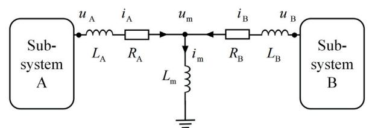  
(a)T-type LLL branch

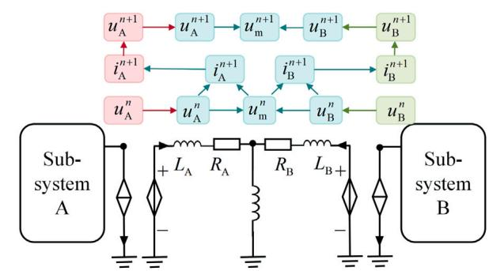  
(b） Decoupling model of T-type LLL branch

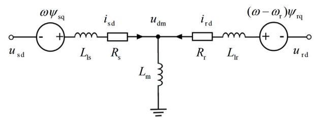  
Fig. 4. T-type LLL branch circuit diagram.

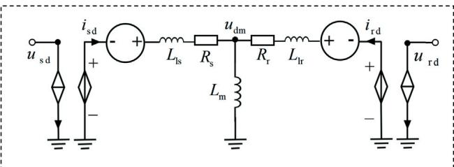  
Fig. 5. Equivalent circuit of ??-axis voltage equation.   
Fig. 6. Decoupling model of ??-axis equation.

voltage of each winding; ?? denotes the current of each winding; ?? denotes the flux linkage of each winding; ?? denotes the resistance of each winding; ?? represents the self-inductance and mutual inductance of each winding; ?? represents the electrical angular velocity of the rotating dq0 coordinate system; and ?? represents the electrical angular velocity of the rotor.

Based on the aforementioned discrete equations, the equivalent circuit of the DFIG can be obtained. Taking the ??-axis as an example, the equivalent circuit for the ??-axis voltage balance equation is shown in Fig. 6. As can be seen, this method effectively eliminates the coupling between equations, thereby achieving decoupling between different subsystems.

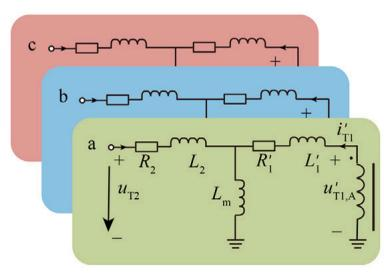

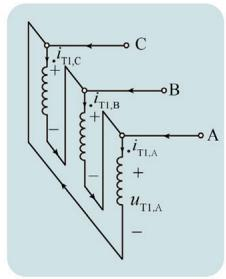  
Fig. 7. Equivalent circuit of three-phase transformer.

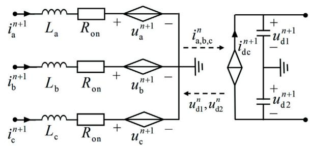  
Fig. 8. Decoupling model of two-level VSC.

# 3.2. Decoupling method and equivalent circuit for transformer

In wind turbines, D/yn1 connection group based three-phase transformers are typically employed to prevent the injection of zero-sequence currents and higher-order harmonics (usually third harmonics) into the external grid. For this type of transformer, in order to facilitate decoupling using the T-type LLL branch decoupling method, the highvoltage side winding impedance needs to be referred to the low-voltage side. After referring to the impedance, the equivalent circuit is shown in Fig. 7.

The equivalent circuit consists of three sets of T-type LLL branches. Therefore, the decoupling method described in Section 3.1.1 can be employed to decouple the transformer from the surrounding electrical systems. Since the decoupling principle is identical to that used for the LLL branches and the DFIG, a detailed explanation is not provided here.

# 3.3. Decoupling method and equivalent circuit for VSC

The operating states of a converter include blocking and nonblocking modes. In the blocking state, all converter branches can be treated as open circuits, thereby naturally achieving decoupling between the subsystems on both sides of the converter.

When the converter is in the non-blocking state, its state equations are detailed in Appendix A.2. Considering the topology of the wind turbine, which includes large capacitors on the DC side and inductors on the AC side of the converter, the DC side voltage or AC side current can be considered constant over a single time step. By applying a single time step approximation, the discrete equation shown in (12) can be obtained. This approach allows for the decoupling of the subsystems on both sides of the converter. The equivalent circuit is shown in Fig. 8.

$$
\left[ \begin{array}{l} u _ {a} ^ {n + 1} \\ u _ {b} ^ {n + 1} \\ u _ {c} ^ {n + 1} \\ i _ {d c} ^ {n + 1} \end{array} \right] = \left[ \begin{array}{c c c c c} R _ {\text {o n}} & & & S _ {a} & (S _ {a} - 1) \\ & R _ {\text {o n}} & & S _ {b} & (S _ {b} - 1) \\ & & R _ {\text {o n}} & S _ {c} & (S _ {c} - 1) \\ S _ {a} & S _ {b} & S _ {c} & 0 & 0 \end{array} \right] \left[ \begin{array}{c} i _ {a} ^ {n} \\ i _ {b} ^ {n} \\ i _ {c} ^ {n} \\ u _ {d 1} ^ {n} \\ u _ {d 2} ^ {n} \end{array} \right] \tag {12}
$$

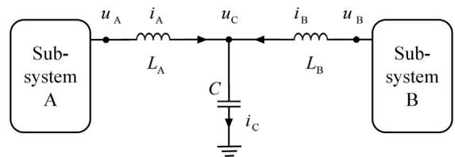  
(a) LCL filter

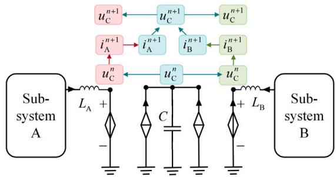  
(b） Decoupling model ofLCL filter   
Fig. 9. LCL filter circuit diagram.

In this equation, $S _ { i } ~ ( i = \mathrm { a } , \mathrm { b } , \mathrm { c } )$ represents the switching functions; $u _ { i }$ and $i _ { i } ( i = { \bf a } , { \bf b } , { \bf c } )$ represent the phase voltages and phase currents on the AC side, respectively; $i _ { \mathrm { d c } }$ represents the current on the DC side; $u _ { \mathrm { d 1 } }$ and $u _ { \mathrm { d } 2 }$ represent the voltages across the two DC capacitors; and $R _ { o n }$ represents the on-state resistance of the converter.

# 3.4. Decoupling method and equivalent circuit for filter

The equivalent circuit of the filter is shown in Fig. 9(a), and its state space equations are provided in (13), (14) and (15).

$$
L _ {\mathrm {A}} \frac {\mathrm {d} i _ {\mathrm {A}}}{\mathrm {d} t} = u _ {\mathrm {A}} - u _ {\mathrm {C}} \tag {13}
$$

$$
L _ {\mathrm {B}} \frac {\mathrm {d} i _ {\mathrm {B}}}{\mathrm {d} t} = u _ {\mathrm {B}} - u _ {\mathrm {C}} \tag {14}
$$

$$
C \frac {\mathrm {d} u _ {\mathrm {C}}}{\mathrm {d} t} = i _ {\mathrm {C}} \tag {15}
$$

The inductive branches can be discretized using an explicit integration method, while the capacitive branches can be discretized using the backward Euler method. These processes yield the discrete equations of the filter, denoted as (16), (17), and (18).

$$
i _ {\mathrm {A}} ^ {n + 1} = \Delta t \left(u _ {\mathrm {A}} ^ {n} - u _ {\mathrm {C}} ^ {n}\right) / L _ {\mathrm {A}} + i _ {\mathrm {A}} ^ {n} \tag {16}
$$

$$
i _ {\mathrm {B}} ^ {n + 1} = \Delta t \left(u _ {\mathrm {B}} ^ {n} - u _ {\mathrm {C}} ^ {n}\right) / L _ {\mathrm {B}} + i _ {\mathrm {B}} ^ {n} \tag {17}
$$

$$
u _ {\mathrm {C}} ^ {n + 1} = \Delta t \left(i _ {\mathrm {A}} ^ {n + 1} + i _ {\mathrm {B}} ^ {n + 1}\right) / C + u _ {\mathrm {C}} ^ {n} \tag {18}
$$

Based on the aforementioned equations, the decoupled equivalent circuit of the filter can be obtained, as shown in Fig. 9(b). Considering that the inductors and capacitors of the filter are relatively large, and the combination of explicit and implicit integration methods is employed for decoupling, this method can ensure high stability and computational accuracy.

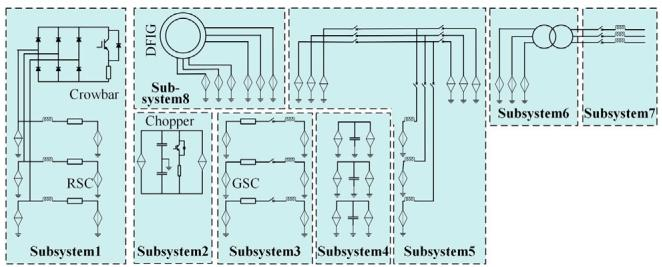  
Fig. 10. Decoupling model of DFIG-based wind turbine.

# 4. Device-level fine-grained decoupling method for DFIG-based WF

In this section, leveraging the decoupling methods for core equipment, we will develop fine-grained decoupling models for the wind turbines and the collection system. These models are integrated to construct a device-level fine-grained decoupling simulation method for DFIG-based WF.

# 4.1. Decoupling method for the wind turbine of DFIG-based WFs

The topology and equipment composition of wind turbines are complex. Without decoupling and partitioning, directly simulating the DFIG-based wind turbine using the detailed model and MNA method would result in up to 54 nodes and a 63-dimensional modified nodal voltage equation, making efficient simulation difficult.

Building on the decoupling methods and equivalent circuits for core equipment of DFIG-based WF described in Section 3, this section partitions the electrical system of the wind turbine into 8 subsystems. The equivalent circuit of the decoupling model is shown in Fig. 10 (note: for ease of understanding, the original capacitor and inductor models are retained). After employing the decoupling method, the maximum number of nodes in any subsystem does not exceed 15, and the dimensionality of the modified nodal voltage equations does not exceed 18. Given that the computational complexity of solving the modified nodal voltage equations is $O ( n ^ { 3 } ) _ { : }$ , where ?? is the dimensionality, this method can significantly reduce the computational load. Furthermore, it can realize parallel computation of subsystems’ state variables by leveraging parallel computing devices, thereby greatly enhancing simulation efficiency.

# 4.2. Decoupling method for the collection system of DFIG-based WFs

Considering that the subsystems are already decoupled from each other in Section 4.1, thus, decoupling between the collection system and the wind turbines can be achieved by incorporating Subsystem7 into the collection system, as shown in the red part of Fig. 11.

However, even after decoupling from the wind turbines, the network equations for the EMT simulation of the collection system in large-scale WFs still exhibit high dimensionality, making efficient simulation challenging. Further decoupling is therefore necessary. Given the relatively long collection lines connecting the generation clusters to the point of common coupling (PCC), for instance, in a WF in Guangdong Province, China, the collection line length between DFIGbased wind turbine 1 and the PCC is approximately 2 km, which meets the decoupling requirements for a simulation time step of 5 μs. This collection line can be decoupled using the transmission line decoupling method or the semi-implicit delayed decoupling method described in Section 3.4. The decoupling model of the collection system is shown in Fig. 11.

After decoupling, the remaining short transmission lines are modeled using lumped parameter line models. In this configuration, the

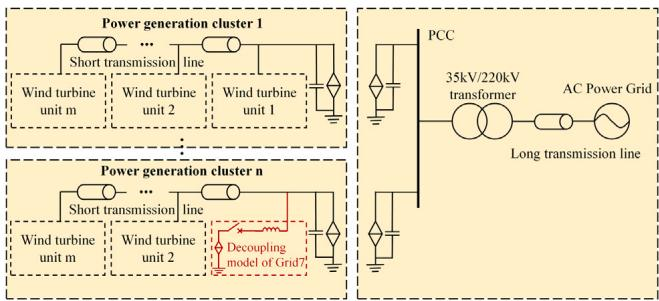  
Fig. 11. Decoupling model of collection system.

maximum number of nodes in the left power generation cluster subsystems is 9??, and the dimensionality of the modified nodal voltage equations does not exceed 9?? + 3. For the right subsystem, the number of nodes is 12, with a modified nodal voltage equation dimensionality of 18. This approach further reduces the simulation dimensionality of the collection system, significantly enhancing simulation efficiency.

# 5. Parallel implementation scheme for large-scale WF based on fine-grained decoupling

Figs. 10 and 11 have established decoupled models for the wind turbine and the collection system. However, to achieve parallel simulation, it is essential to utilize parallel computing devices (such as multicore CPU) and design a conflict-free parallel computation process. This section will provide a detailed introduction to these two aspects.

# 5.1. Multi-core CPU parallel programming model

In this paper, the simulation programs are first written in C language, and OpenMP is utilized for parallel programming. Then, the C programs are packaged into a dynamic link library (DLL) file. Finally, the DLL file is invoked in Matlab; when starting the simulation, this method can achieve parallel simulation of WF based on multi-core CPU.

Wherein OpenMP provides a high-level abstract framework for parallel algorithms, enabling multi-threaded parallel simulation on multicore CPU using shared memory. The specific operations involve adding ‘‘#pragma omp parallel{ }’’ in C programs to define the main parallel region, using ‘‘#pragma omp section{ }’’ to specify parallel sub-tasks within the parallel region. Additionally, synchronization and mutex mechanisms are incorporated to prevent data races. This approach allows the compiler to automatically parallelize the program without affecting the accuracy of the simulation.

# 5.2. Parallel simulation process for large-scale WF

According to the fine-grained network partitioning method described above, the overall simulation process can be briefly divided into several main stages: preprocessing and storage, initialization, interconnection variable calculation, and parallel solution of subsystems’ state variables. The algorithm flowchart is illustrated in Fig. 12.

# 5.2.1. Step 1: preprocessing, storage and initialization

Considering that the parameters of basic circuit elements and topology information of the WF are known, the modified nodal admittance matrix for each subsystem in different switching states can be formulated. These matrices can be pre-inverted and pre-stored before the simulation, which reduces the computational load during the simulation.

Then, during simulation initialization, the pre-stored data is called upon. Additionally, reasonable initial state values are assigned to energy storage elements (inductors, capacitors, etc.), switching components (IGBTs, breakers, etc.), and nodes. This ensures that the system can quickly reach a steady state once the simulation starts.

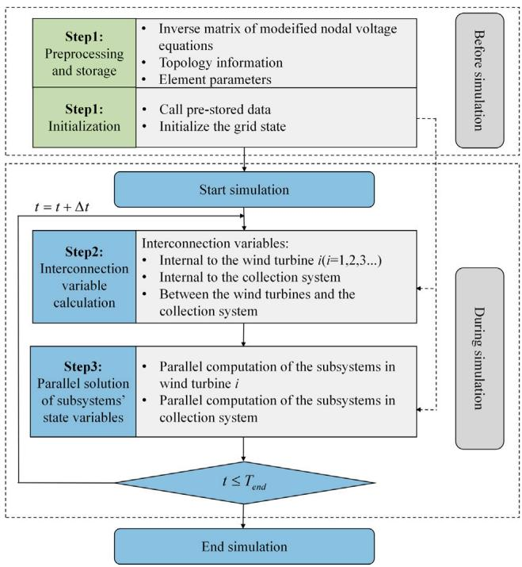  
Fig. 12. Algorithm flowchart of the proposed method.

Table 2 Methods for solving internal interconnection variables of wind turbines.   

<table><tr><td>Subsystem i</td><td>Subsystem j</td><td>Section</td><td>Basic methods</td></tr><tr><td>Subsystem1</td><td>Subsystem2</td><td>3.3</td><td>Single time step approximation</td></tr><tr><td>Subsystem2</td><td>Subsystem3</td><td>3.3</td><td>Single time step approximation</td></tr><tr><td>Subsystem3</td><td>Subsystem5</td><td>3.4</td><td>Semi-implicit delayed integration</td></tr><tr><td>Subsystem5</td><td>Subsystem1</td><td>3.1</td><td>Semi-implicit delayed integration</td></tr><tr><td>Subsystem5</td><td>Subsystem7</td><td>3.2</td><td>Semi-implicit delayed integration</td></tr></table>

# 5.2.2. Step 2: interconnection variables calculation

Since the subsystems still have connections at the partition boundaries, it is necessary to calculate the interconnection variables between different subsystems before solving the state variables of each subsystem. The interconnection variables can be obtained using the following methods.

For a single wind turbine, which has been divided into 8 subsystems as shown in Fig. 10, the methods for solving the interconnection variables between different subsystems are summarized in Table 2. It should be noted that, due to the characteristics of the decoupling methods described in Section 3, the state variables of subsystem4, subsystem6, and subsystem8 will participate in the simulation as interconnection variables. Therefore, the state variables of these subsystems must be solved in step 2. Meanwhile, subsystem1, subsystem2, subsystem3, subsystem5, and subsystem7 will be solved in parallel in step 3.

For the collection system, which has been divided into multiple subsystems as shown in Fig. 11, the internal interconnection variables can be obtained either through the natural delay characteristics of long-distance transmission lines or through the semi-implicit delayed integration of state variables, as described in Section 4.2.

For the interconnection variables between the wind turbine and the collection system, which are identical to those between subsystem 5 and subsystem 7, these interconnection variables can be solved using the methods summarized in Table 2.

# 5.2.3. Step 3: parallel solution of subsystems’ state variables

Considering that the interconnection variables have been calculated in step 2, the mutual influences between different subsystems are

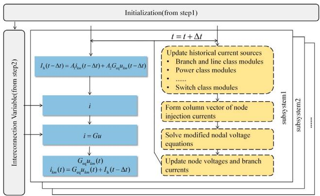  
Fig. 13. Parallel computing process for subsystems’ state variables.

now known. These influences are represented in the decoupling model by adding controlled sources at the partition boundaries, where the voltages or currents of these controlled sources correspond to the values of the interconnection variables. After this processing, the different subsystems are independent of each other at the current moment. Therefore, the subsystems are decoupled, allowing their state variables to be solved in parallel.

The EMT simulation process for each subsystem is illustrated in Fig. 13, where ?? denotes the nodal injected current vector; ?? denotes the modified nodal admittance matrix, ?? and $G ^ { - 1 }$ have been calculated in step 1; ?? denotes the nodal voltage, and $i _ { k m }$ and $\boldsymbol { u } _ { k m }$ denote the branch current and branch voltage, respectively.

By placing the simulation programs of different subsystems into separate ‘‘#pragma omp section{ $\gamma '$ sections, parallel computation of subsystems’ state variables can be achieved without compromising simulation accuracy. After completing the subsystems calculation, the process returns to step 2 for the next simulation round, continuing until the simulation is complete.

# 6. Case study

This paper compares the detailed model (DM), TLM, the finegrained network partitioning method based on serial computation (FGSM), and the fine-grained network partitioning method based on parallel computation (FGPM) of a DFIG-based WF to validate the accuracy and efficiency of the proposed method. The simulation models are constructed in Matlab/Simulink and tested on an Intel Core i5- 12490F 3.00 GHz CPU with 6 cores and 12 threads. The simulation topology is illustrated in Fig. 1, and the key parameters are listed in Table 3 and Appendix A.3.

Since the controller design is not the focus of this paper, we employ the same control setting for all wind turbines in subsequent simulations, without loss of generality. The controller of each wind turbine primarily consists of three parts: the main controller, the rotorside converter (RSC) controller, and the grid-side converter (GSC) controller. The main controller is responsible for providing pitch and yaw commands to achieve maximum power point tracking (MPPT) or to maintain constant power operation. The RSC controller employs the stator voltage-oriented vector control strategy, which is used to regulate the active and reactive power output of the generator. The GSC controller employs a grid voltage-oriented vector control strategy, which is used to keep the DC-link voltage constant. The structure of the controller is shown in Appendix A.4.

# 6.1. Performance of accuracy under different operating stages

The accuracy test system is built based on the network topology shown in Fig. 1, with 3 power generation clusters (m = 3), each cluster

Table 3 Key parameters of the electrical system in WF.   

<table><tr><td>Category</td><td>Parameters</td><td>Value</td></tr><tr><td rowspan="6">DFIG</td><td>Nominal power/VA</td><td>1.5e6</td></tr><tr><td>Nominal voltage/V</td><td>690</td></tr><tr><td>Stator leakage inductance \( L_{\mathrm {ls}}/\mathrm {H} \)</td><td>0.087e-3</td></tr><tr><td>Rotor leakage inductance \( L_{\mathrm {lr}}/\mathrm {H} \)</td><td>0.087e-3</td></tr><tr><td>Mutual inductance \( L_{\mathrm {m}}/\mathrm {H} \)</td><td>2.5e-3</td></tr><tr><td>Stator and rotor resistance/Ohm</td><td>2.6e-3</td></tr><tr><td rowspan="3">Converter</td><td>DC-side capacitance/F</td><td>0.16</td></tr><tr><td>Switching frequency/Hz</td><td>4000</td></tr><tr><td>On-state resistance/Ohm</td><td>1e-3</td></tr><tr><td rowspan="5">10 kV/0.69 kV transformer</td><td>Connection mode</td><td>D/yn</td></tr><tr><td>Excitation resistance/Ohm</td><td>1.0805e5</td></tr><tr><td>Excitation inductance/H</td><td>2866</td></tr><tr><td>Winding resistance/Ohm</td><td>1e-5</td></tr><tr><td>Winding inductance/H</td><td>1e-3</td></tr><tr><td rowspan="3">220 kV/10 kV transformer</td><td>Connection mode</td><td>YN/yn</td></tr><tr><td>Winding resistance/Ohm</td><td>1e-5</td></tr><tr><td>Winding inductance/H</td><td>1e-3</td></tr><tr><td rowspan="3">Filter</td><td>Grid side inductance/H</td><td>8e-4</td></tr><tr><td>Rotor side inductance/H</td><td>4e-4</td></tr><tr><td>Capacitance/F</td><td>6e-5</td></tr><tr><td rowspan="3">Transmission line</td><td>R/(Ohm/km)</td><td>0.211</td></tr><tr><td>L/(H/km)</td><td>3.8e-4</td></tr><tr><td>C/(F/km)</td><td>2e-7</td></tr><tr><td rowspan="4">AC system</td><td>Rated voltage/kV</td><td>220</td></tr><tr><td>Base frequency/Hz</td><td>50</td></tr><tr><td>Internal resistance/Ohm</td><td>1e-5</td></tr><tr><td>Internal inductance/H</td><td>1e-3</td></tr></table>

containing two wind turbines (n = 2). The simulation is conducted with a time step of 5 μs. During the 10-second total simulation time, the wind turbines operate in three different states as follows.

# 6.1.1. Startup stage

At 0 s, the DFIG starts accelerating until the generator reaches a steady operational speed. During this period, the stator breaker (breaker1b) remains open, and both the RSC and GSC are in the blocking state. As a result, the WF’s AC current is zero, while the AC voltage gradually rises to its nominal value. At 1 s, the GSC transitions from a blocking state to a non-blocking state and begins charging the DC capacitor. At 3 s, the RSC also transitions to a non-blocking state, and simultaneously, the control of the GSC switches from charging control to normal vector control, gradually inducing a three-phase voltage on the stator side. At 6 s, breaker1b closes, connecting the DFIG to the grid with zero active power output. At 7 s, the RSC transitions from startup control to normal vector control, and the active power output of the wind turbine gradually increases to its rated value.

The simulation waveforms of WF during the startup stage are shown in Fig. 14, including the active power output $( P _ { \mathrm { W T } } ) _ { \mathrm { : } }$ , reactive power output $( Q _ { \mathrm { W T } } ) _ { \mathrm { { : } } }$ , RMS voltage of PCC $( U _ { \mathrm { P C C } } ) ,$ , DC side voltage $( V _ { \mathrm { d c } } ) _ { \mathrm { : } }$ , stator side voltage (?? ), stator side current $( I _ { \mathrm { W T s } } )$ of the DFIG. On the one hand, as observed, the waveforms of FGSM and FGPM are identical, indicating that multithreading does not introduce additional simulation errors. On the other hand, compared to the DM simulation results, the relative errors of FGSM for active power, reactive power, RMS voltage of PCC, DC side voltage, stator side voltage, and stator side current are 1.53%, 0.96%, 0.43%, 0.99%, 0.76%, and 0.83%, respectively. The maximum relative error across all electrical quantities remains below 1.53%, demonstrating the high simulation accuracy of the proposed method.

# 6.1.2. Steady stage

After the active power output increases to the rated value, the wind turbines enter a steady operating state. The simulation waveforms

Table 4 Root mean square relative error situation.   

<table><tr><td>Electrical quantities</td><td>2 μs (%)</td><td>5 μs (%)</td><td>10 μs (%)</td></tr><tr><td>Active power</td><td>0.47</td><td>0.88</td><td>1.68</td></tr><tr><td>Reactive power output</td><td>0.72</td><td>0.84</td><td>1.54</td></tr><tr><td>RMS voltage of PCC</td><td>0.38</td><td>0.38</td><td>0.56</td></tr><tr><td>DC side voltage</td><td>0.80</td><td>0.85</td><td>1.06</td></tr><tr><td>Stator side voltage</td><td>0.75</td><td>0.77</td><td>1.11</td></tr><tr><td>Stator side current</td><td>0.56</td><td>0.61</td><td>1.43</td></tr></table>

during the steady state are shown in Fig. 15. Compared to the DM simulation results, the maximum relative error of the electrical quantities calculated by FGSM and FGPM is below 0.61%, indicating FGSM and FGPM can closely fit the DM simulation waveforms.

# 6.1.3. Fault stage

At 9 s, a 0.5-second three-phase voltage drop fault occurs at the PCC, reducing the voltage to 50% of its original value. This causes a decrease in the active power output and an increase in the reactive power output of WF to maintain voltage stability. At 9.5 s, the fault is cleared, resulting in a sharp increase in active power output and a brief drop in reactive power output. Subsequently, the system gradually returns to a steady state. The simulation waveforms under the fault stage are shown in Fig. 16. Compared to the DM simulation results, the relative errors of FGSM for active power, reactive power, RMS voltage of PCC, DC side voltage, stator side voltage, and stator side current are 0.89%, 0.75%, 0.13%, 0.45%, 0.81%, and 0.83%, respectively. The maximum relative error across all electrical quantities calculated by FGSM and FGPM is below 0.89%, indicating high simulation accuracy for the proposed method.

In conclusion, the simulation results calculated by FGSM and FGPM show a high degree of consistency with those calculated by DM, indicating that FGSM and FGPM can accurately simulate the DFIG-based WF under different operating stages.

# 6.2. Performance of accuracy under different time steps

To assess the relationship between simulation accuracy and simulation time steps, this part uses the same test system as Section 6.1 and simulates the test system with time steps of 2 μs, 5 μs, and $1 0 \ \mu \mathbf { s } .$ . The simulation waveforms for various electrical quantities under different time steps are shown in Fig. 17. It can be observed that as the simulation time step increases, the simulation error increases as well.

To more accurately assess the simulation errors, this part calculates the root mean square (RMS) relative errors of various electrical quantities at different time steps, as shown in Table 4. The results indicate that at a time step of 10 μs, the RMS relative error remains consistently below 1.68%. Compared to other fine-grained network partitioning methods that require nanosecond or sub-microsecond time steps, FGSM demonstrates significant advantages in both simulation time step and stability. However, further increases in the time step may disrupt the decoupling conditions of the transmission lines and amplify the errors introduced by the semi-implicit delayed integration method, potentially leading to simulation instability and reduced accuracy.

# 6.3. Performance of efficiency

To verify the simulation acceleration effect of the fine-grained network partitioning algorithm, the efficiency test system is built based on network topology shown in Fig. 1 with varying numbers of wind turbines. The simulation time step was set to $5 \ \mu s ,$ , with a total simulation time of 1 s.

The CPU simulation time for the DM model and the coarse-grained network partitioning method based on TLM, FGSM, and FGPM were tested. DM and TLM are modeled by dragging discrete components

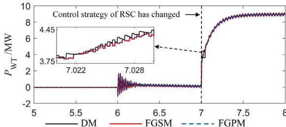  
(a)Active power at PCC in wind farm

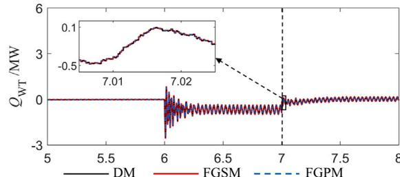

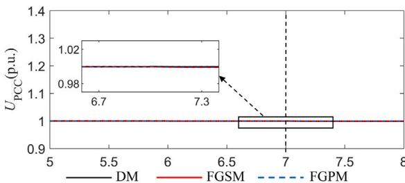  
(b) Reactive power at PCC in wind farm   
(c) RMS voltage of PCC in wind farm

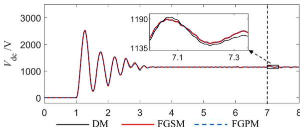  
(d) DC side voltage of wind turbine1

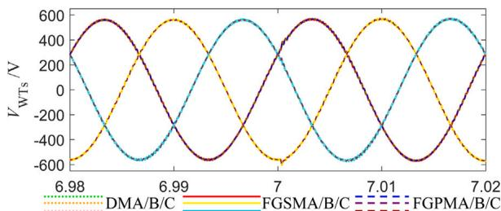  
(e) Stator side voltage of wind turbine1

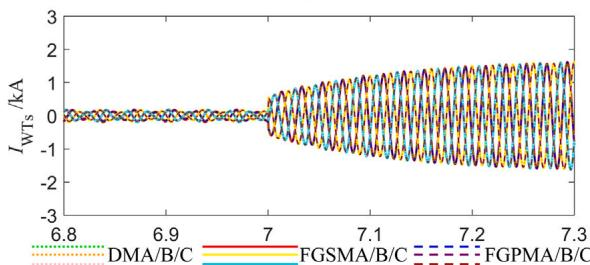  
(f) Stator side current of wind turbine1   
Fig. 14. Simulation waveforms during wind farm startup stage.

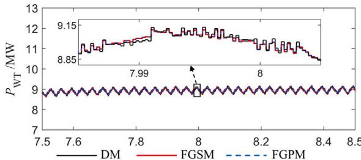

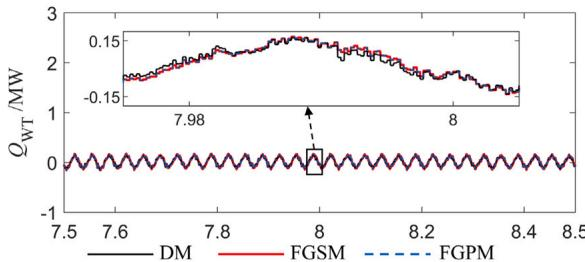  
(a) Active power at PCC in wind farm

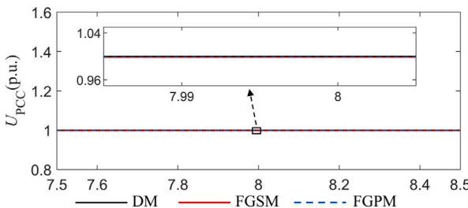  
(b) Reactive power at PCC in wind farm   
(c) RMS voltage of PCC in wind farm

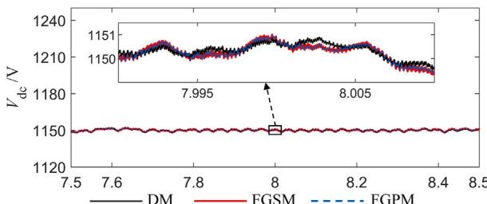  
(d) DC side voltage of wind turbinel

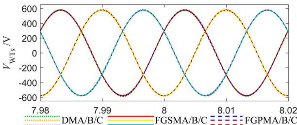  
(e) Stator side voltage of wind turbinel

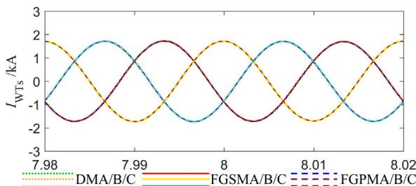  
(f) Stator side current of wind turbinel   
Fig. 15. Simulation waveforms during wind farm steady stage.

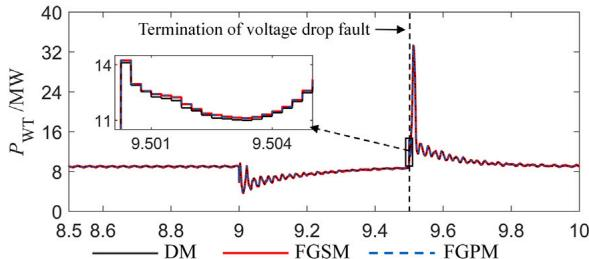  
(a)Active power at PCC in wind farm

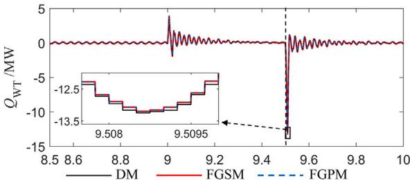  
(b) Reactive power at PCC in wind farm

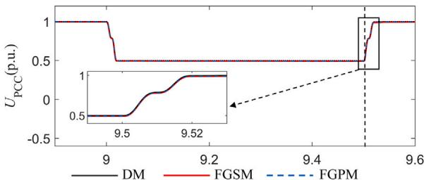  
(c) RMS voltage of PCC in wind farm

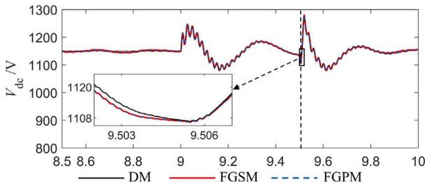  
(d) DC side voltage of wind turbine1

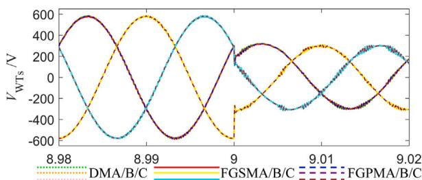  
(e) Stator side voltage of wind turbinel

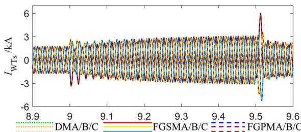  
(f) Stator side current of wind turbinel   
Fig. 16. Simulation waveforms during wind farm fault stage.

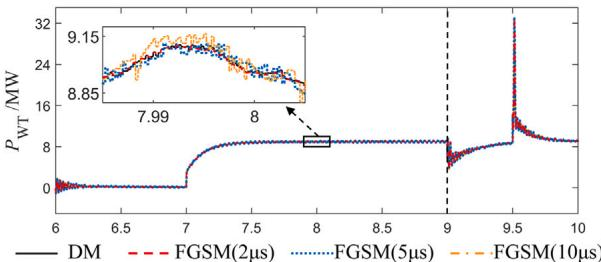  
(a)Active power at PCC in wind farm

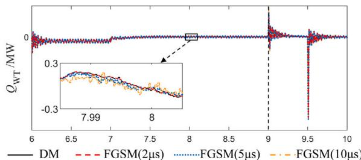  
(b) Reactive power at PCC in wind farm

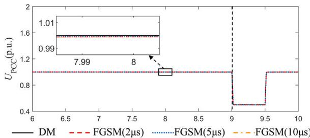  
(c) RMS voltage of PCC in wind farm

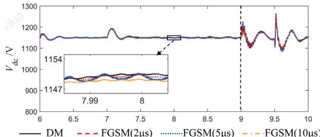  
(d) DC side voltage of wind turbine   
Fig. 17. Simulation waveforms under different time steps.

from the Simulink component library, utilizing Matlab’s highly optimized BLAS (Basic Linear Algebra Subprograms) and LAPACK (Linear Algebra PACKage) libraries for matrix operation acceleration, which are among the mainstream methods for current wind farm simulations. In contrast, the FGSM and FGPM are modeled in C language and ultimately invoked by Matlab/Simulink through dynamic link libraries.

# 6.3.1. Performance of serial simulation efficiency

Tables 5 and 6 present the CPU simulation time and acceleration ratios for different numbers of wind turbines. Comparing the CPU simulation time of DM, TLM, and FGSM, it is evident that the FGSM achieves significant simulation speedup even in serial simulation mode. This is because the FGSM significantly reduced the matrix dimensionality, which substantially lowers the computational load for matrix operations.

Moreover, as the number of wind turbines increases, the effectiveness of the FGSM in reducing computational load becomes more evident. As shown in Table $^ { 6 , }$ when the number of turbines reaches 50, FGSM achieves a speedup ratio of 38.331 compared to DM, indicating a substantial improvement in simulation efficiency.

Table 5 CPU simulation time comparison.   

<table><tr><td>Number of WTs</td><td>DM/s</td><td>TLM/s</td><td>FGSM/s</td><td>FGPM/s</td></tr><tr><td>1</td><td>21.816</td><td>19.674</td><td>5.791</td><td>8.249</td></tr><tr><td>3</td><td>64.352</td><td>58.253</td><td>11.711</td><td>11.708</td></tr><tr><td>6</td><td>146.765</td><td>125.041</td><td>20.809</td><td>14.343</td></tr><tr><td>9</td><td>270.084</td><td>218.797</td><td>30.637</td><td>17.311</td></tr><tr><td>12</td><td>504.558</td><td>404.116</td><td>41.311</td><td>19.237</td></tr><tr><td>15</td><td>862.727</td><td>667.576</td><td>52.197</td><td>23.006</td></tr><tr><td>18</td><td>1210.014</td><td>928.681</td><td>63.541</td><td>26.877</td></tr><tr><td>21</td><td>1559.010</td><td>1003.823</td><td>76.791</td><td>29.722</td></tr><tr><td>24</td><td>1937.510</td><td>1261.345</td><td>90.364</td><td>30.641</td></tr><tr><td>27</td><td>2197.178</td><td>1423.398</td><td>102.460</td><td>32.930</td></tr><tr><td>30</td><td>2700.407</td><td>1635.280</td><td>114.715</td><td>37.766</td></tr><tr><td>40</td><td>4239.077</td><td>2421.224</td><td>169.634</td><td>52.460</td></tr><tr><td>50</td><td>8390.850</td><td>3065.980</td><td>218.907</td><td>61.977</td></tr></table>

Table 6 Acceleration ratio.   

<table><tr><td>Number of WTs</td><td>TLM (1-thread)</td><td>FGSM (1-thread)</td><td>FGPM (12-threads)</td></tr><tr><td>1</td><td>1.109</td><td>3.767</td><td>2.645</td></tr><tr><td>3</td><td>1.105</td><td>5.495</td><td>5.496</td></tr><tr><td>6</td><td>1.174</td><td>7.053</td><td>10.233</td></tr><tr><td>9</td><td>1.234</td><td>8.816</td><td>15.602</td></tr><tr><td>12</td><td>1.249</td><td>12.214</td><td>26.229</td></tr><tr><td>15</td><td>1.292</td><td>16.528</td><td>37.500</td></tr><tr><td>18</td><td>1.303</td><td>19.043</td><td>45.020</td></tr><tr><td>21</td><td>1.553</td><td>20.302</td><td>52.453</td></tr><tr><td>24</td><td>1.536</td><td>21.441</td><td>63.233</td></tr><tr><td>27</td><td>1.544</td><td>21.444</td><td>66.723</td></tr><tr><td>30</td><td>1.651</td><td>23.540</td><td>71.504</td></tr><tr><td>40</td><td>1.751</td><td>24.990</td><td>80.806</td></tr><tr><td>50</td><td>2.737</td><td>38.331</td><td>135.387</td></tr></table>

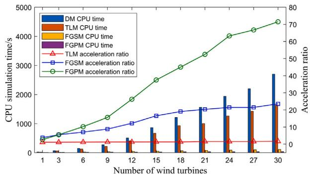  
Fig. 18. CPU time and acceleration ratio for varying number of wind turbines.

# 6.3.2. Performance of parallel simulation efficiency

The FGPM leverages OpenMP to realize parallel simulation based on multi-core CPUs. When comparing the CPU simulation time of FGSM and FGPM, it is evident that for a small number of wind turbines, the efficiency of parallel simulation may decrease compared to serial simulation. This is because the overhead time associated with parallelization (such as starting or stopping threads) exceeds the time saved through parallel computation.

However, as the number of wind turbines increases, the acceleration effect of parallel simulation becomes increasingly pronounced, as shown in Fig. 18. When the number of turbines reaches 50, FGPM achieves a 3.53-fold speedup compared to FGSM and realizes the twoorder-of-magnitude speedup compared to DM, demonstrating excellent simulation acceleration effects.

In conclusion, compared to the DM method, the proposed method effectively addresses the computational efficiency challenges associated with large-scale WFs. Additionally, as the scale of the WF increases, this method maintains high simulation efficiency, making it particularly advantageous for large-scale system simulations.

# 7. Conclusion

To address the issues of low simulation efficiency and difficulty in accelerating simulation in large-scale WFs, this paper proposes a device-level fine-grained decoupling scheme for DFIG-based WFs, achieving dimensionality reduction of the node voltage equations, which significantly decreases the computational load. Then, by utilizing multi-core CPU for parallel simulation, this approach further enhances simulation efficiency.

Simulation results demonstrate high accuracy, with a maximum root mean square relative error below 1.68%. Moreover, the method exhibits high simulation acceleration ratios, achieving a two-order-ofmagnitude speedup with 50 wind turbines. Furthermore, as the number of wind turbines increases, the acceleration ratio continues to rise.

Building upon this work, future research will delve deeper into two aspects. Firstly, simulation programs may utilize high-performance computing devices to further improve simulation efficiency by increasing parallelism. Secondly, the current fine-grained partitioning method has issues with uneven distribution of subsystem nodes and underutilization of computational resources. Future work can focus on designing optimized partitioning algorithms to enhance simulation efficiency by optimizing potential decoupling locations.

# CRediT authorship contribution statement

Jiale Yu: Writing – review & editing, Writing – original draft, Visualization, Validation, Methodology, Investigation. Haoran Zhao: Writing – review & editing, Funding acquisition, Formal analysis, Data curation. Yibao Jiang: Writing – review & editing, Funding acquisition, Formal analysis, Data curation. Bing Li: Writing – review & editing, Validation. Linghan Meng: Writing – review & editing, Validation. Futao Yang: Writing – review & editing, Visualization.

# Declaration of competing interest

The authors declare that they have no known competing financial interests or personal relationships that could have appeared to influence the work reported in this paper.

# Appendix

# A.1. Basic modeling methods for DFIG

The mathematical model of the DFIG includes the voltage balance equations, flux linkage equations, electromagnetic torque equations, and rotor motion equations. In an arbitrary rotating dq0 coordinate system, the equations are shown in (19)–(22).

$$
\left\{ \begin{array}{l} u _ {\mathrm {s d}} = R _ {\mathrm {s}} i _ {\mathrm {s d}} + \frac {\mathrm {d} \psi_ {\mathrm {s d}}}{\mathrm {d} t} - \omega \psi_ {\mathrm {s q}} \\ u _ {\mathrm {s q}} = R _ {\mathrm {s}} i _ {\mathrm {s q}} + \frac {\mathrm {d} \psi_ {\mathrm {s q}}}{\mathrm {d} t} + \omega \psi_ {\mathrm {s d}} \\ u _ {\mathrm {s 0}} = R _ {\mathrm {s}} i _ {\mathrm {s 0}} + \frac {\mathrm {d} \psi_ {\mathrm {s 0}}}{\mathrm {d} t} \\ u _ {\mathrm {r d}} = R _ {\mathrm {r}} i _ {\mathrm {r d}} + \frac {\mathrm {d} \psi_ {\mathrm {r d}}}{\mathrm {d} t} - (\omega - \omega_ {\mathrm {r}}) \psi_ {\mathrm {r q}} \\ u _ {\mathrm {r q}} = R _ {\mathrm {r}} i _ {\mathrm {r q}} + \frac {\mathrm {d} \psi_ {\mathrm {r q}}}{\mathrm {d} t} + (\omega - \omega_ {\mathrm {r}}) \psi_ {\mathrm {r d}} \\ u _ {\mathrm {r 0}} = R _ {\mathrm {r}} i _ {\mathrm {s 0}} + \frac {\mathrm {d} \psi_ {\mathrm {r 0}}}{\mathrm {d} t} \\ \psi_ {\mathrm {s d}} = L _ {\mathrm {s}} i _ {\mathrm {s d}} + L _ {\mathrm {m}} i _ {\mathrm {r d}} \\ \psi_ {\mathrm {s q}} = L _ {\mathrm {s}} i _ {\mathrm {s q}} + L _ {\mathrm {m}} i _ {\mathrm {r q}} \\ \psi_ {\mathrm {s 0}} = L _ {\mathrm {s}} i _ {\mathrm {s 0}} + L _ {\mathrm {m}} i _ {\mathrm {r 0}} \\ \psi_ {\mathrm {r d}} = L _ {\mathrm {m}} i _ {\mathrm {s d}} + L _ {\mathrm {r}} i _ {\mathrm {r d}} \\ \psi_ {\mathrm {r q}} = L _ {\mathrm {m}} i _ {\mathrm {s q}} + L _ {\mathrm {r}} i _ {\mathrm {r q}} \\ \psi_ {\mathrm {r 0}} = L _ {\mathrm {m}} i _ {\mathrm {s 0}} + L _ {\mathrm {r}} i _ {\mathrm {r 0}} \end{array} \right. \tag {19}
$$

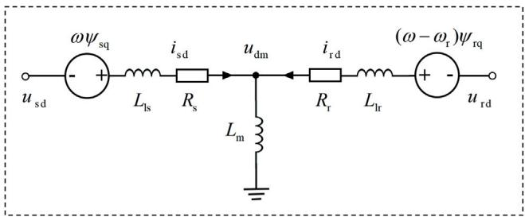  
Fig. 19. Equivalent circuit of ??-axis voltage equation.

$$
T _ {\mathrm {e}} = \frac {3}{2} n _ {\mathrm {p}} \left(\psi_ {\mathrm {s d}} i _ {\mathrm {s q}} - \psi_ {\mathrm {s q}} i _ {\mathrm {s d}}\right) \tag {21}
$$

$$
\left\{ \begin{array}{l} T _ {\mathrm {e}} - T _ {\mathrm {L}} = \frac {J}{n _ {\mathrm {p}}} \frac {\mathrm {d} \omega_ {\mathrm {r}}}{\mathrm {d} t} \\ \omega = \frac {\mathrm {d} \theta}{\mathrm {d} t}, \omega_ {\mathrm {r}} = \frac {\mathrm {d} \theta_ {\mathrm {r}}}{\mathrm {d} t} \end{array} \right. \tag {22}
$$

In these equations, the subscripts d, q, and 0 represent the ??-axis, ??- axis, and 0-axis, respectively, while the subscripts s and r represent the stator and rotor of the DFIG. ?? denotes the voltage of each winding; ?? denotes the current of each winding; ?? denotes the flux linkage of each winding; ?? denotes the resistance of each winding; ?? denotes the selfinductance and mutual inductance of each winding; ?? represents the electrical angular velocity of the rotating dq0 coordinate system; and $\omega _ { r }$ represents the electrical angular velocity of the rotor; ?? represents the number of pole pairs of the DFIG; $T _ { \mathrm { { L } } }$ denotes the load torque; $T _ { \mathrm { e } }$ denotes the electromagnetic torque; ?? denotes the rotor’s moment of inertia; ?? denotes the electrical angle for the coordinate system; and $\theta _ { \mathrm { r } }$ denotes the rotor’s electrical angle.

By combining (19) and (20), the equivalent circuit of the DFIG in an arbitrary rotating dq0 coordinate system can be depicted. Taking the ??-axis voltage and flux linkage equations as an example, the equivalent circuit is shown in Fig. 19.

In the figure, $L _ { \mathrm { l s } }$ represents the stator leakage inductance, with a value satisfying $L _ { \mathrm { l s } } + L _ { \mathrm { m } } = L _ { \mathrm { s } } ; L _ { \mathrm { l r } }$ represents the rotor leakage inductance, with a value satisfying $L _ { \mathrm { l r } } + L _ { \mathrm { m } } = L _ { \mathrm { r } } ; u _ { \mathrm { d m } }$ and $u _ { \mathrm { { q m } } }$ represent the magnetizing branch voltages referred to the ??-axis and ??-axis, respectively.

# A.2. Basic modeling methods for VSC

The operating states of a converter include blocking and nonblocking states. In the blocking state, all branches of the converter can be considered as open circuits. In the non-blocking state, the state equation of the converter can be described as (23), with its equivalent circuit shown in Fig. 20.

In this equation, $S _ { i } ~ ( i = \mathrm { a } , \mathrm { b } , \mathrm { c } )$ represents the switching functions; $u _ { i }$ and $i _ { i } \ ( i = { \mathrm { a } } , { \mathrm { b } } , { \mathrm { c } } )$ represent the phase voltages and phase currents on the AC side, respectively; $i _ { \mathrm { d c } }$ represents the current on the DC side; $u _ { \mathrm { d 1 } }$ and $u _ { \mathrm { d } 2 }$ represent the voltages across the two DC capacitors; and $R _ { o n }$ represents the on-state resistance of the IGBT.

$$
\left[ \begin{array}{l} u _ {a} \\ u _ {\mathrm {b}} \\ u _ {c} \\ i _ {\mathrm {d c}} \end{array} \right] = \left[ \begin{array}{c c c c c} R _ {\mathrm {o n}} & & & S _ {\mathrm {a}} & \left(S _ {\mathrm {a}} - 1\right) \\ & R _ {\mathrm {o n}} & & S _ {\mathrm {b}} & \left(S _ {\mathrm {b}} - 1\right) \\ & & R _ {\mathrm {o n}} & S _ {c} & \left(S _ {c} - 1\right) \\ S _ {\mathrm {a}} & S _ {\mathrm {b}} & S _ {c} & 0 & 0 \end{array} \right] \left[ \begin{array}{l} i _ {\mathrm {a}} \\ i _ {\mathrm {b}} \\ i _ {c} \\ u _ {\mathrm {d} 1} \\ u _ {\mathrm {d} 2} \end{array} \right] \tag {23}
$$

# A.3. Parameters of wind farm

See Tables 7 and 8.

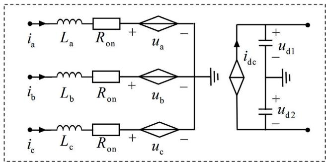  
Fig. 20. Equivalent circuit of two-level VSC.

Table 7 Parameters of the mechanical system in WF.   

<table><tr><td>Category</td><td>Parameters</td><td>Value</td></tr><tr><td rowspan="7">Wind turbine</td><td>Radius r/m</td><td>42</td></tr><tr><td>Pole pairs p</td><td>2</td></tr><tr><td>Nominal wind speed vw/(m/s)</td><td>12</td></tr><tr><td>Minimum-maximum rotor Speed Ωm/rpm</td><td>900-1800</td></tr><tr><td>Optimal tip speed ratio λopt</td><td>7.2</td></tr><tr><td>Maximum power coefficient Cp,opt</td><td>0.44</td></tr><tr><td>Air density ρ/(kg/m3)</td><td>1.225</td></tr><tr><td>Gearbox</td><td>Gearbox ratio N</td><td>100</td></tr></table>

Table 8 Parameters of the control system in WF.   

<table><tr><td>Category</td><td>Parameters</td><td>Value</td></tr><tr><td rowspan="3">PLL</td><td>KP,PLL</td><td>180</td></tr><tr><td>KI,PLL</td><td>3200</td></tr><tr><td>Kd,PLL</td><td>1</td></tr><tr><td rowspan="4">GSC controller</td><td>Outer loop of GSC KP,outter</td><td>0.2513</td></tr><tr><td>Outer loop of GSC KI,outter</td><td>39.4784</td></tr><tr><td>Inner loop of GSC KP,inner</td><td>0.2513</td></tr><tr><td>Inner loop of GSC KI,inner</td><td>39.4784</td></tr><tr><td rowspan="4">RSC controller</td><td>Outer loop of RSC KP,outter</td><td>0.5</td></tr><tr><td>Outer loop of RSC KI,outter</td><td>0.5</td></tr><tr><td>Inner loop of RSC KP,inner</td><td>0.5</td></tr><tr><td>Inner loop of RSC KI,inner</td><td>0.5</td></tr></table>

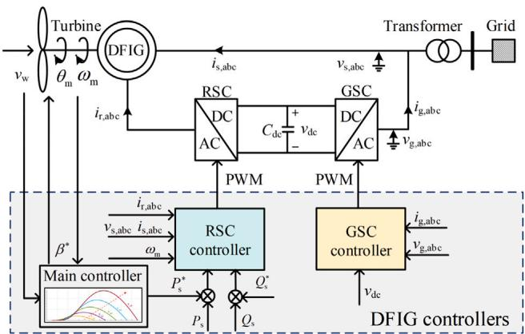  
Fig. 21. Structure of DFIG controller.

# A.4. Structure of DFIG controller

See Fig. 21.

# Data availability

Data will be made available on request.

# References

[1] Pryor SC, Barthelmie RJ, Bukovsky MS, Leung LR, Sakaguchi K. Climate change impacts on wind power generation. Nature Rev. Earth Environ. 2020;1(12):627–43.   
[2] Qin B, Li H, Zhou X, Li J, Liu W. Low-voltage ride-through techniques in DFIG-based wind turbines: a review. Appl Sci 2020;10(6):2154.   
[3] Hussein DN, Matar M, Iravani R. A type-4 wind power plant equivalent model for the analysis of electromagnetic transients in power systems. IEEE Trans. Power Syst. 2012;28(3):3096–104.   
[4] Jiang Y, Wan C, Wang J, Song Y, Dong ZY. Stochastic receding horizon control of active distribution networks with distributed renewables. IEEE Transactions on Power Systems 2018;34(2):1325–41.   
[5] Zuo T, Zhang Y, Xie X, Meng K, Tong Z, Dong ZY, Jia Y. A review of optimization technologies for large-scale wind farm planning with practical and prospective concerns. IEEE Trans Ind Inf 2022;19(7):7862–75.   
[6] Lin N, Cao S, Dinavahi V. Adaptive heterogeneous transient analysis of wind farm integrated comprehensive AC/DC grids. IEEE Trans Energy Convers 2020;36(3):2370–9.   
[7] Wang T, Huang S, Gao M, Wang Z. Adaptive extended Kalman filter based dynamic equivalent method of PMSG wind farm cluster. IEEE Trans Ind Appl 2021;57(3):2908–17.   
[8] Xu J, Zheng C, Xu W, Feng M, Zhao C, Li G. A simplified EMT model of multipleactive-bridge based power electronic transformer with integrated energy storage. CSEE J Power Energy Syst 2024.   
[9] Subedi S, Rauniyar M, Ishaq S, Hansen TM, Tonkoski R, Shirazi M, Wies R, Cicilio P. Review of methods to accelerate electromagnetic transient simulation of power systems. IEEE Access 2021;9:89714–31.   
[10] Ni Y, Li C, Du Z, Zhang G. Model order reduction based dynamic equivalence of a wind farm. Int J Electr Power Energy Syst 2016;83:96–103.   
[11] Hong G, WU G, JIN Y, XIE H, JU P, LIANG B. Review on research of modeling and simulation for wind power generation in power system. Autom Electr Power Syst 2024;1–15.   
[12] Ghosh S, Senroy N. Balanced truncation based reduced order modeling of wind farm. Int J Electr Power Energy Syst 2013;53:649–55.   
[13] Ali HR, Kunjumuhammed LP, Pal BC, Adamczyk AG, Vershinin K. Model order reduction of wind farms: Linear approach. IEEE Trans Sustain Energy 2018;10(3):1194–205.   
[14] Li W, Kaffashan I, Gole AM, Zhang Y. Structure preserving aggregation method for doubly-fed induction generators in wind power conversion. IEEE Trans Energy Convers 2021;37(2):935–46.   
[15] Li W, Chao P, Liang X, Ma J, Xu D, Jin X. A practical equivalent method for DFIG wind farms. IEEE Trans Sustain Energy 2017;9(2):610–20.   
[16] Nguyen T-T, Vu T, Ortmeyer T, Stefopoulos G, Pedrick G, MacDowell J. Real-time transient simulation and studies of offshore wind turbines. IEEE Trans Sustain Energy 2023.

[17] Zou M, Zhao C, Xu J. Modeling for large-scale offshore wind farm using multi-thread parallel computing. Int J Electr Power Energy Syst 2023;148:108928.   
[18] Xu J, Zhao Y, Zhao C, Ding H. Unified high-speed EMT equivalent and implementation method of MMCs with single-port submodules. IEEE Trans Power Deliv 2018;34(1):42–52.   
[19] Zou M, Wang Y, Zhao C, Xu J, Guo X, Sun X. Integrated equivalent model of permanent magnet synchronous generator based wind turbine for large-scale offshore wind farm simulation. J Mod Power Syst Clean Energy 2023.   
[20] Zou M, Wang Y, Xu J, Zhao C. Electromagnetic transient controlled source based decoupling acceleration model for large-scale offshore wind farm. Autom Electr Power Syst 2024;48:1–8.   
[21] Song Y, Chen Y, Huang S, Xu Y, Yu Z, Marti JR. Fully GPU-based electromagnetic transient simulation considering large-scale control systems for system-level studies. IET Gener. Transm. Distrib. 2017;11(11):2840–51.   
[22] Wang Q, Xu J, Wang K, Wu P, Chen W, Li Z. Parallel electromagnetic transient simulation of power systems with a high proportion of renewable energy based on latency insertion method. IET Renew Power Gener 2023;17(1):110–23.   
[23] Watson N, Arrillaga J, Arrillaga J. Power Systems Electromagnetic Transients Simulation, vol. 39, Iet; 2003.   
[24] Dufour C, Mahseredjian J, Bélanger J. A combined state-space nodal method for the simulation of power system transients. IEEE Trans Power Deliv 2010;26(2):928–35.   
[25] Bonatto BD, Armstrong ML, Martí JR, Dommel HW. Current and voltage dependent sources modelling in MATE–multi-area Thévenin equivalent concept. Electr Power Syst Res 2016;138:138–45.   
[26] Bruned B, Mahseredjian J, Dennetière S, Michel J, Schudel M, Bracikowski N. Compensation method for parallel and iterative real-time simulation of electromagnetic transients. IEEE Trans Power Deliv 2023;38(4):2302–10.   
[27] Yao S, Liu G, Zeng Z, Pang B, Wang Y. Electromagnetic transient semi-implicit latency decoupling and simulation technology for direct-drive wind power generation unit. Proc CSEE 2022;42:6053–63+6179.   
[28] Petersson A, Thiringer T, Harnefors L, Petru T. Modeling and experimental verification of grid interaction of a DFIG wind turbine. IEEE Trans Energy Convers 2005;20(4):878–86.   
[29] Mahseredjian J, Kocar I, Karaagac U. Solution techniques for electromagnetic transients in power systems. Transient Anal. Power Syst.: Solut. Tech. Tools Appl. 2015;9–38.   
[30] Dommel HW. EMTP Theory Book. Microtran Power System Analysis Corporation; 1996.   
[31] Li B, Zhao H, Jiang Y, Meng L. Real-time simulation for detailed wind turbine model based on heterogeneous computing. Int J Electr Power Energy Syst 2024;155:109486.   
[32] Ho C-W, Ruehli A, Brennan P. The modified nodal approach to network analysis. IEEE Trans. Circuits Syst. 1975;22(6):504–9.