# Multi-scale formulation of admittance-based modeling of cables

Felipe Camara a , Antonio C.S. Lima *,b , Kai Strunz c C

a Furnas Centrais El´etricas, Dept. Electrical Studies and Operation Planning, RJ, Brazil   
b Federal University of Rio de Janeiro, COPPE/UFRJ, RJ, Brazil   
c Technische Universitat ¨ Berlin, TU-Berlin, SENSE Laboratory, Germany

# A R T I C L E I N F O

# Keywords:

Electromagnetic transients

cable

transmission line

frequency dependency

multi-scale simulation

dynamic phasor

analytic signal

# A B S T R A C T

This paper proposes a novel multi-scale cable model in phase-coordinates exploiting the fully-coupled structure of the nodal admittance matrix instead of using the conventional approach based on the Method of Characteristics (MoC). The usage of the admittance modeling allows a straightforward representation of cables regardless of their lengths as it does not require a minimum time-step below the transient time associated with the fastest mode. In addition, some accuracy issues regarding the rational modeling of the nodal admittance matrix are overcome resorting to the Folded Line Equivalent (FLE) transformation.

Following the so-called frequency-adaptive simulation of transients (FAST) concept, the trapezoidal rule and recursive convolution expressions are rewritten to perform computations using analytic signals or complex variables. This will allow the possibility to combine electromagnetic and electromechanical trasients phenomena in the same simulation environment with a unique mathematical model.

A novel variable time-step algorithm is presented and its flexibility is so general that can be incorporated in Electromagnetic Transient (EMT) software such as EMTP-RV, PSCAD or Hypersim in straightforward way.

Besides keeping the accuracy of the classic EMT-modeling, the proposed formulation provides a sensible gain in the overall computation time without significant loss of accuracy and also smooth transitions regardless of the time-step length.

# 1. Introduction

The complexity of electric power systems has increased considerably in the last decades. Besides the deregulation process, there has been an ever growing usage of power electronics devices associated with distributed generation, renewable power such as wind and solar, and HVDC just to name a few. This scenario demands a higher knowledge and a detailed description of the main components of the network instead of the conventional approach based on positive sequence phasor representation. However, a detailed modeling of all the network would demand a computer burden that is barely feasible even considering nowadays computing power. Alternatively, one may resort to a combined approach where a large part of the network is represented in the conventional way with a small part being modeled in more detail. The usage of the so-called hybrid simulation can provide such framework [1].

The joint simulation of electromagnetic transients (EMT) and transient stability (TS) is not a new topic as the first attempts to do so date back to the 1980s [2]. However, integrating these two types of

simulators brings up some issues, for instance, communication protocols between algorithms, exchanging data timings, waveform-to-phasor conversions and conversely. In the early 1990s, the concept of time-varying or dynamic phasors was proposed [3] and extended the phasor-based notation to accommodate fast electromagnetic transients. This formulation was then incorporated to power system modeling and stated as Shifted Frequency Analysis (SFA) [4–7].

Later, the so-called Frequency-Adaptive Simulation of Transients (FAST) [8–11] technique applied the dynamic phasor concept in order to allow a variable time-step environment as opposed to interfacing diverse programs.

The modeling of overhead lines and cables are carried out mostly by means of the method of characteristics (MoC). This implies in dealing with a rather small time-step to track the transient behavior [12,13]. This scenario becomes even more restricted in the case of short overhead lines and cables where very small time-steps may be needed as it should be smaller than the travel time of the fastest mode. In the past, very short lines were represented using π-sections [14] which precludes the possibility to include the frequency dependent behavior.

Recent research with FAST addressed the modeling of transmission lines gathering the structure of a MoC-based constant parameter line model with an equivalent π-circuit to overcome the limitation of using a time-step shorter than the traveling time [15], i.e., it enables the topological coupling between the line ends when the time-step is larger than the traveling time. Adopting the same concept, the frequency dependency of parameters was introduced in [16].

The aforementioned line models are not a general approach as they cannot deal with underground/submarine cables which present a heavy frequency dependent transformation matrix and cannot consider the case of a full frequency dependent line model for large time-steps. Furthermore, for short lengths, there will be a need to interpolate the model given that it is expected to have a time-step shorter than the travel time of the fastest mode.

To overcome these limitations, this paper proposes to carry out the modeling based on the nodal admittance matrix $\mathbf { Y _ { n } } .$ For so, this work can be understood as a continuation in the efforts to provide a general cable model using the FAST framework and aiming at multi-scale simulations with lesser limitations.

A novel re-initialization procedure is introduced to accommodate the time-step transition along the simulation run in order to provide smooth waveforms. As a result, a sensible speed gain is achieved without sacrificing accuracy.

The paper is organized as follows: Section 2 provides the background information with regard to FAST concept and presents the reinitialization approach for admittance-based models which represents one of the main contribution of this research. A brief review of timedomain modeling of cables is presented in Section 3. Some test cases to assess the behavior of the proposed approach are presented in Section 4. The results are then discussed in Section 5 and finally, the main conclusions are drawn in Section 6.

# 2. Frequency-adaptive simulation of transients (FAST)

The FAST concept enables the integrative simulation of both instantaneous and phasor-based variables within the same environment layered on the concept of analytic signals or dynamic phasors and shifting frequency.

The dynamic phasor concept rely on the application of analytic or complex signals $\mathcal { A } [ \cdot ]$ as adopted in frequency modulation for radio transmission [17]. Basically, it expresses a real signal s(t) in a complex form where the imaginary part σ(t) is obtained by the Hilbert transform of the original signal, as shown in (1).

$$
\mathscr {A} [ s (t) ] = \underline {{s}} (t) = s (t) + j \mathscr {H} [ s (t) ] = s (t) + j \sigma (t) \tag {1}
$$

Real signals typically have its spectrum centered at the fundamental frequency f and, as a consequence of this transformation, analytical signals maintain only its positive content with the magnitude multiplied by two, see Fig. 1.

Multiplying the analytic signal $\mathcal { A } [ \cdot ]$ by $e ^ { - j \omega _ { s } t }$ degenerates the socalled dynamic phasor $\mathcal { D } [ \cdot ]$ or shifted frequency signal and the related frequency spectra is then shifted to the origin, as illustrated in Fig. 2. In practice, this frequency shifting approach converts a bandpass signal into a low-pass one that corresponds to the complex envelope of the real

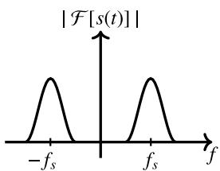  
(a) Real signal s(t)

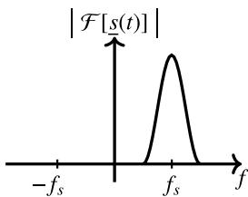  
(b) Analytic signal s(t)   
Fig. 1. Fourier spectra

  
(a) Analytic signal s(t)

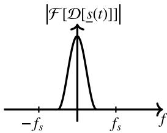  
(b)Dynamic phasor Ds(t)   
Fig. 2. Fourier spectra

signal s(t).

$$
\mathcal {D} \left[ \underline {{s}} (t) \right] = \underline {{s}} (t) e ^ {- j \omega_ {s} t} \tag {2}
$$

The key advantage of such representation lies in the requirement of much less samples to accurately represent dynamic phasors in comparison with instantaneous signals. This process, stated as the Shifted Frequency Analysis (SFA), filters out the power frequency and only deviations from this frequency are observed.

Hence, in steady-state and electromechanical analysis, where the signals are close to the fundamental frequency, the application of dynamic phasors allows one to use large time-steps without sacrificing accuracy.

Since the analytic signal is a complex variable, the real part corresponds to the instantaneous value and the envelope or magnitude is achieved by its absolute counter part.

# 2.1. FAST modeling

In order to perform a time-domain realization of a pole-residue model and express the system variables as analytic signals, i.e., in the complex form, a first-order model can be written

$$
\frac {d \underline {{x}} (t)}{d t} = p \underline {{x}} (t) + r \underline {{v}} (t) \tag {3}
$$

Resorting to the definition of dynamic phasors, i.e., insertion of (2) in (3)

$$
\frac {d \left[ \mathscr {D} \left[ \underline {{x}} (t) \right] e ^ {j \omega_ {3} t} \right]}{d t} = p \underline {{x}} (t) + r \underline {{v}} (t) \tag {4}
$$

Evaluating the derivative term gives

$$
j \omega_ {s} \mathcal {D} [ \underline {{x}} (t) ] e ^ {j \omega_ {s} t} + e ^ {j \omega_ {s} t} \frac {d \mathcal {D} [ \underline {{x}} (t) ]}{d t} = p \underline {{x}} (t) + r \underline {{v}} (t) \tag {5}
$$

Collecting like terms yields

$$
\begin{array}{l} \frac {d \mathcal {D} [ \underline {{x}} (t) ]}{d t} = e ^ {- j \omega_ {s} t} \left[ (p - j \omega_ {s}) \underline {{x}} (t) + r \underline {{v}} (t) \right] \tag {6} \\ = (p - j \omega_ {s}) \mathscr {D} \left[ \underline {{x}} (t) \right] + r \mathscr {D} \left[ \underline {{y}} (t) \right] \\ \end{array}
$$

Performing the discretization by means of trapezoidal integration rule, (6) is expanded as follows

$$
\begin{array}{l} \mathcal {D} \left[ \underline {{x}} (t) \right] - \mathcal {D} \left[ \underline {{x}} (t - \Delta t) \right] = (p - j \omega_ {s}) \frac {\Delta t}{2} \left(\mathcal {D} \left[ \underline {{x}} (t) \right] + \mathcal {D} \left[ \underline {{x}} (t - \Delta t) \right]\right) \\ + r \frac {\Delta t}{2} \left(\mathcal {D} \left[ \underline {{v}} (t) \right] + \mathcal {D} \left[ \underline {{v}} (t - \Delta t) \right]\right) \tag {7} \\ \end{array}
$$

Back substitution into the analytic signal notation yields

$$
\begin{array}{l} \underline {{x}} (t) - \underline {{x}} (t - \Delta t) e ^ {j \omega_ {s} \Delta t} = r \frac {\Delta t}{2} \left(\underline {{v}} (t) + \underline {{v}} (t - \Delta t) e ^ {j \omega_ {s} \Delta t}\right) \tag {8} \\ + (p - j \omega_ {s}) \frac {\Delta t}{2} \left(\underline {{x}} (t) + \underline {{x}} (t - \Delta t) e ^ {j \omega_ {s} \Delta t}\right) \\ \end{array}
$$

Finally, after some manipulation (8) can be simplified

$$
\begin{array}{l} \underline {{x}} (t) = \underline {{\alpha}} \underline {{x}} (t - \Delta t) + (\underline {{\alpha}} \underline {{\lambda}} + \underline {{\mu}}) \underline {{v}} (t - \Delta t) \tag {9} \\ \begin{array}{r l} \underline {{i}} (t) & = \underline {{x}} (t) + (\underline {{\lambda}} + d) \underline {{v}} (t) \end{array} \\ \end{array}
$$

where

$$
\begin{array}{l} \underline {{p}} = p - j \omega_ {s} \\ \underline {{\alpha}} = e ^ {j \omega_ {s} \Delta t} \left(\frac {2 + \underline {{p}} \Delta t}{2 - \underline {{p}} \Delta t}\right) \quad \underline {{\lambda}} = \frac {r \Delta t}{2 - \underline {{p}} \Delta t} \tag {10} \\ \end{array}
$$

$$
\underline {{\mu}} = e ^ {j \omega_ {i} \Delta t} \left(\frac {r \Delta t}{2 - \underline {{p}} \Delta t}\right)
$$

Applying the recursive convolution, the same structure of (9) is achieved with different expressions for $\underline { { \alpha } } , \underline { { \lambda } }$ and $\mu$

$$
\underline {{p}} = p - j \omega_ {s}
$$

$$
\underline {{\underline {{\alpha}}}} = e ^ {\underline {{p}} \Delta t} \quad \underline {{\underline {{\lambda}}}} = - \frac {r}{\underline {{p}}} \left(1 + \frac {1 - e ^ {\underline {{p}} \Delta t}}{\underline {{p}}}\right) \tag {11}
$$

$$
\underline {{\mu}} = - \frac {r}{\underline {{p}}} \left(\alpha - \frac {1 - e ^ {\underline {{p}} \Delta t}}{\underline {{p}} \Delta t}\right) e ^ {j \omega_ {s} \Delta t}
$$

It can be seen that the devised expressions for admittance-based models attain the same Norton-type structure as adopted by EMT-type programs [18]. The same holds for the coefficients i $\begin{array} { r } { \mathbb { f } _ { s } = 0 \mathrm { H z } , } \end{array}$ i.e., with no frequency shifting as if real variables were considered.

# 2.2. Re-initialization approach

The re-initialization approach is the major novelty of the proposed multi-scale cable model to enable a time-domain simulation featuring a variable time-step solver. To illustrate the modification to be carried out in actual Norton-type companion networks, consider the complex notation of a scalar case of the well-known discrete time equivalent model of an inductance L. The history current source is given by

$$
\underline {{h}} i s _ {1} (t) = \underline {{g}} _ {1} \underline {{v}} (t - \Delta t _ {1}) + i _ {1} (t - \Delta t _ {1}) \tag {12}
$$

where $g _ { 1 } = ( \Delta t _ { 1 } / 2 L ) / ( 1 + j \omega _ { s } \Delta t _ { 1 } / 2 )$ .

At a given instant t when the time-step size is changed from $\Delta t _ { 1 }$ to $\Delta t _ { 2 } ,$ the node current and voltage should not change due to the modification of the time-step. Thus, to ensure this condition, the history current source has to be re-calculated on the base of the new conductance $g _ { 2 }$ related with the new time-step size $\Delta t _ { 2 }$ by

$$
\begin{array}{l} \underline {{h i s}} _ {1} (t) + \underline {{g}} _ {1} v (t) = \underline {{h i s}} _ {2} (t) + \underline {{g}} _ {2} \underline {{v}} (t) \\ \underline {{h i s}} _ {2} (t) = \underline {{h i s}} _ {1} (t) + \left(\underline {{g}} _ {1} - \underline {{g}} _ {2}\right) \underline {{v}} (t) \tag {13} \\ \end{array}
$$

After the transition, the companion network slightly changes with the updated current source given by

$$
\underline {{h}} i s _ {2} (t) = \underline {{g}} _ {2} \underline {{v}} (t - \Delta t _ {2}) + \underline {{i}} _ {2} (t - \Delta t _ {2}) \tag {14}
$$

The whole process is depicted in Fig. 3.

The general case for rational models is straightforward since the discrete time equivalent model holds the same Norton-type structure. Although only a single change in the time-step length was depicted, this

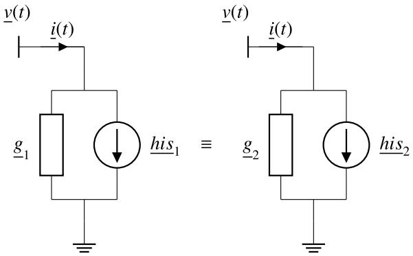  
Fig. 3. Schematic for the time-step transition

procedure can be applied for multiple changes in the same fashion in accordance with the re-initialization scheme. The extension to the multiphase case is straightforward, see [19] for further information.

The proposed formulation allows the assessment of electromagnetic and electromechanical phenomena with an unique model. This is achieved by setting the shifting frequency $f _ { s } = 5 0 \mathrm { H z o r } f _ { s } = 6 0 \mathrm { H z } ,$ , contrary at the beginning of the simulation when the shift frequency is $f _ { s } = 0$ Hz for an EMT-type simulation.

It should be observed the flexibility of the complex companion network since in the case where the frequency shifting equals $f _ { s } = 0$ Hz it resembles the same model when handling only with real values [14].

# 3. Cable modeling

# 3.1. Folded line equivalent

In order to overcome the constraint concerned with the cable length, the modeling based on the nodal admittance matrix ${ \bf Y } _ { n }$ seems to be a suitable approach due to its fully-coupled structure relating currents and voltages at terminals in the frequency domain.

However, a common issue faced by the direct fitting of $\mathbf { Y _ { n } }$ is its poor accuracy at the lower frequency range given the large eigenvalue ratio.

The Folded Line Equivalent (FLE) model proposed in [20] addressed this issue for overhead lines instead of a direct fitting of $\mathbf { Y _ { n } } .$ . Thus, a multi-scale “folded” version of it is proposed instead of latency exploitation [21].

Assuming a single core (SC) cable with core, sheath and armor, $\mathbf { Y _ { n } }$ can be defined as in (15)

$$
\mathbf {Y} _ {\mathbf {n}} (s) = \left[ \begin{array}{l l} \mathbf {Y} _ {s} & \mathbf {Y} _ {m} \\ \mathbf {Y} _ {m} & \mathbf {Y} _ {s} \end{array} \right] \tag {15}
$$

where ${ \bf Y } _ { s }$ and $\mathbf { Y } _ { m }$ are n × n block matrices defined in (16) and I the $n \times n$ identity matrix, with $n = 3$ being the number of conductors.

$$
\begin{array}{r l} \mathbf {Y} _ {s} & = \mathbf {Y} _ {c} \cdot (\mathbf {I} + \mathbf {H} ^ {2}) \cdot (\mathbf {I} - \mathbf {H} ^ {2}) ^ {- 1} \\ \mathbf {Y} _ {m} & = - 2 \mathbf {Y} _ {c} \cdot \mathbf {H} \cdot (\mathbf {I} - \mathbf {H} ^ {2}) ^ {- 1} \end{array} . \tag {16}
$$

As the implementation in time-domain solvers requires a rational approximation of $\mathbf { Y _ { n } } .$ , the goal is to use a linear transformation allowing a distinct grouping in such way that the rational approximation has a lower order and a higher accuracy. The FLE procedure shares some similarities with the usage of a Mode-Revealing Transformation [22] matrix to improve the observability of small eigenvalues at the lower frequency range.

Thus, $\mathbf { Y _ { n } }$ can be rewritten as

$$
\mathbf {Y} _ {n} = \mathbf {K} \cdot \left[ \begin{array}{c c} \mathbf {Y} _ {o c} & \mathbf {0} \\ \mathbf {0} & \mathbf {Y} _ {s c} \end{array} \right] \cdot \mathbf {K} ^ {- 1} \tag {17}
$$

where ${ \bf Y } _ { o c } = { \bf Y } _ { s } + { \bf Y } _ { m }$ is the admittance associated with the open circuit

current response, $\mathbf { Y } _ { s c } = \mathbf { Y } _ { s } - \mathbf { Y } _ { m }$ stands for the admittance related to the short-circuit current response, and

$$
\mathbf {K} = \left[ \begin{array}{l l} \mathbf {I} & \mathbf {I} \\ \mathbf {I} & - \mathbf {I} \end{array} \right] \tag {18}
$$

where I is the same as before. It should be pointed out that while ${ \bf Y } _ { n }$ has a dimension 2n × 2n, with n being the number of conductors, $\mathbf { Y } _ { o c }$ and $\mathbf { Y } _ { s c }$ are n × n matrices and can be fitted separately.

# 3.2. Rational modeling

The modeling of frequency dependent apparatus for time-domain simulations achieved a high level of accuracy due to the developments of rational approximations and a number of methods have been proposed in the last two decades, namely: the so-called pole relocation algorithm known as Vector Fitting (VF) [23–26], the Matrix Pencil Method (MPM) [27–30] or the Frequency-Partitioning Fitting (FPF) [31–33]. An interesting review of such approaches was presented recently [34].

The main advantage of a rational approximation of a frequency dependent device lies in the fact that it allows a direct interface with EMT-type programs by means of trapezoidal integration rule [19,31] or recursive convolution [35].

For the sake of reasoning, we present only the procedure for the fitting of $\mathbf { \Delta Y } _ { o c } ,$ as for $\mathbf { Y } _ { s c }$ the procedure would be the same.Thus, a rational approximation of $\mathbf { Y } _ { o c }$ is given by

$$
\mathbf {Y} _ {o c} \approx \overline {{\mathbf {Y}}} _ {o c} = \sum_ {m = 1} ^ {M} \frac {\mathbf {R} _ {m}}{s - p _ {m}} + \mathbf {D} \tag {19}
$$

where $p _ { m }$ is a set of common poles, either real or complex conjugate, $\mathbf { R } _ { m }$ is the residue matrix and D is the real part of $\mathbf { Y } _ { o c }$ at infinite frequency which in this case is considered to be a very large frequency 100 MHz. For fitting of $\mathbf { Y } _ { s c }$ the difference lies in that a distinct set of poles, residues and independent term D are used instead.

After the fitting, a post-processing stage is needed to assure that a stable time-domain circuit is obtained. This can be achieved by enforcing the passivity of each rational approximation, i.e., forcing the passivity in $\overline { { \mathbf { Y } } } _ { o c }$ and in $\overline { { \mathbf { Y } } } _ { s c } .$ The technical literature has proposed several techniques to perform the passivity enforcement, see for instance [36–39]. Here, we opt to use the approach proposed in [36] as it is available as a MATLAB subroutine.

# 4. Test cases

In order to validate the proposed multi-scale cable model, two test cases are evaluated in order to assess the accuracy of the achieved results:

1. 145 kV underground AC cable (1 km) in series with a power transformer   
2. 75 kV single-core DC submarine cable (2.5 km)

The time-domain loop implemented in the Wolfram Language considered a Modified Nodal Analysis [40] formulation to solve the circuit equations in a similar fashion like MatEMTP [41]. Furthermore, the time-step transition was defined prior the simulation starts as well as the new time-step length. A fixed time-step algorithm based on the Numerical Laplace Transform (NLT) [42–44] was implemented for validation of both test cases.

# 4.1. Case #1: 145 kV underground AC cable in series with a power transformer

This first test case consists of the simultaneous maneuver of a singlephase power transformer in series with a 1 km long 145 kV single core

(SC) underground cable connected to the low voltage terminal. Fig. 4 and Table 1 show the cable data while the 500/138 kV transformer model was incorporated to the engine solver with the aid of the wellknown black-box model [45] based on frequency scan measurements. In general this scenario is potentially prone to resonance phenomena and is typically encountered in long radial feeders or power plants.

With regard to the rational approximation describing the cable model in the frequency domain, Fig. 5 shows the behavior of the eigenvalues of the nodal admittance matrix derived from the original cable data and the fitted one. For the fitting, 60 poles were used for $\overline { { \mathbf { Y } } } _ { o c }$ and 60 poles for $\overline { { \mathbf { Y } } } _ { s c } . \mathrm { ~ A ~ }$ very good agreement was found in all the frequency range of interest.

A time-domain simulation was carried out where a sinusoidal voltage is applied at the transformer high voltage terminal as depicted in Fig. 6. The simulated core and sheath voltages at the receiving end are shown in Fig. 7 considering the initial time-step $\Delta t _ { 1 } = 1$ μs during the energization. When the transients vanish the time-step is then increased to $\Delta t _ { 2 } =$ 100 μs.

The results are then compared with the one found using the NLT which is an analytical approach with no approximation regarding either the distributed nature found in and underground cable or frequency dependency of the cable parameters.

The accuracy and versatility of this multi-scale approach is proved through the very accurate match along with the overall simulation run. Since the complex formulation allows the extraction of the instantaneous and envelope waveforms, Fig. 8(a) presents the results obtained with FAST. Evidence of the added value with the envelope waveform is its usefulness to observe a low frequency resonance due to the interaction between the transformer and cable impedances.

The proposed cable model may use a significantly larger time-step during the period of slow transients and steady-state. To exemplify this feature, the time-step length was increased by a factor of (1ms)/ (1μs) = 1000 to run a phasor-mode simulation as shown in Fig. 8(b). It can be observed that FAST allows a quite flexible approach to handle either small and large time-steps without constraints even if for timesteps in the order of milliseconds.

# 4.2. Case #2: 75 kV submarine DC cable

The second test considers a 75 kV single core (SC) armoured submarine cable employed in a VSC-HVDC application [46]. In some of these applications, the cables are buried just below the seabed, with

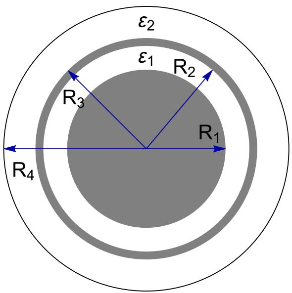  
Fig. 4. Case #1: 145 kV underground cable configuration

Table 1 Case #1: 145 kV underground cable data.   

<table><tr><td>Core conductor</td><td>R1= 20.75 mm</td><td>ρc= 2.286 × 10-8Ω.m</td></tr><tr><td>Insulation layer 1</td><td>R2= 40.85 mm</td><td>ε1= 2.5</td></tr><tr><td>Sheath</td><td>R3= 42.76 mm</td><td>ρs= 1.724 × 10-8Ω.m</td></tr><tr><td>Insulation layer 2</td><td>R4= 47.50 mm</td><td>ε2= 2.5</td></tr></table>

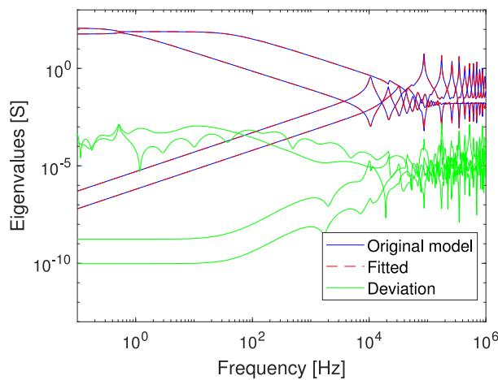  
Fig. 5. Behavior of the eigenvalues of the fitted nodal admittance matrix after passivity enforcement and comparison with the original data

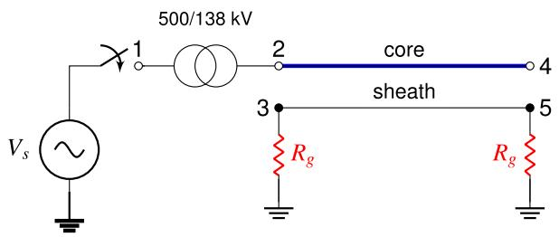  
Fig. 6. Case #1: Circuit for time-domain simulation

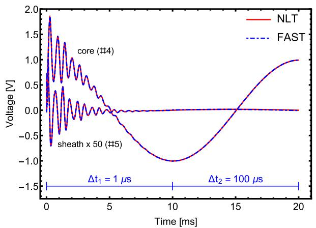  
Fig. 7. Case #1: Simulated core and sheath voltages

depths varying from 1 to 2 m. Here, the burial depth is 1.5 m below the seabed [47] and a length of 2.5 km is considered. The cable configuration is depicted in Fig. 9 and the main data are given in Table 2. The comparison of the eigenvalues of the rational approximation with 70 poles for $\overline { { \mathbf { Y } } } _ { o c }$ and 60 poles for $\overline { { \mathbf { Y } } } _ { s c }$ considering this second test case is depicted in Fig. 10. Again a very good agreement is found regardless of

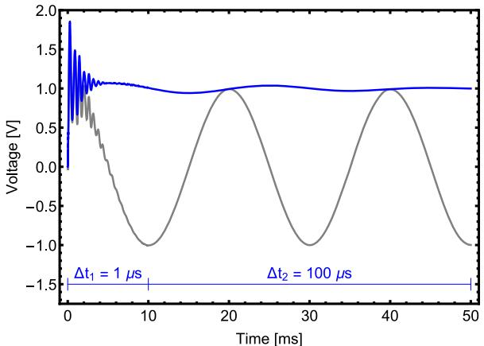  
(a) Tracking of both instantaneous and envelope waveforms

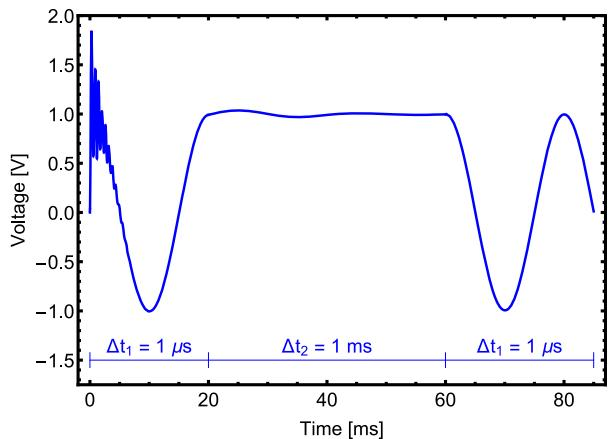  
(b)Envelope waveform   
Fig. 8. Case #1: Simulated core voltage

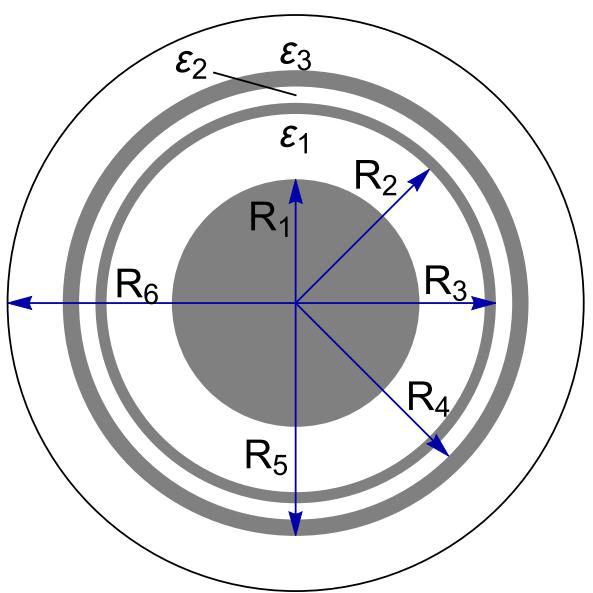  
Fig. 9. Case #2: 75 kV HVDC submarine cable configuration

the frequency range and there is an accurate approximation of the smallest eigenvalues at the lower frequency range.

The scheme in Fig. 11 depicts a voltage source connected to the core conductor which is ramped up linearly to 1 V in 10 μs. The sheath and armour are grounded at both terminals through a grounding resistance $R _ { g } = 1 0 \Omega$ as this is typically the practical scenario. An initial time-step

Table 2 Case #2: 75 kV submarine cable data.   

<table><tr><td>Core conductor</td><td>R1= 18.95 mm</td><td>ρc= 1.723 × 10-8Ω.m</td></tr><tr><td>Insulation layer 1</td><td>R2= 28.95 mm</td><td>ε1= 2.5</td></tr><tr><td>Sheath</td><td>R3= 30.65 mm</td><td>ρs= 22 × 10-8Ω.m</td></tr><tr><td>Insulation layer 2</td><td>R4= 33.15 mm</td><td>ε2= 2.5</td></tr><tr><td>Armour (μa= 90)</td><td>R5= 35.65 mm</td><td>ρa= 11 × 10-8Ω.m</td></tr><tr><td>Armour insulation</td><td>R6= 44.10 mm</td><td>ε3= 2.5</td></tr></table>

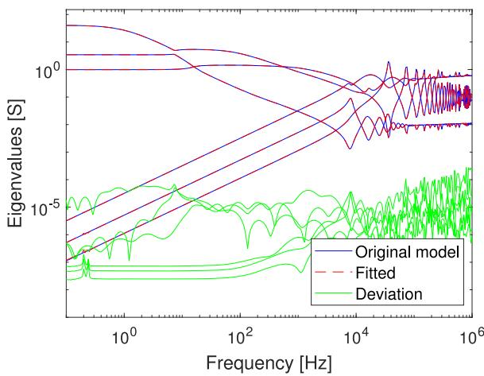  
Fig. 10. Behavior of the eigenvalues of the fitted nodal admittance matrix after passivity enforcement and comparison with the original data for the second test case.

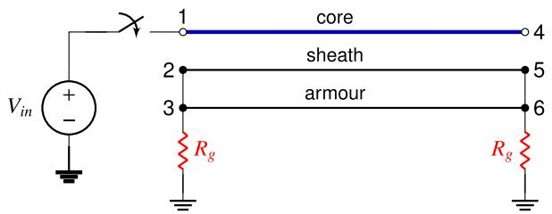  
Fig. 11. Case #2: Circuit for time-domain simulation

$\Delta t _ { 1 } ~ = 0 . 0 5 ~ \mu s$ is assumed and later it is increased to $\Delta t _ { 2 } = 5 0 ~ \mu s .$ .

The simulated core and sheath voltages at the receiving end are depicted in Fig. 12 and again a comparison using the NLT is carried out.

It can be verified in this special case involving a submarine cable that

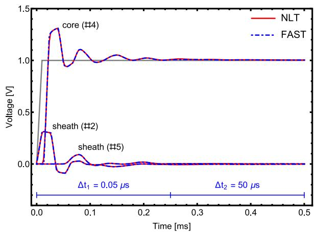  
Fig. 12. Case #2: Simulated core and sheath voltages

the proposed multi-scale approach was able to reproduce the core and sheath voltages even with an increase of 1000 times in the time-step length without any discontinuity. Here a larger initial time-step could be used instead. However, the evaluation aimed to demonstrate how flexible and efficient the novel re-initialization approach is without restriction regarding the time-step length.

# 5. Discussion

The main characteristic of MoC-based models is the decoupled structure of the companion model when the time-step is smaller than the traveling time and a π-like structure is required for larger time-steps in order to represent the coupling between the line ends. Here, a rather invariant structure based on the nodal admittance matrix was proposed bringing the advantage of full frequency dependent parameters even for large time-steps suitable to accurately represent cables in multi-scale simulations.

The novel re-initialization approach in conjunction with the shifting frequency allowed evaluations with multiple time-steps providing results without significant loss of accuracy and presenting smooth transitions in the waveform. The time-step change is performed in a simple and straightforward without modifications in actual companion models adopted by EMT-type programs which reduces considerably the computational burden.

The proposed re-initialization approach is quite general that a special case of FAST is observed when the shift frequency is $f _ { s } = 0 \ : \mathrm { H z } ,$ i.e., the expressions are the same as those if real variables are used. Hence, it can find a direct application to be incorporated in commercial software like EMTP-RV, PSCAD or Hypersim to enhance its computational performance.

# 6. Conclusions

This work has focused in providing a full frequency dependent cable model for multi-scale simulations based on the nodal admittance matrix rather than the Method of Characteristics (MoC). It considered the FAST formulation to modify the recursive convolution and trapezoidal rule expressions aiming at computations with analytic signals to allow the analysis of both electromagnetic and electromechanical transients as well as seamless transitions between both.

The achieved results indicate a suitable accuracy regarding timedomain responses. It was shown that the proposed approach allows relevant enhancements in time-domain solvers to cover diverse transients involving cables with a unique model. Future work will deal with the interaction of protection schemes and an assessment of low frequency oscillations.1

# CRediT authorship contribution statement

Felipe Camara: Conceptualization, Supervision, Methodology, Writing - original draft. Antonio C.S. Lima: Investigation, Methodology, Validation, Writing - review & editing. Kai Strunz: Conceptualization, Methodology.

# Declaration of competing interest

The authors declare that they have no known competing financial

interests or personal relationships that could have appeared to influence the work reported in this paper.

# References

[1] V. Jalili-Marandi, V. Dinavahi, K. Strunz, J.A. Martinez, A. Ramirez, Interfacing techniques for transient stability and electromagnetic transient programs (task force on interfacing techniques for simulation tools), IEEE Trans. Power Del. 24 (04) (2009) 2385–2395.   
[2] M.D. Heffernan, K.S. Turner, J. Arrillaga, C.P. Arnold, Computation of a.c.-d.c. system disturbances: Parts I, II and III, IEEE Trans. Power Apparatus Syst. 100 (11) (1981) 4341–4363.   
[3] V. Venkatasubramanian, Tools for dynamic analysis of the general large power system using time-varying phasors, Int. J. Electric Power Energy Syst. 16 (6) (1994) 365–376.   
[4] P. Zhang, J. Marti, H. Dommel, Synchronous machine modeling based on shifted frequency analysis, IEEE Trans. Power Syst. 22 (03) (2007) 1139–1147.   
[5] P. Zhang, J. Marti, H. Dommel, Induction machine modeling based on shifted frequency analysis, IEEE Trans. Power Syst. 24 (1) (2009) 157–164.   
[6] P. Zhang, J. Marti, H. Dommel, Shifted-frequency analysis for emtp simulation of power-system dynamics, IEEE Trans. Circuit. Syst. - I 57 (9) (2010) 2564–2574.   
[7] Y. Huang, M. Chapariha, F. Therrien, J. Jatskevich, J.R. Marti, A constantparameter voltage-behind-reactance synchronous machine model based on shiftedfrequency analysis, IEEE Trans. Energy Conver. 30 (02) (2015) 761–771.   
[8] F. Gao, K. Strunz, Modeling of constant distributed parameter transmission line for simulation of natural and envelope waveforms in power electric networks, Proc. 37th Annual North Am. Power Symposium (2005) 247–252.   
[9] K. Strunz, R. Shintaku, F. Gao, Frequency-adaptive network modeling for integrative simulation of natural and envelope waveforms in power systems and circuits, IEEE Trans. Circuit. Syst. - I 53 (12) (2006) 2788–2803.   
[10] R. Shintaku, K. Strunz, Branch companion modeling for diverse simulation of electromagnetic and electromechanical transients, Electric Power Syst. Res. 77 (11) (2007) 1501–1505.   
[11] F. Gao, K. Strunz, Multi-scale simulation of multi-machine power systems, Int. J. Electric. Power Energy Syst. 31 (9) (2009) 538–545.   
[12] S. Henschel, A. Ibrahim, H. Dommel, Transmission line model for variable step size simulation algorithms, Int. J. Electric Power Energy Systems 21 (03) (1999) 191–198.   
[13] A. Ibrahima, S. Henschelb, A.C.S. Lima, H. Dommel, Applications of a new emtp line model for short overhead lines and cables, Int. J. Electric Power Energy Syst. 24 (08) (2002) 639–645.   
[14] H.W. Dommel, Electromagnetic Transients Program (EMTP) Theory Book, Bonneville Power Administration, Portland, Oregon, 1986.   
[15] F. Gao, K. Strunz, Frequency-adaptive power system modeling for multiscale simulation of transients, IEEE Trans. Power Syst. 24 (2) (2009) 561–571.   
[16] H. Ye, K. Strunz, Multi-scale and frequency-dependent modeling of electric power transmission lines, IEEE Trans. Power Del. 99 (PP) (2017).   
[17] L. Cohen, Time-Frequency Analysis, Prentice Hall PTR, New Jersey, 1995.   
[18] B. Gustavsen, O. Mo, Interfacing convolution based linear models to an electromagnetic transients program, Int. Conf. Power Syst. Transients (IPST) (2007) 1–6.   
[19] B. Gustavsen, Computer code for rational approximation of frequency dependent admittance matrices, IEEE Trans. Power Del. 17 (4) (2002) 1093–1098.   
[20] B. Gustavsen, A. Semlyen, Admittance-based modeling of transmission lines by a folded line equivalent, IEEE Trans. Power Del. 24 (1) (2009) 231–239.   
[21] F. Camara, A.C. Lima, F.A. Moreira, A full frequency dependent line model based on folded line equivalencing and latency exploitation, Electric Power Syst. Res. 154 (2018) 352–360.   
[22] B. Gustavsen, Rational modeling of multiport systems via a symmetry and passivity preserving mode-revealing transformation, IEEE Trans. Power Del. 29 (1) (2014) 199–206.   
[23] B. Gustavsen, A. Semlyen, Rational approximation of frequency domain responses by vector fitting, IEEE Trans. Power Del. 14 (3) (1999) 1052–1061.

[24] B. Gustavsen, Rational approximation of frequency dependent admittance matrices, IEEE Trans. Power Del. 17 (4) (2002) 1093–1098.   
[25] B. Gustavsen, Improving the pole relocating properties of vector fitting, IEEE Trans. Power Del. 21 (03) (2006) 1587–1592.   
[26] D. Deschrijver, M. Mrozowski, T. Dhaene, D.D. Zutter, Macromodeling of multiport systems using a fast implementation of the vector fitting method, IEEE Microwave Wireless Component. Lett. 18 (6) (2008) 383–385.   
[27] Y. Hua, T.K. Sarkar, Matrix pencil method for estimating parameters of exponentially damped/undamped sinusoids in noise, IEEE Trans. Acoustics. Speech Signal Process. 38 (5) (1990) 814–824.   
[28] T.K. Sarkar, O. Pereira, Using the matrix pencil method to estimate the parameters of a sum of complex exponentials, IEEE Antennas Propagat. Mag. 37 (1) (1995) 48–55.   
[29] K. Sheshyekani, H.R. Karami, P. Dehkhoda, M. Paolone, F. Rachidi, Application of the matrix pencil method to rational fitting of frequency-domain responses, IEEE Trans. Power Del. 27 (04) (2012) 2399–2408.   
[30] K. Sheshyekani, B. Tabei, Multiport frequency-dependent network equivalent using a modified matrix pencil method, IEEE Trans. Power Del. 29 (5) (2014) 2340–2348.   
[31] T. Noda, Identification of a multiphase network equivalent for electromagnetic transient calculations using partitioned frequency response, IEEE Trans. Power Del. 20 (02) (2005) 1134–1142.   
[32] T. Noda, Application of frequency-partitioning fitting to the phase-domain frequency-dependent modeling of overhead transmission lines, IEEE Trans. Power Del. 30 (01) (2015) 174–183.   
[33] T. Noda, Application of frequency-partitioning fitting to the phase-domain frequency-dependent modeling of underground cables, IEEE Trans. Power Del. 31 (4) (2016) 1776–1777.   
[34] J. Morales Rodriguez, E. Medina, J. Mahseredjian, A. Ramirez, K. Sheshyekani, I. Kocar, Frequency-domain fitting techniques: a review, IEEE Trans. Power Del. 35 (3) (2020) 1102–1110, https://doi.org/10.1109/TPWRD.2019.2932395.   
[35] A. Semlyen, A. Dabuleanu, Fast and accurate switching transient calculations on transmission lines with ground return using recursive convolutions, IEEE Trans. Power Apparatus Syst. 94 (1975) 561–571.   
[36] B. Gustavsen, Passivity enforcement for transmission line models based on the method of characteristics, IEEE Trans. Power Del. 24 (3) (2008) 2286–2293.   
[37] Y. Wang, Z. Zhang, C.-K. Koh, G. Shi, G.K. Pang, N. Wong, Passivity enforcement for descriptor systems via matrix pencil perturbation, IEEE Trans. Comput.-Aided Des. Integrat. Circuit. Syst. 31 (4) (2012) 532–545.   
[38] S. Grivet-Talocia, B. Gustavsen, Passive macromodeling: Theory and applications 239, John Wiley & Sons, 2015.   
[39] J. Morales, J. Mahseredjian, K. Sheshyekani, A. Ramirez, E. Medina, I. Kocar, Poleselective residue perturbation technique for passivity enforcement of fdnes, IEEE Trans. Power Del. 33 (6) (2018) 2746–2754.   
[40] C.W. Ho, A.E. Ruehli, The modified nodal approach to network analysis, IEEE Trans. Circuit. Syst. 22 (6) (1975) 504–509.   
[41] J. Mahseredjian, F. Alvarado, Creating an electromagnetic transients program in matlab: Matemtp, Power Del. IEEE Trans. on 12 (1) (1997) 380–388.   
[42] D.J. Wilcox, Numerical laplace transformation and inversion, Int. J. Elect. Eng. 15 (1978) 247–265.   
[43] F.A. Uribe, J.L. Naredo, P. Moreno, Electromagnetic transients in underground transmission systems through the numerical laplace transform, Int. J. Electric. Power Energy Syst. 24 (3) (2002) 215–221.   
[44] P. Moreno, A. Ramirez, Implementation of the numerical laplace transform: a review (task force on frequency domain methods for emt studies), IEEE Trans.   
[45] B. Gustavsen, Study of transformer resonant overvoltages caused by cabletransformer high-frequency interaction, IEEE Trans. Power Del. 25 (2) (2010) 770–779.   
[46] C.H. Chien, R.W.G. Bucknall, Analysis of harmonics in subsea power transmission cables used in vsc–hvdc transmission systems operating under steady-state conditions, IEEE Trans. Power Del. 22 (4) (2007) 2489–2497.   
[47] J.C.L.V. Silva, A.C.S. Lima, A.P.C. Magalhaes, M.T.C. de Barros, Modelling seabed buried cables for electromagnetic transient analysis, IET Generat. Transmission Distribut. 11 (6) (2017) 1575–1582.