# An Electromagnetic Model for the Calculation of Tower Surge Impedance Based on ‘in Wire Approximation

Bamdad Salarieh, H. M. Jeewantha De Silva, Aniruddha M. Gole, Fellow, IEEE, Akihiro Ametani, Life Fellow, IEEE, and Behzad Kordi, Senior Member, IEEE

Abstract—When lightning strikes a transmission line tower or shield wires, electromagnetic waves propagate through the tower back and forth, increasing the voltage across insulator strings. ‡is can eventually lead to a back-ƒashover (BF), which may cause damage to equipment or costly power outages. To calculate the over-voltages and predict the probability of a BF, an accurate model of the tower and its grounding system is needed in electromagnetic transient (EMT) type simulators. ‡ere are a number of theoretical models for the equivalent circuit of a transmission tower. However, they either are not accurate enough or they are derived for a certain type of transmission tower, which limits their applicability. Numerical electromagnetic analyses have less simpli€cations compared to the theoretical solutions and are by far less expensive than €eld measurements. ‡ey also have the ƒexibility to analyse any type of tower. In this paper, the direct method for the measurement of tower impedance is implemented by NEC4 and applied to a 400-kV double circuit tower with all its details. ‡e process of obtaining the wire network of the tower used in this paper is completely automated and it can be applied to any other type of transmission tower. ‡e results of the numerical simulations are compared to those obtained with existing tower models. ‡e developed model in this paper is capable of considering all the details of the tower and including the €nite resistance of the ground and grounding electrodes.

Index Terms—Electromagnetic analysis, power system transients, numerical analysis, surge protection.

# I. Introduction and Background

C ALCULATION of overvoltages in power transmissionlines struck by lightning has been the subject of much lines struck by lightning has been the subject of much research in the past decades. ‘e accurate representation of the transmission line tower and its grounding system is an essential part of studying the transient behavior of the power system. ‘e advances made in the protection mechanisms require a greater precision in the calculations concerning the transmission line tower.

‘e approaches for modeling transmission line towers can be divided into three categories: (i) theoretical, (ii) numerical, and (iii) experimental that are performed/implemented either

B. Salarieh, and H. M. J. De Silva are with Manitoba Hydro International, Winnipeg, MB R3P 1A3, Canada (e-mail: salarieb@mhi.ca; jeewantha@mhi.ca).

A. M. Gole, A. Ametani, and B. Kordi are with the Department of Electrical and Computer Engineering, University of Manitoba, Winnipeg, MB Canada R3T 5V6 (e-mails: aniruddha.gole@umanitoba.ca; aametani@mail.doshisha.ac.jp; behzad.kordi@umanitoba.ca).

Manuscript received xxxx. xx, xxxx; revised xxxx. xx, xxxx.

in the time [1]–[14] or frequency domains [15]–[17]. ‘e numerical analyses are based on a) the Method of Moments (MoM) [17]–[19], b) Finite Element Method (FEM) [20], [21], c) Hybrid Electromagnetic Model (HEM) [22], or d) Finite Di‚erent Time Domain (FDTD) method [23]–[28]. Experimental measurements have been performed on full scale towers [28]–[32] or scaled towers [4], [11], [29], [33], [34]. Regardless of the approach, the aim of such analysis is to either €nd an equivalent impedance or derive an equivalent electric circuit for the transmission line tower with the same response as the measured waveforms. In the theoretical approaches, it is not possible to consider all the tower details, such as its cross arms or bracings. Furthermore, the tower body is approximated by simple geometries such as a cylinder (e.g. [5]) or cone (e.g. [4]). ‘ere are only a few experimental studies on a limited number and types of in-service towers as such measurements require an outage and are quite costly. Due to the restrictions of the theoretical and experimental approaches, developing an automated process for the numerical analysis of transmission towers is receiving more a‹ention in recent years.

Considering the computational electromagnetic (CEM) techniques, FEM, MoM and FDTD can be used to solve the full-wave Maxwell’s equations [35]. ‘e MoM is a numerical technique employed for the solution of integral equations, while FEM and FDTD are di‚erential-equation based. As such, FEM and FDTD need to discretize the entire simulation space whereas the MoM will only require a discretization of the wire structure. ‘is is an advantage of using MoM for the simulation of open-region problems, such as the simulation of transient behavior of transmission line towers in this paper, that provides an ecient technique. Hence, the MoM is used in this paper in the numerical simulations.

Following a thorough overview of the existing models for the transmission line towers and their underlying assumptions, a numerical method based on thin wire approximation of the tower is presented in this paper. ‘e Numerical Electromagnetic Code (NEC4) is used to determine the surge impedance of a double circuit transmission line tower either above a perfect electric conductor (PEC) ground or with grounding electrodes buried in lossy ground. ‘e developed model is veri€ed by simulating cylinders of di‚erent heights and comparing the results with the measurements available in the literature. Counterpoise grounding electrodes of di‚erent lengths (from 5 to 20 m)

are considered in soil with resistivity of 100 and 1000 Ωm. In contrast to the theoretical tower models, the proposed model is general and it can be applied to analyse the transient behavior of any type of transmission tower.

# II. Definition of Tower Surge Impedance

‘ere are three de€nitions for the time-domain surge impedance of a tower in the literature [36]. ‘e transient surge impedance is a time-domain function and is de€ned as the ratio of the instantaneous values of the voltage at top of the tower v(t) to the injected current to the tower i(t) [9],

$$
z (t) = \frac {v (t)}{i (t)}. \tag {1}
$$

‘is de€nition only works for purely resistive circuits, where the voltage and current have the same waveshapes. ‘e other de€nition of the surge impedance is by considering a step or ramp current injected into the tower and is given by [15]

$$
z (t) = \frac {v (t)}{\operatorname* {m a x} [ i (t) ]}. \tag {2}
$$

‘e commonly-used de€nition is the ratio of the voltage peak to the current at the time of voltage peak [6] given by

$$
Z = \frac {\operatorname* {m a x} [ v (t) ]}{I} \tag {3}
$$

where I is the value of $i ( t )$ when the voltage $v ( t )$ is maximum. ‘is de€nition of the surge impedance is not a function of time.

As will be shown in Section V-A, the above time-domain de€nitions of the surge impedance are dependent on the waveshape of the injected current [36]. In order to mitigate this issue and to de€ne a more general impedance for the tower, the frequency-domain surge impedance given by

$$
Z (f) = \frac {V (f)}{I (f)} \tag {4}
$$

is used in this paper, where $I ( f )$ is the injected current at the tower top and $\bar { V ( f ) }$ is the voltage at the top of the tower. ‘is de€nition depends only on the geometry and electromagnetic properties of the tower.

# III. An Overview of Tower Models

‘e large number of existing models for transmission line towers [1]–[10], [16], [26], [27], [29], [30], [37]–[44] can be classi€ed in three categories based on the underlying assumptions and the components used to represent the tower as follows.

1) Vertical Lossless Frequency-Independent Models: ‘ese types of models approximate the tower body, i.e. its main legs and cage, with a simple geometric shape such as a cylinder [3]–[9], [39], [42] or a cone [4], [6]. ‘e characteristic impedance of the whole tower as a function of the height above ground is derived using basic electromagnetic €eld analysis. In some, the current that is injected to the tower is assumed to be of a speci€c shape, such as a ramp [6], [42], a double exponential [6], [38], or a rectangular wave shape [7], [9], that restricts the applicability of such tower

models to other waveshapes. Furthermore, the e‚ect of tower cross arms and bracings is neglected, and the criteria for the selection of the radius of the equivalent structure is not well established. Figure 1A shows a typical double circuit tower, which is considered in this paper, and Fig. 1B shows its representation by such models. Table I shows the surge impedance of the double-circuit tower calculated based on these models.

2) Multisection Lossless Transmission Line Models: In these models, similar to the previous, only the main body of the tower is considered, but it is divided into a number of lossless transmission lines, usually four, and the characteristic impedance of each part is derived by analysing the tower elements as a multiconductor system [1]–[3], [16]. Table II shows the value of the surge impedance in each section for a 4-story tower model as shown in Fig. 1C. In the model of Hara & Yamamoto [3], the tower cross arms are also modeled by horizontal lossless transmission lines $( Z _ { A i } )$ , and the bracings are modeled by a surge impedance $( Z _ { L i } = 9 Z _ { T i } )$ in parallel to the tower main body in each section, as shown in Fig. 1D.   
3) Multistory Tower Models: As shown in Figs. 1E and 1F, these tower models divide the tower into four segments at the upper, middle, and lower phase arm positions. Each section consists of a lossless transmission line $Z _ { T }$ in series with a parallel RL circuit [26], [27], [29], [30], [43]–[45]. ‘e

TABLE I   
Surge impedance of the double circuit tower calculated by lossless freqency-independent tower models.   

<table><tr><td>No</td><td>Model</td><td>Expression</td><td>ZT(Ω)</td></tr><tr><td>1</td><td>Wagner &amp; Hileman [9]</td><td>60 ln(√2 2h/r0)</td><td>205</td></tr><tr><td>2</td><td>Jordan [6]</td><td>60 ln(h/r1) - 60</td><td>129</td></tr><tr><td>3</td><td>Sargent &amp; Darveniza [6]</td><td>60 ln(√2 2h/r3) - 60</td><td>195</td></tr><tr><td>4</td><td>Sargent &amp; Darveniza [6]</td><td>60 ln(√2 √h2 + r02/r0)</td><td>160</td></tr><tr><td>5</td><td>Menemenlis &amp; Chun [38]</td><td>50 + 35√h</td><td>285</td></tr><tr><td>6</td><td>Chisholmet al. [4]</td><td>60 ln(cot(tan-1(r0/h)/2))</td><td>184</td></tr><tr><td>7</td><td>Chisholmet al. [4]</td><td>60 ln(tan-1(r0/h)/2) - 60</td><td>124</td></tr><tr><td>8</td><td>Chisholmet al. [5]</td><td>60 ln(cot(tan-1(T)/2))</td><td>190</td></tr><tr><td>9</td><td>Flash version 1.7 [39]</td><td>60√π/4 ln(1/√2 cot(tan-1(T)/2))</td><td>150</td></tr><tr><td>10</td><td>Hara &amp; Yamamoto [3]</td><td>60 ln(√2 2h/r0) - 120</td><td>167</td></tr><tr><td>11</td><td>De conti [8], Takahashi [7]</td><td>60 ln(4h/r0) - 60</td><td>166</td></tr><tr><td>12</td><td>IEEE WG [42]</td><td>60 ln(h/r0)</td><td>142</td></tr><tr><td>13</td><td>Takahashi [7]</td><td>60[ln(√2 2h/r0) - 1.54]</td><td>112</td></tr></table>

1 ‘e radius of the tower at its base, waist and top are r0, r1, r2, respectively. r3 is the radius of the cylinder approximating the tower.   
2 ‘e height of the tower is $h ,$ height from base to waist is $h _ { 1 }$ and height from waist to top is $h _ { 2 } .$ .   
3 T = (r2h2 + r1h + r0h1)/h2.

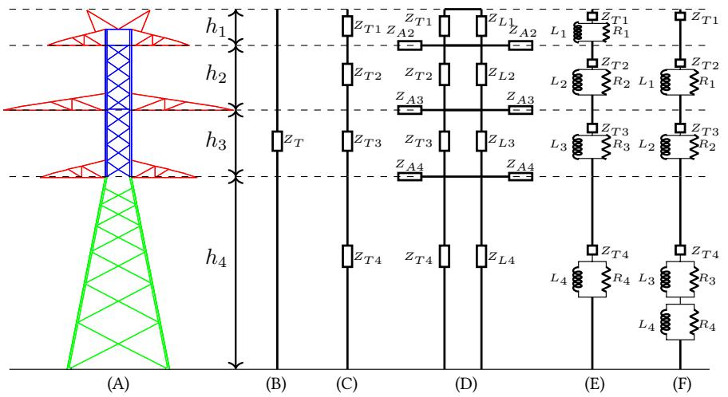  
Fig. 1. (A) 400 kV double circuit transmission line tower, and its equivalent circuits: (B) lossless frequency-independent equivalent circuit, (C) multisection lossless line, (D) the model of Hara & Yamamoto [3] which considers the cross arms and bracings, (E) Multistory tower model, and (F) is the model of Baba [44].

TABLE II Surge impedance of the double circuit tower calculated by lossless tower models (multi conductor system).   

<table><tr><td>No</td><td>Model</td><td>ZT1(Ω)</td><td>ZT2(Ω)</td><td>ZT3(Ω)</td><td>ZT4(Ω)</td></tr><tr><td>14</td><td>Ametani [16]</td><td>95</td><td>112</td><td>102</td><td>87</td></tr><tr><td>15</td><td>Ametani simplified [16]</td><td>88</td><td>108</td><td>96</td><td>75</td></tr><tr><td>16</td><td>Gutierrez [2], [1]</td><td>270</td><td>253</td><td>230</td><td>167</td></tr><tr><td rowspan="5">17</td><td rowspan="5">Hara &amp; Yamamoto [3]</td><td>128</td><td>120</td><td>106</td><td>83</td></tr><tr><td>ZL1(Ω)</td><td>ZL2(Ω)</td><td>ZL3(Ω)</td><td>ZL4(Ω)</td></tr><tr><td>1152</td><td>1080</td><td>954</td><td>747</td></tr><tr><td>ZA1(Ω)</td><td>ZA2(Ω)</td><td>ZA3(Ω)</td><td>ZA4(Ω)</td></tr><tr><td>-</td><td>305</td><td>282</td><td>257</td></tr></table>

resistance represents the a‹enuation of traveling waves in the tower, and the inductance makes the resistance ine‚ective as time passes by and also adjusts the propagation velocity along the tower [30]. ‘ese models are derived based on the results of €eld measurements on actual towers and the values of the tower surge impedance and a‹enuation coecients have to be determined by a trial and error process such that the response of the circuit representing the tower would be the same as the measured ones. ‘ere are limitation in extending the results of such models to other types of transmission towers [30]. Table III shows the values of tower parameters calculated based on these models, and the equivalent circuit of the tower is shown in Fig. 1E. In the model proposed by Ishii and Baba [44], two parallel RL elements are considered in the lower tower section as shown in Fig. 1F.

# IV. Verification of the Numerical Analysis

To inspect the validity of a model for transient simulation of transmission line towers, €eld measurements on simple geometric shapes or real towers can be employed. Measurement of the tower surge impedance is performed in two ways: one is the direct method [11], [31], where a

current pulse is injected into the tower top and the voltage between the tower top and a reference voltage measuring wire is measured using a voltage divider. ‘e other method is the reƒection method [46], where a steep-front traveling wave is injected into the tower top using a wire, and the reƒected wave is observed to estimate the transient impedance of the tower. In this paper, the former method of measurement is implemented using numerical simulations, since the reƒection method is only valid when evaluating the reƒection of waves from adjacent towers [47]. Due to the complexity and cost of measurements on transmission line towers, the number of measurements are highly limited and restricted. Furthermore, the data of the tower and grounding system used for the measurement is not available in detail.

Measurements of the surge characteristics of cylinders with di‚erent heights and radii performed by Hara et al. [45] are employed to validate the accuracy and applicability of the proposed simulation model. ‘e simulations are performed using Numerical Electromagnetic Code (NEC-4), which is based on the thin wire approximation and the numerical solution of integral equations by means of the Method of Moments (MoM) [48]. NEC is a well-known frequency-domain electromagnetic solver that employs the MoM [35]. In the measurements of [45], the electrodes are placed on a $1 2 \times 1 0 ~ \mathrm { m ^ { 2 } }$ iron plate as the ground as shown in Fig. 2. ‘e current is applied to the top of the vertical conductor by a current lead extended horizontally 9 m away. ‘e voltage is measured using a voltage probe in the gap between the top of the cylindrical conductor and a voltage reference wire, which is horizontally extended to the remote ground and it is perpendicular to the current lead wire to minimize the coupling e‚ects. Both the current and voltage wires are a‹ached vertically to the ground at their ends, using a matching resistance (Rc) to avoid reƒections.

‘e measurement performed on a 3-m high cylinder with

TABLE III Surge impedance of the double circuit tower calculated by multistory tower models.   

<table><tr><td>No</td><td>Model</td><td>ZT1(Ω)</td><td>ZT2(Ω)</td><td>ZT3(Ω)</td><td>ZT4(Ω)</td><td>R1(Ω)</td><td>R2(Ω)</td><td>R3(Ω)</td><td>R4(Ω)</td><td>L1(μH)</td><td>L2(μH)</td><td>L3(μH)</td><td>L4(μH)</td></tr><tr><td>18</td><td>Ishii [30]</td><td>220</td><td>220</td><td>220</td><td>150</td><td>8.32</td><td>20.37</td><td>20.37</td><td>33.47</td><td>3.49</td><td>8.53</td><td>8.53</td><td>14.01</td></tr><tr><td>19</td><td>Yamada [29]</td><td>120</td><td>120</td><td>120</td><td>120</td><td>9.30</td><td>16.45</td><td>17.06</td><td>42.80</td><td>2.79</td><td>4.94</td><td>5.13</td><td>12.86</td></tr><tr><td>20</td><td>Motoyama [43]</td><td>120</td><td>120</td><td>120</td><td>120</td><td>5.83</td><td>11.70</td><td>9.32</td><td>26.80</td><td>2.31</td><td>4.61</td><td>3.69</td><td>10.60</td></tr><tr><td>21</td><td>Baba [44]</td><td>200</td><td>200</td><td>180</td><td>150</td><td>20</td><td>30</td><td>25</td><td>25</td><td>6</td><td>9</td><td>15</td><td>1.5</td></tr><tr><td>22</td><td>Hashimoto [27]</td><td>195</td><td>182</td><td>149</td><td>121</td><td>13.30</td><td>32.50</td><td>28.10</td><td>76.10</td><td>7.42</td><td>18.10</td><td>15.70</td><td>52.7</td></tr></table>

a radius of 2.5 mm is considered for the numerical analysis in NEC4. A 10 kΩ resistance is inserted between the top of the electrode and end of the voltage reference wire. ‘e voltage is evaluated by calculating the current ƒowing through this resistor. It shown that the value of the voltage-measuring probe has no signi€cant impact on the measurement if its internal capacitance is less that a certain limit [49]. Finally, the inverse Fourier transform is used to obtain the time domain voltage and current.

‘e voltage waveform shown in Fig. 3, adopted from [45], is used as the input to the system. Figure 3 shows the measured and simulated currents injected at the top of the cylinder that shows the accuracy of simulation results, in terms of both the waveshape and magnitude. ‘e measured current initially rises for 5 ns and remains almost constant till $t ~ = ~ 2 0$ ns that is when the reƒected wave from the ground reaches the top of the cylinder. ‘e approach in the paper has been partially validated by comparison with simple geometric structures. However, complete validation will require comparison with €eld test results on transmission line towers. ‘is is relegated to forthcoming papers.

# V. Results and Discussions

In this section, €rstly, the simulation results are presented for vertical cylinders and the double-circuit tower (shown in Fig. 9) on a PEC ground. ‘e dependence of time-domain surge impedance and the e‚ect of tower elements are investigated. Finally, the e‚ect of lossy ground on the simulated results is presented and discussed.

# A. Dependence of Time-Domain Surge Impedance on the Excitation Waveshape

In this section, we also employ the measurements of Hara et al. [45] are considered to show the dependence of time-domain impedance de€nitions on the waveshape of the excitation. In [45], the so-called maximum surge impedance,

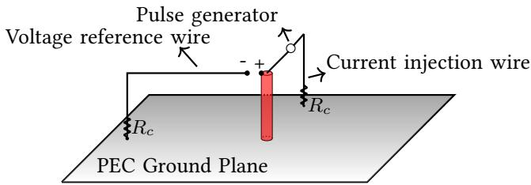  
Fig. 2. Setup for the measurement of surge characteristics of a vertical cylinder by direct method as performed by Hara et al. in [45].

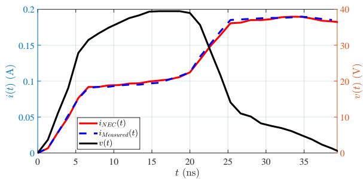  
Fig. 3. Voltage at the top of the cylinder with reference to remote ground (right axis) and measured and simulated current (le‰ axis) injected at the top of a 3-m cylinder on a PEC ground.

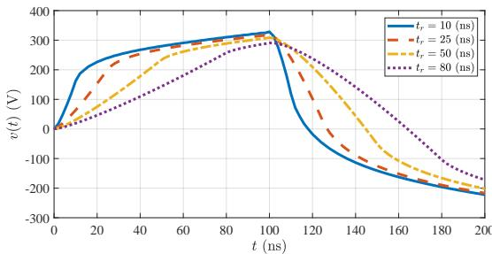  
Fig. 4. Simulated voltage at the top of a 15-m vertical cylinder in response to pulse currents of 1 A in magnitude and rise time of tr injected at the tower top.

as given in (3), was used. A step input current with a rise time of 5 ns is applied to the cylinder (see Fig. 2) and the surge impedance is calculated at $t _ { 0 } = 2 h / c ,$ , where h is the height of the cylinder and c is the speed of light. For the case of a cylinder with a height of 15 m and a radius of 25.4 mm, the measured surge impedance is 320 Ω [45]. ‘e same cylinder is simulated in NEC4 in the frequency range of 0.1 to 250 MHz. ‘e length of the current and voltage leads are 115 m, so that the reƒected waves do not a‚ect the results until 760 ns. Step currents with various rise times from $t _ { r } = 1 0$ to 80 ns are injected into the top of the cylinder. ‘e values of $t _ { r }$ are less than the round-trip travel time of the wave along the cylinder, which is equal to $t _ { 0 } = 1 0 0 ~ \mathrm { n s } .$ As a result, the e‚ect of grounding system appears a‰er the peak of the voltage waveform. ‘e voltage at the top of the cylinder relative to the voltage reference wire is shown in Fig 4. ‘e rise time of the voltage waveform is almost equal to the rise time of the injected current and there is a reƒection from the ground at $t _ { 0 } = 1 0 0 \ \mathrm { n s } .$ . Calculating the surge impedance of the tower for the considered excitations

using (3), Z varies from 324.6 to 293Ω, which is equal to a variation of 9.7%, when the rise time is increased from 10 to 80 ns. Considering a double exponential excitation waveshape, which is commonly used in lightning studies, the surge impedance de€ned by (3) decreases from 316.8 Ω for a a rise time of $T _ { 1 } = 1 0 \mu s$ to 232.5 Ω for a double exponential waveform with a rise time of $T _ { 1 } = 2 0 0 \mu s$ .

# B. E‚ect of Tower Elements

In order to simulate a structure using NEC a wire-grid representation of the structure has to be created as NEC has no ability to import arbitrary 3D geometries. It needs the start and end points of the segments of the wire grid that comprise the thin-wire model representation of the structure. Using the CAD €le of the tower geometry, its a prohibitively laborious process to obtain the coordinates manually. In this paper, an automated process is developed that uses the double circuit tower CAD €le (in ‘.step’ format) to generate the thin-wire model of the tower (as shown in Fig. A.1). ‘is provides a detailed model of the tower for the numerical simulations by NEC4. It also enables the sensitivity study with regards to the level of detail required for an accurate simulation.

Generally, a typical transmission line tower consists of a main body (green in Fig. 1A), a cage (blue), cross arms (red), and slant and horizontal elements (also blue). ‘e double circuit tower is simulated in NEC4 in the frequency range of 0.1 to 240 MHz with four level of details. Firstly, only the main legs with a height of 24.01 m are considered (Case 1). Next, the tower cage is added to the main legs, making the tower height equal to 42.51 m (Case 2). In Case 3, the cross arms are added to the geometry, and €nally, the shield wire cross arms, bracing, and horizontal elements are taken into account in Case 4. ‘e simulation con€guration is the same as that shown in Fig. 2 and the horizontal extension of the leads is 200 m far from the top of the geometry. In the simulations performed in this section, to achieve a desirable resolution in the frequency domain, 800 frequency points are used.

Two ramp currents with a magnitude of 1 A and rise times of $t _ { r } ~ = ~ 5 0$ and 150 ns are used as the current waveform injected into the top of the structure through the current lead wire. Assuming that the waves propagate through the tower structure at the speed of light, the travel time $t _ { 0 } = 2 h / c$ in Cases 1, 2, and 3 should be 160, 283 and 300 ns, respectively. ‘e voltage at the top of the structure is shown in Fig. 5 for $t _ { r } ~ = ~ 5 0$ ns. ‘e surge impedance of each structure calculated using (3) at $t _ { 0 } ~ = ~ 2 h / c$ and also the apparent propagation speed (v0), that is when we consider a straight vertical conductor, relative to the speed of light (c) are given in Table IV. It can be seen that the inclusion of the cross arms in the model decreases the tower surge impedance by 16.1% in the case of fast-rising currents $( t _ { r } = 5 0$ ns) and 10.9% in the case of a excitation with a rise time of $t _ { r } = 1 5 0 ~ \mathrm { n s }$ . ‘is is in agreement with previous measurements that considered the tower cross arms as capacitively-loaded stubs in parallel with the tower body [4]. Figure 6 shows the voltage at the tower of Case 3 when the rise time of the excitation ramp

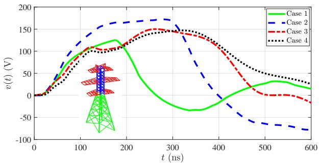  
Fig. 5. ‘e e‚ect of tower elements on the voltage at the top of the structure for a ramp current with a rise time of $t _ { r } = 5 0$ ns injected into the structure.

TABLE IV Surge impedance and wave propagation speed of the double circuit tower when different level of details for the tower are considered.   

<table><tr><td>Geometry</td><td>Z50(Ω)</td><td>Z150(Ω)</td><td>v0/c(%)</td></tr><tr><td>Case 1</td><td>106.3</td><td>103</td><td>90.8</td></tr><tr><td>Case 2</td><td>172.4</td><td>164.1</td><td>91</td></tr><tr><td>Case 3</td><td>153.7</td><td>136.5</td><td>87</td></tr><tr><td>Case 4</td><td>145.9</td><td>137.2</td><td>84</td></tr></table>

current is 1 ns. ‘e reƒections observed in the waveshape show a negative reƒection coecient from the end of the cross arms [4]. ‘e travel time of the upper cross arm, considering a propagation speed equal to the speed of light is 38.67 ns, which is in agreement with the reƒections observed in this €gure. However, such reƒections will have no considerable e‚ect in the case of currents with higher rise times. ‘is shows that the extent of which each tower element a‚ects the tower surge impedance depends on the excitation waveshape. ‘e tower in Cases 3 and 4 have almost a similar surge impedance for all waveshapes. ‘is can be justi€ed by considering the opposing e‚ects that adding the shield wire cross arms and tower bracing have on the impedance of the tower [17]. In all four cases, the apparent travel speed is lower than 91% of the speed of the light due to the presence of di‚erent tower elements that increase the propagation path of the waves.

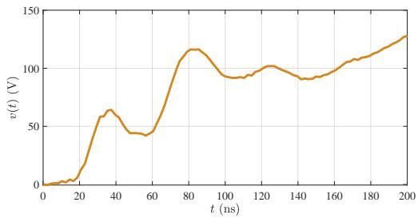  
Fig. 6. Negative reƒections from the end of tower cross arms when a fast rising current is applied to the tower top in case 3.

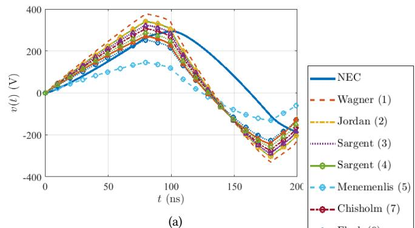

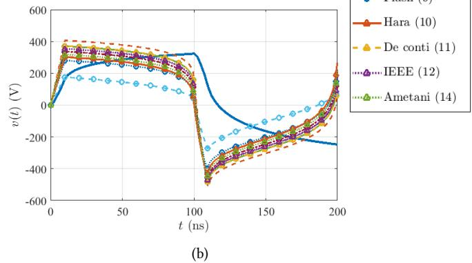  
Fig. 7. Comparison of the voltage at the top of a 15-m cylinder obtained by numerical analysis and the models of Tables I and II. ‘e excitation current is a ramp with a rise time of (a) $t _ { r } = 8 0$ ns and (b) $t _ { r } = 1 0 ~ \mathrm { n s } .$ .

# VI. Comparison of Theoretical and Simulation Results

In this section, to assess the accuracy of di‚erent tower models on the prediction of tower top voltage, they are compared with the numerical results for the case of the vertical cylinders with heights of 15, 45, and 90 m. ‘ey are also compared with the numerical results for the case of the double circuit tower over a lossy ground.

# A. Vertical Cylinders

Figures 7a and 7b show the voltage at the top of the cylinder for the case of a vertical cylinder with a height of 15 m on a PEC ground when injected with currents with rise times of $t _ { r } ~ = ~ 8 0$ and $t _ { r } ~ = ~ 1 0$ ns, respectively. ‘is €gure presents a comparison of 11 of existing models with that obtained using NEC4. ‘e predicted waveform of the theoretical solutions is closer to that obtained by NEC4 when the rise time of the injected current is 80 ns (see Fig. 7a). Whereas, in the case of a rise time of 10 ns, the calculated waveshape using the theoretical models are step-like and are di‚erent from the simulated voltage in NEC4, which shows a slower rise-time and decay. ‘is is due to the fact that the early-time electromagnetic €elds around the cylinder is di‚erent from TEM but the theoretical models assume the electromagnetic €elds are always TEM.

# B. Double Circuit Tower

Figure 8a shows the voltage at the top of the double circuit tower obtained using NEC and theoretical approaches 4 and

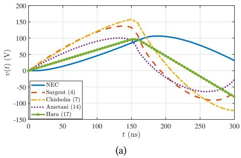

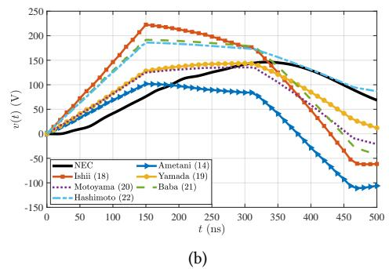  
Fig. 8. ‘e voltage at the top of the structure of Case 1 (a) and Case 4 (b) in response to a ramp excitation of rise time $t _ { r } = 1 5 0$ ns.

7 from Table I and 14 and 17 from Table II, for which we used the method of characteristics of partial di‚erential equations theory [50]. A rise time of $t _ { r } = 1 5 0$ ns is considered such that the rise time is less than the travel time. In the theoretical approaches, the wave propagation speed is assumed to be the speed of light, however, in the numerical result shown in Fig. 8a, the apparent wave speed is equal to 87% of the speed of light. ‘is is in agreement with measurements which suggest 80% [6], 71%, 76%, 81% and 89% of the speed of the light [31]. ‘is justi€es why the zero crossing of the NEC result is at a later time in comparison with the theoretical results. ‘e multiconductor model of Ametani [16] and the model of Hara & Yamamoto [3] show the closest values of the surge impedance ( relative di‚erence of 5.3% and 6.8%).

Now, let’s consider a model of the double-circuit tower with all its details with the same current injected to the top of the tower. ‘e multistory models of Table III are compared with the numerical analysis in Fig. 8b. Regarding the voltage peak, the closest predicted values are by the models of Yamada [29] (error of 2.8%) and Motoyama (error of 8.4%) [43]. Considering the waveshape of the voltage, the models of Yamada and Motoyama are closer than the others ones to the one predicted by NEC. However, the model of Hashimoto [27] shows a closer decaying part than the other models. As stated in [27], this is due to the modi€cation in the derivation of this model in order to reproduce the gradual decay of the measured voltages. All of the multistory models of Table III require “tuning” based on measured waveform from a speci€c tower structure, whereas our approach based on numerical simulation solely requires the geometrical information of the tower. For example, the model of Ishii which has a large overestimation of the voltage, was derived for Japanese

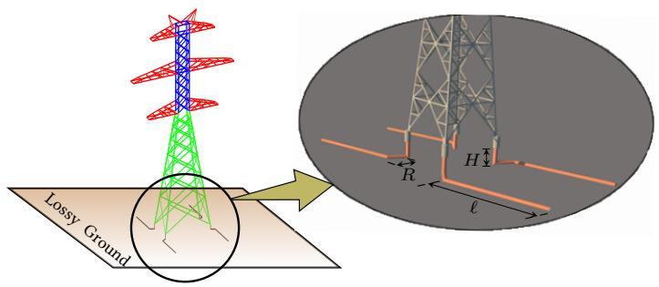  
Fig. 9. ‘e wire diagram of the double circuit tower generated by an automated procedure to be used in numerical simulations by NEC4. Sections of the tower, identi€ed by di‚erent colors, and counterpoise grounding electrodes buried in lossy ground are shown.

500 kV [30] and UHV towers [29] that are taller (62.8 and 140.5 m) than the typical double circuit towers like the one considered in this paper (45.1 m). ‘e results shown in this section, demonstrate the multistory models of Table III have limited applicability.

# VII. Effect of Grounding System

In the previous sections and most previous studies (e.g. [3], [4], [10]), the ground was assumed to be a Perfect Electric Conductor (PEC). However, in reality the conductivity of ground is €nite. In this section, we consider a lossy ground where counterpoise grounding electrodes, $\ell = 1 , 2 , 5$ , 10 and 20 m in length, are considered as the grounding system of the tower (see Fig. 9). ‘e burial depth of the electrode is assumed to be H = 1 m, with an opening length of R = 1 m, and an optimized opening angle of 45◦ [21]. Two soil resistivities of 100 and 1000 Ωm are considered. In the case of tower with all its details and grounding electrodes, the number of segments being analyzed in NEC4 is 7, 654. A single-frequency simulation was completed in about 10 minutes on an Intel-Xeon, 3.1-GHz desktop computer.

Fig. 10a shows the simulated and theoretical voltage at the top of the tower when counterpoise grounding electrodes of 20 m in length buried in soil with a resistivity of 100 Ωm are considered. To obtain the response of theoretical tower models, €rst an electromagnetic simulation is performed on counterpoise grounding electrodes using the model presented in [51], to obtain their low frequency resistance. ‘e obtained values agree well with the analytical formula provided in IEEE Std. 1243 [39]. ‘is resistance is added to the tower models and the simulation is performed in PSCAD/EMTDC. ‘e injected current is a $2 / 5 0 ~ \mu s$ double exponential with a peak of 1 A, and a shunt internal resistance of 5 kΩ [52] is considered to have the same condition as the numerical simulation. ‘e most noticeable di‚erence between an ideal and lossy ground is the di‚erence in the peak of the voltages predicted by theories that is less in the case of a lossy ground but still considerable. Considering the NEC results, the models of Baba [18] and Yamada [29] produce the closest results considering both the peak of the voltage and its waveshape. ‘e di‚erence in the peak of the voltage is 2.5% and 5.6%, respectively. Assuming a soil resistivity of

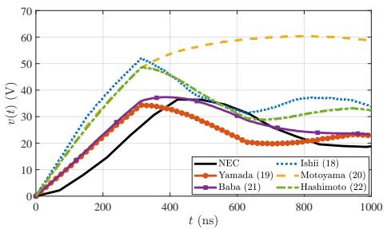  
(a)

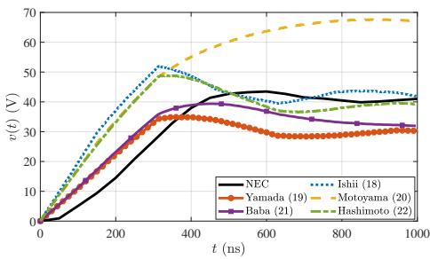  
(b)   
Fig. 10. ‘e simulated and theoretical voltage at the top of the double circuit tower considering counterpoise grounding electrodes (20 m) in a soil with resistivity of (a) $\bar { \rho } = 1 0 0 \bar { \Omega } /$ m and (b) ρ = 1000 Ω/m and in response to double exponential current of 2/50 µs with a magnitude of 1 A.

1000 Ωm, the same tower models as above generate the closest results to those generated by NEC (see Fig. 10b). However, the di‚erence (9.41% for Baba [18] and 20.45% for Yamada [29]) is higher as the resistivity of the soil is increased. In general, the theoretical tower models are a fast way to have an estimation of the developed over-voltages on a transmission tower, but they are not accurate for all tower models and the value of circuit elements need to be tuned for every topology of the tower using €eld measurements. For instance, the model proposed in [30] is most valid for the tested 500 kV tower, with a height of 62.8 m. Furthermore, the e‚ect of excitation waveshape on the accuracy of predicted overvoltages is another challenge for the theoretical tower models. In €eld measurements, the transient voltages/currents are measured in the time domain by applying an impulse voltage waveform. So, the measured responses are dependent on the applied voltage waveform, as shown in this paper. Whether to use the theoretical tower models or the proposed simulation model in lightning studies, depends on the intended balance between the accuracy and simplicity. To gain higher accuracy, the numerical methods can be useful but they require more computational resources. Among the numerical techniques, the MoM is less computationally expensive. Moreover, as this is not a repetitive procedure in the transmission system analysis, a few hours spent on a detailed accurate design is not a critical issue.

# VIII. Conclusions

In this paper, a detailed wire-model of a typical 400 kV double-circuit tower with a height of 45.1 m was generated

using an automated process that employs the CAD drawing of the tower. ‘e wire model was then used in NEC4 to calculate the transient tower-top voltage considering the €nite conductivity of the ground and the grounding electrodes. It was shown that the de€nition of tower surge impedance based on time domain voltage and current has a main disadvantage of being dependent on the excitation waveshape and rise time. Following a review of existing transmission tower models, they were compared with the results of NEC4 for the case of a simple cylinder and the 400 kV double-circuit tower. Regarding the peak of the tower-top voltage, the theoretical models could provide close predictions to that of NEC4. Considering the voltage waveshape, theoretical models were not able to generate results close to those determined by NEC4 in the case of fast-front currents, because the initial electromagnetic €eld around the cylinder is not TEM. In the case of the double-circuit tower on a PEC ground, the models of Yamada [29] (di‚erence of −2.8%) and Motoyama [43] (di‚erence of −8.4%) had the closest similarity to NEC4 results with regards to the calculated voltage peak. ‘e proposed thin-wire model is capable of considering the e‚ect of the €nite conductivity of the ground. In order to compare this model for the case of a lossy ground, a grounding resistance was added to the theoretical models. ‘e models of Baba [18] (di‚erence of +2.5%) and Yamada [29] (di‚erence of −5.6%) provide closer peak values to that of NEC4, although the error can not be considered as negligible when $\rho = 1 0 0 0 \Omega \mathrm { m }$ (the error is −9.41 and −20.45%, respectively). ‘e existing models of transmission towers were derived based on either electromagnetic €eld analysis on a simpli€ed model of the tower (approximated by a cone or cylinder), or by a trial-and-error process to €nd the resistance and inductance values of the circuit such that they produce similar waveform as the measurements on a certain type of tower. ‘e multistory model provides reliable results for that speci€c type of tower. However, the circuit values, the surge impedance, the a‹enuation constants and velocities should be tuned to provide accurate results for other type of towers. ‘e process of such tuning is not well established.

Unlike the theoretical tower models, the proposed process in this paper has the advantage of only needing the geometry of the tower as the input and it can be applied to arbitrary tower geometries. Moreover, the simulations are performed in the frequency domain by applying a variable-frequency sinusoidal voltage and the calculated result is not dependent on the applied voltage waveform. ‘e proposed model could be further veri€ed with the measurement results on real transmission line towers and be applied to analyze the transient behavior of any other type of transmission towers. ‘is way, it would be possible to examine the generality of the results obtained in this paper in regard to other types of towers and reach a more general conclusion about the accuracy and limitation of the theoretical tower models.

# Acknowledgement

‘e authors would like to acknowledge €nancial support from Manitoba Hydro International (MHI) and Mitacs.

TABLE V Electrical characteristics of the transmission line considered in this paper [53].   

<table><tr><td>Operating voltage (kV)</td><td>Conductor type</td><td>Conductor diameter (mm)</td><td>OHGW type</td><td>OHGW diameter (m)</td><td>Shielding angle (deg)</td></tr><tr><td>400</td><td>ACSR Cardinal</td><td>30.42</td><td>Glv steel</td><td>12.60</td><td>19.2</td></tr></table>

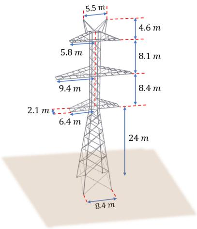  
Fig. A.1. Geometry of the 400 kV double-circuit transmission line tower employed in this paper.

# Appendix

‘e dimensions of the considered double-circuit tower are given in Fig. A.1, and the electrical characteristics are provided in Table V (conductors and overhead ground wires (OHGW) are not considered in the simulations of this paper).

# References

[1] R. J. Gutierrez, P. Moreno, L. Guardado, and J. L. Naredo, “Comparison ´ of transmission tower models for evaluating lightning performance,” 2003 IEEE Bologna PowerTech - Conf. Proc., vol. 4, pp. 339–344, 2003.   
[2] J. A. Gutierrez, R. P. Moreno, J. L. Naredo, J. L. Berm ´ udez, M. Paolone, ´ C. A. Nucci, and F. Rachidi, “Nonuniform transmission tower model for lightning transient studies,” IEEE Trans. Power Deli., vol. 19, no. 2, pp. 490–496, 2004.   
[3] T. Hara and O. Yamamoto, “Modeling of a transmission tower for lightning-surge analysis,” IEE Proceedings - Gen. Trans. Dist., vol. 143, no. 3, p. 283, 1996.   
[4] W. A. Chisholm, Y. L. Chow, and K. D. Srivastava, “Lightning surge response of transmission towers,” IEEE Trans. Power App. Syst., vol. PAS-102, no. 9, pp. 3232–3242, 1983.   
[5] W. A. Chisholm and Y. L. Chow, “Travel time of transmission towers,” IEEE Trans. Power App. Syst., vol. PAS-104, no. 10, pp. 2922–2928, 1985.   
[6] M. A. Sargent and M. Darveniza, “Tower Surge Impedance,” IEEE Trans. Power App. Syst., vol. PAS-88, no. 5, pp. 680–687, 1969.   
[7] H. Takahashi, “Con€rmation of the error of Jordan’s formula on tower surge impedance,” Œe Journal of the Inst. Elect. Eng. Japan, vol. 114-B, pp. 112–113, 1994.   
[8] A. De Conti, S. Visacro, A. Soares, and M. A. O. Schroeder, “Revision, extension, and validation of Jordan’s formula to calculate the surge impedance of vertical conductors,” IEEE Trans. Electromagn. Compat., vol. 48, no. 3, pp. 530–536, 2006.   
[9] C. F. Wagner and A. R. Hileman, “A New Approach to the Calculation of the Lightning Performance of Transmission Lines III-A Simpli€ed Method: Stroke to Tower,” Trans. of the American Inst. Elect. Eng. Part III: Power App. Syst., vol. 79, no. 16, pp. 589–603, 1960.

[10] M. O. Goni and A. Ametani, “Analysis and estimation of surge impedance of tower,” Applied Computational Electromagn. Society, vol. 24, no. 1, pp. 72–78, 2009.   
[11] F. A. Fisher, J. G. Anderson, and J. H. Hagenguth, “Determination of lightning response of transmission lines by means of geometrical models,” Trans. of the American Inst. of Elect. Eng. Part III: Power App. and Syst., vol. 78, no. 4, pp. 1725–1734, 1959.   
[12] M. T. Correia De Barros and M. E. Almeida, “Computation of electromagnetic transients on nonuniform transmission lines,” IEEE Trans. Power Del., vol. 11, no. 2, pp. 1082–1087, 1996.   
[13] H. Motoyama and H. Matsubara, “Analytical and experimental study on surge response of transmission tower,” IEEE Trans. Power Del., vol. 15, no. 2, pp. 812–819, 2000.   
[14] F. Rachidi, W. Janischewskyj, A. Hussein, C. Nucci, S. Guerrieri, B. Kordi, and J.-S. Chang, “Current and electromagnetic €eld associated with lightning-return strokes to tall towers,” IEEE Trans. Electromagn. Compat., vol. 43, no. 3, 2001.   
[15] F. P. Dawalibi, W. Ruan, S. Fortin, J. Ma, and W. K. Daily, “Computation of power line structure surge impedances using the electromagnetic €eld method,” Proc. IEEE/Power Eng. Soc. Transm. Dist. Conf, vol. 2, pp. 663–668, 2001.   
[16] A. Ametani, “Frequency-dependent impedance of vertical conductors and a multiconductor tower model,” IEE Proceedings - Gen. Trans. Dist., vol. 141, no. 4, p. 339, 2002.   
[17] Y. Baba and M. Ishii, “Numerical electromagnetic €eld analysis of tower surge response,” IEEE Trans. Power Del., vol. 15, no. 3, pp. 1010–1015, 2000.   
[18] Y. Baba and I. Masaru, “Tower Models for Fast-Front lightning currents,” IEE Japan, vol. 120-B, no. 1, pp. 18–23, 2000.   
[19] M. S. Yusuf, M. Ahmad, M. A. Rashid, and M. O. Goni, “Analysis of lightning surge characteristics on transmission tower,” Engineering Leˆers, vol. 23, no. 1, pp. 29–39, 2015.   
[20] P. C. A. Mota, M. L. R. Chaves, and J. R. Camacho, “Power Line Tower Lightning Surge Impedance Computation , a Comparison of Analytical and Finite Element Methods .” 2012 Int. Conf. on Renewable Energies and Power ‹ality, ICREPQ’12, no. March 2012, 2012.   
[21] R. J. Anderson De Araujo, S. Kurokawa, C. M. D. Seixas, and B. Kordi, “Lightning-induced surge in transmission towers calculated using full-wave electromagnetic analysis and the method of moments,” 2018 13th IEEE Int. Conf. Industry Applic., INDUSCON 2018 - Proc., pp. 943–948, 2019.   
[22] A. Soares, M. A. O. Schroeder, and S. Visacro, “Transient voltages in transmission lines caused by direct lightning strikes,” IEEE Trans. on Power Del., vol. 20, no. 2 II, pp. 1447–1452, 2005.   
[23] T. H. ‘ang, Y. Baba, N. Nagaoka, A. Ametani, N. Itamoto, and V. A. Rakov, “FDTD simulation of insulator voltages at a lightning-struck tower considering ground-wire corona,” IEEE Trans. Power Del, vol. 28, no. 3, pp. 1635–1642, 2013.   
[24] J. Takami, T. Tsuboi, K. Yamamoto, and S. Okabe, “Lightning Surge Response of a Double-Circuit Transmission Tower with Incoming Lines to a Substation through FDTD Simulation,” IEEE Trans. Dielectr. Electr. Insul., pp. 96–104, 2013.   
[25] T. Noda, A. Tatematsu, and S. Yokoyama, “Improvements of an FDTD-based surge simulation code and its application to the lightning overvoltage calculation of a transmission tower,” Electric Power Systems Research, vol. 77, pp. 1495–1500, 2007.   
[26] T. Noda, “A tower model for lightning overvoltage studies based on the result of an FDTD simulation,” Elect. Eng. Japan, vol. 164, no. 1, pp. 8–20, 2008.   
[27] S. Hashimoto, Y. Baba, N. Nagaoka, A. Ametani, and N. Itamoto, “An equivalent circuit of a transmission-line tower struck by lightning,” 2010 30th Int. Conf. Lightning Protection, ICLP 2010, vol. 2010, pp. 2–7, 2017.   
[28] H. Motoyama, Y. Kinoshita, K. Nonaka, and Y. Baba, “Experimental and analytical studies on lightning surge response of 500-kV transmission tower,” IEEE Trans. Power Del., vol. 24, no. 4, pp. 2232–2239, 2009.   
[29] T. Yamada, A. Mochizuki, J. Sawada, E. Zaima, T. Kawamura, A. Ametani, M. Ishii, and S. Kato, “Experimental evaluation of a uhv tower model for lightning surge analysis,” IEEE Trans. Power Deli., vol. 10, no. 1, pp. 393–402, 1995.   
[30] M. Ishii, T. Kawamura, T. Kouno, E. Ohsaki, K. Shiokawa, K. Murotani, and T. Higuchi, “Multistory Transmission Tower Model For Lightning Surge Analysis,” IEEE Trans. Dielectr. Electr. Insul., vol. 6, no. 3, pp. 1327–1335, 1991.   
[31] M. Kawai, “Studies of the Surge Response on a Transmission Line Tower,” IEEE Trans. Power App. Syst., vol. 83, no. 1, pp. 30–34, 1964.

[32] A. Ametani, K. Adachi, and T. Narita, “An Investigation of Surge Propagation Characteristics on an 1,100 kV Transmission Line,” Œe trans. Inst. of Elect. Eng. of Japan, vol. 123, no. 4, pp. 513–519, 2003.   
[33] J. L. Bermudez, J. A. Gutierrez, W. A. Chisholm, F. Rachidi, and´ M. Paolone, “A Reduced-Scale Model to Evaluate the Response of Tall Towers Hit by Lightning,” Int. Symp. Power ‹ality (SICEL), no. January, 2001.   
[34] J. Takami, T. Tsuboi, K. Yamamoto, S. Okabe, and Y. Baba, “Lightning surge characteristics on inclined incoming line to substation based on reduced-scale model experiment,” IEEE Trans. Dielectr. Electr. Insul., vol. 20, no. 3, pp. 739–746, 2013.   
[35] D. B. Davidson, Computational electromagnetics for RF and microwave engineering. Cambridge University Press, Oct. 2010.   
[36] L. Grcev and F. Rachidi, “On tower impedances for transient analysis,” IEEE Trans. Power Del., vol. 19, no. 3, pp. 1238–1244, 2004.   
[37] J. G. Anderson, A. R. Hileman, and W. Chisholm, “A Simpli€ed Method for Estimating Lightning Performance of Transmission Lines,” IEEE Trans. Power App. and Syst., vol. PAS-104, no. 4, pp. 918–932, 1985.   
[38] C. Menemenlis and Z. T. Chun, “wave propagation on nonuniform lines,” IEEE Trans. Power App. Syst., vol. PAS-101, no. 4, pp. 833–839, 1982.   
[39] IEEE guide for Improving the lightning performance of Transmission Lines. IEEE std. 1243-1997, Dec. 1997.   
[40] C. A. Jordan, “Lightning computations for transmission lines with overhead ground wires,” General Electric Rev., vol. 37, no. 4, pp. 180–186, 1934.   
[41] Z. G. Datsios and P. N. Mikropoulos, “E‚ect of tower modelling on the minimum backƒashover current of overhead transmission lines,” 19th Int. Symp. on High Voltage Eng. (ISH), no. August, 2015.   
[42] CIGRE WG01 SC33, “Guide to procedures for estimating the lightning performance of transmission lines, A. Eriksson (CH), L. Dellera (IT), G. Baldo (IT), C. H. Bouquegneau (BE), H. Darvenisa (AU), J. Elovaara (FI), E. Garbagnati (IT), C. Gary (FR),” Cigre Tb 63 ´ , vol. 01, no. October, p. 64, 1991.   
[43] H. Motoyama, K. Shinjo, Y. Matsumoto, and N. Itamoto, “Observation and analysis of multiphase back ƒashover on the Okushishiku test transmission line caused by winter lightning,” IEEE Trans. Power Del., vol. 13, no. 4, pp. 1391–1398, 1998.   
[44] M. Ishii and Y. Baba, “Numerical electromagnetic €eld analysis on lightning surge response of tower with shield wire,” IEEE Power Engineering Review, vol. 17, no. 1, p. 69, 2000.   
[45] T. Hara, O. Yamamoto, M. Hayashi, and C. Uenosono, “Empirical formulas of surge impedance for single and multiple vertical cylinders,” IEEJ Trans. Power Energy, vol. 110, no. 2, pp. 129–137, 1990.   
[46] G. D. Breuer, A. J. Schultz, R. H. Schlomann, and W. S. Price, “Field Studies of the Surge Response of a 345-Kv Transmission and ground wire,” Trans. American Inst. Elect. Eng. Part III: Power App. Syst., vol. 76, no. 3, pp. 1392–1396, 1957.   
[47] Y. Baba and M. Ishii, “Numerical electromagnetic €eld analysis on measuring methods of tower surge impedance,” IEEE Trans. Power Del., vol. 14, no. 2, pp. 630–635, 1999.   
[48] G. J. Burke, Numerical Electromagnetic Code - (NEC-4) - Method of Moments, Part I: User’s Manual, Lawrence Livermore National Laboratory.   
[49] P. Yu‹hagowith, A. Ametani, N. Nagaoka, and Y. Baba, “Inƒuence of a measuring system to a transient voltage on a vertical conductor,” IEEJ Trans. Electr. Electr. Eng., vol. 5, no. 2, pp. 221–228, 2010.   
[50] J. A. Gutierrez, P. Moreno, J. L. Naredo, and J. C. Guti ´ errez, “Fast ´ transients analysis of nonuniform transmission lines through the method of characteristics,” Int. Journal Elect. Power Energy Syst., vol. 24, no. 9, pp. 781–788, 2002.   
[51] B. Salarieh, H. M. J. De Silva, and B. Kordi, “Wideband EMT-compatible model for grounding electrodes buried in frequency dependent soil,” Int. conf. Power Systems Transients (IPST2019) - Proc., 2019, Paper 19IPST081.   
[52] EPRI AC transmission line reference book-200kV and above. Palo Alto, Dec. 2005.   
[53] M. P. N. Datsios, Z. G. and T. E. Tsovilis, “Estimation of the minimum shielding failure ƒashover current for €rst and subsequent lightning strokes to overhead transmission lines,” Electric Power Systems Research, pp. 141–150, 2014.

Bamdad Salarieh received the B.Sc. degree in electrical engineering from Sharif University of Technology, Tehran, Iran, and M.Sc. degree in electrical engineering from University of Manitoba, Winnipeg, MB, Canada, in 2017, and 2020, respectively. He is currently a research engineer at Manitoba Hydro International, Winnipeg, MB, Canada. Bamdad was the recipient of the Young Scientist award at IPST 2019 conference. His research interests include Electromagnetic transients of power systems,

lightning electromagnetics, and renewable energy.

H. M. Jeewantha De Silva received B.Sc. (Eng) degree at University of Moratuwa, Sri Lanka in 2001 and then Ph.D from University of Manitoba, Canada in 2009 on accurate simulation of transmission lines and cables. Dr. De Silva is a Power System Simulation and Research Engineer at the Manitoba Hydro International, Canada since 2009. He is involved with improving overhead transmission lines and cable models in PSCAD/EMTDC commercial so‰ware and also Electromagnetic Transient Program (EMT)

algorithms and simulation tools. He is also involved in power system simulation studies and supporting PSCAD clients.

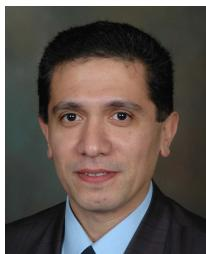

Behzad Kordi (M’05, SM’12) received the B.Sc. (with distinction), M.Sc., and Ph.D. degrees all in electrical engineering from Amirkabir University of Technology (Tehran Polytechnic), Tehran, Iran, in 1992, 1995, and 2000, respectively. During 1998 and 1999, he was with the Lightning Studies Group at the University of Toronto, Canada. In 2002, he joined the Electrical and Computer Engineering Department, University of Manitoba, Canada where he is currently a full professor and the director of McMath High Voltage Laboratory. His research

interests include high voltage engineering, electromagnetic compatibility, simulation models of power transformers and transmission lines, and condition monitoring of high voltage apparatus. Dr. Kordi was the chair of URSI Canada Commission E in 2012-13. He is a member of a number of Cigre working groups pertinent to transient modeling of power system ` apparatus. He is also an associate editor of IEEE Transactions on Dielectrics and Electrical Insulation and IET High Voltage. Dr. Kordi is a registered professional engineer in the province of Manitoba and was the recipient of 2012 IEEE EMC Richard B. Schulz best transactions paper award.

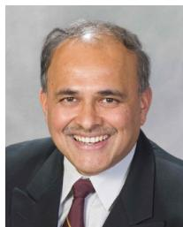

Aniruddha M. Gole (M’82, SM’04, F’10) is a Distinguished Professor and NSERC Industrial Chair in Power Systems Simulation at the Department of Electrical and Computer Engineering, University of Manitoba. He has over 30 years of experience in the development of modelling tools for power networks incorporating power-electronic equipment such as HVDC and FACTS converters. He is one of the original developers of the widely used PSCAD/ EMTDC simulation program. Dr. Gole has also made

important contributions to the development of the real-time digital simulator RTDS from RTDS Technologies of Winnipeg, Canada. Dr. Gole is a Fellow of the Canadian Academy of Engineering and an IEEE Fellow. For his contributions to the modelling of Flexible AC Transmission System (FACTS) devices, he received the IEEE Nari Hingorani FACTS Award in 2007. Dr. Gole is a member of the Long Range Planning Commi‹ee of the IEEE Power and Energy Society.

Akihiro Ametani (M’71, SM’83, F’92, LF’10) received the Ph.D. degree from UMIST, Manchester, U.K., in 1973, and the D.Sc. from the University of Manchester, Manchester, U.K., in 2010. He was with Bonneville Power Administration, Portland, OR, USA, to develop electromagnetic transients program from 1976 to 1981. He was a professor with Doshisha University, Kyoto, Japan, until March 2014, and with Polytechnique Montreal,` Montreal, Canada, from 2014 to 2018. Currently, he is a professor with the University of Manitoba,

Winnipeg, Canada. He was the Chairman of the Doshisha Council from 2011 to 2014. He served as a Vice-President of the IEE Japan in 2003 and 2004.