# Massively Parallel Implementation of AC Machine Models for FPGA-Based Real-Time Simulation of Electromagnetic Transients

Mahmoud Matar, Student Member, IEEE, and Reza Iravani, Fellow, IEEE

Abstract—This paper presents a generalized, parallel implementation methodology for real-time simulation of ac machine transients in an FPGA-based real-time simulator. The proposed method adopts nanosecond range simulation time-step and exploits the large response time of a rotating machine to: 1) eliminate the need for predictive-corrective action for the machine electrical and mechanical variables, 2) decouple the solution of the dq0 stator currents, and 3) enable the use of one-time-step delayed interface between the machine and the rest of the system which decouples the machine solution from that of the rest of the system. The proposed method simplifies the solution of the machine model without compromising accuracy or numerical stability of the simulation. This paper also presents a massively parallel, customized hardware architecture tailored to the solution of the mathematical model of ac machines. The proposed method and the developed hardware architecture are tested and verified based on the implementation of a permanent-magnet synchronous machine model and an induction machine-based ac-drive system in a field-programmable gate-array-based simulator. Real-time simulation is achieved with a computation time of 44 ns within the simulation timestep.

Index Terms—AC machines, electromagnetic transients, fieldprogrammable gate array (FPGA), modeling, real-time simulation.

# I. INTRODUCTION

R EAL-TIME simulators do exist and have been widelyused for the analysis of electromagnetic transients used for the analysis of electromagnetic transients (EMTs) and testing physical control/protection platforms [1]–[4]. Existing real-time simulators are based on parallel processing, where multiprocessors, either general-purpose processors (GPPs) or digital signal processors (DSPs), or computer clusters are utilized [5]–[11]. The existing real-time simulators have limitations on the minimum time-step size, the frequency bandwidth of the simulation results [12], and the accuracy of the adopted models. Therefore, their application are limited, particularly when power electronic-based apparatus with high switching frequencies are of concern. These limitations are the main motivation behind the development of

Manuscript received December 18, 2009; revised May 21, 2010, September 16, 2010, and September 30, 2010; accepted October 01, 2010. Date of publication November 18, 2010; date of current version March 25, 2011. This work was supported in part by the University of Toronto and in part by the Natural Sciences and Engineering Research Council of Canada (NSERC). Paper no. TPWRD-00943-2009.

The authors are with the Energy Systems Group, Electrical and Computer Engineering Department, University of Toronto, Toronto, ON M5S 3G4, Canada (e-mail: mahmatar@ieee.org; iravani@ecf.utoronto.ca).

Color versions of one or more of the figures in this paper are available online at http://ieeexplore.ieee.org.

Digital Object Identifier 10.1109/TPWRD.2010.2086499

a new field-programmable gate-array (FPGA)-based real-time simulator [13] which addresses such technical limits/challenges of real-time simulators based on a new methodology for implementation of the system equations in a FPGA environment. The salient feature of the implementation methodology of [13] is that it maintains the calculation time, within each simulation time-step, nearly fixed irrespective of the size of the system.

This paper extends the parallel implementation methodology of [13] to simulate ac machines with a nanosecond range simulation time-step in an FPGA environment. The proposed implementation methodology for ac machine models enables the use of a small simulation time-step, in the range of tens to few hundred nanoseconds. Based on exploiting the nanosecond range simulation time-step and the large response time of ac machines, the proposed method: 1) eliminates the need for predictive-corrective action for machine electrical and mechanical variables, 2) allows parallel simulation of both the electrical and mechanical subsystems of the machine, and 3) allows the use of the terminal voltages calculated at a given time-step to solve the machine’s variables in the subsequent time-step, without compromising accuracy or numerical stability of the simulation. Based on the proposed parallel implementation methodology, a massively parallel (i.e., having a large number of independent arithmetic units that operate simultaneously) customized hardware architecture is designed and implemented on a FPGA.

The rest of this paper is organized as follows. Section II describes the mathematical model and procedures to simulate a rotating ac machine. Section III analyzes the solution algorithm for the simulating ac machine to identify the potential parallelism inherent to it as a means for speeding up the required computations. The hardware architecture of the proposed simulator is then designed to exploit all possible levels of parallelism, inherent to the solution algorithm of ac machines, without imposing sever communication overhead time that otherwise can limit the performance. Section IV describes implementation of the model in the FPGA environment. Section V evaluates the performance of the developed model in the FPGA-based simulator. Conclusions are stated in Section VI.

# II. MACHINE MODEL

The ac electric machines that are often encountered in a power system include: 1) conventional field-controlled synchronous machines (SMs); 2) permanent magnet synchronous machines (PMSMs); 3) squirrel-cage induction (asynchronous) machines (IMs); and 4) doubly-fed asynchronous machines (DFAMs) [14].

For the analysis of electromagnetic transients of a power system, three different models for an ac electric machine are available. These models include 1) the phase-domain (PD) model; 2) the voltage-behind-reactance (VBR) model; and 3) the dq0-based model. These models can be mathematically derived from each other and provide identical simulation results for balanced and unbalanced operational scenarios provided that the simulation time-step is adequately small [15]. Since the time-step of the envisioned FPGA-based simulator can be in the order of nanoseconds, the selection of the machine model to be implemented in the simulator is judged based on its adoptability for FPGA implementation and its suitability for parallelized analysis.

Since the PD [16], [17] and the VBR [15], [18], [19] models have time-varying inductances and since they are interfaced directly to the rest of network being simulated, thus, the overall system admittance matrix needs to be upgraded and inverted/ factorized in each simulation time-step. This adds to the computational burden in each simulation time-step.

The phase-domain dynamic electrical equations of an ac machine can be transformed to a rotating dq0 frame [14] so that the time-variant inductance matrix of the machine is transformed to a constant matrix. The dq0 transformation matrix adopted in this work is stated in Appendix A. The equations representing dynamics of the electrical system of a SM, a PMSM, an IM, or a DFAM in a dq0 reference frame can be expressed as [14], [20], [21]

$$
v _ {d q 0} (t) = R i _ {d q 0} (t) + L \underset {d q 0} {\overset {\bullet} {i}} (t) + u (t) \tag {1}
$$

where $\mathrm { v } _ { d q 0 }$ and $\dot { \mathbf { l } } _ { d q 0 }$ are the vectors of machine voltages and currents, respectively, in the dq0 frame, R and L are the machine winding resistance and inductance matrices, respectively; and u is the speed voltage vector. Vectors $\mathrm { v } _ { d q 0 } , \mathrm { i } _ { d q 0 }$ , and u and matrices R and L, for SM, PMSM, IM and DFAM are given in Appendix B.

If required, the saturation effects can be represented by selecting the flux instead of the current as the state variable in (1). The machine currents can then be determined by using an approximated piecewise linear saturation characteristic.

Although the dq0 transformation simplifies the machine model by converting the time-varying inductances to constant inductances, however, it introduces another complication to the EMT-type solution algorithm. The dq0-based machine model solves the machine equations in the dq0 frame, whereas, the rest of the power system equations are solved in the abc frame, and given that the dq0 transformation is a nonlinear transformation, the simultaneous solution of the complete system is challenging. The dq0/abc interface between the machine and the network models can introduce errors to the simulation results and cause numerical instability if the simulation time-step is not adequately small [15]. Typically, the simulation time-step should be smaller than 50 s to maintain stability of the solution and keep the error within the acceptable range [22]. However, since the FPGA-based simulator is envisioned to operate with a simulation time-step, in the order of tens to a few hundred

nanoseconds, these numerical instability and inaccuracy issues are not of any concern for this paper.

For the analysis of electromagnetic transients, the dq0 machine model can be interfaced with the rest of the network model based on: 1) the compensation method [20], 2) the predictionbased method [20], 3) the one time-step delay method [23], [24], and 4) the network iterative method [25], [26].

Compared to the other interfacing methods, the one time-step delay method offers two main advantages in the context of this work as follows.

1) It is conceptually simple, computationally efficient, and requires relatively small hardware resources for implementation on an FPGA.   
2) It provides a means to partition the power system model into independent subsystems and, thus, enables the parallel solution of the system.

Contrary to the technical literature, which consider this one time-step delay as a drawback, we consider this delay advantageous to the parallelized solution method. However, we limit the time-step to ns range (in contrast to the reported literature that uses several microseconds) to prevent numerical issues and inaccuracy.

Based on the one time-step delay method, the machine is interfaced with the rest of the network as a current source. The current source in each time-step is determined by solving the machine equations using the machine terminal voltages from the previous time-step solution. A terminating resistance, connected between the machine terminal and the ground, may be required to ensure numerical stability, or alternatively, a small simulation time-step must be used [23], [24].

Since the dq0-based model provides a constant inductance matrix compared with those of the phase-domain and VBR models, it has the advantage to relatively reduce the hardware resources for implementation. As explained in Sections III and IV of the paper, the coefficients matrix of the discretized machine equations can be made constant and, thus, its inverse can be calculated once at the software level (i.e., before actual hardware implementation on the FPGA). The inverted matrix can then be stored on the FPGA and, thus, there is no need to perform any matrix inversions on the FPGA. Moreover, the decoupling effect of the one time-step delay interface enables the parallel solution of the machine model and the network model. Thus, in this paper, the dq0-based model and the one time-step delay interfacing method are adopted.

The rotating mechanical system of an ac machine for power system studies can be represented by a set of lumped rigid masses that are connected to each other through the corresponding shaft stiffness and damping, and dynamically modeled as [20]

$$
J ^ {\bullet \bullet} (\theta) + D ^ {\bullet} (\theta) + K \theta (t) = T _ {m} (t) - T _ {e} (t) \tag {2}
$$

where , , and are the matrices of moments of inertias, damping coefficients, and stiffness coefficients, respectively; and $\mathrm { T } _ { m }$ are vectors of electrical and mechanical torques, respectively; and is the vector of angular positions. Matrices , , and for an n-mass shaft train of a rotating machine are given in Appendix C.

The electrical and mechanical equations $( \mathrm { i . e . , ( l ) }$ and (2)) are coupled by the electrical torque $\mathrm { T } _ { G } ( \mathrm { t } )$ and the rotor speed $\omega$

$$
T _ {G} (t) = \frac {3}{2} P [ \lambda_ {d} (t) i _ {q} (t) - \lambda_ {q} (t) i _ {d} (t) ] \tag {3}
$$

$$
\omega (t) = \stackrel {\bullet} {\theta} _ {G} (t). \tag {4}
$$

Digital time-domain simulation of the machine’s differential equations requires their transformation into difference equations. This transformation can be carried out by means of various numerical integration methods (e.g., the trapezoidal method, backward Euler method, Simpson method, and Gear second order method [27], [28]). However, the selected method must be simple, numerically stable, and accurate enough for practical purposes [28].

The backward Euler method is stable and provides total damping to numerical oscillations at each discontinuity in two integration steps. However, it requires a much smaller simulation time-step than that of the trapezoidal rule to obtain accurate simulation results [28]. As the proposed implementation methodology allows calculations in real-time with a time-step in the range of tens to few hundred nanoseconds, in this paper the backward Euler method is used to discretize the machine’s equations.

The discretized forms of the ac machine electrical and mechanical equations, that is, (1), (2), and (4), based on the backward Euler method, are

$$
v _ {d q 0} (t) = R i _ {d q 0} (t) + \frac {L}{\Delta t} \left(i _ {d q 0} (t) - i _ {d q 0} (t - \Delta t)\right) + u (t) \tag {5}
$$

$$
\frac {J}{\Delta t} (\omega (t) - \omega (t - \Delta t)) + D \omega (t) + K \theta (t) = T _ {m} - T _ {e} \tag {6}
$$

$$
\omega (t) = \frac {\theta (t) - \theta (t - \Delta t)}{\Delta t}. \tag {7}
$$

It should be noted that for a dq0 machine model, prediction of the rotor angle and speed are required at the beginning of each time-step. The angular rotor position is required for the conversion between phase domain and dq0 frame and the rotor speed is needed for the solution of the dq0 frame machine equations. Special predictor formulae, for example, the fourth-order polynomial formula [20] and/or linear extrapolation are usually used for prediction of the rotor angular position and speed [20]. However, in this work the prediction formulae are not used to estimate the rotor speed and the angular position at the beginning of each time-step. Instead, the rotor speed and the angular position deduced in the previous time-step solution are used (i.e., $\omega ( \mathrm { t } ) = \omega ( \mathrm { t } - \Delta \mathrm { t } )$ and $\theta ( \mathrm { t } ) = \theta ( \mathrm { t } - \Delta \mathrm { t } ) ,$ ). Thus, the solution algorithm is further simplified which translates to a reduction in the required FPGA hardware resources. It should be noted that this approximation does not imply that and are fixed during the course of the simulation, since the system of mechanical equations are solved to update the values of and in every simulation time-step.

# III. PARALLELISM IN THE MACHINE MODEL SOLUTION ALGORITHM

The simulation of an electrical machine requires simultaneous solution of $( 5 ) - ( 7 )$ . The electromechanical subsystems

are coupled, that is, $\omega ( \mathrm { t } )$ and $\theta ( \mathrm { t } )$ are involved in the solution of (5) since they are required to calculate the speed voltage vector and for the conversion between the phase domain and dq0 frame, whereas $\lambda _ { d } ( \mathrm { t } ) , \lambda _ { q } ( \mathrm { t } ) , i _ { d } ( \mathrm { t } )$ , and $i _ { q } ( \mathrm { t } )$ are involved in the solution of (6) since they are required by (3) to calculate the electric torque.

However, since the simulation time-step is much smaller than the time constants of the electrical and mechanical subsystems, the coupling can be removed by introducing one time-step delay between the solution of the two sets of equations. Thus, the two subsystems of equations are solved independently. This establishes the first level of parallelism exploited in the implementation of the hardware module corresponding to an electrical machine model, in the proposed FPGA-based simulator.

Inspection of the discretized qd0 model, that is, (5) shows that except for the coupling between the d and q stator currents, due to the speed voltage vector $u ( \mathrm { t } )$ , the independent solution for all the currents of vector $\mathrm { I } _ { { d q 0 } } .$ , as defined in Appendix B, is possible. This coupling can be effectively eliminated if $u ( \mathrm { t } )$ is accurately predicted from previous time-steps data. In this paper, as the simulation time-step is orders of magnitude less than the mechanical time constant and as the fluxes are slow changing variables [20], rather than using prediction formulae that use several data points from past time-steps, only the previous time-step $\mathrm { t } - \Delta \mathrm { t }$ is considered, that is, is approximated and substituted by $u ( \mathrm { t } - \Delta \mathrm { t } )$ . This approximation is acceptable since the simulation time-step is small (i.e., in the order of few hundred nanoseconds), and the change in the fluxes and the mechanical speed, involved in the calculation of the speed voltage vector, in one simulation time-step is significantly small. Thus, the error introduced due to this approximation is insignificant and outweighed by the potential benefits of parallelizing the solution of the equations. Based on this approximation, (5) can be rewritten as

$$
\begin{array}{l} i _ {d q 0} (t) = \left(R + \frac {L}{\Delta t}\right) ^ {- 1} \\ \times \left[ v _ {d q 0} (t) + \frac {L}{\Delta t} i _ {d q 0} (t - \Delta t) - u (t - \Delta t) \right]. (8) \\ \end{array}
$$

Thus, the solution of (5) is transformed to the solution of the matrix-vector multiplication of (8). Similarly, by substituting for from (7) into (6), the solution of (6) is transformed to the matrix vector multiplication

$$
\begin{array}{l} \omega (t) = \left(\frac {J}{\Delta t} + k \Delta t + D\right) ^ {- 1} \\ \times \left[ T _ {m} - T _ {e} + \frac {J}{\Delta t} \omega (t - \Delta t) - k \theta (t - \Delta t) \right]. \quad (9) \\ \end{array}
$$

The solutions of (8) and (9) are further parallelized as discussed in the next section.

# IV. FPGA IMPLEMENTATION OF MACHINE MODELS

The proposed FPGA-based real-time simulator is envisioned to: 1) have a small simulation time-step (i.e., limited to a few hundred nanoseconds) and 2) be scalable, that is, to have the ability to maintain the computation time per simulation timestep constant (and less than the time-step), regardless of the

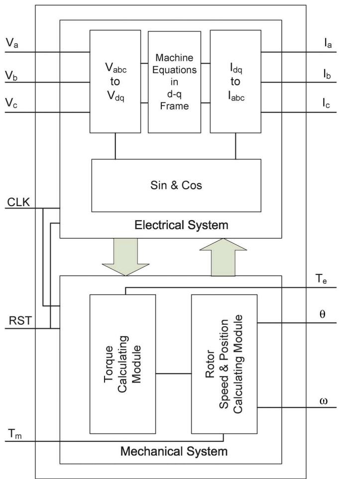  
Fig. 1. Functional block diagram of the FPGA implemented machine model.

system size, based on exploiting additional parallel hardware circuitry.

The first step regarding achieving the aforementioned operational characteristics of the proposed FPGA-based simulator is to design massively parallel hardware architecture that solves the power system mathematical model. Only the hardware architecture for solving three-phase machine models is presented in this paper.

The proposed design is based on implementing two main units operating in parallel. One unit is dedicated for the solution of the system of electrical equations and the second one is for the solution of the system of mechanical equations. Fig. 1 shows a functional block diagram of the proposed implementation corresponding to a three-phase machine model in the FPGA-based real-time simulator.

Fig. 1 shows that the unit dedicated for the solution of the electrical subsystem has four main modules as follows.

1) The $\mathrm { V } _ { a b c } / \mathrm { V } _ { d q 0 }$ module transforms the input voltages to the machine model from the abc to the dq0 frame.   
2) The second module solves the system of electrical equations in the dq0 frame, that is, (8).   
3) The $\mathrm { i } _ { d q 0 } / \mathrm { i } _ { a b c }$ module transforms the machine currents from the dq0 to the abc frame.   
4) The Sin&Cos module is a lookup table to provide the values of the sinusoidal functions for the transformations.

The lookup table has 1440 entries and consumes approximately 1% of the available resources.

The unit dedicated for the solution of the mechanical subsystem, Fig. 1, has two main modules as follows:

1) The first module calculates torque.   
2) The second module solves the system of mechanical equations.

The modules for the abc/dq0 and the dq0/abc transformations and solution of the system of electrical and mechanical equations involve matrix-vector multiplications. A matrix-vector multiplication is essentially the dot-product of each row of the multiplier matrix by the multiplicand vector. This is mathematically expressed in the form of a sum of product (SOP)

$$
Y (i) = \sum_ {j = 1} ^ {n} A (i, j) X (j) \tag {10}
$$

where ${ \mathrm { i } } = 1 , 2 , \ldots { \mathrm { n } }$ . Each of the n SOP equations of (10) is independent from the others. Thus, the n equations of (10) are solved in parallel. This establishes the second level of parallelism exploited in the FPGA-based simulator. In addition, the multiplication operations to construct the SOP of (10) are independent and can be carried out in parallel. This constitutes the third level of parallelism which is at the level of “primitive operations”.

Thus, the proposed hardware architecture is designed based on three levels of nested parallelism; (i) parallelism at the subsystems level, (ii) parallelism at the equations level, and (iii) parallelism at the primitive operations level. As shown in Fig. 1, the hardware circuit responsible for solving the machine model has two main units. Each unit has several modules, where each module corresponds to one of the aforementioned modules. Each module has a number of parallel processing elements. Each processing element is responsible for the solution of a single equation. Within each processing element, the primitive operations are mapped to the hardware circuitry that performs that primitive operation. For example, a multiplication operation is mapped to a hardware multiplier. The mapping of the primitive operations to the hardware exploits the independencies among operations. For example, parallel hardware multipliers and the adders tree are utilized to compute the products corresponding to the SOP parallel operations.

To further enhance the computational speed, the computation hardware and the storage registers are clustered together (i.e., each processing element has its own dedicated registers). This saves the time that is needed to read/write data from/to the system memory and, thus, the total computation time per simulation time-step is reduced.

The envisioned, nanosecond range, simulation time-step cannot be achieved just based on parallelizing and distributing the equations among processing elements. It also requires an efficient communication and synchronization among the processing elements to reduce the overhead which otherwise can severely limit the performance.

Although each processing module/element performs its computations independently from the others, different modules/elements have to communicate their outputs. Communication among processing modules/elements can impose

additional overhead time that can limit the performance. To reduce the overhead in the proposed FPGA implementation, a unidirectional point-to-point static interconnection network is implemented to directly transfer data from the outputs of one processing module/element to the inputs of another one. Direct point-to-point interconnection allows processing elements to communicate without going through memory and, thus, the time delay associated with accessing memories is eliminated. The static interconnection network is adopted in the design since the communication scheme is known apriori and remains unchanged during the course of the simulation. Thus there is no need for a dynamic interconnection. Hence, the startup overhead time, associated with the dynamic interconnection scheme, to establish the connection between the two processing modules/elements, is eliminated. The interconnection network is operated in a synchronous mode in which a single global clock controls the data flow.

The operation of different processing elements has to be coordinated to provide race-free access to data and ensure the correctness of the simulation results. The processing elements have to be synchronously triggered, to start their assigned calculations at the proper time instant. Moreover, the scheduled outputs from different processing element have to be produced at each tick of the real-time clock [9]. In this paper, to ensure proper synchronization among processing elements, the overall simulator system is controlled and synchronized by a single global clock.

Each processing element can be designed for either floatingpoint or fixed-point calculations. The floating-point calculation offers a wider range and a higher accuracy for numerical representation. However, the fixed-point calculation significantly enhances the execution speed of the algorithm, and reduces the required hardware resources for implementation. Based on the proper choice for the number of bits, fixed point calculations can provide sufficient accuracy for practical purposes. Thus, fixed-point, rather than floating-point, calculations are adopted for the implementation. The VHDL language is used to describe the behavior of the designed hardware. The developed VHDL code is based on a fixed-point, 35-bit, signed Q14.20 representation (i.e., 14 bits for the integer part and 20 bits for the fractional part).

# V. CASE STUDIES

To validate the accuracy and demonstrate the performance of the proposed FPGA implementation of ac machines models, models of PMSM and IM are implemented and tested. The parameters are given in Tables I and II. For all case studies, the mechanical system associated with each machine is represented by a single mass. The Matlab Simulink is used as the off-line benchmark platform for comparing the FPGA-based real-time simulation results. The Matlab Simulink uses a fourth-order Range–Kutta method with a simulation time-step of 500 ns. The error between the corresponding results obtained from the FPGA-simulation and the benchmark platform is calculated based on the Euclidean norm as

$$
\mathrm {error} \% = \frac {\| a - b \| _ {2}}{\| a \| _ {2}} 100 \tag{11}
$$

TABLE I PMSM PARAMETERS   

<table><tr><td>KVA rating</td><td>6 kVA</td></tr><tr><td>Three-phase RMS phase voltage</td><td>110 V - 60 Hz</td></tr><tr><td>d-axis inductance</td><td>10.5 mH</td></tr><tr><td>q-axis inductance</td><td>8.5 mH</td></tr><tr><td>Stator resistance</td><td>2.875 Ω</td></tr><tr><td>Stator flux linkage due to the rotor magnet</td><td>0.175 Wb</td></tr><tr><td>Number of pole pairs</td><td>8</td></tr><tr><td>Moment of inertia</td><td>0.001 kgm2</td></tr><tr><td>Damping</td><td>0.01 Nm/rad/s</td></tr></table>

TABLE II IM PARAMETERS   

<table><tr><td>KVA rating</td><td>16 kVA</td></tr><tr><td>RMS line-line voltage</td><td>380 V - 60 Hz</td></tr><tr><td>Stator leakage inductance</td><td>4 mH</td></tr><tr><td>Stator resistance</td><td>0.435 Ω</td></tr><tr><td>Rotor leakage inductance</td><td>2 mH</td></tr><tr><td>Rotor resistance</td><td>0.816 Ω</td></tr><tr><td>Mutual inductance</td><td>69.31 mH</td></tr><tr><td>Number of pole pairs</td><td>2</td></tr><tr><td>Moment of inertia</td><td>0.089 kgm2</td></tr><tr><td>Damping</td><td>0.2 Nm/rad/s</td></tr></table>

where “a” and “b” are the vectors associated with the simulated quantity (e.g., torque, speed and currents) of the benchmark simulation case and the simulator, respectively.

The simulation time-step directly affects the number of bits used for fixed-point numbers representations of the FPGA-based simulator. A smaller time-step necessitates a larger number of bits. In this paper, a time-step of 500 ns is selected.

Each test system is implemented and simulated using Quartus II version 8 software tool. Quartus II is a design software that can be used for: 1) design entry; 2) simulation; 3) design synthesis; 4) fitting the design on the target FPGA; and 5) programming the FPGA. Each test system is implemented on the Altera Stratix III EP3SL150F1152C2 FPGA. Based on the Altera’s Quartus II timing analyzer, the calculation time per simulation time-step is 44 ns (i.e., real-time operation is achieved since the calculation time per simulation time-step is less than the simulation time-step of 500 ns). The model consumes only 4% of the total number of logic elements of the chip.

# A. Case I

In Case I, the PMSM is connected directly to the 110-V, 60-Hz ac supply and operated as a motor. Fig. 2 shows an oscilloscope screen capture of the real-time simulator corresponding to phase “a” current and electrical torque. The machine starts from a stand-still with zero initial conditions. Fig. 3 compares the three-phase motor currents calculated by the FPGA-based real-time simulator, and the off-line Simulink-based simulation. The close agreement between the corresponding results of Fig. 3 (i.e., the small relative error of less than 0.2% as calculated by (11)), verifies the accuracy of the results obtained from the real-time simulator.

The small relative error between the Simulink results and that of the FPGA-based real-time simulator is mainly due to the difference in numbers representation format. The Simulink

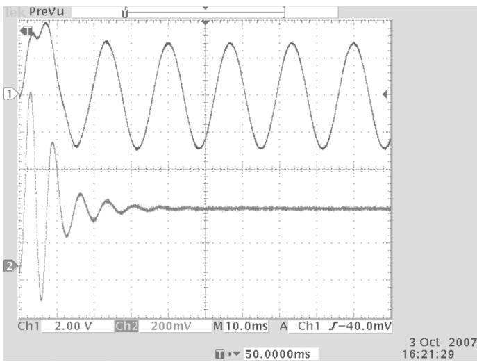  
Fig. 2. Oscilloscope screen capture of phases $\ " { \bf { a } } ^ { , * }$ current and electrical torque.

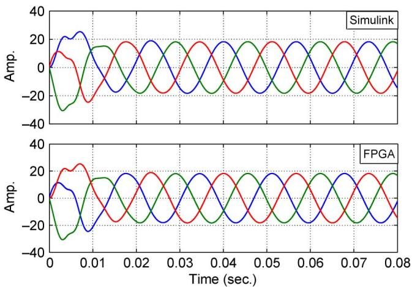  
Fig. 3. Three-phase stator currents calculated by Matlab Simulink and FPGAbased simulator.

uses double precision floating-point representation for numbers whereas the FPGA-based real-time simulator uses fixed-point representation. Thus the coefficients of equations and the signal variables can only take discrete values within a specified range. If desired, the error caused due to this number representation (i.e., the quantization error can be reduced by increasing the number of bits of the registers). However, this requires more resources from the FPGA. A compromise between the size and accuracy can be reached based on the desired accuracy.

Figs. 4 and 5 compare the electrical torque and the rotor speed generated by the real-time simulator and the Simulink. The close agreement between the corresponding results of Figs. 4 and 5 also verifies the accuracy of the results obtained from the realtime simulator.

# B. Case II

In Case II, the PMSM operates as a generator. The machine starts from a stand-still with zero initial conditions. At 40 ms, the machine is subject to a temporary three-phase short circuit at its terminals. The fault duration is 20 ms and cleared at 60 ms. Fig. 6 compares the corresponding waveforms of the three-phase stator currents generated from the Simulink, and

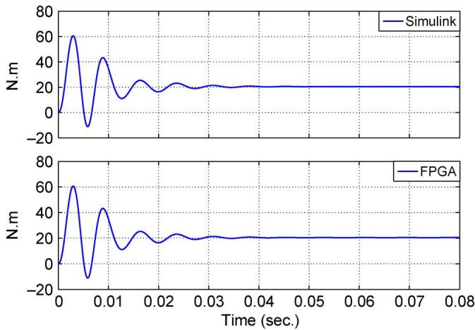  
Fig. 4. Electromagnetic torque calculated by Matlab Simulink and FPGA-based simulator.

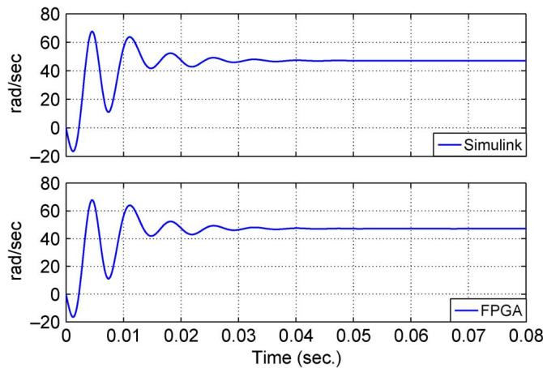  
Fig. 5. Rotor angular speed calculated by Matlab Simulink and the FPGAbased simulator.

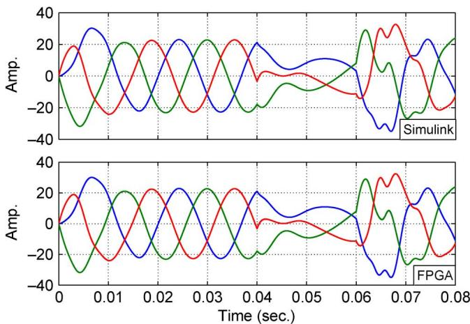  
Fig. 6. Three-phase stator currents calculated by Matlab Simulink and FPGAbased simulator.

the simulation results of the FPGA-based real-time simulator, respectively. Fig. 6 shows a close agreement between the corresponding results. A relative error of less than 0.2%, as calculated by (11), verifies the accuracy of the results obtained from the real-time simulator. Figs. 7 and 8 compare the electrical torque and the rotor speed generated by the real-time simulator and the

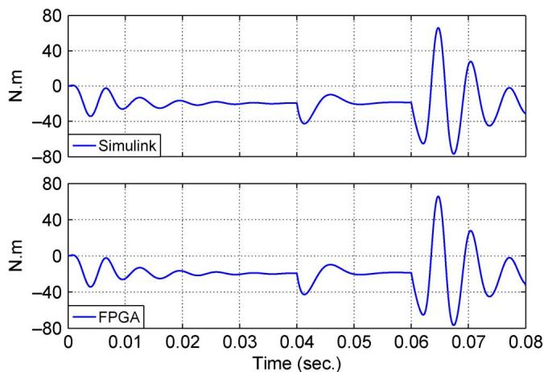  
Fig. 7. Electromagnetic torque calculated by Matlab Simulink and the FPGAbased simulator.

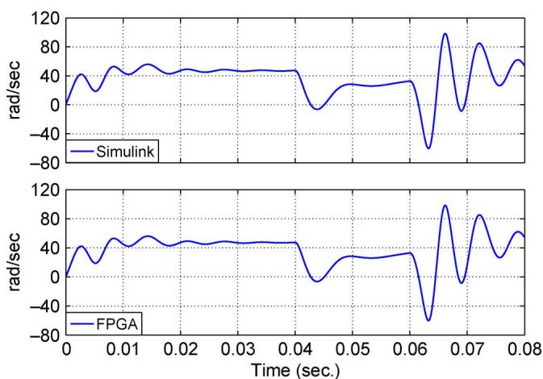  
Fig. 8. Rotor angular speed calculated by Matlab Simulink and FPGA-based simulator.

Simulink. Close agreement between the corresponding results of Figs. 7 and 8 also verify accuracy of the results obtained from the FPGA-based real-time simulator.

# C. Case III

This case corresponds to the motoring of the IM. The machine starts from a stand-still with zero initial conditions. At 40 ms, the machine is subject to a temporary three-phase short circuit at its terminals. The fault duration is 20 ms (i.e., the fault is cleared at $\mathrm { ~ t ~ } = 6 0 ~ \mathrm { m s } )$ . Fig. 9 compares the corresponding waveforms of the three-phase stator currents generated from the Simulink, and the simulation results of the FPGA-based real-time simulator, respectively. Fig. 9 shows a close agreement between the corresponding results. A relative error of less than 0.2%, as calculated by (11), verifies the accuracy of the results obtained from the real-time simulator. Figs. 10 and 11 compare the electrical torque and the rotor speed generated by the real-time simulator and the Simulink. Close agreement between the corresponding results of Figs. 10 and 11 also verifies accuracy of the results obtained from the FPGA-based real-time simulator.

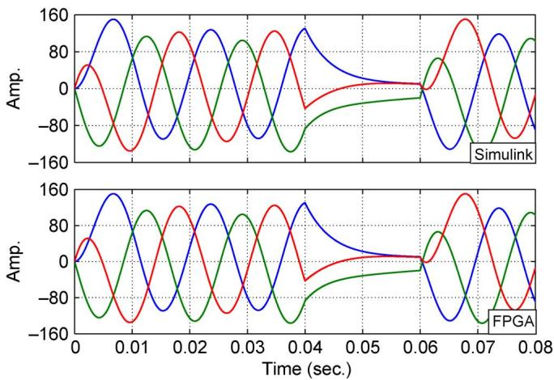  
Fig. 9. Three-phase stator currents calculated by Matlab Simulink and the FPGA-based simulator.

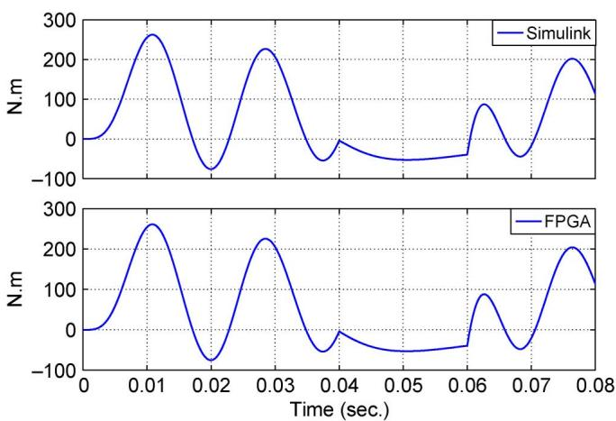  
Fig. 10. Electromagnetic torque calculated by Matlab Simulink and the FPGAbased simulator.

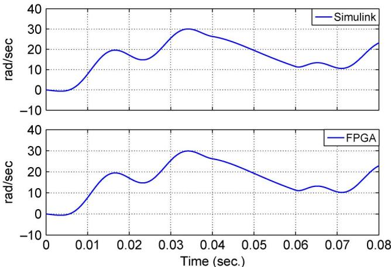  
Fig. 11. Rotor angular speed calculated by Matlab Simulink and the FPGAbased simulator.

# D. Case IV

This case corresponds to the drive system of Fig. 12 which is composed of a diode-clamped three-level VSC and the IM. The dc side of the VSC is connected to two identical dc voltage

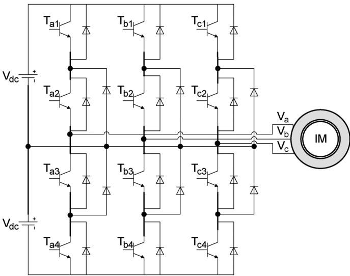  
Fig. 12. Diode-clamped three-level 12-pulse VSC and the induction motor.

sources of 200 V. The VSC utilizes a 2 kHz sinusoidal pulsewidth-modulation (SPWM) scheme.

The drive system (i.e., the VSC and the machine) is simulated with a 500 ns simulation time-step. The real-time simulator also exploits the inherent small simulation time-step capability of the implementation methodology and eliminates the need for corrective algorithms to account for the error due to switching events within each simulation time-step (i.e., the inter-simulation time-step switching [13]). This can be achieved without compromising the accuracy or the numerical stability of the simulation [13]. The VSC is modeled based on the associated discrete circuit (ADC) approach which represents each switch individually [13].

One of the main advantages of the proposed implementation approach is that the computational time per simulation timestep can be retained fairly fixed, irrespective of the size of the simulated system. This is a result of the parallel implementation of the models of different power system apparatus on the FPGA, where each component model has its own hardware to independently perform the corresponding computations. Thus, simulating the VSC converter model along with the machine model, Fig. 12, does not increase the computation time per simulation time-step. The calculation time per simulation timestep is about 44 ns on the Altera Startix III EP3SL150F1152C2 FPGA chip.

Fig. 13 compares the three-phase stator currents calculated by the FPGA-based real-time simulator, and the off-line Simulinkbased simulation when the machine starts from a standstill with zero initial conditions. The close agreement between the corresponding results of Fig. 13 (i.e., the small relative error of less than 0.4% as calculated by (11)) verifies the accuracy of the results obtained from the real-time simulator. This is despite the fact that no corrective algorithms have been used to account for inter-simulation time-step switching events [13].

Figs. 14–16 compare the line-to-line voltage between phases $\mathbf { \ddot { a } } _ { } ^ { , , }$ and $\because 6 ^ { \prime \prime }$ , the electrical torque, and the rotor speed, respectively, generated by the real-time simulator and the

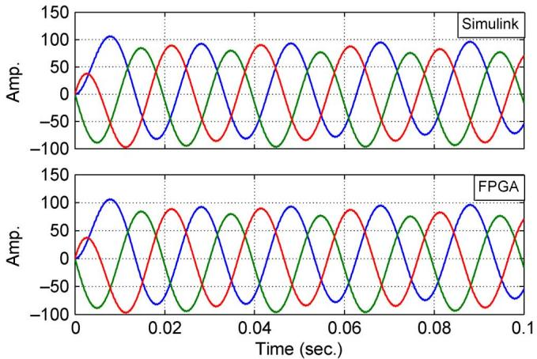  
Fig. 13. Three-phase stator currents calculated by the Matlab Simulink and FPGA-based simulator.

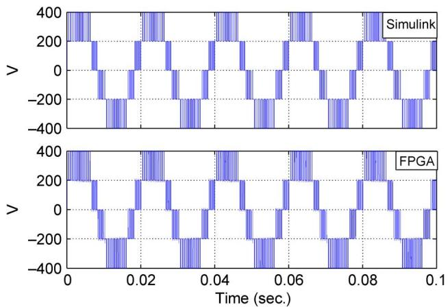  
Fig. 14. Line-to-line voltage between phases $\mathbf { \ddot { a } } ^ { * }$ and $\ " { } \mathbf { b } ^ { \prime \prime }$ of the Matlab Simulink and FPGA-based simulator.

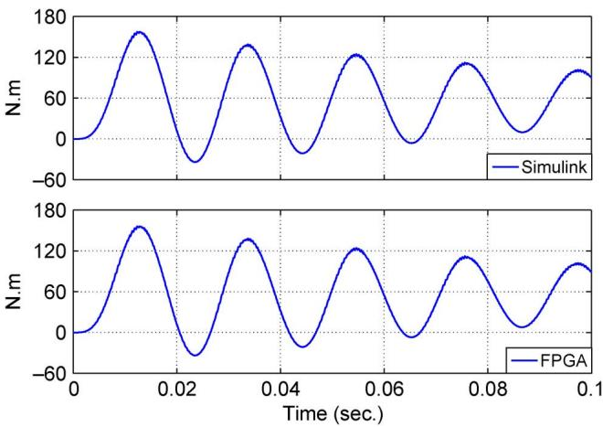  
Fig. 15. Electromagnetic torque calculated by Matlab Simulink and FPGAbased simulator.

Simulink. Close agreement between the corresponding results of Figs. 14–16 also verifies accuracy of the results obtained from the FPGA-based real-time simulator.

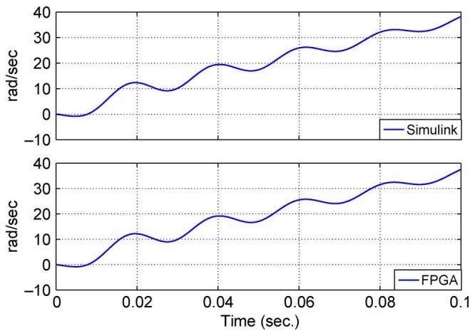  
Fig. 16. Rotor angular speed calculated by Matlab Simulink and FPGA-based simulator.

# VI. CONCLUSION

This paper presents a generalized and novel methodology to implement the mathematical model of the electromechanical system of a three-phase ac machine in a FPGA environment for real-time simulation of electromagnetic transients. The model, with minor variations, can represent: 1) the conventional field-controlled synchronous machine (SM); 2) the permanent magnet synchronous machine (PMSM); 3) the squirrel-cage induction machine (IM); and 4) the doubly-fed asynchronous machine (DFAM). The proposed implementation methodology allows real-time simulation with a simulation time-step in the range of tens to few hundred nanoseconds and allows the simulator to accommodate larger systems without affecting the computational time.

Based on the proposed implementation methodology, a massively parallel, customized hardware architecture tailored to the solution of the mathematical model of ac machines is developed. The hardware architecture is based on three levels of nested parallelism:

1) parallelism at the subsystems level;   
2) parallelism at the equations level;   
3) parallelism at the primitive operations level.

The proposed methodology is used to implement models of a PMSM and an IM in a FPGA environment for real-time simulation. The real-time simulation results are compared with the off-line simulation results in the Matlab Simulink environment. The study results:

• confirm the validity and accuracy of the proposed methodology;   
• show that for the adopted FPGA environment, real-time simulation of the machine model is achieved in 44 ns (simulation time-step is 500 ns);   
• demonstrate that the developed FPGA-based simulator is scalable, that is, the implementation approach enables almost a fixed real-time computation per simulation timestep irrespective of an increase in the system size (Case IV);   
• verify the capability of the method to eliminate the predictive-corrective action for machine variables;   
• verify the capability of the method to decouple the solution of the dq0-based machine equations.

# APPENDIX A

The dq0 transformation [14]

$$
f _ {q d 0} = k f _ {a b c} \tag {12}
$$

where

$$
k = \frac {2}{3} \left[ \begin{array}{c c c} \cos (\theta) & \cos \left(\theta - \frac {2 \pi}{3}\right) & \cos \left(\theta + \frac {2 \pi}{3}\right) \\ \sin (\theta) & \sin \left(\theta - \frac {2 \pi}{3}\right) & \sin \left(\theta + \frac {2 \pi}{3}\right) \\ \frac {1}{2} & \frac {1}{2} & \frac {1}{2} \end{array} \right]. \tag {13}
$$

# APPENDIX B

The mathematical model of the electrical system of a) synchronous Machine [14], [20]

$$
\begin{array}{l} v _ {d q 0} = \left[ \begin{array}{l l l l l l l} v _ {d} & v _ {q} & v _ {0} & v _ {f} ^ {\prime} & v _ {g} ^ {\prime} & v _ {k d} ^ {\prime} & v _ {k q} ^ {\prime} \end{array} \right] ^ {T} (B1) \\ i _ {d q 0} = \left[ \begin{array}{l l l l l l l} i _ {d} & i _ {q} & i _ {0} & i _ {f} ^ {\prime} & i _ {g} ^ {\prime} & i _ {k d} ^ {\prime} & i _ {k q} ^ {\prime} \end{array} \right] ^ {T} (B2) \\ \lambda_ {d q 0} = \left[ \begin{array}{l l l l l l l} \lambda_ {d} & \lambda_ {q} & \lambda_ {0} & \lambda_ {f} ^ {\prime} & \lambda_ {g} ^ {\prime} & \lambda_ {k d} ^ {\prime} & \lambda_ {k q} ^ {\prime} \end{array} \right] ^ {T} (B3) \\ \boldsymbol {u} = \left[ \begin{array}{l l l l l l l} - \omega_ {e} \lambda_ {q} & \omega_ {e} \lambda_ {d} & 0 & 0 & 0 & 0 & 0 \end{array} \right] ^ {T} (B4) \\ \lambda_ {d q 0} = L _ {d q 0} i _ {d q 0} (B5) \\ R = \operatorname {d i a g} \left[ \begin{array}{c c c c c c c c} r & r & r & r _ {f} ^ {\prime} & r _ {g} ^ {\prime} & r _ {k d} ^ {\prime} & r _ {k q} ^ {\prime} \end{array} \right] (B6) \\ L = \left[ \begin{array}{c c c c c c c} L _ {d} & 0 & 0 & L _ {m d} & 0 & L _ {m d} & 0 \\ 0 & L _ {q} & 0 & 0 & L _ {m q} & 0 & L _ {m q} \\ 0 & 0 & L _ {l s} & 0 & 0 & 0 & 0 \\ L _ {m d} & 0 & 0 & L _ {f} ^ {\prime} & 0 & L _ {m d} & 0 \\ 0 & L _ {m q} & 0 & 0 & L _ {g} ^ {\prime} & 0 & L _ {m q} \\ L _ {m d} & 0 & 0 & L _ {m d} & 0 & L _ {k d} ^ {\prime} & 0 \\ 0 & L _ {m q} & 0 & 0 & L _ {m q} & 0 & L _ {k q} ^ {\prime} \end{array} \right]. (B7) \\ \end{array}
$$

b) permanent-magnet synchronous machine [14], [20]

$$
\begin{array}{l} v _ {d q 0} = \left[ \begin{array}{l l l l l} v _ {d} & v _ {q} & v _ {0} & 0 & 0 \end{array} \right] ^ {T} (B8) \\ i _ {d q 0} = \left[ \begin{array}{l l l l l} i _ {d} & i _ {q} & i _ {0} & i _ {k d} ^ {\prime} & i _ {k q} ^ {\prime} \end{array} \right] ^ {T} (B9) \\ \lambda_ {d q 0} = \left[ \begin{array}{l l l l l} \lambda_ {d} & \lambda_ {q} & \lambda_ {0} & \lambda_ {k d} ^ {\prime} & \lambda_ {k q} ^ {\prime} \end{array} \right] ^ {T} (B10) \\ \lambda_ {\text {m a g n e t}} = \left[ \begin{array}{l l l l l} \lambda_ {m} & 0 & 0 & \lambda_ {m} & 0 \end{array} \right] ^ {T} (B11) \\ u = \left[ \begin{array}{c c c c c c c} - \omega_ {e} \lambda_ {q} & \omega_ {e} \lambda_ {d} & 0 & 0 & 0 & 0 & 0 \end{array} \right] ^ {T} \quad (\mathrm {B} 1 2) \\ \lambda_ {d q 0} - \lambda_ {\text {m a g n e t}} = L _ {d q 0} i _ {d q 0} (B13) \\ R = \operatorname {d i a g} \left[ \begin{array}{c c c c c} r & r & r & r _ {k d} ^ {\prime} & r _ {k q} ^ {\prime} \end{array} \right] (B14) \\ L = \left[ \begin{array}{c c c c c} L _ {d} & 0 & 0 & L _ {m d} & 0 \\ 0 & L _ {q} & 0 & 0 & L _ {m q} \\ 0 & 0 & L _ {l s} & 0 & 0 \\ L _ {m d} & 0 & 0 & L _ {k d} ^ {\prime} & 0 \\ 0 & L _ {m q} & 0 & 0 & L _ {k q} ^ {\prime} \end{array} \right]. \mathrm {(B 1 5)} \\ \end{array}
$$

c) induction machine and d) doubly-fed asynchronous machine [14], [20]

$$
v _ {d q 0} = \left[ \begin{array}{l l l l l l} v _ {d s} & v _ {q s} & v _ {0 s} & v _ {d r} ^ {\prime} & v _ {q r} ^ {\prime} & v _ {0 r} ^ {\prime} \end{array} \right] ^ {T} \tag {B16}
$$

$$
i _ {d q 0} = \left[ \begin{array}{l l l l l l} i _ {d s} & i _ {q s} & i _ {0 s} & i _ {d r} ^ {\prime} & i _ {q r} ^ {\prime} & i _ {0 r} ^ {\prime} \end{array} \right] ^ {T} \tag {B17}
$$

$$
\lambda_ {d q 0} = \left[ \begin{array}{l l l l l l} \lambda_ {d s} & \lambda_ {q s} & \lambda_ {0 s} & \lambda_ {d r} ^ {\prime} & \lambda_ {q r} ^ {\prime} & \lambda_ {0 r} ^ {\prime} \end{array} \right] ^ {T} \quad (\mathrm {B} 1 8)
$$

$$
u = \left[ \begin{array}{l l l l l l l} - \omega_ {e} \lambda_ {q} & \omega_ {e} \lambda_ {d} & 0 & 0 & 0 & 0 & 0 \end{array} \right] ^ {T} \quad (\mathrm {B} 1 9)
$$

$$
\lambda_ {d q 0} = L _ {d q 0} i _ {d q 0} \tag {B20}
$$

$$
R = \operatorname {d i a g} \left[ \begin{array}{c c c c c c} r _ {s} & r _ {s} & r _ {s} & r _ {r} ^ {\prime} & r _ {r} ^ {\prime} & r _ {r} ^ {\prime} \end{array} \right] \tag {B21}
$$

$$
L = \left[ \begin{array}{c c c c c c} L _ {l s} + L _ {m} & 0 & 0 & L _ {m} & 0 & 0 \\ 0 & L _ {l s} + L _ {m} & 0 & 0 & L _ {m} & 0 \\ 0 & 0 & L _ {l s} & 0 & 0 & 0 \\ L _ {m} & 0 & 0 & L _ {l r} ^ {\prime} + L _ {m} & 0 & 0 \\ 0 & L _ {m} & 0 & 0 & L _ {l r} ^ {\prime} + L _ {m} & 0 \\ 0 & 0 & 0 & 0 & 0 & L _ {l r} ^ {\prime} \end{array} \right]. \tag {B22}
$$

# APPENDIX C

The model of the mechanical system of an n-mass ac machine [14], [20] is shown in the equations at the bottom of the page.

# REFERENCES

[1] P. Forsyth, T. Maguire, and R. Kuffel, “Real time digital simulation for control and protection system testing,” in Proc. IEEE 35th Annu. Power Electronics Specialists Conf., Aachen, Germany, Jun. 2004, pp. 329–335.   
[2] T. Kim, Y. Yoon, J. Choo, R. Kuffel, and P. Bishop, “Development and testing of a large scale digital power system simulator at KEPCO,” presented at the IPST, Rio de Janeiro , Brazil, Jun. 2001.   
[3] P. G. McLaren, P. Forsyth, A. Perks, and P. R. Bishop, “New simulation tools for power systems,” in Proc. IEEE/Power Eng. Soc. Transmission and Distribution Conf. Expo., Atlanta, GA, Oct. 2001, pp. 91–96.   
[4] B. Lu, X. Wu, H. Figueroa, and A. Monti, “A low-cost real-time hardware-in-the-loop testing approach of power electronics controls,” IEEE Trans. Ind. Electron., vol. 54, no. 2, pp. 919–931, Apr. 2007.   
[5] J. R. Marti and L. R. Linares, “Real-time EMTP-based transients simulation,” IEEE Trans. Power Syst., vol. 9, no. 3, pp. 1309–1317, Aug. 1994.   
[6] G. Sybille and P. Giroux, “Simulation of FACTS controllers using the MATLAB power system blockset and hypersim real-time simulator,” in Proc. IEEE Power Eng. Soc. Winter Meeting, New York, Jan. 2002, pp. 488–491.   
[7] O. Devaux, L. Levacher, and O. Huet, “An advanced and powerful realtime digital transient network analyser,” IEEE Trans. Power Del., vol. 13, no. 2, pp. 421–426, Apr. 1998.   
[8] L. Pak, M. O. Faruque, X. Nie, and V. Dinavahi, “A versatile clusterbased real-time digital simulator for power engineering research,” IEEE Trans. Power Syst., vol. 21, no. 2, pp. 455–465, May 2006.   
[9] J. A. Hollman and J. R. Marti, “Real time network simulation with PC-cluster,” IEEE Trans. Power Syst., vol. 18, no. 2, pp. 563–569, May 2003.   
[10] R. Kuffel, Y. Beum, and J. Lee, “Overview of the development and installation of KEPCO enhanced power system simulator,” presented at the ICDS, Vasteras, Sweden, May 1999.

[11] S. Abourida, J. Belanger, and C. Dufour, “Real-time HIL simulation of a complete PMSM drive at 10  time step,” in Proc. 11th Eur. Conf. Power Electronics and Applications Dresden, Germany, Sep. 11–14, 2005, pp. 1–9.   
[12] J. Mahseredjian, “Computation of power system transients: Overview and challenges,” in Proc. IEEE Power Eng. Soc. Gen. Meeting, 2007, pp. 1–7.   
[13] M. Matar and R. Iravani, “FPGA implementation of the power electronic converter model for real-time simulation of electromagnetic transients,” IEEE Trans. Power Del., vol. 25, no. 2, pp. 852–860, Apr. 2010.   
[14] P. C. Krause, Analysis of Electric Machinery. New York: McGraw-Hill, 1986.   
[15] L. Wang, J. Jatskevich, and H. W. Dommel, “Re-examination of synchronous machine modeling techniques for electromagnetic transient simulations,” IEEE Trans. Power Syst., vol. 22, no. 3, pp. 1221–1230, Aug. 2007.   
[16] J. R. Marti and K. W. Louie, “A phase-domain synchronous generator model including saturation effects,” IEEE Trans. Power Syst., vol. 12, no. 1, pp. 222–229, Feb. 1997.   
[17] P. J. Lagace, M. H. Vuong, and K. Al-Haddad, “A time domain model for transient simulation of synchronous machines using phase coordinates,” in Proc. IEEE Power Eng. Soc.Gen. Meeting, Montreal, QC, Canada, 2006.   
[18] L. Wang and J. Jatskevich, “A voltage-behind-reactance synchronous machine model for the EMTP-type solution,” IEEE Trans. Power Syst., vol. 21, no. 4, pp. 1539–1549, Nov. 2006.   
[19] L. Wang, J. Jatskevich, C. Wang, and P. Li, “A voltage-behind-reactance induction machine model for the EMTP-type solution,” IEEE Trans. Power Syst., vol. 23, no. 3, pp. 1226–1238, Aug. 2008.   
[20] H. W. Dommel, EMTP Theory Book. Vancouver, BC, Canada: Microtran Power System Analysis Corporation, 1996.   
[21] C. Ong, Dynamic Simulations of Electric Machinery: Using MATLAB/ SIMULINK. Upper Saddle River, NJ: Prentice-Hall, 1998.   
[22] A. Dehkordi, A. M. Gole, and T. L. Maguire, “Permanent magnet synchronous machine model for real-time simulation,” presented at the IPST, Montreal, QC, Canada, Jun. 2005.   
[23] “EMTDC User’s Guide,” Manitoba HVDC Research Center, Winnipeg, MB, Canada, 2004.   
[24] A. M. Gole, R. W. Menzies, H. M. Turanli, and D. A. Woodford, “Improved interfacing of electrical machine models to electromagnetic transients programs,” IEEE Trans. Power App. Syst., vol. PAS-103, no. 9, pp. 2446–2451, Sep. 1984.   
[25] L. Wang, J. Jatskevich, V. Dinavahi, H. W. Dommel, J. A. Martinez, K. Strunz, M. Rioual, G. W. Chang, and R. Iravani, “Methods of interfacing rotating machine models in transient simulation programs,” IEEE Trans. Power Del., vol. 25, no. 2, pp. 891–903, Apr. 2010.   
[26] J. Mahseredjian, L. Dube, M. Zou, S. Dennetiere, and G. Joos, “Simultaneous solution of control system equations in EMTP,” IEEE Trans. Power Syst., vol. 21, no. 1, pp. 117–124, Feb. 2006.   
[27] C. W. Gear, Numerical Initial Value Problems in Ordinary Differential. Upper Saddle River, NJ: Prentice-Hall, 1971.   
[28] J. R. Marti and J. Lin, “Suppression of numerical oscillations in the EMTP,” IEEE Trans. Power Syst., vol. 9, no. 1, pp. 71–72, Feb. 1989.

$$
\theta = \left[ \begin{array}{l l l l l} \theta_ {1} & \theta_ {2} & \dots & \theta_ {G} & \dots & \theta_ {n} \end{array} \right] ^ {T} \tag {C1}
$$

$$
T _ {m} = \left[ T _ {m 1} T _ {m 2} \dots 0 \dots \right] ^ {T} \tag {C2}
$$

$$
T _ {e} = \left[ 0 0 . . T _ {G} . . \right] ^ {T} \tag {C3}
$$

$$
J = \operatorname {d i a g} \left[ \begin{array}{l l l l} J _ {1} & J _ {2} & \dots & J _ {n} \end{array} \right] \tag {C4}
$$

$$
K = \left[ \begin{array}{c c c c c} K _ {1 2} & - K _ {1 2} & & & \\ - K _ {1 2} & K _ {1 2} + K _ {2 3} & - K _ {2 3} & & \\ & - K _ {2 3} & K _ {2 3} + K _ {3 4} & - K _ {3 4} & \\ & & \cdot & \cdot & \cdot \\ & & & - K _ {n - 1, n} & K _ {n - 1, n} \end{array} \right] \tag {C5}
$$

$$
D = \left[ \begin{array}{c c c c} D _ {1} + D _ {1 2} & - D _ {1 2} & & \\ - D _ {1 2} & D _ {2} + D _ {1 2} + D _ {2 3} & - D _ {2 3} & \\ & \cdot & \cdot & \\ & & - D _ {n - 1, n} & D _ {n} + D _ {n - 1, n} \end{array} \right] \tag {C6}
$$

Mahmoud Matar (S’00) received the B.Sc. and M.Sc. degrees in electrical engineering from Ain Shams University, Cairo, Egypt, in 2001 and 2004, respectively, and the Ph.D. degree in electrical engineering from the University of Toronto, Toronto, ON, Canada, in 2009.

Currently, he is a Postdoctoral Fellow in the Department of Electrical and Computer Engineering, University of Toronto. His research interests include modelling and real-time simulation of power systems and power electronics.

Reza Iravani (M’85–SM’00–F’03) received the B.Sc. degree from Tehran Polytechnic University, Tehran, Iran, in 1976, and the M.Sc. and Ph.D. degrees in electrical engineering from the University of Manitoba, Winnipeg, MB, Canada, in 1981 and 1985, respectively.

Currently, he is a Professor at the University of Toronto, Toronto, ON, Canada. His research interests include power electronics and power system dynamics and control.