# 混合型 MMC 全状态高效电磁暂态仿真方法研究

连攀杰，刘文焯，杨泽栋，汤涌，郁舒雁，李霞，许克

(电网安全与节能国家重点实验室(中国电力科学研究院有限公司)，北京市 海淀区 100192)

# Research on Hybrid MMC Full-state Efficient Electromagnetic Transient Simulation Method

LIAN Panjie, LIU Wenzhuo, YANG Zedong, TANG Yong, YU Shuyan, LI Xia, XU Ke

(State Key Laboratory of Power Grid Safety and Energy Conservation (China Electric Power Research Institute),

Haidian District, Beijing 100192, China)

ABSTRACT: The hybrid modular multilevel converter (MMC), which composed of half-bridge sub-modules and full-bridge sub-modules, takes into account the DC fault ride-through capability and economy, with broad engineering application prospects. For the problems of complex equivalent, multiple internal nodes and low computational efficiency in the electromagnetic transient simulation model of the hybrid MMC, this paper analyzed the working state of the hybrid MMC in the unlocked and locked modes, and proposed a “efficient electromagnetic transient simulation method for hybrid MMC full-state”. According to the blocked characteristics of the half-bridge sub-modules and the full-bridge sub-modules in the hybrid MMC, the equivalent simulation method was optimized to improve the simulation efficiency in the blocked mode. According to the modulation characteristics of the hybrid MMC in unlocked mode, a flexible capacitor voltage sorting algorithm was proposed to improve the simulation efficiency for unlocked mode. Finally, with typical testing examples in Matlab and PSCAD, the accuracy and rapidity of the hybrid MMC high-efficiency electromagnetic transient simulation method proposed in this paper were verified.

KEY WORDS: hybrid modular multilevel converter (MMC); electromagnetic transients; full-state; locked equivalent; flexible heap sorting algorithm

摘要：由半桥子模块和全桥子模块组成的混合型模块化多电平换流器(modular multilevel converter，MMC)兼顾直流故障穿越能力和经济性，具有广阔的工程运用前景。针对混合型MMC 电磁暂态模型存在等效复杂、内部节点多、计算效率低的问题，文章分析混合型 MMC解闭锁模式的工作状态，提出一种“混合型MMC 全状态高效电磁暂态仿真方法”：根据混合型 MMC中半桥子模块和全桥子模块的闭锁特性，

提出一种混合型 MMC的闭锁等效方法，提高混合型 MMC闭锁模式的仿真效率；根据混合型 MMC的调制特性，改进灵活堆排序的电容电压排序算法，提高混合型 MMC解锁模式的仿真效率。最后，结合 Matlab 和 PSCAD 典型算例进行测试，验证所提高效混合型 MMC全状态电磁暂态仿真方法的精确性和快速性。

关键词：混合型模块化多电平换流器；电磁暂态；全状态； 闭锁等效；灵活堆排序算法

# 0 引言

模 块 化 多 电 平 换 流 器 (modular multilevelconverter，MMC)以其谐波含量少、故障处理能力强、开关频率低、扩展性能好、便于模块化设计等优势，迅速得到了国内外高度关注[1-3]。目前 MMC逐渐从低电压、小容量示范工程向高电压、大容量方向快速发展，在异步联网、风电场并网、城市中心供电、常规直流混联等场合展现出独特的技术优势和经济效益，成为柔性直流输电系统的优选主流拓扑[4]。

MMC 子模块存在半桥、全桥和双箝位等多种拓扑形式。双箝位及其它改进子模块拓扑仍处理论实验研究，国内尚无工程应用。半桥子模块成本低，损耗小，应用最广泛，但不具备直流故障穿越能力。全桥子模块具备直流故障穿越能力，但造价高，运行损耗大。由半桥子模块和全桥子模块组成的混合型 MMC 兼顾直流故障穿越能力和经济性，运用前景广阔[5-9]。

随着混合型MMC柔性直流输电系统的不断规划和投运，研究混合型 MMC 电磁暂态仿真方法，建立适用于大电网全电磁暂态仿真的混合型 MMC电磁暂态模型，对柔性直流系统调试，大规模交直

流电网故障分析、稳定性分析和控制保护策略设计与验证等工程前期设计意义重大。

针对混合型MMC详细模型电磁暂态仿真效率低下，不适用于大型电力系统全电磁暂态仿真的问题。文献[10]基于嵌套快速同时求解算法提出了戴维南等效模型，与平均值模型[11]、详细模型[12]和受控源模型[13]相比，戴维南等效模型兼顾高精度和高效率，在大规模电力系统仿真中具有得天独厚的优势。文献[14-15]优化等效方式，文献[16-17]优化排序算法，对经典戴维南模型进一步提速。文献[18]基于多频段动态相量法，建立了 MMC 多频段动态相量频段间解耦模型。文献[19]基于旋转坐标系变换的大步长建模仿真理论，建立了 MMC 大步长仿真模型。文献[20]将半桥 MMC 仿真方法运用于全桥 MMC 和混合型 MMC 的电磁暂态仿真，建立混合型 MMC 戴维南模型，实现了混合型 MMC 解锁模式下高精度仿真。

但在电磁暂态仿真中，诸多情况都会涉及闭锁模式。针对混合型 MMC 闭锁模式下工作状态灵活复杂，且面临插值问题。如何正确模拟混合型 MMC闭锁模式，从而实现高精度、高效率仿真混合型MMC 解闭锁模式，是混合型 MMC 全状态电磁暂态 仿 真 的 难 点 。 目 前 许 多 文 献 [21-23] 借 助PSCAD/EMTDC 自带的二极管模型，通过控制开关的闭合模拟 MMC 闭锁模式。但此方法中单桥臂混合型 MMC 需用 6 个二极管等效，增加了内部节点个数。部分混合型 MMC 等效模型在解锁模式下二极管仍根据动作准则进行不必要的插值计算[21]，在闭锁模式下仍在进行电容电压排序[22]，均影响了混合型 MMC 的计算效率。

针对混合型MMC全状态电磁暂态仿真模型存在等效复杂、内部节点数量多、计算效率低、依赖PSCAD 等问题，文章分析混合型 MMC 解闭锁模式存在的多种工作状态，提出了一种混合型 MMC全状态高效电磁暂态仿真方法。针对混合型 MMC中半桥子模块和全桥子模块的闭锁特性，提出一种混合型 MMC 的闭锁等效方法，实现混合型 MMC闭锁模式下的高精度、高效率仿真。根据混合型MMC 解锁模式的调制原理，改进灵活堆排序的电容电压排序算法，提高混合型 MMC 解锁模式的仿真效率。最后结合 Matlab 和 PSCAD 典型算例进行测试，验证本文所提混合型 MMC 全状态高效电磁暂态仿真方法的精确性和快速性。

# 1 混合型MMC 工作状态分析

# 1.1 混合型 MMC 拓扑结构

三相混合型 MMC 的拓扑结构如图 1 所示，各桥臂由 N 个子模块组成，其中半桥子模块的数量为$N _ { \mathrm { h } }$ ，全桥子模块的数量为 $N _ { \mathrm { f } \circ }$ 。一定数量的全桥子模块不仅使 MMC 具备了直流故障箝位能力，且能够输出负电平，提高了 MMC 的运行灵活性。

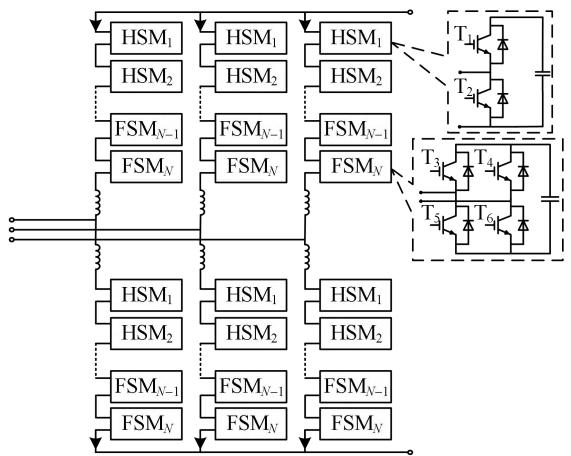  
图 1 三相混合型 MMC的拓扑结构  
Fig. 1 Topological structure of three-phase hybrid MMC

混合型MMC存在解锁和闭锁两种不同的工作模式，每种模式均包括多种工作状态。

# 1.2 闭锁工作状态分析

闭锁模式下，混合型 MMC 子模块中的 IGBT全部关断，由二极管确定子模块工作状态。二极管具有一定阈值的正向电压则导通，具有反向电压则关断。根据二极管通断状态的不同，闭锁模式下子模块具有多种工作状态。半桥子模块对应的工作状态如图 2(a)所示，全桥子模块对应的工作状态如

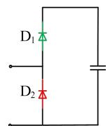  
正向充电

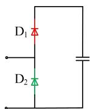  
反向旁路

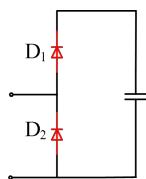  
截止

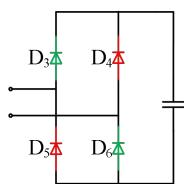  
(a）半桥子模块闭锁工作状态  
正向充电

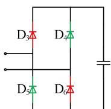  
反向旁路

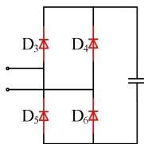  
截止  
(b）全桥子模块闭锁工作状态  
图 2 子模块闭锁模式下工作状态  
Fig. 2 Working status in sub-module blocking mode

图 2(b)所示。

图 2中红色表示二极管处于关断状态，绿色表示二极管处于导通状态。半桥子模块具有正向充电、反向旁路和截止 3 种状态，全桥子模块具有正向充电、反向充电和截止 3 种状态。混合型 MMC子模块串联组成各桥臂，闭锁模式下同桥臂的子模块电流相同，因此同桥臂同类型子模块具有相同的工作状态[21-23]。

# 1.3 解锁工作状态分析

解锁模式下，混合型 MMC 的调制环节生成IGBT 控制信号，部分 IGBT 导通。通过控制子模块的投退，维持混合型MMC子模块电容电压均衡，并使交流侧输出的电压波形接近正弦波。

半桥子模块、全桥子模块解锁模式下的工作状态如表 1、2 所示，“1”表示导通信号，“0”表示关断信号。解锁模式下半桥子模块具有投入、退出两种工作状态，全桥子模块具有正投入、负投入、退出模式 1 和退出模式 2 共 4 种工作状态。

表1 半桥子模块解锁模式工作状态  
Table 1 The simulation time of MMC test system   
表2 全桥子模块解锁模式工作状态  

<table><tr><td>状态</td><td>T1</td><td>T2</td></tr><tr><td>投入</td><td>1</td><td>0</td></tr><tr><td>退出</td><td>0</td><td>1</td></tr></table>

Table 2 The simulation time of MMC test system   

<table><tr><td>状态</td><td>T3</td><td>T4</td><td>T5</td><td>T6</td></tr><tr><td>正投入</td><td>1</td><td>0</td><td>0</td><td>1</td></tr><tr><td>负投入</td><td>0</td><td>1</td><td>1</td><td>0</td></tr><tr><td>退出模式1</td><td>1</td><td>1</td><td>0</td><td>0</td></tr><tr><td>退出模式2</td><td>0</td><td>0</td><td>1</td><td>1</td></tr></table>

# 2 混合型 MMC 全状态高效电磁暂态仿真方法

# 2.1 混合型 MMC 全状态等效模型

半桥子模块和全桥子模块包含多种工作状态，由其组成的混合型 MMC 工作状态更加复杂多样。本文提出一种“混合型 MMC 全状态高效电磁暂态仿真方法”，在不添加模型内部节点的前提下，实现混合型 MMC 全状态高精度电磁暂态仿真，并对模型进行优化等效，提高混合型 MMC 电磁暂态仿真的计算效率。

图 3为混合型 MMC 全状态等效模型，将单个桥臂的半桥子模块、全桥子模块和桥臂电感分别等效为戴维南支路，再将整个桥臂等效为戴维南支

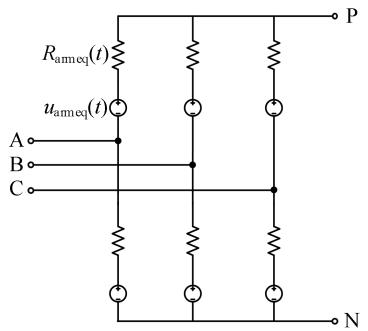  
图 3 混合型 MMC全状态等效模型  
Fig. 3 Hybrid MMC full state equivalent model

路。式(1)、(2)为等效公式。

$$
u _ {\text {a r m e q}} (t) = u _ {\text {a l l s m e q}} ^ {\mathrm {H B}} (t) + u _ {\text {a l l s m e q}} ^ {\mathrm {F B}} (t) + u _ {\mathrm {L}} (t) \tag {1}
$$

$$
R _ {\text {a r m e q}} (t) = R _ {\text {a l l} \text {s m e q}} ^ {\mathrm {H B}} (t) + R _ {\text {a l l} \text {s m e q}} ^ {\mathrm {F B}} (t) + R _ {\mathrm {L}} (t) \tag {2}
$$

式中： $R _ { \mathrm { a r m e q } } ( t )$ 为桥臂戴维南等效电阻； $u _ { \mathrm { a r m e q } } ( t )$ 为桥臂戴维南等效电压；uL(t)、RL(t)分别为桥臂电感经过积分算法离散后得到的等效电压和等效电阻值[15]；HBall_smequ (t ) $u _ { \mathrm { a l l \_ s m e q } } ^ { \mathrm { H B } } ( t )$ 、 $R _ { \mathrm { a l l \_ s m e q } } ^ { \mathrm { H B } } ( t )$ 分别为单桥臂所有半桥子模块的等效电压和等效电阻值； FBall_smequ ( $u _ { \mathrm { a l l \_ s m e q } } ^ { \mathrm { F B } } ( t ) \cdot \ R _ { \mathrm { a l l \_ s m e q } } ^ { \mathrm { F B } } ( t )$ FB分别为单桥臂所有全桥子模块的等效电压和等效电阻值。

根据混合型 MMC 解闭锁模式不同，桥臂半桥子模块、全桥子模块的戴维南支路分别采用不同的等效方法。

# 2.2 闭锁等效方法

闭锁模式下 IGBT 全部关断，子模块工作状态与二极管通断状态相关。目前电磁暂态仿真软件大多采用定步长仿真方法，若不考虑二极管的插值作用，工作状态只能在仿真步长的时间点改变并进行后续计算，将产生大量的畸变点，严重影响混合型MMC 电磁暂态仿真的精确性[22]。

文献[21-23]借助 PSCAD 自带的插值算法计算工作状态变化的准确时间，将每个二极管的动作准则加入到轮询列表，根据动作准则和二极管上一时刻的状态，判别是否进行插值。但上述等效仿真效率低，且依赖 PSCAD 平台。文章基于半桥子模块和全桥子模块不同的闭锁特性，提出一种混合型MMC 闭锁等效方法，实现混合型 MMC 闭锁高效仿真。

# 2.2.1 桥臂半桥子模块闭锁仿真方法

桥臂半桥子模块闭锁工作状态与子模块内两个二极管的状态密切相关，文章利用两个虚拟二极管模型对同一桥臂的半桥子模块进行插值，与传统

模型不同，虚拟二极管模型只在闭锁模式下投入，解锁模式下不进行插值计算。

如图 4 所示，虚拟二极管的拓扑结构与二极管详细电磁暂态详细模型基本一致。二极管支路由可变电阻和直流电压源 $V _ { \mathrm { f } }$ 串联，阻尼支路由阻尼电容$C _ { \mathrm { { S } } }$ 和阻尼电阻 $R _ { \mathrm { { S } } }$ 串联。可变电阻值包括通态电阻$R _ { \mathrm { O N } } ^ { \mathrm { D I O } }$ 和截止电阻 $R _ { \mathrm { { o F F } } } ^ { \mathrm { { D I O } } }$ 两种取值方式，设置方法如式(3)、(4)所示，二极管模型两端电压为正则取$R _ { \mathrm { O N } } ^ { \mathrm { D I O } }$ ，两端电流为负则取 $R _ { \mathrm { { o F F } } } ^ { \mathrm { { D I O } } }$ 。 。 DIOR $R _ { \mathrm { e q } } ^ { \mathrm { D I O } }$ 、 、 $V _ { \mathrm { e q } } ^ { \mathrm { D I O } }$ 分别表示虚拟二极管模型的戴维南等效电阻和等效电压。闭锁模式下，不进行子模块电容电压排序，直接根据式(5)、(6)确定桥臂全部半桥子模块电容的戴维南等效模型。

$$
R _ {\mathrm {O N}} ^ {\mathrm {D I O}} = N _ {\mathrm {h}} R _ {\mathrm {O N}} \tag {3}
$$

$$
R _ {\mathrm {O F F}} ^ {\mathrm {D I O}} = N _ {\mathrm {h}} R _ {\mathrm {O F F}} \tag {4}
$$

$$
R _ {\text {a l l} _ {\mathrm {C}}} ^ {\mathrm {H B}} (t) = N _ {\mathrm {h}} R _ {\mathrm {C}} \tag {5}
$$

$$
u _ {\text {a l l} \_ C} ^ {\mathrm {H B}} (t) = \sum_ {i = 1} ^ {N _ {\mathrm {h}}} u _ {\mathrm {C}} ^ {i} (t) \tag {6}
$$

式中： $R _ { \mathrm { O N } }$ 为导通电阻； $R _ { \mathrm { O F F } }$ 为关断电阻； $R _ { \mathrm { C } } , \ u _ { \mathrm { C } } ^ { i } ( t )$ 分别为子模块电容等效电阻和等效电压； $R _ { \mathrm { a l l \_ c } } ^ { \mathrm { H B } } ( t )$ 、$u _ { \mathrm { a l l \_ C } } ^ { \mathrm { H B } } ( t )$ HB 为所有子模块电容串联的戴维南等效电阻和等效电压。

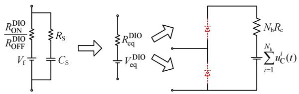  
图4 桥臂半桥子模块闭锁等效模型  
Fig. 4 Equivalent model of bridge arm half-bridge sub-module in blocking mode

确定虚拟二极管模型通断状态变化的准确时间，改变虚拟二极管模型的电阻值，是精确模拟半桥子模块闭锁模式的关键，文章采用的桥臂半桥子模块闭锁仿真流程如图 5 所示：

1）初始化虚拟二极管参数。  
2）基于本步的仿真步长和积分算法，求解虚拟二极管模型的戴维南支路。  
3）将桥臂内所有半桥子模块电容串联，等效为戴维南支路。  
4）确定混合型 MMC 的导纳阵和右端项。  
5）将混合型MMC归入全网进行求解，由MMC各节点电压求解虚拟二极管模型端口电压电流。

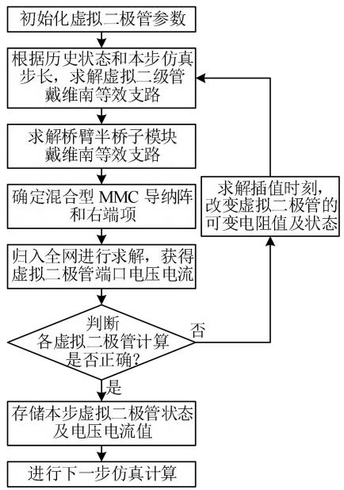  
图 5 桥臂半桥子模块闭锁仿真流程图  
Fig. 5 Simulation flowchart of the locking state of the half bridge sub-module of the bridge arm

6）判断各虚拟二极管模型本步计算是否正确。

情形 1：若上步虚拟二极管模型为截止状态且本步虚拟二极管模型两端电压小于 0，则计算正确，二极管仍为截止状态。

情形 2：若上步虚拟二极管模型为截止状态且本步虚拟二极管模型两端电压大于 0，则计算错误，则二极管应该导通。如图6(a)所示，根据历史电压和本步电压进行插值，寻找电压过零时刻，在过零时刻修改可变电阻值为 $R _ { \mathrm { O N } } ^ { \mathrm { D I O } }$ ，重新执行步骤2），基于多步变步长后退欧拉法再次求解整个网络的电压电流。

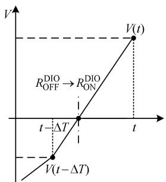  
(a）插值计算导通时刻

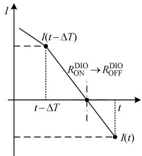  
(b）插值计算关断时刻   
图 6 虚拟二极管模型插值原理图  
Fig. 6 Schematic diagram of virtual diode model interpolation

情形 3：若上步虚拟二极管模型为导通状态且本步虚拟二极管电流大于 0，则计算正确，二极管仍为导通状态。

情形4：若上步虚拟二极管模型为导通状态且本步虚拟二极管电流小于 0。则计算错误，二极管应该截止。需根据历史电流和本步电流进行插值，如

图 5(b)所示，寻找电流过零时刻，在过零时刻修改可变电阻值为 $R _ { \mathrm { O F F } } ^ { \mathrm { D I O } }$ ，重新执行步骤2），基于多步变步长后退欧拉法再次求解整个网络的电压电流。

7）混合型 MMC 所有虚拟二极管模型全部计算正确后，完成本步计算，并存储本步虚拟二极管状态、电压和电流值。

8）进行下一步仿真计算。

通过合理设置虚拟二极管的参数，精确等效半桥子模块闭锁模式下的工作状态，通过求解虚拟二极管模型开断状态变化的准确时间，精确模拟半桥子模块闭锁工作状态切换，实现混合型 MMC 桥臂半桥子模块的高精度闭锁仿真。

# 2.2.2 桥臂全桥子模块闭锁仿真方法

混合型MMC桥臂全桥子模块闭锁模式包括正投入、负投入和截止 3 种工作状态。表 3 为全桥子模块闭锁工作状态及戴维南等效形式。

表 3 全桥子模块闭锁模式工作状态及等效形式  
Table 3 The simulation time of MMC test system   

<table><tr><td>状态</td><td>电压关系</td><td>D3</td><td>D4</td><td>D5</td><td>D6</td><td>等效电阻</td><td>等效电压</td></tr><tr><td>正投入</td><td>uim(t)&gt;uicq(t)</td><td>1</td><td>0</td><td>0</td><td>1</td><td>RFBON</td><td>ufB(t)</td></tr><tr><td>负投入</td><td>uim(t)&lt;uicq(t)</td><td>0</td><td>1</td><td>1</td><td>0</td><td>RFBON</td><td>-ufB(t)</td></tr><tr><td>正向阻断</td><td>0≤uim(t)≤uicq(t)</td><td>0</td><td>0</td><td>0</td><td>0</td><td>RFBOFF</td><td>0</td></tr><tr><td>反向阻断</td><td>-uicq(t)≤uim(t) &lt; 0</td><td>0</td><td>0</td><td>0</td><td>0</td><td>RFBOFF</td><td>0</td></tr></table>

表中：

$$
R _ {\mathrm {O N}} ^ {\mathrm {F B}} = \frac {\left(R _ {\mathrm {O N}} + R _ {\mathrm {O F F}}\right) R _ {\mathrm {C}} + 2 R _ {\mathrm {O N}} R _ {\mathrm {O F F}}}{2 R _ {\mathrm {C}} + \left(R _ {\mathrm {O N}} + R _ {\mathrm {O F F}}\right)} \tag {7}
$$

$$
R _ {\mathrm {O F F}} ^ {\mathrm {F B}} = R _ {\mathrm {O F F}} \tag {8}
$$

$$
u _ {\mathrm {F B}} ^ {i} (t) = \frac {R _ {\mathrm {O F F}}}{R _ {\mathrm {O N}} + R _ {\mathrm {C}} + R _ {\mathrm {O F F}}} u _ {\mathrm {c e q}} ^ {i} (t) \tag {9}
$$

全桥子模块闭锁模式的工作状态与子模块外界电压 $u _ { \mathrm { s m } } ^ { i } ( t )$ 和电容等效电压 $u _ { \mathrm { c e q } } ^ { i } ( t )$ 密切相关：当$u _ { \mathrm { s m } } ^ { i } ( t ) > u _ { \mathrm { c e q } } ^ { i } ( t )$ ，子模块处于正投入状态，D 、 $\mathrm { D } _ { 6 }$ 导通，D4、D5截止；当 $u _ { \mathrm { s m } } ^ { i } ( t ) < - u _ { \mathrm { c e q } } ^ { i } ( t )$ ，子模块处于负投入状态， $\mathrm { D } _ { 4 } , \mathrm { D } _ { 5 }$ 导通， $\mathrm { D } _ { 3 } , \mathrm { D } _ { 6 }$ 截止；当 $- u _ { \mathrm { c e q } } ^ { i } ( t ) \leq$ $u _ { \mathrm { s m } } ^ { i } ( t ) \leq u _ { \mathrm { c e q } } ^ { i } ( t )$ ，子模块处于截止状态，所有二极管全部截止。

对比全桥子模块闭锁模式中不同工作状态的戴维南模型。等效电阻包括 $R _ { \mathrm { O N } } ^ { \mathrm { F B } }$ 和 $R _ { \mathrm { O F F } } ^ { \mathrm { F B } }$ 两种形式，等效电压包括 ui (t)、-ui (t)和 0共 3 种形式。全桥子模块正投入状态和负投入状态下具有相同的等效电阻 $R _ { \mathrm { O N } } ^ { \mathrm { F B } }$ ，等效电压的绝对值相同，仅存正负号差别。

采用基于虚拟二极管模型的等效方法亦可实现 桥臂全桥子模块闭锁高效仿真，然而全桥子模块虚

拟二极管模型的数量更多，基于虚拟二极管模型的等效方式仍非最优。文章充分利用全桥子模块闭锁的特性，直接模拟全桥子模块的闭锁工作状态，并设计电压充电函数，插值求解全桥子模块状态的变化时间，改变全桥子模块的闭锁工作状态。

由于同一桥臂全桥子模块的电流一致，因此同一桥臂内的全桥子模块具有相同的闭锁工作状态。将所有全桥子模块电容串联，获得图 7 所示的桥臂全桥子模块闭锁等效模型。其中，开关 $\mathrm { S } _ { 1 }$ 闭合至 a代表截止状态；开关 $\mathrm { S } _ { 1 }$ 闭合至 b，开关 $\mathrm { S } _ { 2 }$ 闭合至 c代表正投入状态；开关 $\mathrm { S } _ { 1 }$ 闭合至 b，开关 $\mathbf { S } _ { 2 }$ 闭合至d 代表负投入状态。图中 $u _ { \mathrm { F B s m } } ( t )$ 为桥臂所有全桥子模块的外界电压。

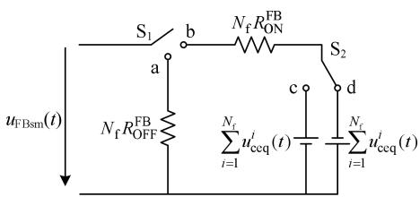  
图7 桥臂全桥子模块闭锁等效模型  
Fig. 7 Equivalent model of full bridge sub-module bridge arm locking

上述等效模型能够准确模拟桥臂全桥子模块的闭锁工作状态。为准确模拟全桥子模块的闭锁工作状态切换，设计如图 8 所示的插值算法：

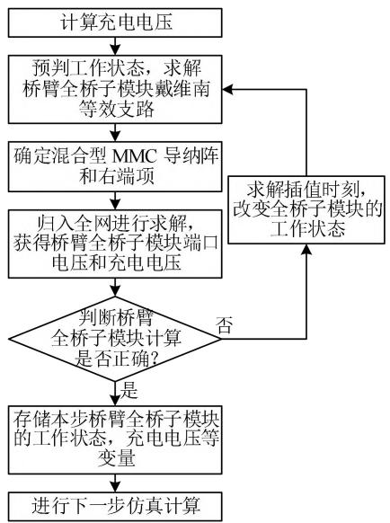  
图 8 桥臂全桥子模块闭锁仿真流程图  
Fig. 8 Simulation flowchart of the locking state of the full bridge sub-module of the bridge arm

1）根据式(10)获得充电电压 $u _ { \mathrm { c h a r g e } } ( t )$ 。

$$
u _ {\text {c h a r g e}} (t) = u _ {\mathrm {F B s m}} ^ {2} (t) - \left(\sum_ {i = 1} ^ {N _ {\mathrm {f}}} u _ {\mathrm {c e q}} ^ {i} (t)\right) ^ {2} \tag {10}
$$

2）采用历史状态预判本步全桥子模块的工作状态，确定桥臂全桥子模块的戴维南支路。  
3）确定混合型 MMC 的导纳阵和右端项。  
4）将混合型 MMC 归入全网进行求解，根据MMC 各节点电压求解桥臂全桥子模块端口电压$u _ { \mathrm { F B s m } } ( t )$ 和充电电压 $u _ { \mathrm { c h a r g e } } ( t )$ 。  
5）判断各桥臂全桥子模块本步计算是否正确。

若预判全桥子模块工作状态为正投入，则存在以下几种情形：

$\textcircled { 1 } u _ { \mathrm { c h a r g e } } ( t ) > 0$ 且 $u _ { \mathrm { F B s m } } ( t ) > 0$ ，则预判正确。  
② $u _ { \mathrm { c h a r g e } } ( t ) > 0$ 且 $u _ { \mathrm { F B s m } } ( t ) \leq 0$ ，则预判错误，插值寻找 $u _ { \mathrm { F B s m } } ( t )$ 过零点 t-，在 t-时刻再次进行计算，确定全桥子模块截止时刻。  
③ $u _ { \mathrm { c h a r g e } } ( t ) \leq 0$ ，则预判错误，该桥臂全桥子模块工作状态应为截止，由于 $u _ { \mathrm { c h a r g e } } ( t - \Delta T ) > 0$ ，如图 $9 ( \mathrm { a } )$ 所示，插值寻找 $u _ { \mathrm { c h a r g e } } ( t )$ 过零点 $t _ { + } ,$ ，在 $t _ { + }$ 时刻修改全桥子模块工作状态为截止，基于多步变步长后退欧拉法重新进行计算。

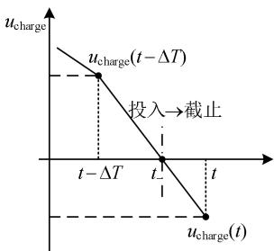  
(a)插值计算截止时刻

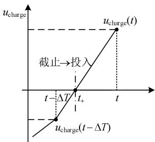  
(b）插值计算投入时刻   
图 9 全桥子模块插值原理图  
Fig. 9 Schematic diagram of full-bridge sub-module interpolation

若预判全桥子模块工作状态为负投入，则存在以下几种情形：

$\textcircled { 1 } u _ { \mathrm { c h a r g e } } ( t ) > 0$ 且 $u _ { \mathrm { F B s m } } ( t ) \leq 0$ ，则预判正确。  
$\textcircled { 2 } u _ { \mathrm { c h a r g e } } ( t ) > 0$ 且 $u _ { \mathrm { F B s m } } ( t ) > 0$ ，则预判错误，插值寻找 $u _ { \mathrm { F B s m } } ( t )$ 过零点 t-，在 t-时刻再次进行计算，确定全桥子模块截止时刻。  
③ $u _ { \mathrm { c h a r g e } } ( t ) \leq 0$ ，则预判错误，该桥臂全桥子模块工作状态应为截止，由于 $u _ { \mathrm { c h a r g e } } ( t - \Delta T ) > 0$ ，同样如图8(a)所示，插值寻找 $u _ { \mathrm { c h a r g e } } ( t ) \dot { \cdot }$ 过零点t-，在t- 时刻修改全桥子模块工作状态为截止，基于多步变步长后退欧拉法重新进行计算。

若预判全桥子模块工作状态为截止，则存在以下几种情形：

$\textcircled { 1 } u _ { \mathrm { c h a r g e } } ( t ) \leq 0$ ，则预判正确。

$\textcircled { 2 } u _ { \mathrm { c h a r g e } } ( t ) > 0$ 且 $u _ { \mathrm { F B s m } } ( t ) > 0$ ，则预判错误，采用图 8(b)所示的方式，插值寻找 $u _ { \mathrm { c h a r g e } } ( t )$ 过零点 $t _ { + }$ ，在$t _ { + }$ 时刻修改全桥子模块工作状态为正投入，基于多步变步长后退欧拉法重新进行计算。  
③ $\mathrm { 3 ) } u _ { \mathrm { c h a r g e } } ( t ) > 0$ 且 $u _ { \mathrm { F B s m } } ( t ) \leq 0$ ，则预判错误，如图8(b)所示，插值寻找 $u _ { \mathrm { c h a r g e } } ( t )$ 过零点 t+，在 t+时刻修改全桥子模块工作状态为负投入，基于多步变步长后退欧拉法重新进行计算。  
6）混合型 MMC 所有桥臂全桥子模块全部插值计算正确后，本步计算完成，存储各桥臂全桥子模块的历史工作状态、充电电压、子模块外界电压等变量。

7）进行下一步仿真计算。

图7所示的等效模型能够精确模拟全桥子模块闭锁工作状态，通过求取充电电压和外界电压过零点，获得全桥子模块工作状态切换的准确时间，精确模拟桥臂全桥子模块闭锁工作状态的切换，实现混合型 MMC 桥臂全桥子模块的高精度闭锁仿真。

# 2.3 解锁等效方法

上述闭锁仿真方法能够确保高精度、高效率地仿真混合型 MMC 闭锁模式。针对混合型 MMC 解锁运行，将 IGBT 与其反向并联的二极管等效为可变电阻[10]，分别求取半桥子模块和全桥子模块的戴维南等效模型，进行串联叠加，获得混合型 MMC的桥臂戴维南等效模型。

在解锁模式下，排序均压控制是维持各子模块电容电压平衡，保证混合型 MMC 正常运行的必要手段。但随着子模块数量的增多，排序次数大大增加，排序算法成为影响混合型 MMC 解锁模式仿真效率的关键。

由于全桥子模块具备负投入能力，混合型MMC 与半桥型 MMC 的调制原理存在差异，t 时刻需投入的子模块数 N(t)可以为负，此时需根据 $i _ { \mathrm { a r m } }$ 方向负投入电容电压最大或最小的 -N(t)个全桥子模块。在不降低混合型 MMC 仿真精度的前提下，研究灵活堆排序的电容电压排序算法，排序算法原理如下：

1）对桥臂全部子模块编号，前 $N _ { \mathrm { h } }$ 为半桥子模块， $N _ { \mathrm { h } } + 1 , \cdots , N$ 为全桥子模块。  
2）根据调制环节输出的导通信号 $N ( t )$ ，确定初始堆的规模，区分堆中子模块和堆外子模块。

①若 $N ( t ) < - N _ { \mathrm { f } } / 2$ ，则将 $1 , 2 , \cdots , N _ { \mathrm { h } }$ 的半桥子模块 退出，再依次将编号为 $N _ { \mathrm { h } } + 1 , \cdots , N + N ( t )$ 的子模块放

入堆中，构建元素数量为 $N _ { \mathrm { f } } + N ( t )$ 的初始堆。堆外元素为 $N { + } N ( t ) { + } 1 , \cdots , N$ 共 $- N ( t ) ^ { . }$ 个全桥子模块。

②若 - $- N _ { \mathrm { f } } / 2 \leq N ( t ) < 0 ,$ ，则将 $1 , 2 , \cdots , N _ { \mathrm { h } }$ 的半桥子模块退出，再依次将编号为 $N _ { \mathrm { h } } + 1 , \cdots , N _ { \mathrm { h } } - N ( t )$ 的子模块放入堆中，构建元素数量为 $- N ( t )$ 的初始堆。堆外子模块编号为 $N _ { \mathrm { h } } - N ( t ) + 1 , \cdots , N ,$ ，共 $\mathbf { } N _ { \mathrm { f } } + N ( t )$ 个全桥子模块。  
③若 $0 \le N ( t ) < N / 2$ ，则依次将编号为 $1 , 2 , \cdots , N ( t )$ 的子模块放入堆中，构建元素数量为 $N ( t )$ 的初始堆。堆外子模块编号为 $N ( t ) + 1 , \cdots , N ,$ ，共 $N - N ( t )$ 个子模块。  
④若 $N ( t ) { \geq } N / 2$ ，则依次将编号为 $1 , 2 , \cdots , N { - } N ( t )$ 的子模块放入堆中，构建元素数量为 $N - N ( t )$ 的初始堆。堆外子模块编号为 $N - N ( t ) + 1 , \cdots , N ,$ ，共 N(t)个子模块。

3）根据 $i _ { \mathrm { a r m } }$ 方向和 N(t)取值，确定初始堆的性质。

若 $i _ { \mathrm { a r m } } \ge 0$ 且 $N ( t ) \subset [ - N _ { \mathrm { f } } , - N _ { \mathrm { f } } / 2 ) \cup [ 0 , N / 2 )$ ，则构建的初始堆为大顶堆。

若 $i _ { \mathrm { a r m } } \ge 0$ 且 $N ( t ) \subset [ - N _ { \mathrm { f } } / 2 , 0 ) \bigcup [ N / 2 , N ]$ ，则构建的初始堆为小顶堆。

若 $i _ { \mathrm { a r m } } < 0$ 且 $N ( t ) \subset [ - N _ { \mathrm { f } } , - N _ { \mathrm { f } } / 2 ) \cup [ 0 , N / 2 )$ ，则构建的初始堆为小顶堆。

若 ${ i _ { \mathrm { a r m } } < 0 }$ 且 $N ( t ) \subset [ - N _ { \mathrm { f } } / 2 , 0 ) \bigcup [ N / 2 , N ]$ ，则构建的初始堆为大顶堆。

4）将堆外子模块编号指向的电容电压依次与 堆顶根节点子模块编号指向的电容电压比较。

以大顶堆为例，若根节点子模块编号指向的电 容电压大于堆外子模块编号指向的电容电压，则交 换根节点子模块与堆外子模块编号，并更新大顶堆 结构，确保堆内子模块满足大顶堆性质。若根节点 子模块编号指向的电容电压小于堆外子模块编号指 向的电容电压，则继续与下一个堆外子模块比较。

5）将根节点子模块与堆外子模块比较完成后，根据 N(t)确定需投入的子模块编号。

①若 - $- N _ { \mathrm { f } } / 2 \le N ( t ) \le N / 2$ ，则确定堆内子模块投入，堆外子模块退出。  
②若 $N ( t ) < - N _ { \mathrm { f } } / 2$ 或 $N ( t ) > N / 2$ ，则确定堆内子模块退出，堆外子模块投入。

基于灵活堆排序的电容电压排序算法，在不影响子模块投切效果的前提下，省去不必要的排序，提升混合型 MMC 电磁暂态模型的计算效率。

# 3 仿真验证

在由中国电力科学研究院独立研究开发的PSModel(Power System Model)电磁暂态仿真软件中，基于提出的混合型 MMC 全状态高效电磁暂态仿真方法，开发混合型 MMC 电磁暂态模型(简称PSModel 高效模型)，通过测试 PSModel 高效模型的精度和速度，验证本文提出的混合型 MMC 全状态高效电磁暂态仿真方法的正确性和高效性。

# 3.1 桥臂全桥子模块闭锁仿真方法验证

首先测试桥臂全桥子模块闭锁仿真方法的效率和精度。在 PSModel 仿真平台中，基于虚拟二极管模型，采用如附图 A1 所示的全桥子模块闭锁等效方法，开发混合型 MMC 电磁暂态对照模型(简称PSModel 对照模型)。并在 PSModel 仿真平台中搭建如图 10 所示的 VSC-Based HVDC TransmissionSystem(Detailed Model)标准算例，系统参数如附表 A1、A2 所示。整流侧采用定有功功率、定无功功率控制，逆变侧采用定直流电压、定无功功率控制。

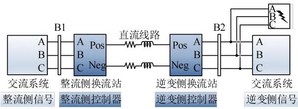  
图 10 双端 MMC-HVDC 测试系统  
Fig. 10 Double-ended MMC-HVDC test system

设置 N 为 0，N 为 200。闭锁时长为 1s。仿真步长分别设置为 2、5、10、50和 $1 0 0 \mu \mathrm { s }$ 。分别采用PSModel 高效模型和 PSModel 对照模型进行仿真，对比仿真用时和误差。

表 4 显示了 PSModel 高效模型与 PSModel 对照模型的仿真用时及误差。将 PSModel 对照模型仿

表 4 PSModel 高效模型与 PSModel 对照模型的仿真用时及误差  
Table 4 Simulation time and error of PSModel high-efficiency model and PSModel contrast model   

<table><tr><td>仿真步长/μs</td><td>PSModel
高效模型/s</td><td>PSModel
对照模型/s</td><td>桥臂电流
误差/%</td><td>提速效率/%</td></tr><tr><td>2</td><td>46.65</td><td>66.76</td><td>0.08</td><td>43.11</td></tr><tr><td>5</td><td>20.40</td><td>30.51</td><td>0.09</td><td>49.56</td></tr><tr><td>10</td><td>8.66</td><td>15.87</td><td>0.09</td><td>83.25</td></tr><tr><td>50</td><td>2.98</td><td>4.19</td><td>0.08</td><td>40.60</td></tr><tr><td>100</td><td>1.13</td><td>2.44</td><td>0.09</td><td>115.93</td></tr></table>

真用时与 PSModel 高效模型仿真用时作差，再除以PSModel 高效模型仿真用时，定义为提速效率。在不同仿真步长下，PSModel 高效模型和 PSModel对照模型的桥臂电流误差在 0.1%以内，但 PSModel高效模型的计算速度明显快于 PSModel对照模型，提速效率在 40%以上。因此文中提出的桥臂全桥子模块闭锁仿真方法在保证混合型MMC仿真精度的同时，显著提高了计算效率。

# 3.2 模型准确性测试

为测试 PSModel 高效模型的精度，在 Matlab仿真平台中开发如图1所示的MMC详细模型(简称Matlab 详细模型)，并搭建如图 10所示的测试系统，系统参数如附表 A1、A2 所示。

在 PSModel 和 Matlab 平台中，均设置 N 为 2，Nf为 2，采用 2μs 仿真步长，模拟 0.1s逆变侧解锁，0.3s 整流侧解锁，3s 整流侧有功功率指令值由1.0pu阶跃为 0.8pu，4s 逆变侧交流系统近区发生三相短路故障，4.12s 故障恢复。对比 PSModel 高效模型和 Matlab 详细模型的计算结果。

PSModel 高效模型与 Matlab 详细模型的输出波形如图 11 所示，其中绿色曲线为 Matlab 详细模型计算结果，红色曲线为 PSModel 高效模型的计算结果。图 11(b)突出显示了闭锁瞬间直流电压波形；图 11(c)突出显示了交流故障瞬间直流电流波形。附表 A3 统计了混合型 MMC 闭锁、故障、阶跃响应等状态下，PSModel 高效模型与 Matlab 详细模型的最大仿真误差。

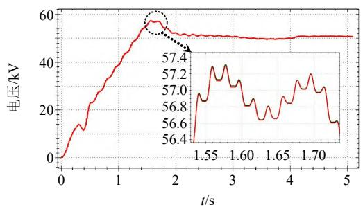  
(a) 混合型MMC 子模块电容电压波形

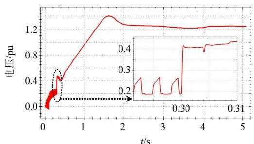  
(b) 整流侧直流电压

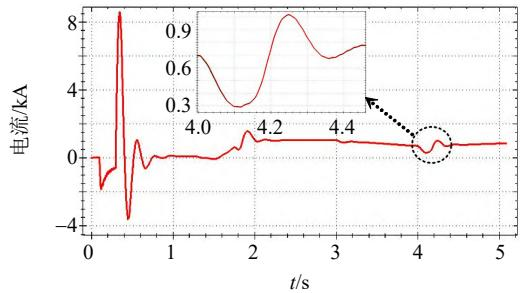  
(c) 整流侧直流电流

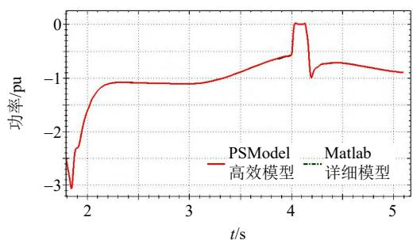  
(d) 逆变侧有功功率波形   
图 11 PSModel 与 Matlab 仿真结果对比  
Fig. 11 Comparison of Matlab and PSModel simulation results

图 11与附表 A3 表明，在混合型 MMC 闭锁、故障、阶跃响应等状态下，PSModel 高效模型的计算结果均与 Matlab 详细模型高度一致，仿真精度误差在 0.1%左右。

# 3.3 模型速度测试

为测试 PSModel 高效模型的计算速度，在PSCAD/EMTDC Professional V4.6.3 平台中，利用MMC 戴维南等效模型(简称 PSCAD 等效模型)，搭建如图 10所示的测试系统，系统参数如附表 A1、A2 所示。PSModel 和 PSCAD 平台中均采用 10μs的仿真步长，运行在 Intel i7-6500 CPU(主频为2.5GHz)。设置 N 为 40，N 为 160，对比典型波形。

PSModel 高效模型与 PSCAD 等效模型的计算结果如图 12所示，绿色曲线为 PSCAD 等效模型，其中，红色曲线为 PSModel 高效模型。图 12 表明无论是直流侧还是交流侧，PSModel 高效模型与

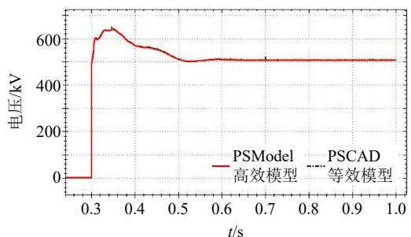  
(a) 直流电压波形

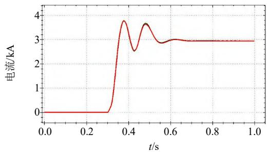  
(b) 直流电流波形

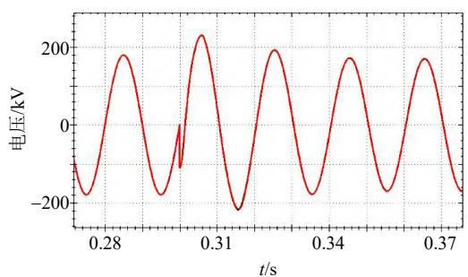

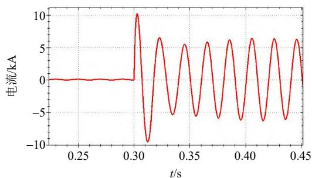  
(c) 交流电压波形  
(d) 交流电流波形   
图 12 PSModel 与 PSCAD 仿真结果对比  
Fig. 12 Comparison of simulation results between PSModel and PSCAD

PSCAD 等效模型的计算结果基本一致。

为了验证本文提出的混合型MMC全状态高效电磁暂态仿真方法的快速性，基于上述两端MMC-HVDC 测试系统，采用 10μs 仿真步长，仿真时间 2s，其中混合型 MMC 闭锁模式运行 1s，解锁运行 1s。分别采用表 5 所示的半桥子模块和全桥子

表 5 MMC测试系统仿真用时  
Table 5 The simulation time of MMC test system   

<table><tr><td rowspan="2">半桥子模块数/个</td><td rowspan="2">全桥子模块数/个</td><td colspan="2">PSCAD等效模型仿真时间/s</td><td colspan="2">PSModel高效模型仿真时间/s</td></tr><tr><td>闭锁</td><td>解锁</td><td>闭锁</td><td>解锁</td></tr><tr><td>2</td><td>2</td><td>11.55</td><td>59.12</td><td>3.38</td><td>1.88</td></tr><tr><td>4</td><td>4</td><td>14.52</td><td>79.43</td><td>3.98</td><td>2.74</td></tr><tr><td>8</td><td>8</td><td>20.81</td><td>99.97</td><td>4.10</td><td>3.23</td></tr><tr><td>20</td><td>20</td><td>32.92</td><td>135.36</td><td>4.57</td><td>4.96</td></tr><tr><td>40</td><td>40</td><td>57.88</td><td>149.04</td><td>5.53</td><td>8.99</td></tr><tr><td>80</td><td>80</td><td>91.54</td><td>215.74</td><td>7.22</td><td>19.65</td></tr><tr><td>200</td><td>200</td><td>224.98</td><td>334.51</td><td>13.33</td><td>42.27</td></tr><tr><td>400</td><td>400</td><td>399.97</td><td>575.77</td><td>21.78</td><td>103.45</td></tr></table>

模块数量，统计 PSModel 高效模型和 PSCAD 等效模型闭锁模式和解锁模式的仿真时间。

表 6 为去除混合型 MMC 模型后，PSModel 和PSCAD 仿真软件对测试系统其余部分的(交流电源、线路、变压器和控制系统等)仿真时间。无论仿真 10、20 或 40s，PSCAD 和 PSModel 仿真软件对其余部分的仿真用时基本一致，差别很小。

表6 测试系统不含 MMC的仿真用时  
Table 6 Simulation time of test system without MMC   

<table><tr><td>仿真时间</td><td>PSModel 用时</td><td>PSCAD 用时</td></tr><tr><td>10</td><td>11.09</td><td>11.95</td></tr><tr><td>20</td><td>25.54</td><td>25.08</td></tr><tr><td>40</td><td>43.24</td><td>42.52</td></tr></table>

由于 PSModel 高效模型和 PSCAD 等效模型的实现方法不同，如表 5 所示，含混合型 MMC 后，PSModel与PSCAD的测试系统仿真用时差别很大。对比PSCAD等效模型和 PSModel高效模型闭锁模式的仿真时间，PSModel 高效模型基于文章提出的闭锁等效方法，闭锁模式的仿真效率远高于PSCAD等效模型。对比 PSCAD 和 PSModel 解锁模式计算时间，在子模块数量较少时，PSCAD 等效模型的二极管的插值计算和模型内部节点是影响仿真效率的主要因素，PSModel 高效模型在解锁模式下避免了不必要的插值计算，省去了内部节点，因此提速结果更加明显。在子模块数量较多时，排序算法是影响计算效率的主要因素，PSModel 高效模型采用了灵活堆排序算法，与 PSCAD 快速排序算法相比，计算效率也有较大提升。

无论闭锁还是解锁模式，PSModel 高效模型具备高仿真精度的同时，计算速度明显快于 PSCAD等效模型。因此，本文提出的混合型 MMC 全状态高效电磁暂态仿真方法合理高效，更适用于大电网全电磁仿真计算。

# 4 结论

针对混合型MMC全状态电磁暂态仿真模型存在等效复杂、内部节点数量多、计算效率低、依赖PSCAD 等问题。文章分析了混合型 MMC 解闭锁模式存在的多种工作状态，提出了一种“混合型MMC 全状态高效电磁暂态仿真方法”。

在混合型 MMC 闭锁运行模式下，提出的闭锁等效方法，在确保混合型 MMC 闭锁仿真精度的同时，有效提升了混合型MMC闭锁仿真效率。在混合

型 MMC 解锁运行模式下，根据混合型 MMC 的调制特性，基于灵活堆排序的电容电压排序算法省去不必要的排序，提升了混合型MMC解锁仿真效率。

总之，本文提出的混合型 MMC 全状态高效电磁暂态仿真方法，与 PSCAD 等效模型相比，在保证精度的同时，提升了模型的计算效率，更加适用于大电网的全电磁暂态仿真计算。所提方法亦能实现全桥 MMC 和半桥 MMC 的电磁暂态仿真，具备较强的通用性。

# 参考文献

[1] 刘文焯，汤涌，侯俊贤，等．考虑任意重事件发生的多步变步长电磁暂态仿真算法[J]．中国电机工程学报，2009，29(34)：9-15  
LIU Wenzhuo ， TANG Yong ， HOU Junxian ， et alSimulation algorithm for multi variable-stepelectromagnetic transient considering multiple events[J]Proceedings of the CSEE，2009，29(34)：9-15(in Chinese)  
[2] 张建坡，胡子为，闫语．MMC-HVDC 改进模型预测控制策略研究[J]．中国电机工程学报，2021，41(7)：2363-2372  
ZHANG Jianpo ， HU Ziwei ， YAN Yu ． Research ofimproved model predictive control strategy forMMC-HVDC[J]．Proceedings of the CSEE，2021，41(7)：2363-2372(in Chinese)  
[3] JI Shiqi，HUANG Xingxuan，PALMER J，et al．Modular multilevel converter (MMC) modeling considering submodule voltage sensor noise[J]．IEEE Transactions on Power Electronics，2021，36(2)：1215-1219   
[4] 周孝信，陈树勇，鲁宗相，等．能源转型中我国新一代电力系统的技术特征[J]．中国电机工程学报，2018，38(7)：1893-1904  
ZHOU Xiaoxin，CHEN Shuyong，LU Zongxiang，et al Technology features of the new generation power system in China[J]．Proceedings of the CSEE，2018，38(7)： 1893-1904(in Chinese)   
[5] ZENG Rong，XU Lie，YAO Liangzhong，et al．Design and operation of a hybrid modular multilevel converter[J]．IEEE Transactions on Power Electronics， 2015，30(3)：1137-1146   
[6] SHENG Jing，YANG Heya，LI Chushan，et al．Active thermal control for hybrid modular multilevel converter under overmodulation operation[J]．IEEE Transactions on Power Electronics，2020，35(4)：4242-4255   
[7] 许建中，王乐，井皓，等．混合 MMC 等微增率子模块冗余配置方法[J]．中国电机工程学报，2018，38(19)：5804-5811  
XU Jianzhong ，WANG Le ，JING Hao ，et al． Equalincremental principle based sub-module redundancy

configuration of hybrid MMC[J] ． Proceedings of theCSEE，2018，38(19)：5804-5811(in Chinese)  
[8] 董鹏，蔡旭，吕敬．大幅减小子模块电容容值的 MMC优化方法[J]．中国电机工程学报，2018，38(18)：5369-5380  
DONG Peng，CAI Xu，LÜ Jing．Optimized method ofMMC for greatly reducing the capacitance of thesubmodules[J]．Proceedings of the CSEE，2018，38(18)：5369-5380(in Chinese)  
[9] 林艺哲，林磊，徐晨．稳态负电平输出下的混合型 MMC设计方法[J]．中国电机工程学报，2018，38(14)：4202-4211．  
LIN Yizhe，LIN Lei，XU Chen．A design method of hybrid modular multilevel converter with negative output in steady state[J]．Proceedings of the CSEE，2018，38(14)： 4202-4211(in Chinese)   
[10] GNANARATHNA U N，GOLE A M，JAYASINGHE R P Efficient modeling of modular multilevel HVDC converters (MMC) on electromagnetic transient simulation programs[J] ． IEEE Transactions on Power Delivery，2011，26(1)：316-324   
[11] PERALTA J，SAAD H，DENNETIÈRE S，et al．Detailedand averaged models for a 401-Level MMC-HVDCsystem[J]．IEEE Transactions on Power Delivery，2012，27(3)：1501-1508  
[12] Dennetière S，Nguefeu S，Saad H，et al．Modeling of modular multilevel converters for the France-Spain link[J]．Star，2013，2(3)：4   
[13] 许建中，赵成勇，刘文静．超大规模 MMC 电磁暂态仿真提速模型[J]．中国电机工程学报，2013，33(10)：114-120 ． XU Jianzhong ， ZHAO Chengyong ， LIUWenjing．Accelerated model of ultra-large scale MMC inelectromagnetic transient simulations[J] ． Proceedings ofthe CSEE，2013，33(10)：114-120(in Chinese)  
[14] 许建中，赵成勇，GOLEAM．模块化多电平换流器戴维南等效整体建模方法[J]．中国电机工程学报，2015，35(8)：1919-1929  
XU Jianzhong，ZHAO Chengyong，GOLE A M．Research on the thévenin’s equivalent based integral modelling method of the modular multilevel converter (MMC)[J] Proceedings of the CSEE，2015，35(8)：1919-1929(in Chinese)   
[15] 连攀杰，刘文焯，汤涌，等．模块化多电平换流器的高效电磁暂态仿真方法研究[J]．中国电机工程学报，2020，40(24)：7980-7989  
LIAN Panjie，LIU Wenzhuo，TANG Yong，et al．Research on efficient electromagnetic transient simulation method of modular multilevel converter[J] ． Proceedings of the CSEE，2020，40(24)：7980-7989(in Chinese)   
[16] 粟时平，魏新伟，牛鼎，等．模块化多电平换流器电容电压改进排序平衡方法[J]．中国电机工程学报，2017，

37(13)：3874-3882

SU Shiping ， WEI Xinwei ， NIU Ding ， et al ． Amodified-sorting balancing method of capacitor voltagefor modular multilevel converter[J] ． Proceedings of theCSEE，2017，37(13)：3874-3882(in Chinese)

[17] 徐义良，赵禹辰，赵成勇，等．适用于梯形法 MMC等效模型的线性排序均压算法[J]．中国电机工程学报，2017，37(16)：4747-4757  
XU Yiliang，ZHAO Yuchen，ZHAO Chengyong，et al．A linear ranking algorithm for trapezoidal rule based MMC equivalent models[J]．Proceedings of the CSEE，2017， 37(16)：4747-4757(in Chinese)   
[18] 姚蜀军，屈秋梦，蔡焱蒙，等．基于多频段动态相量法的 MMC换流器建模方法[J]．中国电机工程学报，2020，40(18)：5932-5941  
YAO Shujun ， QU Qiumeng ， CAI Yanmeng ， et alResearch of modeling method of modular multilevelconverter based on multi-frequency bands dynamicphasor[J]．Proceedings of the CSEE，2020，40(18)：5932-5941(in Chinese)  
[19] 潘尔生，杨惠文，宋钊，等．适用于大步长情形下基于模块化多电平拓扑的直流电网高效仿真建模方法[J]．中国电机工程学报，2020，40(19)：6142-6149  
PAN Ersheng，YANG Huiwen，SONG Zhao，et al．An efficient modeling of modular multi-level converter based DC grids by using larger time-steps[J]．Proceedings of the CSEE，2020，40(19)：6142-6149(in Chinese)   
[20] 朱良合，盛超，陈晓科，等．混合 MMC 电磁暂态高效建模和阀段故障特性分析[J]．华北电力大学学报，2019，46(1)：32-40，46  
ZHU Lianghe，SHENG Chao，CHEN Xiaoke，et al High-speed electromagnetic modeling and internal valve failure analysis of hybrid MMC[J]．Journal of North China Electric Power University，2019，46(1)：32-40，46(in Chinese)   
[21] 罗雨，饶宏，许树楷，等．级联多电平换流器的高效仿真模型[J]．中国电机工程学报，2014，34(15)：2346-2352LUO Yu ， RAO Hong ， XU Shukai ， et al ． Efficientmodeling for cascading multilevel converters[J]Proceedings of the CSEE，2014，34(15)：2346-2352(inChinese)．  
[22] 唐庚，徐政，刘昇．改进式模块化多电平换流器快速仿真方法[J]．电力系统自动化，2014，38(24)：56-61，85TANG Geng ， XU Zheng ， LIU Sheng ． Improved fastmodel of the modular multilevel converter[J]．Automationof Electric Power Systems，2014，38(24)：56-61，85(inChinese)  
[23] 许建中，李承昱，熊岩，等．模块化多电平换流器高效建模方法研究综述[J]．中国电机工程学报，2015，35(13)：3381-3392  
XU Jianzhong，LI Chengyu，XIONG Yan，et al．A review

of efficient modeling methods for modular multilevelconverters[J]．Proceedings of the CSEE，2015，35(13)：3381-3392(in Chinese)

附录 A

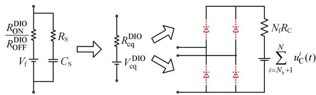  
图 A1 基于虚拟二极管的桥臂全桥子模块闭锁等效方法  
Fig. A1 Equivalent method for blocking full bridge sub-module of bridge arm using virtual diode

表 A1 仿真算例电气系统参数  
Table A1 Simulation example primary system parameters   
表 A2 仿真算例控制系统参数  

<table><tr><td>参数</td><td>数值</td><td>参数</td><td>数值</td></tr><tr><td>交流电网电压/kV</td><td>230</td><td>桥臂电感/mH</td><td>47.75</td></tr><tr><td>交流电网等值电阻/Ω</td><td>13.79</td><td>子模块电容/μF</td><td>120</td></tr><tr><td>交流系统等值电感/mH</td><td>62.23</td><td>直流侧平波电抗电感值/mH</td><td>8</td></tr><tr><td>直流电压/kV</td><td>200</td><td>直流侧平波电抗电阻值/mΩ</td><td>25.1</td></tr></table>

Table A2 Simulation example to control system parameters   
表 A3 仿真误差对比  
Table A3 Simulation error comparison   

<table><tr><td>参数</td><td>数值</td><td>参数</td><td>数值</td></tr><tr><td>定直流电压控制比例系数</td><td>2</td><td>定有功功率控制比例系数</td><td>3</td></tr><tr><td>定直流电压控制积分系数</td><td>40</td><td>定有功功率控制比例系数</td><td>3</td></tr><tr><td>定无功功率控制比例系数</td><td>0.</td><td>电流内环控制比例系数</td><td>0.6</td></tr><tr><td>定无功功率控制积分系数</td><td>20</td><td>电流内环控制积分系数</td><td>6</td></tr></table>

%

<table><tr><td>物理量</td><td>闭锁误差</td><td>故障误差</td><td>阶跃误差</td></tr><tr><td>子模块电容电压</td><td>0.017</td><td>0.006</td><td>0.018</td></tr><tr><td>直流电压</td><td>0.024</td><td>0.007</td><td>0.007</td></tr><tr><td>直流电流</td><td>0.083</td><td>0.101</td><td>0.017</td></tr><tr><td>有功功率</td><td>0.029</td><td>0.091</td><td>0.089</td></tr></table>

  
连攀杰

在线出版日期：2021-09-15。

收稿日期：2020-12-25。

作者简介：

连攀杰(1994)，男，博士研究生，研究方向为电磁暂态仿真技术，1225601442@qq.com；

刘文焯(1972)，男，硕士，高级工程师，研究方向为电力系统仿真与分析技术、软件开发等，liuwzh@epri.ac.cn；

汤涌(1959)，男，博士，教授级高级工程师，博士生导师，研究方向为电力系统仿真分析与稳定控制等。

(责任编辑 吕鲜艳)

# Research on Hybrid MMC Full-state Efficient Electromagnetic Transient Simulation Method

LIAN Panjie, LIU Wenzhuo, YANG Zedong, TANG Yong, YU Shuyan, LI Xia, XU Ke

(State Key Laboratory of Power Grid Safety and Energy Conservation (China Electric Power Research Institute))

KEY WORDS: hybrid modular multilevel converter (MMC); electromagnetic transients; full-state; locked equivalent; flexible heap sorting algorithm

The hybrid modular multilevel converter (MMC), which composed of half bridge sub modules (HBSM) and full bridge sub modules (FBSM), takes into account the DC fault ride-through capability and economy, with broad engineering application prospects. For the hybrid MMC blocked mode, the working state is flexible and complex, accompanied by interpolation problems.

This paper analyzes the various working states of the hybrid MMC, and proposes a ‘hybrid MMC full-state efficient electromagnetic transient simulation method’. Fig. 1 shows the full-state equivalent model of the hybrid MMC. The HBSM, FBSM and the inductance of the bridge arm are respectively equivalent to the Thevenin branch, and the entire bridge arm is equivalent to the Thevenin branch. The following is the specific equivalent formula.

$$
u _ {\text {a r m e q}} (t) = u _ {\text {a l l} \text {s m e q}} ^ {\mathrm {H B}} (t) + u _ {\text {a l l} \text {s m e q}} ^ {\mathrm {F B}} (t) + u _ {\mathrm {L}} (t) \tag {1}
$$

$$
R _ {\text {a r m e q}} (t) = R _ {\text {a l l} \text {s m e q}} ^ {\mathrm {H B}} (t) + R _ {\text {a l l} \text {s m e q}} ^ {\mathrm {F B}} (t) + R _ {\mathrm {L}} (t) \tag {2}
$$

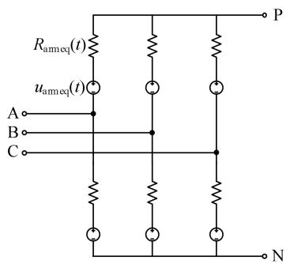  
Fig. 1 Hybrid MMC full state equivalent model

For the hybrid MMC blocked mode, the blocked characteristics of the HBSM and the FBSM are analyzed. For the HBSM, two virtual diode models are used to interpolate the HBSM of the same bridge arm. Compared with other papers, the virtual diode model is only used in the locked mode and no interpolation calculation is performed in the unlocked mode. Aiming at the FBSM of the bridge arm, all the FBSM capacitors are connected in series, and the equivalent model of the FBSM blocked of the bridge arm is proposed.

For the hybrid MMC unlocked mode, according to the modulation characteristics of the hybrid MMC, the capacitor voltage sorting algorithm of flexible stack

sorting is studied to improve the simulation efficiency in the hybrid MMC unlocked mode. The sorting algorithm proposed in this paper improves the calculation efficiency in the unlocked mode of the hybrid MMC electromagnetic transient model by eliminating unnecessary sorting calculations without affecting the switching effect of the sub-modules.

In order to verify the accuracy and efficiency of the hybrid MMC efficient electromagnetic transient simulation method proposed in this paper, the PSModel (power system model) efficient model is developed on the PSModel software platform. Then the same test system in Matlab and PSCAD/EMTDC is built too, and the accuracy and speed of PSModel efficient model are compared.

Table 1 shows the simulation error, and Table 2 shows the calculation speed of the PSModel efficient model. Regardless of the locked or unlocked mode, the PSModel efficient model has high simulation accuracy and the calculation speed is significantly faster than the PSCAD equivalent model. Therefore, the hybrid MMC full-state and high-efficiency electromagnetic transient simulation method proposed in this paper is reasonable and efficient, and it is more suitable for large-scale power grid full electromagnetic simulation calculation.

%

Table 1 Simulation error comparison   

<table><tr><td>Physical quantity</td><td>Blocking error</td><td>Fault error</td><td>Step response error</td></tr><tr><td>Vc</td><td>0.017</td><td>0.006</td><td>0.018</td></tr><tr><td>νdc</td><td>0.024</td><td>0.007</td><td>0.007</td></tr><tr><td>Idc</td><td>0.083</td><td>0.101</td><td>0.017</td></tr><tr><td>Pdc</td><td>0.029</td><td>0.091</td><td>0.089</td></tr></table>

Table 2 The simulation time of MMC test system   

<table><tr><td rowspan="2">Number of HSM</td><td rowspan="2">Number of FSM</td><td colspan="2">PSCAD simulation time/s</td><td colspan="2">PSModel simulation time/s</td></tr><tr><td>Blocked</td><td>Unblocked</td><td>Blocked</td><td>Unblocked</td></tr><tr><td>2</td><td>2</td><td>11.55</td><td>59.12</td><td>3.38</td><td>1.88</td></tr><tr><td>4</td><td>4</td><td>14.52</td><td>79.43</td><td>3.98</td><td>2.74</td></tr><tr><td>8</td><td>8</td><td>20.81</td><td>99.97</td><td>4.10</td><td>3.23</td></tr><tr><td>20</td><td>20</td><td>32.92</td><td>135.36</td><td>4.57</td><td>4.96</td></tr><tr><td>40</td><td>40</td><td>57.88</td><td>149.04</td><td>5.53</td><td>8.99</td></tr><tr><td>80</td><td>80</td><td>91.54</td><td>215.74</td><td>7.22</td><td>19.65</td></tr><tr><td>200</td><td>200</td><td>224.98</td><td>334.51</td><td>13.33</td><td>42.27</td></tr><tr><td>400</td><td>400</td><td>399.97</td><td>575.77</td><td>21.78</td><td>103.45</td></tr></table>