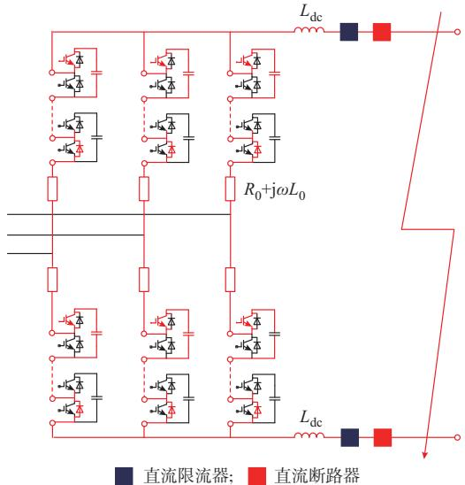
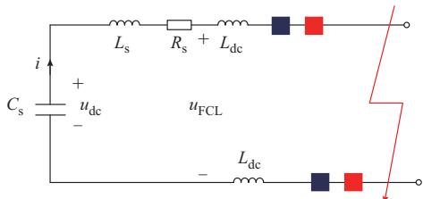
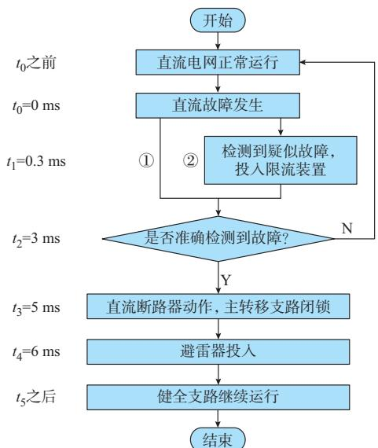
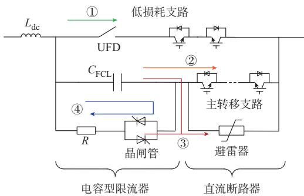
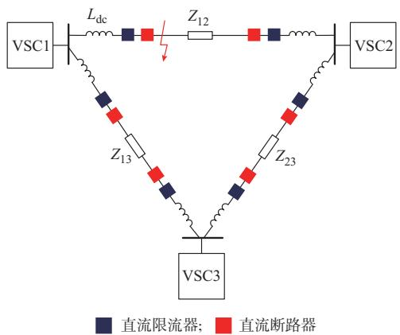
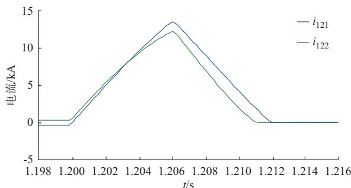
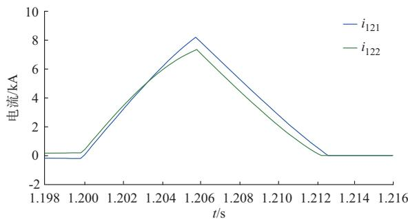

# 考虑直流电抗器的电容型限流器特性及优化配置

李国庆 1 ，边 竞 1 ，王 鹤 1 ，孙云鹤 2 ，王振浩 1

（1. 东北电力大学电气工程学院，吉林省吉林市 132012；2. 国电吉林江南热电有限公司，吉林省吉林市 132000）

摘要：直流电网故障电流抑制已成为相关领域必须面对且亟待解决的重要问题之一。现有的故障抑制方法大多采用单一元件，为充分抑制故障电流的上升速率与峰值，文中提出了综合直流电抗器和电容型限流器特性的故障抑制及优化配置方法。首先，基于模块化多电平换流器的故障等值电路，从抑制原理和动作时序2个角度分析了安装故障限流器的必要性；其次，计算分析了电感和电容对故障电流的抑制特性，并将等值电路和求解方法推广到直流环网中，以故障电流和直流电抗器为目标构建了优化配置模型；最后，将优化结果应用于 仿真模型中，与仅使用直流电抗器相比，该配置结果可进一步减小40%的故障电流且并未延长故障切除时间，表明综合使用直流电抗器与电容型限流器能够大幅度减小故障电流，降低直流断路器的开断容量。

关键词：直流电网；故障抑制；直流电抗器；电容型限流器；优化配置

# 0 引 言

柔性直流输电系统具有无换相失败、功率可控性强和易构成直流电网等优点，适用于新能源发电并网和远距离输送，已经成为电力系统领域的研究热点之一［1-3］ 。然而，柔性直流电网作为“低阻尼”系统，故障发生时子模块电容将会经电力电子器件快速放电，导致故障电流在几毫秒内即可达到额定值的数十倍，严重危害了电网安全［4-6］ 。目前高压大容量的直流断路器（DC circuit breaker，DCCB）技术尚不成熟，故需通过抑制故障电流为其提供辅助支撑，直流限流器可以提高换流站与故障点之间的电压，进而减少故障电流的上升速度和峰值，增强故障隔离效果［7-9］ 。

电阻、电感和电容均可起到抑制故障电流的作用，电阻能够提供电压支撑和消耗故障时的暂态能量，电感电压与故障电流上升率成正比，故障初期具有很强的故障抑制能力，而电容电压与所带电荷量相关，具有限流能力随时间增大的特性［10-12］。文献［13］重点分析了电阻型超导限流器的数学模型及设计原则，通过三端柔性直流系统说明了其能够降低直流断路器的开断容量和速度要求。文献［14］提出了利用线路两端直流电抗器实现限流的方法，分析了电感值对故障电流的抑制效果，发现电感值超过某限值后，继续增大电感将不会明显提高故障抑制

效果。文献［15］对比了电阻和电感的电压补偿能力和限流能力，从振荡特性的角度证明了电阻的性能更优越。文献［16］通过预充电电容实现故障电流抑制，设计了充电系统以及分析了电容和初始电压的取值，但该限流器大大增加了系统复杂度和绝缘成本。文献［17］提出了使用电容换相的电感型限流器，实现了电感的快速投入与切除，且在换相后将出现电容与电感同时抑制故障电流的工作状态，但未重点分析该过程。

电阻型限流器大多使用超导技术，成本过高，目前不适用于高压直流系统。直流电抗器过大将影响直流系统的动态性能，增加稳态损耗，且电感将会在故障切除瞬间释放存储的能量，延长故障切除时间。另一方面，电感的限流能力随时间衰减，而电容的特性恰恰相反［18-20］。因此，本文综合考虑电感和电容的抑制效果，对考虑直流电抗器的电容型限流器的限流特性展开了研究，并进行了优化配置。

# 1 模块化多电平换流器故障模型及限流需求

近年来，柔性直流输电系统多由模块化多电平换 流 器（modular multilevel converter，MMC）构 建 。为便于鉴别不同限流装置对故障电流的抑制效果，首先，以单个 MMC作为研究对象。换流站出口双极短路是最严重的故障，此时子模块电容会产生最大的放电电流。同时，在发生故障的初始时刻，交流系统馈入的电流仍在 三相间流通，对直流侧故障电流的影响很小，因此，未闭锁的换流站可等效为一个 RLC放电回路［6］ ，如图 1所示，其中：子模块电

容放电通路用红色线条表示； $; R _ { 0 }$ 为桥臂等效电阻； $L _ { 0 }$ 为桥臂电感； $L _ { \mathrm { d c } }$ 为换流站出口处的直流电抗器，其稳态时降低直流电流的谐波，故障时抑制故障电流；C ，L ，R 分别为 MMC 的故障等值电容、电感和电阻； $\mathrm { ; } u _ { \mathrm { d c } }$ 为直流系统电压 $\therefore u _ { \mathrm { F C L } }$ 为限流装置提供的反向电压，其大小由限流元件的伏安特性决定。本文的换流站参数如下：MMC单个桥臂的子模块个数 N为10，子模块电容 $C _ { 0 } { = } 7 ~ \mathrm { m F }$ ，桥臂电感 $L _ { 0 } { = } 5 3 ~ \mathrm { m H }$ ，直流电压 $u _ { \mathrm { d c } } { = } 2 0 0$ kV，等效电阻 $R _ { 0 } { = } 1 \ \Omega$ 。

  
(a) MMCK*C   
(b) 0*C   
图 1 MMC 故障模型  
Fig. 1 Fault model of MMC

在未闭锁的换流站中，子模块仍会交替导通放电，上、下子模块电容相当于并联，则有

$$
\left\{ \begin{array}{l} R _ {\mathrm {s}} = \frac {2 R _ {0}}{3} \\ L _ {\mathrm {s}} = \frac {2 L _ {0}}{3} \\ C _ {\mathrm {s}} = \frac {6 C _ {0}}{N} \end{array} \right. \tag {1}
$$

通过拉氏变换，图1（b）中的换流站放电电流如式（2）所示。

$$
i (t) = \frac {u _ {\mathrm {F C L}} - L _ {\mathrm {s}} i (0 _ {-})}{L _ {\mathrm {s}} \sqrt {1 - \xi^ {2}}} \mathrm {e} ^ {- \xi \omega_ {\mathrm {n}} t} \sin \left(\omega_ {\mathrm {n}} \sqrt {1 - \xi^ {2}} t - \varphi\right) +
$$

$$
C _ {\mathrm {s}} u _ {\mathrm {d c}} \left(0 _ {-}\right) \frac {\omega_ {\mathrm {n}}}{\sqrt {1 - \xi^ {2}}} \mathrm {e} ^ {- \xi \omega_ {\mathrm {n}} t} \sin \left(\omega_ {\mathrm {n}} \sqrt {1 - \xi^ {2}} t\right) \tag {2}
$$

$$
\left\{ \begin{array}{l} \omega_ {\mathrm {n}} = \frac {1}{\sqrt {L _ {\mathrm {s}} C _ {\mathrm {s}}}} \\ \xi = \frac {R _ {\mathrm {s}}}{2} \sqrt {\frac {C _ {\mathrm {s}}}{L _ {\mathrm {s}}}} \\ \varphi = \arctan \sqrt {\frac {1}{\xi^ {2}} - 1} \end{array} \right. \tag {3}
$$

式中：（i t）为换流站故障电流； $i ( 0 _ { - } )$ 和 $u _ { \mathrm { d c } } \left( 0 _ { - } \right)$ 分别为故障前瞬间的换流站直流电流与电压；t为故障持续时间。

在 实 际 系 统 中 ，存 在 $R _ { s }$ ≪ $\sqrt { L _ { \mathrm { s } } / C _ { \mathrm { s } } }$ ，则$\varphi \approx 9 0 ^ { \circ }$ ，又因该电路的故障切除时间约为1/4振荡周 期，即 $\sin ( \omega _ { \mathrm { n } } \sqrt { 1 - \xi ^ { 2 } } t - \varphi ) < 0 ,$ 。因 $u _ { \mathrm { F C L } } > 0$ ，削减了（i t）的第1项，甚至改变其极性。因此，在故障切除之前， $\mathbf { \nabla } \cdot u _ { \mathrm { F C L } }$ 起到了减小故障电流的作用。

图 2为限流器和断路器的动作时序。 $t _ { 0 } { = } 0 ~ \mathrm { m s }$ 时发生故障， $ \mathrm { \Delta } . t _ { 1 } { = } 0 . 3 ~ \mathrm { m s }$ 检测到疑似故障，投入故障限流器 $^ { [ 2 1 - 2 2 ] } ; t _ { 2 } { = } 3 \ \mathrm { m s }$ 准确检测故障，若未发生故障，切除限流器，直流电网继续运行 $: t _ { 3 } { = } 5 ~ \mathrm { m s }$ 直流断路器动作，其中的主转移支路接收到闭锁信 $\frac { \Pi } { \mathcal { I } } { } ^ { [ 2 3 ] } ; t _ { 4 } =$ 6 ms主转移支路中绝缘栅双极型晶体管（insulatedgate bipolar transistor，IGBT）完 成 闭 锁 ，避 雷 器 投入 $; t _ { 5 }$ 时刻故障切除。

  
图2 保护装置动作时序  
Fig. 2 Action sequence of protective devices

图 2中的流程①为不采用限流器的情况，本文以ABB公司的混合式直流断路器为例，在 $t _ { 4 } { = } 6 ~ \mathrm { m s }$ 避雷器投入之前，断路器一直保持短路，换流站将快速放电，故障电流急剧增大。而在流程②中，限流器在 $t _ { 1 } { = } 0 . 3 ~ \mathrm { m s }$ 即可投入，可及时抑制故障电流，增大

系统的安全性。

综合考虑故障限流器的抑制效果和动作时序，安装限流器十分必要。

# 2 限流装置的故障特性

# 2. 1 直流电抗器

当仅通过直流电抗器抑制故障电流时，时域等效电路如附录 A图 $\mathrm { A } 1 ( \mathrm { a } )$ 所示，采用拉普拉斯变换可得频域等效电路，如附录A图A1（b）所示，进而得到频域的故障电流 $I _ { \mathrm { L } } ( s )$ ，如附录A式（A1）所示。对$I _ { \mathrm { L } } \left( s \right)$ 进行拉普拉斯反变换，换流站的放电电流如式（4）所示。

$$
\begin{array}{l} i _ {\mathrm {L}} (t) = - \frac {i (0 _ {-})}{\sqrt {1 - \xi_ {\mathrm {L}} ^ {2}}} \mathrm {e} ^ {- \xi_ {\mathrm {L}} \omega_ {\mathrm {n L}} t} \sin \left(\omega_ {\mathrm {n L}} \sqrt {1 - \xi_ {\mathrm {L}} ^ {2}} t - \varphi_ {\mathrm {L}}\right) + \\ C _ {\mathrm {s}} u _ {\mathrm {d c}} \left(0 _ {-}\right) \frac {\omega_ {\mathrm {n L}}}{\sqrt {1 - \xi_ {\mathrm {L}} ^ {2}}} \mathrm {e} ^ {- \xi_ {\mathrm {L}} \omega_ {\mathrm {n L}} t} \sin \left(\omega_ {\mathrm {n L}} \sqrt {1 - \xi_ {\mathrm {L}} ^ {2}} t\right) (4) \\ \left\{ \begin{array}{l} \omega_ {\mathrm {n L}} = \frac {1}{\sqrt {\left(L _ {\mathrm {s}} + 2 L _ {\mathrm {d c}}\right) C _ {\mathrm {s}}}} \\ \xi_ {\mathrm {L}} = \frac {R _ {\mathrm {s}}}{2} \sqrt {\frac {C _ {\mathrm {s}}}{L _ {\mathrm {s}} + 2 L _ {\mathrm {d c}}}} \\ \varphi_ {\mathrm {L}} = \arctan \sqrt {\frac {1}{\xi_ {\mathrm {L}} ^ {2}} - 1} \end{array} \right. (5) \\ \end{array}
$$

式中 $: i _ { \mathrm { L } } ( t )$ 为仅安装直流电抗器的换流站故障电流。

根据第1章中的换流站参数，故障电流随 $L _ { \mathrm { d c } }$ 的变化趋势如附录A图A2所示。以故障切除时刻为观测点，当 $L _ { \mathrm { d c } } { = } 0$ 时，故障电流最大值为 23 kA，远远超过直流断路器的切断能力。直流电抗器可以减小故障电流的峰值和斜率，然而，持续增大电感并不能有效提高故障抑制能力， $L _ { \mathrm { d c } } { = } 0 . 0 3$ H为电感抑制能力的临界值。

# 2. 2 电容型限流器

根据上文的分析，不宜通过持续增大直流电抗器实现故障电流抑制，则需利用电容型限流器进一步限制故障电流。本文所提出的电容型限流器拓扑结构及其与直流断路器的配置方式如图 3所示，故障发生后，将电容串入直流电路中，故障电流对其进行充电进而提高换流站与故障点之间的电压，最终实现故障抑制功能。电容型限流器包括低损耗支路、限流电容、耗能电阻和晶闸管，ABB公司的混合式直流断路器由低损耗支路、转移支路和避雷器构成。二者均采用三支路并联结构，且共用低损耗支路以降低建设成本。

参考图 2，电容型限流器和直流断路器的配合

  
图 电容型限流器与直流断路器的配置  
Fig.3Configuration of capacitive current limiter and DC circuit breaker

时序如下。

1）未发生故障时，电流仅流经低损耗支路以避免电子电子器件较大的通态损耗，如图 3中线路①所示。  
2）t 时刻，低损耗支路和主转移支路中的IGBT分 别 闭 锁 和 导 通 ，为 超 高 速 机 械 开 关（ultrafastdisconnector，UFD）提供关断条件，故障电流将流入限流电容 $C _ { \mathrm { F C L } }$ 和主转移支路，如图3中线路②所示。  
3）t 时刻，主转移支路闭锁，电容型限流器中的晶闸管导通，故障电流流入避雷器直至故障切除，如图 3中线路③所示。同时，限流电容 $C _ { \mathrm { F C L } }$ 经耗能电阻R放电，如图3中线路④所示，降低对电容耐压水平的要求，晶闸管具有耐压高、通态损耗小、成本低等优点，使得电容型限流器更加经济。

待直流故障被清除，需合闸断路器时，首先闭合直流断路器中的UFD、主转移支路和电容型限流器中的晶闸管，耗能电阻R和主转移支路将构成通路，此时断路器两端为系统正常运行时的压降，仅为几千伏。稳定后，导通低损耗支路中的IGBT，闭锁主转移支路，电流恢复至低损耗支路，系统进入正常运行状态。

为证明电容型限流器在电感达到抑制上限时仍能够进一步降低故障电流，本节令 $L _ { \mathrm { d c } } { = } 0 . 0 3 \ : \mathrm { H } _ { \odot }$ 。当图1（b）中的限流器为电容时， $t _ { 1 } { = } 0 . 3 ~ \mathrm { m s }$ 将其投入，时域和频域等效电路分别如附录 A图 $\mathrm { A 3 ( a ) }$ 和（b）所示，则故障电流 $I _ { \mathrm { C } } ( s )$ 的表达式如附录A式（A2）所示。对I（s）进行拉普拉斯反变换，此时换流站放电电流如式（6）所示。

$$
i _ {\mathrm {C}} (t) = - \frac {i _ {\mathrm {L}} (0 . 3)}{\sqrt {1 - \xi_ {\mathrm {C}} ^ {2}}} \mathrm {e} ^ {- \xi_ {\mathrm {C}} \omega_ {\mathrm {n C}} t} \sin \left(\omega_ {\mathrm {n C}} \sqrt {1 - \xi_ {\mathrm {C}} ^ {2}} t - \varphi_ {\mathrm {C}}\right) +
$$

$$
\frac {C _ {\mathrm {s}} C _ {\mathrm {F C L}}}{C _ {\mathrm {s}} + C _ {\mathrm {F C L}}} u _ {\mathrm {d c}} (0. 3) \frac {\omega_ {\mathrm {n C}}}{\sqrt {1 - \xi_ {\mathrm {C}} ^ {2}}} \mathrm {e} ^ {- \xi_ {\mathrm {C}} \omega_ {\mathrm {n C}} t} \sin \left(\omega_ {\mathrm {n C}} \sqrt {1 - \xi_ {\mathrm {C}} ^ {2}} t\right) \tag {6}
$$

$$
\left\{ \begin{array}{l} \omega_ {\mathrm {n C}} = \sqrt {\frac {C _ {\mathrm {s}} + C _ {\mathrm {F C L}}}{\left(L _ {\mathrm {s}} + 2 L _ {\mathrm {d c}}\right) C _ {\mathrm {s}} C _ {\mathrm {F C L}}}} \\ \xi_ {\mathrm {c}} = \frac {R _ {\mathrm {s}}}{2} \sqrt {\frac {C _ {\mathrm {s}} C _ {\mathrm {F C L}}}{\left(L _ {\mathrm {s}} + 2 L _ {\mathrm {d c}}\right) \left(C _ {\mathrm {s}} + C _ {\mathrm {F C L}}\right)}} \\ \varphi_ {\mathrm {c}} = \arctan \sqrt {\frac {1}{\xi_ {\mathrm {c}} ^ {2}} - 1} \end{array} \right. \tag {7}
$$

式中 $: i _ { \mathrm { c } } ( \iota )$ 为加装电容型限流器的故障电流； ${ \ ; i _ { \mathrm { L } } ( 0 . 3 ) }$ 和 $u _ { \mathrm { d c } } ( 0 . 3 )$ 分别为限流器投入瞬间的故障电流和直流电压。

对比式（4），式（6）的第 2 项含有关于 $C _ { \mathrm { s } }$ 和 $C _ { \mathrm { F C I } }$ 的分式，且 $C _ { \mathrm { s } } > C _ { \mathrm { s } } C _ { \mathrm { F C L } } / ( C _ { \mathrm { s } } + C _ { \mathrm { F C L } } )$ ，使故障电流大幅度减小。故障电流和电容的关系如附录A图A4所示，表明在电感的抑制效果达到瓶颈时，引入电容能够进一步大幅度减小故障抑制电流。同时，电容值还会改变电流的振荡周期。

综上所述，电感值与抑制能力成正比，但电感存在瓶颈值，继续增大不会有效提高限流能力，反而会增大建设成本。电容值与抑制能力成反比，小电容能够更有效地抑制故障电流，但电容两端会承受更高的电压，增加耐压成本。因此，综合运用直流电抗器和电容型限流器是降低故障切除成本、提高系统经济性的有效手段。

# 3 参数优化配置

# 3. 1 限流电容 C

当直流电抗器和电容式限流器共同用于三端直流电网中时，假设换流站 VSC1出口发生极间故障（如图 4所示），进而可得到三端直流电网等效放电回路（如附录A图A5所示）。图A5中： $R _ { s i } , L _ { s i }$ 和 $C _ { \mathrm { s } i }$ $( i { = } 1 , 2 , 3 )$ 分别为换流站 i的等效电阻、电感和电容， $Z _ { 1 2 } , Z _ { 1 3 }$ 和 $Z _ { 2 3 }$ 为换流站之间的线路阻抗， $, i _ { 1 2 1 }$ 和 $i _ { 1 2 2 }$ 为故障点两侧电流， $U _ { \mathrm { L d c } j }$ 和 $U _ { \mathrm { c } j } ( j { = } 1 , 2 )$ 分别为故障点两侧直流电抗器和电容型限流器的电压。换流站VSC1 和 VSC2 间的线路 $\mathrm { L _ { 1 2 } }$ 的长度为100 km，换流站 VSC2 和 VSC3 间的线路 $\mathrm { L _ { 2 3 } }$ 的长度为200 km，换流站 VSC1 和 VSC3 间的线路 L 的长度为 300 km，且线路单位长度的电阻和电感分别为0.01 Ω/km和0.82 mH/km。

以各支路电流作为未知量，利用拉氏变换和基尔霍夫定律可列出方程组，进而得到各支路电流的解析式。但附录 A图 A5含有大量的动态元件，导致 $i _ { 1 2 1 }$ 和 $i _ { 1 2 2 }$ 的解析式十分复杂，已无法根据解析式分析故障电流，故在此以图像形式表达6 ms时的故障电流与 $L _ { \mathrm { d c } }$ 和 $C _ { \mathrm { F C L } }$ 的关系，如附录A图A6和图A7

  
图 4 三端直流电网  
Fig. 4 Three-terminal DC power grid

所示。

附录 A图 A6和图 A7中，因 3个换流站均向故障点馈入电流，导致 $i _ { 1 2 1 }$ 和 $i _ { 1 2 2 }$ 的值大于单站情况，且换流站 VSC1至故障点的阻抗更小，使得 $i _ { 1 2 1 } > i _ { 1 2 2 } \mathrm { _ { c } }$ 。直流电网中的故障电流同样随限流电感增大、电容减小而减小，但一味地使用大电感和小电容同样不合理。因此，十分有必要综合运用直流电抗器和电容型限流器实现优化配置，以保证系统动态性能和故障抑制效果。考虑故障电流水平和系统的动态性能，本文以故障电流 $i _ { 1 2 1 }$ 与 $i _ { 1 2 2 }$ 之和 $i _ { \mathrm { f a u l t } }$ 、电感值最小为优化目标，如式（8）所示。考虑直流电抗器稳态时的滤波作用和电容的耐压能力，约束条件如式（9）所示。

$$
F = \min  \left(i _ {\text {f a u l t}}, L _ {\mathrm {d c}}\right) \tag {8}
$$

$$
\text {s . t .} \left\{ \begin{array}{l} L _ {\mathrm {d c}} \geqslant 0. 0 1 \mathrm {H} \\ u _ {\mathrm {C j}} \leqslant 3 0 \mathrm {k V} \end{array} \right. \tag {9}
$$

# 3. 2 耗能电阻 R

为减小电容的耐压要求，直流断路器中的避雷器投入瞬间，导通电容型限流器中的晶闸管，耗能电阻通路使限流电容脱离快速充电状态。此时，限流电容C和耗能电阻R并联接入故障回路。因限流电容和耗能电阻的端电压恒相等，若耗能电阻过大，电容的电压仍将超过阈值。另一方面，若耗能电阻过小，限流电容和耗能电阻构成的放电回路时间常数$\tau { = } R C$ 较小，电容快速放电降低了其限流能力。综上所述，耗能电阻取值原则为：

$$
R = \frac {u _ {\mathrm {C} , \max}}{i _ {\text {f a u l t 0}}} \tag {10}
$$

式中： $\colon u _ { \mathrm { C , \ m a x } }$ 为限流电容的允许电压； $\div i _ { \mathrm { f a u l t 0 } }$ 为近端故障时流过电容型限流器的故障电流最大值。

# 4 仿真验证

上文分析了直流电网的故障特性，并介绍了直

流电抗器和电容式限流器的参数设计方法。为了说明所提出参数优化配置的正确性和有效性，本章验证了故障电流计算结果的准确性，同时比较了 2种限流方案的故障抑制效果，仿真参数见第1章。

# 4. 1 理论分析验证

为验证故障等效电路、电流计算值的正确性，使用PSCAD/EMTDC建立如图4所示的三端直流电网，对比分析采用不同限流装置时故障支路电流 $i _ { 1 2 1 }$ 和 $i _ { 1 2 2 }$ 的计算值与仿真值，此处 $L _ { \mathrm { d c } } { = } 0 . 0 3$ H， $C _ { \mathrm { F C L } } =$ 2 mF。t=1.2 s，换流站 VSC1 出口处的线路 $\mathrm { L _ { 1 2 } }$ 发生双极短路，仅使用直流电抗器和加装电容型限流器的电流变化情况分别如附录 A 图 A8和图 A9所示。其中，故障电流仿真值和计算值分别用实线和虚线表示。在短路故障后6 ms内，计算值和仿真值的电流变化情况基本一致，表明等效电路及计算值可以表征故障的动态特性。结合直流断路器的动作时间，短路故障期间使用该数学模型是可行的。此外，图A8（a）和图A9（a）、图A8（b）和图A9（b）的对比结果验证了加装电容型限流器能够进一步减小故障电流的结论。

# 4. 2 直流电抗器

$L _ { \mathrm { d c } } { = } 0 . 0 3 \ \mathrm { H } , t { = } 1 . 2 \ \mathrm { s }$ 时，换流站 VSC1 出口处发生双极短路，故障点两侧的故障电流如图5所示。类 似 于 附 录 A 图 A6 和 图 $\textrm { A 7 } , i _ { 1 2 1 } > i _ { 1 2 2 0 } \ t = 1 . 2 0 6 \ \mathrm { s }$ 时，避雷器投入，故障电流急剧下降，大约 10 ms故障切除，且 $i _ { 1 2 1 }$ 的切除时间更长。附录 A图 A10（a）中， $U _ { \mathrm { L d c 1 } }$ 和 $U _ { \mathrm { L d c 2 } }$ 分别为换流站 VSC1和 VSC2侧直流电抗器电压，由于故障电流上升率高，二者瞬间升至 75 kV，实现故障抑制。但直流电抗器电压逐渐衰减，致使故障抑制效果减弱。当避雷器投入后，直流电抗器因故障电流下降而出现反向电压并释放能量，延长了故障切除时间。附录A图A10（b）为故障点两侧直流断路器中避雷器吸收的能量，可达到10.5 MJ 和 7.5 MJ。

  
图 仅使用直流电抗器的故障电流  
Fig. 5 Fault current using DC reactor only

# 4. 3 优化配置

为了获得直流电抗器和电容型限流器的最佳配置，利用粒子群算法求解上述优化目标，具体流程如附录A图A11所示。仍以图4所示直流电网为研究对象，利用拉普拉斯变换求解目标函数和约束条件，代入粒子群算法求得优化问题的Pareto最优解集，如附录 A 图 A12所示。继而通过重复上述过程并迭代存档粒子获得存档最优值，如附录A图A13所示。其中， $L _ { \mathrm { d c } } { = } 0 . 0 4 1 \ 7 4 1 \ \mathrm { H } , C _ { \mathrm { F C L } } { = } 1 . 3 6 8 \ \mathrm { m F } , i _ { \mathrm { f a u l t } } { = }$ 14.896 kA。

将通过粒子群算法得到的直流电抗器和电容值代入 PSCAD/EMTDC 仿真模型中，故障发生后0.3 ms，电容型限流器投入，仿真结果如下。

优化配置后的故障电流如图 6所示，其中故障电流约为8 kA，与图5相比大约减小了40%。与仅使用直流电抗器相比，混合使用直流电抗器和电容型限流器能够进一步减小故障电流，验证了该优化配置结果的正确性和有效性。直流电抗器电压如附录 A图 A14（a）所示，趋势与图 A10（a）相似。电容电压如图A14（b）所示，其逐渐增大，弥补了直流电抗器电压的衰减量，保证了故障回路的电压支撑。避雷器投入后，电容电压仅继续升高了不到 2 kV，未超过阈值，保证了绝缘成本。此外，电容所存储的能量被耗能电阻R消耗，不会加剧故障电流，有利于缩短故障切除时间。避雷器吸收的能量如图 $\mathrm { A 1 4 ( c ) }$ 所示，与图A10（b）相比减小了约20%，降低了避雷器的散热要求。图 A14（d）为耗能电阻 R吸收的能量，晶闸管导通后开始吸收能量，小于 1 MJ。又因RC构成放电回路，在故障切除后仍会衰减电容的能量。

  
图6 优化配置后的故障电流  
Fig. 6 Fault current after configuration optimization

# 5 结语

为充分抑制故障电流的上升速率与峰值，本文提出了综合直流电抗器和电容型限流器特性的故障抑制及优化配置方法，得到如下结论：

1）持续增大电感无法显著降低故障电流，反而会延长故障切除时间，而电感达到瓶颈值时，电容仍能够进一步抑制故障电流。此外，电感和电容的抑制能力分别随时间减小与增大，综合使用二者是抑制故障电流的有效手段。

2）将直流电抗器和电容型限流器共同应用在直流环网，考虑二者的限流特性，以故障电流、直流电抗器整体为目标，加以考虑电容的耐压水平，通过粒子群算法对直流环网中的电感和电容进行优化配置。

3）将优化结果应用在PSCAD/EMTDC仿真模型中，与直流电抗器情况相比，该配置结果可进一步减小40%的故障电流且并未延长故障切除时间，表明综合使用直流电抗器与电容型限流器能够大幅度降低故障电流，从而减小直流断路器并联支路数量和能量耗散需求，提高系统经济性。

本文的研究对象为电容型限流器和直流电抗器。而直流电网中的潮流控制器由电容组成，通过增加电容耐压水平可实现故障抑制功能，下一步将在潮流控制器的故障抑制、参数优化和成本分析方面展开研究。

附录见本刊网络版（http：//www.aeps-info.com/aeps/ch/index.aspx），扫英文摘要后二维码可以阅读网络全文。

# 参 考 文 献

［1］李斌，何佳伟.多端柔性直流电网故障隔离技术研究［J］.中国电机工程学报，2016，36（1）：87-95.  
LI Bin，HE Jiawei. Research on the DC fault isolating techniquein multi-terminal DC system［J］. Proceedings of the CSEE，2016，36（1）：87-95.  
［ ］周孝信，鲁宗相，刘应梅，等 中国未来电网的发展模式和关键技术［J］. 中国电机工程学报，2014，34（29）：4999-5008.  
ZHOU Xiaoxin， LU Zongxiang， LIU Yingmei， et al.Development models and key technologies of future grid in China［J］. Proceedings of the CSEE，2014，34（29）：4999-5008.  
［3］DEBNATH S， QIN Jiangchao， BAHRANI B， et al.Operation，control，and applications of the modular multilevelconverter： a review ［J］. IEEE Transactions on PowerElectronics，2015，30（1）：37-53.  
［4］BIAN Zhipeng， XU Zheng. Fault ride-through capabilityenhancement strategy for VSC-HVDC systems supplying forpassive industrial installations［J］. IEEE Transactions on PowerDelivery，2016，31（4）：1673-1682.  
［5］朱思丞，赵成勇，李承昱，等 .考虑故障限流器动作的直流电网限流电抗器优化配置［］电力系统自动化， ， （ ）： -149.DOI：10.7500/AEPS20180308007.  
ZHU Sicheng，ZHAO Chengyong，LI Chengyu，et al. Optimal configuration of current-limiting reactor considering fault current

limiter action in DC grid［J］. Automation of Electric PowerSystems， 2018， 42（15）： 142-149. DOI： 10.7500/AEPS20180308007.  
［6］LI Chengyu，ZHAO Chengyong，XU Jianzhong，et al. A poleto-pole short-circuit fault current calculation method for DC grids ［J］. IEEE Transactions on Power Systems， 2017， 32（6）： 4943-4953.   
［ ］赵坚鹏，赵成勇，许建中，等 直流电网中超导限流器与高压直流断路器的协调配合方法［J］.电力自动化设备，2018，38（11）：121-128.  
ZHAO Jianpeng， ZHAO Chengyong， XU Jianzhong， et al.Coordination between superconducting current limiter and highvoltage DC circuit breaker in DC grid ［J］. Electric PowerAutomation Equipment，2018，38（11）：121-128.  
［8］SNEATH J， RAJAPAKSE A D. Fault detection andinterruption in an earthed HVDC grid using ROCOV and hybridDC breakers［J］. IEEE Transactions on Power Delivery，2016，31（3）：973-981.  
［9］FEREIDOUNI A，VAHIDI B，MEHR T. The impact of solidstate fault current limiter on power network with wind-turbinepower generation［J］. IEEE Transactions on Smart Grid，2013，4（2）：1188-1196.  
［10］谢志远，胡斌俞，张卫民，等.基于边界消耗暂态谐波能量的柔性直流输电线路保护新方案［J］.电力系统保护与控制，2018，46（19）：34-42.  
XIE Zhiyuan，HU Binyu，ZHANG Weimin，et al. A novelprotection scheme for VSC-HVDC transmission lines based onboundary transient harmonic energy ［J］. Power System， ， （ ）： -  
［11］YAO Zhiqing，ZHANG Qun，CHEN Peng，et al. Researchon fault diagnosis for MMC-HVDC systems［J］. Protection andControl of Modern Power Systems，2016，1（1）：71-77.  
［12］LIU Jian， TAI Nengling， FAN Chunjun， et al. A hybridcurrent-limiting circuit for DC line fault in multi-terminal VSC-HVDC system ［J］. IEEE Transactions on IndustrialElectronics，2017，64（7）：5595-5607.  
［13］WILLIAM R， PASCAL T， BERTRAND R， et al.Technical and economic analysis of the R-type SFCL forHVDC grids protection［J］. IEEE Transactions on AppliedSuperconductivity，2017，27（7）：1-9.  
［14］刘剑，邰能灵，范春菊，等 .多端 VSC-HVDC直流线路故障限流及限流特性分析［］ 中国电机工程学报， ， （ ）：5122-5133.  
LIU Jian，TAI Nengling，FAN Chunju，et al. Fault currentlimitation and analysis of current limiting characteristic for multi-terminal VSC-HVDC DC lines［J］. Proceedings of the CSEE，2016，36（19）：5122-5133.  
［15］CHEN Lei， CHEN Hongkun， SHU Zhengyu， et al.Comparison of inductive and resistive SFCL to robustnessimprovement of a VSC-HVDC system with wind plants againstDC fault ［J］. IEEE Transactions on AppliedSuperconductivity，2016，26（7）：1-8.  
[16]AHMED A，AHMED M，SHEHAB A．Arrester-less DC fault current limiter based on pre-charged external capacitors for

half bridge modular multilevel converters［J］. IET Generation，Transmission & Distribution，2017，11（1）：93-101.  
［17］韩乃峥，贾秀芳，赵西贝，等.一种新型混合式直流故障限流器拓扑［］中国电机工程学报， ，（ ）： -  
HAN Naizheng，JIA Xiufang，ZHAO Xibei，et al. A novelhybrid DC fault current limiter topology［J］. Proceedings of theCSEE，2019，39（6）：1647-1658.  
［18］官二勇，董新洲，冯腾.一种固态直流限流器拓扑结构［J］.中国电机工程学报，2017，37（4）：978-986.  
GUAN Eryong，DONG Xinzhou，FENG Teng. A solid DCcurrent limiter topology［J］. Proceedings of the CSEE，2017，37（4）：978-986.  
［19］ZOU Lin，HUANG Zhihui，WANG Song，et al. Simulation on the overvoltage of 500 kV fault current limiter based on fault current capture technology［C］// 4th International Conference on Electric Power Equipment-Switching Technology （ICEPE-ST），October 22-25，2017，Xi’an，China：505-508.   
［20］李岩，龚雁峰 .多端直流电网限流电抗器的优化设计方案［J］.电力系统自动化 ，2018，42（23）：120-128.DOI：10.7500/AEPS20180308009.  
LI Yan，GONG Yanfeng. Optimal design scheme of currentlimiting reactor for multi-terminal DC power grid ［J］.Automation of Electric Power Systems，2018，42（23）：120-128. DOI：10.7500/AEPS20180308009.  
［21］李帅，赵成勇，许建中，等.一种新型限流式高压直流断路器拓扑［J］. 电工技术学报，2017，32（17）：102-110.

LI Shuai，ZHAO Chengyong，XU Jianzhong，et al. A newtopology for current-limiting HVDC circuit breaker ［J］.Transactions of China Electrotechnical Society，2017，32（17）：102-110.  
［22］周猛，左文平，林卫星，等.电容换流型直流断路器及其在直流电网的应用［J］.中国电机工程学报，2017，37（4）：1045-1053.  
ZHOU Meng，ZUO Wenping，LIN Weixing，et al. Capacitor commutated DC circuit breaker and its application in DC grid ［J］. Proceedings of the CSEE，2017，37（4）：1045-1053.   
［23］赵西贝，许建中，苑津莎，等.一种新型电容换相混合式直流限流器［J］. 中国电机工程学报，2018，38（23）：6915-6923.  
ZHAO Xibei，XU Jianzhong，YUAN Jinsha，et al. A novelcapacitor commutated hybrid DC fault current limiter ［J］.Proceedings of the CSEE，2018，38（23）：6915-6923.

（编辑 蔡静雯）

# Characteristics and Optimal Configuration of Capacitive Current Limiter Considering DC Reactor

LI Guoqing1 ，BIAN Jing1 ，WANG He1 ，SUN Yunhe2 ，WANG Zhenhao1

(1. School of Electrical Engineering, Northeast Electric Power University, Jilin 132012, China；

2. Guodian Jilin Jiangnan Thermal Power Co., Ltd., Jilin 132000, China)

Abstract: Fault current limitation in DC power grid has become one of the important problems that must be faced and urgently solved in related fields. Most of the existing fault limitation methods adopt single component. In order to fully limit the rising rate and peak value of fault current, this paper proposes a fault limitation and optimal configuration method combining the characteristics of DC reactor and capacitive current limiter. Firstly, based on the fault equivalent circuit of modular multilevel converter, the necessity of installing fault current limiter is analyzed from two aspects of limitation principle and action sequence. Secondly, the limitation characteristics of inductance and capacitance to fault current are calculated and analyzed, and the equivalent circuit and solution method are extended to DC ring grid. The optimal configuration model is constructed with the objective of fault current and DC reactor. Finally, the optimization results are applied to PSCAD/EMTDC simulation model. Compared with the scheme using DC reactor only, the configuration results can further reduce 40% of the fault current without prolonging the fault clearance time. It is verified that the combination of DC reactor and capacitive current limiter can significantly reduce the fault current and the breaking capacity of DC circuit breaker.

This work is supported by National Key R&D Program of China (No. 2018YFB0904600).

Key words: DC power grid; fault limitation; DC reactor; capacitive current limiter; optimal configuration