# Co-simulation and compensation method for parallel simulation of electromagnetic transients

Boris Bruned a,* , Mehdi Ouafi a , Jean Mahseredjian b , S´ebastien Denneti`ere

a RTE, Campus Transfo, Jonage, France   
b Polytechnique Montr´eal, Canada

# A R T I C L E I N F O

Keywords:

Electromagnetic transient

Co-simulation

Parallel computations

Compensation method

FMI

# A B S T R A C T

This paper introduces a co-simulation tool designed to parallelize the computation of electromagnetic transients (EMTs) using the Compensation Method (CM). The CM is a delay-free parallel technique that allows decoupling network equations anywhere while maintaining accuracy. It overcomes limitations in the delay-based (transmission line model delay) approach which cannot be used directly in several cases, without inserting artificial delays that can cause accuracy deterioration. It is generalized to the Modified Augmented Nodal Analysis (MANA) formulation. The Functional Mock-up Interface (FMI) is used for creating the co-simulation interface. The CM is automatically initialized from load-flow. To handle discontinuities, an adaptative time-step and order CM has been implemented. This generic and scalable co-simulation implementation of CM achieves substantial performance gains on networks with inverter-based resources (IBRs), enabling parallel EMT simulations up to six times faster.

# 1. Introduction

In the scope of modern energy transition, more and more power electronics converters are installed on the grid for the integration of renewable energy resources. Electromagnetic transient (EMT) type modelling is required to study the impact of inverted-based resources (IBRs) on network stability and performance. The computation time of EMT simulations can become a bottleneck. Parallelization is a key technique to speed up EMT simulations with multi-core computers.

The basic parallel decoupling approach is delay-based. It relies on the natural propagation delay of transmission line models (TLMs) to decouple network equations. Firstly, it has been widely implemented in real-time EMT simulation tools [1,2] where performances are constrained due to hardware communication. Then, it has been developed for offline simulation tools [3–5]. The co-simulation technique used in [3,5] has proven to be an efficient method for parallelizing existing serial codes, offering a scalable solution that accelerates the simulation process.

However, for networks with IBRs, TLM delays are not always available for parallel TLM decoupling. Fictitious delays can be used to emulate TLM propagation and to allow decoupling, but such delays may

significantly deteriorate accuracy or even become inapplicable. To maintain accuracy, it is possible to apply delay-free decoupling techniques. Some implementations have been proposed for the real-time environment [6–10]. The compensation method (CM) [11,12] is one of these delay-free techniques. Decoupling can be applied anywhere in the network while maintaining accuracy. Other denominations of this techniques can be found in the literature [13,14]. Recent implementation [9,10] has shown promising performance gains for real-time EMT simulations.

This paper proposes a new implementation of the CM for offline EMT simulations through co-simulation. The co-simulation interface, based on the Functional Mock-up Interface (FMI) [15], is inspired by previous work [5,16] where it has been applied for TLM delay-based decoupling. It has demonstrated good scalability and performance. The master-slave communication scheme on shared-memory is kept and adapted to CM inter-time-point communication which involves data exchange, such as Thevenin equivalents and branch currents for compensation. The co-simulation CM is implemented in EMTP® [17]. The proposed implementation is generic and can be applied to any other EMT simulation tool that embeds a co-simulation interface.

This paper proposes the following contributions, which enhance

previous CM implementation [9,10]:

1) A generalization of CM to modified augmented nodal analysis (MANA) formulation [17,18], which uses an iterative solver for nonlinear models.   
2) A generic scalable co-simulation implementation of CM.   
3) Automatic initialization of CM using load-flow results.   
4) An adaptative time-step and order CM to handle discontinuities [19].

The new co-simulation CM is validated on practical power grids.

The structure of this paper is as follows. Firstly, in Section 2, the theoretical foundation of the Compensation Method (CM) based on the singly bordered-block diagonal (SBBD) formulation is revisited and tailored to MANA. Then, in Section $^ { 3 , }$ the co-simulation schema using CM is described with new enhancements on load-flow solution and on adaptative time-step and numerical integration method to deal with discontinuities. Finally, CM accuracy and performance are validated through practical test cases with IBRs that require CM for decoupling.

# 2. CM theoretical background

The generic framework of [10] based on Bordered-Block Diagonal (BDD) form is adapted to MANA to establish all computation steps of an iterative CM for nonlinear networks. Let us consider the generic case of Fig. 1 where the CM decouples n subnetworks $( N _ { 1 }$ to $N _ { n } )$ through wires. MANA is used to formulate network equations.

Network equations are put into its Differential Algebraic Equation (DAE) form:

$$
\widetilde {\boldsymbol {F}} (t, \boldsymbol {x}, \dot {\boldsymbol {x}}) = \mathbf {0} \tag {1}
$$

Where x is the vector of MANA variables which includes nodal voltages from nodal analysis and an augmented part. Then, differential equations are integrated numerically using the companion circuit technique based on discretized Norton equivalent. As a good trade-off between accuracy and stability, the trapezoidal method is used for the numerical integration. At each time-point, the following algebraic equations are solved:

$$
\boldsymbol {F} (\boldsymbol {x}) = \boldsymbol {0} \tag {2}
$$

If F is linear, it consists of solving a linear system:

$$
\boldsymbol {A} \boldsymbol {x} = \boldsymbol {b} \tag {3}
$$

where A is the augmented matrix, b contains known/historical currents and augmented known/historical values, and x contains the MANA variables to compute at each time-point. If F is nonlinear, a Newton schema is used. The iteration k is formulated as follows

$$
F \left(\boldsymbol {x} ^ {(k)}\right) + J ^ {(k)} \left(\boldsymbol {x} ^ {(k + 1)} - \boldsymbol {x} ^ {(k)}\right) = 0 \tag {4}
$$

where J is the Jacobian matrix of F. Eq. (4) is put into the following linearized form

$$
\hat {\boldsymbol {A}} ^ {(k)} \boldsymbol {x} ^ {(k + 1)} = \boldsymbol {B} ^ {(k)} \tag {5}
$$

where

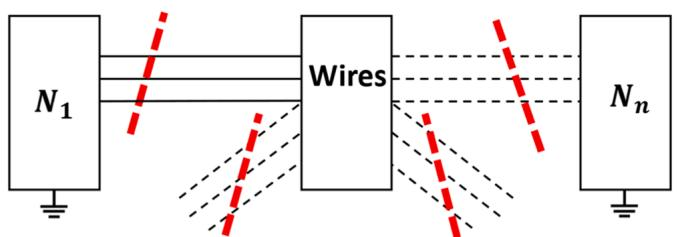  
Fig. 1. CM decoupling into n subnetworks through wires.

$$
\hat {\boldsymbol {A}} ^ {(k)} = \boldsymbol {J} ^ {(k)}
$$

$$
\boldsymbol {B} ^ {(k)} = \boldsymbol {J} ^ {(k)} \boldsymbol {x} ^ {(k)} - \boldsymbol {F} (\boldsymbol {x} ^ {(k)}) \tag {6}
$$

The solution of nonlinear networks used in [18] is based on linearization where each nonlinear device provides a linearized Norton equivalent. In this approach, the matrix A is the Jacobian matrix of network equations. At each iteration, solving Eq. (5) is equivalent to solve Eq. (3).

CM decoupling has the consequence of putting the augmented matrix A into a BBD form by adding compensation or wire currents $i _ { m }$ as extra variables in x. This is equivalent to modeling ideal switches in MANA. Eq. (3) is transformed as follows:

$$
\left[ \begin{array}{c c c c c} A _ {1} & 0 & \dots & 0 & S _ {1} ^ {T} \\ 0 & \ddots & \ddots & \vdots & \vdots \\ \vdots & \ddots & \ddots & 0 & \vdots \\ 0 & \dots & 0 & A _ {n} & S _ {n} ^ {T} \\ S _ {1} & \dots & \dots & S _ {n} & 0 \\ \end{array} \right] \left[ \begin{array}{c} x _ {1} \\ \vdots \\ x _ {n} \\ i _ {m} \end{array} \right] = \left[ \begin{array}{c} b _ {1} \\ \vdots \\ b _ {n} \\ 0 \end{array} \right] \tag {7}
$$

where $\pmb { S _ { i } }$ is a connectivity matrix for interconnecting the subnetworks $N _ { 1 }$ to $N _ { n }$ through wires with zero impedances. Each connectivity matrix is filled out by +1 or − 1 coefficients to write branch/node relations on cutting CM branches.

It can be noticed that extra variable $i _ { m }$ leads to higher matrix dimension. However, as pointed out in [13], with the usage of sparse linear solver, matrix fill-ins (number of non- zeros) matter more than the matrix dimension. With $i _ { m } ,$ a few matrix fill-ins are created while offering a higher tearing flexibility to get better partitions.

Eq. (7) is transformed into its SBBD form to achieve its parallel solution:

$$
\left[ \begin{array}{c c c c c} 1 & 0 & \dots & 0 & C _ {1} \\ 0 & \ddots & \ddots & \vdots & \vdots \\ \vdots & \ddots & \ddots & 0 & \vdots \\ 0 & \dots & 0 & 1 & C _ {n} \\ 0 & \dots & \dots & 0 & C _ {m} \end{array} \right] \left[ \begin{array}{c} x _ {1} \\ \vdots \\ x _ {n} \\ i _ {m} \end{array} \right] = \left[ \begin{array}{c} \widehat {\boldsymbol {b}} _ {1} \\ \vdots \\ \widehat {\boldsymbol {b}} _ {n} \\ \widehat {\boldsymbol {b}} _ {m} \end{array} \right] \tag {8}
$$

The following steps are applied at a given time-point solution.

1. Compute $\widehat { \pmb { b } } _ { i }$ of the SBBD form. Open all wires and solve in parallel for each subnetwork:

$$
\left[ \begin{array}{c c c c c} \boldsymbol {A} _ {1} & 0 & \dots & 0 & 0 \\ 0 & \ddots & \ddots & \vdots & \vdots \\ \vdots & \ddots & \ddots & 0 & \vdots \\ 0 & \dots & 0 & \boldsymbol {A} _ {n} & 0 \\ \boldsymbol {S} _ {1} & \dots & \dots & \boldsymbol {S} _ {n} & - 1 \end{array} \right] \left[ \begin{array}{c} \widehat {\boldsymbol {b}} _ {1} \\ \vdots \\ \widehat {\boldsymbol {b}} _ {n} \\ \widehat {\boldsymbol {b}} _ {m} \end{array} \right] = \left[ \begin{array}{c} \boldsymbol {b} _ {1} \\ \vdots \\ \boldsymbol {b} _ {n} \\ 0 \end{array} \right] \tag {9}
$$

It corresponds to the computation of Thevenin voltages through cutting wires.

2. Find the border matrices $C _ { i } .$ With opened wires, solve in parallel:

$$
\left[ \begin{array}{c c c c c} \mathbf {A} _ {1} & \mathbf {0} & \dots & \mathbf {0} & \mathbf {0} \\ \mathbf {0} & \ddots & \ddots & \vdots & \vdots \\ \vdots & \ddots & \ddots & \mathbf {0} & \vdots \\ \mathbf {0} & \dots & \mathbf {0} & \mathbf {A} _ {n} & \mathbf {0} \\ \mathbf {S} _ {1} & \dots & \dots & \mathbf {S} _ {n} & - \mathbf {1} \end{array} \right] \left[ \begin{array}{c} C _ {1} \\ \vdots \\ C _ {n} \\ C _ {m} \end{array} \right] = \left[ \begin{array}{c} S _ {1} ^ {T} \\ \vdots \\ S _ {n} ^ {T} \\ \mathbf {0} \end{array} \right] \tag {10}
$$

This step deals with the Thevenin impedance computation for each subnetwork.

3. From SBBD form, compute the compensation current vector $\dot { \iota } _ { m } \colon$

$$
C _ {m} \boldsymbol {i} _ {m} = \widehat {\boldsymbol {b}} _ {m} \tag {11}
$$

4. Solve in parallel for $x _ { i }$ with $i \in [ [ 1 , n ] ] ,$ ,

$$
\boldsymbol {x} _ {i} = \widehat {\boldsymbol {b}} _ {i} - C _ {i} \boldsymbol {i} _ {m} \tag {12}
$$

5. The updated $x _ { i }$ are used to recast the linearized Norton equivalents for nonlinear models in Eq. (7);   
6. If a linearization is no longer valid (or for all $x _ { i }$ convergence criteria is not reached), then $\operatorname { E q . } \left( 7 \right)$ is updated with changes and the

solution process goes back to Step-1 after advancing the iteration counter; if not, then convergence is achieved.

7. Advance to next time-point.

# 3. Parallel CM using co-simulation

# 3.1. Parallel CM implementation

The proposed parallel CM implementation uses the co-simulation environment of [5] based on the Functional Mock-up Interface (FMI) standard [15]. A synchronous Master/Slaves co-simulation is adopted to proceed with CM parallelization. Let us take the generic case of Fig. 1 where a network has been decoupled into n subnetworks. In that case, there is one master (subnetwork n) and n-1 slaves (subnetworks from 1 to n-1). Fig. 2 illustrates how CM equations are solved in parallel among the master and its slaves. In the sequential part of the decoupling, the computation of compensation current $i _ { m } ,$ is done within the master. Three points of synchronization (barrier mechanism) are required to exchange data for reaching a simultaneous solution: Thevenin equivalent, compensation current, and iteration status. The linear subnetworks can be temporarily paused, awaiting iteration convergence of the remaining subnetworks.

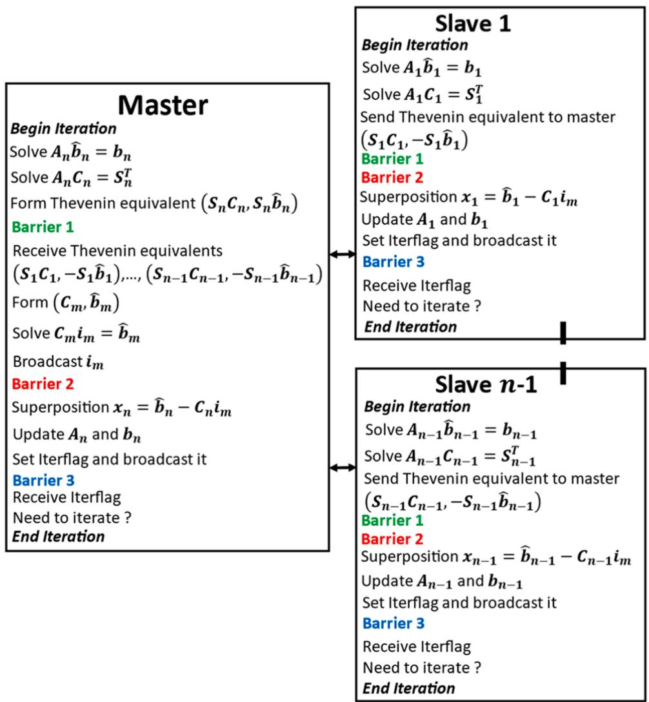  
Fig. 2. Master/Slaves CM decoupling into n nonlinear subnetworks.

# 3.2. Co-simulation architecture with synchronization

The same decentralized Master/Slaves architecture from [5] is kept as depicted in Fig. 3, which involves the use of external dynamic link libraries (DLLs) for co-simulation communication. It allows reusing all automatic procedures from previous works (creation of the DLL device, initialization, etc.). The selection of CM cuts remains manual. In total, for each master/slave communication link, four DLLs are used:

- One Master Device DLL, which has direct access to all CM data from the Master subnetwork (master Thevenin equivalent, compensation current, iteration status).   
- One Master Link DLL which deals with low-level functions related to synchronization and write/read in a shared-memory buffer.   
- In the slave section, there exists the counterpart of master DLLs with identical roles.

There are some important differences with the original implementation of [5]. As the CM solution is simultaneous, no delay should be introduced in the communication scheme. That is why the synchronous mode is selected and only one buffer is necessary to simultaneously exchange data. For the synchronization mechanism, another option has been chosen. Indeed, the number of synchronizations per time-point for CM is much more than with TLM decoupling in [5]. It equals to the number of iterations multiplied by three (Thevenin equivalent, compensation current, iteration status synchronizations) for each Master/Slave link. The use of semaphores (SEM) may not be appropriate if they are called several times per time-point. Instead, a classical barrier mechanism (BARR) is implemented for each Master/Slave link. It consists of atomic operations on a counter located in the shared-memory buffer.

Additionally, unlike [5], some modifications on the software engine (code) are required to adapt the DLL interface. All CM computations are performed in the engine: Thevenin equivalent computations and solution of CM current equations. Extra DLL requests have been added to communicate CM computed data. The modifications maintain the proposed implementation in a manner that is generic and independent of specific software platforms. Indeed, any EMT-type software that has external interfaces, such as DLLs, can be smoothly adapted to support CM parallel co-simulation.

# 3.3. Automatic initialization from load-flow

The principle of automatic initialization from [5] is adapted to fit CM initialization. Fig. 4 depicts the process for two decoupled subnetworks (one master and one slave).

First, a Load-Flow (LF) solution is performed on the complete network before applying the CM decoupling in the master instance. The result of this first run is saved to be read by each slave instance when they are launched. Then, a steady-state solution is performed on each decoupled subnetwork (Master and Slaves). At CM cuts, an ideal current source injects the complex current vector I previously computed in the first run. It compensates for the absence of the other subnetwork which

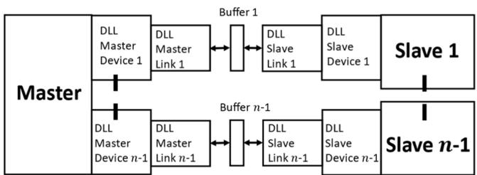  
Fig. 3. Co-simulation architecture with n-1 subnetworks (one master and n-1 slaves).

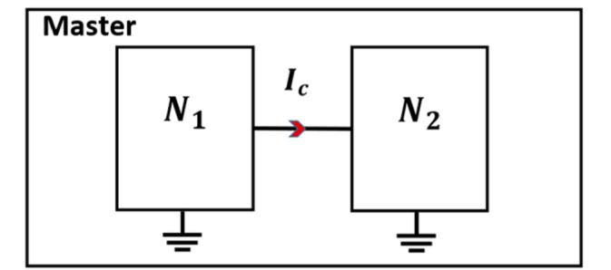

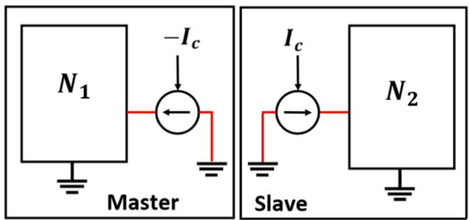  
Fig. 4. Two-run initialization process for two CM decoupled subnetworks.

has been removed from CM decoupling.

# 3.4. An adaptative time-step and order CM

For time-domain simulation, network differential equations are integrated using the Trapezoidal method (TR). Its second order and Astable property offer a good trade-off between accuracy and stability. Let us consider the following scalar ordinary differential equation system:

$$
\frac {d x}{d t} = f (x, t)
$$

$$
x (0) = x _ {0} \tag {13}
$$

After using TR with a Δt time-step, it becomes

$$
x _ {t} = x _ {t - \Delta t} + \frac {\Delta t}{2} \left(f _ {t} + f _ {t - \Delta t}\right) \tag {14}
$$

However, when some discontinuities occur during the simulation (e. g., faults or changes in nonlinear segments), historical terms from nonstate variables $( f _ { t - \Delta t } )$ can introduce numerical oscillations. To address this in [17], when a discontinuity is detected, the TR method switches to the Backward Euler (BE) method with a $\Delta t / 2$ time-step for two steps before returning to the standard TR method and Δt time-step. The BE method only includes historical terms from state variables $( x _ { t - \Delta t } )$ which prevents numerical oscillations.

$$
x _ {t} = x _ {t - \Delta t} + \frac {\Delta t}{2} f _ {t} \tag {15}
$$

In CM for having the same time-step and method order across subnetworks, it is necessary to synchronize them on discontinuities detection. Whenever a discontinuity is detected, all subnetworks switch from the TR method to the BE method. To enable this adaptative time-step and order CM, a fourth synchronization point is introduced at the detection of discontinuities, after solving the network and control equations.

# 4. Performance analysis

In this section, the proposed new co-simulation setup is tested on two IBR networks where it is not possible to directly use line-delays for parallel decoupling. The following techniques are compared:

1. CM is the compensation method.   
2. SEQ is the sequential solution without any decoupling.   
3. CMX means that X subnetworks decoupled by CM are run in cosimulation instances on X separates cores, one master and X-1 slaves.   
4. SL is the stub-line method which adds an artificial delay for decoupling.   
5. SLX is the parallel decoupling into X subnetworks by using stub-lines.   
6. CMX+SEM is CM method with semaphore-based synchronizations decoupling X subnetworks.   
7. CMX+BARR is CM method with barrier-based synchronization using atomic operations decoupling X subnetworks. If no synchronization mechanism is mentioned (CMX), BARR is used by default.

For precision comparisons, the relative numerical error between a reference solution vector f and a given solution ̃f is used. It is calculated using the 2-norm:

$$
e \% = 100 \times (\| \tilde {\boldsymbol {f}} - \boldsymbol {f} \| _ {2} / \| \boldsymbol {f} \| _ {2}) \tag{16}
$$

SEQ is the accuracy reference for all methods. For SL, the stub-lines are set to 1 mH with a small resistance (1e-5 Ω). Then, the capacitance value is computed accordingly to create a one time-step delay for parallel decoupling. It is always possible to optimize the selection of parameters to reduce error, but this approach remains error-prone and is not acceptable. Moreover, it requires case-by-case user intervention, which is not an obvious process and may cause other issues.

All tests have been performed with the following architecture: 64 cores with 128 logical processors, AMD Ryzen Threadripper PRO 5995WX @ 2.70 GHz. The Trapezoidal method (TR) is used as the default integration technique. For the test case 0given below, the switching integration technique (TR+BE) between the TR and BE methods is employed to handle discontinuities.

# 4.1. Nonlinear distribution network with wind power generation

This test case, depicted in Fig. 5, is a modified version of the IEEE-34 benchmark with high penetration of wind power generation. Four Full-Scale Converter (FSC) wind parks have been added at the 24.9 kV voltage level, along with two asynchronous machines. For each park, a generic aggregated model [20] of five 1.5 MW wind turbine units is used. Average value models are used for wind park converters and each park controller is set in Q-mode with Q = 0. In total, this test cases contains 473 electrical nodes. The summary of main 3-phase

components is:

- AC voltage sources with impedance: 5   
- Controlled current or voltage sources: 32   
- Asynchronous machines: 2   
- Permanent magnet synchronous machines (wind turbines): 4   
- RLC branches: 304   
- PI/RL coupled branches: 49   
- Switches (ideal and controlled): 172   
- Nonlinear devices (resistance and inductance): 15   
- Control system blocks 4141.

Nonlinearities are from transformer saturation modeling (nonlinear inductances), wind turbine DC choppers (nonlinear resistance models for diodes), and machine iterations with network equations. A piecewise linear characteristic is used for nonlinear devices.

During a simulation of 25 s with a 50 μs time-step, a 100 ms three phrase-to-ground fault occurs in the WP1 connection point at t = 12 s. In this distribution network, the line sections are very short and modeled with PI-sections. Consequently, there is no option for TLM decoupling. The CM is used to parallelize the simulation. Fig. 5 shows an IBR-based tearing where each wind park is run in a slave or master instance on a separate core. The simulation is automatically initialized from the LF solution. Master and Slave networks are nonlinear and must iterate simultaneously during CM computation.

Table 1 displays the performances obtained with progressive IBRbased CM tearing on the parallelization of the test case. Also, the relative numerical error of WP1 active power near the fault is displayed in the last column. The average number of iterations per time-point is 3.03 to solve nonlinearities.

Figs. 6 and 7 present the active and reactive powers of WP1 during the fault for SL2, SEQ, and CM5, methods. For SL2, just one stub-line has been added at WP1 connection point for decoupling. Fig. 8 displays

Table 1 CM performance, modified IEEE-34 benchmark.   

<table><tr><td>Δt = 50 μs, 25 s simulation</td><td>Time (s)</td><td>Speed-up</td><td>e%</td></tr><tr><td>SEQ (1 core)</td><td>324.31</td><td>1</td><td>0</td></tr><tr><td>CM2 (2 cores)</td><td>267.53</td><td>1.21</td><td>7.5e-3</td></tr><tr><td>CM3 (3 cores)</td><td>200.44</td><td>1.62</td><td>7.3e-3</td></tr><tr><td>CM4 (4 cores)</td><td>132.22</td><td>2.45</td><td>7.7e-3</td></tr><tr><td>CM5 (5 cores)</td><td>98.34</td><td>3.30</td><td>7.2e-3</td></tr></table>

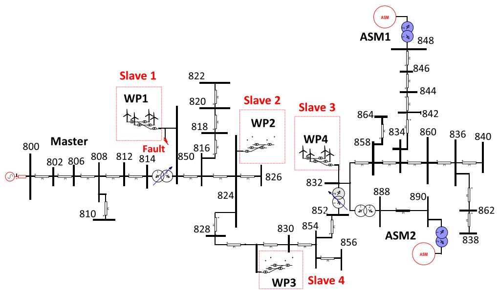  
Fig. 5. Master/Slave CM decoupling of the modified IEEE-34 benchmark with high penetration of wind power generation.

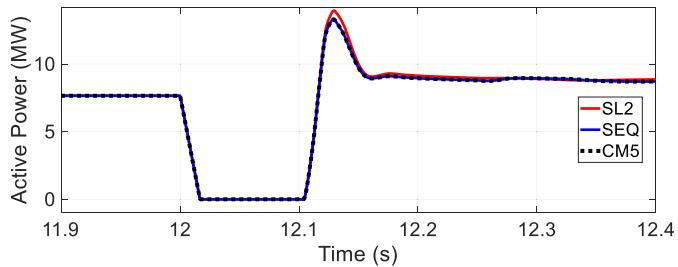  
Fig. 6. Active power of WP1 park during the fault for SL2 and CM5, compared to reference solution SEQ.

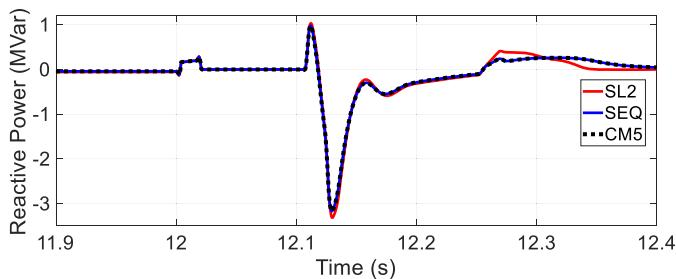  
Fig. 7. Reactive power of WP1 park during the fault for SL2 and CM5, compared to reference solution SEQ.

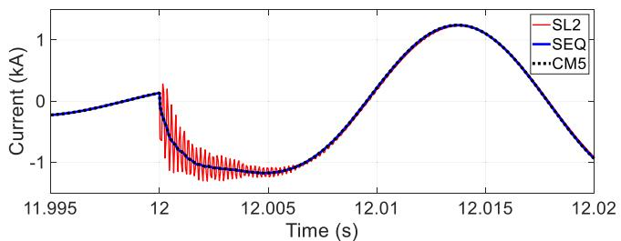  
Fig. 8. Phase-c current at WP1 connected point when the fault starts for different decoupling methods (SL2 and CM5), and the reference SEQ.

instantaneous fault current values when the fault starts for both decoupling methods. Fig. 9 illustrates the impact of TR+BE on numerical oscillations in the instantaneous fault current values following the detection of discontinuities (i.e., when the fault starts).

These results indicate that the CM with intuitive IBR-based tearing is a scalable solution for achieving speed-ups, in this case, dealing with nonlinear models while maintaining good accuracy. In contrast, the use of SL decoupling located at the CM cuts does not yield accurate results, as fictitious L-C values create numerical oscillations. Moreover, an adaptative time-step and order CM using the TR+BE integration method damps oscillations while providing good parallelization performance. BARR synchronization is essential, improving performance over SEM. CM5+BARR is 2.7 times faster than CM5+SEM. Indeed, since the CM

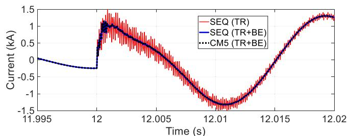  
Fig. 9. Phase-a current at WP1 connected point when the fault starts for SEQ with different integration and decoupling methods.

requires significantly more synchronization points that increase with iterations and the detection of discontinuities, multiple calls to SEM can slow down the simulation for CM decoupling.

# 4.2. Detailed wind park modelling

Another application of CM decoupling is the detailed modeling of a wind park without aggregation. This detailed modeling provides a higher accuracy for dynamic studies. Previous works [5,22] have shown that computation time can be a bottleneck. Not all cables within a park are long enough for parallel decoupling through natural propagation delays. For this modeling, CM is a generic solution for parallelization while keeping good accuracy. The test case is taken from [21]. It contains 45 units of full converter wind turbines of 1.5 MW each. They are distributed on three feeders. As depicted in Fig. 10, the wind park is connected to a small 120 kV network. Average value modeling is used to represent wind turbine converters. In total, this test case contains 3619 electrical nodes. The summary of the main 3-phase components is:

- AC voltage sources with impedance: 46,   
- Controlled current or voltage sources: 330,   
- Permanent magnet synchronous machines (wind turbines): 45   
- RLC branches: 2778   
- CP line/cable: 5   
- Switches (ideal and controlled): 1602   
- Nonlinear devices (resistance, inductance, arrester): 195   
- Control system blocks 55,387.

In addition to the previous test case, the nonlinearities are due to the piecewise exponential modeling of wind park arresters. During a simulation of 4 s with a 50 μs time-step, a 100 ms three phrase-to-ground fault occurs within the Wind Park at t = 2 s. The simulation is automatically initialized from the LF solution.

Fig. 11 shows the Master/Slave tearing setup with the CM and the fault location. Eight cores are used with one master and seven slaves. Table 2 displays the performance results. The last column also displays the relative numerical error of the park’s active power. To solve nonlinearities, the average number of iterations per time-point is 2.09. The CM decoupling provides substantial speed-ups and a scalable parallel solution. The speed-up increases significantly with the number of cores and can reach 6 with eight cores with CM8 decoupling. Good accuracy is maintained with a relative error below 0.05 %.

Figs. 12 and 13 confirm the higher accuracy of CM toward the SL decoupling. As in the previous examples, only one stub-line near the fault (SL2 decoupling) is enough to degrade the accuracy, whereas with seven CM cuts used in CM8, a good superposition with SEQ is obtained.

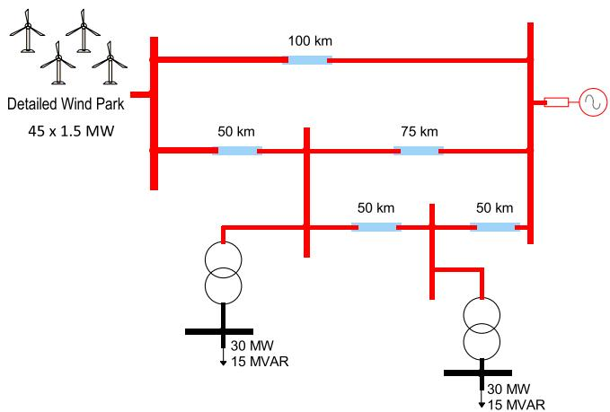  
Fig. 10. Detailed wind park test case.

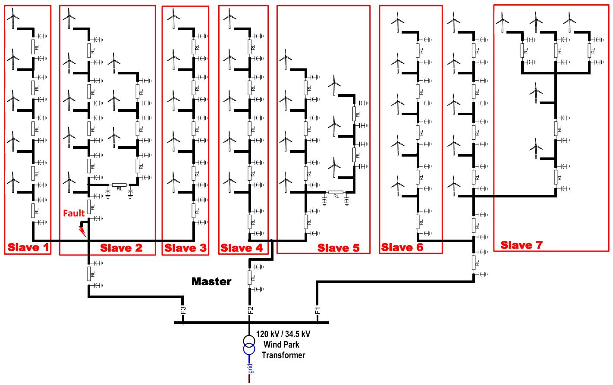  
Fig. 11. Master/Slave CM decoupling of a detailed wind park model.

Table 2 CM performance, detailed wind park modelling.   

<table><tr><td>Δt = 50 μs, 4 s simulation</td><td>Time (s)</td><td>Speed-up</td><td>e%</td></tr><tr><td>SEQ (1 core)</td><td>1091.11</td><td>1</td><td>0</td></tr><tr><td>CM2 (2 cores)</td><td>970.21</td><td>1.13</td><td>0.006</td></tr><tr><td>CM3 (3 cores)</td><td>732.92</td><td>1.49</td><td>0.008</td></tr><tr><td>CM4 (4 cores)</td><td>591.63</td><td>1.84</td><td>0.018</td></tr><tr><td>CM5 (5 cores)</td><td>491.94</td><td>2.22</td><td>0.007</td></tr><tr><td>CM6 (6 cores)</td><td>333.97</td><td>3.28</td><td>0.017</td></tr><tr><td>CM7 (7 cores)</td><td>228.97</td><td>4.77</td><td>0.020</td></tr><tr><td>CM8 (8 cores)</td><td>181.30</td><td>6.02</td><td>0.040</td></tr></table>

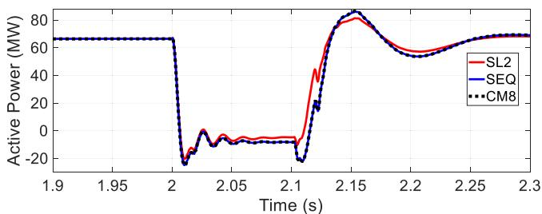  
Fig. 12. Active power of the park during a fault, SL2 and CM8 are compared to reference solution SEQ.

# 4.3. Analysis of results

In all test cases, CM decoupling using IBR-based manual tearing demonstrates substantial speedup, proving to be effective for nonlinear IBR networks. As CM steps involve many more synchronization points, the usage of SEM is prohibitive and must be replaced by barriers with

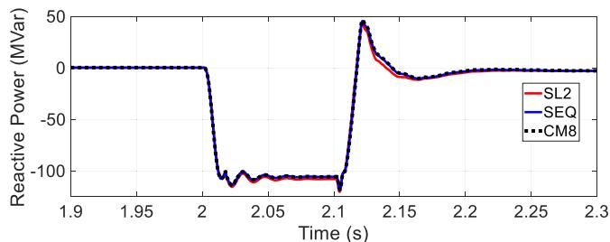  
Fig. 13. Reactive power of the park during a fault, SL2 and CM8 are compared to reference solution SEQ.

# atomic operations.

It can be noticed that speed-ups are not as important as those ach ieved in [5] with TLM decoupling. This is because the CM involves more computation steps than TLM decoupling. However, the CM eliminates possible accuracy problems created by SL decoupling when no lines or lines of sufficient length exist. As depicted earlier, artificial delays introduced by SLs can diminish accuracy and can lead to numerical oscillations or even significantly inaccurate simulation results. One can integrate TLM decoupling and CM methods for a specific network to capitalize on the advantages of both decoupling methods. For example, a transmission network can be decoupled using TLM whenever possible. However, if TLM decoupling is not feasible for a particular IBR, the CM method can be employed instead.

# 5. Conclusion

This paper has presented a new compensation method (CM) implementation via a co-simulation setup to parallelize electromagnetic transient simulations. The CM has been adapted to the MANA

formulation for nonlinear networks. The complete system simulation is initialized from the load-flow solution. A new barrier-based synchronization mechanism has been introduced to improve the performance of several inter-time-point synchronizations. The presented implementation is generic and can be reused for any other EMT-type software.

The efficiency of the new CM-based accurate simulation method has been demonstrated on practical test systems involving IBRs. The CM eliminates the need to resort to stub-lines for creating artificial delays that cause numerical errors. Leveraging CM-based tearing to distribute resource-intensive IBR computations across distinct CPUs is a scalable solution, accelerating the simulation of networks with significant integration of renewable sources.

This paper presents new capabilities for the EMT-type simulation approach and offers new solutions demonstrated on practical benchmarks. New levels are reached for generic networks.

# CRediT authorship contribution statement

Boris Bruned: Validation, Investigation, Writing – review & editing, Visualization, Writing – original draft, Software, Conceptualization, Methodology. Mehdi Ouafi: Writing – review & editing, Software, Writing – original draft, Investigation, Validation, Conceptualization. Jean Mahseredjian: Writing – review & editing, Writing – original draft, Conceptualization. Sebastien ´ Dennetiere: ` Validation, Writing – review & editing, Writing – original draft, Conceptualization.

# Declaration of competing interest

The authors declare that they have no known competing financial interests or personal relationships that could have appeared to influence the work reported in this paper.

# Data availability

Data will be made available on request.

# References

[1] V.Q. Do, J.-C. Soumagne, G. Sybille, G. Turmel, P. Giroux, G. Cloutier, S. Poulin, Hypersim, an integrated real-time simulator for power networks and control systems, in: Proc. ICDS’99, Vasteras, Sweden, 1999, pp. 1–6.   
[2] Forsyth, R. Kuffel, Utility applications of a RTDS Simulator, in: Proc. Int. Power Eng. Conf, 2007, pp. 112–117.

[3] R. Singh, A.M. Gole, P. Graham, J.C. Muller, R. Jayasinghe, B. Jayasekera, D. Muthumuni, Using local grid and multi-core computing in electromagnetic transients simulation, in: Proc. Int. Conf. Power Syst. Transients (IPST), Vancouver, Canada, 2013, pp. 1–6.   
[4] A. Abusalah, O. Saad, J. Mahseredjian, U. Karaagac, I. Kocar, Accelerated sparse matrix-based computation of electromagnetic transients, IEEE Open Access J. Power Energy 7 (2020) 13–21.   
[5] M. Ouafi, J. Mahseredjian, J. Peralta, H. Gras, S. Denneti`ere, B. Bruned, Parallelization of EMT simulations for integration of inverter-based resource, Elect Power Syst. Res. 223 (2023).   
[6] J.R. Marti, L.R. Linares, J.A. Hollman, F.A. Moreira, OVNI: integrated software/ hardware solution for real-time simulation of large power systems, in: Proc. Power Syst. Comp. Conf. (PSCC), Sevilla, Spain, 2002, pp. 1–7.   
[7] C. Dufour, J. Mahseredjian, J. B´elanger, A combined State-space nodal method for the simulation of power system transients, IEEE Trans. Power Deliv. 26 (2) (2011) 928–935.   
[8] T. Maguire, Multi-processor cholesky decomposition of conductance matrices, in: Proc. Int. Conf. Power Syst. Transients (IPST), Delft, Netherlands, 2011, pp. 1–7.   
[9] B. Bruned, S. Denneti`ere, J. Michel, M. Schudel, J. Mahseredjian, N. Bracikowski, Compensation method for parallel real-time EMT studies, Elect. Power Syst. Res. 198 (2021).   
[10] B. Bruned, J. Mahseredjian, S. Denneti`ere, J. Michel, M. Schudel, N. Bracikowski, Compensation method for parallel and iterative real-time simulation of electromagnetic transients, IEEE Trans. Power Del. 38 (4) (2023) 2302–2310.   
[11] W.F. Tinney, Compensation methods for network solutions by optimally ordered triangular factorization, IEEE Trans. Power App. Syst. PAS-91 (1) (1972) 123–127.   
[12] O. Alsac, B. Stott, W.F. Tinney, Sparsity-oriented compensation methods for modified network solutions, IEEE Trans. Power App. Syst. PAS-102 (5) (1983) 1050–1060.   
[13] F.M. Uriarte, On Kron’s diakoptics, Elect. Power Syst. Res. 88 (2012) 146–150.   
[14] J. Mahseredjian, B. Bruned, A. Abusalah, Compensation method, diakoptics and MATE, IEEE Access 13 (2025) 129534–129538, https://doi.org/10.1109/ ACCESS.2025.3589280.   
[15] MODELISAR Consortium, Functional mock-up interface for co-simulation, ITEA 2 (2010) 07006.   
[16] S. Montplaisir-Gonçalves, J. Mahseredjian, O. Saad, X. Legrand, A. El-Akoulm, A semaphore-based parallelization of networks for electromagnetic transients, in: Proc. Int. Conf. Power Syst. Transients (IPST), Cavtat, Croatia, 2015, pp. 1–6.   
[17] J. Mahseredjian, S. Denneti`ere, L. Dub´e, B. Khodabakhchian, L. G´erin-Lajoie, On a new approach for the simulation of transients in power systems, Elect. Power Syst. Res. 77 (11) (2007) 1514–1520.   
[18] J. Mahseredjian, U. Karaagac, S. Dennetiere, H. Saad, Simulation of electromagnetic transients with EMTP-RV, in: A. Ametani (Ed.), Numerical Analysis of Power System Transients and Dynamics, Institution of Engineering and Technology (IET), 2015, pp. 103–134.   
[19] J. Marti, J. Lin, Suppression of numerical oscillations in the EMTP, IEEE Trans. Power Syst. 4 (2) (1989) 739–746.   
[20] U. Karaagac, et al., A generic EMT-type model for wind parks with permanent magnet synchronous generator full size converter wind turbines, IEEE Power Energy Tech. Syst. J. 6 (3) (2019) 131–141.   
[21] U. Karaagac, J. Mahseredjian, H. Gras, H. Saad, J. Peralta, and L.D. Bellomo, “Doubly-fed induction generator-based wind park models in EMTP,” Polytechnique. Montr´eal, Internal report, 2017.   
[22] M. Ouafi, Parallelization of EMT solution for integration of IBR in large scale transmission grids, in: Contributions CIGRE Session, Paris, 2022, pp. 1–2.