Received 9 January 2026, accepted 1 February 2026, date of publication 6 February 2026, date of current version 11 February 2026.

Digital Object Identifier 10.1109/ACCESS.2026.3661338

# RESEARCH ARTICLE

# Multirate Method for Dynamic Phasor Simulation of Large-Scale Power Systems

THIAGO JOSÉ BARBOSA DA ROCHA 1,2, SERGIO GOMES JR. 1,2, (Senior Member, IEEE), TIAGO SANTANA DO AMARAL 2, AND LEONARDO PINTO DE ALMEIDA 2

1Universidade Federal Fluminense, Niterói, Rio de Janeiro 24210-240, Brazil

2Centro de Pesquisas de Energia Elétrica, Rio de Janeiro 21941-911, Brazil

Corresponding author: Sergio Gomes Jr. (sergiogomes@id.uff.br)

This work was supported in part by the Coordenação de Aperfeiçoamento de Pessoal de Nível Superior-CAPES (ROR identifier: 00 × 0ma614) for the Article Processing Charge (APC), in part by the Conselho Nacional de Desenvolvimento Científico e Tecnológico (CNPq), and in part by the Centro de Pesquisas de Energia Elétrica (CEPEL).

ABSTRACT Dynamic phasor simulations can be used for the analysis of transient stability (TS) of power systems, considering the influence of fast response equipment such as HVDC converters, FACTS and IBR (Inverter Based Resources). For reliable simulation with fast response equipment, electromagnetic transients (EMT) of the AC network must be accurately modeled. Dynamic phasor simulations are used to solve tightly coupled dynamics from microsecond electromagnetic phenomena to second-scale electromechanical oscillations. The single-rate time step requires the entire model to utilize the smallest interval necessary for accuracy, which can substantially increase runtime. This work proposes a multirate method for a dynamic phasor simulation, where the slowest machine variables and their controllers use a large time step, while the remaining variables use the regular EMT time step. The proposed scheme does not require co-simulation involving EMT and TS models. In fact, fast dynamics are considered for the entire system, with large time steps for the variables and equations with slow dynamics. Coupling is performed by interpolation of slow variables at the fast equations and averaging the fast variables at the slow equations. The mismatches verification at slow steps decides whether to accept or undo the step and recalculate fast time steps with improved estimates of slow variables. The method was incorporated into a dynamic phasor simulator and validated on a benchmark of the Brazilian power system. The results demonstrate significant reductions in runtime while maintaining high fidelity in capturing both slow and fast dynamics during transients.

INDEX TERMS Multirate, dynamic phasors, electromagnetic transients, computational efficiency, power system simulation, power system dynamics.

# I. INTRODUCTION

Power systems consist of many interconnected components distributed over a wide area designed to convert primary energy into electricity and deliver it with high reliability, quality, and efficiency. Their dynamics are governed by coupled nonlinear differential-algebraic equations, spanning time scales from microseconds (electromagnetic transients, switching events) to seconds (electromechanical oscillations, governor responses). This disparity poses a fundamental

The associate editor coordinating the review of this manuscript and approving it for publication was Xiaodong Liang

computational challenge: simulating these strongly coupled, multirate dynamics both efficiently and with fidelity.

To address this fundamental challenge, power system dynamic simulations have traditionally been conducted using two main types of computational programs: electromagnetic transients (EMT) and transient stability (TS). EMT tools model a region of interest in great detail, solving the network and device equations with a small time step to reproduce electromagnetic waveforms and fast interactions among devices and the transmission system [1]. TS tools, on the other hand, are used primarily to analyze the impact of low-frequency dynamics on system stability. The power system is usually fully represented, but the models are simplified omitting high

frequency dynamics, and the network is represented by algebraic equations involving positive-sequence phasors. TS tools capture general slow dynamics including electromechanical oscillations, while neglecting EMT [2].

However, the rapid growth of power electronics in modern power systems – including HVDC transmission, flexible AC transmission systems (FACTS), and inverter-based resources (IBRs) based on wind and solar generation – has increased the need for high-fidelity dynamic models in large-scale studies [3], [4]. In such systems, the simplified network representation adopted in conventional TS programs is no longer adequate, and three-phase EMT models become necessary to accurately represent fast electromagnetic interactions.

Hybrid EMT-TS simulations have therefore emerged as a compromise solution, initially proposed for simulation of AC/DC transmission [5]. In this approach, a region of interest is represented by an EMT model, while the external network is modeled using TS-type phasor equations, with appropriate interface conditions between the two domains. When the EMT and TS regions are implemented in different programs or different solvers, the term ‘‘co-simulation’’ is often used. Hybrid approaches enable fast dynamics to be studied inside the detailed EMT region, including IBRs [6], while preserving a large-scale representation for electromechanical behavior. Nevertheless, they face several difficulties: maintaining the accuracy of interface variables at boundary buses, ensuring consistent steady state initialization for both subsystems, and limiting fast dynamics to the EMT region. When power electronic devices are widely distributed, the EMT region must be extended over a large part of the system, which reduces the advantages of hybrid simulation.

Dynamic phasor (DP) models offer an attractive alternative for representing both EMT and electromechanical behavior in a unified framework. Their theoretical foundations can be traced back to the Generalized Averaging Method (GAM) proposed in [7], which represents a waveform x(t) by time-varying Fourier coefficients whose magnitudes and phases encode the harmonic content within a sliding window. These complex coefficients, later called dynamic phasors, extend the idea of conventional phasors by letting their magnitude and phase change over time, which allows them to follow slow changes in the underlying waveforms. This framework was subsequently extended to model unbalanced polyphase circuits [8]. Other work [9] develops a synchronous machine model using Shifted Frequency Analysis (SFA), a dynamic phasor-based method for efficient simulation of power system dynamics using only the fundamental frequency phasor, without harmonics. Over time, an increasing number of papers can be seen delving into applications of dynamic phasors in power systems, such as the modeling of FACTS devices, modular multilevel converters (MMCs), and HVDC links, among others [10], [11], [12], [13], [14], [15], [16]. However, applying uniformly a small time step to all DP variables in a large-scale system leads to a significant computational burden.

To alleviate this burden, multirate methods can be used. The mathematical foundations for applying these methods to systems with components evolving at different speeds were established in the 1970s [17] and later adapted for power systems [18], [19], [20], [21]. However, in practice, the application of multirate concepts to DP models has largely followed the co-simulation paradigm. Several frameworks combine DP and EMT models, solving DP subsystems with larger time steps and EMT subsystems with smaller ones [22], [23]. More recently, in [24] a multirate framework is proposed that combines EMT, base-frequency DP, DP and TS solvers within a co-simulation architecture.

Collectively, these works embed dynamic phasors firmly within the paradigm of hybrid multi-solver co-simulation, which relies on explicit interfaces and model partitioning. This stands in direct contrast to the unified multirate approach proposed in this paper, which operates entirely within a single DP representation of the entire system. To the best of the authors’ knowledge, there is currently no multirate scheme in the context of DP that (i) operates entirely within a DP representation of a large-scale power system and (ii) avoids EMT-TS co-simulation or other hybrid partitioning.

The present work addresses this gap by applying a multirate algorithm directly to a DP model of the entire system. The EMT behavior of the network is fully represented within the DP formulation using the same small time step for the fast equations, while larger time steps are employed for slow equations associated with power plants and their controllers, without significant loss of accuracy. This substantially reduces the computational effort required for the machine and controller equations.

The paper makes two main contributions:

• Methodological contribution: a multirate algorithm embedded in a DP formulation that captures electromagnetic and electromechanical transients throughout a large-scale power system. This differs from previous DP-EMT co-simulations and multirate TS approaches, which rely on hybrid models or external interfaces.   
• Application and scalability: validation of the proposed method on a 10,000+-bus real system (the Brazilian national grid), demonstrating that the multirate DP formulation scales to system sizes beyond those reported in existing DP-based or multirate power system studies.

This paper is organized as follows: Section I introduces the paper; Section II provides a description of dynamic phasors; Section III reviews the machine equations; Section IV classifies the machine equations according to their dynamics; Section V explains the proposed multirate algorithm, illustrated with a simple example; Section VI describes the application of the multirate method to a dynamic phasor computational program; Section VII presents results in a small test system; Section VIII presents results in a large scale power system; and Section IX concludes. The Appendix provides the algorithms for the single-rate and multirate methods presented in Section V.

# II. DYNAMIC PHASORS

Classical (static) phasors are defined as complex values representing a sinusoidal function with constant amplitude, angular frequency, and phase [25]. They are useful as an alternative way of representing the variables in the steady state solution of linear ordinary differential equations with the input variables being sinusoids of time, such as in ac power system, thereby simplifying calculations.

However, transients cannot be represented by static phasors. In this sense, phasors were not considered at all in the first works regarding electromagnetic transients, although the concept of time variant phasors were used for TS considering them as a sequence of steady state solutions along the time period of slow varying electromechanical oscillations [26].

The classical work of Dommel proposed a companion model composed of a current source in parallel with a resistor to represent power system elements, including nonlinear and time-varying components, and using trapezoidal integration [27]. The original model was developed in the time domain using the instantaneous values of variables, and the methodology is used in production-grade software.

An alternative to the traditional approach of Dommel is to use the companion model with dynamic phasors [28], [29], [30]. This strategy also lies in the time domain, although it uses a phasor representation instead of an instantaneous one. Based on Fourier series, the variables of power system steady state may be represented by periodic functions as follows [31]:

$$
f (x) = \sum_ {n = 0} ^ {\infty} \left[ A _ {n} \cos \left(\frac {n \pi x}{L}\right) \right] + \sum_ {n = 1} ^ {\infty} \left[ B _ {n} \sin \left(\frac {n \pi x}{L}\right) \right] \tag {1}
$$

where $A _ { n }$ and $B _ { n }$ are constant coefficients.

However, Equation (1) can be adapted to represent transient condition, as shown in (2). It can be observed that the constant coefficients have become time-varying coefficients [7], [8] [10], [32].

$$
f (t) = \sum_ {h = 0} ^ {\infty} \left[ F _ {h _ {R e}} (t) \cos (h \omega t) - F _ {h _ {l m}} (t) \sin (h \omega t) \right] \tag {2}
$$

where h is a positive integer index corresponding to the orders of the harmonic components, and ω is the nominal angular frequency of the system.

Equation (2) shows how a function f (t), which represents an instantaneous signal in the time domain, can be equivalently represented in terms of dynamic phasors, also in the time domain, but in a phasor representation. During the transient period, the coefficients in (2) vary with time; however, once steady state is reached, the coefficients become constant again. As a result, an alternative representation for the EMT analysis is provided.

Dynamic phasors are commonly represented in their complex form [10], [15]:

$$
\tilde {F} _ {h} (t) = F _ {h _ {R e}} (t) + j F _ {h _ {I m}} (t) \tag {3}
$$

where $\tilde { F } _ { 1 } \left( t \right)$ is the fundamental frequency dynamic phasor (FFDP) and the other $\tilde { F } _ { h } \left( t \right)$ , for $h \neq 1$ , are the harmonic dynamic phasors of harmonic order h.

In complex form, the original function can be obtained from the real projection of the dynamic phasors multiplied by the exponential of jhωt, given in (4) [12], which yields (2) [10].

$$
f (t) = R e \left\{\sum_ {h = 0} ^ {\infty} \left[ \tilde {F} _ {h} (t) e ^ {j h \omega t} \right] \right\} \tag {4}
$$

One should note that dynamic phasor representation transform each system variable in n phasors with real and imaginary components, being n the number of harmonics considered. Therefore, the dynamic phasors cannot be defined by a traditional algebraic transformation. From the phasors, the original variable can be determined by (2), but the reverse is not unique [10]. A possible approach for defining the phasors is the integral of GAM applied to the sliding window of the past fundamental period [7], [8]. In this case, harmonics are considered, and the truncation of the harmonics will introduce an approximation.

In linear systems no harmonics are present in steady state, and the FFDP can represent the dynamics without harmonic truncation. The validity of representing the original variable by a FFDP can be justified by the Hilbert Transform, as in [9] and [28], originating the SFA model.

Harmonics are generated by nonlinear elements that are supplied with alternating voltages, which is the case of power electronics. In general, the main dynamics of these devices are usually well captured using FFDP models, with EMT of transmission system preserved without approximations. Including harmonics may enhance accuracy but adds significant computational burden. Therefore, their inclusion is only justified when a detailed analysis of harmonic dynamics is specifically required.

The results presented in Sections VII and VIII of this paper are based exclusively on FFDP models. Under the classical sliding window implementation of GAM, even purely linear systems can exhibit harmonic dynamic phasors during transient, because the Fourier expansion over a sliding window naturally generates harmonic components when a transient is applied. In contrast, in this work, the FFDP model can accurately reproduce the complete transient waveform of the systems under study [10], [28].

The property of linear independency of functions sine and cosine is used to obtain the dynamic phasor model without approximations regarding EMT [29], [30], [32], as will be illustrated with a simple example of a RL circuit, shown in Fig. 1.

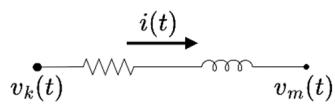  
FIGURE 1. RL circuit.

The circuit can be described as:

$$
v (t) = R i (t) + L \frac {d i (t)}{d t} \tag {5}
$$

where $\nu \left( t \right) = \nu _ { k } \left( t \right) - \nu _ { m } \left( t \right)$

Applying the trapezoidal rule to (5) and writing current as a function of voltage and past values of current and voltage, the following companion circuit is obtained [27]:

$$
i (t) = g v (t) + i _ {h} (t) \tag {6}
$$

$$
i _ {h} (t) = g v (t - \Delta t) + k i _ {h} (t - \Delta t) \tag {7}
$$

where the conductance g and the constant k are given by:

$$
g = \frac {1}{\frac {2 L}{\Delta t} + R} \tag {8}
$$

$$
k = g \left(\frac {2 L}{\Delta t} - R\right) \tag {9}
$$

The previous equations can be written in terms of real and imaginary parts of FFDPs for v(t) and i(t), according to (2):

$$
v (t) = V _ {R e} (t) \cos (\omega t) - V _ {I m} (t) \sin (\omega t) \tag {10}
$$

$$
i (t) = I _ {R e} (t) \cos (\omega t) - I _ {I m} (t) \sin (\omega t) \tag {11}
$$

Substituting equations (10) and (11) into (5) yields (12), expressed in terms of the real and imaginary components of the dynamic phasors.

$$
\begin{array}{l} V _ {R e} (t) \cos (\omega t) - V _ {I m} (t) \sin (\omega t) \\ = R \left(I _ {R e} (t) \cos (\omega t) - I _ {I m} (t) \sin (\omega t)\right) \\ + L \frac {d}{d t} \left(I _ {R e} (t) \cos (\omega t) - I _ {I m} (t) \sin (\omega t)\right) \tag {12} \\ \end{array}
$$

The chain rule is then applied to (12):

$$
\begin{array}{l} V _ {R e} (t) \cos (\omega t) - V _ {I m} (t) \sin (\omega t) \\ = R I _ {R e} \cos (\omega t) - R I _ {I m} \sin (\omega t) + L \frac {d I _ {R e}}{d t} \cos (\omega t) \\ - \omega L I _ {R e} \sin (\omega t) - L \frac {d I _ {I m}}{d t} \sin (\omega t) - \omega L I _ {I m} \cos (\omega t) \tag {13} \\ \end{array}
$$

Sine and cosine are linearly independent functions. Therefore, (13) can be written as a system of two equations:

$$
\begin{array}{l} V _ {R e} = R I _ {R e} + L \frac {d I _ {R e}}{d t} - \omega L I _ {I m} \\ V _ {I m} = R I _ {I m} + \omega L I _ {R e} + L \frac {d I _ {I m}}{d t} \tag {14} \\ \end{array}
$$

The linear independence of sine and cosine functions enabled the conversion of a single equation involving instantaneous values into two equations that describe the real and imaginary components of the corresponding FFDPs. The same could be applied considering harmonics, where the terms of sine and cosine functions of different harmonic orders are linearly independent as well, and each equation in terms of instantaneous variables could be transformed into 2n equations in terms of real and imaginary parts of the harmonic dynamic phasors.

The complex notation can also be used for a compact form:

$$
\tilde {V} (t) = \left(R + j \omega L\right) \tilde {I} (t) + L \frac {d \tilde {I} (t)}{d t} \tag {15}
$$

where $\tilde { V } \left( t \right) = V _ { R e } + j V _ { I m }$ and $\tilde { I } \left( t \right) = I _ { R e } + j I _ { I m }$ . The original values can be obtained from the real projection of the dynamic phasor in complex form:

$$
v (t) = R e \left[ \tilde {V} (t) e ^ {j \omega t} \right] = V _ {R e} (t) \cos (\omega t) - V _ {I m} (t) \sin (\omega t) \tag {16}
$$

Comparing (15) and (5), the dynamic phasor model can be directly obtained by replacing the variables for their corresponding phasors and substituting the derivative $\frac { d i } { d t }$ for $\begin{array} { r } { j \omega \tilde { I } \left( t \right) + \frac { d \tilde { I } ( t ) } { d t } } \end{array}$ [28], as given in (17).

$$
f (t) = \frac {d i}{d t} \Rightarrow \tilde {F} (t) = j \omega \tilde {I} (t) + \frac {d \tilde {I} (t)}{d t} \tag {17}
$$

Therefore, the companion model in (6)-(9) is readily obtained adding jωL to terms containing R, as shown by the correspondence between (5) and (15). The conductance g in (8) was substituted for a complex admittance Y and the constant k in (9) for a complex K .

$$
\tilde {I} (t) = Y \tilde {V} (t) + \tilde {I} _ {h} (t) \tag {18}
$$

$$
\tilde {I} _ {h} (t) = Y \tilde {V} (t - \Delta t) + K \tilde {I} _ {h} (t - \Delta t) \tag {19}
$$

$$
Y = \frac {1}{\frac {2 L}{\Delta t} + R + j \omega L} \tag {20}
$$

$$
K = Y \left(\frac {2 L}{\Delta t} - R - j \omega L\right) \tag {21}
$$

The same rules may be applied to obtain the dynamic phasor companion model of any component of ac network containing derivative terms, involving lumped RLC circuits.

Considering the more complex model of lossy transmission line, which is given by [27]:

$$
i _ {k m} (t) = \frac {v _ {k} (t)}{Z _ {e q}} - i _ {h _ {k}} (t) \tag {22}
$$

$$
i _ {m k} (t) = \frac {v _ {m} (t)}{Z _ {e q}} - i _ {h _ {m}} (t) \tag {23}
$$

$$
\begin{array}{l} i _ {h _ {k}} (t) = \frac {1 + h}{2} \left(\frac {v _ {m} (t - \tau)}{Z _ {e q}} + h i _ {m k} (t - \tau)\right) \\ + \frac {1 - h}{2} \left(\frac {v _ {k} (t - \tau)}{Z _ {e q}} + h i _ {k m} (t - \tau)\right) \tag {24} \\ \end{array}
$$

$$
\begin{array}{l} i _ {h _ {m}} (t) = \frac {1 + h}{2} \left(\frac {v _ {k} (t - \tau)}{Z _ {e q}} + h i _ {k m} (t - \tau)\right) \\ + \frac {1 - h}{2} \left(\frac {v _ {m} (t - \tau)}{Z _ {e q}} + h i _ {m k} (t - \tau)\right) \tag {25} \\ \end{array}
$$

where: $\begin{array} { r } { Z _ { e q } = Z + \frac { R } { 4 } } \end{array}$ and $\begin{array} { r } { h = \left( \frac { Z - \frac { R } { 4 } } { Z + \frac { R } { 4 } } \right) } \end{array}$

This model contains terms that depend on past terms of the propagation time τ . For obtaining a dynamic phasor representation of a delayed signal, assume a generic time function f (t) written as a function of the real and imaginary parts:

$$
f (t) = F _ {R e} (t) \cos (\omega t) - F _ {I m} (t) \sin (\omega t) \tag {26}
$$

Defining the delayed value f (t − τ ) as g (t):

$$
g (t) = f (t - \tau) \tag {27}
$$

The corresponding function delayed by τ is given by:

$$
\begin{array}{l} g (t) = F _ {R e} (t - \tau) \cos [ \omega (t - \tau) ] \\ - F _ {I m} (t - \tau) \sin [ \omega (t - \tau) ] \tag {28} \\ \end{array}
$$

The complex form of (16) can be used:

$$
g (t) = R e [ \tilde {G} (t) e ^ {j \omega t} ] = R e [ \tilde {F} (t - \tau) e ^ {j \omega (t - \tau)} ] \tag {29}
$$

From (29), one concludes that the following phasor can be used to represent the delayed value:

$$
\tilde {G} (t) = \tilde {F} (t - \tau) e ^ {- j \omega \tau} \tag {30}
$$

The corresponding dynamic phasor model is then:

$$
\tilde {I} _ {k m} (t) = \frac {\tilde {V} _ {k} (t)}{Z _ {e q}} - \tilde {I} _ {h _ {k}} (t) \tag {31}
$$

$$
\tilde {I} _ {m k} (t) = \frac {\tilde {V} _ {m} (t)}{Z _ {e q}} - \tilde {I} _ {h _ {m}} (t) \tag {32}
$$

$$
\begin{array}{l} \tilde {I} _ {h _ {k}} (t) = e ^ {- j \omega \tau} \left\{\frac {1 + h}{2} \left[ \frac {\tilde {V} _ {m} (t - \tau)}{Z _ {e q}} + h \tilde {I} _ {m k} (t - \tau) \right] \right. \\ \left. + \frac {1 - h}{2} \left[ \frac {\tilde {V} _ {k} (t - \tau)}{Z _ {e q}} + h \tilde {I} _ {k m} (t - \tau) \right] \right\} \tag {33} \\ \end{array}
$$

$$
\begin{array}{l} \tilde {I} _ {h _ {m}} (t) = e ^ {- j \omega \tau} \left\{\frac {1 + h}{2} \left[ \frac {\tilde {V} _ {k} (t - \tau)}{Z _ {e q}} + h \tilde {I} _ {k m} (t - \tau) \right] \right. \\ \left. + \frac {1 - h}{2} \left[ \frac {\tilde {V} _ {m} (t - \tau)}{Z _ {e q}} + h \tilde {I} _ {m k} (t - \tau) \right] \right\} \tag {34} \\ \end{array}
$$

where the delayed values of voltages and currents were substituted for delayed dynamic phasors multiplied by $e ^ { - j \omega \tau }$ as in (30).

With the conventional companion models of the whole ac network, a conductance bus matrix can be formed to solve the voltage of the buses from the sum of injected currents of the companion models [27]. Analogously, an admittance bus matrix can be formed to solve the dynamic phasor voltages from the dynamic phasor companion models of the components.

For three-phase modelling, since most power system elements are balanced, symmetrical components may be efficiently used as shown in [8] to transform the phase admittance matrices into diagonal matrices of positive, negative and zero sequence components. Because this is a complex transformation, it cannot be applied to conventional time domain models, where all the variables are real. However, there is no restriction on its application to dynamic phasor models, which uses complex variables.

Unbalanced models can still be included, for example, non-transposed transmission lines. A modal decomposition can be applied to obtain three decoupled single-phase models, and the transformation of symmetrical components is used to integrate them with the remaining system.

Other examples of unbalanced models are single-phase faults and circuit breakers with poles opening at different

TABLE 1. Parameters and variables of machine model.   

<table><tr><td>Symbol</td><td>Description</td></tr><tr><td>Ld</td><td>D-axis synchronous inductance.</td></tr><tr><td>L′d</td><td>D-axis transient inductance.</td></tr><tr><td>L″d</td><td>D-axis subtransient inductance.</td></tr><tr><td>L′q</td><td>Q-axis transient inductance.</td></tr><tr><td>L″q</td><td>Q-axis subtransient inductance.</td></tr><tr><td>Ll</td><td>Leakage inductance.</td></tr><tr><td>vd</td><td>Direct stator voltage.</td></tr><tr><td>vq</td><td>Quadrature stator voltage.</td></tr><tr><td>Efd</td><td>Field voltage.</td></tr><tr><td>id</td><td>Direct stator current.</td></tr><tr><td>iq</td><td>Quadrature stator current.</td></tr><tr><td>ra</td><td>Stator resistance.</td></tr><tr><td>ψd</td><td>D-axis flux linkage.</td></tr><tr><td>ψ′d</td><td>D-axis transient flux linkage.</td></tr><tr><td>ψ″d</td><td>D-axis subtransient flux linkage.</td></tr><tr><td>ψq</td><td>Q-axis flux linkage.</td></tr><tr><td>ψ′q</td><td>Q-axis transient flux linkage.</td></tr><tr><td>ψ″q</td><td>Q-axis subtransient flux linkage.</td></tr><tr><td>T′d0</td><td>D-axis open-circuit transient time constant.</td></tr><tr><td>T′d0″</td><td>D-axis open-circuit subtransient time constant.</td></tr><tr><td>T′q0</td><td>Q-axis open-circuit transient time constant.</td></tr><tr><td>T″q0</td><td>Q-axis open-circuit subtransient time constant.</td></tr><tr><td>D</td><td>Damping factor.</td></tr><tr><td>ωr</td><td>Rotor electrical speed.</td></tr><tr><td>ωs</td><td>Synchronous electrical speed.</td></tr><tr><td>H</td><td>Inertia constant.</td></tr><tr><td>δ</td><td>Load angle.</td></tr><tr><td>SATd</td><td>D-axis saturation.</td></tr><tr><td>SATq</td><td>Q-axis saturation.</td></tr><tr><td>Te</td><td>Electromagnetic torque.</td></tr><tr><td>Tm</td><td>Mechanical torque.</td></tr></table>

times, which are used in the examples of this work. In general, unbalanced components yield full sequence admittances matrices.

One should note that this application of symmetrical components is different from the traditional calculation of steady state short-circuits in programs of fault analysis [33]. In this case, all network elements are considered balanced, and imbalance is only introduced by asymmetrical faults.

# III. REVIEW OF MACHINE EQUATIONS

This section reviews the synchronous machine equations that were used in this work. There are some variations in literature regarding transient and subtransient coupling, saturation and quantity of windings for each axis. The following equations are based on [34]. The variables and parameters of the machine models are presented in Table 1.

The stator flux linkages for both round rotor and salient-pole models are given as follows:

$$
\psi_ {d} = \psi_ {d} ^ {\prime \prime} - i _ {d} L _ {d} ^ {\prime \prime} \tag {35}
$$

$$
\psi_ {q} = - \psi_ {q} ^ {\prime \prime} - i _ {q} L _ {q} ^ {\prime \prime} \tag {36}
$$

The stator voltages $\nu _ { d }$ and $\nu _ { q }$ are expressed as a function of the stator flux linkages $\psi _ { d }$ and $\psi _ { q } .$ , and the currents $i _ { d }$ and $i _ { q } \colon$

$$
v _ {d} = \frac {d}{d t} \psi_ {d} - \omega \psi_ {q} - r _ {a} i _ {d} \tag {37}
$$

$$
v _ {q} = \frac {d}{d t} \psi_ {q} + \omega \psi_ {d} - r _ {a} i _ {q} \tag {38}
$$

For the solution, $\nu _ { d }$ and $\nu _ { q }$ are calculated using the Park Transformation applied to the terminal phase voltages $\nu _ { a } .$ , vb and $\nu _ { c } .$ , obtained from the solution of ac network.

$$
\begin{array}{l} \left[ \begin{array}{c} v _ {d} \\ v _ {q} \\ v _ {0} \end{array} \right] \\ = \frac {2}{3} \left[ \begin{array}{c c c} \cos \theta & \cos (\theta - 2 \pi / 3) & \cos (\theta + 2 \pi / 3) \\ - \sin \theta & - \sin (\theta - 2 \pi / 3) & - \sin (\theta + 2 \pi / 3) \\ 1 / 2 & 1 / 2 & 1 / 2 \end{array} \right] \left[ \begin{array}{l} v _ {a} \\ v _ {b} \\ v _ {c} \end{array} \right] \tag {39} \\ \end{array}
$$

where: $\theta = \omega _ { s } t + \delta$ , which is a synchronous rotating angular reference, making Park a time-variant transformation. For steady state positive sequence voltages, $\nu _ { d }$ and $\nu _ { q }$ are constant and $\nu _ { 0 }$ is zero.

Then the currents $i _ { d }$ and $i _ { q }$ can be obtained from the solution by numerical integration of (37) and (38), using the stator flux linkages definitions in (35) and (36) for obtaining an equation of $i _ { d }$ and $i _ { q }$ as functions of $\psi _ { d } ^ { \prime \prime } , \psi _ { q } ^ { \prime \prime } , \nu _ { d }$ and $\nu _ { q } .$ This is an alternate Gauss-Seidel method since the load angle in the Park Transformation and subtransient flux linkages will be calculated after their use. This iterative method converges efficiently, but a Newton solution is an alternative for improving performance in unusual cases of convergence problems.

The zero sequence current $i _ { 0 }$ can be determined by the solution of the zero sequence voltage v0 applied to the zero sequence impedance of the machine, which is a known parameter and usually is a high value coming from the machine grounding impedance. After convergence, the inverse transformation of Park can be applied to the calculated currents $i _ { d } , i _ { q }$ and $i _ { 0 }$ to obtain the line currents $i _ { a } , i _ { b }$ and $i _ { c } ,$ .

# A. SALIENT POLE GENERATOR

In this section, the specific equations for the salient pole generator are presented. Two windings are considered for the direct axis and one for the quadrature axis, with saturation considered only in the direct axis [34].

The derivative of the d-axis transient flux linkage is modeled as:

$$
\begin{array}{l} \frac {d \psi_ {d} ^ {\prime}}{d t} = \frac {1}{T _ {d 0} ^ {\prime}} \left[ E _ {f d} - S A T - \frac {L _ {d} - L _ {d} ^ {\prime}}{L _ {d} ^ {\prime} - L _ {l}} \left(- \psi_ {d} ^ {\prime \prime} + \frac {L _ {d} - L _ {l}}{L _ {d} - L _ {d} ^ {\prime}} \psi_ {d} ^ {\prime}\right) \right] \\ \left. + \left(L _ {d} ^ {\prime \prime} - L _ {l}\right) i _ {d}\right) ] \tag {40} \\ \end{array}
$$

The derivative of the d-axis subtransient flux linkage is expressed as:

$$
\frac {d \psi_ {d} ^ {\prime \prime}}{d t} = \frac {1}{T _ {d 0} ^ {\prime \prime}} \left[ \psi_ {d} ^ {\prime} - \psi_ {d} ^ {\prime \prime} - \left(L _ {d} ^ {\prime} - L _ {d} ^ {\prime \prime}\right) i _ {d} \right] + \frac {L _ {d} ^ {\prime \prime} - L _ {l}}{L _ {d} ^ {\prime} - L _ {l}} \frac {d \psi_ {d} ^ {\prime}}{d t} \tag {41}
$$

A salient-pole machine does not include a q-axis transient circuit, only the subtransient q-axis flux linkage whose derivative is:

$$
\frac {d \psi_ {q} ^ {\prime \prime}}{d t} = \frac {1}{T _ {q 0} ^ {\prime \prime}} \left[ - \psi_ {q} ^ {\prime \prime} + \left(L _ {q} ^ {\prime} - L _ {q} ^ {\prime \prime}\right) i _ {q} \right] \tag {42}
$$

Finally, the following nonlinear saturation is adopted, in which A, B, and C are parameters determined from the generator’s saturation characteristic:

$$
S A T = A \cdot e ^ {B \left| \psi_ {d} ^ {\prime} \right| - C} \tag {43}
$$

# B. ROUND ROTOR GENERATOR

In this section, the specific equations for the round rotor generator are presented. Two windings are considered for both direct and quadrature axis, with saturation included in both axes [34].

The derivative of the d-axis transient flux linkage is given by:

$$
\begin{array}{l} \frac {d \psi_ {d} ^ {\prime}}{d t} = \frac {1}{T _ {d 0} ^ {\prime}} \left[ E _ {f d} - S A T _ {d} - \frac {L _ {d} - L _ {d} ^ {\prime}}{L _ {d} ^ {\prime} - L _ {d}} \right. \\ \left. \left(- \psi_ {d} ^ {\prime \prime} + \frac {L _ {d} - L _ {l}}{L _ {d} - L _ {d} ^ {\prime}} \psi_ {d} ^ {\prime} + \left(L _ {d} ^ {\prime \prime} - L _ {l}\right) i _ {d}\right) \right] \tag {44} \\ \end{array}
$$

The derivative of the d-axis subtransient flux linkage is presented as follows:

$$
\frac {d \psi_ {d} ^ {\prime \prime}}{d t} = \frac {1}{T _ {d 0} ^ {\prime \prime}} \left[ \psi_ {d} ^ {\prime} - \psi_ {d} ^ {\prime \prime} - \left(L _ {d} ^ {\prime} - L _ {d} ^ {\prime \prime}\right) i _ {d} \right] + \frac {L _ {d} ^ {\prime \prime} - L _ {l}}{L _ {d} ^ {\prime} - L _ {l}} \frac {d \psi_ {d} ^ {\prime}}{d t} \tag {45}
$$

Different from the salient-pole case, the round-rotor model includes a q-axis transient circuit, and its derivative is:

$$
\begin{array}{l} \frac {d \psi_ {q} ^ {\prime}}{d t} = \frac {1}{T _ {q 0} ^ {\prime}} \left[ S A T _ {q} + \frac {L _ {q} - L _ {q} ^ {\prime}}{L _ {q} ^ {\prime} - L _ {l}} \left(\psi_ {q} ^ {\prime \prime} \right. \right. \\ \left. \left. - \frac {L _ {q} - L _ {l}}{L _ {q} - L _ {q} ^ {\prime}} \psi_ {q} ^ {\prime} + \left(L _ {q} ^ {\prime \prime} - L _ {l}\right) i _ {q}\right) \right] \tag {46} \\ \end{array}
$$

The derivative of the q-axis subtransient flux linkage is modeled as:

$$
\frac {d \psi_ {d} ^ {\prime \prime}}{d t} = \frac {1}{T _ {d 0} ^ {\prime \prime}} \left[ \psi_ {d} ^ {\prime} - \psi_ {d} ^ {\prime \prime} - \left(L _ {d} ^ {\prime} - L _ {d} ^ {\prime \prime}\right) i _ {d} \right] + \frac {L _ {d} ^ {\prime \prime} - L _ {l}}{L _ {d} ^ {\prime} - L _ {l}} \frac {d \psi_ {d} ^ {\prime}}{d t} \tag {47}
$$

For round rotor machines, two-axis saturation components are included. First, the saturation curve is defined:

$$
S A T = A \cdot e ^ {B \left| \psi^ {\prime \prime} \right| - C} \tag {48}
$$

where the total air-gap flux magnitude is:

$$
\left| \psi^ {\prime \prime} \right| = \sqrt {\left(\psi_ {d} ^ {\prime \prime}\right) ^ {2} + \left(\psi_ {q} ^ {\prime \prime}\right) ^ {2}} \tag {49}
$$

Then, the scalar saturation is projected onto the axes. The d-axis saturation contribution is:

$$
S A T _ {d} = \frac {\psi_ {d} ^ {\prime \prime}}{\left| \psi^ {\prime \prime} \right|} S A T \tag {50}
$$

And the q-axis saturation contribution is:

$$
S A T _ {q} = - \frac {L _ {q} - L _ {l}}{L _ {d} - L _ {l}} \frac {\psi_ {q} ^ {\prime \prime}}{\left| \psi^ {\prime \prime} \right|} S A T \tag {51}
$$

TABLE 2. Parameters of some Brazilian generator units.   

<table><tr><td>Power Plant</td><td>Type</td><td>T′d0[s]</td><td>T′q0[s]</td><td>T″d0[s]</td><td>T″q0[s]</td><td>H[s]</td><td>MVA</td></tr><tr><td>Angra I</td><td>Nuclear</td><td>5.3</td><td>0.625</td><td>0.048</td><td>0.066</td><td>3.859</td><td>760</td></tr><tr><td>Angra II</td><td>Nuclear</td><td>6.2</td><td>2.0</td><td>0.054</td><td>0.200</td><td>4.510</td><td>1458</td></tr><tr><td>Itaipu</td><td>Hydro</td><td>8.50</td><td>-</td><td>0.09</td><td>0.19</td><td>5.389</td><td>737</td></tr><tr><td>Tucurui</td><td>Hydro</td><td>5.5</td><td>-</td><td>0.080</td><td>0.15</td><td>4.667</td><td>350</td></tr><tr><td>Belo Monte</td><td>Hydro</td><td>7.42</td><td>-</td><td>0.08</td><td>0.15</td><td>4.505</td><td>679</td></tr><tr><td>Jirau</td><td>Hydro</td><td>4.92</td><td>-</td><td>0.061</td><td>0.122</td><td>1.625</td><td>83.33</td></tr><tr><td>J. Lacerda</td><td>Coal</td><td>5.00</td><td>1.0</td><td>0.03</td><td>0.070</td><td>3.407</td><td>58.0</td></tr><tr><td>GNA I</td><td>CCGT</td><td>11.14</td><td>2.5</td><td>0.04</td><td>0.15</td><td>6.06</td><td>356</td></tr></table>

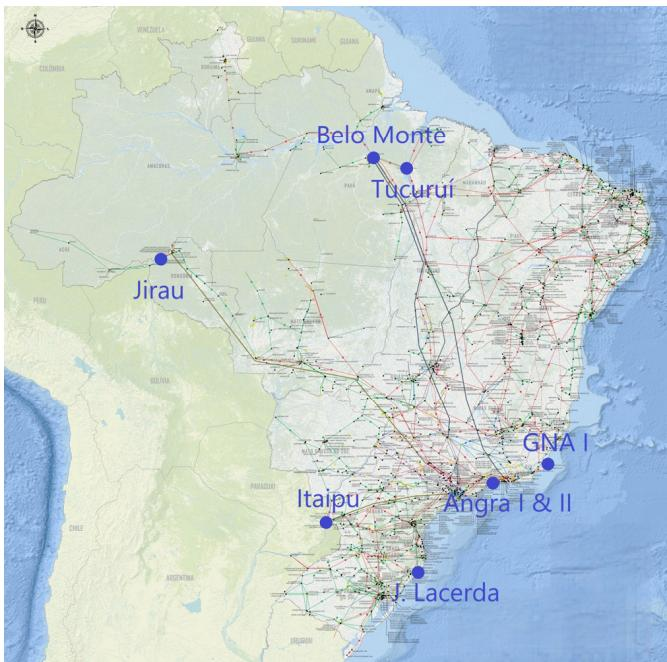  
FIGURE 2. Brazilian map with the location of power plants of Table 2.

# C. ELECTROMECHANICAL EQUATIONS

The rotor speed dynamics is modeled with the swing equation, where the mismatch between mechanical and electromagnetic torque produces angular acceleration:

$$
\frac {d \omega_ {r}}{d t} = \frac {1}{2 H} \left(T _ {m} - T _ {e} - D \Delta \omega_ {r}\right) \tag {52}
$$

The electromagnetic torque is given by:

$$
T _ {e} = i _ {q} \psi_ {d} - i _ {d} \psi_ {q} \tag {53}
$$

Substituting the electromagnetic torque into the swing equation yields:

$$
\frac {d \omega_ {r}}{d t} = \frac {1}{2 H} \left(T _ {m} - \left(i _ {q} \psi_ {d} - i _ {d} \psi_ {q}\right) - D \Delta \omega_ {r}\right) \tag {54}
$$

The load angle is defined in steady state as the angular position of the rotor in electrical rad/s with respect to a synchronously rotating reference:

$$
\delta = \omega_ {r} t - \omega_ {0} t + \delta_ {0} \tag {55}
$$

where $\delta _ { 0 }$ is the load angle value at the initial time.

TABLE 3. Classifications of the machine variables in slow and fast.   

<table><tr><td>Fast</td><td>v_d, v_q, i_d, i_q, ψ_d, ψ_q, ψ_d&#x27;&#x27;, ψ_q&#x27;&#x27;, SAT_d, SAT_q, Te</td></tr><tr><td>Slow</td><td>ψ_d&#x27;, ψ_q&#x27;, ω_r, δ, Ef_d, V_pss, T_m</td></tr></table>

The differential equation of the load angle is given by:

$$
\frac {d \delta}{d t} = \omega_ {r} - \omega_ {0} = \Delta \omega_ {r} \tag {56}
$$

# IV. MULTIRATE CLASSIFICATION FOR MACHINES

The synchronous machine has variables and equations with slow and fast dynamics, and their classification is the basis for the multirate method.

Table 2 reports representative electrical transient $( T _ { d 0 } ^ { \prime } , T _ { q 0 } ^ { \prime } )$ and subtransient $( T _ { d 0 } ^ { ^ { \prime \prime } } , T _ { q 0 } ^ { ^ { \prime \prime } } )$ , T ′′ ) ti me constants, together with the inertia constant H and the MVA rating, for a set of Brazilian generator units of different types of power plants. Fig. 2 shows the location of these power plants on the map of Brazil with the network grid.

Hydro units (salient-pole) do not include a q-axis transient branch (hence the dash in $T _ { q 0 } ^ { \prime } )$ and show ′ $T _ { d 0 } ^ { \prime }$ in the 5–9 s range, with fast subtransient constants $T _ { d 0 } ^ { \prime \prime } \approx 0 . 0 6 - 0 .$ .10s and $T _ { q 0 } ^ { ' \prime } \approx 0 . 1 2 - 0 . 2 0 s$ . Their inertia constants cluster around 4– 5s. Thermal units (round-rotor) in the table – coal, nuclear and combined cycle power plants (CCGT) – by contrast feature both $T _ { d 0 } ^ { \prime }$ and T ′ $T _ { q 0 } ^ { \prime } .$ . Typical values are $T _ { d 0 } ^ { \prime } \approx 5 - 1 1 s , T _ { q 0 } ^ { \prime } \approx$ 0 ≈ 5 − 11s, T ′q0 ≈ 0.6 − 2.5s, $T _ { d 0 } ^ { ' \prime } \stackrel { . } { \approx } 0 . 0 3 - 0 . 0 5 s$ and $T _ { q 0 } ^ { ^ { \prime \prime } } \approx 0 . 0 7 - 0 . 2 0 s$ .

Therefore, the equations of transient flux linkages and swing equations are natural choices for using a slow time step. The first slow variable is the rotor electrical speed $\omega _ { r }$ governed by (52). Since the inertia H is large, in the range of seconds, the resulting accelerations are slow, much slower than electrical subtransient and transient phenomena.

The load angle δ is the integral of the speed deviation given by (56), and changes only when the slow variable $\omega _ { r }$ drifts from the synchronously rotating reference. Therefore, δ is another slow variable.

The field voltage $E _ { f d }$ is the output of the exciter controlled by the automatic voltage regulator (AVR) that will actuate at the d-axis transient flux linkage in (40) or (44), which are slow equations because they are governed by a large time constant. For this reason, $E _ { f d }$ and the whole AVR and exciter variables, even having fast dynamics, may be solved using a large time step, since any fast dynamics will be filtered by the slow equation of the d-axis transient flux linkage. The same applies to the power system stabilizers (PSS) whose output $V _ { p s s }$ is a supplementary input signal to the AVR.

The mechanical torque $T _ { m }$ is the prime-mover torque delivered through the governor-turbine rotor to the generator shaft. In hydro machines, the dominant time constants are on the order of seconds to tens of seconds, making it one of the slowest variables. For thermal machines, the mechanical torque is faster. However, this torque is the input of the swing equation, whose time constant is twice H , as in (52). Therefore,

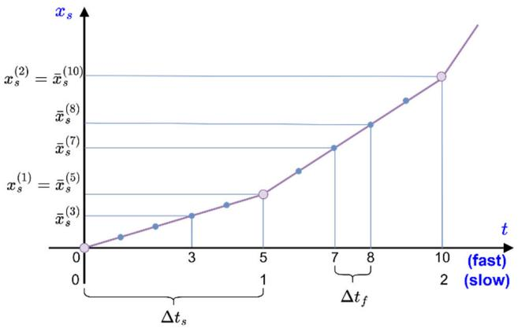  
FIGURE 3. Interpolation of a slow variable.

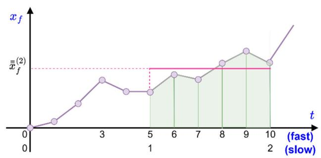  
FIGURE 4. Average of the fast variable.

governor and turbine models may be solved with a larger time step because any contents of fast dynamics will be filtered.

Finally, there are $\psi _ { d } ^ { \prime }$ and $\psi _ { q } ^ { \prime } .$ . Like their counterparts $\psi _ { d } ^ { \prime \prime }$ and $\psi _ { q } ^ { \prime \prime } .$ , they are also state variables governed by first-order ODEs. However, their transient time constants $T _ { d 0 } ^ { \prime }$ and $T _ { q 0 } ^ { \prime }$ are much larger and that is the reason why they are classified as slow variables. However, they are still much faster than mechanical variables but are slow compared to subtransient and stator dynamics.

The remaining variables are treated as fast. Table 3 summarizes the dynamics of each variable.

# V. PROPOSED MULTIRATE METHOD

Power systems contain components with different response speeds. As seen in section IV, some variables of synchronous generators respond slowly to disturbances due to the inertia of their masses and the time constants of transient flux linkages. The opposite is true for transformers, transmission lines, and fixed reactive compensation devices, whose responses are mainly the result of energy exchange between capacitive and inductive elements, which occurs very quickly. FACTS devices and direct current links, on the other hand, exhibit intermediate dynamic speeds.

In practical terms, slow responses usually generate smooth curves, while fast responses result in curves with significant variations. When using an iterative integration method for

a given curve, the step size of the method should be suited to the shape of the curve. Smooth curves allow the use of larger steps, while non-smooth curves require smaller steps to be calculated with the same accuracy. This gives rise to the principle of the multirate method: applying smaller integration steps to equations with fast dynamics and larger steps to equations with slow dynamics.

For illustrating the proposed method, consider the following simple example with two linear equations (57) and (58), two state variables (xf and $x _ { s } )$ and an input u applied to the first equation:

$$
\frac {d x _ {f} (t)}{d t} = a x _ {f} (t) + b x _ {s} (t) + u (t) \tag {57}
$$

$$
\frac {d x _ {s} (t)}{d t} = c x _ {f} (t) + d x _ {s} (t) \tag {58}
$$

The trapezoidal rule with a single time step may be initially applied for a conventional solution:

$$
\begin{array}{l} \left(1 - \frac {a \Delta t}{2}\right) x _ {f} (t) - \frac {b \Delta t}{2} x _ {s} (t) = \frac {b \Delta t}{2} u (t) + h _ {f} (59) \\ - \frac {c \Delta t}{2} x _ {f} (t) + \left(1 - \frac {d \Delta t}{2}\right) x _ {s} (t) = h _ {s} (60) \\ \end{array}
$$

where the historical terms $h _ { f }$ and $h _ { s }$ are given by:

$$
h _ {f} = \left(1 + \frac {a \Delta t}{2}\right) x _ {f} (t - \Delta t) + \frac {b \Delta t}{2} x _ {s} (t - \Delta t) + \frac {b \Delta t}{2} u (t - \Delta t) \tag {61}
$$

$$
h _ {s} = \frac {c \Delta t}{2} x _ {f} (t - \Delta t) + \left(1 + \frac {d \Delta t}{2}\right) x _ {s} (t - \Delta t) \tag {62}
$$

The solution is then obtained by a loop of time steps solving the linear solution system in (59) and (60). The historical terms can be calculated at the end or beginning of the time step with the last calculated values of variables to be used for the next time step calculation.

For a multirate method, multiple time steps can be considered for each equation and variable. In this example, xf and its corresponding equation (57) is considered fast, being integrated with a small time step $\Delta t _ { f }$ , while $x _ { s }$ and its corresponding equation (58) is considered slow, with a large time step $\Delta t _ { s }$ .

The fast and slow equations can have terms with fast or slow dynamics, which occur in this simple example. In this work, terms for trapezoidal integration of a slow term in a fast equation can be obtained by interpolation, such as shown in Fig. 3. Considering five fast time steps inside the slow time step, in the trapezoidal numerical integration of the eighth fast time step, for example, the interpolated values of $\bar { x } _ { s } ^ { ( 7 ) }$ and $\bar { x } _ { s } ^ { ( 8 ) }$ are used. They can be calculated by linear interpolation using $x _ { s } ^ { ( 1 ) }$ ) and x (2)s $x _ { s } ^ { ( 2 ) }$ of the second slow time step.

On the other hand, in a slow equation, the fast variable term is substituted for its average value along the slow time step as shown in Fig. 4. The average value is the numerical area of the fast variable along the slow time step, divided by the slow time step. This average value $\overline { { \overline { { x } } } } _ { f }$ can be obtained by summing all the values of xf inside the time steps with the half of values

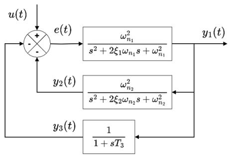  
FIGURE 5. Flowchart of single-rate method.

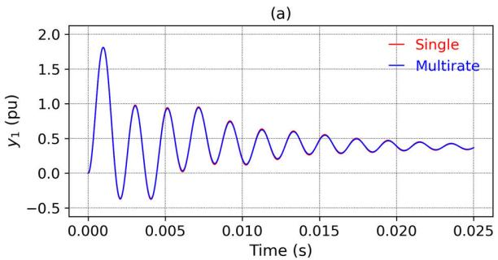

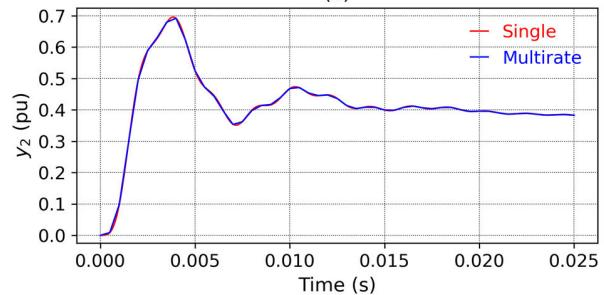  
(b)

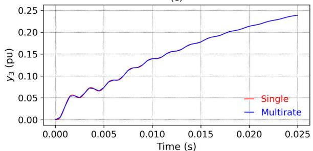  
  
FIGURE 6. Single and multirate responses of the simple test system.

of $x _ { f }$ at the edges, divided by the number of fast time steps, being given by:

$$
\bar {\bar {x}} _ {f} (t) = \frac {\frac {x _ {f} (t - \Delta t _ {s})}{2} + \sum_ {i = 1} ^ {n - 1} x _ {f} (t - i \Delta t _ {f}) + \frac {x _ {f} (t)}{2}}{n} \tag {63}
$$

where n is the number of fast steps inside slow steps.

The following system in (64) and (65) is then obtained for a multirate solution.

$$
\left(1 - \frac {a \Delta t _ {f}}{2}\right) x _ {f} (t) - \frac {b \Delta t _ {f}}{2} \bar {x} _ {s} (t) = \frac {b \Delta t _ {f}}{2} u (t) + h _ {f} \tag {64}
$$

$$
- c \Delta t _ {s} \bar {\overline {{x}}} _ {f} (t) + \left(1 - \frac {d \Delta t _ {s}}{2}\right) x _ {s} (t) = h _ {s} \tag {65}
$$

where the historical terms $h _ { f }$ and $h _ { s }$ are given by:

$$
\begin{array}{l} h _ {f} = \left(1 + \frac {a \Delta t _ {f}}{2}\right) x _ {f} (t - \Delta t _ {f}) \\ + \frac {b \Delta t _ {f}}{2} \bar {x} _ {s} (t - \Delta t _ {f}) + \frac {b \Delta t _ {f}}{2} u (t - \Delta t _ {f}) \tag {66} \\ \end{array}
$$

$$
h _ {s} = \left(1 + \frac {d \Delta t _ {s}}{2}\right) x _ {s} (t - \Delta t _ {s}) \tag {67}
$$

The terms $\bar { x } _ { s }$ in (64) and (66) are obtained by interpolation. The integral of average term in the trapezoidal rule is given by its multiplication by $\Delta t _ { s } , \mathsf { s o } \overline { { \overline { { x } } } } _ { f }$ is not divided by 2 in (65), when compared to (60), and it is not present at the historical term in (67). In this multirate solution, the slow equation and historical term are computed exclusively during the slower time steps within the full sequence of fast time steps, resulting in improved computational efficiency.

To illustrate the basic algorithm of the proposed multirate method, a computational program was developed in Matlab based on a reduced example system presented in Fig. 5. It is composed of a fast second-order block in the main loop and two relatively slow feedback loops, the first being a second-order block and the other a first-order lag block. In the second-order blocks, $\omega _ { n _ { k } } ^ { 2 }$ is the natural frequency and $\xi _ { k }$ is the damping factor. In this example the following parameters were used: $\omega _ { 1 } = 3 1 4 1 . 5 9$ rad/s (1 kHz), $\xi _ { 1 } = 0 . 0 5 , \omega _ { 2 } =$ 628.32 rad/s (200 Hz), $\xi _ { 2 } = 0 . 4$ and $T _ { 3 } = 0 . 0 3 ~ \mathrm { s }$ .

This diagram block was solved using trapezoidal rule applied to each block, with a Gauss-Seidel iterative method for convergence of the variables considering the two feedbacks. Initially it is solved using a single time step (single-rate algorithm) and the proposed multirate algorithm is applied in the sequence. These algorithms are presented in Appendix.

Fig. 6 presents the curves of the simulation. The fast output $y _ { 1 }$ is very close to the single-rate reference over the whole window. For this reason, the last curve in blue covers a great part of the first curve in red. The slow outputs y2 and y3 show some minor differences localized near rapid variations, as expected: in $y _ { 2 }$ the peak around 4 ms is slightly shifted because no slow sample lands exactly at the extremum and y3 exhibits a similar pattern.

This behavior is intrinsic to the multirate scheme, where slow states are not updated on every fast step, but constructed using the average of the fast variables. However, these small differences in $y _ { 2 }$ and $y _ { 3 }$ have a neglectable influence on the fast equations, so $y _ { 1 }$ retains the correct waveform. Despite the small transient differences of the slow variables, the same steady state was obtained in single and multirate methods.

In the present implementation, the multirate algorithm requires an integer ratio between the slow and fast time steps, where each slow time step starts at the end of some fast time step. Allowing a fractional ratio would require additional interpolations, more complexity in the algorithm and integration formulas, and extra computational burden, with negligible gains in flexibility.

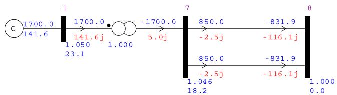  
FIGURE 7. SMIB system.

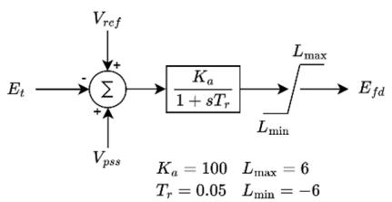  
FIGURE 8. Automatic voltage regulator.

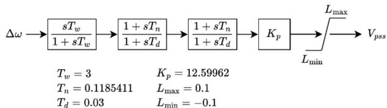  
FIGURE 9. Power system stabilizer.

# VI. MULTIRATE IN A DYNAMIC PHASOR SIMULATOR

A generic dynamic-phasor simulator is outlined in Algorithm 1 The simulator first reads the system data, builds the component models, and assembles the network. The initial conditions are obtained from a power-flow solution, and the model variables are initialized using steady state equations as functions of the terminal voltages and currents.

From this point on, the algorithm follows the steps of Algorithms 2 and 3 provided in the Appendix, with two key differences. First, events (faults, switching, step inputs) may occur at any step, so event application must reside inside the time loop. Second, the single call to ‘‘Solve y1’’ is replaced by an iterative process where nonlinear models and network are solved at each iteration until convergence within a specified tolerance.

For the network solution, the admittance matrix and injected current vector are obtained from the companion models of network components, and the solution consists in obtaining bus voltages by solving the linear network system with a suitable sparse solver.

The companion models of nonlinear elements varies at each iteration with an asymmetrical admittance corresponding to the sensitivity of dynamic phasors of current in relation to the terminal voltage dynamic phasor. The network solution uses LDU method whose factorization is partially updated with these admittances. If an event changes the topology of the network, a full factorization is performed. In addition,

# Algorithm 1 Dynamic Phasor Simulator

Declare simulation time (Tmax ), tolerance (tol), slow step (stepSlow), fast step (stepFast)

isFirstFast = False

t = 0

Read data

Build admittance matrix for network solution

Build models

Initialize variables and historical terms

Save fast variables and historical terms

while (t < Tmax) do

t = t + stepFast

Apply events

if isFirsFast then

Extrapolate slow variables

isFirstFast = False

end if

Calculate interpolated values of slow variables

while mismatches of network and models > tol do

Solve nonlinear models

Solve network

# end while

Update accumulated values of fast variables

if mod(t, stepSlow) == 0 then

Calculate average of fast variables

Solve machine controllers

Solve machine slow variables

if mismatches of slow variables < tol then

isFirstFast = True

Initialize accumulated values of fast vars

Save fast variables and historical terms

Save slow variables at the time step beginning

Calculate slow historical terms

Save slow variables for plotting

else

Restore fast historical terms

Restore area

Delete fast variables from plot t = t − stepSlow

end if

end if

Calculate fast historical terms

Save fast variables for plotting

end while

machine controllers (AVR, governor, and PSS) and machine slow variables are solved using the large time step.

# VII. RESULTS IN A SMALL BENCHMARK SYSTEM

For the first test on the proposed multirate method, a single machine infinite bus power system (SMIB) was used. It is composed of a single synchronous generator (with its transformer and local bus) connected through two equal parallel transmission lines to an infinite bus (a very strong grid modeled as a voltage source with constant voltage magnitude and angle in the nominal frequency).

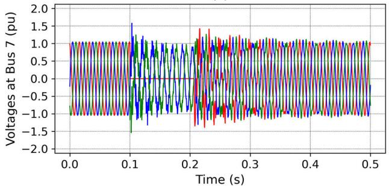

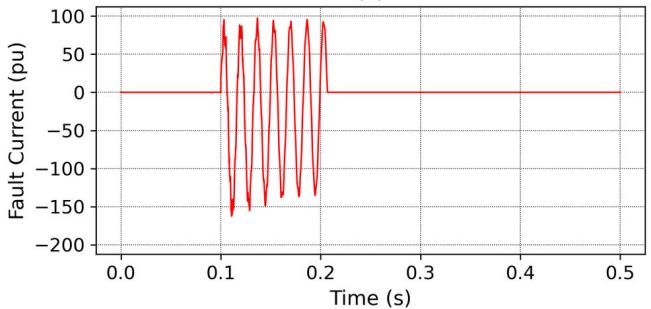  
(b)

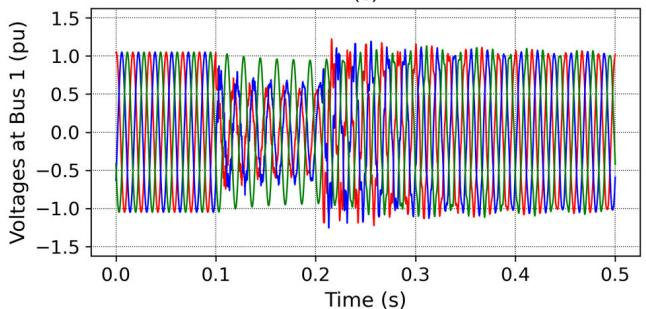

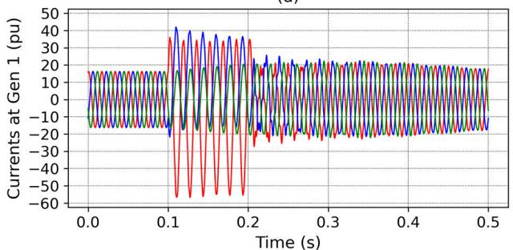  
(d）  
FIGURE 10. Network variables (single and multirate).

The multirate method was implemented in the computational program AnaHVDC [29], available in [30], which was used to produce the results of this section.

The transmission lines of 300 km length were represented by ideally transposed Bergeron models with distributed parameters. The positive and negative sequences have resistance of 0.022758 /km, inductance of 0.88397 mH/km and capacitance of 0.0130245 $\mu \mathrm { F / k m }$ . The corresponding zero sequence parameters are respectively 0.19849 /km, 4.22267 mH/km and 0.00661356 $\mu$ F/km. The parameters of the steady state π with hyperbolic correction are positive

and negative sequence resistance of 0.25984%, reactance of 3.9020% and susceptance of 372.85%, and zero sequence resistance of 2.1057%, reactance of 18.003%, and susceptance of 192.76% in 500 kV, 100 MVA base. The transformer is 1800 MVA with a reactance of 10%.

In Fig. 7 the converged power flow of the system is presented with the active and reactive of power plant at bus 1 (1700 MW, 141.6 Mvar), the fluxes of transformer (same of power plant), and the two transmission line in parallel (850 MW, -2,5 Mvar, each), and bus 8 is an infinite bus, with an ideal voltage source connected representing a very large system absorbing the transmitted power from the power plant. The magnitudes and angles of voltages are also included below each bus at the diagram (e.g. bus 1 with 1.05 pu of magnitude and $2 3 . 1 ^ { \mathrm { o } }$ of angle).

The machine parameters adopted are: 2 units of 900 MVA, $L _ { d } = 1 . 8 \ : \mathrm { p u } , L _ { q } = 1 . 7$ pu, $L _ { d } ^ { \prime } = 0 . 3 0$ pu, $L _ { q } ^ { \prime } = 0 . 5 5$ pu, $L _ { d } ^ { \prime \prime } =$ $L _ { q } ^ { \prime \prime } = 0 . 2 5$ pu, $L _ { l } = 0 . 2 0$ pu, $T ^ { , } { } _ { d 0 } = 8 \mathrm { ~ s } ^ { , } r _ { a } = 0 . 0 0 2 5$ pu, $T ^ { ' } { } _ { q 0 } = 0 . 4 ~ \mathrm { s } , T _ { d 0 } ^ { \prime \prime } = 0 . 0 3 ~ \mathrm { s } , T ^ { ' \prime } { } _ { q } = 0 . 0 5 ~ \mathrm { s } , H = 6 , 5 ~ \mathrm { s } , D = 0 .$ , Saturation function: A = 0.015, B = 9.6 pu, $C \ = 0 . 9$ pu. The generator uses a static exciter (AVR) and a power system stabilizer (PSS), shown in Figs. 8 and 9.

For the results, an asymmetrical single-line-to-ground fault was applied at the bus 7-side of the upper parallel transmission line at 0.1 s. The fault is removed at 0.2 s at the first zero crossing of the fault current. For monitoring the open instant, instantaneous value of fault current is obtained from the corresponding dynamic phasor.

The benchmark is simulated in five configurations: one single-rate run and four multirate runs with slow-step sizes of 200 $\mu \mathrm { s }$ , 1000 $\mu \mathbf { S } ,$ , 2000 $\mu \mathrm { s }$ and 5000 $\mu \mathrm { s }$ . In all cases, the fast step is $1 0 \mu \mathrm { s } ,$ which is also the time step of the single-rate run. The default tolerance of $1 0 ^ { - 6 }$ is used for the convergence check to determine if the simulation should rewind.

The simulation results are presented from Figs. 10-13, considering the single-rate and the two first multirate simulations with slow time steps of 200 $\mu \mathrm { s }$ and 1000 $\mu \mathrm { s }$ .

The visual differences among the three simulations are small in the presented scales and for this reason just one curve is shown for each graph, except for the phase voltages and currents where the three curves of phases $^ { a , }$ b and c are presented respectively in red, blue and green. Some of these variables will be presented later with more detailed scales.

Fig. 10 shows the network variables (voltages at the faulted bus $V _ { 7 }$ , fault current $I _ { f }$ and generator voltages $V _ { 1 }$ and currents $I _ { G }$ . The voltage curves of bus 7 indicate the fault at phase $^ { a , }$ represented by the red curve, which drops to zero within the time interval between 100 ms and 200 ms. Phases b and c, depicted by the blue and green curves respectively, exhibit high-frequency oscillations during the fault period. Because of the fault, the generator at bus 1 exhibits undervoltage at phases a and b, and a pronounced overcurrent at phase a of its fault contribution.

Fig. 11 presents the machine internal flux linkages. The transient flux linkages ${ \psi } _ { q } ^ { \prime }$ and $\psi _ { d } ^ { \prime }$ exhibit only slow dynamics including electromechanical oscillation, whereas

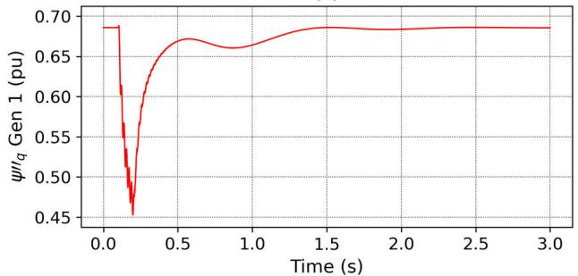  
(a)

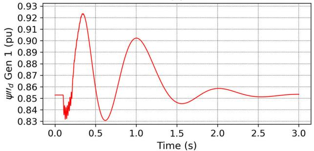  
(b)

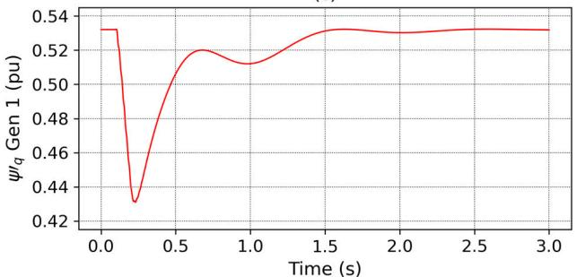

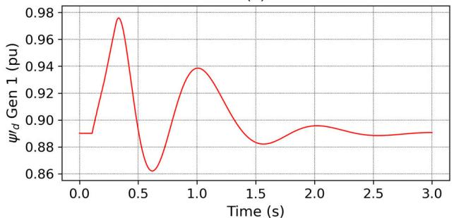  
(d)   
FIGURE 11. Machine internal flux linkages (single and multirate).

the subtransient flux linkages $\psi _ { q } ^ { \prime \prime }$ and $\psi _ { d } ^ { \prime \prime } ,$ , which are fast variables, in addition to the slow dynamics, display a higher-frequency oscillation during the short-circuit period.

Fig. 12 shows the controller variables: the field voltage of AVR $E _ { f d } ;$ and the PSS output signal $V _ { P S S }$ . Both variables are considered slow for being the input of the slow equation of transient flux linkage of direct axis but exhibits fast dynamics. During the short-circuit, the generator field voltage rapidly reaches the upper limit of the AVR due to the undervoltage caused by the fault. Following fault clearance, an electromechanical transient with satisfactory damping is

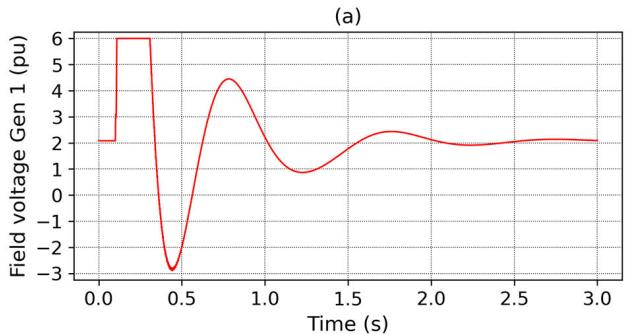

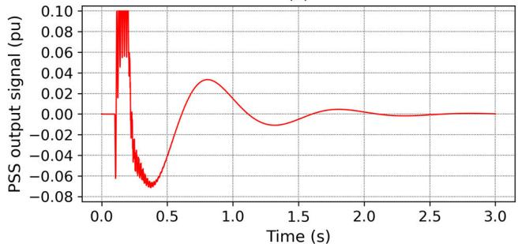  
(b)   
FIGURE 12. Controller variables (single and multirate).

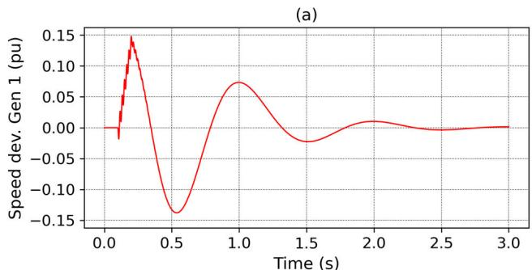

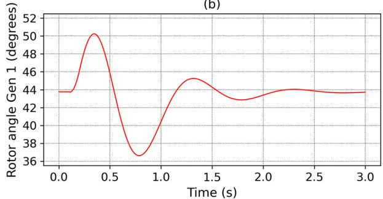  
  
FIGURE 13. Mechanical variables (single and multirate).

observed. As expected, the field voltage approaches its initial value by the end of the simulation. A similar behavior is observed in the PSS output signal, which also reaches its upper limit during the short-circuit and returns to zero at the end of the simulation.

The generator mechanical variables, rotor speed deviation and rotor angle, are shown in Fig. 13. Although the variables are considered slow, a high-frequency transient can be

TABLE 4. RMS errors of variables of small benchmark system for full scale [%].   

<table><tr><td rowspan="2">Variable</td><td colspan="4">Δtslow</td></tr><tr><td>200 μs</td><td>1000 μs</td><td>2000 μs</td><td>5000 μs</td></tr><tr><td>V7a</td><td>0.00054</td><td>0.00284</td><td>0.00620</td><td>0.01697</td></tr><tr><td>V7b</td><td>0.00048</td><td>0.00327</td><td>0.00768</td><td>0.01609</td></tr><tr><td>V7c</td><td>0.00055</td><td>0.00397</td><td>0.00927</td><td>0.01904</td></tr><tr><td>If</td><td>0.00014</td><td>0.00048</td><td>0.00099</td><td>0.00317</td></tr><tr><td>V1a</td><td>0.00106</td><td>0.01999</td><td>0.02158</td><td>0.04369</td></tr><tr><td>V1b</td><td>0.00958</td><td>0.01992</td><td>0.02122</td><td>0.04302</td></tr><tr><td>V1c</td><td>0.00949</td><td>0.02179</td><td>0.02386</td><td>0.04743</td></tr><tr><td>IGa</td><td>0.00074</td><td>0.00396</td><td>0.00860</td><td>0.02276</td></tr><tr><td>IGb</td><td>0.00107</td><td>0.00571</td><td>0.01236</td><td>0.03291</td></tr><tr><td>IGc</td><td>0.00147</td><td>0.00820</td><td>0.01790</td><td>0.04614</td></tr><tr><td>ψq&#x27;&#x27;</td><td>0.00279</td><td>0.00884</td><td>0.02147</td><td>0.04691</td></tr><tr><td>ψd&#x27;&#x27;</td><td>0.02205</td><td>0.15794</td><td>0.33435</td><td>0.85023</td></tr><tr><td>δ</td><td>0.01520</td><td>0.04784</td><td>0.11325</td><td>0.28399</td></tr><tr><td>ΔωG</td><td>0.01108</td><td>0.05145</td><td>0.12285</td><td>0.34787</td></tr><tr><td>Efd</td><td>0.05153</td><td>0.27356</td><td>0.52230</td><td>1.22565</td></tr><tr><td>ψ′q</td><td>0.00514</td><td>0.01749</td><td>0.04376</td><td>0.09651</td></tr><tr><td>ψd′</td><td>0.01953</td><td>0.14568</td><td>0.30710</td><td>0.78698</td></tr><tr><td>Vpss</td><td>0.01199</td><td>0.15192</td><td>0.44052</td><td>1.16907</td></tr></table>

observed in the rotor speed deviation due to the influence of the electrical torque. However, this transient is filtered by the load angle equation and consequently is not apparent in the load angle curve.

For measuring the visual difference of a curve $y _ { 1 } ( t )$ in relation to a reference curve $y _ { 2 } ( t )$ , the RMS (‘‘Root Mean ${ \bf S q u a r e } ^ { , 9 } )$ error is calculated by the square root of the integral of the quadratic difference of the curves along the time scale, divided by the time scale, and by the amplitude variation of the reference curve (vertical scale) for normalization of unit:

$$
\varepsilon = \frac {1}{\max  \left[ y _ {2} (t) \right] - \min  \left[ y _ {2} (t) \right]} \sqrt {\frac {\int_ {t _ {\operatorname* {m i n}}} ^ {t _ {\operatorname* {m a x}}} \left[ y _ {1} (t) - y _ {2} (t) \right] ^ {2} d t}{t _ {\operatorname* {m a x}} - t _ {\operatorname* {m i n}}}} \tag {68}
$$

Note that this measure depends on the selected scale. A narrow scale tends to accentuate the visual difference between curves, thereby increasing the RMS error as anticipated. In general, RMS errors below 1% yield visual coincidence where the last curve covers the first one.

Table 4 presents the RMS errors for the variables of the small benchmark system under full scale, corresponding to the results shown in Figs. 10-13. As expected, the RMS errors are generally below 1% for the slow steps $( \Delta t _ { s l o w } )$ of $2 0 0 ~ \mu \mathrm { s } , 1 0 0 0 ~ \mu \mathrm { s }$ , and $2 0 0 0 ~ \mu \mathrm { s }$ . However, as the simulation step increases, the errors rise significantly, with the largest deviations observed for the greatest slow step of 5000 $\mu \mathbf { S } .$ . Variables such as $\psi _ { \mathrm { ~ d ~ } } ^ { \prime \prime } ( 0 . 8 5 0 \% )$ , $E _ { f d }$ (1.226%), and $V _ { P S S }$ (1.169%) exhibit the highest errors at this step size. These error patterns are presented in a detailed scale later.

Fig. 14 compares, on an amplified scale, the variables that exhibited the greatest differences between the single-rate simulation and the multirate cases with slow steps of 200 µs and $1 0 0 0 ~ \mu \mathrm { s }$ . For fast variables (subtransient flux linkages) the curves are essentially indistinguishable across all runs,

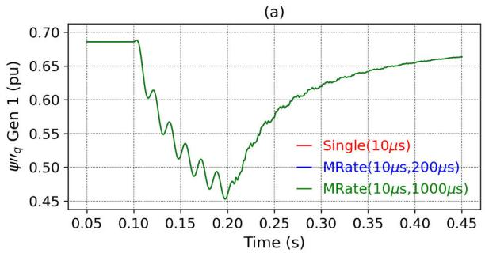

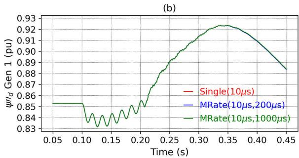

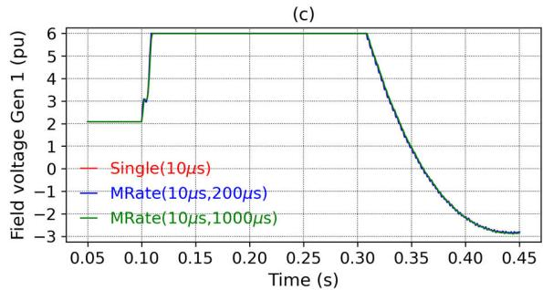

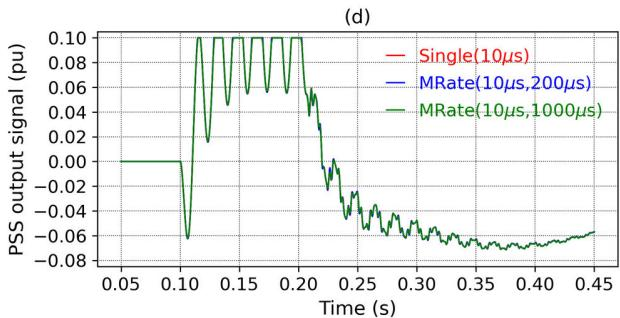

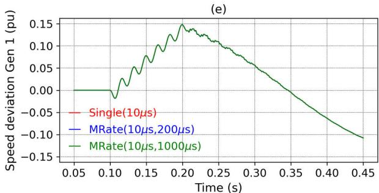  
FIGURE 14. Detail of machine variables for single(1t =10 µs) and multirate(1t = 10 µs and $\Delta t _ { s } = 2 0 0$ µs and 1000 $\pmb { \mu } \pmb { \mathsf { s } } ) _ { \pmb { \imath } }$ .

confirming that the fast variables preserve the electromagnetic response.

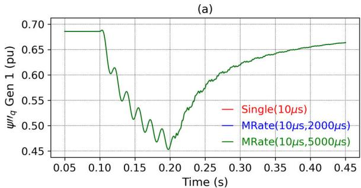

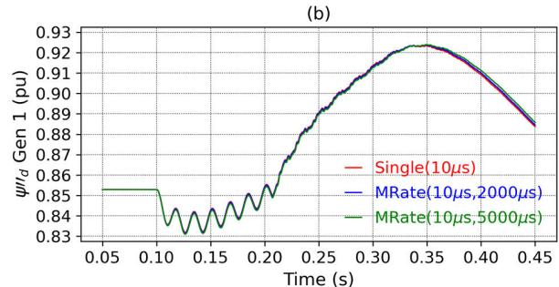

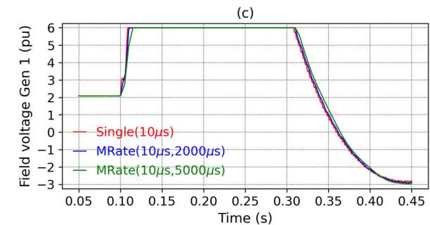

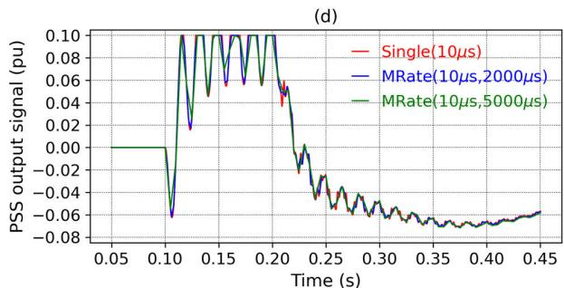

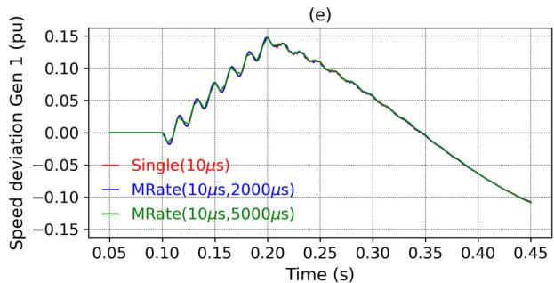  
FIGURE 15. Detail of machine variables for single(1t =10 µs) and multirate $( \Delta t _ { f } = 1 0 ~ \mu s$ and $\Delta t _ { s } = 2 0 0 0 \mu s$ and 5000 µs).

For slow variables (e.g. the field voltage, PSS output signal and speed deviation) a very small difference is visible

TABLE 5. RMS errors of variables of small benchmark system for detailed scale.   

<table><tr><td rowspan="2">Variable</td><td colspan="4">Δtslow</td></tr><tr><td>200 μs</td><td>1000 μs</td><td>2000 μs</td><td>5000 μs</td></tr><tr><td>ψq&#x27;&#x27;</td><td>0.00140</td><td>0.00362</td><td>0.00739</td><td>0.02401</td></tr><tr><td>ψd&#x27;&#x27;</td><td>0.04337</td><td>0.24525</td><td>0.51048</td><td>1.30425</td></tr><tr><td>Efd</td><td>0.13494</td><td>0.62755</td><td>1.16798</td><td>2.61165</td></tr><tr><td>VPSS</td><td>0.02725</td><td>0.40058</td><td>1.18121</td><td>3.13608</td></tr><tr><td>ΔωG</td><td>0.01155</td><td>0.07164</td><td>0.20478</td><td>0.65246</td></tr></table>

yielding no practical impact on the dynamic analysis. The other variables do not present visual differences even on an amplified scale and are not repeated.

Fig. 15 compares the single-rate with the multirate using the larger slow time steps of 2000 µs and 5000 $\mu \mathbf { S } .$ . The differences are greater, but still acceptable. In the simulation with the slow time step of 5000 µs, the time displacements in the slow variables (e.g. field voltage) are more noticeable.

Table 5 presents the RMS errors for the variables shown in Fig. 14 and Fig. 15, which correspond to simulations using a detailed scale. As expected, the RMS errors are generally higher than those in the full-scale simulation, reflecting the greater divergence between the curves observed in the figures. For instance, the error for $V _ { P S S }$ with a $2 0 0 0 \mu \mathrm { s }$ slow step increases substantially from 1.17% (in the full scale) to 3.14%.

The data demonstrates a clear trend where the RMS error increases with the slow step size for each variable. It is important to note, however, that this relationship will not always hold true, as will be shown in subsequent analysis. Overall, the errors for all fast variables are maintained below 1% even with the largest step size of $5 0 0 0 ~ \mu \mathrm { s }$ . This indicates that the more pronounced errors observed in the slow variables are effectively filtered by the system’s inherent time constants, thereby preserving the stability of the multirate integration.

One should note that the RMS error of detailed scale in Table 5 is in general larger than those in Table 4 in full scale. This is a demonstration of numerical stability where the errors do not increase over time.

For concluding this section, the presented results with AnaHVDC were validated with the traditional EMT programs PSCAD and ATP in Fig. 16. For the voltages and currents, the results of the three programs are practically the same, as shown in Fig. 16(a)-(d). However, there are some small differences in the generator speed, as shown in Fig. 16(e), due to some differences in the machine models of the programs.

# VIII.RESULTSOFLARGEBRAZILIANSYSTEM

The full Brazilian interconnected power system (Fig. 2) was modeled in AnaHVDC [30] to illustrate the computational performance of the proposed multirate method in a large-scale power system. All results in this section were produced using this software.

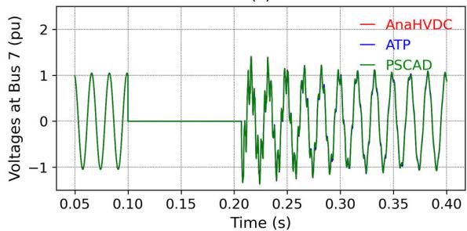  
(a)

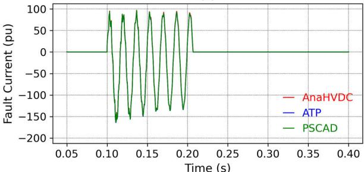  
(b)

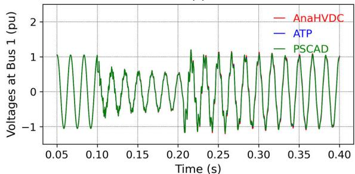

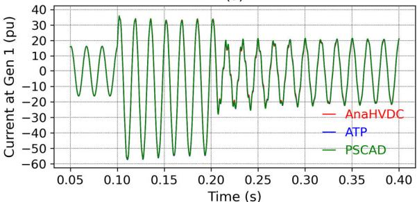

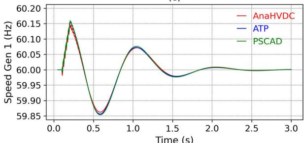  
  
FIGURE 16. Comparison of fault simulation of small benchmark system among AnaHVDC, ATP and PSCAD.

The power system data was taken from datafiles of power flow, short-circuit and transient stability available from the

Brazilian ISO with the operating point given in [35] referred to a scenario of Summer 2022/2023, heavy load, used as a reference model for electrical studies of operation and expansion planning.

The model comprises 10,616 buses, 7,641 lines, and 6,568 transformers. For the tests, HVDC links were replaced by equivalent current injections, and static var compensators (SVCs) were represented by parallel LC equivalent circuits. There are 299 power plants in the case with 580 user-defined controllers modelled in detail comprising a total of 32,930 controller variables.

For the dynamic phasor simulation, the available data is directly read from datafiles and converted to three-phase dynamic phasor balanced models with EMT, including the distributed parameter transmission lines which used ideally transposed Bergeron models. For the input of controllers, RMS values are automatically obtained from EMT dynamic phasor measures.

The power system variables are initialized at the steady state condition given in power flow, including the complete set of variables from machine and controllers. Therefore, a preliminary simulation for obtaining steady state is not necessary, and even instable cases can be simulated starting from a stationary operating point.

A 10 µs step was used for the single-rate and for the small step of the multirate simulations. Two multirate simulations are compared: the first with a large step of 500 $\mu \mathrm { s }$ and the second with 2000 $\mu \mathrm { s }$ .

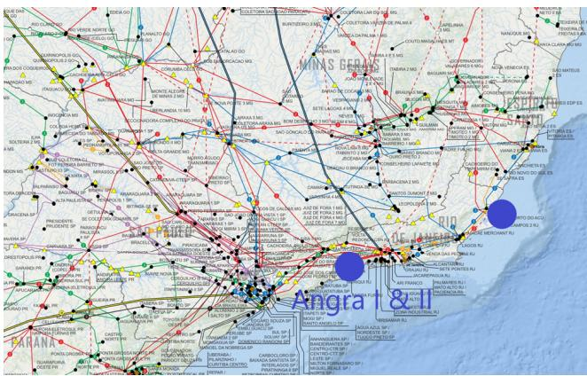  
FIGURE 17. Location of Angra I and II on the Brazilian map.

The simulations were performed in a PC Desktop with CPU Intel Core i7-14700. Two sets of simulations are presented, a single-phase fault, and a load shedding after an island of the South Region of Brazil.

# A. SIMULATION OF SINGLE-PHASE FAULT

A single-line-to-ground fault of 100 ms was applied at the 500 kV bus of the nuclear plant complex of Angra I and Angra II, as presented in Fig. 17. Variables of both nuclear power plants were analyzed. The total simulation time is 5 s considering both electromechanical and electromagnetic transients.

TABLE 6. Computational time.   

<table><tr><td></td><td rowspan="2">Single-rate
10 μs</td><td colspan="2">Multirate</td></tr><tr><td></td><td>10 μs, 500 μs</td><td>10 μs, 2000 μs</td></tr><tr><td>Controllers</td><td>1074.49</td><td>52.08</td><td>54.31</td></tr><tr><td>Machine</td><td>38.45</td><td>22.22</td><td>26.89</td></tr><tr><td>Network</td><td>1334.64</td><td>1088.62</td><td>1277.73</td></tr><tr><td>Total</td><td>2573.75</td><td>1243.28</td><td>1435.09</td></tr></table>

TABLE 7. Speedup.   

<table><tr><td></td><td colspan="2">Multirate</td></tr><tr><td></td><td>10 μs / 500 μs</td><td>10 μs / 2000 μs</td></tr><tr><td>Controllers</td><td>20.63</td><td>19.78</td></tr><tr><td>Machine</td><td>1.73</td><td>1.43</td></tr><tr><td>Network</td><td>1.23</td><td>1.04</td></tr></table>

TABLE 8. Number of steps, returns and iterations.   

<table><tr><td></td><td>Single-rate
10 μs</td><td>Multirate
10 μs, 500 μs</td><td>10 μs, 2000 μs</td></tr><tr><td>Small Steps</td><td>500,000</td><td>533,400</td><td>617,000</td></tr><tr><td>Large Steps</td><td>-</td><td>10,668</td><td>3,085</td></tr><tr><td>Returns</td><td>-</td><td>668</td><td>585</td></tr><tr><td>Mean Machine Solutions</td><td>5.43</td><td>4.23</td><td>4.94</td></tr><tr><td>Mean Control Solutions.</td><td>9.35</td><td>0.055</td><td>0.019</td></tr></table>

Table 6 reports the computational times and Table 7 the respective speedups. With a 10 µs fast step, the multirate runs reduce total wall time from 2573.75 s (single-rate) to $1 2 4 3 . 2 8 \mathrm { ~ s ~ } ( 1 0 \mu \mathrm { s } / 5 0 0 \mu \mathrm { s } )$ and $1 4 3 5 . 0 9 \mathrm { ~ s ~ } ( 1 0 \mu \mathrm { s } / 2 0 0 0 \mu \mathrm { s } )$ .

As expected, the largest contribution is by the controllers: their time drops from 1074.49 s to roughly $5 2 { - } 5 4 \mathrm { s }$ (speedup about 20) because the machine controller variables are evaluated only at slow steps.

Machine models also benefit from multirate (1.73 and 1.43 times faster). The more modest speedups for machines are expected, since most of their variables contain fast electrical variables that must be solved at every fast step. Although the minor gain, the computational burden is low for the machine models, representing less than 2% of the total computational time.

The time solution for network may increase by the multirate, since the network is solved for every fast step and multirate may increase the number of network solutions due to the number of returns of slow time steps. However, speedups of 1.23 and 1.07 was perceived. This is explained by the reduction of the number of iterations of the machines, as it is commented in the sequence.

Table 8 reports the number of steps, returns of slow steps, and iterations. The single-rate simulation uses a $1 0 \mu \mathrm { s }$ step for all models and therefore executes 500,000 total steps. In the multirate simulations, the fast variables are computed every $1 0 \mu \mathrm { s } .$ , while the slow variables are calculated at each $5 0 0 \mu \mathrm { s }$ or $2 0 0 0 ~ \mu \mathrm { s }$ . Each time a slow variable has not converged, the multirate method must roll back the entire slow step and calculate the fast time steps again. The number of returns

of slow steps are 668 for $5 0 0 ~ \mu \mathrm { s }$ and 585 for $2 0 0 0 ~ \mu \mathrm { s }$ . The number of fast time steps including the slow step returns are then 533,400 and 617,000, an increase of 6.7% and 23.4%, respectively. However, the mean number of machine solutions of multirate has decreased for both cases, 4.23 and 4.94, compared to the 5.43 of the single-rate, yielding a smaller number of network solutions. This explains the improvement in the network computational performance even increasing the number of fast steps.

The mean number of controller solutions in relation to the total number of fast time steps decreased significantly, from 9.35 of the single-rate, to 0.055 and 0.019 of multirate, as expected, since they are only calculated at the slow time steps.

Overall, the table confirms the intended behavior: multirate can improve significantly the performance for solving machine and controllers, and the main gain in computational burden is concentrated in the controllers. Additionally, the possible overhead in solving network does not occur, on the contrary, the computational burden of network solution was also reduced. Concluding, the multirate case with the slow step of $5 0 0 \mu \mathrm { s }$ was computationally superior compared to the case of 2000 µs.

Figs. 18-21 show the results of single-rate and multirate simulations in detailed time scale of 0-0.5 s for fast variables and full scale 0-5 s for slow variables. In these scales the curves are essentially indistinguishable across all runs, reason why only curves of single-rate run are shown.

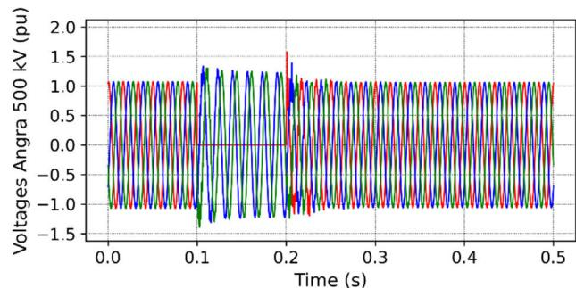  
FIGURE 18. Voltage at the faulted bus Angra 500 kV.

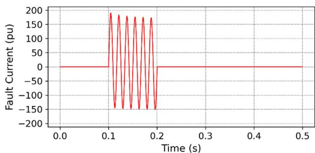  
FIGURE 19. Fault current.

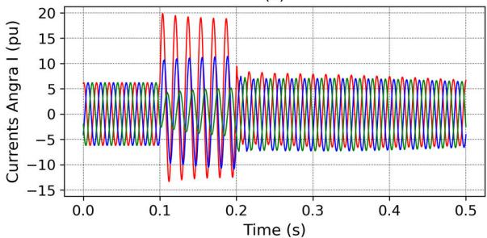

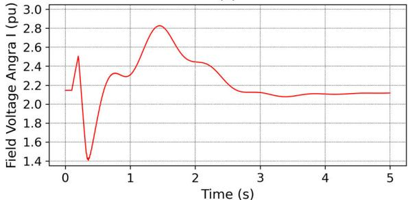  
(b)

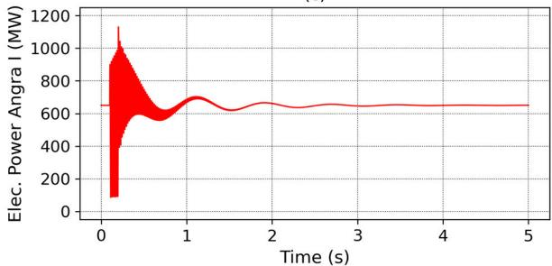  
（c)

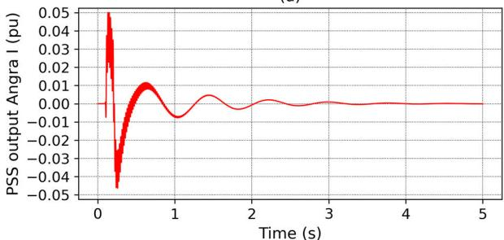  
(d)

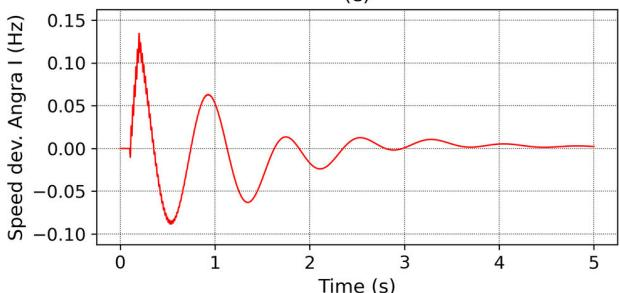  
  
FIGURE 20. Variables of the power plant Angra I (760 MVA).

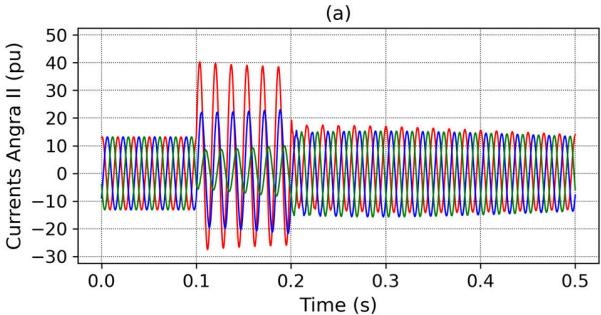

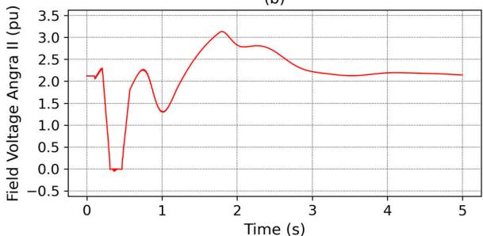  
(b)

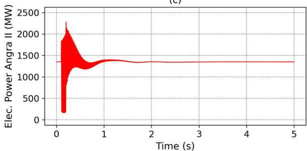  
(c)

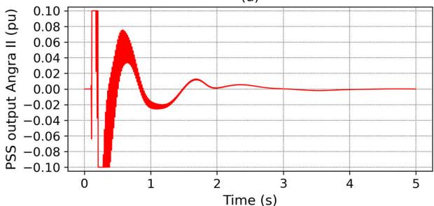  
(d）

  
(e)   
FIGURE 21. Variables of the power plant Angra II (1458 MVA).

Fig. 18 presents the voltage of faulted bus Angra 500 kV, where phase a goes to zero during fault period, and recovers

quickly after fault removal. Phases b and c present the typical fault overvoltage of the healthy phases.

  
(b)

  
（c）

  
(d)

  
(e)   
FIGURE 22. Variables with practically identical results in detailed scale among single and multirate simulations.

Fig. 19 presents the fault current. The fault is removed at the first zero crossing after 200 ms. Fig. 20 presents

  
(b)   
FIGURE 23. Variables with slightly different results in detailed scale among single and multirate simulations.

TABLE 9. RMS errors of variables of Fig. 18 and Fig. 19 [%].   

<table><tr><td rowspan="2">Variable</td><td colspan="2">Δtslow</td></tr><tr><td>500 μs</td><td>2000 μs</td></tr><tr><td>Va</td><td>0.00114</td><td>0.00532</td></tr><tr><td>Vb</td><td>0.00118</td><td>0.00549</td></tr><tr><td>Vc</td><td>0.00118</td><td>0.00548</td></tr><tr><td>If</td><td>0.00008</td><td>0.00045</td></tr></table>

TABLE 10. RMS errors of Fig. 20 and Fig. 21 [%].   

<table><tr><td rowspan="3">Variable</td><td colspan="4">Δtslow</td></tr><tr><td colspan="2">Angra I</td><td colspan="2">Angra II</td></tr><tr><td>500 μs</td><td>2000 μs</td><td>500 μs</td><td>2000 μs</td></tr><tr><td>Ia</td><td>0.00502</td><td>0.02245</td><td>0.01061</td><td>0.05116</td></tr><tr><td>Ib</td><td>0.00748</td><td>0.03321</td><td>0.01596</td><td>0.07690</td></tr><tr><td>Ic</td><td>0.01156</td><td>0.05050</td><td>0.02314</td><td>0.11142</td></tr><tr><td>PELE</td><td>0.00628</td><td>0.02613</td><td>0.01426</td><td>0.06311</td></tr><tr><td>Efd</td><td>0.29421</td><td>1.58314</td><td>0.27003</td><td>1.18006</td></tr><tr><td>VPSS</td><td>0.20149</td><td>0.80357</td><td>0.54420</td><td>2.17129</td></tr><tr><td>ΔωG</td><td>0.06547</td><td>0.34443</td><td>0.10125</td><td>0.48502</td></tr></table>

the variables of Angra I and Fig. 21 of Angra II, which are different nuclear power plants connected to the same 500 kV bus, with parameters shown in Table 2. The first graphs are the generator currents, where the imbalance is apparent, followed by the field voltages, electric powers, PSS outputs and speed deviations. The electric power is the active power calculated multiplying the instantaneous values of voltages and currents of each phase obtained from the dynamic phasors $( \nu _ { a } \left( t \right) i _ { a } \left( t \right) + \nu _ { b } ( t ) i _ { b } ( t ) + \nu _ { c } ( t ) i _ { c } ( t ) )$ . There are high frequency oscillations in electric powers, which are treated as fast variable, and PSS outputs, treated as slow

TABLE 11. RMS Errors of variables of Fig. 22 and Fig. 23 [%].   

<table><tr><td rowspan="2">Variable</td><td colspan="2">Δtslow</td></tr><tr><td>500 μs</td><td>2000 μs</td></tr><tr><td>Va</td><td>0.00098</td><td>0.00463</td></tr><tr><td>VPSS</td><td>0.73279</td><td>2.92268</td></tr><tr><td>If</td><td>0.00010</td><td>0.00054</td></tr><tr><td>Ia</td><td>0.00281</td><td>0.01479</td></tr><tr><td>PELE</td><td>0.00675</td><td>0.03484</td></tr><tr><td>Efd</td><td>0.29421</td><td>1.58314</td></tr><tr><td>ΔωG</td><td>0.12584</td><td>0.65089</td></tr></table>

variable, since they yield inputs for AVR, which will actuate at transient flux linkage of axis d, which is a very slow equation. In fact, the high frequency contents of PSS outputs in this case are already filtered by the AVR, as seen at the field voltage curves. The electromechanical oscillations are apparent at the variables of both generators.

In Fig. 19 and Fig. 20, the typical dynamics is observed, the rotor speeds of both power plants accelerate during fault and decelerate after fault removal, The field voltage is increased, followed by a sharp decrease after fault removal followed by electromechanical oscillations The PSS output of Angra I is moderate, varying with an amplitude less than 0.05 pu, while PSS of Angra II reaches the limits of +/-0.1 pu. The mean electrical power is reduced during fault, but present oscillatory dynamics due to the unbalanced fault.

Fig. 22 and Fig. 23 show a comparison of single-rate and multirate simulations in amplified scales. Even in these scales, the variables in Fig 22 do not present visual differences, while Fig. 23 presents some small transient misalignment, but causing negligible impact on the other variables. Moreover, the variables converge to the same post-fault steady state, a relevant point of consistency for stability analysis.

The RMS errors of the variables shown in Fig. 18 and Fig. 19 are presented in Table 9, while the RMS errors of Fig. 20 and Fig. 21 are detailed in Table 10.

Once again, the errors of most variables are maintained below 1% for $\Delta t _ { s l o w }$ of $5 0 0 \mu \mathrm { s } .$ , except for three occurrences related to $V _ { P S S }$ and $E _ { f d }$ . A comparison between power plants Angra I and II reveals that errors are usually higher for Angra II. In particular, the largest error (2.17%) occur for the PSS output $( V _ { P S S } )$ of Angra II for the 2000 µs step, similar to the behavior observed in the simulation of the small benchmark system. Variable $V _ { P S S }$ exhibits sharp oscillations in direct response to rotor swings. However, this signal is smoothed by the time constants of the AVR loop (Fig. 20 and Fig. 21). Both fast response of $V _ { P S S }$ and $E _ { f d }$ are filtered by the large time constant $T ^ { \prime } { _ { d 0 } }$ of the generator’s field winding in (40) and (44). Consequently, in the multirate method, the whole AVR and PSS can be solved with the large time step $\Delta t _ { s l o w } .$ Although this may lead to a higher RMS error in these variables, it does not compromise the accuracy of the overall machine dynamics because the low-frequency dynamic contents of the AVR and PSS output is preserved.

  
FIGURE 24. Map of South Region of Brazil with the location of J. Lacerda and the provoked island represented by a dashed line.

  
FIGURE 25. J. Lacerda power plant frequency, with and without load shedding.

The RMS errors for the variables shown in Fig. 22 and Fig. 23 are detailed in Table 11. Following the pattern of Table 10, the errors are in general small, with the slow variables VPSS andEfd exhibiting the largest errors due to their fast nature. Again, these errors are not important since the fast dynamics are attenuated by the machine field equation, not affecting significantly the machine dynamics, as seen by the small errors of the other variables.

# B. SIMULATION OF LOAD SHEDDING AFTER ISLAND

This section presents the simulation of a load shedding after an island of South Region of Brazil. This illustrates a very severe event where 18 lines were tripped and 2500 MW of loads were reduced at slightly different times, provoking the necessity of many refactorizations of the network admittance. This event may occur in the actual power system to prevent loss of synchronism of South Region. The detailed map of the region is presented in Fig. 24, indicating the power plant location of J. Lacerda and the island region in a dashed red line where the transmission lines were tripped.

TABLE 12. Computational time without load shedding.   

<table><tr><td></td><td rowspan="2">Single-rate
10 μs</td><td colspan="2">Multirate</td></tr><tr><td></td><td>10 μs, 500 μs</td><td>10 μs, 2000 μs</td></tr><tr><td>Controllers</td><td>4027.82</td><td>212.16</td><td>276.39</td></tr><tr><td>Machine</td><td>222.38</td><td>137.10</td><td>211.95</td></tr><tr><td>Network</td><td>4069.57</td><td>3995.06</td><td>6069.00</td></tr><tr><td>Total</td><td>8743.98</td><td>4674.82</td><td>6963.88</td></tr></table>

TABLE 13. Speedup without load shedding.   

<table><tr><td></td><td colspan="2">Multirate</td></tr><tr><td></td><td>10 μs / 500 μs</td><td>10 μs / 2000 μs</td></tr><tr><td>Controllers</td><td>18.98</td><td>14.57</td></tr><tr><td>Machine</td><td>1.62</td><td>1.05</td></tr><tr><td>Network</td><td>1.02</td><td>0.67</td></tr></table>

TABLE 14. Number of steps, returns, iterations without load shedding.   

<table><tr><td></td><td>Single-rate
10 μs</td><td>Multirate
10 μs, 500 μs</td><td>10 μs, 2000 μs</td></tr><tr><td>Small Steps</td><td>1,500,000</td><td>1,983,300</td><td>3,029,400</td></tr><tr><td>Large Steps</td><td>-</td><td>39,666</td><td>15,147</td></tr><tr><td>Returns</td><td>-</td><td>9,666</td><td>7,647</td></tr><tr><td>Mean Machine Solutions</td><td>7.01</td><td>6.01</td><td>9.26</td></tr><tr><td>Mean Control Solutions</td><td>11.58</td><td>0.095</td><td>0.045</td></tr></table>

TABLE 15. Computational time with load shedding.   

<table><tr><td></td><td rowspan="2">Single-rate
10 μs</td><td colspan="2">Multirate</td></tr><tr><td></td><td>10 μs, 500 μs</td><td>10 μs, 2000 μs</td></tr><tr><td>Controllers</td><td>4007.70</td><td>192.10</td><td>273.76</td></tr><tr><td>Machine</td><td>229.77</td><td>124.78</td><td>206.92</td></tr><tr><td>Network</td><td>4192.78</td><td>3704.4</td><td>6202.63</td></tr><tr><td>Total</td><td>8871.07</td><td>4323.86</td><td>7101.72</td></tr></table>

TABLE 16. Speedup with load shedding.   

<table><tr><td></td><td colspan="2">Multirate</td></tr><tr><td></td><td>10 μs / 500 μs</td><td>10 μs / 2000 μs</td></tr><tr><td>Controllers</td><td>20.86</td><td>14.64</td></tr><tr><td>Machine</td><td>1.84</td><td>1.11</td></tr><tr><td>Network</td><td>1.13</td><td>0.68</td></tr></table>

Two cases were simulated: with and without load shedding. These scenarios are especially interesting because the simulation is subjected to a cascade of events that could severely impact the multirate method, forcing a significant number of rollbacks. Fig 25 shows the frequency, with and without load shedding, of the power plant J. Lacerda. At the time the interconnection was opened the south region was importing energy. This explains the observed frequency reduction. Without the load shedding, the frequency reaches 54 Hz in approximately 13 seconds, which would cause a complete system shutdown. With the 2500 MW load shedding, the frequency stabilizes at 58 Hz.

The computational performance results for the case without load shedding are presented in Tables 12 and 13,

TABLE 17. Number of steps, returns and iterations with Load shedding.   

<table><tr><td></td><td>Single-rate
10 μs</td><td>Multirate
10 μs, 500 μs</td><td>10 μs, 2000 μs</td></tr><tr><td>Small Steps</td><td>1,500,000</td><td>1,772,050</td><td>2,990,800</td></tr><tr><td>Large Steps</td><td>-</td><td>35,441</td><td>14,954</td></tr><tr><td>Returns</td><td>-</td><td>5,441</td><td>7,454</td></tr><tr><td>Mean Machine Solutions</td><td>6.90</td><td>5.36</td><td>9.12</td></tr><tr><td>Mean Control Solutions</td><td>11.44</td><td>0.080</td><td>0.042</td></tr></table>

TABLE 18. RMS Error of variables of J. Lacerda of Island with Load Shedding of Large Brazilian Benchmark System (Fig. 26).   

<table><tr><td rowspan="2">Variable</td><td colspan="2">Δtslow</td></tr><tr><td>500 μs</td><td>2000 μs</td></tr><tr><td>ωG</td><td>0.85841</td><td>0.67277</td></tr><tr><td>PELE</td><td>1.68483</td><td>0.64909</td></tr><tr><td>VPSS</td><td>3.32824</td><td>1.35353</td></tr><tr><td>Efd</td><td>2.53031</td><td>2.95784</td></tr></table>

which detail the simulation times and corresponding speedups, respectively. Using a fast time step of $1 0 \ \mu \mathbf { s } .$ , the multirate simulations significantly reduce the total wall-clock time from 8,743.98 s (single-rate) to 4,674.82 s (with a 500 µs slow step) and 6,963.88 s (with a 2000 µs slow step).

As anticipated and similar to the previous simulation, the greatest computational savings come from the controllers. Their simulation time falls significantly from 4027.82 s to approximately $2 1 2 \texttt { s } - \texttt { a }$ speedup factor of about 19 times for the multirate case using a $5 0 0 ~ \mu \mathrm { s }$ slow step.

Machine models also present computational gains from the multirate approach. For the network solver, however, the results are different for each slow time step: the configuration with a 500 µs achieves a speedup of 1.02, whereas the one with a $2 0 0 0 ~ \mu \mathrm { s }$ shows a speedup of 0.67, indicating a degradation in performance.

Overall, the multirate with a 500 $\mu \mathrm { s }$ slow step is the clear winner, delivering a speedup of 1.87 times.

The second case involved the previously mentioned load shedding. The results are presented in Tables 15-17. For the multirate configuration with a 500 µs slow step, controllers again achieved a speedup of approximately 20 times, and gains were also observed in the machine and network models. The overall speedup was 2.05 times.

The multirate setup using a 2000 µs slow step proved once more to be less efficient than the case with 500 µs, although it still yielded performance gains.

Fig. 26 shows a comparison of single-rate and multirate simulations in amplified scales. The variables presents some small transient misalignment, which results in a minor impact on their overall performance.

The relative RMS errors of Fig. 26 are detailed in Table 18. For most variables in the table, the multirate scheme based on the $2 0 0 0 \mu \mathrm { s }$ large step yields results closer to the single-rate scheme, due to its higher number of returns.

  
(b)

  
(d)   
FIGURE 26. Variables of the power plant J. Lacerda for single(1t =10 µs) and multirate $( \Delta t _ { f } = 1 0$ µs and $\Delta t _ { s } = 5 0 0$ µs and 2000 µs).

# IX. CONCLUSION

This paper has presented a multirate dynamic phasor method for large-scale power-system simulation that operates entirely within a single DP formulation, without EMT-TS co-simulation or hybrid partitioning, while preserving electromagnetic transients throughout the transmission network. Fast dynamics are solved with an EMT time step, whereas slow variables associated with synchronous machines and their controllers are updated only on large steps. Coupling between fast and slow components is enforced by averaging

fast variables into slow equations and interpolating slow variables into the fast equations, together with a consistency check at each slow step that accepts or rolls back the step as needed. In this way, the proposed scheme exploits time-scale separation inside an unified DP model rather than across multiple programs or models.

The main contributions of the work are twofold. First, on the methodological side, with the formulation and implementation of a multirate algorithm embedded directly in a DP framework that captures both electromagnetic and electromechanical transients in the entire system, using a single solver and time loop. This extends existing DP and multirate approaches by avoiding EMT-TS co-simulation interfaces. Second, on the application side, with the validation of the approach on a one-machine infinite bus (SMIB) benchmark and on a 10,000+ buses real system representing the Brazilian grid, demonstrating that the method scales to realistic, large-scale networks while maintaining accuracy at both network and equipment levels.

The numerical results highlight several key findings. In all test cases, the multirate solution accurately reproduced the reference waveform of the fast variables. For slow variables, in particular $E _ { f d }$ and $V _ { P S S }$ , localized deviations appeared near sharp transitions, a direct consequence of the interpolation step, which cannot consider the fast dynamics that occur in these variables entirely within a slow time step. Nevertheless, the overall waveform of these slow variables was preserved, and these transient deviations were effectively filtered and had negligible impact on the remaining variables. Additionaly, all simulations converged to the same post-fault steady state, confirming that the multirate method does not introduce errors in long-term dynamics. In the simulations of large-scale Brazilian system, with a fast step of 10 µs and a slow step of 500 $\mu \mathbf { S } ,$ the total wall time of multirate dropped approximately to the half, as compared to the single rate. The dominant saving came from controller solution, whose computational cost fell by 20 times. The mean number iteration of nonlinear solutions was reduced, and rollbacks are moderate, indicating stability and accuracy. A larger slow step of 2000 µs reduces the computational gain due to the number of returns.

Overall, the proposed multirate DP method shows that it is possible to retain EMT-level fidelity in the transmission network while significantly reducing computational effort in slow models, particularly generator and controller models, within a unified simulation framework. As expected, most of the gains are concentrated in slow equipment.

The paper concentrated on the multirate method; however, the ultimate objective of the computational program under development is to enable accurate simulations of large-scale power systems—including HVDC, FACTS, and IBRs—for comprehensive dynamic studies, thereby addressing current limitations in traditional TS programs. Currently, the computational program integrates models of power plants, controllers and the entire transmission system. Models of HVDC links and FACTS devices are also implemented and

Algorithm 2 Single-Rate Method   
Defining simulation time $(T_{max})$ , tolerance $(tol)$ , step $(\Delta t)$ Set $y_1 = y_2 = y_2 = t = u = h_1 = h_2 = h_3 = 0$ Set $u = 1$ while $(t < T_{max})$ do  
if $(t \neq 0)$ then  
Extrapolate $y_2, y_3$ end if $t = t + \Delta t$ $m = 1$ (initialize maximum mismatch with a large value)  
while $(m > tol)$ do $y_{10} = y_1, y_{30} = y_2, y_{30} = y_3$ (store old values)  
Solve $y_1, y_2, y_3$ by trapezoidal rule using $u, h_1, h_2, h_3$ $m = \max(|y_{10} - y_1|, |y_{20} - y_2|, |y_{30} - y_3|)$ end while  
Calculate $h_1, h_2, h_3$ Save $t, y_1, y_2, y_3$ for plotting  
end while

continue to be expanded and enhanced. Therefore, several studies are available, such as coordinated controller design with fast dynamics, HVDC multi-infeed, subsynchronous resonance, etc. Adequate DP models of IBR are presently under development. Future research will focus on applying the multirate DP scheme to systems with the consolidated models of power-electronic devices and IBRs.

# APPENDIX

This Appendix presents the algorithms for solving the didactical example of Section V through the conventional single-rate algorithm and the proposed multirate method.

# A. SINGLE-RATE ALGORITHM

The pseudo-code operated with a single time step is presented in Algorithm 2.

All variables are initialized: y , y , y , u, t and the historical terms $h _ { 1 }$ , h , h are set to zero. A step size $\Delta t = 2 0$ µs is chosen. A unit step is applied at the input of block $1 \mathrm { a t } t = 0 ^ { + }$ .

Next, an outer loop advances the simulation, incrementing t by 1t until the final time $T _ { m a x }$ is reached. At the beginning of each time step, predictors for the variables y2 and $y _ { 3 }$ are calculated by extrapolation, except for the very first step. In this case, no history is available, and the initial values are considered for $y _ { 2 }$ and $y _ { 3 }$ . In subsequent steps, extrapolation (linear or quadratic) is obtained from the calculated values of the previous time steps.

With these predictors, the solver calculates the feedback error e subtracting y2 and $y _ { 3 }$ from the input u. Then, from e, $y _ { 1 }$ can be computed by the trapezoidal numerical integration applied to its second-order differential equation. With $y _ { 1 }$ variables $y _ { 2 }$ and $y _ { 3 }$ can be updated solving their equations by trapezoidal integration. This loop repeats until the convergence test is satisfied, i.e., the maximum change between two consecutive iterations of $( y _ { 1 } , y _ { 2 } , y _ { 3 } )$ is below a specified tolerance. When the test passes, the step is accepted, the values

are stored, historical terms are updated for the solutions of the next time step by trapezoidal numerical integration, time advances to $t + \Delta t$ , and the process repeats while t is less than Tmax . $T _ { m a x }$

# B. MULTIRATE ALGORITHM

The multirate algorithm is presented in Algorithm 3. As in the single-rate case, the first step is to define the parameters and initialize variables. The fast step (stepFast) is applied to Block 1, and the slow step (stepSlow) is applied to Blocks 2 and 3.

In the multirate case there is the outer time loop, such as in single-rate, that increments t by $\Delta t _ { f }$ until $T _ { m a x }$ . The logical variable isFirstFast indicate if this is the first fast step after a converged slow time step. If true, predictors are formed for the slow variables $y _ { 2 }$ and $y _ { 3 }$ via extrapolation (linear or quadratic). However, as in the single-rate case, no history is available at the very first step, so the predicted endpoints are set equal to the initial values, which are zero in this example.

Next, the interpolated slow inputs $\bar { y } _ { 2 }$ and ${ \bar { y } } _ { 3 }$ are computed (Fig. 3). Because both endpoints are zero in the first interval, all interpolated values are zero too. The next step is to solve the fast variable $y _ { 1 }$ using the interpolated values and the historical term. Afterwards, the accumulated value $\overline { { \overline { { y } } } } _ { 1 }$ is obtained summing the value of $y _ { 1 }$ along the fast time steps within the slow time step. The next condition checks if the simulation is at a slow step. If this is not the case, the historical term of the fast variable is then updated.

The cycle repeats the subsequent fast steps, with a further increment of $\cdot \overline { { \overline { { y } } } } _ { 1 }$ each time. After the simulation has advanced through the five fast time steps, $( { \mathrm { i . e . , } } t = 1 0 0 \mu { \mathrm { s } }$ analogous to point 5 of Fig. 3), it arrives at a slow step.

Therefore, this time the remaining of the division of t by the slow time step is zero, and the slow time step is processed. The current values of the slow variables are stored as y2Old and y3Old , both being zero for the first slow time step processed, and the average $\overline { { y } } _ { 1 }$ is consolidated after a half decrement at the right edge and dividing the total by the number of fast time steps $( n = 5 )$ .

The slow variables are then calculated using $\overline { { \overline { { y } } } } _ { 1 }$ . The code flow to the convergence test, which checks whether the differences between the new values calculated for the slow variables and their last calculations are less than the tolerance.

In the case of non-convergence, the simulation must be rewound to the beginning of the slow step. The historical term is restored, as well as the accumulated term $\overline { { y } } _ { 1 }$ of the fast variable with its initial value equal to the half left-edge value. The time is then decremented by the slow time step.

The previously described procedure is repeated. However, the interpolated values are different. Repeating the procedure, the simulation will land again at the slow step and the conditional statement if mod(t, stepSlow) == 0 becomes true and a new check of convergence is done.

If the slow step converged, the step is accepted, and the simulation proceeds forward. In this condition, the logical variable isFirstFast is set to True to indicate that the next step

# Algorithm 3 Multirate Method

Declare simulation time $\overline { { ( T _ { m a x } ) } } .$ , tolerance (tol), slow step (stepSlow), fast step (stepFast)

isFirstFast = False

Set $y _ { 1 } = y _ { 2 } = y _ { 3 } = t = u = 0$

n = stepSlow/stepFast

Set $h _ { 1 } = h _ { 2 } = h _ { 3 } = 0$ (historical terms)

Set $y _ { 2 0 } = y _ { 2 } , y _ { 3 0 } = y _ { 3 }$ (save slow variables)

Set $y _ { 1 } = 0$

Set u = 1

$h _ { 1 r } = h _ { 1 }$

while (t < Tmax) do

$t = t + s t e p F a s t$

if isFirstFast then

Extrapolate $y _ { 2 } , y _ { 3 }$

isFirstFast = False

end if

Calculate interpolated values ${ \bar { y } } _ { 2 } , { \bar { y } } _ { 3 }$

Solve $y _ { 1 }$ from $h _ { 1 } , \bar { y } _ { 2 } , \bar { y } _ { 3 }$

$\overline { { \overline { { y } } } } _ { 1 } = \overline { { \overline { { y } } } } _ { 1 } + y _ { 1 }$

if mod (t, stepSlow) == 0 then

y2Old = y2, y3Old = y3

$\overline { { \bar { y } } } _ { 1 } = ( \overline { { \bar { y } } } _ { 1 } - y _ { 1 } / 2 ) / \underline { { n } }$

Solve $y _ { 2 } , y _ { 3 }$ from $\overline { { \overline { { y } } } } _ { 1 } , h _ { 2 } , h _ { 3 }$

if $| y _ { 2 } - y _ { 2 O l d } | <$ toland $| y _ { 3 } - y _ { 3 O l d } | <$ tol then

isFirstFast = True

$\bar { \bar { y } } _ { 1 } = y _ { 1 } / 2 _ { . }$

$h _ { 1 r } = h _ { 1 } , \overline { { \bar { y } } } _ { 1 r } = \overline { { \bar { y } } } _ { 1 }$

$y _ { 2 0 } = y _ { 2 } , y _ { 3 0 } = y _ { 3 }$

Update $h _ { 2 } , h _ { 3 }$ from y2, y3

Save $t , y _ { 2 } , y _ { 3 }$ for plotting

else

(Step rejected. Restore variables)

$h _ { 1 } = h _ { 1 r } , \overline { { \bar { y } } } _ { 1 } = \overline { { \bar { y } } } _ { 1 }$

Delete $y _ { 1 }$ of last slow time step for plotting

t = t − stepSlow

end if

end if

Calculate $h _ { 1 }$ from $u , y _ { 1 } , \bar { y } _ { 2 } , \bar { y } _ { 3 }$

Save $y _ { 1 }$ for plotting

end while

is going to be the first fast step after a slow step and that the current interval was not rewound. The accumulated value $\overline { { \overline { { y } } } } _ { 1 }$ is initialized to half of $y _ { 1 }$ . The historical term of the fast variable is saved in case the simulation is rolled back and needs to be restored. The current values of the slow variables are saved as y20 and y30 to be used in the interpolation process of them for numerical integration of the fast equation. The historical terms of the slow variables at their left edges are calculated and the slow variables are saved for plotting.

Finally, the simulation is back to the start of the loop and proceeds to advance to the next step. This time, isFirstFast is True and enters the branch: extrapolation is carried out and the values of y2 and y3 are updated. After that, the interpolation

is performed using as endpoints the values at the beginning of time step y20 and y30 and the predictions of the extrapolation y2 and y3. From this point forward, the code continues till the end of simulation.

# REFERENCES

[1] N. Watson and J. Arrillaga, Power Systems Electromagnetic Transients Simulation. London, U.K.: Institute of Electrical and Electronics Engineers, 2003.   
[2] P. S. Kundur, Power System Stability and Control, 4th ed., New York, NY, USA: McGraw-Hill, 1994.   
[3] N. Crooks, Y. Cheng, A. Harjula, E. Kuhlmann, and N. Qin, ‘‘Largescale EMT model examples for high-share IBR systems: Using large-scale EMT models for operations and planning power systems with a high share of IBRs [feature],’’ IEEE Power Energy Mag., vol. 23, no. 4, pp. 40–52, Jul. 2025, doi: 10.1109/MPE.2025.3538527.   
[4] S. Filizadeh, J. Belanger, F. Fernandez, P. Forsyth, J. Mahseredjian, J. Morales, and G. Lietz, ‘‘Electromagnetic transient modeling and simulation of large power systems: EMT simulators for the future grid [Feature],’’ IEEE Power Energy Mag., vol. 23, no. 4, pp. 53–65, Jul. 2025, doi: 10.1109/MPE.2024.3515921.   
[5] G. J. W. Anderson, ‘‘Hybrid simulation of AC-DC power systems,’’ Ph. D. dissertation, Dept. Elect. Eng., The University of Canterbury, Christchurch, New Zeland, 1995.   
[6] M. Xiong, B. Wang, D. Vaidhynathan, J. Maack, Y. Liu, S. Abhyankar, B. Palmer, R. Henriquez-Auba, A. Hoke, K. Sun, V. Vittal, M. Sajjadi, M. Khamees, K. Huang, D. Ramasubramanian, V. Verma, M. Reynolds, and J. Tan, ‘‘EMT-TS hybrid simulation for large power grids considering IBR-driven dynamics,’’ in Proc. 50th Annu. Conf. IEEE Ind. Electron. Soc., Chicago, IL, USA, Nov. 2024, pp. 1–6.   
[7] S. R. Sanders, J. M. Noworolski, X. Z. Liu, and G. C. Verghese, ‘‘Generalized averaging method for power conversion circuits,’’ IEEE Trans. Power Electron., vol. 6, no. 2, pp. 251–259, Apr. 1991, doi: 10.1109/63.76811.   
[8] A. M. Stankovic, S. R. Sanders, and T. Aydin, ‘‘Dynamic phasors in modeling and analysis of unbalanced polyphase AC machines,’’ IEEE Trans. Energy Convers., vol. 17, no. 1, pp. 107–113, Mar. 2002, doi: 10.1109/60.986446.   
[9] P. Zhang, J. R. Marti, and H. W. Dommel, ‘‘Synchronous machine modeling based on shifted frequency analysis,’’ IEEE Trans. Power Syst., vol. 22, no. 3, pp. 1139–1147, Aug. 2007, doi: 10.1109/TPWRS.2007.901288.   
[10] S. Gomes, N. Martins, and A. Stankovic, ‘‘Improved controller design using new dynamic phasor models of SVC’s suitable for high frequency analysis,’’ in Proc. PES TD, May 2006, pp. 1436–1444, doi: 10.1109/tdc.2006.1668730.   
[11] F. C. Jusan, S. Gomes, and G. N. Taranto, ‘‘SSR results obtained with a dynamic phasor model of SVC using modal analysis,’’ Int. J. Electr. Power Energy Syst., vol. 32, no. 6, pp. 571–582, Jul. 2010, doi: 10.1016/j.ijepes.2009.11.013.   
[12] P. Mattavelli, G. C. Verghese, and A. M. Stankovic, ‘‘Phasor dynamics of thyristor-controlled series capacitor systems,’’ IEEE Trans. Power Syst., vol. 12, no. 3, pp. 1259–1267, Aug. 1997.   
[13] C. Shi, G. Qingwui, and Q. Liang, ‘‘Dynamic phasor model of modular multilevel converters high voltage DC transmission,’’ in Proc. 5th Int. Conf. Energy, Electr. Power Eng. (CEEPE), Chongqing, China, Apr. 2022, pp. 932–937.   
[14] Ö. C. Sakinci and J. Beerten, ‘‘Input admittance calculation of the modular multilevel converter using a linearized dynamic phasor model,’’ in Proc. 45th Annu. Conf. IEEE Ind. Electron. Soc. (IECON), Apr. 2019, pp. 4831–4836.   
[15] R. G. Azevedo, S. Gomes, and T. J. M. A. Parreiras, ‘‘Dynamic phasor model of HVDC links for linear analysis of dynamic performance,’’ Int. J. Electr. Power Energy Syst., vol. 160, Sep. 2024, Art. no. 110101, doi: 10.1016/j.ijepes.2024.110101.   
[16] L. P. de Almeida, S. Gomes, and T. J. M. A. Parreiras, ‘‘Synchronous recovery of waveforms from dynamic phasors models of LCC-HVDC links,’’ IEEE Access, vol. 13, pp. 122822–122840, 2025, doi: 10.1109/ACCESS.2025.3586494.   
[17] C. W. Gear, ‘‘Multirate methods for ordinary differential equations,’’ Dept. Comput. Sci., University of Illinois, Urbana, IL, USA, Tech. Rep. C00- 2383-0014, 1974, doi: 10.2172/4254117.

[18] C. W. Gear, ‘‘Automatic multirate methods for ordinary differential equations,’’ Dept. Comput. Sci., University of Illinois, Chicago, IL, USA, Tech. Rep. UIUCDCS-R-80-1000, 1980, doi: 10.2172/5361470.   
[19] M. L. Crow and J. G. Chen, ‘‘The multirate method for simulation of power system dynamics,’’ IEEE Trans. Power Syst., vol. 9, no. 3, pp. 1684–1690, Aug. 1994, doi: 10.1109/59.336087.   
[20] R. Yao, Q. Chen, H. Bai, C. Liu, T. Liu, Y. Luo, and W. Yang, ‘‘A multi-rate simulation strategy based on the modified time-domain simulation method and multi-area data exchange method of power systems,’’ Electronics, vol. 13, no. 5, p. 884, Feb. 2024, doi: 10.3390/electronics13050884.   
[21] W. Liu, Z. Zhao, H. Xu, Y. Zeng, and L. Yuan, ‘‘Multi-rate cosimulation framework with Taylor-series-based variable-step solver for grid-connected power converters,’’ Chin. J. Electr. Eng., vol. 11, no. 1, pp. 59–73, Mar. 2025.   
[22] J. Rupasinghe, S. Filizadeh, A. M. Gole, and K. Strunz, ‘‘Multi-rate co-simulation of power system transients using dynamic phasor and EMT solvers,’’ J. Eng., vol. 2020, no. 10, pp. 854–862, Oct. 2020, doi: 10.1049/joe.2020.0099.   
[23] J. Rupasinghe, S. Filizadeh, and K. Strunz, ‘‘Assessment of dynamic phasor extraction methods for power system co-simulation applications,’’ Electric Power Syst. Res., vol. 197, Aug. 2021, Art. no. 107319.   
[24] J. Rupasinghe, S. Filizadeh, D. Muthumuni, and R. Parvari, ‘‘A multisolver framework for co-simulation of transients in modern power systems,’’ Electric Power Syst. Res., vol. 223, Oct. 2023, Art. no. 109659.   
[25] C. K. Alexander and M. Sadiku, Fundamentals of Electric Circuits. Boston, MA, USA: McGraw-Hill Higher Education, 2016.   
[26] H. W. Dommel and N. Sato, ‘‘Fast transient stability solutions,’’ IEEE Trans. Power App. Syst., vol. PAS-91, no. 4, pp. 1643–1650, Jul. 1972, doi: 10.1109/TPAS.1972.293341.   
[27] H. Dommel, ‘‘Digital computer solution of electromagnetic transients in single-and multiphase networks,’’ IEEE Trans. Power App. Syst., vol. PAS-88, no. 4, pp. 388–399, Apr. 1969, doi: 10.1109/TPAS.1969.292459.   
[28] S. Henschel, ‘‘Analysis of electromagnetic and electromechanical power system transients with dynamic phasors,’’ Ph. D. dissertation, Dept. Elect. Comput. Eng., Univ. Brit. Columbia, Vancouver, ON, Canada, 1999.   
[29] S. Gomes Jr., et al., ‘‘O novo programa computacional AnaHVDC para Simulação dos Múltiplos Elos HVDC do SIN considerando transitórios eletromecânicos e eletromagnéticos (in portuguese),’’ in Proc. XXV SNPTEE Seminário Nacional de Produçâo e Transmissão de Energia Elétrica, Belo Horizonte, MG, Brazil, 2019, pp. 1–10.   
[30] AnaHVDC–Software for Dynamic Phasor Simulation of Power Systems With HVDC Transmission–Version 0.14.1, CEPEL, Rio de Janeiro, Brazil, 2024. [Online]. Available: https: see.cepel.br   
[31] G. P. Tolstov, Fourier Series. Mineola, NY, USA: Dover, 1976.   
[32] L. O. Daniel, S. Gomes Jr., and E. H. Watanabe, ‘‘Utilização de fasores dinâmicos para modelagem de transitórios eletromecânicos e eletromagnéticos (in portuguese),’’ in Proc. XVII ERIAC, Ciudad del Este. Paris: Cigré, 2017, pp. 1–9.   
[33] P. M. Anderson, Analysis of Faulted Power System. Hoboken, NJ, USA: IEEE Press, 1995.   
[34] F. P. de Mello and J. R. Ribeiro, ‘‘Derivation of synchronous machine parameters from tests,’’ IEEE Trans. Power App. Syst., vol. PAS-96, no. 4, pp. 1211–1218, Jul. 1977, doi: 10.1109/t-pas.1977.32443.   
[35] Reference Cases for Electrical Studies (PAR/PEL) 2022—Cycle 2023- 2027, ONS, Rio de Janeiro, Brazil, 2025. [Online]. Available: https://sinte gre.ons.org.br/sites/8/42/60//paginas/servicos/historico-de-produtos.aspx ?produto=Casos%20de%20Refer%C3%AAncia%20do%20PAR/PEL

THIAGO JOSÉ BARBOSA DA ROCHA received the B.Sc. degree in electrical engineering and the M.Sc. degree in electrical engineering and telecommunications from Fluminense Federal University (UFF), in 2015 and 2020, respectively, where he is currently pursuing the Ph.D. degree in electrical and telecommunications engineering.

Since 2018, he has been with the Electrical Energy Research Center (CEPEL), Rio de Janeiro, Brazil, developing simulation studies and com-

puter tools for power system analysis. His research interests include power systems and programming, with an emphasis on dynamics and control, electromagnetic transients, and parallel processing.

SERGIO GOMES JR. (Senior Member, IEEE) received the B.Sc. degree in electrical engineering from Fluminense Federal University (UFF), Niteroi, Brazil, in 1992, and the M.Sc. and D.Sc. degrees in electrical engineering from the Federal University of Rio de Janeiro (UFRJ), Rio de Janeiro, Brazil, in 1995 and 2002, respectively.

In 2004, he was a Postdoctoral Researcher with Northeastern University, Boston, USA, working on dynamic phasor modeling of FACTS. In 2016,

he was a Postdoctoral Researcher with Norwegian University of Science and Technology, Trondheim, Norway, working on the online monitoring of power system oscillations. Since 1994, he has been with the Electrical Energy Research Center (CEPEL), Rio de Janeiro, developing methodologies and computer tools for power system analysis. Since 2010, he has been a Professor with the Department of Electrical Engineering (TEE), UFF, and the Post-Graduation Program of Electrical and Telecommunication Engineering (PPGEET), teaching and supervising works on dynamics and electromagnetic transients. He has experience in power systems analysis. His main research interests include dynamic phasors, dynamics and control, electromagnetic transients, HVDC transmission, subsynchronous resonance, and harmonics.

Dr. Gomes has been a member of the IEEE Power and Energy Systems Society, since 1999, became a Senior Member, in 2006. He has been a member of Cigré, since 1999, participating in workgroups and technical brochures.

TIAGO SANTANA DO AMARAL received the B.Sc., M.Sc., and D.Sc. degrees in electrical engineering from the Federal University of Rio de Janeiro (UFRJ), Rio de Janeiro, Brazil, in 2004, 2007, and 2021, respectively.

Since 2006, he has been a Researcher with the Electrical Energy Research Center (CEPEL), working in the research and development of computer programs for the analysis of power systems. His research interests include reliability, control,

and computational modeling of power systems.

LEONARDO PINTO DE ALMEIDA received the B.Sc. and M.Sc. degrees in electrical engineering from the Federal University of Rio de Janeiro (UFRJ), Rio de Janeiro, Brazil, in 2000 and 2004, respectively, and the D.Sc. degree in electrical engineering from Fluminense Federal University (UFF), Niteroi, Brazil, in 2024.

Since 1998, he has been with the Electrical Energy Research Center (CEPEL), Rio de Janeiro, developing simulation studies and computer tools

for power system analysis. Since 2017, he has been the Project Manager of the Research and Development Project of Computational Program AnaHVDC. He has experience in power systems analysis. His main research interests include dynamic phasors, HVDC transmission, dynamic and control of power systems, and electromagnetic and electromechanical transient studies.

Dr. de Almeida has been a member of Cigré, since 2010, participating in workgroups and technical brochures.