# 用于电磁暂态仿真分析的永磁同步发电机风电场模型聚合方法

杨晓波，岳程燕，谢海莲

（ABB(中国)有限公司，北京市 朝阳区 100015）

# An Aggregation Method of Permanent Magnet Synchronous Generators Wind Farm Model for Electromagnetic Transient Simulation Analysis

YANG Xiaobo, YUE Chengyan, XIE Hailian (ABB (China) Company Limited, Chaoyang District, Beijing 100015, China)

ABSTRACT: An aggregation method to build the model of large-scale wind farm utilizing permanent magnet synchronous generators (PMSG), which is used in the electromagnetic transient analysis of the wind farm, is presented. A simplified transient model of PMSG-based wind farm is built and the simulation results from the simplified transient model and those from corresponding detailed electromagnetic transient simulation model are compared and verified. The response characteristics of PMSG unit under various power grid faults are analyzed; on this basis two kinds of wind farm simulation models, namely a detailed model of wind farm, which consists of forty PMSGs and the capacity of each PMSG is 5MW, and an equivalent aggregation model with the capacity of 200MW for the very wind farm, are built. The aggregation principle for the aggregation model of wind farm is researched and the aggregation course for the aggregation model of 200MW wind farm is given. Through the comparative research on the behaviors of the two kinds of models during the wind farm faults, the influences of step-up transformers and the network inside the wind farm on the aggregation model are analyzed to verify the correctness and effectiveness of the proposed aggregation model.

KEY WORDS: permanent magnet synchronous generators (PMSG); wind farm; aggregation model; simulation

摘要：给出了一种用于大规模永磁同步发电机(permanentmagnet synchronous generator，PMSG)风电场电磁暂态仿真分析的聚合模型的建模方法。建立了含 PMSG 的风电场简化电磁暂态仿真模型，对简化模型及其对应的全仿真模型的仿真结果进行了对比验证。分析了在不同电网故障情况下PMSG 风力发电机组的响应特性。在此基础上，建立了2 种风电场仿真模型：包含 40 台 5 MW 风力发电机组模型的风电场全仿真模型及其 200 MW 等效聚合模型。讨论了风电场聚合模型的聚合原则，给出了200MW风电场模型的聚合过程。通过对2种模型在风电场故障过程中特性的对比

研究，分析了风电场内部升压变压器和集电线路对聚合模型的影响，验证了该聚合模型的正确性和有效性。

关键词：永磁同步发电机；风电场；聚合模型；仿真

# 0 引言

近年来，全球风力发电装机容量持续增加。截至 2009 年，全球风力发电装机总量已达 157.9GW。根据预测，到 2013 年，风电将提供全球电力的3.35%，而到 2018 年，这个数字将增长到 8%。在较高的风电穿透功率下，风电场的动态特性将影响电网的稳定性；准确的风电场模型也帮助电力部门更合理地选择风电场接入点以及配套的无功补偿设备。目前，用于系统研究的风电场模型可以分为2 类：1）由多台风力发电机组模型和风电场内部的电网模型组成的全仿真风电场模型。这种建模方法可以研究风电场内部的一些故障特性以及发电机组之间的相互影响。其缺点是模型过于庞大，对仿真工具要求苛刻。2）风电场聚合模型。研究表明，在电磁暂态仿真过程中，大规模风场的特性与其中单一风力发电机组的特性一致[1]，因此可以采用简化的风电场模型，该简化模型通过将单台风力发电机组在容量上进行放大，极大地降低了仿真计算量，目前应用得较广泛。无论采用何种模型，风力发电机的类型都会对风电场在电网故障下的响应特性产生不同影响。

目前得到广泛应用的风力发电机组可分为4种类型[2]：1）采用鼠笼感应发电机的定速风力发电机；2）带有发电机转子电阻的速度小范围可调风力发电机；3）双馈感应发电机(doubly fed induction

generator，DFIG)变速风力发电机；4）采用同步发电机和全功率变流器的变速风力发电机。

对于不同类型风力发电机的风电场，其模型的实现方法也各不相同。与其他风力发电机类型相比，第 4 种风力发电机组通过全功率变流器实现了发电机和电网的完全解耦，在电网跌落期间，电机仍可以保持很好的控制特性[3]。因此，与其他机型风电场相比，由第 4 种风力发电机组组成的风电场模型的实现过程可以大为简化。

同步发电机可以采用绕组励磁同步发电机，也可 以 采 用 永 磁 同 步 发 电 机 (permanent magnetsynchronous generator，PMSG)。PMSG 结构简单，效率高；多极 PMSG 可以低速运行，从而取消齿轮箱，实现直驱式风力发电[4]。近年来，永磁直驱风力发电机组的累计装机容量份额一直保持在 13%~15%之间，伴随着海上风电场的大力发展，预计PMSG 将得到更为广泛的应用[5]。

本文将讨论用于电磁暂态稳定研究的 PMSG大规模风电场聚合模型。迄今为止，虽然已经有一些文献讨论了风电场模型，但主要集中在定速型风电场[1,6-8]和 DFIG 风电场[9]或针对稳态分析[10-11]，对 PMSG 风力发电机组的风电场电磁暂态模型的研究相对较少。J. Conroy 等讨论了由 12 台 5MW永磁同步发电机组构成的风电场聚合模型[12]，分析了撬棒保护和风电场布局对风电场聚合模型的影响，对 2种简化的 PMSG 风电场聚合模型与详细模型进行了比较验证，然而该文献没有给出电网不对称故障下模型的电磁暂态响应特性。V. Akhmatov建立了一种用于短时电压稳定性分析的通用聚合模型，给出了采用该聚合模型表示的 80 台 2MWPMSG 风电场仿真结果[2]。A. Perdana 分析了 PMSG风电场内部风速差异和撬棒保护电路对聚合模型精度的影响[13]。上述文献均没有考虑风电场内部的集电线路对聚合模型的影响。文献[14]建立了包含集电系统的风电场模型，然而仅限于潮流计算。

本文将在以下几个方面开展研究工作：1）建立 PMSG 风力发电机组简化仿真模型，使其适用于大规模风电场或风电场集群电磁暂态仿真，对电网不同类型故障情况下风力发电机组的动态特性进行分析；2）给出风电场模型的聚合原则，建立200MW PMSG 风电场聚合模型；3）对聚合模型的准确性进行仿真验证，分析风电场内部的集电线路和升压变压器对聚合模型的影响。

# 1 PMSG 风力发电机组模型及不同故障类型下风力发电机组的动态特性

PMSG风力发电机组模型一般由以下几个部分构成：1）风速模型；2）空气动力模型；3）轴模型；4）发电机/变流器模型；5）变桨控制模型；6）控制与保护系统模型。模型中各部分的建模依照仿真目的不同可以简化或细化。

首先，本文研究用于电磁暂态分析的风电场模型，所仿真的时间范围一般为 10s以内，因此可以忽略风速模型，即认为在仿真过程中风速不变[12]、风能利用系数 $c _ { \mathfrak { p } }$ 不变[13]。基于相同的原因，可以认为桨距角不变，因此可以忽略风电场空气动力模型和变桨控制模型。其次，考虑到 PMSG 风力发电机组中的全功率变流器的解耦作用，风力发电机组传动链的特性对电网的影响很小[15]，因此风力发电机组中的轴模型可以大大简化。最后，电网电压跌落期间，不平衡功率将引起变流器直流母线上升，因此需要对风力发电机组进行额外的控制。一种方法是降低发电机侧变流器和网侧变流器的有功功率输出，将多余的能量转化为传动链的动能，在这种方法中，输入到传动链的能量会引起发电机转速上升，因此在某些工况下最终会触发变桨控制，限制发电机转速在允许范围内[16]。也有方案采用附加的撬棒保护装置(Crowbar)吸收过剩的能量，防止直流母线发生过电压[17]。无论哪种方法，都可认为变流器直流母线电压保持不变，从而忽略母线电压控制环节。研究表明，这种简化可以提供足够的精确度[18]。为了保证模型在电磁暂态仿真过程中能正确体现动态特性，模型中变流器的电流控制环节必须保留。变流器有功和无功电流控制通过在 d-q 坐标系下的带有前馈解耦的比例–积分(proportionalintegral，PI)调节器实现，变流器控制模型的简化控制框图见图 1。图中： $i _ { \mathrm { d } } ^ { * }$ 和 $i _ { \mathrm { q } } ^ { * }$ 分别为 d-q 坐标系有功和无功电流参考值； $i _ { \mathrm { d } }$ 和 $i _ { \mathrm { q } }$ 分别为 d-q 坐标系有功电流和无功电流分量； $e _ { \mathrm { d } }$ 和 $e _ { \mathrm { q } }$ 分别为 d-q 坐标系

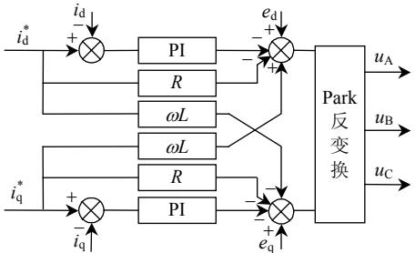  
图1 变流器控制模型简化控制框图  
Fig. 1 Simplified control diagram of the converter model

电网电压 d 轴和 q 轴分量； $u _ { \mathrm { A } }$ 、 $u _ { \mathrm { B } }$ 和 $u _ { \mathrm { C } }$ 分别为经Park 反变换后得到的并网逆变器的三相电压指令。

在以上假设条件和模型结构基础上，本文建立了图 2 所示简化的 PMSG 风力发电机模型。图中：$P _ { \mathrm { o r d } }$ 和 $\mathcal { Q } _ { \mathrm { o r d } }$ 分别为有功功率和无功功率指令； $P _ { \mathrm { E L E C } }$ 和 $\boldsymbol { \mathcal { Q } } _ { \mathrm { E L E C } }$ 分别为有功功率和无功功率测量值； $e _ { \mathrm { A } } .$ 、$e _ { \mathrm { B } } , ~ e _ { \mathrm { C } }$ 为三相电网电压瞬时值； $i _ { \mathrm { A } } , ~ i _ { \mathrm { B } } , ~ i _ { \mathrm { C } }$ 为并网电流瞬时值；模型中，无功功率可以通过外部给定方式(无功功率值或功率因数值)设置，也可以按照电压与无功功率方式进行控制。无论采用何种方式，在系统电压跌落的过程中，都采取无功功率优先的原则，帮助系统尽快从故障中恢复。

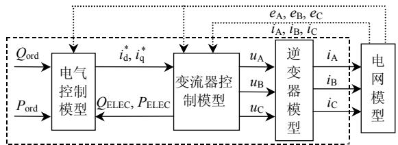  
图 2 PMSG 风力发电机组简化模型结构框图  
Fig. 2 Diagram of simplified PMSG wind turbine model

在 Matlab/Simulink 环境中，本文将该简化模型与考虑了撬棒保护电路的 PMSG 风力发电机全仿真模型进行仿真对比分析，仿真中 12 s 时刻电网三相电压跌落至 20%，持续时间为 100 ms，用于模拟电网短路故障。仿真结果见图 3。从图 3 可以看到，

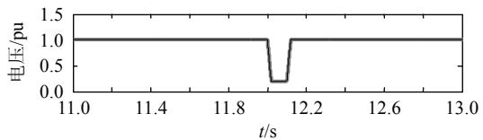  
(a) 发电机端口电压

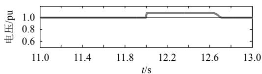

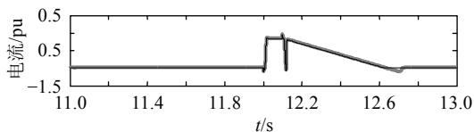  
(b) 变流器直流母线电压   
(c) 有功电流

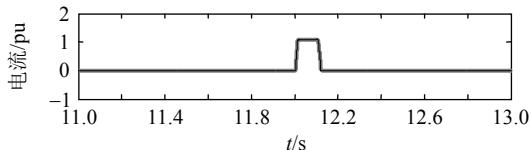  
(d) 无功电流   
全仿真模型； 简化模型。  
图 3 简化模型与全仿真模型仿真结果的比较  
Fig. 3 Comparison of simulation results between simplified model and full model

2 种模型的仿真结果偏差很小，只是全仿真模型的有功电流给定值会在直流母线电压调节器的作用下，有一个很小的超调量。

应用上述模型对在公共连接点(point ofcommon coupling，PCC)电网故障情况下的风力发电机组响应进行仿真研究，仿真中采用的电网模型和参数如图 4 所示。图 4 中变压器 $\mathrm { T _ { 1 } }$ 的变比为220kV/35kV，额定容量为 240MVA，短路阻抗为13%；变压器 $\mathrm { T } _ { 2 }$ 的变比为 35kV/690V，额定容量为 6MVA，短路阻抗为 $6 \% ;$ ；风场内部传输线路采用 π 型等值电路模型，线路长度 $l { = } 2 \mathrm { k m } ; \ B _ { 2 2 0 }$ 表示母线电压制 220kV； $B _ { 3 5 }$ 表示母线电压 35kV。图 5为三相对地短路、两相对地短路、单相对地短路和相间短路 4 种情况下的发电机机端电压、有功功率和无功功率的仿真结果。仿真中设定的故障持续时间均为 100ms。

从图 5 可以看出，对发电机机端电压及功率影响最严重的电网故障为三相对地短路故障，其次为

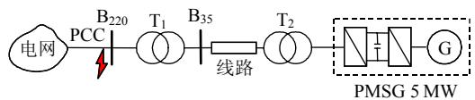  
图4 用于PMSG 风力发电机组仿真的电网模型

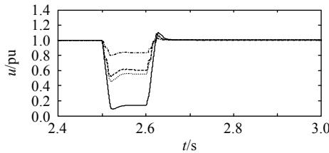  
Fig. 4 Grid model for PMSG wind turbine simulation   
(a) 发电机机端正序电压有效值

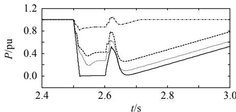

(b) 有功功率

图 5 PMSG 风力发电机组在电网故障下的动态特性  
Fig. 5 Dynamic characteristics of PMSG wind turbine during grid faults   
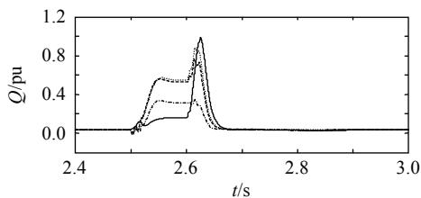  
三相对地短路故障； 两相对地短路故障；  
单相对地短路故障； 相间短路故障。

(c) 无功功率

两相对地短路故障和相间短路故障，最轻的为单相对地短路故障。因此在本文风电场聚合模型的研究中，只对电网三相对地短路故障的电磁暂态过程进行分析。

# 2 PMSG 风电场聚合模型

# 2.1 聚合方法

对于风电场聚合模型的研究，应根据研究目的的不同而采用不同的方法。在电磁暂态稳定研究中，由于暂态过程持续时间很短，可以认为风电场中的自然风速不变，从而各台风力发电机组的有功功率指令不变。在此假定下，本文采用的风电场聚合模型建模原则如下：

1）风电场聚合模型 PCC电压与所聚合的风电场 PCC电压相等。  
2）风电场聚合模型中发电机组装机容量为所聚合的风电场中各个风力发电机组装机容量之和。  
3）风电场聚合模型的输出有功功率与所聚合的风电场 PCC输出有功功率相等。  
4）风电场聚合模型的输出无功功率与所聚合的风电场 PCC输出无功功率相等。

聚合过程中，除了考虑发电机组本身的聚合，模型中还需要考虑风电场内部的配电网(变压器、电缆、架空线)的等效。

按照前述聚合原则，对含有 n 台风力发电机组的风电场进行聚合。首先得到风电场聚合模型中发电机额定容量，即

$$
S _ {\mathrm {G} _ {-} \mathrm {A W F}} = \sum_ {i = 1} ^ {n} S _ {\mathrm {W T G} i} \tag {1}
$$

式中： $S _ { \mathrm { G } \_ \mathrm { A W F } }$ 为风电场聚合模型发电机额定容量；$S _ { \mathrm { W T G \it i } }$ 为风电场中第 i 台风力发电机组的额定容量。

聚合模型输出有功功率：

$$
P _ {\mathrm {A W F}} = \sum_ {i = 1} ^ {n} P _ {\mathrm {W T G} i} - \sum_ {i = 1} ^ {n} P _ {\mathrm {T F} i} - P _ {\mathrm {L}} \tag {2}
$$

式中： $P _ { \mathrm { A W F } }$ 为风电场聚合模型输出有功功率； $P _ { \mathrm { W T G \it { i } } }$ 为第 i 台风力发电机组的有功功率； $P _ { \mathrm { T F } i }$ 为第 i 台风力发电机组的出口升压变压器有功损耗； $P _ { \mathrm { { L } } }$ 为风电场内部传输线有功损耗。

聚合模型输出无功功率为

$$
Q _ {\mathrm {A W F}} = \sum_ {i = 1} ^ {n} Q _ {\mathrm {W T G} i} - \sum_ {i = 1} ^ {n} Q _ {\mathrm {T F} i} + \sum Q _ {\mathrm {C}} - Q _ {\mathrm {L}} \tag {3}
$$

式中： $\mathcal { Q } _ { \mathrm { A W F } }$ 为风电场聚合模型输出的无功功率；$\mathcal { Q } _ { \mathrm { W T G \it i } }$ 为第 i 台风力发电机组输出的无功功率； $\mathcal { Q } _ { \mathrm { T F } i }$

为第 i 台风力发电机组的升压变压器吸收的无功功率； $\Sigma { \mathcal { Q } } _ { \mathrm { C } }$ 为风电场内的无功补偿容量之和； $\mathcal { Q } _ { \mathrm { L } }$ 为风电场内部传输线吸收的无功功率。

# 2.2 200MW PMSG 风电场聚合模型

本文研究的200MW风电场包含了40台PMSG风力发电机组，单台发电机额定功率 $S _ { \mathrm { W T G } } { = } 5 \mathrm { M W }$ 。风电场内部 40 台风力发电机分 5 组、每组各 8 台发电机，通过 5 回35kV集电线路汇集到 220kV升压站，其详细布局见图 6。

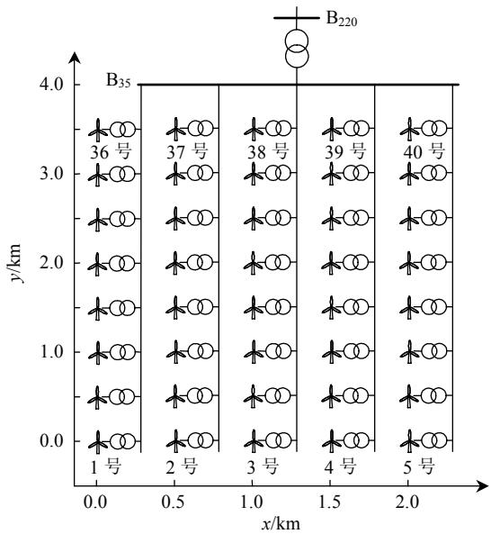  
图 6 200 MW PMSG 风电场平面图  
Fig. 6 Layout of 200 MW PMSG wind farm

为了简化分析计算，假设图 6 中风电场内部35kV 配电网电压处处相等，各风力发电机组工作点相同。并忽略风电场升压站 35kV 母线 $\left( \operatorname { B } _ { 3 5 } \right)$ 电气参数的影响。最终得到风电场的聚合模型，如图 7所示。图中：聚合模型发电机 G 的容量 $S _ { \mathrm { G } _ { - } \mathrm { A W F } } { = }$ $\Sigma S _ { \mathrm { W T G } i } ;$ ；聚合模型升压变压器 $\mathrm { T _ { e q } }$ 的容量 $S _ { \mathrm { T F _ { \_ } A W F } } { = }$ $\Sigma S _ { \mathrm { T F } i } ;$ ；变压器标幺值参数与单台发电机升压变压器相同(见图 4 的说明)。图 7 中等值线路采用 π 型等值电路模型，等值线路的长度 $l _ { \mathrm { e q } }$ 按照等值前后有功和无功功率相等的原则进行计算。

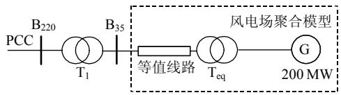  
图 7 200 MW PMSG 风电场聚合模型  
Fig. 7 Aggregated model of 200 MW PMSG wind farm

# 3 聚合模型的仿真验证

本文分别对图 6 的风电场全仿真模型(包含 40台5MW风力发电机组模型)和图7的聚合模型在相同条件下进行仿真，并将结果进行对比。传输线路

参数如下：正序电阻为 0.12Ω/km；正序电感为1.05 mH/km；正序电容为 11 nF/km。聚合模型中变压器的主要参数见表 1。

表1 聚合模型的主要参数  
Tab. 1 Main parameters of aggregated wind farm model   

<table><tr><td rowspan="2">变压器</td><td colspan="4">变压器参数</td></tr><tr><td>额定电压/kV</td><td>额定容量/MVA</td><td>短路电阻/pu</td><td>短路电感/pu</td></tr><tr><td>升压变压器</td><td>35/0.69</td><td>240</td><td>0.002</td><td>0.06</td></tr><tr><td>主变压器</td><td>220/35</td><td>240</td><td>0.004</td><td>0.13</td></tr></table>

设所有风力发电机组工作在额定工况，即有功指令均设置为 1.0pu，在0.5s时刻风电场 PCC 电压跌落至额定值的 20%，并持续 100ms，仿真结果如图 8 所示。

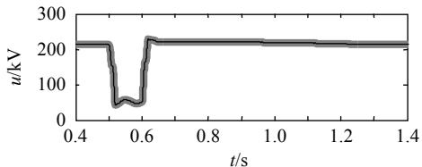

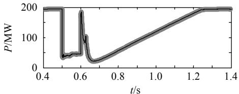  
(a) PCC 电压

(b) PCC 有功功率

图8 风电场全仿真模型和聚合模型仿真结果比较   
Fig. 8 Comparison of wind farm full simulation model and aggregated model   
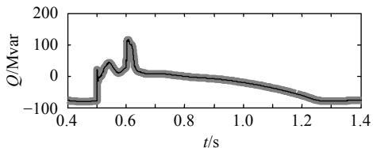  
风电场模型； 聚合模型。

(c) PCC 无功功率

从图 8 的对比仿真结果可以看出，无论是在稳态情况下还是在暂态情况下，聚合模型与全仿真模型取得了一致的结果，从而验证了聚合方法的正确性。

下文分析风电场内部的集电线路和风力发电机组出口升压变压器对聚合模型精度的影响。在图7所示聚合模型的基础上，设置了3种仿真算例：算例 1 包括等值传输线和升压变压器；算例 2忽略等值传输线；算例3忽略等值传输线和升压变压器。

上述 3 种算例的仿真结果见图 9。从图 9 可以看出，690V/35kV升压变压器对聚合模型结果的影响显著；集电线路对聚合模型的仿真结果影响不大。在风电场模型聚合过程中，必须对变压器进行

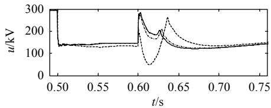

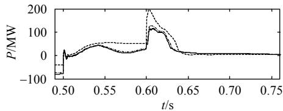  
(a) PCC 电压

(b) PCC 有功功率

图9 集电线路和升压变压器对风电场聚合模型的影响  
Fig. 9 Impact of network and step up transformers on wind farm aggregation model   
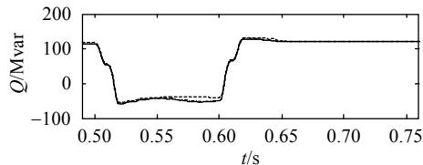  
算例 1； 算例 2； 算例 3。

(b) PCC 有功功率

建模；对于集电线路模型，在本文的算例中可以忽略。对于更大规模的风电场或需要更高仿真精度时，应具体分析是否包含集电线路模型。

# 4 结论

1）本文建立了用于电磁暂态分析的 PMSG 风电场聚合模型，并进行了仿真分析与验证。对简化的 PMSG风力发电机组的分析表明，对发电机机端电压及功率输出影响最严重的电网故障为三相对地短路故障。  
2）按照功率等效原则建立了 PMSG 风电场聚合模型，该聚合模型包含了发电机出口升压变压器模型和风电场内部集电线路模型。  
3）200MW风电场的聚合模型和其全仿真模型的对比分析表明，在风电场中各机组工作点近似相等的情况下，该聚合模型可以很好地表示风电场电磁暂态特性。  
4）分析了风电场内部升压变压器和传输线参数对聚合模型的影响。仿真结果表明，风力发电机组的升压变压器对聚合模型影响显著，而风电场内集电线路对模型的影响程度与风电场的规模和线路参数有关。  
5）本文讨论的风电场模型适用于电磁暂态仿真研究，对于机电暂态研究，文中一些假设条件如风速、桨距角不变等将不再满足，风速模型将变得更为重要，另一方面，模型内部的动态过程可以进

一步简化。因此适用于机电暂态仿真的风电模型的具体实现有待于进一步研究。

# 参考文献

[1] Slootweg J G，Kling W L．Aggregated modeling of wind parks in power system dynamics simulations[C]//2003 IEEE Power Technology Conference Proceedings．Bologna：IEEE，2003：6-9．   
[2] Ackerman T．Wind power in power systems[M]．New York：John Wiley& Sons, Inc.，2005：55-57，670-672   
[3] 张兴．风力发电低电压穿越技术综述[J]．电力系统及其自动化学报，2008，20(2)：1-8  
Zhang Xing．Low voltage ride-through technologies in wind turbinegeneration[J]．Proceedings of the Chinese Society of Universities forElectric Power System and Automation，2008，20(2)：1-8(in Chinese)  
[4] Ribrant J，Bertling L M．Survey of failures in wind power systems with focus on Swedish wind power plants during 1997—2005[J] IEEE Trans on Energy Conversion，2007，22(1)：167-173   
[5] Salo J．The attraction of simplicity：permanent magnet machines are here to stay[J]．ABB Review，2009(2)：29-34   
[6] Suwannarat A ． Wind farms in weak grids compensated with STATCOM[D]．Aalborg：Aalborg University，2005．   
[7] Akhmatov V．Analysis of dynamic behaviour of electronic power systems with large amount of wind power[D]．Copenhagen：Technical University of Denmark，2003   
[8] Slootweg J G．Wind power modelling and impact on power system dynamics[D]．Delft：Delft University of Technology，2003   
[9] Fernandez L M，Garcia C A，Saenz J R，et al．Reduced model of DFIGs wind farms using aggregation of wind turbines and equivalent wind[C]//IEEE Mediterranean Electrotechnical Conference．Malaga， Spain：IEEE，2006：881-884   
[10] C4 WG601．Modeling and dynamic behavior of wind generator as it relates to power system control and dynamic performance[R]．Paris， France：CIGRE，2007   
[11] 王守相，徐群，张高磊，等．风电场风速不确定性建模及区间潮流分析[J]．电力系统自动化，2009，33(21)：82-86  
Wang Shouxiang，Xu Qun，Zhang Gaolei，et al．Modeling of wind speed uncertainty and interval power flow analysis for wind farms[J] Automation of Electric Power Systems，2009，33(21)：82-86(in Chinese)

[12] Conroy J，Watson R．Aggregate modeling of wind farms containing full converter wind turbine generators with permanent magnet synchronous machines: transient stabilities[J]．IET Renewable Power Generation，2008，3(1)：39-52   
[13] Perdana A．Dynamic models of wind turbines[D]．Denmark ： Technical University of Denmark，2008．   
[14] 曹娜．潮流计算中风电场的等值[J]．电网技术，2006，30(9)：53-56Cao Na．Equivalence method of wind farm in steady-state load flowcalculation[J]．Power System Technology，2006，30(9)：53-56 (inChinese)  
[15] Slootweg J G．General model for representing variable speed windturbines in power system dynamics simulations[J]．IEEE Trans onPower Systems，2003，18(1)：144-151  
[16] Deng F，Cheng Z．Low voltage ride-through of variable speed wind turbines with permanent magnet synchronous generator[C]//35th Annual Conference of IEEE Industrial Electronics，IECON’09．Porto， Portugal：IEEE Industrial Electronics Society，2009：621-626   
[17] Nian H，Liu J，Zhou P，et al．Improved control strategy of an active crowbar for directly-driven PM wind generation system under grid voltage dips[C]//ICEMS 2008．Wuhan，China：CES，NSFC，KIEE， IEEJ，2008：2294-2298   
[18] Achilles S，Poller M．Direct drive synchronous machine models for stability assessment of wind farms[C]//Proceedings of 4th International Workshop on Large-scale Integration of Wind Power and Transmission Networks for Offshore Wind Farms．Billund， Denmark：IEEE，2003．

  
杨晓波

收稿日期：2010-12-05。

作者简介：

杨晓波(1973)，男，博士，研究方向为交流柔性输电系统、大规模风电并网技术等，E-mail：xiaobo.yang@cn.abb.com；

岳程燕(1976) 女，博士，研究方向为电力系统分析与仿真、新能源并网技术、高压直流输电等，E-mail：chengyan.yue@cn.abb.com；

谢海莲(1969)，女，博士，研究方向为交流柔性输电系统和高压直流输电、电力电子变流器、能量存储系统等，E-mail：hailian.xie@cn.abb.com。

（责任编辑 杜宁）