# Stability-improved network partition based on a small-step synthesis model for electromagnetic transient simulation

Haoran Zhao, Changwang Zhao, Bing Li ∗, Luwei Tan

School of Electrical Engineering, Shandong University, Jinan 250061, China

# A R T I C L E I N F O

Keywords:

Electromagnetic transient

Simulation

Network partition

Stability analysis

Small-time step synthesis

# A B S T R A C T

Electromagnetic transient simulation offers high fidelity for modern power systems with high penetration of power electronics, but it suffers from low efficiency due to small time step requirements. To improve efficiency, network partition based on energy storage elements (i.e., capacitors and inductors) has gained attention, yet its numerical stability is limited by the simulation time step. This paper proposes a stability-improved network partition method using a small-step synthesis model. First, the semi-implicit leapfrog method-based network partition formulation is derived. Second, the small-step synthesis model-based network partition method is proposed. The method improves the numerical stability of the simulation by applying a small-step synthesis model to the network partition branches. Finally, the stability boundaries for the time step and synthesis order are derived based on the Lyapunov criterion and spectral radius analysis. The IEEE 14-bus system and a wind farm model are used to validate the proposed method. The results demonstrate that the proposed method enhances stability without sacrificing accuracy or efficiency.

# 1. Introduction

With the large-scale integration of wind and photovoltaic power, modern power systems are increasingly characterized by high penetration of power electronics and renewable generation [1,2]. As a result, the broadband oscillation phenomenon gradually intensifies in modern power systems [3]. Traditional electromechanical transient simulation method can only capture the dynamics near the fundamental frequency (e.g., 50 Hz or 60 Hz) [4]. It fails to reflect broadband oscillation phenomenon. In contrast, electromagnetic transient simulation (EMT) retains all physical details including system nonlinearity and highfrequency characteristics introduced by power electronic devices [5, 6].

Despite its advantages, EMT simulation suffers from efficiency limitations [7]. To accurately represent the switching behavior of power electronic devices, the simulation time step must be constrained to the microsecond level [8,9]. Such a small time step leads to extremely low computational efficiency when applied to large-scale renewable energyintegrated power systems with thousands of nodes [10]. Hence, it highlights the urgent need for more efficient EMT simulation methods.

By network partition, the large-scale power system can be divided into multiple subsystems, thereby reducing the dimension of the admittance matrix. Thus, the simulation efficiency can be highly improved [11,12]. Existing network partition methods can be broadly classified into three categories based on the underlying principles. The

first category involves natural partitioning based on long transmission lines [13] which leverage the inherent wave propagation delay of the transmission lines. It can achieves high accuracy without introducing simulation errors. However, long transmission lines of sufficient length are not present in many power systems, thereby restricting the practical applicability [14]. The second category involves rigorous mathematical transformations applied to the original system equations to enable network partitioning, with the key challenge being the accurate and efficient calculation of interface variables between subsystems. Representative approaches include the branch tearing and node splitting methods proposed in [15,16], where interface variables between subsystems are determined by updating a reduced-order nodal admittance matrix involving only the boundary nodes. In a similar context, the multi-area Thevenin equivalent method proposed in [17] models each subsystem as a multi-port equivalent circuit and coordinates them through centralized interface equations. Additionally, the waveform relaxation method enables each subsystem to independently solve its dynamic equations while iteratively exchanging waveforms of the interface variables to ensure consistency [18,19]. Recently, hybrid approaches that combine the strengths of the mentioned methods have been introduced to enhance partition granularity and improve overall simulation efficiency [20,21]. Although these methods offer high accuracy, they are limited by the increasing computational burden

Table 1 Comparison of existing methods.   

<table><tr><td>Refs.</td><td>Cat. I [13]</td><td>[14]</td><td>Cat. II [15]-[21]</td><td>[22]-[25]</td></tr><tr><td>Accuracy</td><td>★★★</td><td></td><td>★★★</td><td>★★★</td></tr><tr><td>Efficiency</td><td>★</td><td></td><td>★★</td><td>★★★</td></tr><tr><td>Stability</td><td>★★★</td><td></td><td>★★★</td><td>★</td></tr></table>

for interface variable, which grows significantly with the number of subsystems and hinders scalability for large-scale systems.

The third category performs network partitioning based on energy storage elements (i.e., capacitors and inductors), which are more commonly found in power systems compared to long transmission lines. In addition, the computational burden associated with interface variable handling increases only linearly with the number of subsystems, making this approach more efficient than the second category of methods. Refs. [22,23] employ a forward Euler method to discretize energy storage elements, enabling a one-step-delay network partition scheme. Ref. [24] introduces an explicit–implicit hybrid integration strategy along with a fine-grained partitioning scheme tailored for double fed induction generator (DFIG)-based wind farms with LLL/LCL branches. The semi-implicit leapfrog method (SILM) is adopted to create half-step delays between the calculation of branch currents and node voltages, thereby enabling the parallel computation of currents and voltage [25]. Although these methods are more flexible than the first category and computationally more efficient than the second, they suffer from notable numerical stability issues [26]. Specifically, the maximum allowable simulation time step for ensuring numerical stability is constrained by the parameters of the energy storage elements [27], such as the values of capacitors and inductors. When the system fails to satisfy the stability requirement, the inductance or capacitance values at the partition interface must be artificially enlarged to achieve numerical convergence. This inevitably introduces modeling errors, thereby preventing the final simulation accuracy from meeting the required standard. To provide a clear comparison of the advantages and limitations of the above three categories (i.e., Cat. I, Cat. II, Cat. III), Table 1 summarizes their performance in terms of accuracy, efficiency and stability. It can be observed that while all categories of methods perform well in terms of accuracy, they generally fail to strike a balance between efficiency and stability. This further highlights a critical research gap, motivating the need for a method that effectively reconciles these competing objectives.

To address the above issue, this paper proposes a stability-improved network partition method for EMT simulation based on the small-step synthesis model. The proposed method can improve the stability of the system without enlarging the LC parameter by using the smallstep synthesis model for the network partition branches. To the best of the authors’ knowledge, this work is the first to apply the smallstep synthesis model to network partition for improving the simulation stability.

The major contributions of this paper are as follows:

(1) A network partition method based on the semi-implicit leapfrog scheme and energy storage elements is derived, enabling the division of the system into subsystems that can be simulated in parallel.   
(2) The small-step synthesis model for network partition is proposed. It avoids the traditional constraint between the time step and the parameters of the energy storage elements, thereby significantly enhancing simulation stability.   
(3) By analyzing the synthesis order, defined as the ratio of the global simulation time step to the small model time step, we show that increasing it improves the numerical stability of the proposed method.   
(4) By Lyapunov stability theory, the stability boundaries of the proposed small-step synthesis model-based network partition method are established. The resulting analytical expressions provide explicit

guidance for selecting an appropriate synthesis order ?? for constructing the model.

The rest of this article is organized as follows. Section 2 introduces the basic theory of SILM and derives two types of network partition methods based on SILM. Section 3 introduces the stability improved network partition method based on small-step synthesis model. Section 4 conducts stability analysis on the proposed method and derives analytical solutions for synthesis order ??. Section 5 illustrates the case study of the modified IEEE 14-bus system and wind farm model, and analyzes the simulation results. Finally, Section 6 concludes this article.

# 2. SILM-based network partition

This section first introduces the basic theory of SILM. Then, the SILM-based network partition method is derived for two types of branches composed of energy storage elements, along with the corresponding simulation procedure. Finally, the state-space models of the partitioned branches are provided, serving as the foundation for the subsequent derivations in Sections 3 and 4.

# 2.1. Basic theory of SILM

The SILM is a numerical integration algorithm that combines the computational efficiency of explicit schemes with the numerical stability of implicit methods. Using a simple damped–spring–mass system as an example, the governing differential equations are expressed as:

$$
\left\{ \begin{array}{c} \frac {\mathrm {d} x}{\mathrm {d} t} = v \\ M \frac {\mathrm {d} v}{\mathrm {d} t} = - K x - C v \end{array} \right. \tag {1}
$$

where ?? is the mass; ?? is the velocity; ?? is the displacement; ?? is the spring stiffness coefficient; and ?? is the damping coefficient. By applying the SILM to discretize the system, the following expressions are obtained:

$$
\left\{ \begin{array}{l} \frac {x ^ {n + 1} - x ^ {n}}{\Delta T} = v ^ {n + \frac {1}{2}} \\ M \frac {v ^ {n + \frac {1}{2}} - v ^ {n - \frac {1}{2}}}{\Delta T} = - K x ^ {n} - C \frac {v ^ {n + \frac {1}{2}} + v ^ {n - \frac {1}{2}}}{2} \end{array} \right. \tag {2}
$$

in which, ???? denotes the simulation time step; ????+1 and $x ^ { n }$ represent the displacement at the time of (?? + 1)???? and ?????? , respectively; $\scriptstyle v ^ { n + 1 / 2 }$ and $v ^ { n - 1 / 2 }$ represent the velocity at the time of $( n + 1 / 2 ) { \cal { \Delta } } T$ and $( n -$ $1 / 2 ) { \cal A } T$ , respectively.

The SILM combines the numerical stability of implicit schemes with the computational efficiency of explicit methods, making it particularly suitable for modeling partition branches in EMT simulations.

# 2.2. Network partition on the LCL branch

The network partition on the LCL branch (NP-LCL) is constructed using the branch shown in Fig. 1. It consists of two series-connected resistive–inductive branches and a intermediate capacitive branch. $R _ { \alpha }$ and $L _ { \alpha }$ represent the resistance and inductance connected to subsystem ??; $R _ { \beta }$ and $L _ { \beta }$ denote the resistance and inductance connected to subsystem $\beta ; C$ is the intermediate capacitance.

The differential equations for the LCL branch are:

$$
\left\{ \begin{array}{l} U _ {\mathrm {c}} - U _ {\alpha} = L _ {\alpha} \frac {\mathrm {d} I _ {\alpha}}{\mathrm {d} t} + R _ {\alpha} I _ {\alpha} \\ U _ {\mathrm {c}} - U _ {\beta} = L _ {\beta} \frac {\mathrm {d} I _ {\beta}}{\mathrm {d} t} + R _ {\beta} I _ {\beta} \\ - I _ {\alpha} - I _ {\beta} = C \frac {\mathrm {d} U _ {\mathrm {c}}}{\mathrm {d} t} \end{array} \right. \tag {3}
$$

where $U _ { \alpha }$ is the boundary node voltage of subsystem ??; $U _ { \beta }$ is the boundary node voltage of subsystem $\beta ; I _ { \alpha }$ is the current of inductor $L _ { \alpha } ,$ defined as positive in the direction toward subsystem ??; $I _ { \beta }$ is the

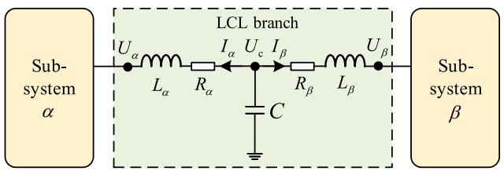  
Fig. 1. Diagram of NP-LCL branch.

current of inductor $\begin{array} { r } { L _ { \beta } , } \end{array}$ defined as positive in the direction toward subsystem $\beta ; U _ { \mathrm { c } }$ is the voltage across the intermediate capacitor.

By applying the SILM to discretize the above equations:

$$
\left\{ \begin{array}{l} U _ {\mathrm {c}} ^ {n} - U _ {\alpha} ^ {n} = L _ {\alpha} \frac {I _ {\alpha} ^ {n + \frac {1}{2}} - I _ {\alpha} ^ {n - \frac {1}{2}}}{\Delta T} + R _ {\alpha} \frac {I _ {\alpha} ^ {n + \frac {1}{2}} + I _ {\alpha} ^ {n - \frac {1}{2}}}{2} \\ U _ {\mathrm {c}} ^ {n} - U _ {\beta} ^ {n} = L _ {\beta} \frac {I _ {\beta} ^ {n + \frac {1}{2}} - I _ {\beta} ^ {n - \frac {1}{2}}}{\Delta T} + R _ {\beta} \frac {I _ {\beta} ^ {n + \frac {1}{2}} + I _ {\beta} ^ {n - \frac {1}{2}}}{2} \\ - I _ {\alpha} ^ {n + \frac {1}{2}} - I _ {\beta} ^ {n + \frac {1}{2}} = C \frac {U _ {\mathrm {c}} ^ {n + 1} - U _ {\mathrm {c}} ^ {n}}{\Delta T} \end{array} \right. \tag {4}
$$

where ???? denotes the simulation time step; $U _ { \alpha } ^ { n }$ and $U _ { \beta } ^ { n }$ represent the voltages at nodes ?? and ?? at time ?????? , respectively; $\stackrel { r } { U } _ { c } ^ { n }$ denotes the voltage at intermediate capacitor at time ?????? ; $I _ { \alpha } ^ { n - \bar { 1 } / 2 }$ c2 nd ????−1∕2 a $I _ { \beta } ^ { n - 1 / 2 }$ ?? represent the currents of branches $c - \alpha$ and ${ \mathfrak { c } } - \beta$ at time $( n - 1 / \hat { 2 } ) \Delta T _ { : }$ , respectively; $U _ { \alpha } ^ { n + 1 }$ 1 denotes the voltage at intermediate capacitor at time c(?? + 1)???? ; ????+1∕2?? a $( n + 1 ) { \cal A T } ; \stackrel { \sim } { I _ { \alpha } ^ { n + 1 / 2 } }$ nd ????+1∕2 $I _ { \beta } ^ { n + 1 / 2 }$ ?? represent the currents of branches $c - \alpha$ and ${ \mathfrak { c } } - \beta$ at time $( n + 1 / 2 ) \Delta T$ , respectively. The fractional superscripts indicate that the updates of currents and voltages are asynchronous. Here, all branch currents are updated first, followed by the update of the voltage at intermediate capacitor, with the current and voltage updates staggered by half a simulation time step.

By algebraic manipulation, the update expressions for the branch current s ????+1∕2, $\stackrel { \cup } { I } _ { \alpha } ^ { n + 1 / 2 } , \ I _ { \beta } ^ { n + 1 / 2 }$ ???? , and the node voltage $U _ { \mathrm { c } } ^ { n + 1 }$ can be derived as follows:

$$
I _ {\alpha} ^ {n + \frac {1}{2}} = P _ {\alpha} ^ {+} P _ {\alpha} ^ {-} I _ {\alpha} ^ {n - \frac {1}{2}} + P _ {\alpha} ^ {+} U _ {\mathrm {c}} ^ {n} - P _ {\alpha} ^ {+} U _ {\alpha} ^ {n} \tag {5}
$$

$$
I _ {\beta} ^ {n + \frac {1}{2}} = P _ {\beta} ^ {+} P _ {\beta} ^ {-} I _ {\beta} ^ {n - \frac {1}{2}} + P _ {\beta} ^ {+} U _ {\mathrm {c}} ^ {n} - P _ {\beta} ^ {+} U _ {\beta} ^ {n} \tag {6}
$$

$$
U _ {\mathrm {c}} ^ {n + 1} = U _ {\mathrm {c}} ^ {n} - \frac {\Delta T}{C} I _ {\alpha} ^ {n + \frac {1}{2}} - \frac {\Delta T}{C} I _ {\beta} ^ {n + \frac {1}{2}} \tag {7}
$$

in which,

$$
P _ {\alpha} ^ {+} = \left(\frac {L _ {\alpha}}{\Delta T} + \frac {R _ {\alpha}}{2}\right) ^ {- 1} \quad P _ {\alpha} ^ {-} = \left(\frac {L _ {\alpha}}{\Delta T} - \frac {R _ {\alpha}}{2}\right) \tag {8}
$$

$$
P _ {\beta} ^ {+} = \left(\frac {L _ {\beta}}{\Delta T} + \frac {R _ {\beta}}{2}\right) ^ {- 1} \quad P _ {\beta} ^ {-} = \left(\frac {L _ {\beta}}{\Delta T} - \frac {R _ {\beta}}{2}\right) \tag {9}
$$

From (5) to (7), it can be observed that updating the inductor currents and capacitor voltage in the LCL branch requires only the boundary voltages $U _ { \alpha } ^ { n }$ and $U _ { \beta } ^ { n }$ from the previous simulation step. This indicates that the system can be partitioned at the LCL branch, as illustrated in Fig. 2. After partitioning, the model consists of subsystem ??, subsystem $\beta ,$ and the LCL branch.

Taking a complete simulation time step [?????? , $( n \mathrm { ~ + ~ } 1 ) \Delta T ]$ as an example, the simulation procedure of the network partitioned system include 3 stages.

(1) Stage 1: At initial time ?????? , subsystems ?? and ?? are simulated in parallel to obtain $U _ { \alpha } ^ { n }$ and $U _ { \beta } ^ { n } \colon$ , which are then transmitted to the next stage of the simulation.   
(2) Stage 2: The branch currents $I _ { \alpha } ^ { n + 1 / 2 }$ ?? a nd ????+1∕2 ar $I _ { \beta } ^ { n + 1 / 2 }$ e calculated by (5) and (6).

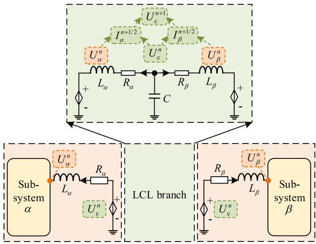  
Fig. 2. Diagram of the NP-LCL branch based on SILM.

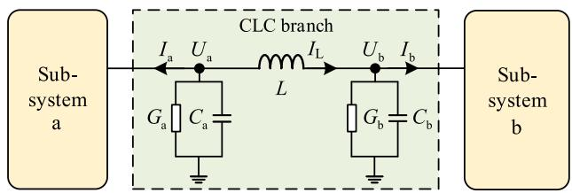  
Fig. 3. Diagram of NP-CLC branch.

(3) Stage 3: $U _ { \mathrm { c } } ^ { n + 1 }$ is calculated by (7). Furthermore, it is fed back as a controlled voltage source to subsystems ?? and ??.

It can be seen that the above network-partition method enables subsystems ?? and ?? to be simulated in parallel, thereby improving overall simulation efficiency. It should also be emphasized that the coupling variables between the LCL branch and the external subsystems are integer-step voltage variables rather than the half-step current variables used in the SILM formulation. Therefore, the subsystem ?? and subsystem $\beta$ can meet this network partition method as long as they can provide voltage variables at the integer-step time. As a result, the two subsystems can use any numerical integration format without the limitation of SILM.

# 2.3. Network partition on the CLC branch

The network partition on the CLC branch (NP-CLC) is constructed using the branch shown in Fig. 3. It consists of two grounded admittance branches and a intermediate inductive branch. $G _ { \mathrm { a } }$ and $C _ { \mathrm { a } }$ represent the conductance and capacitance connected to subsystem a; $G _ { \mathrm { b } }$ and $C _ { \mathrm { b } }$ denote the conductance and capacitance connected to subsystem $\mathsf { b } ; I$ is the intermediate inductance.

The differential equations for the CLC branch are:

$$
\left\{ \begin{array}{l} - I _ {\mathrm {L}} - I _ {\mathrm {a}} = C _ {\mathrm {a}} \frac {\mathrm {d} U _ {\mathrm {a}}}{\mathrm {d} t} + G _ {\mathrm {a}} U _ {\mathrm {a}} \\ I _ {\mathrm {L}} - I _ {\mathrm {b}} = C _ {\mathrm {b}} \frac {\mathrm {d} U _ {\mathrm {b}}}{\mathrm {d} t} + G _ {\mathrm {b}} U _ {\mathrm {b}} \\ U _ {\mathrm {a}} - U _ {\mathrm {b}} = L \frac {\mathrm {d} I _ {\mathrm {L}}}{\mathrm {d} t} \end{array} \right. \tag {10}
$$

where $U _ { \mathrm { a } }$ is the voltage across $C _ { \mathrm { a } }$ and $G _ { \mathrm { a } } \mathrm { : } U _ { \mathrm { b } }$ is the voltage across $C _ { \mathrm { b } }$ and $G _ { \mathrm { b } } ; I _ { \mathrm { a } }$ is the boundary current of subsystem a, defined as positive in the direction toward subsystem a; $I _ { \mathrm { b } }$ is the boundary current of subsystem $\mathbf { b } ,$ defined as positive in the direction toward subsystem b; $I _ { \mathrm { L } }$ is the

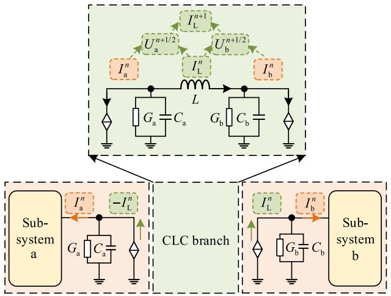  
Fig. 4. Diagram of the NP-CLC branch based on SILM.

current of intermediate inductor, defined as positive in the direction flowing out of node a.

By applying the SILM to discretize the above equations:

$$
\left\{ \begin{array}{l} - I _ {\mathrm {L}} ^ {n} - I _ {\mathrm {a}} ^ {n} = C _ {\mathrm {a}} \frac {U _ {\mathrm {a}} ^ {n + \frac {1}{2}} - U _ {\mathrm {a}} ^ {n - \frac {1}{2}}}{\Delta T} + G _ {\mathrm {a}} \frac {U _ {\mathrm {a}} ^ {n + \frac {1}{2}} + U _ {\mathrm {a}} ^ {n - \frac {1}{2}}}{2} \\ + I _ {\mathrm {L}} ^ {n} - I _ {\mathrm {b}} ^ {n} = C _ {\mathrm {b}} \frac {U _ {\mathrm {b}} ^ {n + \frac {1}{2}} - U _ {\mathrm {b}} ^ {n - \frac {1}{2}}}{\Delta T} + G _ {\mathrm {b}} \frac {U _ {\mathrm {b}} ^ {n + \frac {1}{2}} + U _ {\mathrm {b}} ^ {n - \frac {1}{2}}}{2} \\ U _ {\mathrm {a}} ^ {n + \frac {1}{2}} - U _ {\mathrm {b}} ^ {n + \frac {1}{2}} = L \frac {I _ {\mathrm {L}} ^ {n + 1} - I _ {\mathrm {L}} ^ {n}}{\Delta T} \end{array} \right. \tag {11}
$$

where $U _ { \mathrm { a } } ^ { n - 1 / 2 }$ and $U _ { \bf h } ^ { n - 1 / 2 }$ represent the voltages at nodes a and b at time $( n - 1 / 2 ) { \cal { \Delta } } T$ , respectively; $I _ { \mathrm { a } } ^ { n }$ and $I _ { \mathfrak { b } } ^ { n }$ denote the boundary currents of subsystem a and subsystem b at time ?????? , respectively; $I _ { \mathrm { I } } ^ { n }$ denotes the current of intermediate inductor at time ?????? ; $U _ { \mathrm { a } } ^ { n + 1 / 2 }$ and $U _ { \mathrm { b } } ^ { n + 1 / 2 }$ represent the voltages at nodes a and b at time $( n + 1 / 2 ) \Delta T$ , respectively; $I _ { \mathrm { L } } ^ { n + 1 }$ denotes the current of intermediate inductor at time $( n + 1 ) \Delta T$ . Unlike the NP-LCL, here all node voltages are updated first, followed by the update of the current of intermediate inductor.

By algebraic manipulation, the update expressions for the node voltages $U _ { \mathrm { a } } ^ { n + 1 / 2 } , U _ { \mathrm { b } } ^ { n + 1 / 2 }$ , and the current $I _ { \mathrm { L } } ^ { n + 1 }$ can be derived as follows:

$$
U _ {\mathrm {a}} ^ {n + \frac {1}{2}} = Q _ {\mathrm {a}} ^ {+} Q _ {\mathrm {a}} ^ {-} U _ {\mathrm {a}} ^ {n - \frac {1}{2}} - Q _ {\mathrm {a}} ^ {+} I _ {\mathrm {L}} ^ {n} - Q _ {\mathrm {a}} ^ {+} I _ {\mathrm {a}} ^ {n} \tag {12}
$$

$$
U _ {\mathrm {b}} ^ {n + \frac {1}{2}} = Q _ {\mathrm {b}} ^ {+} Q _ {\mathrm {b}} ^ {-} U _ {\mathrm {b}} ^ {n - \frac {1}{2}} + Q _ {\mathrm {b}} ^ {+} I _ {\mathrm {L}} ^ {n} - Q _ {\mathrm {b}} ^ {+} I _ {\mathrm {b}} ^ {n} \tag {13}
$$

$$
I _ {\mathrm {L}} ^ {n + 1} = I _ {\mathrm {L}} ^ {n} + \frac {\Delta T}{L} U _ {\mathrm {a}} ^ {n + \frac {1}{2}} - \frac {\Delta T}{L} U _ {\mathrm {b}} ^ {n + \frac {1}{2}} \tag {14}
$$

in which,

$$
Q _ {\mathrm {a}} ^ {+} = \left(\frac {C _ {\mathrm {a}}}{\Delta T} + \frac {G _ {\mathrm {a}}}{2}\right) ^ {- 1} \quad Q _ {\mathrm {a}} ^ {-} = \left(\frac {C _ {\mathrm {a}}}{\Delta T} - \frac {G _ {\mathrm {a}}}{2}\right) \tag {15}
$$

$$
Q _ {\mathrm {b}} ^ {+} = \left(\frac {C _ {\mathrm {b}}}{\Delta T} + \frac {G _ {\mathrm {b}}}{2}\right) ^ {- 1} \quad Q _ {\mathrm {b}} ^ {-} = \left(\frac {C _ {\mathrm {b}}}{\Delta T} - \frac {G _ {\mathrm {b}}}{2}\right) \tag {16}
$$

From (12) to (14), it can be observed that updating the inductor current and capacitor voltages of the CLC branch requires only the boundary currents $I _ { \mathrm { a } } ^ { n }$ and $I _ { \mathfrak { b } } ^ { n }$ from the previous simulation step. This indicates that the system can be partitioned at the CLC branch, as illustrated in Fig. 4. After partitioning, the model consists of subsystem a, subsystem $\mathbf { b } ,$ and the CLC branch.

Similar to NP-LCL, taking the simulation time step $[ n \Delta T , ( n + 1 ) \Delta T ]$ ] as an example, the simulation procedure of the network partitioned system include 3 stages.

(1) Stage 1: At initial time ?????? , subsystems a and b are simulated in parallel to obtain $I _ { \mathrm { a } } ^ { n }$ and $I _ { \mathrm { b } } ^ { n } { } _ { : }$ , which are then transmitted to the next stage of the simulation.   
(2) Stage 2: The node voltages $U _ { \mathrm { a } } ^ { n + 1 / 2 }$ and $U _ { \mathrm { b } } ^ { n + 1 / 2 }$ are calculated by (12) and (13).   
(3) Stage 3: $I _ { \mathrm { L } } ^ { n + 1 }$ is calculated by (14). Furthermore, it is fed back as a controlled current source into subsystems a and b.

It is evident that subsystems a and b can also be simulated in parallel using the proposed NP-CLC method. Similar to the NP-LCL method, subsystems a and b can use any numerical integration format without the limitation of SILM.

# 2.4. State-space model

To facilitate subsequent analysis and the application of the smallstep synthesis modeling method, we re-formulate the equations of NP-LCL and NP-CLC into a discrete-time state-space model. The corresponding state and output equations for NP-LCL and NP-CLC are derived, respectively.

# 2.4.1. State-space model of the NP-LCL

By substituting difference equations (5) and (6) into $( 7 ) ,$ , the voltage $U _ { \mathrm { c } }$ is obtained as:

$$
\begin{array}{l} U _ {\mathrm {c}} ^ {n + 1} = - P _ {\alpha} ^ {+} P _ {\alpha} ^ {-} \frac {\Delta T}{C} I _ {\alpha} ^ {n - \frac {1}{2}} - P _ {\beta} ^ {+} P _ {\beta} ^ {-} \frac {\Delta T}{C} I _ {\beta} ^ {n - \frac {1}{2}} \\ + \left[ 1 - P _ {\alpha} ^ {+} \frac {\Delta T}{C} - P _ {\beta} ^ {+} \frac {\Delta T}{C} \right] U _ {\mathrm {c}} ^ {n} \tag {17} \\ + P _ {\alpha} ^ {+} \frac {\Delta T}{C} U _ {\alpha} ^ {n} + P _ {\beta} ^ {+} \frac {\Delta T}{C} U _ {\beta} ^ {n} \\ \end{array}
$$

We define the inductor currents $I _ { \alpha }$ and $I _ { \beta } ,$ , and the capacitor voltage $U _ { \mathrm { c } }$ as the state variables. Thus, the state equation of the NP-LCL is:

$$
\left[ \begin{array}{l} I _ {\alpha} ^ {n + \frac {1}{2}} \\ I _ {\beta} ^ {n + \frac {1}{2}} \\ U _ {\mathrm {c}} ^ {n + 1} \end{array} \right] = \mathbf {A} _ {\mathrm {L C L}} \left[ \begin{array}{l} I _ {\alpha} ^ {n - \frac {1}{2}} \\ I _ {\beta} ^ {n - \frac {1}{2}} \\ U _ {\mathrm {c}} ^ {n} \end{array} \right] + \mathbf {B} _ {\mathrm {L C L}} \left[ \begin{array}{l} U _ {\alpha} ^ {n} \\ U _ {\beta} ^ {n} \end{array} \right] \tag {18}
$$

in which, the state transition matrix $\mathbf { A } _ { \mathrm { L C L } }$ and the input matrix ${ \bf B } _ { \mathrm { L C I } }$ are:

$$
\mathbf {A} _ {\mathrm {L C L}} =
$$

$$
\left[ \begin{array}{c c c} P _ {\alpha} ^ {+} P _ {\alpha} ^ {-} & 0 & P _ {\alpha} ^ {+} \\ 0 & P _ {\beta} ^ {+} P _ {\beta} ^ {-} & P _ {\beta} ^ {+} \\ - P _ {\alpha} ^ {+} P _ {\alpha} ^ {-} \frac {\Delta T}{C} & - P _ {\beta} ^ {+} P _ {\beta} ^ {-} \frac {\Delta T}{C} & \left(1 - P _ {\alpha} ^ {+} \frac {\Delta T}{C}\right) \\ & & - P _ {\beta} ^ {+} \frac {\Delta T}{C} \end{array} \right] \tag {19}
$$

$$
\mathbf {B} _ {\mathrm {L C L}} = \left[ \begin{array}{c c} - P _ {\alpha} ^ {+} & 0 \\ 0 & - P _ {\beta} ^ {+} \\ P _ {\alpha} ^ {+} \frac {\Delta T}{C} & P _ {\beta} ^ {+} \frac {\Delta T}{C} \end{array} \right] \tag {20}
$$

Since the voltage $U _ { \mathrm { c } }$ is the key coupling variable connecting subsystems ?? and $\beta ,$ it is selected as the output variable. The corresponding output equation is given by:

$$
U _ {\mathrm {c}} ^ {n} = \mathbf {C} _ {\mathrm {L C L}} \left[ \begin{array}{l} I _ {\alpha} ^ {n - \frac {1}{2}} \\ I _ {\beta} ^ {n - \frac {1}{2}} \\ U _ {\mathrm {c}} ^ {n} \end{array} \right] + \mathbf {D} _ {\mathrm {L C L}} \left[ \begin{array}{l} U _ {\alpha} ^ {n} \\ U _ {\beta} ^ {n} \end{array} \right] \tag {21}
$$

where $\mathbf { D } _ { \mathrm { L C L } }$ is a $. 1 \times 2$ zero matrix. The expression for $\mathbf { C } _ { \mathrm { { L C L } } }$ is:

$$
\mathbf {C} _ {\mathrm {L C L}} = \left[ \begin{array}{l l l} 0 & 0 & 1 \end{array} \right] \tag {22}
$$

In summary, the NP-LCL can be fully characterized by a discrete state-space model with three state variables and two input variables, as expressed in (18) and (21). The parameter matrices in this discrete state-space model are all constant matrices, therefore this system is a linear time-invariant (LTI) system.

# 2.4.2. State-space model of the NP-CLC

Similarly, by substituting Eqs. (12) and (13) into (14), the update expression for the intermediate inductive current $I _ { \mathrm { L } }$ is obtained as:

$$
\begin{array}{l} I _ {\mathrm {L}} ^ {n + 1} = Q _ {\mathrm {a}} ^ {+} Q _ {\mathrm {a}} ^ {-} \frac {\Delta T}{L} U _ {\mathrm {a}} ^ {n - \frac {1}{2}} - Q _ {\mathrm {b}} ^ {+} Q _ {\mathrm {b}} ^ {-} \frac {\Delta T}{L} U _ {\mathrm {b}} ^ {n - \frac {1}{2}} \\ + \left[ 1 - Q _ {\mathrm {a}} ^ {+} \frac {\Delta T}{L} - Q _ {\mathrm {b}} ^ {+} \frac {\Delta T}{L} \right] I _ {\mathrm {L}} ^ {n} \tag {23} \\ - Q _ {\mathrm {a}} ^ {+} \frac {\Delta T}{L} I _ {\mathrm {a}} ^ {n} + Q _ {\mathrm {b}} ^ {+} \frac {\Delta T}{L} I _ {\mathrm {b}} ^ {n} \\ \end{array}
$$

We define the state variables as $U _ { \mathrm { a } } , \ U _ { \mathrm { b } } ,$ and $I _ { \mathrm { L } } .$ Thus, the state equation of the NP-CLC is:

$$
\left[ \begin{array}{l} U _ {\mathrm {a}} ^ {n + \frac {1}{2}} \\ U _ {\mathrm {b}} ^ {n + \frac {1}{2}} \\ I _ {\mathrm {L}} ^ {n + 1} \end{array} \right] = \mathbf {A} _ {\mathrm {C L C}} \left[ \begin{array}{l} U _ {\mathrm {a}} ^ {n - \frac {1}{2}} \\ U _ {\mathrm {b}} ^ {n - \frac {1}{2}} \\ I _ {\mathrm {L}} ^ {n} \end{array} \right] + \mathbf {B} _ {\mathrm {C L C}} \left[ \begin{array}{l} I _ {\mathrm {a}} ^ {n} \\ I _ {\mathrm {b}} ^ {n} \end{array} \right] \tag {24}
$$

where the state transition matrix and input matrix are given by:

$$
\begin{array}{l} \mathbf {A} _ {\mathrm {C L C}} = \\ \left[ \begin{array}{c c c} Q _ {\mathrm {a}} ^ {+} Q _ {\mathrm {a}} ^ {-} & 0 & - Q _ {\mathrm {a}} ^ {+} \\ 0 & Q _ {\mathrm {b}} ^ {+} Q _ {\mathrm {b}} ^ {-} & Q _ {\mathrm {b}} ^ {+} \\ Q _ {\mathrm {a}} ^ {+} Q _ {\mathrm {a}} ^ {-} \frac {\Delta T}{L} & - Q _ {\mathrm {b}} ^ {+} Q _ {\mathrm {b}} ^ {-} \frac {\Delta T}{L} & \left(1 - Q _ {\mathrm {a}} ^ {+} \frac {\Delta T}{L} \right. \\ & & - Q _ {\mathrm {b}} ^ {+} \frac {\Delta T}{L} \end{array} \right] \tag {25} \\ \end{array}
$$

$$
\mathbf {B} _ {\mathrm {C L C}} = \left[ \begin{array}{c c} - Q _ {\mathrm {a}} ^ {+} & 0 \\ 0 & - Q _ {\mathrm {b}} ^ {+} \\ - Q _ {\mathrm {a}} ^ {+} \frac {\Delta T}{L} & Q _ {\mathrm {b}} ^ {+} \frac {\Delta T}{L} \end{array} \right] \tag {26}
$$

Since the intermediate inductive current $I _ { \mathrm { L } }$ is the coupling variable connecting the two subsystems, it is selected as the output variable. The output equation is:

$$
I _ {\mathrm {L}} ^ {n} = \mathbf {C} _ {\mathrm {C L C}} \left[ \begin{array}{l} U _ {\mathrm {a}} ^ {n - \frac {1}{2}} \\ U _ {\mathrm {b}} ^ {n - \frac {1}{2}} \\ I _ {\mathrm {L}} ^ {n} \end{array} \right] + \mathbf {D} _ {\mathrm {C L C}} \left[ \begin{array}{l} I _ {\mathrm {a}} ^ {n} \\ I _ {\mathrm {b}} ^ {n} \end{array} \right] \tag {27}
$$

where $\mathbf { D } _ { \mathrm { C L C } }$ is a $. 1 \times 2$ zero matrix. The $\mathbf { C } _ { \mathrm { C L C } }$ is:

$$
\mathbf {C} _ {\mathrm {C L C}} = \left[ \begin{array}{l l l} 0 & 0 & 1 \end{array} \right] \tag {28}
$$

Thus, the NP-CLC is also uniformly characterized by a discrete state-space model with three state variables and two input variables.

The state-space models of NP-LCL and NP-CLC will be used for the derivation and stability analysis of small-step synthesis model-based network partition method in the following sections.

# 3. Stability-improved method based on small-step synthesis model

This section first explores the fundamental reason for the stability limitation of traditional SILM-based network partition methods. Subsequently, a stability-improved network partition method based on the small-step synthesis model is proposed. The proposed method mitigates the contradiction between time step and parameters of energy storage elements . This method can significantly improve the stability of the model without enlarging the LC parameters by constructing a small-step synthesis model of network partition branches.

# 3.1. Stability issues of SILM-based network partition

In traditional SILM-based network partition method, the time step used in the discrete state-space model of network partition branches must be consistent with the simulation time step for the two subsystems, both of which are ???? .

This unified time-step modeling and simulation process is illustrated in Fig. 5.

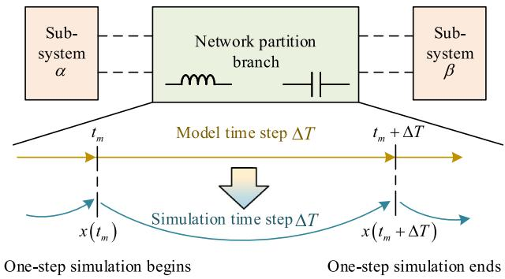  
Fig. 5. Modeling and simulation process of the SILM-based method.

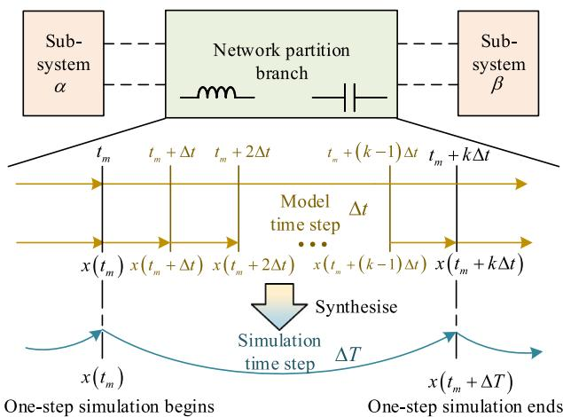  
Fig. 6. Modeling and simulation process of the small-step synthesis modelbased method.

In this framework, the network partition branches is modeled and simulated using the same time step as the two subsystems. As a result, the stability of the system is directly related to the simulation time step ???? and the parameters of the LC components in the network partition branch.

# 3.2. Small-step synthesis model-based network partition

In order to improve the stability of the system, this paper proposes incorporating the small-step synthesis model into the network partition process. This method constructs a small-step synthesis model for network partition branches, which enables the network partition branches to exhibit stability with small time step ????. This avoids the direct limitation of system stability to simulation time step ???? and LC parameters in network partition branches. The overall strategy based on the small-step synthesis model is illustrated in Fig. 6.

To facilitate the subsequent derivation and stability analysis of the small-step synthesis model-based network partition, we mapped the variables at fractional time points $n \pm 1 / 2$ in (18) and (24) to integer time points through virtual time-axis alignment. After this alignment, all variables in the discrete state-space model are updated synchronously. Thus, we use a new unified time index symbol ?? to denote the state-space model. As shown in the following equation:

$$
\left\{ \begin{array}{l} x \left(t _ {m} + \Delta T\right) = \mathbf {A} x \left(t _ {m}\right) + \mathbf {B} u \left(t _ {m}\right) \\ y \left(t _ {m}\right) = \mathbf {C} x \left(t _ {m}\right) + \mathbf {D} u \left(t _ {m}\right) \end{array} \right. \tag {29}
$$

For a single simulation time $[ t _ { m } , t _ { m } + \Delta T ] _ { : }$ , we divide it into ?? equal subintervals, named as model time step ????. Thus, the time points $d _ { i }$ and

time-step ???? after segmentation is represented by:

$$
\left\{ \begin{array}{l} d _ {i} = t _ {m} + i \Delta t, \quad i = 0, 1, \dots , k \\ \Delta t = \frac {\Delta T}{k} \end{array} \right. \tag {30}
$$

Under the subdivided model time step ????, the original state-space model in (29) is reformulated into:

$$
\left\{ \begin{array}{l} x \left(d _ {i + 1}\right) = \mathbf {L} x \left(d _ {i}\right) + \mathbf {M} u \left(d _ {i}\right) \\ y \left(d _ {i}\right) = \mathbf {C} x \left(d _ {i}\right) + \mathbf {D} u \left(d _ {i}\right) \end{array} \right. \tag {31}
$$

where matrices ?? and ?? denote the state matrix and input matrix corresponding to the model time step $\varDelta t ,$ obtained by replacing ???? with ???? in matrices ?? and $\mathbf { B } ;$ Matrices ?? and ?? denote the output matrix and feedforward matrix of the system respectively; $x ( d _ { i + 1 } )$ denotes the system state at time point $d _ { i + 1 } ; y ( d _ { i } )$ denotes the system output at time point $d _ { i } ; x ( d _ { i } )$ and $u ( d _ { i } )$ denote the system state and system input at time point ?? , respectively. Since matrices ?? and ?? do not depend on the time step, their expressions remain unchanged.

Thus, within the interval $[ t _ { m } , t _ { m } { + } A T ]$ , the original single-step update with step size ???? is decomposed into ?? consecutive updates with the smaller model time step ????. It can be expressed as:

$$
\left\{ \begin{array}{l} x \left(d _ {1}\right) = \mathbf {L} x \left(d _ {0}\right) + \mathbf {M} u \left(d _ {0}\right) \\ x \left(d _ {2}\right) = \mathbf {L} x \left(d _ {1}\right) + \mathbf {M} u \left(d _ {1}\right) \\ \dots \dots \\ x \left(d _ {k}\right) = \mathbf {L} x \left(d _ {k - 1}\right) + \mathbf {M} u \left(d _ {k - 1}\right) \end{array} \right. \tag {32}
$$

Next, the step synthesis procedure is carried out. Considering that the simulation time step in electromagnetic transient studies is typically very small, the variation of system inputs within a single simulation time step is limited. Therefore, it is reasonable to approximate that the input values at all intermediate instants in (32) are identical to the input applied at the beginning of the step. It can be expressed as:

$$
u \left(d _ {i}\right) = u \left(d _ {0}\right) = u \left(t _ {m}\right) \tag {33}
$$

where $i = 0 , 1 , \ldots , k .$ The state variables in (32) can be successively substituted into the adjacent state-update equations, yielding the relationship between the initial and final states within the interval $[ t _ { m } , t _ { m }$ + ???? ] as:

$$
x \left(d _ {k}\right) = \mathbf {A} ^ {\prime} x \left(d _ {0}\right) + \mathbf {B} ^ {\prime} u \left(d _ {0}\right) \tag {34}
$$

In terms of time representation, (34) can be reformulated as:

$$
x \left(t _ {m} + \Delta T\right) = \mathbf {A} ^ {\prime} x \left(t _ {m}\right) + \mathbf {B} ^ {\prime} u \left(t _ {m}\right) \tag {35}
$$

The new state matrix ??′ and the new input matrix $\mathbf { B ^ { \prime } }$ can be computed using the following iterative formulas:

$$
\left\{ \begin{array}{l} \mathbf {A} _ {0} ^ {\prime} = \mathbf {E}, \\ \mathbf {A} _ {i} ^ {\prime} = \mathbf {L A} _ {i - 1} ^ {\prime}, \\ \mathbf {B} _ {0} ^ {\prime} = 0, \\ \mathbf {B} _ {i} ^ {\prime} = \mathbf {L B} _ {i - 1} ^ {\prime} + \mathbf {M}, \end{array} \right. \tag {36}
$$

where $i \ = \ 0 , 1 , \ldots , k ;$ ?? denotes the identity matrix with the same dimension as ??.

Since the simulation time step ???? is fixed, the values of the synthesized matrices $\mathbf { A ^ { \prime } }$ and $\mathbf { B ^ { \prime } }$ are determined entirely by the ratio $k = { { \varDelta } T { \bigl / } { \varDelta } t }$ . For convenience, this parameter ?? is referred to as the synthesis order of the small-step synthesis model.

When $k = 1 _ { : }$ , the original single simulation interval $[ t _ { m } , t _ { m } + \Delta T ]$ is not subdivided, and the matrices $\mathbf { A ^ { \prime } }$ and ??′ are identical to the original matrices ?? and ??.

When $k \neq 1 ,$ , the global time step ???? is subdivided into ?? time steps, and the matrices $\mathbf { A ^ { \prime } }$ and $\mathbf { B ^ { \prime } }$ are calculated according to (36). It is important to emphasize that, regardless of the synthesis order ??, the dimension of ${ \bf A ^ { \prime } }$ remains the same as that of ??. The dimension of ??′ likewise remains the same as that of ??.

Based on the derivation of the small-step synthesis model, the discrete state-space model of the SILM-based network partition in (29) can be further rewritten as:

$$
\left\{ \begin{array}{l} x \left(t _ {m} + \Delta T\right) = \mathbf {A} ^ {\prime} x \left(t _ {m}\right) + \mathbf {B} ^ {\prime} u \left(t _ {m}\right) \\ y \left(t _ {m}\right) = \mathbf {C} ^ {\prime} x \left(t _ {m}\right) + \mathbf {D} ^ {\prime} u \left(t _ {m}\right) \end{array} \right. \tag {37}
$$

Since the matrix $\mathbf { C ^ { \prime } }$ and $\mathbf { D ^ { \prime } }$ do not require step synthesis, their expression in the small-step synthesis model are identical to those of matrices ?? and ??, respectively. Meanwhile, the matrices $\mathbf { A } ^ { \prime } , \mathbf { B } ^ { \prime } , \mathbf { C } ^ { \prime }$ and ??′ are constant coefficient matrices, preserving the LTI characteristics of the partition components.

By comparing (29) and (37), it can be observed that the state-space models before and after applying the small-step synthesis are highly similar, both describing the evolution of the system states and outputs over the interval $[ t _ { m } , t _ { m } { + } \Delta T ]$ ]. The key difference is that (37) is obtained by synthesizing ?? state-space models based on model time step ????. Therefore, from a computational perspective, although the small-step synthesis model is executed using the simulation time step $\Delta T _ { : }$ , but it is fundamentally constructed based on the small time step ????.

Using the NP-LCL method as an example, once the small-step synthesis model is applied to the network partition branches, the original parallel simulation procedure described in (2) is modified accordingly. The updated EMT simulation procedure can be implemented using the pseudocode shown in Algorithm 1

Algorithm 1 Simulation procedure of small-step synthesis model-based network partition (LCL)

Require: Global simulation time step ???? , synthesis order ?? (with $\Delta t =$ $\pmb { \varDelta T } / k )$

1: Initialization: Construct the small-step synthesis model of LCL branch (in its equivalent discrete state-space form), set initial state of the model $I _ { \alpha } ^ { 0 } , I _ { \beta } ^ { 0 }$ and $U _ { \mathrm { c } } ^ { 0 } ;$ initialize subsystem states $x _ { \alpha } ^ { 0 }$ and $x _ { \beta } ^ { 0 } .$   
2: while (simulation not finished) do   
3: Parallel stage: Subsystems ?? and $\beta$ are solved in parallel under the controlled-source inputs from the previous step, yielding boundary voltages $U _ { \alpha } ^ { ( n ) }$ and $\bar { U } _ { \beta } ^ { ( n ) }$ .   
4: Synchronization: Ensure that both subsystems have completed the solution of the current step .   
5: Serial stage: Invoke the small-step synthesis model of LCL branch:

$$
\left(I _ {\alpha} ^ {n + 1}, I _ {\beta} ^ {n + 1}, U _ {c} ^ {n + 1}\right) = \mathbf {L C L} \left(I _ {\alpha} ^ {n}, I _ {\beta} ^ {n}, U _ {c} ^ {n}, U _ {\alpha} ^ {n}, U _ {\beta} ^ {n}, \Delta T\right)
$$

6: Broadcast: Distribute $U _ { \mathrm { c } } ^ { n + 1 }$ to subsystem ?? and subsystem ??.   
7: Proceed to next global step: $n  n + 1$   
8: end while

# 4. Stability analysis of the small-step synthesis model-based network partition method

As the only part affected by the network partition, the stability of the network partition branches plays a critical role in the stability of the whole system. In other words, the stability of the network partition branches is a necessary condition to ensure the stability of the whole system. Therefore, this section provides a theoretical stability analysis of network partition branches using both the spectral radius criterion and Lyapunov stability theory, which offer quantitative guidance for determining an appropriate synthesis order ??. The spectral radius analysis offers an intuitive understanding of how the synthesis

Table 2 Parameters of the example NP-CLC.   

<table><tr><td>Parameter</td><td>ΔT (s)</td><td>Ca (F)</td><td>Ga (S)</td></tr><tr><td>Value</td><td>5 × 10-5</td><td>1.85 × 10-5</td><td>0.09</td></tr><tr><td>Parameter</td><td>L (H)</td><td>Cb (F)</td><td>Gb (S)</td></tr><tr><td>Value</td><td>1.49 × 10-5</td><td>1.23 × 10-5</td><td>0.04</td></tr></table>

order ?? improves system stability by tracing the eigenvalue trajectories. However, eigenvalue-based stability analysis cannot quantitatively determine the stability region. Therefore, Lyapunov stability theory is further employed to derive analytical expressions for the synthesis order ?? required to satisfy the stability conditions.

# 4.1. Stability analysis based on spectral radius

As mentioned in Section 3.2, the small-step synthesis model is LTI system. Hence, the classical spectral radius criteria can be applied for stability analysis. For all eigenvalues of the system state matrix ??, if they satisfy (38), the system is asymptotically stable [28].

$$
\left| \lambda_ {i} (\mathbf {A}) \right| <   1 \quad \text {f o r} \quad i = 1, 2, \dots , N \tag {38}
$$

where ?? is the number of eigenvalues of matrix ??, equal to the order of the state matrix $\mathbf { A } ; \lambda _ { i } ( \mathbf { A } )$ denotes the ??th eigenvalue.

To quantitatively analyze the stability improvement effect of the small-step synthesis model, eigenvalue analysis of the state matrix is conducted using the NP-CLC as an example. The network partition branch parameters is given in Table 2.

As described in Section 2.4, without applying small-step synthesis model, the state matrix of the traditional SILM-based NP-CLC is denoted as $\mathbf { A } _ { \mathrm { C L C } } ,$ whose expression is given by (25). Substituting the data from Table 2 into the expression of $\mathbf { A } _ { \mathrm { C L C } }$ obtains the following value:

$$
\mathbf {A} _ {\mathrm {C L C}} = \left[ \begin{array}{c c c} 0. 7 8 3 1 & 0 & - 2. 4 0 9 6 \\ 0 & 0. 8 4 9 6 & 3. 7 5 9 4 \\ 2. 6 2 8 0 & - 2. 8 5 1 1 & - 1 9. 7 0 1 5 \end{array} \right] \tag {39}
$$

The eigenvalue column vector of the matrix $\mathbf { A } _ { \mathrm { C L C } }$ is calculated as:

$$
\lambda = \left[ \begin{array}{c} - 0. 0 4 3 7 \\ 0. 8 0 9 1 \\ - 1 8. 8 3 4 1 \end{array} \right] \tag {40}
$$

It can be observed that the magnitude of the third eigenvalue of matrix $\mathbf { A } _ { \mathrm { C L C } }$ is greater than 1, indicating that the system is unstable under the current parameter and time step settings.

After applying the small-step synthesis model, the discrete statespace model of the SILM-based network partition takes the form shown in (37), with the state matrix replaced by ??′. Fig. 7 illustrates the trajectory of the eigenvalues of ${ \bf A ^ { \prime } }$ as the synthesis order ?? increases:

As illustrated in Fig. 7, when the synthesis order ?? is relatively low, the eigenvalues $\lambda _ { 1 }$ and $\lambda _ { 2 }$ lie within the unit circle, whereas $\lambda _ { 3 }$ resides outside it. As ?? increases, eigenvalues $\lambda _ { 1 }$ and $\lambda _ { 2 }$ remain stable within the unit circle, while initially unstable $\lambda _ { 3 }$ gradually converges inward. Eventually, all eigenvalues entered the unit circle, proving the improvement of system stability. It is worth noting that once the eigenvalues enter the unit circle, they will stabilize inside and not diverge, indicating that the small-step synthesis model provides a continuous stability-improved effect on the system.

# 4.2. Stability analysis based on Lyapunov stability theory

In this section, the Lyapunov stability theory is employed to derive the admissible range of the synthesis order ?? that satisfies the stability requirement. The resulting condition provides explicit guidance for selecting an appropriate value of ?? based on the parameters of

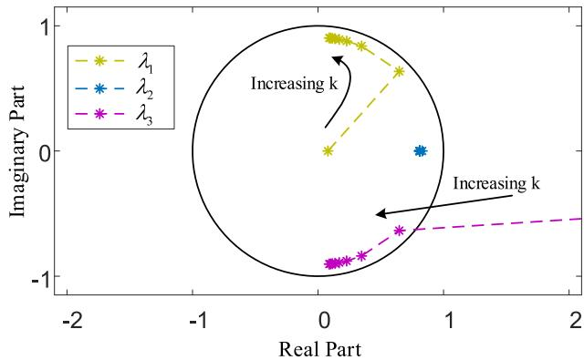  
Fig. 7. Diagram of eigenvalue locus.

the network partition branches when performing network-partitioned simulations. The Lyapunov stability theory of discrete-time systems is described as: Let $x \in \mathbb { R } ^ { n }$ be the system state vector, and $x = 0$ be the equilibrium point. If there exists a continuous scalar function ?? (??) that satisfies Eqs. (41) and (42), then the system is stable at ?? = 0 [29].

$$
V (0) = 0 \quad a n d \quad V (x) > 0 \quad f o r \quad x \neq 0 \tag {41}
$$

$$
V \left(x \left(t _ {m} + \Delta T\right)\right) - V \left(x \left(t _ {m}\right)\right) \leq 0 \tag {42}
$$

The NP-LCL is taken as an example to derive a function ?? (??) that satisfies the above conditions, as well as to derive the corresponding minimum synthesis order ??.

# 4.2.1. State update equation and scalar function definition

Because we are only concerned with the stability of the state variables. The inputs $U _ { \alpha }$ and $U _ { \beta }$ in (4) can be set to zero for simplicity. Meanwhile, according to the virtual time-axis alignment described in Section 3.2, the time axis of the system state variables is aligned in (4). As a result, the state update equations for $I _ { \alpha } ( t _ { m } ) , I _ { \beta } ( t _ { m } ) ;$ , and $U _ { \mathrm { c } } ( t _ { m } )$ under the model time step ???? are given by:

$$
\left\{ \begin{array}{l} U _ {\mathrm {c}} \left(t _ {m}\right) = L _ {\alpha} \frac {I _ {\alpha} \left(t _ {m} + \Delta t\right) - I _ {\alpha} \left(t _ {m}\right)}{\Delta t} \\ \quad + R _ {\alpha} \frac {I _ {\alpha} \left(t _ {m} + \Delta t\right) + I _ {\alpha} \left(t _ {m}\right)}{2} \\ U _ {\mathrm {c}} \left(t _ {m}\right) = L _ {\beta} \frac {I _ {\beta} \left(t _ {m} + \Delta t\right) - I _ {\beta} \left(t _ {m}\right)}{\Delta t} \\ \quad + R _ {\beta} \frac {I _ {\beta} \left(t _ {m} + \Delta t\right) + I _ {\beta} \left(t _ {m}\right)}{2} \\ - I _ {\alpha} \left(t _ {m} + \Delta t\right) - I _ {\beta} \left(t _ {m} + \Delta t\right) \\ \quad = C \frac {U _ {\mathrm {c}} \left(t _ {m} + \Delta t\right) - U _ {\mathrm {c}} \left(t _ {m}\right)}{\Delta t} \end{array} \right. \tag {43}
$$

where $I _ { \alpha } ( t _ { m } + \Delta t ) , I _ { \beta } ( t _ { m } + \Delta t )$ and ${ U _ { \mathrm { c } } } ( { t _ { m } } + \Delta t )$ represent the state variables at time $t _ { m } + \Delta t ,$ respectively; $I _ { \alpha } ( t _ { m } ) , I _ { \beta } ( t _ { m } )$ and $U _ { \mathrm { c } } ( t _ { m } )$ represent the state variables at time $t _ { m } ,$ respectively.

At time $t _ { m } ,$ we define the scalar function as:

$$
\begin{array}{l} V \left(x \left(t _ {m}\right)\right) = \frac {1}{2} C U _ {\mathrm {c}} \left(t _ {m} - \Delta t\right) U _ {\mathrm {c}} \left(t _ {m}\right) \tag {44} \\ + \frac {1}{2} L _ {\alpha} I _ {\alpha} (t _ {m}) ^ {2} + \frac {1}{2} L _ {\beta} I _ {\beta} (t _ {m}) ^ {2} \\ \end{array}
$$

Next, we will sequentially prove that this scalar function satisfies both (41) and (42).

# 4.2.2. Proof of non-increasing difference of the scalar function

The difference of the defined scalar function $V ( x ( t _ { m } ) )$ at two adjacent simulation time steps can be written as:

$$
\begin{array}{l} V (x \left(t _ {m} + \Delta T\right)) - V (x \left(t _ {m}\right)) \\ = V \left(x \left(t _ {m} + k \Delta t\right)\right) - V \left(x \left(t _ {m}\right)\right) \\ = V \left(x \left(t _ {m} + k \Delta t\right)\right) - \sum_ {j = 1} ^ {k - 1} \left\{V \left(x \left(t _ {m} + j \Delta t\right)\right) \right\} \tag {45} \\ + \sum_ {j = 1} ^ {k - 1} \left\{V \left(x \left(t _ {m} + j \Delta t\right)\right) \right\} - V \left(x \left(t _ {m}\right)\right) \\ = \sum_ {j = 1} ^ {k} \left\{V \left(x \left(t _ {m} + j \Delta t\right)\right) - V \left(x \left(t _ {m} + (j - 1) \Delta t\right)\right) \right\} \\ \end{array}
$$

By substituting Eq. (44) into Eq. (45), we obtain:

$$
V (x \left(t _ {m} + \Delta T\right)) - V (x \left(t _ {m}\right)) =
$$

$$
\begin{array}{l} \sum_ {j = 1} ^ {k} \left\{\frac {1}{2} C U _ {\mathrm {c}} (t _ {m} + (j - 1) \Delta t) * U _ {\mathrm {c}} (t _ {m} + j \Delta t) \right. \\ + \frac {1}{2} L _ {\alpha} \left[ I _ {\alpha} \left(t _ {m} + j \Delta t\right) \right] ^ {2} \\ + \frac {1}{2} L _ {\beta} \left[ I _ {\beta} \left(t _ {m} + j \Delta t\right) \right] ^ {2} \tag {46} \\ - \frac {1}{2} C U _ {\mathrm {c}} (t _ {m} + (j - 2) \Delta t) * U _ {\mathrm {c}} (t _ {m} + (j - 1) \Delta t) \\ - \frac {1}{2} L _ {\alpha} \left[ I _ {\alpha} \left(t _ {m} + (j - 1) \Delta t\right) \right] ^ {2} \\ \left. - \frac {1}{2} L _ {\beta} \left[ I _ {\beta} \left(t _ {m} + (j - 1) \Delta t\right) \right] ^ {2} \right\} \\ \end{array}
$$

Combining like terms in the scalar functions from (46) and applying the difference of squares identity, (46) can be rearranged as:

$$
\begin{array}{l} V \left(x \left(t _ {m} + \Delta T\right)\right) - V \left(x \left(t _ {m}\right)\right) = \\ \sum_ {j = 1} ^ {k} \left\{\frac {1}{2} C U _ {\mathrm {c}} (t _ {m} + (j - 1) \Delta t) * \right. \\ \left[ U _ {\mathrm {c}} \left(t _ {m} + j \Delta t\right) - U _ {\mathrm {c}} \left(t _ {m} + (j - 2) \Delta t\right) \right] \\ + \frac {1}{2} L _ {\alpha} \left[ I _ {\alpha} \left(t _ {m} + j \Delta t\right) + I _ {\alpha} \left(t _ {m} + (j - 1) \Delta t\right) \right] * \tag {47} \\ [ I _ {\alpha} (t _ {m} + j \Delta t) - I _ {\alpha} (t _ {m} + (j - 1) \Delta t) ] \\ + \frac {1}{2} L _ {\beta} [ I _ {\beta} (t _ {m} + j \Delta t) + I _ {\beta} (t _ {m} + (j - 1) \Delta t) ] * \\ \left. \left[ I _ {\beta} \left(t _ {m} + j \Delta t\right) - I _ {\beta} \left(t _ {m} + (j - 1) \Delta t\right) \right] \right\} \\ \end{array}
$$

With the aid of the numerical relationships between the state variables at adjacent model time steps ???? as given in (43), the difference terms in (47) can be substituted and simplified. Accordingly:

$$
\begin{array}{l} V (x (t _ {m} + \Delta T)) - V (x (t _ {m})) = \\ \sum_ {j = 1} ^ {k} \left\{- \frac {R _ {\alpha}}{4} \Delta t \left[ I _ {\alpha} \left(t _ {m} + j \Delta t\right) + I _ {\alpha} \left(t _ {m} + (j - 1) \Delta t\right) \right] ^ {2} \right. \tag {48} \\ \left. - \frac {R _ {\beta}}{4} \Delta t \left[ I _ {\beta} \left(t _ {m} + j \Delta t\right) + I _ {\beta} \left(t _ {m} + (j - 1) \Delta t\right) \right] ^ {2} \right\} \\ \end{array}
$$

in which, $R _ { \alpha }$ and $R _ { \beta }$ are non-negative. Therefore, for any values of $I _ { \alpha }$ and $I _ { \beta } ,$ the inequality $V ( x ( t _ { m } + A T ) ) - V ( x ( t _ { m } ) ) \leq 0$ always holds. This proves that the scalar function $V ( x ( t _ { m } ) )$ is non-increasing in difference, thereby validating Eq. (42).

# 4.2.3. Positive definiteness analysis of the scalar function

Next, we proceed to prove that the defined scalar function $V ( x ( t _ { m } ) )$ ) satisfies (41), and derive the corresponding system stability condition. Clearly, when $x ( t _ { m } ) = 0 ,$ , we have $V ( 0 ) = 0 ,$ , which satisfies the first requirement. Moreover, we prove that $V ( x ( t _ { m } ) ) > 0$ always holds when

$x ( t _ { m } ) \neq 0 .$ According to Eq. (43), the state variables $U _ { \mathrm { c } } ( t _ { m } )$ and $U _ { \mathrm { c } } ( t _ { m } { - } \Delta t )$ at adjacent model time steps satisfy the following relation:

$$
U _ {\mathrm {c}} \left(t _ {m}\right) = U _ {\mathrm {c}} \left(t _ {m} - \Delta t\right) - \frac {\Delta t}{C} I _ {\alpha} \left(t _ {m}\right) - \frac {\Delta t}{C} I _ {\beta} \left(t _ {m}\right) \tag {49}
$$

Substituting (49) into (44) yields:

$$
\begin{array}{l} V (x (t _ {m})) = \frac {1}{2} C U _ {\mathrm {c}} (t _ {m} - \Delta t) ^ {2} \\ - \frac {\Delta t}{2} U _ {\mathrm {c}} \left(t _ {m} - \Delta t\right) I _ {\alpha} \left(t _ {m}\right) - \frac {\Delta t}{2} U _ {\mathrm {c}} \left(t _ {m} - \Delta t\right) I _ {\beta} \left(t _ {m}\right) \tag {50} \\ + \frac {1}{2} L _ {\alpha} I _ {\alpha} (t _ {m}) ^ {2} + \frac {1}{2} L _ {\beta} I _ {\beta} (t _ {m}) ^ {2} \\ \end{array}
$$

Eq. (50) can be written in matrix form as:

$$
V (x (t _ {m})) =
$$

$$
\frac {1}{2} \left[ \begin{array}{c} U _ {\mathrm {c}} \left(t _ {m} - \Delta t\right) \\ I _ {\alpha} \left(t _ {m}\right) \\ I _ {\beta} \left(t _ {m}\right) \end{array} \right] ^ {\mathrm {T}} \left[ \begin{array}{c c c} C & - \frac {\Delta t}{2} & - \frac {\Delta t}{2} \\ - \frac {\Delta t}{2} & L _ {\alpha} & - 0 \\ - \frac {\Delta t}{2} & 0 & L _ {\beta} \end{array} \right] \left[ \begin{array}{l} U _ {\mathrm {c}} \left(t _ {m} - \Delta t\right) \\ I _ {\alpha} \left(t _ {m}\right) \\ I _ {\beta} \left(t _ {m}\right) \end{array} \right] \tag {51}
$$

To obtain an explicit analytical expression for the synthesis order $k ,$ the term ???? in (51) is uniformly replaced with ???? ∕??. Meanwhile, we define the matrix ?? as:

$$
\mathbf {W} = \left[ \begin{array}{c c c} C & - \frac {\Delta T}{2 k} & - \frac {\Delta T}{2 k} \\ - \frac {\Delta T}{2 k} & L _ {\alpha} & - 0 \\ - \frac {\Delta T}{2 k} & 0 & L _ {\beta} \end{array} \right] \tag {52}
$$

To ensure that the scalar function $V ( x ( t _ { m } ) )$ satisfies (41), the matrix ?? must be positive definite. This requires that all leading principal minors of ?? have positive determinants. The determinant of the first-order leading principal minor ??(1) must satisfy:

$$
\left| \mathbf {W} ^ {(1)} \right| = C > 0 \tag {53}
$$

This implies that the grounding capacitance at the intermediate node must be positive. Similarly, the determinant of the second-order leading principal minor ??(2) must satisfy:

$$
\left| \mathbf {W} ^ {(2)} \right| = C L _ {\alpha} - \frac {\Delta T ^ {2}}{4 k ^ {2}} > 0 \tag {54}
$$

It leads to the condition:

$$
k > \sqrt {\frac {\Delta T ^ {2}}{4 C} \frac {1}{L _ {\alpha}}} \quad k \in \mathbb {Z} ^ {+} \tag {55}
$$

in which, $k \in \mathbb { Z } ^ { + }$ indicates that ?? must be a positive integer. The determinant of the third-order leading principal minor $\mathbf { W } ^ { ( 3 ) }$ must satisfy:

$$
\left| \mathbf {W} ^ {(3)} \right| = C L _ {\alpha} L _ {\beta} - \frac {\Delta T ^ {2}}{4 k ^ {2}} L _ {\alpha} - \frac {\Delta T ^ {2}}{4 k ^ {2}} L _ {\beta} > 0 \tag {56}
$$

which yields the condition:

$$
k > \sqrt {\frac {\Delta T ^ {2}}{4 C} \frac {L _ {\alpha} + L _ {\beta}}{L _ {\alpha} L _ {\beta}}} \quad k \in \mathbb {Z} ^ {+} \tag {57}
$$

Considering the fact that:

$$
\frac {L _ {\alpha} + L _ {\beta}}{L _ {\alpha} L _ {\beta}} = \frac {1}{L _ {\alpha}} + \frac {1}{L _ {\beta}} > \frac {1}{L _ {\alpha}} \tag {58}
$$

Therefore, the inequality in (57) is more stringent than that in (55). Once (57) is satisfied, (55) is automatically fulfilled. In other words, Eq. (57) can ensure that the matrix ?? is strictly positive definite, and further ensures that the scalar function $V ( x ( t _ { m } ) )$ satisfies Eq. (41).

In conclusion, when the synthesis order ?? satisfies (57), the scalar function $V ( x ( t _ { m } ) )$ defined in (44) meets both conditions given in (41) and (42), thereby proving system stability at the equilibrium point. Thus, Eq. (57) is referred to as the stability condition for the small-step synthesis model-based network partition on LCL branch.

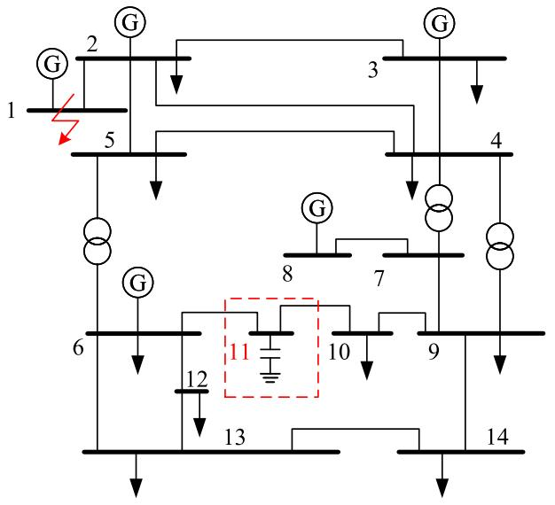  
Fig. 8. Modified IEEE 14-bus system.

Similarly, the stability condition for the small-step synthesis modelbased network partition on CLC branch can be derived using an analogous approach:

$$
k > \sqrt {\frac {\Delta T ^ {2}}{4 L} \frac {C _ {\mathrm {a}} + C _ {\mathrm {b}}}{C _ {\mathrm {a}} C _ {\mathrm {b}}}} \quad k \in \mathbb {Z} ^ {+} \tag {59}
$$

By (57) and (59), the synthesis order ?? satisfying stability condition can be computed based on the parameters of the LCL or CLC branch.

# 5. Case study

To verify the stability, accuracy and simulation efficiency of the proposed small-step synthesis model-based network partition method, two simulation cases consisting of modified IEEE 14-bus system and a wind farm model are built. The network partition models (NPM) are established for the mentioned two cases. Besides, the original models (OM) without network partition are established for comparison. All the simulation cases are completed based on MATLAB/Simulink.

In this section, we first analyze the stability of the modified IEEE 14-bus system after network partition. The impact of the synthesis order ?? on system stability is investigated. Then, the accuracy of the proposed method is validated by comparing time-domain simulation results under fault conditions.

Secondly, we take a wind farm model consisting of 10 wind turbines (WTs) as an example. We compare the simulation accuracy before and after network partition during the startup phase, steadystate phase, and fault phase, respectively. The simulation results further demonstrates the effectiveness of the proposed method.

Finally, we tested the simulation time of the proposed method, the original model, and the fine-grained network partition method proposed in Ref. [24] under different numbers of WTs. These comparisons fully demonstrate the advantages of the proposed method in terms of simulation efficiency.

# 5.1. Network partition of IEEE 14-Bus system

To apply NP-LCL in the IEEE 14-bus system, the load at Bus 11 is replaced with a fixed capacitive load. The topology of the modified IEEE 14-bus system is shown in Fig. 8.

A small-step synthesis model-based NP-LCL is applied at Bus 11, with the associated network partition branch parameters listed in Table 3.

Table 3 Parameters of NP-LCL for IEEE 14-bus system.   

<table><tr><td>Parameter</td><td>ΔT (s)</td><td>Lα (H)</td><td>Rα (Ω)</td></tr><tr><td>Value</td><td>6 × 10-5</td><td>6.1 × 10-4</td><td>0.082</td></tr><tr><td>Parameter</td><td>C (F)</td><td>Lβ (H)</td><td>Rβ (Ω)</td></tr><tr><td>Value</td><td>4.7 × 10-7</td><td>6.3 × 10-4</td><td>0.095</td></tr></table>

Table 4 Stability associated with ?? of IEEE 14-bus system.   

<table><tr><td rowspan="2">k</td><td rowspan="2">Stability</td><td colspan="4">MRE (%)</td></tr><tr><td>U6</td><td>U10</td><td>I10-11</td><td>I6-11</td></tr><tr><td>1</td><td>Unstable</td><td>-</td><td>-</td><td>-</td><td>-</td></tr><tr><td>2</td><td>Unstable</td><td>-</td><td>-</td><td>-</td><td>-</td></tr><tr><td>3</td><td>Stable</td><td>0.63</td><td>0.72</td><td>0.81</td><td>0.59</td></tr><tr><td>4</td><td>Stable</td><td>0.61</td><td>0.70</td><td>0.79</td><td>0.48</td></tr><tr><td>5</td><td>Stable</td><td>0.59</td><td>0.69</td><td>0.73</td><td>0.45</td></tr><tr><td>6</td><td>Stable</td><td>0.58</td><td>0.67</td><td>0.71</td><td>0.43</td></tr><tr><td>7</td><td>Stable</td><td>0.57</td><td>0.66</td><td>0.70</td><td>0.42</td></tr><tr><td>8</td><td>Stable</td><td>0.56</td><td>0.65</td><td>0.69</td><td>0.42</td></tr><tr><td>9</td><td>Stable</td><td>0.56</td><td>0.65</td><td>0.68</td><td>0.41</td></tr><tr><td>10</td><td>Stable</td><td>0.56</td><td>0.64</td><td>0.68</td><td>0.41</td></tr></table>

Using (57), it can be calculated that the range of the synthesis order ?? satisfying the stability condition is $( k > 2 . 4 , k \in \mathbb { Z } _ { + } ) .$ . Thus, the minimum synthesis order that satisfies the stability condition is $k = 3$ .

To evaluate system stability under different synthesis order ??, the IEEE 14-bus model is simulated with small-step synthesis model-based NP-LCL from ?? = 1 to ?? = 10. The results are shown in the second column of Table 4.

The simulation results are consistent with the theoretical analysis. The partitioned system is unstable when ?? = 1 or ?? = 2. Moreover, it is found that node voltages and branch currents diverge to the magnitude of $1 0 ^ { 2 0 0 }$ within approximately 0.04 s with $k \ = \ 1$ . When $k \ = \ 2 ,$ , it takes about 5.0 s to diverge to the same magnitude. This means that although a correct simulation result is still not obtained when $k = 2 ,$ the increasing ?? effectively suppresses the divergence rate, thereby improving system stability.

Under the condition of $k = 3$ , the partitioned system is stable. The simulation results are shown in Fig. 9.

In Fig. 9, sub-figures (a), (b), (c), and (d) present the three-phase voltage and current simulation results under $k = 3$ at Bus 10, Branch 10–11, Bus 6, and Branch 6–11, respectively.

The simulation results demonstrate that the small-step synthesis model-based network partition method achieves high accuracy at $k = 3$ as evidenced by the close waveform matching between the NPM and OM. At 3 s, a three-phase-to-ground short-circuit fault with a grounding resistance of 0.001 ?? occurred at Bus 1 for 0.1 s. Fig. 9 shows that the NPM results are in excellent agreement with the OM results both during the steady-state and fault periods, thereby validating the simulation accuracy of the proposed method.

Table 4 summarizes the simulation accuracy of each order from $k = 1$ to 10. The simulation accuracy of each parameter is quantified using the Mean Relative Error (MRE). It can be seen that the simulation accuracy slightly improves with the increase of ?? after the system stabilizes, though the improvement is not significant. Considering that larger ?? values lead to higher computational complexity in calculating the parameter matrices ${ \bf A ^ { \prime } }$ and ??′. Therefore, it is generally sufficient to select a ?? value that is 1 to 3 greater than the critical value for the small-step synthesis model-based network partition.

# 5.2. Network partition of the wind farm

To further verify the accuracy of the small-step synthesis modelbased network partition method, a wind farm model comprising 10 DFIGs is built based on the topology shown in Fig. 10(a).

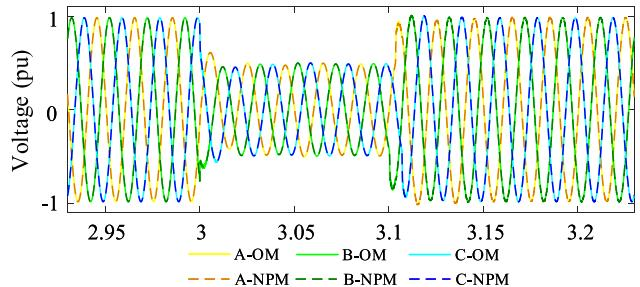  
(a)Three phase voltage of node 10

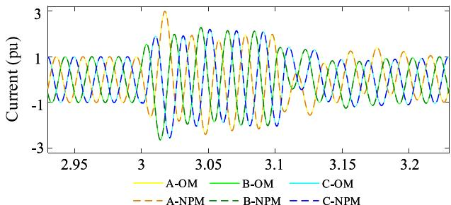  
(b)Three phase current of branch 10-11

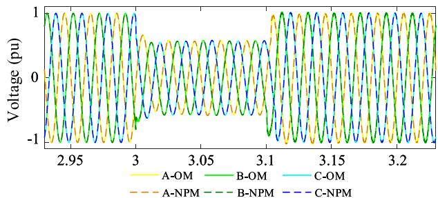  
(c)Three phase voltage of node 6

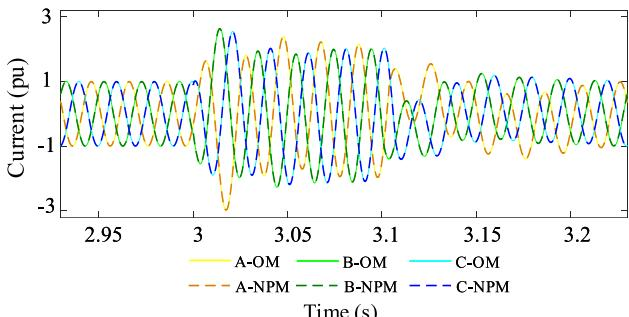  
(d)Three phase current of branch 6-11   
Fig. 9. Simulation results of IEEE 14-bus system.

As shown in Fig. 10(a), the 10 DFIGs are connected in series along a single chain. This chain is connected at the point of common coupling (PCC) and further integrated into the AC system through a transformer. ?? denotes the output voltage of the ??th DFIG, ?? denotes the corresponding output current, and $U _ { \mathbf { P C C } }$ and $I _ { \mathbf { P C C } }$ represent the voltage and current at the PCC, respectively.

In Fig. 10(a), each transmission line segment highlighted in red is modeled using lumped parameter representation, similar to the ?? - type equivalent circuit shown in Fig. 1. Therefore, the proposed smallstep synthesis model-based network partition method can be applied at these transmission line segments, decomposing the entire wind farm into the 11 subsystems as shown in Fig. 10(b).

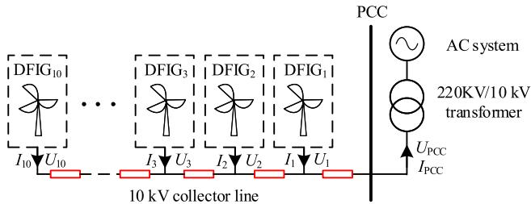  
(a)Topology of wind farm before decoupling

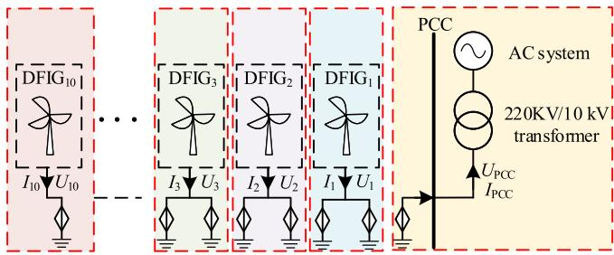  
(b)Topology of wind farm after decoupling   
Fig. 10. Wind farm topology.

Table 5 Parameters of NP-LCL for wind farm.   

<table><tr><td>Parameter</td><td>ΔT(s)</td><td>Lα(H)</td><td>Rα(Ω)</td></tr><tr><td>Value</td><td>5 × 10-6</td><td>2.85 × 10-5</td><td>0.0158</td></tr><tr><td>Parameter</td><td>C(F)</td><td>Lβ(H)</td><td>Rβ(Ω)</td></tr><tr><td>Value</td><td>3 × 10-8</td><td>2.85 × 10-5</td><td>0.0158</td></tr></table>

Table 6 Key parameters of the wind farm model.   

<table><tr><td>Category</td><td>Parameters</td><td>Data</td></tr><tr><td rowspan="6">DFIG</td><td>Nominal power (VA)</td><td>1.5e6</td></tr><tr><td>Nominal voltage (V)</td><td>690</td></tr><tr><td>Stator leakage inductance Lfa(H)</td><td>8.5e-5</td></tr><tr><td>Rotor leakage inductance Ltr(H)</td><td>8.5e-5</td></tr><tr><td>Mutual inductance Lm(H)</td><td>2.5e-3</td></tr><tr><td>Stator and rotor resistance (Ω)</td><td>3.0e-3</td></tr><tr><td rowspan="3">Converter</td><td>DC-side capacitance (F)</td><td>0.15</td></tr><tr><td>Switching frequency (Hz)</td><td>4000</td></tr><tr><td>On-state resistance (Ω)</td><td>1.2e-3</td></tr><tr><td rowspan="3">10kV/0.69kV transformer</td><td>Connection mode</td><td>D/yn</td></tr><tr><td>Winding resistance (Ω)</td><td>1.1e-5</td></tr><tr><td>Winding inductance (H)</td><td>1.1e-3</td></tr><tr><td rowspan="3">Filter</td><td>Grid side inductance (H)</td><td>8e-4</td></tr><tr><td>Rotor side inductance (H)</td><td>5e-4</td></tr><tr><td>Capacitance (F)</td><td>6e-5</td></tr><tr><td rowspan="3">220kV/10kV transformer</td><td>Connection mode</td><td>YN/yn</td></tr><tr><td>Winding resistance (Ω)</td><td>1.1e-5</td></tr><tr><td>Winding inductance (H)</td><td>1.1e-3</td></tr></table>

Parameters of each element in the transmission line equivalent circuit and the key parameters of the various components in the wind farm (including the DFIG, converters, transformers, and filters) are listed in Table 5 and Table 6 respectively.

Under the above parameter settings, using the stability conditions given in (57), the range of values for the synthesis order can be calculated as $k > 3 . 8 2$ . Since choosing a larger value of ?? does not provide a meaningful improvement in simulation accuracy, the synthesis order is set to $k = 4$ for the network partitioning of the wind farm model.

In the following sections, the simulation accuracy of the small-step synthesis model-based network partition method is evaluated across

three phases: the startup phase, the steady-state phase, and the fault phase.

# 5.2.1. Startup phase

The startup phase operating conditions are configured as follows. From 0 to 1 s the turbine breakers remain open, and both RSC and GSC are blocked. In this phase, the wind farm’s AC current is zero, while the AC voltage gradually rises to its rated value; At 1 s the GSC is unlocked; At 3 s the RSC is also unlocked; the GSC control mode transitions from startup control to standard vector control; At 5 s the breakers close, connecting the DFIGs to the AC grid; At 6 s the RSC control is switched to normal vector control. Then, the AC current of the DFIGs gradually increases, the active power output rises to the rated value, and the DC voltage recovers to its rated value, eventually stabilizing.

Fig. 11 shows the simulation results of NPM and OM during startup phase, including three-phase voltage, three-phase current at the outlet of the 6th DFIG, active power, reactive power and DC voltage of the 1st DFIG.

It shows that the simulation results of NPM and OM are nearly identical. Calculating the MRE for each parameter during this phase reveals that the reactive power of the wind turbine has the largest MRE, exceeding 1.5%, primarily due to its proximity to zero which causes a low reference value and hence a magnified relative error. For all other parameters, the MRE remains below 1%. These results indicate that the small-step synthesis model-based network partition method provides high accuracy during the startup phase.

# 5.2.2. Steady-state phase

After 6.5 s the system transitions from the startup phase to the steady-state phase, during which all system parameters remain nearly constant. Fig. 12 shows the simulation results of NPM and OM during steady-state phase, including three-phase voltage, three-phase current at the outlet of the 6th DFIG, active power, reactive power and DC voltage of the 1st DFIG.

According to the calculated results, all results except for the reactive power exhibit MRE values no greater than 0.7%. These results confirm that the small-step synthesis model-based network partition method maintains high accuracy during the steady-state phase.

# 5.2.3. Fault phase

At 8 s the grid experiences a three-phase voltage drop lasting 0.3 s, during which the grid voltage drops to 40% of its rated value.

Because of the fault, the AC voltage at the wind farm terminal drops, limiting the active power output. After the fault is cleared, the terminal voltage recovers and the system gradually returns to stable operation. Fig. 13 shows the simulation results of NPM and OM during fault phase, including three-phase voltage, three-phase current at the outlet of the 6th wind turbine, active power, reactive power and DC voltage of the 1st wind turbine.

It can be observed that the results of NPM and OM are nearly identical during the fault phase. The three-phase voltage and current at the DFIG terminal show significant fluctuations following the voltage drop, which gradually settle after approximately 0.15 s. The NPM capture this behavior accurately. The MRE values for all results, except reactive power, are within 1.8%. Notably, the DC bus voltage has the lowest MRE at just 0.076%. These results demonstrate that the smallstep synthesis model maintains high accuracy even during grid fault conditions.

# 5.3. Simulation efficiency comparison

Taking the wind farm model introduced in Section 5.2 as the test case to evaluate the simulation efficiency of the proposed method. The simulation time is set to 10??, and all tests are conducted on the Intel® Core TM i7-9700 @ 3.00 GHz CPU with 8 cores and 8 threads.

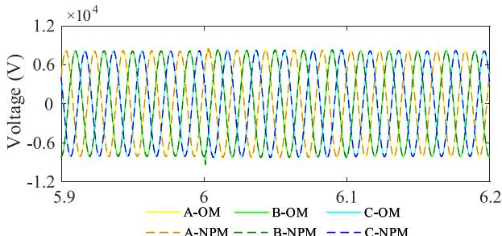  
(a) Voltage at the outlet of the WT6

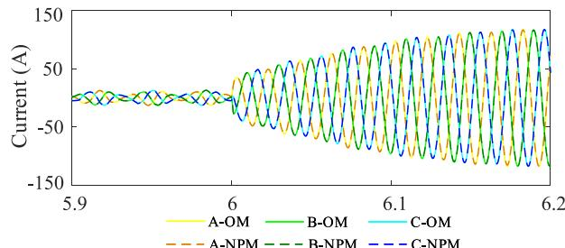  
(b) Current at the outlet of the WT6

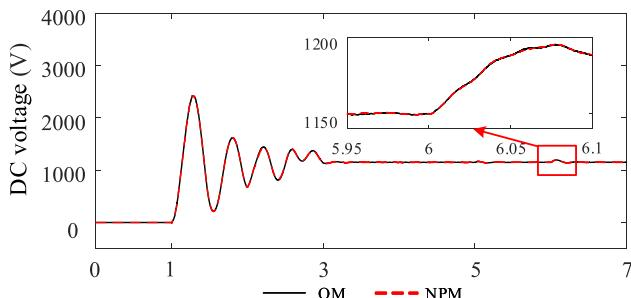  
(c) DC voltage of the WT1

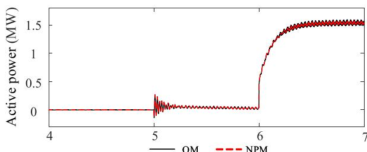  
(d) Active power of the WT1

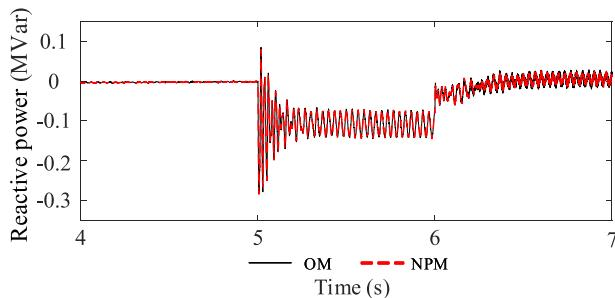  
(e) Reactive power ofthe WT1   
Fig. 11. Simulation results during startup phase.

The previous analysis indicates that the minimum synthesis order satisfying the stability requirement is ?? = 4. Therefore, we evaluate the simulation efficiency of both the OM and the NPM with ?? = 4 under different numbers of WTs, as shown in the second and third columns of

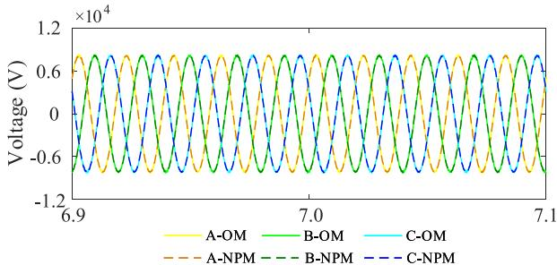  
(a) Voltage at the outlet of the WT6

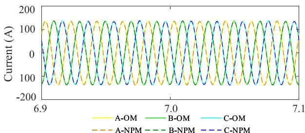  
(b) Current at the outlet of the WT6

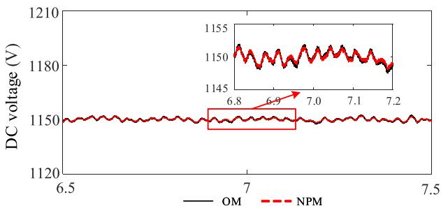  
(c) DC voltage of the WT1

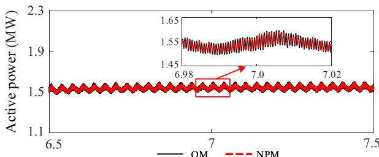  
(d) Active power of the WT1

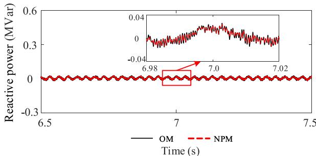  
(e) Reactive power ofthe WT1   
Fig. 12. Simulation results during steady-state phase.

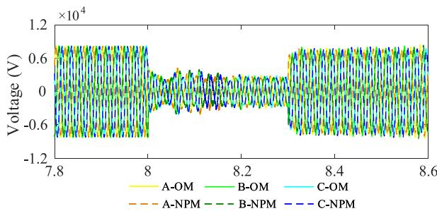  
(a) Voltage at the outlet of the WT6

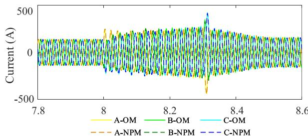  
(b) Current at the outlet of the WT6

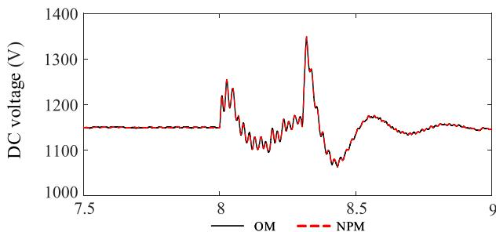  
(c) DC voltage of the WT1

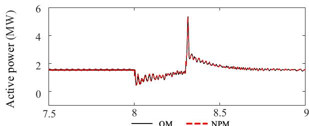  
(d) Active power of the WT1

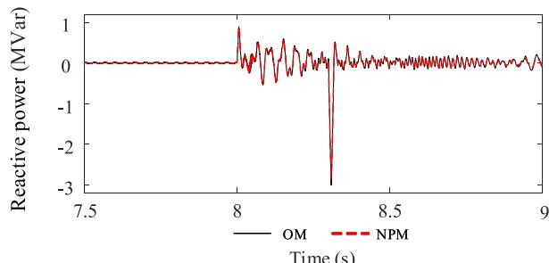  
(e) Reactive power of the WT1   
Fig. 13. Simulation results during fault phase.

Table 7 Comparison of simulation efficiency under different methods.   

<table><tr><td>Number of WTs</td><td>OM/s</td><td>NPM k=4/s</td><td>NPM k=10/s</td><td>Ref. [24] /s</td><td>AE-LC /s</td></tr><tr><td>2</td><td>578.384</td><td>119.208</td><td>119.025</td><td>Unstable</td><td>118.568</td></tr><tr><td>4</td><td>1170.945</td><td>157.616</td><td>157.913</td><td>Unstable</td><td>157.346</td></tr><tr><td>6</td><td>1966.651</td><td>177.853</td><td>178.188</td><td>Unstable</td><td>176.203</td></tr><tr><td>8</td><td>3068.345</td><td>198.181</td><td>198.305</td><td>Unstable</td><td>196.831</td></tr><tr><td>10</td><td>4264.631</td><td>223.782</td><td>223.571</td><td>Unstable</td><td>221.762</td></tr><tr><td>12</td><td>6761.077</td><td>238.538</td><td>238.597</td><td>Unstable</td><td>235.379</td></tr></table>

Table 7. To more precisely quantify the impact of the synthesis order on the overall computational efficiency of the system, we further measure the simulation time of the NPM using a synthesis order of ?? = 10. The corresponding results are shown in the fourth column of Table 7.

The results demonstrate that the proposed method can significantly improve the overall simulation efficiency. Even for relatively large synthesis order ??, the runtime remains highly competitive. This is primarily because increasing ?? only affects the complexity of the model construction stage. For example, when ?? becomes larger, the computation of the synthesized matrices ??′ and ??′ in (37) becomes more involved. However, during the simulation stage, the computational complexity depends solely on the order of the network partition branch model, and the synthesis order ?? does not change the dimensionality of this model. For both NP-LCL and NP-CLC used in this work, the final network partition branch model is always a third-order discrete-time state-space model regardless of the value of ??. Therefore, variations in ?? do not increase the computational cost during the actual simulation process.

In addition, the fine-grained network partitioning approach proposed in Ref. [24] is selected as a benchmark to further demonstrate the performance of the proposed method in terms of partition stability and simulation efficiency. As one of the more advanced representatives among existing studies, the method in Ref. [24] exhibits strong performance with respect to both accuracy and computational efficiency. The relevant comparison results are shown in the fifth columns of Table 7.

It can be observed that the fine-grained network-partition method proposed in Ref. [24] becomes numerically unstable when applied to the wind farm model constructed in this study. This is primarily because the method in Ref. [24] does not incorporate stability-oriented optimizations, and the LC parameters at the network partition branches of the wind farm model are relatively small, making it difficult for this method to satisfy the required stability conditions. In contrast, under the same interface conditions, the proposed method achieves stable network partitioning, further demonstrating the real and substantial improvement in stability provided by the proposed method.

In order to make a meaningful comparison of the computational efficiency, we meet the stability requirements of the Ref. [24] method by artificially enlarging the LC parameters (AE-LC). The simulation time of the Ref. [24] method is shown in the sixth column of the table Table 7. It is noted that the simulation time of the proposed method shown in the third column of Table 7 are generally slightly higher than those of the stabilized version of the Ref. [24] method. This minor increase (approximately 1%) is mainly due to subtle differences in the partitioning strategies between the two methods. Nevertheless, such a small overhead is negligible compared with the significant enhancement in numerical stability achieved by the proposed method.

# 6. Conclusion

This paper proposes a small-step synthesis model to improve the stability of network partition in electromagnetic transient simulation. A semi-implicit leapfrog method-based network partition method is derived on the LCL and CLC branches. The network partition strategy based on the small-step synthesis model is then presented. Stability

conditions are established using spectral radius and Lyapunov stability theory, providing explicit bounds for selecting the minimum synthesis order. The proposed method has been validated on both the IEEE 14-bus system and the wind farm model with respect to simulation accuracy and computational efficiency. The simulation results indicate that the method can substantially enhance the stability of the network-partitioned system while maintaining satisfactory accuracy and efficiency. In future, the real-time simulation of large-scale power system based on this method will continue to be studied.

# CRediT authorship contribution statement

Haoran Zhao: Writing – review & editing, Methodology, Investigation, Funding acquisition, Formal analysis, Conceptualization. Changwang Zhao: Writing – original draft, Validation, Methodology. Bing Li: Writing – review & editing, Visualization, Supervision, Investigation, Formal analysis, Conceptualization. Luwei Tan: Writing – review & editing, Data curation.

# Declaration of Generative AI and AI-assisted technologies in the writing process

During the preparation of this work the authors used DeepSeek in order to improve language and readability. After using this tool, the authors reviewed and edited the content as needed.

# Declaration of competing interest

The authors declare that they have no known competing financial interests or personal relationships that could have appeared to influence the work reported in this paper.

# Acknowledgement

This research was supported by Shandong Development New Energy Co., Ltd. (Grant No. 1390025121).

# Data availability

Data will be made available on request.

# References

[1] Shrestha A, Rajbhandari Y, Gonzalez-Longatt F. Day-ahead energy-mix proportion for the secure operation of renewable energy-dominated power system. Int J Electr Power Energy Syst 2024;155:109560.   
[2] Liu D, Zhang X, Tse CK. Effects of high level of penetration of renewable energy sources on cascading failure of modern power systems. IEEE J Emerg Sel Top Circuits Syst 2022;12(1):98–106.   
[3] Liu F, Lin S, Ma J, Li Y. Data-driven mode identification method for broad-band oscillation of interconnected power system. IEEE Sensors J 2022;22(15):15273–83.   
[4] Deng X, Jiang Z, Sundaresh L, Yao W, Yu W, Wang W, Liu Y. A timedomain electromechanical co-simulation framework for power system transient analysis with retainment of user defined models. Int J Electr Power Energy Syst 2021;125:106506.   
[5] Lin X, Gole AM, Yu M. A wide-band multi-port system equivalent for real-time digital power system simulators. IEEE Trans Power Syst 2009;24(1):237–49.   
[6] Morata CG, de Albuquerque FP, Caballero PT, da Costa ECM, Pelizari A. Frequency-dependent modeling of three-phase power cables for electromagnetic transient simulations. Int J Electr Power Energy Syst 2024;157:109792.   
[7] Cai M, Mahseredjian J, Karaagac U, El-Akoum A, Fu X. Functional mock-up interface based parallel multistep approach with signal correction for electromagnetic transients simulations. IEEE Trans Power Syst 2019;34(3):2482–4.   
[8] Matar M, Iravani R. Massively parallel implementation of AC machine models for FPGA-based real-time simulation of electromagnetic transients. IEEE Trans Power Deliv 2011;26(2):830–40.   
[9] Xu J, Ding H, Fan S, Gole AM, Zhao C. Enhanced high-speed electromagnetic transient simulation of MMC-MTdc grid. Int J Electr Power Energy Syst 2016;83:7–14.

[10] Subedi S, Rauniyar M, Ishaq S, Hansen TM, Tonkoski R, Shirazi M, Wies R, Cicilio P. Review of methods to accelerate electromagnetic transient simulation of power systems. IEEE Access 2021;9:89714–31.   
[11] Benigni A, Monti A. A parallel approach to real-time simulation of power electronics systems. IEEE Trans Power Electron 2015;30(9):5192–206.   
[12] Hao X, Fu L, Ma F, Zhang Y, Wu Y, Xiao R. Hierarchical network partition of DC power systems containing a large number of switches. Int J Electr Power Energy Syst 2022;142:108239.   
[13] Watson N, Arrillaga J. Power systems electromagnetic transients simulation. vol. 39, London: Iet; 2003.   
[14] Li Q, Bai H, Tang X, Pan S, Long J, Li W, Chen J, Yuan Z. Real-time simulation of large-scale wind farm based on improved transmission line decoupling model. In: 2022 China international conference on electricity distribution. 2022, p. 983–8.   
[15] Lau K, Tylavsky D, Bose A. Coarse grain scheduling in parallel triangular factorization and solution of power system matrices. IEEE Trans Power Syst 1991;6(2):708–14.   
[16] Mu Q, Liang J, Zhou X, Li G, Zhang X. A node splitting interface algorithm for multi-rate parallel simulation of DC grids. CSEE J Power Energy Syst 2018;4(3):388–97.   
[17] Tomim MA, Marti JR, Wang L. Parallel solution of large power system networks using the multi-area Thévenin equivalents (MATE) algorithm. Int J Electr Power Energy Syst 2009;31(9):497–503.   
[18] Crow M, Ilic M. The parallel implementation of the waveform relaxation method for transient stability simulations. IEEE Trans Power Syst 1990;5(3):922–32.   
[19] Liu C-T, Yeh T-S. Parallel simulation of industrial power system transients by an inherent parallel algorithm. Int J Electr Power Energy Syst 1996;18(7):437–43.   
[20] Li Y, Shu D, Hu J, Yan Z, Zhou Y, Wang H. A multi-area thevenin equivalent based multi-rate co-simulation for control design of practical LCC HVDC system. Int J Electr Power Energy Syst 2020;115:105479.

[21] Liu Y, Jiang Q. Two-stage parallel waveform relaxation method for largescale power system transient stability simulation. IEEE Trans Power Syst 2016;31(1):153–62.   
[22] Kato T, Inoue K, Fukutani T, Kanda Y. Multirate analysis method for a power electronic system by circuit partitioning. IEEE Trans Power Electron 2009;24(12):2791–802.   
[23] Dargahi M, Ghosh A, Davari P, Ledwich G. Controlling current and voltage type interfaces in power-hardware-in-the-loop simulations. IET Power Electron 2014;7(10):2618–27.   
[24] Yu J, Zhao H, Jiang Y, Li B, Meng L, Yang F. Efficient electromagnetic transient simulation for DFIG-based wind farms using fine-grained network partitioning. Int J Electr Power Energy Syst 2024;162:110297.   
[25] Milton M, Benigni A. Latency insertion method based real-time simulation of power electronic systems. IEEE Trans Power Electron 2017;33(8):7166–77.   
[26] Meng X, Lam J, Du B, Gao H. A delay-partitioning approach to the stability analysis of discrete-time systems. Automatica 2010;46(3):610–4.   
[27] Zheng J, Zeng Y, Zhao Z, Liu W, Xu H, Ji S. A semi-implicit parallel leapfrog solver with half-step sampling technique for FPGA-based real-time HIL simulation of power converters. IEEE Trans Ind Electron 2024;71(3):2454–64.   
[28] Goh P, Schutt-Aine JE, Klokotov D, Tan J, Liu P, Dai W, Al-Hawari F. Partitioned latency insertion method with a generalized stability criteria. IEEE Trans Components, Packag Manuf Technol 2011;1(9):1447–55.   
[29] Lalgudi SN, Swaminathan M, Kretchmer Y. On-chip power-grid simulation using latency insertion method. IEEE Trans Circuits Syst I Regul Pap 2008;55(3):914–31.