# Simplified EMT Model of Multiple-active-bridge Based Power Electronic Transformer with Integrated Energy Storage

Jianzhong Xu, Senior Member, IEEE, Conghui Zheng, Wanying Xu, Moke Feng, Chengyong Zhao, Senior Member, IEEE, and Gen Li, Senior Member, IEEE

Abstract—Due to the advanced features of multidirectional power transfer and fast smoothing of the power fluctuation in renewable energy systems, the multiple-active-bridge based power-electronic-transformer (MAB-PET) with integrated energy storage units is becoming popular. However, the accurate electromagnetic transient simulation of the MAB-PETs is extremely time-consuming due to the large number of circuit nodes and small time-step. This paper proposes a simplified EMT modeling approach for the MAB-PETs by employing the generalized statespace averaging method. First, the switching function method and Dommel algorithm are used to build the equivalent model of each power module. Further, the PET equivalent model is presented in a multi-port PM polymerization mode. The system is simplified by applying Fourier Decomposition to its state functions by ignoring high-order harmonics. Finally, a four-port equivalent voltage source circuit is obtained. The proposed simplified equivalent model is compared with the detailed model in PSCAD/EMTDC. Simulation results show the proposed approach has excellent accuracy and is 2–3 orders of magnitude faster than the DM.

Index Terms—Energy storage sub-module (ESS), generalized state average method, multiple-active-bridge (MAB), simplified electromagnetic transient (EMT) simulation.

# I. INTRODUCTION

HE intermittent and random characteristics of distributed T renewable energy bring challenges to the security and stability of the power system [1], [2]. Energy storage can be an effective solution to address the challenges [3], [4]. Recently, the power electronic transformer (PET) with integrated energy storage has been gaining wide attention because it can achieve both flexible power transfer and energy storage and therefore is able to smooth power fluctuations [5], [6].

There are various kinds of PET power modules (PMs): single active bridge (SAB), dual active bridge (DAB), multipleactive-bridge (MAB), quadruple active bridge (QAB), cas-

caded H-bridge (CHB), etc. [7]. MAB reduces the number of high-frequency transformers within the PMs, avoids redundant intermediate power conversion links, and realizes direct power transfer and control among multiple ports. Hence, the MAB-PET has been utilized in practical distribution networks [8].

The electromagnetic transient (EMT) simulation of MAB-PET is an instrumental technology that assesses the dynamic characteristics of power systems prior to their implementation in the system [9]. However, the high-speed and accurate EMT simulation of PETs, especially for the energy storage-based MAB-PET, encounters a lot of difficulties.

Compared with classical modular multilevel converters (MMCs), of which the simulation theories have already been mature [10], the equivalent modeling of PETs still has a long way to go because each PM of PETs contains the highfrequency link (HFL), complex internal structures and a large number of circuit nodes. Moreover, the simulation time-step of PET is much smaller than MMC, which makes the simulation efficiency of PET much lower [11].

To accelerate the simulation speed of PETs, several modeling methods have been proposed: the averaged-value model (AVM), the dynamic phasor model, and the Thevenin’s equivalent model [12]. The AVM replaces the actual value with the average value over the switching period and therefore can only consider the fundamental frequency and DC components [13]– [15]. It sacrifices accuracy for better simulation efficiency. The dynamic phasor model can consider all DC, fundamental and harmonic components. It is compatible with a larger simulation time step up to several hundred microseconds. Compared with AVM, the dynamic phasor model has higher accuracy but lower efficiency [16], [17]. The Thevenin equivalent model retains all internal and external electrical information of the detailed model (DM) and can speed up the simulation significantly. [18]–[21] accelerates the modeling of DAB and CHB-based PETs by circuit preprocessing, internal node elimination, and HFL decoupling. However, with the increase of the PET voltages and power ratings, the complexity of PET topology increases. It is difficult to simplify the equivalent model by preprocessing, internal node elimination, and highfrequency chain decoupling. Therefore, the efficiency of the Thevenin equivalent models will become worse.

The power system is demanding multi-time-scale regulation of the energy resources; the grid-connected energy storage system gradually transforms from single energy storage to

hybrid energy storage [22]. This makes the control of the energy storage system more complex and further increases the difficulty of simulation [23]. Therefore, it is of great engineering importance to establish an equivalent model with energy storage interfaces that is suitable for both single and hybrid energy storage.

To further accelerate the simulation speed of the existing equivalent models with minimum loss of accuracy, this paper proposes a simplified EMT equivalent model of MAB-PET with an energy storage sub-module (ESS). The accuracy and speed of the simplified equivalent model (SEM) are analyzed and verified using the MAB-PET model used in the Chongli distribution network in Hebei, China. The proposed approach is also applicable to SAB, DAB, QAB, CHB-DAB, CHB-MAB, and other topologies. The innovation includes four points:

1) The SEM is constructed by the generalized state-space averaging method, which uses Fourier Decomposition and is suitable for the PM with m input ports and 1 output port (“mto-1” MAB). This method avoids internal node elimination HFL decoupling and greatly reduces the difficulty of modeling.   
2) Using the switching function method to build an electrical variable bridge between the AC and DC ports of the CHB, which eliminates the switching process of devices. Complex matrix operations can be avoided to reduce the overall computational burden.

3) The ESS model is constructed by the binary resistance method and the Dommel method. To meet the requirements of hybrid energy storage, the interface of the energy storage is reserved.   
4) Compared to the previous work, the proposed SEM is more suitable for the simulation of large-scale AC-DC hybrid grids containing multiple PETs with ESSs due to the small modeling difficulty and higher simulation speed.

# II. TOPOLOGY, CONTROL AND MODELING OF MAB-PET

# A. Topology of MAB-PET

The studied MAB-PET has an input-series-output-parallel (ISOP) structure, as shown in Fig. 1. Each PM contains CHB, MAB, and ESS. MAB and CHB achieve the three-phase AC/DC conversion with high-power density [24]. The ESS is connected to the LVDC port to improve the power quality. In the topology, electric energy is transferred from the MVAC side to the LVDC side through four conversion steps: AC/DC, DC/AC, AC/AC (high-frequency isolation transformer), and AC/DC.

# B. Control of MAB-PET

The control strategy of CHB adopts voltage and current double closed-loop control with carrier phase-shift sinusoidal pulse width modulation (CPS-SPWM). The outer voltage control regulates the average of MAB input capacitor voltages

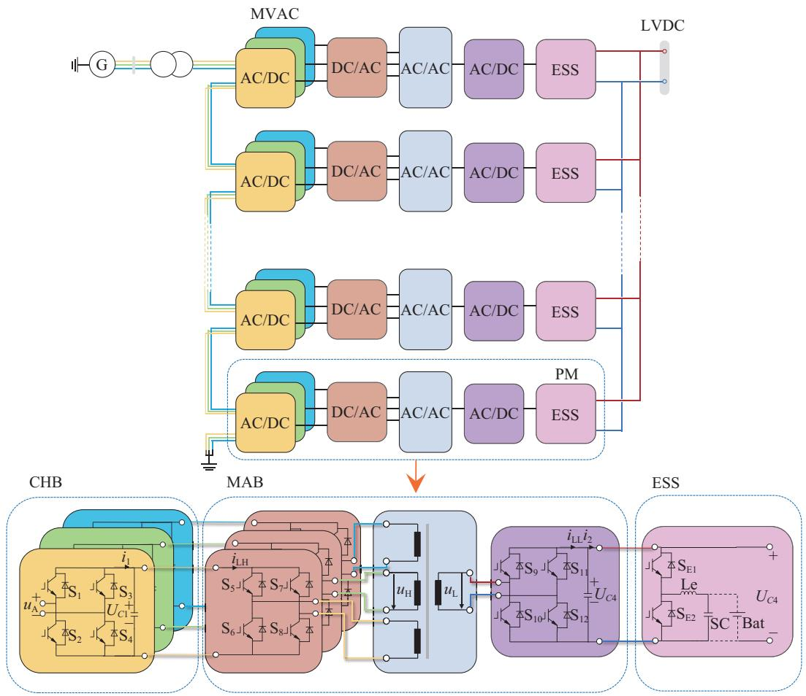  
Fig. 1. Topology of the MAB-PET and its PM structure.

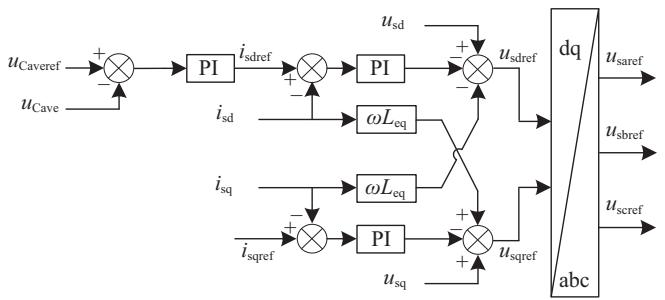  
Fig. 2. CHB control block diagram.

$u _ { \mathrm { C 1 } } , u _ { \mathrm { C 2 } }$ , and $u _ { \mathrm { C 3 } } \ ( u _ { \mathrm { C a v e } }$ in Fig. 2). The inner current control receives orders from the outer voltage control for the current control. The SPWM control signals of the CHB are generated by comparing the triangle wave with the modulated waves $u _ { \mathrm { s a r e f } } , u _ { \mathrm { s b r e f } }$ , and $u _ { \mathrm { s c r e f } }$ .

The ESS control system is also a double closed-loop control system, which is composed of the inner current control and the outer power control. The difference between the SOC reference $( S O C _ { \mathrm { r e f } } )$ and SOC average $( S O C _ { \mathrm { a v e } } )$ is used to generate the active power reference $P _ { \mathrm { b a t r e f } }$ . Then, by changing the duty cycle d of the DC/DC converter, the active power control of the ESS side converter is realized. The control signal of each ESS is generated by comparing the triangle wave with $d ;$ the ESS control block diagram is shown in Fig. 3.

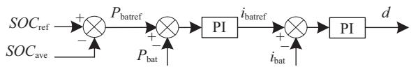  
Fig. 3. ESS control block diagram.

The main objective of MAB is to stabilize the LVDC voltage $u _ { \mathrm { { C 4 } } }$ . The difference between the voltage reference $u _ { \mathrm { C 4 r e f } }$ and actual $u _ { \mathrm { { C 4 } } }$ is used to obtain MAB’s shift angle to realize its single-phase shift control [25]. The magnitude and direction of power transfer are controlled by adjusting the $\varphi .$ The energy will be transmitted forward if $\varphi$ is positive.

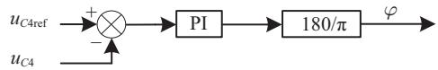  
Fig. 4. MAB phase-shift angle control block diagram.

# III. SIMPLIFIED EMT MODELING OF EACH PM

The modeling steps and methods are summarized in Fig. 5. The PM model composed of CHB, ESS, and MAB, will be first built, and then the SEM model of the ISOP type MAB-PET will be demonstrated.

# A. CHB Modeling

The switching function method is used to carry out the equivalent modeling of CHB for 8 different working states, as shown in Table I and Fig. 6, in which $\mathrm { S } _ { 1 } , \mathrm { S } _ { 2 } , \mathrm { S } _ { 3 }$ , and $\mathrm { \bf S _ { 4 } }$ represent the switching states of IGBTs, $\mathrm { D } _ { 1 } , \mathrm { D } _ { 2 } , \mathrm { D } _ { 3 }$ and $\mathrm { D } _ { 4 }$ represent the conducting states of diodes, $u _ { \mathrm { N } }$ is the MVAC voltage, and $i _ { \mathrm { N } }$ is the MVAC current.

Table I reveals the relationship between the MVAC and

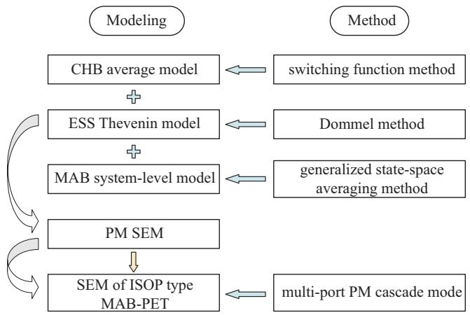  
Fig. 5. Procedures of the modeling.

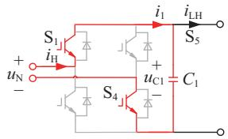

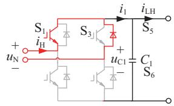

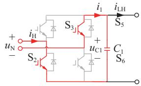

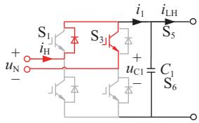

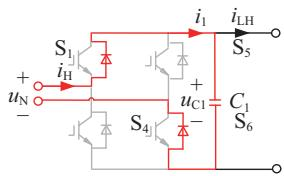

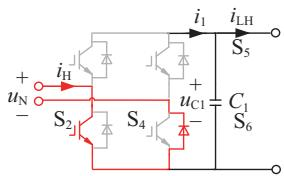

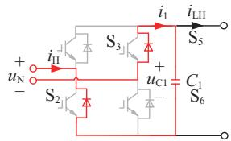

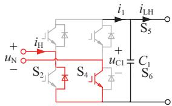  
Fig. 6. Working states of the H-bridge in the CHB.

TABLE I VOLTAGE AND CURRENT RELATIONSHIP ON BOTH SIDES OF CHB   

<table><tr><td>S1</td><td>S2</td><td>S3</td><td>S4</td><td>D1</td><td>D2</td><td>D3</td><td>D4</td><td>uN</td><td>iN</td></tr><tr><td>1</td><td>0</td><td>0</td><td>1</td><td>0</td><td>0</td><td>0</td><td>0</td><td>uC1</td><td>I1</td></tr><tr><td>0</td><td>1</td><td>1</td><td>0</td><td>0</td><td>0</td><td>0</td><td>0</td><td>-uC1</td><td>-I1</td></tr><tr><td>0</td><td>0</td><td>0</td><td>0</td><td>1</td><td>0</td><td>0</td><td>1</td><td>uC1</td><td>-I1</td></tr><tr><td>0</td><td>0</td><td>0</td><td>0</td><td>0</td><td>1</td><td>1</td><td>0</td><td>-uC1</td><td>I1</td></tr><tr><td>1</td><td>0</td><td>0</td><td>0</td><td>0</td><td>0</td><td>1</td><td>0</td><td>0</td><td>0</td></tr><tr><td>0</td><td>0</td><td>1</td><td>0</td><td>1</td><td>0</td><td>0</td><td>0</td><td>0</td><td>0</td></tr><tr><td>0</td><td>1</td><td>0</td><td>0</td><td>0</td><td>0</td><td>0</td><td>1</td><td>0</td><td>0</td></tr><tr><td>0</td><td>0</td><td>0</td><td>1</td><td>0</td><td>1</td><td>0</td><td>0</td><td>0</td><td>0</td></tr></table>

DC voltage and current on both sides of the H-bridge by identifying the modes of IGBTs and diodes.

The connection method of MAB and CHB models is shown in Section III-D. This method avoids a mass of equivalent circuit calculations, which can quickly establish the electrical connection between the MVAC and DC sides to ensure the accuracy and greatly improve the calculation efficiency.

# B. ESS Modeling

The ESS model is constructed using the binary resistance method and the Dommel method to meet the variable dynamic characteristics. ESS consists of a bidirectional DC/DC converter and an energy storage unit. The DC/DC converter includes IGBTs $\mathrm { S } _ { \mathrm { E 1 } } , \mathrm { S } _ { \mathrm { E 2 } }$ , diodes $\mathrm { D } _ { \mathrm { E 1 } } , \mathrm { D } _ { \mathrm { E 2 } } .$ , and filter inductor $L _ { \mathrm { e } }$ . The energy storage unit can utilize batteries, supercapacitors, or a combination of both. The equivalent model of the IGBT group and inductor in Fig. 7 will be discussed, respectively.

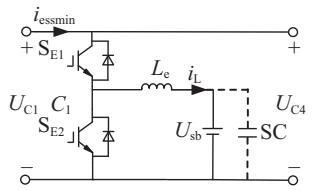  
Fig. 7. Topology of the ESS.

As shown in Fig. 8(a), the binary resistance represents the IGBT group. When the switch group is on, the resistance value will be $R _ { \mathrm { O N } }$ (a very small value). When the switch group is off, the resistance value will be $R _ { \mathrm { O F F } }$ (a very large value). Therefore, the switch group in Fig. 8(a) can be equivalent to the admittance shown in Fig. 8(b); its value is shown in (1).

$$
G = \left\{ \begin{array}{l} G _ {\mathrm {O N}} = 1 / R _ {\mathrm {O N}} \\ G _ {\mathrm {O F F}} = 1 / R _ {\mathrm {O F F}} \end{array} \right. \tag {1}
$$

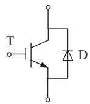  
(a)

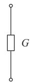  
(b)

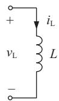  
(c)

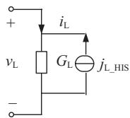  
  
Fig. 8. Bidirectional DC/DC converter components and the equivalent circuits.

According to [26]–[28], the inductor is normally discretized using the trapezoidal rule. The inductance in Fig. 8(c) can be equivalent to the Norton equivalent circuit in Fig. 8(d) as (2):

$$
\left\{ \begin{array}{l} i _ {\mathrm {L}} (t) = G _ {\mathrm {L}} \cdot v _ {\mathrm {L}} (t) - j _ {\mathrm {L} _ {-} \mathrm {H I S}} (t) \\ G _ {\mathrm {L}} = \frac {\Delta t}{2 L} \\ j _ {\mathrm {L} _ {-} \mathrm {H I S}} (t) = - \frac {\Delta t}{2 L} \cdot v _ {\mathrm {L}} (t - \Delta t) - i _ {\mathrm {L}} (t - \Delta t) \end{array} \right. \tag {2}
$$

where $\Delta t$ is the simulation time-step and $G _ { \mathrm { { L } } }$ is the Norton equivalent conductance. $j _ { \mathrm { L , H I S } }$ is the historical current source, and its value is determined by switching states of the last time step.

The topology of the ESS shown in Fig. 7 can be equivalent to a single-port Norton circuit as shown in Fig. 9 by combining the equivalent circuits of the components of ESS, and it can connect to the output side of the MAB.

Equivalent resistance $R _ { \mathrm { e s s m } }$ and equivalent current $I _ { \mathrm { e s s m } }$ in a single ESS Norton equivalent circuit are shown in (3).

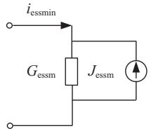  
Fig. 9. Norton equivalent circuit of single ESS.

$R _ { 1 }$ and $R _ { 2 }$ are equivalent resistors of the IGBTs, $R _ { \mathrm { L } }$ is the equivalent resistance of the inductor, and $U _ { \mathrm { s b } }$ is the voltage of the energy storage unit.

$$
\left\{ \begin{array}{l} R _ {\text {e s s m}} = \frac {1}{G _ {\text {e s s m}}} = \frac {R _ {2} \cdot R _ {\mathrm {L}} + R _ {1} \cdot R _ {\mathrm {L}} + R _ {1} \cdot R _ {2}}{R _ {2} + R _ {\mathrm {L}}} \\ J _ {\text {e s s m}} = \frac {R _ {2} \cdot \left[ j _ {\mathrm {L} - \mathrm {H I S}} (t) \cdot R _ {\mathrm {L}} - U _ {\mathrm {s b}} (t) \right]}{R _ {2} \cdot R _ {\mathrm {L}} + R _ {1} \cdot R _ {\mathrm {L}} + R _ {1} \cdot R _ {2}} \end{array} \right. \tag {3}
$$

The solutions of $R _ { \mathrm { L } }$ and $j _ { \mathrm { L , H I S } }$ in (3) are given in (4), and $U _ { \mathrm { C 4 } }$ is the voltage of the MAB output port.

$$
\begin{array}{l} R _ {\mathrm {L}} = \frac {2 L}{\Delta t} \\ j _ {\mathrm {L \_ H I S}} (t) = \frac {v _ {\mathrm {L}} (t - \Delta t)}{R _ {\mathrm {L}}} + i _ {\mathrm {L}} (t - \Delta t) \\ v _ {\mathrm {L}} (t) = U _ {\mathrm {C 4}} (t) \cdot \frac {R _ {2} \cdot R _ {\mathrm {L}}}{R _ {2} \cdot R _ {\mathrm {L}} + R _ {1} \cdot R _ {\mathrm {L}} + R _ {1} \cdot R _ {2}} - U _ {\mathrm {s b}} (t) \\ i _ {\mathrm {L}} (t) = \frac {v _ {\mathrm {L}} (t)}{R _ {\mathrm {L}}} + j _ {\mathrm {L} - \mathrm {H I S}} (t) \tag {4} \\ \end{array}
$$

Then the Norton circuit port current will be:

$$
\begin{array}{l} i _ {\mathrm {e s s m i n}} (t) = \\ \frac {U _ {\mathrm {C} 4} (t) \cdot \left(R _ {2} + R _ {\mathrm {L}}\right) + R _ {2} \cdot \left[ j _ {\mathrm {L} _ {-} \mathrm {H I S}} (t) \cdot R _ {\mathrm {L}} - U _ {\mathrm {s b}} (t) \right]}{R _ {2} \cdot R _ {\mathrm {L}} + R _ {1} \cdot R _ {\mathrm {L}} + R _ {1} \cdot R _ {2}} \tag {5} \\ \end{array}
$$

# C. MAB Modeling

The operating frequency of MAB is usually 10–20 kHz. Hence, the generalized state-space average method can be used to model the overall working states of the MAB.

# 1) Continuous Time Domain Equation of Working States

The nonlinear time-varying differential equation is established for MAB in Fig. 10.

The equivalent inductor currents $i _ { \mathrm { L 1 } } , i _ { \mathrm { L 2 } }$ , and $i _ { \mathrm { L 3 } }$ of threephase high-frequency transformer and capacitor voltages $u _ { \mathrm { C 1 } }$ uC2, uC3, and $u _ { \mathrm { { C 4 } } }$ are selected as the state variables. The differential equation of MAB is given in (6):

$$
\left\{ \begin{array}{l} L _ {x} \cdot \frac {\mathrm {d} i _ {\mathrm {L} x} (t)}{\mathrm {d} t} = u _ {\mathrm {H} x} (t) - n \cdot u _ {\mathrm {L}} (t) \\ C _ {x} \cdot \frac {\mathrm {d} u _ {\mathrm {C} x} (t)}{\mathrm {d} t} = i _ {1 x} (t) - i _ {\mathrm {L H} x} (t) \\ C _ {4} \cdot \frac {\mathrm {d} u _ {\mathrm {C} 4} (t)}{\mathrm {d} t} = i _ {\mathrm {L L}} (t) - i _ {2} (t) \end{array} \right. \tag {6}
$$

In $( 6 ) , u _ { \mathrm { H } x } ( t )$ and $u _ { \mathrm { L } } ( t )$ are the AC voltages of the primary and secondary sides of the transformer, respectively, $i _ { \mathrm { L H } x } ( t )$ and $\dot { \iota } _ { \mathrm { L L } } ( t )$ are the currents of the primary and secondary sides of the transformer, where x is 1, 2, or 3.

The switching function represents the IGBT group. The voltage and current on both sides of the full-bridge converter unit are shown in (7).

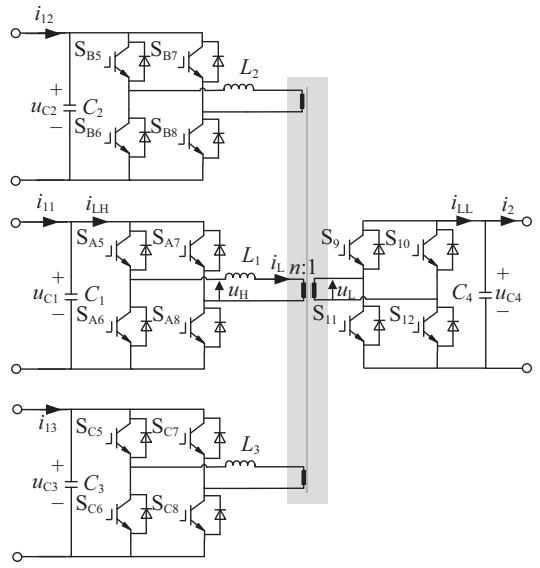  
Fig. 10. Topology of the MAB.

$$
\begin{array}{l} \left[ \begin{array}{c} u _ {\mathrm {H} x} (t) \\ u _ {\mathrm {L}} (t) \\ i _ {\mathrm {L H} x} (t) \\ i _ {\mathrm {L L}} (t) \end{array} \right] = \left[ \begin{array}{c c c c c c c} s _ {1} (t) & 0 & 0 & \vdots & 0 & 0 & 0 \\ 0 & s _ {2} (t) & 0 & \vdots & 0 & 0 & 0 \\ 0 & 0 & s _ {1} (t) & \vdots & 0 & 0 & 0 \\ \dots & \dots & \dots & \dots & \dots & \dots & \dots \\ 0 & 0 & 0 & \vdots & n s _ {2} (t) & n s _ {2} (t) & n s _ {2} (t) \end{array} \right] \\ \left[ \begin{array}{l} u _ {\mathrm {C} x} (t) \\ u _ {\mathrm {C} 4} (t) \\ i _ {\mathrm {L} x} (t) \\ i _ {\mathrm {L} 1} (t) \\ i _ {\mathrm {L} 2} (t) \\ i _ {\mathrm {L} 3} (t) \end{array} \right] \tag {7} \\ \end{array}
$$

where

$$
s _ {1} (t) = \left\{ \begin{array}{l} 1 \frac {\varphi_ {1} T}{2 \pi} \leq t \leq \frac {T}{2} + \frac {\varphi_ {1} T}{2 \pi} \\ - 1 \frac {T}{2} + \frac {\varphi_ {1} T}{2 \pi} \leq t \leq T + \frac {\varphi_ {1} T}{2 \pi} \end{array} \right.
$$

$$
s _ {2} (t) = \left\{ \begin{array}{l} 1 \frac {\varphi_ {2} T}{2 \pi} \leq t \leq \frac {T}{2} + \frac {\varphi_ {2} T}{2 \pi} \\ - 1 \frac {T}{2} + \frac {\varphi_ {2} T}{2 \pi} \leq t \leq T + \frac {\varphi_ {2} T}{2 \pi} \end{array} \right. \tag {8}
$$

In (8), $T$ is the switching cycle of the MAB, the phaseshifting angle of the high voltage side of the MAB three-phase are equal, and $\varphi _ { 1 } , \varphi _ { 2 }$ is the phase-shifting angle of the low voltage side, so there is a phase-shifting angle $\varphi _ { 2 } - \varphi _ { 1 }$ .

Considering simulation accuracy and speed, the equivalent process only consists of the base wave, $3 ^ { \mathrm { r d } }$ and $5 ^ { \mathrm { t h } }$ harmonic waves of the transformer equivalent inductor current. The DC components of capacitor voltage waves are also considered, so $U _ { \mathrm { C 1 } } , U _ { \mathrm { C 2 } } , U _ { \mathrm { C 3 } }$ , and $U _ { \mathrm { C 4 } }$ are used to replace ripples $u _ { \mathrm { C 1 } }$ , uC2, uC3, and $u _ { \mathrm { { C 4 } } }$ .

The differential equation of MAB can be obtained as (11).

$$
\dot {\boldsymbol {P}} = \boldsymbol {S} \cdot \boldsymbol {P} + \boldsymbol {I} \tag {9}
$$

where $\begin{array} { r } { \mathbf { \Sigma } ^ { P } = [ i _ { \mathrm { L } x } ( t ) , \ U _ { \mathrm { C } x } ( t ) , \ U _ { \mathrm { C } 4 } ( t ) ] ^ { \mathrm { T } } } \end{array}$ represents the system state variable. In P , $i _ { \mathrm { L } x } ( t ) ~ ( x = 1 , 2 , 3 )$ is the current of the equivalent inductance of the transformer, including base and harmonic waves. S represents the system state variable

matrix, which is a matrix composed of switch functions $s _ { 1 } ( t )$ and $s _ { 2 } ( t )$ , as shown in (10). I is the system input variable.

$$
\boldsymbol {S} = \left[ \begin{array}{c c c} \boldsymbol {O} _ {3} & \boldsymbol {S} _ {\mathrm {I U 1}} & \boldsymbol {S} _ {\mathrm {I U 2}} \\ \dot {\boldsymbol {S}} _ {\mathrm {U I 1}} & \ddots & \ddots \\ \boldsymbol {S} _ {\mathrm {U I 2}} & \boldsymbol {O} _ {3} & \boldsymbol {O} _ {3 \times 1} \\ \boldsymbol {S} _ {\mathrm {U I 2}} & \boldsymbol {O} _ {1 \times 3} & \boldsymbol {O} _ {1} \end{array} \right] \tag {10}
$$

where O is square matrices of zero.

$$
\left\{ \begin{array}{l} S _ {\mathrm {I U 1}} = \operatorname {d i a g} \left[ \frac {s _ {1} (t)}{L _ {1}}, \frac {s _ {1} (t)}{L _ {2}}, \frac {s _ {1} (t)}{L _ {3}} \right] \\ S _ {\mathrm {I U 2}} = \left[ \frac {- n s _ {2} (t)}{L _ {1}}, \frac {- n s _ {2} (t)}{L _ {2}}, \frac {- n s _ {2} (t)}{L _ {3}} \right] ^ {\mathrm {T}} \\ S _ {\mathrm {U I 1}} = \operatorname {d i a g} \left[ \frac {- s _ {1} (t)}{C _ {1}}, \frac {- s _ {1} (t)}{C _ {2}}, \frac {- s _ {1} (t)}{C _ {3}} \right] \\ S _ {\mathrm {U I 2}} = \left[ \frac {n s _ {2} (t)}{C _ {4}}, \frac {n s _ {2} (t)}{C _ {4}}, \frac {n s _ {2} (t)}{C _ {4}} \right] \end{array} \right. \tag {11}
$$

The system state variable matrix of the MAB differential equation can be obtained by extension, as shown in (12).

$$
\boldsymbol {S} = \left[ \begin{array}{l l l} \boldsymbol {O} _ {m} & \boldsymbol {S} _ {\mathrm {I U 1}} & \boldsymbol {S} _ {\mathrm {I U 2}} \\ \ddot {\boldsymbol {S}} _ {\mathrm {U I 1}} & \ddot {\boldsymbol {O}} _ {m} & \ddot {\boldsymbol {O}} _ {m \times 1} \\ \boldsymbol {S} _ {\mathrm {U I 2}} & \boldsymbol {O} _ {1 \times m} & \boldsymbol {O} _ {1} \end{array} \right] \tag {12}
$$

Based on (11), the matrix is extended as follows:

$$
\boldsymbol {I} = \left[ \begin{array}{c c c c c c c} 0, & \dots , & 0, & \frac {i _ {1 1} (t)}{C _ {1}}, & \dots , & \frac {i _ {1 m} (t)}{C _ {\mathrm {m}}}, & \frac {- i _ {2} (t)}{C _ {m + 1}} \end{array} \right] ^ {\mathrm {T}}
$$

$$
\begin{array}{l} \boldsymbol {P} = \left[ \begin{array}{c c c c c} i _ {\mathrm {L} 1} (t), & \dots , & i _ {\mathrm {L m}} (t), & U _ {\mathrm {C} 1} (t), & \dots , \end{array} \right. \\ \left. U _ {\mathrm {C} (\mathrm {m} + 1)} (t) \right] ^ {\mathrm {T}} \\ \end{array}
$$

$$
\boldsymbol {S} _ {\mathrm {I U 1}} = \operatorname {d i a g} \left[ \begin{array}{c c c c} \frac {s _ {1} (t)}{L _ {1}}, & \frac {s _ {1} (t)}{L _ {2}}, & \dots , & \frac {s _ {1} (t)}{L _ {\mathrm {m}}} \end{array} \right]
$$

$$
\boldsymbol {S} _ {\mathrm {I U 2}} = \left[ \begin{array}{c c c c} \frac {- n s _ {2} (t)}{L _ {1}}, & \frac {- n s _ {2} (t)}{L _ {2}}, & \dots , & \frac {- n s _ {2} (t)}{L _ {\mathrm {m}}} \end{array} \right] ^ {\mathrm {T}}
$$

$$
\boldsymbol {S} _ {\mathrm {U I 1}} = \operatorname {d i a g} \left[ \begin{array}{c c c c} - s _ {1} (t) & - s _ {1} (t) \\ \hline C _ {1} & \hline C _ {2} & \dots , \end{array} \begin{array}{c} - s _ {1} (t) \\ \hline C _ {\mathrm {m}} \end{array} \right]
$$

$$
\boldsymbol {S} _ {\mathrm {U I 2}} = \left[ \frac {n s _ {2} (t)}{C _ {4}}, \frac {n s _ {2} (t)}{C _ {4}}, \dots , \frac {n s _ {2} (t)}{C _ {4}} \right] \tag {13}
$$

where ${ \dot { P } } , P , I$ are $( 2 m + 1 )$ -order column vectors and $_ { s }$ is $( 2 m + 1 )$ -order square matrix. $S _ { \mathrm { I U 1 } }$ and $S _ { \mathrm { U I 1 } }$ are m-order diagonal matrices, $S _ { \mathrm { { I U 2 } } }$ and $S _ { \mathrm { U I 2 } }$ are m-order row vectors.

2) Simplified EMT Model Based on Fourier Decomposition

Since $s _ { 1 } ( t )$ and $s _ { 2 } ( t )$ are square waves with a 50% duty cycle. They can be Fourier decomposed into a superposition of sinusoidal signals of different frequencies to reduce the complexity of the equation. Fourier Decomposition of the switching function into (14):

$$
\begin{array}{l} s (t) = \sum_ {n = - \infty} ^ {\infty} \frac {1}{2} \left(a _ {n} - j b _ {n}\right) \cdot \mathrm {e} ^ {j n \omega_ {0} t} \\ \left\{ \begin{array}{l} a _ {n} = 0 \\ b _ {n} = \left\{ \begin{array}{l l} \frac {4}{n \pi}, & n \text {i s o d d} \\ 0, & n \text {i s e v e n} \end{array} \right. \end{array} \right. \tag {14} \\ \end{array}
$$

The convolution property of the Fourier coefficients is

$$
\langle s (t) \cdot U (t) \rangle_ {a} = \sum_ {n = - \infty} ^ {\infty} \langle s (t) \rangle_ {a - i} \cdot \langle U (t) \rangle_ {i} \tag {15}
$$

The SEM of MAB is described by the Fourier coefficients of each state variable, and its differential equation is:

$$
\begin{array}{l} \dot {\boldsymbol {P}} = \left[ \begin{array}{c c c c c c} \boldsymbol {W} _ {1} & \boldsymbol {O} _ {1 \times 2} & \boldsymbol {O} _ {1 \times 2} & \vdots & \boldsymbol {T} _ {\mathrm {L} 1} \\ \boldsymbol {O} _ {1 \times 2} & \boldsymbol {W} _ {3} & \boldsymbol {O} _ {1 \times 2} & \boldsymbol {O} _ {3 \times 6} & \boldsymbol {T} _ {\mathrm {L} 3} \\ \boldsymbol {O} _ {1 \times 2} & \boldsymbol {O} _ {1 \times 2} & \boldsymbol {W} _ {5} & \vdots & \boldsymbol {T} _ {\mathrm {L} 5} \\ \boldsymbol {T} _ {\mathrm {C i n} 1} & \boldsymbol {T} _ {\mathrm {C i n} 3} & \boldsymbol {T} _ {\mathrm {C i n} 5} & \boldsymbol {T} _ {\mathrm {C o u t} 1} & \boldsymbol {T} _ {\mathrm {C o u t} 3} & \boldsymbol {T} _ {\mathrm {C o u t} 5} & \boldsymbol {O} _ {2} \end{array} \right] \\ \cdot \boldsymbol {P} + \boldsymbol {I} \tag {16} \\ \end{array}
$$

P and $\dot { P }$ are similar to (9), representing system state variables and differential forms. I retain the DC component of the current in (9) and still represent the system input variable.

$$
\begin{array}{l} \dot {\boldsymbol {P}} = \left[ \left\langle \frac {\mathrm {d} i _ {\mathrm {L} 1 \dots \mathrm {m}} (t)}{\mathrm {d} t} \right\rangle_ {1}, \left\langle \frac {\mathrm {d} i _ {\mathrm {L} 1 \dots \mathrm {m}} (t)}{\mathrm {d} t} \right\rangle_ {3}, \left\langle \frac {\mathrm {d} i _ {\mathrm {L} 1 \dots \mathrm {m}} (t)}{\mathrm {d} t} \right\rangle_ {5}, \right. \\ \left. \left\langle \frac {\mathrm {d} U _ {\mathrm {C} 1 \dots \mathrm {m}} (t)}{\mathrm {d} t} \right\rangle_ {0}, \left\langle \frac {\mathrm {d} U _ {\mathrm {C m} + 1} (t)}{\mathrm {d} t} \right\rangle_ {0} \right] ^ {\mathrm {T}} \\ \end{array}
$$

$$
\begin{array}{l} \boldsymbol {P} = \left[ \begin{array}{l l l} \langle i _ {\mathrm {L} 1 \dots \mathrm {m}} (t) \rangle_ {- 1}, & \dots , & \langle i _ {\mathrm {L} 1 \dots \mathrm {m}} (t) \rangle_ {5}, \end{array} \sum_ {i = 1} ^ {m} \langle i _ {\mathrm {L} \mathrm {i}} (t) \rangle_ {- 1}, \right. \\ \cdot \cdot \cdot , \quad \sum_ {i = 1} ^ {m} \langle i _ {\mathrm {L i}} (t) \rangle_ {5}, \quad \langle U _ {\mathrm {C l} \dots \mathrm {m}} (t) \rangle_ {0}, \quad \langle U _ {\mathrm {C m} + 1} (t) \rangle_ {0} \bigg ] ^ {\mathrm {T}} \\ \end{array}
$$

$$
\boldsymbol {I} = \left[ \begin{array}{l l l l} 0, & 0, & 0, & \frac {\langle i _ {1 1 \dots m} (t) \rangle_ {0}}{C _ {1 \dots m}}, \\ & & & - \frac {\langle i _ {2} (t) \rangle_ {0}}{C _ {m + 1}} \end{array} \right] ^ {\mathrm {T}} \tag {17}
$$

The S in (10) is transformed to obtain the system state variable matrix, which is composed of $\begin{array} { r } { W _ { x } , T _ { \mathrm { L } x } , T _ { \mathrm { C i n } x } , } \end{array}$ and $\pmb { T } _ { \mathrm { C o u t } x }$ in (16). Contents of each matrix are given in (18), where x is 1, 3, or 5.

$$
\boldsymbol {W} _ {x} = \left[ \begin{array}{c c} 0 & \mathrm {j} x \omega \end{array} \right]
$$

$$
\boldsymbol {T} _ {\mathrm {L} x} = \left[ - \mathrm {j} \frac {2}{x \pi L _ {1}} \mathrm {e} ^ {- \mathrm {j} x \varphi_ {1}}: j \frac {2 n}{x \pi L _ {1}} \mathrm {e} ^ {- \mathrm {j} x \varphi_ {2}} \right]
$$

$$
\boldsymbol {T} _ {\mathrm {C i n} x} = \left[ \begin{array}{c c c} \mathrm {j} \frac {2}{x \pi C _ {1 : : m}} \mathrm {e} ^ {- \mathrm {j} x \varphi_ {1}} & \vdots & - j \frac {2}{x \pi C _ {1 : : m}} \mathrm {e} ^ {\mathrm {j} x \varphi_ {1}} \\ 0 & \vdots & 0 \end{array} \right]
$$

$$
\boldsymbol {T} _ {\text {C o u t} x} = \left[ \begin{array}{c c c} 0 & \vdots & 0 \\ - \mathrm {j} \frac {\cdot \cdot \cdot 2 n}{x \pi C _ {\mathrm {m}}} \mathrm {e} ^ {- \mathrm {j} \dot {x} \dot {\varphi} _ {2}} & \ddots & \ddots \\ - j \frac {\cdot \cdot \cdot 2 n}{x \pi C _ {\mathrm {m}}} \mathrm {e} ^ {- \mathrm {j} \dot {x} \dot {\varphi} _ {2}} & j \frac {\cdot \cdot \cdot 2 n}{x \pi C _ {\mathrm {m}}} \end{array} \right] \tag {18}
$$

Denoting the Fourier coefficients of the state variables as complex numbers can reduce the difficulty of solving the equation while preserving amplitude and phase. Equation (19) gives the equivalent inductor current of the transformer in terms of the base and $3 ^ { \mathrm { r d } } , 5 ^ { \mathrm { t h } } , \cdot \cdot \cdot , k ^ { \mathrm { t h } }$ (k is odd) harmonics equivalent time-varying nonlinear differential equation.

$$
\begin{array}{l} \dot {\boldsymbol {Q}} = \frac {1}{\pi} \\ \cdot \left[ \begin{array}{c c c c c c} \boldsymbol {W} _ {1} & \boldsymbol {O} _ {2 \times (k - 3)} & \boldsymbol {O} _ {2} & \vdots & & \boldsymbol {T} _ {\mathrm {L} 1} \\ \boldsymbol {O} _ {(k - 3) \times 2} & \ddots & \boldsymbol {O} _ {(k - 3) \times 2} & \vdots & \boldsymbol {O} _ {k + 1} & \vdots \\ \boldsymbol {O} _ {2} & \boldsymbol {O} _ {2 \times (k - 3)} & \boldsymbol {W} _ {k} & \vdots & & \boldsymbol {T} _ {\mathrm {L} k} \\ \cdot \boldsymbol {T} _ {\mathrm {C i n} 1} & \dots & \boldsymbol {T} _ {\mathrm {C i n} k} & \cdot \cdot \cdot & \cdot \cdot \cdot & \cdot \cdot \cdot \\ \cdot \cdot \end{array} \right] \\ \cdot \boldsymbol {Q} + \boldsymbol {I} \tag {19} \\ \end{array}
$$

$Q$ and $\dot { Q }$ consist of the real and imaginary parts of P and ${ \dot { P } } .$

$$
\boldsymbol {I} = \left[ \begin{array}{l l l l} 0, & \dots , & 0, & \frac {\langle i _ {1 1 \dots m} (t) \rangle_ {0}}{C _ {1 \dots m}}, & - \frac {\langle i _ {2} (t) \rangle_ {0}}{C _ {m + 1}} \end{array} \right] ^ {\mathrm {T}}
$$

$$
\begin{array}{l} \dot {\boldsymbol {Q}} = \left[ \begin{array}{c c c c} \dot {q} _ {1 1 \dots m} (t), & \dot {q} _ {2 1 \dots m} (t), & \dots , & \dot {q} _ {k 1 \dots m} (t), \end{array} \right. \\ \left. \dot {q} _ {(k + 1) 1 \dots m} (t), \quad \dot {q} _ {\mathrm {C} 1 \dots \mathrm {m}} (t), \quad - \dot {q} _ {\mathrm {C} (\mathrm {m} + 1)} (t) \right] ^ {\mathrm {T}} \\ \end{array}
$$

$$
\begin{array}{l} \boldsymbol {Q} = \left[ q _ {1 1 \dots m} (t), \quad \dots , \quad q _ {(k + 1) 1 \dots m} (t), \quad \sum_ {i = 1} ^ {m} q _ {1 i} (t), \quad \dots , \right. \\ \left. \sum_ {i = 1} ^ {m} q _ {(k + 1) i} (t), \quad q _ {\mathrm {C} 1 \dots \mathrm {m}} (t), \quad q _ {\mathrm {C} (\mathrm {m} + 1)} (t) \right] ^ {\mathrm {T}} \tag {20} \\ \end{array}
$$

The system state variable matrix composed of $W _ { k } , \ T _ { \mathrm { L } k } ,$ $\mathbf { \mathit { T } } _ { \mathrm { C i n } k }$ , and $\pmb { T } _ { \mathrm { C o u t } k }$ in (19) is obtained after taking out the constant coefficient of (16). Equations (19)–(21) are the timevarying nonlinear differential equations of the $\mathrm { ^ { * } \mathcal { m } \mathrm { - t o } \mathrm { - } 1 ^ { \mathrm { * } } \mathrm { M A B } }$ .

$$
\begin{array}{l} \boldsymbol {W} _ {k} = \left[ \begin{array}{c c c c} 0 & \vdots & k \pi \omega \\ \dots \dots \dots & \ddots & \dots \\ - k \pi \omega & \vdots & 0 \end{array} \right] \\ \boldsymbol {T} _ {\mathrm {L} k} = \left[ \begin{array}{c} - \frac {2}{\ldots k L _ {1 \cdots m}} \sin (k \varphi_ {1}) \vdots \frac {2 n}{k L _ {1 \cdots m}} \sin (k \varphi_ {2}) \\ - \frac {2}{k L _ {1 \cdots m}} \cos (k \varphi_ {1}) \vdots \frac {2 n}{k L _ {1 \cdots m}} \cos (k \varphi_ {2}) \end{array} \right] \\ \boldsymbol {T} _ {\mathrm {C i n} k} = \left[ \begin{array}{c c c} \frac {4}{k C _ {1 \cdots m}} \sin (k \varphi_ {1}) & \vdots & \frac {4}{k C _ {1 \cdots m}} \cos (k \varphi_ {1}) \\ 0 & \vdots & 0 \end{array} \right] \\ \boldsymbol {T} _ {\text {C o u t} k} = \left[ \frac {0}{k C _ {(m + 1)}} \sin (k \varphi_ {2}) \begin{array}{l l l} \vdots & \dots & 0 \\ \vdots & \dots & \frac {4 n}{k C _ {(m + 1)}} \end{array} \cos (k \varphi_ {2}) \right] \tag {21} \\ \end{array}
$$

If the orders of the harmonics increase, the simulation accuracy of the equivalent model will increase accordingly. However, this will lead to a rapid decrease in the simulation speed. So, an appropriate number of Fourier Decomposition times should be selected comprehensively.

# D. PM Modeling

The MVAC voltage and current are related to the DC voltage and current by the switching function method on the CHB side. Norton circuits of each ESS and its output current, as shown in (5), are formed. Combined with (19), the timevarying nonlinear differential equation of the MAB, which considers the base, $3 ^ { \mathrm { r d } }$ and $5 ^ { \mathrm { t h } }$ harmonics, can be obtained:

$$
\dot {Q} = \frac {1}{\pi}
$$

$$
\cdot \left[ \begin{array}{c c c c c c c} W _ {1} & O _ {2} & O _ {2} & \vdots & & & \vdots \\ O _ {2} & W _ {3} & O _ {2} & & O _ {6} & & \vdots \\ O _ {2} & O _ {2} & W _ {5} & \vdots & & & \vdots \\ \hline \dot {T} _ {\text {C i n 1}} & \dot {T} _ {\text {C i n 3}} & \dot {T} _ {\text {C i n 5}} & \dot {T} _ {\text {C o u t 1}} & \dot {T} _ {\text {C o u t 3}} & \dot {T} _ {\text {C o u t 5}} & \dot {O} _ {2} \end{array} \right]
$$

$$
\cdot \boldsymbol {Q} + \boldsymbol {I} \tag {22}
$$

$$
\boldsymbol {I} = \left[ 0, \dots , 0, \frac {\langle i _ {1 1 \dots 3} (t) \rangle_ {0}}{C _ {1 \dots 3}}, - \frac {\langle i _ {2} (t) \rangle_ {0}}{C _ {4}} - i _ {\text {e s s m i n}} (t) \right] ^ {\mathrm {T}} \tag {23}
$$

Combining (5) with (20) to obtain I. Finally, the equivalent circuit of PM is formed in Fig. 11.

# IV. SIMPLIFIED PET EQUIVALENT MODELING

# A. Cascade Mode and Equivalent Method

The PET topology is composed of modular series and parallel structures that can meet different voltage and power requirements. PET includes four PM cascading modes: ISOP, input-parallel-output-series (IPOS), input-series-output-series

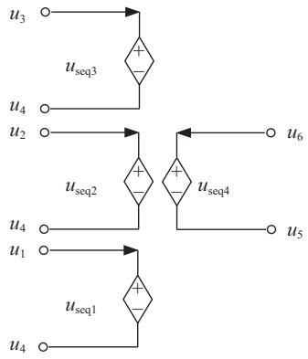  
Fig. 11. Equivalent circuit of PM.

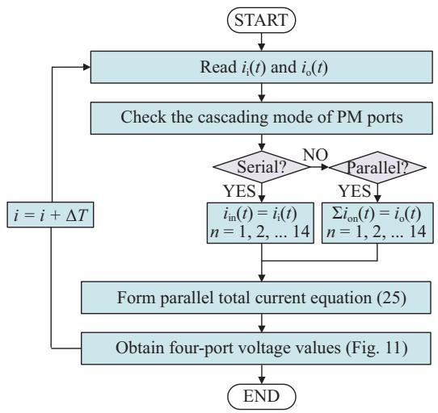  
Fig. 12. Flow chart of the ISOP cascading mode.

(ISOS), and input-parallel-output-parallel (IPOP). The ISOP type MAB-PET topology equivalent modeling is provided in this section, as shown in Fig. 12.

First, the CHB serial input side current $i _ { i } ( t )$ and MAB parallel output side total current $i _ { \mathrm { o } } ( t )$ from the previous simulation time-step are obtained. Then check the cascading mode of PM ports. If the PM port is in series, the current will be equal to the total current. If the PM port is connected in parallel, the sum of the currents of PMs will be the total current. According to (19), it can be obtained:

$$
\begin{array}{l} C _ {(m + 1)} \cdot \dot {q} _ {\mathrm {C} (m + 1)} (t) \\ = - 4 n \cdot \left[ \sum_ {i = 1} ^ {m} q _ {1 i} (t) \cdot \sin \varphi_ {2} + \sum_ {i = 1} ^ {m} q _ {2 i} (t) \cdot \cos \varphi_ {2} \right. \\ + \sum_ {i = 1} ^ {m} q _ {3 i} (t) \cdot \frac {1}{3} \sin (3 \varphi_ {2}) + \sum_ {i = 1} ^ {m} q _ {4 i} (t) \cdot \frac {1}{3} \cos (3 \varphi_ {2}) \\ \left. + \sum_ {i = 1} ^ {m} q _ {5 i} (t) \cdot \frac {1}{5} \sin (5 \varphi_ {2}) + \sum_ {i = 1} ^ {m} q _ {6 i} (t) \cdot \frac {1}{5} \cos (5 \varphi_ {2}) \right] \tag {24} \\ \end{array}
$$

Single PM port current is given in (24), so the sum of the N PMs port currents is (25) when the PM ports are in parallel:

$$
i _ {\mathrm {o}} (t) = \sum_ {i = 1} ^ {N} C _ {(m + 1) i} \cdot q _ {\mathrm {C} (\mathrm {m} + 1) \mathrm {i}} (t) \tag {25}
$$

By solving the differential (22)–(25), the voltage of the four ports of the PM in Fig. 11 can be obtained.

# B. Method of Obtaining Transformer Inductor Current

It is of great importance to analyze the inductor current of the MAB transformer for the selection of inductor parameters, harmonic characteristics analysis, and power loss reduction. Hence, this section gives the method of obtaining transformer inductor current in the proposed SEM, which aims to meet the requirements of system fault diagnosis, DC offset elimination, and dynamic response analysis.

When the equivalent inductor current of the transformer is equivalent to the base wave and $3 ^ { \mathrm { r d } } , 5 ^ { \mathrm { t h } } , \cdot \cdot \cdot , k ^ { \mathrm { t h } }$ (k is odd) harmonics, $q _ { 1 1 } ( t ) , q _ { 2 1 } ( t ) , \cdot \cdot \cdot , q _ { k 1 } ( t ) , q _ { ( k + 1 ) 1 } ( t )$ (k is odd) can be obtained by solving the differential (22). Then the timedomain equivalent inductor current $i _ { \mathrm { L 1 } } ( t )$ in phase A of the MAB transformer will be obtained as:

$$
\begin{array}{l} i _ {\mathrm {L} 1} (t) \\ = \mathrm {e} ^ {1 \varpi \Delta t} \cdot \left[ q _ {1 1} (t) + q _ {2 1} (t) j \right] + \mathrm {e} ^ {- 1 \varpi \Delta t} \cdot \left[ q _ {1 1} (t) - q _ {2 1} (t) j \right] \\ + \mathrm {e} ^ {3 \varpi \Delta t} \cdot [ q _ {3 1} (t) + q _ {4 1} (t) j ] + \mathrm {e} ^ {- 3 \varpi \Delta t} \cdot [ q _ {3 1} (t) - q _ {4 1} (t) j ] \\ + \dots + \dots + \mathrm {e} ^ {k \varpi \Delta t} \cdot \left[ q _ {k 1} (t) + q _ {(k + 1) 1} (t) j \right] \\ + \mathrm {e} ^ {- k \varpi \Delta t} \cdot \left[ q _ {k 1} (t) - q _ {(k + 1) 1} (t) j \right] \tag {26} \\ \end{array}
$$

The equivalent inductor currents in the time domain of the “m-to-1” MAB transformer will be:

$$
\begin{array}{l} i _ {\mathrm {L m}} (t) = \mathrm {e} ^ {1 \varpi \Delta t} \cdot \left[ q _ {1 m} (t) + q _ {2 m} (t) j \right] \\ + \mathrm {e} ^ {- 1 \varpi \Delta t} \cdot \left[ q _ {1 m} (t) - q _ {2 m} (t) j \right] \\ + \mathrm {e} ^ {3 \varpi \Delta t} \cdot \left[ q _ {3 m} (t) + q _ {4 m} (t) j \right] \\ + \mathrm {e} ^ {- 3 \varpi \Delta t} \cdot \left[ q _ {3 m} (t) - q _ {4 m} (t) j \right] + \dots + \dots \\ + \mathrm {e} ^ {k \varpi \Delta t} \cdot \left[ q _ {k m} (t) + q _ {(k + 1) m} (t) j \right] \\ + \mathrm {e} ^ {- k \varpi \Delta t} \cdot \left[ q _ {k m} (t) - q _ {(k + 1) m} (t) j \right] \tag {27} \\ \end{array}
$$

The model in this paper reflects the internal characteristics of the transformer, such as equivalent inductor current, and can be used for system analysis, protection design, analysis of the working process and state of PET, and fault location of the large-scale AC-DC hybrid grid containing multiple PET.

# C. PET Simplified Equivalent Modeling

As shown in Fig. 13, the PET model solving can be divided into three stages:

1) Read parameters and signals: Read system parameters and the 4N control signals of H-bridge IGBTs, then form flag $F$ according to the signals of CHB.   
2) Solve the voltage of four ports of the PMs: Determine the relationship between $i _ { i } ( t ) , i _ { \mathrm { o } } ( t )$ and $I _ { 1 } ( t ) , I _ { 2 } ( t )$ by flag F . By solving (22)–(25), the port voltages $U _ { \mathrm { C 1 / 2 / 3 / 4 } } ( t )$ and transformer equivalent inductor current $i _ { \mathrm { L } } ( t )$ of each MAB is solved. Then get the CHB series input side $u _ { i } ( t )$ and MAB parallel outlet side $u _ { \mathrm { o } } ( t )$ according to flag F .   
3) Solve the current of four ports with the external circuit: Obtain equivalent circuit port current $i _ { i } ( t ) , i _ { \mathrm { o } } ( t )$ in Fig. 14 by single-step solution.

After modeling a single PM and cascading PMs, an equivalent circuit with three controlled voltage sources on the input

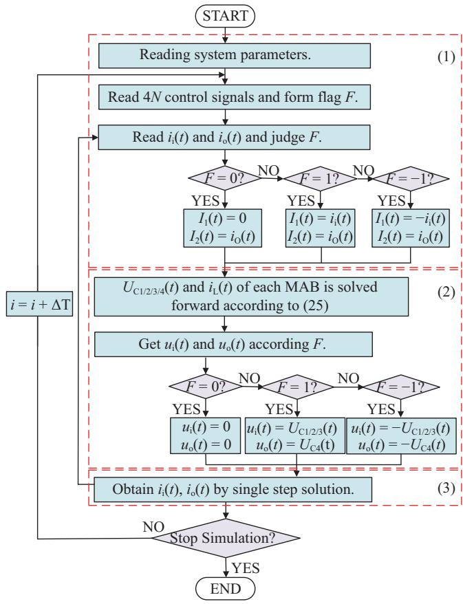  
Fig. 13. Flow chart of PET equivalent modeling.

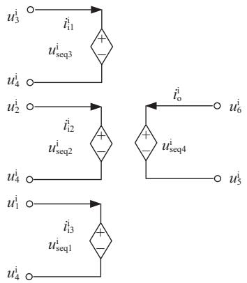  
Fig. 14. Equivalent circuit of PET.

side and a single controlled voltage source on the output side can be obtained in Fig. 14.

Due to the modular structure of PET, the states of different PMs can be determined by the control signals. The electrical value of MAB’s input port can be expressed as the coefficient relation of AC port electrical value by the method described in Section III-A, and the voltages of the PM four ports can be obtained by combining MAB topological parameters with the electrical values of the ports using (22) and (23). The four-port voltages are aggregated according to the PM cascade mode using (25). The equivalent circuit shown in Fig. 14 can be obtained, as well. The port currents are obtained in each time step, and then the equivalent model can be solved repeatedly.

# V. MODEL VALIDATION AND ANALYSIS

In this section, a DM and an SEM of the ISOP type MAB-PET shown in Fig. 1 are built in PSCAD/EMTDC to verify the proposed model. The LVDC side load is grounded through a high-impedance resistor. The studied model is used in the Chongli distribution network in Hebei, China, which is a demonstration project for “the Low-carbon Winter Olympics.”

The simulation accuracy and speedup factor of the model are tested. The switching frequency is 10 kHz for the MAB and ESS and 600 Hz for the CHB. Combining with the system switching frequency, the simulation time-step is selected as 1 µs. The structure of the test system is shown in Fig. 15, and system parameters are shown in Table II.

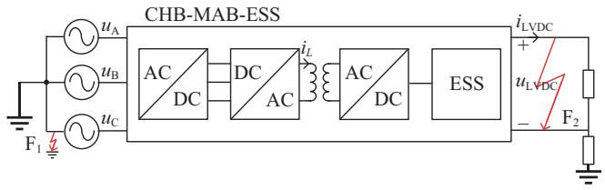  
Fig. 15. Schematic of the PET test system.

TABLE II PET TEST SYSTEM PARAMETERS   

<table><tr><td>Parameters</td><td>Values</td></tr><tr><td>HVDC bus voltage us (kV)</td><td>10</td></tr><tr><td>LVDC bus voltage uL (kV)</td><td>0.6</td></tr><tr><td>Switching frequency f (kHz)</td><td>10</td></tr><tr><td>MAB input side capacitance C1,2,3 (μF)</td><td>2000</td></tr><tr><td>MAB outlet side capacitance C4 (μF)</td><td>1000</td></tr><tr><td>High-frequency transformer ratio n</td><td>0.9/0.771</td></tr><tr><td>Transformer additional inductance L (μH)</td><td>55.8</td></tr><tr><td>Module number N</td><td>14</td></tr></table>

Considering the harmonic selection method mentioned in Section III-C, the amplitude of $7 ^ { \mathrm { t h } }$ and above odd harmonics of the transformer equivalent inductor current is small (about 6% in total). Therefore, the test model established in this chapter only considers the base wave, $3 ^ { \mathrm { r d } }$ and $5 ^ { \mathrm { t h } }$ harmonic waves of the equivalent inductor current of the transformer.

# A. Accuracy: MAB-PET with ESS

In this section, the AC voltage $u _ { \mathrm { s } }$ and the transformer equivalent inductor current $i _ { \mathrm { { L } } }$ under steady-state and the LVDC voltage $u _ { \mathrm { L V D C } }$ and current $i _ { \mathrm { L V D C } }$ under multi-state are tested. The accuracy of SEM and DM are compared to verify the effectiveness of the SEM in characterizing the internal and external characteristics of the system.

# 1) Steady-state Operation

Figure 16 shows the steady-state AC voltage. The enlarged figure shows the AC voltage in the steady state is a wave with small steps, and the maximum error of SEM is 5% compared with DM.

Figure 17 shows the equivalent inductor current of the transformer phase A. Compared with DM, the maximum error of the equivalent inductor current of the SEM is 1.5%.

The main reason for the error is the equivalent inductor current of the SEM only considers the main low-order harmonics.

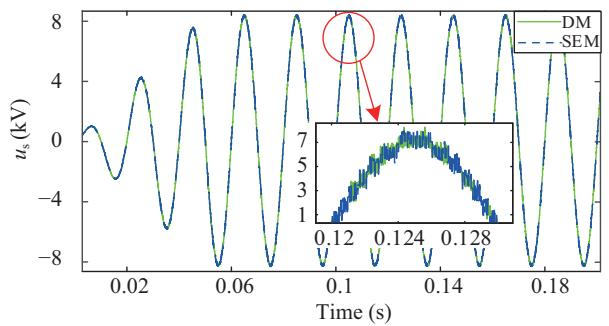  
Fig. 16. AC voltage during steady-state.

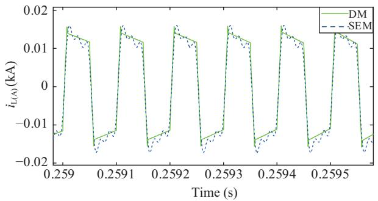  
Fig. 17. Transformer equivalent inductor current during steady-state.

However, the error is in an acceptable range for system-level analysis.

# 2) Multi-state Operation

To test the simulation accuracy of SEM under multi-state operation, the simulation timing is set as follows:

a) 0–0.1 s: Set the startup time of the MVAC power supply as 0.05 s to start the system.   
b) 0.1–0.5 s: When the startup process is over, the system will enter steady-state operation.   
c) 0.5–1.0 s: A MVAC single-phase ground fault $( \mathrm { F _ { 1 } }$ in Fig. 15), which is grounded through low resistance, is set at $t = 0 . 5 \mathrm { ~ s ~ } .$ The system starts to recover after the fault.   
d) $1 . 0 { - } 1 . 5 \ \mathrm { s } { : } \ \mathrm { A }$ pole-to-pole LVDC fault $( \mathrm { F _ { 2 } }$ in Fig. 15) occurs at $t = 1 . 0 ~ \mathrm { s } .$ . The high and low poles are short-circuited through a 0.5 Ω resistance. The system starts to recover after the fault.

PET’s voltage uLVDC (Fig. 18) and LVDC current iLVDC (Fig. 19) are selected to compare the simulation results of each stage of the SEM and DM.

The uLVDC crosses the LVDC terminal. The enlarged figure of Fig. 18(a) shows a startup waveform with a peak error 1.8%. Fig. 18(b) shows the maximum error during the singlephase ground fault is 1.5%. Again, the agreement is excellent in Fig. 18(c), with the peak error typically less than 2%, indicating that the proposed approach has excellent accuracy.

Figure 19 shows the startup and fault waveforms of the LVDC current. The maximum current fluctuation of a pole-topole fault is about 1 kV.

# B. Accuracy: MAB-PET in Distribution Network

The topology shown in Fig. 1 has been deployed in the Chongli distribution network, which realizes the integration of PV stations and ESSs, as shown in Fig. 20. In this topology,

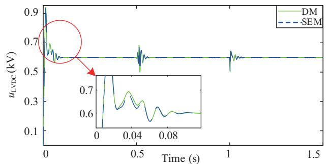

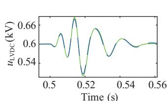

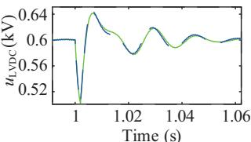  
(c)

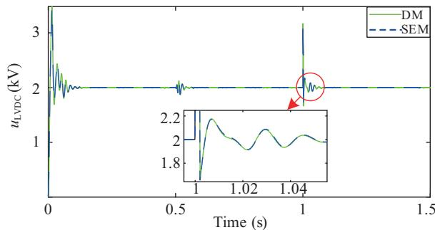  
Fig. 18. The waveforms during multi-state. (a) The LVDC voltage. (b) Singlephase ground fault $( \mathrm { F _ { 1 } } )$ . (c) Pole-to-pole fault (F2).   
Fig. 19. The LVDC current during multi-state.

PVs are connected to the power grid through DC/DC units and MAB-PET, and ESSs are directly integrated into MAB-PET. This reduces the use of interface converters and, therefore, reduces system complexity. The control of the MAB-PET used in the Chongli system is a little bit complicated, which is one disadvantage. The topology can be used for large-scale gridconnected PV stations with ESSs.

The PV stations start to generate power from $t \ = \ 1 \ \mathrm { \ s } .$ Fig. 21 shows the power variations of the MVAC and DC loads. Figs. 22 and 23 show the LVDC and AC voltages of the MAB-PET distribution network. It can be seen that the SEM matches the DM well during dynamics.

When the PV stations start to generate power, $P _ { \mathrm { M V A C } }$ drops to 1.5 MW and $P _ { \mathrm { l o a d } }$ maintains at −0.8 MW, $u _ { \mathrm { L V D C } }$ maintains at 0.6 kV, which means the distribution network can still ensure stable load operation when the PV station and ESS change dynamically. Compared with DM, the maximum error of the AC voltage of the SEM is 3.5%. The simulation results show the proposed model can precisely describe the dynamic characteristics of the external system in the time domain.

# C. Speedup Factor

The speedup effect of the ISOP type MAB-PET with different numbers of PMs is investigated. The time-step is 1 µs and the duration is 5 s. The speedup factor is defined as the

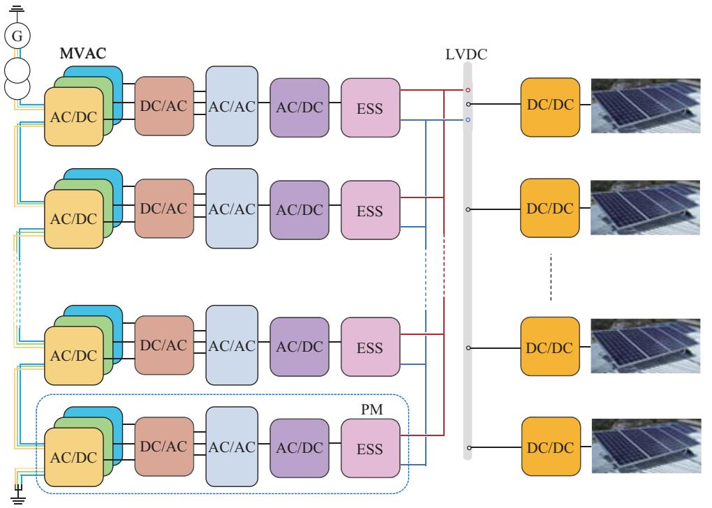  
Fig. 20. Topology of the Chongli MAB-PET with PV stations.

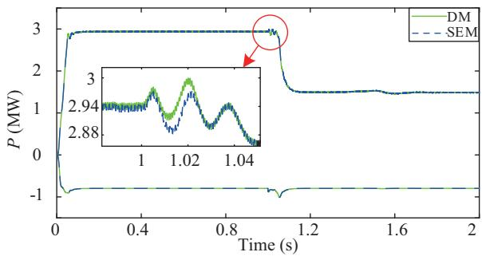  
Fig. 21. Power changes.

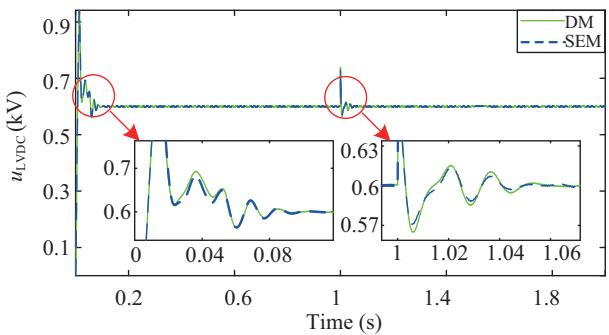  
Fig. 22. LVDC voltage of the MAB-PET distribution network.

ratio of CPU times of two models with the same time step and duration of the simulation [24]. To reflect the advantages of the SEM in terms of efficiency, the EM of reference [24] is introduced for comparison in Table III.

For 14 PMs, the speedup factor is 391.5. For 42 PMs, the simulation is over 3 orders of magnitude faster. Compared with [24], the model in this paper ignores high-order harmonic waves of transformer equivalent inductor current to speed up

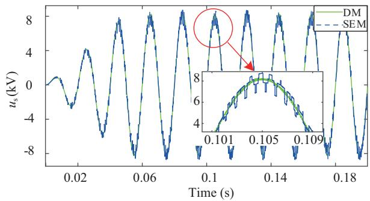  
Fig. 23. AC voltage of the MAB-PET distribution network.

TABLE III CPU TIME RESULTS   

<table><tr><td>PM 
number 
(N)</td><td>CPU 
time (s) 
(DM)</td><td>CPU 
time (s) 
(SEM)</td><td>CPU 
time (s) 
(EM)</td><td>Speedup 
factor 
(SEM)</td><td>Speedup 
factor 
(EM)</td></tr><tr><td>3</td><td>686.30</td><td>14.66</td><td>96.39</td><td>46.82</td><td>7.12</td></tr><tr><td>8</td><td>2769.75</td><td>19.32</td><td>107.70</td><td>143.33</td><td>25.71</td></tr><tr><td>14</td><td>13636.34</td><td>34.83</td><td>122.69</td><td>391.53</td><td>111.14</td></tr><tr><td>42</td><td>214691.97</td><td>130.38</td><td>218.17</td><td>1646.73</td><td>984.05</td></tr></table>

the simulation, and the speedup factor increases rapidly with the expansion of the topology scale. Thus, the proposed SEM has an excellent acceleration effect in the simulation of the MAB-PET system with high switching frequency and multiple modules.

# VI. CONCLUSION

In this paper, a simplified EMT equivalent model of ISOP type MAB-PET is proposed. An averaging model of CHB is established by the switching function method. An ESS efficient model is constructed using the binary resistance method and

the Dommel method. A system-level MAB model is constructed by the generalized state-space averaging method. The system is simplified by Fourier Decomposition of the state equation and ignoring the insignificant order. Moreover, a fourport voltage sources equivalent circuit is developed, which can directly connect to the external circuit.

The simplified EMT equivalent model of the MAB-PET is verified by comparing it with the DM and EM [24] in the open literature. Simulation results show the proposed models in steady-state, single-phase ground fault, and pole-to-pole LVDC fault scenarios are accurate. The speedup factor is almost 2–3 orders of magnitude, which is around two times faster than the previous equivalent models.

The proposed SEM is an accurate system-level model without considering the device switching process and can also extend to other PETs like SAB, DAB, and QAB. The SEM can reflect all the external characteristics and part of the internal characteristics and can be applied to system analysis and protection design of large-scale AC-DC hybrid power grids that contain multiple PETs.

# REFERENCES

[1] Z. T. Tang, Y. H. Yang, and F. Blaabjerg, “Power electronics: The enabling technology for renewable energy integration,” CSEE Journal of Power and Energy Systems, vol. 8, no. 1, pp. 39–52, Jan. 2022.   
[2] H. B. Zhang, W. Xiang, W. X. Lin, and J. Y. Wen, “Grid forming converters in renewable energy sources dominated power grid: control strategy, stability, application, and challenges,” Journal of Modern Power Systems and Clean Energy, vol. 9, no. 6, pp. 1239–1256, Nov. 2021.   
[3] Y. B. Chen, Z. T. Zhang, Q. Li, and P. G. Zou, “Stability analysis and inspection of grid-connected inverter in large-scale new energy environment,” in 2021 6th International Conference on Power and Renewable Energy (ICPRE), 2022, pp. 487–492.   
[4] C. Zhao, Y. H. Li, Z. X. Li, P. Wang, X. Ma, and Y. J. Luo, “Optimized design of full-bridge modular multilevel converter with low energy storage requirements for HVDC transmission system,” IEEE Transactions on Power Electronics, vol. 33, no. 1, pp. 97–109, Jan. 2018.   
[5] Z. W. Qu, Z. Shi, Y. J. Wang, A. Abu-Siada, Z. X. Chong, and H. Y. Dong, “Energy management strategy of AC/DC hybrid microgrid based on solid-state transformer,” IEEE Access, vol. 10, pp. 20633–20642, Feb. 2022.   
[6] H. Zhu, H. Li, G. J. Liu, Y. Ge, J. Shi, H. Li, and N. Zhang, “Energy Storage in High Variable Renewable Energy Penetration Power Systems: Technologies and Applications,” CSEE Journal of Power and Energy Systems, vol. 9, no. 6, pp. 2099–2108, Nov. 2023.   
[7] L. F. Costa, F. Hoffmann, G. Buticchi, and M. Liserre, “Comparative analysis of multiple active bridge converters configurations in modular smart transformer,” IEEE Transactions on Industrial Electronics, vol. 66, no. 1, pp. 191–202, Jan. 2019.   
[8] C. Y. Gu, Z. D. Zheng, L. Xu, K. Wang, and Y. D. Li, “Modeling and control of a multiport power electronic transformer (PET) for electric traction applications,” IEEE Transactions on Power Electronics, vol. 31, no. 2, pp. 915–927, Feb. 2016.   
[9] J. Z. Xu, C. Y. Zhao, W. J. Liu, and C. Y. Guo, “Accelerated model of modular multilevel converters in PSCAD/EMTDC,” IEEE Transactions on Power Delivery, vol. 28, no. 1, pp. 129–136, Jan. 2013.   
[10] J. Z. Xu, C. Y. Li, Y. Xiong, Y. K. Ji, C. Y. Zhao, and T. An, “A review of efficient modeling methods for modular multilevel converters,” Proceedings of the CSEE, vol. 35, no. 13, pp. 3381–3392, Jul. 2015.   
[11] M. K. Feng, C. X. Gao, J. P. Ding, H. Ding, J. Z. Xu, and C. Y. Zhao, “Hierarchical modeling scheme for high-speed electromagnetic transient simulations of power electronic transformers,” IEEE Transactions on Power Electronics, vol. 36, no. 9, pp. 9994–10004, Sep. 2021.   
[12] J. Xu, K. Y. Wang, and G. J. Li, “Review of real-time simulation of power electronic devices and power systems integrated with power electronic devices,” Automation of Electric Power Systems, vol. 46, no. 10, pp. 3–17, May 2022.

[13] H. Liu, Z. F. Deng, X. L. Li, L. Guo, D. Huang, S, Q. Fu, X. Y. Chen, and C. S. Wang, “The averaged-value model of a flexible power electronics based substation in hybrid AC/DC distribution systems,” CSEE Journal of Power and Energy Systems, vol. 8, no. 2, pp. 452–464, Mar. 2022.   
[14] Z. G. Lu, J. Y. Song, C. H. Zheng, W. Y. Xu, and X. T. Wang, “Generalized state space average-value model of MAB based power electrical transformer,” in 2021 5th International Conference on Power and Energy Engineering (ICPEE), 2021, pp. 46–52.   
[15] J. A. Mueller and J. W. Kimball, “Modeling dual active bridge converters in DC distribution systems,” IEEE Transactions on Power Electronics, vol. 34, no. 6, pp. 5867–5879, Jun. 2019.   
[16] Z. Q. Li, Y. Wang, L. Shi, J. Huang, Y. Cui, and W. J. Lei, “Generalized averaging modeling and control strategy for three-phase dual-activebridge DC-DC converters with three control variables,” in 2017 IEEE Applied Power Electronics Conference and Exposition (APEC), 2017, pp. 1078–1084.   
[17] F. Li, Y. C. Wang, F. Wu, Y. Huang, Y. Liu, X. Zhang, and M. Y. Ma, “Review of real-time simulation of power electronics,” Journal of Modern Power Systems and Clean Energy, vol. 8, no. 4, pp. 796–808, Jul. 2020.   
[18] S. X. Yi, R. Chen, X. F. Wang, T. Z. Cao, and L. Zheng, “Automatic parameter optimization based on high-efficiency simulation model of regional energy router,” in 2022 5th International Conference on Energy, Electrical and Power Engineering (CEEPE), 2022, pp. 1283–1287.   
[19] F. Zhang and W. Li, “An equivalent circuit method for modeling and simulation of dual active bridge converter based marine distribution system,” in 2019 IEEE Electric Ship Technologies Symposium (ESTS), 2019, pp. 382–387.   
[20] R. Yin, M. Shi, W. P. Hu, J. Guo, P. F. Hu, and Y. F. Wang, “An accelerated model of modular isolated DC/DC converter used in offshore DC wind farm,” IEEE Transactions on Power Electronics, vol. 34, no. 4, pp. 3150–3163, Apr. 2019.   
[21] J. Z. Xu, C. X. Gao, J. P. Ding, X. H. Shi, M. K. Feng, C. Y. Zhao, and H. Ding, “High-speed electromagnetic transient (EMT) equivalent modelling of power electronic transformers,” IEEE Transactions on Power Delivery, vol. 36, no. 2, pp. 975–986, Apr. 2021.   
[22] F. D. Hernandez, R. Samanbakhsh, P. Mohammadi, and F. M. Ibanez, “A dual-input high-gain bidirectional DC/DC converter for hybrid energy storage systems in DC grid applications,” IEEE Access, vol. 9, pp. 164006–164016, Dec. 2021.   
[23] A. Ortega and F. Milano, “Generalized model of VSC-based energy ´ storage systems for transient stability analysis,” IEEE Transactions on Power Systems, vol. 31, no. 5, pp. 3369–3380, Sep. 2016.   
[24] M. K. Feng, C. X. Gao, J. Z. Xu, C. Y. Zhao, and G. Li, “Modeling for complex modular power electronic transformers using parallel computing,” IEEE Transactions on Industrial Electronics, vol. 70, no. 3, pp. 2639–2651, Mar. 2023.   
[25] S. D. Ouyang, J. J. Liu, S. G. Song, and X. Y. Wang, “Operation and efficiency analysis of an MAB based three-phase three-stage power electronic transformer,” in 2015 IEEE 2nd International Future Energy Electronics Conference (IFEEC), 2015, pp. 1–6.   
[26] J. Z. Xu, S. T. Fan, C. Y. Zhao, and A. M. Gole, “High-speed EMT modeling of MMCs with arbitrary multiport submodule structures using generalized norton equivalents,” IEEE Transactions on Power Delivery, vol. 33, no. 3, pp. 1299–1307, Jun. 2018.   
[27] H. Saad, J. Peralta, S. Dennetiere, J. Mahseredjian, J. Jatskevich, J. ` A. Martinez, A. Davoudi, M. Saeedifard, V. Sood, X. Wang, J. Cano, and A. Mehrizi-Sani, “Dynamic averaged and simplified models for MMC-based HVDC transmission systems,” IEEE Transactions on Power Delivery, vol. 28, no. 3, pp. 1723–1730, Jul. 2013.   
[28] J. Z. Xu, Y. C. Zhao, C. Y. Zhao, and H. Ding, “Unified high-speed EMT equivalent and implementation method of MMCs with singleport submodules,” IEEE Transactions on Power Delivery, vol. 34, no. 1, pp. 42–52, Feb. 2019.

Jianzhong Xu received the B.S. and Ph.D. degrees from North China Electric Power University (NCEPU) in 2009 and 2014 respectively. Currently, he is an Associate Professor of the State Key Laboratory of Alternate Electrical Power System with Renewable Energy Sources, NCEPU, Beijing, China. From 2012 to 2013 and 2016 to 2017, he was respectively a joint Ph.D. student and Post-Doctoral Fellow (PDF) at the University of Manitoba. He is now working on the high-speed electromagnetic transient (EMT) modeling and control & protection

of MMC-HVdc and DC grid.

Conghui Zheng received her B.S. degree in Electrical Engineering and Automation from Beijing Jiaotong University, Beijing, China, in 2020. Currently, she is a graduate student of the State Key Laboratory of Alternate Electrical Power System with Renewable Energy Sources, NCEPU, Beijing, China. She is now working on equivalent modeling of power electronic transformer.

Chengyong Zhao received the B.S., M.S. and Ph.D. degrees in Power System and Its Automation from NCEPU in 1988, 1993 and 2001, respectively. He was a visiting professor at the University of Manitoba from Jan. 2013 to Apr. 2013 and Sep. 2016 to Oct. 2016. Currently, he is a Professor at the School of Electrical and Electronic Engineering, NCEPU. His research interests include HVdc system and dc grid.

Wanying Xu received the B.S. degree from North China Electric Power University (NCEPU) in 2020. Currently, she is a graduate student of the State Key Laboratory of Alternate Electrical Power System with Renewable Energy Sources, NCEPU, Beijing, China. She is now working on equivalent modeling of power electronic transformer.

Moke Feng received the B.S. degree in Electrical Engineering and Its Automation from North China Electric Power University (NCEPU), Beijing, China, in 2017. He is currently pursuing the Ph.D. degree in Electrical Engineering in the State Key Laboratory of Alternate Electrical Power System with Renewable Energy Resources, NCEPU, Beijing, China. His research interests include modeling of the key equipment in distribution network and HVDC transmission system.

Gen Li received the B.Eng. degree in Electrical Engineering from Northeast Electric Power University, Jilin, China, in 2011, the M.Sc. degree in Power Engineering from Nanyang Technological University, Singapore, in 2013 and the Ph.D. degree in Electrical Engineering from Cardiff University, Cardiff, U.K., in 2018. He is now an Associate Professor at the Technical University of Denmark (DTU), Denmark. From 2013 to 2016, he has been a Marie Curie Early Stage Research Fellow funded by the European Commission’s MEDOW project. He

has been a Visiting Researcher at China Electric Power Research Institute and State Grid Smart Grid Research Institute, Beijing, China, at Elia, Brussels, Belgium and at Toshiba International (Europe), London, U.K. He was a Research Associate at the School of Engineering, Cardiff University from 2018 to 2022. His research interests include control and protection of HV and MV DC technologies, offshore wind, offshore energy islands, reliability modelling and evaluation of power electronics systems. Dr. Li is a Chartered Engineer in the U.K., a Young Editorial Board Member of Applied Energy, an Associate Editor of the CSEE Journal of Power and Energy Systems and IET Energy Systems Integration, an Editorial Board Member of CIGRE ELECTRA and Global Energy Interconnection and an IET Professional Registration Advisor. His Ph.D. thesis received the First CIGRE Thesis Award in 2018. He is now a Steering Committee Member of CIGRE Denmark NGN, a Member of CIGRE Working Group B4.96 and a Member of IEEE PELS Publicity Committee.