# An improved approach for modeling lightning transients of wind turbines

Zhang Xiaqinga, Zhang Yongzhengb, Xiao Xianga,*

$^{a}$ School of Electrical Engineering, Beijing Jiaotong University, Beijing, China   
b Global Energy Interconnection Research Institute, Beijing, China

# ARTICLEINFO

Keywords:

Lightning

Wind turbine

Transient modeling

Multiconductor system

Circuit model

# ABSTRACT

A modeling approach is proposed in this paper for calculating lightning transient responses on wind turbines (WTs). The equivalent circuits are built for blade, dynamic contact part, tower body and grounding system, respectively. The improved tower model discretizes the tower body into a truncated pyramid multiconductor system and can describe the geometrical feature of the actual tower body in a more precise manner. An entire circuit representation is given for the WT by connecting the respective equivalent circuits, from which the lightning transient responses can be obtained. The experimental measurement is also made with a laboratory-scale WT. The validity of the proposed approach is checked by comparing the calculated results with the measured ones. Then, the proposed approach is applied to the lightning transient calculation of an actual WT with 2 MW to predict its potential rise during lightning stroke.

# 1. Introduction

Wind turbines (WTs) are normally located in the opened and exposed areas. Owing to the tall structures, modern multi-megawatt WTs are especially prone to lightning strikes. When a WT is struck by lightning, a high lightning current flows from the attachment point to the grounding system and can cause a severe damage to the blade material and WT components. As wind power generation undergoes rapid growth, lightning protection of WTs has become a critical aspect for safety and reliability of wind power systems. Determination of the lightning transient responses can provide a valuable support for a proper design of the protection system. In order to analyze the lightning transient behavior of WTs, a number of modeling approaches have been presented in literature [1-6]. A realistic model has also been developed for numerically simulating the fast transient phenomena in the grounding grids of power systems [7], which can provide a valuable reference for lightning transient calculation of WTs. As far as the previous approaches are concerned, the imperfection arises mainly in transient modeling of the tower body, namely the longest lightning current path on WTs. A surge impedance of transmission line was first used for representing the tower body [1,2]. With a segmented processing for the tower body, a cascade hollow conductor model was then proposed [3,4]. Recently, a cylindrical conductor cage was also presented by a few researchers to model the tower body [5,6]. These models of the tower body are undoubtedly simple and easy to implement into lightning transient calculation; however, they can not exactly describe the geometrical feature of the actual tower body in the shape

of circular truncated cone. In view of the imperfection of the previous approaches, an improvement is made in this paper for modeling lightning transients of WTs. The tower body is modeled as a discrete multiconductor system and an adequate consideration can be given to its geometry of circular truncated cone. The equivalent circuit of the grounding system is built for calculating the fast transients under the subsequent negative stroke. Moreover, the blade and dynamic contact are also modeled in a reasonably simplified manner. On the basis of integrating the four sections on the lightning current path, an entire circuit representation is given for the WT. The lightning transient responses on the WT can be determined from the solution to the circuit equations. A laboratory-scale WT has also been built and the measured results are used to verify the validity of the proposed approach.

# 2. Circuit modeling of wind turbines

In order to calculate the transient responses, the current carrying path on a WT struck by lightning needs to be represented by the equivalent circuits. It mainly consists of the blade, dynamic contact part, tower body and grounding system, as shown in Fig. 1. Therefore, the equivalent circuits are built on the basis of the four sections.

# 2.1. Equivalent circuits for blade and dynamic contact part

The blade is the most vulnerable component of the WT for direct lightning stroke. To lead the lightning current to flow to the ground during lightning stroke, the down conductor is usually placed inside the

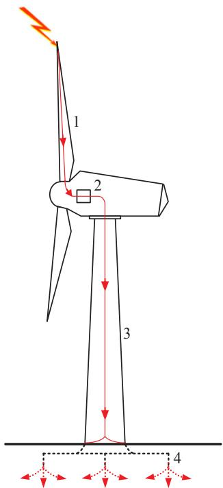  
Fig. 1. Lightning current path (1-down conductor; 2-dynamic contact part; 3-tower body; 4-grounding system).

blade, as illustrated by the thick lines in Fig. 2(a). When the blade rotates, it may be struck by lightning with high probability at the vertical position and inclined position with a smaller deflection angle $\theta$ (see Fig. 2(a)) [8]. Therefore, the two spatial positions need to be considered in building the equivalent circuit of the blade. In view of the traveling wave behavior of lightning current, the down conductor is divided into a suitable number of segments. As shown in Fig. 2(b), $M$ segments are given for the down conductor. The segment length $\Delta l_{\mathrm{b}}$ should be less than a critical value $l_{\mathrm{cr}} = 0.1c / f_{\mathrm{m}}$ , where $c$ is the velocity of light $(3\times 10^{8}\mathrm{m / s})$ and $f_{\mathrm{m}}$ is the maximum frequency likely to affect the lightning transient [9]. The electrical parameters of each segment are represented by resistance, inductance and capacitance. In the parameter calculation, the existence of the ground is taken into account by

installing the image of the segment. The imaginary segment is installed at a symmetrical position below the ground surface and depicted by the dotted lines, as shown in Fig. 3. The length of the imaginary segment is equal to that of the respective real segment. For a vertical segment, as shown in Fig. 3(a), its inductance is calculated by Neumann's integral [10]

$$
\begin{array}{l} L _ {\mathrm {v j}} = \frac {\mu_ {0}}{4 \pi} \left(\int_ {\Delta l _ {\mathrm {b}}} \int_ {\Delta l _ {\mathrm {b}}} \frac {\mathrm {d} l \cdot \mathrm {d} l _ {\mathrm {p}}}{r} + \int_ {\Delta l _ {\mathrm {b}}} \int_ {\Delta l _ {\mathrm {b}}} \frac {\mathrm {d} l ^ {\prime} \cdot \mathrm {d} l _ {\mathrm {p}}}{r ^ {\prime}}\right) \\ = \frac {a \mu_ {0}}{4 \pi} \left[ 2 + \Psi \left(\frac {\Delta l _ {\mathrm {b}}}{a}\right) + \Psi \left(- \frac {\Delta l _ {\mathrm {b}}}{a}\right) + \Psi \left(\frac {- 2 h}{a}\right) \right. \\ \left. + \Psi \left(- \frac {2 h + 2 \Delta l _ {\mathrm {b}}}{a}\right) - 2 \Psi \left(- \frac {\Delta l _ {\mathrm {b}} + 2 h}{a}\right) \right] \tag {1} \\ \end{array}
$$

where $\mu_0$ is the permeability of free space $(4\pi \times 10^{-7}\mathrm{H / m})$ and the function in the square brackets is

$$
\Psi \left(\frac {x}{a}\right) = \frac {1}{a} \left[ x \sinh^ {- 1} \frac {x}{a} - \sqrt {a ^ {2} + x ^ {2}} \right] \tag {2}
$$

In a manner similar to Eq. (1), the inductance of an inclined segment, as shown in Fig. 3(b), is also calculated by [10]

$$
\begin{array}{l} L _ {\mathrm {i j}} = \frac {\mu_ {0}}{2 \pi} \left[ \Delta l _ {\mathrm {b}} \tanh ^ {- 1} \frac {\Delta l _ {\mathrm {b}}}{\sqrt {a ^ {2} + \Delta l _ {\mathrm {b}} ^ {2}}} - \sqrt {a ^ {2} + \Delta l _ {\mathrm {b}} ^ {2}} + a \right. \\ \left. + 2 \left(w + \Delta l _ {\mathrm {b}}\right) \tanh  ^ {- 1} \frac {\Delta l _ {\mathrm {b}}}{p + 2 h _ {2}} - 2 w \tanh  ^ {- 1} \frac {\Delta l _ {\mathrm {b}}}{p + 2 h _ {1}} \right] \tag {3} \\ \end{array}
$$

where $w = h_{1}\Delta l_{\mathrm{b}} / (h_{2} - h_{1})$ and $p = \sqrt{\Delta l_{\mathrm{b}}^2 + 4h_1h_2}$ . According to the electromagnetic analogy [11,12], the corresponding capacitances can be determined respectively for the vertical and inclined segments, i.e. $C_{\mathrm{vj}} = \mu_0\varepsilon_0 / L_{\mathrm{vj}}$ and $C_{\mathrm{ij}} = \mu_0\varepsilon_0 / L_{\mathrm{ij}}$ , where $\varepsilon_0$ is the permittivity of free space $[(36\pi)^{-1}\times 10^{-9}\mathrm{F / m}]$ . The resistance of each segment is estimated by [13]

$$
R _ {\mathrm {b}} = \frac {\sqrt {\pi f _ {\mathrm {m}} \rho \mu} \Delta l _ {\mathrm {b}}}{\pi \left[ 1 - \exp \left(- a / \sqrt {\rho / \pi f _ {\mathrm {m}} \mu}\right) \right] \left[ 2 a - \sqrt {\rho / \pi f _ {\mathrm {m}} \mu} \left(1 - \exp \left(- a / \sqrt {\rho / \pi f _ {\mathrm {m}} \mu}\right)\right) \right]} \tag {4}
$$

where $\rho$ and $\mu$ are resistivity and permeability of the down conductor, respectively. In terms of the electrical parameters calculated from (1)-(4), the vertical and inclined segments are represented as the II-circuit units. After each segment in Fig. 2(b) is replaced with the respective II-circuit unit, the equivalent circuit of a blade can be built, as shown in Fig. 4.

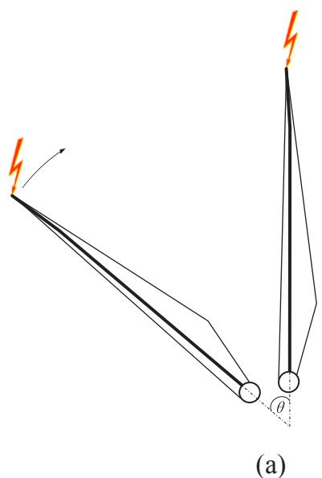

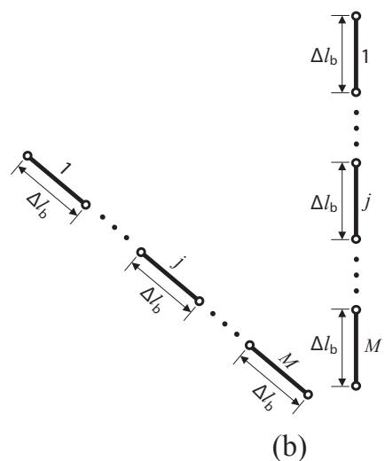  
Fig. 2. (a) Down conductor in the blade. (b) Segmentation for the down conductor.

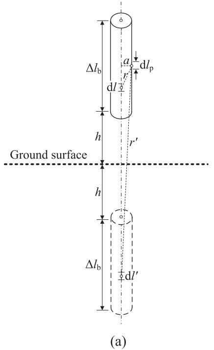

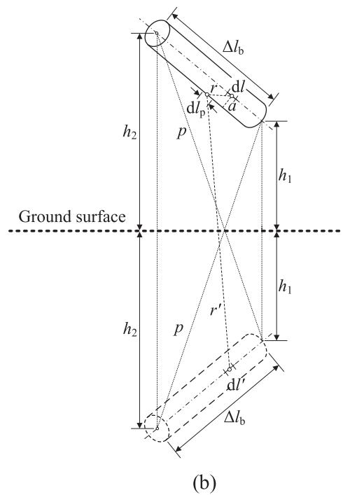  
Fig. 3. (a) Vertical segment. (b) Inclined segment.

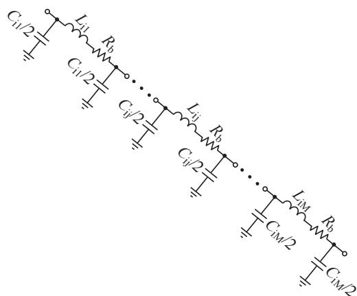

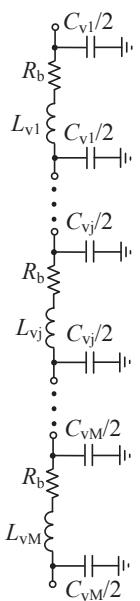  
Fig. 4. Equivalent circuit of the blade.

The dynamic contact part is the conductive path in the presence of relative motion between the blade root and tower top. It mainly includes the brushes, sliding contacts, and main shaft bearings. As the nacelle is rarely tuning, the yaw bearing is negligible. For the sake of circuit simplification, the brushes and sliding contacts are represented as the contact resistance $R_{\mathrm{C}}$ [1], while the shaft bearings are characterized by the capacitance $C_{\mathrm{S}}$ . The value of $C_{\mathrm{S}}$ can be estimated by the formula presented in Ref. [14]. Considering the actual current-dividing route, the dynamic contact part is modeled as a parallel $R_{\mathrm{C}} - C_{\mathrm{S}}$ circuit unit.

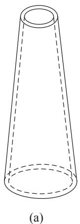

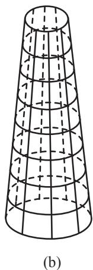

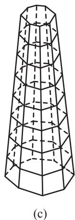  
Fig. 5. (a) Tower body. (b) Truncated cone multiconductor system. (c) Truncated pyramid multiconductor system.

# 2.2. Equivalent circuits for tower body and grounding system

The tower body is a continuous conducting shell in the shape of the hollow circular truncated cone, as shown in Fig. 5(a). For the purpose of lightning transient modeling, it can be approximately dissected into a multiconductor system formed by a series of longitudinal and transverse segments [4,5], as shown in Fig. 5(b). As is the case in the blade, the segment length is chosen to be less than $l_{\mathrm{cr}}$ . With each transverse arc segment replaced by its respective chord, Fig. 5(b) is further simplified into a multiconductor system in the shape of truncated pyramid, as shown in Fig. 5(c). In the multiconductor system, the typical segment pairs are considered according to their relationship of spatial positions, as illustrated in Fig. 6. By using Neumann's integral, the mutual inductance is calculated for two transverse segments $j$ and $k$

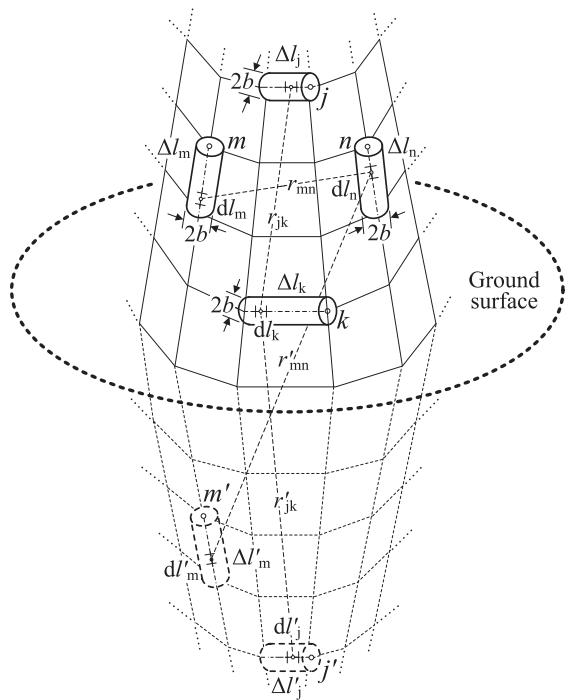  
Fig. 6. Typical segment pairs.

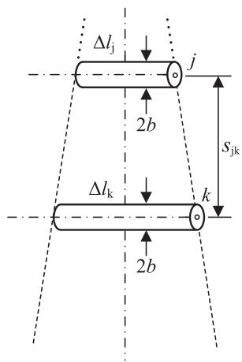  
(a)

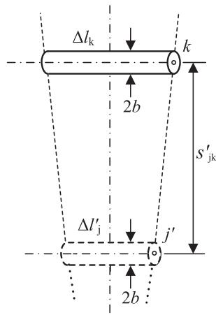  
(b)   
Fig. 7. (a) Segment pair $(j, k)$ . (b) Segment pair $(j', k)$ .

$$
L _ {\mathrm {j}, \mathrm {k}} = \frac {\mu_ {0}}{4 \pi} \left[ \int_ {\Delta l _ {\mathrm {j}}} \int_ {\Delta l _ {\mathrm {k}}} \frac {d l _ {\mathrm {j}} \cdot d l _ {\mathrm {k}}}{r _ {\mathrm {j k}}} + \int_ {\Delta l _ {\mathrm {j}} ^ {\prime}} \int_ {\Delta l _ {\mathrm {k}}} \frac {d l _ {\mathrm {j}} ^ {\prime} \cdot d l _ {\mathrm {k}}}{r _ {\mathrm {j k}} ^ {\prime}} \right] \tag {5}
$$

The two double line integrals in the square brackets of Eq. (5) are related to segment pairs $(j, k)$ and $(j', k)$ , respectively. Judging from the spatial position, both segment pairs are coplanar and parallel. As illustrated in Fig. 7(a), the first double line integral is evaluated by [15]

$$
\begin{array}{l} \int_ {\Delta l _ {j}} \int_ {\Delta l _ {k}} \frac {d l _ {j} d l _ {k}}{r _ {j k}} = - (\Delta l _ {k} - \Delta l _ {j}) \sinh^ {- 1} \frac {\Delta l _ {k} - \Delta l _ {j}}{2 s _ {j k}} + (\Delta l _ {k} + \Delta l _ {j}) \sinh^ {- 1} \frac {\Delta l _ {k} + \Delta l _ {j}}{2 s _ {j k}} \\ + 2 \left[ \sqrt {\left(\frac {\Delta l _ {\mathrm {k}} - \Delta l _ {\mathrm {j}}}{2}\right) ^ {2} + s _ {\mathrm {j k}} ^ {2}} - \sqrt {\left(\frac {\Delta l _ {\mathrm {k}} + \Delta l _ {\mathrm {j}}}{2}\right) ^ {2} + s _ {\mathrm {j k}} ^ {2}} \right] \\ \end{array}
$$

(6)

Putting $\Delta l_{\mathrm{k}} = \Delta l_{\mathrm{j}}^{\prime}$ , $\Delta l_{\mathrm{j}} = \Delta l_{\mathrm{k}}$ and $s_{\mathrm{jk}} = s_{\mathrm{jk}}^{\prime}$ into Eq. (6), as illustrated in Fig. 7(b), the second double line integral can also be evaluated. If the spatial position of segment $j$ remains unchanged in Fig. 6, its self

inductance $L_{\mathrm{j,j}}$ can be calculated by bringing the axis of segment $k$ into coincidence with the generatrix of segment $j$ and setting $\Delta l_{\mathrm{j}} = \Delta l_{\mathrm{k}}$ . Similarly to Eq. (6), the mutual inductance between two longitudinal segments $m$ and $n$ in Fig. 6 is also calculated by

$$
L _ {\mathrm {m}, \mathrm {n}} = \frac {\mu_ {0}}{4 \pi} \left[ \int_ {\Delta l \mathrm {m}} \int_ {\Delta l _ {\mathrm {n}}} \frac {d l _ {\mathrm {m}} \cdot d l _ {\mathrm {n}}}{r _ {\mathrm {m n}}} + \int_ {\Delta l ^ {\prime} \mathrm {m}} \int_ {\Delta l _ {\mathrm {n}}} \frac {d l _ {\mathrm {m}} ^ {\prime} \cdot d l \ln}{r _ {\mathrm {m n}} ^ {\prime}} \right] \tag {7}
$$

The equidistant dissection in the longitudinal direction leads to $\Delta l_{\mathrm{m}} = \Delta l_{\mathrm{m}}^{\prime} = \Delta l_{\mathrm{n}} = \Delta l_{\mathrm{t}}$ . Considering coplanar segment pair $(m,n)$ shown in Fig. 8(a), the first double line integral is expressed by

$$
\int_ {\Delta l m} \int_ {\Delta l n} \frac {d l _ {m} \cdot d l _ {n}}{r _ {m n}} = 2 \left[ (\delta + \Delta l _ {t}) \tanh ^ {- 1} \frac {\Delta l _ {t}}{s _ {1} + s _ {2}} - \delta \tanh ^ {- 1} \frac {\Delta l _ {t}}{s _ {2} + s _ {3}} \right] \tag {8}
$$

Evaluation of the second double line integral for non-coplanar segment pair $(m', n)$ shown in Fig. 8(b) gives a more complicated expression [15]

$$
\begin{array}{l} \int_ {\Delta l ^ {\prime} \mathrm {m}} \int_ {\Delta l _ {\mathrm {n}}} \frac {d l _ {\mathrm {m}} ^ {\prime} d l _ {\mathrm {n}}}{r _ {\mathrm {m n}} ^ {\prime}} = 2 \cos \alpha \left[ (e + \Delta l _ {\mathrm {t}}) \tanh ^ {- 1} \frac {\Delta l _ {\mathrm {t}}}{S _ {4} + S _ {5}} - e \tanh ^ {- 1} \frac {\Delta l _ {\mathrm {t}}}{S _ {6} + S _ {7}} \right. \\ + (g + \Delta l _ {\mathrm {t}}) \tanh  ^ {- 1} \frac {\Delta l _ {\mathrm {t}}}{S _ {4} + S _ {7}} - g \tanh  ^ {- 1} \frac {\Delta l _ {\mathrm {t}}}{S _ {5} + S _ {6}} \Big ] - \frac {\Phi \tau}{\sin \alpha} \tag {9} \\ \end{array}
$$

where the solid angle $\varPhi$ is given by

$$
\begin{array}{l} \Phi = \Lambda [ (e + \Delta l _ {t}) (g + \Delta l _ {t}), S _ {4} ] - \Lambda [ g (e + \Delta l _ {\mathrm {t}}), S _ {5} ] + \Lambda (e g, S _ {6}) \\ - \Lambda [ e (g + \Delta l _ {\mathrm {t}}), s _ {7} ] \tag {10} \\ \end{array}
$$

where

$$
\Lambda (y, z) = \tanh  ^ {- 1} \frac {\tau^ {2} \cos \alpha + y \sin^ {2} \alpha}{z \tau \sin \alpha} \tag {11}
$$

The self inductance $L_{\mathrm{m,m}}$ can also be determined by fixing the spatial position of segment $m$ in Fig. 6 and bringing the axis of segment $n$ into coincidence with the generatrix of segment $m$ . Based on Eqs. (5)-(10), the inductance matrix can be formed for $N$ longitudinal or transverse coupled segments

$$
\boldsymbol {L} = \left[ \begin{array}{l l l l} L _ {1, 1} & L _ {1, 2} & \dots & L _ {1, N} \\ L _ {2, 1} & L _ {2, 2} & \dots & L _ {2, N} \\ \dots & \dots & \dots & \dots \\ L _ {N, 1} & L _ {N, 2} & \dots & L _ {N, N} \end{array} \right] \tag {12}
$$

where $L_{\zeta, \eta} = L_{\eta, \zeta}$ ( $\eta = 1, 2, \dots, N$ ; $\zeta = 1, 2, \dots, N$ ). Based on the inductance matrix $\pmb{L}$ , the capacitance matrix of $N$ longitudinal or transverse coupled segments can be further given by $\pmb{C} = \mu_0\varepsilon_0\pmb{L}^{-1}$ [11,12]. The resistance of a transverse or longitudinal segment is estimated again by Eq. (4).

Subsequent to obtaining the electrical parameters, $N$ coupled segment unit can be represented by a coupled circuit unit consisting of resistances, inductances and capacitances. The coupled circuit units representing three transverse and longitudinal coupled segments $(N = 3)$ are depicted respectively in Fig. 9, where only mutual inductances and capacitances between adjacent segments are considered for the sake of simplification. With all longitudinal and transverse coupled segment units in the multiconductor system shown in Fig. 5(c) replaced by the coupled circuit units, the equivalent circuit for the tower body can be built.

The grounding system of WTs usually consists of a horizontal regular polygon ring and vertical rods, as shown in Fig. 10, which is referred to as the Type B grounding arrangement [16]. In the analysis of the lightning transients under the first positive stroke with a slower rising wavefront $(10 / 350\mu s)$ [17], the grounding system may be simply represented by the grounding impedances $(R_{\mathrm{e}})$ [2-6]. However, for the transient analysis under the subsequent negative stroke with a steep rising wavefront $(0.25 / 100\mu s)$ [16], the grounding system should be modeled as an equivalent circuit consisting of II-circuit units to suit the

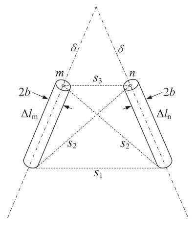  
(a)

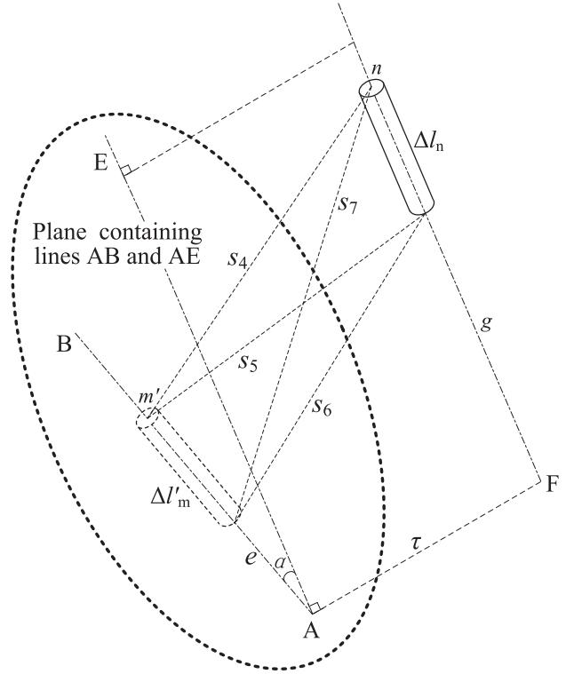  
(b)   
Fig. 8. (a) Longitudinal coplanar segment pair. (b) Longitudinal non-coplanar segment pair.

fast transient calculation, as shown in Fig. 11. Considering the actual grounding system of the multi-MW WTs, the horizontal branch of the regular polygon ring needs to be divided into a few segments owing to a small value of $l_{\mathrm{cr}}$ under the subsequent negative stroke. The length of the vertical rod is usually short (2–3 m) and needs not to be segmented. The II-circuit representations for the horizontal branch and vertical rod are shown in Fig. 11. The associated circuit parameters are evaluated by [18,19]

$$
G _ {\mathrm {e h}} = \frac {2 \pi}{\rho \Psi_ {\mathrm {e h}}} \Delta l _ {\mathrm {e h}}
$$

$$
L _ {\mathrm {e h}} = \frac {\mu_ {0}}{2 \pi} \Psi_ {\mathrm {e h}} \Delta l _ {\mathrm {e h}}
$$

$$
C _ {\mathrm {e h}} = \frac {2 \pi \varepsilon_ {0} \varepsilon_ {\mathrm {r}}}{\Psi_ {\mathrm {e h}}} \Delta l _ {\mathrm {e h}}
$$

$$
G _ {\mathrm {e p}} = \frac {2 \pi}{\rho \Psi_ {\mathrm {e p}}} l _ {\mathrm {e p}}
$$

$$
L _ {\mathrm {e p}} = \frac {\mu_ {0}}{2 \pi} \Psi_ {\mathrm {e p}} l _ {\mathrm {e p}}
$$

$$
C _ {\mathrm {e p}} = \frac {2 \pi \varepsilon_ {0} \varepsilon_ {\mathrm {r}}}{\Psi_ {\mathrm {e p}}} l _ {\mathrm {e p}} \tag {13}
$$

where $\rho$ is the soil resistivity, $\varepsilon_{\mathrm{r}}$ is the relative permittivity of the soil, $\Psi_{\mathrm{eh}}$ and $\Psi_{\mathrm{ep}}$ are

$$
\Psi_ {\mathrm {e h}} = \ln \frac {2 l _ {\mathrm {e h}}}{\sqrt {2 t _ {\mathrm {e h}}}} - 1
$$

$$
\Psi_ {\mathrm {e p}} = \ln \frac {2 l _ {\mathrm {e p}} \sqrt {3 l _ {\mathrm {e p}} + 4 t}}{r _ {\mathrm {e p}} \sqrt {l _ {\mathrm {e p}} + 4 t}} - 1 \tag {14}
$$

where $t$ is the buried depth of the regular polygon ring. According to Fig. 11, the equivalent circuit can be built for the grounding system shown in Fig. 10.

# 2.3. Entire circuit representation for WT

After obtaining the equivalent circuits of the blade, dynamic contact

part, tower body and grounding system, they are connected according to the lightning current path shown in Fig. 1. As a result, an entire circuit representation can be given for the WT, as shown in Fig. 12. To simulate lightning stroke to the blade, a lightning current $i_{\mathrm{s}}$ is injected to the node corresponding to the attachment point on the blade and the impedance $Z$ in parallel with $i_{\mathrm{s}}$ is the surge impedance of the lightning channel. The estimate values of $Z$ from limited experimental and computed data range from several hundred ohms to a few kilohms [20-22]. The typical value is usually taken as $400\Omega$ in the case of direct lightning strike to overhead power lines [22,23]. After a time discretization scheme is carried out for Fig. 12, all capacitances and series resistance-inductance branches are replaced by current sources and parallel equivalent resistances [24,25]. Accordingly, Fig. 12 can be further converted into a large scale electrical network only consisting of current sources and resistances. The nodal analysis is performed for the network to obtain the lightning transient responses on the WT. The detailed calculating procedure has been given in Ref. [26].

# 3. Experimental verification of the proposed approach

An experimental arrangement was built in the high voltage laboratory, as shown in Fig. 13. Multipoint electrical connection is made between the tinplate sheet and laboratory grounding terminals. The fast impulse current is produced by an impulse generator and injected to the blade tip of the laboratory-scale WT. A non-inductive resistor is used for the current measurement. The potential measuring wire is stretched perpendicular to the current wire to weaken the electromagnetic induction between them. Its ground point is rather distant from the laboratory-scale WT, at which the approximate electrical null is obtained for the potential measurement. The current and potential signals are recorded by a digital oscilloscope with $200\mathrm{MHz}$ band width. The measured current and potential responses are shown in Fig. 14, where the corresponding waveforms calculated by the approach proposed

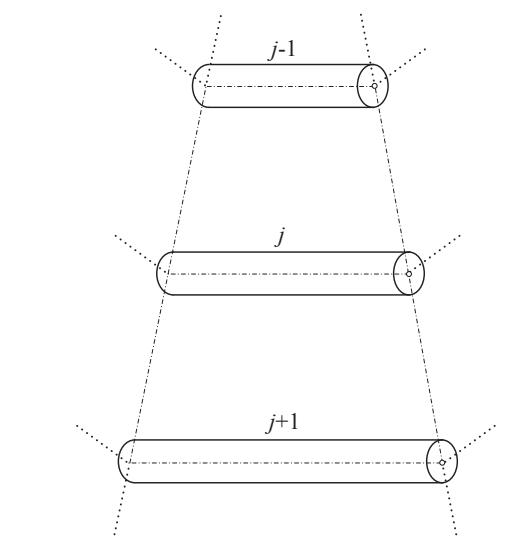

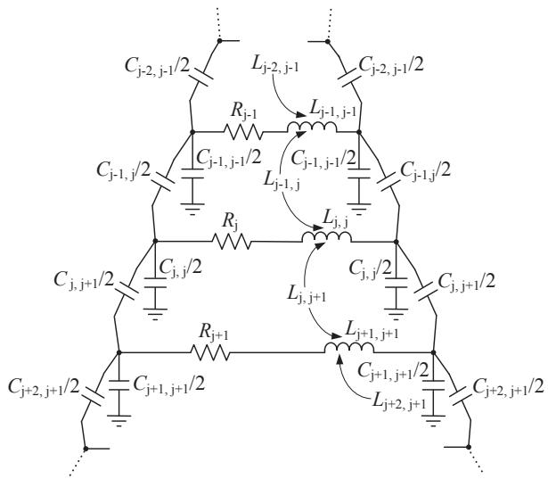  
(a)

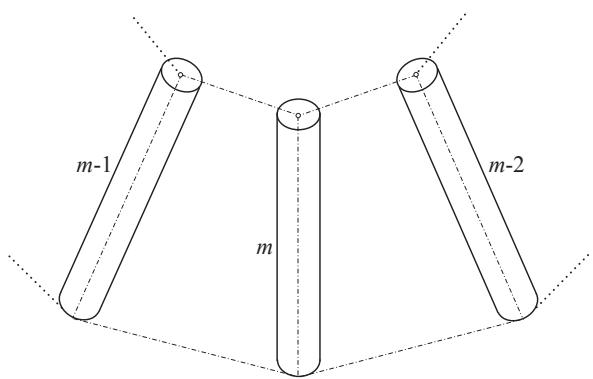

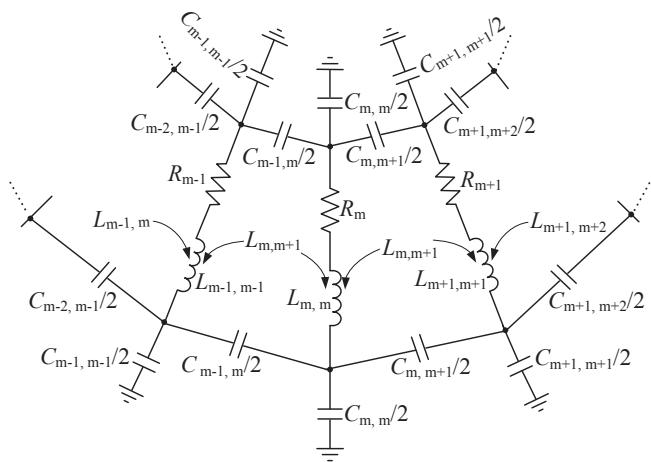  
(b)

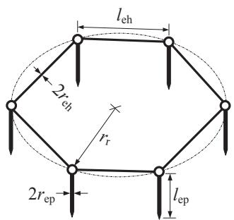  
Fig. 9. (a) Coupled circuit unit for three transverse segments. (b) Coupled circuit unit for three longitudinal segments.   
Fig. 10. Grounding system.

above are provided simultaneously. Contrast of the measured waveforms with the calculated ones demonstrates that a better agreement appears between them. In addition, the peak potentials are also calculated by the previous approaches with different tower models [3-6], as shown in Table 1. It can be seen that the peak potentials calculated by the proposed approach are closest to the measured ones in Table 1. This is due to the fact that the model of truncated pyramid multiconductor system in the proposed approach can describe the geometrical feature of the tower body more precisely than those of cascade hollow

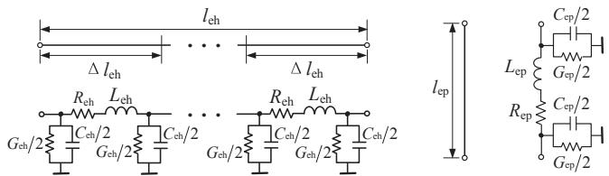  
(a)   
(b)   
Fig. 11. (a) Circuit representation for horizontal branch. (b) Circuit representation for vertical rod.

conductors and cylindrical conductor cage in the previous approaches.

# 4. Calculation example

To check the applicability of the proposed approach, a calculation example is given here. In the calculation example, an actual Chinese-built WT with $2\mathrm{MW}$ is taken into account. The dimensions of the WT are given in Table 2. The deflection angle $\theta$ of the blade is $10^{\circ}$ (see Fig. 2). The first positive stroke with the current waveform parameters of $10/350\mu s$ and $100\mathrm{kA}$ is considered in accordance with the lightning protection specifications [16,17]. The time step width $\Delta t$ and maximum

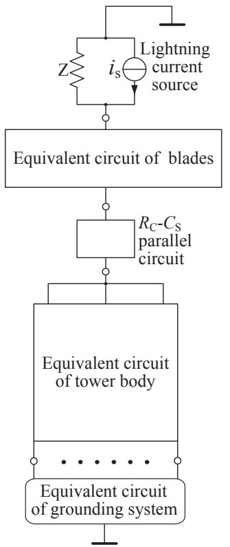  
Fig. 12. Entire circuit representation for a WT.

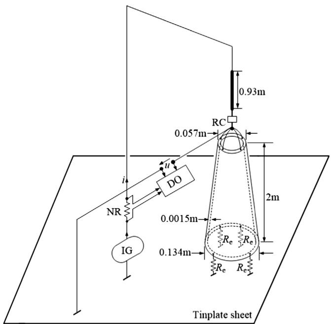  
Fig. 13. Experimental arrangement (IG-impulse generator; DO-digital oscilloscope; NR-non-inductive resistor; RC-resistance and capacitance parallel branch).

simulation time $t_{\mathrm{max}}$ are taken as $0.05\mu \mathrm{s}$ and $100\mu \mathrm{s}$ , respectively. Owing to the slower rising wavefront, the grounding system is simplified as the grounding impedances $(R_{\mathrm{e}} = 4\Omega)$ connected to the tower

bottom [17,27]. By employing the proposed approach to carry out the transient calculation, the lightning transient responses are obtained on the WT. Fig. 15 shows the calculated potential waveforms at blade tip and tower bottom. Furthermore, the peak potential distribution along the tower body is also determined by the previous approaches, as shown in Fig. 16. A contrast between the distribution curves indicates that the peak potentials obtained from the previous approaches are evidently higher than those from the proposed approach. This could be due to that the geometry of tower body is oversimplified in the previous approaches. In order to inquire further into the feasibility of the proposed approach for the subsequent negative stroke, the lightning current injected to the blade tip is taken as $0.25 / 100\mu s$ and $25\mathrm{kA}$ [16,17]. Accordingly, $0.00125\mu s$ and $40\mu s$ are assigned for $\Delta t$ and $t_{\mathrm{max}}$ , respectively. The grounding system $(r_{\mathrm{r}} = 8.62\mathrm{m}, t = 1.9\mathrm{m}$ and $l_{\mathrm{ep}} = 1.5\mathrm{m})$ is modeled as the equivalent circuit consisting of II-circuit units to comply with the requirement for the fast transient calculation. The calculated potential waveforms at blade tip and tower bottom are given in Fig. 17. Moreover, the peak potential distributions along the blade are calculated by the proposed approach and the electromagnetic transient software (EMTS) that is based on the finite-difference time-domain (FDTD) method [28], respectively. As indicated in Fig. 18, a better consistency appears between the two distribution curves. The calculated results show that the peak potentials on the blade and upper part of the tower body are higher under the subsequent negative stroke than under the first positive stroke. This is due to the fact that the entire equivalent circuit of the WT contains a large number of inductances and capacitances. In the entire equivalent circuit, the steep rising wavefront under the subsequent negative stroke can excite stronger transient oscillation than the lower rising wavefront under the first positive stroke.

As viewed from Figs. 15-18, the transient potential rise on the WT is severe since it reaches to the order of MV. Such a potential rise can cause the arc injury to the blade and form the overvoltage to damage the equipment and components inside the WT. For the sake of the safe and reliable operation of the WT, considerable attention should be paid to the protection against the potential rise.

# 5. Conclusions

Based on the lightning current path on the WT, circuit models have been set up for blade, dynamic contact part, tower body and grounding system, respectively. An improvement has been made in the tower model, in which the previous cascade hollow conductors or cylindrical conductor cage is replaced with the truncated pyramid multiconductor system. Lightning transient calculation can be performed by integrating the circuit models into an entire equivalent network of the WT. Experimental measurement has been carried out by a laboratory-scale WT. The validity of the proposed approach has been examined by the experimental measurement. The calculated results can agree well with the measured ones and exhibit a higher precision than those obtained from the previous approaches. A calculation example of an actual WT with 2 MW demonstrates that the proposed approach has the capability of providing a design basis for lightning protection of WTs. As the future work, the simplified methodology will be explored for including the frequency-dependent characteristic of electrical parameters and multilayer soil model in the transient calculation in order that the proposed approach may have a more general applicability in lightning protection design of WTs.

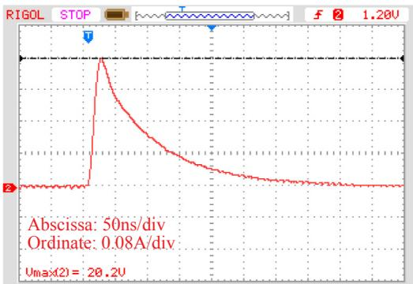  
(a)

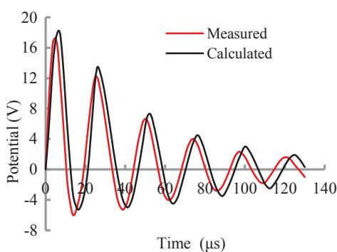  
(b)

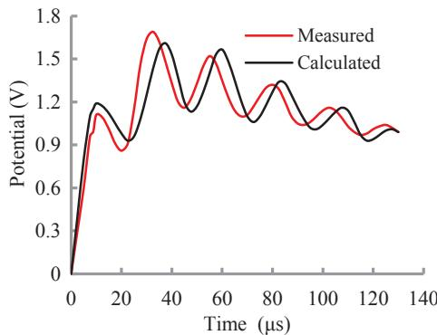  
(c)   
Fig. 14. (a) Injected current. (b) Potential at tower top. (c) Potential at tower bottom.

Table 1 Measured and calculated peak potentials.   

<table><tr><td>Modeling approach</td><td>Tower top</td><td>Tower bottom</td></tr><tr><td>Cascade hollow conductors</td><td>20.02 V</td><td>1.56 V</td></tr><tr><td>Cylindrical conductor cage</td><td>19.15 V</td><td>1.60 V</td></tr><tr><td>Proposed approach</td><td>18.20 V</td><td>1.62 V</td></tr><tr><td>Measurement</td><td>17.28 V</td><td>1.69 V</td></tr></table>

Table 2 Dimensions of the WT.   

<table><tr><td>Blade length</td><td>40 m</td><td>Radius of tower top</td><td>1.36 m</td></tr><tr><td>Radius of down conductor</td><td>0.0075 m</td><td>Radius of tower bottom</td><td>2.1 m</td></tr><tr><td>Tower height</td><td>80 m</td><td>Thickness of tower body</td><td>0.024 m</td></tr></table>

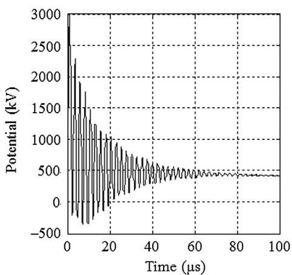  
(a)

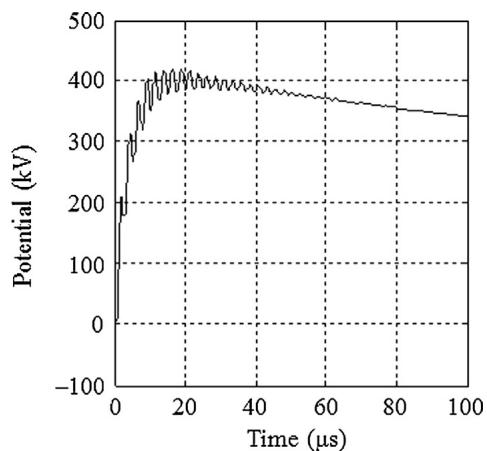  
(b)   
Fig. 15. (a) Potential at blade tip under the first positive stroke. (b) Potential at tower bottom under the first positive stroke.

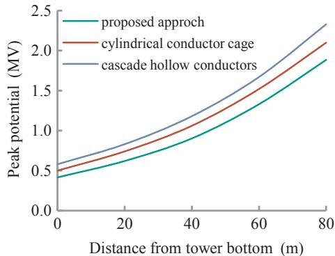  
Fig. 16. Potential distribution on tower body.

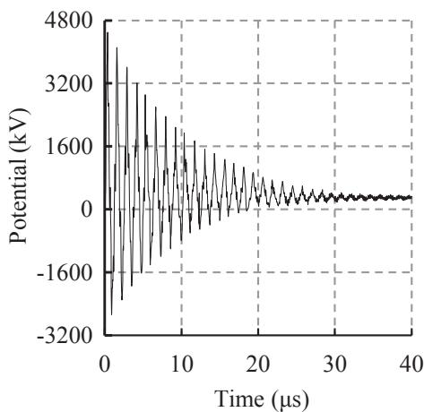  
(a)

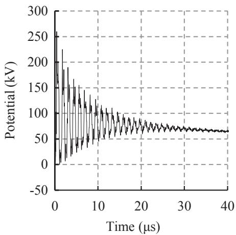  
(b)

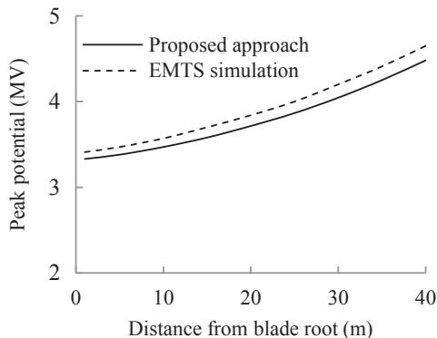  
Fig. 17. (a) Potential at blade tip under the subsequent negative stroke. (b) Potential at tower bottom under the subsequent negative stroke.   
Fig. 18. Potential distribution on blade.

# Appendix A. Supplementary material

Supplementary data associated with this article can be found, in the online version, at http://dx.doi.org/10.1016/j.ijepes.2018.04.006.

# References

[1] Romero D, Montany J, Candela A. Behavior of the wind-turbines under lightning strikes including nonlinear grounding system. In: International conference on renewable energy and power quality, Barcelona, Spain, 31 March, 1-2 April; 2004, p. 304.   
[2] Thuan Q, Pham T, Tran TV. Electromagnetic transient simulation of lightning overvoltage in a wind farm. In: 2013 electrical insulation conference, Ottawa, Canada, 2-5 June, 2013. p. 81-4.   
[3] Jiang JL, Chang HC, Kuo CC, Huang CK. Transient overvoltage phenomena on the

control system of wind turbines due to lightning strike. Renewable Energy 2013;57:181-9.   
[4] Zhang XQ. Calculation of transient potential rise on the wind turbine struck by lightning. Sci World J 2014; Article ID 213541, 8 pages.   
[5] Wang XH, Zhang XQ. Calculation of electromagnetic induction inside a wind turbine tower struck by lightning. Wind Energy 2010;13:615-25.   
[6] Zhang XQ, Zhang YZ, Liu CH. A complete model of wind turbines for lightning transient analysis. J Renewable Sustainable Energy 2014;6:013113.   
[7] Popov M, Grcev L, Hoidalen HKr, Gustavsen B, Terzija V. Investigation of the overvoltage and fast transient phenomena on transformer terminals by taking into account the grounding effects. IEEE Trans Ind Appl 2015;51:5218-527.   
[8] Megumu M, Toru M, Atsushi W, Akira A, Yukihito A, Nobuyuki H. Observation of lightning flashes to wind turbines. In: 30th international conference on lightning protection, Cagliari, Italy, 13-17 September 2010. p. 1-7.   
[9] Celli G, Pilo F. EMTP models for current distribution evaluation in LPS for high and low buildings. In: 25th international conference on lightning protection, Rhodes, Greece, 18-22 September, 2000. p. 440-5.   
[10] Kalantranov PL, Ceitlin LA. Inductance calculation. Moscow: Energy Press; 1997. p.

23-6.   
[11] Ametani A, Kasai Y, Sawada J, Mochizuki A, Yamada T. Frequency-dependent impedance of vertical conductors and a multiconductor tower model. IEE Proc-Generation, Transm Distribution 1994;141:339-45.   
[12] Iosseli UY, Kothanov AS, Stlyrski MG. Handbook of capacitance calculation. Moscow: Energy Press; 1992. p. 31-5.   
[13] Al-Asadi MM, Duffy AP, Willis AJ, Hodge K, Benson TM. A simple formula for calculating the frequency dependent resistance of a round wire. Microwave Opt Technol Lett 1998;19:84-7.   
[14] Napolitano F, Paolone M, Borghetti A, Nucci CA, Cristofolini A, Mazzetti C, et al. Models of wind turbine main shaft bearings for the development of specific lightning protection systems. IEEE Trans Electromagn Compat 2011;53:99-107.   
[15] Paul CR. Inductance-loop and partial. New Jersey: Wiley; 2010. p. 210-39.   
[16] IEC 61400-24, Wind Turbines-Part 24: Lightning Protection, IEC, Geneva, Switzerland; 2010.   
[17] Chinese National Standard, GB-50057. Design Code for Lightning Protection of Structures. Beijing, China: Planning Press; 2010. p. 80-2.   
[18] Velazquez R, Mukhedkar D. Analytical modeling of grounding electrodes transient behavior. IEEE Trans Power Apparatus Syst 1984;0:1314-22. PAS-103.   
[19] Grcev L, Popov M. On high-frequency circuit equivalents of a vertical ground rod. IEEE Trans Power Delivery 2005;20:1598-603.   
[20] CIGRE Working Group C4.407. CIGRE technical brochure on lightning parameters

for engineering applications. In: 2013 international symposium on lightning-protection (XII SIPDA), Belo Horizonte, Brazil, October 7-11, 2013. p. 373-7.   
[21] Rosich RK, Rymes MD, Eriksen FJ. Models of lightning channel impedance. In: IEEE international symposium on electromagnetic compatibility: August 18–20, 1981, Boulder, Colorado, USA. p. 400–7.   
[22] Chinese National Standard. GB/T 50064, Code for design of overvoltage protection and insulation coordination for AC electrical installations. Beijing, China: Planning Press; 2014.   
[23] Mohajeryami S, Doostan M. Including surge arresters in the lightning performance analysis of $132\mathrm{kV}$ transmission line. IEEE PES T&D conference and exhibition, Dallas, USA, 2-5 May, 2016; TD0194.   
[24] Beiza J, Hosseinian SH, Vahidi B. Multiphase transmission line modeling for voltage sag estimation. Electr Eng 2010;92:99-109.   
[25] Hollman JA, Marti JR. Step-by-step eigenvalue analysis with EMTP discrete-time solutions. IEEE Trans Power Syst 2010;25:1220-31.   
[26] Wu WH, Zhang FL. Numerical computation of transient overvoltages in electric networks Beijing, China: Science Press; 2007. p. 20-41.   
[27] Chinese National Standard, GB/T 50065. Code for design of AC electrical earthing installations. Beijing, China: Planning Press; 2011. p. 17-20.   
[28] Xiao W. Transient analysis of electromagnetic effects in wind turbines struck by lightning. Ph.D. dissertation. Beijing, China: School of Electrical Engineering, Beijing Jiaotong University; 2010.