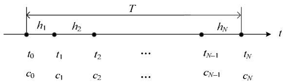
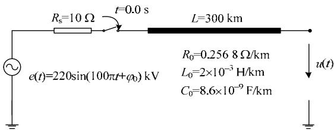
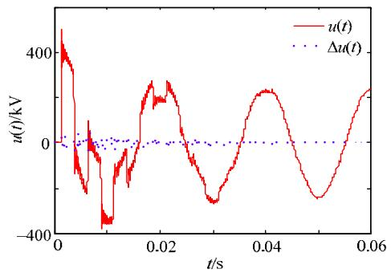
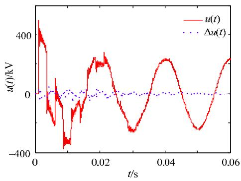
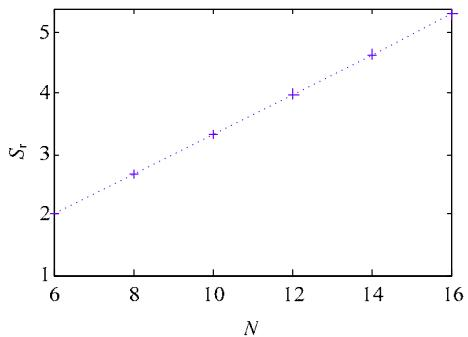
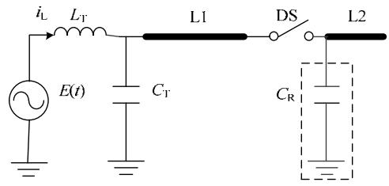
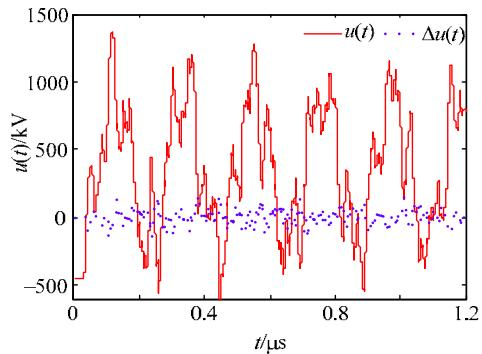
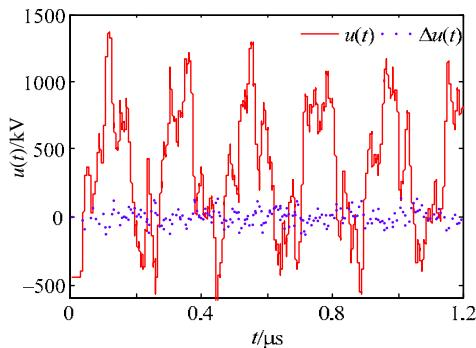
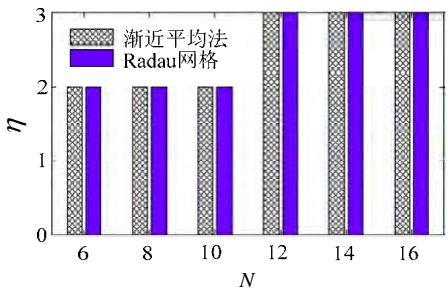
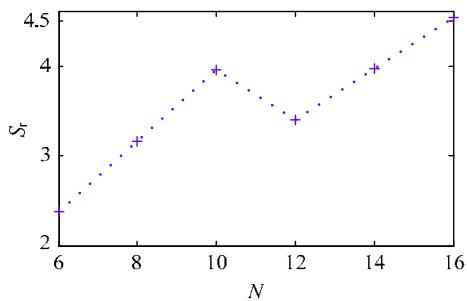

# 基于矩阵对角化的电磁暂态时间并行计算方法

汪芳宗 1 ，王永 1 ，宋墩文2 ，杨学涛 2 ，宋新立 2

（1．三峡大学 电气与新能源学院，湖北省 宜昌市 443002；

2．中国电力科学研究院，北京市 海淀区 100192）

# Parallel-in-Time Algorithm for Electromagnetic Transient Numerical Simulation Based on Matrix Diagonalization

WANG Fangzong1 , WANG Yong1 , SONG Dunwen2 , YANG Xuetao2 , SONG Xinli2

(1. College of Electrical Engineering & New Energy, China Three Gorges University, Yichang 443002, Hubei Province, China;

2. China Electric Power Research Institute, Haidian District, Beijing 100192, China)

1ABSTRACT: In order to improve efficiency of electromagnetic transient numerical calculation of power system, a new parallel-in-time algorithm is proposed using classic critical damping adjustment algorithm and matrix real eigenvalue decomposition. For linear or nonlinear differential systems, the proposed algorithm always achieves accurate time decoupling and parallel computation. Computation example results show that the proposed algorithm has good time parallelism and obtains valuable speed-up ratio, greatly improving efficiency and real-time performance in electromagnetic transient numerical simulation of power system.

KEY WORDS: electromagnetic transient; numerical calculation; critical damping adjustment; eigenvalue decomposition; matrix diagonalization; parallel-in-time algorithm

摘要：为提高电力系统电磁暂态数值计算的效率，在采用经典的临界阻尼调整算法的基础上，利用系数矩阵的实特征值分解即矩阵对角化方法，提出了一类新的电磁暂态时间并行计算方法。对线性微分系统或非线性微分系统，所提算法均可以实现精确的时间解耦并行计算。算例测试结果表明：所提出的算法具有很好的并行性，可以获得有效的加速比，因而可以显著提高电力系统电磁暂态数值仿真计算的效率及实时性。

关键词：电磁暂态；数值计算；临界阻尼调整；特征值分解；矩阵对角化；时间并行算法

DOI：10.13335/j.1000-3673.pst.2017.0275

# 0 引言

电磁暂态数值计算的基本理论与方法最初是由 Dommel 于 20 世纪 60 年代末提出的[1]。经多年

的研究与发展，目前已有多种商业化的电磁暂态数值计算程序或工具，其中，应用最为广泛的工具应该是 EMTP 程序[2]。

早期的 EMTP程序是采用隐式梯形积分方法。隐式梯形积分方法是A稳定但不是L稳定的数值方法，它没有能量耗散性，也就是不具备阻尼特性。因此，在电磁暂态数值计算过程中，当发生电感电流或电容电压突变以及开关元件动作等情况时，使用隐式梯形积分方法会产生“虚假的”数值振荡[3]。为解决数值振荡问题，林集明和 Marti 等将隐式梯形法与具有强阻尼特性的隐式欧拉法相结合，提出了临界阻尼调整法(critical damping adjustment，CDA)[4]，并将此方法应用于后期的EMTP程序中[5]。当系统有突变现象发生时，CDA 方法采用 L稳定的隐式欧拉法来求解微分动力系统；在正常情况下，CDA方法仍然采用隐式梯形积分方法。理论分析及实际应用表明：只要能有效检测或判断出突变现象及其发生的时刻，CDA方法可以有效避免数值振荡问题。

尽管现有的电磁暂态数值计算方法以及相应的计算程序均比较成熟，但需要说明的是：现有的数值计算方法以及绝大多数商业化的电磁暂态计算程序，基本上是基于传统的串行计算模式，因而不可避免地存在计算效率较低、仿真计算实时性不够的问题[6]。

与电力系统暂态稳定性数值计算相类似，电磁暂态数值计算在本质上也可归结为微分动力系统的时域响应计算，但两者在计算模型、所采用的时间尺度等方面是完全不一样的。通常情况下，电力系统暂态稳定性计算一般采用 ms 级的时间步长，而电磁暂态数值计算所采用的时间步长大致是s

级 [7-8] 。 对 特 快 速 暂 态 过 电 压 (very fast transientover-voltage，VFTO)的计算，相应的电磁暂态数值计算所采用的时间步长更小，通常是 ns 级[9]。由于必须采用很小的时间步长，因此，即使所研究的电磁暂态过程较短，但相应的电磁暂态数值计算所需的计算量仍然很大，这是导致现有的电磁暂态计算程序仿真计算实时性不够的主要原因。

为解决上述问题，一个有效的技术途径就是采用并行计算。迄今为止，研究人员已就微分初值问题提出了多种并行算法，其中，最受关注的并行算法应属 Lions 等人提出的“parareal”方法[10]和Gander 提出的“paraexp”算法[11]。Parareal 算法简单有效，可广泛应用于时间依赖性问题的并行计算[12]。文献[13]已将 parareal 方法用于电力系统动态仿真的时间并行计算。但 parareal 方法不太适合于电磁暂态的时间并行计算，主要原因是电磁暂态涉 及 高 振 荡 微 分 动 力 系 统 (highly oscillatorydynamical systems)的求解，将 parareal 方法应用于此类问题会导致计算结果不收敛的情况。另一种广受关注的 paraexp 算法则主要是针对线性系统提出的。换言之，paraexp 算法不适合于非线性微分动力系统。

本文主要研究电磁暂态数值仿真计算的时间并行计算方法，具体就是将 CDA 方法并行化，以此来提高电磁暂态数值计算的效率。

# 1 基于矩阵对角化的时间并行计算方法

# 1.1 时间并行计算方法

考虑以下常微分初值问题：

$$
\left\{ \begin{array}{l} \frac {\mathrm {d}}{\mathrm {d} t} \boldsymbol {x} (t) \equiv \dot {\boldsymbol {x}} (t) = \boldsymbol {f} (\boldsymbol {x}) + \boldsymbol {g} (t) \\ \boldsymbol {x} (t = 0) = \boldsymbol {x} _ {0} \end{array} \right. \tag {1}
$$

式中： $\pmb { x } \in \mathbf { R } ^ { m \times 1 }$ ；g( )t 是只与时间有关的一个函数，通常称为激励。对微分初值问题的求解，通常采用逐步数值积分方法，为此，考虑以下数值积分规则：

$$
\boldsymbol {x} _ {n} = \boldsymbol {x} _ {n - 1} + h _ {n} \left[ \left(1 - \alpha_ {n}\right) \dot {\boldsymbol {x}} _ {n - 1} + \alpha_ {n} \dot {\boldsymbol {x}} _ {n} \right] \tag {2}
$$

式中： ${ \pmb x } _ { n } \equiv { \pmb x } ( t _ { n } ) \ ; \quad h \ _ { n } = t _ { n } - t _ { n - }$ 1 称为该步积分的时间步长； $\alpha _ { n } \in \{ 1 / 2 ; 1 \} ^ { \mathrm { ~ \circ ~ } }$ 显然，当 $\alpha _ { n } = 1 / 2$ 时，上述数值积分规则(2)即是隐式梯形积分方法；当 $\alpha _ { n } = 1$ 时，上述数值积分规则(2)即是隐式欧拉法。

以图 1 所示的时间网格点为例，利用数值积分方法(2)对初值问题(1)进行连续的时间离散化可得：

$$
\left(\boldsymbol {A} \otimes \boldsymbol {I} _ {m}\right) \boldsymbol {X} = \left(\boldsymbol {B} \otimes \boldsymbol {I} _ {m}\right) \boldsymbol {F} (\boldsymbol {X}) + \left(\boldsymbol {B} \otimes \boldsymbol {I} _ {m}\right) \boldsymbol {G} (t) \tag {3}
$$

式中： $\boldsymbol { I } _ { \boldsymbol { m } }$ 是 m维的单位矩阵；  表示矩阵或向量的张量积，亦称直积(Kronecker 积)。

$$
\boldsymbol {A} = \left[ \begin{array}{c c c c} 1 / h _ {1} & & & \mathbf {0} \\ - 1 / h _ {2} & 1 / h _ {2} & & \\ & \ddots & \ddots & \\ \mathbf {0} & & - 1 / h _ {N} & 1 / h _ {N} \end{array} \right] \tag {4}
$$

$$
\boldsymbol {B} = \left[ \begin{array}{c c c c} \alpha_ {1} & & & \mathbf {0} \\ 1 - \alpha_ {2} & \alpha_ {2} & & \\ & \ddots & \ddots & \\ \mathbf {0} & & 1 - \alpha_ {N} & \alpha_ {N} \end{array} \right] \tag {5}
$$

$$
\boldsymbol {X} = \left[ \boldsymbol {x} ^ {\mathrm {T}} \left(t _ {1}\right) \dots \boldsymbol {x} ^ {\mathrm {T}} \left(t _ {N}\right) \right] ^ {\mathrm {T}} \equiv \left\{\boldsymbol {x} _ {i} ^ {\mathrm {T}} \right\} ^ {\mathrm {T}}, i \in (1, N) \tag {6}
$$

$$
\boldsymbol {F} (\boldsymbol {X}) = \left[ \begin{array}{l l l} \boldsymbol {f} ^ {\mathrm {T}} \left(\boldsymbol {x} _ {1}\right) & \dots & \boldsymbol {f} ^ {\mathrm {T}} \left(\boldsymbol {x} _ {N}\right) \end{array} \right] ^ {\mathrm {T}} \tag {7}
$$

$$
\boldsymbol {G} (t) = \left[ \boldsymbol {g} ^ {\mathrm {T}} \left(t _ {1}\right) + \boldsymbol {C} ^ {\mathrm {T}} \left(t _ {0}\right) \quad \boldsymbol {g} ^ {\mathrm {T}} \left(t _ {2}\right) \quad \dots \quad \boldsymbol {g} ^ {\mathrm {T}} \left(t _ {N}\right) \right] ^ {\mathrm {T}} \tag {8}
$$

$$
\boldsymbol {C} \left(t _ {0}\right) = \left[ 1 / \left(\alpha_ {1} h _ {1}\right) \right] \boldsymbol {x} _ {0} + \left(1 / \alpha_ {1} - 1\right) \left[ \boldsymbol {f} \left(\boldsymbol {x} _ {0}\right) + \boldsymbol {g} \left(t _ {0}\right) \right] \tag {9}
$$

  
图1 时间网格示意图  
Fig. 1 Schematic diagram of time grid points

令

$$
\boldsymbol {H} = \boldsymbol {B} ^ {- 1} \boldsymbol {A} \tag {10}
$$

则方程(3)可以写成：

$$
\left(\boldsymbol {H} \otimes \boldsymbol {I} _ {m}\right) \boldsymbol {X} - \boldsymbol {F} (\boldsymbol {X}) = \boldsymbol {G} (t) \tag {11}
$$

可以验证：H 是一个下三角矩阵。由于下三角矩阵的特征值就是其对角线上的元素，因此，当该下三角矩阵的对角线上的元素是互异的实数时，可以通过特征值分解方法将该矩阵对角化，而且对角化后的矩阵及其相应的特征向量矩阵均是实数矩阵。具体可用以下表达式来描述

$$
\boldsymbol {H} = \boldsymbol {P D P} ^ {- 1} \tag {12}
$$

$$
\boldsymbol {D} = \operatorname {d i a g} \left(\frac {1}{\alpha_ {k} h _ {k}}\right) \operatorname {d i a g} \left(\lambda_ {k}\right), k \in (1, N) \tag {13}
$$

$$
\boldsymbol {P} = \left[ \begin{array}{c c c c} 1 & & & \mathbf {0} \\ & 1 & & \\ & p _ {i j} & \ddots & \\ & & & 1 \end{array} \right] \tag {14}
$$

$$
p _ {i j} = \frac {\prod_ {k = j + 1} ^ {i} \left[ \left(1 - \alpha_ {k}\right) h _ {k} + \alpha_ {j} h _ {j} \right]}{\prod_ {k = j + 1} ^ {i} \left(\alpha_ {j} h _ {j} - \alpha_ {k} h _ {k}\right)}; \tag {15}
$$

$$
j \in (1, N - 1), i \in (j + 1, N)
$$

若待求的初值问题(1)是线性常微分方程，即

$$
\boldsymbol {f} (\boldsymbol {x}) = \boldsymbol {U x}, \quad \boldsymbol {U} \in \mathbf {R} ^ {m \times m} \tag {16}
$$

则方程(11)可以写成：

$$
\left(\boldsymbol {H} \otimes \boldsymbol {I} _ {m} - \boldsymbol {I} _ {N} \otimes \boldsymbol {U}\right) \boldsymbol {X} = \boldsymbol {G} (t) \tag {17}
$$

式中 $\boldsymbol { I } _ { N }$ 是 N 维的单位矩阵。令

$$
\boldsymbol {Y} = \left(\boldsymbol {P} ^ {- 1} \otimes \boldsymbol {I} _ {m}\right) \boldsymbol {X} \equiv \left[ \begin{array}{l l l} \boldsymbol {y} _ {1} ^ {\mathrm {T}} & \dots & \boldsymbol {y} _ {N} ^ {\mathrm {T}} \end{array} \right] ^ {\mathrm {T}} \tag {18}
$$

$$
\tilde {\boldsymbol {G}} (t) = \left(\boldsymbol {P} ^ {- 1} \otimes \boldsymbol {I} _ {m}\right) \boldsymbol {G} (t) \equiv \left[ \begin{array}{l l l} \tilde {\boldsymbol {g}} _ {1} ^ {\mathrm {T}} (t) & \dots & \tilde {\boldsymbol {g}} _ {N} ^ {\mathrm {T}} (t) \end{array} \right] ^ {\mathrm {T}} \tag {19}
$$

则利用矩阵特征值分解(12)，可将方程(17)转换成为

$$
\left(\boldsymbol {D} \otimes \boldsymbol {I} _ {m} - \boldsymbol {I} _ {N} \otimes \boldsymbol {U}\right) \boldsymbol {Y} = \tilde {\boldsymbol {G}} (t) \tag {20}
$$

显然，方程(20)可以并行求解，即

$$
\left(\lambda_ {k} \boldsymbol {I} _ {m} - \boldsymbol {U}\right) \boldsymbol {y} _ {k} = \tilde {\boldsymbol {g}} _ {k} (t), k \in (1, N) \tag {21}
$$

并行计算出 $\mathbf { { y } } _ { k } , k \in ( 1 , \textit { N } )$ 后，利用式(18)的反变换，即可解出 X 。

显然，对线性常微分初值问题，上述算法是一个严格的时间解耦并行计算方法。

下面考虑非线性微分初值问题。重新考虑方程(11)。定义

$$
\boldsymbol {J} (\boldsymbol {x}) = \frac {\partial f (\boldsymbol {x})}{\partial \boldsymbol {x}} \tag {22}
$$

$$
\overline {{\boldsymbol {x}}} = \frac {1}{N} \sum_ {k = 1} ^ {N} \boldsymbol {x} _ {k} \tag {23}
$$

以 x 为初值(即 Taylor 展开的基准值)，利用牛顿法求解方程(11)可得

$$
[ \boldsymbol {H} \otimes \boldsymbol {I} _ {m} - \boldsymbol {I} _ {N} \otimes \boldsymbol {J} (\bar {\boldsymbol {x}} ^ {\eta}) ] \Delta \boldsymbol {X} ^ {\eta} = \boldsymbol {R} (\boldsymbol {X} ^ {\eta}) \tag {24}
$$

式中上标 表示牛顿迭代次数。

$$
\left\{ \begin{array}{l} \Delta \boldsymbol {X} = \left[ \begin{array}{l l l} \Delta \boldsymbol {x} _ {1} ^ {\mathrm {T}} & \dots & \Delta \boldsymbol {x} _ {N} ^ {\mathrm {T}} \end{array} \right] ^ {\mathrm {T}} \\ \Delta \boldsymbol {x} _ {k} ^ {\eta} = \boldsymbol {x} _ {k} ^ {\eta + 1} - \overline {{\boldsymbol {x}}} ^ {\eta}, k \in (1, N) \end{array} \right. \tag {25}
$$

$$
\boldsymbol {R} (\boldsymbol {X}) = \boldsymbol {G} (t) + \boldsymbol {F} (\boldsymbol {X}) - (\boldsymbol {H} \otimes \boldsymbol {I} _ {m}) \boldsymbol {X} \tag {26}
$$

$$
\Delta \boldsymbol {Y} = \left(\boldsymbol {P} ^ {- 1} \otimes \boldsymbol {I} _ {m}\right) \Delta \boldsymbol {X} \equiv \left[ \begin{array}{l l l} \Delta \mathbf {y} _ {1} ^ {\mathrm {T}} & \dots & \Delta \mathbf {y} _ {N} ^ {\mathrm {T}} \end{array} \right] ^ {\mathrm {T}} \tag {27}
$$

$$
\tilde {\boldsymbol {R}} (\boldsymbol {X}) = \left(\boldsymbol {P} ^ {- 1} \otimes \boldsymbol {I} _ {m}\right) \boldsymbol {R} (\boldsymbol {X}) \equiv \left[ \tilde {\boldsymbol {r}} _ {1} ^ {\mathrm {T}} (\boldsymbol {X}) \dots \tilde {\boldsymbol {r}} _ {N} ^ {\mathrm {T}} (\boldsymbol {X}) \right] ^ {\mathrm {T}} \tag {28}
$$

则利用矩阵特征值分解(12)，可以将方程(24)转换成为：

$$
\tilde {\boldsymbol {J}} \left(\overline {{\boldsymbol {x}}} ^ {\eta}\right) \Delta \boldsymbol {Y} ^ {\eta} = \tilde {\boldsymbol {R}} \left(\boldsymbol {X} ^ {\eta}\right) \tag {29}
$$

式中

$$
\tilde {\boldsymbol {J}} \left(\bar {x} ^ {\eta}\right) = \boldsymbol {D} \otimes \boldsymbol {I} _ {m} - \left(\boldsymbol {P} ^ {- 1} \otimes \boldsymbol {I} _ {m}\right) \left(\boldsymbol {I} _ {N} \otimes \boldsymbol {J} \left(\bar {x} ^ {\eta}\right)\right) \left(\boldsymbol {P} \otimes \boldsymbol {I} _ {m}\right) \tag {30}
$$

由于 $\pmb { I } _ { N } \otimes \pmb { J } ( \overline { { \pmb { x } } } ^ { \eta } )$ 是包含N个 $\pmb { J } ( \overline { { \pmb { x } } } ^ { \eta } )$ 的(分块)对角矩阵，由此，有

$$
\left(\boldsymbol {P} ^ {- 1} \otimes \boldsymbol {I} _ {m}\right) \left(\boldsymbol {I} _ {N} \otimes \boldsymbol {J} (\overline {{\boldsymbol {x}}} ^ {\eta})\right) \left(\boldsymbol {P} \otimes \boldsymbol {I} _ {m}\right) = \boldsymbol {I} _ {N} \otimes \boldsymbol {J} \left(\overline {{\boldsymbol {x}}} ^ {\eta}\right) \tag {31}
$$

因此，方程(29)最终可以写成：

$$
[ \boldsymbol {D} \otimes \boldsymbol {I} _ {m} - \boldsymbol {I} _ {N} \otimes \boldsymbol {J} (\overline {{\boldsymbol {x}}} ^ {\eta}) ] \Delta \boldsymbol {Y} ^ {\eta} = \tilde {\boldsymbol {R}} (\boldsymbol {X} ^ {\eta}) \tag {32}
$$

显然，方程(32)可以并行求解，即

$$
\left[ \lambda_ {k} \boldsymbol {I} _ {m} - \boldsymbol {J} \left(\bar {\boldsymbol {x}} ^ {\eta}\right) \right] \Delta \boldsymbol {y} _ {k} ^ {\eta} = \tilde {\boldsymbol {r}} _ {k} \left(\boldsymbol {X} ^ {\eta}\right), k \in (1, N) \tag {33}
$$

并行计算出 $\Delta \mathbf { y } _ { k } ^ { \eta } , k \in ( 1 , \ N )$ 即 $\Delta { \mathbf { Y } ^ { \eta } }$ 后，利用下述方程即可计算出 $X ^ { \eta + 1 }$ ，即

$$
\Delta \boldsymbol {X} ^ {\eta} = (\boldsymbol {P} \otimes \boldsymbol {I} _ {m}) \Delta \boldsymbol {Y} ^ {\eta} \tag {34}
$$

$$
\boldsymbol {X} ^ {\eta + 1} = \Delta \boldsymbol {X} ^ {\eta} + \boldsymbol {e} _ {N} \otimes \bar {\boldsymbol {x}} ^ {\eta} \tag {35}
$$

式中 $\pmb { e } _ { N }$ 为N维的单位列向量。

概括起来，对非线性常微分初值问题，上述算法是一个严格的时间解耦牛顿并行计算方法，其中的关键是采用了式(23)所定义的平均向量 x 作为初值，这与经典的牛顿法略有不同，否则，就不能实现精确的解耦。

基于上述推导，对非线性常微分初值问题，可将上述并行牛顿算法概述如下。

1）如图 1 所示，选定N个时间网格点并确定$h _ { k } , k \in ( 1 , \ N )$ 。  
2）依据求解的问题，在不同的时间网格点上选 择 适 当 的 数 值 积 分 方 法 ， 并 据 此 确 定$\alpha _ { k } , \ k \in ( 1 , \ N )$ 。  
3）置迭代次数 $\eta = 0$ ；在不同的时间网格点上给状态变量赋初值 $\pmb { x } _ { k } ^ { \eta } , k \in ( 1 , \ N )$ ；依据式(26)计算 $\overline { { { \mathbf { x } } } } ^ { \eta }$ 。

4）牛顿迭代：

①依据方程(7)并行计算 $F ( \mathbf { } X ^ { \eta } )$ ；依据方程(8)并行计算 $G ( t )$ 。  
②依据方程(28)，计算 $\tilde { r } _ { k } ( X ^ { \eta } ) , k \in ( 1 , \ N ) \ \circ$   
③依据式(22)计算 $\pmb { J } ( \overline { { \pmb { x } } } ^ { \eta } )$ 。  
④并行求解方程(33)，计算出 $\Delta \mathbf { y } _ { k } ^ { \eta } , k \in ( 1 , N )$ 即$\Delta { \pmb Y } ^ { \eta }$   
⑤依据方程(34)计算 $\Delta { \pmb X } ^ { \eta }$ ；依据方程(35)计算 $X ^ { \eta + 1 }$

5）置 $\eta = \eta + 1$ 。

6）收敛性判断：若收敛，则开始下一个时间网格的计算；若不收敛，则依据式(23)重新计算 $\overline { { { \mathbf { x } } } } ^ { \eta }$ ，并转至 4）开始新一轮的牛顿迭代。

# 1.2 步长选择方法

上述并行计算方法的核心思想是基于系数矩阵(H )的特征值分解即对角化。需要说明的是：对隐式欧拉法或隐式梯形积分方法，若采用定步长积分，则相应的系数矩阵均不能对角化；若采用多级高阶数值积分方法(例如，多级隐式 RK方法、微分求积法等)，则相应的系数矩阵均具有复数特征值。事实上，很早就有研究人员提出了基于矩阵特征值分解的并行计算思路[14]，但正是上述原因使得相关研究工作进展不大[15]。

本文所提出的、基于系数矩阵对角化的时间并行算法，其适用性前提条件是必须采用完全的变步长，也就是在一个时间网格内，所有的步长必须是互异的。这个条件也可以从方程(15)得出。理论上，上述适用性前提条件在实际应用中不存在任何问题，因为可以很方便地选出 N个互异的时间步长

$h _ { i } , ~ i \in ( 1 , ~ N )$ 。为系统、完整起见，下面给出 2 个选择时间步长的方法。

如图 1 所示，对一个包含 N 个时间网格点、时间窗口长度为T 的网格，可以按以下方法来选择时间步长：

$$
h _ {k} = \frac {\left(1 + \varepsilon\right) ^ {k}}{\sum_ {j = 1} ^ {N} \left(1 + \varepsilon\right) ^ {j}} T, k \in (1, N) \tag {36}
$$

很 易 理 解 ： 在 式 (36) 中 ， 当 $\varepsilon \to 0$ 时 有$h _ { k } \to T / N , k \in ( 1 , N )$ 。因此，在式(36)中， $\varepsilon \neq 0$ ，但可取一个很小、接近于 0 的实数，例如 $\varepsilon = \pm 0 . 0 1$ 。上述步长选择方法满足以下方程：

$$
\sum_ {k = 1} ^ {N} h _ {k} = T \tag {37}
$$

为方便起见，将这种步长选择方法简称为“渐近平均法”。

另外一个时间步长选择方法就是采用 Radau 网格，也就是由 Radau 多项式

$$
\frac {\mathrm {d} ^ {N - 1}}{\mathrm {d} x ^ {N - 1}} \left(x ^ {N} (x - 1) ^ {N - 1}\right) \tag {38}
$$

的 N 个零点 $\mathit { \check { \Psi } } ( c _ { k } , \ k \in ( 0 , \ N - 1 )$ )组成的网格。显然，$c _ { 0 } = 0 ~ ^ { \circ }$ 令 $c _ { N } = 1$ ，则步长可按以下方法选取：

$$
h _ {k} = \left(c _ {k} - c _ {k - 1}\right) T, k \in (1, N) \tag {39}
$$

按式(39)选择的步长是互异的，而且同样满足方程(37)。

# 2 电磁暂态并行计算

以上所述的时间并行计算方法，主要是基于隐式欧拉法以及隐式梯形积分法所导出的。很易理解，在任意一个时间步长上，既可以选择采用隐式欧拉法( 1)，也可以选择采用隐式梯形积分方法$( \alpha { = } 1 / 2 )$ 。此一特征使该算法非常适合于电磁暂态的并行计算：若系统在某一时刻发生了突变现象，则在相应的时段采用隐式欧拉法，而在后续的、没有突变现象的时段全部采用隐式梯形积分方法。这与 EMTP 中所采用的 CDA 方法是完全吻合的。为此，本文将所提出的时间并行算法应用于电力系统电磁暂态数值计算，具体选取以下2个经典的算例，以此测试、验证所提算法的有效性。

# 2.1 高压输电线路空载合闸过电压计算

首先选取如图 2 所示的算例系统。该算例系统是求解一个三相对称的高压长输电线路空载合闸的电磁暂态过程。线路额定电压等级为 220kV；线路长度以及单位长度的电阻、电感、对地电容如图 2 所示。

  
图2 高压长线路空载合闸示意图  
Fig. 2 High-voltage transmission line no-load closing diagram

该高压长输电线路的电磁暂态过程可用著名的电报方程来描述，即

$$
\left\{ \begin{array}{l} \frac {\partial u (z , t)}{\partial z} + L _ {0} \frac {\partial i (z , t)}{\partial t} + R _ {0} i (z, t) = 0 \\ \frac {\partial i (z , t)}{\partial z} + C _ {0} \frac {\partial u (z , t)}{\partial t} + G _ {0} u (z, t) = I _ {s} (z, t) \end{array} \right. \tag {40}
$$

式中： z 表示输电线路沿线路的空间分布点，$z \in ( 0 , \ L )$ ；u z t ( , ) 即是输电线路在沿线路 z 处的电压；i z t ( , ) 即是输电线路在沿线路 z 处的电流；$I _ { s } ( z , t )$ 为输入电流激励，其表达式可写成

$$
\left\{ \begin{array}{l} I _ {s} (0, t) = [ e (t) - u (0, t) ] / R _ {s} \equiv i _ {s} (t) \\ I _ {s} (z, t) = 0; z > 0 \end{array} \right. \tag {41}
$$

为求解上述电报方程，首先需要对状态变量进行空间离散，为此，将输电线路均分为 M  50段，并采用文献[16]所述的空间离散方法，将偏微分方程(40)转化为以下形式的常微分方程

$$
\dot {\boldsymbol {x}} (t) = \boldsymbol {U} \boldsymbol {x} + \boldsymbol {g} (t) \tag {42}
$$

式中：U 是一个 $2 M + 1 = 1 0 1$ 维的常系数、稀疏矩阵； ${ \pmb g } ( t )$ 是与 ${ i _ { s } } ( t )$ 相关的一个时变列向量。

$$
\left\{ \begin{array}{l} \boldsymbol {x} (t) = \left[ \begin{array}{c c c c c} u _ {0} & \dots & u _ {M} & i _ {1} & \dots & i _ {M} \end{array} \right] ^ {\mathrm {T}} \\ u _ {k} \equiv u \left(z _ {k}, t\right), \quad i _ {k} \equiv i \left(z _ {k}, t\right) \end{array} \right. \tag {43}
$$

$$
z _ {k} = k (L / M), \quad k \in (0, M) \tag {44}
$$

利用本文所提出的算法对方程(42)进行时间并行求解。由于开关是在 $t = 0 \ : \mathrm { s }$ 时刻合闸，此时输电线路始端电流发生突变，因此，在第一个时间步长采用隐式欧拉法，在后续的积分过程中均采用隐式梯形积分方法。

图 3—4 分别是采用“渐近平均法”以及 Radau网格的情况下利用本文所提算法计算出的输电线路末端电压，其中， $\phi _ { 0 } = \pi / 2$ ，N=15， $T = N { \times } 1 0 \mu \mathrm { s } \ ^ { \circ }$ 图 3 和图4中所附的差值曲线(u t( ))，是与采用定步长 $\cdot ( \overline { { h } } = 1 0 \mu \mathrm { s } ) \mathrm { C D A }$ 方法进行比较的结果；由于两者的步长不一致，因此，该差值曲线是将 2 种方法在时间同步点(即T 的整数倍处)的计算结果进行比较所得出的。

从图 3 和图4 可以看出：采用 2 种不同网格的并行计算结果与经典的定步长 CDA 方法所得结果均差别不大。线路始端的突变现象传递到线路末端

  
图3 基于“渐近平均法”的并行计算结果

  
Fig. 3 Parallel computing results using asymptotic average steps   
图4 基于Radau 网格的并行计算结果  
Fig. 4 Parallel computing results using Radau grids

时，由于 CDA 方法无法检测到这一突变[17]，因此，上述计算结果产生了一定的数值振荡。

并行算法的并行实现是采用多核并行计算技术同时结合 OpenMP[18]编程工具来完成的，具体是采用购置的CPU-GPU并行计算机中所安装的IntelE5-2600v3 处理器来实现的。该 CPU 处理器多达 18核，可以满足本文对时间并行算法测试的需求。图5是在采用不同的时间并行度(N)的情况下对本文所提并行算法的加速比(用Sr表示)进行测试的结果。

# 2.2 VFTO 计算

气体绝缘开关设备(gas insulated switchgear，GIS)中隔离开关投切空载短母线时，开关触头间隙会发生多次重复击穿，从而产生特快速暂态过电压(VFTO)[9]。VFTO具有频率、幅值、陡度高等特点，严重时有可能引发GIS内部设备和相连设备的过电

  
图5 并行加速比测试结果  
Fig. 5 Speedup ratio of the proposed algorithm

压事故。有关 VFTO 的建模、数值计算、测量等是特高压电力系统电磁暂态分析的重要研究内容[19-20]。

图 6 是一个简化的 550kVGIS 中 VFTO 的计算模型，其中， $L _ { \mathrm { T } } = 2 0 \ : \mathrm { m H }$ 和 $C _ { \mathrm { T } } = 3 0 0 0 \mathrm { p F }$ 用于模拟变压器的等值电感和对地电容；DS 表示隔离开关； $C _ { \mathrm { R } } = 2 4 0 \mathrm { p F }$ 用于模拟隔离开关的对地电容；L1和L 2表示连接短母线等，通常是用无损、短传输线来模拟，其长度分别设定为 10m 和 3.5m，单位长度的电感以及对地电容分别为 $L _ { 0 } = 2 . 5 { \times } 1 0 ^ { - 7 } \mathrm { H } / \mathrm { m }$ ，$C _ { 0 } = 4 . 4 5 \times 1 0 ^ { - 1 1 } \mathrm { F / m } \cdot$ 。隔离开关合闸过程的电弧模型用以下非线性时变电阻来模拟：

$$
R (t) = R _ {1} \mathrm {e} ^ {- t / \tau_ {1}} + R _ {2} \mathrm {e} ^ {t / \tau_ {2}} \tag {45}
$$

式中： $R _ { 1 } = 1 0 ^ { 1 2 } \Omega$ ， $R _ { 2 } = 0 . 5 \Omega$ ； $\tau _ { 1 } = 1 \ \mathrm { n s }$ ， $\tau _ { 2 } = 1 \ \mu \mathrm { s } ^ { \mathrm { ~ \scriptsize ~ \circ ~ } }$

  
图 6 VFTO 计算模型示意图  
Fig. 6 A simplified diagram for VFTO computation

将无损线路L1均分为 20 段、将L2均分为 7段，则可以将上述 VFTO的计算用以下常微分方程来描述

$$
\dot {\boldsymbol {x}} (t) = \boldsymbol {U} (t) \boldsymbol {x} + \boldsymbol {g} (t) \tag {46}
$$

式中： $\pmb { U } ( t ) \in \mathbf { R } ^ { 5 9 \times 5 9 }$ 是与R( )t 相关的一个时变矩阵；g( )t 是与E( )t 相关的一个时变列向量。

隔离开关投切空载短母线时，短母线上的残余电荷电压对产生的 VFTO具有重要影响。当电源侧与残余电荷电压差达到 2.0pu(电源侧取 1.0pu、负荷侧残余电荷电压取－1.0pu)时将产生最严重的VFTO，因此，在仿真计算时，通常都依此条件来估算 VFTO的水平。

由于方程(46)中的系数矩阵U( )t 是时变的，因此，不能采用线性微分系统的时间解耦并行计算方法。为此，可将方程(46)转化为一个非线性常微分方程。令

$$
\left\{ \begin{array}{l} \tilde {x} _ {1} (t) = R _ {1} \mathrm {e} ^ {- t / \tau_ {1}} \\ \tilde {x} _ {2} (t) = R _ {2} \mathrm {e} ^ {t / \tau_ {2}} \end{array} \right. \tag {47}
$$

则有：

$$
R (t) = \tilde {x} _ {1} (t) + \tilde {x} _ {2} (t) \tag {48}
$$

$$
\left\{ \begin{array}{l} \dot {\tilde {x}} _ {1} (t) = - \frac {1}{\tau_ {1}} \tilde {x} _ {1} (t) \\ \dot {\tilde {x}} _ {2} (t) = \frac {1}{\tau_ {2}} \tilde {x} _ {2} (t) \end{array} \right. \tag {49}
$$

利用上述表达式并通过状态变量增维，最终可以将方程(46)转化为形如方程(1)的非线性常微分初值问题。由此，可以利用本文所提出的时间解耦并行牛顿计算方法对其进行并行求解，在本算例中，设置牛顿迭代的收敛精度为 $\varepsilon = \parallel \Delta Y \parallel _ { \infty } \leq 1 0 ^ { - 4 }$ 。

图 7—8 分别是采用“渐近平均法”以及 Radau网格的情况下所计算出的线路L2末端电压，其中，N=15，T=N×0.1ns；图中所附的差值曲线 $( \Delta u ( t ) )$ ，是与采用定步长 $\overline { { h } } = 0 . 1 \mathrm { n s } )$ 的 EMTP 方法进行比较的结果。图 9是对算法的收敛性进行测试的结果。

  
图7 基于“渐近平均法”的VFTO 并行计算结果

  
Fig. 7 Parallel computing results of VFTO using asymptotic average steps   
图8 基于Radau 网格的VFTO 并行计算结果

  
Fig. 8 Parallel computing results of VFTO using Radau grids   
图9 算法收敛性进行测试结果  
Fig. 9 Convergence test results of parallel algorithm

图 10 是在采用不同的并行度(N)的情况下，并行计算相对于经典的 EMTP 串行计算方法所获得的加速比(用 $S _ { \mathrm { r } }$ 表示)。

从图 10 可以看出：对非线性微分系统，加速比并不是完全与时间并行度成正比。这是因为：如

  
图 10 并行加速比测试结果(VFTO 计算)  
Fig. 10 Speedup ratio for VFTO computation

图 9 所示，时间并行度对算法的收敛性有重要的影响；当并行度较高时，算法所需的迭代次数也将随之增加。

# 3 结论

利用矩阵的实特征值分解即矩阵对角化方法，本文导出了一类新的时间并行计算方法，从而将EMTP 中的 CDA 方法完全并行化。对线性常微分初值问题，本文所提方法是一个严格的时间解耦并行计算方法；对非线性常微分初值问题，本文所提方法是一个严格的时间解耦牛顿并行计算方法。

算例测试结果表明：本文所提出的算法具有很好的并行性，可以获得有效的加速比，因而可以显著提高电力系统电磁暂态仿真计算的效率及实时性。

从理论上讲，本文所提算法也完全可以用于电力系统暂态稳定性的时间并行计算。

# 参考文献

[1] Dommel H W．Digital computer solution of electromagnetic transients in single and multiphase networks[J]．IEEE Transactions on Power Apparatus and Systems，1969，88(4)：388-399．   
[2] Mahseredjian J，Dinavahi V，Martinez J A．Simulation tools forelectromagnetic transients in power systems：overview and challenges[J]．IEEE Transactions on Power Delivery，2009，24(3)：1657-1669  
[3] Alvarado F L，Lasseter R H，Sanchez J J．Testing of trapezoidal integration with damping for the Solution of power transient problems [J]．IEEE Transactions on Power Apparatus and Systems，1983， 102(12)：3783-3790   
[4] Marti J R，Lin J．Suppression of numerical oscillations in the EMTP[J]．IEEE Transactions on Power Systems，1989，4(2)：739-747   
[5] Lin J，Marti J R．Implementation of the CDA procedure in the EMTP[J]．IEEE Transactions on Power Systems，1990，5(2)：394-402   
[6] 王成山，李鹏，王立伟．电力系统电磁暂态仿真算法研究进展[J]电力系统自动化，2009，33(7)：97-103Wang Chengshan，Li Peng，Wang Liwei．Progresses on algorithm ofelectromagnectic transient simulation for electric power system[J]Automation of Electric Power Systems，2009，33(7)：97-103(inChinese)  
[7] Sultan M，Reeve J，Adapa R．Combined transient and dynamicanalysis of HVDC and FACTS systems[J]．IEEE Transactions onPower Delivery，1998，13(4)：1271-1277．  
[8] Jalili-Marandi V，Dinavahi V．Interfacing techniques for transient

stability and electromagnetic transient programs[J] ． IEEETransactions on Power Delivery，2009，24(4)：2385-2395  
[9] 段韶峰，赵琳，李志兵，等．GIS 中VFTO、VFTC统计特性试验和仿真方法研究[J]．电网技术，2015，39(12)：3634-3640DuanShaofeng，Zhao Lin，Li Zhibing，et al．Experimental andsimulation study on statistical characteristics of VFTO and VFTC inGIS[J]．Power System Technology，2015，39(12)：3634-3640(inChinese)  
[10] Lions J L，Maday Y，Turinici G．Résolution d’EDP par un schéma en temps pararéel[J]．Comptes Rendus de l'Academie des Sciences，2001， 332(7)：661-668   
[11] Gander M J，Güttel S．PARAEXP：a parallel integrator for linearinitial-value problems[J]．Siam Journal on Scientific Computing，2013，35(2)：123-142  
[12] Gander M J，Vandewalle S．Analysis of the parareal time-paralleltime-integration method[J]．Siam Journal on Scientific Computing，2007，29(2)：556-578  
[13] Gurrala G，Dimitrovski A，Pannala S，et al．Parareal in time for fast power system dynamic simulations[J]．IEEE Transactions on Power Systems，2016，31(3)：1820-1830   
[14] Butcher J C ． On the implementation of implicit Runge-Kuttamethods[J]．BIT Numerical Mathematics，1976，6(2)：237-240  
[15] Hairer E，Wanner G．Symplectic Runge-Kutta methods with realeigenvalues[J]．BIT Numerical Mathematics，1994，34(3)：310-312  
[16] Cangellaris A C，Pasha S，Prince J L，et al．A new discrete transmission line model for passive model order reduction and macromodeling of high-speed interconnections[J]．IEEE Transactions on Advanced Packaging，1999，22(3)：356-364   
[17] Noda T，Takenaka K，Inoue T．Numerical integration by the 2-stage diagonally implicit Runge-Kutta method for electromagnetic transient simulations[J]．IEEE Transactions on Power Delivery，2009，24(1)： 390-399．   
[18] 罗秋明，明仲，刘刚，等．OpenMP 编译原理及实现技术[M]．北

京：清华大学出版社，2012  
[19] Povh D，Schmitt H，Volcker O，et al．Modeling and analysis guidelines for very fast transients[J]．IEEE Transactions on Power Delivery，1996，11(4)：2028-2035   
[20] 陈维江，颜湘莲，王绍武．气体绝缘开关设备中特快速瞬态过电压研究的新进展[J]．中国电机工程学报，2011，31(31)：1-11  
Chen Weijiang，Yan Xianglian，Wang Shaowu．Recent progress in investigations on very fast transient overvoltage in gas insulated switchgear[J]．Proceedings of the CSEE，2011，31(31)：1-11(in Chinese)．

  
汪芳宗

收稿日期：2017-02-19。

作者简介：

汪芳宗(1966)，男，博士，教授，研究方向为电力系统分析计算与控制，E-mail：fzwang@ctgu.edu.cn；

王永(1990)，男，硕士研究生，研究方向为电力系统电磁暂态及机电暂态的仿真计算，E-mail：yongwang2015wy@163.com；

宋墩文(1971)，男，硕士，高级工程师，研究方向为电力系统安全性分析与控制、电力系统仿真软件开发，E-mail：songdw@epri.sgcc.com.cn；

杨学涛(1985)，男，硕士，工程师，研究方向为电力系统稳定分析与控制，E-mail：xuetaoyoung@163.com；

宋新立(1971)，男，硕士，高级工程师，研究方向为电力系统仿真计算软件开发与应用，E-mail：songxl@epri.ac.cn。

（责任编辑 王晔）