# An accelerated detailed equivalent model for modular multilevel converters✩

Ramin Parvari a, Shaahin Filizadeh a,∗, Dharshana Muthumuni

a University of Manitoba, Winnipeg, MB R3T 5V6, Canada   
b Manitoba Hydro International, Winnipeg, MB R3P 1A3, Canada

# A R T I C L E I N F O

Keywords:

Modular multilevel converters

Detailed equivalent models

Electromagnetic transient simulation

# A B S T R A C T

Detailed Equivalent Models (DEMs) of Modular Multilevel Converters (MMCs) are generally developed based on Thevenin equivalent circuits with a time-varying resistor. This approach may become computationally inefficient, specifically for the simulation of large power systems with many nodes, where the network admittance matrix needs to be frequently re-inverted every time a switching event occurs. This paper proposes a novel strategy to eliminate admittance matrix re-inversions during the converter’s normal operation and restrict it only to when the converter undergoes blocking. The proposed DEM thus yields marked reductions in the simulation time of MMC circuits, and is particularly useful in studies wherein repetitive simulations are necessary. Models are implemented for MMCs with half-bridge (HBSM) and full-bridge (FBSM) submodules in the PSCAD/EMTDC simulator, and their accuracy is thoroughly validated for normal and blocked operating conditions. It is shown that the developed models are 30% and 60% more computationally efficient, respectively, for HBSM and FBSM MMCs in comparison to existing DEMs.

# 1. Introduction

Modular multilevel converters are widely used in HVDC transmission systems. In comparison to two- or three-level converters [1], they have important advantages such as modularity, scalability, low harmonics, and reduced switching losses [2,3]. MMCs generate output voltage waveforms with low harmonics by stacking building blocks, known as sub-modules (SMs), which make it possible to closely follow the reference waveform. Half-Bridge and Full-Bridge sub-modules (HB-SMs and FBSMs) are by far the most commonly used sub-module types for they consist of a relatively small number of switches and have an inherent ability to block DC fault currents, respectively.

Computer simulation models of MMCs play critical rules in power system studies. The model needs to both accurately and efficiently represent the dynamics of the converter under normal and faulted operating conditions. However, the large number of switches in MMCs imposes a significant computational burden for EMT-type simulators if the MMC were to be modeled with connection of individual switches, known as a Detailed Switching Model (DSM). In such a case, a prohibitively large network admittance matrix must be inverted every time a switching event occurs. Thus DSMs are usually used for very specific applications or MMCs with a low number of SMs, e.g., as in [4]. To overcome this, several equivalent models have been introduced that represent the dynamic response of the MMC while alleviating its computational burden. The Averaged-Value Model (AVM) proposed

in [5,6] is a popular model, which is suitable for low-frequency analysis of MMCs in normal mode of operation. This model has been used for system-level and controller design studies, e.g., for suppression of circulating currents [7,8]. It is also useful for the analysis of the voltage ripple in capacitors and sizing them [9]. Although AVMs are generally intended to study the terminal behavior of the MMCs, several works [10–14] have introduced improved AVMs that include the blocking mode as well (see Table 1). The main drawback of AVMs is that a single equivalent capacitor is used to characterize the stack of SMs in the arm, which prevents the study of individual capacitor voltages.

Detailed Equivalent Models (DEMs), on the contrary, efficiently represent MMCs in full detail and with an accuracy equal to a DSM. The core idea in a DEM is to replace the stack of SMs with a Thevenin or Norton equivalent circuit, which reduces its hundreds of nodes to two or three, thus diminishing the size of the network admittance matrix by many orders of magnitude. The Thevenin or Norton resistor and source parameters are affected by the numerical integration method employed for discretizing the voltage and current of the SM capacitors. Using trapezoidal integration method, Refs. [15–22] have developed DEMs with Thevenin and Norton equivalent circuits. Although these models offer remarkable computational efficiency compared with a DSM, the network admittance matrix must still be modified frequently, which makes re-triangularization of the admittance matrix, albeit a

Table 1 Summary of MMC models in the literature.   

<table><tr><td rowspan="2">Ref.</td><td colspan="3">Model type</td><td rowspan="2">SM type(s)</td><td rowspan="2">Ability for blocked mode simulation</td><td rowspan="2">Focus of study</td></tr><tr><td>DSM</td><td>DEM</td><td>AVM</td></tr><tr><td>[4]</td><td>✓</td><td></td><td></td><td>HBSM</td><td>✓</td><td>Dynamic performance of MMC with 6 SM per arm</td></tr><tr><td>[5]</td><td></td><td></td><td>✓</td><td>N/A</td><td></td><td>Simplified HVDC model for analysis of MMC&#x27;s dynamic behavior</td></tr><tr><td>[6]</td><td></td><td></td><td>✓</td><td>HBSM</td><td></td><td>Dynamics of MMCs based on terminal behavioral model</td></tr><tr><td>[10]</td><td></td><td></td><td>✓</td><td>HBSM</td><td>✓</td><td>Improved AVM model for simulation of DC fault condition</td></tr><tr><td>[11]</td><td></td><td></td><td>✓</td><td>HB,FB,MB-SM</td><td>✓</td><td>AVM model for the MMC operating at both blocked and normal mode</td></tr><tr><td>[12]</td><td></td><td></td><td>✓</td><td>HB,FB,CD-SM</td><td>✓</td><td>AVM model for the MMC operating at both blocked and normal mode</td></tr><tr><td>[13]</td><td></td><td></td><td>✓</td><td>HBSM</td><td>✓</td><td>401-Level MMC-HVDC System</td></tr><tr><td>[14]</td><td>✓</td><td>✓</td><td>✓</td><td>HBSM</td><td>✓</td><td>Comparison of MMC Models</td></tr><tr><td>[15]</td><td>✓</td><td>✓</td><td></td><td>HBSM</td><td>✓</td><td>First introduction to DEM. 24 SMs for validation of DEM against DSM</td></tr><tr><td>[16]</td><td></td><td>✓</td><td></td><td>HBSM</td><td>✓</td><td>Multi-terminal DC system</td></tr><tr><td>[17]</td><td></td><td>✓</td><td></td><td>HBSM</td><td>✓</td><td>Enhanced equivalent model</td></tr><tr><td>[21]</td><td>✓</td><td>✓</td><td></td><td>Two-port</td><td>✓</td><td>Multi-port SM structures. 8 SMs per arm for validation of DEM against DSM</td></tr><tr><td>[22]</td><td></td><td>✓</td><td></td><td>HBSM</td><td>✓</td><td>Current source MMCs. The dual circuit of conventional HBSM is used</td></tr><tr><td>[18]</td><td></td><td>✓</td><td></td><td>HBSM-BESS</td><td>✓</td><td>MMCs with embedded energy storage systems</td></tr><tr><td>[19]</td><td></td><td>✓</td><td>✓</td><td>HB,FB,CD-SM</td><td>✓</td><td>Combination of DEM and AVM models for fast and accurate simulation</td></tr><tr><td>[20]</td><td></td><td>✓</td><td>✓</td><td>HBSM-BESS</td><td>✓</td><td>MMCs with embedded energy storage systems</td></tr></table>

smaller one, unavoidable at every switching instant. In a large power network, this is highly problematic as the admittance matrix of the entire network needs to be inverted frequently only because of the presence of even one MMC. This is further aggravated in networks wherein several MMCs are present, e.g., in modern renewable-intensive systems. Even if a network with long transmission lines is split into different areas to reap the benefit of braking the conductance matrix of the large network into independent sub-matrices, each sub-matrix still needs to be re-factorized frequently if the MMC model is constructed with the time-varying resistance.

To overcome this major drawback, this paper proposes an approach to achieve a constant network admittance matrix that is re-inverted only when the converter blocking mode is invoked, $\mathbf { e . g . , }$ in a DC fault. Since converter blocking is a rare event, the resulting converter model yields significant computational gains over existing DEMs, while retaining the ability to represent the converter during both normal and blocked conditions. The important contribution of this paper is the development of accelerated DEMs for MMCs with both HB and FB submodules that significantly reduce the EMT simulation time of networks with several MMCs. Furthermore, the proposed approach can be readily adopted for modeling emerging topologies of sub-modules as well.

The paper proceeds with continuous-time modeling of MMCs in Section 2, and their discretization in Section 3. An algorithm is then introduced by which the model can be implemented in an EMT solver. Model validation and results of simulation studies are presented in Section 4, followed by the conclusion in Section 5.

# 2. Modeling of the converter’s arm

As shown in Fig. 1, the arm in an MMC is a series connection of SMs carrying the arm current $i _ { \mathrm { a r m } } ( t ) .$ . The arm voltage $v _ { \mathrm { a r m } } ( t )$ is equal to the summation of the SM voltages:

$$
v _ {\mathrm {a r m}} (t) = \sum_ {k = 1} ^ {N} v _ {k} (t) \tag {1}
$$

where $v _ { k } ( t )$ is the voltage of the ??th SM. The voltage produced by each SM is dependant upon the SM’s topology, switching state, and capacitor voltage. In this paper, the most common types of SMs, i.e., HBSM and FBSM, shown in Fig. 1(b) and (c), are considered.

# 2.1. Analysis of the MMC with HBSM

In normal mode of operation SMs are inserted or bypassed according to a modulation waveform, and the upper and lower switches of each

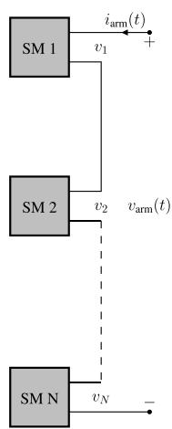  
(a)

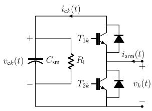

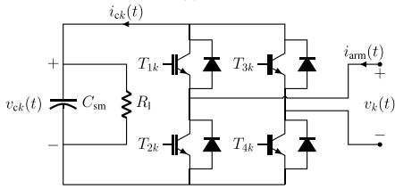  
(b)   
(c)   
Fig. 1. (a): Stack of submodules in the arm, (b): Half-Bridge Sub-Module, and (c): Full-Bridge Sub-Module.

SM are operated in a complementary manner. If the switching function for the ??th SM is defined as

$$
S _ {k} (t) = \left\{ \begin{array}{l l} 1 & T _ {1 k}: \text {o n}, T _ {2 k}: \text {o f f} \\ 0 & T _ {1 k}: \text {o f f}, T _ {2 k}: \text {o n} \end{array} \right. \tag {2}
$$

then the current of the ??th capacitor, $i _ { \mathrm { c } k } ( t ) _ { \mathrm { i } }$ , can be written as

$$
i _ {c k} (t) = S _ {k} (t) i (t) \tag {3}
$$

where ??(??) is the current of the inserted SMs, which is equal to the arm current $i _ { \mathrm { a r m } } ( t )$ in the normal mode. Note that the ??(??) and $i _ { \mathrm { a r m } } ( t )$ represent different currents in the blocked mode even though they are the same in the normal mode of operation. The total voltage created by the inserted HBSMs in the arms has a component, $v _ { \mathrm { t o t } } ^ { \mathrm { n } } ( t )$ , which is contributed by the SM capacitors and depends on the SM’s switching function, and may be expressed as follows:

$$
v _ {\text {t o t}} ^ {\mathrm {n}} (t) = \sum_ {k = 1} ^ {N} S _ {k} (t) v _ {\mathrm {c k}} (t) \tag {4}
$$

where superscript ‘n’ denotes the normal mode of operation and subscript ‘tot’ represents the total voltage created. Additionally, in the path of the arm current through each SM, there is one resistor, either from the top or the bottom switch-diode combination. Therefore, the total voltage across the arm is obtained by adding a resistive voltage drop

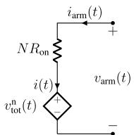  
(a)

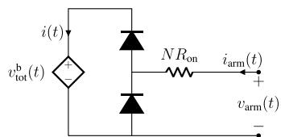

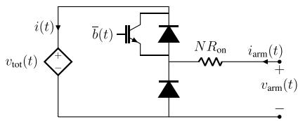  
Fig. 2. Arm stack model with HBSM, (a): normal mode and (b): blocked mode.   
Fig. 3. Arm stack model with HBSM.

to (4):

$$
v _ {\mathrm {a r m}} (t) = N R _ {\mathrm {o n}} i (t) + v _ {\mathrm {t o t}} ^ {\mathrm {n}} (t) \tag {5}
$$

where $R _ { \mathrm { o n } }$ is an equivalent on-state resistance of a switch, and is considered to be the same for IGBTs and anti-parallel diodes, as is commonly done in EMT-type models.

In the blocked mode, all IGBTs are turned off and only the freewheeling diodes conduct the current. The arm stack may be viewed as a half-bridge diode rectifier with a series connection of all SM capacitors. The total voltage across the capacitors is the summation of the individual voltages of the capacitors, shown in Fig. 2, which share the same current ??(??). Therefore,

$$
i _ {c k} (t) = i (t) \quad ; \quad \forall k \tag {6}
$$

$$
v _ {\mathrm {t o t}} ^ {\mathrm {b}} (t) = \sum_ {k = 1} ^ {N} v _ {\mathrm {c k}} (t) \tag {7}
$$

where superscript ‘b’ denotes the blocked mode. It must be noted that the equivalent diodes depicted in Fig. 2 are ideal.

The equivalent circuits in the normal and blocked modes can be amalgamated to a single circuit by adding an extra controlled switch that retains the same on-state resistance of $N R _ { \mathrm { o n } } .$ This is illustrated in Fig. 3 where the switch is controlled with the blocking signal. As long as the arm operates in normal mode, the switch is turned on and, with the anti-parallel diode, inserts the voltage source, $v _ { \mathrm { c a p } } ( t )$ , into the path of the current. In the blocked mode of operation, the controlled switch is turned off and the circuit becomes a half-bridge diode rectifier. With this configuration, the following equations which describe the v-i characteristics of the dependent voltage source, accompanied with the circuit diagram in Fig. 3, which includes two diodes, one IGBT, and a resistor fully express the behavior of the arm stack with the HBSM topology:

$$
i _ {c k} (t) = \left(b (t) + \bar {b} (t) S _ {k} (t)\right) i (t) \tag {8}
$$

$$
v _ {\mathrm {t o t}} (t) = \sum_ {k = 1} ^ {N} \left(b (t) + \bar {b} (t) S _ {k} (t)\right) v _ {\mathrm {c} k} (t) \tag {9}
$$

$$
i _ {c k} (t) = C _ {\mathrm {s m}} \frac {\mathrm {d} v _ {c k}}{\mathrm {d} t} + \frac {v _ {c k}}{R _ {1}} \tag {10}
$$

where $C _ { s \mathrm { m } }$ is the SM capacitance, $R _ { \mathrm { l } }$ is its leakage resistance and ??(??) is the blocking signal, which is equal to zero and one for normal and blocked modes, respectively. The signal ??(??) is the complement of ??(??).

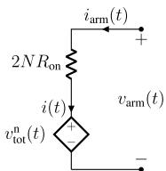  
(a)

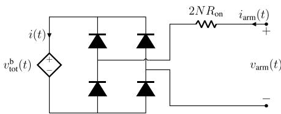  
  
Fig. 4. Arm stack model with FBSM, (a): normal mode and (b): blocked mode.

# 2.2. Analysis of the MMC with FBSM

Two switching functions are required to model the behavior of each FBSM in the normal mode of operation. These switching functions are defined as follows, where $T _ { 1 k } - T _ { 4 k }$ refer to the corresponding switches in Fig. 1(c).

$$
S _ {1 k} (t) = \left\{ \begin{array}{l l} 1 & T _ {1 k}: \text {o n}, T _ {2 k}: \text {o f f} \\ 0 & T _ {1 k}: \text {o f f}, T _ {2 k}: \text {o n} \end{array} \right. \tag {11}
$$

$$
S _ {3 k} (t) = \left\{ \begin{array}{l l} 1 & T _ {3 k}: \text {o n}, T _ {4 k}: \text {o f f} \\ 0 & T _ {3 k}: \text {o f f}, T _ {4 k}: \text {o n} \end{array} \right. \tag {12}
$$

The current of the ??th capacitor may be expressed as:

$$
i _ {c k} (t) = \left(S _ {1 k} (t) - S _ {3 k} (t)\right) i _ {\mathrm {a r m}} (t) \tag {13}
$$

and the total voltage produced by the arm stack is

$$
v _ {\mathrm {t o t}} ^ {\mathrm {n}} (t) = \sum_ {k = 1} ^ {N} \left(S _ {1 k} (t) - S _ {3 k} (t)\right) v _ {\mathrm {c} k} (t) \tag {14}
$$

Taking the on-state resistance of each switch into account, the equivalent circuit of the arm stack is derived as depicted in Fig. 4(a). In the blocked state, all IGBTs are turned off and the arm stack is reduced to a full-bridge diode rectifier whose capacitor is the series connection of the individual sub-module capacitors, as shown in Fig. 4(b), where the capacitor is equivalently shown with a dependent voltage source $v _ { \mathrm { t o t } } ^ { \mathrm { b } } ( t ) .$ . The total voltage across the capacitors is the summation of the individual voltage of the capacitors, which share the same current ??(??). Therefore,

$$
i _ {c k} (t) = i (t) \quad ; \quad \forall k \tag {15}
$$

$$
v _ {\mathrm {t o t}} ^ {\mathrm {b}} (t) = \sum_ {k = 1} ^ {N} v _ {\mathrm {c k}} (t) \tag {16}
$$

The equivalent circuits in Fig. 4(a)–(b) can be combined into a single circuit by connecting them together in series as illustrated in Fig. 5. It should be noted that the corresponding voltage source in each state, i.e., normal or blocked, will be active and the other will be bypassed. Therefore, the following equations accompanied with the circuit in Fig. 5 fully describe the behavior of the arm stack of an MMC with FBSM.

$$
i _ {c k} (t) = \bar {b} (t) \left(S _ {1 k} (t) - S _ {3 k} (t)\right) i _ {\text {a r m}} (t) + b (t) i (t) \tag {17}
$$

$$
v _ {\mathrm {t o t}} ^ {\mathrm {n}} (t) = \bar {b} (t) \sum_ {k = 1} ^ {N} \left(S _ {1 k} (t) - S _ {3 k} (t)\right) v _ {\mathrm {c} k} (t) \tag {18}
$$

$$
v _ {\text {t o t}} ^ {\mathrm {b}} (t) = b (t) \sum_ {k = 1} ^ {N} v _ {\mathrm {c k}} (t) \tag {19}
$$

$$
i _ {c k} (t) = C _ {\mathrm {s m}} \frac {\mathrm {d} v _ {\mathrm {c k}}}{\mathrm {d} t} + \frac {v _ {\mathrm {c k}}}{R _ {1}} \tag {20}
$$

Note that all equations derived in this section represent the respective models of the HBSM and FBSM stack topologies and, by nature, all voltages and currents are not known until all equations are discretized and interfaced with the EMT solver.

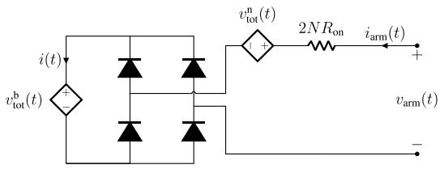  
Fig. 5. Arm stack model with FBSM.

# 3. Discretization of the governing equations

In this section the governing equations of the arm stack derived in Section 2 are discretized. Euler’s method of integration is used, as it models the capacitor with only an equivalent history voltage source that is dependent on the voltage and current at the previous time-step. Thus, there exists no resistor in the Thevenin equivalent circuit of the capacitor. In turn, the whole arm model, which inserts or bypasses the SM capacitors based on the switching functions, does not manifest a time-varying resistor in its Thevenin equivalent circuit. As a result, there is no change in the elements of the network admittance matrix and, hence, no requirements for its re-inversion. Note that part of the computational advantage of this method arises from the fact that instead of finding a Thevenin equivalent for every SM and putting them in series, as is done in conventional DEMs, the SM capacitor voltage’s equations (see (20)) is directly integrated numerically and shown as a voltage source. The voltages from all SM capacitors are then added together, to which the resistive voltage drop of the semiconductors is also added (see (5)). In existing DEMs, which are developed based on the trapezoidal rule of integration, however, the Thevenin resistance of the inserted SM capacitors are summed up to achieve the whole arm model, thereby yielding a time-dependent resistor, which varies with the switching functions of the SMs. Accordingly, the network admittance matrix needs to be re-triangularized every time the switching functions change.

Using (10) or (20), the capacitor’s voltage at the present time-step can be calculated from the previous time-step values as:

$$
v _ {\mathrm {c k}} (t) = k _ {\mathrm {e}} v _ {\mathrm {c k}} (t - \Delta t) + R _ {\mathrm {e}} i _ {\mathrm {c k}} (t - \Delta t) \tag {21}
$$

where ???? is the simulation time-step, and the parameters $k _ { \mathrm { e } }$ and $R _ { \mathrm { e } }$ are defined as follows:

$$
k _ {\mathrm {e}} = 1 - \frac {\Delta t}{R _ {\mathrm {l}} C} \quad \text {a n d} \quad R _ {\mathrm {e}} = \frac {\Delta t}{C} \tag {22}
$$

The capacitor voltages $v _ { \mathrm { c } k } ( t - \Delta t )$ are known values from the past solution of the network. However, the capacitor currents $i _ { \mathbf { c } k } ( t - \Delta t )$ are not explicitly known and must be calculated using (8) and (17) by substituting ?? − ???? for ??. Thus the capacitor currents at the previous time-step are calculated for HBSM and FBSM as in (23) and (24), respectively.

$$
\begin{array}{l} i _ {\mathbb {C} k} (t - \Delta t) = \left(b (t - \Delta t) + \bar {b} (t - \Delta t) S _ {k} (t - \Delta t)\right) \\ \times i (t - \Delta t) \tag {23} \\ \end{array}
$$

$$
\begin{array}{l} i _ {c k} (t - \Delta t) = b (t - \Delta t) \left(S _ {1 k} (t - \Delta t) - S _ {3 k} (t - \Delta t)\right) \\ \times i _ {\mathrm {a r m}} (t - \Delta t) + \bar {b} (t - \Delta t) i (t - \Delta t) \tag {24} \\ \end{array}
$$

Finally, the total voltage can be calculated by substitution of (21) in (14) and (18)–(19) for HBSM and FBSM sub-modules, respectively. For instance, the total voltage for HBSM topology is expressed as

$$
\begin{array}{l} v _ {\mathrm {t o t}} (t) = \sum_ {k = 1} ^ {N} \left[ \left(b (t) + \bar {b} (t) S _ {k} (t)\right) \times \left(k _ {\mathrm {e}} v _ {\mathrm {c k}} (t - \Delta t) + \right. \right. \\ \left. \left. R _ {\mathrm {e}} \left(b (t - \Delta t) + \bar {b} (t - \Delta t) S _ {k} (t - \Delta t)\right) \times i (t - \Delta t)\right) \right] \tag {25} \\ \end{array}
$$

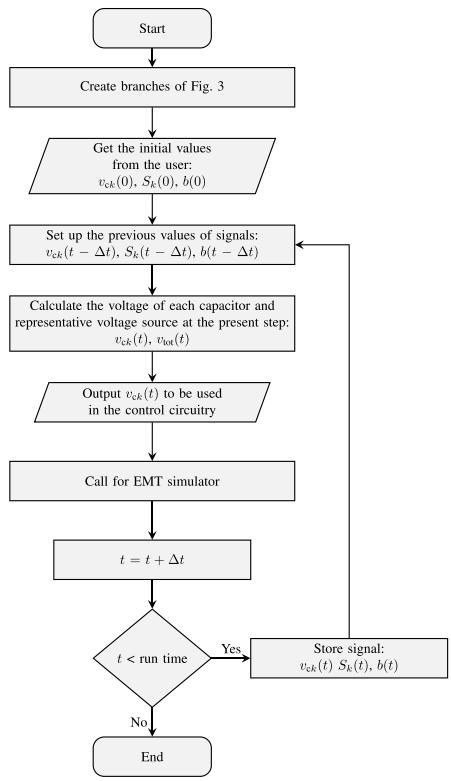  
Fig. 6. Flowchart of simulations using the proposed HBSM model.

The HB and FB DEMs developed so far could be connected in series or other types of connections to build an arm model of a hybrid MMC configuration as long as the fundamental building blocks, i.e. submodules, of the new topology are either HBSM or FBSM. For other SM types, the same approach may be taken to the develop the DEM.

With the discretized equations, Fig. 6 shows the flowchart of an algorithm by which the arm stack is built in an EMT-type simulation platform.

# 4. Simulation results

The arm equivalent circuits derived in Section 2 are implemented in the PSCAD/EMTDC simulator [23,24] for both HBSM and FBSM sub-modules. Several case studies are carried out to evaluate the performance of the proposed models, particularly to (i) establish their accuracy, and (ii) assess their computational advantage over existing DEMs. A simple test system comprising a single MMC connected to an infinite bus via a reactance is considered first. This example serves to validate the steady state operation of the converter and its response to a pole-to-pole (PTP) dc fault. Simulation results from this case are compared against those from the existing DEM in PSCAD/EMTDC to verify the accuracy of the proposed models. Next three CIGRE B4-57 MMC-HVDC grids [25,26] are considered, in which several MMCs are embedded in increasingly more complex dc grids.

It must be noted that existing commercially available DEMs have been heavily used over the past decade by manufacturers, utilities, and consulting engineers, and are known to be accurate in representing the behavior of an actual MMC. They have also been verified against analytical and experimental results [27]. This is why they are used as the benchmark to validate the models proposed in this paper.

# 4.1. Case study 1: Single-MMC circuit

The circuit diagram of the simple test system used for accuracy verification of the proposed models is shown in Fig. 7. The MMC is

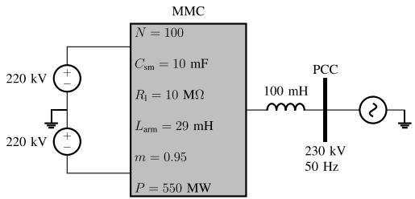  
Fig. 7. Circuit diagram of the system in case study 1.

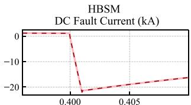

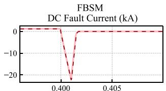

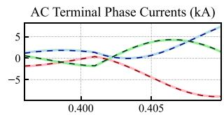

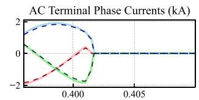

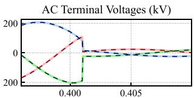

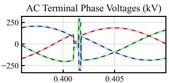

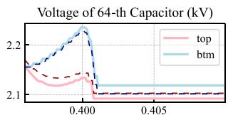

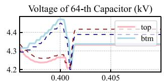

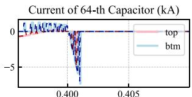

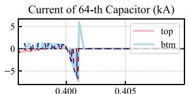  
  
Fig. 8. Case study 1: Waveform for a PTP fault for HBSM and FBSM topologies. solid: PSCAD/EMTDC’s existing DEM, dashed: proposed model.

operated with the DC side voltage of 440 kV and 95% modulation index, producing a line-to-line voltage of 256 kV at its AC terminal. The produced voltage leads the PCC voltage by $1 7 . 2 ^ { \circ }$ to deliver 550 MW of real power to the power system. A PTP fault is applied at ?? = 0.4 s and the converter is blocked 1 ms thereafter. The circuit is simulated with both HBSM and FBSM topologies, with a simulation time-step of 50 μs. Fig. 8 shows the waveform of the dc fault current, ac terminal voltage and current, and voltage and current of a randomly selected SM capacitor (64th) from the top and bottom arm for both HBSM and FBSM circuits. After the fault is cleared, the system settles at a new operating condition for which the arm currents, summation of capacitors voltages in each arm, and voltage and current of a random SM (31th) are shown in Fig. 9. Except for slight discrepancies in the SM-level waveforms, the results produced by the proposed models (dashed lines) match those by the existing DEM (solid lines), thus they verify the accuracy of the proposed models during both steady state and faulted conditions. Slight differences in the SM-level quantities are due to the small differences in the sorted SM capacitor lists submitted to the firing pulse controller.

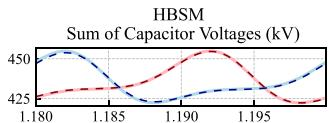

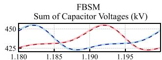

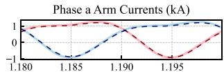

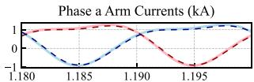

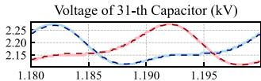

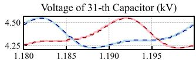

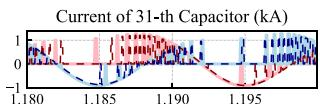  
time (s)

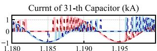  
time (s)   
Fig. 9. Case study 1: Waveforms of MMC during normal mode. solid: PSCAD/EMTDC’s existing DEM, dashed: proposed model.

# 4.2. Case study 2: CIGRE MMC-HVDC benchmarks

Three simulation models of the CIGRE B4-57 MMC-HVDC grids [25, 26] with 2, 4, and 16 MMCs are considered. Specifications of the systems and their parameter values may be found in [26]; they are not repeated here for brevity. In all simulations in this section, the MMCs are considered to have the same number of sub-modules. Two tests, as elaborated upon below, are conducted to evaluate the performance of the proposed models.

# 4.2.1. Test I

The MMC-HVDC network with 4 MMC units is considered for this test. The single-line diagram of this network is shown in Fig. 10. Each arm of the MMCs in the network consists of 200 HBSM sub-modules with a 10 000 μF SM capacitor. The network is simulated twice, once with the existing DEM in PSCAD/EMTDC as the benchmark and once with the proposed DEM. Fig. 11 shows the arm currents and summation of the capacitor voltages for phase-a of each converter station in steady state. A negative step change of 200 MW is applied at ?? = 1.5 s to the converter at bus CmF1, followed by a positive 300 MW step change at ?? = 2.0 s. The variations of the measured power at the dc terminals of the converter stations are shown in Fig. 12. A permanent PTP fault is applied at the converter station CmF1 at ?? = 2.5 s. The voltage and current waveforms of the dc terminals of each converter station are shown in Fig. 13. As clearly seen, the waveforms from the existing PSCAD/EMTDC’s DEM match perfectly with those produced by the proposed model, thus further validating its accuracy.

# 4.2.2. Test II

Each of the MMC-HVDC grid models, i.e. with 2, 4, and 16 MCCs, is simulated with different number of SMs using both the proposed and PSCAD/EMTDC’s existing DEM. In order to achieve the same dynamic responses as the number of SMs is varied, the SM capacitance is updated so that the equivalent arm capacitance, $C _ { \mathrm { a r m } } \ = \ C _ { \mathrm { s m } } / N _ { \mathrm { ; } }$ , remains constant at 50 μF. The simulation time-step and run duration are 50 μs and 2 s, respectively. Simulations are conducted on a computer with 3.40 GHz Intel Core i7-6700 CPU with 16 GB of memory. To eliminate the effect of run-time plotting of waveforms on the recorded CPU time, all figures (graphs) are removed after first having confirmed that the resulting waveforms are accurate. Table 2 shows the measured CPU run-time in seconds for systems with different number of MMCs and sub-modules for HBSM topology. The tests are also repeated for the same systems with FBSMs with proper control circuitry, and the results are tabulated in Table 3. To compare the effectiveness of the proposed

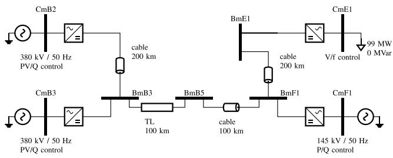  
Fig. 10. CIGRE B4-57 MMC-HVDC grid with 4 MMC stations.

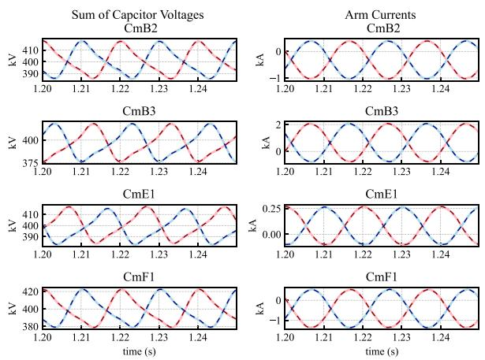  
Fig. 11. Case study 2 (Test I): Arm currents and summation of capacitor voltages. solid: PSCAD/EMTDC’s existing DEM, line: proposed model.

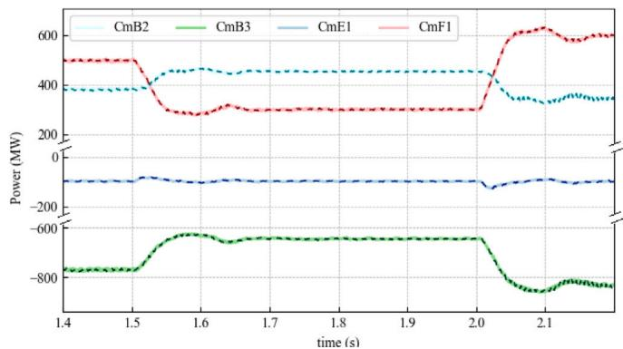  
Fig. 12. Case study 2 (Test I): Measured power in converter stations. solid: PSCAD/EMTDC’s existing DEM, dashed: proposed model.

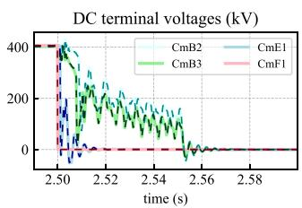

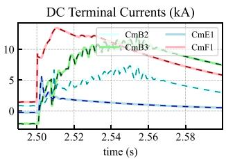  
Fig. 13. Case study 2 (Test I): Measured DC voltages and currents in converter stations. solid: PSCAD/EMTDC’s existing DEM, dashed: proposed model.

model, the ratio of its CPU run-times to those of the PSCAD/EMTDC’s DEM is plotted against the number of sub-modules in Fig. 14.

The graph shows the run-time ratio for different number of MMCs in the network for both HBSM and FBSM configurations. The graphs show significant reductions in CPU time by the proposed models. For

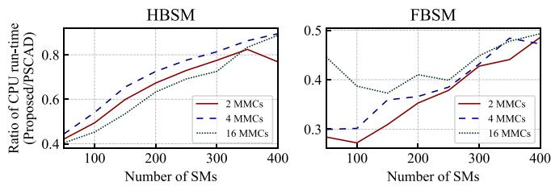  
Fig. 14. Ratio of CPU run-time of the proposed models to the existing DEMs.

Table 2 CPU run-time of MMC-HVDC systems with HBSM.   

<table><tr><td>NMCC</td><td colspan="2">2</td><td colspan="2">4</td><td colspan="2">16</td></tr><tr><td>Nm</td><td>Proposed</td><td>Existing</td><td>Proposed</td><td>Existing</td><td>Proposed</td><td>Existing</td></tr><tr><td>50</td><td>3.7</td><td>8.8</td><td>7.3</td><td>16.5</td><td>38.9</td><td>96.4</td></tr><tr><td>100</td><td>6.4</td><td>12.9</td><td>12.7</td><td>23.5</td><td>52.6</td><td>116</td></tr><tr><td>150</td><td>10.6</td><td>17.8</td><td>21.7</td><td>33.1</td><td>81.3</td><td>152</td></tr><tr><td>200</td><td>16.2</td><td>24.1</td><td>31.9</td><td>44</td><td>117</td><td>185</td></tr><tr><td>250</td><td>23.7</td><td>32.4</td><td>45.7</td><td>58.9</td><td>165</td><td>239</td></tr><tr><td>300</td><td>32.5</td><td>41.9</td><td>62.3</td><td>76.6</td><td>210</td><td>289</td></tr><tr><td>350</td><td>43.1</td><td>52.3</td><td>85.8</td><td>99.4</td><td>298</td><td>375</td></tr><tr><td>400</td><td>50</td><td>65.2</td><td>104</td><td>117</td><td>383</td><td>431</td></tr></table>

Table 3 CPU run-time of MMC-HVDC systems with FBSM.   

<table><tr><td>NMCC</td><td colspan="2">2</td><td colspan="2">4</td><td colspan="2">16</td></tr><tr><td>Nm</td><td>Proposed</td><td>Existing</td><td>Proposed</td><td>Existing</td><td>Proposed</td><td>Existing</td></tr><tr><td>50</td><td>4.3</td><td>15.2</td><td>8.7</td><td>29.1</td><td>62.1</td><td>139</td></tr><tr><td>100</td><td>6.7</td><td>24.6</td><td>13.1</td><td>43.4</td><td>77.3</td><td>200</td></tr><tr><td>150</td><td>10.9</td><td>35.3</td><td>22.3</td><td>62.2</td><td>104</td><td>279</td></tr><tr><td>200</td><td>16.7</td><td>47.5</td><td>31</td><td>84.7</td><td>145</td><td>354</td></tr><tr><td>250</td><td>23.7</td><td>62.8</td><td>42.5</td><td>110</td><td>181</td><td>455</td></tr><tr><td>300</td><td>32.4</td><td>75.7</td><td>59.4</td><td>137</td><td>254</td><td>567</td></tr><tr><td>350</td><td>40.1</td><td>90.9</td><td>78.4</td><td>162</td><td>307</td><td>646</td></tr><tr><td>400</td><td>52.3</td><td>107.6</td><td>93</td><td>197</td><td>371</td><td>753</td></tr></table>

200 HBSMs per arm, for example, the proposed model is around 30% more computationally efficient than the existing DEM. For 200 FBSMs, however, it is more than 60% accelerated.

The CPU run-time is chiefly affected by two factors. One is the time needed for re-triangularization of the admittance matrix. The other is the time consumed for calculations of control signals for IGBTs’ firing signals. In each run, the dimensional order of the admittance matrices remain constant and nearly the same for both the proposed model and the PSCAD/EMTDC’s DEM. However, the number of control signals is approximately proportional to the number of sub-modules in each run. Therefore, for larger numbers of SMs, the CPU run-time is predominately determined by the number of sub-modules. Because control signal calculations are held the same for the cases with the proposed and existing DEMs, the ratio is expected to increase and approach unity when the number of the SMs increases, as is also seen in Fig. 14. The proposed models, however, show significant savings even for SM counts as high as 400, for which the proposed FBSM models are more than twice as fast as the existing DEM.

# 5. Numerical stability and accuracy

Euler’s method of integration is not A-stable and will become numerically unstable if the time-step exceeds certain limits. This limit is determined by the maximum value of the eigenvalues of the discretized state-space matrix of the circuit provided that all state variables are discretized with the Euler’s method. In this paper, however, only the stack of SMs are discretized with Euler’s method and the rest of the circuit including the arm inductors, transmission lines, transformers, etc, are modeled with the trapezoidal method as shown in Fig. 15(a). This mixture of integration methods is also not A-stable but its margin

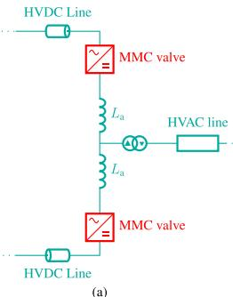

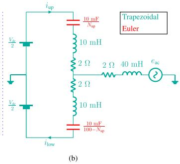  
Fig. 15. Network modeled with mixed integration method.

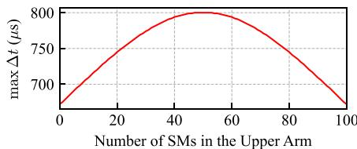  
Fig. 16. Maximum time-step vs. number of SMs inserted from upper (lower) arm.

of stability is greater than that of the case where all components are constructed with the Euler’s method.

Fig. 15(b) shows an example of an MMC with 100 SMs in normal mode in which, at every moment, $N _ { \mathrm { u p } }$ and $1 0 0 - N _ { \mathsf { u p } }$ capacitors are inserted in the upper and lower arms, respectively. By performing circuit analysis, the state-space equation in the discrete domain may be written as follows:

$$
\mathbf {X} (t) = \mathbf {G} (\Delta t) \mathbf {X} (t - \Delta t) + \text {e f f e c t s o f t h e i n p u t s} \tag {26}
$$

where ?? is the states and ?? is the discretized state-space matrix, which is a function of ????. For all possible number of SMs inserted, the maximum time-step beyond which the simulations are numerically unstable are calculated and plotted in Fig. 16. As shown, the worst-case maximum time-step is around $6 7 0 ~ \mu \mathrm { s } ,$ , which is 13 times larger than 50 μs, the typical time-step in power system applications.

For a network with switching elements the eigenvalues are not the only determinant of the maximum time-step. In fact, switching frequencies and time durations by which the circuit undergoes different states are of significant importance for if the time-step is not small enough, switching events will be missed. Heuristically, one tenth of the minimum switching period is considered for selecting the time-step.

In MMCs, the voltage generated by the stack of SMs is a staircase quantized sinusoidal waveform. Assuming that time intervals in the staircase waveform are equal, the length of each interval is $\frac { 1 } { N f }$ where

?? and ?? are the number of SMs and frequency of the AC network, respectively. For instance, if the MMC has 100 SMs per arm and the AC network frequency is 60 Hz, the length of each interval would be $\frac { 1 } { 1 0 0 \times 6 0 } = 1 6 6 . 6 6$ μs meaning that the maximum time-step is 166.66 μs. Such a rough calculation is specifically useful for MMCs controlled by the Nearest Level Control method. In PWM-controlled MMCs the recommended time-step is one tenth of the switching period of the PWM signal. For example, if the PWM signal has a frequency of 1 kHz, the recommended time-step would be $\begin{array} { c c l } { \dot { } } & { \dot { } } & { \dot { } } \\ { \overline { { 1 0 \times 1 0 0 0 } } } & { \dot { } = } & { \dot { 1 } 0 0 } \end{array}$ μs. Hence, a 10×1000 typical time-step in MMC simulations does not usually exceed 150 μs and for a common time-step of 50 μs, it is highly unlikely that the proposed mixed integration method becomes numerically unstable or inaccurate for (i) all elements except the stack of SMs are modeled with the trapezoidal integration method and (ii) the time-step must be inherently small enough to avoid missing switching events. The results of simulation case studies presented in Section 4 validate the stability and accuracy of the proposed method.

# 6. Conclusion

A DEM was introduced for EMT simulation of MMCs, based upon Thevenin equivalents of the arm stack. The new DEM features a constant conductance and alleviates modifications of the network admittance matrix except when the MMC enters or leaves the blocked mode of operation. The paper showed that using Euler’s method does not adversely affect the accuracy or stability of the models, and that they are 30% and 60% more computationally efficient than existing DEMs for HBSM and FBSM, respectively. Several case studies were carried out whose results matched those from the existing DEM model in PSCAD/EMTDC.

# Declaration of competing interest

The authors declare that they have no known competing financial interests or personal relationships that could have appeared to influence the work reported in this paper.

# Data availability

No data was used for the research described in the article.

# References

[1] N. Flourentzou, V.G. Agelidis, G.D. Demetriades, VSC-based HVDC power transmission systems: An overview, IEEE Trans. Power Electron. 24 (3) (2009) 592–602.   
[2] A. Lesnicar, R. Marquardt, An innovative modular multilevel converter topology suitable for a wide power range, in: 2003 IEEE Bologna Power Tech Conference Proceedings, Vol. 3, 2003, p. 6.   
[3] B. Gemmell, J. Dorn, D. Retzmann, D. Soerangr, Prospects of multilevel VSC technologies for power transmission, in: IEEE/PES Transmission and Dist. Conf. and Expo., 2008, pp. 1–16.   
[4] M. Saeedifard, R. Iravani, Dynamic performance of a modular multilevel back-to-back HVDC system, IEEE Trans. Power Deliv. 25 (4) (2010) 2903–2912.   
[5] S.P. Teeuwsen, Simplified dynamic model of a voltage-sourced converter with modular multilevel converter design, in: 2009 IEEE/PES Power Systems Conference and Exposition, 2009, pp. 1–6.   
[6] D.C. Ludois, G. Venkataramanan, Simplified dynamics and control of Modular Multilevel Converter based on a terminal behavioral model, in: 2012 IEEE Energy Conv. Cong. and Expo., 2012, pp. 3520–3527.   
[7] B. Bahrani, S. Debnath, M. Saeedifard, Circulating current suppression of the modular multilevel converter in a double-frequency rotating reference frame, IEEE Trans. Power Electron. 31 (1) (2016) 783–792.   
[8] R. Parvari, S. Filizadeh, Exact solution of modulation waveforms for MMCs operating with circulating current suppression control (CCSC) strategy, in: 2021 IEEE 22nd Workshop on Control and Modelling of Power Electronics (COMPEL), 2021, pp. 1–5.   
[9] X. Shi, S. Filizadeh, A. Gole, Capacitor energy storage requirements in mixedsubmodule hybrid cascaded MMCs, IEEE Trans. Energy Convers. 35 (3) (2020) 1638–1647.   
[10] J. Xu, A.M. Gole, C. Zhao, The use of averaged-value model of modular multilevel converter in DC grid, IEEE Trans. Power Deliv. 30 (2) (2015) 519–528.   
[11] X. Meng, J. Han, L.M. Bieber, L. Wang, W. Li, J. Belanger, A universal blocking-module-based average value model of modular multilevel converters with different types of submodules, IEEE Trans. Energy Convers. 35 (1) (2020) 53–66.   
[12] X. Meng, J. Han, L. Wang, W. Li, A unified arm module-based average value model for modular multilevel converter, IEEE Access 8 (2020) 63821–63831.   
[13] J. Peralta, H. Saad, S. Dennetiere, J. Mahseredjian, S. Nguefeu, Detailed and averaged models for a 401-level MMC–HVDC system, IEEE Trans. Power Deliv. 27 (3) (2012) 1501–1508.   
[14] H. Saad, J. Peralta, S. Dennetière, J. Mahseredjian, J. Jatskevich, J.A. Martinez, A. Davoudi, M. Saeedifard, V. Sood, X. Wang, J. Cano, A. Mehrizi-Sani, Dynamic averaged and simplified models for MMC-based HVDC transmission systems, IEEE Trans. Power Deliv. 28 (3) (2013) 1723–1730.   
[15] U.N. Gnanarathna, A.M. Gole, R.P. Jayasinghe, Efficient modeling of modular multilevel HVDC converters (MMC) on electromagnetic transient simulation programs, IEEE Trans. Power Deliv. 26 (1) (2011) 316–324.   
[16] N. Ahmed, L. Ängquist, S. Mahmood, A. Antonopoulos, L. Harnefors, S. Norrga, H.-P. Nee, Efficient modeling of an MMC-based multiterminal DC system employing hybrid HVDC breakers, IEEE Trans. Power Deliv. 30 (4) (2015) 1792–1801.

[17] F.B. Ajaei, R. Iravani, Enhanced equivalent model of the modular multilevel converter, IEEE Trans. Power Deliv. 30 (2) (2015) 666–673.   
[18] N. Herath, S. Filizadeh, M.S. Toulabi, Modeling of a modular multilevel converter with embedded energy storage for electromagnetic transient simulations, IEEE Trans. Energy Convers. 34 (4) (2019) 2096–2105.   
[19] X. Meng, J. Han, J. Pfannschmidt, L. Wang, W. Li, F. Zhang, J. Belanger, Combining detailed equivalent model with switching-function-based average value model for fast and accurate simulation of MMCs, IEEE Trans. Energy Convers. 35 (1) (2020) 484–496.   
[20] N. Herath, S. Filizadeh, Improved average-value and detailed equivalent models for modular multilevel converters with embedded storage, IEEE Trans. Energy Convers. (2022) 1.   
[21] J. Xu, S. Fan, C. Zhao, A.M. Gole, High-speed EMT modeling of MMCs with arbitrary multiport submodule structures using generalized norton equivalents, IEEE Trans. Power Deliv. 33 (3) (2018) 1299–1307.

[22] M.M. Bhesaniya, A. Shukla, Norton equivalent modeling of current source MMC and its use for dynamic studies of back-to-back converter system, IEEE Trans. Power Deliv. 32 (4) (2017) 1935–1945.   
[23] PSCAD User’s Guide v4.6, Manitoba Hydro International Ltd, Winnipeg, MB, Canada, 2018, [Online]. [Online]. Available: https://www.pscad.com/ knowledge-base/download/pscad_manual_v4_6.pdf.   
[24] EMTDC User’s Guide v4.6, Manitoba Hydro Intl. Ltd., Winnipeg, MB, Canada, 2018, [Online]. [Online]. Available: https://www.pscad.com/knowledge-base/ download/emtdc_manual_v4_6.pdf.   
[25] T. Vrana, S. Dennetiere, Y. Yang, J. Jardini, D. Jovcic, H. Saad, The Cigré B4 DC grid test system, in: CIGRE Electra, Vol. 270, 2013.   
[26] Manitoba Hydro Intl, CIGRE B4-57 working group developed models, [Online]. Available: https://www.pscad.com/knowledge-base/article/57.   
[27] J. Rupasinghe, S. Filizadeh, L. Wang, A dynamic phasor model of an MMC with extended frequency range for EMT simulations, IEEE J. Emerg. Sel. Top. Power Electron. 7 (1) (2019) 30–40.