# Interfacing Techniques for Transient Stability and Electromagnetic Transient Programs

IEEE Task Force on Interfacing Techniques for Simulation Tools

V. Jalili-Marandi, V. Dinavahi, K. Strunz, J. A. Martinez, and A. Ramirez

Abstract—Transient stability (TS) and electromagnetic transient (EMT) programs are widely used simulation tools in power systems, with distinct applications but competing requirements. TS programs are fast which makes them suitable for handling large-scale networks, however, the modeling is not sufficiently detailed. On the other hand, EMT simulators are highly detailed, but limited in speed; consequently, they are used to simulate only small portions of the network. Integrating these two types of simulators generates a hybrid simulator which inherits the merits of both programs. A hybrid simulator can fulfill the modeling requirements of a large network by providing a fast as well as a detailed simulation. Establishing a connection between two different programs brings up several important issues which have been addressed, classified, and explained in this paper. An alternative integrated modeling of TS and EMT is also discussed using the concept of frequency shifting.

Index Terms—Electromagnetic transient analysis, hybrid simulation, interfacing, power system transient stability.

# I. INTRODUCTION

T RANSIENT STABILITY (TS) and Electromagnetic T Transient (EMT) studies are two important analyses in power systems [1], [2]. Transient stability study is important for planning and design, operation and control, and post-disturbances analysis in power systems [3]. Transient stability type programs solve several thousands of differential-algebraic equations for multi-machine power systems assuming single-phase fundamental frequency behavior. To handle such large numbers of equations a time-step in the range of milliseconds is chosen for the simulation.

Applications such as insulation coordination, design of protection schemes, and power electronic converter design require the computation of electromagnetic transients. EMT simulation must be done by considering all phases, over a wide range of frequency, and with a time-step in the range of microseconds or even less. In the past, traditional EMT analysis was based on the Transient Network Analyzer (TNA), an analog

Manuscript received December 12, 2007; revised March 27, 2008. Current version published September 23, 2009. This work was supported by the Natural Science and Engineering Research Council of Canada (NSERC). Paper no. TPWRD-00800-2007.

Task Force members: U. Annakkage, V. Dinavahi (Task Force Chair), S. Filizadeh, A. M. Gole, R. Iravani, V. Jalili-Marandi, J. Jatskevich, A. J. Keri, P. Lehn, J. A. Martinez, B. A. Mork, A. Monti, L. Naredo, T. Noda, A. Ramirez, M. Rioual, M. Steurer, and K. Strunz are with the Task Force on Interfacing Techniques for Simulation Tools, which is with the Working Group on Modeling and Analysis of System Transients Using Digital Programs, IEEE Power Engineering Society Transmission and Distribution Committee..

Color versions of one or more of the figures in this paper are available online at http://ieeexplore.ieee.org.

Digital Object Identifier 10.1109/TPWRD.2008.2002889

scaled-down representation of the study system. In the TNA lines were modeled as series PI-circuits made up of R, L, and C elements [2]. The application of TNA has been restricted due to its high cost, large dimensions, and model simplification issues. The advent of digital computers offered an alternate approach for EMT analysis that overcame some of the restrictions of TNA. EMT-type programs allow low-cost, flexible, and accurate modeling of the EMT phenomenon; however, these simulators are not without some limitations related to modeling accuracy and processing time [2], [4], [5].

Several applications in large-scale power systems such as simulation of transient states of the network including power electronic apparatuses and control devices associated with FACTS and HVDC require a simulator as fast as the TS and as detailed as the EMT simulator. Many attempts were made towards that end, such as using parallel processing or simplified models in the form of equivalents [6]–[8], however, in most cases they were found inadequate for dealing with the large size of realistic power systems. The idea of a combined TS and EMT simulator was first proposed and implemented by Heffernan et al. [9], in 1981. Two separate and distinct simulators were integrated for transient analysis of a system which includes a HVDC link [10]. Later several improvements were made in different steps of building the hybrid simulator.

The application of hybrid simulation is a relatively recent topic. Our intent in this paper is to aggregate various terms, definitions, and methods which have been used in each step of building a hybrid simulator. The paper is organized as follows: in Section II, general terms and definitions which are related to the TS and EMT programs will be reviewed. Although there are several documents concerning these topics, here we briefly present the latest definitions reported in IEEE Standards and Task Force publications. In Section III and Section IV, the properties and restrictions of TS and EMT programs will be described. In Section V the motivation for using a hybrid simulator is presented. Section VI presents an overview of all the requirements and protocols used for hybrid simulation. In Section VII, an integrated EMT-TS frequency adaptive simulation method will be discussed. The conclusion of this paper appears in Section VIII.

# II. GENERAL TERMS AND DEFINITIONS

# A. Transient

IEEE Standard Dictionary defines a transient phenomena as follows [11]:

Pertaining to or designating a phenomenon or a quantity that varies between two consecutive steady states during a time in-

terval that is short compared to the time scale of interest. A transient can be a unidirectional impulse of either polarity or a damped oscillatory wave with the first peak occurring in either polarity.

Overvoltages due to lightning and capacitor energization are examples of events that cause impulsive and oscillatory transients, respectively. Some of the most common types of transient phenomena in power systems include energization of transmission lines, switching off of reactors and unloaded transformers, linear resonance at fundamental or at a harmonic frequency, series capacitor switching and sub-synchronous resonance, and load rejection [2].

# B. Stability

From a system point of view there exist several types of stability definitions such as: Lyapunov stability, input-output stability, stability of linear systems, and partial stability [1]. Kimbark has classically defined stability related to power systems in [12], however, this definition was restricted to synchronous machines, and their being “in step.” The IEEE/CIGRE Joint Task Force on Stability Terms and Definitions [1] adopted the following definition:

Power system stability is the ability of an electric power system, for a given initial operating condition, to regain a state of operating equilibrium after being subjected to a physical disturbance, with most system variables bounded so that practically the entire system remains intact.

Instability in power systems can be caused by either small or large disturbances. During a small disturbance the set of equations which describe the perturbed power system can be linearized; however, during the large disturbance these equations cannot be linearized for the purpose of analysis [13]. Typical examples of small disturbances are a small change in the scheduled generation of one machine, or a small load (say 1/100 of system capacity or less) disconnected or added to the network [14], [15]. Severe perturbations such as short-circuit faults and loss of generation events are representative of large disturbances. Additionally, phenomena which cause instability problems in power systems have been sub-classified based on their duration [1].

# C. Transient Stability

Power system stability phenomena can be categorized into three major classes: rotor angle stability, voltage stability, and frequency stability. If an interconnected network has been subjected to a perturbation; the ability of this power system to keep its machines in synchronism, and to maintain voltages of all buses as well as the frequency of the whole network around the steady-state values is the basis for the above mentioned classification [3]. Each form of stability phenomena may be caused by a small or large disturbance.

Although in the literature the term transient stability has been used to refer to the large-disturbance rotor angle stability phenomenon [13], [14], some authors have used this term as a general purpose stability study of the given network with a particular disturbance sequence [16]. The IEEE/CIGRE task force report has categorized both the small and large disturbance rotor angle stability phenomena as short-term events. Furthermore, it recommends the term transient stability for large-disturbance

rotor angle stability phenomenon, with a time frame of interest in the order of 3 s to 5 s following the disturbance. This time span may increase up to 10–20 s in the case of very large networks with dominant inter-area swings [1].

# D. Electromagnetic Transient

An electromagnetic transient can be defined as the response of the power system elements to a perturbation caused by external electromagnetic fields or to a change in the physical configuration of the network such as switching and loading. Electromagnetic transients in power systems result from a combination of transient components in lumped-parameter elements and traveling waves in distributed-parameter elements [17]. Transient over-voltage on a transmission line that is energized from one end, while its other end is still open, presents a typical case of an electromagnetic transient. It consists in a very fast time variation waveform superimposed on the fundamental (source) frequency waveform. According to transmission line theory, if the sending end is connected to a dc voltage source of 1 p.u. there exists a 2 p.u. over-voltage at the open ended terminal. This doubling effect can also be observed at the motor terminals of adjustable speed drives, in cases where the length of cable between the pulse-width modulated converter and the motor is more than 20 m. Furthermore, the over-voltage can produce a transient phenomenon in nearby transmission systems or electrical equipments without even being physically connected to the energized line. Switching operations, faults, and direct or indirect lightning strikes are other sources for electromagnetic transients in inter-connected power networks [2].

# E. Parallel Processing

The method of Diakoptics, introduced in 1952 by Kron [18], is the earliest application of the network partitioning and parallel processing in power systems. Several research areas in power systems such as load flow, transient stability, electromagnetic transients, security assessment, and reliability studies have taken advantage of parallel processing techniques to achieve highly efficient computations [19]–[23]. The IEEE Task Force report [20] has proposed the following definition of parallel processing:

Parallel processing is a form of information processing in which two or more processors together with some form of interprocessor communications system, cooperate on the solution of a problem.

Two types of parallelization are available: parallel-in-space and parallel-in-time. A parallel-in-space approach is based on decomposing the original system into smaller subsystems and distributing their computations among several processors [24]. As power systems are stiff systems (i.e., a system in which time constants of the subsystems vary over a wide range [13]), it is practical to use multi-rate integration methods for different subsystems to discretize differential-algebraic equations (DAEs) which describe the dynamic behavior of subsystems [25].

A parallel-in-time approach is based on using simultaneous multiple time-step solution of nonlinear DAEs that describe the system [24]. In this case, each processor is assigned to solve equations for only one iteration, and usually the number of processors should be equal or greater than the number of required

iterations. Experimental studies claim that partitioning a network into too many subsystems by using a large number of processors which are parallel-in-space increases the inter-processor communication time, while excessive exploitation of parallel-in-time processors increases the number of iterations. Nevertheless, a proper combination of these two types of parallelization methods can be used to effectively accelerate the speed of computation [24].

# III. PROPERTIES AND RESTRICTIONS OF TRANSIENT STABILITY SIMULATORS

The complete power system model for transient stability analysis can be mathematically described by a set of first-order differential equations and a set of algebraic equations. The differential equations model dynamics of the rotating machines while the algebraic equations represent the transmission system, loads, and the connecting network [26]. These equations are nonlinear, and the typical solution approach is to use a discretization method such as the Trapezoidal rule to convert the differential equations to a new set of nonlinear algebraic equations, and then solving these two sets of nonlinear algebraic equations by a suitable iterative method such as the Newton-Raphson. Section A in the Appendix provides the details on the general solution of the transient stability problem.

A complete description of the power network requires a very large number of equations. For instance, consider a realistic inter-connected power system which includes over 3000 buses and about 400 power stations which are feeding 800 loads. Assuming that the transmission system and loads are modeled by algebraic equations, and the generation stations are modeled by a set of 20 first-order differential equations each. The transient stability analysis of the described network needs solving of 8000 differential equations and about 3500 algebraic equations [15], [27]. To make this solution as time-efficient as possible usually a time-step in the range of milliseconds is chosen for the simulation. In transient stability studies it is assumed that voltage and current waveforms more or less remain at power frequency (60 or 50 Hz). Thus, for modeling the electrical parts of the power system steady-state voltage and current phasors can be used. Moreover, transient stability study is a positive-sequence single-phase type of analysis [2], [28].

Large integration time-step of the transient stability programs is the main restriction for the detailed representation of nonlinear elements (such as power electronic apparatus) and dynamically fast events (such as line energization). For example, to evaluate transient responses of HVDC links and FACTS devices a time-step in the order of a few microseconds is needed. Hence, in conventional transient stability programs these devices can just be represented as quasi-steady-state models, which are suitable for normal working conditions or are developed for a specific type of disturbance [28].

# IV. PROPERTIES AND RESTRICTIONS OF ELECTROMAGNETICTRANSIENT SIMULATORS

There are several cases in power systems when the simulation of voltage and current transient waveforms is required. Examples of such cases include calculation of overvoltages during line switching, simulation of frequency-dependent or nonlinear

components and systems, design of protection schemes, and fault analysis in series-compensated lines or on HVDC lines [2], [7]. Electromagnetic transient study requires detailed modeling and therefore a much smaller time-step than in the transient stability study. Depending on the type of transient and the highest frequency involved, the required step-size can vary in the range of a few nanoseconds for very fast transients, to a few hundred microseconds [4], [32] for slower transients.

Electromagnetic transients are fast phenomena for which power-frequency phasor modeling is not valid. In contrast with transient stability analysis, instantaneous values need to be used. In addition, electromagnetic transient phenomenon is not a symmetric event that could be studied on the single-phase basis, but we need to use a full three-phase simulations [2]. Comprehensive discussions on approaches for EMT modeling of several power system elements and transmission lines can be found in [4], [17], [29]–[31]. Section B in the Appendix presents the general form of the electromagnetic transient study equations.

A large number of equations and a small time-step have made the electromagnetic transient study a computationally onerous type of simulation. Practically it is inefficient to perform electromagnetic transient analysis for a large network where all of the components are represented using detailed models. Usually some form of network partitioning and model reduction are required to reduce computational burden. For instance, we need the distributed-parameter form of modeling to evaluate the steep surge propagation in windings of transformers or in windings of synchronous generators; however, for studies related to propagation of low-frequency transients, transformers and generators can be represented by lumped-parameter approximations [17], [32], [33].

# V. NEED FOR A HYBRID TRANSIENT SIMULATOR

For transient evaluation of a realistic-size power networks we need both accuracy and speed. Several attempts to gain both these characteristics have been proposed. For example, in [8] the accurate EMT modeling has been used for a small part of the power system, while the remaining part of the system has been reduced to shunt-connected series RLC branches equivalent which reproduces the response of original network over a wide frequency range. An important application of transient studies is real-time simulation for protective relay and controller testing. Analog real-time simulators such as TNAs are particularly suitable for these cases. But except for simulation of small-scale systems, analog simulators are bulky, time consuming, and unable to accurately represent sophisticated elements [5]. Due to advancements in the computer hardware, several real-time digital simulators have been developed which have been exploited for electromagnetic transient evaluation of power networks. But they are still efficient only for small-scale networks [21]. Other attempts utilize the concept of splitting a network and parallel-in-space techniques. In [7] a parallel processing technique for network partitioning based on the natural decoupling introduced by traveling waves on transmission lines has been proposed. The time delay which is produced in the long transmission lines by the effect of traveling waves is large enough to completely decouple the partitioned subsystems. A more flexible method for tearing the network is suggested

in [21] where splitting the original system is independent of transmission lines and arbitrary buses in the network can be assumed as boundary buses. Based on the stiffness characteristic of the power systems, reference [34] uses two different time scales for solving electromagnetic equations. The smaller time-step is used for components with fast dynamics while the larger time-step is used for slower dynamic elements.

All of the above approaches have practical limitations when they are used for realistic-size power systems. Therefore, developing a simulator with TS-type speed and EMT-type accuracy is essential for power system studies, and this necessity led researchers to generate a hybrid simulation tool. The main objective of hybrid simulation is to split the original network into two parts, and based on the required modeling accuracy the TS or the EMT simulator is used for each zone. EMT is used for the smaller part in which more detailed and accurate results are needed. This part may comprise HVDC links, FACTS devices, closed-loop controlled devices for real-time simulations such as relays or controllers, parts of the network vulnerable to a disturbance, or any other elements that need small time-steps for representation. In contrast, the other part that embraces extensive portions of the network is simulated by the TS simulator. Detailed modeling is not required for elements existing in this part, but the capability of the simulator for fast computation is essential here. Thus, interfacing TS and EMT simulators builds a hybrid simulator which inherits the merits of both simulators [10], [28].

# VI. DEFINITIONS AND REQUIREMENTS OF A HYBRID TRANSIENT SIMULATOR

Establishing an interaction between two different types of programs brings up several new issues. In this section we will address terms and subjects related to hybrid simulators which have generally been used in the literature.

• Detailed System [35]–[37]: It corresponds to one or more portions of the power system having components that need to be modeled at a detailed device level. The detailed system is the area for operation of EMT simulator. It has also been called EMT network [38], EMT-program subsystem [39], instantaneous network [40], and waveform-type model [41].   
• External System [35]–[37]: The other part of the power system that includes the remaining elements of the network that need to be modeled on a system wide functional basis. System-level modeling supposes that devices work as designed; any malfunctions in the elements cannot be adequately represented. The external system is the domain of the TS simulator. It has also been called electromechanical transient network [38], TS-program subsystem [39], RMS network [40], and phasor-type model [41].   
• Interface buses [36]: Buses through which the detailed and external systems interact and exchange data. Fig. 1 shows the schematic position of the detailed and external systems and the interface buses.   
• Interaction protocol [10]: Predefined sequential actions which coordinate the data exchange between TS and EMT simulators. Two main categories of interaction protocols exist: serial and parallel. In serial protocols at each time

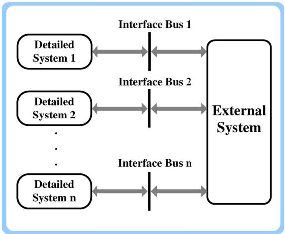  
Fig. 1. Interface between detailed and external systems.

instant only one of the TS or EMT simulators runs while the other one is idle. In a parallel protocol both simulators run simultaneously.

The main issues in interfacing TS and EMT simulators, and creating a hybrid simulator are as follows [36], [42]:

• equivalent models of external and detailed systems;   
• identifying domains of study and locations of interface buses;   
• exchanging data between TS and EMT simulators;   
• organizing interaction protocol between TS and EMT simulators.

# A. Equivalent Models of External and Detailed Systems

In a hybrid simulator, EMT and TS programs are run on two separate zones: the detailed system and the external system. Thus, each program requires a true picture of the other zone which adequately reflects the characteristics of that zone. This picture is referred to as the equivalent model. The validity of the hybrid simulator directly depends on the accuracy of equivalent models.

1) Equivalent of External System in EMT Simulator: The first suggested approach for presenting the external system to the EMT simulator was a fundamental frequency Norton equivalent connected to the interface bus [9]. This equivalent comprises one series RLC shunt-connected circuit which is derived from the impedance under power frequency [43], and a current source which is determined by the type of modeling adopted for generators inside the external system [44]. Since the external network parameters are constant, the values of RLC circuits remain constant, and only the source values must be updated at every time-step of the TS simulator. However, in the case of any switching action in the external system during the simulation, the value of equivalent impedance must be updated [45]. Moreover, the frequency deviation of Norton current source at each interface bus can be determined by the instantaneous frequency of interface bus at the instant of updating [39].

However, this simple power frequency based equivalent is invalid if there is waveform distortion or phase imbalance at interface buses. In [36] it was proposed to extend the detailed system to decrease the level of harmonic distortions and transient disturbances created in the detailed system at interface buses, so

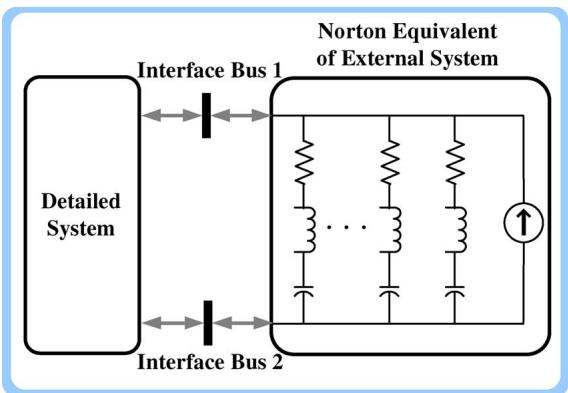  
Fig. 2. Frequency dependent Norton equivalent of external system.

that the external system can be considered at the fundamental frequency exclusively. A more accurate approach is using the frequency dependent Norton equivalent at interface buses, so that a wide range of frequency variations [28], [35], [37] can be covered. A frequency dependent equivalent, as shown in Fig. 2, includes a number of series RLC branches shunt-connected circuits to synthesize the required frequency spectra. Comprehensive discussions about computing the appropriate values of R, L, and C from network’s admittance matrix to cover a wide range of frequency can be found in [8]. A commonly used method for finding the frequency dependent network equivalent is Vector Fitting [46]. In the case of having more than one interface bus a multiport coupled Norton equivalent network viewed from each of the interface buses must be used to represent the split system [47].

There is also considerable research efforts [8], [48]–[51] related to electromagnetic transient study for a selected zone of a large network. The original system is split in two subsystems: study zone, and external system. The signals inside the external system are not of interest, while those produced at the interface buses are important. Therefore, these methods cannot be categorized as hybrid simulators as understood in this paper; however, their methods for modeling the external system in EMT programs is the reason for their inclusion here. These methods have not yet been exploited in hybrid simulators. In [48], the authors proposed a method to directly link frequency domain component models inside the external system to the EMT program by means of Fourier transforms. As such, there is no concern about the distortion level at interface buses or using the Norton equivalent circuit. However, the external network has to satisfy some conditions: it must be linear and time invariant (no inside switching), and must comprise a transmission line to link it to the study zone. A time-domain modeling method for the external system has been described in [49], in which a discrete-time equivalent by using the response of external system to a special excitation is generated. Instead of synthesizing an RLC network, a discrete-time Norton equivalent for external system is directly obtained and attached to the detailed system via the interface bus. A similar approach has been used in [50] for the case of several interface buses.

2) Equivalent of Detailed System in TS Simulator: All proposed models for representing the external system in the EMT program are in the form of the Norton equivalent circuit;

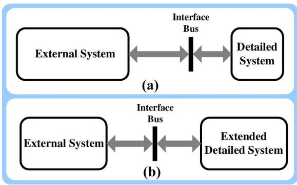  
Fig. 3. Domains of study: (a) detailed system includes only elements which need accurate modeling and (b) detailed system has been extended to embrace some portions of external system.

however, several forms of equivalents have been proposed for modeling the detailed system in the TS simulator [38]. The representations that have been suggested include positive sequence voltage or current sources [9], [28], [36], active/reactive power injection (load) [28], [36], [45], Thevenin/Norton equivalent [36], [38], and equivalent impedance [36], [47]. A common basis for these methods is that all equivalents require fundamental frequency phasors of voltages and currents at the interface bus. Thus, a numerical method such as least square curve fitting or Fourier analysis must be adopted to extract fundamental frequency data from the detailed system at the interface locations [35].

# B. Identifying Domains of Study and Location of Interface Buses

Earlier approaches for determining domains of study, as illustrated in Fig. 3(a), were to simply consider the elements where an accurate result was desired as the detailed system, and their terminals as the location of interface buses.

In the first attempt for a hybrid simulator by Heffernan et al. [9], a HVDC link was modeled in an AC system. The HVDC link was selected as the detailed system; consequently, the location of interface buses was the converter terminals. A single frequency Norton equivalent was used for modeling the external system in the EMT simulator. The merit of this form of regionalization is that the size of the detailed system which is computationally burdensome is reduced to a minimum. However, the major drawback of this method is that if there exists waveform distortion or phase imbalance at the converter buses then a simple Norton equivalent would not be valid to picture the right model of external system in the EMT program. Harmonic distortion and unsymmetrical faults at or near the interface bus are prevalent occurrences which produce waveform distortion and phase imbalance. Thus, it was suggested that detailed system embrace more of the ac system, so that the phase imbalance and waveform distortion at interface buses stay at an acceptable level to authentically model the external system as a power frequency Norton equivalent [36]. This configuration is shown in Fig. 3(b). However, expansion of the detailed system increases the complexity of the detailed system modeling, the number of required interface buses, and it consequently diminishes the efficiency of the hybrid simulator. The alternate solution to overcome the

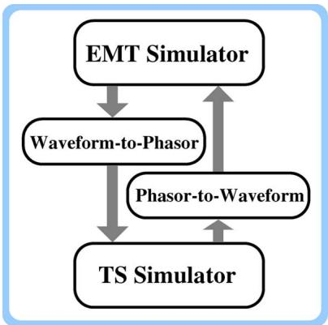  
Fig. 4. Interfacing the EMT and TS programs.

problem of distorted signals at interface buses was to keep the detailed system to a minimum, while exploiting a full frequency dependent Norton equivalent to model the external system. In this way, interfacing complexity as well as computational expense reduced to a minimum, and a more accurate modeling of the detailed system was made possible [37]. In [28], both the expanded detailed system and multifrequency Norton equivalent have been used.

It should be mentioned that there are no restrictions in how to divide the original network into detailed and external subsystems. Any section of power system that needs precise device-level modeling must be assigned as detailed subsystem. Also, it is possible to have several detailed subsystems which have no direct connection to each other [47].

# C. Exchanging Data Between TS and EMT Simulators

There are two important considerations for data exchange in a hybrid simulation. First, which variables need to be transferred between the simulators, and second how two types of data must be interpreted for TS and EMT simulators.

1) Choice of Interface Variables: The interaction of the detailed and external systems is maintained via data interface buses. Parameters that are generally available for measurement include active and reactive power, voltage, current through interface bus, and also phase angle information in the case of using different reference frames [37], [45]. The information transferred from one program to the other must determine the power flow in or out of the interface bus. The appropriate form of power to transfer between the EMT and the TS programs is the fundamental frequency positive sequence power. To obtain this power the fundamental frequency positive sequence voltages and currents are required [37].   
2) Data Conversion: Another major concern in a hybrid simulator is how to pass the interface variables properly between the TS and the EMT programs. As mentioned earlier the TS program is based on the fundamental frequency, positive sequence, phasor-type data, while the EMT program is based on the threephase instantaneous waveform data which includes several frequency components. Thus, to connect these two types of programs two data converter blocks are needed: phasor-to-waveform and waveform-to-phasor. Fig. 4 depicts these conversion blocks.

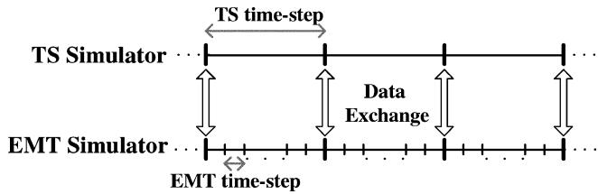  
Fig. 5. Conventional interaction protocol.

The phasor-to-waveform converting block is a signal generator controlled by amplitude, phase, and frequency [41]. The waveform-to-phasor converter uses digital signal processing techniques as curve fitting [37], [43], [52], Fast Fourier Transform (FFT) [41], [47], or digital filtering [53]. The FFT method requires samples of exactly one cycle to correctly produce the phasor quantities. Thus, after the detailed system has recovered from a fault or a large disturbance it takes one complete cycle for the FFT method to compute the right value of phasors. This delay in data preparation causes problems for the TS program. Reference [47] suggests using pre-fault data for a short period immediately after recovering. The one-cycle data requirement restriction does not exist in the curve fitting method; therefore, in comparison with FFT, this method is simpler and has less computational burden [39], [52]. The curve fitting technique can easily extract the fundamental frequency component from harmonics, but this method is not effective in the event of dc offset in the waveforms. This deficiency appears in extracting the fundamental frequency phasor of current waveforms. Instead of directly extracting current it has been proposed to use the bus voltage, which does not contain significant dc offsets, and the impedance of the equivalent circuit under power frequency [10], [35], [43].

It should be noted that the quality of the extracted data at interface buses must be taken into account for determining the domains of study. When the level of distortion is so high that the number of data samples within one cycle is not sufficient for data extraction, the location of interface buses must be moved toward the external system. The quality of extraction is credible if obtained results from the extracted data converge to consistent values [35], [43].

# D. Interaction Protocol Between TS and EMT Simulators

Since the EMT and the TS programs have a different timestep (microsecond versus millisecond), an interaction protocol is required to coordinate the information exchange and update the equivalent circuits in the simulators. For convenience the step-size of the TS simulator is made an integer multiple of that of the EMT simulator, and exchanging of information occurs at common points in time, which conventionally are the TS simulator time steps [38], [43]. Fig. 5 shows the generic interaction protocol between EMT and TS simulators.

Several protocols have been proposed in the literature in which the interfacing sequence can be categorized as serial [9], [28], [36], [37], [39], [44], [45], [47] and parallel [35], [38], [40], [43]. In serial protocols, at each time instant only one of the TS or EMT simulator runs, while the other one is idle.

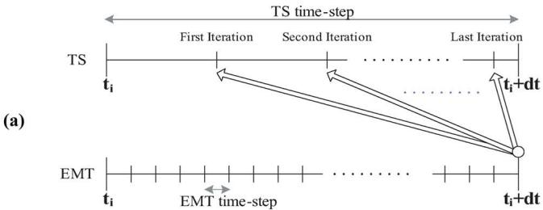

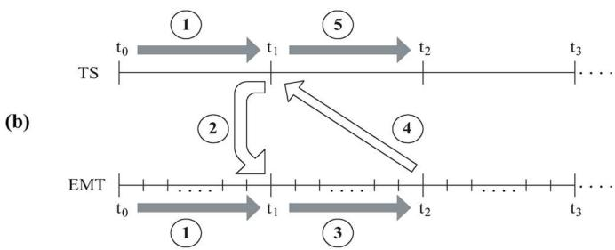

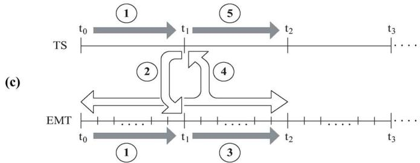

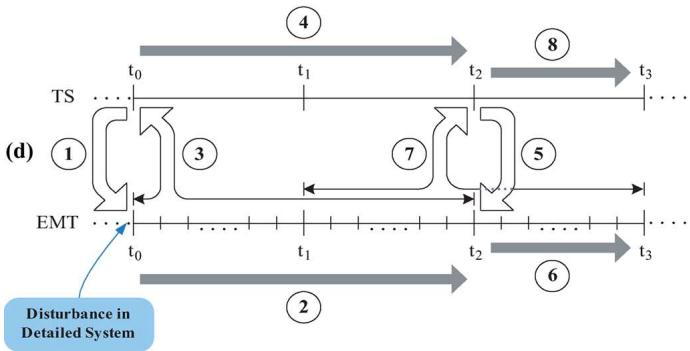  
Fig. 6. Serial protocols: (a) General form; (b) Serial Protocol 1.1; (c) Serial Protocol 1.2; and (d) Serial Protocol 1.3.

In parallel protocols both simulators run simultaneously. The tasks of the interaction protocol include:

• to determine at the present time which simulator must be run;   
• to organize the sequence of data exchange.

In this section, the protocols which have been used in the literature and their sequence of operations will be reviewed.

1) Serial Protocols: As the time-step of the TS program is large, it must rely on iterative methods for accurate computation. First, the bus voltages are predicted, and injection currents from the machines are calculated. Then, the bus voltages are computed and compared with the predicted values, and the process is repeated until convergence. Since the EMT program has such a small time-step, linear approximations are usually accurate enough and iterations are not required except in the presence of nonlinearities. Fig. 6(a) schematically shows the general form of a serial protocol [35], [43], in this figure is the time-step of TS simulator.

Protocol 1.1. [39], [44], [45], [47]: The operation of this protocol is depicted in Fig. 6(b). The sequence of operations is as follows:

1) Both the EMT and TS programs run from $t _ { 0 }$ to $t _ { 1 }$ , arrows .   
2) The equivalent of the external system is obtained at $t _ { 1 }$ and transferred to the EMT simulator, arrow .   
3) Using the obtained equivalent at $t _ { 1 }$ from the TS simulator, the EMT simulator is executed from $t _ { 1 }$ to $t _ { 2 }$ while the TS simulator is idle, arrow .   
4) The equivalent of the detailed system is obtained at $t _ { 2 }$ and transferred to the TS simulator, arrow $\textcircled{4}$ .   
5) Using the equivalent obtained at $t _ { 2 }$ from the EMT simulator, the TS simulator is executed from $t _ { 1 }$ to $t _ { 2 }$ while the EMT simulator is idle, arrow .   
6) Steps 2 to 5 are repeated until termination.

Protocol 1.2. [28], [36], [45]: The operation of this protocol is depicted in Fig. 6(c). The sequence of operations is as follows:

1) The EMT and TS programs run from $t _ { 0 }$ to $t _ { 1 }$ , arrows $\textcircled{1}$ .   
2) The equivalent of the external system is obtained at $t _ { 1 }$ and transferred to the EMT simulator, arrow $\textcircled{2}$ .   
3) Using the equivalent obtained at $t _ { 1 }$ from the TS simulator, the EMT simulator is executed from $t _ { 1 }$ to $t _ { 2 }$ while the TS simulator is idle, arrow .   
4) Using the accumulated EMT data from $t _ { 0 }$ to $t _ { 2 }$ , the equivalent of the detailed system is obtained at $t _ { 2 }$ and transferred to the TS simulator, arrow .   
5) Using the equivalent obtained at $t _ { 2 }$ from the EMT simulator, the TS simulator is executed from $t _ { 1 }$ to $t _ { 2 }$ while the EMT simulator is idle, arrow .   
6) Steps 2 to 5 are repeated until termination.

Protocol 1.3. [37]: The operation of this protocol is depicted in Fig. 6(d). The normal interaction protocol before occurrence of any disturbance is the same as Protocol 1.2. Whenever a disturbance occurs in the detailed system, the EMT program is run for two time steps of the TS program past the disturbance application (arrow $\textcircled{2} )$ . Using the accumulated EMT data from these two time steps, the equivalent of the detailed system is obtained and transferred to the TS simulator (arrow ). The TS program is now run for a period until it has again reached EMT position in time (arrow ). The normal interaction protocol is then followed until a further disturbance.

2) Parallel Protocols: The objective of producing a hybrid simulator is to perform simulation on large-scale networks with TS-like speed and EMT-like accuracy. By exploiting serial protocols the accuracy requirement is satisfied; however, speed of simulation has not been increased as efficiently as possible. This issue originates from the idling period of simulators i.e. at each instant only one simulator runs while the other one is idle, which is clearly not consistent with the objective of developing a highspeed simulation. To overcome this problem, parallel protocols have been proposed [43].

Protocol 2.1. [10], [35], [43]: The operations of this protocol is shown in Fig. 7(a). In the parallel protocol the TS and EMT simulators are never idle. Each TS time-step includes a number of iterations. The first iteration is done with a prediction of the unknown variables in external and detailed systems; however, the second iteration proceeds with an updated prediction which

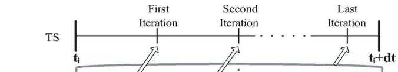  
(a)

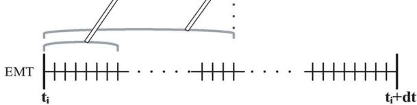  
(b)

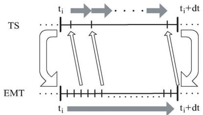

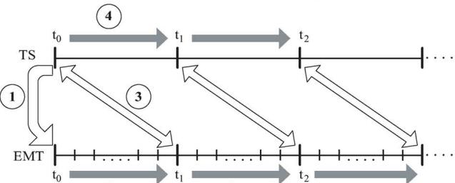  
（C）  
② 4

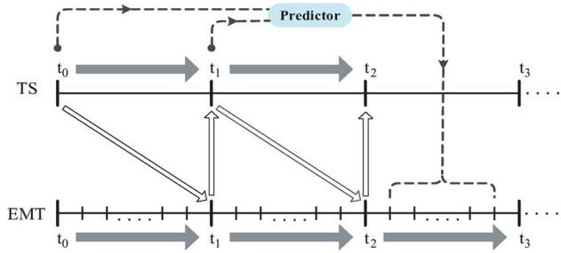  
(d)   
Fig. 7. Parallel protocols: (a) parallel Protocol 2.1; (b) timing diagram of parallel Protocol 2.1; (c) parallel Protocol 2.2; and (d) parallel Protocol 2.3.

is computed based on the EMT program data. In the first iteration, the TS simulator does not have any data to predict the unknown variables, so practically the TS simulator starts after several EMT time-steps, and when the TS simulator completes its last iteration the time left to the end of TS time-step is used to update the equivalent circuit variables. Fig. 7(b) shows this communication diagram schematically [43].

Protocol 2.2. [38]: The operations of this protocol is depicted in Fig. 7(c), and the sequence of operations is as follows.

1) The equivalent of the external system is obtained at $t _ { 0 }$ and transferred to the EMT simulator, arrow .   
2) Using the equivalent obtained at $t _ { 0 }$ from the TS simulator, the EMT simulator is executed from $t _ { 0 }$ to $t _ { 1 }$ , arrow $\textcircled{2}$ .   
3) The TS and the EMT simulators exchange data, arrow $\textcircled{3}$ .   
4) Both the TS and the EMT simulators run concurrently, arrows $\textcircled{4}$ .   
5) Steps 3 and 4 are repeated until termination.

Protocol 2.3. [40]: The operations of this protocol is shown in Fig. 7(d). In this method the previous time-step data is transferred to the EMT simulator from the TS program. Since the TS program time-step is longer than that of the EMT program, the

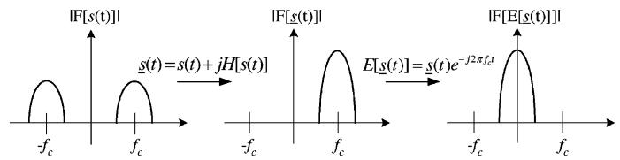  
Fig. 8. Application of Hilbert transform and frequency shift.

EMT program uses the predicted value of TS variables from the past two data sets. The prediction is based on a weighted average value.

# VII. FREQUENCY-ADAPTIVE MODELING AND SIMULATION

Recent research has focused on the integrative modeling of EMT and TS as an alternative interfacing method. Rather than coupling two existing programs, the underlying models are represented based on the concept of Frequency-Adaptive Simulation of Transients (FAST) [54], [55] to cover the application spectrum of typical TS and EMT programs. As explained in the following sections, the method relies on the introduction of the shift frequency as a novel simulation parameter in addition to the time-step size.

# A. Frequency Shifting

On the left of Fig. 8, an ac signal $s ( t )$ with a spectrum that is narrowly concentrated on the carrier frequency $f _ { \mathrm { c } }$ of either 50 Hz or 60 Hz is shown. Such a spectrum is representative of network voltages and currents that are subject to electromechanical transients. The main information of interest is concerned with the envelope waveforms of the ac voltages and currents. To obtain the envelope, the so-called analytic signal $\underline { { s } } ( t )$ [56] is formed by adding to $s ( t )$ an imaginary part that is equal to the Hilbert transform of $s ( t ) \colon \underline { { s } } ( t ) = s ( t ) + \mathrm { j } \mathcal { H } [ s ( t ) ]$ . The effect of the creation of the analytic signal is shown on the middle of Fig. 8. While the spectrum of the real signal $s ( t )$ extends to negative frequencies, this is not the case for the spectrum of the corresponding analytic signal $\underline { { s } } ( t )$ .

The analytic signal can be shifted by the frequency $f _ { \mathrm { s } }$ , which is hereafter referred to as shift frequency, as follows:

$$
\mathcal {S} [ \underline {{s}} (t) ] = \underline {{s}} (t) \mathrm {e} ^ {- \mathrm {j} 2 \pi f _ {\mathrm {s}} t}. \tag {1}
$$

For $f _ { \mathrm { s } } ~ = ~ f _ { \mathrm { c } }$ , the complex envelope is obtained $\begin{array} { r } { \mathcal { E } _ { \underline { { s } } } ( t ) ~ = } \end{array}$ $\underline { { s } } ( t ) \mathrm { e } ^ { - \mathrm { j } 2 \pi f _ { \mathrm { c } } t }$ . Through this operation, the spectrum is shifted by the carrier frequency $f _ { \mathrm { c } }$ as shown on the right of Fig. 8. The complex envelope is a low-pass signal whose maximum frequency is lower than the one of the original bandpass-signal. In accordance with Shannon’s sampling theorem, a larger time-step size can therefore be used for tracking the complex envelope, which is equivalent to a dynamic phasor [57], [58].

# B. Companion Model

As shown in [54], network branches are represented as companion models in simulators of the EMTP type. Companion models are also the building blocks of network models in frequency-adaptive simulation of transients. This is illustrated for an inductance hereafter.

Voltage and current of an inductance are related by $\mathrm { d } _ { \underline { { i } } _ { \mathrm { L } } } ( t ) / \mathrm { d } t = \underline { { v } } _ { \mathrm { L } } ( t ) / L$ . Inserting definition (1) for $\underline { { i } } _ { \mathrm { L } } ( t )$ yields with $\omega _ { \mathrm { s } } = 2 \pi f _ { \mathrm { s } } \mathrm { : }$ :

$$
\frac {\mathrm {d} \left(\mathcal {S} \left[ \dot {i} _ {\mathrm {L}} (t) \right] \mathrm {e} ^ {\mathrm {j} \omega_ {\mathrm {s}} t}\right)}{\mathrm {d} t} = \frac {v _ {\mathrm {L}} (t)}{L} \tag {2}
$$

and the following derivation:

$$
\frac {\mathrm {d} \mathcal {S} [ \dot {i} _ {\mathrm {L}} (t) ]}{\mathrm {d} t} = \mathrm {e} ^ {- \mathrm {j} \omega_ {\mathrm {s}} t} \left(- \mathrm {j} \omega_ {\mathrm {s}} \dot {i} _ {\mathrm {L}} (t) + \frac {\nu_ {\mathrm {L}} (t)}{L}\right). \tag {3}
$$

Trapezoidal integration can be used to transform (3) into a difference equation

$$
\begin{array}{l} \frac {\mathcal {S} \left[ \underline {{i}} _ {\mathrm {L}} (k) \right] - \mathcal {S} \left[ \underline {{i}} _ {\mathrm {L}} (k - 1) \right]}{\tau} \\ = \frac {\mathrm {e} ^ {- \mathrm {j} \omega_ {\mathrm {s}} k \tau}}{2} \left(- \mathrm {j} \omega_ {\mathrm {s}} \left(\underline {{\dot {\imath}}} _ {\mathrm {L}} (k) + \underline {{\dot {\imath}}} _ {\mathrm {L}} (k - 1) \mathrm {e} ^ {\mathrm {j} \omega_ {\mathrm {s}} \tau}\right) \right. \\ \left. + \frac {v _ {\mathrm {L}} (k) + v _ {\mathrm {L}} (k - 1) \mathrm {e} ^ {\mathrm {j} \omega_ {\mathrm {s}} \tau}}{L}\right). \tag {4} \\ \end{array}
$$

The difference term on the left of (4) is expressed in terms of the complex shifted waveform. For $f _ { \mathrm { s } } = f _ { \mathrm { c } }$ , the complex shifted waveform equals the complex envelope. Its Fourier spectrum has a lower maximum frequency compared with the Fourier spectrum of the analytic signal. Consequently, a larger time step size can be used to track the waveform in simulation. This in turn leads to a smaller computational effort.

Backsubstitution of analytic signals and the gathering of like terms in (4) gives

$$
\underline {{G}} _ {\mathrm {L}} \underline {{v}} _ {\mathrm {L}} (k) = \underline {{i}} _ {\mathrm {L}} (k) - \underline {{j}} _ {\mathrm {L}} (k) \tag {5}
$$

with

$$
\underline {{G}} _ {\mathrm {L}} = \frac {\tau}{2 L \left(1 + \mathrm {j} \omega_ {\mathrm {s}} \frac {\tau}{2}\right)} \tag {6}
$$

$$
\begin{array}{l} \underline {{j}} _ {\mathrm {L}} (k) = \mathrm {e} ^ {\mathrm {j} \omega_ {\mathrm {s}} \tau} \left(\frac {1 - \mathrm {j} \omega_ {\mathrm {s}} \frac {\tau}{2}}{1 + \mathrm {j} \omega_ {\mathrm {s}} \frac {\tau}{2}} \underline {{i}} _ {\mathrm {L}} (k - 1) \right. \\ \left. + \frac {\tau}{2 L \left(1 + \mathrm {j} \omega_ {\mathrm {s}} \frac {\tau}{2}\right)} \underline {{v}} _ {\mathrm {L}} (k - 1)\right). \tag {7} \\ \end{array}
$$

Now complex quantities appear with the shift frequency as simulation parameter. As discussed by means of Fig. 8, the envelopes of the waveforms can be represented efficiently for $f _ { \mathrm { s } } = f _ { \mathrm { c } }$ . For $f _ { \mathrm { s } } = 0$ , $\underline { { G } } _ { \mathrm { L } }$ reduces to a conductance, and the model is then suitable for tracking the instantaneous values of natural waveforms.

# VIII. CONCLUSION

Transient studies in power systems need both accuracy and speed. In the neighborhood of the transient event location accurate results are needed whereas the rest of the network further removed from the event only requires to be simulated as fast as possible. Hybrid simulators have been developed to meet these needs simultaneously. The main purpose of this paper is to aggregate various ideas and methods proposed in literature for different steps of generating a hybrid simulator. It is demonstrated

that both of TS and EMT simulators have limitations which can be overcome by creating a hybrid simulators. Issues related to hybrid simulators have been classified in four categories: partitioning the original system, building equivalents for each part, exchanging data, and interfacing of the two simulators. In general, the system is split into detailed and external subsystems. Detailed system is the zone of EMT simulation, while the external system is handled by the TS simulator. Equivalent models of each subsystem must be used in order to introduce each subsystem to the other. The format of data in EMT and TS simulators is different (time domain versus phasors). To exchange data provided by each simulator it is required to extract and convert the data into suitable form. Furthermore, since the simulation time-step of EMT and TS simulators are significantly different (microseconds versus milliseconds), there must be a interaction protocol to organize the interfacing of simulators. An integrated EMT-TS simulation is also possible using the concept of Hilbert transform and frequency shifting.

# APPENDIX EMT AND TS ANALYSIS

# A. TS Solution

The mathematical description of transient stability analysis in an interconnected power network consists of a set of first order nonlinear differential equations and a set of nonlinear algebraic equations

$$
X ^ {\prime} = f (X, V) \tag {8}
$$

$$
I (X, V) - Y (X) \times V = 0. \tag {9}
$$

Differential equations model dynamics of the rotating machines and algebraic equations represent the transmission system, loads, and the connected network [26]. In (8) and (9), vector corresponds to the generator state variables describing the dynamics of the system, and vectors and are bus voltages and injected currents, respectively.

To solve these equations two different types of solution methods have been developed: partitioned-solution approach, and simultaneous-solution approach. In the first approach at every time-step the set of differential equations (8) is separately solved by an integration method (e.g. fourth-order Runge-Kutta) for , and the algebraic set (9) is solved separately for . Then these two solutions exchange data, and iterations are used to proceed until convergence is achieved.

In the second approach, an implicit integration method (e.g., Trapezoidal rule) convert the set of nonlinear differential equations to a set of nonlinear algebraic equations. Then, this new algebraic set and the existing algebraic set (9) are lumped together, and build a single larger nonlinear algebraic equation set. Thus, all variables are solved concurrently. An iterative method, such as Newton-Raphson, is used for solving the nonlinear algebraic equations.

Discretizing (8) at time by using the Trapezoidal rule yields [59]

$$
\begin{array}{l} F _ {1} = (X _ {t} - X _ {t - 1}) - \frac {h}{2} \left(f (X _ {t}, V _ {t}) + f (X _ {t - 1}, V _ {t - 1})\right) = 0, \\ F _ {2} = I \left(X _ {t}, V _ {t}\right) - Y \left(X _ {t}\right) \times V _ {t} = 0 \tag {10} \\ \end{array}
$$

where $t = 1 , 2 , . . . , T$ denotes time instants, and is the integration step length (time-step). Using the Newton-Raphson method for (10) yields, [60]

$$
\left[ \begin{array}{l} F _ {1} \\ F _ {2} \end{array} \right] = - \left[ \begin{array}{l l} J _ {1} & J _ {2} \\ J _ {3} & J _ {4} \end{array} \right] \left[ \begin{array}{l} \Delta X \\ \Delta V \end{array} \right] \tag {11}
$$

where $J _ { 1 }$ to $J _ { 4 }$ are the coefficient sub-matrices and are computed as follows:

$$
J _ {1} = \frac {\partial F _ {1}}{\partial X}, J _ {2} = \frac {\partial F _ {1}}{\partial V}, J _ {3} = \frac {\partial F _ {2}}{\partial X}, J _ {4} = \frac {\partial F _ {2}}{\partial V}. \tag {12}
$$

Defining

$$
J _ {N} = J _ {4} - J _ {3} J _ {1} ^ {- 1} J _ {2} \tag {13}
$$

from the first row of (11) we have

$$
F _ {1} + J _ {2} \Delta V = - J _ {1} \Delta X.
$$

Therefore

$$
\Delta X = - J _ {1} ^ {- 1} \left(F _ {1} + J _ {2} \Delta V\right). \tag {14}
$$

From the second row of (11) we have

$$
F _ {2} = - J _ {3} \Delta X - J _ {4} \Delta V. \tag {15}
$$

Substituting $\Delta X$ from (14) in (15) and using (13), yields

$$
F _ {2} - J _ {3} J _ {1} ^ {- 1} F _ {1} = - J _ {N} \Delta V. \tag {16}
$$

Let us define $\hat { F } _ { 1 }$ and $\hat { F } _ { 1 }$ as

$$
\hat {F} _ {1} = F _ {1} + J _ {2} \Delta V,
$$

$$
\hat {F} _ {2} = F _ {2} - J _ {3} J _ {1} ^ {- 1} F _ {1}. \tag {17}
$$

Thus, from (14), (16), and (17) we can express $\Delta X$ and $\Delta V$ as

$$
\hat {F} _ {2} = - J _ {N} \Delta V,
$$

$$
\Delta X = - J _ {1} ^ {- 1} \hat {F} _ {1}. \tag {18}
$$

Equation (18) can be solved iteratively to update $V$ and $X$ at each time-step.

# B. EMT Solution

Traditionally, in EMT studies each element in the network is replaced by an equivalent circuit consisting of conductances and current sources. References [4] and [29]–[31] include comprehensive discussions about modeling of different types of power system elements for EMT simulations. The next step for EMT computation is to establish the nodal equations for the substituted network as shown in (19)

$$
[ G ] [ v (t) ] = [ i (t) ] - [ I ] \tag {19}
$$

where $\left[ G \right]$ is the nodal conductance matrix, $[ v ( t ) ]$ is the node voltage vector, $[ i ( t ) ]$ is the injected current source vector and, is the known history current vector.

The elements of and in (19) directly depend on the components in the power system (e.g., inductance, capacitance,

transmission lines, etc.) and the numerical method (e.g., Trapezoidal rule) chosen for discretization of differential equations which describe the behavior of the elements. When nonlinearities are present, a local iterative process is needed. Additionally, if switching operations are considered in the network, the conductance matrix should be modified accordingly. In (19) there exist a set of nodes with unknown voltages (we call it set 1), and the other set of nodes with known voltages (set 2). By considering of this notation, we partition (19) as [30]

$$
\left[ \begin{array}{l l} {[ G _ {1 1} ]} & {[ G _ {1 2} ]} \\ {[ G _ {2 1} ]} & {[ G _ {2 2} ]} \end{array} \right] \left[ \begin{array}{l} {[ v _ {1} (t) ]} \\ {[ v _ {2} (t) ]} \end{array} \right] = \left[ \begin{array}{l} {[ i _ {1} (t) ]} \\ {[ i _ {2} (t) ]} \end{array} \right] - \left[ \begin{array}{l} {[ I _ {1} ]} \\ {[ I _ {2} ]} \end{array} \right]. \quad (2 0)
$$

The unknown vector $[ v _ { 1 } ( t ) ]$ is then computed by solving (21)

$$
\left[ G _ {1 1} \right] \left[ v _ {1} (t) \right] = \left(\left[ i _ {1} (t) \right] - \left[ I _ {1} \right]\right) - \left[ G _ {1 2} \right] \left[ v _ {2} (t) \right]. \qquad (2 1)
$$

# REFERENCES

[1] IEEE/CIGRE Joint Task Force on Stability Terms and Definitions, “Definition and classification of power system stability,” IEEE Trans. Power Syst., vol. 19, no. 2, pp. 1387–1401, May 2004.   
[2] H. W. Dommel, “Techniques for analyzing electromagnetic transients,” IEEE Comput. Appl. Power, vol. 10, no. 3, pp. 18–21, Jul. 1997.   
[3] IEEE Guide for Synchronous Generator Modeling Practices and Applications in Power System Stability Analyses, IEEE Std. 1110-2002, IEEE Power Eng. Soc., Nov. 2003, pp. 1-81.   
[4] H. W. Dommel, Electromagnetic Transients Program Reference Manual (EMTP Theory Book). Portland, OR: Bonneville Power Admin., 1986.   
[5] D. Jakominich, R. Krebs, D. Retzmann, and A. Kumar, “Real-time digital power system simulator design considerations and relay performance evaluation,” IEEE Trans. Power Del., vol. 14, no. 3, pp. 773–781, Jul. 1999.   
[6] J. R. Marti and L. R. Linares, “Real-time EMTP-based transients simulation,” IEEE Trans. Power Syst., vol. 9, no. 3, pp. 1309–1317, Aug. 1994.   
[7] D. M. Falcao, E. Kaszkurewicz, and H. L. S. Almeida, “Application of parallel processing techniques to the simulation of power system electromagnetic transients,” IEEE Trans. Power Syst., vol. 8, no. 1, pp. 90–96, Feb. 1993.   
[8] A. S. Morched and V. Brandwajn, “Transmission network equivalents for electromagnetic transients studies,” IEEE Trans. Power App. Syst., vol. PAS-102, no. 9, pp. 2984–2994, Sep. 1983.   
[9] M. D. Heffernan, K. S. Turner, J. Arrillaga, and C. P. Arnold, “Computation of A.C.-D.C. system disturbances: Part I, II, and III,” IEEE Trans. Power App. Syst., vol. PAS-100, no. 11, pp. 4341–4363, Nov. 1981.   
[10] H. T. Su, L. A. Snider, T. S. Chung, and D. Z. Fang, “Recent advancements in electromagnetic and electromechanical hybrid simulation,” in Proc. Int. Conf. Power Syst. Technology, Singapore, Nov. 2004, pp. 1479–1484.   
[11] The Authoritative Dictionary of IEEE Standards Terms Seventh Edition, IEEE Std. 100, 2000.   
[12] E. W. Kimbark, Power System Stability. New York: Wiley, 1948, vol. 1.   
[13] M. Pavella and P. G. Murthy, Transient Stability of Power Systems: Theory and Practice. New York: Wiley, 1994.   
[14] P. M. Anderson and A. A. Fouad, Power System Control and Stability. Ames, IA: Iowa State Univ. Press, 1977.   
[15] P. Kundur, Power System Stability and Control. New York: McGraw-Hill, 1994.   
[16] A. A. Fouad and V. Vittal, Power System Transient Stability Analysis Using the Transient Energy Function Method. Englewood Cliffs, NJ: Prentice-Hall, 1992.   
[17] W. D. Humpage and K. P. Wong, “Electromagnetic transient analysis in EHV power networks,” Proc. IEEE, vol. 70, no. 4, pp. 379–402, Apr. 1982.   
[18] G. Kron, “Tensorial analysis of integrated transmission systems,” AIEE Trans., vol. 71, no. 1952, pp. 814–821.   
[19] F. M. A. Salam, L. Ni, S. Guo, and X. Sun, “Parallel processing for the load flow of power systems: The approach and applications,” in Proc. IEEE 28th Conf. Decision and Control, Dec. 1989, vol. 3, pp. 2173–2178.

[20] IEEE task force report by the computer and analytical method subcommittee of the power systems engineering committee, “Parallel processing in power systems computation,” IEEE Trans. Power Syst., vol. 7, no. 2, pp. 629–638, May 1992.   
[21] C. Yue, X. Zhou, and R. Li, “Node-splitting approach used for network partition and parallel processing in electromagnetic transient simulation,” in Proc. Int. Conf. Power Syst. Technology, Singapore, Nov. 2004, pp. 425–430.   
[22] C. Lemaitre and B. Thomas, “Two application of parallel processing in power system computation,” IEEE Trans. Power Syst., vol. 11, no. 1, pp. 246–253, Feb. 1996.   
[23] R. H. Chen, O. P. Malik, G. S. Hope, and R. Wheatley, “Parallel processing for power system security assessment with open system techniques,” in Proc. IEEE Conf. Communications, Computers and Power in the Modern Environment, May 1993, pp. 330–336.   
[24] M. La Scala, G. Sblendorio, A. Bose, and J. Q. Wu, “Comparison of algorithms for transient stability simulations on shared and distributed memory multiprocessor,” IEEE Trans. Power Syst., vol. 11, no. 4, pp. 2045–2050, Nov. 1996.   
[25] M. L. Crow and M. Ilic, “The parallel implementation of the waveform relaxation method for transient stability simulations,” IEEE Trans. Power Syst., vol. 5, no. 3, pp. 922–932, Aug. 1990.   
[26] B. Stott, “Power system dynamic response calculations,” Proc. IEEE, vol. 67, no. 2, pp. 219–241, Feb. 1979.   
[27] P. M. Anderson, B. L. Agrawal, and J. E. Van Ness, Subsynchronous Resonance in Power Systems. New York: IEEE Press, 1990.   
[28] M. Sultan, J. Reeve, and R. Adapa, “Combined transient and dynamic analysis of HVDC and FACTS systems,” IEEE Trans. Power Del., vol. 13, no. 4, pp. 1271–1277, Oct. 1998.   
[29] W. S. Meyer and H. W. Dommel, “Numerical modelling of frequency-dependent transmission-line parameters in an electromagnetic transients program,” IEEE Trans. Power App. Syst., vol. PAS-90, no. 6, pp. 2561–2567, Nov. 1971.   
[30] H. W. Dommel, “Digital computer solution of electromagnetic transients in single-and multiphase networks,” IEEE Trans. Power App. Syst., vol. PAS-88, no. 4, pp. 388–399, Apr. 1969.   
[31] H. W. Dommel and W. S. Meyer, “Computation of electromagnetic transients,” Proc. IEEE, vol. 62, no. 7, pp. 983–993, Apr. 1974.   
[32] CIGRE Working Group 33.02, “Guidelines for representation of network elements when calculating transients,” Tech. Broch. 39, 1990.   
[33] A. M. Gole, J. A. Martinez-Velasco, and A. J. F. Keri, Eds., “Modeling and analysis of system transients using digital programs,” IEEE Power Eng. Soc. Special Pub. TP-133-0, 1999.   
[34] A. Semlyen and F. Leon, “Computation of electro-magnetic transients using dual or multiple time steps,” IEEE Trans. Power Syst., vol. 8, no. 3, pp. 1274–1281, Aug. 1993.   
[35] H. T. Su, K. W. Chan, and L. A. Snider, “Parallel interaction protocol for electromagnetic and electromechanical hybrid simulation,” Proc. Inst. Elect. Eng., vol. 152, no. 3, pp. 406–414, May 2005.   
[36] J. Reeve and R. Adapa, “A new approach to dynamic analysis of ac networks incorporating detailed modeling of dc systems. Part I and II,” IEEE Trans. Power Del., vol. 3, no. 4, pp. 2005–2019, Oct. 1988.   
[37] G. W. Anderson, N. R. Watson, C. P. Arnold, and J. Arrillaga, “A new hybrid algorithm for analysis of HVDC and FACTS systems,” in Proc. IEEE Int. Conf. Energy Management and Power Delivery, Nov. 1995, vol. 2, pp. 462–467.   
[38] T. Fang, Y. Chengyan, W. Zhongxi, and Z. Xiaoxin, “Realization of electromechanical transient and electromagnetic transient real time hybrid simulation in power system,” in Proc. IEEE Power Eng. Soc. Transmission and Distribution Conf. Exhibit.: Asia and Pacific, 2005, pp. 1–6.   
[39] W. Liwei, D. Z. Fang, and T. S. Chung, “New techniques for enhancing accuracy of EMTP/TSP hybrid simulation algorithm,” in Proc. IEEE Int. Conf. Electric Utility Deregulation, Restructuring and Power Technologies, Apr. 2004, vol. 2, pp. 734–739.   
[40] H. Inabe, T. Futada, H. Horii, and K. Inomae, “Development of an instantaneous and phasor analysis combined type real-time digital power system simulator,” in Proc. Int. Conf. Power Syst. Transients, New Orleans, LA, 2003, pp. 1–6, IPST.

[41] B. Kasztenny and M. Kezunovic, “A method for linking different modeling techniques for accurate and efficient simulation,” IEEE Trans. Power Syst., vol. 15, no. 1, pp. 65–72, Feb. 2000.   
[42] K. K. W. Chan and L. A. Snider, “Electromagnetic electromechanical hybrid real-time digital simulator for the study and control of large power systems,” in Proc. Int. Conf. Power Syst. Technology, Dec. 2000, vol. 2, pp. 783–788.   
[43] H. Su, K. W. Chan, L. A. Snider, and J. C. Soumagne, “Advancement on the integration of electromagnetic transients simulator and transient stability simulator,” in Proc. Int. Conf. Power Syst. Transients, Montreal, QC, Canada, Jun. 2005, no. IPST05-238, pp. 1–6.   
[44] H. Su, K. K. W. Chan, and L. A. Snider, “Interfacing an electromagnetic SVC model into the transient stability simulation,” in Proc. Int. Conf. Power Syst. Technology, Oct. 2002, vol. 3, pp. 1568–1572.   
[45] H. Su, L. A. Snider, K. W. Chan, and B. Zhou, “A new approach for integration of two distinct types of numerical simulator,” in Proc. Int. Conf. Power Syst. Transients, New Orleans, LA, 2003, pp. 1–6.   
[46] B. Gustavsen and A. Semlyen, “Rational approximation of frequency domain responses by vector fitting,” IEEE Trans. Power Del., vol. 14, no. 3, pp. 1052–1061, Jul. 1999.   
[47] X. Wang, P. Wilson, and D. Woodford, “Interfacing transient stability program to EMTDC program,” in Proc. IEEE Int. Conf. Power Syst. Technology, Oct. 2002, vol. 2, pp. 1264–1269.   
[48] A. Semlyen and M. R. Iravani, “Frequency domain modeling of external systems in an electro-magnetic transients program,” IEEE Trans. Power Syst., vol. 8, no. 2, pp. 527–533, May 1993.   
[49] A. Abur and H. Singh, “Time domain modeling of external systems for electromagnetic transients programs,” IEEE Trans. Power Syst., vol. 8, no. 2, pp. 671–672, May 1993.   
[50] H. Singh and A. Abur, “Multi-port equivalencing of external systems for simulation of switching transients,” IEEE Trans. Power Del., vol. 10, no. 1, pp. 374–382, Jan. 1995.   
[51] W. C. Boaventura, A. Semlyen, M. R. Iravani, and A. Lopes, “Robust sparse network equivalent for large systems: Part I and II,” IEEE Trans. Power Syst., vol. 19, no. 1, pp. 157–163, 293–299, Feb. 2004.   
[52] H. T. Su, K. W. Chan, and L. A. Snider, “Investigation of the use of electromagnetic transient models for transient stability simulation,” in Proc. 6th Int. Conf. Advances in Power Syst. Control, Operation and Management, Hong Kong, China, Nov. 2003, pp. 787–792.   
[53] S. M. Wong, K. M. Sze, L. A. Snider, K. W. Chan, and C. Larose, “Overcoming the difficulties associated with interfacing different simulation programs,” in Proc. 6th Int. Conf. Advances in Power Syst. Control, Operation and Management, Hong Kong, China, Nov. 2003, pp. 403–408.   
[54] R. Shintaku and K. Strunz, “Branch companion modeling for diverse simulation of electromagnetic and electromechanical transients,” presented at the 6th Int. Conf. Power Syst. Transients (IPST), Montreal, QC, Canada, Jun. 2005.   
[55] K. Strunz, R. Shintaku, and F. Gao, “Frequency-adaptive network modeling for integrative simulation of natural and envelope waveforms in power systems and circuits,” IEEE Trans. Circuits Syst., vol. 53, no. 12, pp. 2788–2803, Dec. 2006.   
[56] S. K. Mitra, Digital Signal Processing: A Computer-Based Approach. New York: McGraw-Hill, 2001.   
[57] S. Henschel, A. I. Ibrahim, and H. W. Dommel, “Transmission line model for variable step size simulation algorithms,” Int. J. Elect. Power Energy Syst., vol. 21, no. 3, pp. 191–198, Mar. 1999.   
[58] M. Ilic´ and J. Zaborszky, Dynamics and Control of Large Electric Power Systems. New York: Wiley, 2000.   
[59] J. S. Chai, N. Zhu, A. Bose, and D. J. Tylavsky, “Parallel Newton methods for power system stability analysis using local and shared memory multiprocessors,” IEEE Trans. Power Syst., vol. 6, no. 4, pp. 1539–1545, Nov. 1991.   
[60] J. Q. Wu, A. Bose, J. A. Huang, A. Valette, and F. Lafrance, “Parallel implementation of power system transient stability analysis,” IEEE Trans. Power Syst., vol. 10, no. 3, pp. 1226–1233, Aug. 1995.