# Modeling of a Modular Multilevel Converter With Embedded Energy Storage for Electromagnetic Transient Simulations

Nuwan Herath , Student Member, IEEE, Shaahin Filizadeh , Senior Member, IEEE, and Mohammad Sedigh Toulabi , Senior Member, IEEE

Abstract—This paper proposes a detailed equivalent model for electromagnetic transient simulation of a modular multilevel converter with embedded battery energy storage in its submodules. The model offers an accuracy identical to that of a detailed switching model (DSM), while it markedly reduces the computational complexity of simulations. This is achieved by modeling each multivalve as a Thevenin equivalent considering the full dynamics of each constituent submodule, which results in a significant reduction in the number of switchable nodes in the converter model and hence the dimensions of the system’s admittance matrix. The paper presents the mathematical development of the model and validates it against detailed switching models through several case studies. Experimental results from a scaled-down laboratory setup are also presented for further verification.

Index Terms—Battery energy storage system (BESS), detailed equivalent model (DEM), electromagnetic transients (EMT) simulation, modular multilevel converter (MMC).

# I. INTRODUCTION

B ATTERY energy storage systems (BESS) have attracted agreat deal of interest in the context of modern power sys- great deal of interest in the context of modern power systems, particularly in conjunction with the increasing penetration of renewables [1], [2]. Conventional BESS topologies comprise battery banks made with long strings of batteries, which are then connected in parallel. A DC-DC converter boosts up the battery bank voltage and maintains the common DC link voltage. Power conversion between the DC and AC sides is achieved using twoor three-level voltage source converters (VSC) [3] as shown in Fig. 1. This configuration does not provide high reliability (due to its non-modular nature) and does not readily facilitate usage of battery units that may be of different chemistries or at

Manuscript received March 20, 2019; revised June 28, 2019; accepted August 22, 2019. Date of publication August 25, 2019; date of current version November 21, 2019. This work was supported in part by Natural Sciences and Engineering Research Council (NSERC) of Canada, in part by Manitoba Hydro, in part by the MITACS Accelerate Internship Program, and in part by the University of Manitoba. Paper no. TEC-00257-2019. (Corresponding author: Shaahin Filizadeh.)

N. Herath and S. Filizadeh are with the Department of Electrical and Computer Engineering, University of Manitoba, Winnipeg, MB R3T 5V6, Canada (e-mail: heratnmh@myumanitoba.ca; shaahin.filizadeh@umanitoba.ca).

M. S. Toulabi is with the Fiat Chrysler Automobiles (FCA) US LLC, Auburn Hills, MI 48326 USA (e-mail: toulabi@ieee.org).

Color versions of one or more of the figures in this article are available online at http://ieeexplore.ieee.org.

Digital Object Identifier 10.1109/TEC.2019.2937761

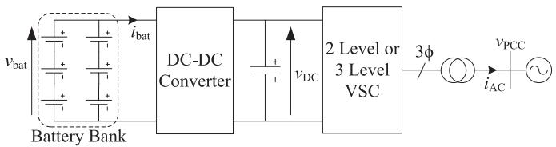  
Fig. 1. Conventional BESS.

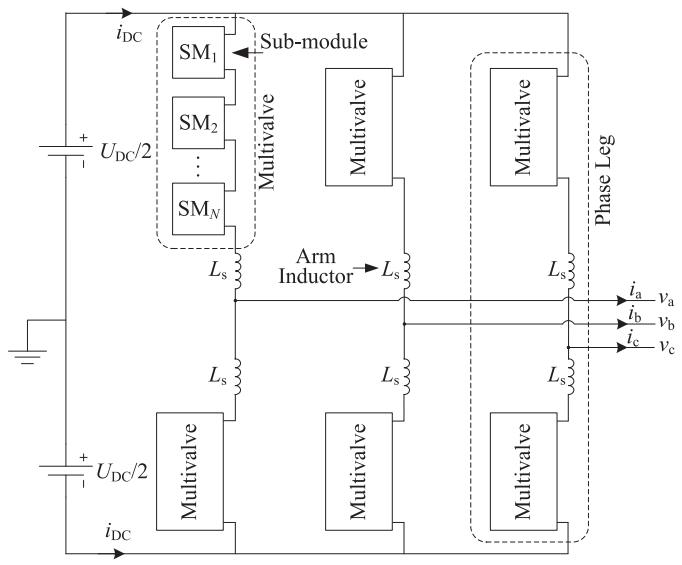  
Fig. 2. MMC structure.

different stages of life-cycle. Additionally, the grid-side two- or three-level VSC exhibits high losses and harmonic contents.

An alternative BESS topology, based upon a modular multilevel converter (MMC) [4] is shown in Fig. 2. The converter consists of specialized sub-modules connected in series (SMs) in each converter arm (Fig. 3). Each SM consists of a small battery unit that is interfaced to the submodule capacitor using a bidirectional DC-DC converter [5]–[7]. The submodule capacitor may be inserted into or bypassed from the conduction path using the controlled switches Q3 and Q4. This topology benefits from the well-known qualities of an MMC including lower harmonics and losses, and integrates battery units for improved reliability via modularity.

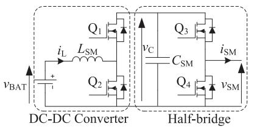  
Fig. 3. Topology of a SM with battery energy storage.

In this topology, each DC-DC converter can be used to control its SM capacitor voltage as well as the power flow to and from the SM battery [5], [6]. The work in [8] shows that dynamic power flow control can be achieved within this converter’s branches. Capabilities of an MMC with both regular SMs and SMs with energy storage are investigated in [7].

Significant hurdles exist on the way of computer simulation of an MMC with embedded energy storage using an electromagnetic transient (EMT) simulator. In EMT simulations the electrical circuit is represented as a network of admittances and current sources that represent each circuit element, and solved for node voltages at each time step. This process requires re-inversion of the network’s admittance matrix every time a switching event occurs [9]. The topological complexity and the large number of switching elements of an MMC with energy storage makes the admittance matrix large; high frequency operation of the DC-DC converters causes the admittance matrix to change very frequently. Therefore, EMT simulation of an MMC with energy storage SMs involves large admittance matrices that have to be reinverted at a high frequency, thereby causing a massive computational burden.

In this paper a detailed equivalent model (DEM) for an MMC multivalve with embedded energy storage is developed. A detailed equivalent model [10] is a computationally affordable replacement for a conventional detailed switching model (DSM), which is normally built by using individual switching elements to create SM circuits that are then replicated to create the entire converter’s model. With a DEM the number of electrical nodes is reduced greatly without loss of accuracy. In a DEM each multivalve is modeled as a Thevenin equivalent with a unique time-varying Thevenin voltage and Thevenin resistance. This paper further presents the converter operation, model development, and model validation against detailed EMT simulations, as well as against an experimental prototype setup. The developed model is shown to retain simulation accuracy identical to that of a detailed switching model while reducing the computational intensity of the simulation by several orders of magnitude.

# II. OVERVIEW OF THE CONVERTER’S OPERATION

A brief overview of the operation and control of an MMC with embedded storage is provided in this section. Additional details may be found in [11].

# A. AC-Side Operation and Control

Consider the MMC’s operation in the real-power and ac terminal voltage (PV) control mode. A sinusoidal reference

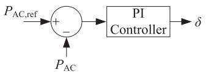  
(a）

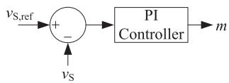  
(b）  
Fig. 4. Direct controllers (a) AC power controller (b) AC voltage controller.

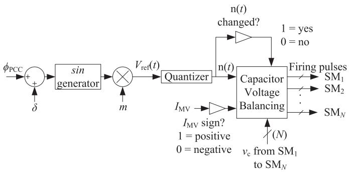  
Fig. 5. NLC firing pulse generation.

waveform $( V _ { \mathrm { r e f } } ( t ) )$ with a modulation index (m) and a phase difference (δ) relative to the point of common coupling (PCC) is generated using the outputs of a power $( P _ { \mathrm { A C } } )$ and an AC voltage $( \nu _ { \mathrm { { S } } } )$ controller as shown in Fig. 4. $P _ { \mathrm { A C , r e f } }$ and $\nu _ { \mathrm { S , r e f } }$ are the active power and AC voltage references. Direct (as shown) or decoupled controls may be used. The SMs may be inserted or bypassed within a multivalve using different techniques depending on $V _ { \mathrm { r e f } } ( t )$ [12]. Fig. 5 shows the firing pulse generation scheme for the multivalve using nearest level control (NLC) [13]. In Fig. $5 I _ { \mathrm { M V } }$ is the current entering the multivalve and φPCC is the phase angle at PCC. The sorting method described in [14] is used for rotating submodule capacitors for voltage regulation.

# B. Operation of the Submodule DC-DC Converters

A DC-DC converter interconnects each battery unit to the SM capacitor. Normally the battery operates at a lower voltage than the SM capacitor; therefore, to discharge the battery, the DC-DC converter operates as a boost converter while for charging it operates as a buck converter. The DC-DC converter essentially controls the SM capacitor voltage (vC). A standard control diagram for a submodule DC-DC converter in boost mode is shown in Fig. 6, in which the outer-loop voltage controller is augmented with an internal current controller. Limits are applied to the current controller to maintain the current drawn from the battery within pre-specified safe operating limits. The current reference in Fig. 6 has an additional $P _ { \mathrm { S M , r e f } } / \nu _ { \mathrm { B A T } }$ term, where $P _ { \mathrm { S M , r e f } }$ is the DC power required from the DC-DC converter and $\nu _ { \mathrm { B A T } }$ is the battery voltage. This term enables the controller to control the individual discharge power levels of the DC-DC converters.

# C. State-of-Charge (SOC) Balancing Controllers

For batteries distributed among SMs, care must be exercised to discharge the batteries equally. To achieve this, SOC balancing

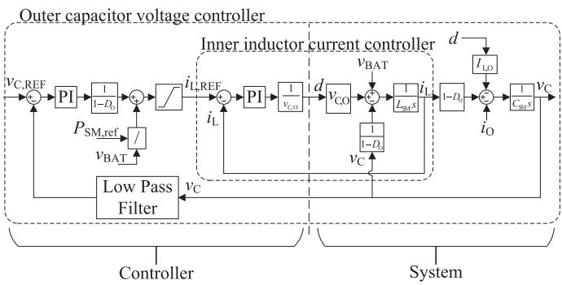  
Fig. 6. Submodule DC-DC converter voltage controller.

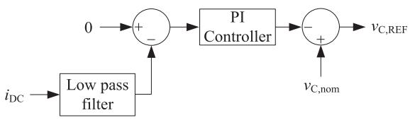  
Fig. 7. DC power suppression controller.

controllers based upon the method described in [6] are deployed. Firstly, the average SOC of the batteries in each arm is calculated. The average SOC of each phase and that of the entire MMC are then calculated. The phase SOC-balancing controller aims to match the phase SOC to the average SOC of the MMC by changing the power command to each phase. The arm SOCbalancing controller then matches the arm SOC to the respective average phase SOC. Finally, a SM-level SOC controller matches the SM SOC to the average arm SOC.

# D. DC Power Suppression Controller

In a standalone BESS where no independent DC network supports the DC voltage $( U _ { \mathrm { D C } } )$ of the MMC, a DC power suppression controller is used to ensure that no net power is exchanged with the DC side during steady state operation. Fig. 7 shows this controller. It works by changing the SM capacitor voltage reference $( \nu _ { \mathrm { C } , \mathrm { R E F } } )$ around its nominal value $( \nu _ { \mathrm { C , n o m } } )$ until power exchange with the DC link is eliminated.

# III. MODELING THE MMC WITH EMBEDDED STORAGE

MMC-based battery energy storage systems are mostly applicable to low- and medium-voltage systems, wherein the number of SMs in a multivalve is as not as large as in an HVDC application. Nonetheless, the complexity of EMT simulation of this type of MMC is not negligible. EMT simulation programs normally use an admittance matrix formulation (nodal analysis and variations thereof) as shown in (1), where Y is the circuit’s admittance matrix, V is the node voltages vector, and J is the current injections vector that comprises intrinsic sources and history current terms arising from companion component models [9]. Node voltages are obtained using (2). In general, the admittance matrix is a function of time and varies with every

switching action, thus requiring re-inversion, which is computationally expensive for large matrices and when inversion occurs frequently.

$$
\mathbf {Y V} = \mathbf {J} \tag {1}
$$

$$
\mathbf {V} = \mathbf {Y} ^ {- 1} \mathbf {J} \tag {2}
$$

Even with a moderate number of submodules with embedded DC-DC converters, an energy storage MMC contributes a large number of switchable nodes to the admittance matrix of the circuit. The high switching frequency of DC-DC converters (typically in the kHz range) causes frequent changes in the circuit topology and hence in the admittance matrix.

To remedy this, the size of the admittance matrix may be reduced using a Thevenin equivalent to represent the entire multivalve without losing any information compared with a detailed switching formulation. The result is a detailed equivalent model with high accuracy and much reduced computational intensity. The development of this detailed equivalent mode is described next.

# A. Development of the DEM of the Multivalve With Embedded Storage

Consider the SM with embedded energy storage shown in Fig. 3. The SM inductor and capacitor are replaced with their respective discretized companion models based upon Dommel’s approach [9] and trapezoidal integration method as shown in (3) and (4).

$$
v _ {\mathrm {C}} (t) = R _ {\mathrm {C}}. i _ {\mathrm {C}} (t) + V _ {\mathrm {C}, \mathrm {E Q}} (t - \Delta t) \tag {3}
$$

$$
v _ {\mathrm {L}} (t) = R _ {\mathrm {L}}. i _ {\mathrm {L}} (t) + V _ {\mathrm {L}, \mathrm {E Q}} (t - \Delta t) \tag {4}
$$

where

$$
R _ {\mathrm {C}} = \frac {\Delta t}{2 C}, \quad V _ {\mathrm {C , E Q}} (t - \Delta t) = v _ {\mathrm {C}} (t - \Delta t) + \frac {\Delta t}{2 C} i _ {\mathrm {C}} (t - \Delta t) \tag {5}
$$

$$
R _ {\mathrm {L}} = \frac {2 L}{\Delta t}, \quad V _ {\mathrm {L , E Q}} (t - \Delta t) = - v _ {\mathrm {L}} (t - \Delta t) - \frac {2 L}{\Delta t} i _ {\mathrm {L}} (t - \Delta t) \tag {6}
$$

In $( 3 ) – ( 6 ) , \nu _ { \mathrm { C } } ( t ) , i _ { \mathrm { C } } ( t ) , \nu _ { \mathrm { L } } ( t ) , i _ { \mathrm { L } } ( t )$ , and $\Delta t$ denote the capacitor voltage, capacitor current, inductor voltage, inductor current, and the simulation time-step, respectively. An equivalent circuit of the SM in Fig. 3 is shown in Fig. 8 using the companion models of circuit elements. In this figure, resistances $R _ { 1 - 4 }$ represent the switches, and the battery is modeled as a simple voltage source behind a resistance, although this battery model may be easily replaced with other models if desired.

A Thevenin equivalent model can now be derived for the entire SM. Thevenin resistance is determined by calculating the equivalent resistance viewed from the SM terminals with all the internal voltage sources short circuited. The Thevenin voltage source is found by calculating the voltage across the SM terminal $(  { \boldsymbol \nu } _ { \mathrm { S M } } )$ when $i _ { \mathrm { S M } } = 0$ (open circuited SM). These

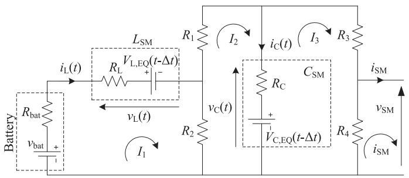  
Fig. 8. Equivalent circuit of the SM with embedded storage.

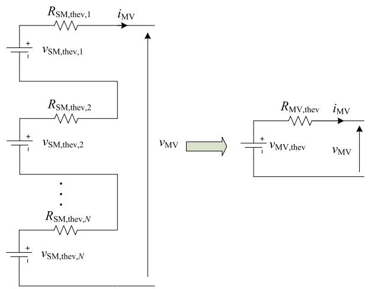  
Fig. 9. Configuration of a multivalve with individual Thevenin equivalents.

Thevenin equivalent circuit parameters are as follows.

$$
R _ {\mathrm {S M}, \text {t h e v}} = R _ {4} / / \left\{R _ {3} + \left[ R _ {C} / / \left(R _ {1} + \left\{R _ {2} / / \left[ R _ {\mathrm {b a t}} + R _ {L} \right] \right\}\right) \right] \right\} \tag {7}
$$

$$
v _ {\mathrm {S M}, \text {t h e v}} = R _ {4} \left[ \frac {V _ {\mathrm {C} , \mathrm {E Q}} (t - \Delta t)}{c} + \frac {R _ {C}}{c} d \right] \tag {8}
$$

where

$$
\begin{array}{l} a = R _ {\mathrm {b a t}} + R _ {L} + R _ {2} \\ b = R _ {C} + R _ {2} + R _ {1} \\ c = R _ {3} + R _ {4} + R _ {C} \\ d = \frac {a (c - R _ {C}) V _ {\mathrm {C , E Q}} (t - \Delta t) - c R _ {C} v _ {\mathrm {b a t}} + c R _ {C} V _ {\mathrm {L , E Q}} (t - \Delta t)}{c R _ {2} ^ {2} - a b c + a R _ {C} ^ {2}} \tag {9} \\ \end{array}
$$

The values of $R _ { 1 - 4 }$ depend on the firing pulses issued to each of the switching devices. When an ON firing pulse is issued to a particular switch, it is represented with a low resistance $( R _ { \mathrm { o n } } )$ . Conversely the resistance become high $( R _ { \mathrm { o f f } } )$ when an OFF command is issued.

The multivalve model is formed by series connection of all N SMs that comprise the multivalve. Fig. 9 shows the formation of the multivalve with several Thevenin equivalents and its simplification to a single Thevenin equivalent. Equations (10) and (11) show the multivalve’s Thevenin resistance and Thevenin

voltage, respectively.

$$
v _ {\mathrm {M V}, \text {t h e v}} = \sum_ {i = 1} ^ {N} v _ {\mathrm {S M}, \text {t h e v}, i} \tag {10}
$$

$$
R _ {\mathrm {M V}, \text {t h e v}} = \sum_ {i = 1} ^ {N} R _ {\mathrm {S M}, \text {t h e v}, i} \tag {11}
$$

The Thevenin equivalent circuit in Fig. 9 is then used in the EMT solver in place of the detailed switching model of the multivalve. This equivalent circuits only introduces three electrical nodes per multivalve. Hence the size of the admittance matrix is reduced greatly and its inversion become less computationally onerous.

# B. Extraction of SM Operating Variables From the DEM

The inductor current $( i _ { \mathrm { L } } )$ and the capacitor voltage (vC) of each SM is required for DC-DC converter control and SM capacitor voltage balancing. The EMT solver provides the node voltages of the multivalve’s Thevenin equivalent circuit and the currents entering (or exiting) the multivalve $( \boldsymbol { i } _ { \mathrm { M V } } )$ . Since all the SMs in a multivalve are connected in series the current exiting each SM $( i _ { \mathrm { S M } } )$ and the multivalve are equal $( i _ { \mathrm { S M } } = i _ { \mathrm { M V } } )$ . Based on the SM current and with a record of the time-varying resistances of the SM, the loop currents in the SM, i.e., $I _ { 1 } , I _ { 2 }$ , and $I _ { 3 }$ (see Fig. 8) can be solved. Equations (12) and (13) represent the inductor current and capacitor voltage based on the three loop currents.

$$
i _ {\mathrm {L}} (t) = I _ {1} \tag {12}
$$

$$
v _ {\mathrm {C}} (t) = V _ {\mathrm {C}, \mathrm {E Q}} (t - \Delta t) + R _ {\mathrm {C}} \left(I _ {2} - I _ {3}\right) \tag {13}
$$

Therefore, collapsing the entire multivalve into a single Thevenin equivalent circuit as described in Section III.A does not affect or alter the measurements that are needed for the converter’s control system. This is important in enabling the use of the developed DEM in the study of MMCs with their full closed-loop control circuitry.

# C. EMT Simulation Model of the Battery

Although a battery may be simply represented using an internal voltage behind a resistance, it is often desired to improve this representation by accounting for the variations of voltage with the SOC [15]. The voltage depreciation of a battery with its discharge level is a highly non-linear relationship. Different models have been developed to capture this relationship. In this paper, Shepherd’s model, shown in (14) and (15), is used due to its simplicity and accuracy [16], [17]. In these equations, $R _ { \mathrm { b a t } }$ , $\eta ,$ and i are the battery internal resistance, battery efficiency, and the nominal current used to test the steady state discharge of the battery, respectively. Fig. 10 shows a typical discharge curve indicating important values that are used to determine the model parameters. $V _ { \mathrm { f u l l } } , \ V _ { \mathrm { e x p } }$ , and $V _ { \mathrm { n o m } }$ are the battery voltage when fully charged, battery voltage at the end of the exponential drop, and the voltage at the edge of the rapid voltage

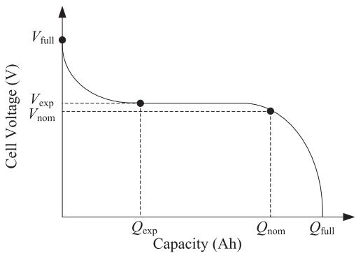  
Fig. 10. Typical discharge curve of a battery.

collapse, respectively. $Q _ { \mathrm { e x p } } , Q _ { \mathrm { n o m } } ,$ and $Q _ { \mathrm { f u l l } }$ are the charge lost at the $V _ { \mathrm { e x p } } .$ , charge lost at $V _ { \mathrm { n o m } }$ , and full charge of the battery respectively.

$$
v _ {\text {b a t}} = E _ {0} - K \frac {Q _ {\text {f u l l}}}{Q _ {\text {f u l l}} - \int i (t) d t} + A e ^ {- B \int i (t) d t} \tag {14}
$$

where

$$
\begin{array}{l} A = V _ {\text {f u l l}} - V _ {\text {e x p}} \\ B = \frac {2 . 3}{Q _ {\mathrm {e x p}}} \\ K = 0. 0 6 5 * \left[ V _ {\mathrm {f u l l}} - V _ {\mathrm {n o m}} + A \left(e ^ {- B \cdot Q _ {\mathrm {n o m}}} - 1\right) \right] \\ * \frac {Q _ {\text {f u l l}} - Q _ {\text {n o m}}}{Q _ {\text {n o m}}} \\ \end{array}
$$

$$
R _ {\mathrm {b a t}} = V _ {\mathrm {n o m}} \left(\frac {1 - \eta}{0 . 2 * Q _ {\mathrm {n o m}}}\right)
$$

$$
E _ {0} = V _ {\text {f u l l}} + K + R _ {\text {b a t}} * i - A \tag {15}
$$

Note that the detailed equivalent model derived in Section III.A is essentially independent of whether the internal voltage is assumed constant or a function of the SOC. With a Shepherd’s model, one is able to adjust the internal voltage as the battery is charged or discharged.

# IV. MODEL VALIDATION

The developed model is compared against a detailed switching model. Table I presents the parameters of the simulated MMC. A single-phase MMC is selected as EMT simulation of a three-phase MMC with energy storage with a detailed switching model is prohibitively time-consuming. The MMC’s connection to the ac system is represented with a series RL circuit. Both the DEM and detailed switching model are implemented in PSCAD/EMTDC and simulated with a 5 μs time-step. The detailed switching model serves as the benchmark for validation of the developed DEM.

# A. Steady State Comparison

Fig. 11 presents the terminal voltage, line current, average capacitor voltage, and average battery current. As seen identical waveforms for operation in steady state are produced by the two

TABLE IPARAMETERS OF THE SINGLE-PHASE MMC WITH ENERGY STORAGE SMS  

<table><tr><td>Symbol</td><td>Value</td><td>Description</td></tr><tr><td>\( v_S \)</td><td>230 V</td><td>AC grid voltage</td></tr><tr><td>\( U_{DC} \)</td><td>800 V</td><td>DC link voltage</td></tr><tr><td>\( S_{RATED} \)</td><td>20 kVA</td><td>Rated apparent power</td></tr><tr><td>\( P_{AC,RATED} \)</td><td>15 kW</td><td>Rated active power</td></tr><tr><td>N</td><td>10</td><td>Number of SMs per arm</td></tr><tr><td>\( f_{SYS} \)</td><td>60 Hz</td><td>AC system frequency</td></tr><tr><td>\( f_{DCDC} \)</td><td>15 kHz</td><td>DC-DC converter switching frequency</td></tr><tr><td>\( L_G \)</td><td>4.24 mH</td><td>Grid interface inductance</td></tr><tr><td>\( R_G \)</td><td>0.01 Ω</td><td>Grid interface resistance</td></tr><tr><td>\( L_A \)</td><td>2.12 mH</td><td>Arm inductance</td></tr><tr><td>\( R_A \)</td><td>0.01 Ω</td><td>Arm resistance</td></tr><tr><td>\( C_{SM} \)</td><td>12 mF</td><td>SM capacitance</td></tr><tr><td>\( L_{SM} \)</td><td>1 mH</td><td>SM DC-DC converter inductance</td></tr><tr><td>\( v_{bat} \)</td><td>60 V</td><td>SM battery nominal voltage</td></tr></table>

simulation models. Fig. 11 also includes plots of the frequency components of the respective waveforms predicted by the DEM and the DSM. These frequency plots show that the dominant frequency components of the waveforms are in full conformity between the two models. The non-dominant harmonics that are of much smaller magnitudes also match to a large extent.

# B. Comparisons at Fault

1) Transient Due to a Fault at the Converter’s AC Bus: A solid line-to-ground fault is simulated at the AC bus after achieving steady state. The fault is applied at t = 0.2 s and lasts 50 ms. As depicted in Fig. 12 the DEM model shows complete conformity with the detailed switching model before, during, and after the fault transient.   
2) Transient Due to a Fault at the Middle of the Multivalve: A fault to ground is simulated at the midpoint of the top multivalve. To simulate this event, two identical DEM segments, each equal to half of the upper arm multivalve, are created and placed in series. The fault is applied by grounding the connection point of the two segments. This kind of fault may be a rare occurrence in reality; however, it demonstrates the flexibility of the developed DEM in simulating complex transients. Fig. 13 shows that the simulation results using the DEM and the detailed switching model are well matched before, during, and after the fault.

# C. Comparison of CPU Time

CPU time to complete simulations using the developed DEM and the detailed switching model was measured on a 2.4 GHz machine with 16 GB RAM. Both models were executed with a 5 μs time-step. CPU time was measured for a 6 s simulation, for which the detailed switching model took 928 s and the developed DEM took only 191 s showing a speed-up factor of more than 480%.

# V. CASE STUDY: SIMULATION OF A MICROGRID WITH AN MMC WITH EMBEDDED STORAGE

This section shows the application of the developed DEM in a larger system. An MMC with embedded storage is introduced to the IEEE 34-bus (microgrid) system [18]. Microgrids such as the IEEE 34-bus system may incorporate energy storage for

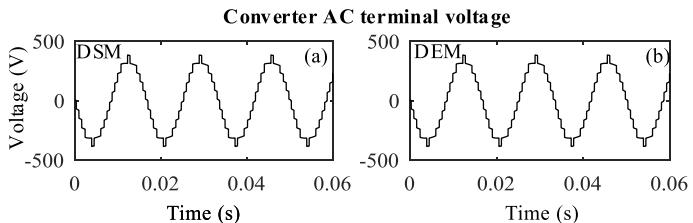

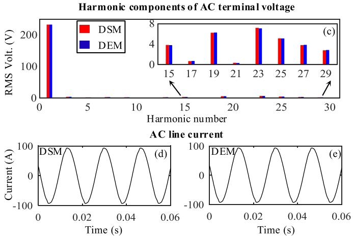

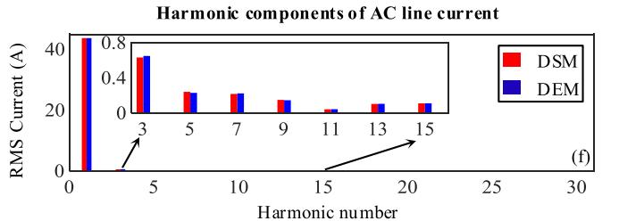

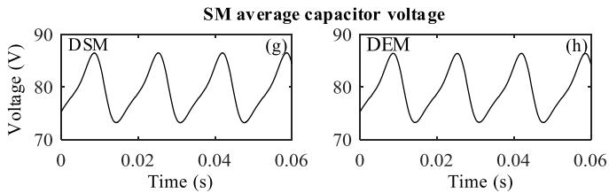

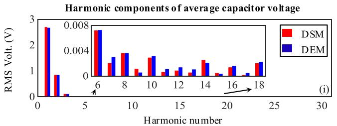  
Fig. 11. Steady state operation: (a)–(b) terminal voltage, (c) harmonics of terminal voltage, (d)–(e) line current, (f) harmonics of line current, (g)–(h) average SM capacitor voltage, (i) harmonics of average SM voltage.

better operation of the microgrid. An MMC with embedded storage is a suitable option to introduce energy storage due to its better harmonic performance and modularity. A three-phase 0.6 MVA/0.5 MW system with 106.7 kWh storage capacity is connected at bus 844 of the IEEE 34-bus system. A 2.75 kV/ 24.9 kV step-up transformer is used to interconnect the MMC to the microgrid (microgrid’s rated voltage = 24.9 kV). Fig. 14 shows the interconnection of the MMC with energy storage to the microgrid. Table II shows the parameters of the MMC.

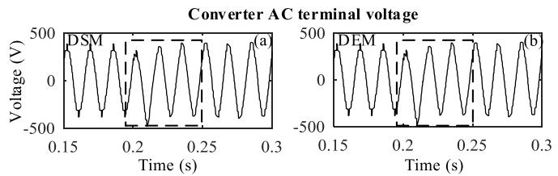

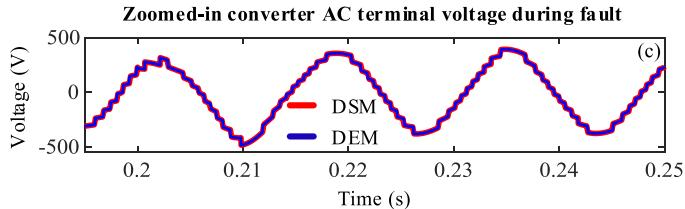

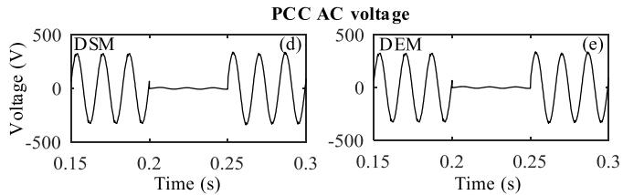

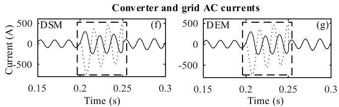

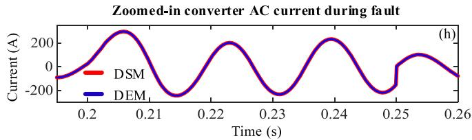

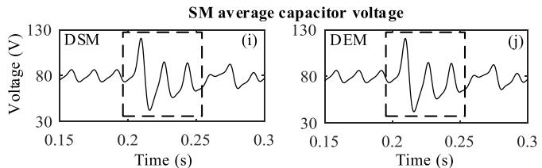

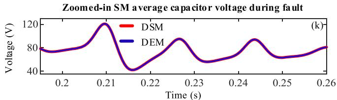

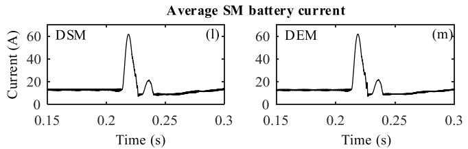  
Fig. 12. Comparison of transients in response to a single-phase fault at the converter terminals: (a)–(b) terminal voltage, (c) zoomed-in view of the terminal voltage, (d)–(e) PCC voltage, (f)–(g) line current (solid line: converter current iconv., dotted line: grid current $i _ { \mathrm { g r i d } } ) ,$ (h) zoomed-in view of the converter current, (i)–(j) average SM capacitor voltage, (k) zoomed-in view of the average SM capacitor voltage (l)–(m) average battery current.

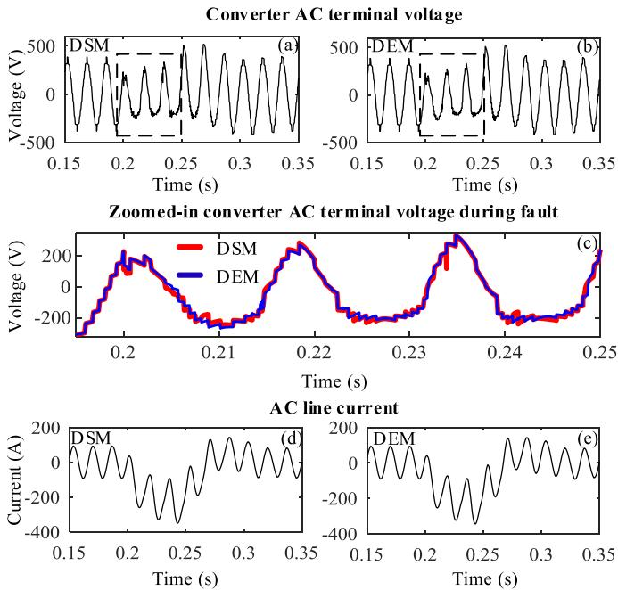  
Fig. 13. Comparison of multivalve fault transients: (a)–(b) terminal voltage, (c) zoomed in view of the terminal voltage (d)–(e) line current.

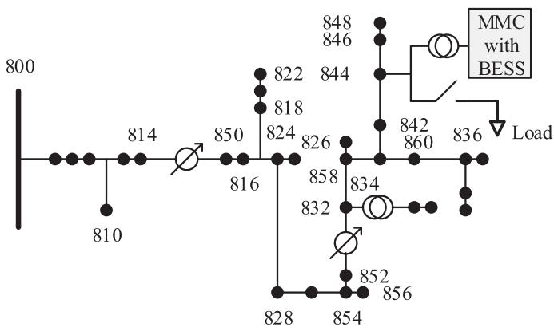  
Fig. 14. MMC with embedded storage connected to the IEEE 34 bus system.

TABLE II PARAMETERS OF THE MMC CONNECTED TO THE MICROGRID   

<table><tr><td>Symbol</td><td>Value</td><td>Description</td></tr><tr><td>UDC</td><td>5 kV</td><td>Rated DC voltage</td></tr><tr><td>SRATED</td><td>0.6 MVA</td><td>Rated apparent power</td></tr><tr><td>PAC,RATED</td><td>0.5 MW</td><td>Rated active power</td></tr><tr><td>N</td><td>10</td><td>Number of SMs per arm</td></tr><tr><td>fSYS</td><td>60 Hz</td><td>AC system frequency</td></tr><tr><td>fDCDC</td><td>5 kHz</td><td>DC-DC converter switching frequency</td></tr><tr><td>LG</td><td>0.25 pu</td><td>Grid interface inductance</td></tr><tr><td>LA</td><td>0.124 pu</td><td>Arm inductance</td></tr><tr><td>CSM</td><td>3.2 mF</td><td>SM capacitance</td></tr><tr><td>LSM</td><td>7.815 mH</td><td>SM DC-DC converter inductance</td></tr><tr><td>vbat</td><td>273.6 V</td><td>Battery nominal voltage</td></tr><tr><td>Qbat</td><td>6.5 Ah</td><td>Energy stored in a battery</td></tr></table>

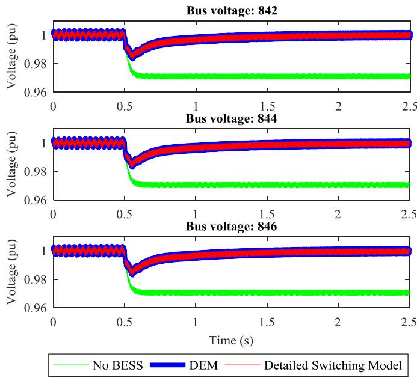  
Fig. 15. Microgrid bus voltages during load energization.

The performance of the MMC is studied under three situations: a load connecting to the MMC interconnection bus, an AC power reference command change and a solid three-phaseto-ground fault at bus 834. Comparisons are made between simulation results using the developed DEM and a benchmark detailed switching model, both developed in PSCAD/EMTDC and executed with a 20 μs time-step.

# A. Load Energization

A three-phase balanced load of 0.416 + 0.2j pu is connected to bus 844 of the microgrid at 0.5 s. Fig. 15 shows that the AC bus voltages in the proximity of bus 844 drop to as lows as 0.97 pu if no MMC with energy storage is to support the system. The AC voltage stabilizes to 1.0 pu within 0.5 s when the MMC provides transient support. It is also clear that the DEM tracks perfectly the detailed switching model.

# B. Power Reference Change

During this test, the MMC’s active power command is changed from 0.5 MW to 0.3 MW at 0.5 s. Fig. 16 shows the variations of active power and ac voltage at the PCC during the transient. It is evident that the DEM is able to track the transient in full conformity with the detailed switching model.

# C. Three-Phase-to-Ground Fault at Bus 834

After reaching steady state, a three-phase fault to ground was applied at t = 0.5 s for a duration of 50 ms. The three-phase converter currents in Fig. 17 show a great degree of conformity between the waveforms produced by the proposed DEM and the conventional DSM. The small deviations between the two waveforms stem from the sequence of calculations in the two

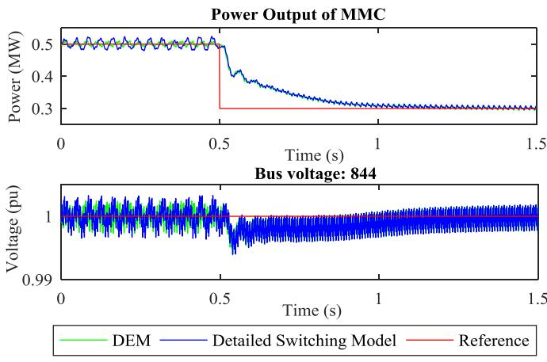  
Fig. 16. System performance during a power reference change.

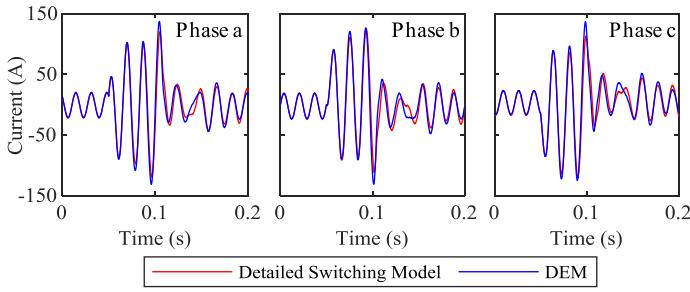  
Fig. 17. Converter phase currents subjected to a fault at bus 834.

models and its impact on the response of the converter control system.

# D. Simulation Time

The detailed switching model of the MMC in this microgrid has 240 IGBTs and 240 anti-parallel diodes. Additionally the microgrid itself introduces a large number of electrical nodes, resulting in a large admittance matrix. Inversion of this matrix at a high rate (due to the MMC switching elements) poses significant computational challenges. For example, a 10 s simulation of this microgrid with a 20 μs time-step using the detailed switching model requires 8 hours and 36 mins. The same simulation using the developed DEM takes a mere 11 mins and 28 s, showing a speed-up factor of exceeding 4650%.

# VI. EXPERIMENTAL VERIFICATION

The previous sections demonstrated that the developed DEM is able to match the results of a detailed switching with high conformity. This section compares the simulation results obtained from the DEM against those obtained on a prototype MMC with embedded storage. A small-scale MMC hardware with actual battery energy storage SMs similar to Fig. 3 is developed. Fig. 18 shows the schematic diagram of the prototype MMC testbed and Table III shows its parameters. A photograph of the testbed is shown in Fig. 19. A passive RL load was used in the AC side. The converter control system and its firing pulse generation scheme

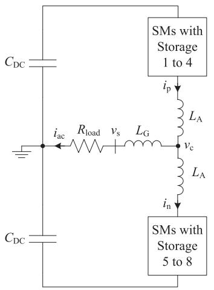  
Fig. 18. Schematic diagram of the prototype MMC.

TABLE III PARAMETERS OF THE EXPERIMENTAL PROTOTYPE   

<table><tr><td>Symbol</td><td>Value</td><td>Description</td></tr><tr><td>\( v_s \)</td><td>30 V</td><td>Rated load ac voltage</td></tr><tr><td>\( U_{DC} \)</td><td>100 V</td><td>DC link voltage</td></tr><tr><td>\( S_{RATED} \)</td><td>300 VA</td><td>Rated apparent power</td></tr><tr><td>\( P_{AC,RATED} \)</td><td>250 W</td><td>Rated AC active power</td></tr><tr><td>N</td><td>4</td><td>Number of SMs per arm</td></tr><tr><td>\( f_{SYS} \)</td><td>60 Hz</td><td>AC system frequency</td></tr><tr><td>\( f_{DCDC} \)</td><td>15 kHz</td><td>DC-DC converter switching frequency</td></tr><tr><td>\( L_G \)</td><td>6.35 mH</td><td>AC filter inductance</td></tr><tr><td>\( L_A \)</td><td>3.4 mH</td><td>Arm inductance</td></tr><tr><td>\( C_{SM} \)</td><td>4.7 mF</td><td>SM capacitance</td></tr><tr><td>\( L_{SM} \)</td><td>700 μH</td><td>SM DC-DC converter inductance</td></tr><tr><td>\( v_{bat} \)</td><td>12 V</td><td>Battery nominal voltage</td></tr><tr><td>\( Q_{bat} \)</td><td>7.5 Ah</td><td>Energy stored in a battery</td></tr><tr><td>\( R_{load} \)</td><td>10 Ω</td><td>Load resistance</td></tr><tr><td>\( C_{DC} \)</td><td>2200 μF</td><td>DC link capacitor</td></tr></table>

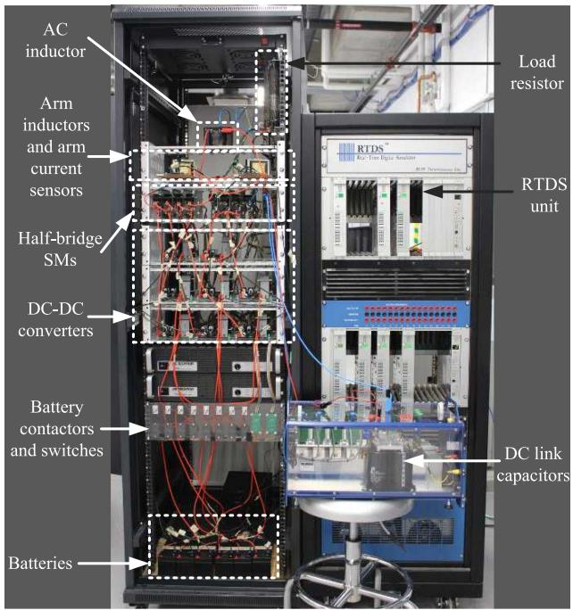  
Fig. 19. The developed testbed with real-time controller hardware.

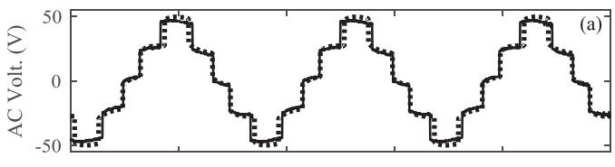

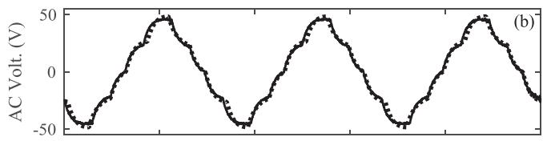

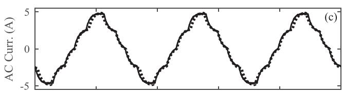

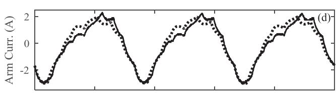

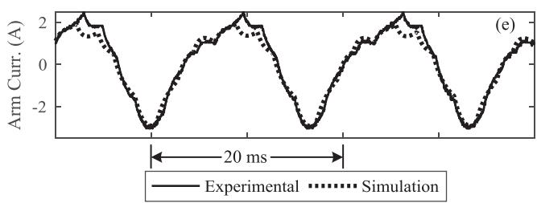  
Fig. 20. Comparison of simulation and experimental results (a) converter voltage (b) load voltage (c) ac current (d) top arm current (e) bottom arm curent.

are implemented in a real-time simulator (RTDS). The MMC hardware is then interfaced with its real-time control system.

The MMC was operated to steady state with a SM capacitor voltage reference of 25 V. Figs. 20 and 21 show the comparison of experimental results in steady state against those produced by the DEM, and show a great degree of conformity. The AC voltages at the converter terminal and across the load have been tracked accurately.

Note that the presence of losses in the prototype requires a slightly higher modulation index to provide the desired voltage and as a result the top-most and bottom-most steps in Fig. 20(a) have become slightly wider than those in the simulation. The line current in Fig. 20(c) closely follows the simulated waveform. Simulated arm currents show small deviations around the positive peak (Figs. 20(d)–(e)). This is likely due to the inductor core properties, which are not included in the DEM. The average SM capacitor voltage shown in Figs. 21(a)–(b) agrees well with the simulation results. The battery current shown in Figs. 21(c)–(d) match well. In general the small, and to be expected, discrepancies between the experimental and simulation results are primarily due to the inductor resistances, neglecting the skin effect, conductor losses, and other unmolded

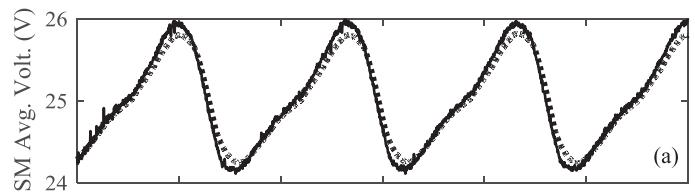

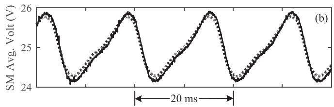

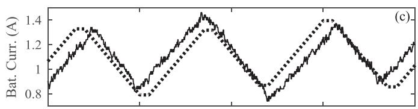

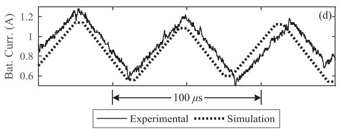  
Fig. 21. Comparison of simulation and experimental results (a) average capacitor voltage (top) (b) average capacitor voltage (bottom) (c) SM3 battery current (top) (d) SM6 battery current (bottom).

(high-frequency, low amplitude) dynamics such as those related to the battery models.

# VII. CONCLUSION

The paper developed and validated a detailed equivalent model of an MMC with energy storage submodules that are equipped with dedicated dc-dc converters in each SM (see the topology in Fig. 3). The model provides identical accuracy to a detailed switching model commonly used in EMT simulations. By reducing the number of switchable nodes of the MMC model, the developed DEM offers massive computational relief. The model also provides full access to the internal operating variables of submodules so that all control and protection circuitry models of the converter may be used without limitations. Therefore, the developed model has essentially equal functionality and accuracy to those of a detailed switching model. Similar to conventional EMT-type detailed switching models the developed DEM is not able to represent and estimate switching losses.

The paper presented several cases to verify the accuracy and assess the computational advantage of the developed DEM. Comparisons between the DEM and a detailed switching model confirmed complete conformity of waveforms and showed several orders of magnitude acceleration in simulations. Experimental results on a scaled down MMC showed a high level of

conformity between simulated and measured waveforms. The model is suitable for converter system level studies, control system tuning, and grid-level application studies of MMC-based battery energy storage systems.

# REFERENCES

[1] “RENEWABLES 2018 GLOBAL STATUS REPORT,” Ren21.net, 2019. [Online]. Available: http://www.ren21.net/gsr-2018. Accessed: 23-Aug-2018.   
[2] W. Su, J. Wang, and J. Roh, “Stochastic energy scheduling in microgrids with intermittent renewable energy resources,” IEEE Trans. Smart Grid, vol. 5, no. 4, pp. 1876–1883, Jul. 2014.   
[3] D. Bazargan, S. Filizadeh, and A. M. Gole, “Stability analysis of converterconnected battery energy storage systems in the grid,” IEEE Trans. Sustain. Energy, vol. 5, no. 4, pp. 1204–1212, Oct. 2014.   
[4] A. Lesnicar and R. Marquardt, “An innovative modular multilevel converter topology suitable for a wide power range,” in Proc. IEEE Powertech Conf., Bologna, 2003, vol. 3, p. 6.   
[5] M. Vasiladiotis and A. Rufer, “Analysis and control of modular multilevel converters with integrated battery energy storage,” IEEE Trans. Power Electron., vol. 30, no. 1, pp. 163–175, Jan. 2015.   
[6] Q. Chen, R. Li, and X. Cai, “Analysis and fault control of hybrid modular multilevel converter with integrated battery energy storage system,” IEEE J. Emerg. Sel. Top. Power Electron., vol. 5, no. 1, pp. 64–78, Mar. 2017.   
[7] T. Soong and P. W. Lehn, “Assessment of fault tolerance in modular multilevel converters with integrated energy storage,” IEEE Trans. Power Electron., vol. 31, no. 6, pp. 4085–4095, Jun. 2016.   
[8] T. Soong and P. W. Lehn, “Internal power flow of a modular multilevel converter with distributed energy resources,” IEEE J. Emerg. Sel. Top. Power Electron., vol. 2, no. 4, pp. 1127–1138, Dec. 2014.   
[9] H. W. Dommel, “Digital computer solution of electromagnetic transients in single-and multiphase networks,” IEEE Trans. Power Appar. Syst., vol. PAS-88, no. 4, pp. 388–399, Apr. 1969.   
[10] U. N. Gnanarathna, A. M. Gole, and R. P. Jayasinghe, “Efficient modeling of modular multilevel HVDC converters (MMC) on electromagnetic transient simulation programs,” IEEE Trans. Power Deliv., vol. 26, no. 1, pp. 316–324, Jan. 2011.   
[11] N. Herath, M. S. Toulabi, and S. Filizadeh, “Control and operation of a modular multilevel converter with embedded battery energy storage,” in Proc. CIGRE Canada Conf., Calgary, AB, Canada, Oct. 15–18, 2018.   
[12] S. Debnath, J. Qin, B. Bahrani, M. Saeedifard, and P. Barbosa, “Operation, control, and applications of the modular multilevel converter: A review,” IEEE Trans. Power Electron., vol. 30, no. 1, pp. 37–53, Jan. 2015.   
[13] M. Guan, Z. Xu, and H. Chen, “Control and modulation strategies for modular multilevel converter based HVDC system,” in Proc. Annu. Conf. IEEE Ind. Electron. Soc. (IECON), Melbourne, VIC, Australia, 2011, pp. 849–854.   
[14] M. Saeedifard and R. Iravani, “Dynamic performance of a modular multilevel back-to-back HVDC system,” IEEE Trans. Power Deliv., vol. 25, no. 4, pp. 2903–2912, Oct. 2010.   
[15] “Measuring state-of-charge – Battery University,” Batteryuniversity.com, 2019. [Online]. Available: https://batteryuniversity.com/learn/article/ how_to_measure_state_of_charge. Accessed: 19-Nov-2018.   
[16] O. Tremblay, L. A. Dessaint, and A. I. Dekkiche, “A generic battery model for the dynamic simulation of hybrid electric vehicles,” in Proc. IEEE Vehicle Power Propulsion Conf., Arlington, TX, USA, 2007, pp. 284–289.   
[17] E. Raszmann, K. Baker, Y. Shi, and D. Christensen, “Modeling stationary lithium-ion batteries for optimization and predictive control,” in Proc. IEEE Power Energy Conf. Illinois (PECI), Champaign, IL, USA, 2017, pp. 1–7.   
[18] “Resources | PES Test Feeder,” Sites.ieee.org, 2019. [Online]. Available: http://sites.ieee.org/pes-testfeeders/resources/. Accessed: 16-Feb-2019.

Nuwan Herath (S’19) was born in Peradeniya, Sri Lanka. He received the B.Sc.Eng. degree in electrical and electronic engineering from the University of Peradeniya, Peradeniya, Sri Lanka, in 2016, and the M.Sc. degree in electrical engineering from the University of Manitoba, Winnipeg, MB, Canada, in 2019, where he is currently pursuing the Ph.D. degree in electrical and computer engineering.

In 2016, he was a Sponsored Researcher with the Advanced Vehicle Engineering Centre, Cranfield Univeristy, Bedford, United Kingdom. His research

interests are EMT simulation models and energy storage in the grid and auxiliary services to the power system via power electronics.

Shaahin Filizadeh (S’02–M’05–SM’10) received the B.Sc. and M.Sc. degrees in electrical engineering from the Sharif University of Technology, Tehran, Iran, in 1996 and 1998, respectively, and the Ph.D. degree from the University of Manitoba, Winnipeg, MB, Canada, in 2004.

He is currently a Professor with the Department of Electrical and Computer Engineering, University of Manitoba. His research interests include electromagnetic transient simulation and power electronics.

Dr. Filizadeh is a Registered Professional Engineer

in the Province of Manitoba. He is active in several IEEE committees and is currently the Chair of the IEEE Task Force on Dynamic Phasor Modeling Techniques. He is an Editor for the IEEE TRANSACTIONS ON ENERGY CONVERSION and IEEE POWER ENGINEERING LETTERS.

Mohammad Sedigh Toulabi (S’13–M’16–SM’19) was born in Khorramabad, Iran, in 1985. He received the B.Sc. degree from the K. N. Toosi University of Technology, Tehran, Iran, the M.Sc. degree from Shahid Beheshti University, Tehran, Iran, and the Ph.D. degree from the University of Alberta, Edmonton, AB, Canada, in 2007, 2009, and 2016, respectively, all in electrical engineering. He was a Visiting Graduate Student with the Department of Electrical and Computer Engineering, University of Calgary, Calgary, AB, Canada, from May 2015 to December

2015. He is currently an Electrified Powertrain Engineer with Fiat Chrysler Automobiles (FCA) US LLC, Auburn Hills, MI, USA, and prior to that he was a Senior Research Associate with the University of Manitoba, Winnipeg, MB, Canada. His research interests include design, control, and analysis of electric machines and power electronics for motor drive applications.

Dr. Toulabi is an active Reviewer of various IEEE publications, including the IEEE TRANSACTIONS ON ENERGY CONVERSION, IEEE TRANSAC-TIONS ON INDUSTRIAL ELECTRONICS, and IEEE TRANSACTIONS ON INDUSTRY APPLICATIONS.