# An Enhanced Method to Achieve Exact DC Values for Frequency-dependent Transmission lines

H.M.J. De Silva * , Z Liu

Manitoba Hydro International Ltd, Canada

# A R T I C L E I N F O

Keywords:

Dc correction

Electromagnetic transients

Rational function

Universal line model

Phase domain model

# A B S T R A C T

This paper proposes an improved method to enhance the dc response of a frequency-dependent transmission line model used in EMT studies. A modification to the rational function approximation of propagation and characteristic admittance matrices of a transmission line is introduced to enforce exact dc values at 0 Hz. Furthermore, weighting factors are applied to improve accuracy at low frequencies. Finally, the order of the propagation function is reduced to decrease the computational effort.

The validity of the proposed approach is demonstrated using examples involving underground cables and overhead lines. First, the effect of dc correction is demonstrated by comparing transmission line frequency domain characteristics. In addition, time domain simulations via open and short circuit conditions show a more accurate simulation of HVDC transmission lines with the proposed method.

# 1. Introduction

HIGH Voltage direct current (HVDC) transmission lines are preferred to transmit power over long distances for the sake of lower cost compared to traditional ac transmission [2]. In addition, HVDC transmission lines can also be used to connect two unsynchronized networks and to integrate renewable energy resources such as wind into the main transmission grid. The transient simulations involving HVDC cable and overhead line models require accurate representation of a wide frequency range from dc to a few MHz.

The Universal Line Model (ULM) [1] is widely used in EMT transient studies including switching, lighting, and faults analysis, etc. The curve-fitting of transmission line propagation and characteristic admittance functions is required in frequency-dependent transmission line models such as ULM. This curve-fitting process is typically performed for frequencies from a few Hz to 1 MHz. Difficulties arise when trying to obtain accurate curve-fitting at very low frequencies with the traditional method [2-4]. These include (a) incorrect dc value in time domain simulations, (b) unstable simulations due to large residue/pole ratios (c) the presence of artificial overshooting in dc response (d) increased order of curve-fitted functions. To relieve these difficulties, numerous solutions have been proposed in the past by various researchers.

Reference [2] proposed a method to enforce exact dc value by

modifying the functional form of rational function. However, for the propagation function, an optimization algorithm is necessary to eliminate errors at high frequencies. Such an algorithm increases complexity and there is a possibility of a non-convergence solution. Although this method guarantees the exact dc value, the curve-fitting accuracy at low frequencies may be poor. It is observed that this may lead to an artificial overshooting in some time domain simulations [3].

In [3], a two-stage fitting procedure is introduced to enhance fitting at low frequencies. First, frequency-dependent characteristics (such as propagation and characteristics admittance) at high frequency range are curve-fitted (e.g. 1 Hz to 1 MHz) and then the difference between actual and fitted curves is computed for the low frequency range (e.g. from 0.001 Hz to 1.0 Hz). The characteristics at the low frequency range are then approximated (curve-fitted) to enhance accuracy at low frequencies and to reduce the presence of large residue/pole ratios. Finally, high and low frequency curve-fitted functions are combined to represent the entire frequency range.

In [4], the frequency-dependent characteristics are curve-fitted for a wide frequency range from 1 mHz to 1 MHz. Additional low order fitting function is applied to compensate for the curve-fitting discrepancy for the propagation and characteristic admittance functions at low frequencies.

However, increased curve-fitting accuracy does not guarantee exact

dc values, as the curve-fitting error at frequencies approaching dc is unavoidable. A slight deviation of curve-fitted characteristics can cause noticeable mismatch in dc response [1].

This paper introduces modified rational function formulas to enforce the exact dc value without additional constrained optimization as discussed in [2]. The following improvements are utilized to achieve the exact dc enforcement.

(a) Residue computation via dc enforcement.   
(b) Use of weighing function to improve the accuracy at very low frequencies and to mitigate overshooting in time domain simulations.   
(c) The rearrangement of the propagation function and order reduction at low frequency section are used to decrease the order of the rational function.   
(d) Large residue/pole ratios in curve-fitted function can be present due to the selection of a wide frequency range for approximation. It is well known that this can cause unstable time domain simulations. The instability can be eliminated by incorporating a modified recursive convolution algorithm as reported in [5].

# 2. Universal Line Model

This section briefly summarizes the ULM [1], a widely used transmission line model in EMT studies. For multi-conductor lines, the frequency-dependent characteristics are represented by the characteristic admittance matrix $\boldsymbol { ( \mathrm { Y _ { c } ( s ) ) } }$ and propagation matrix (A(s)). These matrices can be derived from per-unit length impedance and admittance matrices $[ 7 , 9 , 1 0 ]$ . The relationship between voltages and currents at terminals of a transmission line can be expressed in frequency domain as $^ { [ 6 , 8 ] }$

$$
I _ {k} = Y _ {c} V _ {k} - A \left(Y _ {c} V _ {m} + I _ {m}\right) \tag {1}
$$

$$
I _ {m} = Y _ {c} V _ {m} - A \left(Y _ {c} V _ {k} + I _ {k}\right) \tag {2}
$$

Where, $\mathrm { { V _ { k } , \Delta I _ { k } , \Delta V _ { m } , \Delta I _ { m } } }$ are the sending-end voltages, sending-end currents, receiving-end voltages, and receiving-end currents respectively. The complex frequency term $( s , s = \mathrm { j } \omega )$ is removed for simplicity.

In ULM, the elements of $\mathtt { Y } _ { \mathrm { c } } ( \mathsf { s } )$ matrix are approximated by a proper rational function of order (M) as shown in (3). A common set of poles $( a _ { q } )$ can be estimated by curve-fitting trace of $\mathtt { Y } _ { \mathrm { c } } ( \mathsf { s } )$ matrix. Residues $( c _ { q } )$ are then calculated by curve-fitting phase elements. The well-known Vector fitting technique is used for curve-fitting [6]. The order (M) is gradually increased until the desired accuracy is achieved [1].

$$
Y c _ {i, j} (s) = \sum_ {q = 1} ^ {M} \frac {c _ {q}}{s - a _ {q}} + d \tag {3}
$$

For the $\mathbf { A } ( \mathbf { s } ) ,$ first modal delays are estimated. Then modes of unwound A(s) (after removing the time delay) are approximated using rational functions as shown in (4). N(p), τp, api, cmodepi are the order, delay, poles, and residues of $\cdot \boldsymbol { p } ^ { t h }$ mode respectively. Note that the modes that have close characteristics are grouped together to improve the conditioning of the solution and to reduce the presence of large residue /pole ratios.

$$
A _ {\text {m o d e}} (s, p) = \sum_ {i = 1} ^ {N (p)} \frac {c _ {\text {m o d e p i}} e ^ {- s \tau_ {p}}}{s - a _ {p i}} \tag {4}
$$

Using the modal poles and delays in (4), the phase elements of A(s) matrix are approximated in the form as shown in (5) using least square method.

$$
A _ {i, j} (s) = \sum_ {p = 1} ^ {N g} \sum_ {i = 1} ^ {N (p)} \frac {c _ {p i} e ^ {- s \tau_ {p}}}{s - a _ {p i}} \tag {5}
$$

Where, Ng is the number of modes and cpi’s are the residues of A(s).

Once the ${ \mathrm { Y } } _ { \mathrm { c } } ( s )$ and A(s) are expressed in rational form, (1) and (2) can be represented as EMT Norton equivalent circuits using recursive convolution technique [1].

# 3. proposed modified formulas to enforce exact dc value

# 3.1. Enforcing exact dc values

To enforce dc for ${ \mathrm { Y } } _ { \mathrm { c } } ( s ) ,$ , the functional form described in [2] is used. The residue computation procedure of ${ \mathrm { Y } } _ { \mathrm { c } } ( s )$ is modified to obtain the exact dc value. At 0 Hz, the fitted ${ \mathrm { Y } } _ { \mathrm { c } } ( s )$ is set to its exact dc value $\mathrm { ( Y _ { c } }$ dc) in (6). This dc value can be computed analytically [2].

$$
Y c _ {i, j} (s = 0) = Y c d c _ {i, j} = \sum_ {q = 1} ^ {M} \frac {c _ {q}}{- a _ {q}} + d \tag {6}
$$

Re-arranging (6), the term d can be written as

$$
d = \sum_ {q = 1} ^ {M} \frac {c _ {q}}{a _ {q}} + Y c d c _ {i j} \tag {7}
$$

Substituting (7) into (3), the modified equation for ${ \bf Y } _ { \mathrm { c } } ( s )$ can be obtained [2]

$$
Y c _ {i, j} (s) = \sum_ {q = 1} ^ {M} c _ {q} \left(\frac {1}{s - a _ {q}} + \frac {1}{a _ {q}}\right) + Y c d c _ {i, j} \tag {8}
$$

Residues $( c _ { q } )$ can be calculated using Vector-fitting technique. Note, that curve-fitting error does not affect the dc value of the function.

In [2], modified propagation function has a constant term as shown in (9).

$$
A _ {i, j} (s) = \sum_ {p = 1} ^ {N g} \sum_ {i = 1} ^ {N (p)} \frac {c _ {p i} s e ^ {- s \tau_ {p}}}{s - a _ {p i}} + A d c _ {i, j} e ^ {- s \tau_ {1}} \tag {9}
$$

This is different from the propagation function in (5). This causes a deviation at high frequencies and a constrained optimization method is required to mitigate the error [2]. This paper presents a different approach, which does not change the functional form in (5), hence there is no deviation at high frequencies (note that at high frequencies, the propagation function approaches zero). Therefore, optimization procedure is unnecessary.

Once the poles of the propagation function are calculated (see section II), the following modified procedure is used to compute residues to enforce the correct dc value. At 0 Hz, the propagation function in (5) becomes,

$$
A d c _ {i, j} = \sum_ {p = 1} ^ {N _ {g}} \sum_ {i = 1} ^ {N (p)} \frac {c _ {p i}}{- a _ {p i}} \tag {10}
$$

Where, Adc is the exact dc value, which can be computed analytically. The first residue can be written as,

$$
c _ {1 1} = \sum_ {p = 1} ^ {N g} \sum_ {i = q} ^ {N (p)} \frac {- c _ {p i} a _ {1 1}}{a _ {p i}} - a _ {1 1} A d c _ {i, j} \tag {11}
$$

Where, $\mathfrak { q } = 2 ; \mathrm { i f } \mathfrak { p } = 1$ and $\mathsf { q } = 1 ; \mathsf { i f } \mathsf { p } \neq 1$ . Substituting (11) into (5), the modified propagation function can be written as,

$$
A _ {i, j} (s) + \frac {a _ {1 1} A d c _ {i , j} e ^ {- s \tau_ {1}}}{s - a _ {1 1}} = \sum_ {p = 1} ^ {N g} \sum_ {i = q} ^ {N (p)} c _ {p i} \left(\frac {- a _ {1 1} e ^ {- s \tau_ {1}}}{(s - a _ {1 1}) a _ {p i}} + \frac {e ^ {- s \tau_ {p}}}{s - a _ {p i}}\right) \tag {12}
$$

From (12), the residues (except for the first one) can be computed using least squares without disturbing the exact dc value. The first residue is then calculated by evaluating (11). As a result, the exact dc value is enforced without deviating the functional form of the propagation function in (5).

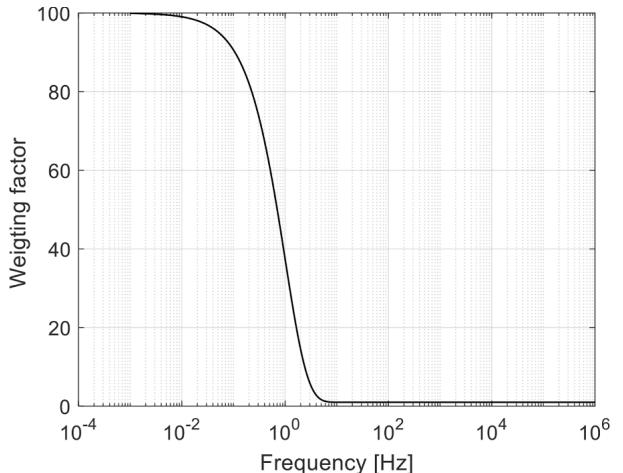  
Fig. 1. weighting factor vs frequency [Hz].

# 3.2. Improving accuracy and reduction of low frequency oscillations

Although the proposed curve-fitting method enforces the correct dc values, there can be noticeable approximation errors specially at low frequencies (e.g. between 0 Hz to 1 Hz). The approximation error can cause overshooting (or sometimes oscillatory behavior) in the dc response of a transmission line model and possible unstable simulations. It is observed that this can cause a serious problem when dc line is connected to an inverter or rectifier station, where a proper operation of control and power electronic devices requires smooth behavior of voltages and current at the terminals.

The approximation error can be eliminated by increasing weighing factors at low frequencies and reducing the lower bound of curve-fitting. The weighing factor is selected using the following formula.

$$
W (f) = \left(W _ {\max } - 1\right) e ^ {- f \beta} + 1 \tag {13}
$$

Where, W is the weighting factor, $\mathrm { { W _ { m a x } } }$ is the maximum weighting factor defined by user (e.g. $\mathbf { W } _ { \mathrm { m a x } } = 1 0 0 )$ , β is a constant, which defines the rate of decay $( \mathbf { e . g . \ } \beta = 1 . 0 )$ and f is the frequency. At low and high frequencies, weighting factor approaches its maximum value and 1.0 respectively as shown in Fig. 1.

The lower bound for curve-fitting is selected typically as 0.5 Hz, 0.1 Hz etc. in commercial EMT software. However, the accuracy at low frequencies can be further increased by reducing the lower bound. As suggested in [3], a suitable value of the lower bound can be selected as 1.0 mHz.

# 3.3. Unstable simulations due to large residue pole ratios

It is reported that presence of large residue/pole ratios can cause unstable simulations [3,5]. In this paper, an improved recursive convolution algorithm in [5] was implemented to eliminate unstable simulations due to the large ratios. Authors have tested stability of the simulations with transmission lines having extremely large ratios. This is done by disabling the aggregation of close modes of A(s) (this can result in ratios greater than 1e6) and a stable simulation is always observed. Although there may be large residue/pole ratios, when extending lower bound of fitting range to 1 mHz, the simulation is stable with the improved convolution algorithm.

# 3.4. Order reduction for the propagation function

Since the modes of the propagation matrix are fitted independently (see section II) and phase elements of A(s) matrix employ poles of all modes, there can be close poles aggregated at low frequencies. Since the effect of difference in modal delays at low frequencies is negligible,

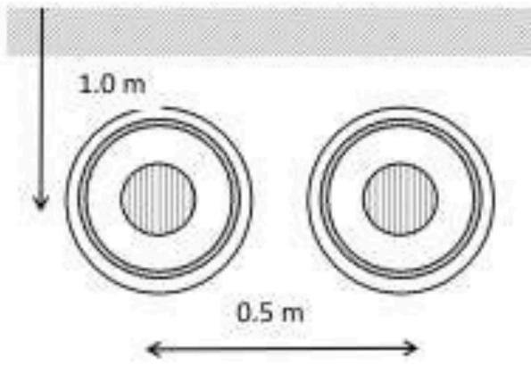  
Fig. 2. HVDC cable system.

Table 1 Cable Data.   

<table><tr><td>Conductor outer radius</td><td>0.022 m</td></tr><tr><td>Conductor resistivity</td><td>1.724e-8 Ωm</td></tr><tr><td>Insulator 1 capacitance</td><td>0.3 uF/m</td></tr><tr><td>Insulator 1 outer Radius</td><td>0.0395 m</td></tr><tr><td>Sheath outer radius</td><td>0.044 m</td></tr><tr><td>Sheath dc resistance</td><td>0.046 ohm/km</td></tr><tr><td>Insulator 2 outer radius</td><td>0.0475 m</td></tr><tr><td>Ins. 2 relative permittivity</td><td>2.3</td></tr><tr><td>Armour outer radius</td><td>0.0583 m</td></tr><tr><td>Armour dc resistance</td><td>0.046 ohm/km</td></tr></table>

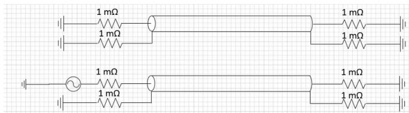  
Fig. 3. Test circuit setup.

Table 2 Curve-fitting default parameters.   

<table><tr><td>Curve-fitting starting frequency</td><td>0.5 Hz</td></tr><tr><td>Curve-fitting end frequency</td><td>1.0 MHz</td></tr><tr><td>Maximum fitting error for propagation function</td><td>0.1%</td></tr><tr><td>Maximum fitting error for propagation function</td><td>0.1%</td></tr><tr><td>Number of frequency samples</td><td>100</td></tr></table>

small poles of each mode can be moved to the first mode. Then the presence of close poles in first mode (if one pole is closer to another less than a certain tolerance at low frequencies) are checked and removed. The reduction of poles reduces order of rational function and hence decreases the computational effort.

With the optimal set of poles, the dc correction procedure described in section III(A) is applied.

# 4. Simulation examples

# 4.1. HVDC Underground cable example

The proposed method is demonstrated using 100 km long underground cable system example is shown in Fig. 2. The cable data is tabulated in Table 1. The ground resistivity is selected as 100 Ω.m.

A short circuit test is conducted to check the dc response of cable system as in Fig. 3. The sending-end of the second cable is energized with

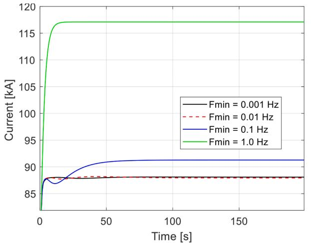  
Fig. 4. Sending-end current of second conductor.

Table 3 effect of change in curve-fit starting frequency.   

<table><tr><td>Fmin (Hz)</td><td>Order</td><td>Residue/pole ratio</td><td>dc value of short circuit current</td></tr><tr><td>1</td><td>26</td><td>1.138</td><td>117.08</td></tr><tr><td>0.1</td><td>33</td><td>1.2401</td><td>91.28</td></tr><tr><td>0.01</td><td>29</td><td>1.3352</td><td>87.92</td></tr><tr><td>0.001</td><td>30</td><td>1.2434</td><td>88.08</td></tr></table>

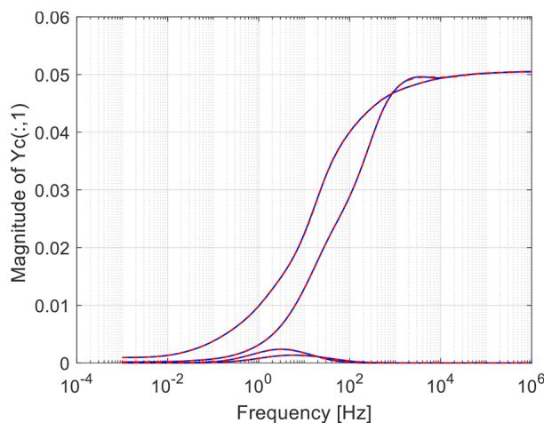  
Fig. 5. Magnitude of $\mathtt { Y } _ { \mathrm { c } } ( \mathsf { s } )$ as a function of frequency (dotted curve: approxi mated function, solid curve: actual function).

100 kV dc voltage and all other conductors are grounded via 1mΩ resistance. The default curve-fitting parameters are shown in Table 2.

Fig. 4 shows the sending-end current of energized conductor without dc correction and depending on the selection of curve-fitting starting frequency, the dc value of current can be noticeably different from the theoretical calculation (88 kA).

Table 3 compares the order of approximation, largest residue/pole ratio and dc value of short circuit current for A(s).

The dc correction method with curve-fitting starting frequency of 1 mHz is applied in the cable model. The comparisons between actual and curve-fitted curves in frequency domain are shown in Fig. 5, 6 and 7. The solid and dotted curves represent actual and curve-fitted characteristics respectively. The first column of $\mathtt { Y } _ { \mathrm { c } } ( \mathsf { s } )$ is shown in Fig. 5 verifying the accuracy with proposed dc correction method.

The comparison of A(s) at very low frequencies (from 1 mHz to 100 Hz) is shown in Fig. 6 and the characteristics of A(s) for the entire

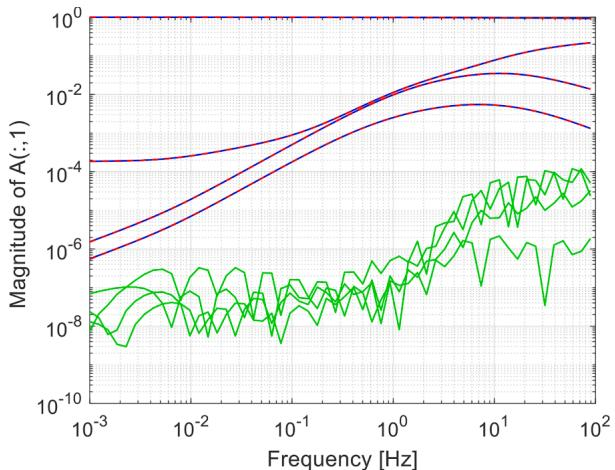  
Fig. 6. Magnitude of fist column of A(s) at very low frequencies (dotted curve: approximated function, solid curve: actual function, green curve: error).

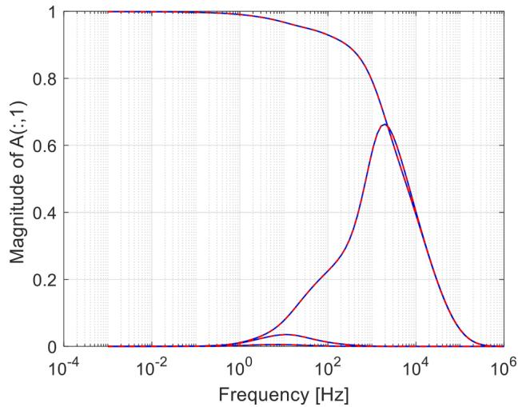  
Fig. 7. Magnitude of fist column of A(s) for entire frequency range (1 MHz to 1 MHz; dotted curve: approximated function, solid curve: actual function).

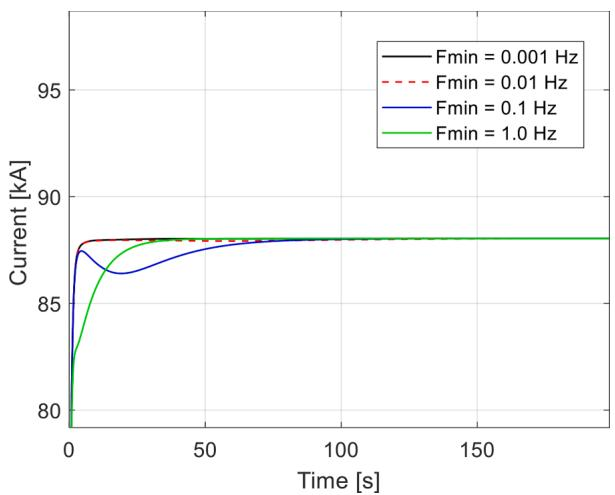  
Fig. 8. Sending-end current with dc correction.

frequency range is shown in Fig. 7. The accuracy of A(s) is enforced with dc correction for the entire frequency range including very low frequencies.

Fig. 8 shows the sending-end current with dc correction. The

Table 4 effect of change in curve-fit starting frequency.   

<table><tr><td>Hz</td><td>Order of A(s)</td><td>Order of A(s) with order reduction</td><td>Residue/pole ratio</td><td>dc value of short circuit current</td></tr><tr><td>1</td><td>28</td><td>26</td><td>1.3424</td><td>88.04</td></tr><tr><td>0.1</td><td>33</td><td>29</td><td>1.8475</td><td>88.04</td></tr><tr><td>0.01</td><td>40</td><td>33</td><td>1.2344</td><td>88.04</td></tr><tr><td>0.001</td><td>36</td><td>30</td><td>1.2736</td><td>88.04</td></tr></table>

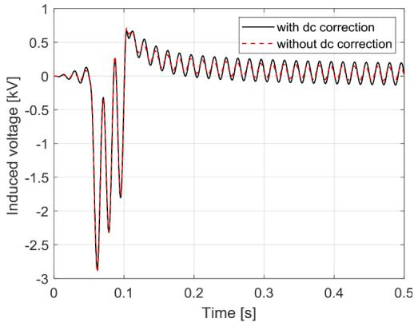  
Fig. 9. Induced voltage of second conductor for an open circuit test with and without dc correction.

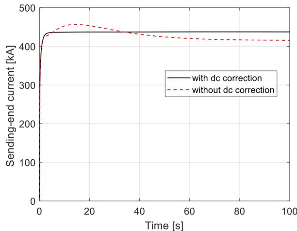  
Fig. 10. Sending-end current with and without dc correction for short line.

Table 5 Transmission line Data.   

<table><tr><td>Outer radius of conductor</td><td>0.0203454 m</td></tr><tr><td>DC resistance of conductor</td><td>0.03206 ohm/km</td></tr><tr><td>Sag</td><td>10 m</td></tr><tr><td>Number of sub-conductors</td><td>2</td></tr><tr><td>Distance between sub-conductors</td><td>0.4572</td></tr><tr><td>Outer radius of ground wire</td><td>0.0055245 m</td></tr><tr><td>DC resistance of ground wire</td><td>2.8645 ohm/km</td></tr></table>

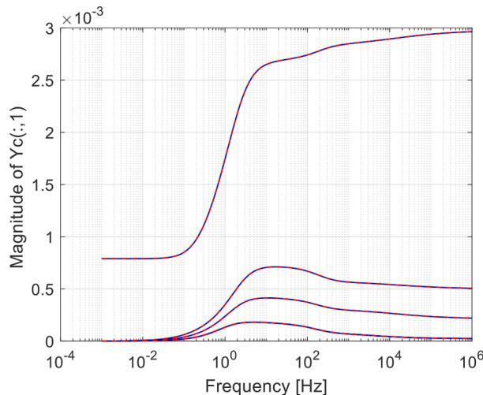  
Fig. 12. Magnitude of Yc(s) as a function of frequency (dotted curve: approximated function, solid curve: actual function).

sending-end current approaches to the correct dc value regardless of the selection of lower bound for fitting. However, if the lower bound is selected as a 1 mHz or 10 mHz, a better dc response can be seen. For 1 Hz and 0.1 Hz, a noticeable transient behavior can be seen between 0 to 50 sec.

Table 4 summaries the parameters of A(s). Compared with Table III, regardless of curve-fitting starting frequency, the dc value is guaranteed. The order of the propagation function is further reduced as described in section III(D).

Fig. 9 shows the induced voltage of second conductor for an open circuit test with and without dc correction. The sending-end is energized with 100 kV AC source and a fault is applied at 0.05 sec to the receivingend terminal and all other conductors are open. The fault duration is 0.05s. It is evident that the accuracy at high frequencies does not change with the dc correction.

Fig. 10 compares the short circuit current with and without dc correction for the same cable, but the length is changed to 20 km. The

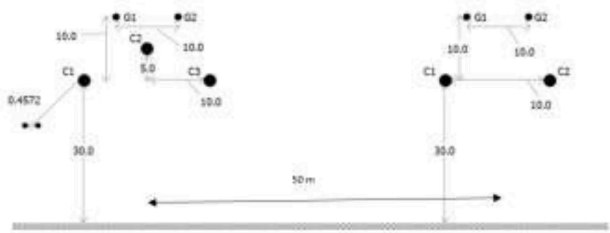  
Fig. 11. AC and DC parallel transmission line system.

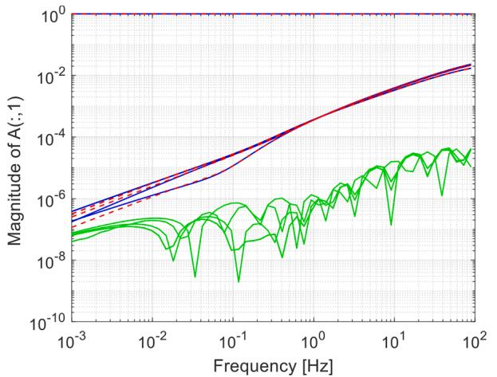  
Fig. 13. Magnitude of fist column of A(s) at very low frequencies (dotted curve: approximated function, solid curve: actual function, green curve: error).

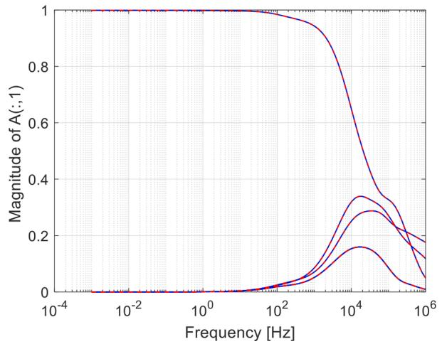  
Fig. 14. Magnitude of fist column of A(s) for entire frequency range (1 mHz to 1 MHz; dotted curve: approximated function, solid curve: actual function).

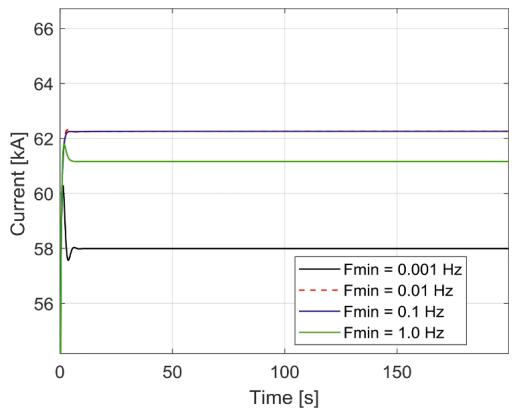  
Fig. 15. Sending end current without dc correction.

lower bound is set to 0.001 Hz for both cases. Without dc correction, an initial overshooting of sending-end current can be observed, and the current did not converge to the correct dc value. With dc correction, the proper dc response can be achieved. Therefore, by merely reducing the lower bound of fitting, a good dc response cannot be achieved for all scenarios.

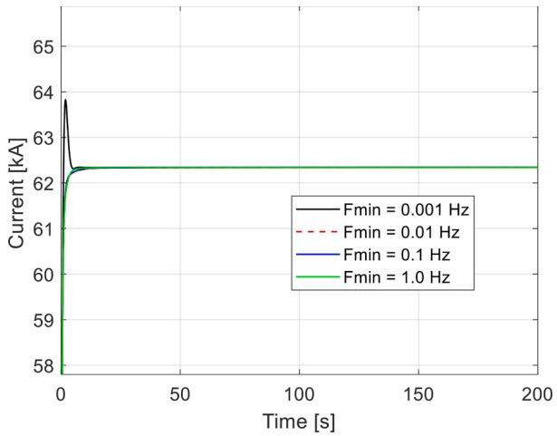  
Fig. 16. Sending-end current with dc correction.

# 4.2. AC and DC parallel overhead line example

A 100km long parallel AC and DC overhead line configuration is shown in Fig. 11 with data for both AC and DC towers in Table 5. The ground resistivity is assumed 100 Ωm.

As shown in Fig. 12-14, the rational function approximations of both ${ \mathrm { Y } } _ { \mathrm { c } } ( s )$ and A(s) are satisfactory for the entire frequency range.

A short circuit test is performed to verify the validity of the dc correction method. The second conductor of the dc line is energized with a dc voltage and all other conductors are connected to the ground via a small resistor (1 mΩ). Without dc correction, the sending-end current is not always converged to the exact dc value (62 kA) depending on the selection of curve-fitting starting frequency (see Fig. 15). However, with dc correction, the exact dc value is guaranteed irrespective of the selection of the curve-fitting starting frequency as shown in Fig. 16. Also, a better dc response can be obtained if the curve-fitting starting frequency is selected as 1 mHz or 10 mHz.

The dc response of a cable may vary depending on curve-fitting parameter options, complexity of cable system and many other factors. In general, it is not always possible to obtain a good dc response by simply reducing the lower bound of curve-fitting. However, the proposed dc correction method (with 1 mHz lower bound for curve-fitting) always ensures consistent accurate dc response.

# 5. Conclusions

The proposed dc correction method enforces the exact dc values irrespective of the curve-fitting error. With suitable curve-fitting starting frequency (0.001 Hz or 0.01 Hz) the dc correction method guarantees a better dc response for cables and overhead lines.

The modified residue calculation procedure for A(s) and ${ \mathrm { Y } } _ { \mathrm { c } } ( s )$ confirms exact dc value. The proposed weighting function enhances the accuracy of frequency dependent characteristics at low frequencies. The order of the propagation function is reduced to decrease the computational effort. For any EMT software, this method can be easily implemented in existing frequency dependent transmission line models such as ULM.

# CRediT authorship contribution statement

H.M.J. De Silva, Development or design of methodology; creation of models, Writing- Original draft preparation. Z Liu Writing- Reviewing and Editing(Fig. 13)

# Declaration of Competing Interest

The authors declare that they have no known competing financial interests or personal relationships that could have appeared to influence the work reported in this paper.

# Data availability

Data will be made available on request.

# References

[1] A. Morched, B. Gustavsen, M. Tartibi, A universal line model for accurate calculation of electromagnetic transients on overhead lines and cables, IEEE Trans. Power Del. 14 (3) (1999) 1032–1038. Jul.   
[2] H.M.J. De Silva, A.M. Gole, L.M. Wedepohl, Accurate electromagnetic transient simulations of HVDC cables and overhead transmission lines, in: Proceedings IPST-2007, Lyon, France, 2007. June.

[3] M. Cervantes, I. Kocar, J. Mahseredjian, A. Ramirez, Partitioned Fitting and DC Correction for the Simulation of Electromagnetic Transients in Transmission Lines/ Cables, IEEE Trans, on Power Del 33 (2018) 3246–3248.   
[4] A. Ramirez, R. Iravani, Enhanced fitting to obtain an accurate dc response of transmission lines in the analysis of electromagnetic transients, IEEE Trans. Power Del. 29 (6) (2014) 2614–2621. Dec.   
[5] B. Gustavsen, Avoiding Numerical Instabilities in the Universal Line Model by a Two-Segment Interpolation Scheme, IEEE Trans. on Power Del 28 (2013) 1643–1651. Jul.   
[6] B. Gustavsen, A. Semlyen, Simulation of transmission line transients using Vector fitting and modal decomposition, IEEE Transactions on Power Delivery 13 (2) (1998). April.   
[7] L.M Wedepohl, Application of Matrix Methods to the Solution of Traveling Wave Phenomena in Polyphase Systems, Proc IEE 110 (1963) 2200–2212.   
[8] Bjorn Gustavsen, Adam Semlyen, Rational Approximation of Frequency Domain Responses by Vector Fitting, IEEE Transactions on Power Delivery 14 (3) (1999). July.   
[9] L.M Wedepohl, D.J. Wilcox, Transient Analysis of Underground Power Transmission Systems, in: Proc. IEE 120, 1973. February.   
[10] S.A Schelkunoff, The electromagnetic theory of coaxial transmission lines and cylindrical sheaths, in: the bell system technical journal XIII, 1934.